# Chapter 2 / Section 2.51: Import of Metallic Waste and Scrap

**Chapter Title:** General Provisions Regarding Imports and Exports

**Pages:** 20, 21, 22, 23

**Purpose:** 2.51 Import of Metallic Waste and Scrap
Import of any form of metallic waste, scrap will be subject to the condition that it will
not contain hazardous, toxic waste, radioactive contaminated waste / scrap containing
radioactive material, any type of arms, ammunition, mines, shells, live or used
cartridge or any other explosive material in any form either used or otherwise.

**Purpose Thanglish:** Indha Import of Metallic Waste and Scrap section-la, 2.51 import of Metallic Waste and Scrap
import of any form of metallic waste, scrap will be subject to the condition that it will
not contain hazardous, toxic waste, radioactive contaminated waste / scrap containing
radioactive material, any type of arms, ammunition, mines, shells, live or used
cartridge or any other explosive material in any form either used or otherwise.

**Summary:** 2.51 Import of Metallic Waste and Scrap
Import of any form of metallic waste, scrap will be subject to the condition that it will
not contain hazardous, toxic waste, radioactive contaminated waste / scrap containing
radioactive material, any type of arms, ammunition, mines, shells, live or used
cartridge or any other explosive material in any form either used or otherwise. (a) Import of following types of metallic waste and scrap will be free subject to
conditions detailed below:
Sl. No.

**Business Meaning:** Import of Metallic Waste and Scrap governs how DGFT business controls should be applied, validated, and enforced.

**Business Explanation:** Import of Metallic Waste and Scrap explains the operating rule set that DEKAI should enforce. Key control points include 2.51 Import of Metallic Waste and Scrap
Import of any form of metallic waste, scrap will be subject to the condition that it will
not contain hazardous, toxic waste, radioactive contaminated waste / scrap containing
radioactive material, any type of arms, ammunition, mines, shells, live or used
cartridge or any other explosive material in any form either used or otherwise. The section also drives actions such as 81042010 Magnesium scrap
(b) ‘Freely’ Importable metallic waste and scraps (shredded) as listed above shall
be permitted through all ports of India subject to following conditions:
(i) At the time of the clearance of goods, importer shall furnish to the Customs
pre-shipment inspection certificate as per the format to Appendix 2H from
any of the Inspection & Certification agencies given in Appendix-2G, to the
effect that the consignment was checked for radiation level and scrap does
not contain radiation level (gamma and neutron) in excess of natural
background..

**Business Explanation Thanglish:** Indha Import of Metallic Waste and Scrap section-la, import of Metallic Waste and Scrap explains the operating rule set that DEKAI should enforce. Key control points include 2.51 import of Metallic Waste and Scrap
import of any form of metallic waste, scrap will be subject to the condition that it will
not contain hazardous, toxic waste, radioactive contaminated waste / scrap containing
radioactive material, any type of arms, ammunition, mines, shells, live or used
cartridge or any other explosive material in any form either used or otherwise. The section also drives actions such as 81042010 Magnesium scrap
(b) ‘Freely’ Importable metallic waste and scraps (shredded) as listed above kandippa
be permitted through all ports of India subject to following conditions:
(i) At the time of the clearance of goods, importer kandippa furnish to the Customs
pre-shipment inspection certificate as per the format to Appendix 2H from
any of the Inspection & Certification agencies given in Appendix-2G, to the
effect that the consignment was checked for radiation level and scrap does
not contain radiation level (gamma and neutron) in excess of natural
background..

## Business Logic
- 2.51 Import of Metallic Waste and Scrap
Import of any form of metallic waste, scrap will be subject to the condition that it will
not contain hazardous, toxic waste, radioactive contaminated waste / scrap containing
radioactive material, any type of arms, ammunition, mines, shells, live or used
cartridge or any other explosive material in any form either used or otherwise.
- (a) Import of following types of metallic waste and scrap will be free subject to
conditions detailed below:
Sl.
- However, re-export shall be subject to all conditionality, or
requirement of licence, or permission, as may be required under Schedule II of
ITC (HS).
- (a)
Import of following types of metallic waste and scrap will be free subject to
conditions detailed below:
Sl.
- 81042010 Magnesium scrap
(b) ‘Freely’ Importable metallic waste and scraps (shredded) as listed above shall
be permitted through all ports of India subject to following conditions:
(i) At the time of the clearance of goods, importer shall furnish to the Customs
pre-shipment inspection certificate as per the format to Appendix 2H from
any of the Inspection & Certification agencies given in Appendix-2G, to the
effect that the consignment was checked for radiation level and scrap does
not contain radiation level (gamma and neutron) in excess of natural
background.
- The certificate shall give the value of background radiation
level at that place as also the maximum radiation level on the scrap; and
(ii) Importer shall also furnish copy of the contract with the exporter
stipulating that the consignment does not contain any radioactive
contaminated material in any form.
- (d) Import of un-shredded compressed and loose form of metallic waste, scrap listed
in paragraph 2.51(a) above in shall be subject to the following conditions:
-
(i) At the time of the clearance of goods, importer shall furnish to the
Customs pre-shipment inspection certificate as per the format in
Appendix 2H from any of the Inspection& Certification agencies given in
Appendix-2G to the effect that the consignment does not contain any type
of arms, ammunition, mines, shells, cartridges, or any other explosive
material in any form either used or otherwise, and that the consignment
was checked for radiation level and it does not contain radiation level
(gamma and neutron) in excess of natural background.
- The certificate
shall give the value of background radiation level at that place as also the
maximum radiation level on the scrap.
- 81042010 Magnesium scrap
(b)
‘Freely’ Importable metallic waste and scraps (shredded) as listed above shall
be permitted through all ports of India subject to following conditions:
(i)
At the time of the clearance of goods, importer shall furnish to the Customs
pre-shipment inspection certificate as per the format to Appendix 2H from
any of the Inspection & Certification agencies given in Appendix-2G, to the
effect that the consignment was checked for radiation level and scrap does
not contain radiation level (gamma and neutron) in excess of natural
background.
- The certificate shall give the value of background radiation
level at that place as also the maximum radiation level on the scrap; and
(ii)
Importer shall also furnish copy of the contract with the exporter
stipulating that the consignment does not contain any radioactive
contaminated material in any form.
- (d)
Import of un-shredded compressed and loose form of metallic waste, scrap listed
in paragraph 2.51(a) above in shall be subject to the following conditions:
-
(i)
At the time of the clearance of goods, importer shall furnish to the
Customs pre-shipment inspection certificate as per the format in
Appendix 2H from any of the Inspection& Certification agencies given in
Appendix-2G to the effect that the consignment does not contain any type
of arms, ammunition, mines, shells, cartridges, or any other explosive
material in any form either used or otherwise, and that the consignment
was checked for radiation level and it does not contain radiation level
(gamma and neutron) in excess of natural background.
- (v) Only entry sea ports will be designated and notified for import of un-
shredded Metallic Waste and Scrap subject to the following:
(i) Any sea port to be designated for import of un–shredded metallic
scrap will be required to install Radiation Portal Monitors and
Container Scanner with adequate security.
- The sea port having
completed the above shall approach jurisdictional Customs for
inspection and certification.
- (ii) The existing designated sea ports namely Chennai, Cochin, Ennore,
JNPT, Kandla, Mormugao, Mumbai, New Mangalore, Paradeep,
Tuticorin, Vishakhapatnam, Pipava, Mundra and Kolkata will be
allowed to import un-shredded scrap till 30.09.2021 by which time
they are required to install and operationalize Radiation Portal
Monitors and Container Scanner.
- (iv) Import consignments of metallic waste and scrap shall be subject to
pre-shipment inspection certificate (PSIC) from the country of
origin.
- (v) Only entry sea ports will be designated and notified for import of un-
shredded Metallic Waste and Scrap subject to the following:
(i)
Any sea port to be designated for import of un–shredded metallic
scrap will be required to install Radiation Portal Monitors and
Container Scanner with adequate security.
- (ii)
The existing designated sea ports namely Chennai, Cochin, Ennore,
JNPT, Kandla, Mormugao, Mumbai, New Mangalore, Paradeep,
Tuticorin, Vishakhapatnam, Pipava, Mundra and Kolkata will be
allowed to import un-shredded scrap till 30.09.2021 by which time
they are required to install and operationalize Radiation Portal
Monitors and Container Scanner.
- (iv)
Import consignments of metallic waste and scrap shall be subject to
pre-shipment inspection certificate (PSIC) from the country of
origin.
- These will however be subject to radiation
and explosive checks through portal monitors and container
scanner at these ports.
- Import through remaining
eight (8) other ports (for both shredded and unshredded scrap /
waste), irrespective of country of origin, will be subject to PSIC.

## Business Rules
- rule_id=CH2-SEC2_51-R001, rule_description=2.51 Import of Metallic Waste and Scrap
Import of any form of metallic waste, scrap will be subject to the condition that it will
not contain hazardous, toxic waste, radioactive contaminated waste / scrap containing
radioactive material, any type of arms, ammunition, mines, shells, live or used
cartridge or any other explosive material in any form either used or otherwise., trigger=Import of Metallic Waste and Scrap, condition=2.51 Import of Metallic Waste and Scrap
Import of any form of metallic waste, scrap will be subject to the condition that it will
not contain hazardous, toxic waste, radioactive contaminated waste / scrap containing
radioactive material, any type of arms, ammunition, mines, shells, live or used
cartridge or any other explosive material in any form either used or otherwise., validation=No permission for transfer will be required in case the imported goods are re-
exported., action=81042010 Magnesium scrap
(b) ‘Freely’ Importable metallic waste and scraps (shredded) as listed above shall
be permitted through all ports of India subject to following conditions:
(i) At the time of the clearance of goods, importer shall furnish to the Customs
pre-shipment inspection certificate as per the format to Appendix 2H from
any of the Inspection & Certification agencies given in Appendix-2G, to the
effect that the consignment was checked for radiation level and scrap does
not contain radiation level (gamma and neutron) in excess of natural
background., exception=However, re-export shall be subject to all conditionality, or
requirement of licence, or permission, as may be required under Schedule II of
ITC (HS)., output=DEKAI should produce a compliance decision for 2.51 - Import of Metallic Waste and Scrap.
- rule_id=CH2-SEC2_51-R002, rule_description=(a) Import of following types of metallic waste and scrap will be free subject to
conditions detailed below:
Sl., trigger=Import of Metallic Waste and Scrap, condition=(a) Import of following types of metallic waste and scrap will be free subject to
conditions detailed below:
Sl., validation=However, re-export shall be subject to all conditionality, or
requirement of licence, or permission, as may be required under Schedule II of
ITC (HS)., action=The certificate shall give the value of background radiation
level at that place as also the maximum radiation level on the scrap; and
(ii) Importer shall also furnish copy of the contract with the exporter
stipulating that the consignment does not contain any radioactive
contaminated material in any form., exception=(iv) Import of scrap would take place only through following designated
ports and no exceptions would be allowed even in case of EOUs, SEZs: -
1., output=DEKAI should produce a compliance decision for 2.51 - Import of Metallic Waste and Scrap.
- rule_id=CH2-SEC2_51-R003, rule_description=However, re-export shall be subject to all conditionality, or
requirement of licence, or permission, as may be required under Schedule II of
ITC (HS)., trigger=Import of Metallic Waste and Scrap, condition=| 79020010 | Zinc scrap
(d)
Such imported goods may be transferred after 2 years with permission of DGFT., validation=81042010 Magnesium scrap
(b) ‘Freely’ Importable metallic waste and scraps (shredded) as listed above shall
be permitted through all ports of India subject to following conditions:
(i) At the time of the clearance of goods, importer shall furnish to the Customs
pre-shipment inspection certificate as per the format to Appendix 2H from
any of the Inspection & Certification agencies given in Appendix-2G, to the
effect that the consignment was checked for radiation level and scrap does
not contain radiation level (gamma and neutron) in excess of natural
background., action=(d) Import of un-shredded compressed and loose form of metallic waste, scrap listed
in paragraph 2.51(a) above in shall be subject to the following conditions:
-
(i) At the time of the clearance of goods, importer shall furnish to the
Customs pre-shipment inspection certificate as per the format in
Appendix 2H from any of the Inspection& Certification agencies given in
Appendix-2G to the effect that the consignment does not contain any type
of arms, ammunition, mines, shells, cartridges, or any other explosive
material in any form either used or otherwise, and that the consignment
was checked for radiation level and it does not contain radiation level
(gamma and neutron) in excess of natural background., exception=However, metallic waste and scrap (both shredded and
pg., output=DEKAI should produce a compliance decision for 2.51 - Import of Metallic Waste and Scrap.
- rule_id=CH2-SEC2_51-R004, rule_description=(a)
Import of following types of metallic waste and scrap will be free subject to
conditions detailed below:
Sl., trigger=Import of Metallic Waste and Scrap, condition=No permission for transfer will be required in case the imported goods are re-
exported., validation=The certificate shall give the value of background radiation
level at that place as also the maximum radiation level on the scrap; and
(ii) Importer shall also furnish copy of the contract with the exporter
stipulating that the consignment does not contain any radioactive
contaminated material in any form., action=81042010 Magnesium scrap
(b)
‘Freely’ Importable metallic waste and scraps (shredded) as listed above shall
be permitted through all ports of India subject to following conditions:
(i)
At the time of the clearance of goods, importer shall furnish to the Customs
pre-shipment inspection certificate as per the format to Appendix 2H from
any of the Inspection & Certification agencies given in Appendix-2G, to the
effect that the consignment was checked for radiation level and scrap does
not contain radiation level (gamma and neutron) in excess of natural
background., exception=(iv)
Import of scrap would take place only through following designated
ports and no exceptions would be allowed even in case of EOUs, SEZs: -
1., output=DEKAI should produce a compliance decision for 2.51 - Import of Metallic Waste and Scrap.
- rule_id=CH2-SEC2_51-R005, rule_description=81042010 Magnesium scrap
(b) ‘Freely’ Importable metallic waste and scraps (shredded) as listed above shall
be permitted through all ports of India subject to following conditions:
(i) At the time of the clearance of goods, importer shall furnish to the Customs
pre-shipment inspection certificate as per the format to Appendix 2H from
any of the Inspection & Certification agencies given in Appendix-2G, to the
effect that the consignment was checked for radiation level and scrap does
not contain radiation level (gamma and neutron) in excess of natural
background., trigger=Import of Metallic Waste and Scrap, condition=However, re-export shall be subject to all conditionality, or
requirement of licence, or permission, as may be required under Schedule II of
ITC (HS)., validation=(d) Import of un-shredded compressed and loose form of metallic waste, scrap listed
in paragraph 2.51(a) above in shall be subject to the following conditions:
-
(i) At the time of the clearance of goods, importer shall furnish to the
Customs pre-shipment inspection certificate as per the format in
Appendix 2H from any of the Inspection& Certification agencies given in
Appendix-2G to the effect that the consignment does not contain any type
of arms, ammunition, mines, shells, cartridges, or any other explosive
material in any form either used or otherwise, and that the consignment
was checked for radiation level and it does not contain radiation level
(gamma and neutron) in excess of natural background., action=The certificate shall give the value of background radiation
level at that place as also the maximum radiation level on the scrap; and
(ii)
Importer shall also furnish copy of the contract with the exporter
stipulating that the consignment does not contain any radioactive
contaminated material in any form., exception=These will however be subject to radiation
and explosive checks through portal monitors and container
scanner at these ports., output=DEKAI should produce a compliance decision for 2.51 - Import of Metallic Waste and Scrap.
- rule_id=CH2-SEC2_51-R006, rule_description=The certificate shall give the value of background radiation
level at that place as also the maximum radiation level on the scrap; and
(ii) Importer shall also furnish copy of the contract with the exporter
stipulating that the consignment does not contain any radioactive
contaminated material in any form., trigger=Import of Metallic Waste and Scrap, condition=(a)
Import of following types of metallic waste and scrap will be free subject to
conditions detailed below:
Sl., validation=The certificate
shall give the value of background radiation level at that place as also the
maximum radiation level on the scrap., action=(d)
Import of un-shredded compressed and loose form of metallic waste, scrap listed
in paragraph 2.51(a) above in shall be subject to the following conditions:
-
(i)
At the time of the clearance of goods, importer shall furnish to the
Customs pre-shipment inspection certificate as per the format in
Appendix 2H from any of the Inspection& Certification agencies given in
Appendix-2G to the effect that the consignment does not contain any type
of arms, ammunition, mines, shells, cartridges, or any other explosive
material in any form either used or otherwise, and that the consignment
was checked for radiation level and it does not contain radiation level
(gamma and neutron) in excess of natural background., exception=These will however be subject to radiation
and explosive checks through portal monitors and container
scanner at these ports., output=DEKAI should produce a compliance decision for 2.51 - Import of Metallic Waste and Scrap.
- rule_id=CH2-SEC2_51-R007, rule_description=(d) Import of un-shredded compressed and loose form of metallic waste, scrap listed
in paragraph 2.51(a) above in shall be subject to the following conditions:
-
(i) At the time of the clearance of goods, importer shall furnish to the
Customs pre-shipment inspection certificate as per the format in
Appendix 2H from any of the Inspection& Certification agencies given in
Appendix-2G to the effect that the consignment does not contain any type
of arms, ammunition, mines, shells, cartridges, or any other explosive
material in any form either used or otherwise, and that the consignment
was checked for radiation level and it does not contain radiation level
(gamma and neutron) in excess of natural background., trigger=Import of Metallic Waste and Scrap, condition=81042010 Magnesium scrap
(b) ‘Freely’ Importable metallic waste and scraps (shredded) as listed above shall
be permitted through all ports of India subject to following conditions:
(i) At the time of the clearance of goods, importer shall furnish to the Customs
pre-shipment inspection certificate as per the format to Appendix 2H from
any of the Inspection & Certification agencies given in Appendix-2G, to the
effect that the consignment was checked for radiation level and scrap does
not contain radiation level (gamma and neutron) in excess of natural
background., validation=(ii) The imported item (s) is actually a metallic waste/ scrap /seconds
/defective as per the internationally accepted parameters for such a
classification., action=(d)
Import of un-shredded compressed and loose form of metallic waste, scrap listed
in paragraph 2.51(a) above in shall be subject to the following conditions:
-
(i)
At the time of the clearance of goods, importer shall furnish to the
Customs pre-shipment inspection certificate as per the format in
Appendix 2H from any of the Inspection& Certification agencies given in
Appendix-2G to the effect that the consignment does not contain any type
of arms, ammunition, mines, shells, cartridges, or any other explosive
material in any form either used or otherwise, and that the consignment
was checked for radiation level and it does not contain radiation level
(gamma and neutron) in excess of natural background., exception=These will however be subject to radiation
and explosive checks through portal monitors and container
scanner at these ports., output=DEKAI should produce a compliance decision for 2.51 - Import of Metallic Waste and Scrap.
- rule_id=CH2-SEC2_51-R008, rule_description=The certificate
shall give the value of background radiation level at that place as also the
maximum radiation level on the scrap., trigger=Import of Metallic Waste and Scrap, condition=The certificate shall give the value of background radiation
level at that place as also the maximum radiation level on the scrap; and
(ii) Importer shall also furnish copy of the contract with the exporter
stipulating that the consignment does not contain any radioactive
contaminated material in any form., validation=81042010 Magnesium scrap
(b)
‘Freely’ Importable metallic waste and scraps (shredded) as listed above shall
be permitted through all ports of India subject to following conditions:
(i)
At the time of the clearance of goods, importer shall furnish to the Customs
pre-shipment inspection certificate as per the format to Appendix 2H from
any of the Inspection & Certification agencies given in Appendix-2G, to the
effect that the consignment was checked for radiation level and scrap does
not contain radiation level (gamma and neutron) in excess of natural
background., action=(d)
Import of un-shredded compressed and loose form of metallic waste, scrap listed
in paragraph 2.51(a) above in shall be subject to the following conditions:
-
(i)
At the time of the clearance of goods, importer shall furnish to the
Customs pre-shipment inspection certificate as per the format in
Appendix 2H from any of the Inspection& Certification agencies given in
Appendix-2G to the effect that the consignment does not contain any type
of arms, ammunition, mines, shells, cartridges, or any other explosive
material in any form either used or otherwise, and that the consignment
was checked for radiation level and it does not contain radiation level
(gamma and neutron) in excess of natural background., exception=These will however be subject to radiation
and explosive checks through portal monitors and container
scanner at these ports., output=DEKAI should produce a compliance decision for 2.51 - Import of Metallic Waste and Scrap.
- rule_id=CH2-SEC2_51-R009, rule_description=81042010 Magnesium scrap
(b)
‘Freely’ Importable metallic waste and scraps (shredded) as listed above shall
be permitted through all ports of India subject to following conditions:
(i)
At the time of the clearance of goods, importer shall furnish to the Customs
pre-shipment inspection certificate as per the format to Appendix 2H from
any of the Inspection & Certification agencies given in Appendix-2G, to the
effect that the consignment was checked for radiation level and scrap does
not contain radiation level (gamma and neutron) in excess of natural
background., trigger=Import of Metallic Waste and Scrap, condition=(d) Import of un-shredded compressed and loose form of metallic waste, scrap listed
in paragraph 2.51(a) above in shall be subject to the following conditions:
-
(i) At the time of the clearance of goods, importer shall furnish to the
Customs pre-shipment inspection certificate as per the format in
Appendix 2H from any of the Inspection& Certification agencies given in
Appendix-2G to the effect that the consignment does not contain any type
of arms, ammunition, mines, shells, cartridges, or any other explosive
material in any form either used or otherwise, and that the consignment
was checked for radiation level and it does not contain radiation level
(gamma and neutron) in excess of natural background., validation=The certificate shall give the value of background radiation
level at that place as also the maximum radiation level on the scrap; and
(ii)
Importer shall also furnish copy of the contract with the exporter
stipulating that the consignment does not contain any radioactive
contaminated material in any form., action=(d)
Import of un-shredded compressed and loose form of metallic waste, scrap listed
in paragraph 2.51(a) above in shall be subject to the following conditions:
-
(i)
At the time of the clearance of goods, importer shall furnish to the
Customs pre-shipment inspection certificate as per the format in
Appendix 2H from any of the Inspection& Certification agencies given in
Appendix-2G to the effect that the consignment does not contain any type
of arms, ammunition, mines, shells, cartridges, or any other explosive
material in any form either used or otherwise, and that the consignment
was checked for radiation level and it does not contain radiation level
(gamma and neutron) in excess of natural background., exception=These will however be subject to radiation
and explosive checks through portal monitors and container
scanner at these ports., output=DEKAI should produce a compliance decision for 2.51 - Import of Metallic Waste and Scrap.
- rule_id=CH2-SEC2_51-R010, rule_description=The certificate shall give the value of background radiation
level at that place as also the maximum radiation level on the scrap; and
(ii)
Importer shall also furnish copy of the contract with the exporter
stipulating that the consignment does not contain any radioactive
contaminated material in any form., trigger=Import of Metallic Waste and Scrap, condition=The certificate
shall give the value of background radiation level at that place as also the
maximum radiation level on the scrap., validation=(d)
Import of un-shredded compressed and loose form of metallic waste, scrap listed
in paragraph 2.51(a) above in shall be subject to the following conditions:
-
(i)
At the time of the clearance of goods, importer shall furnish to the
Customs pre-shipment inspection certificate as per the format in
Appendix 2H from any of the Inspection& Certification agencies given in
Appendix-2G to the effect that the consignment does not contain any type
of arms, ammunition, mines, shells, cartridges, or any other explosive
material in any form either used or otherwise, and that the consignment
was checked for radiation level and it does not contain radiation level
(gamma and neutron) in excess of natural background., action=(d)
Import of un-shredded compressed and loose form of metallic waste, scrap listed
in paragraph 2.51(a) above in shall be subject to the following conditions:
-
(i)
At the time of the clearance of goods, importer shall furnish to the
Customs pre-shipment inspection certificate as per the format in
Appendix 2H from any of the Inspection& Certification agencies given in
Appendix-2G to the effect that the consignment does not contain any type
of arms, ammunition, mines, shells, cartridges, or any other explosive
material in any form either used or otherwise, and that the consignment
was checked for radiation level and it does not contain radiation level
(gamma and neutron) in excess of natural background., exception=These will however be subject to radiation
and explosive checks through portal monitors and container
scanner at these ports., output=DEKAI should produce a compliance decision for 2.51 - Import of Metallic Waste and Scrap.
- rule_id=CH2-SEC2_51-R011, rule_description=(d)
Import of un-shredded compressed and loose form of metallic waste, scrap listed
in paragraph 2.51(a) above in shall be subject to the following conditions:
-
(i)
At the time of the clearance of goods, importer shall furnish to the
Customs pre-shipment inspection certificate as per the format in
Appendix 2H from any of the Inspection& Certification agencies given in
Appendix-2G to the effect that the consignment does not contain any type
of arms, ammunition, mines, shells, cartridges, or any other explosive
material in any form either used or otherwise, and that the consignment
was checked for radiation level and it does not contain radiation level
(gamma and neutron) in excess of natural background., trigger=Import of Metallic Waste and Scrap, condition=(ii) The imported item (s) is actually a metallic waste/ scrap /seconds
/defective as per the internationally accepted parameters for such a
classification., validation=(ii)
The imported item (s) is actually a metallic waste/ scrap /seconds
/defective as per the internationally accepted parameters for such a
classification., action=(d)
Import of un-shredded compressed and loose form of metallic waste, scrap listed
in paragraph 2.51(a) above in shall be subject to the following conditions:
-
(i)
At the time of the clearance of goods, importer shall furnish to the
Customs pre-shipment inspection certificate as per the format in
Appendix 2H from any of the Inspection& Certification agencies given in
Appendix-2G to the effect that the consignment does not contain any type
of arms, ammunition, mines, shells, cartridges, or any other explosive
material in any form either used or otherwise, and that the consignment
was checked for radiation level and it does not contain radiation level
(gamma and neutron) in excess of natural background., exception=These will however be subject to radiation
and explosive checks through portal monitors and container
scanner at these ports., output=DEKAI should produce a compliance decision for 2.51 - Import of Metallic Waste and Scrap.
- rule_id=CH2-SEC2_51-R012, rule_description=(v) Only entry sea ports will be designated and notified for import of un-
shredded Metallic Waste and Scrap subject to the following:
(i) Any sea port to be designated for import of un–shredded metallic
scrap will be required to install Radiation Portal Monitors and
Container Scanner with adequate security., trigger=Import of Metallic Waste and Scrap, condition=81042010 Magnesium scrap
(b)
‘Freely’ Importable metallic waste and scraps (shredded) as listed above shall
be permitted through all ports of India subject to following conditions:
(i)
At the time of the clearance of goods, importer shall furnish to the Customs
pre-shipment inspection certificate as per the format to Appendix 2H from
any of the Inspection & Certification agencies given in Appendix-2G, to the
effect that the consignment was checked for radiation level and scrap does
not contain radiation level (gamma and neutron) in excess of natural
background., validation=(v) Only entry sea ports will be designated and notified for import of un-
shredded Metallic Waste and Scrap subject to the following:
(i) Any sea port to be designated for import of un–shredded metallic
scrap will be required to install Radiation Portal Monitors and
Container Scanner with adequate security., action=(d)
Import of un-shredded compressed and loose form of metallic waste, scrap listed
in paragraph 2.51(a) above in shall be subject to the following conditions:
-
(i)
At the time of the clearance of goods, importer shall furnish to the
Customs pre-shipment inspection certificate as per the format in
Appendix 2H from any of the Inspection& Certification agencies given in
Appendix-2G to the effect that the consignment does not contain any type
of arms, ammunition, mines, shells, cartridges, or any other explosive
material in any form either used or otherwise, and that the consignment
was checked for radiation level and it does not contain radiation level
(gamma and neutron) in excess of natural background., exception=These will however be subject to radiation
and explosive checks through portal monitors and container
scanner at these ports., output=DEKAI should produce a compliance decision for 2.51 - Import of Metallic Waste and Scrap.
- rule_id=CH2-SEC2_51-R013, rule_description=The sea port having
completed the above shall approach jurisdictional Customs for
inspection and certification., trigger=Import of Metallic Waste and Scrap, condition=The certificate shall give the value of background radiation
level at that place as also the maximum radiation level on the scrap; and
(ii)
Importer shall also furnish copy of the contract with the exporter
stipulating that the consignment does not contain any radioactive
contaminated material in any form., validation=The sea port having
completed the above shall approach jurisdictional Customs for
inspection and certification., action=(d)
Import of un-shredded compressed and loose form of metallic waste, scrap listed
in paragraph 2.51(a) above in shall be subject to the following conditions:
-
(i)
At the time of the clearance of goods, importer shall furnish to the
Customs pre-shipment inspection certificate as per the format in
Appendix 2H from any of the Inspection& Certification agencies given in
Appendix-2G to the effect that the consignment does not contain any type
of arms, ammunition, mines, shells, cartridges, or any other explosive
material in any form either used or otherwise, and that the consignment
was checked for radiation level and it does not contain radiation level
(gamma and neutron) in excess of natural background., exception=These will however be subject to radiation
and explosive checks through portal monitors and container
scanner at these ports., output=DEKAI should produce a compliance decision for 2.51 - Import of Metallic Waste and Scrap.
- rule_id=CH2-SEC2_51-R014, rule_description=(ii) The existing designated sea ports namely Chennai, Cochin, Ennore,
JNPT, Kandla, Mormugao, Mumbai, New Mangalore, Paradeep,
Tuticorin, Vishakhapatnam, Pipava, Mundra and Kolkata will be
allowed to import un-shredded scrap till 30.09.2021 by which time
they are required to install and operationalize Radiation Portal
Monitors and Container Scanner., trigger=Import of Metallic Waste and Scrap, condition=(d)
Import of un-shredded compressed and loose form of metallic waste, scrap listed
in paragraph 2.51(a) above in shall be subject to the following conditions:
-
(i)
At the time of the clearance of goods, importer shall furnish to the
Customs pre-shipment inspection certificate as per the format in
Appendix 2H from any of the Inspection& Certification agencies given in
Appendix-2G to the effect that the consignment does not contain any type
of arms, ammunition, mines, shells, cartridges, or any other explosive
material in any form either used or otherwise, and that the consignment
was checked for radiation level and it does not contain radiation level
(gamma and neutron) in excess of natural background., validation=(ii) The existing designated sea ports namely Chennai, Cochin, Ennore,
JNPT, Kandla, Mormugao, Mumbai, New Mangalore, Paradeep,
Tuticorin, Vishakhapatnam, Pipava, Mundra and Kolkata will be
allowed to import un-shredded scrap till 30.09.2021 by which time
they are required to install and operationalize Radiation Portal
Monitors and Container Scanner., action=(d)
Import of un-shredded compressed and loose form of metallic waste, scrap listed
in paragraph 2.51(a) above in shall be subject to the following conditions:
-
(i)
At the time of the clearance of goods, importer shall furnish to the
Customs pre-shipment inspection certificate as per the format in
Appendix 2H from any of the Inspection& Certification agencies given in
Appendix-2G to the effect that the consignment does not contain any type
of arms, ammunition, mines, shells, cartridges, or any other explosive
material in any form either used or otherwise, and that the consignment
was checked for radiation level and it does not contain radiation level
(gamma and neutron) in excess of natural background., exception=These will however be subject to radiation
and explosive checks through portal monitors and container
scanner at these ports., output=DEKAI should produce a compliance decision for 2.51 - Import of Metallic Waste and Scrap.
- rule_id=CH2-SEC2_51-R015, rule_description=(iv) Import consignments of metallic waste and scrap shall be subject to
pre-shipment inspection certificate (PSIC) from the country of
origin., trigger=Import of Metallic Waste and Scrap, condition=(ii)
The imported item (s) is actually a metallic waste/ scrap /seconds
/defective as per the internationally accepted parameters for such a
classification., validation=(iv) Import consignments of metallic waste and scrap shall be subject to
pre-shipment inspection certificate (PSIC) from the country of
origin., action=(d)
Import of un-shredded compressed and loose form of metallic waste, scrap listed
in paragraph 2.51(a) above in shall be subject to the following conditions:
-
(i)
At the time of the clearance of goods, importer shall furnish to the
Customs pre-shipment inspection certificate as per the format in
Appendix 2H from any of the Inspection& Certification agencies given in
Appendix-2G to the effect that the consignment does not contain any type
of arms, ammunition, mines, shells, cartridges, or any other explosive
material in any form either used or otherwise, and that the consignment
was checked for radiation level and it does not contain radiation level
(gamma and neutron) in excess of natural background., exception=These will however be subject to radiation
and explosive checks through portal monitors and container
scanner at these ports., output=DEKAI should produce a compliance decision for 2.51 - Import of Metallic Waste and Scrap.
- rule_id=CH2-SEC2_51-R016, rule_description=(v) Only entry sea ports will be designated and notified for import of un-
shredded Metallic Waste and Scrap subject to the following:
(i)
Any sea port to be designated for import of un–shredded metallic
scrap will be required to install Radiation Portal Monitors and
Container Scanner with adequate security., trigger=Import of Metallic Waste and Scrap, condition=(iv) Import of scrap would take place only through following designated
ports and no exceptions would be allowed even in case of EOUs, SEZs: -
1., validation=(v) Only entry sea ports will be designated and notified for import of un-
shredded Metallic Waste and Scrap subject to the following:
(i)
Any sea port to be designated for import of un–shredded metallic
scrap will be required to install Radiation Portal Monitors and
Container Scanner with adequate security., action=(d)
Import of un-shredded compressed and loose form of metallic waste, scrap listed
in paragraph 2.51(a) above in shall be subject to the following conditions:
-
(i)
At the time of the clearance of goods, importer shall furnish to the
Customs pre-shipment inspection certificate as per the format in
Appendix 2H from any of the Inspection& Certification agencies given in
Appendix-2G to the effect that the consignment does not contain any type
of arms, ammunition, mines, shells, cartridges, or any other explosive
material in any form either used or otherwise, and that the consignment
was checked for radiation level and it does not contain radiation level
(gamma and neutron) in excess of natural background., exception=These will however be subject to radiation
and explosive checks through portal monitors and container
scanner at these ports., output=DEKAI should produce a compliance decision for 2.51 - Import of Metallic Waste and Scrap.
- rule_id=CH2-SEC2_51-R017, rule_description=(ii)
The existing designated sea ports namely Chennai, Cochin, Ennore,
JNPT, Kandla, Mormugao, Mumbai, New Mangalore, Paradeep,
Tuticorin, Vishakhapatnam, Pipava, Mundra and Kolkata will be
allowed to import un-shredded scrap till 30.09.2021 by which time
they are required to install and operationalize Radiation Portal
Monitors and Container Scanner., trigger=Import of Metallic Waste and Scrap, condition=(v) Only entry sea ports will be designated and notified for import of un-
shredded Metallic Waste and Scrap subject to the following:
(i) Any sea port to be designated for import of un–shredded metallic
scrap will be required to install Radiation Portal Monitors and
Container Scanner with adequate security., validation=(ii)
The existing designated sea ports namely Chennai, Cochin, Ennore,
JNPT, Kandla, Mormugao, Mumbai, New Mangalore, Paradeep,
Tuticorin, Vishakhapatnam, Pipava, Mundra and Kolkata will be
allowed to import un-shredded scrap till 30.09.2021 by which time
they are required to install and operationalize Radiation Portal
Monitors and Container Scanner., action=(d)
Import of un-shredded compressed and loose form of metallic waste, scrap listed
in paragraph 2.51(a) above in shall be subject to the following conditions:
-
(i)
At the time of the clearance of goods, importer shall furnish to the
Customs pre-shipment inspection certificate as per the format in
Appendix 2H from any of the Inspection& Certification agencies given in
Appendix-2G to the effect that the consignment does not contain any type
of arms, ammunition, mines, shells, cartridges, or any other explosive
material in any form either used or otherwise, and that the consignment
was checked for radiation level and it does not contain radiation level
(gamma and neutron) in excess of natural background., exception=These will however be subject to radiation
and explosive checks through portal monitors and container
scanner at these ports., output=DEKAI should produce a compliance decision for 2.51 - Import of Metallic Waste and Scrap.
- rule_id=CH2-SEC2_51-R018, rule_description=(iv)
Import consignments of metallic waste and scrap shall be subject to
pre-shipment inspection certificate (PSIC) from the country of
origin., trigger=Import of Metallic Waste and Scrap, condition=The sea port having
completed the above shall approach jurisdictional Customs for
inspection and certification., validation=(iv)
Import consignments of metallic waste and scrap shall be subject to
pre-shipment inspection certificate (PSIC) from the country of
origin., action=(d)
Import of un-shredded compressed and loose form of metallic waste, scrap listed
in paragraph 2.51(a) above in shall be subject to the following conditions:
-
(i)
At the time of the clearance of goods, importer shall furnish to the
Customs pre-shipment inspection certificate as per the format in
Appendix 2H from any of the Inspection& Certification agencies given in
Appendix-2G to the effect that the consignment does not contain any type
of arms, ammunition, mines, shells, cartridges, or any other explosive
material in any form either used or otherwise, and that the consignment
was checked for radiation level and it does not contain radiation level
(gamma and neutron) in excess of natural background., exception=These will however be subject to radiation
and explosive checks through portal monitors and container
scanner at these ports., output=DEKAI should produce a compliance decision for 2.51 - Import of Metallic Waste and Scrap.
- rule_id=CH2-SEC2_51-R019, rule_description=These will however be subject to radiation
and explosive checks through portal monitors and container
scanner at these ports., trigger=Import of Metallic Waste and Scrap, condition=Customs may give necessary clearance
on receipt of certification from AERB., validation=(iv)
Import consignments of metallic waste and scrap shall be subject to
pre-shipment inspection certificate (PSIC) from the country of
origin., action=(d)
Import of un-shredded compressed and loose form of metallic waste, scrap listed
in paragraph 2.51(a) above in shall be subject to the following conditions:
-
(i)
At the time of the clearance of goods, importer shall furnish to the
Customs pre-shipment inspection certificate as per the format in
Appendix 2H from any of the Inspection& Certification agencies given in
Appendix-2G to the effect that the consignment does not contain any type
of arms, ammunition, mines, shells, cartridges, or any other explosive
material in any form either used or otherwise, and that the consignment
was checked for radiation level and it does not contain radiation level
(gamma and neutron) in excess of natural background., exception=These will however be subject to radiation
and explosive checks through portal monitors and container
scanner at these ports., output=DEKAI should produce a compliance decision for 2.51 - Import of Metallic Waste and Scrap.
- rule_id=CH2-SEC2_51-R020, rule_description=Import through remaining
eight (8) other ports (for both shredded and unshredded scrap /
waste), irrespective of country of origin, will be subject to PSIC., trigger=Import of Metallic Waste and Scrap, condition=On getting clearance from
Customs, DGFT will notify such a port as designated port for import
of un–shredded scrap., validation=(iv)
Import consignments of metallic waste and scrap shall be subject to
pre-shipment inspection certificate (PSIC) from the country of
origin., action=(d)
Import of un-shredded compressed and loose form of metallic waste, scrap listed
in paragraph 2.51(a) above in shall be subject to the following conditions:
-
(i)
At the time of the clearance of goods, importer shall furnish to the
Customs pre-shipment inspection certificate as per the format in
Appendix 2H from any of the Inspection& Certification agencies given in
Appendix-2G to the effect that the consignment does not contain any type
of arms, ammunition, mines, shells, cartridges, or any other explosive
material in any form either used or otherwise, and that the consignment
was checked for radiation level and it does not contain radiation level
(gamma and neutron) in excess of natural background., exception=These will however be subject to radiation
and explosive checks through portal monitors and container
scanner at these ports., output=DEKAI should produce a compliance decision for 2.51 - Import of Metallic Waste and Scrap.

## Conditions
- 2.51 Import of Metallic Waste and Scrap
Import of any form of metallic waste, scrap will be subject to the condition that it will
not contain hazardous, toxic waste, radioactive contaminated waste / scrap containing
radioactive material, any type of arms, ammunition, mines, shells, live or used
cartridge or any other explosive material in any form either used or otherwise.
- (a) Import of following types of metallic waste and scrap will be free subject to
conditions detailed below:
Sl.
- | 79020010 | Zinc scrap
(d)
Such imported goods may be transferred after 2 years with permission of DGFT.
- No permission for transfer will be required in case the imported goods are re-
exported.
- However, re-export shall be subject to all conditionality, or
requirement of licence, or permission, as may be required under Schedule II of
ITC (HS).
- (a)
Import of following types of metallic waste and scrap will be free subject to
conditions detailed below:
Sl.
- 81042010 Magnesium scrap
(b) ‘Freely’ Importable metallic waste and scraps (shredded) as listed above shall
be permitted through all ports of India subject to following conditions:
(i) At the time of the clearance of goods, importer shall furnish to the Customs
pre-shipment inspection certificate as per the format to Appendix 2H from
any of the Inspection & Certification agencies given in Appendix-2G, to the
effect that the consignment was checked for radiation level and scrap does
not contain radiation level (gamma and neutron) in excess of natural
background.
- The certificate shall give the value of background radiation
level at that place as also the maximum radiation level on the scrap; and
(ii) Importer shall also furnish copy of the contract with the exporter
stipulating that the consignment does not contain any radioactive
contaminated material in any form.
- (d) Import of un-shredded compressed and loose form of metallic waste, scrap listed
in paragraph 2.51(a) above in shall be subject to the following conditions:
-
(i) At the time of the clearance of goods, importer shall furnish to the
Customs pre-shipment inspection certificate as per the format in
Appendix 2H from any of the Inspection& Certification agencies given in
Appendix-2G to the effect that the consignment does not contain any type
of arms, ammunition, mines, shells, cartridges, or any other explosive
material in any form either used or otherwise, and that the consignment
was checked for radiation level and it does not contain radiation level
(gamma and neutron) in excess of natural background.
- The certificate
shall give the value of background radiation level at that place as also the
maximum radiation level on the scrap.
- (ii) The imported item (s) is actually a metallic waste/ scrap /seconds
/defective as per the internationally accepted parameters for such a
classification.
- 81042010 Magnesium scrap
(b)
‘Freely’ Importable metallic waste and scraps (shredded) as listed above shall
be permitted through all ports of India subject to following conditions:
(i)
At the time of the clearance of goods, importer shall furnish to the Customs
pre-shipment inspection certificate as per the format to Appendix 2H from
any of the Inspection & Certification agencies given in Appendix-2G, to the
effect that the consignment was checked for radiation level and scrap does
not contain radiation level (gamma and neutron) in excess of natural
background.
- The certificate shall give the value of background radiation
level at that place as also the maximum radiation level on the scrap; and
(ii)
Importer shall also furnish copy of the contract with the exporter
stipulating that the consignment does not contain any radioactive
contaminated material in any form.
- (d)
Import of un-shredded compressed and loose form of metallic waste, scrap listed
in paragraph 2.51(a) above in shall be subject to the following conditions:
-
(i)
At the time of the clearance of goods, importer shall furnish to the
Customs pre-shipment inspection certificate as per the format in
Appendix 2H from any of the Inspection& Certification agencies given in
Appendix-2G to the effect that the consignment does not contain any type
of arms, ammunition, mines, shells, cartridges, or any other explosive
material in any form either used or otherwise, and that the consignment
was checked for radiation level and it does not contain radiation level
(gamma and neutron) in excess of natural background.
- (ii)
The imported item (s) is actually a metallic waste/ scrap /seconds
/defective as per the internationally accepted parameters for such a
classification.
- (iv) Import of scrap would take place only through following designated
ports and no exceptions would be allowed even in case of EOUs, SEZs: -
1.
- (v) Only entry sea ports will be designated and notified for import of un-
shredded Metallic Waste and Scrap subject to the following:
(i) Any sea port to be designated for import of un–shredded metallic
scrap will be required to install Radiation Portal Monitors and
Container Scanner with adequate security.
- The sea port having
completed the above shall approach jurisdictional Customs for
inspection and certification.
- Customs may give necessary clearance
on receipt of certification from AERB.
- On getting clearance from
Customs, DGFT will notify such a port as designated port for import
of un–shredded scrap.
- 01.10.2021
(iii) Further, any ICD can handle clearance of un–shredded metallic
scrap provided the same passes through any of the designated sea
ports as mentioned above or any new ports to be
notified/designated from time to time, where Radiation Portal
Monitors and Container Scanner are in operation and the
consignment is subjected to risk-based scanning/ monitoring as per
the protocol laid down by Customs.
- (iv) Import consignments of metallic waste and scrap shall be subject to
pre-shipment inspection certificate (PSIC) from the country of
origin.
- (iv)
Import of scrap would take place only through following designated
ports and no exceptions would be allowed even in case of EOUs, SEZs: -
1.
- (v) Only entry sea ports will be designated and notified for import of un-
shredded Metallic Waste and Scrap subject to the following:
(i)
Any sea port to be designated for import of un–shredded metallic
scrap will be required to install Radiation Portal Monitors and
Container Scanner with adequate security.
- 01.10.2021
(iii)
Further, any ICD can handle clearance of un–shredded metallic
scrap provided the same passes through any of the designated sea
ports
as
mentioned
above
or
any
new
ports
to
be
notified/designated from time to time, where Radiation Portal
Monitors and Container Scanner are in operation and the
consignment is subjected to risk-based scanning/ monitoring as per
the protocol laid down by Customs.
- (iv)
Import consignments of metallic waste and scrap shall be subject to
pre-shipment inspection certificate (PSIC) from the country of
origin.
- 31
unshredded) imported from safe countries / region i.e., the USA, the
UK, Canada, New Zealand, Australia and the EU will not require
PSIC if consignments are cleared through eight (8) ports namely,
Chennai, Tuticorin, Kandla, JNPT, Mumbai Krishnapatnam, Mundra
and Kattupalli.
- Consignments from these six countries / regions
will be accompanied by certificate from the supplier / scrap yard
authority to the effect that it does not contain any radioactive
materials / explosives.
- These will however be subject to radiation
and explosive checks through portal monitors and container
scanner at these ports.
- Import through remaining
eight (8) other ports (for both shredded and unshredded scrap /
waste), irrespective of country of origin, will be subject to PSIC.

## Condition Logic
- id=2.2.51.1, if=2.51 Import of Metallic Waste and Scrap
Import of any form of metallic waste, scrap will be subject to the condition that it will
not contain hazardous, toxic waste, radioactive contaminated waste / scrap containing
radioactive material, any type of arms, ammunition, mines, shells, live or used
cartridge or any other explosive material in any form either used or otherwise., then=81042010 Magnesium scrap
(b) ‘Freely’ Importable metallic waste and scraps (shredded) as listed above shall
be permitted through all ports of India subject to following conditions:
(i) At the time of the clearance of goods, importer shall furnish to the Customs
pre-shipment inspection certificate as per the format to Appendix 2H from
any of the Inspection & Certification agencies given in Appendix-2G, to the
effect that the consignment was checked for radiation level and scrap does
not contain radiation level (gamma and neutron) in excess of natural
background., source=2.51 Import of Metallic Waste and Scrap
Import of any form of metallic waste, scrap will be subject to the condition that it will
not contain hazardous, toxic waste, radioactive contaminated waste / scrap containing
radioactive material, any type of arms, ammunition, mines, shells, live or used
cartridge or any other explosive material in any form either used or otherwise.
- id=2.2.51.2, if=(a) Import of following types of metallic waste and scrap will be free subject to
conditions detailed below:
Sl., then=81042010 Magnesium scrap
(b) ‘Freely’ Importable metallic waste and scraps (shredded) as listed above shall
be permitted through all ports of India subject to following conditions:
(i) At the time of the clearance of goods, importer shall furnish to the Customs
pre-shipment inspection certificate as per the format to Appendix 2H from
any of the Inspection & Certification agencies given in Appendix-2G, to the
effect that the consignment was checked for radiation level and scrap does
not contain radiation level (gamma and neutron) in excess of natural
background., source=(a) Import of following types of metallic waste and scrap will be free subject to
conditions detailed below:
Sl.
- id=2.2.51.3, if=| 79020010 | Zinc scrap
(d)
Such imported goods may be transferred after 2 years with permission of DGFT., then=81042010 Magnesium scrap
(b) ‘Freely’ Importable metallic waste and scraps (shredded) as listed above shall
be permitted through all ports of India subject to following conditions:
(i) At the time of the clearance of goods, importer shall furnish to the Customs
pre-shipment inspection certificate as per the format to Appendix 2H from
any of the Inspection & Certification agencies given in Appendix-2G, to the
effect that the consignment was checked for radiation level and scrap does
not contain radiation level (gamma and neutron) in excess of natural
background., source=| 79020010 | Zinc scrap
(d)
Such imported goods may be transferred after 2 years with permission of DGFT.
- id=2.2.51.4, if=No permission for transfer will be required in case the imported goods are re-
exported., then=81042010 Magnesium scrap
(b) ‘Freely’ Importable metallic waste and scraps (shredded) as listed above shall
be permitted through all ports of India subject to following conditions:
(i) At the time of the clearance of goods, importer shall furnish to the Customs
pre-shipment inspection certificate as per the format to Appendix 2H from
any of the Inspection & Certification agencies given in Appendix-2G, to the
effect that the consignment was checked for radiation level and scrap does
not contain radiation level (gamma and neutron) in excess of natural
background., source=No permission for transfer will be required in case the imported goods are re-
exported.
- id=2.2.51.5, if=However, re-export shall be subject to all conditionality, or
requirement of licence, or permission, as may be required under Schedule II of
ITC (HS)., then=81042010 Magnesium scrap
(b) ‘Freely’ Importable metallic waste and scraps (shredded) as listed above shall
be permitted through all ports of India subject to following conditions:
(i) At the time of the clearance of goods, importer shall furnish to the Customs
pre-shipment inspection certificate as per the format to Appendix 2H from
any of the Inspection & Certification agencies given in Appendix-2G, to the
effect that the consignment was checked for radiation level and scrap does
not contain radiation level (gamma and neutron) in excess of natural
background., source=However, re-export shall be subject to all conditionality, or
requirement of licence, or permission, as may be required under Schedule II of
ITC (HS).
- id=2.2.51.6, if=(a)
Import of following types of metallic waste and scrap will be free subject to
conditions detailed below:
Sl., then=81042010 Magnesium scrap
(b) ‘Freely’ Importable metallic waste and scraps (shredded) as listed above shall
be permitted through all ports of India subject to following conditions:
(i) At the time of the clearance of goods, importer shall furnish to the Customs
pre-shipment inspection certificate as per the format to Appendix 2H from
any of the Inspection & Certification agencies given in Appendix-2G, to the
effect that the consignment was checked for radiation level and scrap does
not contain radiation level (gamma and neutron) in excess of natural
background., source=(a)
Import of following types of metallic waste and scrap will be free subject to
conditions detailed below:
Sl.
- id=2.2.51.7, if=81042010 Magnesium scrap
(b) ‘Freely’ Importable metallic waste and scraps (shredded) as listed above shall
be permitted through all ports of India subject to following conditions:
(i) At the time of the clearance of goods, importer shall furnish to the Customs
pre-shipment inspection certificate as per the format to Appendix 2H from
any of the Inspection & Certification agencies given in Appendix-2G, to the
effect that the consignment was checked for radiation level and scrap does
not contain radiation level (gamma and neutron) in excess of natural
background., then=81042010 Magnesium scrap
(b) ‘Freely’ Importable metallic waste and scraps (shredded) as listed above shall
be permitted through all ports of India subject to following conditions:
(i) At the time of the clearance of goods, importer shall furnish to the Customs
pre-shipment inspection certificate as per the format to Appendix 2H from
any of the Inspection & Certification agencies given in Appendix-2G, to the
effect that the consignment was checked for radiation level and scrap does
not contain radiation level (gamma and neutron) in excess of natural
background., source=81042010 Magnesium scrap
(b) ‘Freely’ Importable metallic waste and scraps (shredded) as listed above shall
be permitted through all ports of India subject to following conditions:
(i) At the time of the clearance of goods, importer shall furnish to the Customs
pre-shipment inspection certificate as per the format to Appendix 2H from
any of the Inspection & Certification agencies given in Appendix-2G, to the
effect that the consignment was checked for radiation level and scrap does
not contain radiation level (gamma and neutron) in excess of natural
background.
- id=2.2.51.8, if=The certificate shall give the value of background radiation
level at that place as also the maximum radiation level on the scrap; and
(ii) Importer shall also furnish copy of the contract with the exporter
stipulating that the consignment does not contain any radioactive
contaminated material in any form., then=81042010 Magnesium scrap
(b) ‘Freely’ Importable metallic waste and scraps (shredded) as listed above shall
be permitted through all ports of India subject to following conditions:
(i) At the time of the clearance of goods, importer shall furnish to the Customs
pre-shipment inspection certificate as per the format to Appendix 2H from
any of the Inspection & Certification agencies given in Appendix-2G, to the
effect that the consignment was checked for radiation level and scrap does
not contain radiation level (gamma and neutron) in excess of natural
background., source=The certificate shall give the value of background radiation
level at that place as also the maximum radiation level on the scrap; and
(ii) Importer shall also furnish copy of the contract with the exporter
stipulating that the consignment does not contain any radioactive
contaminated material in any form.
- id=2.2.51.9, if=(d) Import of un-shredded compressed and loose form of metallic waste, scrap listed
in paragraph 2.51(a) above in shall be subject to the following conditions:
-
(i) At the time of the clearance of goods, importer shall furnish to the
Customs pre-shipment inspection certificate as per the format in
Appendix 2H from any of the Inspection& Certification agencies given in
Appendix-2G to the effect that the consignment does not contain any type
of arms, ammunition, mines, shells, cartridges, or any other explosive
material in any form either used or otherwise, and that the consignment
was checked for radiation level and it does not contain radiation level
(gamma and neutron) in excess of natural background., then=81042010 Magnesium scrap
(b) ‘Freely’ Importable metallic waste and scraps (shredded) as listed above shall
be permitted through all ports of India subject to following conditions:
(i) At the time of the clearance of goods, importer shall furnish to the Customs
pre-shipment inspection certificate as per the format to Appendix 2H from
any of the Inspection & Certification agencies given in Appendix-2G, to the
effect that the consignment was checked for radiation level and scrap does
not contain radiation level (gamma and neutron) in excess of natural
background., source=(d) Import of un-shredded compressed and loose form of metallic waste, scrap listed
in paragraph 2.51(a) above in shall be subject to the following conditions:
-
(i) At the time of the clearance of goods, importer shall furnish to the
Customs pre-shipment inspection certificate as per the format in
Appendix 2H from any of the Inspection& Certification agencies given in
Appendix-2G to the effect that the consignment does not contain any type
of arms, ammunition, mines, shells, cartridges, or any other explosive
material in any form either used or otherwise, and that the consignment
was checked for radiation level and it does not contain radiation level
(gamma and neutron) in excess of natural background.
- id=2.2.51.10, if=The certificate
shall give the value of background radiation level at that place as also the
maximum radiation level on the scrap., then=81042010 Magnesium scrap
(b) ‘Freely’ Importable metallic waste and scraps (shredded) as listed above shall
be permitted through all ports of India subject to following conditions:
(i) At the time of the clearance of goods, importer shall furnish to the Customs
pre-shipment inspection certificate as per the format to Appendix 2H from
any of the Inspection & Certification agencies given in Appendix-2G, to the
effect that the consignment was checked for radiation level and scrap does
not contain radiation level (gamma and neutron) in excess of natural
background., source=The certificate
shall give the value of background radiation level at that place as also the
maximum radiation level on the scrap.
- id=2.2.51.11, if=(ii) The imported item (s) is actually a metallic waste/ scrap /seconds
/defective as per the internationally accepted parameters for such a
classification., then=81042010 Magnesium scrap
(b) ‘Freely’ Importable metallic waste and scraps (shredded) as listed above shall
be permitted through all ports of India subject to following conditions:
(i) At the time of the clearance of goods, importer shall furnish to the Customs
pre-shipment inspection certificate as per the format to Appendix 2H from
any of the Inspection & Certification agencies given in Appendix-2G, to the
effect that the consignment was checked for radiation level and scrap does
not contain radiation level (gamma and neutron) in excess of natural
background., source=(ii) The imported item (s) is actually a metallic waste/ scrap /seconds
/defective as per the internationally accepted parameters for such a
classification.
- id=2.2.51.12, if=81042010 Magnesium scrap
(b)
‘Freely’ Importable metallic waste and scraps (shredded) as listed above shall
be permitted through all ports of India subject to following conditions:
(i)
At the time of the clearance of goods, importer shall furnish to the Customs
pre-shipment inspection certificate as per the format to Appendix 2H from
any of the Inspection & Certification agencies given in Appendix-2G, to the
effect that the consignment was checked for radiation level and scrap does
not contain radiation level (gamma and neutron) in excess of natural
background., then=81042010 Magnesium scrap
(b) ‘Freely’ Importable metallic waste and scraps (shredded) as listed above shall
be permitted through all ports of India subject to following conditions:
(i) At the time of the clearance of goods, importer shall furnish to the Customs
pre-shipment inspection certificate as per the format to Appendix 2H from
any of the Inspection & Certification agencies given in Appendix-2G, to the
effect that the consignment was checked for radiation level and scrap does
not contain radiation level (gamma and neutron) in excess of natural
background., source=81042010 Magnesium scrap
(b)
‘Freely’ Importable metallic waste and scraps (shredded) as listed above shall
be permitted through all ports of India subject to following conditions:
(i)
At the time of the clearance of goods, importer shall furnish to the Customs
pre-shipment inspection certificate as per the format to Appendix 2H from
any of the Inspection & Certification agencies given in Appendix-2G, to the
effect that the consignment was checked for radiation level and scrap does
not contain radiation level (gamma and neutron) in excess of natural
background.
- id=2.2.51.13, if=The certificate shall give the value of background radiation
level at that place as also the maximum radiation level on the scrap; and
(ii)
Importer shall also furnish copy of the contract with the exporter
stipulating that the consignment does not contain any radioactive
contaminated material in any form., then=81042010 Magnesium scrap
(b) ‘Freely’ Importable metallic waste and scraps (shredded) as listed above shall
be permitted through all ports of India subject to following conditions:
(i) At the time of the clearance of goods, importer shall furnish to the Customs
pre-shipment inspection certificate as per the format to Appendix 2H from
any of the Inspection & Certification agencies given in Appendix-2G, to the
effect that the consignment was checked for radiation level and scrap does
not contain radiation level (gamma and neutron) in excess of natural
background., source=The certificate shall give the value of background radiation
level at that place as also the maximum radiation level on the scrap; and
(ii)
Importer shall also furnish copy of the contract with the exporter
stipulating that the consignment does not contain any radioactive
contaminated material in any form.
- id=2.2.51.14, if=(d)
Import of un-shredded compressed and loose form of metallic waste, scrap listed
in paragraph 2.51(a) above in shall be subject to the following conditions:
-
(i)
At the time of the clearance of goods, importer shall furnish to the
Customs pre-shipment inspection certificate as per the format in
Appendix 2H from any of the Inspection& Certification agencies given in
Appendix-2G to the effect that the consignment does not contain any type
of arms, ammunition, mines, shells, cartridges, or any other explosive
material in any form either used or otherwise, and that the consignment
was checked for radiation level and it does not contain radiation level
(gamma and neutron) in excess of natural background., then=81042010 Magnesium scrap
(b) ‘Freely’ Importable metallic waste and scraps (shredded) as listed above shall
be permitted through all ports of India subject to following conditions:
(i) At the time of the clearance of goods, importer shall furnish to the Customs
pre-shipment inspection certificate as per the format to Appendix 2H from
any of the Inspection & Certification agencies given in Appendix-2G, to the
effect that the consignment was checked for radiation level and scrap does
not contain radiation level (gamma and neutron) in excess of natural
background., source=(d)
Import of un-shredded compressed and loose form of metallic waste, scrap listed
in paragraph 2.51(a) above in shall be subject to the following conditions:
-
(i)
At the time of the clearance of goods, importer shall furnish to the
Customs pre-shipment inspection certificate as per the format in
Appendix 2H from any of the Inspection& Certification agencies given in
Appendix-2G to the effect that the consignment does not contain any type
of arms, ammunition, mines, shells, cartridges, or any other explosive
material in any form either used or otherwise, and that the consignment
was checked for radiation level and it does not contain radiation level
(gamma and neutron) in excess of natural background.
- id=2.2.51.15, if=(ii)
The imported item (s) is actually a metallic waste/ scrap /seconds
/defective as per the internationally accepted parameters for such a
classification., then=81042010 Magnesium scrap
(b) ‘Freely’ Importable metallic waste and scraps (shredded) as listed above shall
be permitted through all ports of India subject to following conditions:
(i) At the time of the clearance of goods, importer shall furnish to the Customs
pre-shipment inspection certificate as per the format to Appendix 2H from
any of the Inspection & Certification agencies given in Appendix-2G, to the
effect that the consignment was checked for radiation level and scrap does
not contain radiation level (gamma and neutron) in excess of natural
background., source=(ii)
The imported item (s) is actually a metallic waste/ scrap /seconds
/defective as per the internationally accepted parameters for such a
classification.
- id=2.2.51.16, if=(iv) Import of scrap would take place only through following designated
ports and no exceptions would be allowed even in case of EOUs, SEZs: -
1., then=81042010 Magnesium scrap
(b) ‘Freely’ Importable metallic waste and scraps (shredded) as listed above shall
be permitted through all ports of India subject to following conditions:
(i) At the time of the clearance of goods, importer shall furnish to the Customs
pre-shipment inspection certificate as per the format to Appendix 2H from
any of the Inspection & Certification agencies given in Appendix-2G, to the
effect that the consignment was checked for radiation level and scrap does
not contain radiation level (gamma and neutron) in excess of natural
background., source=(iv) Import of scrap would take place only through following designated
ports and no exceptions would be allowed even in case of EOUs, SEZs: -
1.
- id=2.2.51.17, if=(v) Only entry sea ports will be designated and notified for import of un-
shredded Metallic Waste and Scrap subject to the following:
(i) Any sea port to be designated for import of un–shredded metallic
scrap will be required to install Radiation Portal Monitors and
Container Scanner with adequate security., then=81042010 Magnesium scrap
(b) ‘Freely’ Importable metallic waste and scraps (shredded) as listed above shall
be permitted through all ports of India subject to following conditions:
(i) At the time of the clearance of goods, importer shall furnish to the Customs
pre-shipment inspection certificate as per the format to Appendix 2H from
any of the Inspection & Certification agencies given in Appendix-2G, to the
effect that the consignment was checked for radiation level and scrap does
not contain radiation level (gamma and neutron) in excess of natural
background., source=(v) Only entry sea ports will be designated and notified for import of un-
shredded Metallic Waste and Scrap subject to the following:
(i) Any sea port to be designated for import of un–shredded metallic
scrap will be required to install Radiation Portal Monitors and
Container Scanner with adequate security.
- id=2.2.51.18, if=The sea port having
completed the above shall approach jurisdictional Customs for
inspection and certification., then=81042010 Magnesium scrap
(b) ‘Freely’ Importable metallic waste and scraps (shredded) as listed above shall
be permitted through all ports of India subject to following conditions:
(i) At the time of the clearance of goods, importer shall furnish to the Customs
pre-shipment inspection certificate as per the format to Appendix 2H from
any of the Inspection & Certification agencies given in Appendix-2G, to the
effect that the consignment was checked for radiation level and scrap does
not contain radiation level (gamma and neutron) in excess of natural
background., source=The sea port having
completed the above shall approach jurisdictional Customs for
inspection and certification.
- id=2.2.51.19, if=Customs may give necessary clearance
on receipt of certification from AERB., then=81042010 Magnesium scrap
(b) ‘Freely’ Importable metallic waste and scraps (shredded) as listed above shall
be permitted through all ports of India subject to following conditions:
(i) At the time of the clearance of goods, importer shall furnish to the Customs
pre-shipment inspection certificate as per the format to Appendix 2H from
any of the Inspection & Certification agencies given in Appendix-2G, to the
effect that the consignment was checked for radiation level and scrap does
not contain radiation level (gamma and neutron) in excess of natural
background., source=Customs may give necessary clearance
on receipt of certification from AERB.
- id=2.2.51.20, if=On getting clearance from
Customs, DGFT will notify such a port as designated port for import
of un–shredded scrap., then=81042010 Magnesium scrap
(b) ‘Freely’ Importable metallic waste and scraps (shredded) as listed above shall
be permitted through all ports of India subject to following conditions:
(i) At the time of the clearance of goods, importer shall furnish to the Customs
pre-shipment inspection certificate as per the format to Appendix 2H from
any of the Inspection & Certification agencies given in Appendix-2G, to the
effect that the consignment was checked for radiation level and scrap does
not contain radiation level (gamma and neutron) in excess of natural
background., source=On getting clearance from
Customs, DGFT will notify such a port as designated port for import
of un–shredded scrap.
- id=2.2.51.21, if=01.10.2021
(iii) Further, any ICD can handle clearance of un–shredded metallic
scrap provided the same passes through any of the designated sea
ports as mentioned above or any new ports to be
notified/designated from time to time, where Radiation Portal
Monitors and Container Scanner are in operation and the
consignment is subjected to risk-based scanning/ monitoring as per
the protocol laid down by Customs., then=81042010 Magnesium scrap
(b) ‘Freely’ Importable metallic waste and scraps (shredded) as listed above shall
be permitted through all ports of India subject to following conditions:
(i) At the time of the clearance of goods, importer shall furnish to the Customs
pre-shipment inspection certificate as per the format to Appendix 2H from
any of the Inspection & Certification agencies given in Appendix-2G, to the
effect that the consignment was checked for radiation level and scrap does
not contain radiation level (gamma and neutron) in excess of natural
background., source=01.10.2021
(iii) Further, any ICD can handle clearance of un–shredded metallic
scrap provided the same passes through any of the designated sea
ports as mentioned above or any new ports to be
notified/designated from time to time, where Radiation Portal
Monitors and Container Scanner are in operation and the
consignment is subjected to risk-based scanning/ monitoring as per
the protocol laid down by Customs.
- id=2.2.51.22, if=(iv) Import consignments of metallic waste and scrap shall be subject to
pre-shipment inspection certificate (PSIC) from the country of
origin., then=81042010 Magnesium scrap
(b) ‘Freely’ Importable metallic waste and scraps (shredded) as listed above shall
be permitted through all ports of India subject to following conditions:
(i) At the time of the clearance of goods, importer shall furnish to the Customs
pre-shipment inspection certificate as per the format to Appendix 2H from
any of the Inspection & Certification agencies given in Appendix-2G, to the
effect that the consignment was checked for radiation level and scrap does
not contain radiation level (gamma and neutron) in excess of natural
background., source=(iv) Import consignments of metallic waste and scrap shall be subject to
pre-shipment inspection certificate (PSIC) from the country of
origin.
- id=2.2.51.23, if=(iv)
Import of scrap would take place only through following designated
ports and no exceptions would be allowed even in case of EOUs, SEZs: -
1., then=81042010 Magnesium scrap
(b) ‘Freely’ Importable metallic waste and scraps (shredded) as listed above shall
be permitted through all ports of India subject to following conditions:
(i) At the time of the clearance of goods, importer shall furnish to the Customs
pre-shipment inspection certificate as per the format to Appendix 2H from
any of the Inspection & Certification agencies given in Appendix-2G, to the
effect that the consignment was checked for radiation level and scrap does
not contain radiation level (gamma and neutron) in excess of natural
background., source=(iv)
Import of scrap would take place only through following designated
ports and no exceptions would be allowed even in case of EOUs, SEZs: -
1.
- id=2.2.51.24, if=(v) Only entry sea ports will be designated and notified for import of un-
shredded Metallic Waste and Scrap subject to the following:
(i)
Any sea port to be designated for import of un–shredded metallic
scrap will be required to install Radiation Portal Monitors and
Container Scanner with adequate security., then=81042010 Magnesium scrap
(b) ‘Freely’ Importable metallic waste and scraps (shredded) as listed above shall
be permitted through all ports of India subject to following conditions:
(i) At the time of the clearance of goods, importer shall furnish to the Customs
pre-shipment inspection certificate as per the format to Appendix 2H from
any of the Inspection & Certification agencies given in Appendix-2G, to the
effect that the consignment was checked for radiation level and scrap does
not contain radiation level (gamma and neutron) in excess of natural
background., source=(v) Only entry sea ports will be designated and notified for import of un-
shredded Metallic Waste and Scrap subject to the following:
(i)
Any sea port to be designated for import of un–shredded metallic
scrap will be required to install Radiation Portal Monitors and
Container Scanner with adequate security.
- id=2.2.51.25, if=01.10.2021
(iii)
Further, any ICD can handle clearance of un–shredded metallic
scrap provided the same passes through any of the designated sea
ports
as
mentioned
above
or
any
new
ports
to
be
notified/designated from time to time, where Radiation Portal
Monitors and Container Scanner are in operation and the
consignment is subjected to risk-based scanning/ monitoring as per
the protocol laid down by Customs., then=81042010 Magnesium scrap
(b) ‘Freely’ Importable metallic waste and scraps (shredded) as listed above shall
be permitted through all ports of India subject to following conditions:
(i) At the time of the clearance of goods, importer shall furnish to the Customs
pre-shipment inspection certificate as per the format to Appendix 2H from
any of the Inspection & Certification agencies given in Appendix-2G, to the
effect that the consignment was checked for radiation level and scrap does
not contain radiation level (gamma and neutron) in excess of natural
background., source=01.10.2021
(iii)
Further, any ICD can handle clearance of un–shredded metallic
scrap provided the same passes through any of the designated sea
ports
as
mentioned
above
or
any
new
ports
to
be
notified/designated from time to time, where Radiation Portal
Monitors and Container Scanner are in operation and the
consignment is subjected to risk-based scanning/ monitoring as per
the protocol laid down by Customs.
- id=2.2.51.26, if=(iv)
Import consignments of metallic waste and scrap shall be subject to
pre-shipment inspection certificate (PSIC) from the country of
origin., then=81042010 Magnesium scrap
(b) ‘Freely’ Importable metallic waste and scraps (shredded) as listed above shall
be permitted through all ports of India subject to following conditions:
(i) At the time of the clearance of goods, importer shall furnish to the Customs
pre-shipment inspection certificate as per the format to Appendix 2H from
any of the Inspection & Certification agencies given in Appendix-2G, to the
effect that the consignment was checked for radiation level and scrap does
not contain radiation level (gamma and neutron) in excess of natural
background., source=(iv)
Import consignments of metallic waste and scrap shall be subject to
pre-shipment inspection certificate (PSIC) from the country of
origin.
- id=2.2.51.27, if=consignments are cleared through eight (8) ports namely, then=81042010 Magnesium scrap
(b) ‘Freely’ Importable metallic waste and scraps (shredded) as listed above shall
be permitted through all ports of India subject to following conditions:
(i) At the time of the clearance of goods, importer shall furnish to the Customs
pre-shipment inspection certificate as per the format to Appendix 2H from
any of the Inspection & Certification agencies given in Appendix-2G, to the
effect that the consignment was checked for radiation level and scrap does
not contain radiation level (gamma and neutron) in excess of natural
background., source=31
unshredded) imported from safe countries / region i.e., the USA, the
UK, Canada, New Zealand, Australia and the EU will not require
PSIC if consignments are cleared through eight (8) ports namely,
Chennai, Tuticorin, Kandla, JNPT, Mumbai Krishnapatnam, Mundra
and Kattupalli.
- id=2.2.51.28, if=Consignments from these six countries / regions
will be accompanied by certificate from the supplier / scrap yard
authority to the effect that it does not contain any radioactive
materials / explosives., then=81042010 Magnesium scrap
(b) ‘Freely’ Importable metallic waste and scraps (shredded) as listed above shall
be permitted through all ports of India subject to following conditions:
(i) At the time of the clearance of goods, importer shall furnish to the Customs
pre-shipment inspection certificate as per the format to Appendix 2H from
any of the Inspection & Certification agencies given in Appendix-2G, to the
effect that the consignment was checked for radiation level and scrap does
not contain radiation level (gamma and neutron) in excess of natural
background., source=Consignments from these six countries / regions
will be accompanied by certificate from the supplier / scrap yard
authority to the effect that it does not contain any radioactive
materials / explosives.
- id=2.2.51.29, if=These will however be subject to radiation
and explosive checks through portal monitors and container
scanner at these ports., then=81042010 Magnesium scrap
(b) ‘Freely’ Importable metallic waste and scraps (shredded) as listed above shall
be permitted through all ports of India subject to following conditions:
(i) At the time of the clearance of goods, importer shall furnish to the Customs
pre-shipment inspection certificate as per the format to Appendix 2H from
any of the Inspection & Certification agencies given in Appendix-2G, to the
effect that the consignment was checked for radiation level and scrap does
not contain radiation level (gamma and neutron) in excess of natural
background., source=These will however be subject to radiation
and explosive checks through portal monitors and container
scanner at these ports.
- id=2.2.51.30, if=Import through remaining
eight (8) other ports (for both shredded and unshredded scrap /
waste), irrespective of country of origin, will be subject to PSIC., then=81042010 Magnesium scrap
(b) ‘Freely’ Importable metallic waste and scraps (shredded) as listed above shall
be permitted through all ports of India subject to following conditions:
(i) At the time of the clearance of goods, importer shall furnish to the Customs
pre-shipment inspection certificate as per the format to Appendix 2H from
any of the Inspection & Certification agencies given in Appendix-2G, to the
effect that the consignment was checked for radiation level and scrap does
not contain radiation level (gamma and neutron) in excess of natural
background., source=Import through remaining
eight (8) other ports (for both shredded and unshredded scrap /
waste), irrespective of country of origin, will be subject to PSIC.

## Validations
- No permission for transfer will be required in case the imported goods are re-
exported.
- However, re-export shall be subject to all conditionality, or
requirement of licence, or permission, as may be required under Schedule II of
ITC (HS).
- 81042010 Magnesium scrap
(b) ‘Freely’ Importable metallic waste and scraps (shredded) as listed above shall
be permitted through all ports of India subject to following conditions:
(i) At the time of the clearance of goods, importer shall furnish to the Customs
pre-shipment inspection certificate as per the format to Appendix 2H from
any of the Inspection & Certification agencies given in Appendix-2G, to the
effect that the consignment was checked for radiation level and scrap does
not contain radiation level (gamma and neutron) in excess of natural
background.
- The certificate shall give the value of background radiation
level at that place as also the maximum radiation level on the scrap; and
(ii) Importer shall also furnish copy of the contract with the exporter
stipulating that the consignment does not contain any radioactive
contaminated material in any form.
- (d) Import of un-shredded compressed and loose form of metallic waste, scrap listed
in paragraph 2.51(a) above in shall be subject to the following conditions:
-
(i) At the time of the clearance of goods, importer shall furnish to the
Customs pre-shipment inspection certificate as per the format in
Appendix 2H from any of the Inspection& Certification agencies given in
Appendix-2G to the effect that the consignment does not contain any type
of arms, ammunition, mines, shells, cartridges, or any other explosive
material in any form either used or otherwise, and that the consignment
was checked for radiation level and it does not contain radiation level
(gamma and neutron) in excess of natural background.
- The certificate
shall give the value of background radiation level at that place as also the
maximum radiation level on the scrap.
- (ii) The imported item (s) is actually a metallic waste/ scrap /seconds
/defective as per the internationally accepted parameters for such a
classification.
- 81042010 Magnesium scrap
(b)
‘Freely’ Importable metallic waste and scraps (shredded) as listed above shall
be permitted through all ports of India subject to following conditions:
(i)
At the time of the clearance of goods, importer shall furnish to the Customs
pre-shipment inspection certificate as per the format to Appendix 2H from
any of the Inspection & Certification agencies given in Appendix-2G, to the
effect that the consignment was checked for radiation level and scrap does
not contain radiation level (gamma and neutron) in excess of natural
background.
- The certificate shall give the value of background radiation
level at that place as also the maximum radiation level on the scrap; and
(ii)
Importer shall also furnish copy of the contract with the exporter
stipulating that the consignment does not contain any radioactive
contaminated material in any form.
- (d)
Import of un-shredded compressed and loose form of metallic waste, scrap listed
in paragraph 2.51(a) above in shall be subject to the following conditions:
-
(i)
At the time of the clearance of goods, importer shall furnish to the
Customs pre-shipment inspection certificate as per the format in
Appendix 2H from any of the Inspection& Certification agencies given in
Appendix-2G to the effect that the consignment does not contain any type
of arms, ammunition, mines, shells, cartridges, or any other explosive
material in any form either used or otherwise, and that the consignment
was checked for radiation level and it does not contain radiation level
(gamma and neutron) in excess of natural background.
- (ii)
The imported item (s) is actually a metallic waste/ scrap /seconds
/defective as per the internationally accepted parameters for such a
classification.
- (v) Only entry sea ports will be designated and notified for import of un-
shredded Metallic Waste and Scrap subject to the following:
(i) Any sea port to be designated for import of un–shredded metallic
scrap will be required to install Radiation Portal Monitors and
Container Scanner with adequate security.
- The sea port having
completed the above shall approach jurisdictional Customs for
inspection and certification.
- (ii) The existing designated sea ports namely Chennai, Cochin, Ennore,
JNPT, Kandla, Mormugao, Mumbai, New Mangalore, Paradeep,
Tuticorin, Vishakhapatnam, Pipava, Mundra and Kolkata will be
allowed to import un-shredded scrap till 30.09.2021 by which time
they are required to install and operationalize Radiation Portal
Monitors and Container Scanner.
- (iv) Import consignments of metallic waste and scrap shall be subject to
pre-shipment inspection certificate (PSIC) from the country of
origin.
- (v) Only entry sea ports will be designated and notified for import of un-
shredded Metallic Waste and Scrap subject to the following:
(i)
Any sea port to be designated for import of un–shredded metallic
scrap will be required to install Radiation Portal Monitors and
Container Scanner with adequate security.
- (ii)
The existing designated sea ports namely Chennai, Cochin, Ennore,
JNPT, Kandla, Mormugao, Mumbai, New Mangalore, Paradeep,
Tuticorin, Vishakhapatnam, Pipava, Mundra and Kolkata will be
allowed to import un-shredded scrap till 30.09.2021 by which time
they are required to install and operationalize Radiation Portal
Monitors and Container Scanner.
- (iv)
Import consignments of metallic waste and scrap shall be subject to
pre-shipment inspection certificate (PSIC) from the country of
origin.

## Exceptions
- However, re-export shall be subject to all conditionality, or
requirement of licence, or permission, as may be required under Schedule II of
ITC (HS).
- (iv) Import of scrap would take place only through following designated
ports and no exceptions would be allowed even in case of EOUs, SEZs: -
1.
- However, metallic waste and scrap (both shredded and
pg.
- (iv)
Import of scrap would take place only through following designated
ports and no exceptions would be allowed even in case of EOUs, SEZs: -
1.
- These will however be subject to radiation
and explosive checks through portal monitors and container
scanner at these ports.

## Dependencies
- 2.49

## Authorities
- DGFT
- Customs

## Required Documents
- However, re-export shall be subject to all conditionality, or
requirement of licence, or permission, as may be required under Schedule II of
ITC (HS).
- (e)
An application for grant of an Authorisation under paragraphs 2.49 (a) and 2.49
(b) may be made in ANF 2M to DGFT Hqrs through Director of Tourism,
Government of India.
- 81042010 Magnesium scrap
(b) ‘Freely’ Importable metallic waste and scraps (shredded) as listed above shall
be permitted through all ports of India subject to following conditions:
(i) At the time of the clearance of goods, importer shall furnish to the Customs
pre-shipment inspection certificate as per the format to Appendix 2H from
any of the Inspection & Certification agencies given in Appendix-2G, to the
effect that the consignment was checked for radiation level and scrap does
not contain radiation level (gamma and neutron) in excess of natural
background.
- The certificate shall give the value of background radiation
level at that place as also the maximum radiation level on the scrap; and
(ii) Importer shall also furnish copy of the contract with the exporter
stipulating that the consignment does not contain any radioactive
contaminated material in any form.
- (d) Import of un-shredded compressed and loose form of metallic waste, scrap listed
in paragraph 2.51(a) above in shall be subject to the following conditions:
-
(i) At the time of the clearance of goods, importer shall furnish to the
Customs pre-shipment inspection certificate as per the format in
Appendix 2H from any of the Inspection& Certification agencies given in
Appendix-2G to the effect that the consignment does not contain any type
of arms, ammunition, mines, shells, cartridges, or any other explosive
material in any form either used or otherwise, and that the consignment
was checked for radiation level and it does not contain radiation level
(gamma and neutron) in excess of natural background.
- The certificate
shall give the value of background radiation level at that place as also the
maximum radiation level on the scrap.
- (iii) Copy of the contract between the importer and the exporter stipulating
that the consignment does not contain any type of arms, ammunition,
pg.
- 81042010 Magnesium scrap
(b)
‘Freely’ Importable metallic waste and scraps (shredded) as listed above shall
be permitted through all ports of India subject to following conditions:
(i)
At the time of the clearance of goods, importer shall furnish to the Customs
pre-shipment inspection certificate as per the format to Appendix 2H from
any of the Inspection & Certification agencies given in Appendix-2G, to the
effect that the consignment was checked for radiation level and scrap does
not contain radiation level (gamma and neutron) in excess of natural
background.
- The certificate shall give the value of background radiation
level at that place as also the maximum radiation level on the scrap; and
(ii)
Importer shall also furnish copy of the contract with the exporter
stipulating that the consignment does not contain any radioactive
contaminated material in any form.
- (d)
Import of un-shredded compressed and loose form of metallic waste, scrap listed
in paragraph 2.51(a) above in shall be subject to the following conditions:
-
(i)
At the time of the clearance of goods, importer shall furnish to the
Customs pre-shipment inspection certificate as per the format in
Appendix 2H from any of the Inspection& Certification agencies given in
Appendix-2G to the effect that the consignment does not contain any type
of arms, ammunition, mines, shells, cartridges, or any other explosive
material in any form either used or otherwise, and that the consignment
was checked for radiation level and it does not contain radiation level
(gamma and neutron) in excess of natural background.
- (iii)
Copy of the contract between the importer and the exporter stipulating
that the consignment does not contain any type of arms, ammunition,
pg.
- (iv) Import consignments of metallic waste and scrap shall be subject to
pre-shipment inspection certificate (PSIC) from the country of
origin.
- (iv)
Import consignments of metallic waste and scrap shall be subject to
pre-shipment inspection certificate (PSIC) from the country of
origin.
- Consignments from these six countries / regions
will be accompanied by certificate from the supplier / scrap yard
authority to the effect that it does not contain any radioactive
materials / explosives.

## Timelines
- | 79020010 | Zinc scrap
(d)
Such imported goods may be transferred after 2 years with permission of DGFT.
- Such sea ports which fail to meet
the deadline will be derecognised for the purpose of import of un-
shredded metallic scrap w.e.f.

## Actions
- 81042010 Magnesium scrap
(b) ‘Freely’ Importable metallic waste and scraps (shredded) as listed above shall
be permitted through all ports of India subject to following conditions:
(i) At the time of the clearance of goods, importer shall furnish to the Customs
pre-shipment inspection certificate as per the format to Appendix 2H from
any of the Inspection & Certification agencies given in Appendix-2G, to the
effect that the consignment was checked for radiation level and scrap does
not contain radiation level (gamma and neutron) in excess of natural
background.
- The certificate shall give the value of background radiation
level at that place as also the maximum radiation level on the scrap; and
(ii) Importer shall also furnish copy of the contract with the exporter
stipulating that the consignment does not contain any radioactive
contaminated material in any form.
- (d) Import of un-shredded compressed and loose form of metallic waste, scrap listed
in paragraph 2.51(a) above in shall be subject to the following conditions:
-
(i) At the time of the clearance of goods, importer shall furnish to the
Customs pre-shipment inspection certificate as per the format in
Appendix 2H from any of the Inspection& Certification agencies given in
Appendix-2G to the effect that the consignment does not contain any type
of arms, ammunition, mines, shells, cartridges, or any other explosive
material in any form either used or otherwise, and that the consignment
was checked for radiation level and it does not contain radiation level
(gamma and neutron) in excess of natural background.
- 81042010 Magnesium scrap
(b)
‘Freely’ Importable metallic waste and scraps (shredded) as listed above shall
be permitted through all ports of India subject to following conditions:
(i)
At the time of the clearance of goods, importer shall furnish to the Customs
pre-shipment inspection certificate as per the format to Appendix 2H from
any of the Inspection & Certification agencies given in Appendix-2G, to the
effect that the consignment was checked for radiation level and scrap does
not contain radiation level (gamma and neutron) in excess of natural
background.
- The certificate shall give the value of background radiation
level at that place as also the maximum radiation level on the scrap; and
(ii)
Importer shall also furnish copy of the contract with the exporter
stipulating that the consignment does not contain any radioactive
contaminated material in any form.
- (d)
Import of un-shredded compressed and loose form of metallic waste, scrap listed
in paragraph 2.51(a) above in shall be subject to the following conditions:
-
(i)
At the time of the clearance of goods, importer shall furnish to the
Customs pre-shipment inspection certificate as per the format in
Appendix 2H from any of the Inspection& Certification agencies given in
Appendix-2G to the effect that the consignment does not contain any type
of arms, ammunition, mines, shells, cartridges, or any other explosive
material in any form either used or otherwise, and that the consignment
was checked for radiation level and it does not contain radiation level
(gamma and neutron) in excess of natural background.

## Workflow
- Evaluate condition: 2.51 Import of Metallic Waste and Scrap
Import of any form of metallic waste, scrap will be subject to the condition that it will
not contain hazardous, toxic waste, radioactive contaminated waste / scrap containing
radioactive material, any type of arms, ammunition, mines, shells, live or used
cartridge or any other explosive material in any form either used or otherwise.
- Evaluate condition: (a) Import of following types of metallic waste and scrap will be free subject to
conditions detailed below:
Sl.
- Evaluate condition: | 79020010 | Zinc scrap
(d)
Such imported goods may be transferred after 2 years with permission of DGFT.
- 81042010 Magnesium scrap
(b) ‘Freely’ Importable metallic waste and scraps (shredded) as listed above shall
be permitted through all ports of India subject to following conditions:
(i) At the time of the clearance of goods, importer shall furnish to the Customs
pre-shipment inspection certificate as per the format to Appendix 2H from
any of the Inspection & Certification agencies given in Appendix-2G, to the
effect that the consignment was checked for radiation level and scrap does
not contain radiation level (gamma and neutron) in excess of natural
background.
- The certificate shall give the value of background radiation
level at that place as also the maximum radiation level on the scrap; and
(ii) Importer shall also furnish copy of the contract with the exporter
stipulating that the consignment does not contain any radioactive
contaminated material in any form.
- (d) Import of un-shredded compressed and loose form of metallic waste, scrap listed
in paragraph 2.51(a) above in shall be subject to the following conditions:
-
(i) At the time of the clearance of goods, importer shall furnish to the
Customs pre-shipment inspection certificate as per the format in
Appendix 2H from any of the Inspection& Certification agencies given in
Appendix-2G to the effect that the consignment does not contain any type
of arms, ammunition, mines, shells, cartridges, or any other explosive
material in any form either used or otherwise, and that the consignment
was checked for radiation level and it does not contain radiation level
(gamma and neutron) in excess of natural background.
- 81042010 Magnesium scrap
(b)
‘Freely’ Importable metallic waste and scraps (shredded) as listed above shall
be permitted through all ports of India subject to following conditions:
(i)
At the time of the clearance of goods, importer shall furnish to the Customs
pre-shipment inspection certificate as per the format to Appendix 2H from
any of the Inspection & Certification agencies given in Appendix-2G, to the
effect that the consignment was checked for radiation level and scrap does
not contain radiation level (gamma and neutron) in excess of natural
background.
- The certificate shall give the value of background radiation
level at that place as also the maximum radiation level on the scrap; and
(ii)
Importer shall also furnish copy of the contract with the exporter
stipulating that the consignment does not contain any radioactive
contaminated material in any form.
- (d)
Import of un-shredded compressed and loose form of metallic waste, scrap listed
in paragraph 2.51(a) above in shall be subject to the following conditions:
-
(i)
At the time of the clearance of goods, importer shall furnish to the
Customs pre-shipment inspection certificate as per the format in
Appendix 2H from any of the Inspection& Certification agencies given in
Appendix-2G to the effect that the consignment does not contain any type
of arms, ammunition, mines, shells, cartridges, or any other explosive
material in any form either used or otherwise, and that the consignment
was checked for radiation level and it does not contain radiation level
(gamma and neutron) in excess of natural background.
- Run validation: No permission for transfer will be required in case the imported goods are re-
exported.
- Run validation: However, re-export shall be subject to all conditionality, or
requirement of licence, or permission, as may be required under Schedule II of
ITC (HS).
- Run validation: 81042010 Magnesium scrap
(b) ‘Freely’ Importable metallic waste and scraps (shredded) as listed above shall
be permitted through all ports of India subject to following conditions:
(i) At the time of the clearance of goods, importer shall furnish to the Customs
pre-shipment inspection certificate as per the format to Appendix 2H from
any of the Inspection & Certification agencies given in Appendix-2G, to the
effect that the consignment was checked for radiation level and scrap does
not contain radiation level (gamma and neutron) in excess of natural
background.
- Handle exception: However, re-export shall be subject to all conditionality, or
requirement of licence, or permission, as may be required under Schedule II of
ITC (HS).

## Workflow ASCII
```text
Import of Metallic Waste and Scrap
Evaluate condition: 2.51 Import of Metallic Waste and Scrap
Import of any form of metallic waste, scrap will be subject to the condition that it will
not contain hazardous, toxic waste, radioactive contaminated waste / scrap containing
radioactive material, any type of arms, ammunition, mines, shells, live or used
cartridge or any other explosive material in any form either used or otherwise.
   |
   v
Evaluate condition: (a) Import of following types of metallic waste and scrap will be free subject to
conditions detailed below:
Sl.
   |
   v
Evaluate condition: | 79020010 | Zinc scrap
(d)
Such imported goods may be transferred after 2 years with permission of DGFT.
   |
   v
81042010 Magnesium scrap
(b) ‘Freely’ Importable metallic waste and scraps (shredded) as listed above shall
be permitted through all ports of India subject to following conditions:
(i) At the time of the clearance of goods, importer shall furnish to the Customs
pre-shipment inspection certificate as per the format to Appendix 2H from
any of the Inspection & Certification agencies given in Appendix-2G, to the
effect that the consignment was checked for radiation level and scrap does
not contain radiation level (gamma and neutron) in excess of natural
background.
   |
   v
The certificate shall give the value of background radiation
level at that place as also the maximum radiation level on the scrap; and
(ii) Importer shall also furnish copy of the contract with the exporter
stipulating that the consignment does not contain any radioactive
contaminated material in any form.
   |
   v
(d) Import of un-shredded compressed and loose form of metallic waste, scrap listed
in paragraph 2.51(a) above in shall be subject to the following conditions:
-
(i) At the time of the clearance of goods, importer shall furnish to the
Customs pre-shipment inspection certificate as per the format in
Appendix 2H from any of the Inspection& Certification agencies given in
Appendix-2G to the effect that the consignment does not contain any type
of arms, ammunition, mines, shells, cartridges, or any other explosive
material in any form either used or otherwise, and that the consignment
was checked for radiation level and it does not contain radiation level
(gamma and neutron) in excess of natural background.
   |
   v
81042010 Magnesium scrap
(b)
‘Freely’ Importable metallic waste and scraps (shredded) as listed above shall
be permitted through all ports of India subject to following conditions:
(i)
At the time of the clearance of goods, importer shall furnish to the Customs
pre-shipment inspection certificate as per the format to Appendix 2H from
any of the Inspection & Certification agencies given in Appendix-2G, to the
effect that the consignment was checked for radiation level and scrap does
not contain radiation level (gamma and neutron) in excess of natural
background.
   |
   v
The certificate shall give the value of background radiation
level at that place as also the maximum radiation level on the scrap; and
(ii)
Importer shall also furnish copy of the contract with the exporter
stipulating that the consignment does not contain any radioactive
contaminated material in any form.
   |
   v
(d)
Import of un-shredded compressed and loose form of metallic waste, scrap listed
in paragraph 2.51(a) above in shall be subject to the following conditions:
-
(i)
At the time of the clearance of goods, importer shall furnish to the
Customs pre-shipment inspection certificate as per the format in
Appendix 2H from any of the Inspection& Certification agencies given in
Appendix-2G to the effect that the consignment does not contain any type
of arms, ammunition, mines, shells, cartridges, or any other explosive
material in any form either used or otherwise, and that the consignment
was checked for radiation level and it does not contain radiation level
(gamma and neutron) in excess of natural background.
   |
   v
Run validation: No permission for transfer will be required in case the imported goods are re-
exported.
   |
   v
Run validation: However, re-export shall be subject to all conditionality, or
requirement of licence, or permission, as may be required under Schedule II of
ITC (HS).
   |
   v
Run validation: 81042010 Magnesium scrap
(b) ‘Freely’ Importable metallic waste and scraps (shredded) as listed above shall
be permitted through all ports of India subject to following conditions:
(i) At the time of the clearance of goods, importer shall furnish to the Customs
pre-shipment inspection certificate as per the format to Appendix 2H from
any of the Inspection & Certification agencies given in Appendix-2G, to the
effect that the consignment was checked for radiation level and scrap does
not contain radiation level (gamma and neutron) in excess of natural
background.
   |
   v
Handle exception: However, re-export shall be subject to all conditionality, or
requirement of licence, or permission, as may be required under Schedule II of
ITC (HS).
```

## Decision Tree
- IF 2.51 Import of Metallic Waste and Scrap
Import of any form of metallic waste, scrap will be subject to the condition that it will
not contain hazardous, toxic waste, radioactive contaminated waste / scrap containing
radioactive material, any type of arms, ammunition, mines, shells, live or used
cartridge or any other explosive material in any form either used or otherwise. THEN 81042010 Magnesium scrap
(b) ‘Freely’ Importable metallic waste and scraps (shredded) as listed above shall
be permitted through all ports of India subject to following conditions:
(i) At the time of the clearance of goods, importer shall furnish to the Customs
pre-shipment inspection certificate as per the format to Appendix 2H from
any of the Inspection & Certification agencies given in Appendix-2G, to the
effect that the consignment was checked for radiation level and scrap does
not contain radiation level (gamma and neutron) in excess of natural
background.
- IF (a) Import of following types of metallic waste and scrap will be free subject to
conditions detailed below:
Sl. THEN 81042010 Magnesium scrap
(b) ‘Freely’ Importable metallic waste and scraps (shredded) as listed above shall
be permitted through all ports of India subject to following conditions:
(i) At the time of the clearance of goods, importer shall furnish to the Customs
pre-shipment inspection certificate as per the format to Appendix 2H from
any of the Inspection & Certification agencies given in Appendix-2G, to the
effect that the consignment was checked for radiation level and scrap does
not contain radiation level (gamma and neutron) in excess of natural
background.
- IF | 79020010 | Zinc scrap
(d)
Such imported goods may be transferred after 2 years with permission of DGFT. THEN 81042010 Magnesium scrap
(b) ‘Freely’ Importable metallic waste and scraps (shredded) as listed above shall
be permitted through all ports of India subject to following conditions:
(i) At the time of the clearance of goods, importer shall furnish to the Customs
pre-shipment inspection certificate as per the format to Appendix 2H from
any of the Inspection & Certification agencies given in Appendix-2G, to the
effect that the consignment was checked for radiation level and scrap does
not contain radiation level (gamma and neutron) in excess of natural
background.
- IF No permission for transfer will be required in case the imported goods are re-
exported. THEN 81042010 Magnesium scrap
(b) ‘Freely’ Importable metallic waste and scraps (shredded) as listed above shall
be permitted through all ports of India subject to following conditions:
(i) At the time of the clearance of goods, importer shall furnish to the Customs
pre-shipment inspection certificate as per the format to Appendix 2H from
any of the Inspection & Certification agencies given in Appendix-2G, to the
effect that the consignment was checked for radiation level and scrap does
not contain radiation level (gamma and neutron) in excess of natural
background.
- IF However, re-export shall be subject to all conditionality, or
requirement of licence, or permission, as may be required under Schedule II of
ITC (HS). THEN 81042010 Magnesium scrap
(b) ‘Freely’ Importable metallic waste and scraps (shredded) as listed above shall
be permitted through all ports of India subject to following conditions:
(i) At the time of the clearance of goods, importer shall furnish to the Customs
pre-shipment inspection certificate as per the format to Appendix 2H from
any of the Inspection & Certification agencies given in Appendix-2G, to the
effect that the consignment was checked for radiation level and scrap does
not contain radiation level (gamma and neutron) in excess of natural
background.
- IF exception applies (However, re-export shall be subject to all conditionality, or
requirement of licence, or permission, as may be required under Schedule II of
ITC (HS).) THEN route to manual review
- IF exception applies ((iv) Import of scrap would take place only through following designated
ports and no exceptions would be allowed even in case of EOUs, SEZs: -
1.) THEN route to manual review
- IF exception applies (However, metallic waste and scrap (both shredded and
pg.) THEN route to manual review

## Decision Tree ASCII
```text
Import of Metallic Waste and Scrap Decision
IF 2.51 Import of Metallic Waste and Scrap
Import of any form of metallic waste, scrap will be subject to the condition that it will
not contain hazardous, toxic waste, radioactive contaminated waste / scrap containing
radioactive material, any type of arms, ammunition, mines, shells, live or used
cartridge or any other explosive material in any form either used or otherwise. THEN 81042010 Magnesium scrap
(b) ‘Freely’ Importable metallic waste and scraps (shredded) as listed above shall
be permitted through all ports of India subject to following conditions:
(i) At the time of the clearance of goods, importer shall furnish to the Customs
pre-shipment inspection certificate as per the format to Appendix 2H from
any of the Inspection & Certification agencies given in Appendix-2G, to the
effect that the consignment was checked for radiation level and scrap does
not contain radiation level (gamma and neutron) in excess of natural
background.
   |
   v
IF (a) Import of following types of metallic waste and scrap will be free subject to
conditions detailed below:
Sl. THEN 81042010 Magnesium scrap
(b) ‘Freely’ Importable metallic waste and scraps (shredded) as listed above shall
be permitted through all ports of India subject to following conditions:
(i) At the time of the clearance of goods, importer shall furnish to the Customs
pre-shipment inspection certificate as per the format to Appendix 2H from
any of the Inspection & Certification agencies given in Appendix-2G, to the
effect that the consignment was checked for radiation level and scrap does
not contain radiation level (gamma and neutron) in excess of natural
background.
   |
   v
IF | 79020010 | Zinc scrap
(d)
Such imported goods may be transferred after 2 years with permission of DGFT. THEN 81042010 Magnesium scrap
(b) ‘Freely’ Importable metallic waste and scraps (shredded) as listed above shall
be permitted through all ports of India subject to following conditions:
(i) At the time of the clearance of goods, importer shall furnish to the Customs
pre-shipment inspection certificate as per the format to Appendix 2H from
any of the Inspection & Certification agencies given in Appendix-2G, to the
effect that the consignment was checked for radiation level and scrap does
not contain radiation level (gamma and neutron) in excess of natural
background.
   |
   v
IF No permission for transfer will be required in case the imported goods are re-
exported. THEN 81042010 Magnesium scrap
(b) ‘Freely’ Importable metallic waste and scraps (shredded) as listed above shall
be permitted through all ports of India subject to following conditions:
(i) At the time of the clearance of goods, importer shall furnish to the Customs
pre-shipment inspection certificate as per the format to Appendix 2H from
any of the Inspection & Certification agencies given in Appendix-2G, to the
effect that the consignment was checked for radiation level and scrap does
not contain radiation level (gamma and neutron) in excess of natural
background.
   |
   v
IF However, re-export shall be subject to all conditionality, or
requirement of licence, or permission, as may be required under Schedule II of
ITC (HS). THEN 81042010 Magnesium scrap
(b) ‘Freely’ Importable metallic waste and scraps (shredded) as listed above shall
be permitted through all ports of India subject to following conditions:
(i) At the time of the clearance of goods, importer shall furnish to the Customs
pre-shipment inspection certificate as per the format to Appendix 2H from
any of the Inspection & Certification agencies given in Appendix-2G, to the
effect that the consignment was checked for radiation level and scrap does
not contain radiation level (gamma and neutron) in excess of natural
background.
   |
   v
IF exception applies (However, re-export shall be subject to all conditionality, or
requirement of licence, or permission, as may be required under Schedule II of
ITC (HS).) THEN route to manual review
   |
   v
IF exception applies ((iv) Import of scrap would take place only through following designated
ports and no exceptions would be allowed even in case of EOUs, SEZs: -
1.) THEN route to manual review
   |
   v
IF exception applies (However, metallic waste and scrap (both shredded and
pg.) THEN route to manual review
```

## Examples
- User asks to process Import of Metallic Waste and Scrap; the platform checks conditions, validations, and documents before action.

**Real-world Example:** Example: an importer or exporter invokes Import of Metallic Waste and Scrap, submits However, re-export shall be subject to all conditionality, or
requirement of licence, or permission, as may be required under Schedule II of
ITC (HS)., (e)
An application for grant of an Authorisation under paragraphs 2.49 (a) and 2.49
(b) may be made in ANF 2M to DGFT Hqrs through Director of Tourism,
Government of India., 81042010 Magnesium scrap
(b) ‘Freely’ Importable metallic waste and scraps (shredded) as listed above shall
be permitted through all ports of India subject to following conditions:
(i) At the time of the clearance of goods, importer shall furnish to the Customs
pre-shipment inspection certificate as per the format to Appendix 2H from
any of the Inspection & Certification agencies given in Appendix-2G, to the
effect that the consignment was checked for radiation level and scrap does
not contain radiation level (gamma and neutron) in excess of natural
background., and DEKAI uses the extracted rules to 81042010 magnesium scrap
(b) ‘freely’ importable metallic waste and scraps (shredded) as listed above shall
be permitted through all ports of india subject to following conditions:
(i) at the time of the clearance of goods, importer shall furnish to the customs
pre-shipment inspection certificate as per the format to appendix 2h from
any of the inspection & certification agencies given in appendix-2g, to the
effect that the consignment was checked for radiation level and scrap does
not contain radiation level (gamma and neutron) in excess of natural
background..

**Real-world Example Thanglish:** Indha Import of Metallic Waste and Scrap section-la, Example: an importer or exporter invokes import of Metallic Waste and Scrap, submits However, re-export kandippa be subject to all conditionality, or
requirement of licence, or permission, as may be required under Schedule II of
ITC (HS)., (e)
An application for grant of an Authorisation under paragraphs 2.49 (a) and 2.49
(b) may be made in ANF 2M to DGFT Hqrs through Director of Tourism,
Government of India., 81042010 Magnesium scrap
(b) ‘Freely’ Importable metallic waste and scraps (shredded) as listed above kandippa
be permitted through all ports of India subject to following conditions:
(i) At the time of the clearance of goods, importer kandippa furnish to the Customs
pre-shipment inspection certificate as per the format to Appendix 2H from
any of the Inspection & Certification agencies given in Appendix-2G, to the
effect that the consignment was checked for radiation level and scrap does
not contain radiation level (gamma and neutron) in excess of natural
background., and DEKAI uses the extracted rules to 81042010 magnesium scrap
(b) ‘freely’ importable metallic waste and scraps (shredded) as listed above kandippa
be permitted through all ports of india subject to following conditions:
(i) at the time of the clearance of goods, importer kandippa furnish to the customs
pre-shipment inspection certificate as per the format to appendix 2h from
any of the inspection & certification agencies given in appendix-2g, to the
effect that the consignment was checked for radiation level and scrap does
not contain radiation level (gamma and neutron) in excess of natural
background..

## AI Rules
- IF detected context matches section rule THEN enforce: 2.51 Import of Metallic Waste and Scrap
Import of any form of metallic waste, scrap will be subject to the condition that it will
not contain hazardous, toxic waste, radioactive contaminated waste / scrap containing
radioactive material, any type of arms, ammunition, mines, shells, live or used
cartridge or any other explosive material in any form either used or otherwise.
- IF detected context matches section rule THEN enforce: (a) Import of following types of metallic waste and scrap will be free subject to
conditions detailed below:
Sl.
- IF detected context matches section rule THEN enforce: However, re-export shall be subject to all conditionality, or
requirement of licence, or permission, as may be required under Schedule II of
ITC (HS).
- IF detected context matches section rule THEN enforce: (a)
Import of following types of metallic waste and scrap will be free subject to
conditions detailed below:
Sl.
- IF detected context matches section rule THEN enforce: 81042010 Magnesium scrap
(b) ‘Freely’ Importable metallic waste and scraps (shredded) as listed above shall
be permitted through all ports of India subject to following conditions:
(i) At the time of the clearance of goods, importer shall furnish to the Customs
pre-shipment inspection certificate as per the format to Appendix 2H from
any of the Inspection & Certification agencies given in Appendix-2G, to the
effect that the consignment was checked for radiation level and scrap does
not contain radiation level (gamma and neutron) in excess of natural
background.
- IF detected context matches section rule THEN enforce: The certificate shall give the value of background radiation
level at that place as also the maximum radiation level on the scrap; and
(ii) Importer shall also furnish copy of the contract with the exporter
stipulating that the consignment does not contain any radioactive
contaminated material in any form.
- IF validations pass THEN recommend action: 81042010 Magnesium scrap
(b) ‘Freely’ Importable metallic waste and scraps (shredded) as listed above shall
be permitted through all ports of India subject to following conditions:
(i) At the time of the clearance of goods, importer shall furnish to the Customs
pre-shipment inspection certificate as per the format to Appendix 2H from
any of the Inspection & Certification agencies given in Appendix-2G, to the
effect that the consignment was checked for radiation level and scrap does
not contain radiation level (gamma and neutron) in excess of natural
background.

## Database Fields
- name=section_code, type=string, required=True, source=parsed_section_heading
- name=section_title, type=string, required=True, source=parsed_section_heading
- name=and_flag, type=boolean, required=False, source=keyword:and
- name=any_flag, type=boolean, required=False, source=keyword:any
- name=the_flag, type=boolean, required=False, source=keyword:the
- name=not_flag, type=boolean, required=False, source=keyword:not
- name=saw_flag, type=boolean, required=False, source=keyword:saw
- name=may_flag, type=boolean, required=False, source=keyword:may
- name=for_flag, type=boolean, required=False, source=keyword:for
- name=are_flag, type=boolean, required=False, source=keyword:are
- name=document_1_submitted, type=boolean, required=True, source=However, re-export shall be subject to all conditionality, or
requirement of licence, or permission, as may be required under Schedule II of
ITC (HS).
- name=document_2_submitted, type=boolean, required=True, source=(e)
An application for grant of an Authorisation under paragraphs 2.49 (a) and 2.49
(b) may be made in ANF 2M to DGFT Hqrs through Director of Tourism,
Government of India.
- name=document_3_submitted, type=boolean, required=True, source=81042010 Magnesium scrap
(b) ‘Freely’ Importable metallic waste and scraps (shredded) as listed above shall
be permitted through all ports of India subject to following conditions:
(i) At the time of the clearance of goods, importer shall furnish to the Customs
pre-shipment inspection certificate as per the format to Appendix 2H from
any of the Inspection & Certification agencies given in Appendix-2G, to the
effect that the consignment was checked for radiation level and scrap does
not contain radiation level (gamma and neutron) in excess of natural
background.
- name=document_4_submitted, type=boolean, required=True, source=The certificate shall give the value of background radiation
level at that place as also the maximum radiation level on the scrap; and
(ii) Importer shall also furnish copy of the contract with the exporter
stipulating that the consignment does not contain any radioactive
contaminated material in any form.
- name=document_5_submitted, type=boolean, required=True, source=(d) Import of un-shredded compressed and loose form of metallic waste, scrap listed
in paragraph 2.51(a) above in shall be subject to the following conditions:
-
(i) At the time of the clearance of goods, importer shall furnish to the
Customs pre-shipment inspection certificate as per the format in
Appendix 2H from any of the Inspection& Certification agencies given in
Appendix-2G to the effect that the consignment does not contain any type
of arms, ammunition, mines, shells, cartridges, or any other explosive
material in any form either used or otherwise, and that the consignment
was checked for radiation level and it does not contain radiation level
(gamma and neutron) in excess of natural background.
- name=document_6_submitted, type=boolean, required=True, source=The certificate
shall give the value of background radiation level at that place as also the
maximum radiation level on the scrap.

## API Requirements
- method=GET, path=/api/dgft/sections/2.51, purpose=Retrieve knowledge payload for section 2.51, query_params=['include=workflow,decision_tree,validations'], response_fields=['section', 'title', 'summary', 'conditions', 'validations', 'exceptions', 'workflow', 'decision_tree']
- method=POST, path=/api/dgft/Import-of-Metallic-Waste-and-Scrap/validate, purpose=Validate inputs and documents for Import of Metallic Waste and Scrap, request_fields=['section_code', 'section_title', 'document_1_submitted', 'document_2_submitted', 'document_3_submitted', 'document_4_submitted', 'document_5_submitted', 'document_6_submitted'], response_fields=['status', 'errors', 'warnings', 'next_actions']
- method=POST, path=/api/dgft/Import-of-Metallic-Waste-and-Scrap/execute, purpose=Trigger business action for 81042010 Magnesium scrap
(b) ‘Freely’ Importable metallic waste and scraps (shredded) as listed above shall
be permitted through all ports of India subject to following conditions:
(i) At the time of the clearance of goods, importer shall furnish to the Customs
pre-shipment inspection certificate as per the format to Appendix 2H from
any of the Inspection & Certification agencies given in Appendix-2G, to the
effect that the consignment was checked for radiation level and scrap does
not contain radiation level (gamma and neutron) in excess of natural
background., request_fields=['section_code', 'section_title', 'document_1_submitted', 'document_2_submitted', 'document_3_submitted', 'document_4_submitted', 'document_5_submitted', 'document_6_submitted'], response_fields=['reference_id', 'status', 'authority', 'timeline']

## UI Screens
- screen_id=Import_of_Metallic_Waste_and_Scrap_overview, name=Import of Metallic Waste and Scrap Overview, purpose=Show section summary, authority, timeline, and eligibility cues., widgets=['summary_card', 'conditions_table', 'authority_badges', 'timeline_panel']
- screen_id=Import_of_Metallic_Waste_and_Scrap_submission, name=Import of Metallic Waste and Scrap Submission, purpose=Capture applicant data and supporting documents., widgets=['dynamic_form', 'document_uploader', 'validation_panel', 'next_action_footer'], fields=['section_code', 'section_title', 'and_flag', 'any_flag', 'the_flag', 'not_flag', 'saw_flag', 'may_flag']
- screen_id=Import_of_Metallic_Waste_and_Scrap_exceptions, name=Import of Metallic Waste and Scrap Exception Review, purpose=Explain exception handling and manual review triggers., widgets=['exception_banner', 'decision_tree', 'case_notes']

## Error Messages
- Validation failed because the section requirements were not fully met.

## FAQ
- question_en=What is the purpose of section 2.51?, answer_en=Import of Metallic Waste and Scrap explains the operating rule set that DEKAI should enforce. Key control points include 2.51 Import of Metallic Waste and Scrap
Import of any form of metallic waste, scrap will be subject to the condition that it will
not contain hazardous, toxic waste, radioactive contaminated waste / scrap containing
radioactive material, any type of arms, ammunition, mines, shells, live or used
cartridge or any other explosive material in any form either used or otherwise. The section also drives actions such as 81042010 Magnesium scrap
(b) ‘Freely’ Importable metallic waste and scraps (shredded) as listed above shall
be permitted through all ports of India subject to following conditions:
(i) At the time of the clearance of goods, importer shall furnish to the Customs
pre-shipment inspection certificate as per the format to Appendix 2H from
any of the Inspection & Certification agencies given in Appendix-2G, to the
effect that the consignment was checked for radiation level and scrap does
not contain radiation level (gamma and neutron) in excess of natural
background.., question_thanglish=Indha Import of Metallic Waste and Scrap section-la, What is the purpose of section 2.51?, answer_thanglish=Indha Import of Metallic Waste and Scrap section-la, import of Metallic Waste and Scrap explains the operating rule set that DEKAI should enforce. Key control points include 2.51 import of Metallic Waste and Scrap
import of any form of metallic waste, scrap will be subject to the condition that it will
not contain hazardous, toxic waste, radioactive contaminated waste / scrap containing
radioactive material, any type of arms, ammunition, mines, shells, live or used
cartridge or any other explosive material in any form either used or otherwise. The section also drives actions such as 81042010 Magnesium scrap
(b) ‘Freely’ Importable metallic waste and scraps (shredded) as listed above kandippa
be permitted through all ports of India subject to following conditions:
(i) At the time of the clearance of goods, importer kandippa furnish to the Customs
pre-shipment inspection certificate as per the format to Appendix 2H from
any of the Inspection & Certification agencies given in Appendix-2G, to the
effect that the consignment was checked for radiation level and scrap does
not contain radiation level (gamma and neutron) in excess of natural
background..
- question_en=What documents are required under Import of Metallic Waste and Scrap?, answer_en=However, re-export shall be subject to all conditionality, or
requirement of licence, or permission, as may be required under Schedule II of
ITC (HS)., (e)
An application for grant of an Authorisation under paragraphs 2.49 (a) and 2.49
(b) may be made in ANF 2M to DGFT Hqrs through Director of Tourism,
Government of India., 81042010 Magnesium scrap
(b) ‘Freely’ Importable metallic waste and scraps (shredded) as listed above shall
be permitted through all ports of India subject to following conditions:
(i) At the time of the clearance of goods, importer shall furnish to the Customs
pre-shipment inspection certificate as per the format to Appendix 2H from
any of the Inspection & Certification agencies given in Appendix-2G, to the
effect that the consignment was checked for radiation level and scrap does
not contain radiation level (gamma and neutron) in excess of natural
background., The certificate shall give the value of background radiation
level at that place as also the maximum radiation level on the scrap; and
(ii) Importer shall also furnish copy of the contract with the exporter
stipulating that the consignment does not contain any radioactive
contaminated material in any form., (d) Import of un-shredded compressed and loose form of metallic waste, scrap listed
in paragraph 2.51(a) above in shall be subject to the following conditions:
-
(i) At the time of the clearance of goods, importer shall furnish to the
Customs pre-shipment inspection certificate as per the format in
Appendix 2H from any of the Inspection& Certification agencies given in
Appendix-2G to the effect that the consignment does not contain any type
of arms, ammunition, mines, shells, cartridges, or any other explosive
material in any form either used or otherwise, and that the consignment
was checked for radiation level and it does not contain radiation level
(gamma and neutron) in excess of natural background., The certificate
shall give the value of background radiation level at that place as also the
maximum radiation level on the scrap., (iii) Copy of the contract between the importer and the exporter stipulating
that the consignment does not contain any type of arms, ammunition,
pg., 81042010 Magnesium scrap
(b)
‘Freely’ Importable metallic waste and scraps (shredded) as listed above shall
be permitted through all ports of India subject to following conditions:
(i)
At the time of the clearance of goods, importer shall furnish to the Customs
pre-shipment inspection certificate as per the format to Appendix 2H from
any of the Inspection & Certification agencies given in Appendix-2G, to the
effect that the consignment was checked for radiation level and scrap does
not contain radiation level (gamma and neutron) in excess of natural
background., The certificate shall give the value of background radiation
level at that place as also the maximum radiation level on the scrap; and
(ii)
Importer shall also furnish copy of the contract with the exporter
stipulating that the consignment does not contain any radioactive
contaminated material in any form., (d)
Import of un-shredded compressed and loose form of metallic waste, scrap listed
in paragraph 2.51(a) above in shall be subject to the following conditions:
-
(i)
At the time of the clearance of goods, importer shall furnish to the
Customs pre-shipment inspection certificate as per the format in
Appendix 2H from any of the Inspection& Certification agencies given in
Appendix-2G to the effect that the consignment does not contain any type
of arms, ammunition, mines, shells, cartridges, or any other explosive
material in any form either used or otherwise, and that the consignment
was checked for radiation level and it does not contain radiation level
(gamma and neutron) in excess of natural background., (iii)
Copy of the contract between the importer and the exporter stipulating
that the consignment does not contain any type of arms, ammunition,
pg., (iv) Import consignments of metallic waste and scrap shall be subject to
pre-shipment inspection certificate (PSIC) from the country of
origin., (iv)
Import consignments of metallic waste and scrap shall be subject to
pre-shipment inspection certificate (PSIC) from the country of
origin., Consignments from these six countries / regions
will be accompanied by certificate from the supplier / scrap yard
authority to the effect that it does not contain any radioactive
materials / explosives., question_thanglish=Indha Import of Metallic Waste and Scrap section-la, What documents are required under import of Metallic Waste and Scrap?, answer_thanglish=Indha Import of Metallic Waste and Scrap section-la, However, re-export kandippa be subject to all conditionality, or
requirement of licence, or permission, as may be required under Schedule II of
ITC (HS)., (e)
An application for grant of an Authorisation under paragraphs 2.49 (a) and 2.49
(b) may be made in ANF 2M to DGFT Hqrs through Director of Tourism,
Government of India., 81042010 Magnesium scrap
(b) ‘Freely’ Importable metallic waste and scraps (shredded) as listed above kandippa
be permitted through all ports of India subject to following conditions:
(i) At the time of the clearance of goods, importer kandippa furnish to the Customs
pre-shipment inspection certificate as per the format to Appendix 2H from
any of the Inspection & Certification agencies given in Appendix-2G, to the
effect that the consignment was checked for radiation level and scrap does
not contain radiation level (gamma and neutron) in excess of natural
background., The certificate kandippa give the value of background radiation
level at that place as also the maximum radiation level on the scrap; and
(ii) Importer kandippa also furnish copy of the contract with the exporter
stipulating that the consignment does not contain any radioactive
contaminated material in any form., (d) import of un-shredded compressed and loose form of metallic waste, scrap listed
in paragraph 2.51(a) above in kandippa be subject to the following conditions:
-
(i) At the time of the clearance of goods, importer kandippa furnish to the
Customs pre-shipment inspection certificate as per the format in
Appendix 2H from any of the Inspection& Certification agencies given in
Appendix-2G to the effect that the consignment does not contain any type
of arms, ammunition, mines, shells, cartridges, or any other explosive
material in any form either used or otherwise, and that the consignment
was checked for radiation level and it does not contain radiation level
(gamma and neutron) in excess of natural background., The certificate
kandippa give the value of background radiation level at that place as also the
maximum radiation level on the scrap., (iii) Copy of the contract between the importer and the exporter stipulating
that the consignment does not contain any type of arms, ammunition,
pg., 81042010 Magnesium scrap
(b)
‘Freely’ Importable metallic waste and scraps (shredded) as listed above kandippa
be permitted through all ports of India subject to following conditions:
(i)
At the time of the clearance of goods, importer kandippa furnish to the Customs
pre-shipment inspection certificate as per the format to Appendix 2H from
any of the Inspection & Certification agencies given in Appendix-2G, to the
effect that the consignment was checked for radiation level and scrap does
not contain radiation level (gamma and neutron) in excess of natural
background., The certificate kandippa give the value of background radiation
level at that place as also the maximum radiation level on the scrap; and
(ii)
Importer kandippa also furnish copy of the contract with the exporter
stipulating that the consignment does not contain any radioactive
contaminated material in any form., (d)
import of un-shredded compressed and loose form of metallic waste, scrap listed
in paragraph 2.51(a) above in kandippa be subject to the following conditions:
-
(i)
At the time of the clearance of goods, importer kandippa furnish to the
Customs pre-shipment inspection certificate as per the format in
Appendix 2H from any of the Inspection& Certification agencies given in
Appendix-2G to the effect that the consignment does not contain any type
of arms, ammunition, mines, shells, cartridges, or any other explosive
material in any form either used or otherwise, and that the consignment
was checked for radiation level and it does not contain radiation level
(gamma and neutron) in excess of natural background., (iii)
Copy of the contract between the importer and the exporter stipulating
that the consignment does not contain any type of arms, ammunition,
pg., (iv) import consignments of metallic waste and scrap kandippa be subject to
pre-shipment inspection certificate (PSIC) from the country of
origin., (iv)
import consignments of metallic waste and scrap kandippa be subject to
pre-shipment inspection certificate (PSIC) from the country of
origin., Consignments from these six countries / regions
will be accompanied by certificate from the supplier / scrap yard
authority to the effect that it does not contain any radioactive
materials / explosives.
- question_en=Which authority handles Import of Metallic Waste and Scrap?, answer_en=DGFT, Customs, question_thanglish=Indha Import of Metallic Waste and Scrap section-la, Which authority handles import of Metallic Waste and Scrap?, answer_thanglish=Indha Import of Metallic Waste and Scrap section-la, DGFT, Customs

## Questions Users May Ask
- What does Import of Metallic Waste and Scrap require?
- Which documents are needed for Import of Metallic Waste and Scrap?
- How does DEKAI validate Import of Metallic Waste and Scrap requests?
- What action should be taken for Import of Metallic Waste and Scrap?

## Expected AI Answers
- Import of Metallic Waste and Scrap requires the platform to interpret the section text, apply the extracted business rules, and present the correct next action.
- Required documents are inferred from the section text: However, re-export shall be subject to all conditionality, or
requirement of licence, or permission, as may be required under Schedule II of
ITC (HS)., (e)
An application for grant of an Authorisation under paragraphs 2.49 (a) and 2.49
(b) may be made in ANF 2M to DGFT Hqrs through Director of Tourism,
Government of India., 81042010 Magnesium scrap
(b) ‘Freely’ Importable metallic waste and scraps (shredded) as listed above shall
be permitted through all ports of India subject to following conditions:
(i) At the time of the clearance of goods, importer shall furnish to the Customs
pre-shipment inspection certificate as per the format to Appendix 2H from
any of the Inspection & Certification agencies given in Appendix-2G, to the
effect that the consignment was checked for radiation level and scrap does
not contain radiation level (gamma and neutron) in excess of natural
background., The certificate shall give the value of background radiation
level at that place as also the maximum radiation level on the scrap; and
(ii) Importer shall also furnish copy of the contract with the exporter
stipulating that the consignment does not contain any radioactive
contaminated material in any form., (d) Import of un-shredded compressed and loose form of metallic waste, scrap listed
in paragraph 2.51(a) above in shall be subject to the following conditions:
-
(i) At the time of the clearance of goods, importer shall furnish to the
Customs pre-shipment inspection certificate as per the format in
Appendix 2H from any of the Inspection& Certification agencies given in
Appendix-2G to the effect that the consignment does not contain any type
of arms, ammunition, mines, shells, cartridges, or any other explosive
material in any form either used or otherwise, and that the consignment
was checked for radiation level and it does not contain radiation level
(gamma and neutron) in excess of natural background.
- DEKAI validates Import of Metallic Waste and Scrap by checking conditions, required documents, authority references, and exception clauses before recommending an outcome.
- The primary extracted action is: 81042010 Magnesium scrap
(b) ‘Freely’ Importable metallic waste and scraps (shredded) as listed above shall
be permitted through all ports of India subject to following conditions:
(i) At the time of the clearance of goods, importer shall furnish to the Customs
pre-shipment inspection certificate as per the format to Appendix 2H from
any of the Inspection & Certification agencies given in Appendix-2G, to the
effect that the consignment was checked for radiation level and scrap does
not contain radiation level (gamma and neutron) in excess of natural
background.

## AI Q&A Examples
- question_en=User asks: How do I comply with Import of Metallic Waste and Scrap?, answer_en=AI answers: DEKAI should evaluate section 2.51, apply the extracted rules, and guide the user through Evaluate condition: 2.51 Import of Metallic Waste and Scrap
Import of any form of metallic waste, scrap will be subject to the condition that it will
not contain hazardous, toxic waste, radioactive contaminated waste / scrap containing
radioactive material, any type of arms, ammunition, mines, shells, live or used
cartridge or any other explosive material in any form either used or otherwise.., question_thanglish=Indha Import of Metallic Waste and Scrap section-la, User asks: How do I comply with import of Metallic Waste and Scrap?, answer_thanglish=Indha Import of Metallic Waste and Scrap section-la, AI answers: DEKAI should evaluate section 2.51, apply the extracted rules, and guide the user through Evaluate condition: 2.51 import of Metallic Waste and Scrap
import of any form of metallic waste, scrap will be subject to the condition that it will
not contain hazardous, toxic waste, radioactive contaminated waste / scrap containing
radioactive material, any type of arms, ammunition, mines, shells, live or used
cartridge or any other explosive material in any form either used or otherwise..
- question_en=User asks: Which validations apply to Import of Metallic Waste and Scrap?, answer_en=AI answers: Applicable validations are No permission for transfer will be required in case the imported goods are re-
exported., However, re-export shall be subject to all conditionality, or
requirement of licence, or permission, as may be required under Schedule II of
ITC (HS)., 81042010 Magnesium scrap
(b) ‘Freely’ Importable metallic waste and scraps (shredded) as listed above shall
be permitted through all ports of India subject to following conditions:
(i) At the time of the clearance of goods, importer shall furnish to the Customs
pre-shipment inspection certificate as per the format to Appendix 2H from
any of the Inspection & Certification agencies given in Appendix-2G, to the
effect that the consignment was checked for radiation level and scrap does
not contain radiation level (gamma and neutron) in excess of natural
background., question_thanglish=Indha Import of Metallic Waste and Scrap section-la, User asks: Which validations apply to import of Metallic Waste and Scrap?, answer_thanglish=Indha Import of Metallic Waste and Scrap section-la, AI answers: Applicable validations are No permission for transfer will be required in case the imported goods are re-
exported., However, re-export kandippa be subject to all conditionality, or
requirement of licence, or permission, as may be required under Schedule II of
ITC (HS)., 81042010 Magnesium scrap
(b) ‘Freely’ Importable metallic waste and scraps (shredded) as listed above kandippa
be permitted through all ports of India subject to following conditions:
(i) At the time of the clearance of goods, importer kandippa furnish to the Customs
pre-shipment inspection certificate as per the format to Appendix 2H from
any of the Inspection & Certification agencies given in Appendix-2G, to the
effect that the consignment was checked for radiation level and scrap does
not contain radiation level (gamma and neutron) in excess of natural
background.

## DEKAI AI Implementation Notes
- Capture chapter 2, section 2.51, title, and page references as immutable knowledge metadata.
- Bind validations for Import of Metallic Waste and Scrap into a rule engine keyed by the rule IDs extracted for this section.
- Expose document upload controls for: However, re-export shall be subject to all conditionality, or
requirement of licence, or permission, as may be required under Schedule II of
ITC (HS)., (e)
An application for grant of an Authorisation under paragraphs 2.49 (a) and 2.49
(b) may be made in ANF 2M to DGFT Hqrs through Director of Tourism,
Government of India., 81042010 Magnesium scrap
(b) ‘Freely’ Importable metallic waste and scraps (shredded) as listed above shall
be permitted through all ports of India subject to following conditions:
(i) At the time of the clearance of goods, importer shall furnish to the Customs
pre-shipment inspection certificate as per the format to Appendix 2H from
any of the Inspection & Certification agencies given in Appendix-2G, to the
effect that the consignment was checked for radiation level and scrap does
not contain radiation level (gamma and neutron) in excess of natural
background., The certificate shall give the value of background radiation
level at that place as also the maximum radiation level on the scrap; and
(ii) Importer shall also furnish copy of the contract with the exporter
stipulating that the consignment does not contain any radioactive
contaminated material in any form., (d) Import of un-shredded compressed and loose form of metallic waste, scrap listed
in paragraph 2.51(a) above in shall be subject to the following conditions:
-
(i) At the time of the clearance of goods, importer shall furnish to the
Customs pre-shipment inspection certificate as per the format in
Appendix 2H from any of the Inspection& Certification agencies given in
Appendix-2G to the effect that the consignment does not contain any type
of arms, ammunition, mines, shells, cartridges, or any other explosive
material in any form either used or otherwise, and that the consignment
was checked for radiation level and it does not contain radiation level
(gamma and neutron) in excess of natural background., The certificate
shall give the value of background radiation level at that place as also the
maximum radiation level on the scrap..
- Route escalations or approvals to: DGFT, Customs.
- Trigger manual review when exception clauses are detected.
- Show contextual links to related sections: 2.49.

## DEKAI AI Implementation Notes Thanglish
- Indha Import of Metallic Waste and Scrap section-la, Capture chapter 2, section 2.51, title, and page references as immutable knowledge metadata.
- Indha Import of Metallic Waste and Scrap section-la, Bind validations for import of Metallic Waste and Scrap into a rule engine keyed by the rule IDs extracted for this section.
- Indha Import of Metallic Waste and Scrap section-la, Expose document upload controls for: However, re-export kandippa be subject to all conditionality, or
requirement of licence, or permission, as may be required under Schedule II of
ITC (HS)., (e)
An application for grant of an Authorisation under paragraphs 2.49 (a) and 2.49
(b) may be made in ANF 2M to DGFT Hqrs through Director of Tourism,
Government of India., 81042010 Magnesium scrap
(b) ‘Freely’ Importable metallic waste and scraps (shredded) as listed above kandippa
be permitted through all ports of India subject to following conditions:
(i) At the time of the clearance of goods, importer kandippa furnish to the Customs
pre-shipment inspection certificate as per the format to Appendix 2H from
any of the Inspection & Certification agencies given in Appendix-2G, to the
effect that the consignment was checked for radiation level and scrap does
not contain radiation level (gamma and neutron) in excess of natural
background., The certificate kandippa give the value of background radiation
level at that place as also the maximum radiation level on the scrap; and
(ii) Importer kandippa also furnish copy of the contract with the exporter
stipulating that the consignment does not contain any radioactive
contaminated material in any form., (d) import of un-shredded compressed and loose form of metallic waste, scrap listed
in paragraph 2.51(a) above in kandippa be subject to the following conditions:
-
(i) At the time of the clearance of goods, importer kandippa furnish to the
Customs pre-shipment inspection certificate as per the format in
Appendix 2H from any of the Inspection& Certification agencies given in
Appendix-2G to the effect that the consignment does not contain any type
of arms, ammunition, mines, shells, cartridges, or any other explosive
material in any form either used or otherwise, and that the consignment
was checked for radiation level and it does not contain radiation level
(gamma and neutron) in excess of natural background., The certificate
kandippa give the value of background radiation level at that place as also the
maximum radiation level on the scrap..
- Indha Import of Metallic Waste and Scrap section-la, Route escalations or approvals to: DGFT, Customs.
- Indha Import of Metallic Waste and Scrap section-la, Trigger manual review when exception clauses are detected.
- Indha Import of Metallic Waste and Scrap section-la, Show contextual links to related sections: 2.49.

## AI Metadata
- Keywords: and, any, the, not, saw, may, for, are, all, ITC, ANF, Tin, per, was, iii, New, sea, ICD, can, USA
- Search Keywords: and, any, the, not, saw, may, for, are, all, ITC, ANF, Tin, per, was, iii, New, sea, ICD, can, USA
- Intent: Support Import of Metallic Waste and Scrap processing and compliance validation.
- Tags: 2.51, Import of Metallic Waste and Scrap, business-rule, document-driven, dgft
- Related Sections: 2.49
- Related Chapters: 
- Related Rules: 2.51 Import of Metallic Waste and Scrap
Import of any form of metallic waste, scrap will be subject to the condition that it will
not contain hazardous, toxic waste, radioactive contaminated waste / scrap containing
radioactive material, any type of arms, ammunition, mines, shells, live or used
cartridge or any other explosive material in any form either used or otherwise., (a) Import of following types of metallic waste and scrap will be free subject to
conditions detailed below:
Sl., However, re-export shall be subject to all conditionality, or
requirement of licence, or permission, as may be required under Schedule II of
ITC (HS)., (a)
Import of following types of metallic waste and scrap will be free subject to
conditions detailed below:
Sl., 81042010 Magnesium scrap
(b) ‘Freely’ Importable metallic waste and scraps (shredded) as listed above shall
be permitted through all ports of India subject to following conditions:
(i) At the time of the clearance of goods, importer shall furnish to the Customs
pre-shipment inspection certificate as per the format to Appendix 2H from
any of the Inspection & Certification agencies given in Appendix-2G, to the
effect that the consignment was checked for radiation level and scrap does
not contain radiation level (gamma and neutron) in excess of natural
background.

## Mermaid

```mermaid
flowchart TD
    S1["Evaluate condition: 2.51 Import of Metallic Waste and Scrap
Import of any form of metallic waste, scrap will be subject to the condition that it will
not contain hazardous, toxic waste, radioactive contaminated waste / scrap containing
radioactive material, any type of arms, ammunition, mines, shells, live or used
cartridge or any other explosive material in any form either used or otherwise."]
    S2["Evaluate condition: (a) Import of following types of metallic waste and scrap will be free subject to
conditions detailed below:
Sl."]
    S1 --> S2
    S3["Evaluate condition: | 79020010 | Zinc scrap
(d)
Such imported goods may be transferred after 2 years with permission of DGFT."]
    S2 --> S3
    S4["81042010 Magnesium scrap
(b) ‘Freely’ Importable metallic waste and scraps (shredded) as listed above shall
be permitted through all ports of India subject to following conditions:
(i) At the time of the clearance of goods, importer shall furnish to the Customs
pre-shipment inspection certificate as per the format to Appendix 2H from
any of the Inspection & Certification agencies given in Appendix-2G, to the
effect that the consignment was checked for radiation level and scrap does
not contain radiation level (gamma and neutron) in excess of natural
background."]
    S3 --> S4
    S5["The certificate shall give the value of background radiation
level at that place as also the maximum radiation level on the scrap; and
(ii) Importer shall also furnish copy of the contract with the exporter
stipulating that the consignment does not contain any radioactive
contaminated material in any form."]
    S4 --> S5
    S6["(d) Import of un-shredded compressed and loose form of metallic waste, scrap listed
in paragraph 2.51(a) above in shall be subject to the following conditions:
-
(i) At the time of the clearance of goods, importer shall furnish to the
Customs pre-shipment inspection certificate as per the format in
Appendix 2H from any of the Inspection& Certification agencies given in
Appendix-2G to the effect that the consignment does not contain any type
of arms, ammunition, mines, shells, cartridges, or any other explosive
material in any form either used or otherwise, and that the consignment
was checked for radiation level and it does not contain radiation level
(gamma and neutron) in excess of natural background."]
    S5 --> S6
    S7["81042010 Magnesium scrap
(b)
‘Freely’ Importable metallic waste and scraps (shredded) as listed above shall
be permitted through all ports of India subject to following conditions:
(i)
At the time of the clearance of goods, importer shall furnish to the Customs
pre-shipment inspection certificate as per the format to Appendix 2H from
any of the Inspection & Certification agencies given in Appendix-2G, to the
effect that the consignment was checked for radiation level and scrap does
not contain radiation level (gamma and neutron) in excess of natural
background."]
    S6 --> S7
    S8["The certificate shall give the value of background radiation
level at that place as also the maximum radiation level on the scrap; and
(ii)
Importer shall also furnish copy of the contract with the exporter
stipulating that the consignment does not contain any radioactive
contaminated material in any form."]
    S7 --> S8
    S9["(d)
Import of un-shredded compressed and loose form of metallic waste, scrap listed
in paragraph 2.51(a) above in shall be subject to the following conditions:
-
(i)
At the time of the clearance of goods, importer shall furnish to the
Customs pre-shipment inspection certificate as per the format in
Appendix 2H from any of the Inspection& Certification agencies given in
Appendix-2G to the effect that the consignment does not contain any type
of arms, ammunition, mines, shells, cartridges, or any other explosive
material in any form either used or otherwise, and that the consignment
was checked for radiation level and it does not contain radiation level
(gamma and neutron) in excess of natural background."]
    S8 --> S9
    S10["Run validation: No permission for transfer will be required in case the imported goods are re-
exported."]
    S9 --> S10
    S11["Run validation: However, re-export shall be subject to all conditionality, or
requirement of licence, or permission, as may be required under Schedule II of
ITC (HS)."]
    S10 --> S11
    S12["Run validation: 81042010 Magnesium scrap
(b) ‘Freely’ Importable metallic waste and scraps (shredded) as listed above shall
be permitted through all ports of India subject to following conditions:
(i) At the time of the clearance of goods, importer shall furnish to the Customs
pre-shipment inspection certificate as per the format to Appendix 2H from
any of the Inspection & Certification agencies given in Appendix-2G, to the
effect that the consignment was checked for radiation level and scrap does
not contain radiation level (gamma and neutron) in excess of natural
background."]
    S11 --> S12
    S13["Handle exception: However, re-export shall be subject to all conditionality, or
requirement of licence, or permission, as may be required under Schedule II of
ITC (HS)."]
    S12 --> S13
```


## PlantUML

```plantuml
@startuml
start
:Evaluate condition\: 2.51 Import of Metallic Waste and Scrap
Import of any form of metallic waste, scrap will be subject to the condition that it will
not contain hazardous, toxic waste, radioactive contaminated waste / scrap containing
radioactive material, any type of arms, ammunition, mines, shells, live or used
cartridge or any other explosive material in any form either used or otherwise.;
:Evaluate condition\: (a) Import of following types of metallic waste and scrap will be free subject to
conditions detailed below\:
Sl.;
:Evaluate condition\: | 79020010 | Zinc scrap
(d)
Such imported goods may be transferred after 2 years with permission of DGFT.;
:81042010 Magnesium scrap
(b) ‘Freely’ Importable metallic waste and scraps (shredded) as listed above shall
be permitted through all ports of India subject to following conditions\:
(i) At the time of the clearance of goods, importer shall furnish to the Customs
pre-shipment inspection certificate as per the format to Appendix 2H from
any of the Inspection & Certification agencies given in Appendix-2G, to the
effect that the consignment was checked for radiation level and scrap does
not contain radiation level (gamma and neutron) in excess of natural
background.;
:The certificate shall give the value of background radiation
level at that place as also the maximum radiation level on the scrap; and
(ii) Importer shall also furnish copy of the contract with the exporter
stipulating that the consignment does not contain any radioactive
contaminated material in any form.;
:(d) Import of un-shredded compressed and loose form of metallic waste, scrap listed
in paragraph 2.51(a) above in shall be subject to the following conditions\:
-
(i) At the time of the clearance of goods, importer shall furnish to the
Customs pre-shipment inspection certificate as per the format in
Appendix 2H from any of the Inspection& Certification agencies given in
Appendix-2G to the effect that the consignment does not contain any type
of arms, ammunition, mines, shells, cartridges, or any other explosive
material in any form either used or otherwise, and that the consignment
was checked for radiation level and it does not contain radiation level
(gamma and neutron) in excess of natural background.;
:81042010 Magnesium scrap
(b)
‘Freely’ Importable metallic waste and scraps (shredded) as listed above shall
be permitted through all ports of India subject to following conditions\:
(i)
At the time of the clearance of goods, importer shall furnish to the Customs
pre-shipment inspection certificate as per the format to Appendix 2H from
any of the Inspection & Certification agencies given in Appendix-2G, to the
effect that the consignment was checked for radiation level and scrap does
not contain radiation level (gamma and neutron) in excess of natural
background.;
:The certificate shall give the value of background radiation
level at that place as also the maximum radiation level on the scrap; and
(ii)
Importer shall also furnish copy of the contract with the exporter
stipulating that the consignment does not contain any radioactive
contaminated material in any form.;
:(d)
Import of un-shredded compressed and loose form of metallic waste, scrap listed
in paragraph 2.51(a) above in shall be subject to the following conditions\:
-
(i)
At the time of the clearance of goods, importer shall furnish to the
Customs pre-shipment inspection certificate as per the format in
Appendix 2H from any of the Inspection& Certification agencies given in
Appendix-2G to the effect that the consignment does not contain any type
of arms, ammunition, mines, shells, cartridges, or any other explosive
material in any form either used or otherwise, and that the consignment
was checked for radiation level and it does not contain radiation level
(gamma and neutron) in excess of natural background.;
:Run validation\: No permission for transfer will be required in case the imported goods are re-
exported.;
:Run validation\: However, re-export shall be subject to all conditionality, or
requirement of licence, or permission, as may be required under Schedule II of
ITC (HS).;
:Run validation\: 81042010 Magnesium scrap
(b) ‘Freely’ Importable metallic waste and scraps (shredded) as listed above shall
be permitted through all ports of India subject to following conditions\:
(i) At the time of the clearance of goods, importer shall furnish to the Customs
pre-shipment inspection certificate as per the format to Appendix 2H from
any of the Inspection & Certification agencies given in Appendix-2G, to the
effect that the consignment was checked for radiation level and scrap does
not contain radiation level (gamma and neutron) in excess of natural
background.;
:Handle exception\: However, re-export shall be subject to all conditionality, or
requirement of licence, or permission, as may be required under Schedule II of
ITC (HS).;
stop
@enduml
```

