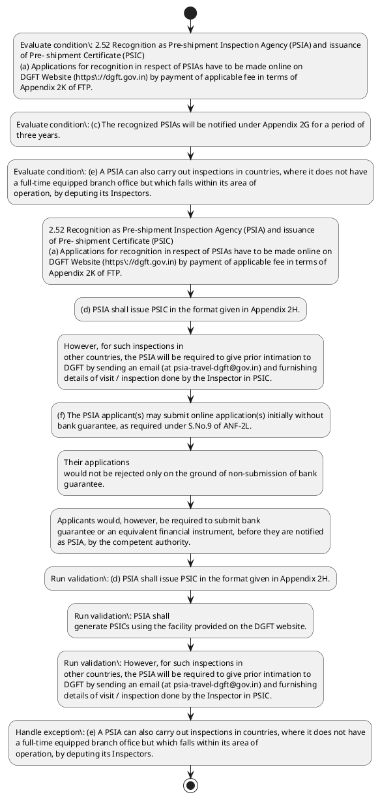

# Chapter 2 / Section 2.52: Recognition as Pre-shipment Inspection Agency (PSIA) and issuance

**Chapter Title:** General Provisions Regarding Imports and Exports

**Pages:** 23, 24

**Purpose:** 2.52 Recognition as Pre-shipment Inspection Agency (PSIA) and issuance
of Pre- shipment Certificate (PSIC)
(a) Applications for recognition in respect of PSIAs have to be made online on
DGFT Website (https://dgft.gov.in) by payment of applicable fee in terms of
Appendix 2K of FTP.

**Purpose Thanglish:** Indha Recognition as Pre-shipment Inspection Agency (PSIA) and issuance section-la, 2.52 Recognition as Pre-shipment Inspection Agency (PSIA) and issuance
of Pre- shipment Certificate (PSIC)
(a) Applications for recognition in respect of PSIAs have to be made online on
DGFT Website (https://dgft.gov.in) by payment of applicable fee in terms of
Appendix 2K of FTP.

**Summary:** 2.52 Recognition as Pre-shipment Inspection Agency (PSIA) and issuance
of Pre- shipment Certificate (PSIC)
(a) Applications for recognition in respect of PSIAs have to be made online on
DGFT Website (https://dgft.gov.in) by payment of applicable fee in terms of
Appendix 2K of FTP. (b) The online applications will be considered by an Inter-Ministerial
Committee. (c) The recognized PSIAs will be notified under Appendix 2G for a period of
three years.

**Business Meaning:** Recognition as Pre-shipment Inspection Agency (PSIA) and issuance governs how DGFT business controls should be applied, validated, and enforced.

**Business Explanation:** Recognition as Pre-shipment Inspection Agency (PSIA) and issuance explains the operating rule set that DEKAI should enforce. Key control points include (d) PSIA shall issue PSIC in the format given in Appendix 2H. The section also drives actions such as 2.52 Recognition as Pre-shipment Inspection Agency (PSIA) and issuance
of Pre- shipment Certificate (PSIC)
(a) Applications for recognition in respect of PSIAs have to be made online on
DGFT Website (https://dgft.gov.in) by payment of applicable fee in terms of
Appendix 2K of FTP..

**Business Explanation Thanglish:** Indha Recognition as Pre-shipment Inspection Agency (PSIA) and issuance section-la, Recognition as Pre-shipment Inspection Agency (PSIA) and issuance explains the operating rule set that DEKAI should enforce. Key control points include (d) PSIA kandippa issue PSIC in the format given in Appendix 2H. The section also drives actions such as 2.52 Recognition as Pre-shipment Inspection Agency (PSIA) and issuance
of Pre- shipment Certificate (PSIC)
(a) Applications for recognition in respect of PSIAs have to be made online on
DGFT Website (https://dgft.gov.in) by payment of applicable fee in terms of
Appendix 2K of FTP..

## Business Logic
- (d) PSIA shall issue PSIC in the format given in Appendix 2H.
- PSIA shall
generate PSICs using the facility provided on the DGFT website.
- However, for such inspections in
other countries, the PSIA will be required to give prior intimation to
DGFT by sending an email (at psia-travel-dgft@gov.in) and furnishing
details of visit / inspection done by the Inspector in PSIC.
- Applicants would, however, be required to submit bank
guarantee or an equivalent financial instrument, before they are notified
as PSIA, by the competent authority.
- These will however be subject to radiation
and explosive checks through portal monitors and container
scanner at these ports.
- Import through remaining
eight (8) other ports (for both shredded and unshredded scrap /
waste), irrespective of country of origin, will be subject to PSIC.
- (d)
PSIA shall issue PSIC in the format given in Appendix 2H.

## Business Rules
- rule_id=CH2-SEC2_52-R001, rule_description=(d) PSIA shall issue PSIC in the format given in Appendix 2H., trigger=Recognition as Pre-shipment Inspection Agency (PSIA) and issuance, condition=2.52 Recognition as Pre-shipment Inspection Agency (PSIA) and issuance
of Pre- shipment Certificate (PSIC)
(a) Applications for recognition in respect of PSIAs have to be made online on
DGFT Website (https://dgft.gov.in) by payment of applicable fee in terms of
Appendix 2K of FTP., validation=(d) PSIA shall issue PSIC in the format given in Appendix 2H., action=2.52 Recognition as Pre-shipment Inspection Agency (PSIA) and issuance
of Pre- shipment Certificate (PSIC)
(a) Applications for recognition in respect of PSIAs have to be made online on
DGFT Website (https://dgft.gov.in) by payment of applicable fee in terms of
Appendix 2K of FTP., exception=(e) A PSIA can also carry out inspections in countries, where it does not have
a full-time equipped branch office but which falls within its area of
operation, by deputing its Inspectors., output=DEKAI should produce a compliance decision for 2.52 - Recognition as Pre-shipment Inspection Agency (PSIA) and issuance.
- rule_id=CH2-SEC2_52-R002, rule_description=PSIA shall
generate PSICs using the facility provided on the DGFT website., trigger=Recognition as Pre-shipment Inspection Agency (PSIA) and issuance, condition=(c) The recognized PSIAs will be notified under Appendix 2G for a period of
three years., validation=PSIA shall
generate PSICs using the facility provided on the DGFT website., action=(d) PSIA shall issue PSIC in the format given in Appendix 2H., exception=However, for such inspections in
other countries, the PSIA will be required to give prior intimation to
DGFT by sending an email (at psia-travel-dgft@gov.in) and furnishing
details of visit / inspection done by the Inspector in PSIC., output=DEKAI should produce a compliance decision for 2.52 - Recognition as Pre-shipment Inspection Agency (PSIA) and issuance.
- rule_id=CH2-SEC2_52-R003, rule_description=However, for such inspections in
other countries, the PSIA will be required to give prior intimation to
DGFT by sending an email (at psia-travel-dgft@gov.in) and furnishing
details of visit / inspection done by the Inspector in PSIC., trigger=Recognition as Pre-shipment Inspection Agency (PSIA) and issuance, condition=(e) A PSIA can also carry out inspections in countries, where it does not have
a full-time equipped branch office but which falls within its area of
operation, by deputing its Inspectors., validation=However, for such inspections in
other countries, the PSIA will be required to give prior intimation to
DGFT by sending an email (at psia-travel-dgft@gov.in) and furnishing
details of visit / inspection done by the Inspector in PSIC., action=However, for such inspections in
other countries, the PSIA will be required to give prior intimation to
DGFT by sending an email (at psia-travel-dgft@gov.in) and furnishing
details of visit / inspection done by the Inspector in PSIC., exception=Applicants would, however, be required to submit bank
guarantee or an equivalent financial instrument, before they are notified
as PSIA, by the competent authority., output=DEKAI should produce a compliance decision for 2.52 - Recognition as Pre-shipment Inspection Agency (PSIA) and issuance.
- rule_id=CH2-SEC2_52-R004, rule_description=Applicants would, however, be required to submit bank
guarantee or an equivalent financial instrument, before they are notified
as PSIA, by the competent authority., trigger=Recognition as Pre-shipment Inspection Agency (PSIA) and issuance, condition=Applicants would, however, be required to submit bank
guarantee or an equivalent financial instrument, before they are notified
as PSIA, by the competent authority., validation=(f) The PSIA applicant(s) may submit online application(s) initially without
bank guarantee, as required under S.No.9 of ANF-2L., action=(f) The PSIA applicant(s) may submit online application(s) initially without
bank guarantee, as required under S.No.9 of ANF-2L., exception=These will however be subject to radiation
and explosive checks through portal monitors and container
scanner at these ports., output=DEKAI should produce a compliance decision for 2.52 - Recognition as Pre-shipment Inspection Agency (PSIA) and issuance.
- rule_id=CH2-SEC2_52-R005, rule_description=These will however be subject to radiation
and explosive checks through portal monitors and container
scanner at these ports., trigger=Recognition as Pre-shipment Inspection Agency (PSIA) and issuance, condition=consignments are cleared through eight (8) ports namely, validation=Their applications
would not be rejected only on the ground of non-submission of bank
guarantee., action=Their applications
would not be rejected only on the ground of non-submission of bank
guarantee., exception=(e)
A PSIA can also carry out inspections in countries, where it does not have
a full-time equipped branch office but which falls within its area of
operation, by deputing its Inspectors., output=DEKAI should produce a compliance decision for 2.52 - Recognition as Pre-shipment Inspection Agency (PSIA) and issuance.
- rule_id=CH2-SEC2_52-R006, rule_description=Import through remaining
eight (8) other ports (for both shredded and unshredded scrap /
waste), irrespective of country of origin, will be subject to PSIC., trigger=Recognition as Pre-shipment Inspection Agency (PSIA) and issuance, condition=Consignments from these six countries / regions
will be accompanied by certificate from the supplier / scrap yard
authority to the effect that it does not contain any radioactive
materials / explosives., validation=Applicants would, however, be required to submit bank
guarantee or an equivalent financial instrument, before they are notified
as PSIA, by the competent authority., action=Applicants would, however, be required to submit bank
guarantee or an equivalent financial instrument, before they are notified
as PSIA, by the competent authority., exception=(e)
A PSIA can also carry out inspections in countries, where it does not have
a full-time equipped branch office but which falls within its area of
operation, by deputing its Inspectors., output=DEKAI should produce a compliance decision for 2.52 - Recognition as Pre-shipment Inspection Agency (PSIA) and issuance.
- rule_id=CH2-SEC2_52-R007, rule_description=(d)
PSIA shall issue PSIC in the format given in Appendix 2H., trigger=Recognition as Pre-shipment Inspection Agency (PSIA) and issuance, condition=These will however be subject to radiation
and explosive checks through portal monitors and container
scanner at these ports., validation=(d)
PSIA shall issue PSIC in the format given in Appendix 2H., action=(d)
PSIA shall issue PSIC in the format given in Appendix 2H., exception=(e)
A PSIA can also carry out inspections in countries, where it does not have
a full-time equipped branch office but which falls within its area of
operation, by deputing its Inspectors., output=DEKAI should produce a compliance decision for 2.52 - Recognition as Pre-shipment Inspection Agency (PSIA) and issuance.

## Conditions
- 2.52 Recognition as Pre-shipment Inspection Agency (PSIA) and issuance
of Pre- shipment Certificate (PSIC)
(a) Applications for recognition in respect of PSIAs have to be made online on
DGFT Website (https://dgft.gov.in) by payment of applicable fee in terms of
Appendix 2K of FTP.
- (c) The recognized PSIAs will be notified under Appendix 2G for a period of
three years.
- (e) A PSIA can also carry out inspections in countries, where it does not have
a full-time equipped branch office but which falls within its area of
operation, by deputing its Inspectors.
- Applicants would, however, be required to submit bank
guarantee or an equivalent financial instrument, before they are notified
as PSIA, by the competent authority.
- 32
unshredded) imported from safe countries / region i.e., the USA, the
UK, Canada, New Zealand, Australia and the EU will not require
PSIC if consignments are cleared through eight (8) ports namely,
Chennai, Tuticorin, Kandla, JNPT, Mumbai Krishnapatnam, Mundra
and Kattupalli.
- Consignments from these six countries / regions
will be accompanied by certificate from the supplier / scrap yard
authority to the effect that it does not contain any radioactive
materials / explosives.
- These will however be subject to radiation
and explosive checks through portal monitors and container
scanner at these ports.
- Import through remaining
eight (8) other ports (for both shredded and unshredded scrap /
waste), irrespective of country of origin, will be subject to PSIC.
- (e)
A PSIA can also carry out inspections in countries, where it does not have
a full-time equipped branch office but which falls within its area of
operation, by deputing its Inspectors.

## Condition Logic
- id=2.2.52.1, if=2.52 Recognition as Pre-shipment Inspection Agency (PSIA) and issuance
of Pre- shipment Certificate (PSIC)
(a) Applications for recognition in respect of PSIAs have to be made online on
DGFT Website (https://dgft.gov.in) by payment of applicable fee in terms of
Appendix 2K of FTP., then=2.52 Recognition as Pre-shipment Inspection Agency (PSIA) and issuance
of Pre- shipment Certificate (PSIC)
(a) Applications for recognition in respect of PSIAs have to be made online on
DGFT Website (https://dgft.gov.in) by payment of applicable fee in terms of
Appendix 2K of FTP., source=2.52 Recognition as Pre-shipment Inspection Agency (PSIA) and issuance
of Pre- shipment Certificate (PSIC)
(a) Applications for recognition in respect of PSIAs have to be made online on
DGFT Website (https://dgft.gov.in) by payment of applicable fee in terms of
Appendix 2K of FTP.
- id=2.2.52.2, if=(c) The recognized PSIAs will be notified under Appendix 2G for a period of
three years., then=2.52 Recognition as Pre-shipment Inspection Agency (PSIA) and issuance
of Pre- shipment Certificate (PSIC)
(a) Applications for recognition in respect of PSIAs have to be made online on
DGFT Website (https://dgft.gov.in) by payment of applicable fee in terms of
Appendix 2K of FTP., source=(c) The recognized PSIAs will be notified under Appendix 2G for a period of
three years.
- id=2.2.52.3, if=(e) A PSIA can also carry out inspections in countries, where it does not have
a full-time equipped branch office but which falls within its area of
operation, by deputing its Inspectors., then=2.52 Recognition as Pre-shipment Inspection Agency (PSIA) and issuance
of Pre- shipment Certificate (PSIC)
(a) Applications for recognition in respect of PSIAs have to be made online on
DGFT Website (https://dgft.gov.in) by payment of applicable fee in terms of
Appendix 2K of FTP., source=(e) A PSIA can also carry out inspections in countries, where it does not have
a full-time equipped branch office but which falls within its area of
operation, by deputing its Inspectors.
- id=2.2.52.4, if=Applicants would, however, be required to submit bank
guarantee or an equivalent financial instrument, before they are notified
as PSIA, by the competent authority., then=2.52 Recognition as Pre-shipment Inspection Agency (PSIA) and issuance
of Pre- shipment Certificate (PSIC)
(a) Applications for recognition in respect of PSIAs have to be made online on
DGFT Website (https://dgft.gov.in) by payment of applicable fee in terms of
Appendix 2K of FTP., source=Applicants would, however, be required to submit bank
guarantee or an equivalent financial instrument, before they are notified
as PSIA, by the competent authority.
- id=2.2.52.5, if=consignments are cleared through eight (8) ports namely, then=2.52 Recognition as Pre-shipment Inspection Agency (PSIA) and issuance
of Pre- shipment Certificate (PSIC)
(a) Applications for recognition in respect of PSIAs have to be made online on
DGFT Website (https://dgft.gov.in) by payment of applicable fee in terms of
Appendix 2K of FTP., source=32
unshredded) imported from safe countries / region i.e., the USA, the
UK, Canada, New Zealand, Australia and the EU will not require
PSIC if consignments are cleared through eight (8) ports namely,
Chennai, Tuticorin, Kandla, JNPT, Mumbai Krishnapatnam, Mundra
and Kattupalli.
- id=2.2.52.6, if=Consignments from these six countries / regions
will be accompanied by certificate from the supplier / scrap yard
authority to the effect that it does not contain any radioactive
materials / explosives., then=2.52 Recognition as Pre-shipment Inspection Agency (PSIA) and issuance
of Pre- shipment Certificate (PSIC)
(a) Applications for recognition in respect of PSIAs have to be made online on
DGFT Website (https://dgft.gov.in) by payment of applicable fee in terms of
Appendix 2K of FTP., source=Consignments from these six countries / regions
will be accompanied by certificate from the supplier / scrap yard
authority to the effect that it does not contain any radioactive
materials / explosives.
- id=2.2.52.7, if=These will however be subject to radiation
and explosive checks through portal monitors and container
scanner at these ports., then=2.52 Recognition as Pre-shipment Inspection Agency (PSIA) and issuance
of Pre- shipment Certificate (PSIC)
(a) Applications for recognition in respect of PSIAs have to be made online on
DGFT Website (https://dgft.gov.in) by payment of applicable fee in terms of
Appendix 2K of FTP., source=These will however be subject to radiation
and explosive checks through portal monitors and container
scanner at these ports.
- id=2.2.52.8, if=Import through remaining
eight (8) other ports (for both shredded and unshredded scrap /
waste), irrespective of country of origin, will be subject to PSIC., then=2.52 Recognition as Pre-shipment Inspection Agency (PSIA) and issuance
of Pre- shipment Certificate (PSIC)
(a) Applications for recognition in respect of PSIAs have to be made online on
DGFT Website (https://dgft.gov.in) by payment of applicable fee in terms of
Appendix 2K of FTP., source=Import through remaining
eight (8) other ports (for both shredded and unshredded scrap /
waste), irrespective of country of origin, will be subject to PSIC.
- id=2.2.52.9, if=(e)
A PSIA can also carry out inspections in countries, where it does not have
a full-time equipped branch office but which falls within its area of
operation, by deputing its Inspectors., then=2.52 Recognition as Pre-shipment Inspection Agency (PSIA) and issuance
of Pre- shipment Certificate (PSIC)
(a) Applications for recognition in respect of PSIAs have to be made online on
DGFT Website (https://dgft.gov.in) by payment of applicable fee in terms of
Appendix 2K of FTP., source=(e)
A PSIA can also carry out inspections in countries, where it does not have
a full-time equipped branch office but which falls within its area of
operation, by deputing its Inspectors.

## Validations
- (d) PSIA shall issue PSIC in the format given in Appendix 2H.
- PSIA shall
generate PSICs using the facility provided on the DGFT website.
- However, for such inspections in
other countries, the PSIA will be required to give prior intimation to
DGFT by sending an email (at psia-travel-dgft@gov.in) and furnishing
details of visit / inspection done by the Inspector in PSIC.
- (f) The PSIA applicant(s) may submit online application(s) initially without
bank guarantee, as required under S.No.9 of ANF-2L.
- Their applications
would not be rejected only on the ground of non-submission of bank
guarantee.
- Applicants would, however, be required to submit bank
guarantee or an equivalent financial instrument, before they are notified
as PSIA, by the competent authority.
- (d)
PSIA shall issue PSIC in the format given in Appendix 2H.
- (f)
The PSIA applicant(s) may submit online application(s) initially without
bank guarantee, as required under S.No.9 of ANF-2L.

## Exceptions
- (e) A PSIA can also carry out inspections in countries, where it does not have
a full-time equipped branch office but which falls within its area of
operation, by deputing its Inspectors.
- However, for such inspections in
other countries, the PSIA will be required to give prior intimation to
DGFT by sending an email (at psia-travel-dgft@gov.in) and furnishing
details of visit / inspection done by the Inspector in PSIC.
- Applicants would, however, be required to submit bank
guarantee or an equivalent financial instrument, before they are notified
as PSIA, by the competent authority.
- These will however be subject to radiation
and explosive checks through portal monitors and container
scanner at these ports.
- (e)
A PSIA can also carry out inspections in countries, where it does not have
a full-time equipped branch office but which falls within its area of
operation, by deputing its Inspectors.

## Dependencies
- None identified

## Authorities
- DGFT
- PSICs using the facility provided on the DGFT
- PSIA has to be made online on the DGFT

## Required Documents
- Pre- shipment Certificate
- (b) The online applications will be considered by an Inter-Ministerial
Committee.
- At the end of 3 years PSIA has to make a fresh online application for
further recognition by DGFT.
- (f) The PSIA applicant(s) may submit online application(s) initially without
bank guarantee, as required under S.No.9 of ANF-2L.
- Their applications
would not be rejected only on the ground of non-submission of bank
guarantee.
- Consignments from these six countries / regions
will be accompanied by certificate from the supplier / scrap yard
authority to the effect that it does not contain any radioactive
materials / explosives.
- (f)
The PSIA applicant(s) may submit online application(s) initially without
bank guarantee, as required under S.No.9 of ANF-2L.
- 32
(g) Any application for amendment in instruments and/or areas of operation
of the existing PSIA has to be made online on the DGFT website.

## Timelines
- (c) The recognized PSIAs will be notified under Appendix 2G for a period of
three years.
- At the end of 3 years PSIA has to make a fresh online application for
further recognition by DGFT.
- (e) A PSIA can also carry out inspections in countries, where it does not have
a full-time equipped branch office but which falls within its area of
operation, by deputing its Inspectors.
- Applicants would, however, be required to submit bank
guarantee or an equivalent financial instrument, before they are notified
as PSIA, by the competent authority.
- (e)
A PSIA can also carry out inspections in countries, where it does not have
a full-time equipped branch office but which falls within its area of
operation, by deputing its Inspectors.

## Actions
- 2.52 Recognition as Pre-shipment Inspection Agency (PSIA) and issuance
of Pre- shipment Certificate (PSIC)
(a) Applications for recognition in respect of PSIAs have to be made online on
DGFT Website (https://dgft.gov.in) by payment of applicable fee in terms of
Appendix 2K of FTP.
- (d) PSIA shall issue PSIC in the format given in Appendix 2H.
- However, for such inspections in
other countries, the PSIA will be required to give prior intimation to
DGFT by sending an email (at psia-travel-dgft@gov.in) and furnishing
details of visit / inspection done by the Inspector in PSIC.
- (f) The PSIA applicant(s) may submit online application(s) initially without
bank guarantee, as required under S.No.9 of ANF-2L.
- Their applications
would not be rejected only on the ground of non-submission of bank
guarantee.
- Applicants would, however, be required to submit bank
guarantee or an equivalent financial instrument, before they are notified
as PSIA, by the competent authority.
- (d)
PSIA shall issue PSIC in the format given in Appendix 2H.
- (f)
The PSIA applicant(s) may submit online application(s) initially without
bank guarantee, as required under S.No.9 of ANF-2L.
- 32
(g) Any application for amendment in instruments and/or areas of operation
of the existing PSIA has to be made online on the DGFT website.

## Workflow
- Evaluate condition: 2.52 Recognition as Pre-shipment Inspection Agency (PSIA) and issuance
of Pre- shipment Certificate (PSIC)
(a) Applications for recognition in respect of PSIAs have to be made online on
DGFT Website (https://dgft.gov.in) by payment of applicable fee in terms of
Appendix 2K of FTP.
- Evaluate condition: (c) The recognized PSIAs will be notified under Appendix 2G for a period of
three years.
- Evaluate condition: (e) A PSIA can also carry out inspections in countries, where it does not have
a full-time equipped branch office but which falls within its area of
operation, by deputing its Inspectors.
- 2.52 Recognition as Pre-shipment Inspection Agency (PSIA) and issuance
of Pre- shipment Certificate (PSIC)
(a) Applications for recognition in respect of PSIAs have to be made online on
DGFT Website (https://dgft.gov.in) by payment of applicable fee in terms of
Appendix 2K of FTP.
- (d) PSIA shall issue PSIC in the format given in Appendix 2H.
- However, for such inspections in
other countries, the PSIA will be required to give prior intimation to
DGFT by sending an email (at psia-travel-dgft@gov.in) and furnishing
details of visit / inspection done by the Inspector in PSIC.
- (f) The PSIA applicant(s) may submit online application(s) initially without
bank guarantee, as required under S.No.9 of ANF-2L.
- Their applications
would not be rejected only on the ground of non-submission of bank
guarantee.
- Applicants would, however, be required to submit bank
guarantee or an equivalent financial instrument, before they are notified
as PSIA, by the competent authority.
- Run validation: (d) PSIA shall issue PSIC in the format given in Appendix 2H.
- Run validation: PSIA shall
generate PSICs using the facility provided on the DGFT website.
- Run validation: However, for such inspections in
other countries, the PSIA will be required to give prior intimation to
DGFT by sending an email (at psia-travel-dgft@gov.in) and furnishing
details of visit / inspection done by the Inspector in PSIC.
- Handle exception: (e) A PSIA can also carry out inspections in countries, where it does not have
a full-time equipped branch office but which falls within its area of
operation, by deputing its Inspectors.

## Workflow ASCII
```text
Recognition as Pre-shipment Inspection Agency (PSIA) and issuance
Evaluate condition: 2.52 Recognition as Pre-shipment Inspection Agency (PSIA) and issuance
of Pre- shipment Certificate (PSIC)
(a) Applications for recognition in respect of PSIAs have to be made online on
DGFT Website (https://dgft.gov.in) by payment of applicable fee in terms of
Appendix 2K of FTP.
   |
   v
Evaluate condition: (c) The recognized PSIAs will be notified under Appendix 2G for a period of
three years.
   |
   v
Evaluate condition: (e) A PSIA can also carry out inspections in countries, where it does not have
a full-time equipped branch office but which falls within its area of
operation, by deputing its Inspectors.
   |
   v
2.52 Recognition as Pre-shipment Inspection Agency (PSIA) and issuance
of Pre- shipment Certificate (PSIC)
(a) Applications for recognition in respect of PSIAs have to be made online on
DGFT Website (https://dgft.gov.in) by payment of applicable fee in terms of
Appendix 2K of FTP.
   |
   v
(d) PSIA shall issue PSIC in the format given in Appendix 2H.
   |
   v
However, for such inspections in
other countries, the PSIA will be required to give prior intimation to
DGFT by sending an email (at psia-travel-dgft@gov.in) and furnishing
details of visit / inspection done by the Inspector in PSIC.
   |
   v
(f) The PSIA applicant(s) may submit online application(s) initially without
bank guarantee, as required under S.No.9 of ANF-2L.
   |
   v
Their applications
would not be rejected only on the ground of non-submission of bank
guarantee.
   |
   v
Applicants would, however, be required to submit bank
guarantee or an equivalent financial instrument, before they are notified
as PSIA, by the competent authority.
   |
   v
Run validation: (d) PSIA shall issue PSIC in the format given in Appendix 2H.
   |
   v
Run validation: PSIA shall
generate PSICs using the facility provided on the DGFT website.
   |
   v
Run validation: However, for such inspections in
other countries, the PSIA will be required to give prior intimation to
DGFT by sending an email (at psia-travel-dgft@gov.in) and furnishing
details of visit / inspection done by the Inspector in PSIC.
   |
   v
Handle exception: (e) A PSIA can also carry out inspections in countries, where it does not have
a full-time equipped branch office but which falls within its area of
operation, by deputing its Inspectors.
```

## Decision Tree
- IF 2.52 Recognition as Pre-shipment Inspection Agency (PSIA) and issuance
of Pre- shipment Certificate (PSIC)
(a) Applications for recognition in respect of PSIAs have to be made online on
DGFT Website (https://dgft.gov.in) by payment of applicable fee in terms of
Appendix 2K of FTP. THEN 2.52 Recognition as Pre-shipment Inspection Agency (PSIA) and issuance
of Pre- shipment Certificate (PSIC)
(a) Applications for recognition in respect of PSIAs have to be made online on
DGFT Website (https://dgft.gov.in) by payment of applicable fee in terms of
Appendix 2K of FTP.
- IF (c) The recognized PSIAs will be notified under Appendix 2G for a period of
three years. THEN 2.52 Recognition as Pre-shipment Inspection Agency (PSIA) and issuance
of Pre- shipment Certificate (PSIC)
(a) Applications for recognition in respect of PSIAs have to be made online on
DGFT Website (https://dgft.gov.in) by payment of applicable fee in terms of
Appendix 2K of FTP.
- IF (e) A PSIA can also carry out inspections in countries, where it does not have
a full-time equipped branch office but which falls within its area of
operation, by deputing its Inspectors. THEN 2.52 Recognition as Pre-shipment Inspection Agency (PSIA) and issuance
of Pre- shipment Certificate (PSIC)
(a) Applications for recognition in respect of PSIAs have to be made online on
DGFT Website (https://dgft.gov.in) by payment of applicable fee in terms of
Appendix 2K of FTP.
- IF Applicants would, however, be required to submit bank
guarantee or an equivalent financial instrument, before they are notified
as PSIA, by the competent authority. THEN 2.52 Recognition as Pre-shipment Inspection Agency (PSIA) and issuance
of Pre- shipment Certificate (PSIC)
(a) Applications for recognition in respect of PSIAs have to be made online on
DGFT Website (https://dgft.gov.in) by payment of applicable fee in terms of
Appendix 2K of FTP.
- IF 32
unshredded) imported from safe countries / region i.e., the USA, the
UK, Canada, New Zealand, Australia and the EU will not require
PSIC if consignments are cleared through eight (8) ports namely,
Chennai, Tuticorin, Kandla, JNPT, Mumbai Krishnapatnam, Mundra
and Kattupalli. THEN 2.52 Recognition as Pre-shipment Inspection Agency (PSIA) and issuance
of Pre- shipment Certificate (PSIC)
(a) Applications for recognition in respect of PSIAs have to be made online on
DGFT Website (https://dgft.gov.in) by payment of applicable fee in terms of
Appendix 2K of FTP.
- IF exception applies ((e) A PSIA can also carry out inspections in countries, where it does not have
a full-time equipped branch office but which falls within its area of
operation, by deputing its Inspectors.) THEN route to manual review
- IF exception applies (However, for such inspections in
other countries, the PSIA will be required to give prior intimation to
DGFT by sending an email (at psia-travel-dgft@gov.in) and furnishing
details of visit / inspection done by the Inspector in PSIC.) THEN route to manual review
- IF exception applies (Applicants would, however, be required to submit bank
guarantee or an equivalent financial instrument, before they are notified
as PSIA, by the competent authority.) THEN route to manual review

## Decision Tree ASCII
```text
Recognition as Pre-shipment Inspection Agency (PSIA) and issuance Decision
IF 2.52 Recognition as Pre-shipment Inspection Agency (PSIA) and issuance
of Pre- shipment Certificate (PSIC)
(a) Applications for recognition in respect of PSIAs have to be made online on
DGFT Website (https://dgft.gov.in) by payment of applicable fee in terms of
Appendix 2K of FTP. THEN 2.52 Recognition as Pre-shipment Inspection Agency (PSIA) and issuance
of Pre- shipment Certificate (PSIC)
(a) Applications for recognition in respect of PSIAs have to be made online on
DGFT Website (https://dgft.gov.in) by payment of applicable fee in terms of
Appendix 2K of FTP.
   |
   v
IF (c) The recognized PSIAs will be notified under Appendix 2G for a period of
three years. THEN 2.52 Recognition as Pre-shipment Inspection Agency (PSIA) and issuance
of Pre- shipment Certificate (PSIC)
(a) Applications for recognition in respect of PSIAs have to be made online on
DGFT Website (https://dgft.gov.in) by payment of applicable fee in terms of
Appendix 2K of FTP.
   |
   v
IF (e) A PSIA can also carry out inspections in countries, where it does not have
a full-time equipped branch office but which falls within its area of
operation, by deputing its Inspectors. THEN 2.52 Recognition as Pre-shipment Inspection Agency (PSIA) and issuance
of Pre- shipment Certificate (PSIC)
(a) Applications for recognition in respect of PSIAs have to be made online on
DGFT Website (https://dgft.gov.in) by payment of applicable fee in terms of
Appendix 2K of FTP.
   |
   v
IF Applicants would, however, be required to submit bank
guarantee or an equivalent financial instrument, before they are notified
as PSIA, by the competent authority. THEN 2.52 Recognition as Pre-shipment Inspection Agency (PSIA) and issuance
of Pre- shipment Certificate (PSIC)
(a) Applications for recognition in respect of PSIAs have to be made online on
DGFT Website (https://dgft.gov.in) by payment of applicable fee in terms of
Appendix 2K of FTP.
   |
   v
IF 32
unshredded) imported from safe countries / region i.e., the USA, the
UK, Canada, New Zealand, Australia and the EU will not require
PSIC if consignments are cleared through eight (8) ports namely,
Chennai, Tuticorin, Kandla, JNPT, Mumbai Krishnapatnam, Mundra
and Kattupalli. THEN 2.52 Recognition as Pre-shipment Inspection Agency (PSIA) and issuance
of Pre- shipment Certificate (PSIC)
(a) Applications for recognition in respect of PSIAs have to be made online on
DGFT Website (https://dgft.gov.in) by payment of applicable fee in terms of
Appendix 2K of FTP.
   |
   v
IF exception applies ((e) A PSIA can also carry out inspections in countries, where it does not have
a full-time equipped branch office but which falls within its area of
operation, by deputing its Inspectors.) THEN route to manual review
   |
   v
IF exception applies (However, for such inspections in
other countries, the PSIA will be required to give prior intimation to
DGFT by sending an email (at psia-travel-dgft@gov.in) and furnishing
details of visit / inspection done by the Inspector in PSIC.) THEN route to manual review
   |
   v
IF exception applies (Applicants would, however, be required to submit bank
guarantee or an equivalent financial instrument, before they are notified
as PSIA, by the competent authority.) THEN route to manual review
```

## Examples
- User asks to process Recognition as Pre-shipment Inspection Agency (PSIA) and issuance; the platform checks conditions, validations, and documents before action.

**Real-world Example:** Example: an importer or exporter invokes Recognition as Pre-shipment Inspection Agency (PSIA) and issuance, submits Pre- shipment Certificate, (b) The online applications will be considered by an Inter-Ministerial
Committee., At the end of 3 years PSIA has to make a fresh online application for
further recognition by DGFT., and DEKAI uses the extracted rules to 2.52 recognition as pre-shipment inspection agency (psia) and issuance
of pre- shipment certificate (psic)
(a) applications for recognition in respect of psias have to be made online on
dgft website (https://dgft.gov.in) by payment of applicable fee in terms of
appendix 2k of ftp..

**Real-world Example Thanglish:** Indha Recognition as Pre-shipment Inspection Agency (PSIA) and issuance section-la, Example: an importer or exporter invokes Recognition as Pre-shipment Inspection Agency (PSIA) and issuance, submits Pre- shipment Certificate, (b) The online applications will be considered by an Inter-Ministerial
Committee., At the end of 3 years PSIA has to make a fresh online application for
further recognition by DGFT., and DEKAI uses the extracted rules to 2.52 recognition as pre-shipment inspection agency (psia) and issuance
of pre- shipment certificate (psic)
(a) applications for recognition in respect of psias have to be made online on
dgft website (https://dgft.gov.in) by payment of applicable fee in terms of
appendix 2k of ftp..

## AI Rules
- IF detected context matches section rule THEN enforce: (d) PSIA shall issue PSIC in the format given in Appendix 2H.
- IF detected context matches section rule THEN enforce: PSIA shall
generate PSICs using the facility provided on the DGFT website.
- IF detected context matches section rule THEN enforce: However, for such inspections in
other countries, the PSIA will be required to give prior intimation to
DGFT by sending an email (at psia-travel-dgft@gov.in) and furnishing
details of visit / inspection done by the Inspector in PSIC.
- IF detected context matches section rule THEN enforce: Applicants would, however, be required to submit bank
guarantee or an equivalent financial instrument, before they are notified
as PSIA, by the competent authority.
- IF detected context matches section rule THEN enforce: These will however be subject to radiation
and explosive checks through portal monitors and container
scanner at these ports.
- IF detected context matches section rule THEN enforce: Import through remaining
eight (8) other ports (for both shredded and unshredded scrap /
waste), irrespective of country of origin, will be subject to PSIC.
- IF validations pass THEN recommend action: 2.52 Recognition as Pre-shipment Inspection Agency (PSIA) and issuance
of Pre- shipment Certificate (PSIC)
(a) Applications for recognition in respect of PSIAs have to be made online on
DGFT Website (https://dgft.gov.in) by payment of applicable fee in terms of
Appendix 2K of FTP.

## Database Fields
- name=section_code, type=string, required=True, source=parsed_section_heading
- name=section_title, type=string, required=True, source=parsed_section_heading
- name=and_flag, type=boolean, required=False, source=keyword:and
- name=pre_flag, type=boolean, required=False, source=keyword:Pre
- name=for_flag, type=boolean, required=False, source=keyword:for
- name=gov_flag, type=boolean, required=False, source=keyword:gov
- name=fee_flag, type=boolean, required=False, source=keyword:fee
- name=ftp_flag, type=boolean, required=False, source=keyword:FTP
- name=the_flag, type=boolean, required=False, source=keyword:The
- name=end_flag, type=boolean, required=False, source=keyword:end
- name=document_1_submitted, type=boolean, required=True, source=Pre- shipment Certificate
- name=document_2_submitted, type=boolean, required=True, source=(b) The online applications will be considered by an Inter-Ministerial
Committee.
- name=document_3_submitted, type=boolean, required=True, source=At the end of 3 years PSIA has to make a fresh online application for
further recognition by DGFT.
- name=document_4_submitted, type=boolean, required=True, source=(f) The PSIA applicant(s) may submit online application(s) initially without
bank guarantee, as required under S.No.9 of ANF-2L.
- name=document_5_submitted, type=boolean, required=True, source=Their applications
would not be rejected only on the ground of non-submission of bank
guarantee.
- name=document_6_submitted, type=boolean, required=True, source=Consignments from these six countries / regions
will be accompanied by certificate from the supplier / scrap yard
authority to the effect that it does not contain any radioactive
materials / explosives.

## API Requirements
- method=GET, path=/api/dgft/sections/2.52, purpose=Retrieve knowledge payload for section 2.52, query_params=['include=workflow,decision_tree,validations'], response_fields=['section', 'title', 'summary', 'conditions', 'validations', 'exceptions', 'workflow', 'decision_tree']
- method=POST, path=/api/dgft/Recognition-as-Pre-shipment-Inspection-Agency-PSIA-and-issuance/validate, purpose=Validate inputs and documents for Recognition as Pre-shipment Inspection Agency (PSIA) and issuance, request_fields=['section_code', 'section_title', 'document_1_submitted', 'document_2_submitted', 'document_3_submitted', 'document_4_submitted', 'document_5_submitted', 'document_6_submitted'], response_fields=['status', 'errors', 'warnings', 'next_actions']
- method=POST, path=/api/dgft/Recognition-as-Pre-shipment-Inspection-Agency-PSIA-and-issuance/execute, purpose=Trigger business action for 2.52 Recognition as Pre-shipment Inspection Agency (PSIA) and issuance
of Pre- shipment Certificate (PSIC)
(a) Applications for recognition in respect of PSIAs have to be made online on
DGFT Website (https://dgft.gov.in) by payment of applicable fee in terms of
Appendix 2K of FTP., request_fields=['section_code', 'section_title', 'document_1_submitted', 'document_2_submitted', 'document_3_submitted', 'document_4_submitted', 'document_5_submitted', 'document_6_submitted'], response_fields=['reference_id', 'status', 'authority', 'timeline']

## UI Screens
- screen_id=Recognition_as_Pre_shipment_Inspection_Agency_PSIA_and_issuance_overview, name=Recognition as Pre-shipment Inspection Agency (PSIA) and issuance Overview, purpose=Show section summary, authority, timeline, and eligibility cues., widgets=['summary_card', 'conditions_table', 'authority_badges', 'timeline_panel']
- screen_id=Recognition_as_Pre_shipment_Inspection_Agency_PSIA_and_issuance_submission, name=Recognition as Pre-shipment Inspection Agency (PSIA) and issuance Submission, purpose=Capture applicant data and supporting documents., widgets=['dynamic_form', 'document_uploader', 'validation_panel', 'next_action_footer'], fields=['section_code', 'section_title', 'and_flag', 'pre_flag', 'for_flag', 'gov_flag', 'fee_flag', 'ftp_flag']
- screen_id=Recognition_as_Pre_shipment_Inspection_Agency_PSIA_and_issuance_exceptions, name=Recognition as Pre-shipment Inspection Agency (PSIA) and issuance Exception Review, purpose=Explain exception handling and manual review triggers., widgets=['exception_banner', 'decision_tree', 'case_notes']

## Error Messages
- Validation failed because the section requirements were not fully met.

## FAQ
- question_en=What is the purpose of section 2.52?, answer_en=Recognition as Pre-shipment Inspection Agency (PSIA) and issuance explains the operating rule set that DEKAI should enforce. Key control points include (d) PSIA shall issue PSIC in the format given in Appendix 2H. The section also drives actions such as 2.52 Recognition as Pre-shipment Inspection Agency (PSIA) and issuance
of Pre- shipment Certificate (PSIC)
(a) Applications for recognition in respect of PSIAs have to be made online on
DGFT Website (https://dgft.gov.in) by payment of applicable fee in terms of
Appendix 2K of FTP.., question_thanglish=Indha Recognition as Pre-shipment Inspection Agency (PSIA) and issuance section-la, What is the purpose of section 2.52?, answer_thanglish=Indha Recognition as Pre-shipment Inspection Agency (PSIA) and issuance section-la, Recognition as Pre-shipment Inspection Agency (PSIA) and issuance explains the operating rule set that DEKAI should enforce. Key control points include (d) PSIA kandippa issue PSIC in the format given in Appendix 2H. The section also drives actions such as 2.52 Recognition as Pre-shipment Inspection Agency (PSIA) and issuance
of Pre- shipment Certificate (PSIC)
(a) Applications for recognition in respect of PSIAs have to be made online on
DGFT Website (https://dgft.gov.in) by payment of applicable fee in terms of
Appendix 2K of FTP..
- question_en=What documents are required under Recognition as Pre-shipment Inspection Agency (PSIA) and issuance?, answer_en=Pre- shipment Certificate, (b) The online applications will be considered by an Inter-Ministerial
Committee., At the end of 3 years PSIA has to make a fresh online application for
further recognition by DGFT., (f) The PSIA applicant(s) may submit online application(s) initially without
bank guarantee, as required under S.No.9 of ANF-2L., Their applications
would not be rejected only on the ground of non-submission of bank
guarantee., Consignments from these six countries / regions
will be accompanied by certificate from the supplier / scrap yard
authority to the effect that it does not contain any radioactive
materials / explosives., (f)
The PSIA applicant(s) may submit online application(s) initially without
bank guarantee, as required under S.No.9 of ANF-2L., 32
(g) Any application for amendment in instruments and/or areas of operation
of the existing PSIA has to be made online on the DGFT website., question_thanglish=Indha Recognition as Pre-shipment Inspection Agency (PSIA) and issuance section-la, What documents are required under Recognition as Pre-shipment Inspection Agency (PSIA) and issuance?, answer_thanglish=Indha Recognition as Pre-shipment Inspection Agency (PSIA) and issuance section-la, Pre- shipment Certificate, (b) The online applications will be considered by an Inter-Ministerial
Committee., At the end of 3 years PSIA has to make a fresh online application for
further recognition by DGFT., (f) The PSIA applicant(s) may submit online application(s) initially without
bank guarantee, as required under S.No.9 of ANF-2L., Their applications
would not be rejected only on the ground of non-submission of bank
guarantee., Consignments from these six countries / regions
will be accompanied by certificate from the supplier / scrap yard
authority to the effect that it does not contain any radioactive
materials / explosives., (f)
The PSIA applicant(s) may submit online application(s) initially without
bank guarantee, as required under S.No.9 of ANF-2L., 32
(g) Any application for amendment in instruments and/or areas of operation
of the existing PSIA has to be made online on the DGFT website.
- question_en=Which authority handles Recognition as Pre-shipment Inspection Agency (PSIA) and issuance?, answer_en=DGFT, PSICs using the facility provided on the DGFT, PSIA has to be made online on the DGFT, question_thanglish=Indha Recognition as Pre-shipment Inspection Agency (PSIA) and issuance section-la, Which authority handles Recognition as Pre-shipment Inspection Agency (PSIA) and issuance?, answer_thanglish=Indha Recognition as Pre-shipment Inspection Agency (PSIA) and issuance section-la, DGFT, PSICs using the facility provided on the DGFT, PSIA has to be made online on the DGFT

## Questions Users May Ask
- What does Recognition as Pre-shipment Inspection Agency (PSIA) and issuance require?
- Which documents are needed for Recognition as Pre-shipment Inspection Agency (PSIA) and issuance?
- How does DEKAI validate Recognition as Pre-shipment Inspection Agency (PSIA) and issuance requests?
- What action should be taken for Recognition as Pre-shipment Inspection Agency (PSIA) and issuance?

## Expected AI Answers
- Recognition as Pre-shipment Inspection Agency (PSIA) and issuance requires the platform to interpret the section text, apply the extracted business rules, and present the correct next action.
- Required documents are inferred from the section text: Pre- shipment Certificate, (b) The online applications will be considered by an Inter-Ministerial
Committee., At the end of 3 years PSIA has to make a fresh online application for
further recognition by DGFT., (f) The PSIA applicant(s) may submit online application(s) initially without
bank guarantee, as required under S.No.9 of ANF-2L., Their applications
would not be rejected only on the ground of non-submission of bank
guarantee.
- DEKAI validates Recognition as Pre-shipment Inspection Agency (PSIA) and issuance by checking conditions, required documents, authority references, and exception clauses before recommending an outcome.
- The primary extracted action is: 2.52 Recognition as Pre-shipment Inspection Agency (PSIA) and issuance
of Pre- shipment Certificate (PSIC)
(a) Applications for recognition in respect of PSIAs have to be made online on
DGFT Website (https://dgft.gov.in) by payment of applicable fee in terms of
Appendix 2K of FTP.

## AI Q&A Examples
- question_en=User asks: How do I comply with Recognition as Pre-shipment Inspection Agency (PSIA) and issuance?, answer_en=AI answers: DEKAI should evaluate section 2.52, apply the extracted rules, and guide the user through Evaluate condition: 2.52 Recognition as Pre-shipment Inspection Agency (PSIA) and issuance
of Pre- shipment Certificate (PSIC)
(a) Applications for recognition in respect of PSIAs have to be made online on
DGFT Website (https://dgft.gov.in) by payment of applicable fee in terms of
Appendix 2K of FTP.., question_thanglish=Indha Recognition as Pre-shipment Inspection Agency (PSIA) and issuance section-la, User asks: How do I comply with Recognition as Pre-shipment Inspection Agency (PSIA) and issuance?, answer_thanglish=Indha Recognition as Pre-shipment Inspection Agency (PSIA) and issuance section-la, AI answers: DEKAI should evaluate section 2.52, apply the extracted rules, and guide the user through Evaluate condition: 2.52 Recognition as Pre-shipment Inspection Agency (PSIA) and issuance
of Pre- shipment Certificate (PSIC)
(a) Applications for recognition in respect of PSIAs have to be made online on
DGFT Website (https://dgft.gov.in) by payment of applicable fee in terms of
Appendix 2K of FTP..
- question_en=User asks: Which validations apply to Recognition as Pre-shipment Inspection Agency (PSIA) and issuance?, answer_en=AI answers: Applicable validations are (d) PSIA shall issue PSIC in the format given in Appendix 2H., PSIA shall
generate PSICs using the facility provided on the DGFT website., However, for such inspections in
other countries, the PSIA will be required to give prior intimation to
DGFT by sending an email (at psia-travel-dgft@gov.in) and furnishing
details of visit / inspection done by the Inspector in PSIC., question_thanglish=Indha Recognition as Pre-shipment Inspection Agency (PSIA) and issuance section-la, User asks: Which validations apply to Recognition as Pre-shipment Inspection Agency (PSIA) and issuance?, answer_thanglish=Indha Recognition as Pre-shipment Inspection Agency (PSIA) and issuance section-la, AI answers: Applicable validations are (d) PSIA kandippa issue PSIC in the format given in Appendix 2H., PSIA kandippa
generate PSICs using the facility provided on the DGFT website., However, for such inspections in
other countries, the PSIA will be required to give prior intimation to
DGFT by sending an email (at psia-travel-dgft@gov.in) and furnishing
details of visit / inspection done by the Inspector in PSIC.

## DEKAI AI Implementation Notes
- Capture chapter 2, section 2.52, title, and page references as immutable knowledge metadata.
- Bind validations for Recognition as Pre-shipment Inspection Agency (PSIA) and issuance into a rule engine keyed by the rule IDs extracted for this section.
- Expose document upload controls for: Pre- shipment Certificate, (b) The online applications will be considered by an Inter-Ministerial
Committee., At the end of 3 years PSIA has to make a fresh online application for
further recognition by DGFT., (f) The PSIA applicant(s) may submit online application(s) initially without
bank guarantee, as required under S.No.9 of ANF-2L., Their applications
would not be rejected only on the ground of non-submission of bank
guarantee., Consignments from these six countries / regions
will be accompanied by certificate from the supplier / scrap yard
authority to the effect that it does not contain any radioactive
materials / explosives..
- Route escalations or approvals to: DGFT, PSICs using the facility provided on the DGFT, PSIA has to be made online on the DGFT.
- Trigger manual review when exception clauses are detected.

## DEKAI AI Implementation Notes Thanglish
- Indha Recognition as Pre-shipment Inspection Agency (PSIA) and issuance section-la, Capture chapter 2, section 2.52, title, and page references as immutable knowledge metadata.
- Indha Recognition as Pre-shipment Inspection Agency (PSIA) and issuance section-la, Bind validations for Recognition as Pre-shipment Inspection Agency (PSIA) and issuance into a rule engine keyed by the rule IDs extracted for this section.
- Indha Recognition as Pre-shipment Inspection Agency (PSIA) and issuance section-la, Expose document upload controls for: Pre- shipment Certificate, (b) The online applications will be considered by an Inter-Ministerial
Committee., At the end of 3 years PSIA has to make a fresh online application for
further recognition by DGFT., (f) The PSIA applicant(s) may submit online application(s) initially without
bank guarantee, as required under S.No.9 of ANF-2L., Their applications
would not be rejected only on the ground of non-submission of bank
guarantee., Consignments from these six countries / regions
will be accompanied by certificate from the supplier / scrap yard
authority to the effect that it does not contain any radioactive
materials / explosives..
- Indha Recognition as Pre-shipment Inspection Agency (PSIA) and issuance section-la, Route escalations or approvals to: DGFT, PSICs using the facility provided on the DGFT, PSIA has to be made online on the DGFT.
- Indha Recognition as Pre-shipment Inspection Agency (PSIA) and issuance section-la, Trigger manual review when exception clauses are detected.

## AI Metadata
- Keywords: and, Pre, for, gov, fee, FTP, The, end, has, can, out, not, but, its, may, are, USA, New, six, any
- Search Keywords: and, Pre, for, gov, fee, FTP, The, end, has, can, out, not, but, its, may, are, USA, New, six, any
- Intent: Support Recognition as Pre-shipment Inspection Agency (PSIA) and issuance processing and compliance validation.
- Tags: 2.52, Recognition as Pre-shipment Inspection Agency (PSIA) and issuance, business-rule, document-driven, dgft
- Related Sections: 
- Related Chapters: 
- Related Rules: (d) PSIA shall issue PSIC in the format given in Appendix 2H., PSIA shall
generate PSICs using the facility provided on the DGFT website., However, for such inspections in
other countries, the PSIA will be required to give prior intimation to
DGFT by sending an email (at psia-travel-dgft@gov.in) and furnishing
details of visit / inspection done by the Inspector in PSIC., Applicants would, however, be required to submit bank
guarantee or an equivalent financial instrument, before they are notified
as PSIA, by the competent authority., These will however be subject to radiation
and explosive checks through portal monitors and container
scanner at these ports.

## Mermaid

```mermaid
flowchart TD
    S1["Evaluate condition: 2.52 Recognition as Pre-shipment Inspection Agency (PSIA) and issuance
of Pre- shipment Certificate (PSIC)
(a) Applications for recognition in respect of PSIAs have to be made online on
DGFT Website (https://dgft.gov.in) by payment of applicable fee in terms of
Appendix 2K of FTP."]
    S2["Evaluate condition: (c) The recognized PSIAs will be notified under Appendix 2G for a period of
three years."]
    S1 --> S2
    S3["Evaluate condition: (e) A PSIA can also carry out inspections in countries, where it does not have
a full-time equipped branch office but which falls within its area of
operation, by deputing its Inspectors."]
    S2 --> S3
    S4["2.52 Recognition as Pre-shipment Inspection Agency (PSIA) and issuance
of Pre- shipment Certificate (PSIC)
(a) Applications for recognition in respect of PSIAs have to be made online on
DGFT Website (https://dgft.gov.in) by payment of applicable fee in terms of
Appendix 2K of FTP."]
    S3 --> S4
    S5["(d) PSIA shall issue PSIC in the format given in Appendix 2H."]
    S4 --> S5
    S6["However, for such inspections in
other countries, the PSIA will be required to give prior intimation to
DGFT by sending an email (at psia-travel-dgft@gov.in) and furnishing
details of visit / inspection done by the Inspector in PSIC."]
    S5 --> S6
    S7["(f) The PSIA applicant(s) may submit online application(s) initially without
bank guarantee, as required under S.No.9 of ANF-2L."]
    S6 --> S7
    S8["Their applications
would not be rejected only on the ground of non-submission of bank
guarantee."]
    S7 --> S8
    S9["Applicants would, however, be required to submit bank
guarantee or an equivalent financial instrument, before they are notified
as PSIA, by the competent authority."]
    S8 --> S9
    S10["Run validation: (d) PSIA shall issue PSIC in the format given in Appendix 2H."]
    S9 --> S10
    S11["Run validation: PSIA shall
generate PSICs using the facility provided on the DGFT website."]
    S10 --> S11
    S12["Run validation: However, for such inspections in
other countries, the PSIA will be required to give prior intimation to
DGFT by sending an email (at psia-travel-dgft@gov.in) and furnishing
details of visit / inspection done by the Inspector in PSIC."]
    S11 --> S12
    S13["Handle exception: (e) A PSIA can also carry out inspections in countries, where it does not have
a full-time equipped branch office but which falls within its area of
operation, by deputing its Inspectors."]
    S12 --> S13
```


## PlantUML

