# Chapter 2 / Section 2.53: Responsibility and Liability of PSIA and Importer

**Chapter Title:** General Provisions Regarding Imports and Exports

**Pages:** 24, 25

**Purpose:** 2.53 Responsibility and Liability of PSIA and Importer
(a) In case of any mis-declaration in PSIC or mis-declaration in the online
application form for recognition as PSIA, the PSIA would be liable for
penal action under Foreign Trade (Development & Regulation) Act, 1992,
as amended, in addition to suspension/ cancellation of recognition.

**Purpose Thanglish:** Indha Responsibility and Liability of PSIA and Importer section-la, 2.53 Responsibility and Liability of PSIA and Importer
(a) In case of any mis-declaration in PSIC or mis-declaration in the online
application form for recognition as PSIA, the PSIA would be liable for
penal action under Foreign Trade (Development & Regulation) Act, 1992,
as amended, in addition to suspension/ cancellation of recognition.

**Summary:** 2.53 Responsibility and Liability of PSIA and Importer
(a) In case of any mis-declaration in PSIC or mis-declaration in the online
application form for recognition as PSIA, the PSIA would be liable for
penal action under Foreign Trade (Development & Regulation) Act, 1992,
as amended, in addition to suspension/ cancellation of recognition. (b) The importer and exporter would be jointly and severally responsible for
ensuring that the material imported is in accordance with the declaration
given in PSIC. In case of any mis-declaration, they shall be liable for penal
action under Foreign Trade (Development & Regulation) Act, 1992, as
amended.

**Business Meaning:** Responsibility and Liability of PSIA and Importer governs how DGFT business controls should be applied, validated, and enforced.

**Business Explanation:** Responsibility and Liability of PSIA and Importer explains the operating rule set that DEKAI should enforce. Key control points include In case of any mis-declaration, they shall be liable for penal
action under Foreign Trade (Development & Regulation) Act, 1992, as
amended. The section also drives actions such as 2.53 Responsibility and Liability of PSIA and Importer
(a) In case of any mis-declaration in PSIC or mis-declaration in the online
application form for recognition as PSIA, the PSIA would be liable for
penal action under Foreign Trade (Development & Regulation) Act, 1992,
as amended, in addition to suspension/ cancellation of recognition..

**Business Explanation Thanglish:** Indha Responsibility and Liability of PSIA and Importer section-la, Responsibility and Liability of PSIA and Importer explains the operating rule set that DEKAI should enforce. Key control points include In case of any mis-declaration, they kandippa be liable for penal
action under Foreign Trade (Development & Regulation) Act, 1992, as
amended. The section also drives actions such as 2.53 Responsibility and Liability of PSIA and Importer
(a) In case of any mis-declaration in PSIC or mis-declaration in the online
application form for recognition as PSIA, the PSIA would be liable for
penal action under Foreign Trade (Development & Regulation) Act, 1992,
as amended, in addition to suspension/ cancellation of recognition..

## Business Logic
- In case of any mis-declaration, they shall be liable for penal
action under Foreign Trade (Development & Regulation) Act, 1992, as
amended.
- The PSIC shall be generated by the PSIA after the required inspection has
been carried out.
- The attested copy
of the PSIC (in pdf format) shall have to be uploaded by the PSIA on DGFT
website.
- The certificate shall be issued in prescribed form Appendix 2H
(d) The PSIA will also be required to take photographs or make video of the
inspection carried out, duly capturing the following activities/details:
(i) Photograph(s) or video clipping of the place of inspection with
PSIA inspector (mandatory) and representatives of exporter /
importer, if available (optional); with time, date of the inspection
(at least 1 photograph or video clipping);
(ii) Photograph(s) or video clipping of the testing instrument(s) used
for inspection;
(iii) Photograph(s) or video clipping of the process of stuffing of
containers showing the container number (at least 1 photograph
or video clipping per container)
(iv) Photograph(s) or video clipping of the sealing process (at least 1
photograph or video clipping per container)
(v) One Photo of Inspector shall be captured with empty container in
the background having only one door closed (door with container
pg.
- The certificate shall be issued in prescribed form Appendix 2H
(d)
The PSIA will also be required to take photographs or make video of the
inspection carried out, duly capturing the following activities/details:
(i)
Photograph(s) or video clipping of the place of inspection with
PSIA inspector (mandatory) and representatives of exporter /
importer, if available (optional); with time, date of the inspection
(at least 1 photograph or video clipping);
(ii)
Photograph(s) or video clipping of the testing instrument(s) used
for inspection;
(iii)
Photograph(s) or video clipping of the process of stuffing of
containers showing the container number (at least 1 photograph
or video clipping per container)
(iv) Photograph(s) or video clipping of the sealing process (at least 1
photograph or video clipping per container)
(v) One Photo of Inspector shall be captured with empty container in
the background having only one door closed (door with container
pg.
- 33
number) and container number shall be clearly readable in that
photo.
- Another photo of Inspector shall be captured with sealed
container with same container number on the door clearly readable
(vi) Photo of Instrument used for inspection (as indicated at serial no
(h) of PSIC) shall be captured along with container seal, having
container seal number and instrument serial number, visible in the
same photo
(e) The photographs and/ or video clippings [as per 2.53(d) above] shall be
uploaded on DGFT website (https://www.dgft.gov.in ICP/) by PSIA at the
time of issue of PSIC.

## Business Rules
- rule_id=CH2-SEC2_53-R001, rule_description=In case of any mis-declaration, they shall be liable for penal
action under Foreign Trade (Development & Regulation) Act, 1992, as
amended., trigger=Responsibility and Liability of PSIA and Importer, condition=2.53 Responsibility and Liability of PSIA and Importer
(a) In case of any mis-declaration in PSIC or mis-declaration in the online
application form for recognition as PSIA, the PSIA would be liable for
penal action under Foreign Trade (Development & Regulation) Act, 1992,
as amended, in addition to suspension/ cancellation of recognition., validation=In case of any mis-declaration, they shall be liable for penal
action under Foreign Trade (Development & Regulation) Act, 1992, as
amended., action=2.53 Responsibility and Liability of PSIA and Importer
(a) In case of any mis-declaration in PSIC or mis-declaration in the online
application form for recognition as PSIA, the PSIA would be liable for
penal action under Foreign Trade (Development & Regulation) Act, 1992,
as amended, in addition to suspension/ cancellation of recognition., exception=No explicit exception found in uploaded documents., output=DEKAI should produce a compliance decision for 2.53 - Responsibility and Liability of PSIA and Importer.
- rule_id=CH2-SEC2_53-R002, rule_description=The PSIC shall be generated by the PSIA after the required inspection has
been carried out., trigger=Responsibility and Liability of PSIA and Importer, condition=In case of any mis-declaration, they shall be liable for penal
action under Foreign Trade (Development & Regulation) Act, 1992, as
amended., validation=The PSIC shall be generated by the PSIA after the required inspection has
been carried out., action=In case of any mis-declaration, they shall be liable for penal
action under Foreign Trade (Development & Regulation) Act, 1992, as
amended., exception=No explicit exception found in uploaded documents., output=DEKAI should produce a compliance decision for 2.53 - Responsibility and Liability of PSIA and Importer.
- rule_id=CH2-SEC2_53-R003, rule_description=The attested copy
of the PSIC (in pdf format) shall have to be uploaded by the PSIA on DGFT
website., trigger=Responsibility and Liability of PSIA and Importer, condition=The PSIC shall be generated by the PSIA after the required inspection has
been carried out., validation=Required Video or photographic evidence is to be
uploaded by the PSIA during this online PSIC process., action=(c) PSIA may generate and upload PSIC online through the DGFT website., exception=No explicit exception found in uploaded documents., output=DEKAI should produce a compliance decision for 2.53 - Responsibility and Liability of PSIA and Importer.
- rule_id=CH2-SEC2_53-R004, rule_description=The certificate shall be issued in prescribed form Appendix 2H
(d) The PSIA will also be required to take photographs or make video of the
inspection carried out, duly capturing the following activities/details:
(i) Photograph(s) or video clipping of the place of inspection with
PSIA inspector (mandatory) and representatives of exporter /
importer, if available (optional); with time, date of the inspection
(at least 1 photograph or video clipping);
(ii) Photograph(s) or video clipping of the testing instrument(s) used
for inspection;
(iii) Photograph(s) or video clipping of the process of stuffing of
containers showing the container number (at least 1 photograph
or video clipping per container)
(iv) Photograph(s) or video clipping of the sealing process (at least 1
photograph or video clipping per container)
(v) One Photo of Inspector shall be captured with empty container in
the background having only one door closed (door with container
pg., trigger=Responsibility and Liability of PSIA and Importer, condition=available (optional); with time, validation=The attested copy
of the PSIC (in pdf format) shall have to be uploaded by the PSIA on DGFT
website., action=Required Video or photographic evidence is to be
uploaded by the PSIA during this online PSIC process., exception=No explicit exception found in uploaded documents., output=DEKAI should produce a compliance decision for 2.53 - Responsibility and Liability of PSIA and Importer.
- rule_id=CH2-SEC2_53-R005, rule_description=The certificate shall be issued in prescribed form Appendix 2H
(d)
The PSIA will also be required to take photographs or make video of the
inspection carried out, duly capturing the following activities/details:
(i)
Photograph(s) or video clipping of the place of inspection with
PSIA inspector (mandatory) and representatives of exporter /
importer, if available (optional); with time, date of the inspection
(at least 1 photograph or video clipping);
(ii)
Photograph(s) or video clipping of the testing instrument(s) used
for inspection;
(iii)
Photograph(s) or video clipping of the process of stuffing of
containers showing the container number (at least 1 photograph
or video clipping per container)
(iv) Photograph(s) or video clipping of the sealing process (at least 1
photograph or video clipping per container)
(v) One Photo of Inspector shall be captured with empty container in
the background having only one door closed (door with container
pg., trigger=Responsibility and Liability of PSIA and Importer, condition=2.53 Responsibility and Liability of PSIA and Importer
(a)
In case of any mis-declaration in PSIC or mis-declaration in the online
application form for recognition as PSIA, the PSIA would be liable for
penal action under Foreign Trade (Development & Regulation) Act, 1992,
as amended, in addition to suspension/ cancellation of recognition., validation=The certificate shall be issued in prescribed form Appendix 2H
(d) The PSIA will also be required to take photographs or make video of the
inspection carried out, duly capturing the following activities/details:
(i) Photograph(s) or video clipping of the place of inspection with
PSIA inspector (mandatory) and representatives of exporter /
importer, if available (optional); with time, date of the inspection
(at least 1 photograph or video clipping);
(ii) Photograph(s) or video clipping of the testing instrument(s) used
for inspection;
(iii) Photograph(s) or video clipping of the process of stuffing of
containers showing the container number (at least 1 photograph
or video clipping per container)
(iv) Photograph(s) or video clipping of the sealing process (at least 1
photograph or video clipping per container)
(v) One Photo of Inspector shall be captured with empty container in
the background having only one door closed (door with container
pg., action=The attested copy
of the PSIC (in pdf format) shall have to be uploaded by the PSIA on DGFT
website., exception=No explicit exception found in uploaded documents., output=DEKAI should produce a compliance decision for 2.53 - Responsibility and Liability of PSIA and Importer.
- rule_id=CH2-SEC2_53-R006, rule_description=33
number) and container number shall be clearly readable in that
photo., trigger=Responsibility and Liability of PSIA and Importer, condition=available (optional); with time, validation=The certificate shall be issued in prescribed form Appendix 2H
(d)
The PSIA will also be required to take photographs or make video of the
inspection carried out, duly capturing the following activities/details:
(i)
Photograph(s) or video clipping of the place of inspection with
PSIA inspector (mandatory) and representatives of exporter /
importer, if available (optional); with time, date of the inspection
(at least 1 photograph or video clipping);
(ii)
Photograph(s) or video clipping of the testing instrument(s) used
for inspection;
(iii)
Photograph(s) or video clipping of the process of stuffing of
containers showing the container number (at least 1 photograph
or video clipping per container)
(iv) Photograph(s) or video clipping of the sealing process (at least 1
photograph or video clipping per container)
(v) One Photo of Inspector shall be captured with empty container in
the background having only one door closed (door with container
pg., action=The certificate shall be issued in prescribed form Appendix 2H
(d) The PSIA will also be required to take photographs or make video of the
inspection carried out, duly capturing the following activities/details:
(i) Photograph(s) or video clipping of the place of inspection with
PSIA inspector (mandatory) and representatives of exporter /
importer, if available (optional); with time, date of the inspection
(at least 1 photograph or video clipping);
(ii) Photograph(s) or video clipping of the testing instrument(s) used
for inspection;
(iii) Photograph(s) or video clipping of the process of stuffing of
containers showing the container number (at least 1 photograph
or video clipping per container)
(iv) Photograph(s) or video clipping of the sealing process (at least 1
photograph or video clipping per container)
(v) One Photo of Inspector shall be captured with empty container in
the background having only one door closed (door with container
pg., exception=No explicit exception found in uploaded documents., output=DEKAI should produce a compliance decision for 2.53 - Responsibility and Liability of PSIA and Importer.
- rule_id=CH2-SEC2_53-R007, rule_description=Another photo of Inspector shall be captured with sealed
container with same container number on the door clearly readable
(vi) Photo of Instrument used for inspection (as indicated at serial no
(h) of PSIC) shall be captured along with container seal, having
container seal number and instrument serial number, visible in the
same photo
(e) The photographs and/ or video clippings [as per 2.53(d) above] shall be
uploaded on DGFT website (https://www.dgft.gov.in ICP/) by PSIA at the
time of issue of PSIC., trigger=Responsibility and Liability of PSIA and Importer, condition=available (optional); with time, validation=33
number) and container number shall be clearly readable in that
photo., action=33
(g)
Any application for amendment in instruments and/or areas of operation
of the existing PSIA has to be made online on the DGFT website., exception=No explicit exception found in uploaded documents., output=DEKAI should produce a compliance decision for 2.53 - Responsibility and Liability of PSIA and Importer.

## Conditions
- 2.53 Responsibility and Liability of PSIA and Importer
(a) In case of any mis-declaration in PSIC or mis-declaration in the online
application form for recognition as PSIA, the PSIA would be liable for
penal action under Foreign Trade (Development & Regulation) Act, 1992,
as amended, in addition to suspension/ cancellation of recognition.
- In case of any mis-declaration, they shall be liable for penal
action under Foreign Trade (Development & Regulation) Act, 1992, as
amended.
- The PSIC shall be generated by the PSIA after the required inspection has
been carried out.
- The certificate shall be issued in prescribed form Appendix 2H
(d) The PSIA will also be required to take photographs or make video of the
inspection carried out, duly capturing the following activities/details:
(i) Photograph(s) or video clipping of the place of inspection with
PSIA inspector (mandatory) and representatives of exporter /
importer, if available (optional); with time, date of the inspection
(at least 1 photograph or video clipping);
(ii) Photograph(s) or video clipping of the testing instrument(s) used
for inspection;
(iii) Photograph(s) or video clipping of the process of stuffing of
containers showing the container number (at least 1 photograph
or video clipping per container)
(iv) Photograph(s) or video clipping of the sealing process (at least 1
photograph or video clipping per container)
(v) One Photo of Inspector shall be captured with empty container in
the background having only one door closed (door with container
pg.
- 2.53 Responsibility and Liability of PSIA and Importer
(a)
In case of any mis-declaration in PSIC or mis-declaration in the online
application form for recognition as PSIA, the PSIA would be liable for
penal action under Foreign Trade (Development & Regulation) Act, 1992,
as amended, in addition to suspension/ cancellation of recognition.
- The certificate shall be issued in prescribed form Appendix 2H
(d)
The PSIA will also be required to take photographs or make video of the
inspection carried out, duly capturing the following activities/details:
(i)
Photograph(s) or video clipping of the place of inspection with
PSIA inspector (mandatory) and representatives of exporter /
importer, if available (optional); with time, date of the inspection
(at least 1 photograph or video clipping);
(ii)
Photograph(s) or video clipping of the testing instrument(s) used
for inspection;
(iii)
Photograph(s) or video clipping of the process of stuffing of
containers showing the container number (at least 1 photograph
or video clipping per container)
(iv) Photograph(s) or video clipping of the sealing process (at least 1
photograph or video clipping per container)
(v) One Photo of Inspector shall be captured with empty container in
the background having only one door closed (door with container
pg.

## Condition Logic
- id=2.2.53.1, if=2.53 Responsibility and Liability of PSIA and Importer
(a) In case of any mis-declaration in PSIC or mis-declaration in the online
application form for recognition as PSIA, the PSIA would be liable for
penal action under Foreign Trade (Development & Regulation) Act, 1992,
as amended, in addition to suspension/ cancellation of recognition., then=2.53 Responsibility and Liability of PSIA and Importer
(a) In case of any mis-declaration in PSIC or mis-declaration in the online
application form for recognition as PSIA, the PSIA would be liable for
penal action under Foreign Trade (Development & Regulation) Act, 1992,
as amended, in addition to suspension/ cancellation of recognition., source=2.53 Responsibility and Liability of PSIA and Importer
(a) In case of any mis-declaration in PSIC or mis-declaration in the online
application form for recognition as PSIA, the PSIA would be liable for
penal action under Foreign Trade (Development & Regulation) Act, 1992,
as amended, in addition to suspension/ cancellation of recognition.
- id=2.2.53.2, if=In case of any mis-declaration, they shall be liable for penal
action under Foreign Trade (Development & Regulation) Act, 1992, as
amended., then=2.53 Responsibility and Liability of PSIA and Importer
(a) In case of any mis-declaration in PSIC or mis-declaration in the online
application form for recognition as PSIA, the PSIA would be liable for
penal action under Foreign Trade (Development & Regulation) Act, 1992,
as amended, in addition to suspension/ cancellation of recognition., source=In case of any mis-declaration, they shall be liable for penal
action under Foreign Trade (Development & Regulation) Act, 1992, as
amended.
- id=2.2.53.3, if=The PSIC shall be generated by the PSIA after the required inspection has
been carried out., then=2.53 Responsibility and Liability of PSIA and Importer
(a) In case of any mis-declaration in PSIC or mis-declaration in the online
application form for recognition as PSIA, the PSIA would be liable for
penal action under Foreign Trade (Development & Regulation) Act, 1992,
as amended, in addition to suspension/ cancellation of recognition., source=The PSIC shall be generated by the PSIA after the required inspection has
been carried out.
- id=2.2.53.4, if=available (optional); with time, then=2.53 Responsibility and Liability of PSIA and Importer
(a) In case of any mis-declaration in PSIC or mis-declaration in the online
application form for recognition as PSIA, the PSIA would be liable for
penal action under Foreign Trade (Development & Regulation) Act, 1992,
as amended, in addition to suspension/ cancellation of recognition., source=The certificate shall be issued in prescribed form Appendix 2H
(d) The PSIA will also be required to take photographs or make video of the
inspection carried out, duly capturing the following activities/details:
(i) Photograph(s) or video clipping of the place of inspection with
PSIA inspector (mandatory) and representatives of exporter /
importer, if available (optional); with time, date of the inspection
(at least 1 photograph or video clipping);
(ii) Photograph(s) or video clipping of the testing instrument(s) used
for inspection;
(iii) Photograph(s) or video clipping of the process of stuffing of
containers showing the container number (at least 1 photograph
or video clipping per container)
(iv) Photograph(s) or video clipping of the sealing process (at least 1
photograph or video clipping per container)
(v) One Photo of Inspector shall be captured with empty container in
the background having only one door closed (door with container
pg.
- id=2.2.53.5, if=2.53 Responsibility and Liability of PSIA and Importer
(a)
In case of any mis-declaration in PSIC or mis-declaration in the online
application form for recognition as PSIA, the PSIA would be liable for
penal action under Foreign Trade (Development & Regulation) Act, 1992,
as amended, in addition to suspension/ cancellation of recognition., then=2.53 Responsibility and Liability of PSIA and Importer
(a) In case of any mis-declaration in PSIC or mis-declaration in the online
application form for recognition as PSIA, the PSIA would be liable for
penal action under Foreign Trade (Development & Regulation) Act, 1992,
as amended, in addition to suspension/ cancellation of recognition., source=2.53 Responsibility and Liability of PSIA and Importer
(a)
In case of any mis-declaration in PSIC or mis-declaration in the online
application form for recognition as PSIA, the PSIA would be liable for
penal action under Foreign Trade (Development & Regulation) Act, 1992,
as amended, in addition to suspension/ cancellation of recognition.
- id=2.2.53.6, if=available (optional); with time, then=2.53 Responsibility and Liability of PSIA and Importer
(a) In case of any mis-declaration in PSIC or mis-declaration in the online
application form for recognition as PSIA, the PSIA would be liable for
penal action under Foreign Trade (Development & Regulation) Act, 1992,
as amended, in addition to suspension/ cancellation of recognition., source=The certificate shall be issued in prescribed form Appendix 2H
(d)
The PSIA will also be required to take photographs or make video of the
inspection carried out, duly capturing the following activities/details:
(i)
Photograph(s) or video clipping of the place of inspection with
PSIA inspector (mandatory) and representatives of exporter /
importer, if available (optional); with time, date of the inspection
(at least 1 photograph or video clipping);
(ii)
Photograph(s) or video clipping of the testing instrument(s) used
for inspection;
(iii)
Photograph(s) or video clipping of the process of stuffing of
containers showing the container number (at least 1 photograph
or video clipping per container)
(iv) Photograph(s) or video clipping of the sealing process (at least 1
photograph or video clipping per container)
(v) One Photo of Inspector shall be captured with empty container in
the background having only one door closed (door with container
pg.

## Validations
- In case of any mis-declaration, they shall be liable for penal
action under Foreign Trade (Development & Regulation) Act, 1992, as
amended.
- The PSIC shall be generated by the PSIA after the required inspection has
been carried out.
- Required Video or photographic evidence is to be
uploaded by the PSIA during this online PSIC process.
- The attested copy
of the PSIC (in pdf format) shall have to be uploaded by the PSIA on DGFT
website.
- The certificate shall be issued in prescribed form Appendix 2H
(d) The PSIA will also be required to take photographs or make video of the
inspection carried out, duly capturing the following activities/details:
(i) Photograph(s) or video clipping of the place of inspection with
PSIA inspector (mandatory) and representatives of exporter /
importer, if available (optional); with time, date of the inspection
(at least 1 photograph or video clipping);
(ii) Photograph(s) or video clipping of the testing instrument(s) used
for inspection;
(iii) Photograph(s) or video clipping of the process of stuffing of
containers showing the container number (at least 1 photograph
or video clipping per container)
(iv) Photograph(s) or video clipping of the sealing process (at least 1
photograph or video clipping per container)
(v) One Photo of Inspector shall be captured with empty container in
the background having only one door closed (door with container
pg.
- The certificate shall be issued in prescribed form Appendix 2H
(d)
The PSIA will also be required to take photographs or make video of the
inspection carried out, duly capturing the following activities/details:
(i)
Photograph(s) or video clipping of the place of inspection with
PSIA inspector (mandatory) and representatives of exporter /
importer, if available (optional); with time, date of the inspection
(at least 1 photograph or video clipping);
(ii)
Photograph(s) or video clipping of the testing instrument(s) used
for inspection;
(iii)
Photograph(s) or video clipping of the process of stuffing of
containers showing the container number (at least 1 photograph
or video clipping per container)
(iv) Photograph(s) or video clipping of the sealing process (at least 1
photograph or video clipping per container)
(v) One Photo of Inspector shall be captured with empty container in
the background having only one door closed (door with container
pg.
- 33
number) and container number shall be clearly readable in that
photo.
- Another photo of Inspector shall be captured with sealed
container with same container number on the door clearly readable
(vi) Photo of Instrument used for inspection (as indicated at serial no
(h) of PSIC) shall be captured along with container seal, having
container seal number and instrument serial number, visible in the
same photo
(e) The photographs and/ or video clippings [as per 2.53(d) above] shall be
uploaded on DGFT website (https://www.dgft.gov.in ICP/) by PSIA at the
time of issue of PSIC.

## Exceptions
- None identified

## Dependencies
- 1

## Authorities
- DGFT
- PSIA may generate and upload PSIC online through the DGFT
- PSIC (in pdf format) shall have to be uploaded by the PSIA on DGFT
- PSIA has to be made online on the DGFT

## Required Documents
- 2.53 Responsibility and Liability of PSIA and Importer
(a) In case of any mis-declaration in PSIC or mis-declaration in the online
application form for recognition as PSIA, the PSIA would be liable for
penal action under Foreign Trade (Development & Regulation) Act, 1992,
as amended, in addition to suspension/ cancellation of recognition.
- (b) The importer and exporter would be jointly and severally responsible for
ensuring that the material imported is in accordance with the declaration
given in PSIC.
- In case of any mis-declaration, they shall be liable for penal
action under Foreign Trade (Development & Regulation) Act, 1992, as
amended.
- The attested copy
of the PSIC (in pdf format) shall have to be uploaded by the PSIA on DGFT
website.
- The certificate shall be issued in prescribed form Appendix 2H
(d) The PSIA will also be required to take photographs or make video of the
inspection carried out, duly capturing the following activities/details:
(i) Photograph(s) or video clipping of the place of inspection with
PSIA inspector (mandatory) and representatives of exporter /
importer, if available (optional); with time, date of the inspection
(at least 1 photograph or video clipping);
(ii) Photograph(s) or video clipping of the testing instrument(s) used
for inspection;
(iii) Photograph(s) or video clipping of the process of stuffing of
containers showing the container number (at least 1 photograph
or video clipping per container)
(iv) Photograph(s) or video clipping of the sealing process (at least 1
photograph or video clipping per container)
(v) One Photo of Inspector shall be captured with empty container in
the background having only one door closed (door with container
pg.
- 33
(g)
Any application for amendment in instruments and/or areas of operation
of the existing PSIA has to be made online on the DGFT website.
- 2.53 Responsibility and Liability of PSIA and Importer
(a)
In case of any mis-declaration in PSIC or mis-declaration in the online
application form for recognition as PSIA, the PSIA would be liable for
penal action under Foreign Trade (Development & Regulation) Act, 1992,
as amended, in addition to suspension/ cancellation of recognition.
- (b)
The importer and exporter would be jointly and severally responsible for
ensuring that the material imported is in accordance with the declaration
given in PSIC.
- The certificate shall be issued in prescribed form Appendix 2H
(d)
The PSIA will also be required to take photographs or make video of the
inspection carried out, duly capturing the following activities/details:
(i)
Photograph(s) or video clipping of the place of inspection with
PSIA inspector (mandatory) and representatives of exporter /
importer, if available (optional); with time, date of the inspection
(at least 1 photograph or video clipping);
(ii)
Photograph(s) or video clipping of the testing instrument(s) used
for inspection;
(iii)
Photograph(s) or video clipping of the process of stuffing of
containers showing the container number (at least 1 photograph
or video clipping per container)
(iv) Photograph(s) or video clipping of the sealing process (at least 1
photograph or video clipping per container)
(v) One Photo of Inspector shall be captured with empty container in
the background having only one door closed (door with container
pg.

## Timelines
- The PSIC shall be generated by the PSIA after the required inspection has
been carried out.

## Actions
- 2.53 Responsibility and Liability of PSIA and Importer
(a) In case of any mis-declaration in PSIC or mis-declaration in the online
application form for recognition as PSIA, the PSIA would be liable for
penal action under Foreign Trade (Development & Regulation) Act, 1992,
as amended, in addition to suspension/ cancellation of recognition.
- In case of any mis-declaration, they shall be liable for penal
action under Foreign Trade (Development & Regulation) Act, 1992, as
amended.
- (c) PSIA may generate and upload PSIC online through the DGFT website.
- Required Video or photographic evidence is to be
uploaded by the PSIA during this online PSIC process.
- The attested copy
of the PSIC (in pdf format) shall have to be uploaded by the PSIA on DGFT
website.
- The certificate shall be issued in prescribed form Appendix 2H
(d) The PSIA will also be required to take photographs or make video of the
inspection carried out, duly capturing the following activities/details:
(i) Photograph(s) or video clipping of the place of inspection with
PSIA inspector (mandatory) and representatives of exporter /
importer, if available (optional); with time, date of the inspection
(at least 1 photograph or video clipping);
(ii) Photograph(s) or video clipping of the testing instrument(s) used
for inspection;
(iii) Photograph(s) or video clipping of the process of stuffing of
containers showing the container number (at least 1 photograph
or video clipping per container)
(iv) Photograph(s) or video clipping of the sealing process (at least 1
photograph or video clipping per container)
(v) One Photo of Inspector shall be captured with empty container in
the background having only one door closed (door with container
pg.
- 33
(g)
Any application for amendment in instruments and/or areas of operation
of the existing PSIA has to be made online on the DGFT website.
- 2.53 Responsibility and Liability of PSIA and Importer
(a)
In case of any mis-declaration in PSIC or mis-declaration in the online
application form for recognition as PSIA, the PSIA would be liable for
penal action under Foreign Trade (Development & Regulation) Act, 1992,
as amended, in addition to suspension/ cancellation of recognition.
- (c)
PSIA may generate and upload PSIC online through the DGFT website.
- The certificate shall be issued in prescribed form Appendix 2H
(d)
The PSIA will also be required to take photographs or make video of the
inspection carried out, duly capturing the following activities/details:
(i)
Photograph(s) or video clipping of the place of inspection with
PSIA inspector (mandatory) and representatives of exporter /
importer, if available (optional); with time, date of the inspection
(at least 1 photograph or video clipping);
(ii)
Photograph(s) or video clipping of the testing instrument(s) used
for inspection;
(iii)
Photograph(s) or video clipping of the process of stuffing of
containers showing the container number (at least 1 photograph
or video clipping per container)
(iv) Photograph(s) or video clipping of the sealing process (at least 1
photograph or video clipping per container)
(v) One Photo of Inspector shall be captured with empty container in
the background having only one door closed (door with container
pg.
- Another photo of Inspector shall be captured with sealed
container with same container number on the door clearly readable
(vi) Photo of Instrument used for inspection (as indicated at serial no
(h) of PSIC) shall be captured along with container seal, having
container seal number and instrument serial number, visible in the
same photo
(e) The photographs and/ or video clippings [as per 2.53(d) above] shall be
uploaded on DGFT website (https://www.dgft.gov.in ICP/) by PSIA at the
time of issue of PSIC.

## Workflow
- Evaluate condition: 2.53 Responsibility and Liability of PSIA and Importer
(a) In case of any mis-declaration in PSIC or mis-declaration in the online
application form for recognition as PSIA, the PSIA would be liable for
penal action under Foreign Trade (Development & Regulation) Act, 1992,
as amended, in addition to suspension/ cancellation of recognition.
- Evaluate condition: In case of any mis-declaration, they shall be liable for penal
action under Foreign Trade (Development & Regulation) Act, 1992, as
amended.
- Evaluate condition: The PSIC shall be generated by the PSIA after the required inspection has
been carried out.
- 2.53 Responsibility and Liability of PSIA and Importer
(a) In case of any mis-declaration in PSIC or mis-declaration in the online
application form for recognition as PSIA, the PSIA would be liable for
penal action under Foreign Trade (Development & Regulation) Act, 1992,
as amended, in addition to suspension/ cancellation of recognition.
- In case of any mis-declaration, they shall be liable for penal
action under Foreign Trade (Development & Regulation) Act, 1992, as
amended.
- (c) PSIA may generate and upload PSIC online through the DGFT website.
- Required Video or photographic evidence is to be
uploaded by the PSIA during this online PSIC process.
- The attested copy
of the PSIC (in pdf format) shall have to be uploaded by the PSIA on DGFT
website.
- The certificate shall be issued in prescribed form Appendix 2H
(d) The PSIA will also be required to take photographs or make video of the
inspection carried out, duly capturing the following activities/details:
(i) Photograph(s) or video clipping of the place of inspection with
PSIA inspector (mandatory) and representatives of exporter /
importer, if available (optional); with time, date of the inspection
(at least 1 photograph or video clipping);
(ii) Photograph(s) or video clipping of the testing instrument(s) used
for inspection;
(iii) Photograph(s) or video clipping of the process of stuffing of
containers showing the container number (at least 1 photograph
or video clipping per container)
(iv) Photograph(s) or video clipping of the sealing process (at least 1
photograph or video clipping per container)
(v) One Photo of Inspector shall be captured with empty container in
the background having only one door closed (door with container
pg.
- Run validation: In case of any mis-declaration, they shall be liable for penal
action under Foreign Trade (Development & Regulation) Act, 1992, as
amended.
- Run validation: The PSIC shall be generated by the PSIA after the required inspection has
been carried out.
- Run validation: Required Video or photographic evidence is to be
uploaded by the PSIA during this online PSIC process.

## Workflow ASCII
```text
Responsibility and Liability of PSIA and Importer
Evaluate condition: 2.53 Responsibility and Liability of PSIA and Importer
(a) In case of any mis-declaration in PSIC or mis-declaration in the online
application form for recognition as PSIA, the PSIA would be liable for
penal action under Foreign Trade (Development & Regulation) Act, 1992,
as amended, in addition to suspension/ cancellation of recognition.
   |
   v
Evaluate condition: In case of any mis-declaration, they shall be liable for penal
action under Foreign Trade (Development & Regulation) Act, 1992, as
amended.
   |
   v
Evaluate condition: The PSIC shall be generated by the PSIA after the required inspection has
been carried out.
   |
   v
2.53 Responsibility and Liability of PSIA and Importer
(a) In case of any mis-declaration in PSIC or mis-declaration in the online
application form for recognition as PSIA, the PSIA would be liable for
penal action under Foreign Trade (Development & Regulation) Act, 1992,
as amended, in addition to suspension/ cancellation of recognition.
   |
   v
In case of any mis-declaration, they shall be liable for penal
action under Foreign Trade (Development & Regulation) Act, 1992, as
amended.
   |
   v
(c) PSIA may generate and upload PSIC online through the DGFT website.
   |
   v
Required Video or photographic evidence is to be
uploaded by the PSIA during this online PSIC process.
   |
   v
The attested copy
of the PSIC (in pdf format) shall have to be uploaded by the PSIA on DGFT
website.
   |
   v
The certificate shall be issued in prescribed form Appendix 2H
(d) The PSIA will also be required to take photographs or make video of the
inspection carried out, duly capturing the following activities/details:
(i) Photograph(s) or video clipping of the place of inspection with
PSIA inspector (mandatory) and representatives of exporter /
importer, if available (optional); with time, date of the inspection
(at least 1 photograph or video clipping);
(ii) Photograph(s) or video clipping of the testing instrument(s) used
for inspection;
(iii) Photograph(s) or video clipping of the process of stuffing of
containers showing the container number (at least 1 photograph
or video clipping per container)
(iv) Photograph(s) or video clipping of the sealing process (at least 1
photograph or video clipping per container)
(v) One Photo of Inspector shall be captured with empty container in
the background having only one door closed (door with container
pg.
   |
   v
Run validation: In case of any mis-declaration, they shall be liable for penal
action under Foreign Trade (Development & Regulation) Act, 1992, as
amended.
   |
   v
Run validation: The PSIC shall be generated by the PSIA after the required inspection has
been carried out.
   |
   v
Run validation: Required Video or photographic evidence is to be
uploaded by the PSIA during this online PSIC process.
```

## Decision Tree
- IF 2.53 Responsibility and Liability of PSIA and Importer
(a) In case of any mis-declaration in PSIC or mis-declaration in the online
application form for recognition as PSIA, the PSIA would be liable for
penal action under Foreign Trade (Development & Regulation) Act, 1992,
as amended, in addition to suspension/ cancellation of recognition. THEN 2.53 Responsibility and Liability of PSIA and Importer
(a) In case of any mis-declaration in PSIC or mis-declaration in the online
application form for recognition as PSIA, the PSIA would be liable for
penal action under Foreign Trade (Development & Regulation) Act, 1992,
as amended, in addition to suspension/ cancellation of recognition.
- IF In case of any mis-declaration, they shall be liable for penal
action under Foreign Trade (Development & Regulation) Act, 1992, as
amended. THEN 2.53 Responsibility and Liability of PSIA and Importer
(a) In case of any mis-declaration in PSIC or mis-declaration in the online
application form for recognition as PSIA, the PSIA would be liable for
penal action under Foreign Trade (Development & Regulation) Act, 1992,
as amended, in addition to suspension/ cancellation of recognition.
- IF The PSIC shall be generated by the PSIA after the required inspection has
been carried out. THEN 2.53 Responsibility and Liability of PSIA and Importer
(a) In case of any mis-declaration in PSIC or mis-declaration in the online
application form for recognition as PSIA, the PSIA would be liable for
penal action under Foreign Trade (Development & Regulation) Act, 1992,
as amended, in addition to suspension/ cancellation of recognition.
- IF The certificate shall be issued in prescribed form Appendix 2H
(d) The PSIA will also be required to take photographs or make video of the
inspection carried out, duly capturing the following activities/details:
(i) Photograph(s) or video clipping of the place of inspection with
PSIA inspector (mandatory) and representatives of exporter /
importer, if available (optional); with time, date of the inspection
(at least 1 photograph or video clipping);
(ii) Photograph(s) or video clipping of the testing instrument(s) used
for inspection;
(iii) Photograph(s) or video clipping of the process of stuffing of
containers showing the container number (at least 1 photograph
or video clipping per container)
(iv) Photograph(s) or video clipping of the sealing process (at least 1
photograph or video clipping per container)
(v) One Photo of Inspector shall be captured with empty container in
the background having only one door closed (door with container
pg. THEN 2.53 Responsibility and Liability of PSIA and Importer
(a) In case of any mis-declaration in PSIC or mis-declaration in the online
application form for recognition as PSIA, the PSIA would be liable for
penal action under Foreign Trade (Development & Regulation) Act, 1992,
as amended, in addition to suspension/ cancellation of recognition.
- IF 2.53 Responsibility and Liability of PSIA and Importer
(a)
In case of any mis-declaration in PSIC or mis-declaration in the online
application form for recognition as PSIA, the PSIA would be liable for
penal action under Foreign Trade (Development & Regulation) Act, 1992,
as amended, in addition to suspension/ cancellation of recognition. THEN 2.53 Responsibility and Liability of PSIA and Importer
(a) In case of any mis-declaration in PSIC or mis-declaration in the online
application form for recognition as PSIA, the PSIA would be liable for
penal action under Foreign Trade (Development & Regulation) Act, 1992,
as amended, in addition to suspension/ cancellation of recognition.

## Decision Tree ASCII
```text
Responsibility and Liability of PSIA and Importer Decision
IF 2.53 Responsibility and Liability of PSIA and Importer
(a) In case of any mis-declaration in PSIC or mis-declaration in the online
application form for recognition as PSIA, the PSIA would be liable for
penal action under Foreign Trade (Development & Regulation) Act, 1992,
as amended, in addition to suspension/ cancellation of recognition. THEN 2.53 Responsibility and Liability of PSIA and Importer
(a) In case of any mis-declaration in PSIC or mis-declaration in the online
application form for recognition as PSIA, the PSIA would be liable for
penal action under Foreign Trade (Development & Regulation) Act, 1992,
as amended, in addition to suspension/ cancellation of recognition.
   |
   v
IF In case of any mis-declaration, they shall be liable for penal
action under Foreign Trade (Development & Regulation) Act, 1992, as
amended. THEN 2.53 Responsibility and Liability of PSIA and Importer
(a) In case of any mis-declaration in PSIC or mis-declaration in the online
application form for recognition as PSIA, the PSIA would be liable for
penal action under Foreign Trade (Development & Regulation) Act, 1992,
as amended, in addition to suspension/ cancellation of recognition.
   |
   v
IF The PSIC shall be generated by the PSIA after the required inspection has
been carried out. THEN 2.53 Responsibility and Liability of PSIA and Importer
(a) In case of any mis-declaration in PSIC or mis-declaration in the online
application form for recognition as PSIA, the PSIA would be liable for
penal action under Foreign Trade (Development & Regulation) Act, 1992,
as amended, in addition to suspension/ cancellation of recognition.
   |
   v
IF The certificate shall be issued in prescribed form Appendix 2H
(d) The PSIA will also be required to take photographs or make video of the
inspection carried out, duly capturing the following activities/details:
(i) Photograph(s) or video clipping of the place of inspection with
PSIA inspector (mandatory) and representatives of exporter /
importer, if available (optional); with time, date of the inspection
(at least 1 photograph or video clipping);
(ii) Photograph(s) or video clipping of the testing instrument(s) used
for inspection;
(iii) Photograph(s) or video clipping of the process of stuffing of
containers showing the container number (at least 1 photograph
or video clipping per container)
(iv) Photograph(s) or video clipping of the sealing process (at least 1
photograph or video clipping per container)
(v) One Photo of Inspector shall be captured with empty container in
the background having only one door closed (door with container
pg. THEN 2.53 Responsibility and Liability of PSIA and Importer
(a) In case of any mis-declaration in PSIC or mis-declaration in the online
application form for recognition as PSIA, the PSIA would be liable for
penal action under Foreign Trade (Development & Regulation) Act, 1992,
as amended, in addition to suspension/ cancellation of recognition.
   |
   v
IF 2.53 Responsibility and Liability of PSIA and Importer
(a)
In case of any mis-declaration in PSIC or mis-declaration in the online
application form for recognition as PSIA, the PSIA would be liable for
penal action under Foreign Trade (Development & Regulation) Act, 1992,
as amended, in addition to suspension/ cancellation of recognition. THEN 2.53 Responsibility and Liability of PSIA and Importer
(a) In case of any mis-declaration in PSIC or mis-declaration in the online
application form for recognition as PSIA, the PSIA would be liable for
penal action under Foreign Trade (Development & Regulation) Act, 1992,
as amended, in addition to suspension/ cancellation of recognition.
```

## Examples
- User asks to process Responsibility and Liability of PSIA and Importer; the platform checks conditions, validations, and documents before action.

**Real-world Example:** Example: an importer or exporter invokes Responsibility and Liability of PSIA and Importer, submits 2.53 Responsibility and Liability of PSIA and Importer
(a) In case of any mis-declaration in PSIC or mis-declaration in the online
application form for recognition as PSIA, the PSIA would be liable for
penal action under Foreign Trade (Development & Regulation) Act, 1992,
as amended, in addition to suspension/ cancellation of recognition., (b) The importer and exporter would be jointly and severally responsible for
ensuring that the material imported is in accordance with the declaration
given in PSIC., In case of any mis-declaration, they shall be liable for penal
action under Foreign Trade (Development & Regulation) Act, 1992, as
amended., and DEKAI uses the extracted rules to 2.53 responsibility and liability of psia and importer
(a) in case of any mis-declaration in psic or mis-declaration in the online
application form for recognition as psia, the psia would be liable for
penal action under foreign trade (development & regulation) act, 1992,
as amended, in addition to suspension/ cancellation of recognition..

**Real-world Example Thanglish:** Indha Responsibility and Liability of PSIA and Importer section-la, Example: an importer or exporter invokes Responsibility and Liability of PSIA and Importer, submits 2.53 Responsibility and Liability of PSIA and Importer
(a) In case of any mis-declaration in PSIC or mis-declaration in the online
application form for recognition as PSIA, the PSIA would be liable for
penal action under Foreign Trade (Development & Regulation) Act, 1992,
as amended, in addition to suspension/ cancellation of recognition., (b) The importer and exporter would be jointly and severally responsible for
ensuring that the material imported is in accordance with the declaration
given in PSIC., In case of any mis-declaration, they kandippa be liable for penal
action under Foreign Trade (Development & Regulation) Act, 1992, as
amended., and DEKAI uses the extracted rules to 2.53 responsibility and liability of psia and importer
(a) in case of any mis-declaration in psic or mis-declaration in the online
application form for recognition as psia, the psia would be liable for
penal action under foreign trade (development & regulation) act, 1992,
as amended, in addition to suspension/ cancellation of recognition..

## AI Rules
- IF detected context matches section rule THEN enforce: In case of any mis-declaration, they shall be liable for penal
action under Foreign Trade (Development & Regulation) Act, 1992, as
amended.
- IF detected context matches section rule THEN enforce: The PSIC shall be generated by the PSIA after the required inspection has
been carried out.
- IF detected context matches section rule THEN enforce: The attested copy
of the PSIC (in pdf format) shall have to be uploaded by the PSIA on DGFT
website.
- IF detected context matches section rule THEN enforce: The certificate shall be issued in prescribed form Appendix 2H
(d) The PSIA will also be required to take photographs or make video of the
inspection carried out, duly capturing the following activities/details:
(i) Photograph(s) or video clipping of the place of inspection with
PSIA inspector (mandatory) and representatives of exporter /
importer, if available (optional); with time, date of the inspection
(at least 1 photograph or video clipping);
(ii) Photograph(s) or video clipping of the testing instrument(s) used
for inspection;
(iii) Photograph(s) or video clipping of the process of stuffing of
containers showing the container number (at least 1 photograph
or video clipping per container)
(iv) Photograph(s) or video clipping of the sealing process (at least 1
photograph or video clipping per container)
(v) One Photo of Inspector shall be captured with empty container in
the background having only one door closed (door with container
pg.
- IF detected context matches section rule THEN enforce: The certificate shall be issued in prescribed form Appendix 2H
(d)
The PSIA will also be required to take photographs or make video of the
inspection carried out, duly capturing the following activities/details:
(i)
Photograph(s) or video clipping of the place of inspection with
PSIA inspector (mandatory) and representatives of exporter /
importer, if available (optional); with time, date of the inspection
(at least 1 photograph or video clipping);
(ii)
Photograph(s) or video clipping of the testing instrument(s) used
for inspection;
(iii)
Photograph(s) or video clipping of the process of stuffing of
containers showing the container number (at least 1 photograph
or video clipping per container)
(iv) Photograph(s) or video clipping of the sealing process (at least 1
photograph or video clipping per container)
(v) One Photo of Inspector shall be captured with empty container in
the background having only one door closed (door with container
pg.
- IF detected context matches section rule THEN enforce: 33
number) and container number shall be clearly readable in that
photo.
- IF validations pass THEN recommend action: 2.53 Responsibility and Liability of PSIA and Importer
(a) In case of any mis-declaration in PSIC or mis-declaration in the online
application form for recognition as PSIA, the PSIA would be liable for
penal action under Foreign Trade (Development & Regulation) Act, 1992,
as amended, in addition to suspension/ cancellation of recognition.

## Database Fields
- name=section_code, type=string, required=True, source=parsed_section_heading
- name=section_title, type=string, required=True, source=parsed_section_heading
- name=and_flag, type=boolean, required=False, source=keyword:and
- name=any_flag, type=boolean, required=False, source=keyword:any
- name=the_flag, type=boolean, required=False, source=keyword:the
- name=for_flag, type=boolean, required=False, source=keyword:for
- name=act_flag, type=boolean, required=False, source=keyword:Act
- name=may_flag, type=boolean, required=False, source=keyword:may
- name=has_flag, type=boolean, required=False, source=keyword:has
- name=out_flag, type=boolean, required=False, source=keyword:out
- name=document_1_submitted, type=boolean, required=True, source=2.53 Responsibility and Liability of PSIA and Importer
(a) In case of any mis-declaration in PSIC or mis-declaration in the online
application form for recognition as PSIA, the PSIA would be liable for
penal action under Foreign Trade (Development & Regulation) Act, 1992,
as amended, in addition to suspension/ cancellation of recognition.
- name=document_2_submitted, type=boolean, required=True, source=(b) The importer and exporter would be jointly and severally responsible for
ensuring that the material imported is in accordance with the declaration
given in PSIC.
- name=document_3_submitted, type=boolean, required=True, source=In case of any mis-declaration, they shall be liable for penal
action under Foreign Trade (Development & Regulation) Act, 1992, as
amended.
- name=document_4_submitted, type=boolean, required=True, source=The attested copy
of the PSIC (in pdf format) shall have to be uploaded by the PSIA on DGFT
website.
- name=document_5_submitted, type=boolean, required=True, source=The certificate shall be issued in prescribed form Appendix 2H
(d) The PSIA will also be required to take photographs or make video of the
inspection carried out, duly capturing the following activities/details:
(i) Photograph(s) or video clipping of the place of inspection with
PSIA inspector (mandatory) and representatives of exporter /
importer, if available (optional); with time, date of the inspection
(at least 1 photograph or video clipping);
(ii) Photograph(s) or video clipping of the testing instrument(s) used
for inspection;
(iii) Photograph(s) or video clipping of the process of stuffing of
containers showing the container number (at least 1 photograph
or video clipping per container)
(iv) Photograph(s) or video clipping of the sealing process (at least 1
photograph or video clipping per container)
(v) One Photo of Inspector shall be captured with empty container in
the background having only one door closed (door with container
pg.
- name=document_6_submitted, type=boolean, required=True, source=33
(g)
Any application for amendment in instruments and/or areas of operation
of the existing PSIA has to be made online on the DGFT website.

## API Requirements
- method=GET, path=/api/dgft/sections/2.53, purpose=Retrieve knowledge payload for section 2.53, query_params=['include=workflow,decision_tree,validations'], response_fields=['section', 'title', 'summary', 'conditions', 'validations', 'exceptions', 'workflow', 'decision_tree']
- method=POST, path=/api/dgft/Responsibility-and-Liability-of-PSIA-and-Importer/validate, purpose=Validate inputs and documents for Responsibility and Liability of PSIA and Importer, request_fields=['section_code', 'section_title', 'document_1_submitted', 'document_2_submitted', 'document_3_submitted', 'document_4_submitted', 'document_5_submitted', 'document_6_submitted'], response_fields=['status', 'errors', 'warnings', 'next_actions']
- method=POST, path=/api/dgft/Responsibility-and-Liability-of-PSIA-and-Importer/execute, purpose=Trigger business action for 2.53 Responsibility and Liability of PSIA and Importer
(a) In case of any mis-declaration in PSIC or mis-declaration in the online
application form for recognition as PSIA, the PSIA would be liable for
penal action under Foreign Trade (Development & Regulation) Act, 1992,
as amended, in addition to suspension/ cancellation of recognition., request_fields=['section_code', 'section_title', 'document_1_submitted', 'document_2_submitted', 'document_3_submitted', 'document_4_submitted', 'document_5_submitted', 'document_6_submitted'], response_fields=['reference_id', 'status', 'authority', 'timeline']

## UI Screens
- screen_id=Responsibility_and_Liability_of_PSIA_and_Importer_overview, name=Responsibility and Liability of PSIA and Importer Overview, purpose=Show section summary, authority, timeline, and eligibility cues., widgets=['summary_card', 'conditions_table', 'authority_badges', 'timeline_panel']
- screen_id=Responsibility_and_Liability_of_PSIA_and_Importer_submission, name=Responsibility and Liability of PSIA and Importer Submission, purpose=Capture applicant data and supporting documents., widgets=['dynamic_form', 'document_uploader', 'validation_panel', 'next_action_footer'], fields=['section_code', 'section_title', 'and_flag', 'any_flag', 'the_flag', 'for_flag', 'act_flag', 'may_flag']

## Error Messages
- Validation failed because the section requirements were not fully met.

## FAQ
- question_en=What is the purpose of section 2.53?, answer_en=Responsibility and Liability of PSIA and Importer explains the operating rule set that DEKAI should enforce. Key control points include In case of any mis-declaration, they shall be liable for penal
action under Foreign Trade (Development & Regulation) Act, 1992, as
amended. The section also drives actions such as 2.53 Responsibility and Liability of PSIA and Importer
(a) In case of any mis-declaration in PSIC or mis-declaration in the online
application form for recognition as PSIA, the PSIA would be liable for
penal action under Foreign Trade (Development & Regulation) Act, 1992,
as amended, in addition to suspension/ cancellation of recognition.., question_thanglish=Indha Responsibility and Liability of PSIA and Importer section-la, What is the purpose of section 2.53?, answer_thanglish=Indha Responsibility and Liability of PSIA and Importer section-la, Responsibility and Liability of PSIA and Importer explains the operating rule set that DEKAI should enforce. Key control points include In case of any mis-declaration, they kandippa be liable for penal
action under Foreign Trade (Development & Regulation) Act, 1992, as
amended. The section also drives actions such as 2.53 Responsibility and Liability of PSIA and Importer
(a) In case of any mis-declaration in PSIC or mis-declaration in the online
application form for recognition as PSIA, the PSIA would be liable for
penal action under Foreign Trade (Development & Regulation) Act, 1992,
as amended, in addition to suspension/ cancellation of recognition..
- question_en=What documents are required under Responsibility and Liability of PSIA and Importer?, answer_en=2.53 Responsibility and Liability of PSIA and Importer
(a) In case of any mis-declaration in PSIC or mis-declaration in the online
application form for recognition as PSIA, the PSIA would be liable for
penal action under Foreign Trade (Development & Regulation) Act, 1992,
as amended, in addition to suspension/ cancellation of recognition., (b) The importer and exporter would be jointly and severally responsible for
ensuring that the material imported is in accordance with the declaration
given in PSIC., In case of any mis-declaration, they shall be liable for penal
action under Foreign Trade (Development & Regulation) Act, 1992, as
amended., The attested copy
of the PSIC (in pdf format) shall have to be uploaded by the PSIA on DGFT
website., The certificate shall be issued in prescribed form Appendix 2H
(d) The PSIA will also be required to take photographs or make video of the
inspection carried out, duly capturing the following activities/details:
(i) Photograph(s) or video clipping of the place of inspection with
PSIA inspector (mandatory) and representatives of exporter /
importer, if available (optional); with time, date of the inspection
(at least 1 photograph or video clipping);
(ii) Photograph(s) or video clipping of the testing instrument(s) used
for inspection;
(iii) Photograph(s) or video clipping of the process of stuffing of
containers showing the container number (at least 1 photograph
or video clipping per container)
(iv) Photograph(s) or video clipping of the sealing process (at least 1
photograph or video clipping per container)
(v) One Photo of Inspector shall be captured with empty container in
the background having only one door closed (door with container
pg., 33
(g)
Any application for amendment in instruments and/or areas of operation
of the existing PSIA has to be made online on the DGFT website., 2.53 Responsibility and Liability of PSIA and Importer
(a)
In case of any mis-declaration in PSIC or mis-declaration in the online
application form for recognition as PSIA, the PSIA would be liable for
penal action under Foreign Trade (Development & Regulation) Act, 1992,
as amended, in addition to suspension/ cancellation of recognition., (b)
The importer and exporter would be jointly and severally responsible for
ensuring that the material imported is in accordance with the declaration
given in PSIC., The certificate shall be issued in prescribed form Appendix 2H
(d)
The PSIA will also be required to take photographs or make video of the
inspection carried out, duly capturing the following activities/details:
(i)
Photograph(s) or video clipping of the place of inspection with
PSIA inspector (mandatory) and representatives of exporter /
importer, if available (optional); with time, date of the inspection
(at least 1 photograph or video clipping);
(ii)
Photograph(s) or video clipping of the testing instrument(s) used
for inspection;
(iii)
Photograph(s) or video clipping of the process of stuffing of
containers showing the container number (at least 1 photograph
or video clipping per container)
(iv) Photograph(s) or video clipping of the sealing process (at least 1
photograph or video clipping per container)
(v) One Photo of Inspector shall be captured with empty container in
the background having only one door closed (door with container
pg., question_thanglish=Indha Responsibility and Liability of PSIA and Importer section-la, What documents are required under Responsibility and Liability of PSIA and Importer?, answer_thanglish=Indha Responsibility and Liability of PSIA and Importer section-la, 2.53 Responsibility and Liability of PSIA and Importer
(a) In case of any mis-declaration in PSIC or mis-declaration in the online
application form for recognition as PSIA, the PSIA would be liable for
penal action under Foreign Trade (Development & Regulation) Act, 1992,
as amended, in addition to suspension/ cancellation of recognition., (b) The importer and exporter would be jointly and severally responsible for
ensuring that the material imported is in accordance with the declaration
given in PSIC., In case of any mis-declaration, they kandippa be liable for penal
action under Foreign Trade (Development & Regulation) Act, 1992, as
amended., The attested copy
of the PSIC (in pdf format) kandippa have to be uploaded by the PSIA on DGFT
website., The certificate kandippa be issued in prescribed form Appendix 2H
(d) The PSIA will also be required to take photographs or make video of the
inspection carried out, duly capturing the following activities/details:
(i) Photograph(s) or video clipping of the place of inspection with
PSIA inspector (mandatory) and representatives of exporter /
importer, if available (optional); with time, date of the inspection
(at least 1 photograph or video clipping);
(ii) Photograph(s) or video clipping of the testing instrument(s) used
for inspection;
(iii) Photograph(s) or video clipping of the process of stuffing of
containers showing the container number (at least 1 photograph
or video clipping per container)
(iv) Photograph(s) or video clipping of the sealing process (at least 1
photograph or video clipping per container)
(v) One Photo of Inspector kandippa be captured with empty container in
the background having only one door closed (door with container
pg., 33
(g)
Any application for amendment in instruments and/or areas of operation
of the existing PSIA has to be made online on the DGFT website., 2.53 Responsibility and Liability of PSIA and Importer
(a)
In case of any mis-declaration in PSIC or mis-declaration in the online
application form for recognition as PSIA, the PSIA would be liable for
penal action under Foreign Trade (Development & Regulation) Act, 1992,
as amended, in addition to suspension/ cancellation of recognition., (b)
The importer and exporter would be jointly and severally responsible for
ensuring that the material imported is in accordance with the declaration
given in PSIC., The certificate kandippa be issued in prescribed form Appendix 2H
(d)
The PSIA will also be required to take photographs or make video of the
inspection carried out, duly capturing the following activities/details:
(i)
Photograph(s) or video clipping of the place of inspection with
PSIA inspector (mandatory) and representatives of exporter /
importer, if available (optional); with time, date of the inspection
(at least 1 photograph or video clipping);
(ii)
Photograph(s) or video clipping of the testing instrument(s) used
for inspection;
(iii)
Photograph(s) or video clipping of the process of stuffing of
containers showing the container number (at least 1 photograph
or video clipping per container)
(iv) Photograph(s) or video clipping of the sealing process (at least 1
photograph or video clipping per container)
(v) One Photo of Inspector kandippa be captured with empty container in
the background having only one door closed (door with container
pg.
- question_en=Which authority handles Responsibility and Liability of PSIA and Importer?, answer_en=DGFT, PSIA may generate and upload PSIC online through the DGFT, PSIC (in pdf format) shall have to be uploaded by the PSIA on DGFT, PSIA has to be made online on the DGFT, question_thanglish=Indha Responsibility and Liability of PSIA and Importer section-la, Which authority handles Responsibility and Liability of PSIA and Importer?, answer_thanglish=Indha Responsibility and Liability of PSIA and Importer section-la, DGFT, PSIA may generate and upload PSIC online through the DGFT, PSIC (in pdf format) kandippa have to be uploaded by the PSIA on DGFT, PSIA has to be made online on the DGFT

## Questions Users May Ask
- What does Responsibility and Liability of PSIA and Importer require?
- Which documents are needed for Responsibility and Liability of PSIA and Importer?
- How does DEKAI validate Responsibility and Liability of PSIA and Importer requests?
- What action should be taken for Responsibility and Liability of PSIA and Importer?

## Expected AI Answers
- Responsibility and Liability of PSIA and Importer requires the platform to interpret the section text, apply the extracted business rules, and present the correct next action.
- Required documents are inferred from the section text: 2.53 Responsibility and Liability of PSIA and Importer
(a) In case of any mis-declaration in PSIC or mis-declaration in the online
application form for recognition as PSIA, the PSIA would be liable for
penal action under Foreign Trade (Development & Regulation) Act, 1992,
as amended, in addition to suspension/ cancellation of recognition., (b) The importer and exporter would be jointly and severally responsible for
ensuring that the material imported is in accordance with the declaration
given in PSIC., In case of any mis-declaration, they shall be liable for penal
action under Foreign Trade (Development & Regulation) Act, 1992, as
amended., The attested copy
of the PSIC (in pdf format) shall have to be uploaded by the PSIA on DGFT
website., The certificate shall be issued in prescribed form Appendix 2H
(d) The PSIA will also be required to take photographs or make video of the
inspection carried out, duly capturing the following activities/details:
(i) Photograph(s) or video clipping of the place of inspection with
PSIA inspector (mandatory) and representatives of exporter /
importer, if available (optional); with time, date of the inspection
(at least 1 photograph or video clipping);
(ii) Photograph(s) or video clipping of the testing instrument(s) used
for inspection;
(iii) Photograph(s) or video clipping of the process of stuffing of
containers showing the container number (at least 1 photograph
or video clipping per container)
(iv) Photograph(s) or video clipping of the sealing process (at least 1
photograph or video clipping per container)
(v) One Photo of Inspector shall be captured with empty container in
the background having only one door closed (door with container
pg.
- DEKAI validates Responsibility and Liability of PSIA and Importer by checking conditions, required documents, authority references, and exception clauses before recommending an outcome.
- The primary extracted action is: 2.53 Responsibility and Liability of PSIA and Importer
(a) In case of any mis-declaration in PSIC or mis-declaration in the online
application form for recognition as PSIA, the PSIA would be liable for
penal action under Foreign Trade (Development & Regulation) Act, 1992,
as amended, in addition to suspension/ cancellation of recognition.

## AI Q&A Examples
- question_en=User asks: How do I comply with Responsibility and Liability of PSIA and Importer?, answer_en=AI answers: DEKAI should evaluate section 2.53, apply the extracted rules, and guide the user through Evaluate condition: 2.53 Responsibility and Liability of PSIA and Importer
(a) In case of any mis-declaration in PSIC or mis-declaration in the online
application form for recognition as PSIA, the PSIA would be liable for
penal action under Foreign Trade (Development & Regulation) Act, 1992,
as amended, in addition to suspension/ cancellation of recognition.., question_thanglish=Indha Responsibility and Liability of PSIA and Importer section-la, User asks: How do I comply with Responsibility and Liability of PSIA and Importer?, answer_thanglish=Indha Responsibility and Liability of PSIA and Importer section-la, AI answers: DEKAI should evaluate section 2.53, apply the extracted rules, and guide the user through Evaluate condition: 2.53 Responsibility and Liability of PSIA and Importer
(a) In case of any mis-declaration in PSIC or mis-declaration in the online
application form for recognition as PSIA, the PSIA would be liable for
penal action under Foreign Trade (Development & Regulation) Act, 1992,
as amended, in addition to suspension/ cancellation of recognition..
- question_en=User asks: Which validations apply to Responsibility and Liability of PSIA and Importer?, answer_en=AI answers: Applicable validations are In case of any mis-declaration, they shall be liable for penal
action under Foreign Trade (Development & Regulation) Act, 1992, as
amended., The PSIC shall be generated by the PSIA after the required inspection has
been carried out., Required Video or photographic evidence is to be
uploaded by the PSIA during this online PSIC process., question_thanglish=Indha Responsibility and Liability of PSIA and Importer section-la, User asks: Which validations apply to Responsibility and Liability of PSIA and Importer?, answer_thanglish=Indha Responsibility and Liability of PSIA and Importer section-la, AI answers: Applicable validations are In case of any mis-declaration, they kandippa be liable for penal
action under Foreign Trade (Development & Regulation) Act, 1992, as
amended., The PSIC kandippa be generated by the PSIA after the required inspection has
been carried out., required Video or photographic evidence is to be
uploaded by the PSIA during this online PSIC process.

## DEKAI AI Implementation Notes
- Capture chapter 2, section 2.53, title, and page references as immutable knowledge metadata.
- Bind validations for Responsibility and Liability of PSIA and Importer into a rule engine keyed by the rule IDs extracted for this section.
- Expose document upload controls for: 2.53 Responsibility and Liability of PSIA and Importer
(a) In case of any mis-declaration in PSIC or mis-declaration in the online
application form for recognition as PSIA, the PSIA would be liable for
penal action under Foreign Trade (Development & Regulation) Act, 1992,
as amended, in addition to suspension/ cancellation of recognition., (b) The importer and exporter would be jointly and severally responsible for
ensuring that the material imported is in accordance with the declaration
given in PSIC., In case of any mis-declaration, they shall be liable for penal
action under Foreign Trade (Development & Regulation) Act, 1992, as
amended., The attested copy
of the PSIC (in pdf format) shall have to be uploaded by the PSIA on DGFT
website., The certificate shall be issued in prescribed form Appendix 2H
(d) The PSIA will also be required to take photographs or make video of the
inspection carried out, duly capturing the following activities/details:
(i) Photograph(s) or video clipping of the place of inspection with
PSIA inspector (mandatory) and representatives of exporter /
importer, if available (optional); with time, date of the inspection
(at least 1 photograph or video clipping);
(ii) Photograph(s) or video clipping of the testing instrument(s) used
for inspection;
(iii) Photograph(s) or video clipping of the process of stuffing of
containers showing the container number (at least 1 photograph
or video clipping per container)
(iv) Photograph(s) or video clipping of the sealing process (at least 1
photograph or video clipping per container)
(v) One Photo of Inspector shall be captured with empty container in
the background having only one door closed (door with container
pg., 33
(g)
Any application for amendment in instruments and/or areas of operation
of the existing PSIA has to be made online on the DGFT website..
- Route escalations or approvals to: DGFT, PSIA may generate and upload PSIC online through the DGFT, PSIC (in pdf format) shall have to be uploaded by the PSIA on DGFT, PSIA has to be made online on the DGFT.
- Show contextual links to related sections: 1.

## DEKAI AI Implementation Notes Thanglish
- Indha Responsibility and Liability of PSIA and Importer section-la, Capture chapter 2, section 2.53, title, and page references as immutable knowledge metadata.
- Indha Responsibility and Liability of PSIA and Importer section-la, Bind validations for Responsibility and Liability of PSIA and Importer into a rule engine keyed by the rule IDs extracted for this section.
- Indha Responsibility and Liability of PSIA and Importer section-la, Expose document upload controls for: 2.53 Responsibility and Liability of PSIA and Importer
(a) In case of any mis-declaration in PSIC or mis-declaration in the online
application form for recognition as PSIA, the PSIA would be liable for
penal action under Foreign Trade (Development & Regulation) Act, 1992,
as amended, in addition to suspension/ cancellation of recognition., (b) The importer and exporter would be jointly and severally responsible for
ensuring that the material imported is in accordance with the declaration
given in PSIC., In case of any mis-declaration, they kandippa be liable for penal
action under Foreign Trade (Development & Regulation) Act, 1992, as
amended., The attested copy
of the PSIC (in pdf format) kandippa have to be uploaded by the PSIA on DGFT
website., The certificate kandippa be issued in prescribed form Appendix 2H
(d) The PSIA will also be required to take photographs or make video of the
inspection carried out, duly capturing the following activities/details:
(i) Photograph(s) or video clipping of the place of inspection with
PSIA inspector (mandatory) and representatives of exporter /
importer, if available (optional); with time, date of the inspection
(at least 1 photograph or video clipping);
(ii) Photograph(s) or video clipping of the testing instrument(s) used
for inspection;
(iii) Photograph(s) or video clipping of the process of stuffing of
containers showing the container number (at least 1 photograph
or video clipping per container)
(iv) Photograph(s) or video clipping of the sealing process (at least 1
photograph or video clipping per container)
(v) One Photo of Inspector kandippa be captured with empty container in
the background having only one door closed (door with container
pg., 33
(g)
Any application for amendment in instruments and/or areas of operation
of the existing PSIA has to be made online on the DGFT website..
- Indha Responsibility and Liability of PSIA and Importer section-la, Route escalations or approvals to: DGFT, PSIA may generate and upload PSIC online through the DGFT, PSIC (in pdf format) kandippa have to be uploaded by the PSIA on DGFT, PSIA has to be made online on the DGFT.
- Indha Responsibility and Liability of PSIA and Importer section-la, Show contextual links to related sections: 1.

## AI Metadata
- Keywords: and, any, the, for, Act, may, has, out, pdf, iii, per, One, www, gov, ICP, PSIA, case, PSIC, form, that
- Search Keywords: and, any, the, for, Act, may, has, out, pdf, iii, per, One, www, gov, ICP, PSIA, case, PSIC, form, that
- Intent: Support Responsibility and Liability of PSIA and Importer processing and compliance validation.
- Tags: 2.53, Responsibility and Liability of PSIA and Importer, business-rule, document-driven, dgft
- Related Sections: 1
- Related Chapters: 
- Related Rules: In case of any mis-declaration, they shall be liable for penal
action under Foreign Trade (Development & Regulation) Act, 1992, as
amended., The PSIC shall be generated by the PSIA after the required inspection has
been carried out., The attested copy
of the PSIC (in pdf format) shall have to be uploaded by the PSIA on DGFT
website., The certificate shall be issued in prescribed form Appendix 2H
(d) The PSIA will also be required to take photographs or make video of the
inspection carried out, duly capturing the following activities/details:
(i) Photograph(s) or video clipping of the place of inspection with
PSIA inspector (mandatory) and representatives of exporter /
importer, if available (optional); with time, date of the inspection
(at least 1 photograph or video clipping);
(ii) Photograph(s) or video clipping of the testing instrument(s) used
for inspection;
(iii) Photograph(s) or video clipping of the process of stuffing of
containers showing the container number (at least 1 photograph
or video clipping per container)
(iv) Photograph(s) or video clipping of the sealing process (at least 1
photograph or video clipping per container)
(v) One Photo of Inspector shall be captured with empty container in
the background having only one door closed (door with container
pg., The certificate shall be issued in prescribed form Appendix 2H
(d)
The PSIA will also be required to take photographs or make video of the
inspection carried out, duly capturing the following activities/details:
(i)
Photograph(s) or video clipping of the place of inspection with
PSIA inspector (mandatory) and representatives of exporter /
importer, if available (optional); with time, date of the inspection
(at least 1 photograph or video clipping);
(ii)
Photograph(s) or video clipping of the testing instrument(s) used
for inspection;
(iii)
Photograph(s) or video clipping of the process of stuffing of
containers showing the container number (at least 1 photograph
or video clipping per container)
(iv) Photograph(s) or video clipping of the sealing process (at least 1
photograph or video clipping per container)
(v) One Photo of Inspector shall be captured with empty container in
the background having only one door closed (door with container
pg.

## Mermaid

```mermaid
flowchart TD
    S1["Evaluate condition: 2.53 Responsibility and Liability of PSIA and Importer
(a) In case of any mis-declaration in PSIC or mis-declaration in the online
application form for recognition as PSIA, the PSIA would be liable for
penal action under Foreign Trade (Development & Regulation) Act, 1992,
as amended, in addition to suspension/ cancellation of recognition."]
    S2["Evaluate condition: In case of any mis-declaration, they shall be liable for penal
action under Foreign Trade (Development & Regulation) Act, 1992, as
amended."]
    S1 --> S2
    S3["Evaluate condition: The PSIC shall be generated by the PSIA after the required inspection has
been carried out."]
    S2 --> S3
    S4["2.53 Responsibility and Liability of PSIA and Importer
(a) In case of any mis-declaration in PSIC or mis-declaration in the online
application form for recognition as PSIA, the PSIA would be liable for
penal action under Foreign Trade (Development & Regulation) Act, 1992,
as amended, in addition to suspension/ cancellation of recognition."]
    S3 --> S4
    S5["In case of any mis-declaration, they shall be liable for penal
action under Foreign Trade (Development & Regulation) Act, 1992, as
amended."]
    S4 --> S5
    S6["(c) PSIA may generate and upload PSIC online through the DGFT website."]
    S5 --> S6
    S7["Required Video or photographic evidence is to be
uploaded by the PSIA during this online PSIC process."]
    S6 --> S7
    S8["The attested copy
of the PSIC (in pdf format) shall have to be uploaded by the PSIA on DGFT
website."]
    S7 --> S8
    S9["The certificate shall be issued in prescribed form Appendix 2H
(d) The PSIA will also be required to take photographs or make video of the
inspection carried out, duly capturing the following activities/details:
(i) Photograph(s) or video clipping of the place of inspection with
PSIA inspector (mandatory) and representatives of exporter /
importer, if available (optional); with time, date of the inspection
(at least 1 photograph or video clipping);
(ii) Photograph(s) or video clipping of the testing instrument(s) used
for inspection;
(iii) Photograph(s) or video clipping of the process of stuffing of
containers showing the container number (at least 1 photograph
or video clipping per container)
(iv) Photograph(s) or video clipping of the sealing process (at least 1
photograph or video clipping per container)
(v) One Photo of Inspector shall be captured with empty container in
the background having only one door closed (door with container
pg."]
    S8 --> S9
    S10["Run validation: In case of any mis-declaration, they shall be liable for penal
action under Foreign Trade (Development & Regulation) Act, 1992, as
amended."]
    S9 --> S10
    S11["Run validation: The PSIC shall be generated by the PSIA after the required inspection has
been carried out."]
    S10 --> S11
    S12["Run validation: Required Video or photographic evidence is to be
uploaded by the PSIA during this online PSIC process."]
    S11 --> S12
```


## PlantUML
```plantuml
@startuml
start
:Evaluate condition\: 2.53 Responsibility and Liability of PSIA and Importer
(a) In case of any mis-declaration in PSIC or mis-declaration in the online
application form for recognition as PSIA, the PSIA would be liable for
penal action under Foreign Trade (Development & Regulation) Act, 1992,
as amended, in addition to suspension/ cancellation of recognition.;
:Evaluate condition\: In case of any mis-declaration, they shall be liable for penal
action under Foreign Trade (Development & Regulation) Act, 1992, as
amended.;
:Evaluate condition\: The PSIC shall be generated by the PSIA after the required inspection has
been carried out.;
:2.53 Responsibility and Liability of PSIA and Importer
(a) In case of any mis-declaration in PSIC or mis-declaration in the online
application form for recognition as PSIA, the PSIA would be liable for
penal action under Foreign Trade (Development & Regulation) Act, 1992,
as amended, in addition to suspension/ cancellation of recognition.;
:In case of any mis-declaration, they shall be liable for penal
action under Foreign Trade (Development & Regulation) Act, 1992, as
amended.;
:(c) PSIA may generate and upload PSIC online through the DGFT website.;
:Required Video or photographic evidence is to be
uploaded by the PSIA during this online PSIC process.;
:The attested copy
of the PSIC (in pdf format) shall have to be uploaded by the PSIA on DGFT
website.;
:The certificate shall be issued in prescribed form Appendix 2H
(d) The PSIA will also be required to take photographs or make video of the
inspection carried out, duly capturing the following activities/details\:
(i) Photograph(s) or video clipping of the place of inspection with
PSIA inspector (mandatory) and representatives of exporter /
importer, if available (optional); with time, date of the inspection
(at least 1 photograph or video clipping);
(ii) Photograph(s) or video clipping of the testing instrument(s) used
for inspection;
(iii) Photograph(s) or video clipping of the process of stuffing of
containers showing the container number (at least 1 photograph
or video clipping per container)
(iv) Photograph(s) or video clipping of the sealing process (at least 1
photograph or video clipping per container)
(v) One Photo of Inspector shall be captured with empty container in
the background having only one door closed (door with container
pg.;
:Run validation\: In case of any mis-declaration, they shall be liable for penal
action under Foreign Trade (Development & Regulation) Act, 1992, as
amended.;
:Run validation\: The PSIC shall be generated by the PSIA after the required inspection has
been carried out.;
:Run validation\: Required Video or photographic evidence is to be
uploaded by the PSIA during this online PSIC process.;
stop
@enduml
```
