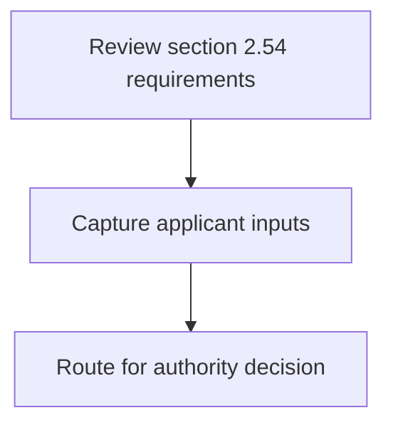
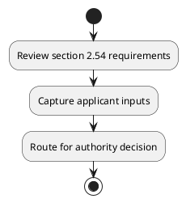

# Chapter 2 / Section 2.54: Import of other kinds of metallic waste and scraps

**Chapter Title:** General Provisions Regarding Imports and Exports

**Pages:** 25

**Purpose:** Defines the operational requirements for Import of other kinds of metallic waste and scraps.

**Purpose Thanglish:** Indha Import of other kinds of metallic waste and scraps section-la, Defines the operational requirements for import of other kinds of metallic waste and scraps.

**Summary:** 2.54 Import of other kinds of metallic waste and scraps
Import of other kinds of metallic waste and scrap will be allowed in terms of
conditions of ITC (HS).

**Business Meaning:** 2.54 Import of other kinds of metallic waste and scraps
Import of other kinds of metallic waste and scrap will be allowed in terms of
conditions of ITC (HS).

**Business Explanation:** 2.54 Import of other kinds of metallic waste and scraps
Import of other kinds of metallic waste and scrap will be allowed in terms of
conditions of ITC (HS).

**Business Explanation Thanglish:** Indha Import of other kinds of metallic waste and scraps section-la, 2.54 import of other kinds of metallic waste and scraps
import of other kinds of metallic waste and scrap will be allowed in terms of
conditions of ITC (HS).

## Business Logic
- None identified

## Business Rules
- rule_id=CH2-SEC2_54-R001, rule_description=2.54 Import of other kinds of metallic waste and scraps
Import of other kinds of metallic waste and scrap will be allowed in terms of
conditions of ITC (HS)., trigger=Import of other kinds of metallic waste and scraps, condition=Not explicitly covered in uploaded documents., validation=Not explicitly covered in uploaded documents., action=Manual review required., exception=No explicit exception found in uploaded documents., output=DEKAI should produce a compliance decision for 2.54 - Import of other kinds of metallic waste and scraps.

## Conditions
- None identified

## Condition Logic
- None identified

## Validations
- None identified

## Exceptions
- None identified

## Dependencies
- None identified

## Authorities
- None identified

## Required Documents
- None identified

## Timelines
- None identified

## Actions
- None identified

## Workflow
- Review section 2.54 requirements
- Capture applicant inputs
- Route for authority decision

## Workflow ASCII
```text
Import of other kinds of metallic waste and scraps
Review section 2.54 requirements
   |
   v
Capture applicant inputs
   |
   v
Route for authority decision
```

## Decision Tree
- IF section 2.54 applies THEN proceed with standard DGFT workflow

## Decision Tree ASCII
```text
Import of other kinds of metallic waste and scraps Decision
IF section 2.54 applies THEN proceed with standard DGFT workflow
```

## Examples
- User asks to process Import of other kinds of metallic waste and scraps; the platform checks conditions, validations, and documents before action.

**Real-world Example:** Example: an importer or exporter invokes Import of other kinds of metallic waste and scraps, submits the prescribed DGFT records, and DEKAI uses the extracted rules to follow the import of other kinds of metallic waste and scraps process.

**Real-world Example Thanglish:** Indha Import of other kinds of metallic waste and scraps section-la, Example: an importer or exporter invokes import of other kinds of metallic waste and scraps, submits the prescribed DGFT records, and DEKAI uses the extracted rules to follow the import of other kinds of metallic waste and scraps process.

## AI Rules
- None identified

## Database Fields
- name=section_code, type=string, required=True, source=parsed_section_heading
- name=section_title, type=string, required=True, source=parsed_section_heading
- name=and_flag, type=boolean, required=False, source=keyword:and
- name=itc_flag, type=boolean, required=False, source=keyword:ITC
- name=will_flag, type=boolean, required=False, source=keyword:will
- name=other_flag, type=boolean, required=False, source=keyword:other
- name=kinds_flag, type=boolean, required=False, source=keyword:kinds
- name=waste_flag, type=boolean, required=False, source=keyword:waste
- name=scrap_flag, type=boolean, required=False, source=keyword:scrap
- name=terms_flag, type=boolean, required=False, source=keyword:terms

## API Requirements
- method=GET, path=/api/dgft/sections/2.54, purpose=Retrieve knowledge payload for section 2.54, query_params=['include=workflow,decision_tree,validations'], response_fields=['section', 'title', 'summary', 'conditions', 'validations', 'exceptions', 'workflow', 'decision_tree']
- method=POST, path=/api/dgft/Import-of-other-kinds-of-metallic-waste-and-scraps/validate, purpose=Validate inputs and documents for Import of other kinds of metallic waste and scraps, request_fields=['section_code', 'section_title'], response_fields=['status', 'errors', 'warnings', 'next_actions']

## UI Screens
- screen_id=Import_of_other_kinds_of_metallic_waste_and_scraps_overview, name=Import of other kinds of metallic waste and scraps Overview, purpose=Show section summary, authority, timeline, and eligibility cues., widgets=['summary_card', 'conditions_table', 'authority_badges', 'timeline_panel']
- screen_id=Import_of_other_kinds_of_metallic_waste_and_scraps_submission, name=Import of other kinds of metallic waste and scraps Submission, purpose=Capture applicant data and supporting documents., widgets=['dynamic_form', 'document_uploader', 'validation_panel', 'next_action_footer'], fields=['section_code', 'section_title', 'and_flag', 'itc_flag', 'will_flag', 'other_flag', 'kinds_flag', 'waste_flag']

## Error Messages
- Validation failed because the section requirements were not fully met.

## FAQ
- question_en=What is the purpose of section 2.54?, answer_en=2.54 Import of other kinds of metallic waste and scraps
Import of other kinds of metallic waste and scrap will be allowed in terms of
conditions of ITC (HS)., question_thanglish=Indha Import of other kinds of metallic waste and scraps section-la, What is the purpose of section 2.54?, answer_thanglish=Indha Import of other kinds of metallic waste and scraps section-la, 2.54 import of other kinds of metallic waste and scraps
import of other kinds of metallic waste and scrap will be allowed in terms of
conditions of ITC (HS).
- question_en=What documents are required under Import of other kinds of metallic waste and scraps?, answer_en=Not explicitly covered in uploaded documents., question_thanglish=Indha Import of other kinds of metallic waste and scraps section-la, What documents are required under import of other kinds of metallic waste and scraps?, answer_thanglish=Indha Import of other kinds of metallic waste and scraps section-la, Not explicitly covered in uploaded documents.
- question_en=Which authority handles Import of other kinds of metallic waste and scraps?, answer_en=Not explicitly covered in uploaded documents., question_thanglish=Indha Import of other kinds of metallic waste and scraps section-la, Which authority handles import of other kinds of metallic waste and scraps?, answer_thanglish=Indha Import of other kinds of metallic waste and scraps section-la, Not explicitly covered in uploaded documents.

## Questions Users May Ask
- What does Import of other kinds of metallic waste and scraps require?
- Which documents are needed for Import of other kinds of metallic waste and scraps?
- How does DEKAI validate Import of other kinds of metallic waste and scraps requests?

## Expected AI Answers
- Import of other kinds of metallic waste and scraps requires the platform to interpret the section text, apply the extracted business rules, and present the correct next action.
- Required documents are inferred from the section text: no explicit documents were detected.
- DEKAI validates Import of other kinds of metallic waste and scraps by checking conditions, required documents, authority references, and exception clauses before recommending an outcome.

## AI Q&A Examples
- question_en=User asks: How do I comply with Import of other kinds of metallic waste and scraps?, answer_en=AI answers: DEKAI should evaluate section 2.54, apply the extracted rules, and guide the user through Review section 2.54 requirements., question_thanglish=Indha Import of other kinds of metallic waste and scraps section-la, User asks: How do I comply with import of other kinds of metallic waste and scraps?, answer_thanglish=Indha Import of other kinds of metallic waste and scraps section-la, AI answers: DEKAI should evaluate section 2.54, apply the extracted rules, and guide the user through Review section 2.54 requirements.
- question_en=User asks: Which validations apply to Import of other kinds of metallic waste and scraps?, answer_en=AI answers: Applicable validations are not explicitly covered in the uploaded documents., question_thanglish=Indha Import of other kinds of metallic waste and scraps section-la, User asks: Which validations apply to import of other kinds of metallic waste and scraps?, answer_thanglish=Indha Import of other kinds of metallic waste and scraps section-la, AI answers: Applicable validations are not explicitly covered in the uploaded documents.

## DEKAI AI Implementation Notes
- Capture chapter 2, section 2.54, title, and page references as immutable knowledge metadata.
- Bind validations for Import of other kinds of metallic waste and scraps into a rule engine keyed by the rule IDs extracted for this section.

## DEKAI AI Implementation Notes Thanglish
- Indha Import of other kinds of metallic waste and scraps section-la, Capture chapter 2, section 2.54, title, and page references as immutable knowledge metadata.
- Indha Import of other kinds of metallic waste and scraps section-la, Bind validations for import of other kinds of metallic waste and scraps into a rule engine keyed by the rule IDs extracted for this section.

## AI Metadata
- Keywords: and, ITC, will, other, kinds, waste, scrap, terms, Import, scraps, allowed, metallic, conditions
- Search Keywords: and, ITC, will, other, kinds, waste, scrap, terms, Import, scraps, allowed, metallic, conditions
- Intent: Provide knowledge guidance for Import of other kinds of metallic waste and scraps.
- Tags: 2.54, Import of other kinds of metallic waste and scraps, dgft
- Related Sections: 
- Related Chapters: 
- Related Rules: 

## Mermaid


## PlantUML

