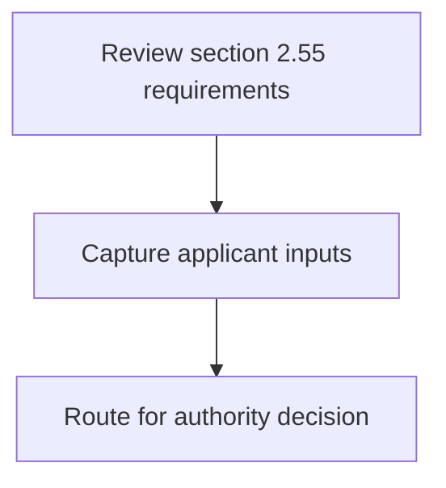
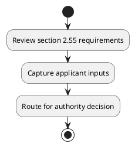

# Chapter 2 / Section 2.55: Imports of seconds and defectives

**Chapter Title:** General Provisions Regarding Imports and Exports

**Pages:** 25

**Purpose:** 2.55 Imports of seconds and defectives
Import policy for second and defective, rags, PET bottles /waste, and ships is given
in ITC (HS).

**Purpose Thanglish:** Indha Imports of seconds and defectives section-la, 2.55 Imports of seconds and defectives
import policy for second and defective, rags, PET bottles /waste, and ships is given
in ITC (HS).

**Summary:** 2.55 Imports of seconds and defectives
Import policy for second and defective, rags, PET bottles /waste, and ships is given
in ITC (HS).

**Business Meaning:** 2.55 Imports of seconds and defectives
Import policy for second and defective, rags, PET bottles /waste, and ships is given
in ITC (HS).

**Business Explanation:** 2.55 Imports of seconds and defectives
Import policy for second and defective, rags, PET bottles /waste, and ships is given
in ITC (HS).

**Business Explanation Thanglish:** Indha Imports of seconds and defectives section-la, 2.55 Imports of seconds and defectives
import policy for second and defective, rags, PET bottles /waste, and ships is given
in ITC (HS).

## Business Logic
- None identified

## Business Rules
- rule_id=CH2-SEC2_55-R001, rule_description=2.55 Imports of seconds and defectives
Import policy for second and defective, rags, PET bottles /waste, and ships is given
in ITC (HS)., trigger=Imports of seconds and defectives, condition=Not explicitly covered in uploaded documents., validation=Not explicitly covered in uploaded documents., action=Manual review required., exception=No explicit exception found in uploaded documents., output=DEKAI should produce a compliance decision for 2.55 - Imports of seconds and defectives.

## Conditions
- None identified

## Condition Logic
- None identified

## Validations
- None identified

## Exceptions
- None identified

## Dependencies
- None identified

## Authorities
- None identified

## Required Documents
- None identified

## Timelines
- None identified

## Actions
- None identified

## Workflow
- Review section 2.55 requirements
- Capture applicant inputs
- Route for authority decision

## Workflow ASCII
```text
Imports of seconds and defectives
Review section 2.55 requirements
   |
   v
Capture applicant inputs
   |
   v
Route for authority decision
```

## Decision Tree
- IF section 2.55 applies THEN proceed with standard DGFT workflow

## Decision Tree ASCII
```text
Imports of seconds and defectives Decision
IF section 2.55 applies THEN proceed with standard DGFT workflow
```

## Examples
- User asks to process Imports of seconds and defectives; the platform checks conditions, validations, and documents before action.

**Real-world Example:** Example: an importer or exporter invokes Imports of seconds and defectives, submits the prescribed DGFT records, and DEKAI uses the extracted rules to follow the imports of seconds and defectives process.

**Real-world Example Thanglish:** Indha Imports of seconds and defectives section-la, Example: an importer or exporter invokes Imports of seconds and defectives, submits the prescribed DGFT records, and DEKAI uses the extracted rules to follow the imports of seconds and defectives process.

## AI Rules
- None identified

## Database Fields
- name=section_code, type=string, required=True, source=parsed_section_heading
- name=section_title, type=string, required=True, source=parsed_section_heading
- name=and_flag, type=boolean, required=False, source=keyword:and
- name=for_flag, type=boolean, required=False, source=keyword:for
- name=pet_flag, type=boolean, required=False, source=keyword:PET
- name=itc_flag, type=boolean, required=False, source=keyword:ITC
- name=rags_flag, type=boolean, required=False, source=keyword:rags
- name=waste_flag, type=boolean, required=False, source=keyword:waste
- name=ships_flag, type=boolean, required=False, source=keyword:ships
- name=given_flag, type=boolean, required=False, source=keyword:given

## API Requirements
- method=GET, path=/api/dgft/sections/2.55, purpose=Retrieve knowledge payload for section 2.55, query_params=['include=workflow,decision_tree,validations'], response_fields=['section', 'title', 'summary', 'conditions', 'validations', 'exceptions', 'workflow', 'decision_tree']
- method=POST, path=/api/dgft/Imports-of-seconds-and-defectives/validate, purpose=Validate inputs and documents for Imports of seconds and defectives, request_fields=['section_code', 'section_title'], response_fields=['status', 'errors', 'warnings', 'next_actions']

## UI Screens
- screen_id=Imports_of_seconds_and_defectives_overview, name=Imports of seconds and defectives Overview, purpose=Show section summary, authority, timeline, and eligibility cues., widgets=['summary_card', 'conditions_table', 'authority_badges', 'timeline_panel']
- screen_id=Imports_of_seconds_and_defectives_submission, name=Imports of seconds and defectives Submission, purpose=Capture applicant data and supporting documents., widgets=['dynamic_form', 'document_uploader', 'validation_panel', 'next_action_footer'], fields=['section_code', 'section_title', 'and_flag', 'for_flag', 'pet_flag', 'itc_flag', 'rags_flag', 'waste_flag']

## Error Messages
- Validation failed because the section requirements were not fully met.

## FAQ
- question_en=What is the purpose of section 2.55?, answer_en=2.55 Imports of seconds and defectives
Import policy for second and defective, rags, PET bottles /waste, and ships is given
in ITC (HS)., question_thanglish=Indha Imports of seconds and defectives section-la, What is the purpose of section 2.55?, answer_thanglish=Indha Imports of seconds and defectives section-la, 2.55 Imports of seconds and defectives
import policy for second and defective, rags, PET bottles /waste, and ships is given
in ITC (HS).
- question_en=What documents are required under Imports of seconds and defectives?, answer_en=Not explicitly covered in uploaded documents., question_thanglish=Indha Imports of seconds and defectives section-la, What documents are required under Imports of seconds and defectives?, answer_thanglish=Indha Imports of seconds and defectives section-la, Not explicitly covered in uploaded documents.
- question_en=Which authority handles Imports of seconds and defectives?, answer_en=Not explicitly covered in uploaded documents., question_thanglish=Indha Imports of seconds and defectives section-la, Which authority handles Imports of seconds and defectives?, answer_thanglish=Indha Imports of seconds and defectives section-la, Not explicitly covered in uploaded documents.

## Questions Users May Ask
- What does Imports of seconds and defectives require?
- Which documents are needed for Imports of seconds and defectives?
- How does DEKAI validate Imports of seconds and defectives requests?

## Expected AI Answers
- Imports of seconds and defectives requires the platform to interpret the section text, apply the extracted business rules, and present the correct next action.
- Required documents are inferred from the section text: no explicit documents were detected.
- DEKAI validates Imports of seconds and defectives by checking conditions, required documents, authority references, and exception clauses before recommending an outcome.

## AI Q&A Examples
- question_en=User asks: How do I comply with Imports of seconds and defectives?, answer_en=AI answers: DEKAI should evaluate section 2.55, apply the extracted rules, and guide the user through Review section 2.55 requirements., question_thanglish=Indha Imports of seconds and defectives section-la, User asks: How do I comply with Imports of seconds and defectives?, answer_thanglish=Indha Imports of seconds and defectives section-la, AI answers: DEKAI should evaluate section 2.55, apply the extracted rules, and guide the user through Review section 2.55 requirements.
- question_en=User asks: Which validations apply to Imports of seconds and defectives?, answer_en=AI answers: Applicable validations are not explicitly covered in the uploaded documents., question_thanglish=Indha Imports of seconds and defectives section-la, User asks: Which validations apply to Imports of seconds and defectives?, answer_thanglish=Indha Imports of seconds and defectives section-la, AI answers: Applicable validations are not explicitly covered in the uploaded documents.

## DEKAI AI Implementation Notes
- Capture chapter 2, section 2.55, title, and page references as immutable knowledge metadata.
- Bind validations for Imports of seconds and defectives into a rule engine keyed by the rule IDs extracted for this section.

## DEKAI AI Implementation Notes Thanglish
- Indha Imports of seconds and defectives section-la, Capture chapter 2, section 2.55, title, and page references as immutable knowledge metadata.
- Indha Imports of seconds and defectives section-la, Bind validations for Imports of seconds and defectives into a rule engine keyed by the rule IDs extracted for this section.

## AI Metadata
- Keywords: and, for, PET, ITC, rags, waste, ships, given, Import, policy, second, Imports, seconds, bottles, defective, defectives
- Search Keywords: and, for, PET, ITC, rags, waste, ships, given, Import, policy, second, Imports, seconds, bottles, defective, defectives
- Intent: Provide knowledge guidance for Imports of seconds and defectives.
- Tags: 2.55, Imports of seconds and defectives, dgft
- Related Sections: 
- Related Chapters: 
- Related Rules: 

## Mermaid


## PlantUML

