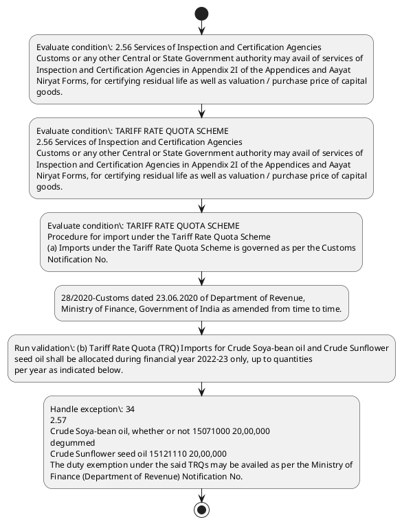

# Chapter 2 / Section 2.56: Services of Inspection and Certification Agencies

**Chapter Title:** General Provisions Regarding Imports and Exports

**Pages:** 25, 26

**Purpose:** 2.56 Services of Inspection and Certification Agencies
Customs or any other Central or State Government authority may avail of services of
Inspection and Certification Agencies in Appendix 2I of the Appendices and Aayat
Niryat Forms, for certifying residual life as well as valuation / purchase price of capital
goods.

**Purpose Thanglish:** Indha Services of Inspection and Certification Agencies section-la, 2.56 Services of Inspection and Certification Agencies
Customs or any other Central or State Government authority may avail of services of
Inspection and Certification Agencies in Appendix 2I of the Appendices and Aayat
Niryat Forms, for certifying residual life as well as valuation / purchase price of capital
goods.

**Summary:** 2.56 Services of Inspection and Certification Agencies
Customs or any other Central or State Government authority may avail of services of
Inspection and Certification Agencies in Appendix 2I of the Appendices and Aayat
Niryat Forms, for certifying residual life as well as valuation / purchase price of capital
goods. TARIFF RATE QUOTA SCHEME
2.56 Services of Inspection and Certification Agencies
Customs or any other Central or State Government authority may avail of services of
Inspection and Certification Agencies in Appendix 2I of the Appendices and Aayat
Niryat Forms, for certifying residual life as well as valuation / purchase price of capital
goods. TARIFF RATE QUOTA SCHEME
Procedure for import under the Tariff Rate Quota Scheme
(a) Imports under the Tariff Rate Quota Scheme is governed as per the Customs
Notification No.

**Business Meaning:** Services of Inspection and Certification Agencies governs how DGFT business controls should be applied, validated, and enforced.

**Business Explanation:** Services of Inspection and Certification Agencies explains the operating rule set that DEKAI should enforce. Key control points include (b) Tariff Rate Quota (TRQ) Imports for Crude Soya-bean oil and Crude Sunflower
seed oil shall be allocated during financial year 2022-23 only, up to quantities
per year as indicated below. The section also drives actions such as 28/2020-Customs dated 23.06.2020 of Department of Revenue,
Ministry of Finance, Government of India as amended from time to time..

**Business Explanation Thanglish:** Indha Services of Inspection and Certification Agencies section-la, Services of Inspection and Certification Agencies explains the operating rule set that DEKAI should enforce. Key control points include (b) Tariff Rate Quota (TRQ) Imports for Crude Soya-bean oil and Crude Sunflower
seed oil kandippa be allocated during financial year 2022-23 only, up to quantities
per year as indicated below. The section also drives actions such as 28/2020-Customs dated 23.06.2020 of Department of Revenue,
Ministry of Finance, Government of India as amended from time to time..

## Business Logic
- (b) Tariff Rate Quota (TRQ) Imports for Crude Soya-bean oil and Crude Sunflower
seed oil shall be allocated during financial year 2022-23 only, up to quantities
per year as indicated below.

## Business Rules
- rule_id=CH2-SEC2_56-R001, rule_description=(b) Tariff Rate Quota (TRQ) Imports for Crude Soya-bean oil and Crude Sunflower
seed oil shall be allocated during financial year 2022-23 only, up to quantities
per year as indicated below., trigger=Services of Inspection and Certification Agencies, condition=2.56 Services of Inspection and Certification Agencies
Customs or any other Central or State Government authority may avail of services of
Inspection and Certification Agencies in Appendix 2I of the Appendices and Aayat
Niryat Forms, for certifying residual life as well as valuation / purchase price of capital
goods., validation=(b) Tariff Rate Quota (TRQ) Imports for Crude Soya-bean oil and Crude Sunflower
seed oil shall be allocated during financial year 2022-23 only, up to quantities
per year as indicated below., action=28/2020-Customs dated 23.06.2020 of Department of Revenue,
Ministry of Finance, Government of India as amended from time to time., exception=34
2.57
Crude Soya-bean oil, whether or not 15071000 20,00,000
degummed
Crude Sunflower seed oil 15121110 20,00,000
The duty exemption under the said TRQs may be availed as per the Ministry of
Finance (Department of Revenue) Notification No., output=DEKAI should produce a compliance decision for 2.56 - Services of Inspection and Certification Agencies.

## Conditions
- 2.56 Services of Inspection and Certification Agencies
Customs or any other Central or State Government authority may avail of services of
Inspection and Certification Agencies in Appendix 2I of the Appendices and Aayat
Niryat Forms, for certifying residual life as well as valuation / purchase price of capital
goods.
- TARIFF RATE QUOTA SCHEME
2.56 Services of Inspection and Certification Agencies
Customs or any other Central or State Government authority may avail of services of
Inspection and Certification Agencies in Appendix 2I of the Appendices and Aayat
Niryat Forms, for certifying residual life as well as valuation / purchase price of capital
goods.
- TARIFF RATE QUOTA SCHEME
Procedure for import under the Tariff Rate Quota Scheme
(a) Imports under the Tariff Rate Quota Scheme is governed as per the Customs
Notification No.
- (b) Tariff Rate Quota (TRQ) Imports for Crude Soya-bean oil and Crude Sunflower
seed oil shall be allocated during financial year 2022-23 only, up to quantities
per year as indicated below.
- 34
2.57
Crude Soya-bean oil, whether or not 15071000 20,00,000
degummed
Crude Sunflower seed oil 15121110 20,00,000
The duty exemption under the said TRQs may be availed as per the Ministry of
Finance (Department of Revenue) Notification No.
- Note: The procedure for allocation of quota for the year 2022-23 under para 2.57(b) above
has already been notified, vide Public Notice No.

## Condition Logic
- id=2.2.56.1, if=2.56 Services of Inspection and Certification Agencies
Customs or any other Central or State Government authority may avail of services of
Inspection and Certification Agencies in Appendix 2I of the Appendices and Aayat
Niryat Forms, for certifying residual life as well as valuation / purchase price of capital
goods., then=28/2020-Customs dated 23.06.2020 of Department of Revenue,
Ministry of Finance, Government of India as amended from time to time., source=2.56 Services of Inspection and Certification Agencies
Customs or any other Central or State Government authority may avail of services of
Inspection and Certification Agencies in Appendix 2I of the Appendices and Aayat
Niryat Forms, for certifying residual life as well as valuation / purchase price of capital
goods.
- id=2.2.56.2, if=TARIFF RATE QUOTA SCHEME
2.56 Services of Inspection and Certification Agencies
Customs or any other Central or State Government authority may avail of services of
Inspection and Certification Agencies in Appendix 2I of the Appendices and Aayat
Niryat Forms, for certifying residual life as well as valuation / purchase price of capital
goods., then=28/2020-Customs dated 23.06.2020 of Department of Revenue,
Ministry of Finance, Government of India as amended from time to time., source=TARIFF RATE QUOTA SCHEME
2.56 Services of Inspection and Certification Agencies
Customs or any other Central or State Government authority may avail of services of
Inspection and Certification Agencies in Appendix 2I of the Appendices and Aayat
Niryat Forms, for certifying residual life as well as valuation / purchase price of capital
goods.
- id=2.2.56.3, if=TARIFF RATE QUOTA SCHEME
Procedure for import under the Tariff Rate Quota Scheme
(a) Imports under the Tariff Rate Quota Scheme is governed as per the Customs
Notification No., then=28/2020-Customs dated 23.06.2020 of Department of Revenue,
Ministry of Finance, Government of India as amended from time to time., source=TARIFF RATE QUOTA SCHEME
Procedure for import under the Tariff Rate Quota Scheme
(a) Imports under the Tariff Rate Quota Scheme is governed as per the Customs
Notification No.
- id=2.2.56.4, if=(b) Tariff Rate Quota (TRQ) Imports for Crude Soya-bean oil and Crude Sunflower
seed oil shall be allocated during financial year 2022-23 only, up to quantities
per year as indicated below., then=28/2020-Customs dated 23.06.2020 of Department of Revenue,
Ministry of Finance, Government of India as amended from time to time., source=(b) Tariff Rate Quota (TRQ) Imports for Crude Soya-bean oil and Crude Sunflower
seed oil shall be allocated during financial year 2022-23 only, up to quantities
per year as indicated below.
- id=2.2.56.5, if=34
2.57
Crude Soya-bean oil, whether or not 15071000 20,00,000
degummed
Crude Sunflower seed oil 15121110 20,00,000
The duty exemption under the said TRQs may be availed as per the Ministry of
Finance (Department of Revenue) Notification No., then=28/2020-Customs dated 23.06.2020 of Department of Revenue,
Ministry of Finance, Government of India as amended from time to time., source=34
2.57
Crude Soya-bean oil, whether or not 15071000 20,00,000
degummed
Crude Sunflower seed oil 15121110 20,00,000
The duty exemption under the said TRQs may be availed as per the Ministry of
Finance (Department of Revenue) Notification No.
- id=2.2.56.6, if=Note: The procedure for allocation of quota for the year 2022-23 under para 2.57(b) above
has already been notified, vide Public Notice No., then=28/2020-Customs dated 23.06.2020 of Department of Revenue,
Ministry of Finance, Government of India as amended from time to time., source=Note: The procedure for allocation of quota for the year 2022-23 under para 2.57(b) above
has already been notified, vide Public Notice No.

## Validations
- (b) Tariff Rate Quota (TRQ) Imports for Crude Soya-bean oil and Crude Sunflower
seed oil shall be allocated during financial year 2022-23 only, up to quantities
per year as indicated below.

## Exceptions
- 34
2.57
Crude Soya-bean oil, whether or not 15071000 20,00,000
degummed
Crude Sunflower seed oil 15121110 20,00,000
The duty exemption under the said TRQs may be availed as per the Ministry of
Finance (Department of Revenue) Notification No.

## Dependencies
- 2.57

## Authorities
- Customs
- State Government
- Customs or any other Central or State Government
- Imports under the Tariff Rate Quota Scheme is governed as per the Customs
- The duty exemption under the said TRQs may be availed as per the Ministry

## Required Documents
- None identified

## Timelines
- None identified

## Actions
- 28/2020-Customs dated 23.06.2020 of Department of Revenue,
Ministry of Finance, Government of India as amended from time to time.

## Workflow
- Evaluate condition: 2.56 Services of Inspection and Certification Agencies
Customs or any other Central or State Government authority may avail of services of
Inspection and Certification Agencies in Appendix 2I of the Appendices and Aayat
Niryat Forms, for certifying residual life as well as valuation / purchase price of capital
goods.
- Evaluate condition: TARIFF RATE QUOTA SCHEME
2.56 Services of Inspection and Certification Agencies
Customs or any other Central or State Government authority may avail of services of
Inspection and Certification Agencies in Appendix 2I of the Appendices and Aayat
Niryat Forms, for certifying residual life as well as valuation / purchase price of capital
goods.
- Evaluate condition: TARIFF RATE QUOTA SCHEME
Procedure for import under the Tariff Rate Quota Scheme
(a) Imports under the Tariff Rate Quota Scheme is governed as per the Customs
Notification No.
- 28/2020-Customs dated 23.06.2020 of Department of Revenue,
Ministry of Finance, Government of India as amended from time to time.
- Run validation: (b) Tariff Rate Quota (TRQ) Imports for Crude Soya-bean oil and Crude Sunflower
seed oil shall be allocated during financial year 2022-23 only, up to quantities
per year as indicated below.
- Handle exception: 34
2.57
Crude Soya-bean oil, whether or not 15071000 20,00,000
degummed
Crude Sunflower seed oil 15121110 20,00,000
The duty exemption under the said TRQs may be availed as per the Ministry of
Finance (Department of Revenue) Notification No.

## Workflow ASCII
```text
Services of Inspection and Certification Agencies
Evaluate condition: 2.56 Services of Inspection and Certification Agencies
Customs or any other Central or State Government authority may avail of services of
Inspection and Certification Agencies in Appendix 2I of the Appendices and Aayat
Niryat Forms, for certifying residual life as well as valuation / purchase price of capital
goods.
   |
   v
Evaluate condition: TARIFF RATE QUOTA SCHEME
2.56 Services of Inspection and Certification Agencies
Customs or any other Central or State Government authority may avail of services of
Inspection and Certification Agencies in Appendix 2I of the Appendices and Aayat
Niryat Forms, for certifying residual life as well as valuation / purchase price of capital
goods.
   |
   v
Evaluate condition: TARIFF RATE QUOTA SCHEME
Procedure for import under the Tariff Rate Quota Scheme
(a) Imports under the Tariff Rate Quota Scheme is governed as per the Customs
Notification No.
   |
   v
28/2020-Customs dated 23.06.2020 of Department of Revenue,
Ministry of Finance, Government of India as amended from time to time.
   |
   v
Run validation: (b) Tariff Rate Quota (TRQ) Imports for Crude Soya-bean oil and Crude Sunflower
seed oil shall be allocated during financial year 2022-23 only, up to quantities
per year as indicated below.
   |
   v
Handle exception: 34
2.57
Crude Soya-bean oil, whether or not 15071000 20,00,000
degummed
Crude Sunflower seed oil 15121110 20,00,000
The duty exemption under the said TRQs may be availed as per the Ministry of
Finance (Department of Revenue) Notification No.
```

## Decision Tree
- IF 2.56 Services of Inspection and Certification Agencies
Customs or any other Central or State Government authority may avail of services of
Inspection and Certification Agencies in Appendix 2I of the Appendices and Aayat
Niryat Forms, for certifying residual life as well as valuation / purchase price of capital
goods. THEN 28/2020-Customs dated 23.06.2020 of Department of Revenue,
Ministry of Finance, Government of India as amended from time to time.
- IF TARIFF RATE QUOTA SCHEME
2.56 Services of Inspection and Certification Agencies
Customs or any other Central or State Government authority may avail of services of
Inspection and Certification Agencies in Appendix 2I of the Appendices and Aayat
Niryat Forms, for certifying residual life as well as valuation / purchase price of capital
goods. THEN 28/2020-Customs dated 23.06.2020 of Department of Revenue,
Ministry of Finance, Government of India as amended from time to time.
- IF TARIFF RATE QUOTA SCHEME
Procedure for import under the Tariff Rate Quota Scheme
(a) Imports under the Tariff Rate Quota Scheme is governed as per the Customs
Notification No. THEN 28/2020-Customs dated 23.06.2020 of Department of Revenue,
Ministry of Finance, Government of India as amended from time to time.
- IF (b) Tariff Rate Quota (TRQ) Imports for Crude Soya-bean oil and Crude Sunflower
seed oil shall be allocated during financial year 2022-23 only, up to quantities
per year as indicated below. THEN 28/2020-Customs dated 23.06.2020 of Department of Revenue,
Ministry of Finance, Government of India as amended from time to time.
- IF 34
2.57
Crude Soya-bean oil, whether or not 15071000 20,00,000
degummed
Crude Sunflower seed oil 15121110 20,00,000
The duty exemption under the said TRQs may be availed as per the Ministry of
Finance (Department of Revenue) Notification No. THEN 28/2020-Customs dated 23.06.2020 of Department of Revenue,
Ministry of Finance, Government of India as amended from time to time.
- IF exception applies (34
2.57
Crude Soya-bean oil, whether or not 15071000 20,00,000
degummed
Crude Sunflower seed oil 15121110 20,00,000
The duty exemption under the said TRQs may be availed as per the Ministry of
Finance (Department of Revenue) Notification No.) THEN route to manual review

## Decision Tree ASCII
```text
Services of Inspection and Certification Agencies Decision
IF 2.56 Services of Inspection and Certification Agencies
Customs or any other Central or State Government authority may avail of services of
Inspection and Certification Agencies in Appendix 2I of the Appendices and Aayat
Niryat Forms, for certifying residual life as well as valuation / purchase price of capital
goods. THEN 28/2020-Customs dated 23.06.2020 of Department of Revenue,
Ministry of Finance, Government of India as amended from time to time.
   |
   v
IF TARIFF RATE QUOTA SCHEME
2.56 Services of Inspection and Certification Agencies
Customs or any other Central or State Government authority may avail of services of
Inspection and Certification Agencies in Appendix 2I of the Appendices and Aayat
Niryat Forms, for certifying residual life as well as valuation / purchase price of capital
goods. THEN 28/2020-Customs dated 23.06.2020 of Department of Revenue,
Ministry of Finance, Government of India as amended from time to time.
   |
   v
IF TARIFF RATE QUOTA SCHEME
Procedure for import under the Tariff Rate Quota Scheme
(a) Imports under the Tariff Rate Quota Scheme is governed as per the Customs
Notification No. THEN 28/2020-Customs dated 23.06.2020 of Department of Revenue,
Ministry of Finance, Government of India as amended from time to time.
   |
   v
IF (b) Tariff Rate Quota (TRQ) Imports for Crude Soya-bean oil and Crude Sunflower
seed oil shall be allocated during financial year 2022-23 only, up to quantities
per year as indicated below. THEN 28/2020-Customs dated 23.06.2020 of Department of Revenue,
Ministry of Finance, Government of India as amended from time to time.
   |
   v
IF 34
2.57
Crude Soya-bean oil, whether or not 15071000 20,00,000
degummed
Crude Sunflower seed oil 15121110 20,00,000
The duty exemption under the said TRQs may be availed as per the Ministry of
Finance (Department of Revenue) Notification No. THEN 28/2020-Customs dated 23.06.2020 of Department of Revenue,
Ministry of Finance, Government of India as amended from time to time.
   |
   v
IF exception applies (34
2.57
Crude Soya-bean oil, whether or not 15071000 20,00,000
degummed
Crude Sunflower seed oil 15121110 20,00,000
The duty exemption under the said TRQs may be availed as per the Ministry of
Finance (Department of Revenue) Notification No.) THEN route to manual review
```

## Examples
- User asks to process Services of Inspection and Certification Agencies; the platform checks conditions, validations, and documents before action.

**Real-world Example:** Example: an importer or exporter invokes Services of Inspection and Certification Agencies, submits the prescribed DGFT records, and DEKAI uses the extracted rules to 28/2020-customs dated 23.06.2020 of department of revenue,
ministry of finance, government of india as amended from time to time..

**Real-world Example Thanglish:** Indha Services of Inspection and Certification Agencies section-la, Example: an importer or exporter invokes Services of Inspection and Certification Agencies, submits the prescribed DGFT records, and DEKAI uses the extracted rules to 28/2020-customs dated 23.06.2020 of department of revenue,
ministry of finance, government of india as amended from time to time..

## AI Rules
- IF detected context matches section rule THEN enforce: (b) Tariff Rate Quota (TRQ) Imports for Crude Soya-bean oil and Crude Sunflower
seed oil shall be allocated during financial year 2022-23 only, up to quantities
per year as indicated below.
- IF validations pass THEN recommend action: 28/2020-Customs dated 23.06.2020 of Department of Revenue,
Ministry of Finance, Government of India as amended from time to time.

## Database Fields
- name=section_code, type=string, required=True, source=parsed_section_heading
- name=section_title, type=string, required=True, source=parsed_section_heading
- name=and_flag, type=boolean, required=False, source=keyword:and
- name=any_flag, type=boolean, required=False, source=keyword:any
- name=may_flag, type=boolean, required=False, source=keyword:may
- name=the_flag, type=boolean, required=False, source=keyword:the
- name=for_flag, type=boolean, required=False, source=keyword:for
- name=per_flag, type=boolean, required=False, source=keyword:per
- name=trq_flag, type=boolean, required=False, source=keyword:TRQ
- name=oil_flag, type=boolean, required=False, source=keyword:oil

## API Requirements
- method=GET, path=/api/dgft/sections/2.56, purpose=Retrieve knowledge payload for section 2.56, query_params=['include=workflow,decision_tree,validations'], response_fields=['section', 'title', 'summary', 'conditions', 'validations', 'exceptions', 'workflow', 'decision_tree']
- method=POST, path=/api/dgft/Services-of-Inspection-and-Certification-Agencies/validate, purpose=Validate inputs and documents for Services of Inspection and Certification Agencies, request_fields=['section_code', 'section_title'], response_fields=['status', 'errors', 'warnings', 'next_actions']
- method=POST, path=/api/dgft/Services-of-Inspection-and-Certification-Agencies/execute, purpose=Trigger business action for 28/2020-Customs dated 23.06.2020 of Department of Revenue,
Ministry of Finance, Government of India as amended from time to time., request_fields=['section_code', 'section_title'], response_fields=['reference_id', 'status', 'authority', 'timeline']

## UI Screens
- screen_id=Services_of_Inspection_and_Certification_Agencies_overview, name=Services of Inspection and Certification Agencies Overview, purpose=Show section summary, authority, timeline, and eligibility cues., widgets=['summary_card', 'conditions_table', 'authority_badges', 'timeline_panel']
- screen_id=Services_of_Inspection_and_Certification_Agencies_submission, name=Services of Inspection and Certification Agencies Submission, purpose=Capture applicant data and supporting documents., widgets=['dynamic_form', 'document_uploader', 'validation_panel', 'next_action_footer'], fields=['section_code', 'section_title', 'and_flag', 'any_flag', 'may_flag', 'the_flag', 'for_flag', 'per_flag']
- screen_id=Services_of_Inspection_and_Certification_Agencies_exceptions, name=Services of Inspection and Certification Agencies Exception Review, purpose=Explain exception handling and manual review triggers., widgets=['exception_banner', 'decision_tree', 'case_notes']

## Error Messages
- Validation failed because the section requirements were not fully met.

## FAQ
- question_en=What is the purpose of section 2.56?, answer_en=Services of Inspection and Certification Agencies explains the operating rule set that DEKAI should enforce. Key control points include (b) Tariff Rate Quota (TRQ) Imports for Crude Soya-bean oil and Crude Sunflower
seed oil shall be allocated during financial year 2022-23 only, up to quantities
per year as indicated below. The section also drives actions such as 28/2020-Customs dated 23.06.2020 of Department of Revenue,
Ministry of Finance, Government of India as amended from time to time.., question_thanglish=Indha Services of Inspection and Certification Agencies section-la, What is the purpose of section 2.56?, answer_thanglish=Indha Services of Inspection and Certification Agencies section-la, Services of Inspection and Certification Agencies explains the operating rule set that DEKAI should enforce. Key control points include (b) Tariff Rate Quota (TRQ) Imports for Crude Soya-bean oil and Crude Sunflower
seed oil kandippa be allocated during financial year 2022-23 only, up to quantities
per year as indicated below. The section also drives actions such as 28/2020-Customs dated 23.06.2020 of Department of Revenue,
Ministry of Finance, Government of India as amended from time to time..
- question_en=What documents are required under Services of Inspection and Certification Agencies?, answer_en=Not explicitly covered in uploaded documents., question_thanglish=Indha Services of Inspection and Certification Agencies section-la, What documents are required under Services of Inspection and Certification Agencies?, answer_thanglish=Indha Services of Inspection and Certification Agencies section-la, Not explicitly covered in uploaded documents.
- question_en=Which authority handles Services of Inspection and Certification Agencies?, answer_en=Customs, State Government, Customs or any other Central or State Government, Imports under the Tariff Rate Quota Scheme is governed as per the Customs, The duty exemption under the said TRQs may be availed as per the Ministry, question_thanglish=Indha Services of Inspection and Certification Agencies section-la, Which authority handles Services of Inspection and Certification Agencies?, answer_thanglish=Indha Services of Inspection and Certification Agencies section-la, Customs, State Government, Customs or any other Central or State Government, Imports under the Tariff Rate Quota Scheme is governed as per the Customs, The duty exemption under the said TRQs may be availed as per the Ministry

## Questions Users May Ask
- What does Services of Inspection and Certification Agencies require?
- Which documents are needed for Services of Inspection and Certification Agencies?
- How does DEKAI validate Services of Inspection and Certification Agencies requests?
- What action should be taken for Services of Inspection and Certification Agencies?

## Expected AI Answers
- Services of Inspection and Certification Agencies requires the platform to interpret the section text, apply the extracted business rules, and present the correct next action.
- Required documents are inferred from the section text: no explicit documents were detected.
- DEKAI validates Services of Inspection and Certification Agencies by checking conditions, required documents, authority references, and exception clauses before recommending an outcome.
- The primary extracted action is: 28/2020-Customs dated 23.06.2020 of Department of Revenue,
Ministry of Finance, Government of India as amended from time to time.

## AI Q&A Examples
- question_en=User asks: How do I comply with Services of Inspection and Certification Agencies?, answer_en=AI answers: DEKAI should evaluate section 2.56, apply the extracted rules, and guide the user through Evaluate condition: 2.56 Services of Inspection and Certification Agencies
Customs or any other Central or State Government authority may avail of services of
Inspection and Certification Agencies in Appendix 2I of the Appendices and Aayat
Niryat Forms, for certifying residual life as well as valuation / purchase price of capital
goods.., question_thanglish=Indha Services of Inspection and Certification Agencies section-la, User asks: How do I comply with Services of Inspection and Certification Agencies?, answer_thanglish=Indha Services of Inspection and Certification Agencies section-la, AI answers: DEKAI should evaluate section 2.56, apply the extracted rules, and guide the user through Evaluate condition: 2.56 Services of Inspection and Certification Agencies
Customs or any other Central or State Government authority may avail of services of
Inspection and Certification Agencies in Appendix 2I of the Appendices and Aayat
Niryat Forms, for certifying residual life as well as valuation / purchase price of capital
goods..
- question_en=User asks: Which validations apply to Services of Inspection and Certification Agencies?, answer_en=AI answers: Applicable validations are (b) Tariff Rate Quota (TRQ) Imports for Crude Soya-bean oil and Crude Sunflower
seed oil shall be allocated during financial year 2022-23 only, up to quantities
per year as indicated below., question_thanglish=Indha Services of Inspection and Certification Agencies section-la, User asks: Which validations apply to Services of Inspection and Certification Agencies?, answer_thanglish=Indha Services of Inspection and Certification Agencies section-la, AI answers: Applicable validations are (b) Tariff Rate Quota (TRQ) Imports for Crude Soya-bean oil and Crude Sunflower
seed oil kandippa be allocated during financial year 2022-23 only, up to quantities
per year as indicated below.

## DEKAI AI Implementation Notes
- Capture chapter 2, section 2.56, title, and page references as immutable knowledge metadata.
- Bind validations for Services of Inspection and Certification Agencies into a rule engine keyed by the rule IDs extracted for this section.
- Route escalations or approvals to: Customs, State Government, Customs or any other Central or State Government, Imports under the Tariff Rate Quota Scheme is governed as per the Customs.
- Trigger manual review when exception clauses are detected.
- Show contextual links to related sections: 2.57.

## DEKAI AI Implementation Notes Thanglish
- Indha Services of Inspection and Certification Agencies section-la, Capture chapter 2, section 2.56, title, and page references as immutable knowledge metadata.
- Indha Services of Inspection and Certification Agencies section-la, Bind validations for Services of Inspection and Certification Agencies into a rule engine keyed by the rule IDs extracted for this section.
- Indha Services of Inspection and Certification Agencies section-la, Route escalations or approvals to: Customs, State Government, Customs or any other Central or State Government, Imports under the Tariff Rate Quota Scheme is governed as per the Customs.
- Indha Services of Inspection and Certification Agencies section-la, Trigger manual review when exception clauses are detected.
- Indha Services of Inspection and Certification Agencies section-la, Show contextual links to related sections: 2.57.

## AI Metadata
- Keywords: and, any, may, the, for, per, TRQ, oil, ITC, not, has, Nos, life, well, RATE, from, time, seed, year, only
- Search Keywords: and, any, may, the, for, per, TRQ, oil, ITC, not, has, Nos, life, well, RATE, from, time, seed, year, only
- Intent: Support Services of Inspection and Certification Agencies processing and compliance validation.
- Tags: 2.56, Services of Inspection and Certification Agencies, business-rule, dgft
- Related Sections: 2.57
- Related Chapters: 
- Related Rules: (b) Tariff Rate Quota (TRQ) Imports for Crude Soya-bean oil and Crude Sunflower
seed oil shall be allocated during financial year 2022-23 only, up to quantities
per year as indicated below.

## Mermaid

```mermaid
flowchart TD
    S1["Evaluate condition: 2.56 Services of Inspection and Certification Agencies
Customs or any other Central or State Government authority may avail of services of
Inspection and Certification Agencies in Appendix 2I of the Appendices and Aayat
Niryat Forms, for certifying residual life as well as valuation / purchase price of capital
goods."]
    S2["Evaluate condition: TARIFF RATE QUOTA SCHEME
2.56 Services of Inspection and Certification Agencies
Customs or any other Central or State Government authority may avail of services of
Inspection and Certification Agencies in Appendix 2I of the Appendices and Aayat
Niryat Forms, for certifying residual life as well as valuation / purchase price of capital
goods."]
    S1 --> S2
    S3["Evaluate condition: TARIFF RATE QUOTA SCHEME
Procedure for import under the Tariff Rate Quota Scheme
(a) Imports under the Tariff Rate Quota Scheme is governed as per the Customs
Notification No."]
    S2 --> S3
    S4["28/2020-Customs dated 23.06.2020 of Department of Revenue,
Ministry of Finance, Government of India as amended from time to time."]
    S3 --> S4
    S5["Run validation: (b) Tariff Rate Quota (TRQ) Imports for Crude Soya-bean oil and Crude Sunflower
seed oil shall be allocated during financial year 2022-23 only, up to quantities
per year as indicated below."]
    S4 --> S5
    S6["Handle exception: 34
2.57
Crude Soya-bean oil, whether or not 15071000 20,00,000
degummed
Crude Sunflower seed oil 15121110 20,00,000
The duty exemption under the said TRQs may be availed as per the Ministry of
Finance (Department of Revenue) Notification No."]
    S5 --> S6
```


## PlantUML

