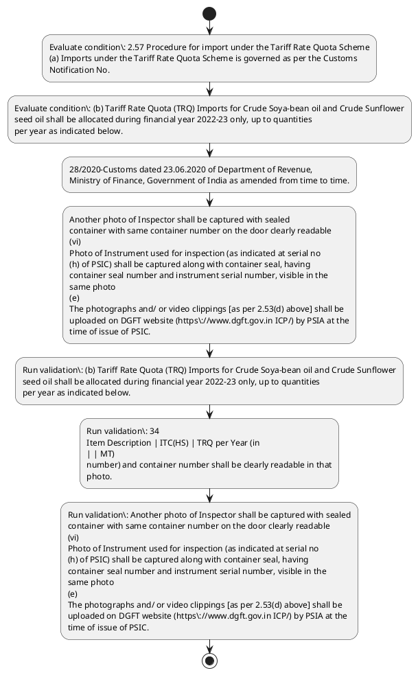

# Chapter 2 / Section 2.57: Procedure for import under the Tariff Rate Quota Scheme

**Chapter Title:** General Provisions Regarding Imports and Exports

**Pages:** 25

**Purpose:** 2.57 Procedure for import under the Tariff Rate Quota Scheme
(a) Imports under the Tariff Rate Quota Scheme is governed as per the Customs
Notification No.

**Purpose Thanglish:** Indha Procedure for import under the Tariff Rate Quota Scheme section-la, 2.57 Procedure for import under the Tariff Rate Quota Scheme
(a) Imports under the Tariff Rate Quota Scheme is governed as per the Customs
Notification No.

**Summary:** 2.57 Procedure for import under the Tariff Rate Quota Scheme
(a) Imports under the Tariff Rate Quota Scheme is governed as per the Customs
Notification No. 28/2020-Customs dated 23.06.2020 of Department of Revenue,
Ministry of Finance, Government of India as amended from time to time. (b) Tariff Rate Quota (TRQ) Imports for Crude Soya-bean oil and Crude Sunflower
seed oil shall be allocated during financial year 2022-23 only, up to quantities
per year as indicated below.

**Business Meaning:** Procedure for import under the Tariff Rate Quota Scheme governs how DGFT business controls should be applied, validated, and enforced.

**Business Explanation:** Procedure for import under the Tariff Rate Quota Scheme explains the operating rule set that DEKAI should enforce. Key control points include (b) Tariff Rate Quota (TRQ) Imports for Crude Soya-bean oil and Crude Sunflower
seed oil shall be allocated during financial year 2022-23 only, up to quantities
per year as indicated below. The section also drives actions such as 28/2020-Customs dated 23.06.2020 of Department of Revenue,
Ministry of Finance, Government of India as amended from time to time..

**Business Explanation Thanglish:** Indha Procedure for import under the Tariff Rate Quota Scheme section-la, Procedure for import under the Tariff Rate Quota Scheme explains the operating rule set that DEKAI should enforce. Key control points include (b) Tariff Rate Quota (TRQ) Imports for Crude Soya-bean oil and Crude Sunflower
seed oil kandippa be allocated during financial year 2022-23 only, up to quantities
per year as indicated below. The section also drives actions such as 28/2020-Customs dated 23.06.2020 of Department of Revenue,
Ministry of Finance, Government of India as amended from time to time..

## Business Logic
- (b) Tariff Rate Quota (TRQ) Imports for Crude Soya-bean oil and Crude Sunflower
seed oil shall be allocated during financial year 2022-23 only, up to quantities
per year as indicated below.
- 34
Item Description | ITC(HS) | TRQ per Year (in
| | MT)
number) and container number shall be clearly readable in that
photo.
- Another photo of Inspector shall be captured with sealed
container with same container number on the door clearly readable
(vi)
Photo of Instrument used for inspection (as indicated at serial no
(h) of PSIC) shall be captured along with container seal, having
container seal number and instrument serial number, visible in the
same photo
(e)
The photographs and/ or video clippings [as per 2.53(d) above] shall be
uploaded on DGFT website (https://www.dgft.gov.in ICP/) by PSIA at the
time of issue of PSIC.

## Business Rules
- rule_id=CH2-SEC2_57-R001, rule_description=(b) Tariff Rate Quota (TRQ) Imports for Crude Soya-bean oil and Crude Sunflower
seed oil shall be allocated during financial year 2022-23 only, up to quantities
per year as indicated below., trigger=Procedure for import under the Tariff Rate Quota Scheme, condition=2.57 Procedure for import under the Tariff Rate Quota Scheme
(a) Imports under the Tariff Rate Quota Scheme is governed as per the Customs
Notification No., validation=(b) Tariff Rate Quota (TRQ) Imports for Crude Soya-bean oil and Crude Sunflower
seed oil shall be allocated during financial year 2022-23 only, up to quantities
per year as indicated below., action=28/2020-Customs dated 23.06.2020 of Department of Revenue,
Ministry of Finance, Government of India as amended from time to time., exception=No explicit exception found in uploaded documents., output=DEKAI should produce a compliance decision for 2.57 - Procedure for import under the Tariff Rate Quota Scheme.
- rule_id=CH2-SEC2_57-R002, rule_description=34
Item Description | ITC(HS) | TRQ per Year (in
| | MT)
number) and container number shall be clearly readable in that
photo., trigger=Procedure for import under the Tariff Rate Quota Scheme, condition=(b) Tariff Rate Quota (TRQ) Imports for Crude Soya-bean oil and Crude Sunflower
seed oil shall be allocated during financial year 2022-23 only, up to quantities
per year as indicated below., validation=34
Item Description | ITC(HS) | TRQ per Year (in
| | MT)
number) and container number shall be clearly readable in that
photo., action=Another photo of Inspector shall be captured with sealed
container with same container number on the door clearly readable
(vi)
Photo of Instrument used for inspection (as indicated at serial no
(h) of PSIC) shall be captured along with container seal, having
container seal number and instrument serial number, visible in the
same photo
(e)
The photographs and/ or video clippings [as per 2.53(d) above] shall be
uploaded on DGFT website (https://www.dgft.gov.in ICP/) by PSIA at the
time of issue of PSIC., exception=No explicit exception found in uploaded documents., output=DEKAI should produce a compliance decision for 2.57 - Procedure for import under the Tariff Rate Quota Scheme.
- rule_id=CH2-SEC2_57-R003, rule_description=Another photo of Inspector shall be captured with sealed
container with same container number on the door clearly readable
(vi)
Photo of Instrument used for inspection (as indicated at serial no
(h) of PSIC) shall be captured along with container seal, having
container seal number and instrument serial number, visible in the
same photo
(e)
The photographs and/ or video clippings [as per 2.53(d) above] shall be
uploaded on DGFT website (https://www.dgft.gov.in ICP/) by PSIA at the
time of issue of PSIC., trigger=Procedure for import under the Tariff Rate Quota Scheme, condition=(b) Tariff Rate Quota (TRQ) Imports for Crude Soya-bean oil and Crude Sunflower
seed oil shall be allocated during financial year 2022-23 only, up to quantities
per year as indicated below., validation=Another photo of Inspector shall be captured with sealed
container with same container number on the door clearly readable
(vi)
Photo of Instrument used for inspection (as indicated at serial no
(h) of PSIC) shall be captured along with container seal, having
container seal number and instrument serial number, visible in the
same photo
(e)
The photographs and/ or video clippings [as per 2.53(d) above] shall be
uploaded on DGFT website (https://www.dgft.gov.in ICP/) by PSIA at the
time of issue of PSIC., action=Another photo of Inspector shall be captured with sealed
container with same container number on the door clearly readable
(vi)
Photo of Instrument used for inspection (as indicated at serial no
(h) of PSIC) shall be captured along with container seal, having
container seal number and instrument serial number, visible in the
same photo
(e)
The photographs and/ or video clippings [as per 2.53(d) above] shall be
uploaded on DGFT website (https://www.dgft.gov.in ICP/) by PSIA at the
time of issue of PSIC., exception=No explicit exception found in uploaded documents., output=DEKAI should produce a compliance decision for 2.57 - Procedure for import under the Tariff Rate Quota Scheme.

## Conditions
- 2.57 Procedure for import under the Tariff Rate Quota Scheme
(a) Imports under the Tariff Rate Quota Scheme is governed as per the Customs
Notification No.
- (b) Tariff Rate Quota (TRQ) Imports for Crude Soya-bean oil and Crude Sunflower
seed oil shall be allocated during financial year 2022-23 only, up to quantities
per year as indicated below.

## Condition Logic
- id=2.2.57.1, if=2.57 Procedure for import under the Tariff Rate Quota Scheme
(a) Imports under the Tariff Rate Quota Scheme is governed as per the Customs
Notification No., then=28/2020-Customs dated 23.06.2020 of Department of Revenue,
Ministry of Finance, Government of India as amended from time to time., source=2.57 Procedure for import under the Tariff Rate Quota Scheme
(a) Imports under the Tariff Rate Quota Scheme is governed as per the Customs
Notification No.
- id=2.2.57.2, if=(b) Tariff Rate Quota (TRQ) Imports for Crude Soya-bean oil and Crude Sunflower
seed oil shall be allocated during financial year 2022-23 only, up to quantities
per year as indicated below., then=28/2020-Customs dated 23.06.2020 of Department of Revenue,
Ministry of Finance, Government of India as amended from time to time., source=(b) Tariff Rate Quota (TRQ) Imports for Crude Soya-bean oil and Crude Sunflower
seed oil shall be allocated during financial year 2022-23 only, up to quantities
per year as indicated below.

## Validations
- (b) Tariff Rate Quota (TRQ) Imports for Crude Soya-bean oil and Crude Sunflower
seed oil shall be allocated during financial year 2022-23 only, up to quantities
per year as indicated below.
- 34
Item Description | ITC(HS) | TRQ per Year (in
| | MT)
number) and container number shall be clearly readable in that
photo.
- Another photo of Inspector shall be captured with sealed
container with same container number on the door clearly readable
(vi)
Photo of Instrument used for inspection (as indicated at serial no
(h) of PSIC) shall be captured along with container seal, having
container seal number and instrument serial number, visible in the
same photo
(e)
The photographs and/ or video clippings [as per 2.53(d) above] shall be
uploaded on DGFT website (https://www.dgft.gov.in ICP/) by PSIA at the
time of issue of PSIC.

## Exceptions
- None identified

## Dependencies
- 2.53

## Authorities
- Customs
- Imports under the Tariff Rate Quota Scheme is governed as per the Customs
- DGFT

## Required Documents
- None identified

## Timelines
- None identified

## Actions
- 28/2020-Customs dated 23.06.2020 of Department of Revenue,
Ministry of Finance, Government of India as amended from time to time.
- Another photo of Inspector shall be captured with sealed
container with same container number on the door clearly readable
(vi)
Photo of Instrument used for inspection (as indicated at serial no
(h) of PSIC) shall be captured along with container seal, having
container seal number and instrument serial number, visible in the
same photo
(e)
The photographs and/ or video clippings [as per 2.53(d) above] shall be
uploaded on DGFT website (https://www.dgft.gov.in ICP/) by PSIA at the
time of issue of PSIC.

## Workflow
- Evaluate condition: 2.57 Procedure for import under the Tariff Rate Quota Scheme
(a) Imports under the Tariff Rate Quota Scheme is governed as per the Customs
Notification No.
- Evaluate condition: (b) Tariff Rate Quota (TRQ) Imports for Crude Soya-bean oil and Crude Sunflower
seed oil shall be allocated during financial year 2022-23 only, up to quantities
per year as indicated below.
- 28/2020-Customs dated 23.06.2020 of Department of Revenue,
Ministry of Finance, Government of India as amended from time to time.
- Another photo of Inspector shall be captured with sealed
container with same container number on the door clearly readable
(vi)
Photo of Instrument used for inspection (as indicated at serial no
(h) of PSIC) shall be captured along with container seal, having
container seal number and instrument serial number, visible in the
same photo
(e)
The photographs and/ or video clippings [as per 2.53(d) above] shall be
uploaded on DGFT website (https://www.dgft.gov.in ICP/) by PSIA at the
time of issue of PSIC.
- Run validation: (b) Tariff Rate Quota (TRQ) Imports for Crude Soya-bean oil and Crude Sunflower
seed oil shall be allocated during financial year 2022-23 only, up to quantities
per year as indicated below.
- Run validation: 34
Item Description | ITC(HS) | TRQ per Year (in
| | MT)
number) and container number shall be clearly readable in that
photo.
- Run validation: Another photo of Inspector shall be captured with sealed
container with same container number on the door clearly readable
(vi)
Photo of Instrument used for inspection (as indicated at serial no
(h) of PSIC) shall be captured along with container seal, having
container seal number and instrument serial number, visible in the
same photo
(e)
The photographs and/ or video clippings [as per 2.53(d) above] shall be
uploaded on DGFT website (https://www.dgft.gov.in ICP/) by PSIA at the
time of issue of PSIC.

## Workflow ASCII
```text
Procedure for import under the Tariff Rate Quota Scheme
Evaluate condition: 2.57 Procedure for import under the Tariff Rate Quota Scheme
(a) Imports under the Tariff Rate Quota Scheme is governed as per the Customs
Notification No.
   |
   v
Evaluate condition: (b) Tariff Rate Quota (TRQ) Imports for Crude Soya-bean oil and Crude Sunflower
seed oil shall be allocated during financial year 2022-23 only, up to quantities
per year as indicated below.
   |
   v
28/2020-Customs dated 23.06.2020 of Department of Revenue,
Ministry of Finance, Government of India as amended from time to time.
   |
   v
Another photo of Inspector shall be captured with sealed
container with same container number on the door clearly readable
(vi)
Photo of Instrument used for inspection (as indicated at serial no
(h) of PSIC) shall be captured along with container seal, having
container seal number and instrument serial number, visible in the
same photo
(e)
The photographs and/ or video clippings [as per 2.53(d) above] shall be
uploaded on DGFT website (https://www.dgft.gov.in ICP/) by PSIA at the
time of issue of PSIC.
   |
   v
Run validation: (b) Tariff Rate Quota (TRQ) Imports for Crude Soya-bean oil and Crude Sunflower
seed oil shall be allocated during financial year 2022-23 only, up to quantities
per year as indicated below.
   |
   v
Run validation: 34
Item Description | ITC(HS) | TRQ per Year (in
| | MT)
number) and container number shall be clearly readable in that
photo.
   |
   v
Run validation: Another photo of Inspector shall be captured with sealed
container with same container number on the door clearly readable
(vi)
Photo of Instrument used for inspection (as indicated at serial no
(h) of PSIC) shall be captured along with container seal, having
container seal number and instrument serial number, visible in the
same photo
(e)
The photographs and/ or video clippings [as per 2.53(d) above] shall be
uploaded on DGFT website (https://www.dgft.gov.in ICP/) by PSIA at the
time of issue of PSIC.
```

## Decision Tree
- IF 2.57 Procedure for import under the Tariff Rate Quota Scheme
(a) Imports under the Tariff Rate Quota Scheme is governed as per the Customs
Notification No. THEN 28/2020-Customs dated 23.06.2020 of Department of Revenue,
Ministry of Finance, Government of India as amended from time to time.
- IF (b) Tariff Rate Quota (TRQ) Imports for Crude Soya-bean oil and Crude Sunflower
seed oil shall be allocated during financial year 2022-23 only, up to quantities
per year as indicated below. THEN 28/2020-Customs dated 23.06.2020 of Department of Revenue,
Ministry of Finance, Government of India as amended from time to time.

## Decision Tree ASCII
```text
Procedure for import under the Tariff Rate Quota Scheme Decision
IF 2.57 Procedure for import under the Tariff Rate Quota Scheme
(a) Imports under the Tariff Rate Quota Scheme is governed as per the Customs
Notification No. THEN 28/2020-Customs dated 23.06.2020 of Department of Revenue,
Ministry of Finance, Government of India as amended from time to time.
   |
   v
IF (b) Tariff Rate Quota (TRQ) Imports for Crude Soya-bean oil and Crude Sunflower
seed oil shall be allocated during financial year 2022-23 only, up to quantities
per year as indicated below. THEN 28/2020-Customs dated 23.06.2020 of Department of Revenue,
Ministry of Finance, Government of India as amended from time to time.
```

## Examples
- User asks to process Procedure for import under the Tariff Rate Quota Scheme; the platform checks conditions, validations, and documents before action.

**Real-world Example:** Example: an importer or exporter invokes Procedure for import under the Tariff Rate Quota Scheme, submits the prescribed DGFT records, and DEKAI uses the extracted rules to 28/2020-customs dated 23.06.2020 of department of revenue,
ministry of finance, government of india as amended from time to time..

**Real-world Example Thanglish:** Indha Procedure for import under the Tariff Rate Quota Scheme section-la, Example: an importer or exporter invokes Procedure for import under the Tariff Rate Quota Scheme, submits the prescribed DGFT records, and DEKAI uses the extracted rules to 28/2020-customs dated 23.06.2020 of department of revenue,
ministry of finance, government of india as amended from time to time..

## AI Rules
- IF detected context matches section rule THEN enforce: (b) Tariff Rate Quota (TRQ) Imports for Crude Soya-bean oil and Crude Sunflower
seed oil shall be allocated during financial year 2022-23 only, up to quantities
per year as indicated below.
- IF detected context matches section rule THEN enforce: 34
Item Description | ITC(HS) | TRQ per Year (in
| | MT)
number) and container number shall be clearly readable in that
photo.
- IF detected context matches section rule THEN enforce: Another photo of Inspector shall be captured with sealed
container with same container number on the door clearly readable
(vi)
Photo of Instrument used for inspection (as indicated at serial no
(h) of PSIC) shall be captured along with container seal, having
container seal number and instrument serial number, visible in the
same photo
(e)
The photographs and/ or video clippings [as per 2.53(d) above] shall be
uploaded on DGFT website (https://www.dgft.gov.in ICP/) by PSIA at the
time of issue of PSIC.
- IF validations pass THEN recommend action: 28/2020-Customs dated 23.06.2020 of Department of Revenue,
Ministry of Finance, Government of India as amended from time to time.

## Database Fields
- name=section_code, type=string, required=True, source=parsed_section_heading
- name=section_title, type=string, required=True, source=parsed_section_heading
- name=for_flag, type=boolean, required=False, source=keyword:for
- name=the_flag, type=boolean, required=False, source=keyword:the
- name=per_flag, type=boolean, required=False, source=keyword:per
- name=trq_flag, type=boolean, required=False, source=keyword:TRQ
- name=oil_flag, type=boolean, required=False, source=keyword:oil
- name=and_flag, type=boolean, required=False, source=keyword:and
- name=itc_flag, type=boolean, required=False, source=keyword:ITC
- name=www_flag, type=boolean, required=False, source=keyword:www

## API Requirements
- method=GET, path=/api/dgft/sections/2.57, purpose=Retrieve knowledge payload for section 2.57, query_params=['include=workflow,decision_tree,validations'], response_fields=['section', 'title', 'summary', 'conditions', 'validations', 'exceptions', 'workflow', 'decision_tree']
- method=POST, path=/api/dgft/Procedure-for-import-under-the-Tariff-Rate-Quota-Scheme/validate, purpose=Validate inputs and documents for Procedure for import under the Tariff Rate Quota Scheme, request_fields=['section_code', 'section_title'], response_fields=['status', 'errors', 'warnings', 'next_actions']
- method=POST, path=/api/dgft/Procedure-for-import-under-the-Tariff-Rate-Quota-Scheme/execute, purpose=Trigger business action for 28/2020-Customs dated 23.06.2020 of Department of Revenue,
Ministry of Finance, Government of India as amended from time to time., request_fields=['section_code', 'section_title'], response_fields=['reference_id', 'status', 'authority', 'timeline']

## UI Screens
- screen_id=Procedure_for_import_under_the_Tariff_Rate_Quota_Scheme_overview, name=Procedure for import under the Tariff Rate Quota Scheme Overview, purpose=Show section summary, authority, timeline, and eligibility cues., widgets=['summary_card', 'conditions_table', 'authority_badges', 'timeline_panel']
- screen_id=Procedure_for_import_under_the_Tariff_Rate_Quota_Scheme_submission, name=Procedure for import under the Tariff Rate Quota Scheme Submission, purpose=Capture applicant data and supporting documents., widgets=['dynamic_form', 'document_uploader', 'validation_panel', 'next_action_footer'], fields=['section_code', 'section_title', 'for_flag', 'the_flag', 'per_flag', 'trq_flag', 'oil_flag', 'and_flag']

## Error Messages
- Validation failed because the section requirements were not fully met.

## FAQ
- question_en=What is the purpose of section 2.57?, answer_en=Procedure for import under the Tariff Rate Quota Scheme explains the operating rule set that DEKAI should enforce. Key control points include (b) Tariff Rate Quota (TRQ) Imports for Crude Soya-bean oil and Crude Sunflower
seed oil shall be allocated during financial year 2022-23 only, up to quantities
per year as indicated below. The section also drives actions such as 28/2020-Customs dated 23.06.2020 of Department of Revenue,
Ministry of Finance, Government of India as amended from time to time.., question_thanglish=Indha Procedure for import under the Tariff Rate Quota Scheme section-la, What is the purpose of section 2.57?, answer_thanglish=Indha Procedure for import under the Tariff Rate Quota Scheme section-la, Procedure for import under the Tariff Rate Quota Scheme explains the operating rule set that DEKAI should enforce. Key control points include (b) Tariff Rate Quota (TRQ) Imports for Crude Soya-bean oil and Crude Sunflower
seed oil kandippa be allocated during financial year 2022-23 only, up to quantities
per year as indicated below. The section also drives actions such as 28/2020-Customs dated 23.06.2020 of Department of Revenue,
Ministry of Finance, Government of India as amended from time to time..
- question_en=What documents are required under Procedure for import under the Tariff Rate Quota Scheme?, answer_en=Not explicitly covered in uploaded documents., question_thanglish=Indha Procedure for import under the Tariff Rate Quota Scheme section-la, What documents are required under Procedure for import under the Tariff Rate Quota Scheme?, answer_thanglish=Indha Procedure for import under the Tariff Rate Quota Scheme section-la, Not explicitly covered in uploaded documents.
- question_en=Which authority handles Procedure for import under the Tariff Rate Quota Scheme?, answer_en=Customs, Imports under the Tariff Rate Quota Scheme is governed as per the Customs, DGFT, question_thanglish=Indha Procedure for import under the Tariff Rate Quota Scheme section-la, Which authority handles Procedure for import under the Tariff Rate Quota Scheme?, answer_thanglish=Indha Procedure for import under the Tariff Rate Quota Scheme section-la, Customs, Imports under the Tariff Rate Quota Scheme is governed as per the Customs, DGFT

## Questions Users May Ask
- What does Procedure for import under the Tariff Rate Quota Scheme require?
- Which documents are needed for Procedure for import under the Tariff Rate Quota Scheme?
- How does DEKAI validate Procedure for import under the Tariff Rate Quota Scheme requests?
- What action should be taken for Procedure for import under the Tariff Rate Quota Scheme?

## Expected AI Answers
- Procedure for import under the Tariff Rate Quota Scheme requires the platform to interpret the section text, apply the extracted business rules, and present the correct next action.
- Required documents are inferred from the section text: no explicit documents were detected.
- DEKAI validates Procedure for import under the Tariff Rate Quota Scheme by checking conditions, required documents, authority references, and exception clauses before recommending an outcome.
- The primary extracted action is: 28/2020-Customs dated 23.06.2020 of Department of Revenue,
Ministry of Finance, Government of India as amended from time to time.

## AI Q&A Examples
- question_en=User asks: How do I comply with Procedure for import under the Tariff Rate Quota Scheme?, answer_en=AI answers: DEKAI should evaluate section 2.57, apply the extracted rules, and guide the user through Evaluate condition: 2.57 Procedure for import under the Tariff Rate Quota Scheme
(a) Imports under the Tariff Rate Quota Scheme is governed as per the Customs
Notification No.., question_thanglish=Indha Procedure for import under the Tariff Rate Quota Scheme section-la, User asks: How do I comply with Procedure for import under the Tariff Rate Quota Scheme?, answer_thanglish=Indha Procedure for import under the Tariff Rate Quota Scheme section-la, AI answers: DEKAI should evaluate section 2.57, apply the extracted rules, and guide the user through Evaluate condition: 2.57 Procedure for import under the Tariff Rate Quota Scheme
(a) Imports under the Tariff Rate Quota Scheme is governed as per the Customs
Notification No..
- question_en=User asks: Which validations apply to Procedure for import under the Tariff Rate Quota Scheme?, answer_en=AI answers: Applicable validations are (b) Tariff Rate Quota (TRQ) Imports for Crude Soya-bean oil and Crude Sunflower
seed oil shall be allocated during financial year 2022-23 only, up to quantities
per year as indicated below., 34
Item Description | ITC(HS) | TRQ per Year (in
| | MT)
number) and container number shall be clearly readable in that
photo., Another photo of Inspector shall be captured with sealed
container with same container number on the door clearly readable
(vi)
Photo of Instrument used for inspection (as indicated at serial no
(h) of PSIC) shall be captured along with container seal, having
container seal number and instrument serial number, visible in the
same photo
(e)
The photographs and/ or video clippings [as per 2.53(d) above] shall be
uploaded on DGFT website (https://www.dgft.gov.in ICP/) by PSIA at the
time of issue of PSIC., question_thanglish=Indha Procedure for import under the Tariff Rate Quota Scheme section-la, User asks: Which validations apply to Procedure for import under the Tariff Rate Quota Scheme?, answer_thanglish=Indha Procedure for import under the Tariff Rate Quota Scheme section-la, AI answers: Applicable validations are (b) Tariff Rate Quota (TRQ) Imports for Crude Soya-bean oil and Crude Sunflower
seed oil kandippa be allocated during financial year 2022-23 only, up to quantities
per year as indicated below., 34
Item Description | ITC(HS) | TRQ per Year (in
| | MT)
number) and container number kandippa be clearly readable in that
photo., Another photo of Inspector kandippa be captured with sealed
container with same container number on the door clearly readable
(vi)
Photo of Instrument used for inspection (as indicated at serial no
(h) of PSIC) kandippa be captured along with container seal, having
container seal number and instrument serial number, visible in the
same photo
(e)
The photographs and/ or video clippings [as per 2.53(d) above] kandippa be
uploaded on DGFT website (https://www.dgft.gov.in ICP/) by PSIA at the
time of issue of PSIC.

## DEKAI AI Implementation Notes
- Capture chapter 2, section 2.57, title, and page references as immutable knowledge metadata.
- Bind validations for Procedure for import under the Tariff Rate Quota Scheme into a rule engine keyed by the rule IDs extracted for this section.
- Route escalations or approvals to: Customs, Imports under the Tariff Rate Quota Scheme is governed as per the Customs, DGFT.
- Show contextual links to related sections: 2.53.

## DEKAI AI Implementation Notes Thanglish
- Indha Procedure for import under the Tariff Rate Quota Scheme section-la, Capture chapter 2, section 2.57, title, and page references as immutable knowledge metadata.
- Indha Procedure for import under the Tariff Rate Quota Scheme section-la, Bind validations for Procedure for import under the Tariff Rate Quota Scheme into a rule engine keyed by the rule IDs extracted for this section.
- Indha Procedure for import under the Tariff Rate Quota Scheme section-la, Route escalations or approvals to: Customs, Imports under the Tariff Rate Quota Scheme is governed as per the Customs, DGFT.
- Indha Procedure for import under the Tariff Rate Quota Scheme section-la, Show contextual links to related sections: 2.53.

## AI Metadata
- Keywords: for, the, per, TRQ, oil, and, ITC, www, gov, ICP, Rate, from, time, seed, year, only, Item, that, with, same
- Search Keywords: for, the, per, TRQ, oil, and, ITC, www, gov, ICP, Rate, from, time, seed, year, only, Item, that, with, same
- Intent: Support Procedure for import under the Tariff Rate Quota Scheme processing and compliance validation.
- Tags: 2.57, Procedure for import under the Tariff Rate Quota Scheme, business-rule, dgft
- Related Sections: 2.53
- Related Chapters: 
- Related Rules: (b) Tariff Rate Quota (TRQ) Imports for Crude Soya-bean oil and Crude Sunflower
seed oil shall be allocated during financial year 2022-23 only, up to quantities
per year as indicated below., 34
Item Description | ITC(HS) | TRQ per Year (in
| | MT)
number) and container number shall be clearly readable in that
photo., Another photo of Inspector shall be captured with sealed
container with same container number on the door clearly readable
(vi)
Photo of Instrument used for inspection (as indicated at serial no
(h) of PSIC) shall be captured along with container seal, having
container seal number and instrument serial number, visible in the
same photo
(e)
The photographs and/ or video clippings [as per 2.53(d) above] shall be
uploaded on DGFT website (https://www.dgft.gov.in ICP/) by PSIA at the
time of issue of PSIC.

## Mermaid

```mermaid
flowchart TD
    S1["Evaluate condition: 2.57 Procedure for import under the Tariff Rate Quota Scheme
(a) Imports under the Tariff Rate Quota Scheme is governed as per the Customs
Notification No."]
    S2["Evaluate condition: (b) Tariff Rate Quota (TRQ) Imports for Crude Soya-bean oil and Crude Sunflower
seed oil shall be allocated during financial year 2022-23 only, up to quantities
per year as indicated below."]
    S1 --> S2
    S3["28/2020-Customs dated 23.06.2020 of Department of Revenue,
Ministry of Finance, Government of India as amended from time to time."]
    S2 --> S3
    S4["Another photo of Inspector shall be captured with sealed
container with same container number on the door clearly readable
(vi)
Photo of Instrument used for inspection (as indicated at serial no
(h) of PSIC) shall be captured along with container seal, having
container seal number and instrument serial number, visible in the
same photo
(e)
The photographs and/ or video clippings [as per 2.53(d) above] shall be
uploaded on DGFT website (https://www.dgft.gov.in ICP/) by PSIA at the
time of issue of PSIC."]
    S3 --> S4
    S5["Run validation: (b) Tariff Rate Quota (TRQ) Imports for Crude Soya-bean oil and Crude Sunflower
seed oil shall be allocated during financial year 2022-23 only, up to quantities
per year as indicated below."]
    S4 --> S5
    S6["Run validation: 34
Item Description | ITC(HS) | TRQ per Year (in
| | MT)
number) and container number shall be clearly readable in that
photo."]
    S5 --> S6
    S7["Run validation: Another photo of Inspector shall be captured with sealed
container with same container number on the door clearly readable
(vi)
Photo of Instrument used for inspection (as indicated at serial no
(h) of PSIC) shall be captured along with container seal, having
container seal number and instrument serial number, visible in the
same photo
(e)
The photographs and/ or video clippings [as per 2.53(d) above] shall be
uploaded on DGFT website (https://www.dgft.gov.in ICP/) by PSIA at the
time of issue of PSIC."]
    S6 --> S7
```


## PlantUML

