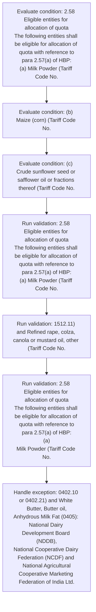
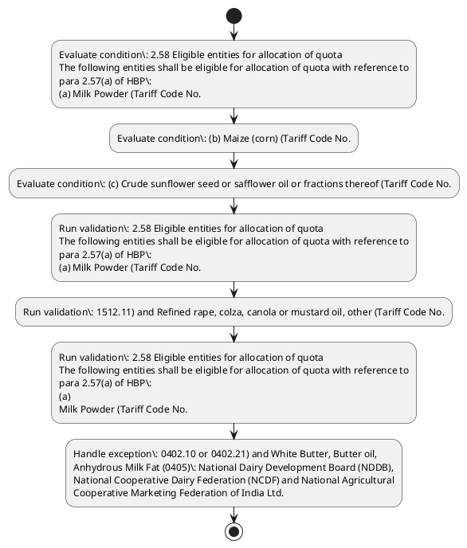

# Chapter 2 / Section 2.58: Eligible entities for allocation of quota

**Chapter Title:** General Provisions Regarding Imports and Exports

**Pages:** 26

**Purpose:** 2.58 Eligible entities for allocation of quota
The following entities shall be eligible for allocation of quota with reference to
para 2.57(a) of HBP:
(a) Milk Powder (Tariff Code No.

**Purpose Thanglish:** Indha Eligible entities for allocation of quota section-la, 2.58 Eligible entities for allocation of quota
The following entities kandippa be eligible for allocation of quota with reference to
para 2.57(a) of HBP:
(a) Milk Powder (Tariff Code No.

**Summary:** 2.58 Eligible entities for allocation of quota
The following entities shall be eligible for allocation of quota with reference to
para 2.57(a) of HBP:
(a) Milk Powder (Tariff Code No. 0402.10 or 0402.21) and White Butter, Butter oil,
Anhydrous Milk Fat (0405): National Dairy Development Board (NDDB),
National Cooperative Dairy Federation (NCDF) and National Agricultural
Cooperative Marketing Federation of India Ltd. (NAFED).

**Business Meaning:** Eligible entities for allocation of quota governs how DGFT business controls should be applied, validated, and enforced.

**Business Explanation:** Eligible entities for allocation of quota explains the operating rule set that DEKAI should enforce. Key control points include 2.58 Eligible entities for allocation of quota
The following entities shall be eligible for allocation of quota with reference to
para 2.57(a) of HBP:
(a) Milk Powder (Tariff Code No.

**Business Explanation Thanglish:** Indha Eligible entities for allocation of quota section-la, Eligible entities for allocation of quota explains the operating rule set that DEKAI should enforce. Key control points include 2.58 Eligible entities for allocation of quota
The following entities kandippa be eligible for allocation of quota with reference to
para 2.57(a) of HBP:
(a) Milk Powder (Tariff Code No.

## Business Logic
- 2.58 Eligible entities for allocation of quota
The following entities shall be eligible for allocation of quota with reference to
para 2.57(a) of HBP:
(a) Milk Powder (Tariff Code No.
- 2.58 Eligible entities for allocation of quota
The following entities shall be eligible for allocation of quota with reference to
para 2.57(a) of HBP:
(a)
Milk Powder (Tariff Code No.

## Business Rules
- rule_id=CH2-SEC2_58-R001, rule_description=2.58 Eligible entities for allocation of quota
The following entities shall be eligible for allocation of quota with reference to
para 2.57(a) of HBP:
(a) Milk Powder (Tariff Code No., trigger=Eligible entities for allocation of quota, condition=2.58 Eligible entities for allocation of quota
The following entities shall be eligible for allocation of quota with reference to
para 2.57(a) of HBP:
(a) Milk Powder (Tariff Code No., validation=2.58 Eligible entities for allocation of quota
The following entities shall be eligible for allocation of quota with reference to
para 2.57(a) of HBP:
(a) Milk Powder (Tariff Code No., action=Manual review required., exception=0402.10 or 0402.21) and White Butter, Butter oil,
Anhydrous Milk Fat (0405): National Dairy Development Board (NDDB),
National Cooperative Dairy Federation (NCDF) and National Agricultural
Cooperative Marketing Federation of India Ltd., output=DEKAI should produce a compliance decision for 2.58 - Eligible entities for allocation of quota.
- rule_id=CH2-SEC2_58-R002, rule_description=2.58 Eligible entities for allocation of quota
The following entities shall be eligible for allocation of quota with reference to
para 2.57(a) of HBP:
(a)
Milk Powder (Tariff Code No., trigger=Eligible entities for allocation of quota, condition=(b) Maize (corn) (Tariff Code No., validation=1512.11) and Refined rape, colza, canola or mustard oil, other (Tariff Code No., action=Manual review required., exception=0402.10 or 0402.21) and White Butter, Butter oil,
Anhydrous Milk Fat (0405): National Dairy Development Board (NDDB),
National Cooperative Dairy Federation (NCDF) and National Agricultural
Cooperative Marketing Federation of India Ltd., output=DEKAI should produce a compliance decision for 2.58 - Eligible entities for allocation of quota.

## Conditions
- 2.58 Eligible entities for allocation of quota
The following entities shall be eligible for allocation of quota with reference to
para 2.57(a) of HBP:
(a) Milk Powder (Tariff Code No.
- (b) Maize (corn) (Tariff Code No.
- (c) Crude sunflower seed or safflower oil or fractions thereof (Tariff Code No.
- 1512.11) and Refined rape, colza, canola or mustard oil, other (Tariff Code No.
- 2.58 Eligible entities for allocation of quota
The following entities shall be eligible for allocation of quota with reference to
para 2.57(a) of HBP:
(a)
Milk Powder (Tariff Code No.
- (b)
Maize (corn) (Tariff Code No.
- (c)
Crude sunflower seed or safflower oil or fractions thereof (Tariff Code No.

## Condition Logic
- id=2.2.58.1, if=2.58 Eligible entities for allocation of quota
The following entities shall be eligible for allocation of quota with reference to
para 2.57(a) of HBP:
(a) Milk Powder (Tariff Code No., then=Route for review, source=2.58 Eligible entities for allocation of quota
The following entities shall be eligible for allocation of quota with reference to
para 2.57(a) of HBP:
(a) Milk Powder (Tariff Code No.
- id=2.2.58.2, if=(b) Maize (corn) (Tariff Code No., then=Route for review, source=(b) Maize (corn) (Tariff Code No.
- id=2.2.58.3, if=(c) Crude sunflower seed or safflower oil or fractions thereof (Tariff Code No., then=Route for review, source=(c) Crude sunflower seed or safflower oil or fractions thereof (Tariff Code No.
- id=2.2.58.4, if=1512.11) and Refined rape, colza, canola or mustard oil, other (Tariff Code No., then=Route for review, source=1512.11) and Refined rape, colza, canola or mustard oil, other (Tariff Code No.
- id=2.2.58.5, if=2.58 Eligible entities for allocation of quota
The following entities shall be eligible for allocation of quota with reference to
para 2.57(a) of HBP:
(a)
Milk Powder (Tariff Code No., then=Route for review, source=2.58 Eligible entities for allocation of quota
The following entities shall be eligible for allocation of quota with reference to
para 2.57(a) of HBP:
(a)
Milk Powder (Tariff Code No.
- id=2.2.58.6, if=(b)
Maize (corn) (Tariff Code No., then=Route for review, source=(b)
Maize (corn) (Tariff Code No.
- id=2.2.58.7, if=(c)
Crude sunflower seed or safflower oil or fractions thereof (Tariff Code No., then=Route for review, source=(c)
Crude sunflower seed or safflower oil or fractions thereof (Tariff Code No.

## Validations
- 2.58 Eligible entities for allocation of quota
The following entities shall be eligible for allocation of quota with reference to
para 2.57(a) of HBP:
(a) Milk Powder (Tariff Code No.
- 1512.11) and Refined rape, colza, canola or mustard oil, other (Tariff Code No.
- 2.58 Eligible entities for allocation of quota
The following entities shall be eligible for allocation of quota with reference to
para 2.57(a) of HBP:
(a)
Milk Powder (Tariff Code No.

## Exceptions
- 0402.10 or 0402.21) and White Butter, Butter oil,
Anhydrous Milk Fat (0405): National Dairy Development Board (NDDB),
National Cooperative Dairy Federation (NCDF) and National Agricultural
Cooperative Marketing Federation of India Ltd.

## Dependencies
- 2.57
- 2.10
- 2.11
- 2.21
- 1

## Authorities
- None identified

## Required Documents
- None identified

## Timelines
- None identified

## Actions
- None identified

## Workflow
- Evaluate condition: 2.58 Eligible entities for allocation of quota
The following entities shall be eligible for allocation of quota with reference to
para 2.57(a) of HBP:
(a) Milk Powder (Tariff Code No.
- Evaluate condition: (b) Maize (corn) (Tariff Code No.
- Evaluate condition: (c) Crude sunflower seed or safflower oil or fractions thereof (Tariff Code No.
- Run validation: 2.58 Eligible entities for allocation of quota
The following entities shall be eligible for allocation of quota with reference to
para 2.57(a) of HBP:
(a) Milk Powder (Tariff Code No.
- Run validation: 1512.11) and Refined rape, colza, canola or mustard oil, other (Tariff Code No.
- Run validation: 2.58 Eligible entities for allocation of quota
The following entities shall be eligible for allocation of quota with reference to
para 2.57(a) of HBP:
(a)
Milk Powder (Tariff Code No.
- Handle exception: 0402.10 or 0402.21) and White Butter, Butter oil,
Anhydrous Milk Fat (0405): National Dairy Development Board (NDDB),
National Cooperative Dairy Federation (NCDF) and National Agricultural
Cooperative Marketing Federation of India Ltd.

## Workflow ASCII
```text
Eligible entities for allocation of quota
Evaluate condition: 2.58 Eligible entities for allocation of quota
The following entities shall be eligible for allocation of quota with reference to
para 2.57(a) of HBP:
(a) Milk Powder (Tariff Code No.
   |
   v
Evaluate condition: (b) Maize (corn) (Tariff Code No.
   |
   v
Evaluate condition: (c) Crude sunflower seed or safflower oil or fractions thereof (Tariff Code No.
   |
   v
Run validation: 2.58 Eligible entities for allocation of quota
The following entities shall be eligible for allocation of quota with reference to
para 2.57(a) of HBP:
(a) Milk Powder (Tariff Code No.
   |
   v
Run validation: 1512.11) and Refined rape, colza, canola or mustard oil, other (Tariff Code No.
   |
   v
Run validation: 2.58 Eligible entities for allocation of quota
The following entities shall be eligible for allocation of quota with reference to
para 2.57(a) of HBP:
(a)
Milk Powder (Tariff Code No.
   |
   v
Handle exception: 0402.10 or 0402.21) and White Butter, Butter oil,
Anhydrous Milk Fat (0405): National Dairy Development Board (NDDB),
National Cooperative Dairy Federation (NCDF) and National Agricultural
Cooperative Marketing Federation of India Ltd.
```

## Decision Tree
- IF exception applies (0402.10 or 0402.21) and White Butter, Butter oil,
Anhydrous Milk Fat (0405): National Dairy Development Board (NDDB),
National Cooperative Dairy Federation (NCDF) and National Agricultural
Cooperative Marketing Federation of India Ltd.) THEN route to manual review

## Decision Tree ASCII
```text
Eligible entities for allocation of quota Decision
IF exception applies (0402.10 or 0402.21) and White Butter, Butter oil,
Anhydrous Milk Fat (0405): National Dairy Development Board (NDDB),
National Cooperative Dairy Federation (NCDF) and National Agricultural
Cooperative Marketing Federation of India Ltd.) THEN route to manual review
```

## Examples
- User asks to process Eligible entities for allocation of quota; the platform checks conditions, validations, and documents before action.

**Real-world Example:** Example: an importer or exporter invokes Eligible entities for allocation of quota, submits the prescribed DGFT records, and DEKAI uses the extracted rules to follow the eligible entities for allocation of quota process.

**Real-world Example Thanglish:** Indha Eligible entities for allocation of quota section-la, Example: an importer or exporter invokes Eligible entities for allocation of quota, submits the prescribed DGFT records, and DEKAI uses the extracted rules to follow the eligible entities for allocation of quota process.

## AI Rules
- IF detected context matches section rule THEN enforce: 2.58 Eligible entities for allocation of quota
The following entities shall be eligible for allocation of quota with reference to
para 2.57(a) of HBP:
(a) Milk Powder (Tariff Code No.
- IF detected context matches section rule THEN enforce: 2.58 Eligible entities for allocation of quota
The following entities shall be eligible for allocation of quota with reference to
para 2.57(a) of HBP:
(a)
Milk Powder (Tariff Code No.

## Database Fields
- name=section_code, type=string, required=True, source=parsed_section_heading
- name=section_title, type=string, required=True, source=parsed_section_heading
- name=for_flag, type=boolean, required=False, source=keyword:for
- name=the_flag, type=boolean, required=False, source=keyword:The
- name=hbp_flag, type=boolean, required=False, source=keyword:HBP
- name=and_flag, type=boolean, required=False, source=keyword:and
- name=oil_flag, type=boolean, required=False, source=keyword:oil
- name=fat_flag, type=boolean, required=False, source=keyword:Fat
- name=ltd_flag, type=boolean, required=False, source=keyword:Ltd
- name=cwc_flag, type=boolean, required=False, source=keyword:CWC

## API Requirements
- method=GET, path=/api/dgft/sections/2.58, purpose=Retrieve knowledge payload for section 2.58, query_params=['include=workflow,decision_tree,validations'], response_fields=['section', 'title', 'summary', 'conditions', 'validations', 'exceptions', 'workflow', 'decision_tree']
- method=POST, path=/api/dgft/Eligible-entities-for-allocation-of-quota/validate, purpose=Validate inputs and documents for Eligible entities for allocation of quota, request_fields=['section_code', 'section_title'], response_fields=['status', 'errors', 'warnings', 'next_actions']

## UI Screens
- screen_id=Eligible_entities_for_allocation_of_quota_overview, name=Eligible entities for allocation of quota Overview, purpose=Show section summary, authority, timeline, and eligibility cues., widgets=['summary_card', 'conditions_table', 'authority_badges', 'timeline_panel']
- screen_id=Eligible_entities_for_allocation_of_quota_submission, name=Eligible entities for allocation of quota Submission, purpose=Capture applicant data and supporting documents., widgets=['dynamic_form', 'document_uploader', 'validation_panel', 'next_action_footer'], fields=['section_code', 'section_title', 'for_flag', 'the_flag', 'hbp_flag', 'and_flag', 'oil_flag', 'fat_flag']
- screen_id=Eligible_entities_for_allocation_of_quota_exceptions, name=Eligible entities for allocation of quota Exception Review, purpose=Explain exception handling and manual review triggers., widgets=['exception_banner', 'decision_tree', 'case_notes']

## Error Messages
- Validation failed because the section requirements were not fully met.

## FAQ
- question_en=What is the purpose of section 2.58?, answer_en=Eligible entities for allocation of quota explains the operating rule set that DEKAI should enforce. Key control points include 2.58 Eligible entities for allocation of quota
The following entities shall be eligible for allocation of quota with reference to
para 2.57(a) of HBP:
(a) Milk Powder (Tariff Code No., question_thanglish=Indha Eligible entities for allocation of quota section-la, What is the purpose of section 2.58?, answer_thanglish=Indha Eligible entities for allocation of quota section-la, Eligible entities for allocation of quota explains the operating rule set that DEKAI should enforce. Key control points include 2.58 Eligible entities for allocation of quota
The following entities kandippa be eligible for allocation of quota with reference to
para 2.57(a) of HBP:
(a) Milk Powder (Tariff Code No.
- question_en=What documents are required under Eligible entities for allocation of quota?, answer_en=Not explicitly covered in uploaded documents., question_thanglish=Indha Eligible entities for allocation of quota section-la, What documents are required under Eligible entities for allocation of quota?, answer_thanglish=Indha Eligible entities for allocation of quota section-la, Not explicitly covered in uploaded documents.
- question_en=Which authority handles Eligible entities for allocation of quota?, answer_en=Not explicitly covered in uploaded documents., question_thanglish=Indha Eligible entities for allocation of quota section-la, Which authority handles Eligible entities for allocation of quota?, answer_thanglish=Indha Eligible entities for allocation of quota section-la, Not explicitly covered in uploaded documents.

## Questions Users May Ask
- What does Eligible entities for allocation of quota require?
- Which documents are needed for Eligible entities for allocation of quota?
- How does DEKAI validate Eligible entities for allocation of quota requests?

## Expected AI Answers
- Eligible entities for allocation of quota requires the platform to interpret the section text, apply the extracted business rules, and present the correct next action.
- Required documents are inferred from the section text: no explicit documents were detected.
- DEKAI validates Eligible entities for allocation of quota by checking conditions, required documents, authority references, and exception clauses before recommending an outcome.

## AI Q&A Examples
- question_en=User asks: How do I comply with Eligible entities for allocation of quota?, answer_en=AI answers: DEKAI should evaluate section 2.58, apply the extracted rules, and guide the user through Evaluate condition: 2.58 Eligible entities for allocation of quota
The following entities shall be eligible for allocation of quota with reference to
para 2.57(a) of HBP:
(a) Milk Powder (Tariff Code No.., question_thanglish=Indha Eligible entities for allocation of quota section-la, User asks: How do I comply with Eligible entities for allocation of quota?, answer_thanglish=Indha Eligible entities for allocation of quota section-la, AI answers: DEKAI should evaluate section 2.58, apply the extracted rules, and guide the user through Evaluate condition: 2.58 Eligible entities for allocation of quota
The following entities kandippa be eligible for allocation of quota with reference to
para 2.57(a) of HBP:
(a) Milk Powder (Tariff Code No..
- question_en=User asks: Which validations apply to Eligible entities for allocation of quota?, answer_en=AI answers: Applicable validations are 2.58 Eligible entities for allocation of quota
The following entities shall be eligible for allocation of quota with reference to
para 2.57(a) of HBP:
(a) Milk Powder (Tariff Code No., 1512.11) and Refined rape, colza, canola or mustard oil, other (Tariff Code No., 2.58 Eligible entities for allocation of quota
The following entities shall be eligible for allocation of quota with reference to
para 2.57(a) of HBP:
(a)
Milk Powder (Tariff Code No., question_thanglish=Indha Eligible entities for allocation of quota section-la, User asks: Which validations apply to Eligible entities for allocation of quota?, answer_thanglish=Indha Eligible entities for allocation of quota section-la, AI answers: Applicable validations are 2.58 Eligible entities for allocation of quota
The following entities kandippa be eligible for allocation of quota with reference to
para 2.57(a) of HBP:
(a) Milk Powder (Tariff Code No., 1512.11) and Refined rape, colza, canola or mustard oil, other (Tariff Code No., 2.58 Eligible entities for allocation of quota
The following entities kandippa be eligible for allocation of quota with reference to
para 2.57(a) of HBP:
(a)
Milk Powder (Tariff Code No.

## DEKAI AI Implementation Notes
- Capture chapter 2, section 2.58, title, and page references as immutable knowledge metadata.
- Bind validations for Eligible entities for allocation of quota into a rule engine keyed by the rule IDs extracted for this section.
- Trigger manual review when exception clauses are detected.
- Show contextual links to related sections: 2.10, 2.11, 2.21, 1, 2.57.

## DEKAI AI Implementation Notes Thanglish
- Indha Eligible entities for allocation of quota section-la, Capture chapter 2, section 2.58, title, and page references as immutable knowledge metadata.
- Indha Eligible entities for allocation of quota section-la, Bind validations for Eligible entities for allocation of quota into a rule engine keyed by the rule IDs extracted for this section.
- Indha Eligible entities for allocation of quota section-la, Trigger manual review when exception clauses are detected.
- Indha Eligible entities for allocation of quota section-la, Show contextual links to related sections: 2.10, 2.11, 2.21, 1, 2.57.

## AI Metadata
- Keywords: for, The, HBP, and, oil, Fat, Ltd, CWC, with, para, Milk, Code, NDDB, NCDF, corn, seed, rape, quota, shall, White
- Search Keywords: for, The, HBP, and, oil, Fat, Ltd, CWC, with, para, Milk, Code, NDDB, NCDF, corn, seed, rape, quota, shall, White
- Intent: Provide knowledge guidance for Eligible entities for allocation of quota.
- Tags: 2.58, Eligible entities for allocation of quota, business-rule, dgft
- Related Sections: 2.10, 2.11, 2.21, 1, 2.57
- Related Chapters: 
- Related Rules: 2.58 Eligible entities for allocation of quota
The following entities shall be eligible for allocation of quota with reference to
para 2.57(a) of HBP:
(a) Milk Powder (Tariff Code No., 2.58 Eligible entities for allocation of quota
The following entities shall be eligible for allocation of quota with reference to
para 2.57(a) of HBP:
(a)
Milk Powder (Tariff Code No.

## Mermaid


## PlantUML

