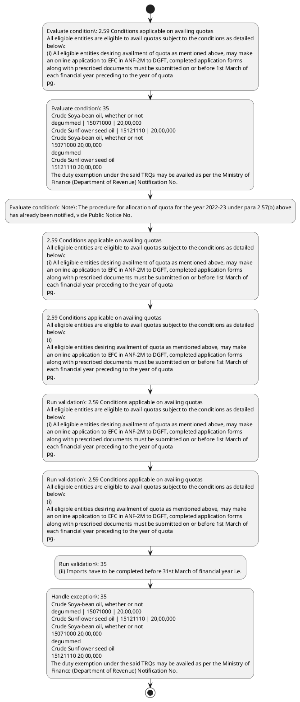

# Chapter 2 / Section 2.59: Conditions applicable on availing quotas

**Chapter Title:** General Provisions Regarding Imports and Exports

**Pages:** 26, 27

**Purpose:** 2.59 Conditions applicable on availing quotas
All eligible entities are eligible to avail quotas subject to the conditions as detailed
below:
(i) All eligible entities desiring availment of quota as mentioned above, may make
an online application to EFC in ANF-2M to DGFT, completed application forms
along with prescribed documents must be submitted on or before 1st March of
each financial year preceding to the year of quota
pg.

**Purpose Thanglish:** Indha Conditions applicable on availing quotas section-la, 2.59 Conditions applicable on availing quotas
All eligible entities are eligible to avail quotas subject to the conditions as detailed
below:
(i) All eligible entities desiring availment of quota as mentioned above, may make
an online application to EFC in ANF-2M to DGFT, completed application forms
along with prescribed documents must be submitted on or before 1st March of
each financial year preceding to the year of quota
pg.

**Summary:** 2.59 Conditions applicable on availing quotas
All eligible entities are eligible to avail quotas subject to the conditions as detailed
below:
(i) All eligible entities desiring availment of quota as mentioned above, may make
an online application to EFC in ANF-2M to DGFT, completed application forms
along with prescribed documents must be submitted on or before 1st March of
each financial year preceding to the year of quota
pg. 35
Crude Soya-bean oil, whether or not
degummed | 15071000 | 20,00,000
Crude Sunflower seed oil | 15121110 | 20,00,000
Crude Soya-bean oil, whether or not
15071000 20,00,000
degummed
Crude Sunflower seed oil
15121110 20,00,000
The duty exemption under the said TRQs may be availed as per the Ministry of
Finance (Department of Revenue) Notification No. 30/2022-Customs dated
24.05.2022.

**Business Meaning:** Conditions applicable on availing quotas governs how DGFT business controls should be applied, validated, and enforced.

**Business Explanation:** Conditions applicable on availing quotas explains the operating rule set that DEKAI should enforce. Key control points include 2.59 Conditions applicable on availing quotas
All eligible entities are eligible to avail quotas subject to the conditions as detailed
below:
(i) All eligible entities desiring availment of quota as mentioned above, may make
an online application to EFC in ANF-2M to DGFT, completed application forms
along with prescribed documents must be submitted on or before 1st March of
each financial year preceding to the year of quota
pg. The section also drives actions such as 2.59 Conditions applicable on availing quotas
All eligible entities are eligible to avail quotas subject to the conditions as detailed
below:
(i) All eligible entities desiring availment of quota as mentioned above, may make
an online application to EFC in ANF-2M to DGFT, completed application forms
along with prescribed documents must be submitted on or before 1st March of
each financial year preceding to the year of quota
pg..

**Business Explanation Thanglish:** Indha Conditions applicable on availing quotas section-la, Conditions applicable on availing quotas explains the operating rule set that DEKAI should enforce. Key control points include 2.59 Conditions applicable on availing quotas
All eligible entities are eligible to avail quotas subject to the conditions as detailed
below:
(i) All eligible entities desiring availment of quota as mentioned above, may make
an online application to EFC in ANF-2M to DGFT, completed application forms
along with prescribed documents must be submitted on or before 1st March of
each financial year preceding to the year of quota
pg. The section also drives actions such as 2.59 Conditions applicable on availing quotas
All eligible entities are eligible to avail quotas subject to the conditions as detailed
below:
(i) All eligible entities desiring availment of quota as mentioned above, may make
an online application to EFC in ANF-2M to DGFT, completed application forms
along with prescribed documents must be submitted on or before 1st March of
each financial year preceding to the year of quota
pg..

## Business Logic
- 2.59 Conditions applicable on availing quotas
All eligible entities are eligible to avail quotas subject to the conditions as detailed
below:
(i) All eligible entities desiring availment of quota as mentioned above, may make
an online application to EFC in ANF-2M to DGFT, completed application forms
along with prescribed documents must be submitted on or before 1st March of
each financial year preceding to the year of quota
pg.
- 2.59 Conditions applicable on availing quotas
All eligible entities are eligible to avail quotas subject to the conditions as detailed
below:
(i)
All eligible entities desiring availment of quota as mentioned above, may make
an online application to EFC in ANF-2M to DGFT, completed application forms
along with prescribed documents must be submitted on or before 1st March of
each financial year preceding to the year of quota
pg.
- consignments must be cleared by customs authorities before this date.
- (iii) Since import of maize (corn) is through STEs, the allottees of quota i.e.,
designated agencies in paragraph 2.58 (b) above for this item shall also be
granted an import Authorisation for allotted quantities as indicated at Sl.
- (iv) Application fee for these applications shall be paid according to procedure
contained in Appendix 2K of Appendices & Aayat Niryat Forms.

## Business Rules
- rule_id=CH2-SEC2_59-R001, rule_description=2.59 Conditions applicable on availing quotas
All eligible entities are eligible to avail quotas subject to the conditions as detailed
below:
(i) All eligible entities desiring availment of quota as mentioned above, may make
an online application to EFC in ANF-2M to DGFT, completed application forms
along with prescribed documents must be submitted on or before 1st March of
each financial year preceding to the year of quota
pg., trigger=Conditions applicable on availing quotas, condition=2.59 Conditions applicable on availing quotas
All eligible entities are eligible to avail quotas subject to the conditions as detailed
below:
(i) All eligible entities desiring availment of quota as mentioned above, may make
an online application to EFC in ANF-2M to DGFT, completed application forms
along with prescribed documents must be submitted on or before 1st March of
each financial year preceding to the year of quota
pg., validation=2.59 Conditions applicable on availing quotas
All eligible entities are eligible to avail quotas subject to the conditions as detailed
below:
(i) All eligible entities desiring availment of quota as mentioned above, may make
an online application to EFC in ANF-2M to DGFT, completed application forms
along with prescribed documents must be submitted on or before 1st March of
each financial year preceding to the year of quota
pg., action=2.59 Conditions applicable on availing quotas
All eligible entities are eligible to avail quotas subject to the conditions as detailed
below:
(i) All eligible entities desiring availment of quota as mentioned above, may make
an online application to EFC in ANF-2M to DGFT, completed application forms
along with prescribed documents must be submitted on or before 1st March of
each financial year preceding to the year of quota
pg., exception=35
Crude Soya-bean oil, whether or not
degummed | 15071000 | 20,00,000
Crude Sunflower seed oil | 15121110 | 20,00,000
Crude Soya-bean oil, whether or not
15071000 20,00,000
degummed
Crude Sunflower seed oil
15121110 20,00,000
The duty exemption under the said TRQs may be availed as per the Ministry of
Finance (Department of Revenue) Notification No., output=DEKAI should produce a compliance decision for 2.59 - Conditions applicable on availing quotas.
- rule_id=CH2-SEC2_59-R002, rule_description=2.59 Conditions applicable on availing quotas
All eligible entities are eligible to avail quotas subject to the conditions as detailed
below:
(i)
All eligible entities desiring availment of quota as mentioned above, may make
an online application to EFC in ANF-2M to DGFT, completed application forms
along with prescribed documents must be submitted on or before 1st March of
each financial year preceding to the year of quota
pg., trigger=Conditions applicable on availing quotas, condition=35
Crude Soya-bean oil, whether or not
degummed | 15071000 | 20,00,000
Crude Sunflower seed oil | 15121110 | 20,00,000
Crude Soya-bean oil, whether or not
15071000 20,00,000
degummed
Crude Sunflower seed oil
15121110 20,00,000
The duty exemption under the said TRQs may be availed as per the Ministry of
Finance (Department of Revenue) Notification No., validation=2.59 Conditions applicable on availing quotas
All eligible entities are eligible to avail quotas subject to the conditions as detailed
below:
(i)
All eligible entities desiring availment of quota as mentioned above, may make
an online application to EFC in ANF-2M to DGFT, completed application forms
along with prescribed documents must be submitted on or before 1st March of
each financial year preceding to the year of quota
pg., action=2.59 Conditions applicable on availing quotas
All eligible entities are eligible to avail quotas subject to the conditions as detailed
below:
(i)
All eligible entities desiring availment of quota as mentioned above, may make
an online application to EFC in ANF-2M to DGFT, completed application forms
along with prescribed documents must be submitted on or before 1st March of
each financial year preceding to the year of quota
pg., exception=35
Crude Soya-bean oil, whether or not
degummed | 15071000 | 20,00,000
Crude Sunflower seed oil | 15121110 | 20,00,000
Crude Soya-bean oil, whether or not
15071000 20,00,000
degummed
Crude Sunflower seed oil
15121110 20,00,000
The duty exemption under the said TRQs may be availed as per the Ministry of
Finance (Department of Revenue) Notification No., output=DEKAI should produce a compliance decision for 2.59 - Conditions applicable on availing quotas.
- rule_id=CH2-SEC2_59-R003, rule_description=consignments must be cleared by customs authorities before this date., trigger=Conditions applicable on availing quotas, condition=Note: The procedure for allocation of quota for the year 2022-23 under para 2.57(b) above
has already been notified, vide Public Notice No., validation=35
(ii) Imports have to be completed before 31st March of financial year i.e., action=2.59 Conditions applicable on availing quotas
All eligible entities are eligible to avail quotas subject to the conditions as detailed
below:
(i)
All eligible entities desiring availment of quota as mentioned above, may make
an online application to EFC in ANF-2M to DGFT, completed application forms
along with prescribed documents must be submitted on or before 1st March of
each financial year preceding to the year of quota
pg., exception=35
Crude Soya-bean oil, whether or not
degummed | 15071000 | 20,00,000
Crude Sunflower seed oil | 15121110 | 20,00,000
Crude Soya-bean oil, whether or not
15071000 20,00,000
degummed
Crude Sunflower seed oil
15121110 20,00,000
The duty exemption under the said TRQs may be availed as per the Ministry of
Finance (Department of Revenue) Notification No., output=DEKAI should produce a compliance decision for 2.59 - Conditions applicable on availing quotas.
- rule_id=CH2-SEC2_59-R004, rule_description=(iii) Since import of maize (corn) is through STEs, the allottees of quota i.e.,
designated agencies in paragraph 2.58 (b) above for this item shall also be
granted an import Authorisation for allotted quantities as indicated at Sl., trigger=Conditions applicable on availing quotas, condition=2.59 Conditions applicable on availing quotas
All eligible entities are eligible to avail quotas subject to the conditions as detailed
below:
(i)
All eligible entities desiring availment of quota as mentioned above, may make
an online application to EFC in ANF-2M to DGFT, completed application forms
along with prescribed documents must be submitted on or before 1st March of
each financial year preceding to the year of quota
pg., validation=consignments must be cleared by customs authorities before this date., action=2.59 Conditions applicable on availing quotas
All eligible entities are eligible to avail quotas subject to the conditions as detailed
below:
(i)
All eligible entities desiring availment of quota as mentioned above, may make
an online application to EFC in ANF-2M to DGFT, completed application forms
along with prescribed documents must be submitted on or before 1st March of
each financial year preceding to the year of quota
pg., exception=35
Crude Soya-bean oil, whether or not
degummed | 15071000 | 20,00,000
Crude Sunflower seed oil | 15121110 | 20,00,000
Crude Soya-bean oil, whether or not
15071000 20,00,000
degummed
Crude Sunflower seed oil
15121110 20,00,000
The duty exemption under the said TRQs may be availed as per the Ministry of
Finance (Department of Revenue) Notification No., output=DEKAI should produce a compliance decision for 2.59 - Conditions applicable on availing quotas.
- rule_id=CH2-SEC2_59-R005, rule_description=(iv) Application fee for these applications shall be paid according to procedure
contained in Appendix 2K of Appendices & Aayat Niryat Forms., trigger=Conditions applicable on availing quotas, condition=35
(ii) Imports have to be completed before 31st March of financial year i.e., validation=(iii) Since import of maize (corn) is through STEs, the allottees of quota i.e.,
designated agencies in paragraph 2.58 (b) above for this item shall also be
granted an import Authorisation for allotted quantities as indicated at Sl., action=2.59 Conditions applicable on availing quotas
All eligible entities are eligible to avail quotas subject to the conditions as detailed
below:
(i)
All eligible entities desiring availment of quota as mentioned above, may make
an online application to EFC in ANF-2M to DGFT, completed application forms
along with prescribed documents must be submitted on or before 1st March of
each financial year preceding to the year of quota
pg., exception=35
Crude Soya-bean oil, whether or not
degummed | 15071000 | 20,00,000
Crude Sunflower seed oil | 15121110 | 20,00,000
Crude Soya-bean oil, whether or not
15071000 20,00,000
degummed
Crude Sunflower seed oil
15121110 20,00,000
The duty exemption under the said TRQs may be availed as per the Ministry of
Finance (Department of Revenue) Notification No., output=DEKAI should produce a compliance decision for 2.59 - Conditions applicable on availing quotas.

## Conditions
- 2.59 Conditions applicable on availing quotas
All eligible entities are eligible to avail quotas subject to the conditions as detailed
below:
(i) All eligible entities desiring availment of quota as mentioned above, may make
an online application to EFC in ANF-2M to DGFT, completed application forms
along with prescribed documents must be submitted on or before 1st March of
each financial year preceding to the year of quota
pg.
- 35
Crude Soya-bean oil, whether or not
degummed | 15071000 | 20,00,000
Crude Sunflower seed oil | 15121110 | 20,00,000
Crude Soya-bean oil, whether or not
15071000 20,00,000
degummed
Crude Sunflower seed oil
15121110 20,00,000
The duty exemption under the said TRQs may be availed as per the Ministry of
Finance (Department of Revenue) Notification No.
- Note: The procedure for allocation of quota for the year 2022-23 under para 2.57(b) above
has already been notified, vide Public Notice No.
- 2.59 Conditions applicable on availing quotas
All eligible entities are eligible to avail quotas subject to the conditions as detailed
below:
(i)
All eligible entities desiring availment of quota as mentioned above, may make
an online application to EFC in ANF-2M to DGFT, completed application forms
along with prescribed documents must be submitted on or before 1st March of
each financial year preceding to the year of quota
pg.
- 35
(ii) Imports have to be completed before 31st March of financial year i.e.
- consignments must be cleared by customs authorities before this date.
- 21
(b) of Customs Notification No.

## Condition Logic
- id=2.2.59.1, if=2.59 Conditions applicable on availing quotas
All eligible entities are eligible to avail quotas subject to the conditions as detailed
below:
(i) All eligible entities desiring availment of quota as mentioned above, may make
an online application to EFC in ANF-2M to DGFT, completed application forms
along with prescribed documents must be submitted on or before 1st March of
each financial year preceding to the year of quota
pg., then=2.59 Conditions applicable on availing quotas
All eligible entities are eligible to avail quotas subject to the conditions as detailed
below:
(i) All eligible entities desiring availment of quota as mentioned above, may make
an online application to EFC in ANF-2M to DGFT, completed application forms
along with prescribed documents must be submitted on or before 1st March of
each financial year preceding to the year of quota
pg., source=2.59 Conditions applicable on availing quotas
All eligible entities are eligible to avail quotas subject to the conditions as detailed
below:
(i) All eligible entities desiring availment of quota as mentioned above, may make
an online application to EFC in ANF-2M to DGFT, completed application forms
along with prescribed documents must be submitted on or before 1st March of
each financial year preceding to the year of quota
pg.
- id=2.2.59.2, if=35
Crude Soya-bean oil, whether or not
degummed | 15071000 | 20,00,000
Crude Sunflower seed oil | 15121110 | 20,00,000
Crude Soya-bean oil, whether or not
15071000 20,00,000
degummed
Crude Sunflower seed oil
15121110 20,00,000
The duty exemption under the said TRQs may be availed as per the Ministry of
Finance (Department of Revenue) Notification No., then=2.59 Conditions applicable on availing quotas
All eligible entities are eligible to avail quotas subject to the conditions as detailed
below:
(i) All eligible entities desiring availment of quota as mentioned above, may make
an online application to EFC in ANF-2M to DGFT, completed application forms
along with prescribed documents must be submitted on or before 1st March of
each financial year preceding to the year of quota
pg., source=35
Crude Soya-bean oil, whether or not
degummed | 15071000 | 20,00,000
Crude Sunflower seed oil | 15121110 | 20,00,000
Crude Soya-bean oil, whether or not
15071000 20,00,000
degummed
Crude Sunflower seed oil
15121110 20,00,000
The duty exemption under the said TRQs may be availed as per the Ministry of
Finance (Department of Revenue) Notification No.
- id=2.2.59.3, if=Note: The procedure for allocation of quota for the year 2022-23 under para 2.57(b) above
has already been notified, vide Public Notice No., then=2.59 Conditions applicable on availing quotas
All eligible entities are eligible to avail quotas subject to the conditions as detailed
below:
(i) All eligible entities desiring availment of quota as mentioned above, may make
an online application to EFC in ANF-2M to DGFT, completed application forms
along with prescribed documents must be submitted on or before 1st March of
each financial year preceding to the year of quota
pg., source=Note: The procedure for allocation of quota for the year 2022-23 under para 2.57(b) above
has already been notified, vide Public Notice No.
- id=2.2.59.4, if=2.59 Conditions applicable on availing quotas
All eligible entities are eligible to avail quotas subject to the conditions as detailed
below:
(i)
All eligible entities desiring availment of quota as mentioned above, may make
an online application to EFC in ANF-2M to DGFT, completed application forms
along with prescribed documents must be submitted on or before 1st March of
each financial year preceding to the year of quota
pg., then=2.59 Conditions applicable on availing quotas
All eligible entities are eligible to avail quotas subject to the conditions as detailed
below:
(i) All eligible entities desiring availment of quota as mentioned above, may make
an online application to EFC in ANF-2M to DGFT, completed application forms
along with prescribed documents must be submitted on or before 1st March of
each financial year preceding to the year of quota
pg., source=2.59 Conditions applicable on availing quotas
All eligible entities are eligible to avail quotas subject to the conditions as detailed
below:
(i)
All eligible entities desiring availment of quota as mentioned above, may make
an online application to EFC in ANF-2M to DGFT, completed application forms
along with prescribed documents must be submitted on or before 1st March of
each financial year preceding to the year of quota
pg.
- id=2.2.59.5, if=35
(ii) Imports have to be completed before 31st March of financial year i.e., then=2.59 Conditions applicable on availing quotas
All eligible entities are eligible to avail quotas subject to the conditions as detailed
below:
(i) All eligible entities desiring availment of quota as mentioned above, may make
an online application to EFC in ANF-2M to DGFT, completed application forms
along with prescribed documents must be submitted on or before 1st March of
each financial year preceding to the year of quota
pg., source=35
(ii) Imports have to be completed before 31st March of financial year i.e.
- id=2.2.59.6, if=consignments must be cleared by customs authorities before this date., then=2.59 Conditions applicable on availing quotas
All eligible entities are eligible to avail quotas subject to the conditions as detailed
below:
(i) All eligible entities desiring availment of quota as mentioned above, may make
an online application to EFC in ANF-2M to DGFT, completed application forms
along with prescribed documents must be submitted on or before 1st March of
each financial year preceding to the year of quota
pg., source=consignments must be cleared by customs authorities before this date.
- id=2.2.59.7, if=21
(b) of Customs Notification No., then=2.59 Conditions applicable on availing quotas
All eligible entities are eligible to avail quotas subject to the conditions as detailed
below:
(i) All eligible entities desiring availment of quota as mentioned above, may make
an online application to EFC in ANF-2M to DGFT, completed application forms
along with prescribed documents must be submitted on or before 1st March of
each financial year preceding to the year of quota
pg., source=21
(b) of Customs Notification No.

## Validations
- 2.59 Conditions applicable on availing quotas
All eligible entities are eligible to avail quotas subject to the conditions as detailed
below:
(i) All eligible entities desiring availment of quota as mentioned above, may make
an online application to EFC in ANF-2M to DGFT, completed application forms
along with prescribed documents must be submitted on or before 1st March of
each financial year preceding to the year of quota
pg.
- 2.59 Conditions applicable on availing quotas
All eligible entities are eligible to avail quotas subject to the conditions as detailed
below:
(i)
All eligible entities desiring availment of quota as mentioned above, may make
an online application to EFC in ANF-2M to DGFT, completed application forms
along with prescribed documents must be submitted on or before 1st March of
each financial year preceding to the year of quota
pg.
- 35
(ii) Imports have to be completed before 31st March of financial year i.e.
- consignments must be cleared by customs authorities before this date.
- (iii) Since import of maize (corn) is through STEs, the allottees of quota i.e.,
designated agencies in paragraph 2.58 (b) above for this item shall also be
granted an import Authorisation for allotted quantities as indicated at Sl.
- (iv) Application fee for these applications shall be paid according to procedure
contained in Appendix 2K of Appendices & Aayat Niryat Forms.

## Exceptions
- 35
Crude Soya-bean oil, whether or not
degummed | 15071000 | 20,00,000
Crude Sunflower seed oil | 15121110 | 20,00,000
Crude Soya-bean oil, whether or not
15071000 20,00,000
degummed
Crude Sunflower seed oil
15121110 20,00,000
The duty exemption under the said TRQs may be availed as per the Ministry of
Finance (Department of Revenue) Notification No.

## Dependencies
- 2.57
- 2.58
- 2.21
- 1

## Authorities
- DGFT
- The duty exemption under the said TRQs may be availed as per the Ministry
- Customs
- EFC in DGFT

## Required Documents
- 2.59 Conditions applicable on availing quotas
All eligible entities are eligible to avail quotas subject to the conditions as detailed
below:
(i) All eligible entities desiring availment of quota as mentioned above, may make
an online application to EFC in ANF-2M to DGFT, completed application forms
along with prescribed documents must be submitted on or before 1st March of
each financial year preceding to the year of quota
pg.
- 2.59 Conditions applicable on availing quotas
All eligible entities are eligible to avail quotas subject to the conditions as detailed
below:
(i)
All eligible entities desiring availment of quota as mentioned above, may make
an online application to EFC in ANF-2M to DGFT, completed application forms
along with prescribed documents must be submitted on or before 1st March of
each financial year preceding to the year of quota
pg.
- (iv) Application fee for these applications shall be paid according to procedure
contained in Appendix 2K of Appendices & Aayat Niryat Forms.

## Timelines
- 2.59 Conditions applicable on availing quotas
All eligible entities are eligible to avail quotas subject to the conditions as detailed
below:
(i) All eligible entities desiring availment of quota as mentioned above, may make
an online application to EFC in ANF-2M to DGFT, completed application forms
along with prescribed documents must be submitted on or before 1st March of
each financial year preceding to the year of quota
pg.
- 2.59 Conditions applicable on availing quotas
All eligible entities are eligible to avail quotas subject to the conditions as detailed
below:
(i)
All eligible entities desiring availment of quota as mentioned above, may make
an online application to EFC in ANF-2M to DGFT, completed application forms
along with prescribed documents must be submitted on or before 1st March of
each financial year preceding to the year of quota
pg.
- 35
(ii) Imports have to be completed before 31st March of financial year i.e.
- consignments must be cleared by customs authorities before this date.

## Actions
- 2.59 Conditions applicable on availing quotas
All eligible entities are eligible to avail quotas subject to the conditions as detailed
below:
(i) All eligible entities desiring availment of quota as mentioned above, may make
an online application to EFC in ANF-2M to DGFT, completed application forms
along with prescribed documents must be submitted on or before 1st March of
each financial year preceding to the year of quota
pg.
- 2.59 Conditions applicable on availing quotas
All eligible entities are eligible to avail quotas subject to the conditions as detailed
below:
(i)
All eligible entities desiring availment of quota as mentioned above, may make
an online application to EFC in ANF-2M to DGFT, completed application forms
along with prescribed documents must be submitted on or before 1st March of
each financial year preceding to the year of quota
pg.

## Workflow
- Evaluate condition: 2.59 Conditions applicable on availing quotas
All eligible entities are eligible to avail quotas subject to the conditions as detailed
below:
(i) All eligible entities desiring availment of quota as mentioned above, may make
an online application to EFC in ANF-2M to DGFT, completed application forms
along with prescribed documents must be submitted on or before 1st March of
each financial year preceding to the year of quota
pg.
- Evaluate condition: 35
Crude Soya-bean oil, whether or not
degummed | 15071000 | 20,00,000
Crude Sunflower seed oil | 15121110 | 20,00,000
Crude Soya-bean oil, whether or not
15071000 20,00,000
degummed
Crude Sunflower seed oil
15121110 20,00,000
The duty exemption under the said TRQs may be availed as per the Ministry of
Finance (Department of Revenue) Notification No.
- Evaluate condition: Note: The procedure for allocation of quota for the year 2022-23 under para 2.57(b) above
has already been notified, vide Public Notice No.
- 2.59 Conditions applicable on availing quotas
All eligible entities are eligible to avail quotas subject to the conditions as detailed
below:
(i) All eligible entities desiring availment of quota as mentioned above, may make
an online application to EFC in ANF-2M to DGFT, completed application forms
along with prescribed documents must be submitted on or before 1st March of
each financial year preceding to the year of quota
pg.
- 2.59 Conditions applicable on availing quotas
All eligible entities are eligible to avail quotas subject to the conditions as detailed
below:
(i)
All eligible entities desiring availment of quota as mentioned above, may make
an online application to EFC in ANF-2M to DGFT, completed application forms
along with prescribed documents must be submitted on or before 1st March of
each financial year preceding to the year of quota
pg.
- Run validation: 2.59 Conditions applicable on availing quotas
All eligible entities are eligible to avail quotas subject to the conditions as detailed
below:
(i) All eligible entities desiring availment of quota as mentioned above, may make
an online application to EFC in ANF-2M to DGFT, completed application forms
along with prescribed documents must be submitted on or before 1st March of
each financial year preceding to the year of quota
pg.
- Run validation: 2.59 Conditions applicable on availing quotas
All eligible entities are eligible to avail quotas subject to the conditions as detailed
below:
(i)
All eligible entities desiring availment of quota as mentioned above, may make
an online application to EFC in ANF-2M to DGFT, completed application forms
along with prescribed documents must be submitted on or before 1st March of
each financial year preceding to the year of quota
pg.
- Run validation: 35
(ii) Imports have to be completed before 31st March of financial year i.e.
- Handle exception: 35
Crude Soya-bean oil, whether or not
degummed | 15071000 | 20,00,000
Crude Sunflower seed oil | 15121110 | 20,00,000
Crude Soya-bean oil, whether or not
15071000 20,00,000
degummed
Crude Sunflower seed oil
15121110 20,00,000
The duty exemption under the said TRQs may be availed as per the Ministry of
Finance (Department of Revenue) Notification No.

## Workflow ASCII
```text
Conditions applicable on availing quotas
Evaluate condition: 2.59 Conditions applicable on availing quotas
All eligible entities are eligible to avail quotas subject to the conditions as detailed
below:
(i) All eligible entities desiring availment of quota as mentioned above, may make
an online application to EFC in ANF-2M to DGFT, completed application forms
along with prescribed documents must be submitted on or before 1st March of
each financial year preceding to the year of quota
pg.
   |
   v
Evaluate condition: 35
Crude Soya-bean oil, whether or not
degummed | 15071000 | 20,00,000
Crude Sunflower seed oil | 15121110 | 20,00,000
Crude Soya-bean oil, whether or not
15071000 20,00,000
degummed
Crude Sunflower seed oil
15121110 20,00,000
The duty exemption under the said TRQs may be availed as per the Ministry of
Finance (Department of Revenue) Notification No.
   |
   v
Evaluate condition: Note: The procedure for allocation of quota for the year 2022-23 under para 2.57(b) above
has already been notified, vide Public Notice No.
   |
   v
2.59 Conditions applicable on availing quotas
All eligible entities are eligible to avail quotas subject to the conditions as detailed
below:
(i) All eligible entities desiring availment of quota as mentioned above, may make
an online application to EFC in ANF-2M to DGFT, completed application forms
along with prescribed documents must be submitted on or before 1st March of
each financial year preceding to the year of quota
pg.
   |
   v
2.59 Conditions applicable on availing quotas
All eligible entities are eligible to avail quotas subject to the conditions as detailed
below:
(i)
All eligible entities desiring availment of quota as mentioned above, may make
an online application to EFC in ANF-2M to DGFT, completed application forms
along with prescribed documents must be submitted on or before 1st March of
each financial year preceding to the year of quota
pg.
   |
   v
Run validation: 2.59 Conditions applicable on availing quotas
All eligible entities are eligible to avail quotas subject to the conditions as detailed
below:
(i) All eligible entities desiring availment of quota as mentioned above, may make
an online application to EFC in ANF-2M to DGFT, completed application forms
along with prescribed documents must be submitted on or before 1st March of
each financial year preceding to the year of quota
pg.
   |
   v
Run validation: 2.59 Conditions applicable on availing quotas
All eligible entities are eligible to avail quotas subject to the conditions as detailed
below:
(i)
All eligible entities desiring availment of quota as mentioned above, may make
an online application to EFC in ANF-2M to DGFT, completed application forms
along with prescribed documents must be submitted on or before 1st March of
each financial year preceding to the year of quota
pg.
   |
   v
Run validation: 35
(ii) Imports have to be completed before 31st March of financial year i.e.
   |
   v
Handle exception: 35
Crude Soya-bean oil, whether or not
degummed | 15071000 | 20,00,000
Crude Sunflower seed oil | 15121110 | 20,00,000
Crude Soya-bean oil, whether or not
15071000 20,00,000
degummed
Crude Sunflower seed oil
15121110 20,00,000
The duty exemption under the said TRQs may be availed as per the Ministry of
Finance (Department of Revenue) Notification No.
```

## Decision Tree
- IF 2.59 Conditions applicable on availing quotas
All eligible entities are eligible to avail quotas subject to the conditions as detailed
below:
(i) All eligible entities desiring availment of quota as mentioned above, may make
an online application to EFC in ANF-2M to DGFT, completed application forms
along with prescribed documents must be submitted on or before 1st March of
each financial year preceding to the year of quota
pg. THEN 2.59 Conditions applicable on availing quotas
All eligible entities are eligible to avail quotas subject to the conditions as detailed
below:
(i) All eligible entities desiring availment of quota as mentioned above, may make
an online application to EFC in ANF-2M to DGFT, completed application forms
along with prescribed documents must be submitted on or before 1st March of
each financial year preceding to the year of quota
pg.
- IF 35
Crude Soya-bean oil, whether or not
degummed | 15071000 | 20,00,000
Crude Sunflower seed oil | 15121110 | 20,00,000
Crude Soya-bean oil, whether or not
15071000 20,00,000
degummed
Crude Sunflower seed oil
15121110 20,00,000
The duty exemption under the said TRQs may be availed as per the Ministry of
Finance (Department of Revenue) Notification No. THEN 2.59 Conditions applicable on availing quotas
All eligible entities are eligible to avail quotas subject to the conditions as detailed
below:
(i) All eligible entities desiring availment of quota as mentioned above, may make
an online application to EFC in ANF-2M to DGFT, completed application forms
along with prescribed documents must be submitted on or before 1st March of
each financial year preceding to the year of quota
pg.
- IF Note: The procedure for allocation of quota for the year 2022-23 under para 2.57(b) above
has already been notified, vide Public Notice No. THEN 2.59 Conditions applicable on availing quotas
All eligible entities are eligible to avail quotas subject to the conditions as detailed
below:
(i) All eligible entities desiring availment of quota as mentioned above, may make
an online application to EFC in ANF-2M to DGFT, completed application forms
along with prescribed documents must be submitted on or before 1st March of
each financial year preceding to the year of quota
pg.
- IF 2.59 Conditions applicable on availing quotas
All eligible entities are eligible to avail quotas subject to the conditions as detailed
below:
(i)
All eligible entities desiring availment of quota as mentioned above, may make
an online application to EFC in ANF-2M to DGFT, completed application forms
along with prescribed documents must be submitted on or before 1st March of
each financial year preceding to the year of quota
pg. THEN 2.59 Conditions applicable on availing quotas
All eligible entities are eligible to avail quotas subject to the conditions as detailed
below:
(i) All eligible entities desiring availment of quota as mentioned above, may make
an online application to EFC in ANF-2M to DGFT, completed application forms
along with prescribed documents must be submitted on or before 1st March of
each financial year preceding to the year of quota
pg.
- IF 35
(ii) Imports have to be completed before 31st March of financial year i.e. THEN 2.59 Conditions applicable on availing quotas
All eligible entities are eligible to avail quotas subject to the conditions as detailed
below:
(i) All eligible entities desiring availment of quota as mentioned above, may make
an online application to EFC in ANF-2M to DGFT, completed application forms
along with prescribed documents must be submitted on or before 1st March of
each financial year preceding to the year of quota
pg.
- IF exception applies (35
Crude Soya-bean oil, whether or not
degummed | 15071000 | 20,00,000
Crude Sunflower seed oil | 15121110 | 20,00,000
Crude Soya-bean oil, whether or not
15071000 20,00,000
degummed
Crude Sunflower seed oil
15121110 20,00,000
The duty exemption under the said TRQs may be availed as per the Ministry of
Finance (Department of Revenue) Notification No.) THEN route to manual review

## Decision Tree ASCII
```text
Conditions applicable on availing quotas Decision
IF 2.59 Conditions applicable on availing quotas
All eligible entities are eligible to avail quotas subject to the conditions as detailed
below:
(i) All eligible entities desiring availment of quota as mentioned above, may make
an online application to EFC in ANF-2M to DGFT, completed application forms
along with prescribed documents must be submitted on or before 1st March of
each financial year preceding to the year of quota
pg. THEN 2.59 Conditions applicable on availing quotas
All eligible entities are eligible to avail quotas subject to the conditions as detailed
below:
(i) All eligible entities desiring availment of quota as mentioned above, may make
an online application to EFC in ANF-2M to DGFT, completed application forms
along with prescribed documents must be submitted on or before 1st March of
each financial year preceding to the year of quota
pg.
   |
   v
IF 35
Crude Soya-bean oil, whether or not
degummed | 15071000 | 20,00,000
Crude Sunflower seed oil | 15121110 | 20,00,000
Crude Soya-bean oil, whether or not
15071000 20,00,000
degummed
Crude Sunflower seed oil
15121110 20,00,000
The duty exemption under the said TRQs may be availed as per the Ministry of
Finance (Department of Revenue) Notification No. THEN 2.59 Conditions applicable on availing quotas
All eligible entities are eligible to avail quotas subject to the conditions as detailed
below:
(i) All eligible entities desiring availment of quota as mentioned above, may make
an online application to EFC in ANF-2M to DGFT, completed application forms
along with prescribed documents must be submitted on or before 1st March of
each financial year preceding to the year of quota
pg.
   |
   v
IF Note: The procedure for allocation of quota for the year 2022-23 under para 2.57(b) above
has already been notified, vide Public Notice No. THEN 2.59 Conditions applicable on availing quotas
All eligible entities are eligible to avail quotas subject to the conditions as detailed
below:
(i) All eligible entities desiring availment of quota as mentioned above, may make
an online application to EFC in ANF-2M to DGFT, completed application forms
along with prescribed documents must be submitted on or before 1st March of
each financial year preceding to the year of quota
pg.
   |
   v
IF 2.59 Conditions applicable on availing quotas
All eligible entities are eligible to avail quotas subject to the conditions as detailed
below:
(i)
All eligible entities desiring availment of quota as mentioned above, may make
an online application to EFC in ANF-2M to DGFT, completed application forms
along with prescribed documents must be submitted on or before 1st March of
each financial year preceding to the year of quota
pg. THEN 2.59 Conditions applicable on availing quotas
All eligible entities are eligible to avail quotas subject to the conditions as detailed
below:
(i) All eligible entities desiring availment of quota as mentioned above, may make
an online application to EFC in ANF-2M to DGFT, completed application forms
along with prescribed documents must be submitted on or before 1st March of
each financial year preceding to the year of quota
pg.
   |
   v
IF 35
(ii) Imports have to be completed before 31st March of financial year i.e. THEN 2.59 Conditions applicable on availing quotas
All eligible entities are eligible to avail quotas subject to the conditions as detailed
below:
(i) All eligible entities desiring availment of quota as mentioned above, may make
an online application to EFC in ANF-2M to DGFT, completed application forms
along with prescribed documents must be submitted on or before 1st March of
each financial year preceding to the year of quota
pg.
   |
   v
IF exception applies (35
Crude Soya-bean oil, whether or not
degummed | 15071000 | 20,00,000
Crude Sunflower seed oil | 15121110 | 20,00,000
Crude Soya-bean oil, whether or not
15071000 20,00,000
degummed
Crude Sunflower seed oil
15121110 20,00,000
The duty exemption under the said TRQs may be availed as per the Ministry of
Finance (Department of Revenue) Notification No.) THEN route to manual review
```

## Examples
- User asks to process Conditions applicable on availing quotas; the platform checks conditions, validations, and documents before action.

**Real-world Example:** Example: an importer or exporter invokes Conditions applicable on availing quotas, submits 2.59 Conditions applicable on availing quotas
All eligible entities are eligible to avail quotas subject to the conditions as detailed
below:
(i) All eligible entities desiring availment of quota as mentioned above, may make
an online application to EFC in ANF-2M to DGFT, completed application forms
along with prescribed documents must be submitted on or before 1st March of
each financial year preceding to the year of quota
pg., 2.59 Conditions applicable on availing quotas
All eligible entities are eligible to avail quotas subject to the conditions as detailed
below:
(i)
All eligible entities desiring availment of quota as mentioned above, may make
an online application to EFC in ANF-2M to DGFT, completed application forms
along with prescribed documents must be submitted on or before 1st March of
each financial year preceding to the year of quota
pg., (iv) Application fee for these applications shall be paid according to procedure
contained in Appendix 2K of Appendices & Aayat Niryat Forms., and DEKAI uses the extracted rules to 2.59 conditions applicable on availing quotas
all eligible entities are eligible to avail quotas subject to the conditions as detailed
below:
(i) all eligible entities desiring availment of quota as mentioned above, may make
an online application to efc in anf-2m to dgft, completed application forms
along with prescribed documents must be submitted on or before 1st march of
each financial year preceding to the year of quota
pg..

**Real-world Example Thanglish:** Indha Conditions applicable on availing quotas section-la, Example: an importer or exporter invokes Conditions applicable on availing quotas, submits 2.59 Conditions applicable on availing quotas
All eligible entities are eligible to avail quotas subject to the conditions as detailed
below:
(i) All eligible entities desiring availment of quota as mentioned above, may make
an online application to EFC in ANF-2M to DGFT, completed application forms
along with prescribed documents must be submitted on or before 1st March of
each financial year preceding to the year of quota
pg., 2.59 Conditions applicable on availing quotas
All eligible entities are eligible to avail quotas subject to the conditions as detailed
below:
(i)
All eligible entities desiring availment of quota as mentioned above, may make
an online application to EFC in ANF-2M to DGFT, completed application forms
along with prescribed documents must be submitted on or before 1st March of
each financial year preceding to the year of quota
pg., (iv) application fee for these applications kandippa be paid according to procedure
contained in Appendix 2K of Appendices & Aayat Niryat Forms., and DEKAI uses the extracted rules to 2.59 conditions applicable on availing quotas
all eligible entities are eligible to avail quotas subject to the conditions as detailed
below:
(i) all eligible entities desiring availment of quota as mentioned above, may make
an online application to efc in anf-2m to dgft, completed application forms
along with prescribed documents must be submitted on or before 1st march of
each financial year preceding to the year of quota
pg..

## AI Rules
- IF detected context matches section rule THEN enforce: 2.59 Conditions applicable on availing quotas
All eligible entities are eligible to avail quotas subject to the conditions as detailed
below:
(i) All eligible entities desiring availment of quota as mentioned above, may make
an online application to EFC in ANF-2M to DGFT, completed application forms
along with prescribed documents must be submitted on or before 1st March of
each financial year preceding to the year of quota
pg.
- IF detected context matches section rule THEN enforce: 2.59 Conditions applicable on availing quotas
All eligible entities are eligible to avail quotas subject to the conditions as detailed
below:
(i)
All eligible entities desiring availment of quota as mentioned above, may make
an online application to EFC in ANF-2M to DGFT, completed application forms
along with prescribed documents must be submitted on or before 1st March of
each financial year preceding to the year of quota
pg.
- IF detected context matches section rule THEN enforce: consignments must be cleared by customs authorities before this date.
- IF detected context matches section rule THEN enforce: (iii) Since import of maize (corn) is through STEs, the allottees of quota i.e.,
designated agencies in paragraph 2.58 (b) above for this item shall also be
granted an import Authorisation for allotted quantities as indicated at Sl.
- IF detected context matches section rule THEN enforce: (iv) Application fee for these applications shall be paid according to procedure
contained in Appendix 2K of Appendices & Aayat Niryat Forms.
- IF validations pass THEN recommend action: 2.59 Conditions applicable on availing quotas
All eligible entities are eligible to avail quotas subject to the conditions as detailed
below:
(i) All eligible entities desiring availment of quota as mentioned above, may make
an online application to EFC in ANF-2M to DGFT, completed application forms
along with prescribed documents must be submitted on or before 1st March of
each financial year preceding to the year of quota
pg.

## Database Fields
- name=section_code, type=string, required=True, source=parsed_section_heading
- name=section_title, type=string, required=True, source=parsed_section_heading
- name=all_flag, type=boolean, required=False, source=keyword:All
- name=are_flag, type=boolean, required=False, source=keyword:are
- name=the_flag, type=boolean, required=False, source=keyword:the
- name=may_flag, type=boolean, required=False, source=keyword:may
- name=efc_flag, type=boolean, required=False, source=keyword:EFC
- name=oil_flag, type=boolean, required=False, source=keyword:oil
- name=not_flag, type=boolean, required=False, source=keyword:not
- name=per_flag, type=boolean, required=False, source=keyword:per
- name=document_1_submitted, type=boolean, required=True, source=2.59 Conditions applicable on availing quotas
All eligible entities are eligible to avail quotas subject to the conditions as detailed
below:
(i) All eligible entities desiring availment of quota as mentioned above, may make
an online application to EFC in ANF-2M to DGFT, completed application forms
along with prescribed documents must be submitted on or before 1st March of
each financial year preceding to the year of quota
pg.
- name=document_2_submitted, type=boolean, required=True, source=2.59 Conditions applicable on availing quotas
All eligible entities are eligible to avail quotas subject to the conditions as detailed
below:
(i)
All eligible entities desiring availment of quota as mentioned above, may make
an online application to EFC in ANF-2M to DGFT, completed application forms
along with prescribed documents must be submitted on or before 1st March of
each financial year preceding to the year of quota
pg.
- name=document_3_submitted, type=boolean, required=True, source=(iv) Application fee for these applications shall be paid according to procedure
contained in Appendix 2K of Appendices & Aayat Niryat Forms.

## API Requirements
- method=GET, path=/api/dgft/sections/2.59, purpose=Retrieve knowledge payload for section 2.59, query_params=['include=workflow,decision_tree,validations'], response_fields=['section', 'title', 'summary', 'conditions', 'validations', 'exceptions', 'workflow', 'decision_tree']
- method=POST, path=/api/dgft/Conditions-applicable-on-availing-quotas/validate, purpose=Validate inputs and documents for Conditions applicable on availing quotas, request_fields=['section_code', 'section_title', 'document_1_submitted', 'document_2_submitted', 'document_3_submitted'], response_fields=['status', 'errors', 'warnings', 'next_actions']
- method=POST, path=/api/dgft/Conditions-applicable-on-availing-quotas/execute, purpose=Trigger business action for 2.59 Conditions applicable on availing quotas
All eligible entities are eligible to avail quotas subject to the conditions as detailed
below:
(i) All eligible entities desiring availment of quota as mentioned above, may make
an online application to EFC in ANF-2M to DGFT, completed application forms
along with prescribed documents must be submitted on or before 1st March of
each financial year preceding to the year of quota
pg., request_fields=['section_code', 'section_title', 'document_1_submitted', 'document_2_submitted', 'document_3_submitted'], response_fields=['reference_id', 'status', 'authority', 'timeline']

## UI Screens
- screen_id=Conditions_applicable_on_availing_quotas_overview, name=Conditions applicable on availing quotas Overview, purpose=Show section summary, authority, timeline, and eligibility cues., widgets=['summary_card', 'conditions_table', 'authority_badges', 'timeline_panel']
- screen_id=Conditions_applicable_on_availing_quotas_submission, name=Conditions applicable on availing quotas Submission, purpose=Capture applicant data and supporting documents., widgets=['dynamic_form', 'document_uploader', 'validation_panel', 'next_action_footer'], fields=['section_code', 'section_title', 'all_flag', 'are_flag', 'the_flag', 'may_flag', 'efc_flag', 'oil_flag']
- screen_id=Conditions_applicable_on_availing_quotas_exceptions, name=Conditions applicable on availing quotas Exception Review, purpose=Explain exception handling and manual review triggers., widgets=['exception_banner', 'decision_tree', 'case_notes']

## Error Messages
- Validation failed because the section requirements were not fully met.

## FAQ
- question_en=What is the purpose of section 2.59?, answer_en=Conditions applicable on availing quotas explains the operating rule set that DEKAI should enforce. Key control points include 2.59 Conditions applicable on availing quotas
All eligible entities are eligible to avail quotas subject to the conditions as detailed
below:
(i) All eligible entities desiring availment of quota as mentioned above, may make
an online application to EFC in ANF-2M to DGFT, completed application forms
along with prescribed documents must be submitted on or before 1st March of
each financial year preceding to the year of quota
pg. The section also drives actions such as 2.59 Conditions applicable on availing quotas
All eligible entities are eligible to avail quotas subject to the conditions as detailed
below:
(i) All eligible entities desiring availment of quota as mentioned above, may make
an online application to EFC in ANF-2M to DGFT, completed application forms
along with prescribed documents must be submitted on or before 1st March of
each financial year preceding to the year of quota
pg.., question_thanglish=Indha Conditions applicable on availing quotas section-la, What is the purpose of section 2.59?, answer_thanglish=Indha Conditions applicable on availing quotas section-la, Conditions applicable on availing quotas explains the operating rule set that DEKAI should enforce. Key control points include 2.59 Conditions applicable on availing quotas
All eligible entities are eligible to avail quotas subject to the conditions as detailed
below:
(i) All eligible entities desiring availment of quota as mentioned above, may make
an online application to EFC in ANF-2M to DGFT, completed application forms
along with prescribed documents must be submitted on or before 1st March of
each financial year preceding to the year of quota
pg. The section also drives actions such as 2.59 Conditions applicable on availing quotas
All eligible entities are eligible to avail quotas subject to the conditions as detailed
below:
(i) All eligible entities desiring availment of quota as mentioned above, may make
an online application to EFC in ANF-2M to DGFT, completed application forms
along with prescribed documents must be submitted on or before 1st March of
each financial year preceding to the year of quota
pg..
- question_en=What documents are required under Conditions applicable on availing quotas?, answer_en=2.59 Conditions applicable on availing quotas
All eligible entities are eligible to avail quotas subject to the conditions as detailed
below:
(i) All eligible entities desiring availment of quota as mentioned above, may make
an online application to EFC in ANF-2M to DGFT, completed application forms
along with prescribed documents must be submitted on or before 1st March of
each financial year preceding to the year of quota
pg., 2.59 Conditions applicable on availing quotas
All eligible entities are eligible to avail quotas subject to the conditions as detailed
below:
(i)
All eligible entities desiring availment of quota as mentioned above, may make
an online application to EFC in ANF-2M to DGFT, completed application forms
along with prescribed documents must be submitted on or before 1st March of
each financial year preceding to the year of quota
pg., (iv) Application fee for these applications shall be paid according to procedure
contained in Appendix 2K of Appendices & Aayat Niryat Forms., question_thanglish=Indha Conditions applicable on availing quotas section-la, What documents are required under Conditions applicable on availing quotas?, answer_thanglish=Indha Conditions applicable on availing quotas section-la, 2.59 Conditions applicable on availing quotas
All eligible entities are eligible to avail quotas subject to the conditions as detailed
below:
(i) All eligible entities desiring availment of quota as mentioned above, may make
an online application to EFC in ANF-2M to DGFT, completed application forms
along with prescribed documents must be submitted on or before 1st March of
each financial year preceding to the year of quota
pg., 2.59 Conditions applicable on availing quotas
All eligible entities are eligible to avail quotas subject to the conditions as detailed
below:
(i)
All eligible entities desiring availment of quota as mentioned above, may make
an online application to EFC in ANF-2M to DGFT, completed application forms
along with prescribed documents must be submitted on or before 1st March of
each financial year preceding to the year of quota
pg., (iv) application fee for these applications kandippa be paid according to procedure
contained in Appendix 2K of Appendices & Aayat Niryat Forms.
- question_en=Which authority handles Conditions applicable on availing quotas?, answer_en=DGFT, The duty exemption under the said TRQs may be availed as per the Ministry, Customs, EFC in DGFT, question_thanglish=Indha Conditions applicable on availing quotas section-la, Which authority handles Conditions applicable on availing quotas?, answer_thanglish=Indha Conditions applicable on availing quotas section-la, DGFT, The duty exemption under the said TRQs may be availed as per the Ministry, Customs, EFC in DGFT

## Questions Users May Ask
- What does Conditions applicable on availing quotas require?
- Which documents are needed for Conditions applicable on availing quotas?
- How does DEKAI validate Conditions applicable on availing quotas requests?
- What action should be taken for Conditions applicable on availing quotas?

## Expected AI Answers
- Conditions applicable on availing quotas requires the platform to interpret the section text, apply the extracted business rules, and present the correct next action.
- Required documents are inferred from the section text: 2.59 Conditions applicable on availing quotas
All eligible entities are eligible to avail quotas subject to the conditions as detailed
below:
(i) All eligible entities desiring availment of quota as mentioned above, may make
an online application to EFC in ANF-2M to DGFT, completed application forms
along with prescribed documents must be submitted on or before 1st March of
each financial year preceding to the year of quota
pg., 2.59 Conditions applicable on availing quotas
All eligible entities are eligible to avail quotas subject to the conditions as detailed
below:
(i)
All eligible entities desiring availment of quota as mentioned above, may make
an online application to EFC in ANF-2M to DGFT, completed application forms
along with prescribed documents must be submitted on or before 1st March of
each financial year preceding to the year of quota
pg., (iv) Application fee for these applications shall be paid according to procedure
contained in Appendix 2K of Appendices & Aayat Niryat Forms.
- DEKAI validates Conditions applicable on availing quotas by checking conditions, required documents, authority references, and exception clauses before recommending an outcome.
- The primary extracted action is: 2.59 Conditions applicable on availing quotas
All eligible entities are eligible to avail quotas subject to the conditions as detailed
below:
(i) All eligible entities desiring availment of quota as mentioned above, may make
an online application to EFC in ANF-2M to DGFT, completed application forms
along with prescribed documents must be submitted on or before 1st March of
each financial year preceding to the year of quota
pg.

## AI Q&A Examples
- question_en=User asks: How do I comply with Conditions applicable on availing quotas?, answer_en=AI answers: DEKAI should evaluate section 2.59, apply the extracted rules, and guide the user through Evaluate condition: 2.59 Conditions applicable on availing quotas
All eligible entities are eligible to avail quotas subject to the conditions as detailed
below:
(i) All eligible entities desiring availment of quota as mentioned above, may make
an online application to EFC in ANF-2M to DGFT, completed application forms
along with prescribed documents must be submitted on or before 1st March of
each financial year preceding to the year of quota
pg.., question_thanglish=Indha Conditions applicable on availing quotas section-la, User asks: How do I comply with Conditions applicable on availing quotas?, answer_thanglish=Indha Conditions applicable on availing quotas section-la, AI answers: DEKAI should evaluate section 2.59, apply the extracted rules, and guide the user through Evaluate condition: 2.59 Conditions applicable on availing quotas
All eligible entities are eligible to avail quotas subject to the conditions as detailed
below:
(i) All eligible entities desiring availment of quota as mentioned above, may make
an online application to EFC in ANF-2M to DGFT, completed application forms
along with prescribed documents must be submitted on or before 1st March of
each financial year preceding to the year of quota
pg..
- question_en=User asks: Which validations apply to Conditions applicable on availing quotas?, answer_en=AI answers: Applicable validations are 2.59 Conditions applicable on availing quotas
All eligible entities are eligible to avail quotas subject to the conditions as detailed
below:
(i) All eligible entities desiring availment of quota as mentioned above, may make
an online application to EFC in ANF-2M to DGFT, completed application forms
along with prescribed documents must be submitted on or before 1st March of
each financial year preceding to the year of quota
pg., 2.59 Conditions applicable on availing quotas
All eligible entities are eligible to avail quotas subject to the conditions as detailed
below:
(i)
All eligible entities desiring availment of quota as mentioned above, may make
an online application to EFC in ANF-2M to DGFT, completed application forms
along with prescribed documents must be submitted on or before 1st March of
each financial year preceding to the year of quota
pg., 35
(ii) Imports have to be completed before 31st March of financial year i.e., question_thanglish=Indha Conditions applicable on availing quotas section-la, User asks: Which validations apply to Conditions applicable on availing quotas?, answer_thanglish=Indha Conditions applicable on availing quotas section-la, AI answers: Applicable validations are 2.59 Conditions applicable on availing quotas
All eligible entities are eligible to avail quotas subject to the conditions as detailed
below:
(i) All eligible entities desiring availment of quota as mentioned above, may make
an online application to EFC in ANF-2M to DGFT, completed application forms
along with prescribed documents must be submitted on or before 1st March of
each financial year preceding to the year of quota
pg., 2.59 Conditions applicable on availing quotas
All eligible entities are eligible to avail quotas subject to the conditions as detailed
below:
(i)
All eligible entities desiring availment of quota as mentioned above, may make
an online application to EFC in ANF-2M to DGFT, completed application forms
along with prescribed documents must be submitted on or before 1st March of
each financial year preceding to the year of quota
pg., 35
(ii) Imports have to be completed before 31st March of financial year i.e.

## DEKAI AI Implementation Notes
- Capture chapter 2, section 2.59, title, and page references as immutable knowledge metadata.
- Bind validations for Conditions applicable on availing quotas into a rule engine keyed by the rule IDs extracted for this section.
- Expose document upload controls for: 2.59 Conditions applicable on availing quotas
All eligible entities are eligible to avail quotas subject to the conditions as detailed
below:
(i) All eligible entities desiring availment of quota as mentioned above, may make
an online application to EFC in ANF-2M to DGFT, completed application forms
along with prescribed documents must be submitted on or before 1st March of
each financial year preceding to the year of quota
pg., 2.59 Conditions applicable on availing quotas
All eligible entities are eligible to avail quotas subject to the conditions as detailed
below:
(i)
All eligible entities desiring availment of quota as mentioned above, may make
an online application to EFC in ANF-2M to DGFT, completed application forms
along with prescribed documents must be submitted on or before 1st March of
each financial year preceding to the year of quota
pg., (iv) Application fee for these applications shall be paid according to procedure
contained in Appendix 2K of Appendices & Aayat Niryat Forms..
- Route escalations or approvals to: DGFT, The duty exemption under the said TRQs may be availed as per the Ministry, Customs, EFC in DGFT.
- Trigger manual review when exception clauses are detected.
- Show contextual links to related sections: 2.21, 1, 2.57, 2.58.

## DEKAI AI Implementation Notes Thanglish
- Indha Conditions applicable on availing quotas section-la, Capture chapter 2, section 2.59, title, and page references as immutable knowledge metadata.
- Indha Conditions applicable on availing quotas section-la, Bind validations for Conditions applicable on availing quotas into a rule engine keyed by the rule IDs extracted for this section.
- Indha Conditions applicable on availing quotas section-la, Expose document upload controls for: 2.59 Conditions applicable on availing quotas
All eligible entities are eligible to avail quotas subject to the conditions as detailed
below:
(i) All eligible entities desiring availment of quota as mentioned above, may make
an online application to EFC in ANF-2M to DGFT, completed application forms
along with prescribed documents must be submitted on or before 1st March of
each financial year preceding to the year of quota
pg., 2.59 Conditions applicable on availing quotas
All eligible entities are eligible to avail quotas subject to the conditions as detailed
below:
(i)
All eligible entities desiring availment of quota as mentioned above, may make
an online application to EFC in ANF-2M to DGFT, completed application forms
along with prescribed documents must be submitted on or before 1st March of
each financial year preceding to the year of quota
pg., (iv) application fee for these applications kandippa be paid according to procedure
contained in Appendix 2K of Appendices & Aayat Niryat Forms..
- Indha Conditions applicable on availing quotas section-la, Route escalations or approvals to: DGFT, The duty exemption under the said TRQs may be availed as per the Ministry, Customs, EFC in DGFT.
- Indha Conditions applicable on availing quotas section-la, Trigger manual review when exception clauses are detected.
- Indha Conditions applicable on availing quotas section-la, Show contextual links to related sections: 2.21, 1, 2.57, 2.58.

## AI Metadata
- Keywords: All, are, the, may, EFC, oil, not, per, for, has, Nos, and, iii, FTP, fee, make, ANF-, DGFT, with, must
- Search Keywords: All, are, the, may, EFC, oil, not, per, for, has, Nos, and, iii, FTP, fee, make, ANF-, DGFT, with, must
- Intent: Support Conditions applicable on availing quotas processing and compliance validation.
- Tags: 2.59, Conditions applicable on availing quotas, business-rule, document-driven, dgft
- Related Sections: 2.21, 1, 2.57, 2.58
- Related Chapters: 
- Related Rules: 2.59 Conditions applicable on availing quotas
All eligible entities are eligible to avail quotas subject to the conditions as detailed
below:
(i) All eligible entities desiring availment of quota as mentioned above, may make
an online application to EFC in ANF-2M to DGFT, completed application forms
along with prescribed documents must be submitted on or before 1st March of
each financial year preceding to the year of quota
pg., 2.59 Conditions applicable on availing quotas
All eligible entities are eligible to avail quotas subject to the conditions as detailed
below:
(i)
All eligible entities desiring availment of quota as mentioned above, may make
an online application to EFC in ANF-2M to DGFT, completed application forms
along with prescribed documents must be submitted on or before 1st March of
each financial year preceding to the year of quota
pg., consignments must be cleared by customs authorities before this date., (iii) Since import of maize (corn) is through STEs, the allottees of quota i.e.,
designated agencies in paragraph 2.58 (b) above for this item shall also be
granted an import Authorisation for allotted quantities as indicated at Sl., (iv) Application fee for these applications shall be paid according to procedure
contained in Appendix 2K of Appendices & Aayat Niryat Forms.

## Mermaid

```mermaid
flowchart TD
    S1["Evaluate condition: 2.59 Conditions applicable on availing quotas
All eligible entities are eligible to avail quotas subject to the conditions as detailed
below:
(i) All eligible entities desiring availment of quota as mentioned above, may make
an online application to EFC in ANF-2M to DGFT, completed application forms
along with prescribed documents must be submitted on or before 1st March of
each financial year preceding to the year of quota
pg."]
    S2["Evaluate condition: 35
Crude Soya-bean oil, whether or not
degummed | 15071000 | 20,00,000
Crude Sunflower seed oil | 15121110 | 20,00,000
Crude Soya-bean oil, whether or not
15071000 20,00,000
degummed
Crude Sunflower seed oil
15121110 20,00,000
The duty exemption under the said TRQs may be availed as per the Ministry of
Finance (Department of Revenue) Notification No."]
    S1 --> S2
    S3["Evaluate condition: Note: The procedure for allocation of quota for the year 2022-23 under para 2.57(b) above
has already been notified, vide Public Notice No."]
    S2 --> S3
    S4["2.59 Conditions applicable on availing quotas
All eligible entities are eligible to avail quotas subject to the conditions as detailed
below:
(i) All eligible entities desiring availment of quota as mentioned above, may make
an online application to EFC in ANF-2M to DGFT, completed application forms
along with prescribed documents must be submitted on or before 1st March of
each financial year preceding to the year of quota
pg."]
    S3 --> S4
    S5["2.59 Conditions applicable on availing quotas
All eligible entities are eligible to avail quotas subject to the conditions as detailed
below:
(i)
All eligible entities desiring availment of quota as mentioned above, may make
an online application to EFC in ANF-2M to DGFT, completed application forms
along with prescribed documents must be submitted on or before 1st March of
each financial year preceding to the year of quota
pg."]
    S4 --> S5
    S6["Run validation: 2.59 Conditions applicable on availing quotas
All eligible entities are eligible to avail quotas subject to the conditions as detailed
below:
(i) All eligible entities desiring availment of quota as mentioned above, may make
an online application to EFC in ANF-2M to DGFT, completed application forms
along with prescribed documents must be submitted on or before 1st March of
each financial year preceding to the year of quota
pg."]
    S5 --> S6
    S7["Run validation: 2.59 Conditions applicable on availing quotas
All eligible entities are eligible to avail quotas subject to the conditions as detailed
below:
(i)
All eligible entities desiring availment of quota as mentioned above, may make
an online application to EFC in ANF-2M to DGFT, completed application forms
along with prescribed documents must be submitted on or before 1st March of
each financial year preceding to the year of quota
pg."]
    S6 --> S7
    S8["Run validation: 35
(ii) Imports have to be completed before 31st March of financial year i.e."]
    S7 --> S8
    S9["Handle exception: 35
Crude Soya-bean oil, whether or not
degummed | 15071000 | 20,00,000
Crude Sunflower seed oil | 15121110 | 20,00,000
Crude Soya-bean oil, whether or not
15071000 20,00,000
degummed
Crude Sunflower seed oil
15121110 20,00,000
The duty exemption under the said TRQs may be availed as per the Ministry of
Finance (Department of Revenue) Notification No."]
    S8 --> S9
```


## PlantUML

