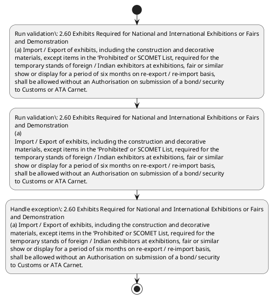

# Chapter 2 / Section 2.60: Exhibits Required for National and International Exhibitions or Fairs

**Chapter Title:** General Provisions Regarding Imports and Exports

**Pages:** 27

**Purpose:** 2.60 Exhibits Required for National and International Exhibitions or Fairs
and Demonstration
(a) Import / Export of exhibits, including the construction and decorative
materials, except items in the ‘Prohibited’ or SCOMET List, required for the
temporary stands of foreign / Indian exhibitors at exhibitions, fair or similar
show or display for a period of six months on re-export / re-import basis,
shall be allowed without an Authorisation on submission of a bond/ security
to Customs or ATA Carnet.

**Purpose Thanglish:** Indha Exhibits Required for National and International Exhibitions or Fairs section-la, 2.60 Exhibits required for National and International Exhibitions or Fairs
and Demonstration
(a) import / export of exhibits, including the construction and decorative
materials, except items in the ‘Prohibited’ or SCOMET List, required for the
temporary stands of foreign / Indian exhibitors at exhibitions, fair or similar
show or display for a period of six months on re-export / re-import basis,
kandippa be allowed without an Authorisation on submission of a bond/ security
to Customs or ATA Carnet.

**Summary:** 2.60 Exhibits Required for National and International Exhibitions or Fairs
and Demonstration
(a) Import / Export of exhibits, including the construction and decorative
materials, except items in the ‘Prohibited’ or SCOMET List, required for the
temporary stands of foreign / Indian exhibitors at exhibitions, fair or similar
show or display for a period of six months on re-export / re-import basis,
shall be allowed without an Authorisation on submission of a bond/ security
to Customs or ATA Carnet. (b) Extension beyond six months for re-export / re-import will be considered
by Customs authorities on merits. Consumables such as paints, printed
material, pamphlets, literature etc.

**Business Meaning:** Exhibits Required for National and International Exhibitions or Fairs governs how DGFT business controls should be applied, validated, and enforced.

**Business Explanation:** Exhibits Required for National and International Exhibitions or Fairs explains the operating rule set that DEKAI should enforce. Key control points include 2.60 Exhibits Required for National and International Exhibitions or Fairs
and Demonstration
(a) Import / Export of exhibits, including the construction and decorative
materials, except items in the ‘Prohibited’ or SCOMET List, required for the
temporary stands of foreign / Indian exhibitors at exhibitions, fair or similar
show or display for a period of six months on re-export / re-import basis,
shall be allowed without an Authorisation on submission of a bond/ security
to Customs or ATA Carnet.

**Business Explanation Thanglish:** Indha Exhibits Required for National and International Exhibitions or Fairs section-la, Exhibits required for National and International Exhibitions or Fairs explains the operating rule set that DEKAI should enforce. Key control points include 2.60 Exhibits required for National and International Exhibitions or Fairs
and Demonstration
(a) import / export of exhibits, including the construction and decorative
materials, except items in the ‘Prohibited’ or SCOMET List, required for the
temporary stands of foreign / Indian exhibitors at exhibitions, fair or similar
show or display for a period of six months on re-export / re-import basis,
kandippa be allowed without an Authorisation on submission of a bond/ security
to Customs or ATA Carnet.

## Business Logic
- 2.60 Exhibits Required for National and International Exhibitions or Fairs
and Demonstration
(a) Import / Export of exhibits, including the construction and decorative
materials, except items in the ‘Prohibited’ or SCOMET List, required for the
temporary stands of foreign / Indian exhibitors at exhibitions, fair or similar
show or display for a period of six months on re-export / re-import basis,
shall be allowed without an Authorisation on submission of a bond/ security
to Customs or ATA Carnet.
- 2.60 Exhibits Required for National and International Exhibitions or Fairs
and Demonstration
(a)
Import / Export of exhibits, including the construction and decorative
materials, except items in the ‘Prohibited’ or SCOMET List, required for the
temporary stands of foreign / Indian exhibitors at exhibitions, fair or similar
show or display for a period of six months on re-export / re-import basis,
shall be allowed without an Authorisation on submission of a bond/ security
to Customs or ATA Carnet.

## Business Rules
- rule_id=CH2-SEC2_60-R001, rule_description=2.60 Exhibits Required for National and International Exhibitions or Fairs
and Demonstration
(a) Import / Export of exhibits, including the construction and decorative
materials, except items in the ‘Prohibited’ or SCOMET List, required for the
temporary stands of foreign / Indian exhibitors at exhibitions, fair or similar
show or display for a period of six months on re-export / re-import basis,
shall be allowed without an Authorisation on submission of a bond/ security
to Customs or ATA Carnet., trigger=Exhibits Required for National and International Exhibitions or Fairs, condition=Not explicitly covered in uploaded documents., validation=2.60 Exhibits Required for National and International Exhibitions or Fairs
and Demonstration
(a) Import / Export of exhibits, including the construction and decorative
materials, except items in the ‘Prohibited’ or SCOMET List, required for the
temporary stands of foreign / Indian exhibitors at exhibitions, fair or similar
show or display for a period of six months on re-export / re-import basis,
shall be allowed without an Authorisation on submission of a bond/ security
to Customs or ATA Carnet., action=Manual review required., exception=2.60 Exhibits Required for National and International Exhibitions or Fairs
and Demonstration
(a) Import / Export of exhibits, including the construction and decorative
materials, except items in the ‘Prohibited’ or SCOMET List, required for the
temporary stands of foreign / Indian exhibitors at exhibitions, fair or similar
show or display for a period of six months on re-export / re-import basis,
shall be allowed without an Authorisation on submission of a bond/ security
to Customs or ATA Carnet., output=DEKAI should produce a compliance decision for 2.60 - Exhibits Required for National and International Exhibitions or Fairs.
- rule_id=CH2-SEC2_60-R002, rule_description=2.60 Exhibits Required for National and International Exhibitions or Fairs
and Demonstration
(a)
Import / Export of exhibits, including the construction and decorative
materials, except items in the ‘Prohibited’ or SCOMET List, required for the
temporary stands of foreign / Indian exhibitors at exhibitions, fair or similar
show or display for a period of six months on re-export / re-import basis,
shall be allowed without an Authorisation on submission of a bond/ security
to Customs or ATA Carnet., trigger=Exhibits Required for National and International Exhibitions or Fairs, condition=Not explicitly covered in uploaded documents., validation=2.60 Exhibits Required for National and International Exhibitions or Fairs
and Demonstration
(a)
Import / Export of exhibits, including the construction and decorative
materials, except items in the ‘Prohibited’ or SCOMET List, required for the
temporary stands of foreign / Indian exhibitors at exhibitions, fair or similar
show or display for a period of six months on re-export / re-import basis,
shall be allowed without an Authorisation on submission of a bond/ security
to Customs or ATA Carnet., action=Manual review required., exception=2.60 Exhibits Required for National and International Exhibitions or Fairs
and Demonstration
(a)
Import / Export of exhibits, including the construction and decorative
materials, except items in the ‘Prohibited’ or SCOMET List, required for the
temporary stands of foreign / Indian exhibitors at exhibitions, fair or similar
show or display for a period of six months on re-export / re-import basis,
shall be allowed without an Authorisation on submission of a bond/ security
to Customs or ATA Carnet., output=DEKAI should produce a compliance decision for 2.60 - Exhibits Required for National and International Exhibitions or Fairs.

## Conditions
- None identified

## Condition Logic
- None identified

## Validations
- 2.60 Exhibits Required for National and International Exhibitions or Fairs
and Demonstration
(a) Import / Export of exhibits, including the construction and decorative
materials, except items in the ‘Prohibited’ or SCOMET List, required for the
temporary stands of foreign / Indian exhibitors at exhibitions, fair or similar
show or display for a period of six months on re-export / re-import basis,
shall be allowed without an Authorisation on submission of a bond/ security
to Customs or ATA Carnet.
- 2.60 Exhibits Required for National and International Exhibitions or Fairs
and Demonstration
(a)
Import / Export of exhibits, including the construction and decorative
materials, except items in the ‘Prohibited’ or SCOMET List, required for the
temporary stands of foreign / Indian exhibitors at exhibitions, fair or similar
show or display for a period of six months on re-export / re-import basis,
shall be allowed without an Authorisation on submission of a bond/ security
to Customs or ATA Carnet.

## Exceptions
- 2.60 Exhibits Required for National and International Exhibitions or Fairs
and Demonstration
(a) Import / Export of exhibits, including the construction and decorative
materials, except items in the ‘Prohibited’ or SCOMET List, required for the
temporary stands of foreign / Indian exhibitors at exhibitions, fair or similar
show or display for a period of six months on re-export / re-import basis,
shall be allowed without an Authorisation on submission of a bond/ security
to Customs or ATA Carnet.
- 2.60 Exhibits Required for National and International Exhibitions or Fairs
and Demonstration
(a)
Import / Export of exhibits, including the construction and decorative
materials, except items in the ‘Prohibited’ or SCOMET List, required for the
temporary stands of foreign / Indian exhibitors at exhibitions, fair or similar
show or display for a period of six months on re-export / re-import basis,
shall be allowed without an Authorisation on submission of a bond/ security
to Customs or ATA Carnet.

## Dependencies
- None identified

## Authorities
- Customs

## Required Documents
- None identified

## Timelines
- 2.60 Exhibits Required for National and International Exhibitions or Fairs
and Demonstration
(a) Import / Export of exhibits, including the construction and decorative
materials, except items in the ‘Prohibited’ or SCOMET List, required for the
temporary stands of foreign / Indian exhibitors at exhibitions, fair or similar
show or display for a period of six months on re-export / re-import basis,
shall be allowed without an Authorisation on submission of a bond/ security
to Customs or ATA Carnet.
- (b) Extension beyond six months for re-export / re-import will be considered
by Customs authorities on merits.
- 2.60 Exhibits Required for National and International Exhibitions or Fairs
and Demonstration
(a)
Import / Export of exhibits, including the construction and decorative
materials, except items in the ‘Prohibited’ or SCOMET List, required for the
temporary stands of foreign / Indian exhibitors at exhibitions, fair or similar
show or display for a period of six months on re-export / re-import basis,
shall be allowed without an Authorisation on submission of a bond/ security
to Customs or ATA Carnet.
- (b)
Extension beyond six months for re-export / re-import will be considered
by Customs authorities on merits.

## Actions
- None identified

## Workflow
- Run validation: 2.60 Exhibits Required for National and International Exhibitions or Fairs
and Demonstration
(a) Import / Export of exhibits, including the construction and decorative
materials, except items in the ‘Prohibited’ or SCOMET List, required for the
temporary stands of foreign / Indian exhibitors at exhibitions, fair or similar
show or display for a period of six months on re-export / re-import basis,
shall be allowed without an Authorisation on submission of a bond/ security
to Customs or ATA Carnet.
- Run validation: 2.60 Exhibits Required for National and International Exhibitions or Fairs
and Demonstration
(a)
Import / Export of exhibits, including the construction and decorative
materials, except items in the ‘Prohibited’ or SCOMET List, required for the
temporary stands of foreign / Indian exhibitors at exhibitions, fair or similar
show or display for a period of six months on re-export / re-import basis,
shall be allowed without an Authorisation on submission of a bond/ security
to Customs or ATA Carnet.
- Handle exception: 2.60 Exhibits Required for National and International Exhibitions or Fairs
and Demonstration
(a) Import / Export of exhibits, including the construction and decorative
materials, except items in the ‘Prohibited’ or SCOMET List, required for the
temporary stands of foreign / Indian exhibitors at exhibitions, fair or similar
show or display for a period of six months on re-export / re-import basis,
shall be allowed without an Authorisation on submission of a bond/ security
to Customs or ATA Carnet.

## Workflow ASCII
```text
Exhibits Required for National and International Exhibitions or Fairs
Run validation: 2.60 Exhibits Required for National and International Exhibitions or Fairs
and Demonstration
(a) Import / Export of exhibits, including the construction and decorative
materials, except items in the ‘Prohibited’ or SCOMET List, required for the
temporary stands of foreign / Indian exhibitors at exhibitions, fair or similar
show or display for a period of six months on re-export / re-import basis,
shall be allowed without an Authorisation on submission of a bond/ security
to Customs or ATA Carnet.
   |
   v
Run validation: 2.60 Exhibits Required for National and International Exhibitions or Fairs
and Demonstration
(a)
Import / Export of exhibits, including the construction and decorative
materials, except items in the ‘Prohibited’ or SCOMET List, required for the
temporary stands of foreign / Indian exhibitors at exhibitions, fair or similar
show or display for a period of six months on re-export / re-import basis,
shall be allowed without an Authorisation on submission of a bond/ security
to Customs or ATA Carnet.
   |
   v
Handle exception: 2.60 Exhibits Required for National and International Exhibitions or Fairs
and Demonstration
(a) Import / Export of exhibits, including the construction and decorative
materials, except items in the ‘Prohibited’ or SCOMET List, required for the
temporary stands of foreign / Indian exhibitors at exhibitions, fair or similar
show or display for a period of six months on re-export / re-import basis,
shall be allowed without an Authorisation on submission of a bond/ security
to Customs or ATA Carnet.
```

## Decision Tree
- IF exception applies (2.60 Exhibits Required for National and International Exhibitions or Fairs
and Demonstration
(a) Import / Export of exhibits, including the construction and decorative
materials, except items in the ‘Prohibited’ or SCOMET List, required for the
temporary stands of foreign / Indian exhibitors at exhibitions, fair or similar
show or display for a period of six months on re-export / re-import basis,
shall be allowed without an Authorisation on submission of a bond/ security
to Customs or ATA Carnet.) THEN route to manual review
- IF exception applies (2.60 Exhibits Required for National and International Exhibitions or Fairs
and Demonstration
(a)
Import / Export of exhibits, including the construction and decorative
materials, except items in the ‘Prohibited’ or SCOMET List, required for the
temporary stands of foreign / Indian exhibitors at exhibitions, fair or similar
show or display for a period of six months on re-export / re-import basis,
shall be allowed without an Authorisation on submission of a bond/ security
to Customs or ATA Carnet.) THEN route to manual review

## Decision Tree ASCII
```text
Exhibits Required for National and International Exhibitions or Fairs Decision
IF exception applies (2.60 Exhibits Required for National and International Exhibitions or Fairs
and Demonstration
(a) Import / Export of exhibits, including the construction and decorative
materials, except items in the ‘Prohibited’ or SCOMET List, required for the
temporary stands of foreign / Indian exhibitors at exhibitions, fair or similar
show or display for a period of six months on re-export / re-import basis,
shall be allowed without an Authorisation on submission of a bond/ security
to Customs or ATA Carnet.) THEN route to manual review
   |
   v
IF exception applies (2.60 Exhibits Required for National and International Exhibitions or Fairs
and Demonstration
(a)
Import / Export of exhibits, including the construction and decorative
materials, except items in the ‘Prohibited’ or SCOMET List, required for the
temporary stands of foreign / Indian exhibitors at exhibitions, fair or similar
show or display for a period of six months on re-export / re-import basis,
shall be allowed without an Authorisation on submission of a bond/ security
to Customs or ATA Carnet.) THEN route to manual review
```

## Examples
- Consumables such as paints, printed
material, pamphlets, literature etc.

**Real-world Example:** Example: an importer or exporter invokes Exhibits Required for National and International Exhibitions or Fairs, submits the prescribed DGFT records, and DEKAI uses the extracted rules to follow the exhibits required for national and international exhibitions or fairs process.

**Real-world Example Thanglish:** Indha Exhibits Required for National and International Exhibitions or Fairs section-la, Example: an importer or exporter invokes Exhibits required for National and International Exhibitions or Fairs, submits the prescribed DGFT records, and DEKAI uses the extracted rules to follow the exhibits required for national and international exhibitions or fairs process.

## AI Rules
- IF detected context matches section rule THEN enforce: 2.60 Exhibits Required for National and International Exhibitions or Fairs
and Demonstration
(a) Import / Export of exhibits, including the construction and decorative
materials, except items in the ‘Prohibited’ or SCOMET List, required for the
temporary stands of foreign / Indian exhibitors at exhibitions, fair or similar
show or display for a period of six months on re-export / re-import basis,
shall be allowed without an Authorisation on submission of a bond/ security
to Customs or ATA Carnet.
- IF detected context matches section rule THEN enforce: 2.60 Exhibits Required for National and International Exhibitions or Fairs
and Demonstration
(a)
Import / Export of exhibits, including the construction and decorative
materials, except items in the ‘Prohibited’ or SCOMET List, required for the
temporary stands of foreign / Indian exhibitors at exhibitions, fair or similar
show or display for a period of six months on re-export / re-import basis,
shall be allowed without an Authorisation on submission of a bond/ security
to Customs or ATA Carnet.

## Database Fields
- name=section_code, type=string, required=True, source=parsed_section_heading
- name=section_title, type=string, required=True, source=parsed_section_heading
- name=for_flag, type=boolean, required=False, source=keyword:for
- name=and_flag, type=boolean, required=False, source=keyword:and
- name=the_flag, type=boolean, required=False, source=keyword:the
- name=six_flag, type=boolean, required=False, source=keyword:six
- name=ata_flag, type=boolean, required=False, source=keyword:ATA
- name=etc_flag, type=boolean, required=False, source=keyword:etc
- name=not_flag, type=boolean, required=False, source=keyword:not
- name=list_flag, type=boolean, required=False, source=keyword:List

## API Requirements
- method=GET, path=/api/dgft/sections/2.60, purpose=Retrieve knowledge payload for section 2.60, query_params=['include=workflow,decision_tree,validations'], response_fields=['section', 'title', 'summary', 'conditions', 'validations', 'exceptions', 'workflow', 'decision_tree']
- method=POST, path=/api/dgft/Exhibits-Required-for-National-and-International-Exhibitions-or-Fairs/validate, purpose=Validate inputs and documents for Exhibits Required for National and International Exhibitions or Fairs, request_fields=['section_code', 'section_title'], response_fields=['status', 'errors', 'warnings', 'next_actions']

## UI Screens
- screen_id=Exhibits_Required_for_National_and_International_Exhibitions_or_Fairs_overview, name=Exhibits Required for National and International Exhibitions or Fairs Overview, purpose=Show section summary, authority, timeline, and eligibility cues., widgets=['summary_card', 'conditions_table', 'authority_badges', 'timeline_panel']
- screen_id=Exhibits_Required_for_National_and_International_Exhibitions_or_Fairs_submission, name=Exhibits Required for National and International Exhibitions or Fairs Submission, purpose=Capture applicant data and supporting documents., widgets=['dynamic_form', 'document_uploader', 'validation_panel', 'next_action_footer'], fields=['section_code', 'section_title', 'for_flag', 'and_flag', 'the_flag', 'six_flag', 'ata_flag', 'etc_flag']
- screen_id=Exhibits_Required_for_National_and_International_Exhibitions_or_Fairs_exceptions, name=Exhibits Required for National and International Exhibitions or Fairs Exception Review, purpose=Explain exception handling and manual review triggers., widgets=['exception_banner', 'decision_tree', 'case_notes']

## Error Messages
- Validation failed because the section requirements were not fully met.

## FAQ
- question_en=What is the purpose of section 2.60?, answer_en=Exhibits Required for National and International Exhibitions or Fairs explains the operating rule set that DEKAI should enforce. Key control points include 2.60 Exhibits Required for National and International Exhibitions or Fairs
and Demonstration
(a) Import / Export of exhibits, including the construction and decorative
materials, except items in the ‘Prohibited’ or SCOMET List, required for the
temporary stands of foreign / Indian exhibitors at exhibitions, fair or similar
show or display for a period of six months on re-export / re-import basis,
shall be allowed without an Authorisation on submission of a bond/ security
to Customs or ATA Carnet., question_thanglish=Indha Exhibits Required for National and International Exhibitions or Fairs section-la, What is the purpose of section 2.60?, answer_thanglish=Indha Exhibits Required for National and International Exhibitions or Fairs section-la, Exhibits required for National and International Exhibitions or Fairs explains the operating rule set that DEKAI should enforce. Key control points include 2.60 Exhibits required for National and International Exhibitions or Fairs
and Demonstration
(a) import / export of exhibits, including the construction and decorative
materials, except items in the ‘Prohibited’ or SCOMET List, required for the
temporary stands of foreign / Indian exhibitors at exhibitions, fair or similar
show or display for a period of six months on re-export / re-import basis,
kandippa be allowed without an Authorisation on submission of a bond/ security
to Customs or ATA Carnet.
- question_en=What documents are required under Exhibits Required for National and International Exhibitions or Fairs?, answer_en=Not explicitly covered in uploaded documents., question_thanglish=Indha Exhibits Required for National and International Exhibitions or Fairs section-la, What documents are required under Exhibits required for National and International Exhibitions or Fairs?, answer_thanglish=Indha Exhibits Required for National and International Exhibitions or Fairs section-la, Not explicitly covered in uploaded documents.
- question_en=Which authority handles Exhibits Required for National and International Exhibitions or Fairs?, answer_en=Customs, question_thanglish=Indha Exhibits Required for National and International Exhibitions or Fairs section-la, Which authority handles Exhibits required for National and International Exhibitions or Fairs?, answer_thanglish=Indha Exhibits Required for National and International Exhibitions or Fairs section-la, Customs

## Questions Users May Ask
- What does Exhibits Required for National and International Exhibitions or Fairs require?
- Which documents are needed for Exhibits Required for National and International Exhibitions or Fairs?
- How does DEKAI validate Exhibits Required for National and International Exhibitions or Fairs requests?

## Expected AI Answers
- Exhibits Required for National and International Exhibitions or Fairs requires the platform to interpret the section text, apply the extracted business rules, and present the correct next action.
- Required documents are inferred from the section text: no explicit documents were detected.
- DEKAI validates Exhibits Required for National and International Exhibitions or Fairs by checking conditions, required documents, authority references, and exception clauses before recommending an outcome.

## AI Q&A Examples
- question_en=User asks: How do I comply with Exhibits Required for National and International Exhibitions or Fairs?, answer_en=AI answers: DEKAI should evaluate section 2.60, apply the extracted rules, and guide the user through Run validation: 2.60 Exhibits Required for National and International Exhibitions or Fairs
and Demonstration
(a) Import / Export of exhibits, including the construction and decorative
materials, except items in the ‘Prohibited’ or SCOMET List, required for the
temporary stands of foreign / Indian exhibitors at exhibitions, fair or similar
show or display for a period of six months on re-export / re-import basis,
shall be allowed without an Authorisation on submission of a bond/ security
to Customs or ATA Carnet.., question_thanglish=Indha Exhibits Required for National and International Exhibitions or Fairs section-la, User asks: How do I comply with Exhibits required for National and International Exhibitions or Fairs?, answer_thanglish=Indha Exhibits Required for National and International Exhibitions or Fairs section-la, AI answers: DEKAI should evaluate section 2.60, apply the extracted rules, and guide the user through Run validation: 2.60 Exhibits required for National and International Exhibitions or Fairs
and Demonstration
(a) import / export of exhibits, including the construction and decorative
materials, except items in the ‘Prohibited’ or SCOMET List, required for the
temporary stands of foreign / Indian exhibitors at exhibitions, fair or similar
show or display for a period of six months on re-export / re-import basis,
kandippa be allowed without an Authorisation on submission of a bond/ security
to Customs or ATA Carnet..
- question_en=User asks: Which validations apply to Exhibits Required for National and International Exhibitions or Fairs?, answer_en=AI answers: Applicable validations are 2.60 Exhibits Required for National and International Exhibitions or Fairs
and Demonstration
(a) Import / Export of exhibits, including the construction and decorative
materials, except items in the ‘Prohibited’ or SCOMET List, required for the
temporary stands of foreign / Indian exhibitors at exhibitions, fair or similar
show or display for a period of six months on re-export / re-import basis,
shall be allowed without an Authorisation on submission of a bond/ security
to Customs or ATA Carnet., 2.60 Exhibits Required for National and International Exhibitions or Fairs
and Demonstration
(a)
Import / Export of exhibits, including the construction and decorative
materials, except items in the ‘Prohibited’ or SCOMET List, required for the
temporary stands of foreign / Indian exhibitors at exhibitions, fair or similar
show or display for a period of six months on re-export / re-import basis,
shall be allowed without an Authorisation on submission of a bond/ security
to Customs or ATA Carnet., question_thanglish=Indha Exhibits Required for National and International Exhibitions or Fairs section-la, User asks: Which validations apply to Exhibits required for National and International Exhibitions or Fairs?, answer_thanglish=Indha Exhibits Required for National and International Exhibitions or Fairs section-la, AI answers: Applicable validations are 2.60 Exhibits required for National and International Exhibitions or Fairs
and Demonstration
(a) import / export of exhibits, including the construction and decorative
materials, except items in the ‘Prohibited’ or SCOMET List, required for the
temporary stands of foreign / Indian exhibitors at exhibitions, fair or similar
show or display for a period of six months on re-export / re-import basis,
kandippa be allowed without an Authorisation on submission of a bond/ security
to Customs or ATA Carnet., 2.60 Exhibits required for National and International Exhibitions or Fairs
and Demonstration
(a)
import / export of exhibits, including the construction and decorative
materials, except items in the ‘Prohibited’ or SCOMET List, required for the
temporary stands of foreign / Indian exhibitors at exhibitions, fair or similar
show or display for a period of six months on re-export / re-import basis,
kandippa be allowed without an Authorisation on submission of a bond/ security
to Customs or ATA Carnet.

## DEKAI AI Implementation Notes
- Capture chapter 2, section 2.60, title, and page references as immutable knowledge metadata.
- Bind validations for Exhibits Required for National and International Exhibitions or Fairs into a rule engine keyed by the rule IDs extracted for this section.
- Route escalations or approvals to: Customs.
- Trigger manual review when exception clauses are detected.

## DEKAI AI Implementation Notes Thanglish
- Indha Exhibits Required for National and International Exhibitions or Fairs section-la, Capture chapter 2, section 2.60, title, and page references as immutable knowledge metadata.
- Indha Exhibits Required for National and International Exhibitions or Fairs section-la, Bind validations for Exhibits required for National and International Exhibitions or Fairs into a rule engine keyed by the rule IDs extracted for this section.
- Indha Exhibits Required for National and International Exhibitions or Fairs section-la, Route escalations or approvals to: Customs.
- Indha Exhibits Required for National and International Exhibitions or Fairs section-la, Trigger manual review when exception clauses are detected.

## AI Metadata
- Keywords: for, and, the, six, ATA, etc, not, List, fair, show, bond, will, such, need, Fairs, items, basis, shall, Import, Export
- Search Keywords: for, and, the, six, ATA, etc, not, List, fair, show, bond, will, such, need, Fairs, items, basis, shall, Import, Export
- Intent: Provide knowledge guidance for Exhibits Required for National and International Exhibitions or Fairs.
- Tags: 2.60, Exhibits Required for National and International Exhibitions or Fairs, business-rule, dgft
- Related Sections: 
- Related Chapters: 
- Related Rules: 2.60 Exhibits Required for National and International Exhibitions or Fairs
and Demonstration
(a) Import / Export of exhibits, including the construction and decorative
materials, except items in the ‘Prohibited’ or SCOMET List, required for the
temporary stands of foreign / Indian exhibitors at exhibitions, fair or similar
show or display for a period of six months on re-export / re-import basis,
shall be allowed without an Authorisation on submission of a bond/ security
to Customs or ATA Carnet., 2.60 Exhibits Required for National and International Exhibitions or Fairs
and Demonstration
(a)
Import / Export of exhibits, including the construction and decorative
materials, except items in the ‘Prohibited’ or SCOMET List, required for the
temporary stands of foreign / Indian exhibitors at exhibitions, fair or similar
show or display for a period of six months on re-export / re-import basis,
shall be allowed without an Authorisation on submission of a bond/ security
to Customs or ATA Carnet.

## Mermaid

```mermaid
flowchart TD
    S1["Run validation: 2.60 Exhibits Required for National and International Exhibitions or Fairs
and Demonstration
(a) Import / Export of exhibits, including the construction and decorative
materials, except items in the ‘Prohibited’ or SCOMET List, required for the
temporary stands of foreign / Indian exhibitors at exhibitions, fair or similar
show or display for a period of six months on re-export / re-import basis,
shall be allowed without an Authorisation on submission of a bond/ security
to Customs or ATA Carnet."]
    S2["Run validation: 2.60 Exhibits Required for National and International Exhibitions or Fairs
and Demonstration
(a)
Import / Export of exhibits, including the construction and decorative
materials, except items in the ‘Prohibited’ or SCOMET List, required for the
temporary stands of foreign / Indian exhibitors at exhibitions, fair or similar
show or display for a period of six months on re-export / re-import basis,
shall be allowed without an Authorisation on submission of a bond/ security
to Customs or ATA Carnet."]
    S1 --> S2
    S3["Handle exception: 2.60 Exhibits Required for National and International Exhibitions or Fairs
and Demonstration
(a) Import / Export of exhibits, including the construction and decorative
materials, except items in the ‘Prohibited’ or SCOMET List, required for the
temporary stands of foreign / Indian exhibitors at exhibitions, fair or similar
show or display for a period of six months on re-export / re-import basis,
shall be allowed without an Authorisation on submission of a bond/ security
to Customs or ATA Carnet."]
    S2 --> S3
```


## PlantUML

