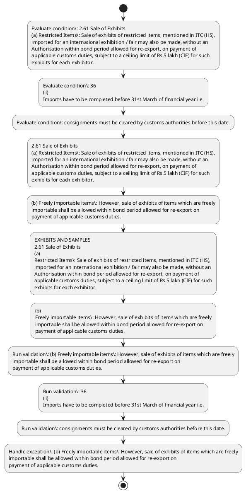

# Chapter 2 / Section 2.61: Sale of Exhibits

**Chapter Title:** General Provisions Regarding Imports and Exports

**Pages:** 27, 28

**Purpose:** 2.61 Sale of Exhibits
(a) Restricted Items: Sale of exhibits of restricted items, mentioned in ITC (HS),
imported for an international exhibition / fair may also be made, without an
Authorisation within bond period allowed for re-export, on payment of
applicable customs duties, subject to a ceiling limit of Rs.5 lakh (CIF) for such
exhibits for each exhibitor.

**Purpose Thanglish:** Indha Sale of Exhibits section-la, 2.61 Sale of Exhibits
(a) Restricted Items: Sale of exhibits of restricted items, mentioned in ITC (HS),
imported for an international exhibition / fair may also be made, without an
Authorisation within bond period allowed for re-export, on payment of
applicable customs duties, subject to a ceiling limit of Rs.5 lakh (CIF) for such
exhibits for each exhibitor.

**Summary:** 2.61 Sale of Exhibits
(a) Restricted Items: Sale of exhibits of restricted items, mentioned in ITC (HS),
imported for an international exhibition / fair may also be made, without an
Authorisation within bond period allowed for re-export, on payment of
applicable customs duties, subject to a ceiling limit of Rs.5 lakh (CIF) for such
exhibits for each exhibitor. (b) Freely importable items: However, sale of exhibits of items which are freely
importable shall be allowed within bond period allowed for re-export on
payment of applicable customs duties. pg.

**Business Meaning:** Sale of Exhibits governs how DGFT business controls should be applied, validated, and enforced.

**Business Explanation:** Sale of Exhibits explains the operating rule set that DEKAI should enforce. Key control points include 2.61 Sale of Exhibits
(a) Restricted Items: Sale of exhibits of restricted items, mentioned in ITC (HS),
imported for an international exhibition / fair may also be made, without an
Authorisation within bond period allowed for re-export, on payment of
applicable customs duties, subject to a ceiling limit of Rs.5 lakh (CIF) for such
exhibits for each exhibitor. The section also drives actions such as 2.61 Sale of Exhibits
(a) Restricted Items: Sale of exhibits of restricted items, mentioned in ITC (HS),
imported for an international exhibition / fair may also be made, without an
Authorisation within bond period allowed for re-export, on payment of
applicable customs duties, subject to a ceiling limit of Rs.5 lakh (CIF) for such
exhibits for each exhibitor..

**Business Explanation Thanglish:** Indha Sale of Exhibits section-la, Sale of Exhibits explains the operating rule set that DEKAI should enforce. Key control points include 2.61 Sale of Exhibits
(a) Restricted Items: Sale of exhibits of restricted items, mentioned in ITC (HS),
imported for an international exhibition / fair may also be made, without an
Authorisation within bond period allowed for re-export, on payment of
applicable customs duties, subject to a ceiling limit of Rs.5 lakh (CIF) for such
exhibits for each exhibitor. The section also drives actions such as 2.61 Sale of Exhibits
(a) Restricted Items: Sale of exhibits of restricted items, mentioned in ITC (HS),
imported for an international exhibition / fair may also be made, without an
Authorisation within bond period allowed for re-export, on payment of
applicable customs duties, subject to a ceiling limit of Rs.5 lakh (CIF) for such
exhibits for each exhibitor..

## Business Logic
- 2.61 Sale of Exhibits
(a) Restricted Items: Sale of exhibits of restricted items, mentioned in ITC (HS),
imported for an international exhibition / fair may also be made, without an
Authorisation within bond period allowed for re-export, on payment of
applicable customs duties, subject to a ceiling limit of Rs.5 lakh (CIF) for such
exhibits for each exhibitor.
- (b) Freely importable items: However, sale of exhibits of items which are freely
importable shall be allowed within bond period allowed for re-export on
payment of applicable customs duties.
- consignments must be cleared by customs authorities before this date.
- (iii)
Since import of maize (corn) is through STEs, the allottees of quota i.e.,
designated agencies in paragraph 2.58 (b) above for this item shall also be
granted an import Authorisation for allotted quantities as indicated at Sl.
- (iv)
Application fee for these applications shall be paid according to procedure
contained in Appendix 2K of Appendices & Aayat Niryat Forms.
- EXHIBITS AND SAMPLES
2.61 Sale of Exhibits
(a)
Restricted Items: Sale of exhibits of restricted items, mentioned in ITC (HS),
imported for an international exhibition / fair may also be made, without an
Authorisation within bond period allowed for re-export, on payment of
applicable customs duties, subject to a ceiling limit of Rs.5 lakh (CIF) for such
exhibits for each exhibitor.
- (b)
Freely importable items: However, sale of exhibits of items which are freely
importable shall be allowed within bond period allowed for re-export on
payment of applicable customs duties.

## Business Rules
- rule_id=CH2-SEC2_61-R001, rule_description=2.61 Sale of Exhibits
(a) Restricted Items: Sale of exhibits of restricted items, mentioned in ITC (HS),
imported for an international exhibition / fair may also be made, without an
Authorisation within bond period allowed for re-export, on payment of
applicable customs duties, subject to a ceiling limit of Rs.5 lakh (CIF) for such
exhibits for each exhibitor., trigger=Sale of Exhibits, condition=2.61 Sale of Exhibits
(a) Restricted Items: Sale of exhibits of restricted items, mentioned in ITC (HS),
imported for an international exhibition / fair may also be made, without an
Authorisation within bond period allowed for re-export, on payment of
applicable customs duties, subject to a ceiling limit of Rs.5 lakh (CIF) for such
exhibits for each exhibitor., validation=(b) Freely importable items: However, sale of exhibits of items which are freely
importable shall be allowed within bond period allowed for re-export on
payment of applicable customs duties., action=2.61 Sale of Exhibits
(a) Restricted Items: Sale of exhibits of restricted items, mentioned in ITC (HS),
imported for an international exhibition / fair may also be made, without an
Authorisation within bond period allowed for re-export, on payment of
applicable customs duties, subject to a ceiling limit of Rs.5 lakh (CIF) for such
exhibits for each exhibitor., exception=(b) Freely importable items: However, sale of exhibits of items which are freely
importable shall be allowed within bond period allowed for re-export on
payment of applicable customs duties., output=DEKAI should produce a compliance decision for 2.61 - Sale of Exhibits.
- rule_id=CH2-SEC2_61-R002, rule_description=(b) Freely importable items: However, sale of exhibits of items which are freely
importable shall be allowed within bond period allowed for re-export on
payment of applicable customs duties., trigger=Sale of Exhibits, condition=36
(ii)
Imports have to be completed before 31st March of financial year i.e., validation=36
(ii)
Imports have to be completed before 31st March of financial year i.e., action=(b) Freely importable items: However, sale of exhibits of items which are freely
importable shall be allowed within bond period allowed for re-export on
payment of applicable customs duties., exception=(b)
Freely importable items: However, sale of exhibits of items which are freely
importable shall be allowed within bond period allowed for re-export on
payment of applicable customs duties., output=DEKAI should produce a compliance decision for 2.61 - Sale of Exhibits.
- rule_id=CH2-SEC2_61-R003, rule_description=consignments must be cleared by customs authorities before this date., trigger=Sale of Exhibits, condition=consignments must be cleared by customs authorities before this date., validation=consignments must be cleared by customs authorities before this date., action=EXHIBITS AND SAMPLES
2.61 Sale of Exhibits
(a)
Restricted Items: Sale of exhibits of restricted items, mentioned in ITC (HS),
imported for an international exhibition / fair may also be made, without an
Authorisation within bond period allowed for re-export, on payment of
applicable customs duties, subject to a ceiling limit of Rs.5 lakh (CIF) for such
exhibits for each exhibitor., exception=(b)
Freely importable items: However, sale of exhibits of items which are freely
importable shall be allowed within bond period allowed for re-export on
payment of applicable customs duties., output=DEKAI should produce a compliance decision for 2.61 - Sale of Exhibits.
- rule_id=CH2-SEC2_61-R004, rule_description=(iii)
Since import of maize (corn) is through STEs, the allottees of quota i.e.,
designated agencies in paragraph 2.58 (b) above for this item shall also be
granted an import Authorisation for allotted quantities as indicated at Sl., trigger=Sale of Exhibits, condition=21
(b) of Customs Notification No., validation=(iii)
Since import of maize (corn) is through STEs, the allottees of quota i.e.,
designated agencies in paragraph 2.58 (b) above for this item shall also be
granted an import Authorisation for allotted quantities as indicated at Sl., action=(b)
Freely importable items: However, sale of exhibits of items which are freely
importable shall be allowed within bond period allowed for re-export on
payment of applicable customs duties., exception=(b)
Freely importable items: However, sale of exhibits of items which are freely
importable shall be allowed within bond period allowed for re-export on
payment of applicable customs duties., output=DEKAI should produce a compliance decision for 2.61 - Sale of Exhibits.
- rule_id=CH2-SEC2_61-R005, rule_description=(iv)
Application fee for these applications shall be paid according to procedure
contained in Appendix 2K of Appendices & Aayat Niryat Forms., trigger=Sale of Exhibits, condition=EXHIBITS AND SAMPLES
2.61 Sale of Exhibits
(a)
Restricted Items: Sale of exhibits of restricted items, mentioned in ITC (HS),
imported for an international exhibition / fair may also be made, without an
Authorisation within bond period allowed for re-export, on payment of
applicable customs duties, subject to a ceiling limit of Rs.5 lakh (CIF) for such
exhibits for each exhibitor., validation=(iv)
Application fee for these applications shall be paid according to procedure
contained in Appendix 2K of Appendices & Aayat Niryat Forms., action=(b)
Freely importable items: However, sale of exhibits of items which are freely
importable shall be allowed within bond period allowed for re-export on
payment of applicable customs duties., exception=(b)
Freely importable items: However, sale of exhibits of items which are freely
importable shall be allowed within bond period allowed for re-export on
payment of applicable customs duties., output=DEKAI should produce a compliance decision for 2.61 - Sale of Exhibits.
- rule_id=CH2-SEC2_61-R006, rule_description=EXHIBITS AND SAMPLES
2.61 Sale of Exhibits
(a)
Restricted Items: Sale of exhibits of restricted items, mentioned in ITC (HS),
imported for an international exhibition / fair may also be made, without an
Authorisation within bond period allowed for re-export, on payment of
applicable customs duties, subject to a ceiling limit of Rs.5 lakh (CIF) for such
exhibits for each exhibitor., trigger=Sale of Exhibits, condition=36
(c) If goods brought for exhibition are not re-exported or sold within bond period
due to circumstances beyond control of importer, Customs Authorities may
allow extension of bond period on merits., validation=(b)
Freely importable items: However, sale of exhibits of items which are freely
importable shall be allowed within bond period allowed for re-export on
payment of applicable customs duties., action=(b)
Freely importable items: However, sale of exhibits of items which are freely
importable shall be allowed within bond period allowed for re-export on
payment of applicable customs duties., exception=(b)
Freely importable items: However, sale of exhibits of items which are freely
importable shall be allowed within bond period allowed for re-export on
payment of applicable customs duties., output=DEKAI should produce a compliance decision for 2.61 - Sale of Exhibits.
- rule_id=CH2-SEC2_61-R007, rule_description=(b)
Freely importable items: However, sale of exhibits of items which are freely
importable shall be allowed within bond period allowed for re-export on
payment of applicable customs duties., trigger=Sale of Exhibits, condition=36
(c) If goods brought for exhibition are not re-exported or sold within bond period
due to circumstances beyond control of importer, Customs Authorities may
allow extension of bond period on merits., validation=(b)
Freely importable items: However, sale of exhibits of items which are freely
importable shall be allowed within bond period allowed for re-export on
payment of applicable customs duties., action=(b)
Freely importable items: However, sale of exhibits of items which are freely
importable shall be allowed within bond period allowed for re-export on
payment of applicable customs duties., exception=(b)
Freely importable items: However, sale of exhibits of items which are freely
importable shall be allowed within bond period allowed for re-export on
payment of applicable customs duties., output=DEKAI should produce a compliance decision for 2.61 - Sale of Exhibits.

## Conditions
- 2.61 Sale of Exhibits
(a) Restricted Items: Sale of exhibits of restricted items, mentioned in ITC (HS),
imported for an international exhibition / fair may also be made, without an
Authorisation within bond period allowed for re-export, on payment of
applicable customs duties, subject to a ceiling limit of Rs.5 lakh (CIF) for such
exhibits for each exhibitor.
- 36
(ii)
Imports have to be completed before 31st March of financial year i.e.
- consignments must be cleared by customs authorities before this date.
- 21
(b) of Customs Notification No.
- EXHIBITS AND SAMPLES
2.61 Sale of Exhibits
(a)
Restricted Items: Sale of exhibits of restricted items, mentioned in ITC (HS),
imported for an international exhibition / fair may also be made, without an
Authorisation within bond period allowed for re-export, on payment of
applicable customs duties, subject to a ceiling limit of Rs.5 lakh (CIF) for such
exhibits for each exhibitor.
- 36
(c) If goods brought for exhibition are not re-exported or sold within bond period
due to circumstances beyond control of importer, Customs Authorities may
allow extension of bond period on merits.

## Condition Logic
- id=2.2.61.1, if=2.61 Sale of Exhibits
(a) Restricted Items: Sale of exhibits of restricted items, mentioned in ITC (HS),
imported for an international exhibition / fair may also be made, without an
Authorisation within bond period allowed for re-export, on payment of
applicable customs duties, subject to a ceiling limit of Rs.5 lakh (CIF) for such
exhibits for each exhibitor., then=2.61 Sale of Exhibits
(a) Restricted Items: Sale of exhibits of restricted items, mentioned in ITC (HS),
imported for an international exhibition / fair may also be made, without an
Authorisation within bond period allowed for re-export, on payment of
applicable customs duties, subject to a ceiling limit of Rs.5 lakh (CIF) for such
exhibits for each exhibitor., source=2.61 Sale of Exhibits
(a) Restricted Items: Sale of exhibits of restricted items, mentioned in ITC (HS),
imported for an international exhibition / fair may also be made, without an
Authorisation within bond period allowed for re-export, on payment of
applicable customs duties, subject to a ceiling limit of Rs.5 lakh (CIF) for such
exhibits for each exhibitor.
- id=2.2.61.2, if=36
(ii)
Imports have to be completed before 31st March of financial year i.e., then=2.61 Sale of Exhibits
(a) Restricted Items: Sale of exhibits of restricted items, mentioned in ITC (HS),
imported for an international exhibition / fair may also be made, without an
Authorisation within bond period allowed for re-export, on payment of
applicable customs duties, subject to a ceiling limit of Rs.5 lakh (CIF) for such
exhibits for each exhibitor., source=36
(ii)
Imports have to be completed before 31st March of financial year i.e.
- id=2.2.61.3, if=consignments must be cleared by customs authorities before this date., then=2.61 Sale of Exhibits
(a) Restricted Items: Sale of exhibits of restricted items, mentioned in ITC (HS),
imported for an international exhibition / fair may also be made, without an
Authorisation within bond period allowed for re-export, on payment of
applicable customs duties, subject to a ceiling limit of Rs.5 lakh (CIF) for such
exhibits for each exhibitor., source=consignments must be cleared by customs authorities before this date.
- id=2.2.61.4, if=21
(b) of Customs Notification No., then=2.61 Sale of Exhibits
(a) Restricted Items: Sale of exhibits of restricted items, mentioned in ITC (HS),
imported for an international exhibition / fair may also be made, without an
Authorisation within bond period allowed for re-export, on payment of
applicable customs duties, subject to a ceiling limit of Rs.5 lakh (CIF) for such
exhibits for each exhibitor., source=21
(b) of Customs Notification No.
- id=2.2.61.5, if=EXHIBITS AND SAMPLES
2.61 Sale of Exhibits
(a)
Restricted Items: Sale of exhibits of restricted items, mentioned in ITC (HS),
imported for an international exhibition / fair may also be made, without an
Authorisation within bond period allowed for re-export, on payment of
applicable customs duties, subject to a ceiling limit of Rs.5 lakh (CIF) for such
exhibits for each exhibitor., then=2.61 Sale of Exhibits
(a) Restricted Items: Sale of exhibits of restricted items, mentioned in ITC (HS),
imported for an international exhibition / fair may also be made, without an
Authorisation within bond period allowed for re-export, on payment of
applicable customs duties, subject to a ceiling limit of Rs.5 lakh (CIF) for such
exhibits for each exhibitor., source=EXHIBITS AND SAMPLES
2.61 Sale of Exhibits
(a)
Restricted Items: Sale of exhibits of restricted items, mentioned in ITC (HS),
imported for an international exhibition / fair may also be made, without an
Authorisation within bond period allowed for re-export, on payment of
applicable customs duties, subject to a ceiling limit of Rs.5 lakh (CIF) for such
exhibits for each exhibitor.
- id=2.2.61.6, if=36
(c) If goods brought for exhibition are not re-exported or sold within bond period
due to circumstances beyond control of importer, Customs Authorities may
allow extension of bond period on merits., then=2.61 Sale of Exhibits
(a) Restricted Items: Sale of exhibits of restricted items, mentioned in ITC (HS),
imported for an international exhibition / fair may also be made, without an
Authorisation within bond period allowed for re-export, on payment of
applicable customs duties, subject to a ceiling limit of Rs.5 lakh (CIF) for such
exhibits for each exhibitor., source=36
(c) If goods brought for exhibition are not re-exported or sold within bond period
due to circumstances beyond control of importer, Customs Authorities may
allow extension of bond period on merits.

## Validations
- (b) Freely importable items: However, sale of exhibits of items which are freely
importable shall be allowed within bond period allowed for re-export on
payment of applicable customs duties.
- 36
(ii)
Imports have to be completed before 31st March of financial year i.e.
- consignments must be cleared by customs authorities before this date.
- (iii)
Since import of maize (corn) is through STEs, the allottees of quota i.e.,
designated agencies in paragraph 2.58 (b) above for this item shall also be
granted an import Authorisation for allotted quantities as indicated at Sl.
- (iv)
Application fee for these applications shall be paid according to procedure
contained in Appendix 2K of Appendices & Aayat Niryat Forms.
- (b)
Freely importable items: However, sale of exhibits of items which are freely
importable shall be allowed within bond period allowed for re-export on
payment of applicable customs duties.

## Exceptions
- (b) Freely importable items: However, sale of exhibits of items which are freely
importable shall be allowed within bond period allowed for re-export on
payment of applicable customs duties.
- (b)
Freely importable items: However, sale of exhibits of items which are freely
importable shall be allowed within bond period allowed for re-export on
payment of applicable customs duties.

## Dependencies
- 2.58
- 2.21
- 1

## Authorities
- customs
- DGFT
- EFC in DGFT
- Customs Authorities

## Required Documents
- (iv)
Application fee for these applications shall be paid according to procedure
contained in Appendix 2K of Appendices & Aayat Niryat Forms.

## Timelines
- 2.61 Sale of Exhibits
(a) Restricted Items: Sale of exhibits of restricted items, mentioned in ITC (HS),
imported for an international exhibition / fair may also be made, without an
Authorisation within bond period allowed for re-export, on payment of
applicable customs duties, subject to a ceiling limit of Rs.5 lakh (CIF) for such
exhibits for each exhibitor.
- (b) Freely importable items: However, sale of exhibits of items which are freely
importable shall be allowed within bond period allowed for re-export on
payment of applicable customs duties.
- 36
(ii)
Imports have to be completed before 31st March of financial year i.e.
- consignments must be cleared by customs authorities before this date.
- EXHIBITS AND SAMPLES
2.61 Sale of Exhibits
(a)
Restricted Items: Sale of exhibits of restricted items, mentioned in ITC (HS),
imported for an international exhibition / fair may also be made, without an
Authorisation within bond period allowed for re-export, on payment of
applicable customs duties, subject to a ceiling limit of Rs.5 lakh (CIF) for such
exhibits for each exhibitor.
- (b)
Freely importable items: However, sale of exhibits of items which are freely
importable shall be allowed within bond period allowed for re-export on
payment of applicable customs duties.
- 36
(c) If goods brought for exhibition are not re-exported or sold within bond period
due to circumstances beyond control of importer, Customs Authorities may
allow extension of bond period on merits.

## Actions
- 2.61 Sale of Exhibits
(a) Restricted Items: Sale of exhibits of restricted items, mentioned in ITC (HS),
imported for an international exhibition / fair may also be made, without an
Authorisation within bond period allowed for re-export, on payment of
applicable customs duties, subject to a ceiling limit of Rs.5 lakh (CIF) for such
exhibits for each exhibitor.
- (b) Freely importable items: However, sale of exhibits of items which are freely
importable shall be allowed within bond period allowed for re-export on
payment of applicable customs duties.
- EXHIBITS AND SAMPLES
2.61 Sale of Exhibits
(a)
Restricted Items: Sale of exhibits of restricted items, mentioned in ITC (HS),
imported for an international exhibition / fair may also be made, without an
Authorisation within bond period allowed for re-export, on payment of
applicable customs duties, subject to a ceiling limit of Rs.5 lakh (CIF) for such
exhibits for each exhibitor.
- (b)
Freely importable items: However, sale of exhibits of items which are freely
importable shall be allowed within bond period allowed for re-export on
payment of applicable customs duties.

## Workflow
- Evaluate condition: 2.61 Sale of Exhibits
(a) Restricted Items: Sale of exhibits of restricted items, mentioned in ITC (HS),
imported for an international exhibition / fair may also be made, without an
Authorisation within bond period allowed for re-export, on payment of
applicable customs duties, subject to a ceiling limit of Rs.5 lakh (CIF) for such
exhibits for each exhibitor.
- Evaluate condition: 36
(ii)
Imports have to be completed before 31st March of financial year i.e.
- Evaluate condition: consignments must be cleared by customs authorities before this date.
- 2.61 Sale of Exhibits
(a) Restricted Items: Sale of exhibits of restricted items, mentioned in ITC (HS),
imported for an international exhibition / fair may also be made, without an
Authorisation within bond period allowed for re-export, on payment of
applicable customs duties, subject to a ceiling limit of Rs.5 lakh (CIF) for such
exhibits for each exhibitor.
- (b) Freely importable items: However, sale of exhibits of items which are freely
importable shall be allowed within bond period allowed for re-export on
payment of applicable customs duties.
- EXHIBITS AND SAMPLES
2.61 Sale of Exhibits
(a)
Restricted Items: Sale of exhibits of restricted items, mentioned in ITC (HS),
imported for an international exhibition / fair may also be made, without an
Authorisation within bond period allowed for re-export, on payment of
applicable customs duties, subject to a ceiling limit of Rs.5 lakh (CIF) for such
exhibits for each exhibitor.
- (b)
Freely importable items: However, sale of exhibits of items which are freely
importable shall be allowed within bond period allowed for re-export on
payment of applicable customs duties.
- Run validation: (b) Freely importable items: However, sale of exhibits of items which are freely
importable shall be allowed within bond period allowed for re-export on
payment of applicable customs duties.
- Run validation: 36
(ii)
Imports have to be completed before 31st March of financial year i.e.
- Run validation: consignments must be cleared by customs authorities before this date.
- Handle exception: (b) Freely importable items: However, sale of exhibits of items which are freely
importable shall be allowed within bond period allowed for re-export on
payment of applicable customs duties.

## Workflow ASCII
```text
Sale of Exhibits
Evaluate condition: 2.61 Sale of Exhibits
(a) Restricted Items: Sale of exhibits of restricted items, mentioned in ITC (HS),
imported for an international exhibition / fair may also be made, without an
Authorisation within bond period allowed for re-export, on payment of
applicable customs duties, subject to a ceiling limit of Rs.5 lakh (CIF) for such
exhibits for each exhibitor.
   |
   v
Evaluate condition: 36
(ii)
Imports have to be completed before 31st March of financial year i.e.
   |
   v
Evaluate condition: consignments must be cleared by customs authorities before this date.
   |
   v
2.61 Sale of Exhibits
(a) Restricted Items: Sale of exhibits of restricted items, mentioned in ITC (HS),
imported for an international exhibition / fair may also be made, without an
Authorisation within bond period allowed for re-export, on payment of
applicable customs duties, subject to a ceiling limit of Rs.5 lakh (CIF) for such
exhibits for each exhibitor.
   |
   v
(b) Freely importable items: However, sale of exhibits of items which are freely
importable shall be allowed within bond period allowed for re-export on
payment of applicable customs duties.
   |
   v
EXHIBITS AND SAMPLES
2.61 Sale of Exhibits
(a)
Restricted Items: Sale of exhibits of restricted items, mentioned in ITC (HS),
imported for an international exhibition / fair may also be made, without an
Authorisation within bond period allowed for re-export, on payment of
applicable customs duties, subject to a ceiling limit of Rs.5 lakh (CIF) for such
exhibits for each exhibitor.
   |
   v
(b)
Freely importable items: However, sale of exhibits of items which are freely
importable shall be allowed within bond period allowed for re-export on
payment of applicable customs duties.
   |
   v
Run validation: (b) Freely importable items: However, sale of exhibits of items which are freely
importable shall be allowed within bond period allowed for re-export on
payment of applicable customs duties.
   |
   v
Run validation: 36
(ii)
Imports have to be completed before 31st March of financial year i.e.
   |
   v
Run validation: consignments must be cleared by customs authorities before this date.
   |
   v
Handle exception: (b) Freely importable items: However, sale of exhibits of items which are freely
importable shall be allowed within bond period allowed for re-export on
payment of applicable customs duties.
```

## Decision Tree
- IF 2.61 Sale of Exhibits
(a) Restricted Items: Sale of exhibits of restricted items, mentioned in ITC (HS),
imported for an international exhibition / fair may also be made, without an
Authorisation within bond period allowed for re-export, on payment of
applicable customs duties, subject to a ceiling limit of Rs.5 lakh (CIF) for such
exhibits for each exhibitor. THEN 2.61 Sale of Exhibits
(a) Restricted Items: Sale of exhibits of restricted items, mentioned in ITC (HS),
imported for an international exhibition / fair may also be made, without an
Authorisation within bond period allowed for re-export, on payment of
applicable customs duties, subject to a ceiling limit of Rs.5 lakh (CIF) for such
exhibits for each exhibitor.
- IF 36
(ii)
Imports have to be completed before 31st March of financial year i.e. THEN 2.61 Sale of Exhibits
(a) Restricted Items: Sale of exhibits of restricted items, mentioned in ITC (HS),
imported for an international exhibition / fair may also be made, without an
Authorisation within bond period allowed for re-export, on payment of
applicable customs duties, subject to a ceiling limit of Rs.5 lakh (CIF) for such
exhibits for each exhibitor.
- IF consignments must be cleared by customs authorities before this date. THEN 2.61 Sale of Exhibits
(a) Restricted Items: Sale of exhibits of restricted items, mentioned in ITC (HS),
imported for an international exhibition / fair may also be made, without an
Authorisation within bond period allowed for re-export, on payment of
applicable customs duties, subject to a ceiling limit of Rs.5 lakh (CIF) for such
exhibits for each exhibitor.
- IF 21
(b) of Customs Notification No. THEN 2.61 Sale of Exhibits
(a) Restricted Items: Sale of exhibits of restricted items, mentioned in ITC (HS),
imported for an international exhibition / fair may also be made, without an
Authorisation within bond period allowed for re-export, on payment of
applicable customs duties, subject to a ceiling limit of Rs.5 lakh (CIF) for such
exhibits for each exhibitor.
- IF EXHIBITS AND SAMPLES
2.61 Sale of Exhibits
(a)
Restricted Items: Sale of exhibits of restricted items, mentioned in ITC (HS),
imported for an international exhibition / fair may also be made, without an
Authorisation within bond period allowed for re-export, on payment of
applicable customs duties, subject to a ceiling limit of Rs.5 lakh (CIF) for such
exhibits for each exhibitor. THEN 2.61 Sale of Exhibits
(a) Restricted Items: Sale of exhibits of restricted items, mentioned in ITC (HS),
imported for an international exhibition / fair may also be made, without an
Authorisation within bond period allowed for re-export, on payment of
applicable customs duties, subject to a ceiling limit of Rs.5 lakh (CIF) for such
exhibits for each exhibitor.
- IF exception applies ((b) Freely importable items: However, sale of exhibits of items which are freely
importable shall be allowed within bond period allowed for re-export on
payment of applicable customs duties.) THEN route to manual review
- IF exception applies ((b)
Freely importable items: However, sale of exhibits of items which are freely
importable shall be allowed within bond period allowed for re-export on
payment of applicable customs duties.) THEN route to manual review

## Decision Tree ASCII
```text
Sale of Exhibits Decision
IF 2.61 Sale of Exhibits
(a) Restricted Items: Sale of exhibits of restricted items, mentioned in ITC (HS),
imported for an international exhibition / fair may also be made, without an
Authorisation within bond period allowed for re-export, on payment of
applicable customs duties, subject to a ceiling limit of Rs.5 lakh (CIF) for such
exhibits for each exhibitor. THEN 2.61 Sale of Exhibits
(a) Restricted Items: Sale of exhibits of restricted items, mentioned in ITC (HS),
imported for an international exhibition / fair may also be made, without an
Authorisation within bond period allowed for re-export, on payment of
applicable customs duties, subject to a ceiling limit of Rs.5 lakh (CIF) for such
exhibits for each exhibitor.
   |
   v
IF 36
(ii)
Imports have to be completed before 31st March of financial year i.e. THEN 2.61 Sale of Exhibits
(a) Restricted Items: Sale of exhibits of restricted items, mentioned in ITC (HS),
imported for an international exhibition / fair may also be made, without an
Authorisation within bond period allowed for re-export, on payment of
applicable customs duties, subject to a ceiling limit of Rs.5 lakh (CIF) for such
exhibits for each exhibitor.
   |
   v
IF consignments must be cleared by customs authorities before this date. THEN 2.61 Sale of Exhibits
(a) Restricted Items: Sale of exhibits of restricted items, mentioned in ITC (HS),
imported for an international exhibition / fair may also be made, without an
Authorisation within bond period allowed for re-export, on payment of
applicable customs duties, subject to a ceiling limit of Rs.5 lakh (CIF) for such
exhibits for each exhibitor.
   |
   v
IF 21
(b) of Customs Notification No. THEN 2.61 Sale of Exhibits
(a) Restricted Items: Sale of exhibits of restricted items, mentioned in ITC (HS),
imported for an international exhibition / fair may also be made, without an
Authorisation within bond period allowed for re-export, on payment of
applicable customs duties, subject to a ceiling limit of Rs.5 lakh (CIF) for such
exhibits for each exhibitor.
   |
   v
IF EXHIBITS AND SAMPLES
2.61 Sale of Exhibits
(a)
Restricted Items: Sale of exhibits of restricted items, mentioned in ITC (HS),
imported for an international exhibition / fair may also be made, without an
Authorisation within bond period allowed for re-export, on payment of
applicable customs duties, subject to a ceiling limit of Rs.5 lakh (CIF) for such
exhibits for each exhibitor. THEN 2.61 Sale of Exhibits
(a) Restricted Items: Sale of exhibits of restricted items, mentioned in ITC (HS),
imported for an international exhibition / fair may also be made, without an
Authorisation within bond period allowed for re-export, on payment of
applicable customs duties, subject to a ceiling limit of Rs.5 lakh (CIF) for such
exhibits for each exhibitor.
   |
   v
IF exception applies ((b) Freely importable items: However, sale of exhibits of items which are freely
importable shall be allowed within bond period allowed for re-export on
payment of applicable customs duties.) THEN route to manual review
   |
   v
IF exception applies ((b)
Freely importable items: However, sale of exhibits of items which are freely
importable shall be allowed within bond period allowed for re-export on
payment of applicable customs duties.) THEN route to manual review
```

## Examples
- User asks to process Sale of Exhibits; the platform checks conditions, validations, and documents before action.

**Real-world Example:** Example: an importer or exporter invokes Sale of Exhibits, submits (iv)
Application fee for these applications shall be paid according to procedure
contained in Appendix 2K of Appendices & Aayat Niryat Forms., and DEKAI uses the extracted rules to 2.61 sale of exhibits
(a) restricted items: sale of exhibits of restricted items, mentioned in itc (hs),
imported for an international exhibition / fair may also be made, without an
authorisation within bond period allowed for re-export, on payment of
applicable customs duties, subject to a ceiling limit of rs.5 lakh (cif) for such
exhibits for each exhibitor..

**Real-world Example Thanglish:** Indha Sale of Exhibits section-la, Example: an importer or exporter invokes Sale of Exhibits, submits (iv)
application fee for these applications kandippa be paid according to procedure
contained in Appendix 2K of Appendices & Aayat Niryat Forms., and DEKAI uses the extracted rules to 2.61 sale of exhibits
(a) restricted items: sale of exhibits of restricted items, mentioned in itc (hs),
imported for an international exhibition / fair may also be made, without an
authorisation within bond period allowed for re-export, on payment of
applicable customs duties, subject to a ceiling limit of rs.5 lakh (cif) for such
exhibits for each exhibitor..

## AI Rules
- IF detected context matches section rule THEN enforce: 2.61 Sale of Exhibits
(a) Restricted Items: Sale of exhibits of restricted items, mentioned in ITC (HS),
imported for an international exhibition / fair may also be made, without an
Authorisation within bond period allowed for re-export, on payment of
applicable customs duties, subject to a ceiling limit of Rs.5 lakh (CIF) for such
exhibits for each exhibitor.
- IF detected context matches section rule THEN enforce: (b) Freely importable items: However, sale of exhibits of items which are freely
importable shall be allowed within bond period allowed for re-export on
payment of applicable customs duties.
- IF detected context matches section rule THEN enforce: consignments must be cleared by customs authorities before this date.
- IF detected context matches section rule THEN enforce: (iii)
Since import of maize (corn) is through STEs, the allottees of quota i.e.,
designated agencies in paragraph 2.58 (b) above for this item shall also be
granted an import Authorisation for allotted quantities as indicated at Sl.
- IF detected context matches section rule THEN enforce: (iv)
Application fee for these applications shall be paid according to procedure
contained in Appendix 2K of Appendices & Aayat Niryat Forms.
- IF detected context matches section rule THEN enforce: EXHIBITS AND SAMPLES
2.61 Sale of Exhibits
(a)
Restricted Items: Sale of exhibits of restricted items, mentioned in ITC (HS),
imported for an international exhibition / fair may also be made, without an
Authorisation within bond period allowed for re-export, on payment of
applicable customs duties, subject to a ceiling limit of Rs.5 lakh (CIF) for such
exhibits for each exhibitor.
- IF validations pass THEN recommend action: 2.61 Sale of Exhibits
(a) Restricted Items: Sale of exhibits of restricted items, mentioned in ITC (HS),
imported for an international exhibition / fair may also be made, without an
Authorisation within bond period allowed for re-export, on payment of
applicable customs duties, subject to a ceiling limit of Rs.5 lakh (CIF) for such
exhibits for each exhibitor.

## Database Fields
- name=section_code, type=string, required=True, source=parsed_section_heading
- name=section_title, type=string, required=True, source=parsed_section_heading
- name=itc_flag, type=boolean, required=False, source=keyword:ITC
- name=for_flag, type=boolean, required=False, source=keyword:for
- name=may_flag, type=boolean, required=False, source=keyword:may
- name=cif_flag, type=boolean, required=False, source=keyword:CIF
- name=are_flag, type=boolean, required=False, source=keyword:are
- name=iii_flag, type=boolean, required=False, source=keyword:iii
- name=the_flag, type=boolean, required=False, source=keyword:the
- name=ftp_flag, type=boolean, required=False, source=keyword:FTP
- name=document_1_submitted, type=boolean, required=True, source=(iv)
Application fee for these applications shall be paid according to procedure
contained in Appendix 2K of Appendices & Aayat Niryat Forms.

## API Requirements
- method=GET, path=/api/dgft/sections/2.61, purpose=Retrieve knowledge payload for section 2.61, query_params=['include=workflow,decision_tree,validations'], response_fields=['section', 'title', 'summary', 'conditions', 'validations', 'exceptions', 'workflow', 'decision_tree']
- method=POST, path=/api/dgft/Sale-of-Exhibits/validate, purpose=Validate inputs and documents for Sale of Exhibits, request_fields=['section_code', 'section_title', 'document_1_submitted'], response_fields=['status', 'errors', 'warnings', 'next_actions']
- method=POST, path=/api/dgft/Sale-of-Exhibits/execute, purpose=Trigger business action for 2.61 Sale of Exhibits
(a) Restricted Items: Sale of exhibits of restricted items, mentioned in ITC (HS),
imported for an international exhibition / fair may also be made, without an
Authorisation within bond period allowed for re-export, on payment of
applicable customs duties, subject to a ceiling limit of Rs.5 lakh (CIF) for such
exhibits for each exhibitor., request_fields=['section_code', 'section_title', 'document_1_submitted'], response_fields=['reference_id', 'status', 'authority', 'timeline']

## UI Screens
- screen_id=Sale_of_Exhibits_overview, name=Sale of Exhibits Overview, purpose=Show section summary, authority, timeline, and eligibility cues., widgets=['summary_card', 'conditions_table', 'authority_badges', 'timeline_panel']
- screen_id=Sale_of_Exhibits_submission, name=Sale of Exhibits Submission, purpose=Capture applicant data and supporting documents., widgets=['dynamic_form', 'document_uploader', 'validation_panel', 'next_action_footer'], fields=['section_code', 'section_title', 'itc_flag', 'for_flag', 'may_flag', 'cif_flag', 'are_flag', 'iii_flag']
- screen_id=Sale_of_Exhibits_exceptions, name=Sale of Exhibits Exception Review, purpose=Explain exception handling and manual review triggers., widgets=['exception_banner', 'decision_tree', 'case_notes']

## Error Messages
- Validation failed because the section requirements were not fully met.

## FAQ
- question_en=What is the purpose of section 2.61?, answer_en=Sale of Exhibits explains the operating rule set that DEKAI should enforce. Key control points include 2.61 Sale of Exhibits
(a) Restricted Items: Sale of exhibits of restricted items, mentioned in ITC (HS),
imported for an international exhibition / fair may also be made, without an
Authorisation within bond period allowed for re-export, on payment of
applicable customs duties, subject to a ceiling limit of Rs.5 lakh (CIF) for such
exhibits for each exhibitor. The section also drives actions such as 2.61 Sale of Exhibits
(a) Restricted Items: Sale of exhibits of restricted items, mentioned in ITC (HS),
imported for an international exhibition / fair may also be made, without an
Authorisation within bond period allowed for re-export, on payment of
applicable customs duties, subject to a ceiling limit of Rs.5 lakh (CIF) for such
exhibits for each exhibitor.., question_thanglish=Indha Sale of Exhibits section-la, What is the purpose of section 2.61?, answer_thanglish=Indha Sale of Exhibits section-la, Sale of Exhibits explains the operating rule set that DEKAI should enforce. Key control points include 2.61 Sale of Exhibits
(a) Restricted Items: Sale of exhibits of restricted items, mentioned in ITC (HS),
imported for an international exhibition / fair may also be made, without an
Authorisation within bond period allowed for re-export, on payment of
applicable customs duties, subject to a ceiling limit of Rs.5 lakh (CIF) for such
exhibits for each exhibitor. The section also drives actions such as 2.61 Sale of Exhibits
(a) Restricted Items: Sale of exhibits of restricted items, mentioned in ITC (HS),
imported for an international exhibition / fair may also be made, without an
Authorisation within bond period allowed for re-export, on payment of
applicable customs duties, subject to a ceiling limit of Rs.5 lakh (CIF) for such
exhibits for each exhibitor..
- question_en=What documents are required under Sale of Exhibits?, answer_en=(iv)
Application fee for these applications shall be paid according to procedure
contained in Appendix 2K of Appendices & Aayat Niryat Forms., question_thanglish=Indha Sale of Exhibits section-la, What documents are required under Sale of Exhibits?, answer_thanglish=Indha Sale of Exhibits section-la, (iv)
application fee for these applications kandippa be paid according to procedure
contained in Appendix 2K of Appendices & Aayat Niryat Forms.
- question_en=Which authority handles Sale of Exhibits?, answer_en=customs, DGFT, EFC in DGFT, Customs Authorities, question_thanglish=Indha Sale of Exhibits section-la, Which authority handles Sale of Exhibits?, answer_thanglish=Indha Sale of Exhibits section-la, customs, DGFT, EFC in DGFT, Customs Authorities

## Questions Users May Ask
- What does Sale of Exhibits require?
- Which documents are needed for Sale of Exhibits?
- How does DEKAI validate Sale of Exhibits requests?
- What action should be taken for Sale of Exhibits?

## Expected AI Answers
- Sale of Exhibits requires the platform to interpret the section text, apply the extracted business rules, and present the correct next action.
- Required documents are inferred from the section text: (iv)
Application fee for these applications shall be paid according to procedure
contained in Appendix 2K of Appendices & Aayat Niryat Forms.
- DEKAI validates Sale of Exhibits by checking conditions, required documents, authority references, and exception clauses before recommending an outcome.
- The primary extracted action is: 2.61 Sale of Exhibits
(a) Restricted Items: Sale of exhibits of restricted items, mentioned in ITC (HS),
imported for an international exhibition / fair may also be made, without an
Authorisation within bond period allowed for re-export, on payment of
applicable customs duties, subject to a ceiling limit of Rs.5 lakh (CIF) for such
exhibits for each exhibitor.

## AI Q&A Examples
- question_en=User asks: How do I comply with Sale of Exhibits?, answer_en=AI answers: DEKAI should evaluate section 2.61, apply the extracted rules, and guide the user through Evaluate condition: 2.61 Sale of Exhibits
(a) Restricted Items: Sale of exhibits of restricted items, mentioned in ITC (HS),
imported for an international exhibition / fair may also be made, without an
Authorisation within bond period allowed for re-export, on payment of
applicable customs duties, subject to a ceiling limit of Rs.5 lakh (CIF) for such
exhibits for each exhibitor.., question_thanglish=Indha Sale of Exhibits section-la, User asks: How do I comply with Sale of Exhibits?, answer_thanglish=Indha Sale of Exhibits section-la, AI answers: DEKAI should evaluate section 2.61, apply the extracted rules, and guide the user through Evaluate condition: 2.61 Sale of Exhibits
(a) Restricted Items: Sale of exhibits of restricted items, mentioned in ITC (HS),
imported for an international exhibition / fair may also be made, without an
Authorisation within bond period allowed for re-export, on payment of
applicable customs duties, subject to a ceiling limit of Rs.5 lakh (CIF) for such
exhibits for each exhibitor..
- question_en=User asks: Which validations apply to Sale of Exhibits?, answer_en=AI answers: Applicable validations are (b) Freely importable items: However, sale of exhibits of items which are freely
importable shall be allowed within bond period allowed for re-export on
payment of applicable customs duties., 36
(ii)
Imports have to be completed before 31st March of financial year i.e., consignments must be cleared by customs authorities before this date., question_thanglish=Indha Sale of Exhibits section-la, User asks: Which validations apply to Sale of Exhibits?, answer_thanglish=Indha Sale of Exhibits section-la, AI answers: Applicable validations are (b) Freely importable items: However, sale of exhibits of items which are freely
importable kandippa be allowed within bond period allowed for re-export on
payment of applicable customs duties., 36
(ii)
Imports have to be completed before 31st March of financial year i.e., consignments must be cleared by customs authorities before this date.

## DEKAI AI Implementation Notes
- Capture chapter 2, section 2.61, title, and page references as immutable knowledge metadata.
- Bind validations for Sale of Exhibits into a rule engine keyed by the rule IDs extracted for this section.
- Expose document upload controls for: (iv)
Application fee for these applications shall be paid according to procedure
contained in Appendix 2K of Appendices & Aayat Niryat Forms..
- Route escalations or approvals to: customs, DGFT, EFC in DGFT, Customs Authorities.
- Trigger manual review when exception clauses are detected.
- Show contextual links to related sections: 2.21, 1, 2.58.

## DEKAI AI Implementation Notes Thanglish
- Indha Sale of Exhibits section-la, Capture chapter 2, section 2.61, title, and page references as immutable knowledge metadata.
- Indha Sale of Exhibits section-la, Bind validations for Sale of Exhibits into a rule engine keyed by the rule IDs extracted for this section.
- Indha Sale of Exhibits section-la, Expose document upload controls for: (iv)
application fee for these applications kandippa be paid according to procedure
contained in Appendix 2K of Appendices & Aayat Niryat Forms..
- Indha Sale of Exhibits section-la, Route escalations or approvals to: customs, DGFT, EFC in DGFT, Customs Authorities.
- Indha Sale of Exhibits section-la, Trigger manual review when exception clauses are detected.
- Indha Sale of Exhibits section-la, Show contextual links to related sections: 2.21, 1, 2.58.

## AI Metadata
- Keywords: ITC, for, may, CIF, are, iii, the, FTP, fee, EFC, and, not, due, Sale, fair, also, made, bond, lakh, such
- Search Keywords: ITC, for, may, CIF, are, iii, the, FTP, fee, EFC, and, not, due, Sale, fair, also, made, bond, lakh, such
- Intent: Support Sale of Exhibits processing and compliance validation.
- Tags: 2.61, Sale of Exhibits, business-rule, document-driven, dgft
- Related Sections: 2.21, 1, 2.58
- Related Chapters: 
- Related Rules: 2.61 Sale of Exhibits
(a) Restricted Items: Sale of exhibits of restricted items, mentioned in ITC (HS),
imported for an international exhibition / fair may also be made, without an
Authorisation within bond period allowed for re-export, on payment of
applicable customs duties, subject to a ceiling limit of Rs.5 lakh (CIF) for such
exhibits for each exhibitor., (b) Freely importable items: However, sale of exhibits of items which are freely
importable shall be allowed within bond period allowed for re-export on
payment of applicable customs duties., consignments must be cleared by customs authorities before this date., (iii)
Since import of maize (corn) is through STEs, the allottees of quota i.e.,
designated agencies in paragraph 2.58 (b) above for this item shall also be
granted an import Authorisation for allotted quantities as indicated at Sl., (iv)
Application fee for these applications shall be paid according to procedure
contained in Appendix 2K of Appendices & Aayat Niryat Forms.

## Mermaid

```mermaid
flowchart TD
    S1["Evaluate condition: 2.61 Sale of Exhibits
(a) Restricted Items: Sale of exhibits of restricted items, mentioned in ITC (HS),
imported for an international exhibition / fair may also be made, without an
Authorisation within bond period allowed for re-export, on payment of
applicable customs duties, subject to a ceiling limit of Rs.5 lakh (CIF) for such
exhibits for each exhibitor."]
    S2["Evaluate condition: 36
(ii)
Imports have to be completed before 31st March of financial year i.e."]
    S1 --> S2
    S3["Evaluate condition: consignments must be cleared by customs authorities before this date."]
    S2 --> S3
    S4["2.61 Sale of Exhibits
(a) Restricted Items: Sale of exhibits of restricted items, mentioned in ITC (HS),
imported for an international exhibition / fair may also be made, without an
Authorisation within bond period allowed for re-export, on payment of
applicable customs duties, subject to a ceiling limit of Rs.5 lakh (CIF) for such
exhibits for each exhibitor."]
    S3 --> S4
    S5["(b) Freely importable items: However, sale of exhibits of items which are freely
importable shall be allowed within bond period allowed for re-export on
payment of applicable customs duties."]
    S4 --> S5
    S6["EXHIBITS AND SAMPLES
2.61 Sale of Exhibits
(a)
Restricted Items: Sale of exhibits of restricted items, mentioned in ITC (HS),
imported for an international exhibition / fair may also be made, without an
Authorisation within bond period allowed for re-export, on payment of
applicable customs duties, subject to a ceiling limit of Rs.5 lakh (CIF) for such
exhibits for each exhibitor."]
    S5 --> S6
    S7["(b)
Freely importable items: However, sale of exhibits of items which are freely
importable shall be allowed within bond period allowed for re-export on
payment of applicable customs duties."]
    S6 --> S7
    S8["Run validation: (b) Freely importable items: However, sale of exhibits of items which are freely
importable shall be allowed within bond period allowed for re-export on
payment of applicable customs duties."]
    S7 --> S8
    S9["Run validation: 36
(ii)
Imports have to be completed before 31st March of financial year i.e."]
    S8 --> S9
    S10["Run validation: consignments must be cleared by customs authorities before this date."]
    S9 --> S10
    S11["Handle exception: (b) Freely importable items: However, sale of exhibits of items which are freely
importable shall be allowed within bond period allowed for re-export on
payment of applicable customs duties."]
    S10 --> S11
```


## PlantUML

