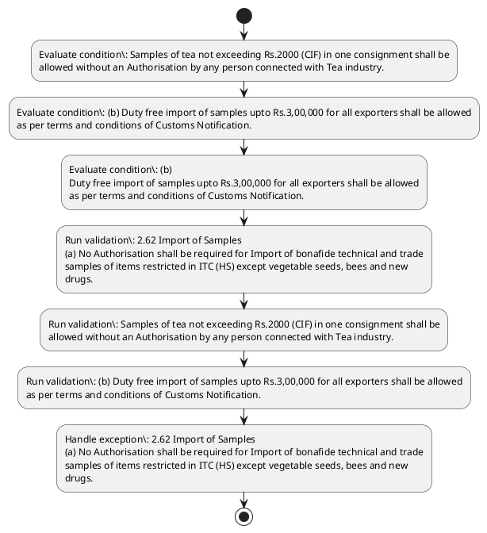

# Chapter 2 / Section 2.62: Import of Samples

**Chapter Title:** General Provisions Regarding Imports and Exports

**Pages:** 28

**Purpose:** 2.62 Import of Samples
(a) No Authorisation shall be required for Import of bonafide technical and trade
samples of items restricted in ITC (HS) except vegetable seeds, bees and new
drugs.

**Purpose Thanglish:** Indha Import of Samples section-la, 2.62 import of Samples
(a) No Authorisation kandippa be required for import of bonafide technical and trade
samples of items restricted in ITC (HS) except vegetable seeds, bees and new
drugs.

**Summary:** 2.62 Import of Samples
(a) No Authorisation shall be required for Import of bonafide technical and trade
samples of items restricted in ITC (HS) except vegetable seeds, bees and new
drugs. Samples of tea not exceeding Rs.2000 (CIF) in one consignment shall be
allowed without an Authorisation by any person connected with Tea industry. (b) Duty free import of samples upto Rs.3,00,000 for all exporters shall be allowed
as per terms and conditions of Customs Notification.

**Business Meaning:** Import of Samples governs how DGFT business controls should be applied, validated, and enforced.

**Business Explanation:** Import of Samples explains the operating rule set that DEKAI should enforce. Key control points include 2.62 Import of Samples
(a) No Authorisation shall be required for Import of bonafide technical and trade
samples of items restricted in ITC (HS) except vegetable seeds, bees and new
drugs.

**Business Explanation Thanglish:** Indha Import of Samples section-la, import of Samples explains the operating rule set that DEKAI should enforce. Key control points include 2.62 import of Samples
(a) No Authorisation kandippa be required for import of bonafide technical and trade
samples of items restricted in ITC (HS) except vegetable seeds, bees and new
drugs.

## Business Logic
- 2.62 Import of Samples
(a) No Authorisation shall be required for Import of bonafide technical and trade
samples of items restricted in ITC (HS) except vegetable seeds, bees and new
drugs.
- Samples of tea not exceeding Rs.2000 (CIF) in one consignment shall be
allowed without an Authorisation by any person connected with Tea industry.
- (b) Duty free import of samples upto Rs.3,00,000 for all exporters shall be allowed
as per terms and conditions of Customs Notification.
- 2.62 Import of Samples
(a)
No Authorisation shall be required for Import of bonafide technical and trade
samples of items restricted in ITC (HS) except vegetable seeds, bees and new
drugs.
- (b)
Duty free import of samples upto Rs.3,00,000 for all exporters shall be allowed
as per terms and conditions of Customs Notification.

## Business Rules
- rule_id=CH2-SEC2_62-R001, rule_description=2.62 Import of Samples
(a) No Authorisation shall be required for Import of bonafide technical and trade
samples of items restricted in ITC (HS) except vegetable seeds, bees and new
drugs., trigger=Import of Samples, condition=Samples of tea not exceeding Rs.2000 (CIF) in one consignment shall be
allowed without an Authorisation by any person connected with Tea industry., validation=2.62 Import of Samples
(a) No Authorisation shall be required for Import of bonafide technical and trade
samples of items restricted in ITC (HS) except vegetable seeds, bees and new
drugs., action=Manual review required., exception=2.62 Import of Samples
(a) No Authorisation shall be required for Import of bonafide technical and trade
samples of items restricted in ITC (HS) except vegetable seeds, bees and new
drugs., output=DEKAI should produce a compliance decision for 2.62 - Import of Samples.
- rule_id=CH2-SEC2_62-R002, rule_description=Samples of tea not exceeding Rs.2000 (CIF) in one consignment shall be
allowed without an Authorisation by any person connected with Tea industry., trigger=Import of Samples, condition=(b) Duty free import of samples upto Rs.3,00,000 for all exporters shall be allowed
as per terms and conditions of Customs Notification., validation=Samples of tea not exceeding Rs.2000 (CIF) in one consignment shall be
allowed without an Authorisation by any person connected with Tea industry., action=Manual review required., exception=2.62 Import of Samples
(a)
No Authorisation shall be required for Import of bonafide technical and trade
samples of items restricted in ITC (HS) except vegetable seeds, bees and new
drugs., output=DEKAI should produce a compliance decision for 2.62 - Import of Samples.
- rule_id=CH2-SEC2_62-R003, rule_description=(b) Duty free import of samples upto Rs.3,00,000 for all exporters shall be allowed
as per terms and conditions of Customs Notification., trigger=Import of Samples, condition=(b)
Duty free import of samples upto Rs.3,00,000 for all exporters shall be allowed
as per terms and conditions of Customs Notification., validation=(b) Duty free import of samples upto Rs.3,00,000 for all exporters shall be allowed
as per terms and conditions of Customs Notification., action=Manual review required., exception=2.62 Import of Samples
(a)
No Authorisation shall be required for Import of bonafide technical and trade
samples of items restricted in ITC (HS) except vegetable seeds, bees and new
drugs., output=DEKAI should produce a compliance decision for 2.62 - Import of Samples.
- rule_id=CH2-SEC2_62-R004, rule_description=2.62 Import of Samples
(a)
No Authorisation shall be required for Import of bonafide technical and trade
samples of items restricted in ITC (HS) except vegetable seeds, bees and new
drugs., trigger=Import of Samples, condition=(b)
Duty free import of samples upto Rs.3,00,000 for all exporters shall be allowed
as per terms and conditions of Customs Notification., validation=2.62 Import of Samples
(a)
No Authorisation shall be required for Import of bonafide technical and trade
samples of items restricted in ITC (HS) except vegetable seeds, bees and new
drugs., action=Manual review required., exception=2.62 Import of Samples
(a)
No Authorisation shall be required for Import of bonafide technical and trade
samples of items restricted in ITC (HS) except vegetable seeds, bees and new
drugs., output=DEKAI should produce a compliance decision for 2.62 - Import of Samples.
- rule_id=CH2-SEC2_62-R005, rule_description=(b)
Duty free import of samples upto Rs.3,00,000 for all exporters shall be allowed
as per terms and conditions of Customs Notification., trigger=Import of Samples, condition=(b)
Duty free import of samples upto Rs.3,00,000 for all exporters shall be allowed
as per terms and conditions of Customs Notification., validation=(b)
Duty free import of samples upto Rs.3,00,000 for all exporters shall be allowed
as per terms and conditions of Customs Notification., action=Manual review required., exception=2.62 Import of Samples
(a)
No Authorisation shall be required for Import of bonafide technical and trade
samples of items restricted in ITC (HS) except vegetable seeds, bees and new
drugs., output=DEKAI should produce a compliance decision for 2.62 - Import of Samples.

## Conditions
- Samples of tea not exceeding Rs.2000 (CIF) in one consignment shall be
allowed without an Authorisation by any person connected with Tea industry.
- (b) Duty free import of samples upto Rs.3,00,000 for all exporters shall be allowed
as per terms and conditions of Customs Notification.
- (b)
Duty free import of samples upto Rs.3,00,000 for all exporters shall be allowed
as per terms and conditions of Customs Notification.

## Condition Logic
- id=2.2.62.1, if=Samples of tea not exceeding Rs.2000 (CIF) in one consignment shall be
allowed without an Authorisation by any person connected with Tea industry., then=Route for review, source=Samples of tea not exceeding Rs.2000 (CIF) in one consignment shall be
allowed without an Authorisation by any person connected with Tea industry.
- id=2.2.62.2, if=(b) Duty free import of samples upto Rs.3,00,000 for all exporters shall be allowed
as per terms and conditions of Customs Notification., then=Route for review, source=(b) Duty free import of samples upto Rs.3,00,000 for all exporters shall be allowed
as per terms and conditions of Customs Notification.
- id=2.2.62.3, if=(b)
Duty free import of samples upto Rs.3,00,000 for all exporters shall be allowed
as per terms and conditions of Customs Notification., then=Route for review, source=(b)
Duty free import of samples upto Rs.3,00,000 for all exporters shall be allowed
as per terms and conditions of Customs Notification.

## Validations
- 2.62 Import of Samples
(a) No Authorisation shall be required for Import of bonafide technical and trade
samples of items restricted in ITC (HS) except vegetable seeds, bees and new
drugs.
- Samples of tea not exceeding Rs.2000 (CIF) in one consignment shall be
allowed without an Authorisation by any person connected with Tea industry.
- (b) Duty free import of samples upto Rs.3,00,000 for all exporters shall be allowed
as per terms and conditions of Customs Notification.
- 2.62 Import of Samples
(a)
No Authorisation shall be required for Import of bonafide technical and trade
samples of items restricted in ITC (HS) except vegetable seeds, bees and new
drugs.
- (b)
Duty free import of samples upto Rs.3,00,000 for all exporters shall be allowed
as per terms and conditions of Customs Notification.

## Exceptions
- 2.62 Import of Samples
(a) No Authorisation shall be required for Import of bonafide technical and trade
samples of items restricted in ITC (HS) except vegetable seeds, bees and new
drugs.
- 2.62 Import of Samples
(a)
No Authorisation shall be required for Import of bonafide technical and trade
samples of items restricted in ITC (HS) except vegetable seeds, bees and new
drugs.

## Dependencies
- None identified

## Authorities
- Customs

## Required Documents
- None identified

## Timelines
- None identified

## Actions
- None identified

## Workflow
- Evaluate condition: Samples of tea not exceeding Rs.2000 (CIF) in one consignment shall be
allowed without an Authorisation by any person connected with Tea industry.
- Evaluate condition: (b) Duty free import of samples upto Rs.3,00,000 for all exporters shall be allowed
as per terms and conditions of Customs Notification.
- Evaluate condition: (b)
Duty free import of samples upto Rs.3,00,000 for all exporters shall be allowed
as per terms and conditions of Customs Notification.
- Run validation: 2.62 Import of Samples
(a) No Authorisation shall be required for Import of bonafide technical and trade
samples of items restricted in ITC (HS) except vegetable seeds, bees and new
drugs.
- Run validation: Samples of tea not exceeding Rs.2000 (CIF) in one consignment shall be
allowed without an Authorisation by any person connected with Tea industry.
- Run validation: (b) Duty free import of samples upto Rs.3,00,000 for all exporters shall be allowed
as per terms and conditions of Customs Notification.
- Handle exception: 2.62 Import of Samples
(a) No Authorisation shall be required for Import of bonafide technical and trade
samples of items restricted in ITC (HS) except vegetable seeds, bees and new
drugs.

## Workflow ASCII
```text
Import of Samples
Evaluate condition: Samples of tea not exceeding Rs.2000 (CIF) in one consignment shall be
allowed without an Authorisation by any person connected with Tea industry.
   |
   v
Evaluate condition: (b) Duty free import of samples upto Rs.3,00,000 for all exporters shall be allowed
as per terms and conditions of Customs Notification.
   |
   v
Evaluate condition: (b)
Duty free import of samples upto Rs.3,00,000 for all exporters shall be allowed
as per terms and conditions of Customs Notification.
   |
   v
Run validation: 2.62 Import of Samples
(a) No Authorisation shall be required for Import of bonafide technical and trade
samples of items restricted in ITC (HS) except vegetable seeds, bees and new
drugs.
   |
   v
Run validation: Samples of tea not exceeding Rs.2000 (CIF) in one consignment shall be
allowed without an Authorisation by any person connected with Tea industry.
   |
   v
Run validation: (b) Duty free import of samples upto Rs.3,00,000 for all exporters shall be allowed
as per terms and conditions of Customs Notification.
   |
   v
Handle exception: 2.62 Import of Samples
(a) No Authorisation shall be required for Import of bonafide technical and trade
samples of items restricted in ITC (HS) except vegetable seeds, bees and new
drugs.
```

## Decision Tree
- IF exception applies (2.62 Import of Samples
(a) No Authorisation shall be required for Import of bonafide technical and trade
samples of items restricted in ITC (HS) except vegetable seeds, bees and new
drugs.) THEN route to manual review
- IF exception applies (2.62 Import of Samples
(a)
No Authorisation shall be required for Import of bonafide technical and trade
samples of items restricted in ITC (HS) except vegetable seeds, bees and new
drugs.) THEN route to manual review

## Decision Tree ASCII
```text
Import of Samples Decision
IF exception applies (2.62 Import of Samples
(a) No Authorisation shall be required for Import of bonafide technical and trade
samples of items restricted in ITC (HS) except vegetable seeds, bees and new
drugs.) THEN route to manual review
   |
   v
IF exception applies (2.62 Import of Samples
(a)
No Authorisation shall be required for Import of bonafide technical and trade
samples of items restricted in ITC (HS) except vegetable seeds, bees and new
drugs.) THEN route to manual review
```

## Examples
- User asks to process Import of Samples; the platform checks conditions, validations, and documents before action.

**Real-world Example:** Example: an importer or exporter invokes Import of Samples, submits the prescribed DGFT records, and DEKAI uses the extracted rules to follow the import of samples process.

**Real-world Example Thanglish:** Indha Import of Samples section-la, Example: an importer or exporter invokes import of Samples, submits the prescribed DGFT records, and DEKAI uses the extracted rules to follow the import of samples process.

## AI Rules
- IF detected context matches section rule THEN enforce: 2.62 Import of Samples
(a) No Authorisation shall be required for Import of bonafide technical and trade
samples of items restricted in ITC (HS) except vegetable seeds, bees and new
drugs.
- IF detected context matches section rule THEN enforce: Samples of tea not exceeding Rs.2000 (CIF) in one consignment shall be
allowed without an Authorisation by any person connected with Tea industry.
- IF detected context matches section rule THEN enforce: (b) Duty free import of samples upto Rs.3,00,000 for all exporters shall be allowed
as per terms and conditions of Customs Notification.
- IF detected context matches section rule THEN enforce: 2.62 Import of Samples
(a)
No Authorisation shall be required for Import of bonafide technical and trade
samples of items restricted in ITC (HS) except vegetable seeds, bees and new
drugs.
- IF detected context matches section rule THEN enforce: (b)
Duty free import of samples upto Rs.3,00,000 for all exporters shall be allowed
as per terms and conditions of Customs Notification.

## Database Fields
- name=section_code, type=string, required=True, source=parsed_section_heading
- name=section_title, type=string, required=True, source=parsed_section_heading
- name=for_flag, type=boolean, required=False, source=keyword:for
- name=and_flag, type=boolean, required=False, source=keyword:and
- name=itc_flag, type=boolean, required=False, source=keyword:ITC
- name=new_flag, type=boolean, required=False, source=keyword:new
- name=tea_flag, type=boolean, required=False, source=keyword:tea
- name=not_flag, type=boolean, required=False, source=keyword:not
- name=cif_flag, type=boolean, required=False, source=keyword:CIF
- name=one_flag, type=boolean, required=False, source=keyword:one

## API Requirements
- method=GET, path=/api/dgft/sections/2.62, purpose=Retrieve knowledge payload for section 2.62, query_params=['include=workflow,decision_tree,validations'], response_fields=['section', 'title', 'summary', 'conditions', 'validations', 'exceptions', 'workflow', 'decision_tree']
- method=POST, path=/api/dgft/Import-of-Samples/validate, purpose=Validate inputs and documents for Import of Samples, request_fields=['section_code', 'section_title'], response_fields=['status', 'errors', 'warnings', 'next_actions']

## UI Screens
- screen_id=Import_of_Samples_overview, name=Import of Samples Overview, purpose=Show section summary, authority, timeline, and eligibility cues., widgets=['summary_card', 'conditions_table', 'authority_badges', 'timeline_panel']
- screen_id=Import_of_Samples_submission, name=Import of Samples Submission, purpose=Capture applicant data and supporting documents., widgets=['dynamic_form', 'document_uploader', 'validation_panel', 'next_action_footer'], fields=['section_code', 'section_title', 'for_flag', 'and_flag', 'itc_flag', 'new_flag', 'tea_flag', 'not_flag']
- screen_id=Import_of_Samples_exceptions, name=Import of Samples Exception Review, purpose=Explain exception handling and manual review triggers., widgets=['exception_banner', 'decision_tree', 'case_notes']

## Error Messages
- Validation failed because the section requirements were not fully met.

## FAQ
- question_en=What is the purpose of section 2.62?, answer_en=Import of Samples explains the operating rule set that DEKAI should enforce. Key control points include 2.62 Import of Samples
(a) No Authorisation shall be required for Import of bonafide technical and trade
samples of items restricted in ITC (HS) except vegetable seeds, bees and new
drugs., question_thanglish=Indha Import of Samples section-la, What is the purpose of section 2.62?, answer_thanglish=Indha Import of Samples section-la, import of Samples explains the operating rule set that DEKAI should enforce. Key control points include 2.62 import of Samples
(a) No Authorisation kandippa be required for import of bonafide technical and trade
samples of items restricted in ITC (HS) except vegetable seeds, bees and new
drugs.
- question_en=What documents are required under Import of Samples?, answer_en=Not explicitly covered in uploaded documents., question_thanglish=Indha Import of Samples section-la, What documents are required under import of Samples?, answer_thanglish=Indha Import of Samples section-la, Not explicitly covered in uploaded documents.
- question_en=Which authority handles Import of Samples?, answer_en=Customs, question_thanglish=Indha Import of Samples section-la, Which authority handles import of Samples?, answer_thanglish=Indha Import of Samples section-la, Customs

## Questions Users May Ask
- What does Import of Samples require?
- Which documents are needed for Import of Samples?
- How does DEKAI validate Import of Samples requests?

## Expected AI Answers
- Import of Samples requires the platform to interpret the section text, apply the extracted business rules, and present the correct next action.
- Required documents are inferred from the section text: no explicit documents were detected.
- DEKAI validates Import of Samples by checking conditions, required documents, authority references, and exception clauses before recommending an outcome.

## AI Q&A Examples
- question_en=User asks: How do I comply with Import of Samples?, answer_en=AI answers: DEKAI should evaluate section 2.62, apply the extracted rules, and guide the user through Evaluate condition: Samples of tea not exceeding Rs.2000 (CIF) in one consignment shall be
allowed without an Authorisation by any person connected with Tea industry.., question_thanglish=Indha Import of Samples section-la, User asks: How do I comply with import of Samples?, answer_thanglish=Indha Import of Samples section-la, AI answers: DEKAI should evaluate section 2.62, apply the extracted rules, and guide the user through Evaluate condition: Samples of tea not exceeding Rs.2000 (CIF) in one consignment kandippa be
allowed without an Authorisation by any person connected with Tea industry..
- question_en=User asks: Which validations apply to Import of Samples?, answer_en=AI answers: Applicable validations are 2.62 Import of Samples
(a) No Authorisation shall be required for Import of bonafide technical and trade
samples of items restricted in ITC (HS) except vegetable seeds, bees and new
drugs., Samples of tea not exceeding Rs.2000 (CIF) in one consignment shall be
allowed without an Authorisation by any person connected with Tea industry., (b) Duty free import of samples upto Rs.3,00,000 for all exporters shall be allowed
as per terms and conditions of Customs Notification., question_thanglish=Indha Import of Samples section-la, User asks: Which validations apply to import of Samples?, answer_thanglish=Indha Import of Samples section-la, AI answers: Applicable validations are 2.62 import of Samples
(a) No Authorisation kandippa be required for import of bonafide technical and trade
samples of items restricted in ITC (HS) except vegetable seeds, bees and new
drugs., Samples of tea not exceeding Rs.2000 (CIF) in one consignment kandippa be
allowed without an Authorisation by any person connected with Tea industry., (b) Duty free import of samples upto Rs.3,00,000 for all exporters kandippa be allowed
as per terms and conditions of Customs Notification.

## DEKAI AI Implementation Notes
- Capture chapter 2, section 2.62, title, and page references as immutable knowledge metadata.
- Bind validations for Import of Samples into a rule engine keyed by the rule IDs extracted for this section.
- Route escalations or approvals to: Customs.
- Trigger manual review when exception clauses are detected.

## DEKAI AI Implementation Notes Thanglish
- Indha Import of Samples section-la, Capture chapter 2, section 2.62, title, and page references as immutable knowledge metadata.
- Indha Import of Samples section-la, Bind validations for import of Samples into a rule engine keyed by the rule IDs extracted for this section.
- Indha Import of Samples section-la, Route escalations or approvals to: Customs.
- Indha Import of Samples section-la, Trigger manual review when exception clauses are detected.

## AI Metadata
- Keywords: for, and, ITC, new, tea, not, CIF, one, any, all, per, bees, with, Duty, free, upto, shall, trade, items, seeds
- Search Keywords: for, and, ITC, new, tea, not, CIF, one, any, all, per, bees, with, Duty, free, upto, shall, trade, items, seeds
- Intent: Provide knowledge guidance for Import of Samples.
- Tags: 2.62, Import of Samples, business-rule, dgft
- Related Sections: 
- Related Chapters: 
- Related Rules: 2.62 Import of Samples
(a) No Authorisation shall be required for Import of bonafide technical and trade
samples of items restricted in ITC (HS) except vegetable seeds, bees and new
drugs., Samples of tea not exceeding Rs.2000 (CIF) in one consignment shall be
allowed without an Authorisation by any person connected with Tea industry., (b) Duty free import of samples upto Rs.3,00,000 for all exporters shall be allowed
as per terms and conditions of Customs Notification., 2.62 Import of Samples
(a)
No Authorisation shall be required for Import of bonafide technical and trade
samples of items restricted in ITC (HS) except vegetable seeds, bees and new
drugs., (b)
Duty free import of samples upto Rs.3,00,000 for all exporters shall be allowed
as per terms and conditions of Customs Notification.

## Mermaid

```mermaid
flowchart TD
    S1["Evaluate condition: Samples of tea not exceeding Rs.2000 (CIF) in one consignment shall be
allowed without an Authorisation by any person connected with Tea industry."]
    S2["Evaluate condition: (b) Duty free import of samples upto Rs.3,00,000 for all exporters shall be allowed
as per terms and conditions of Customs Notification."]
    S1 --> S2
    S3["Evaluate condition: (b)
Duty free import of samples upto Rs.3,00,000 for all exporters shall be allowed
as per terms and conditions of Customs Notification."]
    S2 --> S3
    S4["Run validation: 2.62 Import of Samples
(a) No Authorisation shall be required for Import of bonafide technical and trade
samples of items restricted in ITC (HS) except vegetable seeds, bees and new
drugs."]
    S3 --> S4
    S5["Run validation: Samples of tea not exceeding Rs.2000 (CIF) in one consignment shall be
allowed without an Authorisation by any person connected with Tea industry."]
    S4 --> S5
    S6["Run validation: (b) Duty free import of samples upto Rs.3,00,000 for all exporters shall be allowed
as per terms and conditions of Customs Notification."]
    S5 --> S6
    S7["Handle exception: 2.62 Import of Samples
(a) No Authorisation shall be required for Import of bonafide technical and trade
samples of items restricted in ITC (HS) except vegetable seeds, bees and new
drugs."]
    S6 --> S7
```


## PlantUML

