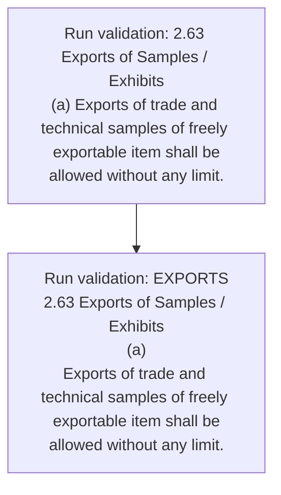
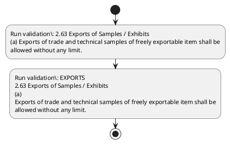

# Chapter 2 / Section 2.63: Exports of Samples / Exhibits

**Chapter Title:** General Provisions Regarding Imports and Exports

**Pages:** 28

**Purpose:** 2.63 Exports of Samples / Exhibits
(a) Exports of trade and technical samples of freely exportable item shall be
allowed without any limit.

**Purpose Thanglish:** Indha Exports of Samples / Exhibits section-la, 2.63 Exports of Samples / Exhibits
(a) Exports of trade and technical samples of freely exportable item kandippa be
allowed without any limit.

**Summary:** 2.63 Exports of Samples / Exhibits
(a) Exports of trade and technical samples of freely exportable item shall be
allowed without any limit. (b) An application for export of samples/exhibits, which are restricted for
export, may be made to DGFT as per ANF-2Q. EXPORTS
2.63 Exports of Samples / Exhibits
(a)
Exports of trade and technical samples of freely exportable item shall be
allowed without any limit.

**Business Meaning:** Exports of Samples / Exhibits governs how DGFT business controls should be applied, validated, and enforced.

**Business Explanation:** Exports of Samples / Exhibits explains the operating rule set that DEKAI should enforce. Key control points include 2.63 Exports of Samples / Exhibits
(a) Exports of trade and technical samples of freely exportable item shall be
allowed without any limit.

**Business Explanation Thanglish:** Indha Exports of Samples / Exhibits section-la, Exports of Samples / Exhibits explains the operating rule set that DEKAI should enforce. Key control points include 2.63 Exports of Samples / Exhibits
(a) Exports of trade and technical samples of freely exportable item kandippa be
allowed without any limit.

## Business Logic
- 2.63 Exports of Samples / Exhibits
(a) Exports of trade and technical samples of freely exportable item shall be
allowed without any limit.
- EXPORTS
2.63 Exports of Samples / Exhibits
(a)
Exports of trade and technical samples of freely exportable item shall be
allowed without any limit.

## Business Rules
- rule_id=CH2-SEC2_63-R001, rule_description=2.63 Exports of Samples / Exhibits
(a) Exports of trade and technical samples of freely exportable item shall be
allowed without any limit., trigger=Exports of Samples / Exhibits, condition=Not explicitly covered in uploaded documents., validation=2.63 Exports of Samples / Exhibits
(a) Exports of trade and technical samples of freely exportable item shall be
allowed without any limit., action=Manual review required., exception=No explicit exception found in uploaded documents., output=DEKAI should produce a compliance decision for 2.63 - Exports of Samples / Exhibits.
- rule_id=CH2-SEC2_63-R002, rule_description=EXPORTS
2.63 Exports of Samples / Exhibits
(a)
Exports of trade and technical samples of freely exportable item shall be
allowed without any limit., trigger=Exports of Samples / Exhibits, condition=Not explicitly covered in uploaded documents., validation=EXPORTS
2.63 Exports of Samples / Exhibits
(a)
Exports of trade and technical samples of freely exportable item shall be
allowed without any limit., action=Manual review required., exception=No explicit exception found in uploaded documents., output=DEKAI should produce a compliance decision for 2.63 - Exports of Samples / Exhibits.

## Conditions
- None identified

## Condition Logic
- None identified

## Validations
- 2.63 Exports of Samples / Exhibits
(a) Exports of trade and technical samples of freely exportable item shall be
allowed without any limit.
- EXPORTS
2.63 Exports of Samples / Exhibits
(a)
Exports of trade and technical samples of freely exportable item shall be
allowed without any limit.

## Exceptions
- None identified

## Dependencies
- None identified

## Authorities
- DGFT

## Required Documents
- (b) An application for export of samples/exhibits, which are restricted for
export, may be made to DGFT as per ANF-2Q.
- (b)
An application for export of samples/exhibits, which are restricted for
export, may be made to DGFT as per ANF-2Q.

## Timelines
- None identified

## Actions
- None identified

## Workflow
- Run validation: 2.63 Exports of Samples / Exhibits
(a) Exports of trade and technical samples of freely exportable item shall be
allowed without any limit.
- Run validation: EXPORTS
2.63 Exports of Samples / Exhibits
(a)
Exports of trade and technical samples of freely exportable item shall be
allowed without any limit.

## Workflow ASCII
```text
Exports of Samples / Exhibits
Run validation: 2.63 Exports of Samples / Exhibits
(a) Exports of trade and technical samples of freely exportable item shall be
allowed without any limit.
   |
   v
Run validation: EXPORTS
2.63 Exports of Samples / Exhibits
(a)
Exports of trade and technical samples of freely exportable item shall be
allowed without any limit.
```

## Decision Tree
- IF section 2.63 applies THEN proceed with standard DGFT workflow

## Decision Tree ASCII
```text
Exports of Samples / Exhibits Decision
IF section 2.63 applies THEN proceed with standard DGFT workflow
```

## Examples
- User asks to process Exports of Samples / Exhibits; the platform checks conditions, validations, and documents before action.

**Real-world Example:** Example: an importer or exporter invokes Exports of Samples / Exhibits, submits (b) An application for export of samples/exhibits, which are restricted for
export, may be made to DGFT as per ANF-2Q., (b)
An application for export of samples/exhibits, which are restricted for
export, may be made to DGFT as per ANF-2Q., and DEKAI uses the extracted rules to follow the exports of samples / exhibits process.

**Real-world Example Thanglish:** Indha Exports of Samples / Exhibits section-la, Example: an importer or exporter invokes Exports of Samples / Exhibits, submits (b) An application for export of samples/exhibits, which are restricted for
export, may be made to DGFT as per ANF-2Q., (b)
An application for export of samples/exhibits, which are restricted for
export, may be made to DGFT as per ANF-2Q., and DEKAI uses the extracted rules to follow the exports of samples / exhibits process.

## AI Rules
- IF detected context matches section rule THEN enforce: 2.63 Exports of Samples / Exhibits
(a) Exports of trade and technical samples of freely exportable item shall be
allowed without any limit.
- IF detected context matches section rule THEN enforce: EXPORTS
2.63 Exports of Samples / Exhibits
(a)
Exports of trade and technical samples of freely exportable item shall be
allowed without any limit.

## Database Fields
- name=section_code, type=string, required=True, source=parsed_section_heading
- name=section_title, type=string, required=True, source=parsed_section_heading
- name=and_flag, type=boolean, required=False, source=keyword:and
- name=any_flag, type=boolean, required=False, source=keyword:any
- name=for_flag, type=boolean, required=False, source=keyword:for
- name=are_flag, type=boolean, required=False, source=keyword:are
- name=may_flag, type=boolean, required=False, source=keyword:may
- name=per_flag, type=boolean, required=False, source=keyword:per
- name=item_flag, type=boolean, required=False, source=keyword:item
- name=made_flag, type=boolean, required=False, source=keyword:made
- name=document_1_submitted, type=boolean, required=True, source=(b) An application for export of samples/exhibits, which are restricted for
export, may be made to DGFT as per ANF-2Q.
- name=document_2_submitted, type=boolean, required=True, source=(b)
An application for export of samples/exhibits, which are restricted for
export, may be made to DGFT as per ANF-2Q.

## API Requirements
- method=GET, path=/api/dgft/sections/2.63, purpose=Retrieve knowledge payload for section 2.63, query_params=['include=workflow,decision_tree,validations'], response_fields=['section', 'title', 'summary', 'conditions', 'validations', 'exceptions', 'workflow', 'decision_tree']
- method=POST, path=/api/dgft/Exports-of-Samples-Exhibits/validate, purpose=Validate inputs and documents for Exports of Samples / Exhibits, request_fields=['section_code', 'section_title', 'document_1_submitted', 'document_2_submitted'], response_fields=['status', 'errors', 'warnings', 'next_actions']

## UI Screens
- screen_id=Exports_of_Samples_Exhibits_overview, name=Exports of Samples / Exhibits Overview, purpose=Show section summary, authority, timeline, and eligibility cues., widgets=['summary_card', 'conditions_table', 'authority_badges', 'timeline_panel']
- screen_id=Exports_of_Samples_Exhibits_submission, name=Exports of Samples / Exhibits Submission, purpose=Capture applicant data and supporting documents., widgets=['dynamic_form', 'document_uploader', 'validation_panel', 'next_action_footer'], fields=['section_code', 'section_title', 'and_flag', 'any_flag', 'for_flag', 'are_flag', 'may_flag', 'per_flag']

## Error Messages
- Validation failed because the section requirements were not fully met.

## FAQ
- question_en=What is the purpose of section 2.63?, answer_en=Exports of Samples / Exhibits explains the operating rule set that DEKAI should enforce. Key control points include 2.63 Exports of Samples / Exhibits
(a) Exports of trade and technical samples of freely exportable item shall be
allowed without any limit., question_thanglish=Indha Exports of Samples / Exhibits section-la, What is the purpose of section 2.63?, answer_thanglish=Indha Exports of Samples / Exhibits section-la, Exports of Samples / Exhibits explains the operating rule set that DEKAI should enforce. Key control points include 2.63 Exports of Samples / Exhibits
(a) Exports of trade and technical samples of freely exportable item kandippa be
allowed without any limit.
- question_en=What documents are required under Exports of Samples / Exhibits?, answer_en=(b) An application for export of samples/exhibits, which are restricted for
export, may be made to DGFT as per ANF-2Q., (b)
An application for export of samples/exhibits, which are restricted for
export, may be made to DGFT as per ANF-2Q., question_thanglish=Indha Exports of Samples / Exhibits section-la, What documents are required under Exports of Samples / Exhibits?, answer_thanglish=Indha Exports of Samples / Exhibits section-la, (b) An application for export of samples/exhibits, which are restricted for
export, may be made to DGFT as per ANF-2Q., (b)
An application for export of samples/exhibits, which are restricted for
export, may be made to DGFT as per ANF-2Q.
- question_en=Which authority handles Exports of Samples / Exhibits?, answer_en=DGFT, question_thanglish=Indha Exports of Samples / Exhibits section-la, Which authority handles Exports of Samples / Exhibits?, answer_thanglish=Indha Exports of Samples / Exhibits section-la, DGFT

## Questions Users May Ask
- What does Exports of Samples / Exhibits require?
- Which documents are needed for Exports of Samples / Exhibits?
- How does DEKAI validate Exports of Samples / Exhibits requests?

## Expected AI Answers
- Exports of Samples / Exhibits requires the platform to interpret the section text, apply the extracted business rules, and present the correct next action.
- Required documents are inferred from the section text: (b) An application for export of samples/exhibits, which are restricted for
export, may be made to DGFT as per ANF-2Q., (b)
An application for export of samples/exhibits, which are restricted for
export, may be made to DGFT as per ANF-2Q.
- DEKAI validates Exports of Samples / Exhibits by checking conditions, required documents, authority references, and exception clauses before recommending an outcome.

## AI Q&A Examples
- question_en=User asks: How do I comply with Exports of Samples / Exhibits?, answer_en=AI answers: DEKAI should evaluate section 2.63, apply the extracted rules, and guide the user through Run validation: 2.63 Exports of Samples / Exhibits
(a) Exports of trade and technical samples of freely exportable item shall be
allowed without any limit.., question_thanglish=Indha Exports of Samples / Exhibits section-la, User asks: How do I comply with Exports of Samples / Exhibits?, answer_thanglish=Indha Exports of Samples / Exhibits section-la, AI answers: DEKAI should evaluate section 2.63, apply the extracted rules, and guide the user through Run validation: 2.63 Exports of Samples / Exhibits
(a) Exports of trade and technical samples of freely exportable item kandippa be
allowed without any limit..
- question_en=User asks: Which validations apply to Exports of Samples / Exhibits?, answer_en=AI answers: Applicable validations are 2.63 Exports of Samples / Exhibits
(a) Exports of trade and technical samples of freely exportable item shall be
allowed without any limit., EXPORTS
2.63 Exports of Samples / Exhibits
(a)
Exports of trade and technical samples of freely exportable item shall be
allowed without any limit., question_thanglish=Indha Exports of Samples / Exhibits section-la, User asks: Which validations apply to Exports of Samples / Exhibits?, answer_thanglish=Indha Exports of Samples / Exhibits section-la, AI answers: Applicable validations are 2.63 Exports of Samples / Exhibits
(a) Exports of trade and technical samples of freely exportable item kandippa be
allowed without any limit., EXPORTS
2.63 Exports of Samples / Exhibits
(a)
Exports of trade and technical samples of freely exportable item kandippa be
allowed without any limit.

## DEKAI AI Implementation Notes
- Capture chapter 2, section 2.63, title, and page references as immutable knowledge metadata.
- Bind validations for Exports of Samples / Exhibits into a rule engine keyed by the rule IDs extracted for this section.
- Expose document upload controls for: (b) An application for export of samples/exhibits, which are restricted for
export, may be made to DGFT as per ANF-2Q., (b)
An application for export of samples/exhibits, which are restricted for
export, may be made to DGFT as per ANF-2Q..
- Route escalations or approvals to: DGFT.

## DEKAI AI Implementation Notes Thanglish
- Indha Exports of Samples / Exhibits section-la, Capture chapter 2, section 2.63, title, and page references as immutable knowledge metadata.
- Indha Exports of Samples / Exhibits section-la, Bind validations for Exports of Samples / Exhibits into a rule engine keyed by the rule IDs extracted for this section.
- Indha Exports of Samples / Exhibits section-la, Expose document upload controls for: (b) An application for export of samples/exhibits, which are restricted for
export, may be made to DGFT as per ANF-2Q., (b)
An application for export of samples/exhibits, which are restricted for
export, may be made to DGFT as per ANF-2Q..
- Indha Exports of Samples / Exhibits section-la, Route escalations or approvals to: DGFT.

## AI Metadata
- Keywords: and, any, for, are, may, per, item, made, DGFT, ANF-, trade, shall, limit, which, freely, export, Exports, Samples, allowed, without
- Search Keywords: and, any, for, are, may, per, item, made, DGFT, ANF-, trade, shall, limit, which, freely, export, Exports, Samples, allowed, without
- Intent: Provide knowledge guidance for Exports of Samples / Exhibits.
- Tags: 2.63, Exports of Samples / Exhibits, business-rule, document-driven, dgft
- Related Sections: 
- Related Chapters: 
- Related Rules: 2.63 Exports of Samples / Exhibits
(a) Exports of trade and technical samples of freely exportable item shall be
allowed without any limit., EXPORTS
2.63 Exports of Samples / Exhibits
(a)
Exports of trade and technical samples of freely exportable item shall be
allowed without any limit.

## Mermaid


## PlantUML

