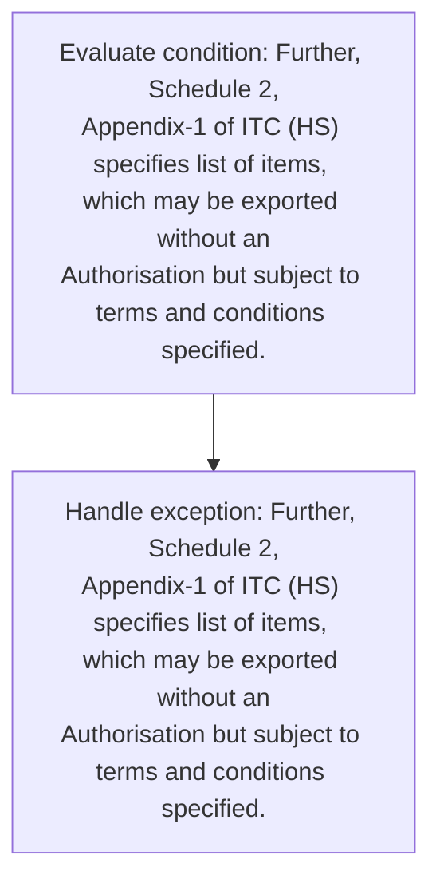
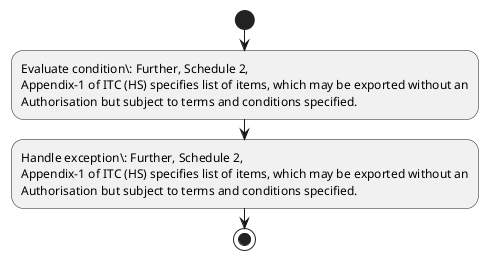

# Chapter 2 / Section 2.64: Export Policy

**Chapter Title:** General Provisions Regarding Imports and Exports

**Pages:** 28

**Purpose:** 2.64 Export Policy
Policy relating to Exports is given in Chapter-2 of FTP.

**Purpose Thanglish:** Indha Export Policy section-la, 2.64 export Policy
Policy relating to Exports is given in Chapter-2 of FTP.

**Summary:** 2.64 Export Policy
Policy relating to Exports is given in Chapter-2 of FTP. Further, Schedule 2,
Appendix-1 of ITC (HS) specifies list of items, which may be exported without an
Authorisation but subject to terms and conditions specified.

**Business Meaning:** Export Policy governs how DGFT business controls should be applied, validated, and enforced.

**Business Explanation:** Export Policy explains the operating rule set that DEKAI should enforce. Key control points include Further, Schedule 2,
Appendix-1 of ITC (HS) specifies list of items, which may be exported without an
Authorisation but subject to terms and conditions specified.

**Business Explanation Thanglish:** Indha Export Policy section-la, export Policy explains the operating rule set that DEKAI should enforce. Key control points include Further, Schedule 2,
Appendix-1 of ITC (HS) specifies list of items, which may be exported without an
Authorisation but subject to terms and conditions specified.

## Business Logic
- Further, Schedule 2,
Appendix-1 of ITC (HS) specifies list of items, which may be exported without an
Authorisation but subject to terms and conditions specified.

## Business Rules
- rule_id=CH2-SEC2_64-R001, rule_description=Further, Schedule 2,
Appendix-1 of ITC (HS) specifies list of items, which may be exported without an
Authorisation but subject to terms and conditions specified., trigger=Export Policy, condition=Further, Schedule 2,
Appendix-1 of ITC (HS) specifies list of items, which may be exported without an
Authorisation but subject to terms and conditions specified., validation=Not explicitly covered in uploaded documents., action=Manual review required., exception=Further, Schedule 2,
Appendix-1 of ITC (HS) specifies list of items, which may be exported without an
Authorisation but subject to terms and conditions specified., output=DEKAI should produce a compliance decision for 2.64 - Export Policy.

## Conditions
- Further, Schedule 2,
Appendix-1 of ITC (HS) specifies list of items, which may be exported without an
Authorisation but subject to terms and conditions specified.

## Condition Logic
- id=2.2.64.1, if=Further, Schedule 2,
Appendix-1 of ITC (HS) specifies list of items, which may be exported without an
Authorisation but subject to terms and conditions specified., then=Route for review, source=Further, Schedule 2,
Appendix-1 of ITC (HS) specifies list of items, which may be exported without an
Authorisation but subject to terms and conditions specified.

## Validations
- None identified

## Exceptions
- Further, Schedule 2,
Appendix-1 of ITC (HS) specifies list of items, which may be exported without an
Authorisation but subject to terms and conditions specified.

## Dependencies
- 1

## Authorities
- None identified

## Required Documents
- None identified

## Timelines
- None identified

## Actions
- None identified

## Workflow
- Evaluate condition: Further, Schedule 2,
Appendix-1 of ITC (HS) specifies list of items, which may be exported without an
Authorisation but subject to terms and conditions specified.
- Handle exception: Further, Schedule 2,
Appendix-1 of ITC (HS) specifies list of items, which may be exported without an
Authorisation but subject to terms and conditions specified.

## Workflow ASCII
```text
Export Policy
Evaluate condition: Further, Schedule 2,
Appendix-1 of ITC (HS) specifies list of items, which may be exported without an
Authorisation but subject to terms and conditions specified.
   |
   v
Handle exception: Further, Schedule 2,
Appendix-1 of ITC (HS) specifies list of items, which may be exported without an
Authorisation but subject to terms and conditions specified.
```

## Decision Tree
- IF exception applies (Further, Schedule 2,
Appendix-1 of ITC (HS) specifies list of items, which may be exported without an
Authorisation but subject to terms and conditions specified.) THEN route to manual review

## Decision Tree ASCII
```text
Export Policy Decision
IF exception applies (Further, Schedule 2,
Appendix-1 of ITC (HS) specifies list of items, which may be exported without an
Authorisation but subject to terms and conditions specified.) THEN route to manual review
```

## Examples
- User asks to process Export Policy; the platform checks conditions, validations, and documents before action.

**Real-world Example:** Example: an importer or exporter invokes Export Policy, submits the prescribed DGFT records, and DEKAI uses the extracted rules to follow the export policy process.

**Real-world Example Thanglish:** Indha Export Policy section-la, Example: an importer or exporter invokes export Policy, submits the prescribed DGFT records, and DEKAI uses the extracted rules to follow the export policy process.

## AI Rules
- IF detected context matches section rule THEN enforce: Further, Schedule 2,
Appendix-1 of ITC (HS) specifies list of items, which may be exported without an
Authorisation but subject to terms and conditions specified.

## Database Fields
- name=section_code, type=string, required=True, source=parsed_section_heading
- name=section_title, type=string, required=True, source=parsed_section_heading
- name=ftp_flag, type=boolean, required=False, source=keyword:FTP
- name=itc_flag, type=boolean, required=False, source=keyword:ITC
- name=may_flag, type=boolean, required=False, source=keyword:may
- name=but_flag, type=boolean, required=False, source=keyword:but
- name=and_flag, type=boolean, required=False, source=keyword:and
- name=list_flag, type=boolean, required=False, source=keyword:list
- name=given_flag, type=boolean, required=False, source=keyword:given
- name=items_flag, type=boolean, required=False, source=keyword:items

## API Requirements
- method=GET, path=/api/dgft/sections/2.64, purpose=Retrieve knowledge payload for section 2.64, query_params=['include=workflow,decision_tree,validations'], response_fields=['section', 'title', 'summary', 'conditions', 'validations', 'exceptions', 'workflow', 'decision_tree']
- method=POST, path=/api/dgft/Export-Policy/validate, purpose=Validate inputs and documents for Export Policy, request_fields=['section_code', 'section_title'], response_fields=['status', 'errors', 'warnings', 'next_actions']

## UI Screens
- screen_id=Export_Policy_overview, name=Export Policy Overview, purpose=Show section summary, authority, timeline, and eligibility cues., widgets=['summary_card', 'conditions_table', 'authority_badges', 'timeline_panel']
- screen_id=Export_Policy_submission, name=Export Policy Submission, purpose=Capture applicant data and supporting documents., widgets=['dynamic_form', 'document_uploader', 'validation_panel', 'next_action_footer'], fields=['section_code', 'section_title', 'ftp_flag', 'itc_flag', 'may_flag', 'but_flag', 'and_flag', 'list_flag']
- screen_id=Export_Policy_exceptions, name=Export Policy Exception Review, purpose=Explain exception handling and manual review triggers., widgets=['exception_banner', 'decision_tree', 'case_notes']

## Error Messages
- Validation failed because the section requirements were not fully met.

## FAQ
- question_en=What is the purpose of section 2.64?, answer_en=Export Policy explains the operating rule set that DEKAI should enforce. Key control points include Further, Schedule 2,
Appendix-1 of ITC (HS) specifies list of items, which may be exported without an
Authorisation but subject to terms and conditions specified., question_thanglish=Indha Export Policy section-la, What is the purpose of section 2.64?, answer_thanglish=Indha Export Policy section-la, export Policy explains the operating rule set that DEKAI should enforce. Key control points include Further, Schedule 2,
Appendix-1 of ITC (HS) specifies list of items, which may be exported without an
Authorisation but subject to terms and conditions specified.
- question_en=What documents are required under Export Policy?, answer_en=Not explicitly covered in uploaded documents., question_thanglish=Indha Export Policy section-la, What documents are required under export Policy?, answer_thanglish=Indha Export Policy section-la, Not explicitly covered in uploaded documents.
- question_en=Which authority handles Export Policy?, answer_en=Not explicitly covered in uploaded documents., question_thanglish=Indha Export Policy section-la, Which authority handles export Policy?, answer_thanglish=Indha Export Policy section-la, Not explicitly covered in uploaded documents.

## Questions Users May Ask
- What does Export Policy require?
- Which documents are needed for Export Policy?
- How does DEKAI validate Export Policy requests?

## Expected AI Answers
- Export Policy requires the platform to interpret the section text, apply the extracted business rules, and present the correct next action.
- Required documents are inferred from the section text: no explicit documents were detected.
- DEKAI validates Export Policy by checking conditions, required documents, authority references, and exception clauses before recommending an outcome.

## AI Q&A Examples
- question_en=User asks: How do I comply with Export Policy?, answer_en=AI answers: DEKAI should evaluate section 2.64, apply the extracted rules, and guide the user through Evaluate condition: Further, Schedule 2,
Appendix-1 of ITC (HS) specifies list of items, which may be exported without an
Authorisation but subject to terms and conditions specified.., question_thanglish=Indha Export Policy section-la, User asks: How do I comply with export Policy?, answer_thanglish=Indha Export Policy section-la, AI answers: DEKAI should evaluate section 2.64, apply the extracted rules, and guide the user through Evaluate condition: Further, Schedule 2,
Appendix-1 of ITC (HS) specifies list of items, which may be exported without an
Authorisation but subject to terms and conditions specified..
- question_en=User asks: Which validations apply to Export Policy?, answer_en=AI answers: Applicable validations are not explicitly covered in the uploaded documents., question_thanglish=Indha Export Policy section-la, User asks: Which validations apply to export Policy?, answer_thanglish=Indha Export Policy section-la, AI answers: Applicable validations are not explicitly covered in the uploaded documents.

## DEKAI AI Implementation Notes
- Capture chapter 2, section 2.64, title, and page references as immutable knowledge metadata.
- Bind validations for Export Policy into a rule engine keyed by the rule IDs extracted for this section.
- Trigger manual review when exception clauses are detected.
- Show contextual links to related sections: 1.

## DEKAI AI Implementation Notes Thanglish
- Indha Export Policy section-la, Capture chapter 2, section 2.64, title, and page references as immutable knowledge metadata.
- Indha Export Policy section-la, Bind validations for export Policy into a rule engine keyed by the rule IDs extracted for this section.
- Indha Export Policy section-la, Trigger manual review when exception clauses are detected.
- Indha Export Policy section-la, Show contextual links to related sections: 1.

## AI Metadata
- Keywords: FTP, ITC, may, but, and, list, given, items, which, terms, Export, Policy, Exports, Further, without, subject, relating, Chapter-, Schedule, exported
- Search Keywords: FTP, ITC, may, but, and, list, given, items, which, terms, Export, Policy, Exports, Further, without, subject, relating, Chapter-, Schedule, exported
- Intent: Provide knowledge guidance for Export Policy.
- Tags: 2.64, Export Policy, business-rule, dgft
- Related Sections: 1
- Related Chapters: 
- Related Rules: Further, Schedule 2,
Appendix-1 of ITC (HS) specifies list of items, which may be exported without an
Authorisation but subject to terms and conditions specified.

## Mermaid


## PlantUML

