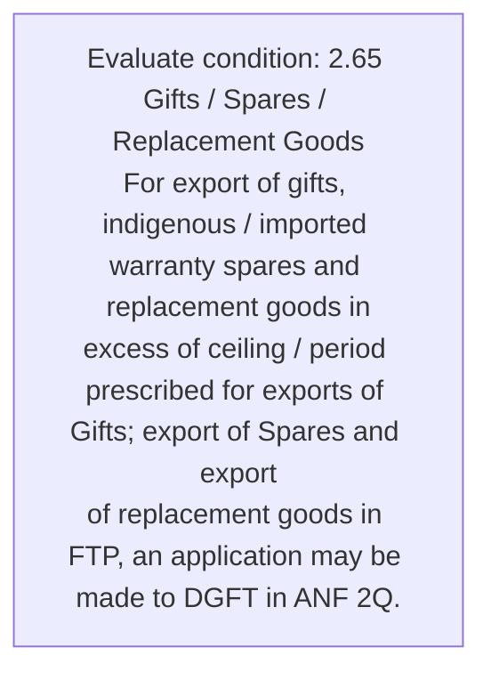
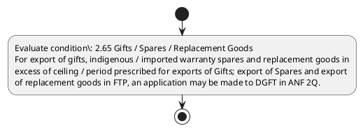

# Chapter 2 / Section 2.65: Gifts / Spares / Replacement Goods

**Chapter Title:** General Provisions Regarding Imports and Exports

**Pages:** 28

**Purpose:** 2.65 Gifts / Spares / Replacement Goods
For export of gifts, indigenous / imported warranty spares and replacement goods in
excess of ceiling / period prescribed for exports of Gifts; export of Spares and export
of replacement goods in FTP, an application may be made to DGFT in ANF 2Q.

**Purpose Thanglish:** Indha Gifts / Spares / Replacement Goods section-la, 2.65 Gifts / Spares / Replacement Goods
For export of gifts, indigenous / imported warranty spares and replacement goods in
excess of ceiling / period prescribed for exports of Gifts; export of Spares and export
of replacement goods in FTP, an application may be made to DGFT in ANF 2Q.

**Summary:** 2.65 Gifts / Spares / Replacement Goods
For export of gifts, indigenous / imported warranty spares and replacement goods in
excess of ceiling / period prescribed for exports of Gifts; export of Spares and export
of replacement goods in FTP, an application may be made to DGFT in ANF 2Q.

**Business Meaning:** 2.65 Gifts / Spares / Replacement Goods
For export of gifts, indigenous / imported warranty spares and replacement goods in
excess of ceiling / period prescribed for exports of Gifts; export of Spares and export
of replacement goods in FTP, an application may be made to DGFT in ANF 2Q.

**Business Explanation:** 2.65 Gifts / Spares / Replacement Goods
For export of gifts, indigenous / imported warranty spares and replacement goods in
excess of ceiling / period prescribed for exports of Gifts; export of Spares and export
of replacement goods in FTP, an application may be made to DGFT in ANF 2Q.

**Business Explanation Thanglish:** Indha Gifts / Spares / Replacement Goods section-la, 2.65 Gifts / Spares / Replacement Goods
For export of gifts, indigenous / imported warranty spares and replacement goods in
excess of ceiling / period prescribed for exports of Gifts; export of Spares and export
of replacement goods in FTP, an application may be made to DGFT in ANF 2Q.

## Business Logic
- None identified

## Business Rules
- rule_id=CH2-SEC2_65-R001, rule_description=2.65 Gifts / Spares / Replacement Goods
For export of gifts, indigenous / imported warranty spares and replacement goods in
excess of ceiling / period prescribed for exports of Gifts; export of Spares and export
of replacement goods in FTP, an application may be made to DGFT in ANF 2Q., trigger=Gifts / Spares / Replacement Goods, condition=2.65 Gifts / Spares / Replacement Goods
For export of gifts, indigenous / imported warranty spares and replacement goods in
excess of ceiling / period prescribed for exports of Gifts; export of Spares and export
of replacement goods in FTP, an application may be made to DGFT in ANF 2Q., validation=Not explicitly covered in uploaded documents., action=Manual review required., exception=No explicit exception found in uploaded documents., output=DEKAI should produce a compliance decision for 2.65 - Gifts / Spares / Replacement Goods.

## Conditions
- 2.65 Gifts / Spares / Replacement Goods
For export of gifts, indigenous / imported warranty spares and replacement goods in
excess of ceiling / period prescribed for exports of Gifts; export of Spares and export
of replacement goods in FTP, an application may be made to DGFT in ANF 2Q.

## Condition Logic
- id=2.2.65.1, if=2.65 Gifts / Spares / Replacement Goods
For export of gifts, indigenous / imported warranty spares and replacement goods in
excess of ceiling / period prescribed for exports of Gifts; export of Spares and export
of replacement goods in FTP, an application may be made to DGFT in ANF 2Q., then=Route for review, source=2.65 Gifts / Spares / Replacement Goods
For export of gifts, indigenous / imported warranty spares and replacement goods in
excess of ceiling / period prescribed for exports of Gifts; export of Spares and export
of replacement goods in FTP, an application may be made to DGFT in ANF 2Q.

## Validations
- None identified

## Exceptions
- None identified

## Dependencies
- None identified

## Authorities
- DGFT

## Required Documents
- 2.65 Gifts / Spares / Replacement Goods
For export of gifts, indigenous / imported warranty spares and replacement goods in
excess of ceiling / period prescribed for exports of Gifts; export of Spares and export
of replacement goods in FTP, an application may be made to DGFT in ANF 2Q.

## Timelines
- None identified

## Actions
- None identified

## Workflow
- Evaluate condition: 2.65 Gifts / Spares / Replacement Goods
For export of gifts, indigenous / imported warranty spares and replacement goods in
excess of ceiling / period prescribed for exports of Gifts; export of Spares and export
of replacement goods in FTP, an application may be made to DGFT in ANF 2Q.

## Workflow ASCII
```text
Gifts / Spares / Replacement Goods
Evaluate condition: 2.65 Gifts / Spares / Replacement Goods
For export of gifts, indigenous / imported warranty spares and replacement goods in
excess of ceiling / period prescribed for exports of Gifts; export of Spares and export
of replacement goods in FTP, an application may be made to DGFT in ANF 2Q.
```

## Decision Tree
- IF section 2.65 applies THEN proceed with standard DGFT workflow

## Decision Tree ASCII
```text
Gifts / Spares / Replacement Goods Decision
IF section 2.65 applies THEN proceed with standard DGFT workflow
```

## Examples
- User asks to process Gifts / Spares / Replacement Goods; the platform checks conditions, validations, and documents before action.

**Real-world Example:** Example: an importer or exporter invokes Gifts / Spares / Replacement Goods, submits 2.65 Gifts / Spares / Replacement Goods
For export of gifts, indigenous / imported warranty spares and replacement goods in
excess of ceiling / period prescribed for exports of Gifts; export of Spares and export
of replacement goods in FTP, an application may be made to DGFT in ANF 2Q., and DEKAI uses the extracted rules to follow the gifts / spares / replacement goods process.

**Real-world Example Thanglish:** Indha Gifts / Spares / Replacement Goods section-la, Example: an importer or exporter invokes Gifts / Spares / Replacement Goods, submits 2.65 Gifts / Spares / Replacement Goods
For export of gifts, indigenous / imported warranty spares and replacement goods in
excess of ceiling / period prescribed for exports of Gifts; export of Spares and export
of replacement goods in FTP, an application may be made to DGFT in ANF 2Q., and DEKAI uses the extracted rules to follow the gifts / spares / replacement goods process.

## AI Rules
- None identified

## Database Fields
- name=section_code, type=string, required=True, source=parsed_section_heading
- name=section_title, type=string, required=True, source=parsed_section_heading
- name=for_flag, type=boolean, required=False, source=keyword:For
- name=and_flag, type=boolean, required=False, source=keyword:and
- name=ftp_flag, type=boolean, required=False, source=keyword:FTP
- name=may_flag, type=boolean, required=False, source=keyword:may
- name=anf_flag, type=boolean, required=False, source=keyword:ANF
- name=made_flag, type=boolean, required=False, source=keyword:made
- name=dgft_flag, type=boolean, required=False, source=keyword:DGFT
- name=gifts_flag, type=boolean, required=False, source=keyword:Gifts
- name=document_1_submitted, type=boolean, required=True, source=2.65 Gifts / Spares / Replacement Goods
For export of gifts, indigenous / imported warranty spares and replacement goods in
excess of ceiling / period prescribed for exports of Gifts; export of Spares and export
of replacement goods in FTP, an application may be made to DGFT in ANF 2Q.

## API Requirements
- method=GET, path=/api/dgft/sections/2.65, purpose=Retrieve knowledge payload for section 2.65, query_params=['include=workflow,decision_tree,validations'], response_fields=['section', 'title', 'summary', 'conditions', 'validations', 'exceptions', 'workflow', 'decision_tree']
- method=POST, path=/api/dgft/Gifts-Spares-Replacement-Goods/validate, purpose=Validate inputs and documents for Gifts / Spares / Replacement Goods, request_fields=['section_code', 'section_title', 'document_1_submitted'], response_fields=['status', 'errors', 'warnings', 'next_actions']

## UI Screens
- screen_id=Gifts_Spares_Replacement_Goods_overview, name=Gifts / Spares / Replacement Goods Overview, purpose=Show section summary, authority, timeline, and eligibility cues., widgets=['summary_card', 'conditions_table', 'authority_badges', 'timeline_panel']
- screen_id=Gifts_Spares_Replacement_Goods_submission, name=Gifts / Spares / Replacement Goods Submission, purpose=Capture applicant data and supporting documents., widgets=['dynamic_form', 'document_uploader', 'validation_panel', 'next_action_footer'], fields=['section_code', 'section_title', 'for_flag', 'and_flag', 'ftp_flag', 'may_flag', 'anf_flag', 'made_flag']

## Error Messages
- Validation failed because the section requirements were not fully met.

## FAQ
- question_en=What is the purpose of section 2.65?, answer_en=2.65 Gifts / Spares / Replacement Goods
For export of gifts, indigenous / imported warranty spares and replacement goods in
excess of ceiling / period prescribed for exports of Gifts; export of Spares and export
of replacement goods in FTP, an application may be made to DGFT in ANF 2Q., question_thanglish=Indha Gifts / Spares / Replacement Goods section-la, What is the purpose of section 2.65?, answer_thanglish=Indha Gifts / Spares / Replacement Goods section-la, 2.65 Gifts / Spares / Replacement Goods
For export of gifts, indigenous / imported warranty spares and replacement goods in
excess of ceiling / period prescribed for exports of Gifts; export of Spares and export
of replacement goods in FTP, an application may be made to DGFT in ANF 2Q.
- question_en=What documents are required under Gifts / Spares / Replacement Goods?, answer_en=2.65 Gifts / Spares / Replacement Goods
For export of gifts, indigenous / imported warranty spares and replacement goods in
excess of ceiling / period prescribed for exports of Gifts; export of Spares and export
of replacement goods in FTP, an application may be made to DGFT in ANF 2Q., question_thanglish=Indha Gifts / Spares / Replacement Goods section-la, What documents are required under Gifts / Spares / Replacement Goods?, answer_thanglish=Indha Gifts / Spares / Replacement Goods section-la, 2.65 Gifts / Spares / Replacement Goods
For export of gifts, indigenous / imported warranty spares and replacement goods in
excess of ceiling / period prescribed for exports of Gifts; export of Spares and export
of replacement goods in FTP, an application may be made to DGFT in ANF 2Q.
- question_en=Which authority handles Gifts / Spares / Replacement Goods?, answer_en=DGFT, question_thanglish=Indha Gifts / Spares / Replacement Goods section-la, Which authority handles Gifts / Spares / Replacement Goods?, answer_thanglish=Indha Gifts / Spares / Replacement Goods section-la, DGFT

## Questions Users May Ask
- What does Gifts / Spares / Replacement Goods require?
- Which documents are needed for Gifts / Spares / Replacement Goods?
- How does DEKAI validate Gifts / Spares / Replacement Goods requests?

## Expected AI Answers
- Gifts / Spares / Replacement Goods requires the platform to interpret the section text, apply the extracted business rules, and present the correct next action.
- Required documents are inferred from the section text: 2.65 Gifts / Spares / Replacement Goods
For export of gifts, indigenous / imported warranty spares and replacement goods in
excess of ceiling / period prescribed for exports of Gifts; export of Spares and export
of replacement goods in FTP, an application may be made to DGFT in ANF 2Q.
- DEKAI validates Gifts / Spares / Replacement Goods by checking conditions, required documents, authority references, and exception clauses before recommending an outcome.

## AI Q&A Examples
- question_en=User asks: How do I comply with Gifts / Spares / Replacement Goods?, answer_en=AI answers: DEKAI should evaluate section 2.65, apply the extracted rules, and guide the user through Evaluate condition: 2.65 Gifts / Spares / Replacement Goods
For export of gifts, indigenous / imported warranty spares and replacement goods in
excess of ceiling / period prescribed for exports of Gifts; export of Spares and export
of replacement goods in FTP, an application may be made to DGFT in ANF 2Q.., question_thanglish=Indha Gifts / Spares / Replacement Goods section-la, User asks: How do I comply with Gifts / Spares / Replacement Goods?, answer_thanglish=Indha Gifts / Spares / Replacement Goods section-la, AI answers: DEKAI should evaluate section 2.65, apply the extracted rules, and guide the user through Evaluate condition: 2.65 Gifts / Spares / Replacement Goods
For export of gifts, indigenous / imported warranty spares and replacement goods in
excess of ceiling / period prescribed for exports of Gifts; export of Spares and export
of replacement goods in FTP, an application may be made to DGFT in ANF 2Q..
- question_en=User asks: Which validations apply to Gifts / Spares / Replacement Goods?, answer_en=AI answers: Applicable validations are not explicitly covered in the uploaded documents., question_thanglish=Indha Gifts / Spares / Replacement Goods section-la, User asks: Which validations apply to Gifts / Spares / Replacement Goods?, answer_thanglish=Indha Gifts / Spares / Replacement Goods section-la, AI answers: Applicable validations are not explicitly covered in the uploaded documents.

## DEKAI AI Implementation Notes
- Capture chapter 2, section 2.65, title, and page references as immutable knowledge metadata.
- Bind validations for Gifts / Spares / Replacement Goods into a rule engine keyed by the rule IDs extracted for this section.
- Expose document upload controls for: 2.65 Gifts / Spares / Replacement Goods
For export of gifts, indigenous / imported warranty spares and replacement goods in
excess of ceiling / period prescribed for exports of Gifts; export of Spares and export
of replacement goods in FTP, an application may be made to DGFT in ANF 2Q..
- Route escalations or approvals to: DGFT.

## DEKAI AI Implementation Notes Thanglish
- Indha Gifts / Spares / Replacement Goods section-la, Capture chapter 2, section 2.65, title, and page references as immutable knowledge metadata.
- Indha Gifts / Spares / Replacement Goods section-la, Bind validations for Gifts / Spares / Replacement Goods into a rule engine keyed by the rule IDs extracted for this section.
- Indha Gifts / Spares / Replacement Goods section-la, Expose document upload controls for: 2.65 Gifts / Spares / Replacement Goods
For export of gifts, indigenous / imported warranty spares and replacement goods in
excess of ceiling / period prescribed for exports of Gifts; export of Spares and export
of replacement goods in FTP, an application may be made to DGFT in ANF 2Q..
- Indha Gifts / Spares / Replacement Goods section-la, Route escalations or approvals to: DGFT.

## AI Metadata
- Keywords: For, and, FTP, may, ANF, made, DGFT, Gifts, Goods, Spares, export, excess, period, ceiling, exports, imported, warranty, indigenous, prescribed, Replacement
- Search Keywords: For, and, FTP, may, ANF, made, DGFT, Gifts, Goods, Spares, export, excess, period, ceiling, exports, imported, warranty, indigenous, prescribed, Replacement
- Intent: Provide knowledge guidance for Gifts / Spares / Replacement Goods.
- Tags: 2.65, Gifts / Spares / Replacement Goods, document-driven, dgft
- Related Sections: 
- Related Chapters: 
- Related Rules: 

## Mermaid


## PlantUML

