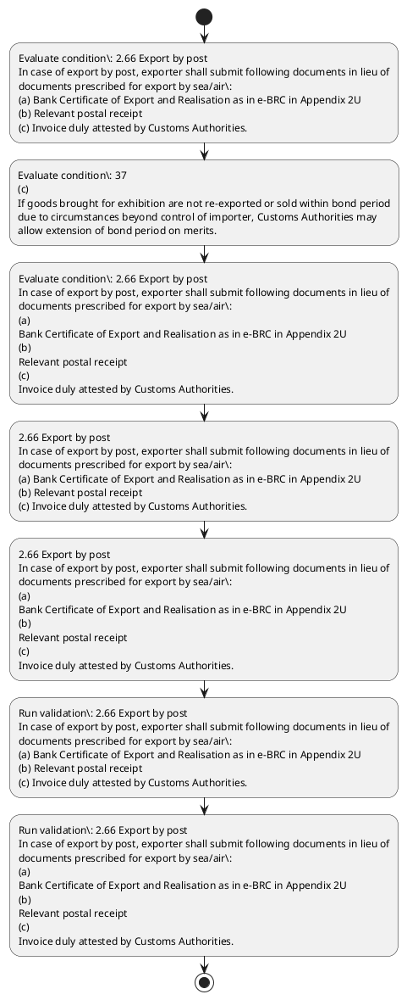

# Chapter 2 / Section 2.66: Export by post

**Chapter Title:** General Provisions Regarding Imports and Exports

**Pages:** 28

**Purpose:** 2.66 Export by post
In case of export by post, exporter shall submit following documents in lieu of
documents prescribed for export by sea/air:
(a) Bank Certificate of Export and Realisation as in e-BRC in Appendix 2U
(b) Relevant postal receipt
(c) Invoice duly attested by Customs Authorities.

**Purpose Thanglish:** Indha Export by post section-la, 2.66 export by post
In case of export by post, exporter kandippa submit following documents in lieu of
documents prescribed for export by sea/air:
(a) Bank Certificate of export and Realisation as in e-BRC in Appendix 2U
(b) Relevant postal receipt
(c) Invoice duly attested by Customs Authorities.

**Summary:** 2.66 Export by post
In case of export by post, exporter shall submit following documents in lieu of
documents prescribed for export by sea/air:
(a) Bank Certificate of Export and Realisation as in e-BRC in Appendix 2U
(b) Relevant postal receipt
(c) Invoice duly attested by Customs Authorities. pg. 37
(c)
If goods brought for exhibition are not re-exported or sold within bond period
due to circumstances beyond control of importer, Customs Authorities may
allow extension of bond period on merits.

**Business Meaning:** Export by post governs how DGFT business controls should be applied, validated, and enforced.

**Business Explanation:** Export by post explains the operating rule set that DEKAI should enforce. Key control points include 2.66 Export by post
In case of export by post, exporter shall submit following documents in lieu of
documents prescribed for export by sea/air:
(a) Bank Certificate of Export and Realisation as in e-BRC in Appendix 2U
(b) Relevant postal receipt
(c) Invoice duly attested by Customs Authorities. The section also drives actions such as 2.66 Export by post
In case of export by post, exporter shall submit following documents in lieu of
documents prescribed for export by sea/air:
(a) Bank Certificate of Export and Realisation as in e-BRC in Appendix 2U
(b) Relevant postal receipt
(c) Invoice duly attested by Customs Authorities..

**Business Explanation Thanglish:** Indha Export by post section-la, export by post explains the operating rule set that DEKAI should enforce. Key control points include 2.66 export by post
In case of export by post, exporter kandippa submit following documents in lieu of
documents prescribed for export by sea/air:
(a) Bank Certificate of export and Realisation as in e-BRC in Appendix 2U
(b) Relevant postal receipt
(c) Invoice duly attested by Customs Authorities. The section also drives actions such as 2.66 export by post
In case of export by post, exporter kandippa submit following documents in lieu of
documents prescribed for export by sea/air:
(a) Bank Certificate of export and Realisation as in e-BRC in Appendix 2U
(b) Relevant postal receipt
(c) Invoice duly attested by Customs Authorities..

## Business Logic
- 2.66 Export by post
In case of export by post, exporter shall submit following documents in lieu of
documents prescribed for export by sea/air:
(a) Bank Certificate of Export and Realisation as in e-BRC in Appendix 2U
(b) Relevant postal receipt
(c) Invoice duly attested by Customs Authorities.
- 2.66 Export by post
In case of export by post, exporter shall submit following documents in lieu of
documents prescribed for export by sea/air:
(a)
Bank Certificate of Export and Realisation as in e-BRC in Appendix 2U
(b)
Relevant postal receipt
(c)
Invoice duly attested by Customs Authorities.

## Business Rules
- rule_id=CH2-SEC2_66-R001, rule_description=2.66 Export by post
In case of export by post, exporter shall submit following documents in lieu of
documents prescribed for export by sea/air:
(a) Bank Certificate of Export and Realisation as in e-BRC in Appendix 2U
(b) Relevant postal receipt
(c) Invoice duly attested by Customs Authorities., trigger=Export by post, condition=2.66 Export by post
In case of export by post, exporter shall submit following documents in lieu of
documents prescribed for export by sea/air:
(a) Bank Certificate of Export and Realisation as in e-BRC in Appendix 2U
(b) Relevant postal receipt
(c) Invoice duly attested by Customs Authorities., validation=2.66 Export by post
In case of export by post, exporter shall submit following documents in lieu of
documents prescribed for export by sea/air:
(a) Bank Certificate of Export and Realisation as in e-BRC in Appendix 2U
(b) Relevant postal receipt
(c) Invoice duly attested by Customs Authorities., action=2.66 Export by post
In case of export by post, exporter shall submit following documents in lieu of
documents prescribed for export by sea/air:
(a) Bank Certificate of Export and Realisation as in e-BRC in Appendix 2U
(b) Relevant postal receipt
(c) Invoice duly attested by Customs Authorities., exception=No explicit exception found in uploaded documents., output=DEKAI should produce a compliance decision for 2.66 - Export by post.
- rule_id=CH2-SEC2_66-R002, rule_description=2.66 Export by post
In case of export by post, exporter shall submit following documents in lieu of
documents prescribed for export by sea/air:
(a)
Bank Certificate of Export and Realisation as in e-BRC in Appendix 2U
(b)
Relevant postal receipt
(c)
Invoice duly attested by Customs Authorities., trigger=Export by post, condition=37
(c)
If goods brought for exhibition are not re-exported or sold within bond period
due to circumstances beyond control of importer, Customs Authorities may
allow extension of bond period on merits., validation=2.66 Export by post
In case of export by post, exporter shall submit following documents in lieu of
documents prescribed for export by sea/air:
(a)
Bank Certificate of Export and Realisation as in e-BRC in Appendix 2U
(b)
Relevant postal receipt
(c)
Invoice duly attested by Customs Authorities., action=2.66 Export by post
In case of export by post, exporter shall submit following documents in lieu of
documents prescribed for export by sea/air:
(a)
Bank Certificate of Export and Realisation as in e-BRC in Appendix 2U
(b)
Relevant postal receipt
(c)
Invoice duly attested by Customs Authorities., exception=No explicit exception found in uploaded documents., output=DEKAI should produce a compliance decision for 2.66 - Export by post.

## Conditions
- 2.66 Export by post
In case of export by post, exporter shall submit following documents in lieu of
documents prescribed for export by sea/air:
(a) Bank Certificate of Export and Realisation as in e-BRC in Appendix 2U
(b) Relevant postal receipt
(c) Invoice duly attested by Customs Authorities.
- 37
(c)
If goods brought for exhibition are not re-exported or sold within bond period
due to circumstances beyond control of importer, Customs Authorities may
allow extension of bond period on merits.
- 2.66 Export by post
In case of export by post, exporter shall submit following documents in lieu of
documents prescribed for export by sea/air:
(a)
Bank Certificate of Export and Realisation as in e-BRC in Appendix 2U
(b)
Relevant postal receipt
(c)
Invoice duly attested by Customs Authorities.

## Condition Logic
- id=2.2.66.1, if=2.66 Export by post
In case of export by post, exporter shall submit following documents in lieu of
documents prescribed for export by sea/air:
(a) Bank Certificate of Export and Realisation as in e-BRC in Appendix 2U
(b) Relevant postal receipt
(c) Invoice duly attested by Customs Authorities., then=2.66 Export by post
In case of export by post, exporter shall submit following documents in lieu of
documents prescribed for export by sea/air:
(a) Bank Certificate of Export and Realisation as in e-BRC in Appendix 2U
(b) Relevant postal receipt
(c) Invoice duly attested by Customs Authorities., source=2.66 Export by post
In case of export by post, exporter shall submit following documents in lieu of
documents prescribed for export by sea/air:
(a) Bank Certificate of Export and Realisation as in e-BRC in Appendix 2U
(b) Relevant postal receipt
(c) Invoice duly attested by Customs Authorities.
- id=2.2.66.2, if=37
(c)
If goods brought for exhibition are not re-exported or sold within bond period
due to circumstances beyond control of importer, Customs Authorities may
allow extension of bond period on merits., then=2.66 Export by post
In case of export by post, exporter shall submit following documents in lieu of
documents prescribed for export by sea/air:
(a) Bank Certificate of Export and Realisation as in e-BRC in Appendix 2U
(b) Relevant postal receipt
(c) Invoice duly attested by Customs Authorities., source=37
(c)
If goods brought for exhibition are not re-exported or sold within bond period
due to circumstances beyond control of importer, Customs Authorities may
allow extension of bond period on merits.
- id=2.2.66.3, if=2.66 Export by post
In case of export by post, exporter shall submit following documents in lieu of
documents prescribed for export by sea/air:
(a)
Bank Certificate of Export and Realisation as in e-BRC in Appendix 2U
(b)
Relevant postal receipt
(c)
Invoice duly attested by Customs Authorities., then=2.66 Export by post
In case of export by post, exporter shall submit following documents in lieu of
documents prescribed for export by sea/air:
(a) Bank Certificate of Export and Realisation as in e-BRC in Appendix 2U
(b) Relevant postal receipt
(c) Invoice duly attested by Customs Authorities., source=2.66 Export by post
In case of export by post, exporter shall submit following documents in lieu of
documents prescribed for export by sea/air:
(a)
Bank Certificate of Export and Realisation as in e-BRC in Appendix 2U
(b)
Relevant postal receipt
(c)
Invoice duly attested by Customs Authorities.

## Validations
- 2.66 Export by post
In case of export by post, exporter shall submit following documents in lieu of
documents prescribed for export by sea/air:
(a) Bank Certificate of Export and Realisation as in e-BRC in Appendix 2U
(b) Relevant postal receipt
(c) Invoice duly attested by Customs Authorities.
- 2.66 Export by post
In case of export by post, exporter shall submit following documents in lieu of
documents prescribed for export by sea/air:
(a)
Bank Certificate of Export and Realisation as in e-BRC in Appendix 2U
(b)
Relevant postal receipt
(c)
Invoice duly attested by Customs Authorities.

## Exceptions
- None identified

## Dependencies
- None identified

## Authorities
- Customs
- Invoice duly attested by Customs Authorities
- Customs Authorities

## Required Documents
- Bank Certificate

## Timelines
- 37
(c)
If goods brought for exhibition are not re-exported or sold within bond period
due to circumstances beyond control of importer, Customs Authorities may
allow extension of bond period on merits.

## Actions
- 2.66 Export by post
In case of export by post, exporter shall submit following documents in lieu of
documents prescribed for export by sea/air:
(a) Bank Certificate of Export and Realisation as in e-BRC in Appendix 2U
(b) Relevant postal receipt
(c) Invoice duly attested by Customs Authorities.
- 2.66 Export by post
In case of export by post, exporter shall submit following documents in lieu of
documents prescribed for export by sea/air:
(a)
Bank Certificate of Export and Realisation as in e-BRC in Appendix 2U
(b)
Relevant postal receipt
(c)
Invoice duly attested by Customs Authorities.

## Workflow
- Evaluate condition: 2.66 Export by post
In case of export by post, exporter shall submit following documents in lieu of
documents prescribed for export by sea/air:
(a) Bank Certificate of Export and Realisation as in e-BRC in Appendix 2U
(b) Relevant postal receipt
(c) Invoice duly attested by Customs Authorities.
- Evaluate condition: 37
(c)
If goods brought for exhibition are not re-exported or sold within bond period
due to circumstances beyond control of importer, Customs Authorities may
allow extension of bond period on merits.
- Evaluate condition: 2.66 Export by post
In case of export by post, exporter shall submit following documents in lieu of
documents prescribed for export by sea/air:
(a)
Bank Certificate of Export and Realisation as in e-BRC in Appendix 2U
(b)
Relevant postal receipt
(c)
Invoice duly attested by Customs Authorities.
- 2.66 Export by post
In case of export by post, exporter shall submit following documents in lieu of
documents prescribed for export by sea/air:
(a) Bank Certificate of Export and Realisation as in e-BRC in Appendix 2U
(b) Relevant postal receipt
(c) Invoice duly attested by Customs Authorities.
- 2.66 Export by post
In case of export by post, exporter shall submit following documents in lieu of
documents prescribed for export by sea/air:
(a)
Bank Certificate of Export and Realisation as in e-BRC in Appendix 2U
(b)
Relevant postal receipt
(c)
Invoice duly attested by Customs Authorities.
- Run validation: 2.66 Export by post
In case of export by post, exporter shall submit following documents in lieu of
documents prescribed for export by sea/air:
(a) Bank Certificate of Export and Realisation as in e-BRC in Appendix 2U
(b) Relevant postal receipt
(c) Invoice duly attested by Customs Authorities.
- Run validation: 2.66 Export by post
In case of export by post, exporter shall submit following documents in lieu of
documents prescribed for export by sea/air:
(a)
Bank Certificate of Export and Realisation as in e-BRC in Appendix 2U
(b)
Relevant postal receipt
(c)
Invoice duly attested by Customs Authorities.

## Workflow ASCII
```text
Export by post
Evaluate condition: 2.66 Export by post
In case of export by post, exporter shall submit following documents in lieu of
documents prescribed for export by sea/air:
(a) Bank Certificate of Export and Realisation as in e-BRC in Appendix 2U
(b) Relevant postal receipt
(c) Invoice duly attested by Customs Authorities.
   |
   v
Evaluate condition: 37
(c)
If goods brought for exhibition are not re-exported or sold within bond period
due to circumstances beyond control of importer, Customs Authorities may
allow extension of bond period on merits.
   |
   v
Evaluate condition: 2.66 Export by post
In case of export by post, exporter shall submit following documents in lieu of
documents prescribed for export by sea/air:
(a)
Bank Certificate of Export and Realisation as in e-BRC in Appendix 2U
(b)
Relevant postal receipt
(c)
Invoice duly attested by Customs Authorities.
   |
   v
2.66 Export by post
In case of export by post, exporter shall submit following documents in lieu of
documents prescribed for export by sea/air:
(a) Bank Certificate of Export and Realisation as in e-BRC in Appendix 2U
(b) Relevant postal receipt
(c) Invoice duly attested by Customs Authorities.
   |
   v
2.66 Export by post
In case of export by post, exporter shall submit following documents in lieu of
documents prescribed for export by sea/air:
(a)
Bank Certificate of Export and Realisation as in e-BRC in Appendix 2U
(b)
Relevant postal receipt
(c)
Invoice duly attested by Customs Authorities.
   |
   v
Run validation: 2.66 Export by post
In case of export by post, exporter shall submit following documents in lieu of
documents prescribed for export by sea/air:
(a) Bank Certificate of Export and Realisation as in e-BRC in Appendix 2U
(b) Relevant postal receipt
(c) Invoice duly attested by Customs Authorities.
   |
   v
Run validation: 2.66 Export by post
In case of export by post, exporter shall submit following documents in lieu of
documents prescribed for export by sea/air:
(a)
Bank Certificate of Export and Realisation as in e-BRC in Appendix 2U
(b)
Relevant postal receipt
(c)
Invoice duly attested by Customs Authorities.
```

## Decision Tree
- IF 2.66 Export by post
In case of export by post, exporter shall submit following documents in lieu of
documents prescribed for export by sea/air:
(a) Bank Certificate of Export and Realisation as in e-BRC in Appendix 2U
(b) Relevant postal receipt
(c) Invoice duly attested by Customs Authorities. THEN 2.66 Export by post
In case of export by post, exporter shall submit following documents in lieu of
documents prescribed for export by sea/air:
(a) Bank Certificate of Export and Realisation as in e-BRC in Appendix 2U
(b) Relevant postal receipt
(c) Invoice duly attested by Customs Authorities.
- IF 37
(c)
If goods brought for exhibition are not re-exported or sold within bond period
due to circumstances beyond control of importer, Customs Authorities may
allow extension of bond period on merits. THEN 2.66 Export by post
In case of export by post, exporter shall submit following documents in lieu of
documents prescribed for export by sea/air:
(a) Bank Certificate of Export and Realisation as in e-BRC in Appendix 2U
(b) Relevant postal receipt
(c) Invoice duly attested by Customs Authorities.
- IF 2.66 Export by post
In case of export by post, exporter shall submit following documents in lieu of
documents prescribed for export by sea/air:
(a)
Bank Certificate of Export and Realisation as in e-BRC in Appendix 2U
(b)
Relevant postal receipt
(c)
Invoice duly attested by Customs Authorities. THEN 2.66 Export by post
In case of export by post, exporter shall submit following documents in lieu of
documents prescribed for export by sea/air:
(a) Bank Certificate of Export and Realisation as in e-BRC in Appendix 2U
(b) Relevant postal receipt
(c) Invoice duly attested by Customs Authorities.

## Decision Tree ASCII
```text
Export by post Decision
IF 2.66 Export by post
In case of export by post, exporter shall submit following documents in lieu of
documents prescribed for export by sea/air:
(a) Bank Certificate of Export and Realisation as in e-BRC in Appendix 2U
(b) Relevant postal receipt
(c) Invoice duly attested by Customs Authorities. THEN 2.66 Export by post
In case of export by post, exporter shall submit following documents in lieu of
documents prescribed for export by sea/air:
(a) Bank Certificate of Export and Realisation as in e-BRC in Appendix 2U
(b) Relevant postal receipt
(c) Invoice duly attested by Customs Authorities.
   |
   v
IF 37
(c)
If goods brought for exhibition are not re-exported or sold within bond period
due to circumstances beyond control of importer, Customs Authorities may
allow extension of bond period on merits. THEN 2.66 Export by post
In case of export by post, exporter shall submit following documents in lieu of
documents prescribed for export by sea/air:
(a) Bank Certificate of Export and Realisation as in e-BRC in Appendix 2U
(b) Relevant postal receipt
(c) Invoice duly attested by Customs Authorities.
   |
   v
IF 2.66 Export by post
In case of export by post, exporter shall submit following documents in lieu of
documents prescribed for export by sea/air:
(a)
Bank Certificate of Export and Realisation as in e-BRC in Appendix 2U
(b)
Relevant postal receipt
(c)
Invoice duly attested by Customs Authorities. THEN 2.66 Export by post
In case of export by post, exporter shall submit following documents in lieu of
documents prescribed for export by sea/air:
(a) Bank Certificate of Export and Realisation as in e-BRC in Appendix 2U
(b) Relevant postal receipt
(c) Invoice duly attested by Customs Authorities.
```

## Examples
- User asks to process Export by post; the platform checks conditions, validations, and documents before action.

**Real-world Example:** Example: an importer or exporter invokes Export by post, submits Bank Certificate, and DEKAI uses the extracted rules to 2.66 export by post
in case of export by post, exporter shall submit following documents in lieu of
documents prescribed for export by sea/air:
(a) bank certificate of export and realisation as in e-brc in appendix 2u
(b) relevant postal receipt
(c) invoice duly attested by customs authorities..

**Real-world Example Thanglish:** Indha Export by post section-la, Example: an importer or exporter invokes export by post, submits Bank Certificate, and DEKAI uses the extracted rules to 2.66 export by post
in case of export by post, exporter kandippa submit following documents in lieu of
documents prescribed for export by sea/air:
(a) bank certificate of export and realisation as in e-brc in appendix 2u
(b) relevant postal receipt
(c) invoice duly attested by customs authorities..

## AI Rules
- IF detected context matches section rule THEN enforce: 2.66 Export by post
In case of export by post, exporter shall submit following documents in lieu of
documents prescribed for export by sea/air:
(a) Bank Certificate of Export and Realisation as in e-BRC in Appendix 2U
(b) Relevant postal receipt
(c) Invoice duly attested by Customs Authorities.
- IF detected context matches section rule THEN enforce: 2.66 Export by post
In case of export by post, exporter shall submit following documents in lieu of
documents prescribed for export by sea/air:
(a)
Bank Certificate of Export and Realisation as in e-BRC in Appendix 2U
(b)
Relevant postal receipt
(c)
Invoice duly attested by Customs Authorities.
- IF validations pass THEN recommend action: 2.66 Export by post
In case of export by post, exporter shall submit following documents in lieu of
documents prescribed for export by sea/air:
(a) Bank Certificate of Export and Realisation as in e-BRC in Appendix 2U
(b) Relevant postal receipt
(c) Invoice duly attested by Customs Authorities.

## Database Fields
- name=section_code, type=string, required=True, source=parsed_section_heading
- name=section_title, type=string, required=True, source=parsed_section_heading
- name=for_flag, type=boolean, required=False, source=keyword:for
- name=and_flag, type=boolean, required=False, source=keyword:and
- name=are_flag, type=boolean, required=False, source=keyword:are
- name=not_flag, type=boolean, required=False, source=keyword:not
- name=due_flag, type=boolean, required=False, source=keyword:due
- name=may_flag, type=boolean, required=False, source=keyword:may
- name=post_flag, type=boolean, required=False, source=keyword:post
- name=case_flag, type=boolean, required=False, source=keyword:case
- name=document_1_submitted, type=boolean, required=True, source=Bank Certificate

## API Requirements
- method=GET, path=/api/dgft/sections/2.66, purpose=Retrieve knowledge payload for section 2.66, query_params=['include=workflow,decision_tree,validations'], response_fields=['section', 'title', 'summary', 'conditions', 'validations', 'exceptions', 'workflow', 'decision_tree']
- method=POST, path=/api/dgft/Export-by-post/validate, purpose=Validate inputs and documents for Export by post, request_fields=['section_code', 'section_title', 'document_1_submitted'], response_fields=['status', 'errors', 'warnings', 'next_actions']
- method=POST, path=/api/dgft/Export-by-post/execute, purpose=Trigger business action for 2.66 Export by post
In case of export by post, exporter shall submit following documents in lieu of
documents prescribed for export by sea/air:
(a) Bank Certificate of Export and Realisation as in e-BRC in Appendix 2U
(b) Relevant postal receipt
(c) Invoice duly attested by Customs Authorities., request_fields=['section_code', 'section_title', 'document_1_submitted'], response_fields=['reference_id', 'status', 'authority', 'timeline']

## UI Screens
- screen_id=Export_by_post_overview, name=Export by post Overview, purpose=Show section summary, authority, timeline, and eligibility cues., widgets=['summary_card', 'conditions_table', 'authority_badges', 'timeline_panel']
- screen_id=Export_by_post_submission, name=Export by post Submission, purpose=Capture applicant data and supporting documents., widgets=['dynamic_form', 'document_uploader', 'validation_panel', 'next_action_footer'], fields=['section_code', 'section_title', 'for_flag', 'and_flag', 'are_flag', 'not_flag', 'due_flag', 'may_flag']

## Error Messages
- Validation failed because the section requirements were not fully met.

## FAQ
- question_en=What is the purpose of section 2.66?, answer_en=Export by post explains the operating rule set that DEKAI should enforce. Key control points include 2.66 Export by post
In case of export by post, exporter shall submit following documents in lieu of
documents prescribed for export by sea/air:
(a) Bank Certificate of Export and Realisation as in e-BRC in Appendix 2U
(b) Relevant postal receipt
(c) Invoice duly attested by Customs Authorities. The section also drives actions such as 2.66 Export by post
In case of export by post, exporter shall submit following documents in lieu of
documents prescribed for export by sea/air:
(a) Bank Certificate of Export and Realisation as in e-BRC in Appendix 2U
(b) Relevant postal receipt
(c) Invoice duly attested by Customs Authorities.., question_thanglish=Indha Export by post section-la, What is the purpose of section 2.66?, answer_thanglish=Indha Export by post section-la, export by post explains the operating rule set that DEKAI should enforce. Key control points include 2.66 export by post
In case of export by post, exporter kandippa submit following documents in lieu of
documents prescribed for export by sea/air:
(a) Bank Certificate of export and Realisation as in e-BRC in Appendix 2U
(b) Relevant postal receipt
(c) Invoice duly attested by Customs Authorities. The section also drives actions such as 2.66 export by post
In case of export by post, exporter kandippa submit following documents in lieu of
documents prescribed for export by sea/air:
(a) Bank Certificate of export and Realisation as in e-BRC in Appendix 2U
(b) Relevant postal receipt
(c) Invoice duly attested by Customs Authorities..
- question_en=What documents are required under Export by post?, answer_en=Bank Certificate, question_thanglish=Indha Export by post section-la, What documents are required under export by post?, answer_thanglish=Indha Export by post section-la, Bank Certificate
- question_en=Which authority handles Export by post?, answer_en=Customs, Invoice duly attested by Customs Authorities, Customs Authorities, question_thanglish=Indha Export by post section-la, Which authority handles export by post?, answer_thanglish=Indha Export by post section-la, Customs, Invoice duly attested by Customs Authorities, Customs Authorities

## Questions Users May Ask
- What does Export by post require?
- Which documents are needed for Export by post?
- How does DEKAI validate Export by post requests?
- What action should be taken for Export by post?

## Expected AI Answers
- Export by post requires the platform to interpret the section text, apply the extracted business rules, and present the correct next action.
- Required documents are inferred from the section text: Bank Certificate
- DEKAI validates Export by post by checking conditions, required documents, authority references, and exception clauses before recommending an outcome.
- The primary extracted action is: 2.66 Export by post
In case of export by post, exporter shall submit following documents in lieu of
documents prescribed for export by sea/air:
(a) Bank Certificate of Export and Realisation as in e-BRC in Appendix 2U
(b) Relevant postal receipt
(c) Invoice duly attested by Customs Authorities.

## AI Q&A Examples
- question_en=User asks: How do I comply with Export by post?, answer_en=AI answers: DEKAI should evaluate section 2.66, apply the extracted rules, and guide the user through Evaluate condition: 2.66 Export by post
In case of export by post, exporter shall submit following documents in lieu of
documents prescribed for export by sea/air:
(a) Bank Certificate of Export and Realisation as in e-BRC in Appendix 2U
(b) Relevant postal receipt
(c) Invoice duly attested by Customs Authorities.., question_thanglish=Indha Export by post section-la, User asks: How do I comply with export by post?, answer_thanglish=Indha Export by post section-la, AI answers: DEKAI should evaluate section 2.66, apply the extracted rules, and guide the user through Evaluate condition: 2.66 export by post
In case of export by post, exporter kandippa submit following documents in lieu of
documents prescribed for export by sea/air:
(a) Bank Certificate of export and Realisation as in e-BRC in Appendix 2U
(b) Relevant postal receipt
(c) Invoice duly attested by Customs Authorities..
- question_en=User asks: Which validations apply to Export by post?, answer_en=AI answers: Applicable validations are 2.66 Export by post
In case of export by post, exporter shall submit following documents in lieu of
documents prescribed for export by sea/air:
(a) Bank Certificate of Export and Realisation as in e-BRC in Appendix 2U
(b) Relevant postal receipt
(c) Invoice duly attested by Customs Authorities., 2.66 Export by post
In case of export by post, exporter shall submit following documents in lieu of
documents prescribed for export by sea/air:
(a)
Bank Certificate of Export and Realisation as in e-BRC in Appendix 2U
(b)
Relevant postal receipt
(c)
Invoice duly attested by Customs Authorities., question_thanglish=Indha Export by post section-la, User asks: Which validations apply to export by post?, answer_thanglish=Indha Export by post section-la, AI answers: Applicable validations are 2.66 export by post
In case of export by post, exporter kandippa submit following documents in lieu of
documents prescribed for export by sea/air:
(a) Bank Certificate of export and Realisation as in e-BRC in Appendix 2U
(b) Relevant postal receipt
(c) Invoice duly attested by Customs Authorities., 2.66 export by post
In case of export by post, exporter kandippa submit following documents in lieu of
documents prescribed for export by sea/air:
(a)
Bank Certificate of export and Realisation as in e-BRC in Appendix 2U
(b)
Relevant postal receipt
(c)
Invoice duly attested by Customs Authorities.

## DEKAI AI Implementation Notes
- Capture chapter 2, section 2.66, title, and page references as immutable knowledge metadata.
- Bind validations for Export by post into a rule engine keyed by the rule IDs extracted for this section.
- Expose document upload controls for: Bank Certificate.
- Route escalations or approvals to: Customs, Invoice duly attested by Customs Authorities, Customs Authorities.

## DEKAI AI Implementation Notes Thanglish
- Indha Export by post section-la, Capture chapter 2, section 2.66, title, and page references as immutable knowledge metadata.
- Indha Export by post section-la, Bind validations for export by post into a rule engine keyed by the rule IDs extracted for this section.
- Indha Export by post section-la, Expose document upload controls for: Bank Certificate.
- Indha Export by post section-la, Route escalations or approvals to: Customs, Invoice duly attested by Customs Authorities, Customs Authorities.

## AI Metadata
- Keywords: for, and, are, not, due, may, post, case, lieu, Bank, duly, sold, bond, shall, e-BRC, goods, allow, Export, submit, postal
- Search Keywords: for, and, are, not, due, may, post, case, lieu, Bank, duly, sold, bond, shall, e-BRC, goods, allow, Export, submit, postal
- Intent: Support Export by post processing and compliance validation.
- Tags: 2.66, Export by post, business-rule, document-driven, dgft
- Related Sections: 
- Related Chapters: 
- Related Rules: 2.66 Export by post
In case of export by post, exporter shall submit following documents in lieu of
documents prescribed for export by sea/air:
(a) Bank Certificate of Export and Realisation as in e-BRC in Appendix 2U
(b) Relevant postal receipt
(c) Invoice duly attested by Customs Authorities., 2.66 Export by post
In case of export by post, exporter shall submit following documents in lieu of
documents prescribed for export by sea/air:
(a)
Bank Certificate of Export and Realisation as in e-BRC in Appendix 2U
(b)
Relevant postal receipt
(c)
Invoice duly attested by Customs Authorities.

## Mermaid

```mermaid
flowchart TD
    S1["Evaluate condition: 2.66 Export by post
In case of export by post, exporter shall submit following documents in lieu of
documents prescribed for export by sea/air:
(a) Bank Certificate of Export and Realisation as in e-BRC in Appendix 2U
(b) Relevant postal receipt
(c) Invoice duly attested by Customs Authorities."]
    S2["Evaluate condition: 37
(c)
If goods brought for exhibition are not re-exported or sold within bond period
due to circumstances beyond control of importer, Customs Authorities may
allow extension of bond period on merits."]
    S1 --> S2
    S3["Evaluate condition: 2.66 Export by post
In case of export by post, exporter shall submit following documents in lieu of
documents prescribed for export by sea/air:
(a)
Bank Certificate of Export and Realisation as in e-BRC in Appendix 2U
(b)
Relevant postal receipt
(c)
Invoice duly attested by Customs Authorities."]
    S2 --> S3
    S4["2.66 Export by post
In case of export by post, exporter shall submit following documents in lieu of
documents prescribed for export by sea/air:
(a) Bank Certificate of Export and Realisation as in e-BRC in Appendix 2U
(b) Relevant postal receipt
(c) Invoice duly attested by Customs Authorities."]
    S3 --> S4
    S5["2.66 Export by post
In case of export by post, exporter shall submit following documents in lieu of
documents prescribed for export by sea/air:
(a)
Bank Certificate of Export and Realisation as in e-BRC in Appendix 2U
(b)
Relevant postal receipt
(c)
Invoice duly attested by Customs Authorities."]
    S4 --> S5
    S6["Run validation: 2.66 Export by post
In case of export by post, exporter shall submit following documents in lieu of
documents prescribed for export by sea/air:
(a) Bank Certificate of Export and Realisation as in e-BRC in Appendix 2U
(b) Relevant postal receipt
(c) Invoice duly attested by Customs Authorities."]
    S5 --> S6
    S7["Run validation: 2.66 Export by post
In case of export by post, exporter shall submit following documents in lieu of
documents prescribed for export by sea/air:
(a)
Bank Certificate of Export and Realisation as in e-BRC in Appendix 2U
(b)
Relevant postal receipt
(c)
Invoice duly attested by Customs Authorities."]
    S6 --> S7
```


## PlantUML

