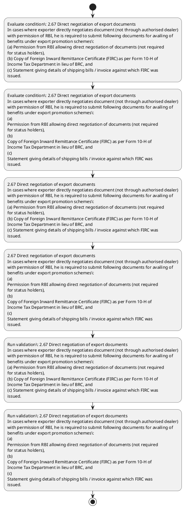

# Chapter 2 / Section 2.67: Direct negotiation of export documents

**Chapter Title:** General Provisions Regarding Imports and Exports

**Pages:** 29

**Purpose:** 2.67 Direct negotiation of export documents
In cases where exporter directly negotiates document (not through authorised dealer)
with permission of RBI, he is required to submit following documents for availing of
benefits under export promotion schemes:
(a) Permission from RBI allowing direct negotiation of documents (not required
for status holders),
(b) Copy of Foreign Inward Remittance Certificate (FIRC) as per Form 10-H of
Income Tax Department in lieu of BRC, and
(c) Statement giving details of shipping bills / invoice against which FIRC was
issued.

**Purpose Thanglish:** Indha Direct negotiation of export documents section-la, 2.67 Direct negotiation of export documents
In cases where exporter directly negotiates document (not through authorised dealer)
with permission of RBI, he is required to submit following documents for availing of
benefits under export promotion schemes:
(a) Permission from RBI allowing direct negotiation of documents (not required
for status holders),
(b) Copy of Foreign Inward Remittance Certificate (FIRC) as per Form 10-H of
Income Tax Department in lieu of BRC, and
(c) Statement giving details of shipping bills / invoice against which FIRC was
issued.

**Summary:** 2.67 Direct negotiation of export documents
In cases where exporter directly negotiates document (not through authorised dealer)
with permission of RBI, he is required to submit following documents for availing of
benefits under export promotion schemes:
(a) Permission from RBI allowing direct negotiation of documents (not required
for status holders),
(b) Copy of Foreign Inward Remittance Certificate (FIRC) as per Form 10-H of
Income Tax Department in lieu of BRC, and
(c) Statement giving details of shipping bills / invoice against which FIRC was
issued. 2.67 Direct negotiation of export documents
In cases where exporter directly negotiates document (not through authorised dealer)
with permission of RBI, he is required to submit following documents for availing of
benefits under export promotion schemes:
(a)
Permission from RBI allowing direct negotiation of documents (not required
for status holders),
(b)
Copy of Foreign Inward Remittance Certificate (FIRC) as per Form 10-H of
Income Tax Department in lieu of BRC, and
(c)
Statement giving details of shipping bills / invoice against which FIRC was
issued.

**Business Meaning:** Direct negotiation of export documents governs how DGFT business controls should be applied, validated, and enforced.

**Business Explanation:** Direct negotiation of export documents explains the operating rule set that DEKAI should enforce. Key control points include 2.67 Direct negotiation of export documents
In cases where exporter directly negotiates document (not through authorised dealer)
with permission of RBI, he is required to submit following documents for availing of
benefits under export promotion schemes:
(a) Permission from RBI allowing direct negotiation of documents (not required
for status holders),
(b) Copy of Foreign Inward Remittance Certificate (FIRC) as per Form 10-H of
Income Tax Department in lieu of BRC, and
(c) Statement giving details of shipping bills / invoice against which FIRC was
issued. The section also drives actions such as 2.67 Direct negotiation of export documents
In cases where exporter directly negotiates document (not through authorised dealer)
with permission of RBI, he is required to submit following documents for availing of
benefits under export promotion schemes:
(a) Permission from RBI allowing direct negotiation of documents (not required
for status holders),
(b) Copy of Foreign Inward Remittance Certificate (FIRC) as per Form 10-H of
Income Tax Department in lieu of BRC, and
(c) Statement giving details of shipping bills / invoice against which FIRC was
issued..

**Business Explanation Thanglish:** Indha Direct negotiation of export documents section-la, Direct negotiation of export documents explains the operating rule set that DEKAI should enforce. Key control points include 2.67 Direct negotiation of export documents
In cases where exporter directly negotiates document (not through authorised dealer)
with permission of RBI, he is required to submit following documents for availing of
benefits under export promotion schemes:
(a) Permission from RBI allowing direct negotiation of documents (not required
for status holders),
(b) Copy of Foreign Inward Remittance Certificate (FIRC) as per Form 10-H of
Income Tax Department in lieu of BRC, and
(c) Statement giving details of shipping bills / invoice against which FIRC was
issued. The section also drives actions such as 2.67 Direct negotiation of export documents
In cases where exporter directly negotiates document (not through authorised dealer)
with permission of RBI, he is required to submit following documents for availing of
benefits under export promotion schemes:
(a) Permission from RBI allowing direct negotiation of documents (not required
for status holders),
(b) Copy of Foreign Inward Remittance Certificate (FIRC) as per Form 10-H of
Income Tax Department in lieu of BRC, and
(c) Statement giving details of shipping bills / invoice against which FIRC was
issued..

## Business Logic
- 2.67 Direct negotiation of export documents
In cases where exporter directly negotiates document (not through authorised dealer)
with permission of RBI, he is required to submit following documents for availing of
benefits under export promotion schemes:
(a) Permission from RBI allowing direct negotiation of documents (not required
for status holders),
(b) Copy of Foreign Inward Remittance Certificate (FIRC) as per Form 10-H of
Income Tax Department in lieu of BRC, and
(c) Statement giving details of shipping bills / invoice against which FIRC was
issued.
- 2.67 Direct negotiation of export documents
In cases where exporter directly negotiates document (not through authorised dealer)
with permission of RBI, he is required to submit following documents for availing of
benefits under export promotion schemes:
(a)
Permission from RBI allowing direct negotiation of documents (not required
for status holders),
(b)
Copy of Foreign Inward Remittance Certificate (FIRC) as per Form 10-H of
Income Tax Department in lieu of BRC, and
(c)
Statement giving details of shipping bills / invoice against which FIRC was
issued.

## Business Rules
- rule_id=CH2-SEC2_67-R001, rule_description=2.67 Direct negotiation of export documents
In cases where exporter directly negotiates document (not through authorised dealer)
with permission of RBI, he is required to submit following documents for availing of
benefits under export promotion schemes:
(a) Permission from RBI allowing direct negotiation of documents (not required
for status holders),
(b) Copy of Foreign Inward Remittance Certificate (FIRC) as per Form 10-H of
Income Tax Department in lieu of BRC, and
(c) Statement giving details of shipping bills / invoice against which FIRC was
issued., trigger=Direct negotiation of export documents, condition=2.67 Direct negotiation of export documents
In cases where exporter directly negotiates document (not through authorised dealer)
with permission of RBI, he is required to submit following documents for availing of
benefits under export promotion schemes:
(a) Permission from RBI allowing direct negotiation of documents (not required
for status holders),
(b) Copy of Foreign Inward Remittance Certificate (FIRC) as per Form 10-H of
Income Tax Department in lieu of BRC, and
(c) Statement giving details of shipping bills / invoice against which FIRC was
issued., validation=2.67 Direct negotiation of export documents
In cases where exporter directly negotiates document (not through authorised dealer)
with permission of RBI, he is required to submit following documents for availing of
benefits under export promotion schemes:
(a) Permission from RBI allowing direct negotiation of documents (not required
for status holders),
(b) Copy of Foreign Inward Remittance Certificate (FIRC) as per Form 10-H of
Income Tax Department in lieu of BRC, and
(c) Statement giving details of shipping bills / invoice against which FIRC was
issued., action=2.67 Direct negotiation of export documents
In cases where exporter directly negotiates document (not through authorised dealer)
with permission of RBI, he is required to submit following documents for availing of
benefits under export promotion schemes:
(a) Permission from RBI allowing direct negotiation of documents (not required
for status holders),
(b) Copy of Foreign Inward Remittance Certificate (FIRC) as per Form 10-H of
Income Tax Department in lieu of BRC, and
(c) Statement giving details of shipping bills / invoice against which FIRC was
issued., exception=No explicit exception found in uploaded documents., output=DEKAI should produce a compliance decision for 2.67 - Direct negotiation of export documents.
- rule_id=CH2-SEC2_67-R002, rule_description=2.67 Direct negotiation of export documents
In cases where exporter directly negotiates document (not through authorised dealer)
with permission of RBI, he is required to submit following documents for availing of
benefits under export promotion schemes:
(a)
Permission from RBI allowing direct negotiation of documents (not required
for status holders),
(b)
Copy of Foreign Inward Remittance Certificate (FIRC) as per Form 10-H of
Income Tax Department in lieu of BRC, and
(c)
Statement giving details of shipping bills / invoice against which FIRC was
issued., trigger=Direct negotiation of export documents, condition=2.67 Direct negotiation of export documents
In cases where exporter directly negotiates document (not through authorised dealer)
with permission of RBI, he is required to submit following documents for availing of
benefits under export promotion schemes:
(a)
Permission from RBI allowing direct negotiation of documents (not required
for status holders),
(b)
Copy of Foreign Inward Remittance Certificate (FIRC) as per Form 10-H of
Income Tax Department in lieu of BRC, and
(c)
Statement giving details of shipping bills / invoice against which FIRC was
issued., validation=2.67 Direct negotiation of export documents
In cases where exporter directly negotiates document (not through authorised dealer)
with permission of RBI, he is required to submit following documents for availing of
benefits under export promotion schemes:
(a)
Permission from RBI allowing direct negotiation of documents (not required
for status holders),
(b)
Copy of Foreign Inward Remittance Certificate (FIRC) as per Form 10-H of
Income Tax Department in lieu of BRC, and
(c)
Statement giving details of shipping bills / invoice against which FIRC was
issued., action=2.67 Direct negotiation of export documents
In cases where exporter directly negotiates document (not through authorised dealer)
with permission of RBI, he is required to submit following documents for availing of
benefits under export promotion schemes:
(a)
Permission from RBI allowing direct negotiation of documents (not required
for status holders),
(b)
Copy of Foreign Inward Remittance Certificate (FIRC) as per Form 10-H of
Income Tax Department in lieu of BRC, and
(c)
Statement giving details of shipping bills / invoice against which FIRC was
issued., exception=No explicit exception found in uploaded documents., output=DEKAI should produce a compliance decision for 2.67 - Direct negotiation of export documents.

## Conditions
- 2.67 Direct negotiation of export documents
In cases where exporter directly negotiates document (not through authorised dealer)
with permission of RBI, he is required to submit following documents for availing of
benefits under export promotion schemes:
(a) Permission from RBI allowing direct negotiation of documents (not required
for status holders),
(b) Copy of Foreign Inward Remittance Certificate (FIRC) as per Form 10-H of
Income Tax Department in lieu of BRC, and
(c) Statement giving details of shipping bills / invoice against which FIRC was
issued.
- 2.67 Direct negotiation of export documents
In cases where exporter directly negotiates document (not through authorised dealer)
with permission of RBI, he is required to submit following documents for availing of
benefits under export promotion schemes:
(a)
Permission from RBI allowing direct negotiation of documents (not required
for status holders),
(b)
Copy of Foreign Inward Remittance Certificate (FIRC) as per Form 10-H of
Income Tax Department in lieu of BRC, and
(c)
Statement giving details of shipping bills / invoice against which FIRC was
issued.

## Condition Logic
- id=2.2.67.1, if=2.67 Direct negotiation of export documents
In cases where exporter directly negotiates document (not through authorised dealer)
with permission of RBI, he is required to submit following documents for availing of
benefits under export promotion schemes:
(a) Permission from RBI allowing direct negotiation of documents (not required
for status holders),
(b) Copy of Foreign Inward Remittance Certificate (FIRC) as per Form 10-H of
Income Tax Department in lieu of BRC, and
(c) Statement giving details of shipping bills / invoice against which FIRC was
issued., then=2.67 Direct negotiation of export documents
In cases where exporter directly negotiates document (not through authorised dealer)
with permission of RBI, he is required to submit following documents for availing of
benefits under export promotion schemes:
(a) Permission from RBI allowing direct negotiation of documents (not required
for status holders),
(b) Copy of Foreign Inward Remittance Certificate (FIRC) as per Form 10-H of
Income Tax Department in lieu of BRC, and
(c) Statement giving details of shipping bills / invoice against which FIRC was
issued., source=2.67 Direct negotiation of export documents
In cases where exporter directly negotiates document (not through authorised dealer)
with permission of RBI, he is required to submit following documents for availing of
benefits under export promotion schemes:
(a) Permission from RBI allowing direct negotiation of documents (not required
for status holders),
(b) Copy of Foreign Inward Remittance Certificate (FIRC) as per Form 10-H of
Income Tax Department in lieu of BRC, and
(c) Statement giving details of shipping bills / invoice against which FIRC was
issued.
- id=2.2.67.2, if=2.67 Direct negotiation of export documents
In cases where exporter directly negotiates document (not through authorised dealer)
with permission of RBI, he is required to submit following documents for availing of
benefits under export promotion schemes:
(a)
Permission from RBI allowing direct negotiation of documents (not required
for status holders),
(b)
Copy of Foreign Inward Remittance Certificate (FIRC) as per Form 10-H of
Income Tax Department in lieu of BRC, and
(c)
Statement giving details of shipping bills / invoice against which FIRC was
issued., then=2.67 Direct negotiation of export documents
In cases where exporter directly negotiates document (not through authorised dealer)
with permission of RBI, he is required to submit following documents for availing of
benefits under export promotion schemes:
(a) Permission from RBI allowing direct negotiation of documents (not required
for status holders),
(b) Copy of Foreign Inward Remittance Certificate (FIRC) as per Form 10-H of
Income Tax Department in lieu of BRC, and
(c) Statement giving details of shipping bills / invoice against which FIRC was
issued., source=2.67 Direct negotiation of export documents
In cases where exporter directly negotiates document (not through authorised dealer)
with permission of RBI, he is required to submit following documents for availing of
benefits under export promotion schemes:
(a)
Permission from RBI allowing direct negotiation of documents (not required
for status holders),
(b)
Copy of Foreign Inward Remittance Certificate (FIRC) as per Form 10-H of
Income Tax Department in lieu of BRC, and
(c)
Statement giving details of shipping bills / invoice against which FIRC was
issued.

## Validations
- 2.67 Direct negotiation of export documents
In cases where exporter directly negotiates document (not through authorised dealer)
with permission of RBI, he is required to submit following documents for availing of
benefits under export promotion schemes:
(a) Permission from RBI allowing direct negotiation of documents (not required
for status holders),
(b) Copy of Foreign Inward Remittance Certificate (FIRC) as per Form 10-H of
Income Tax Department in lieu of BRC, and
(c) Statement giving details of shipping bills / invoice against which FIRC was
issued.
- 2.67 Direct negotiation of export documents
In cases where exporter directly negotiates document (not through authorised dealer)
with permission of RBI, he is required to submit following documents for availing of
benefits under export promotion schemes:
(a)
Permission from RBI allowing direct negotiation of documents (not required
for status holders),
(b)
Copy of Foreign Inward Remittance Certificate (FIRC) as per Form 10-H of
Income Tax Department in lieu of BRC, and
(c)
Statement giving details of shipping bills / invoice against which FIRC was
issued.

## Exceptions
- None identified

## Dependencies
- None identified

## Authorities
- None identified

## Required Documents
- Copy of Foreign Inward Remittance Certificate

## Timelines
- None identified

## Actions
- 2.67 Direct negotiation of export documents
In cases where exporter directly negotiates document (not through authorised dealer)
with permission of RBI, he is required to submit following documents for availing of
benefits under export promotion schemes:
(a) Permission from RBI allowing direct negotiation of documents (not required
for status holders),
(b) Copy of Foreign Inward Remittance Certificate (FIRC) as per Form 10-H of
Income Tax Department in lieu of BRC, and
(c) Statement giving details of shipping bills / invoice against which FIRC was
issued.
- 2.67 Direct negotiation of export documents
In cases where exporter directly negotiates document (not through authorised dealer)
with permission of RBI, he is required to submit following documents for availing of
benefits under export promotion schemes:
(a)
Permission from RBI allowing direct negotiation of documents (not required
for status holders),
(b)
Copy of Foreign Inward Remittance Certificate (FIRC) as per Form 10-H of
Income Tax Department in lieu of BRC, and
(c)
Statement giving details of shipping bills / invoice against which FIRC was
issued.

## Workflow
- Evaluate condition: 2.67 Direct negotiation of export documents
In cases where exporter directly negotiates document (not through authorised dealer)
with permission of RBI, he is required to submit following documents for availing of
benefits under export promotion schemes:
(a) Permission from RBI allowing direct negotiation of documents (not required
for status holders),
(b) Copy of Foreign Inward Remittance Certificate (FIRC) as per Form 10-H of
Income Tax Department in lieu of BRC, and
(c) Statement giving details of shipping bills / invoice against which FIRC was
issued.
- Evaluate condition: 2.67 Direct negotiation of export documents
In cases where exporter directly negotiates document (not through authorised dealer)
with permission of RBI, he is required to submit following documents for availing of
benefits under export promotion schemes:
(a)
Permission from RBI allowing direct negotiation of documents (not required
for status holders),
(b)
Copy of Foreign Inward Remittance Certificate (FIRC) as per Form 10-H of
Income Tax Department in lieu of BRC, and
(c)
Statement giving details of shipping bills / invoice against which FIRC was
issued.
- 2.67 Direct negotiation of export documents
In cases where exporter directly negotiates document (not through authorised dealer)
with permission of RBI, he is required to submit following documents for availing of
benefits under export promotion schemes:
(a) Permission from RBI allowing direct negotiation of documents (not required
for status holders),
(b) Copy of Foreign Inward Remittance Certificate (FIRC) as per Form 10-H of
Income Tax Department in lieu of BRC, and
(c) Statement giving details of shipping bills / invoice against which FIRC was
issued.
- 2.67 Direct negotiation of export documents
In cases where exporter directly negotiates document (not through authorised dealer)
with permission of RBI, he is required to submit following documents for availing of
benefits under export promotion schemes:
(a)
Permission from RBI allowing direct negotiation of documents (not required
for status holders),
(b)
Copy of Foreign Inward Remittance Certificate (FIRC) as per Form 10-H of
Income Tax Department in lieu of BRC, and
(c)
Statement giving details of shipping bills / invoice against which FIRC was
issued.
- Run validation: 2.67 Direct negotiation of export documents
In cases where exporter directly negotiates document (not through authorised dealer)
with permission of RBI, he is required to submit following documents for availing of
benefits under export promotion schemes:
(a) Permission from RBI allowing direct negotiation of documents (not required
for status holders),
(b) Copy of Foreign Inward Remittance Certificate (FIRC) as per Form 10-H of
Income Tax Department in lieu of BRC, and
(c) Statement giving details of shipping bills / invoice against which FIRC was
issued.
- Run validation: 2.67 Direct negotiation of export documents
In cases where exporter directly negotiates document (not through authorised dealer)
with permission of RBI, he is required to submit following documents for availing of
benefits under export promotion schemes:
(a)
Permission from RBI allowing direct negotiation of documents (not required
for status holders),
(b)
Copy of Foreign Inward Remittance Certificate (FIRC) as per Form 10-H of
Income Tax Department in lieu of BRC, and
(c)
Statement giving details of shipping bills / invoice against which FIRC was
issued.

## Workflow ASCII
```text
Direct negotiation of export documents
Evaluate condition: 2.67 Direct negotiation of export documents
In cases where exporter directly negotiates document (not through authorised dealer)
with permission of RBI, he is required to submit following documents for availing of
benefits under export promotion schemes:
(a) Permission from RBI allowing direct negotiation of documents (not required
for status holders),
(b) Copy of Foreign Inward Remittance Certificate (FIRC) as per Form 10-H of
Income Tax Department in lieu of BRC, and
(c) Statement giving details of shipping bills / invoice against which FIRC was
issued.
   |
   v
Evaluate condition: 2.67 Direct negotiation of export documents
In cases where exporter directly negotiates document (not through authorised dealer)
with permission of RBI, he is required to submit following documents for availing of
benefits under export promotion schemes:
(a)
Permission from RBI allowing direct negotiation of documents (not required
for status holders),
(b)
Copy of Foreign Inward Remittance Certificate (FIRC) as per Form 10-H of
Income Tax Department in lieu of BRC, and
(c)
Statement giving details of shipping bills / invoice against which FIRC was
issued.
   |
   v
2.67 Direct negotiation of export documents
In cases where exporter directly negotiates document (not through authorised dealer)
with permission of RBI, he is required to submit following documents for availing of
benefits under export promotion schemes:
(a) Permission from RBI allowing direct negotiation of documents (not required
for status holders),
(b) Copy of Foreign Inward Remittance Certificate (FIRC) as per Form 10-H of
Income Tax Department in lieu of BRC, and
(c) Statement giving details of shipping bills / invoice against which FIRC was
issued.
   |
   v
2.67 Direct negotiation of export documents
In cases where exporter directly negotiates document (not through authorised dealer)
with permission of RBI, he is required to submit following documents for availing of
benefits under export promotion schemes:
(a)
Permission from RBI allowing direct negotiation of documents (not required
for status holders),
(b)
Copy of Foreign Inward Remittance Certificate (FIRC) as per Form 10-H of
Income Tax Department in lieu of BRC, and
(c)
Statement giving details of shipping bills / invoice against which FIRC was
issued.
   |
   v
Run validation: 2.67 Direct negotiation of export documents
In cases where exporter directly negotiates document (not through authorised dealer)
with permission of RBI, he is required to submit following documents for availing of
benefits under export promotion schemes:
(a) Permission from RBI allowing direct negotiation of documents (not required
for status holders),
(b) Copy of Foreign Inward Remittance Certificate (FIRC) as per Form 10-H of
Income Tax Department in lieu of BRC, and
(c) Statement giving details of shipping bills / invoice against which FIRC was
issued.
   |
   v
Run validation: 2.67 Direct negotiation of export documents
In cases where exporter directly negotiates document (not through authorised dealer)
with permission of RBI, he is required to submit following documents for availing of
benefits under export promotion schemes:
(a)
Permission from RBI allowing direct negotiation of documents (not required
for status holders),
(b)
Copy of Foreign Inward Remittance Certificate (FIRC) as per Form 10-H of
Income Tax Department in lieu of BRC, and
(c)
Statement giving details of shipping bills / invoice against which FIRC was
issued.
```

## Decision Tree
- IF 2.67 Direct negotiation of export documents
In cases where exporter directly negotiates document (not through authorised dealer)
with permission of RBI, he is required to submit following documents for availing of
benefits under export promotion schemes:
(a) Permission from RBI allowing direct negotiation of documents (not required
for status holders),
(b) Copy of Foreign Inward Remittance Certificate (FIRC) as per Form 10-H of
Income Tax Department in lieu of BRC, and
(c) Statement giving details of shipping bills / invoice against which FIRC was
issued. THEN 2.67 Direct negotiation of export documents
In cases where exporter directly negotiates document (not through authorised dealer)
with permission of RBI, he is required to submit following documents for availing of
benefits under export promotion schemes:
(a) Permission from RBI allowing direct negotiation of documents (not required
for status holders),
(b) Copy of Foreign Inward Remittance Certificate (FIRC) as per Form 10-H of
Income Tax Department in lieu of BRC, and
(c) Statement giving details of shipping bills / invoice against which FIRC was
issued.
- IF 2.67 Direct negotiation of export documents
In cases where exporter directly negotiates document (not through authorised dealer)
with permission of RBI, he is required to submit following documents for availing of
benefits under export promotion schemes:
(a)
Permission from RBI allowing direct negotiation of documents (not required
for status holders),
(b)
Copy of Foreign Inward Remittance Certificate (FIRC) as per Form 10-H of
Income Tax Department in lieu of BRC, and
(c)
Statement giving details of shipping bills / invoice against which FIRC was
issued. THEN 2.67 Direct negotiation of export documents
In cases where exporter directly negotiates document (not through authorised dealer)
with permission of RBI, he is required to submit following documents for availing of
benefits under export promotion schemes:
(a) Permission from RBI allowing direct negotiation of documents (not required
for status holders),
(b) Copy of Foreign Inward Remittance Certificate (FIRC) as per Form 10-H of
Income Tax Department in lieu of BRC, and
(c) Statement giving details of shipping bills / invoice against which FIRC was
issued.

## Decision Tree ASCII
```text
Direct negotiation of export documents Decision
IF 2.67 Direct negotiation of export documents
In cases where exporter directly negotiates document (not through authorised dealer)
with permission of RBI, he is required to submit following documents for availing of
benefits under export promotion schemes:
(a) Permission from RBI allowing direct negotiation of documents (not required
for status holders),
(b) Copy of Foreign Inward Remittance Certificate (FIRC) as per Form 10-H of
Income Tax Department in lieu of BRC, and
(c) Statement giving details of shipping bills / invoice against which FIRC was
issued. THEN 2.67 Direct negotiation of export documents
In cases where exporter directly negotiates document (not through authorised dealer)
with permission of RBI, he is required to submit following documents for availing of
benefits under export promotion schemes:
(a) Permission from RBI allowing direct negotiation of documents (not required
for status holders),
(b) Copy of Foreign Inward Remittance Certificate (FIRC) as per Form 10-H of
Income Tax Department in lieu of BRC, and
(c) Statement giving details of shipping bills / invoice against which FIRC was
issued.
   |
   v
IF 2.67 Direct negotiation of export documents
In cases where exporter directly negotiates document (not through authorised dealer)
with permission of RBI, he is required to submit following documents for availing of
benefits under export promotion schemes:
(a)
Permission from RBI allowing direct negotiation of documents (not required
for status holders),
(b)
Copy of Foreign Inward Remittance Certificate (FIRC) as per Form 10-H of
Income Tax Department in lieu of BRC, and
(c)
Statement giving details of shipping bills / invoice against which FIRC was
issued. THEN 2.67 Direct negotiation of export documents
In cases where exporter directly negotiates document (not through authorised dealer)
with permission of RBI, he is required to submit following documents for availing of
benefits under export promotion schemes:
(a) Permission from RBI allowing direct negotiation of documents (not required
for status holders),
(b) Copy of Foreign Inward Remittance Certificate (FIRC) as per Form 10-H of
Income Tax Department in lieu of BRC, and
(c) Statement giving details of shipping bills / invoice against which FIRC was
issued.
```

## Examples
- User asks to process Direct negotiation of export documents; the platform checks conditions, validations, and documents before action.

**Real-world Example:** Example: an importer or exporter invokes Direct negotiation of export documents, submits Copy of Foreign Inward Remittance Certificate, and DEKAI uses the extracted rules to 2.67 direct negotiation of export documents
in cases where exporter directly negotiates document (not through authorised dealer)
with permission of rbi, he is required to submit following documents for availing of
benefits under export promotion schemes:
(a) permission from rbi allowing direct negotiation of documents (not required
for status holders),
(b) copy of foreign inward remittance certificate (firc) as per form 10-h of
income tax department in lieu of brc, and
(c) statement giving details of shipping bills / invoice against which firc was
issued..

**Real-world Example Thanglish:** Indha Direct negotiation of export documents section-la, Example: an importer or exporter invokes Direct negotiation of export documents, submits Copy of Foreign Inward Remittance Certificate, and DEKAI uses the extracted rules to 2.67 direct negotiation of export documents
in cases where exporter directly negotiates document (not through authorised dealer)
with permission of rbi, he is required to submit following documents for availing of
benefits under export promotion schemes:
(a) permission from rbi allowing direct negotiation of documents (not required
for status holders),
(b) copy of foreign inward remittance certificate (firc) as per form 10-h of
income tax department in lieu of brc, and
(c) statement giving details of shipping bills / invoice against which firc was
issued..

## AI Rules
- IF detected context matches section rule THEN enforce: 2.67 Direct negotiation of export documents
In cases where exporter directly negotiates document (not through authorised dealer)
with permission of RBI, he is required to submit following documents for availing of
benefits under export promotion schemes:
(a) Permission from RBI allowing direct negotiation of documents (not required
for status holders),
(b) Copy of Foreign Inward Remittance Certificate (FIRC) as per Form 10-H of
Income Tax Department in lieu of BRC, and
(c) Statement giving details of shipping bills / invoice against which FIRC was
issued.
- IF detected context matches section rule THEN enforce: 2.67 Direct negotiation of export documents
In cases where exporter directly negotiates document (not through authorised dealer)
with permission of RBI, he is required to submit following documents for availing of
benefits under export promotion schemes:
(a)
Permission from RBI allowing direct negotiation of documents (not required
for status holders),
(b)
Copy of Foreign Inward Remittance Certificate (FIRC) as per Form 10-H of
Income Tax Department in lieu of BRC, and
(c)
Statement giving details of shipping bills / invoice against which FIRC was
issued.
- IF validations pass THEN recommend action: 2.67 Direct negotiation of export documents
In cases where exporter directly negotiates document (not through authorised dealer)
with permission of RBI, he is required to submit following documents for availing of
benefits under export promotion schemes:
(a) Permission from RBI allowing direct negotiation of documents (not required
for status holders),
(b) Copy of Foreign Inward Remittance Certificate (FIRC) as per Form 10-H of
Income Tax Department in lieu of BRC, and
(c) Statement giving details of shipping bills / invoice against which FIRC was
issued.

## Database Fields
- name=section_code, type=string, required=True, source=parsed_section_heading
- name=section_title, type=string, required=True, source=parsed_section_heading
- name=not_flag, type=boolean, required=False, source=keyword:not
- name=rbi_flag, type=boolean, required=False, source=keyword:RBI
- name=for_flag, type=boolean, required=False, source=keyword:for
- name=per_flag, type=boolean, required=False, source=keyword:per
- name=tax_flag, type=boolean, required=False, source=keyword:Tax
- name=brc_flag, type=boolean, required=False, source=keyword:BRC
- name=and_flag, type=boolean, required=False, source=keyword:and
- name=was_flag, type=boolean, required=False, source=keyword:was
- name=document_1_submitted, type=boolean, required=True, source=Copy of Foreign Inward Remittance Certificate

## API Requirements
- method=GET, path=/api/dgft/sections/2.67, purpose=Retrieve knowledge payload for section 2.67, query_params=['include=workflow,decision_tree,validations'], response_fields=['section', 'title', 'summary', 'conditions', 'validations', 'exceptions', 'workflow', 'decision_tree']
- method=POST, path=/api/dgft/Direct-negotiation-of-export-documents/validate, purpose=Validate inputs and documents for Direct negotiation of export documents, request_fields=['section_code', 'section_title', 'document_1_submitted'], response_fields=['status', 'errors', 'warnings', 'next_actions']
- method=POST, path=/api/dgft/Direct-negotiation-of-export-documents/execute, purpose=Trigger business action for 2.67 Direct negotiation of export documents
In cases where exporter directly negotiates document (not through authorised dealer)
with permission of RBI, he is required to submit following documents for availing of
benefits under export promotion schemes:
(a) Permission from RBI allowing direct negotiation of documents (not required
for status holders),
(b) Copy of Foreign Inward Remittance Certificate (FIRC) as per Form 10-H of
Income Tax Department in lieu of BRC, and
(c) Statement giving details of shipping bills / invoice against which FIRC was
issued., request_fields=['section_code', 'section_title', 'document_1_submitted'], response_fields=['reference_id', 'status', 'authority', 'timeline']

## UI Screens
- screen_id=Direct_negotiation_of_export_documents_overview, name=Direct negotiation of export documents Overview, purpose=Show section summary, authority, timeline, and eligibility cues., widgets=['summary_card', 'conditions_table', 'authority_badges', 'timeline_panel']
- screen_id=Direct_negotiation_of_export_documents_submission, name=Direct negotiation of export documents Submission, purpose=Capture applicant data and supporting documents., widgets=['dynamic_form', 'document_uploader', 'validation_panel', 'next_action_footer'], fields=['section_code', 'section_title', 'not_flag', 'rbi_flag', 'for_flag', 'per_flag', 'tax_flag', 'brc_flag']

## Error Messages
- Validation failed because the section requirements were not fully met.

## FAQ
- question_en=What is the purpose of section 2.67?, answer_en=Direct negotiation of export documents explains the operating rule set that DEKAI should enforce. Key control points include 2.67 Direct negotiation of export documents
In cases where exporter directly negotiates document (not through authorised dealer)
with permission of RBI, he is required to submit following documents for availing of
benefits under export promotion schemes:
(a) Permission from RBI allowing direct negotiation of documents (not required
for status holders),
(b) Copy of Foreign Inward Remittance Certificate (FIRC) as per Form 10-H of
Income Tax Department in lieu of BRC, and
(c) Statement giving details of shipping bills / invoice against which FIRC was
issued. The section also drives actions such as 2.67 Direct negotiation of export documents
In cases where exporter directly negotiates document (not through authorised dealer)
with permission of RBI, he is required to submit following documents for availing of
benefits under export promotion schemes:
(a) Permission from RBI allowing direct negotiation of documents (not required
for status holders),
(b) Copy of Foreign Inward Remittance Certificate (FIRC) as per Form 10-H of
Income Tax Department in lieu of BRC, and
(c) Statement giving details of shipping bills / invoice against which FIRC was
issued.., question_thanglish=Indha Direct negotiation of export documents section-la, What is the purpose of section 2.67?, answer_thanglish=Indha Direct negotiation of export documents section-la, Direct negotiation of export documents explains the operating rule set that DEKAI should enforce. Key control points include 2.67 Direct negotiation of export documents
In cases where exporter directly negotiates document (not through authorised dealer)
with permission of RBI, he is required to submit following documents for availing of
benefits under export promotion schemes:
(a) Permission from RBI allowing direct negotiation of documents (not required
for status holders),
(b) Copy of Foreign Inward Remittance Certificate (FIRC) as per Form 10-H of
Income Tax Department in lieu of BRC, and
(c) Statement giving details of shipping bills / invoice against which FIRC was
issued. The section also drives actions such as 2.67 Direct negotiation of export documents
In cases where exporter directly negotiates document (not through authorised dealer)
with permission of RBI, he is required to submit following documents for availing of
benefits under export promotion schemes:
(a) Permission from RBI allowing direct negotiation of documents (not required
for status holders),
(b) Copy of Foreign Inward Remittance Certificate (FIRC) as per Form 10-H of
Income Tax Department in lieu of BRC, and
(c) Statement giving details of shipping bills / invoice against which FIRC was
issued..
- question_en=What documents are required under Direct negotiation of export documents?, answer_en=Copy of Foreign Inward Remittance Certificate, question_thanglish=Indha Direct negotiation of export documents section-la, What documents are required under Direct negotiation of export documents?, answer_thanglish=Indha Direct negotiation of export documents section-la, Copy of Foreign Inward Remittance Certificate
- question_en=Which authority handles Direct negotiation of export documents?, answer_en=Not explicitly covered in uploaded documents., question_thanglish=Indha Direct negotiation of export documents section-la, Which authority handles Direct negotiation of export documents?, answer_thanglish=Indha Direct negotiation of export documents section-la, Not explicitly covered in uploaded documents.

## Questions Users May Ask
- What does Direct negotiation of export documents require?
- Which documents are needed for Direct negotiation of export documents?
- How does DEKAI validate Direct negotiation of export documents requests?
- What action should be taken for Direct negotiation of export documents?

## Expected AI Answers
- Direct negotiation of export documents requires the platform to interpret the section text, apply the extracted business rules, and present the correct next action.
- Required documents are inferred from the section text: Copy of Foreign Inward Remittance Certificate
- DEKAI validates Direct negotiation of export documents by checking conditions, required documents, authority references, and exception clauses before recommending an outcome.
- The primary extracted action is: 2.67 Direct negotiation of export documents
In cases where exporter directly negotiates document (not through authorised dealer)
with permission of RBI, he is required to submit following documents for availing of
benefits under export promotion schemes:
(a) Permission from RBI allowing direct negotiation of documents (not required
for status holders),
(b) Copy of Foreign Inward Remittance Certificate (FIRC) as per Form 10-H of
Income Tax Department in lieu of BRC, and
(c) Statement giving details of shipping bills / invoice against which FIRC was
issued.

## AI Q&A Examples
- question_en=User asks: How do I comply with Direct negotiation of export documents?, answer_en=AI answers: DEKAI should evaluate section 2.67, apply the extracted rules, and guide the user through Evaluate condition: 2.67 Direct negotiation of export documents
In cases where exporter directly negotiates document (not through authorised dealer)
with permission of RBI, he is required to submit following documents for availing of
benefits under export promotion schemes:
(a) Permission from RBI allowing direct negotiation of documents (not required
for status holders),
(b) Copy of Foreign Inward Remittance Certificate (FIRC) as per Form 10-H of
Income Tax Department in lieu of BRC, and
(c) Statement giving details of shipping bills / invoice against which FIRC was
issued.., question_thanglish=Indha Direct negotiation of export documents section-la, User asks: How do I comply with Direct negotiation of export documents?, answer_thanglish=Indha Direct negotiation of export documents section-la, AI answers: DEKAI should evaluate section 2.67, apply the extracted rules, and guide the user through Evaluate condition: 2.67 Direct negotiation of export documents
In cases where exporter directly negotiates document (not through authorised dealer)
with permission of RBI, he is required to submit following documents for availing of
benefits under export promotion schemes:
(a) Permission from RBI allowing direct negotiation of documents (not required
for status holders),
(b) Copy of Foreign Inward Remittance Certificate (FIRC) as per Form 10-H of
Income Tax Department in lieu of BRC, and
(c) Statement giving details of shipping bills / invoice against which FIRC was
issued..
- question_en=User asks: Which validations apply to Direct negotiation of export documents?, answer_en=AI answers: Applicable validations are 2.67 Direct negotiation of export documents
In cases where exporter directly negotiates document (not through authorised dealer)
with permission of RBI, he is required to submit following documents for availing of
benefits under export promotion schemes:
(a) Permission from RBI allowing direct negotiation of documents (not required
for status holders),
(b) Copy of Foreign Inward Remittance Certificate (FIRC) as per Form 10-H of
Income Tax Department in lieu of BRC, and
(c) Statement giving details of shipping bills / invoice against which FIRC was
issued., 2.67 Direct negotiation of export documents
In cases where exporter directly negotiates document (not through authorised dealer)
with permission of RBI, he is required to submit following documents for availing of
benefits under export promotion schemes:
(a)
Permission from RBI allowing direct negotiation of documents (not required
for status holders),
(b)
Copy of Foreign Inward Remittance Certificate (FIRC) as per Form 10-H of
Income Tax Department in lieu of BRC, and
(c)
Statement giving details of shipping bills / invoice against which FIRC was
issued., question_thanglish=Indha Direct negotiation of export documents section-la, User asks: Which validations apply to Direct negotiation of export documents?, answer_thanglish=Indha Direct negotiation of export documents section-la, AI answers: Applicable validations are 2.67 Direct negotiation of export documents
In cases where exporter directly negotiates document (not through authorised dealer)
with permission of RBI, he is required to submit following documents for availing of
benefits under export promotion schemes:
(a) Permission from RBI allowing direct negotiation of documents (not required
for status holders),
(b) Copy of Foreign Inward Remittance Certificate (FIRC) as per Form 10-H of
Income Tax Department in lieu of BRC, and
(c) Statement giving details of shipping bills / invoice against which FIRC was
issued., 2.67 Direct negotiation of export documents
In cases where exporter directly negotiates document (not through authorised dealer)
with permission of RBI, he is required to submit following documents for availing of
benefits under export promotion schemes:
(a)
Permission from RBI allowing direct negotiation of documents (not required
for status holders),
(b)
Copy of Foreign Inward Remittance Certificate (FIRC) as per Form 10-H of
Income Tax Department in lieu of BRC, and
(c)
Statement giving details of shipping bills / invoice against which FIRC was
issued.

## DEKAI AI Implementation Notes
- Capture chapter 2, section 2.67, title, and page references as immutable knowledge metadata.
- Bind validations for Direct negotiation of export documents into a rule engine keyed by the rule IDs extracted for this section.
- Expose document upload controls for: Copy of Foreign Inward Remittance Certificate.

## DEKAI AI Implementation Notes Thanglish
- Indha Direct negotiation of export documents section-la, Capture chapter 2, section 2.67, title, and page references as immutable knowledge metadata.
- Indha Direct negotiation of export documents section-la, Bind validations for Direct negotiation of export documents into a rule engine keyed by the rule IDs extracted for this section.
- Indha Direct negotiation of export documents section-la, Expose document upload controls for: Copy of Foreign Inward Remittance Certificate.

## AI Metadata
- Keywords: not, RBI, for, per, Tax, BRC, and, was, with, from, Copy, FIRC, Form, lieu, cases, where, under, bills, which, Direct
- Search Keywords: not, RBI, for, per, Tax, BRC, and, was, with, from, Copy, FIRC, Form, lieu, cases, where, under, bills, which, Direct
- Intent: Support Direct negotiation of export documents processing and compliance validation.
- Tags: 2.67, Direct negotiation of export documents, business-rule, document-driven, dgft
- Related Sections: 
- Related Chapters: 
- Related Rules: 2.67 Direct negotiation of export documents
In cases where exporter directly negotiates document (not through authorised dealer)
with permission of RBI, he is required to submit following documents for availing of
benefits under export promotion schemes:
(a) Permission from RBI allowing direct negotiation of documents (not required
for status holders),
(b) Copy of Foreign Inward Remittance Certificate (FIRC) as per Form 10-H of
Income Tax Department in lieu of BRC, and
(c) Statement giving details of shipping bills / invoice against which FIRC was
issued., 2.67 Direct negotiation of export documents
In cases where exporter directly negotiates document (not through authorised dealer)
with permission of RBI, he is required to submit following documents for availing of
benefits under export promotion schemes:
(a)
Permission from RBI allowing direct negotiation of documents (not required
for status holders),
(b)
Copy of Foreign Inward Remittance Certificate (FIRC) as per Form 10-H of
Income Tax Department in lieu of BRC, and
(c)
Statement giving details of shipping bills / invoice against which FIRC was
issued.

## Mermaid

```mermaid
flowchart TD
    S1["Evaluate condition: 2.67 Direct negotiation of export documents
In cases where exporter directly negotiates document (not through authorised dealer)
with permission of RBI, he is required to submit following documents for availing of
benefits under export promotion schemes:
(a) Permission from RBI allowing direct negotiation of documents (not required
for status holders),
(b) Copy of Foreign Inward Remittance Certificate (FIRC) as per Form 10-H of
Income Tax Department in lieu of BRC, and
(c) Statement giving details of shipping bills / invoice against which FIRC was
issued."]
    S2["Evaluate condition: 2.67 Direct negotiation of export documents
In cases where exporter directly negotiates document (not through authorised dealer)
with permission of RBI, he is required to submit following documents for availing of
benefits under export promotion schemes:
(a)
Permission from RBI allowing direct negotiation of documents (not required
for status holders),
(b)
Copy of Foreign Inward Remittance Certificate (FIRC) as per Form 10-H of
Income Tax Department in lieu of BRC, and
(c)
Statement giving details of shipping bills / invoice against which FIRC was
issued."]
    S1 --> S2
    S3["2.67 Direct negotiation of export documents
In cases where exporter directly negotiates document (not through authorised dealer)
with permission of RBI, he is required to submit following documents for availing of
benefits under export promotion schemes:
(a) Permission from RBI allowing direct negotiation of documents (not required
for status holders),
(b) Copy of Foreign Inward Remittance Certificate (FIRC) as per Form 10-H of
Income Tax Department in lieu of BRC, and
(c) Statement giving details of shipping bills / invoice against which FIRC was
issued."]
    S2 --> S3
    S4["2.67 Direct negotiation of export documents
In cases where exporter directly negotiates document (not through authorised dealer)
with permission of RBI, he is required to submit following documents for availing of
benefits under export promotion schemes:
(a)
Permission from RBI allowing direct negotiation of documents (not required
for status holders),
(b)
Copy of Foreign Inward Remittance Certificate (FIRC) as per Form 10-H of
Income Tax Department in lieu of BRC, and
(c)
Statement giving details of shipping bills / invoice against which FIRC was
issued."]
    S3 --> S4
    S5["Run validation: 2.67 Direct negotiation of export documents
In cases where exporter directly negotiates document (not through authorised dealer)
with permission of RBI, he is required to submit following documents for availing of
benefits under export promotion schemes:
(a) Permission from RBI allowing direct negotiation of documents (not required
for status holders),
(b) Copy of Foreign Inward Remittance Certificate (FIRC) as per Form 10-H of
Income Tax Department in lieu of BRC, and
(c) Statement giving details of shipping bills / invoice against which FIRC was
issued."]
    S4 --> S5
    S6["Run validation: 2.67 Direct negotiation of export documents
In cases where exporter directly negotiates document (not through authorised dealer)
with permission of RBI, he is required to submit following documents for availing of
benefits under export promotion schemes:
(a)
Permission from RBI allowing direct negotiation of documents (not required
for status holders),
(b)
Copy of Foreign Inward Remittance Certificate (FIRC) as per Form 10-H of
Income Tax Department in lieu of BRC, and
(c)
Statement giving details of shipping bills / invoice against which FIRC was
issued."]
    S5 --> S6
```


## PlantUML

