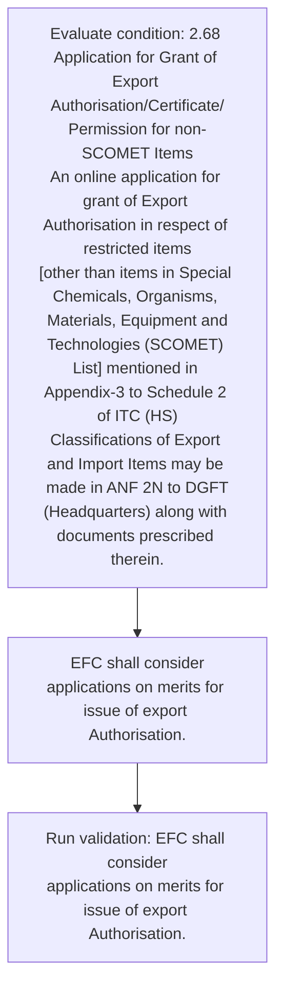

# Chapter 2 / Section 2.68: Application for Grant of Export Authorisation/Certificate/

**Chapter Title:** General Provisions Regarding Imports and Exports

**Pages:** 29

**Purpose:** 2.68 Application for Grant of Export Authorisation/Certificate/
Permission for non-SCOMET Items
An online application for grant of Export Authorisation in respect of restricted items
[other than items in Special Chemicals, Organisms, Materials, Equipment and
Technologies (SCOMET) List] mentioned in Appendix-3 to Schedule 2 of ITC (HS)
Classifications of Export and Import Items may be made in ANF 2N to DGFT
(Headquarters) along with documents prescribed therein.

**Purpose Thanglish:** Indha Application for Grant of Export Authorisation/Certificate/ section-la, 2.68 application for Grant of export Authorisation/Certificate/
Permission for non-SCOMET Items
An online application for grant of export Authorisation in respect of restricted items
[other than items in Special Chemicals, Organisms, Materials, Equipment and
Technologies (SCOMET) List] mentioned in Appendix-3 to Schedule 2 of ITC (HS)
Classifications of export and import Items may be made in ANF 2N to DGFT
(Headquarters) along with documents prescribed therein.

**Summary:** 2.68 Application for Grant of Export Authorisation/Certificate/
Permission for non-SCOMET Items
An online application for grant of Export Authorisation in respect of restricted items
[other than items in Special Chemicals, Organisms, Materials, Equipment and
Technologies (SCOMET) List] mentioned in Appendix-3 to Schedule 2 of ITC (HS)
Classifications of Export and Import Items may be made in ANF 2N to DGFT
(Headquarters) along with documents prescribed therein. EFC shall consider
applications on merits for issue of export Authorisation. EXPORT THROUGH STATE TRADING ENTERPRISES (STE)

**Business Meaning:** Application for Grant of Export Authorisation/Certificate/ governs how DGFT business controls should be applied, validated, and enforced.

**Business Explanation:** Application for Grant of Export Authorisation/Certificate/ explains the operating rule set that DEKAI should enforce. Key control points include EFC shall consider
applications on merits for issue of export Authorisation. The section also drives actions such as EFC shall consider
applications on merits for issue of export Authorisation..

**Business Explanation Thanglish:** Indha Application for Grant of Export Authorisation/Certificate/ section-la, application for Grant of export Authorisation/Certificate/ explains the operating rule set that DEKAI should enforce. Key control points include EFC kandippa consider
applications on merits for issue of export Authorisation. The section also drives actions such as EFC kandippa consider
applications on merits for issue of export Authorisation..

## Business Logic
- EFC shall consider
applications on merits for issue of export Authorisation.

## Business Rules
- rule_id=CH2-SEC2_68-R001, rule_description=EFC shall consider
applications on merits for issue of export Authorisation., trigger=Application for Grant of Export Authorisation/Certificate/, condition=2.68 Application for Grant of Export Authorisation/Certificate/
Permission for non-SCOMET Items
An online application for grant of Export Authorisation in respect of restricted items
[other than items in Special Chemicals, Organisms, Materials, Equipment and
Technologies (SCOMET) List] mentioned in Appendix-3 to Schedule 2 of ITC (HS)
Classifications of Export and Import Items may be made in ANF 2N to DGFT
(Headquarters) along with documents prescribed therein., validation=EFC shall consider
applications on merits for issue of export Authorisation., action=EFC shall consider
applications on merits for issue of export Authorisation., exception=No explicit exception found in uploaded documents., output=DEKAI should produce a compliance decision for 2.68 - Application for Grant of Export Authorisation/Certificate/.

## Conditions
- 2.68 Application for Grant of Export Authorisation/Certificate/
Permission for non-SCOMET Items
An online application for grant of Export Authorisation in respect of restricted items
[other than items in Special Chemicals, Organisms, Materials, Equipment and
Technologies (SCOMET) List] mentioned in Appendix-3 to Schedule 2 of ITC (HS)
Classifications of Export and Import Items may be made in ANF 2N to DGFT
(Headquarters) along with documents prescribed therein.

## Condition Logic
- id=2.2.68.1, if=2.68 Application for Grant of Export Authorisation/Certificate/
Permission for non-SCOMET Items
An online application for grant of Export Authorisation in respect of restricted items
[other than items in Special Chemicals, Organisms, Materials, Equipment and
Technologies (SCOMET) List] mentioned in Appendix-3 to Schedule 2 of ITC (HS)
Classifications of Export and Import Items may be made in ANF 2N to DGFT
(Headquarters) along with documents prescribed therein., then=EFC shall consider
applications on merits for issue of export Authorisation., source=2.68 Application for Grant of Export Authorisation/Certificate/
Permission for non-SCOMET Items
An online application for grant of Export Authorisation in respect of restricted items
[other than items in Special Chemicals, Organisms, Materials, Equipment and
Technologies (SCOMET) List] mentioned in Appendix-3 to Schedule 2 of ITC (HS)
Classifications of Export and Import Items may be made in ANF 2N to DGFT
(Headquarters) along with documents prescribed therein.

## Validations
- EFC shall consider
applications on merits for issue of export Authorisation.

## Exceptions
- None identified

## Dependencies
- None identified

## Authorities
- DGFT

## Required Documents
- Application for Grant of Export Authorisation/Certificate
- EFC shall consider
applications on merits for issue of export Authorisation.

## Timelines
- None identified

## Actions
- EFC shall consider
applications on merits for issue of export Authorisation.

## Workflow
- Evaluate condition: 2.68 Application for Grant of Export Authorisation/Certificate/
Permission for non-SCOMET Items
An online application for grant of Export Authorisation in respect of restricted items
[other than items in Special Chemicals, Organisms, Materials, Equipment and
Technologies (SCOMET) List] mentioned in Appendix-3 to Schedule 2 of ITC (HS)
Classifications of Export and Import Items may be made in ANF 2N to DGFT
(Headquarters) along with documents prescribed therein.
- EFC shall consider
applications on merits for issue of export Authorisation.
- Run validation: EFC shall consider
applications on merits for issue of export Authorisation.

## Workflow ASCII
```text
Application for Grant of Export Authorisation/Certificate/
Evaluate condition: 2.68 Application for Grant of Export Authorisation/Certificate/
Permission for non-SCOMET Items
An online application for grant of Export Authorisation in respect of restricted items
[other than items in Special Chemicals, Organisms, Materials, Equipment and
Technologies (SCOMET) List] mentioned in Appendix-3 to Schedule 2 of ITC (HS)
Classifications of Export and Import Items may be made in ANF 2N to DGFT
(Headquarters) along with documents prescribed therein.
   |
   v
EFC shall consider
applications on merits for issue of export Authorisation.
   |
   v
Run validation: EFC shall consider
applications on merits for issue of export Authorisation.
```

## Decision Tree
- IF 2.68 Application for Grant of Export Authorisation/Certificate/
Permission for non-SCOMET Items
An online application for grant of Export Authorisation in respect of restricted items
[other than items in Special Chemicals, Organisms, Materials, Equipment and
Technologies (SCOMET) List] mentioned in Appendix-3 to Schedule 2 of ITC (HS)
Classifications of Export and Import Items may be made in ANF 2N to DGFT
(Headquarters) along with documents prescribed therein. THEN EFC shall consider
applications on merits for issue of export Authorisation.

## Decision Tree ASCII
```text
Application for Grant of Export Authorisation/Certificate/ Decision
IF 2.68 Application for Grant of Export Authorisation/Certificate/
Permission for non-SCOMET Items
An online application for grant of Export Authorisation in respect of restricted items
[other than items in Special Chemicals, Organisms, Materials, Equipment and
Technologies (SCOMET) List] mentioned in Appendix-3 to Schedule 2 of ITC (HS)
Classifications of Export and Import Items may be made in ANF 2N to DGFT
(Headquarters) along with documents prescribed therein. THEN EFC shall consider
applications on merits for issue of export Authorisation.
```

## Examples
- User asks to process Application for Grant of Export Authorisation/Certificate/; the platform checks conditions, validations, and documents before action.

**Real-world Example:** Example: an importer or exporter invokes Application for Grant of Export Authorisation/Certificate/, submits Application for Grant of Export Authorisation/Certificate, EFC shall consider
applications on merits for issue of export Authorisation., and DEKAI uses the extracted rules to efc shall consider
applications on merits for issue of export authorisation..

**Real-world Example Thanglish:** Indha Application for Grant of Export Authorisation/Certificate/ section-la, Example: an importer or exporter invokes application for Grant of export Authorisation/Certificate/, submits application for Grant of export Authorisation/Certificate, EFC kandippa consider
applications on merits for issue of export Authorisation., and DEKAI uses the extracted rules to efc kandippa consider
applications on merits for issue of export authorisation..

## AI Rules
- IF detected context matches section rule THEN enforce: EFC shall consider
applications on merits for issue of export Authorisation.
- IF validations pass THEN recommend action: EFC shall consider
applications on merits for issue of export Authorisation.

## Database Fields
- name=section_code, type=string, required=True, source=parsed_section_heading
- name=section_title, type=string, required=True, source=parsed_section_heading
- name=for_flag, type=boolean, required=False, source=keyword:for
- name=and_flag, type=boolean, required=False, source=keyword:and
- name=itc_flag, type=boolean, required=False, source=keyword:ITC
- name=may_flag, type=boolean, required=False, source=keyword:may
- name=anf_flag, type=boolean, required=False, source=keyword:ANF
- name=efc_flag, type=boolean, required=False, source=keyword:EFC
- name=ste_flag, type=boolean, required=False, source=keyword:STE
- name=than_flag, type=boolean, required=False, source=keyword:than
- name=document_1_submitted, type=boolean, required=True, source=Application for Grant of Export Authorisation/Certificate
- name=document_2_submitted, type=boolean, required=True, source=EFC shall consider
applications on merits for issue of export Authorisation.

## API Requirements
- method=GET, path=/api/dgft/sections/2.68, purpose=Retrieve knowledge payload for section 2.68, query_params=['include=workflow,decision_tree,validations'], response_fields=['section', 'title', 'summary', 'conditions', 'validations', 'exceptions', 'workflow', 'decision_tree']
- method=POST, path=/api/dgft/Application-for-Grant-of-Export-Authorisation-Certificate/validate, purpose=Validate inputs and documents for Application for Grant of Export Authorisation/Certificate/, request_fields=['section_code', 'section_title', 'document_1_submitted', 'document_2_submitted'], response_fields=['status', 'errors', 'warnings', 'next_actions']
- method=POST, path=/api/dgft/Application-for-Grant-of-Export-Authorisation-Certificate/execute, purpose=Trigger business action for EFC shall consider
applications on merits for issue of export Authorisation., request_fields=['section_code', 'section_title', 'document_1_submitted', 'document_2_submitted'], response_fields=['reference_id', 'status', 'authority', 'timeline']

## UI Screens
- screen_id=Application_for_Grant_of_Export_Authorisation_Certificate_overview, name=Application for Grant of Export Authorisation/Certificate/ Overview, purpose=Show section summary, authority, timeline, and eligibility cues., widgets=['summary_card', 'conditions_table', 'authority_badges', 'timeline_panel']
- screen_id=Application_for_Grant_of_Export_Authorisation_Certificate_submission, name=Application for Grant of Export Authorisation/Certificate/ Submission, purpose=Capture applicant data and supporting documents., widgets=['dynamic_form', 'document_uploader', 'validation_panel', 'next_action_footer'], fields=['section_code', 'section_title', 'for_flag', 'and_flag', 'itc_flag', 'may_flag', 'anf_flag', 'efc_flag']

## Error Messages
- Validation failed because the section requirements were not fully met.

## FAQ
- question_en=What is the purpose of section 2.68?, answer_en=Application for Grant of Export Authorisation/Certificate/ explains the operating rule set that DEKAI should enforce. Key control points include EFC shall consider
applications on merits for issue of export Authorisation. The section also drives actions such as EFC shall consider
applications on merits for issue of export Authorisation.., question_thanglish=Indha Application for Grant of Export Authorisation/Certificate/ section-la, What is the purpose of section 2.68?, answer_thanglish=Indha Application for Grant of Export Authorisation/Certificate/ section-la, application for Grant of export Authorisation/Certificate/ explains the operating rule set that DEKAI should enforce. Key control points include EFC kandippa consider
applications on merits for issue of export Authorisation. The section also drives actions such as EFC kandippa consider
applications on merits for issue of export Authorisation..
- question_en=What documents are required under Application for Grant of Export Authorisation/Certificate/?, answer_en=Application for Grant of Export Authorisation/Certificate, EFC shall consider
applications on merits for issue of export Authorisation., question_thanglish=Indha Application for Grant of Export Authorisation/Certificate/ section-la, What documents are required under application for Grant of export Authorisation/Certificate/?, answer_thanglish=Indha Application for Grant of Export Authorisation/Certificate/ section-la, application for Grant of export Authorisation/Certificate, EFC kandippa consider
applications on merits for issue of export Authorisation.
- question_en=Which authority handles Application for Grant of Export Authorisation/Certificate/?, answer_en=DGFT, question_thanglish=Indha Application for Grant of Export Authorisation/Certificate/ section-la, Which authority handles application for Grant of export Authorisation/Certificate/?, answer_thanglish=Indha Application for Grant of Export Authorisation/Certificate/ section-la, DGFT

## Questions Users May Ask
- What does Application for Grant of Export Authorisation/Certificate/ require?
- Which documents are needed for Application for Grant of Export Authorisation/Certificate/?
- How does DEKAI validate Application for Grant of Export Authorisation/Certificate/ requests?
- What action should be taken for Application for Grant of Export Authorisation/Certificate/?

## Expected AI Answers
- Application for Grant of Export Authorisation/Certificate/ requires the platform to interpret the section text, apply the extracted business rules, and present the correct next action.
- Required documents are inferred from the section text: Application for Grant of Export Authorisation/Certificate, EFC shall consider
applications on merits for issue of export Authorisation.
- DEKAI validates Application for Grant of Export Authorisation/Certificate/ by checking conditions, required documents, authority references, and exception clauses before recommending an outcome.
- The primary extracted action is: EFC shall consider
applications on merits for issue of export Authorisation.

## AI Q&A Examples
- question_en=User asks: How do I comply with Application for Grant of Export Authorisation/Certificate/?, answer_en=AI answers: DEKAI should evaluate section 2.68, apply the extracted rules, and guide the user through Evaluate condition: 2.68 Application for Grant of Export Authorisation/Certificate/
Permission for non-SCOMET Items
An online application for grant of Export Authorisation in respect of restricted items
[other than items in Special Chemicals, Organisms, Materials, Equipment and
Technologies (SCOMET) List] mentioned in Appendix-3 to Schedule 2 of ITC (HS)
Classifications of Export and Import Items may be made in ANF 2N to DGFT
(Headquarters) along with documents prescribed therein.., question_thanglish=Indha Application for Grant of Export Authorisation/Certificate/ section-la, User asks: How do I comply with application for Grant of export Authorisation/Certificate/?, answer_thanglish=Indha Application for Grant of Export Authorisation/Certificate/ section-la, AI answers: DEKAI should evaluate section 2.68, apply the extracted rules, and guide the user through Evaluate condition: 2.68 application for Grant of export Authorisation/Certificate/
Permission for non-SCOMET Items
An online application for grant of export Authorisation in respect of restricted items
[other than items in Special Chemicals, Organisms, Materials, Equipment and
Technologies (SCOMET) List] mentioned in Appendix-3 to Schedule 2 of ITC (HS)
Classifications of export and import Items may be made in ANF 2N to DGFT
(Headquarters) along with documents prescribed therein..
- question_en=User asks: Which validations apply to Application for Grant of Export Authorisation/Certificate/?, answer_en=AI answers: Applicable validations are EFC shall consider
applications on merits for issue of export Authorisation., question_thanglish=Indha Application for Grant of Export Authorisation/Certificate/ section-la, User asks: Which validations apply to application for Grant of export Authorisation/Certificate/?, answer_thanglish=Indha Application for Grant of Export Authorisation/Certificate/ section-la, AI answers: Applicable validations are EFC kandippa consider
applications on merits for issue of export Authorisation.

## DEKAI AI Implementation Notes
- Capture chapter 2, section 2.68, title, and page references as immutable knowledge metadata.
- Bind validations for Application for Grant of Export Authorisation/Certificate/ into a rule engine keyed by the rule IDs extracted for this section.
- Expose document upload controls for: Application for Grant of Export Authorisation/Certificate, EFC shall consider
applications on merits for issue of export Authorisation..
- Route escalations or approvals to: DGFT.

## DEKAI AI Implementation Notes Thanglish
- Indha Application for Grant of Export Authorisation/Certificate/ section-la, Capture chapter 2, section 2.68, title, and page references as immutable knowledge metadata.
- Indha Application for Grant of Export Authorisation/Certificate/ section-la, Bind validations for application for Grant of export Authorisation/Certificate/ into a rule engine keyed by the rule IDs extracted for this section.
- Indha Application for Grant of Export Authorisation/Certificate/ section-la, Expose document upload controls for: application for Grant of export Authorisation/Certificate, EFC kandippa consider
applications on merits for issue of export Authorisation..
- Indha Application for Grant of Export Authorisation/Certificate/ section-la, Route escalations or approvals to: DGFT.

## AI Metadata
- Keywords: for, and, ITC, may, ANF, EFC, STE, than, List, made, DGFT, with, Grant, Items, other, along, shall, issue, STATE, Export
- Search Keywords: for, and, ITC, may, ANF, EFC, STE, than, List, made, DGFT, with, Grant, Items, other, along, shall, issue, STATE, Export
- Intent: Support Application for Grant of Export Authorisation/Certificate/ processing and compliance validation.
- Tags: 2.68, Application for Grant of Export Authorisation/Certificate/, business-rule, document-driven, dgft
- Related Sections: 
- Related Chapters: 
- Related Rules: EFC shall consider
applications on merits for issue of export Authorisation.

## Mermaid


## PlantUML
```plantuml
@startuml
start
:Evaluate condition\: 2.68 Application for Grant of Export Authorisation/Certificate/
Permission for non-SCOMET Items
An online application for grant of Export Authorisation in respect of restricted items
[other than items in Special Chemicals, Organisms, Materials, Equipment and
Technologies (SCOMET) List] mentioned in Appendix-3 to Schedule 2 of ITC (HS)
Classifications of Export and Import Items may be made in ANF 2N to DGFT
(Headquarters) along with documents prescribed therein.;
:EFC shall consider
applications on merits for issue of export Authorisation.;
:Run validation\: EFC shall consider
applications on merits for issue of export Authorisation.;
stop
@enduml
```
