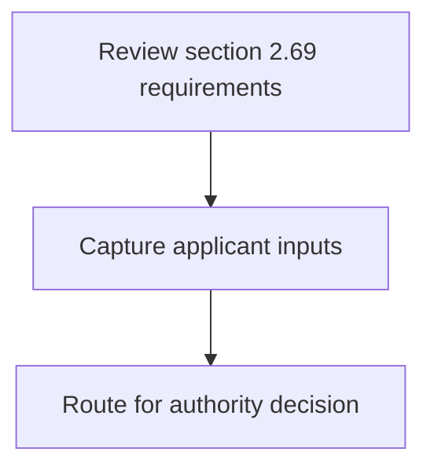
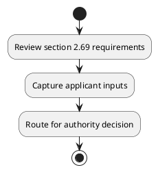

# Chapter 2 / Section 2.69: Export of Items under (STE)

**Chapter Title:** General Provisions Regarding Imports and Exports

**Pages:** 29

**Purpose:** 2.69 Export of Items under (STE)
An application under ANF 2N for export of items mentioned in ITC (HS) under STE
regime may be made online to DGFT Hqrs as per paragraph 2.21 of FTP.

**Purpose Thanglish:** Indha Export of Items under (STE) section-la, 2.69 export of Items under (STE)
An application under ANF 2N for export of items mentioned in ITC (HS) under STE
regime may be made online to DGFT Hqrs as per paragraph 2.21 of FTP.

**Summary:** 2.69 Export of Items under (STE)
An application under ANF 2N for export of items mentioned in ITC (HS) under STE
regime may be made online to DGFT Hqrs as per paragraph 2.21 of FTP. PROVISIONS FOR EXPORTERS/OTHER PROVISIONS FOR DOING TRADE AND
BUSINESS

**Business Meaning:** 2.69 Export of Items under (STE)
An application under ANF 2N for export of items mentioned in ITC (HS) under STE
regime may be made online to DGFT Hqrs as per paragraph 2.21 of FTP.

**Business Explanation:** 2.69 Export of Items under (STE)
An application under ANF 2N for export of items mentioned in ITC (HS) under STE
regime may be made online to DGFT Hqrs as per paragraph 2.21 of FTP. PROVISIONS FOR EXPORTERS/OTHER PROVISIONS FOR DOING TRADE AND
BUSINESS

**Business Explanation Thanglish:** Indha Export of Items under (STE) section-la, 2.69 export of Items under (STE)
An application under ANF 2N for export of items mentioned in ITC (HS) under STE
regime may be made online to DGFT Hqrs as per paragraph 2.21 of FTP. PROVISIONS FOR EXPORTERS/OTHER PROVISIONS FOR DOING TRADE AND
BUSINESS

## Business Logic
- None identified

## Business Rules
- rule_id=CH2-SEC2_69-R001, rule_description=2.69 Export of Items under (STE)
An application under ANF 2N for export of items mentioned in ITC (HS) under STE
regime may be made online to DGFT Hqrs as per paragraph 2.21 of FTP. PROVISIONS FOR EXPORTERS/OTHER PROVISIONS FOR DOING TRADE AND
BUSINESS, trigger=Export of Items under (STE), condition=Not explicitly covered in uploaded documents., validation=Not explicitly covered in uploaded documents., action=Manual review required., exception=No explicit exception found in uploaded documents., output=DEKAI should produce a compliance decision for 2.69 - Export of Items under (STE).

## Conditions
- None identified

## Condition Logic
- None identified

## Validations
- None identified

## Exceptions
- None identified

## Dependencies
- 2.21

## Authorities
- DGFT

## Required Documents
- 2.69 Export of Items under (STE)
An application under ANF 2N for export of items mentioned in ITC (HS) under STE
regime may be made online to DGFT Hqrs as per paragraph 2.21 of FTP.

## Timelines
- None identified

## Actions
- None identified

## Workflow
- Review section 2.69 requirements
- Capture applicant inputs
- Route for authority decision

## Workflow ASCII
```text
Export of Items under (STE)
Review section 2.69 requirements
   |
   v
Capture applicant inputs
   |
   v
Route for authority decision
```

## Decision Tree
- IF section 2.69 applies THEN proceed with standard DGFT workflow

## Decision Tree ASCII
```text
Export of Items under (STE) Decision
IF section 2.69 applies THEN proceed with standard DGFT workflow
```

## Examples
- User asks to process Export of Items under (STE); the platform checks conditions, validations, and documents before action.

**Real-world Example:** Example: an importer or exporter invokes Export of Items under (STE), submits 2.69 Export of Items under (STE)
An application under ANF 2N for export of items mentioned in ITC (HS) under STE
regime may be made online to DGFT Hqrs as per paragraph 2.21 of FTP., and DEKAI uses the extracted rules to follow the export of items under (ste) process.

**Real-world Example Thanglish:** Indha Export of Items under (STE) section-la, Example: an importer or exporter invokes export of Items under (STE), submits 2.69 export of Items under (STE)
An application under ANF 2N for export of items mentioned in ITC (HS) under STE
regime may be made online to DGFT Hqrs as per paragraph 2.21 of FTP., and DEKAI uses the extracted rules to follow the export of items under (ste) process.

## AI Rules
- None identified

## Database Fields
- name=section_code, type=string, required=True, source=parsed_section_heading
- name=section_title, type=string, required=True, source=parsed_section_heading
- name=ste_flag, type=boolean, required=False, source=keyword:STE
- name=anf_flag, type=boolean, required=False, source=keyword:ANF
- name=for_flag, type=boolean, required=False, source=keyword:for
- name=itc_flag, type=boolean, required=False, source=keyword:ITC
- name=may_flag, type=boolean, required=False, source=keyword:may
- name=per_flag, type=boolean, required=False, source=keyword:per
- name=ftp_flag, type=boolean, required=False, source=keyword:FTP
- name=and_flag, type=boolean, required=False, source=keyword:AND
- name=document_1_submitted, type=boolean, required=True, source=2.69 Export of Items under (STE)
An application under ANF 2N for export of items mentioned in ITC (HS) under STE
regime may be made online to DGFT Hqrs as per paragraph 2.21 of FTP.

## API Requirements
- method=GET, path=/api/dgft/sections/2.69, purpose=Retrieve knowledge payload for section 2.69, query_params=['include=workflow,decision_tree,validations'], response_fields=['section', 'title', 'summary', 'conditions', 'validations', 'exceptions', 'workflow', 'decision_tree']
- method=POST, path=/api/dgft/Export-of-Items-under-STE/validate, purpose=Validate inputs and documents for Export of Items under (STE), request_fields=['section_code', 'section_title', 'document_1_submitted'], response_fields=['status', 'errors', 'warnings', 'next_actions']

## UI Screens
- screen_id=Export_of_Items_under_STE_overview, name=Export of Items under (STE) Overview, purpose=Show section summary, authority, timeline, and eligibility cues., widgets=['summary_card', 'conditions_table', 'authority_badges', 'timeline_panel']
- screen_id=Export_of_Items_under_STE_submission, name=Export of Items under (STE) Submission, purpose=Capture applicant data and supporting documents., widgets=['dynamic_form', 'document_uploader', 'validation_panel', 'next_action_footer'], fields=['section_code', 'section_title', 'ste_flag', 'anf_flag', 'for_flag', 'itc_flag', 'may_flag', 'per_flag']

## Error Messages
- Validation failed because the section requirements were not fully met.

## FAQ
- question_en=What is the purpose of section 2.69?, answer_en=2.69 Export of Items under (STE)
An application under ANF 2N for export of items mentioned in ITC (HS) under STE
regime may be made online to DGFT Hqrs as per paragraph 2.21 of FTP. PROVISIONS FOR EXPORTERS/OTHER PROVISIONS FOR DOING TRADE AND
BUSINESS, question_thanglish=Indha Export of Items under (STE) section-la, What is the purpose of section 2.69?, answer_thanglish=Indha Export of Items under (STE) section-la, 2.69 export of Items under (STE)
An application under ANF 2N for export of items mentioned in ITC (HS) under STE
regime may be made online to DGFT Hqrs as per paragraph 2.21 of FTP. PROVISIONS FOR EXPORTERS/OTHER PROVISIONS FOR DOING TRADE AND
BUSINESS
- question_en=What documents are required under Export of Items under (STE)?, answer_en=2.69 Export of Items under (STE)
An application under ANF 2N for export of items mentioned in ITC (HS) under STE
regime may be made online to DGFT Hqrs as per paragraph 2.21 of FTP., question_thanglish=Indha Export of Items under (STE) section-la, What documents are required under export of Items under (STE)?, answer_thanglish=Indha Export of Items under (STE) section-la, 2.69 export of Items under (STE)
An application under ANF 2N for export of items mentioned in ITC (HS) under STE
regime may be made online to DGFT Hqrs as per paragraph 2.21 of FTP.
- question_en=Which authority handles Export of Items under (STE)?, answer_en=DGFT, question_thanglish=Indha Export of Items under (STE) section-la, Which authority handles export of Items under (STE)?, answer_thanglish=Indha Export of Items under (STE) section-la, DGFT

## Questions Users May Ask
- What does Export of Items under (STE) require?
- Which documents are needed for Export of Items under (STE)?
- How does DEKAI validate Export of Items under (STE) requests?

## Expected AI Answers
- Export of Items under (STE) requires the platform to interpret the section text, apply the extracted business rules, and present the correct next action.
- Required documents are inferred from the section text: 2.69 Export of Items under (STE)
An application under ANF 2N for export of items mentioned in ITC (HS) under STE
regime may be made online to DGFT Hqrs as per paragraph 2.21 of FTP.
- DEKAI validates Export of Items under (STE) by checking conditions, required documents, authority references, and exception clauses before recommending an outcome.

## AI Q&A Examples
- question_en=User asks: How do I comply with Export of Items under (STE)?, answer_en=AI answers: DEKAI should evaluate section 2.69, apply the extracted rules, and guide the user through Review section 2.69 requirements., question_thanglish=Indha Export of Items under (STE) section-la, User asks: How do I comply with export of Items under (STE)?, answer_thanglish=Indha Export of Items under (STE) section-la, AI answers: DEKAI should evaluate section 2.69, apply the extracted rules, and guide the user through Review section 2.69 requirements.
- question_en=User asks: Which validations apply to Export of Items under (STE)?, answer_en=AI answers: Applicable validations are not explicitly covered in the uploaded documents., question_thanglish=Indha Export of Items under (STE) section-la, User asks: Which validations apply to export of Items under (STE)?, answer_thanglish=Indha Export of Items under (STE) section-la, AI answers: Applicable validations are not explicitly covered in the uploaded documents.

## DEKAI AI Implementation Notes
- Capture chapter 2, section 2.69, title, and page references as immutable knowledge metadata.
- Bind validations for Export of Items under (STE) into a rule engine keyed by the rule IDs extracted for this section.
- Expose document upload controls for: 2.69 Export of Items under (STE)
An application under ANF 2N for export of items mentioned in ITC (HS) under STE
regime may be made online to DGFT Hqrs as per paragraph 2.21 of FTP..
- Route escalations or approvals to: DGFT.
- Show contextual links to related sections: 2.21.

## DEKAI AI Implementation Notes Thanglish
- Indha Export of Items under (STE) section-la, Capture chapter 2, section 2.69, title, and page references as immutable knowledge metadata.
- Indha Export of Items under (STE) section-la, Bind validations for export of Items under (STE) into a rule engine keyed by the rule IDs extracted for this section.
- Indha Export of Items under (STE) section-la, Expose document upload controls for: 2.69 export of Items under (STE)
An application under ANF 2N for export of items mentioned in ITC (HS) under STE
regime may be made online to DGFT Hqrs as per paragraph 2.21 of FTP..
- Indha Export of Items under (STE) section-la, Route escalations or approvals to: DGFT.
- Indha Export of Items under (STE) section-la, Show contextual links to related sections: 2.21.

## AI Metadata
- Keywords: STE, ANF, for, ITC, may, per, FTP, AND, made, DGFT, Hqrs, Items, under, DOING, TRADE, Export, regime, online, BUSINESS, mentioned
- Search Keywords: STE, ANF, for, ITC, may, per, FTP, AND, made, DGFT, Hqrs, Items, under, DOING, TRADE, Export, regime, online, BUSINESS, mentioned
- Intent: Provide knowledge guidance for Export of Items under (STE).
- Tags: 2.69, Export of Items under (STE), document-driven, dgft
- Related Sections: 2.21
- Related Chapters: 
- Related Rules: 

## Mermaid


## PlantUML

