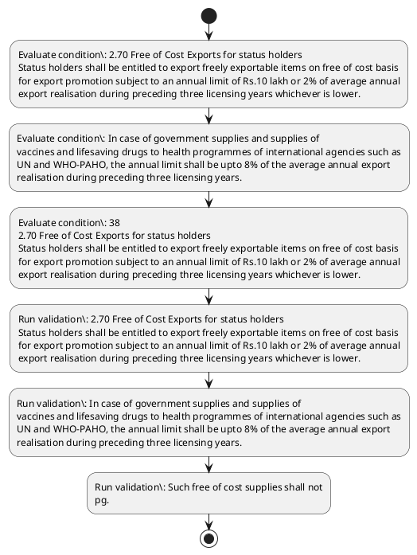

# Chapter 2 / Section 2.70: Free of Cost Exports for status holders

**Chapter Title:** General Provisions Regarding Imports and Exports

**Pages:** 29, 30

**Purpose:** 2.70 Free of Cost Exports for status holders
Status holders shall be entitled to export freely exportable items on free of cost basis
for export promotion subject to an annual limit of Rs.10 lakh or 2% of average annual
export realisation during preceding three licensing years whichever is lower.

**Purpose Thanglish:** Indha Free of Cost Exports for status holders section-la, 2.70 Free of Cost Exports for status holders
Status holders kandippa be entitled to export freely exportable items on free of cost basis
for export promotion subject to an annual limit of Rs.10 lakh or 2% of average annual
export realisation during preceding three licensing years whichever is lower.

**Summary:** 2.70 Free of Cost Exports for status holders
Status holders shall be entitled to export freely exportable items on free of cost basis
for export promotion subject to an annual limit of Rs.10 lakh or 2% of average annual
export realisation during preceding three licensing years whichever is lower. For
Pharma exports, the annual limit would be 2% of the annual export realisation during
preceding three licensing years. In case of government supplies and supplies of
vaccines and lifesaving drugs to health programmes of international agencies such as
UN and WHO-PAHO, the annual limit shall be upto 8% of the average annual export
realisation during preceding three licensing years.

**Business Meaning:** Free of Cost Exports for status holders governs how DGFT business controls should be applied, validated, and enforced.

**Business Explanation:** Free of Cost Exports for status holders explains the operating rule set that DEKAI should enforce. Key control points include 2.70 Free of Cost Exports for status holders
Status holders shall be entitled to export freely exportable items on free of cost basis
for export promotion subject to an annual limit of Rs.10 lakh or 2% of average annual
export realisation during preceding three licensing years whichever is lower.

**Business Explanation Thanglish:** Indha Free of Cost Exports for status holders section-la, Free of Cost Exports for status holders explains the operating rule set that DEKAI should enforce. Key control points include 2.70 Free of Cost Exports for status holders
Status holders kandippa be entitled to export freely exportable items on free of cost basis
for export promotion subject to an annual limit of Rs.10 lakh or 2% of average annual
export realisation during preceding three licensing years whichever is lower.

## Business Logic
- 2.70 Free of Cost Exports for status holders
Status holders shall be entitled to export freely exportable items on free of cost basis
for export promotion subject to an annual limit of Rs.10 lakh or 2% of average annual
export realisation during preceding three licensing years whichever is lower.
- In case of government supplies and supplies of
vaccines and lifesaving drugs to health programmes of international agencies such as
UN and WHO-PAHO, the annual limit shall be upto 8% of the average annual export
realisation during preceding three licensing years.
- Such free of cost supplies shall not
pg.
- 38
2.70 Free of Cost Exports for status holders
Status holders shall be entitled to export freely exportable items on free of cost basis
for export promotion subject to an annual limit of Rs.10 lakh or 2% of average annual
export realisation during preceding three licensing years whichever is lower.

## Business Rules
- rule_id=CH2-SEC2_70-R001, rule_description=2.70 Free of Cost Exports for status holders
Status holders shall be entitled to export freely exportable items on free of cost basis
for export promotion subject to an annual limit of Rs.10 lakh or 2% of average annual
export realisation during preceding three licensing years whichever is lower., trigger=Free of Cost Exports for status holders, condition=2.70 Free of Cost Exports for status holders
Status holders shall be entitled to export freely exportable items on free of cost basis
for export promotion subject to an annual limit of Rs.10 lakh or 2% of average annual
export realisation during preceding three licensing years whichever is lower., validation=2.70 Free of Cost Exports for status holders
Status holders shall be entitled to export freely exportable items on free of cost basis
for export promotion subject to an annual limit of Rs.10 lakh or 2% of average annual
export realisation during preceding three licensing years whichever is lower., action=Manual review required., exception=No explicit exception found in uploaded documents., output=DEKAI should produce a compliance decision for 2.70 - Free of Cost Exports for status holders.
- rule_id=CH2-SEC2_70-R002, rule_description=In case of government supplies and supplies of
vaccines and lifesaving drugs to health programmes of international agencies such as
UN and WHO-PAHO, the annual limit shall be upto 8% of the average annual export
realisation during preceding three licensing years., trigger=Free of Cost Exports for status holders, condition=In case of government supplies and supplies of
vaccines and lifesaving drugs to health programmes of international agencies such as
UN and WHO-PAHO, the annual limit shall be upto 8% of the average annual export
realisation during preceding three licensing years., validation=In case of government supplies and supplies of
vaccines and lifesaving drugs to health programmes of international agencies such as
UN and WHO-PAHO, the annual limit shall be upto 8% of the average annual export
realisation during preceding three licensing years., action=Manual review required., exception=No explicit exception found in uploaded documents., output=DEKAI should produce a compliance decision for 2.70 - Free of Cost Exports for status holders.
- rule_id=CH2-SEC2_70-R003, rule_description=Such free of cost supplies shall not
pg., trigger=Free of Cost Exports for status holders, condition=38
2.70 Free of Cost Exports for status holders
Status holders shall be entitled to export freely exportable items on free of cost basis
for export promotion subject to an annual limit of Rs.10 lakh or 2% of average annual
export realisation during preceding three licensing years whichever is lower., validation=Such free of cost supplies shall not
pg., action=Manual review required., exception=No explicit exception found in uploaded documents., output=DEKAI should produce a compliance decision for 2.70 - Free of Cost Exports for status holders.
- rule_id=CH2-SEC2_70-R004, rule_description=38
2.70 Free of Cost Exports for status holders
Status holders shall be entitled to export freely exportable items on free of cost basis
for export promotion subject to an annual limit of Rs.10 lakh or 2% of average annual
export realisation during preceding three licensing years whichever is lower., trigger=Free of Cost Exports for status holders, condition=38
2.70 Free of Cost Exports for status holders
Status holders shall be entitled to export freely exportable items on free of cost basis
for export promotion subject to an annual limit of Rs.10 lakh or 2% of average annual
export realisation during preceding three licensing years whichever is lower., validation=38
2.70 Free of Cost Exports for status holders
Status holders shall be entitled to export freely exportable items on free of cost basis
for export promotion subject to an annual limit of Rs.10 lakh or 2% of average annual
export realisation during preceding three licensing years whichever is lower., action=Manual review required., exception=No explicit exception found in uploaded documents., output=DEKAI should produce a compliance decision for 2.70 - Free of Cost Exports for status holders.

## Conditions
- 2.70 Free of Cost Exports for status holders
Status holders shall be entitled to export freely exportable items on free of cost basis
for export promotion subject to an annual limit of Rs.10 lakh or 2% of average annual
export realisation during preceding three licensing years whichever is lower.
- In case of government supplies and supplies of
vaccines and lifesaving drugs to health programmes of international agencies such as
UN and WHO-PAHO, the annual limit shall be upto 8% of the average annual export
realisation during preceding three licensing years.
- 38
2.70 Free of Cost Exports for status holders
Status holders shall be entitled to export freely exportable items on free of cost basis
for export promotion subject to an annual limit of Rs.10 lakh or 2% of average annual
export realisation during preceding three licensing years whichever is lower.

## Condition Logic
- id=2.2.70.1, if=2.70 Free of Cost Exports for status holders
Status holders shall be entitled to export freely exportable items on free of cost basis
for export promotion subject to an annual limit of Rs.10 lakh or 2% of average annual
export realisation during preceding three licensing years whichever is lower., then=Route for review, source=2.70 Free of Cost Exports for status holders
Status holders shall be entitled to export freely exportable items on free of cost basis
for export promotion subject to an annual limit of Rs.10 lakh or 2% of average annual
export realisation during preceding three licensing years whichever is lower.
- id=2.2.70.2, if=In case of government supplies and supplies of
vaccines and lifesaving drugs to health programmes of international agencies such as
UN and WHO-PAHO, the annual limit shall be upto 8% of the average annual export
realisation during preceding three licensing years., then=Route for review, source=In case of government supplies and supplies of
vaccines and lifesaving drugs to health programmes of international agencies such as
UN and WHO-PAHO, the annual limit shall be upto 8% of the average annual export
realisation during preceding three licensing years.
- id=2.2.70.3, if=38
2.70 Free of Cost Exports for status holders
Status holders shall be entitled to export freely exportable items on free of cost basis
for export promotion subject to an annual limit of Rs.10 lakh or 2% of average annual
export realisation during preceding three licensing years whichever is lower., then=Route for review, source=38
2.70 Free of Cost Exports for status holders
Status holders shall be entitled to export freely exportable items on free of cost basis
for export promotion subject to an annual limit of Rs.10 lakh or 2% of average annual
export realisation during preceding three licensing years whichever is lower.

## Validations
- 2.70 Free of Cost Exports for status holders
Status holders shall be entitled to export freely exportable items on free of cost basis
for export promotion subject to an annual limit of Rs.10 lakh or 2% of average annual
export realisation during preceding three licensing years whichever is lower.
- In case of government supplies and supplies of
vaccines and lifesaving drugs to health programmes of international agencies such as
UN and WHO-PAHO, the annual limit shall be upto 8% of the average annual export
realisation during preceding three licensing years.
- Such free of cost supplies shall not
pg.
- 38
2.70 Free of Cost Exports for status holders
Status holders shall be entitled to export freely exportable items on free of cost basis
for export promotion subject to an annual limit of Rs.10 lakh or 2% of average annual
export realisation during preceding three licensing years whichever is lower.

## Exceptions
- None identified

## Dependencies
- 1

## Authorities
- None identified

## Required Documents
- None identified

## Timelines
- 2.70 Free of Cost Exports for status holders
Status holders shall be entitled to export freely exportable items on free of cost basis
for export promotion subject to an annual limit of Rs.10 lakh or 2% of average annual
export realisation during preceding three licensing years whichever is lower.
- For
Pharma exports, the annual limit would be 2% of the annual export realisation during
preceding three licensing years.
- In case of government supplies and supplies of
vaccines and lifesaving drugs to health programmes of international agencies such as
UN and WHO-PAHO, the annual limit shall be upto 8% of the average annual export
realisation during preceding three licensing years.
- 38
2.70 Free of Cost Exports for status holders
Status holders shall be entitled to export freely exportable items on free of cost basis
for export promotion subject to an annual limit of Rs.10 lakh or 2% of average annual
export realisation during preceding three licensing years whichever is lower.

## Actions
- None identified

## Workflow
- Evaluate condition: 2.70 Free of Cost Exports for status holders
Status holders shall be entitled to export freely exportable items on free of cost basis
for export promotion subject to an annual limit of Rs.10 lakh or 2% of average annual
export realisation during preceding three licensing years whichever is lower.
- Evaluate condition: In case of government supplies and supplies of
vaccines and lifesaving drugs to health programmes of international agencies such as
UN and WHO-PAHO, the annual limit shall be upto 8% of the average annual export
realisation during preceding three licensing years.
- Evaluate condition: 38
2.70 Free of Cost Exports for status holders
Status holders shall be entitled to export freely exportable items on free of cost basis
for export promotion subject to an annual limit of Rs.10 lakh or 2% of average annual
export realisation during preceding three licensing years whichever is lower.
- Run validation: 2.70 Free of Cost Exports for status holders
Status holders shall be entitled to export freely exportable items on free of cost basis
for export promotion subject to an annual limit of Rs.10 lakh or 2% of average annual
export realisation during preceding three licensing years whichever is lower.
- Run validation: In case of government supplies and supplies of
vaccines and lifesaving drugs to health programmes of international agencies such as
UN and WHO-PAHO, the annual limit shall be upto 8% of the average annual export
realisation during preceding three licensing years.
- Run validation: Such free of cost supplies shall not
pg.

## Workflow ASCII
```text
Free of Cost Exports for status holders
Evaluate condition: 2.70 Free of Cost Exports for status holders
Status holders shall be entitled to export freely exportable items on free of cost basis
for export promotion subject to an annual limit of Rs.10 lakh or 2% of average annual
export realisation during preceding three licensing years whichever is lower.
   |
   v
Evaluate condition: In case of government supplies and supplies of
vaccines and lifesaving drugs to health programmes of international agencies such as
UN and WHO-PAHO, the annual limit shall be upto 8% of the average annual export
realisation during preceding three licensing years.
   |
   v
Evaluate condition: 38
2.70 Free of Cost Exports for status holders
Status holders shall be entitled to export freely exportable items on free of cost basis
for export promotion subject to an annual limit of Rs.10 lakh or 2% of average annual
export realisation during preceding three licensing years whichever is lower.
   |
   v
Run validation: 2.70 Free of Cost Exports for status holders
Status holders shall be entitled to export freely exportable items on free of cost basis
for export promotion subject to an annual limit of Rs.10 lakh or 2% of average annual
export realisation during preceding three licensing years whichever is lower.
   |
   v
Run validation: In case of government supplies and supplies of
vaccines and lifesaving drugs to health programmes of international agencies such as
UN and WHO-PAHO, the annual limit shall be upto 8% of the average annual export
realisation during preceding three licensing years.
   |
   v
Run validation: Such free of cost supplies shall not
pg.
```

## Decision Tree
- IF section 2.70 applies THEN proceed with standard DGFT workflow

## Decision Tree ASCII
```text
Free of Cost Exports for status holders Decision
IF section 2.70 applies THEN proceed with standard DGFT workflow
```

## Examples
- In case of government supplies and supplies of
vaccines and lifesaving drugs to health programmes of international agencies such as
UN and WHO-PAHO, the annual limit shall be upto 8% of the average annual export
realisation during preceding three licensing years.

**Real-world Example:** Example: an importer or exporter invokes Free of Cost Exports for status holders, submits the prescribed DGFT records, and DEKAI uses the extracted rules to follow the free of cost exports for status holders process.

**Real-world Example Thanglish:** Indha Free of Cost Exports for status holders section-la, Example: an importer or exporter invokes Free of Cost Exports for status holders, submits the prescribed DGFT records, and DEKAI uses the extracted rules to follow the free of cost exports for status holders process.

## AI Rules
- IF detected context matches section rule THEN enforce: 2.70 Free of Cost Exports for status holders
Status holders shall be entitled to export freely exportable items on free of cost basis
for export promotion subject to an annual limit of Rs.10 lakh or 2% of average annual
export realisation during preceding three licensing years whichever is lower.
- IF detected context matches section rule THEN enforce: In case of government supplies and supplies of
vaccines and lifesaving drugs to health programmes of international agencies such as
UN and WHO-PAHO, the annual limit shall be upto 8% of the average annual export
realisation during preceding three licensing years.
- IF detected context matches section rule THEN enforce: Such free of cost supplies shall not
pg.
- IF detected context matches section rule THEN enforce: 38
2.70 Free of Cost Exports for status holders
Status holders shall be entitled to export freely exportable items on free of cost basis
for export promotion subject to an annual limit of Rs.10 lakh or 2% of average annual
export realisation during preceding three licensing years whichever is lower.

## Database Fields
- name=section_code, type=string, required=True, source=parsed_section_heading
- name=section_title, type=string, required=True, source=parsed_section_heading
- name=for_flag, type=boolean, required=False, source=keyword:for
- name=the_flag, type=boolean, required=False, source=keyword:the
- name=and_flag, type=boolean, required=False, source=keyword:and
- name=not_flag, type=boolean, required=False, source=keyword:not
- name=any_flag, type=boolean, required=False, source=keyword:any
- name=free_flag, type=boolean, required=False, source=keyword:Free
- name=cost_flag, type=boolean, required=False, source=keyword:Cost
- name=lakh_flag, type=boolean, required=False, source=keyword:lakh

## API Requirements
- method=GET, path=/api/dgft/sections/2.70, purpose=Retrieve knowledge payload for section 2.70, query_params=['include=workflow,decision_tree,validations'], response_fields=['section', 'title', 'summary', 'conditions', 'validations', 'exceptions', 'workflow', 'decision_tree']
- method=POST, path=/api/dgft/Free-of-Cost-Exports-for-status-holders/validate, purpose=Validate inputs and documents for Free of Cost Exports for status holders, request_fields=['section_code', 'section_title'], response_fields=['status', 'errors', 'warnings', 'next_actions']

## UI Screens
- screen_id=Free_of_Cost_Exports_for_status_holders_overview, name=Free of Cost Exports for status holders Overview, purpose=Show section summary, authority, timeline, and eligibility cues., widgets=['summary_card', 'conditions_table', 'authority_badges', 'timeline_panel']
- screen_id=Free_of_Cost_Exports_for_status_holders_submission, name=Free of Cost Exports for status holders Submission, purpose=Capture applicant data and supporting documents., widgets=['dynamic_form', 'document_uploader', 'validation_panel', 'next_action_footer'], fields=['section_code', 'section_title', 'for_flag', 'the_flag', 'and_flag', 'not_flag', 'any_flag', 'free_flag']

## Error Messages
- Validation failed because the section requirements were not fully met.

## FAQ
- question_en=What is the purpose of section 2.70?, answer_en=Free of Cost Exports for status holders explains the operating rule set that DEKAI should enforce. Key control points include 2.70 Free of Cost Exports for status holders
Status holders shall be entitled to export freely exportable items on free of cost basis
for export promotion subject to an annual limit of Rs.10 lakh or 2% of average annual
export realisation during preceding three licensing years whichever is lower., question_thanglish=Indha Free of Cost Exports for status holders section-la, What is the purpose of section 2.70?, answer_thanglish=Indha Free of Cost Exports for status holders section-la, Free of Cost Exports for status holders explains the operating rule set that DEKAI should enforce. Key control points include 2.70 Free of Cost Exports for status holders
Status holders kandippa be entitled to export freely exportable items on free of cost basis
for export promotion subject to an annual limit of Rs.10 lakh or 2% of average annual
export realisation during preceding three licensing years whichever is lower.
- question_en=What documents are required under Free of Cost Exports for status holders?, answer_en=Not explicitly covered in uploaded documents., question_thanglish=Indha Free of Cost Exports for status holders section-la, What documents are required under Free of Cost Exports for status holders?, answer_thanglish=Indha Free of Cost Exports for status holders section-la, Not explicitly covered in uploaded documents.
- question_en=Which authority handles Free of Cost Exports for status holders?, answer_en=Not explicitly covered in uploaded documents., question_thanglish=Indha Free of Cost Exports for status holders section-la, Which authority handles Free of Cost Exports for status holders?, answer_thanglish=Indha Free of Cost Exports for status holders section-la, Not explicitly covered in uploaded documents.

## Questions Users May Ask
- What does Free of Cost Exports for status holders require?
- Which documents are needed for Free of Cost Exports for status holders?
- How does DEKAI validate Free of Cost Exports for status holders requests?

## Expected AI Answers
- Free of Cost Exports for status holders requires the platform to interpret the section text, apply the extracted business rules, and present the correct next action.
- Required documents are inferred from the section text: no explicit documents were detected.
- DEKAI validates Free of Cost Exports for status holders by checking conditions, required documents, authority references, and exception clauses before recommending an outcome.

## AI Q&A Examples
- question_en=User asks: How do I comply with Free of Cost Exports for status holders?, answer_en=AI answers: DEKAI should evaluate section 2.70, apply the extracted rules, and guide the user through Evaluate condition: 2.70 Free of Cost Exports for status holders
Status holders shall be entitled to export freely exportable items on free of cost basis
for export promotion subject to an annual limit of Rs.10 lakh or 2% of average annual
export realisation during preceding three licensing years whichever is lower.., question_thanglish=Indha Free of Cost Exports for status holders section-la, User asks: How do I comply with Free of Cost Exports for status holders?, answer_thanglish=Indha Free of Cost Exports for status holders section-la, AI answers: DEKAI should evaluate section 2.70, apply the extracted rules, and guide the user through Evaluate condition: 2.70 Free of Cost Exports for status holders
Status holders kandippa be entitled to export freely exportable items on free of cost basis
for export promotion subject to an annual limit of Rs.10 lakh or 2% of average annual
export realisation during preceding three licensing years whichever is lower..
- question_en=User asks: Which validations apply to Free of Cost Exports for status holders?, answer_en=AI answers: Applicable validations are 2.70 Free of Cost Exports for status holders
Status holders shall be entitled to export freely exportable items on free of cost basis
for export promotion subject to an annual limit of Rs.10 lakh or 2% of average annual
export realisation during preceding three licensing years whichever is lower., In case of government supplies and supplies of
vaccines and lifesaving drugs to health programmes of international agencies such as
UN and WHO-PAHO, the annual limit shall be upto 8% of the average annual export
realisation during preceding three licensing years., Such free of cost supplies shall not
pg., question_thanglish=Indha Free of Cost Exports for status holders section-la, User asks: Which validations apply to Free of Cost Exports for status holders?, answer_thanglish=Indha Free of Cost Exports for status holders section-la, AI answers: Applicable validations are 2.70 Free of Cost Exports for status holders
Status holders kandippa be entitled to export freely exportable items on free of cost basis
for export promotion subject to an annual limit of Rs.10 lakh or 2% of average annual
export realisation during preceding three licensing years whichever is lower., In case of government supplies and supplies of
vaccines and lifesaving drugs to health programmes of international agencies such as
UN and WHO-PAHO, the annual limit kandippa be upto 8% of the average annual export
realisation during preceding three licensing years., Such free of cost supplies kandippa not
pg.

## DEKAI AI Implementation Notes
- Capture chapter 2, section 2.70, title, and page references as immutable knowledge metadata.
- Bind validations for Free of Cost Exports for status holders into a rule engine keyed by the rule IDs extracted for this section.
- Show contextual links to related sections: 1.

## DEKAI AI Implementation Notes Thanglish
- Indha Free of Cost Exports for status holders section-la, Capture chapter 2, section 2.70, title, and page references as immutable knowledge metadata.
- Indha Free of Cost Exports for status holders section-la, Bind validations for Free of Cost Exports for status holders into a rule engine keyed by the rule IDs extracted for this section.
- Indha Free of Cost Exports for status holders section-la, Show contextual links to related sections: 1.

## AI Metadata
- Keywords: for, the, and, not, any, Free, Cost, lakh, case, such, upto, Duty, shall, items, basis, limit, three, years, lower, would
- Search Keywords: for, the, and, not, any, Free, Cost, lakh, case, such, upto, Duty, shall, items, basis, limit, three, years, lower, would
- Intent: Provide knowledge guidance for Free of Cost Exports for status holders.
- Tags: 2.70, Free of Cost Exports for status holders, business-rule, dgft
- Related Sections: 1
- Related Chapters: 
- Related Rules: 2.70 Free of Cost Exports for status holders
Status holders shall be entitled to export freely exportable items on free of cost basis
for export promotion subject to an annual limit of Rs.10 lakh or 2% of average annual
export realisation during preceding three licensing years whichever is lower., In case of government supplies and supplies of
vaccines and lifesaving drugs to health programmes of international agencies such as
UN and WHO-PAHO, the annual limit shall be upto 8% of the average annual export
realisation during preceding three licensing years., Such free of cost supplies shall not
pg., 38
2.70 Free of Cost Exports for status holders
Status holders shall be entitled to export freely exportable items on free of cost basis
for export promotion subject to an annual limit of Rs.10 lakh or 2% of average annual
export realisation during preceding three licensing years whichever is lower.

## Mermaid

```mermaid
flowchart TD
    S1["Evaluate condition: 2.70 Free of Cost Exports for status holders
Status holders shall be entitled to export freely exportable items on free of cost basis
for export promotion subject to an annual limit of Rs.10 lakh or 2% of average annual
export realisation during preceding three licensing years whichever is lower."]
    S2["Evaluate condition: In case of government supplies and supplies of
vaccines and lifesaving drugs to health programmes of international agencies such as
UN and WHO-PAHO, the annual limit shall be upto 8% of the average annual export
realisation during preceding three licensing years."]
    S1 --> S2
    S3["Evaluate condition: 38
2.70 Free of Cost Exports for status holders
Status holders shall be entitled to export freely exportable items on free of cost basis
for export promotion subject to an annual limit of Rs.10 lakh or 2% of average annual
export realisation during preceding three licensing years whichever is lower."]
    S2 --> S3
    S4["Run validation: 2.70 Free of Cost Exports for status holders
Status holders shall be entitled to export freely exportable items on free of cost basis
for export promotion subject to an annual limit of Rs.10 lakh or 2% of average annual
export realisation during preceding three licensing years whichever is lower."]
    S3 --> S4
    S5["Run validation: In case of government supplies and supplies of
vaccines and lifesaving drugs to health programmes of international agencies such as
UN and WHO-PAHO, the annual limit shall be upto 8% of the average annual export
realisation during preceding three licensing years."]
    S4 --> S5
    S6["Run validation: Such free of cost supplies shall not
pg."]
    S5 --> S6
```


## PlantUML

