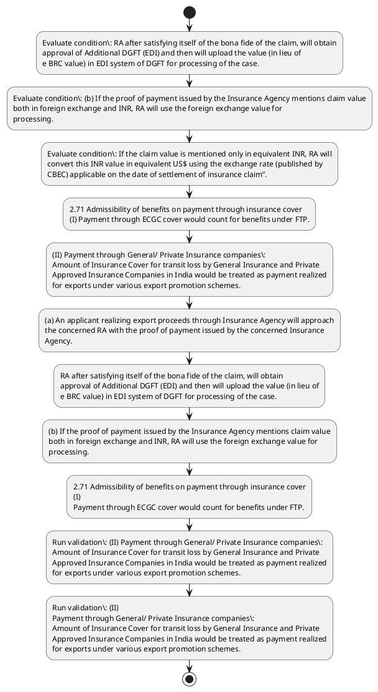

# Chapter 2 / Section 2.71: Admissibility of benefits on payment through insurance cover

**Chapter Title:** General Provisions Regarding Imports and Exports

**Pages:** 30

**Purpose:** 2.71 Admissibility of benefits on payment through insurance cover
(I) Payment through ECGC cover would count for benefits under FTP.

**Purpose Thanglish:** Indha Admissibility of benefits on payment through insurance cover section-la, 2.71 Admissibility of benefits on payment through insurance cover
(I) Payment through ECGC cover would count for benefits under FTP.

**Summary:** 2.71 Admissibility of benefits on payment through insurance cover
(I) Payment through ECGC cover would count for benefits under FTP. (II) Payment through General/ Private Insurance companies:
Amount of Insurance Cover for transit loss by General Insurance and Private
Approved Insurance Companies in India would be treated as payment realized
for exports under various export promotion schemes. (a) An applicant realizing export proceeds through Insurance Agency will approach
the concerned RA with the proof of payment issued by the concerned Insurance
Agency.

**Business Meaning:** 2.71 Admissibility of benefits on payment through insurance cover
(I) Payment through ECGC cover would count for benefits under FTP.

**Business Explanation:** 2.71 Admissibility of benefits on payment through insurance cover
(I) Payment through ECGC cover would count for benefits under FTP. (II) Payment through General/ Private Insurance companies:
Amount of Insurance Cover for transit loss by General Insurance and Private
Approved Insurance Companies in India would be treated as payment realized
for exports under various export promotion schemes. (a) An applicant realizing export proceeds through Insurance Agency will approach
the concerned RA with the proof of payment issued by the concerned Insurance
Agency.

**Business Explanation Thanglish:** Indha Admissibility of benefits on payment through insurance cover section-la, 2.71 Admissibility of benefits on payment through insurance cover
(I) Payment through ECGC cover would count for benefits under FTP. (II) Payment through General/ Private Insurance companies:
Amount of Insurance Cover for transit loss by General Insurance and Private
Approved Insurance Companies in India would be treated as payment realized
for exports under various export promotion schemes. (a) An applicant realizing export proceeds through Insurance Agency will approach
the concerned RA with the proof of payment issued by the concerned Insurance
Agency.

## Business Logic
- None identified

## Business Rules
- rule_id=CH2-SEC2_71-R001, rule_description=IF validations pass THEN recommend action: 2.71 Admissibility of benefits on payment through insurance cover
(I) Payment through ECGC cover would count for benefits under FTP., trigger=Admissibility of benefits on payment through insurance cover, condition=RA after satisfying itself of the bona fide of the claim, will obtain
approval of Additional DGFT (EDI) and then will upload the value (in lieu of
e BRC value) in EDI system of DGFT for processing of the case., validation=(II) Payment through General/ Private Insurance companies:
Amount of Insurance Cover for transit loss by General Insurance and Private
Approved Insurance Companies in India would be treated as payment realized
for exports under various export promotion schemes., action=2.71 Admissibility of benefits on payment through insurance cover
(I) Payment through ECGC cover would count for benefits under FTP., exception=No explicit exception found in uploaded documents., output=DEKAI should produce a compliance decision for 2.71 - Admissibility of benefits on payment through insurance cover.

## Conditions
- RA after satisfying itself of the bona fide of the claim, will obtain
approval of Additional DGFT (EDI) and then will upload the value (in lieu of
e BRC value) in EDI system of DGFT for processing of the case.
- (b) If the proof of payment issued by the Insurance Agency mentions claim value
both in foreign exchange and INR, RA will use the foreign exchange value for
processing.
- If the claim value is mentioned only in equivalent INR, RA will
convert this INR value in equivalent US$ using the exchange rate (published by
CBEC) applicable on the date of settlement of insurance claim”.
- (b)
If the proof of payment issued by the Insurance Agency mentions claim value
both in foreign exchange and INR, RA will use the foreign exchange value for
processing.

## Condition Logic
- id=2.2.71.1, if=RA after satisfying itself of the bona fide of the claim, will obtain
approval of Additional DGFT (EDI) and then will upload the value (in lieu of
e BRC value) in EDI system of DGFT for processing of the case., then=2.71 Admissibility of benefits on payment through insurance cover
(I) Payment through ECGC cover would count for benefits under FTP., source=RA after satisfying itself of the bona fide of the claim, will obtain
approval of Additional DGFT (EDI) and then will upload the value (in lieu of
e BRC value) in EDI system of DGFT for processing of the case.
- id=2.2.71.2, if=(b) If the proof of payment issued by the Insurance Agency mentions claim value
both in foreign exchange and INR, RA will use the foreign exchange value for
processing., then=2.71 Admissibility of benefits on payment through insurance cover
(I) Payment through ECGC cover would count for benefits under FTP., source=(b) If the proof of payment issued by the Insurance Agency mentions claim value
both in foreign exchange and INR, RA will use the foreign exchange value for
processing.
- id=2.2.71.3, if=the claim value is mentioned only in equivalent INR, then=2.71 Admissibility of benefits on payment through insurance cover
(I) Payment through ECGC cover would count for benefits under FTP., source=If the claim value is mentioned only in equivalent INR, RA will
convert this INR value in equivalent US$ using the exchange rate (published by
CBEC) applicable on the date of settlement of insurance claim”.
- id=2.2.71.4, if=(b)
If the proof of payment issued by the Insurance Agency mentions claim value
both in foreign exchange and INR, RA will use the foreign exchange value for
processing., then=2.71 Admissibility of benefits on payment through insurance cover
(I) Payment through ECGC cover would count for benefits under FTP., source=(b)
If the proof of payment issued by the Insurance Agency mentions claim value
both in foreign exchange and INR, RA will use the foreign exchange value for
processing.

## Validations
- (II) Payment through General/ Private Insurance companies:
Amount of Insurance Cover for transit loss by General Insurance and Private
Approved Insurance Companies in India would be treated as payment realized
for exports under various export promotion schemes.
- (II)
Payment through General/ Private Insurance companies:
Amount of Insurance Cover for transit loss by General Insurance and Private
Approved Insurance Companies in India would be treated as payment realized
for exports under various export promotion schemes.

## Exceptions
- None identified

## Dependencies
- None identified

## Authorities
- RA
- DGFT
- Additional DGFT
- BRC value) in EDI system of DGFT

## Required Documents
- (a) An applicant realizing export proceeds through Insurance Agency will approach
the concerned RA with the proof of payment issued by the concerned Insurance
Agency.
- (b) If the proof of payment issued by the Insurance Agency mentions claim value
both in foreign exchange and INR, RA will use the foreign exchange value for
processing.
- (a)
An applicant realizing export proceeds through Insurance Agency will approach
the concerned RA with the proof of payment issued by the concerned Insurance
Agency.
- (b)
If the proof of payment issued by the Insurance Agency mentions claim value
both in foreign exchange and INR, RA will use the foreign exchange value for
processing.

## Timelines
- RA after satisfying itself of the bona fide of the claim, will obtain
approval of Additional DGFT (EDI) and then will upload the value (in lieu of
e BRC value) in EDI system of DGFT for processing of the case.

## Actions
- 2.71 Admissibility of benefits on payment through insurance cover
(I) Payment through ECGC cover would count for benefits under FTP.
- (II) Payment through General/ Private Insurance companies:
Amount of Insurance Cover for transit loss by General Insurance and Private
Approved Insurance Companies in India would be treated as payment realized
for exports under various export promotion schemes.
- (a) An applicant realizing export proceeds through Insurance Agency will approach
the concerned RA with the proof of payment issued by the concerned Insurance
Agency.
- RA after satisfying itself of the bona fide of the claim, will obtain
approval of Additional DGFT (EDI) and then will upload the value (in lieu of
e BRC value) in EDI system of DGFT for processing of the case.
- (b) If the proof of payment issued by the Insurance Agency mentions claim value
both in foreign exchange and INR, RA will use the foreign exchange value for
processing.
- 2.71 Admissibility of benefits on payment through insurance cover
(I)
Payment through ECGC cover would count for benefits under FTP.
- (II)
Payment through General/ Private Insurance companies:
Amount of Insurance Cover for transit loss by General Insurance and Private
Approved Insurance Companies in India would be treated as payment realized
for exports under various export promotion schemes.
- (a)
An applicant realizing export proceeds through Insurance Agency will approach
the concerned RA with the proof of payment issued by the concerned Insurance
Agency.
- (b)
If the proof of payment issued by the Insurance Agency mentions claim value
both in foreign exchange and INR, RA will use the foreign exchange value for
processing.

## Workflow
- Evaluate condition: RA after satisfying itself of the bona fide of the claim, will obtain
approval of Additional DGFT (EDI) and then will upload the value (in lieu of
e BRC value) in EDI system of DGFT for processing of the case.
- Evaluate condition: (b) If the proof of payment issued by the Insurance Agency mentions claim value
both in foreign exchange and INR, RA will use the foreign exchange value for
processing.
- Evaluate condition: If the claim value is mentioned only in equivalent INR, RA will
convert this INR value in equivalent US$ using the exchange rate (published by
CBEC) applicable on the date of settlement of insurance claim”.
- 2.71 Admissibility of benefits on payment through insurance cover
(I) Payment through ECGC cover would count for benefits under FTP.
- (II) Payment through General/ Private Insurance companies:
Amount of Insurance Cover for transit loss by General Insurance and Private
Approved Insurance Companies in India would be treated as payment realized
for exports under various export promotion schemes.
- (a) An applicant realizing export proceeds through Insurance Agency will approach
the concerned RA with the proof of payment issued by the concerned Insurance
Agency.
- RA after satisfying itself of the bona fide of the claim, will obtain
approval of Additional DGFT (EDI) and then will upload the value (in lieu of
e BRC value) in EDI system of DGFT for processing of the case.
- (b) If the proof of payment issued by the Insurance Agency mentions claim value
both in foreign exchange and INR, RA will use the foreign exchange value for
processing.
- 2.71 Admissibility of benefits on payment through insurance cover
(I)
Payment through ECGC cover would count for benefits under FTP.
- Run validation: (II) Payment through General/ Private Insurance companies:
Amount of Insurance Cover for transit loss by General Insurance and Private
Approved Insurance Companies in India would be treated as payment realized
for exports under various export promotion schemes.
- Run validation: (II)
Payment through General/ Private Insurance companies:
Amount of Insurance Cover for transit loss by General Insurance and Private
Approved Insurance Companies in India would be treated as payment realized
for exports under various export promotion schemes.

## Workflow ASCII
```text
Admissibility of benefits on payment through insurance cover
Evaluate condition: RA after satisfying itself of the bona fide of the claim, will obtain
approval of Additional DGFT (EDI) and then will upload the value (in lieu of
e BRC value) in EDI system of DGFT for processing of the case.
   |
   v
Evaluate condition: (b) If the proof of payment issued by the Insurance Agency mentions claim value
both in foreign exchange and INR, RA will use the foreign exchange value for
processing.
   |
   v
Evaluate condition: If the claim value is mentioned only in equivalent INR, RA will
convert this INR value in equivalent US$ using the exchange rate (published by
CBEC) applicable on the date of settlement of insurance claim”.
   |
   v
2.71 Admissibility of benefits on payment through insurance cover
(I) Payment through ECGC cover would count for benefits under FTP.
   |
   v
(II) Payment through General/ Private Insurance companies:
Amount of Insurance Cover for transit loss by General Insurance and Private
Approved Insurance Companies in India would be treated as payment realized
for exports under various export promotion schemes.
   |
   v
(a) An applicant realizing export proceeds through Insurance Agency will approach
the concerned RA with the proof of payment issued by the concerned Insurance
Agency.
   |
   v
RA after satisfying itself of the bona fide of the claim, will obtain
approval of Additional DGFT (EDI) and then will upload the value (in lieu of
e BRC value) in EDI system of DGFT for processing of the case.
   |
   v
(b) If the proof of payment issued by the Insurance Agency mentions claim value
both in foreign exchange and INR, RA will use the foreign exchange value for
processing.
   |
   v
2.71 Admissibility of benefits on payment through insurance cover
(I)
Payment through ECGC cover would count for benefits under FTP.
   |
   v
Run validation: (II) Payment through General/ Private Insurance companies:
Amount of Insurance Cover for transit loss by General Insurance and Private
Approved Insurance Companies in India would be treated as payment realized
for exports under various export promotion schemes.
   |
   v
Run validation: (II)
Payment through General/ Private Insurance companies:
Amount of Insurance Cover for transit loss by General Insurance and Private
Approved Insurance Companies in India would be treated as payment realized
for exports under various export promotion schemes.
```

## Decision Tree
- IF RA after satisfying itself of the bona fide of the claim, will obtain
approval of Additional DGFT (EDI) and then will upload the value (in lieu of
e BRC value) in EDI system of DGFT for processing of the case. THEN 2.71 Admissibility of benefits on payment through insurance cover
(I) Payment through ECGC cover would count for benefits under FTP.
- IF (b) If the proof of payment issued by the Insurance Agency mentions claim value
both in foreign exchange and INR, RA will use the foreign exchange value for
processing. THEN 2.71 Admissibility of benefits on payment through insurance cover
(I) Payment through ECGC cover would count for benefits under FTP.
- IF If the claim value is mentioned only in equivalent INR, RA will
convert this INR value in equivalent US$ using the exchange rate (published by
CBEC) applicable on the date of settlement of insurance claim”. THEN 2.71 Admissibility of benefits on payment through insurance cover
(I) Payment through ECGC cover would count for benefits under FTP.
- IF (b)
If the proof of payment issued by the Insurance Agency mentions claim value
both in foreign exchange and INR, RA will use the foreign exchange value for
processing. THEN 2.71 Admissibility of benefits on payment through insurance cover
(I) Payment through ECGC cover would count for benefits under FTP.

## Decision Tree ASCII
```text
Admissibility of benefits on payment through insurance cover Decision
IF RA after satisfying itself of the bona fide of the claim, will obtain
approval of Additional DGFT (EDI) and then will upload the value (in lieu of
e BRC value) in EDI system of DGFT for processing of the case. THEN 2.71 Admissibility of benefits on payment through insurance cover
(I) Payment through ECGC cover would count for benefits under FTP.
   |
   v
IF (b) If the proof of payment issued by the Insurance Agency mentions claim value
both in foreign exchange and INR, RA will use the foreign exchange value for
processing. THEN 2.71 Admissibility of benefits on payment through insurance cover
(I) Payment through ECGC cover would count for benefits under FTP.
   |
   v
IF If the claim value is mentioned only in equivalent INR, RA will
convert this INR value in equivalent US$ using the exchange rate (published by
CBEC) applicable on the date of settlement of insurance claim”. THEN 2.71 Admissibility of benefits on payment through insurance cover
(I) Payment through ECGC cover would count for benefits under FTP.
   |
   v
IF (b)
If the proof of payment issued by the Insurance Agency mentions claim value
both in foreign exchange and INR, RA will use the foreign exchange value for
processing. THEN 2.71 Admissibility of benefits on payment through insurance cover
(I) Payment through ECGC cover would count for benefits under FTP.
```

## Examples
- User asks to process Admissibility of benefits on payment through insurance cover; the platform checks conditions, validations, and documents before action.

**Real-world Example:** Example: an importer or exporter invokes Admissibility of benefits on payment through insurance cover, submits (a) An applicant realizing export proceeds through Insurance Agency will approach
the concerned RA with the proof of payment issued by the concerned Insurance
Agency., (b) If the proof of payment issued by the Insurance Agency mentions claim value
both in foreign exchange and INR, RA will use the foreign exchange value for
processing., (a)
An applicant realizing export proceeds through Insurance Agency will approach
the concerned RA with the proof of payment issued by the concerned Insurance
Agency., and DEKAI uses the extracted rules to 2.71 admissibility of benefits on payment through insurance cover
(i) payment through ecgc cover would count for benefits under ftp..

**Real-world Example Thanglish:** Indha Admissibility of benefits on payment through insurance cover section-la, Example: an importer or exporter invokes Admissibility of benefits on payment through insurance cover, submits (a) An applicant realizing export proceeds through Insurance Agency will approach
the concerned RA with the proof of payment issued by the concerned Insurance
Agency., (b) If the proof of payment issued by the Insurance Agency mentions claim value
both in foreign exchange and INR, RA will use the foreign exchange value for
processing., (a)
An applicant realizing export proceeds through Insurance Agency will approach
the concerned RA with the proof of payment issued by the concerned Insurance
Agency., and DEKAI uses the extracted rules to 2.71 admissibility of benefits on payment through insurance cover
(i) payment through ecgc cover would count for benefits under ftp..

## AI Rules
- IF validations pass THEN recommend action: 2.71 Admissibility of benefits on payment through insurance cover
(I) Payment through ECGC cover would count for benefits under FTP.

## Database Fields
- name=section_code, type=string, required=True, source=parsed_section_heading
- name=section_title, type=string, required=True, source=parsed_section_heading
- name=for_flag, type=boolean, required=False, source=keyword:for
- name=ftp_flag, type=boolean, required=False, source=keyword:FTP
- name=and_flag, type=boolean, required=False, source=keyword:and
- name=the_flag, type=boolean, required=False, source=keyword:the
- name=edi_flag, type=boolean, required=False, source=keyword:EDI
- name=brc_flag, type=boolean, required=False, source=keyword:BRC
- name=inr_flag, type=boolean, required=False, source=keyword:INR
- name=use_flag, type=boolean, required=False, source=keyword:use
- name=document_1_submitted, type=boolean, required=True, source=(a) An applicant realizing export proceeds through Insurance Agency will approach
the concerned RA with the proof of payment issued by the concerned Insurance
Agency.
- name=document_2_submitted, type=boolean, required=True, source=(b) If the proof of payment issued by the Insurance Agency mentions claim value
both in foreign exchange and INR, RA will use the foreign exchange value for
processing.
- name=document_3_submitted, type=boolean, required=True, source=(a)
An applicant realizing export proceeds through Insurance Agency will approach
the concerned RA with the proof of payment issued by the concerned Insurance
Agency.
- name=document_4_submitted, type=boolean, required=True, source=(b)
If the proof of payment issued by the Insurance Agency mentions claim value
both in foreign exchange and INR, RA will use the foreign exchange value for
processing.

## API Requirements
- method=GET, path=/api/dgft/sections/2.71, purpose=Retrieve knowledge payload for section 2.71, query_params=['include=workflow,decision_tree,validations'], response_fields=['section', 'title', 'summary', 'conditions', 'validations', 'exceptions', 'workflow', 'decision_tree']
- method=POST, path=/api/dgft/Admissibility-of-benefits-on-payment-through-insurance-cover/validate, purpose=Validate inputs and documents for Admissibility of benefits on payment through insurance cover, request_fields=['section_code', 'section_title', 'document_1_submitted', 'document_2_submitted', 'document_3_submitted', 'document_4_submitted'], response_fields=['status', 'errors', 'warnings', 'next_actions']
- method=POST, path=/api/dgft/Admissibility-of-benefits-on-payment-through-insurance-cover/execute, purpose=Trigger business action for 2.71 Admissibility of benefits on payment through insurance cover
(I) Payment through ECGC cover would count for benefits under FTP., request_fields=['section_code', 'section_title', 'document_1_submitted', 'document_2_submitted', 'document_3_submitted', 'document_4_submitted'], response_fields=['reference_id', 'status', 'authority', 'timeline']

## UI Screens
- screen_id=Admissibility_of_benefits_on_payment_through_insurance_cover_overview, name=Admissibility of benefits on payment through insurance cover Overview, purpose=Show section summary, authority, timeline, and eligibility cues., widgets=['summary_card', 'conditions_table', 'authority_badges', 'timeline_panel']
- screen_id=Admissibility_of_benefits_on_payment_through_insurance_cover_submission, name=Admissibility of benefits on payment through insurance cover Submission, purpose=Capture applicant data and supporting documents., widgets=['dynamic_form', 'document_uploader', 'validation_panel', 'next_action_footer'], fields=['section_code', 'section_title', 'for_flag', 'ftp_flag', 'and_flag', 'the_flag', 'edi_flag', 'brc_flag']

## Error Messages
- Validation failed because the section requirements were not fully met.

## FAQ
- question_en=What is the purpose of section 2.71?, answer_en=2.71 Admissibility of benefits on payment through insurance cover
(I) Payment through ECGC cover would count for benefits under FTP. (II) Payment through General/ Private Insurance companies:
Amount of Insurance Cover for transit loss by General Insurance and Private
Approved Insurance Companies in India would be treated as payment realized
for exports under various export promotion schemes. (a) An applicant realizing export proceeds through Insurance Agency will approach
the concerned RA with the proof of payment issued by the concerned Insurance
Agency., question_thanglish=Indha Admissibility of benefits on payment through insurance cover section-la, What is the purpose of section 2.71?, answer_thanglish=Indha Admissibility of benefits on payment through insurance cover section-la, 2.71 Admissibility of benefits on payment through insurance cover
(I) Payment through ECGC cover would count for benefits under FTP. (II) Payment through General/ Private Insurance companies:
Amount of Insurance Cover for transit loss by General Insurance and Private
Approved Insurance Companies in India would be treated as payment realized
for exports under various export promotion schemes. (a) An applicant realizing export proceeds through Insurance Agency will approach
the concerned RA with the proof of payment issued by the concerned Insurance
Agency.
- question_en=What documents are required under Admissibility of benefits on payment through insurance cover?, answer_en=(a) An applicant realizing export proceeds through Insurance Agency will approach
the concerned RA with the proof of payment issued by the concerned Insurance
Agency., (b) If the proof of payment issued by the Insurance Agency mentions claim value
both in foreign exchange and INR, RA will use the foreign exchange value for
processing., (a)
An applicant realizing export proceeds through Insurance Agency will approach
the concerned RA with the proof of payment issued by the concerned Insurance
Agency., (b)
If the proof of payment issued by the Insurance Agency mentions claim value
both in foreign exchange and INR, RA will use the foreign exchange value for
processing., question_thanglish=Indha Admissibility of benefits on payment through insurance cover section-la, What documents are required under Admissibility of benefits on payment through insurance cover?, answer_thanglish=Indha Admissibility of benefits on payment through insurance cover section-la, (a) An applicant realizing export proceeds through Insurance Agency will approach
the concerned RA with the proof of payment issued by the concerned Insurance
Agency., (b) If the proof of payment issued by the Insurance Agency mentions claim value
both in foreign exchange and INR, RA will use the foreign exchange value for
processing., (a)
An applicant realizing export proceeds through Insurance Agency will approach
the concerned RA with the proof of payment issued by the concerned Insurance
Agency., (b)
If the proof of payment issued by the Insurance Agency mentions claim value
both in foreign exchange and INR, RA will use the foreign exchange value for
processing.
- question_en=Which authority handles Admissibility of benefits on payment through insurance cover?, answer_en=RA, DGFT, Additional DGFT, BRC value) in EDI system of DGFT, question_thanglish=Indha Admissibility of benefits on payment through insurance cover section-la, Which authority handles Admissibility of benefits on payment through insurance cover?, answer_thanglish=Indha Admissibility of benefits on payment through insurance cover section-la, RA, DGFT, Additional DGFT, BRC value) in EDI system of DGFT

## Questions Users May Ask
- What does Admissibility of benefits on payment through insurance cover require?
- Which documents are needed for Admissibility of benefits on payment through insurance cover?
- How does DEKAI validate Admissibility of benefits on payment through insurance cover requests?
- What action should be taken for Admissibility of benefits on payment through insurance cover?

## Expected AI Answers
- Admissibility of benefits on payment through insurance cover requires the platform to interpret the section text, apply the extracted business rules, and present the correct next action.
- Required documents are inferred from the section text: (a) An applicant realizing export proceeds through Insurance Agency will approach
the concerned RA with the proof of payment issued by the concerned Insurance
Agency., (b) If the proof of payment issued by the Insurance Agency mentions claim value
both in foreign exchange and INR, RA will use the foreign exchange value for
processing., (a)
An applicant realizing export proceeds through Insurance Agency will approach
the concerned RA with the proof of payment issued by the concerned Insurance
Agency., (b)
If the proof of payment issued by the Insurance Agency mentions claim value
both in foreign exchange and INR, RA will use the foreign exchange value for
processing.
- DEKAI validates Admissibility of benefits on payment through insurance cover by checking conditions, required documents, authority references, and exception clauses before recommending an outcome.
- The primary extracted action is: 2.71 Admissibility of benefits on payment through insurance cover
(I) Payment through ECGC cover would count for benefits under FTP.

## AI Q&A Examples
- question_en=User asks: How do I comply with Admissibility of benefits on payment through insurance cover?, answer_en=AI answers: DEKAI should evaluate section 2.71, apply the extracted rules, and guide the user through Evaluate condition: RA after satisfying itself of the bona fide of the claim, will obtain
approval of Additional DGFT (EDI) and then will upload the value (in lieu of
e BRC value) in EDI system of DGFT for processing of the case.., question_thanglish=Indha Admissibility of benefits on payment through insurance cover section-la, User asks: How do I comply with Admissibility of benefits on payment through insurance cover?, answer_thanglish=Indha Admissibility of benefits on payment through insurance cover section-la, AI answers: DEKAI should evaluate section 2.71, apply the extracted rules, and guide the user through Evaluate condition: RA after satisfying itself of the bona fide of the claim, will obtain
approval of Additional DGFT (EDI) and then will upload the value (in lieu of
e BRC value) in EDI system of DGFT for processing of the case..
- question_en=User asks: Which validations apply to Admissibility of benefits on payment through insurance cover?, answer_en=AI answers: Applicable validations are (II) Payment through General/ Private Insurance companies:
Amount of Insurance Cover for transit loss by General Insurance and Private
Approved Insurance Companies in India would be treated as payment realized
for exports under various export promotion schemes., (II)
Payment through General/ Private Insurance companies:
Amount of Insurance Cover for transit loss by General Insurance and Private
Approved Insurance Companies in India would be treated as payment realized
for exports under various export promotion schemes., question_thanglish=Indha Admissibility of benefits on payment through insurance cover section-la, User asks: Which validations apply to Admissibility of benefits on payment through insurance cover?, answer_thanglish=Indha Admissibility of benefits on payment through insurance cover section-la, AI answers: Applicable validations are (II) Payment through General/ Private Insurance companies:
Amount of Insurance Cover for transit loss by General Insurance and Private
Approved Insurance Companies in India would be treated as payment realized
for exports under various export promotion schemes., (II)
Payment through General/ Private Insurance companies:
Amount of Insurance Cover for transit loss by General Insurance and Private
Approved Insurance Companies in India would be treated as payment realized
for exports under various export promotion schemes.

## DEKAI AI Implementation Notes
- Capture chapter 2, section 2.71, title, and page references as immutable knowledge metadata.
- Bind validations for Admissibility of benefits on payment through insurance cover into a rule engine keyed by the rule IDs extracted for this section.
- Expose document upload controls for: (a) An applicant realizing export proceeds through Insurance Agency will approach
the concerned RA with the proof of payment issued by the concerned Insurance
Agency., (b) If the proof of payment issued by the Insurance Agency mentions claim value
both in foreign exchange and INR, RA will use the foreign exchange value for
processing., (a)
An applicant realizing export proceeds through Insurance Agency will approach
the concerned RA with the proof of payment issued by the concerned Insurance
Agency., (b)
If the proof of payment issued by the Insurance Agency mentions claim value
both in foreign exchange and INR, RA will use the foreign exchange value for
processing..
- Route escalations or approvals to: RA, DGFT, Additional DGFT, BRC value) in EDI system of DGFT.

## DEKAI AI Implementation Notes Thanglish
- Indha Admissibility of benefits on payment through insurance cover section-la, Capture chapter 2, section 2.71, title, and page references as immutable knowledge metadata.
- Indha Admissibility of benefits on payment through insurance cover section-la, Bind validations for Admissibility of benefits on payment through insurance cover into a rule engine keyed by the rule IDs extracted for this section.
- Indha Admissibility of benefits on payment through insurance cover section-la, Expose document upload controls for: (a) An applicant realizing export proceeds through Insurance Agency will approach
the concerned RA with the proof of payment issued by the concerned Insurance
Agency., (b) If the proof of payment issued by the Insurance Agency mentions claim value
both in foreign exchange and INR, RA will use the foreign exchange value for
processing., (a)
An applicant realizing export proceeds through Insurance Agency will approach
the concerned RA with the proof of payment issued by the concerned Insurance
Agency., (b)
If the proof of payment issued by the Insurance Agency mentions claim value
both in foreign exchange and INR, RA will use the foreign exchange value for
processing..
- Indha Admissibility of benefits on payment through insurance cover section-la, Route escalations or approvals to: RA, DGFT, Additional DGFT, BRC value) in EDI system of DGFT.

## AI Metadata
- Keywords: for, FTP, and, the, EDI, BRC, INR, use, ECGC, loss, will, with, bona, fide, DGFT, then, lieu, case, both, only
- Search Keywords: for, FTP, and, the, EDI, BRC, INR, use, ECGC, loss, will, with, bona, fide, DGFT, then, lieu, case, both, only
- Intent: Support Admissibility of benefits on payment through insurance cover processing and compliance validation.
- Tags: 2.71, Admissibility of benefits on payment through insurance cover, document-driven, dgft
- Related Sections: 
- Related Chapters: 
- Related Rules: 

## Mermaid

```mermaid
flowchart TD
    S1["Evaluate condition: RA after satisfying itself of the bona fide of the claim, will obtain
approval of Additional DGFT (EDI) and then will upload the value (in lieu of
e BRC value) in EDI system of DGFT for processing of the case."]
    S2["Evaluate condition: (b) If the proof of payment issued by the Insurance Agency mentions claim value
both in foreign exchange and INR, RA will use the foreign exchange value for
processing."]
    S1 --> S2
    S3["Evaluate condition: If the claim value is mentioned only in equivalent INR, RA will
convert this INR value in equivalent US$ using the exchange rate (published by
CBEC) applicable on the date of settlement of insurance claim”."]
    S2 --> S3
    S4["2.71 Admissibility of benefits on payment through insurance cover
(I) Payment through ECGC cover would count for benefits under FTP."]
    S3 --> S4
    S5["(II) Payment through General/ Private Insurance companies:
Amount of Insurance Cover for transit loss by General Insurance and Private
Approved Insurance Companies in India would be treated as payment realized
for exports under various export promotion schemes."]
    S4 --> S5
    S6["(a) An applicant realizing export proceeds through Insurance Agency will approach
the concerned RA with the proof of payment issued by the concerned Insurance
Agency."]
    S5 --> S6
    S7["RA after satisfying itself of the bona fide of the claim, will obtain
approval of Additional DGFT (EDI) and then will upload the value (in lieu of
e BRC value) in EDI system of DGFT for processing of the case."]
    S6 --> S7
    S8["(b) If the proof of payment issued by the Insurance Agency mentions claim value
both in foreign exchange and INR, RA will use the foreign exchange value for
processing."]
    S7 --> S8
    S9["2.71 Admissibility of benefits on payment through insurance cover
(I)
Payment through ECGC cover would count for benefits under FTP."]
    S8 --> S9
    S10["Run validation: (II) Payment through General/ Private Insurance companies:
Amount of Insurance Cover for transit loss by General Insurance and Private
Approved Insurance Companies in India would be treated as payment realized
for exports under various export promotion schemes."]
    S9 --> S10
    S11["Run validation: (II)
Payment through General/ Private Insurance companies:
Amount of Insurance Cover for transit loss by General Insurance and Private
Approved Insurance Companies in India would be treated as payment realized
for exports under various export promotion schemes."]
    S10 --> S11
```


## PlantUML

