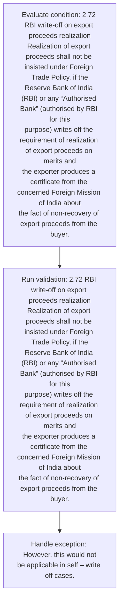
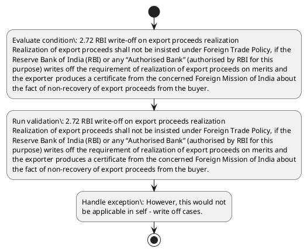

# Chapter 2 / Section 2.72: RBI write-off on export proceeds realization

**Chapter Title:** General Provisions Regarding Imports and Exports

**Pages:** 30

**Purpose:** 2.72 RBI write-off on export proceeds realization
Realization of export proceeds shall not be insisted under Foreign Trade Policy, if the
Reserve Bank of India (RBI) or any “Authorised Bank” (authorised by RBI for this
purpose) writes off the requirement of realization of export proceeds on merits and
the exporter produces a certificate from the concerned Foreign Mission of India about
the fact of non-recovery of export proceeds from the buyer.

**Purpose Thanglish:** Indha RBI write-off on export proceeds realization section-la, 2.72 RBI write-off on export proceeds realization
Realization of export proceeds kandippa not be insisted under Foreign Trade Policy, if the
Reserve Bank of India (RBI) or any “Authorised Bank” (authorised by RBI for this
purpose) writes off the requirement of realization of export proceeds on merits and
the exporter produces a certificate from the concerned Foreign Mission of India about
the fact of non-recovery of export proceeds from the buyer.

**Summary:** 2.72 RBI write-off on export proceeds realization
Realization of export proceeds shall not be insisted under Foreign Trade Policy, if the
Reserve Bank of India (RBI) or any “Authorised Bank” (authorised by RBI for this
purpose) writes off the requirement of realization of export proceeds on merits and
the exporter produces a certificate from the concerned Foreign Mission of India about
the fact of non-recovery of export proceeds from the buyer. However, this would not
be applicable in self – write off cases.

**Business Meaning:** RBI write-off on export proceeds realization governs how DGFT business controls should be applied, validated, and enforced.

**Business Explanation:** RBI write-off on export proceeds realization explains the operating rule set that DEKAI should enforce. Key control points include 2.72 RBI write-off on export proceeds realization
Realization of export proceeds shall not be insisted under Foreign Trade Policy, if the
Reserve Bank of India (RBI) or any “Authorised Bank” (authorised by RBI for this
purpose) writes off the requirement of realization of export proceeds on merits and
the exporter produces a certificate from the concerned Foreign Mission of India about
the fact of non-recovery of export proceeds from the buyer.

**Business Explanation Thanglish:** Indha RBI write-off on export proceeds realization section-la, RBI write-off on export proceeds realization explains the operating rule set that DEKAI should enforce. Key control points include 2.72 RBI write-off on export proceeds realization
Realization of export proceeds kandippa not be insisted under Foreign Trade Policy, if the
Reserve Bank of India (RBI) or any “Authorised Bank” (authorised by RBI for this
purpose) writes off the requirement of realization of export proceeds on merits and
the exporter produces a certificate from the concerned Foreign Mission of India about
the fact of non-recovery of export proceeds from the buyer.

## Business Logic
- 2.72 RBI write-off on export proceeds realization
Realization of export proceeds shall not be insisted under Foreign Trade Policy, if the
Reserve Bank of India (RBI) or any “Authorised Bank” (authorised by RBI for this
purpose) writes off the requirement of realization of export proceeds on merits and
the exporter produces a certificate from the concerned Foreign Mission of India about
the fact of non-recovery of export proceeds from the buyer.

## Business Rules
- rule_id=CH2-SEC2_72-R001, rule_description=2.72 RBI write-off on export proceeds realization
Realization of export proceeds shall not be insisted under Foreign Trade Policy, if the
Reserve Bank of India (RBI) or any “Authorised Bank” (authorised by RBI for this
purpose) writes off the requirement of realization of export proceeds on merits and
the exporter produces a certificate from the concerned Foreign Mission of India about
the fact of non-recovery of export proceeds from the buyer., trigger=RBI write-off on export proceeds realization, condition=2.72 RBI write-off on export proceeds realization
Realization of export proceeds shall not be insisted under Foreign Trade Policy, if the
Reserve Bank of India (RBI) or any “Authorised Bank” (authorised by RBI for this
purpose) writes off the requirement of realization of export proceeds on merits and
the exporter produces a certificate from the concerned Foreign Mission of India about
the fact of non-recovery of export proceeds from the buyer., validation=2.72 RBI write-off on export proceeds realization
Realization of export proceeds shall not be insisted under Foreign Trade Policy, if the
Reserve Bank of India (RBI) or any “Authorised Bank” (authorised by RBI for this
purpose) writes off the requirement of realization of export proceeds on merits and
the exporter produces a certificate from the concerned Foreign Mission of India about
the fact of non-recovery of export proceeds from the buyer., action=Manual review required., exception=However, this would not
be applicable in self – write off cases., output=DEKAI should produce a compliance decision for 2.72 - RBI write-off on export proceeds realization.

## Conditions
- 2.72 RBI write-off on export proceeds realization
Realization of export proceeds shall not be insisted under Foreign Trade Policy, if the
Reserve Bank of India (RBI) or any “Authorised Bank” (authorised by RBI for this
purpose) writes off the requirement of realization of export proceeds on merits and
the exporter produces a certificate from the concerned Foreign Mission of India about
the fact of non-recovery of export proceeds from the buyer.

## Condition Logic
- id=2.2.72.1, if=2.72 RBI write-off on export proceeds realization
Realization of export proceeds shall not be insisted under Foreign Trade Policy, if the
Reserve Bank of India (RBI) or any “Authorised Bank” (authorised by RBI for this
purpose) writes off the requirement of realization of export proceeds on merits and
the exporter produces a certificate from the concerned Foreign Mission of India about
the fact of non-recovery of export proceeds from the buyer., then=Route for review, source=2.72 RBI write-off on export proceeds realization
Realization of export proceeds shall not be insisted under Foreign Trade Policy, if the
Reserve Bank of India (RBI) or any “Authorised Bank” (authorised by RBI for this
purpose) writes off the requirement of realization of export proceeds on merits and
the exporter produces a certificate from the concerned Foreign Mission of India about
the fact of non-recovery of export proceeds from the buyer.

## Validations
- 2.72 RBI write-off on export proceeds realization
Realization of export proceeds shall not be insisted under Foreign Trade Policy, if the
Reserve Bank of India (RBI) or any “Authorised Bank” (authorised by RBI for this
purpose) writes off the requirement of realization of export proceeds on merits and
the exporter produces a certificate from the concerned Foreign Mission of India about
the fact of non-recovery of export proceeds from the buyer.

## Exceptions
- However, this would not
be applicable in self – write off cases.

## Dependencies
- None identified

## Authorities
- None identified

## Required Documents
- 2.72 RBI write-off on export proceeds realization
Realization of export proceeds shall not be insisted under Foreign Trade Policy, if the
Reserve Bank of India (RBI) or any “Authorised Bank” (authorised by RBI for this
purpose) writes off the requirement of realization of export proceeds on merits and
the exporter produces a certificate from the concerned Foreign Mission of India about
the fact of non-recovery of export proceeds from the buyer.

## Timelines
- None identified

## Actions
- None identified

## Workflow
- Evaluate condition: 2.72 RBI write-off on export proceeds realization
Realization of export proceeds shall not be insisted under Foreign Trade Policy, if the
Reserve Bank of India (RBI) or any “Authorised Bank” (authorised by RBI for this
purpose) writes off the requirement of realization of export proceeds on merits and
the exporter produces a certificate from the concerned Foreign Mission of India about
the fact of non-recovery of export proceeds from the buyer.
- Run validation: 2.72 RBI write-off on export proceeds realization
Realization of export proceeds shall not be insisted under Foreign Trade Policy, if the
Reserve Bank of India (RBI) or any “Authorised Bank” (authorised by RBI for this
purpose) writes off the requirement of realization of export proceeds on merits and
the exporter produces a certificate from the concerned Foreign Mission of India about
the fact of non-recovery of export proceeds from the buyer.
- Handle exception: However, this would not
be applicable in self – write off cases.

## Workflow ASCII
```text
RBI write-off on export proceeds realization
Evaluate condition: 2.72 RBI write-off on export proceeds realization
Realization of export proceeds shall not be insisted under Foreign Trade Policy, if the
Reserve Bank of India (RBI) or any “Authorised Bank” (authorised by RBI for this
purpose) writes off the requirement of realization of export proceeds on merits and
the exporter produces a certificate from the concerned Foreign Mission of India about
the fact of non-recovery of export proceeds from the buyer.
   |
   v
Run validation: 2.72 RBI write-off on export proceeds realization
Realization of export proceeds shall not be insisted under Foreign Trade Policy, if the
Reserve Bank of India (RBI) or any “Authorised Bank” (authorised by RBI for this
purpose) writes off the requirement of realization of export proceeds on merits and
the exporter produces a certificate from the concerned Foreign Mission of India about
the fact of non-recovery of export proceeds from the buyer.
   |
   v
Handle exception: However, this would not
be applicable in self – write off cases.
```

## Decision Tree
- IF exception applies (However, this would not
be applicable in self – write off cases.) THEN route to manual review

## Decision Tree ASCII
```text
RBI write-off on export proceeds realization Decision
IF exception applies (However, this would not
be applicable in self – write off cases.) THEN route to manual review
```

## Examples
- User asks to process RBI write-off on export proceeds realization; the platform checks conditions, validations, and documents before action.

**Real-world Example:** Example: an importer or exporter invokes RBI write-off on export proceeds realization, submits 2.72 RBI write-off on export proceeds realization
Realization of export proceeds shall not be insisted under Foreign Trade Policy, if the
Reserve Bank of India (RBI) or any “Authorised Bank” (authorised by RBI for this
purpose) writes off the requirement of realization of export proceeds on merits and
the exporter produces a certificate from the concerned Foreign Mission of India about
the fact of non-recovery of export proceeds from the buyer., and DEKAI uses the extracted rules to follow the rbi write-off on export proceeds realization process.

**Real-world Example Thanglish:** Indha RBI write-off on export proceeds realization section-la, Example: an importer or exporter invokes RBI write-off on export proceeds realization, submits 2.72 RBI write-off on export proceeds realization
Realization of export proceeds kandippa not be insisted under Foreign Trade Policy, if the
Reserve Bank of India (RBI) or any “Authorised Bank” (authorised by RBI for this
purpose) writes off the requirement of realization of export proceeds on merits and
the exporter produces a certificate from the concerned Foreign Mission of India about
the fact of non-recovery of export proceeds from the buyer., and DEKAI uses the extracted rules to follow the rbi write-off on export proceeds realization process.

## AI Rules
- IF detected context matches section rule THEN enforce: 2.72 RBI write-off on export proceeds realization
Realization of export proceeds shall not be insisted under Foreign Trade Policy, if the
Reserve Bank of India (RBI) or any “Authorised Bank” (authorised by RBI for this
purpose) writes off the requirement of realization of export proceeds on merits and
the exporter produces a certificate from the concerned Foreign Mission of India about
the fact of non-recovery of export proceeds from the buyer.

## Database Fields
- name=section_code, type=string, required=True, source=parsed_section_heading
- name=section_title, type=string, required=True, source=parsed_section_heading
- name=rbi_flag, type=boolean, required=False, source=keyword:RBI
- name=not_flag, type=boolean, required=False, source=keyword:not
- name=the_flag, type=boolean, required=False, source=keyword:the
- name=any_flag, type=boolean, required=False, source=keyword:any
- name=for_flag, type=boolean, required=False, source=keyword:for
- name=off_flag, type=boolean, required=False, source=keyword:off
- name=and_flag, type=boolean, required=False, source=keyword:and
- name=bank_flag, type=boolean, required=False, source=keyword:Bank
- name=document_1_submitted, type=boolean, required=True, source=2.72 RBI write-off on export proceeds realization
Realization of export proceeds shall not be insisted under Foreign Trade Policy, if the
Reserve Bank of India (RBI) or any “Authorised Bank” (authorised by RBI for this
purpose) writes off the requirement of realization of export proceeds on merits and
the exporter produces a certificate from the concerned Foreign Mission of India about
the fact of non-recovery of export proceeds from the buyer.

## API Requirements
- method=GET, path=/api/dgft/sections/2.72, purpose=Retrieve knowledge payload for section 2.72, query_params=['include=workflow,decision_tree,validations'], response_fields=['section', 'title', 'summary', 'conditions', 'validations', 'exceptions', 'workflow', 'decision_tree']
- method=POST, path=/api/dgft/RBI-write-off-on-export-proceeds-realization/validate, purpose=Validate inputs and documents for RBI write-off on export proceeds realization, request_fields=['section_code', 'section_title', 'document_1_submitted'], response_fields=['status', 'errors', 'warnings', 'next_actions']

## UI Screens
- screen_id=RBI_write_off_on_export_proceeds_realization_overview, name=RBI write-off on export proceeds realization Overview, purpose=Show section summary, authority, timeline, and eligibility cues., widgets=['summary_card', 'conditions_table', 'authority_badges', 'timeline_panel']
- screen_id=RBI_write_off_on_export_proceeds_realization_submission, name=RBI write-off on export proceeds realization Submission, purpose=Capture applicant data and supporting documents., widgets=['dynamic_form', 'document_uploader', 'validation_panel', 'next_action_footer'], fields=['section_code', 'section_title', 'rbi_flag', 'not_flag', 'the_flag', 'any_flag', 'for_flag', 'off_flag']
- screen_id=RBI_write_off_on_export_proceeds_realization_exceptions, name=RBI write-off on export proceeds realization Exception Review, purpose=Explain exception handling and manual review triggers., widgets=['exception_banner', 'decision_tree', 'case_notes']

## Error Messages
- Validation failed because the section requirements were not fully met.

## FAQ
- question_en=What is the purpose of section 2.72?, answer_en=RBI write-off on export proceeds realization explains the operating rule set that DEKAI should enforce. Key control points include 2.72 RBI write-off on export proceeds realization
Realization of export proceeds shall not be insisted under Foreign Trade Policy, if the
Reserve Bank of India (RBI) or any “Authorised Bank” (authorised by RBI for this
purpose) writes off the requirement of realization of export proceeds on merits and
the exporter produces a certificate from the concerned Foreign Mission of India about
the fact of non-recovery of export proceeds from the buyer., question_thanglish=Indha RBI write-off on export proceeds realization section-la, What is the purpose of section 2.72?, answer_thanglish=Indha RBI write-off on export proceeds realization section-la, RBI write-off on export proceeds realization explains the operating rule set that DEKAI should enforce. Key control points include 2.72 RBI write-off on export proceeds realization
Realization of export proceeds kandippa not be insisted under Foreign Trade Policy, if the
Reserve Bank of India (RBI) or any “Authorised Bank” (authorised by RBI for this
purpose) writes off the requirement of realization of export proceeds on merits and
the exporter produces a certificate from the concerned Foreign Mission of India about
the fact of non-recovery of export proceeds from the buyer.
- question_en=What documents are required under RBI write-off on export proceeds realization?, answer_en=2.72 RBI write-off on export proceeds realization
Realization of export proceeds shall not be insisted under Foreign Trade Policy, if the
Reserve Bank of India (RBI) or any “Authorised Bank” (authorised by RBI for this
purpose) writes off the requirement of realization of export proceeds on merits and
the exporter produces a certificate from the concerned Foreign Mission of India about
the fact of non-recovery of export proceeds from the buyer., question_thanglish=Indha RBI write-off on export proceeds realization section-la, What documents are required under RBI write-off on export proceeds realization?, answer_thanglish=Indha RBI write-off on export proceeds realization section-la, 2.72 RBI write-off on export proceeds realization
Realization of export proceeds kandippa not be insisted under Foreign Trade Policy, if the
Reserve Bank of India (RBI) or any “Authorised Bank” (authorised by RBI for this
purpose) writes off the requirement of realization of export proceeds on merits and
the exporter produces a certificate from the concerned Foreign Mission of India about
the fact of non-recovery of export proceeds from the buyer.
- question_en=Which authority handles RBI write-off on export proceeds realization?, answer_en=Not explicitly covered in uploaded documents., question_thanglish=Indha RBI write-off on export proceeds realization section-la, Which authority handles RBI write-off on export proceeds realization?, answer_thanglish=Indha RBI write-off on export proceeds realization section-la, Not explicitly covered in uploaded documents.

## Questions Users May Ask
- What does RBI write-off on export proceeds realization require?
- Which documents are needed for RBI write-off on export proceeds realization?
- How does DEKAI validate RBI write-off on export proceeds realization requests?

## Expected AI Answers
- RBI write-off on export proceeds realization requires the platform to interpret the section text, apply the extracted business rules, and present the correct next action.
- Required documents are inferred from the section text: 2.72 RBI write-off on export proceeds realization
Realization of export proceeds shall not be insisted under Foreign Trade Policy, if the
Reserve Bank of India (RBI) or any “Authorised Bank” (authorised by RBI for this
purpose) writes off the requirement of realization of export proceeds on merits and
the exporter produces a certificate from the concerned Foreign Mission of India about
the fact of non-recovery of export proceeds from the buyer.
- DEKAI validates RBI write-off on export proceeds realization by checking conditions, required documents, authority references, and exception clauses before recommending an outcome.

## AI Q&A Examples
- question_en=User asks: How do I comply with RBI write-off on export proceeds realization?, answer_en=AI answers: DEKAI should evaluate section 2.72, apply the extracted rules, and guide the user through Evaluate condition: 2.72 RBI write-off on export proceeds realization
Realization of export proceeds shall not be insisted under Foreign Trade Policy, if the
Reserve Bank of India (RBI) or any “Authorised Bank” (authorised by RBI for this
purpose) writes off the requirement of realization of export proceeds on merits and
the exporter produces a certificate from the concerned Foreign Mission of India about
the fact of non-recovery of export proceeds from the buyer.., question_thanglish=Indha RBI write-off on export proceeds realization section-la, User asks: How do I comply with RBI write-off on export proceeds realization?, answer_thanglish=Indha RBI write-off on export proceeds realization section-la, AI answers: DEKAI should evaluate section 2.72, apply the extracted rules, and guide the user through Evaluate condition: 2.72 RBI write-off on export proceeds realization
Realization of export proceeds kandippa not be insisted under Foreign Trade Policy, if the
Reserve Bank of India (RBI) or any “Authorised Bank” (authorised by RBI for this
purpose) writes off the requirement of realization of export proceeds on merits and
the exporter produces a certificate from the concerned Foreign Mission of India about
the fact of non-recovery of export proceeds from the buyer..
- question_en=User asks: Which validations apply to RBI write-off on export proceeds realization?, answer_en=AI answers: Applicable validations are 2.72 RBI write-off on export proceeds realization
Realization of export proceeds shall not be insisted under Foreign Trade Policy, if the
Reserve Bank of India (RBI) or any “Authorised Bank” (authorised by RBI for this
purpose) writes off the requirement of realization of export proceeds on merits and
the exporter produces a certificate from the concerned Foreign Mission of India about
the fact of non-recovery of export proceeds from the buyer., question_thanglish=Indha RBI write-off on export proceeds realization section-la, User asks: Which validations apply to RBI write-off on export proceeds realization?, answer_thanglish=Indha RBI write-off on export proceeds realization section-la, AI answers: Applicable validations are 2.72 RBI write-off on export proceeds realization
Realization of export proceeds kandippa not be insisted under Foreign Trade Policy, if the
Reserve Bank of India (RBI) or any “Authorised Bank” (authorised by RBI for this
purpose) writes off the requirement of realization of export proceeds on merits and
the exporter produces a certificate from the concerned Foreign Mission of India about
the fact of non-recovery of export proceeds from the buyer.

## DEKAI AI Implementation Notes
- Capture chapter 2, section 2.72, title, and page references as immutable knowledge metadata.
- Bind validations for RBI write-off on export proceeds realization into a rule engine keyed by the rule IDs extracted for this section.
- Expose document upload controls for: 2.72 RBI write-off on export proceeds realization
Realization of export proceeds shall not be insisted under Foreign Trade Policy, if the
Reserve Bank of India (RBI) or any “Authorised Bank” (authorised by RBI for this
purpose) writes off the requirement of realization of export proceeds on merits and
the exporter produces a certificate from the concerned Foreign Mission of India about
the fact of non-recovery of export proceeds from the buyer..
- Trigger manual review when exception clauses are detected.

## DEKAI AI Implementation Notes Thanglish
- Indha RBI write-off on export proceeds realization section-la, Capture chapter 2, section 2.72, title, and page references as immutable knowledge metadata.
- Indha RBI write-off on export proceeds realization section-la, Bind validations for RBI write-off on export proceeds realization into a rule engine keyed by the rule IDs extracted for this section.
- Indha RBI write-off on export proceeds realization section-la, Expose document upload controls for: 2.72 RBI write-off on export proceeds realization
Realization of export proceeds kandippa not be insisted under Foreign Trade Policy, if the
Reserve Bank of India (RBI) or any “Authorised Bank” (authorised by RBI for this
purpose) writes off the requirement of realization of export proceeds on merits and
the exporter produces a certificate from the concerned Foreign Mission of India about
the fact of non-recovery of export proceeds from the buyer..
- Indha RBI write-off on export proceeds realization section-la, Trigger manual review when exception clauses are detected.

## AI Metadata
- Keywords: RBI, not, the, any, for, off, and, Bank, this, from, fact, self, shall, under, Trade, India, about, buyer, would, write
- Search Keywords: RBI, not, the, any, for, off, and, Bank, this, from, fact, self, shall, under, Trade, India, about, buyer, would, write
- Intent: Provide knowledge guidance for RBI write-off on export proceeds realization.
- Tags: 2.72, RBI write-off on export proceeds realization, business-rule, document-driven, dgft
- Related Sections: 
- Related Chapters: 
- Related Rules: 2.72 RBI write-off on export proceeds realization
Realization of export proceeds shall not be insisted under Foreign Trade Policy, if the
Reserve Bank of India (RBI) or any “Authorised Bank” (authorised by RBI for this
purpose) writes off the requirement of realization of export proceeds on merits and
the exporter produces a certificate from the concerned Foreign Mission of India about
the fact of non-recovery of export proceeds from the buyer.

## Mermaid


## PlantUML

