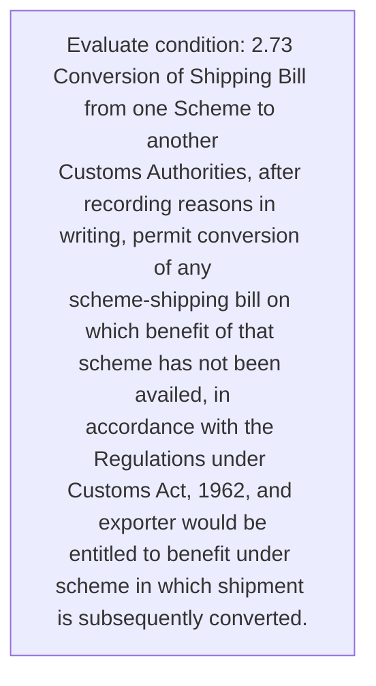
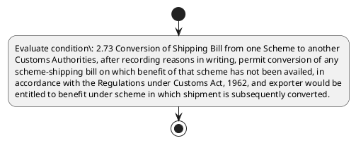

# Chapter 2 / Section 2.73: Conversion of Shipping Bill from one Scheme to another

**Chapter Title:** General Provisions Regarding Imports and Exports

**Pages:** 30

**Purpose:** 2.73 Conversion of Shipping Bill from one Scheme to another
Customs Authorities, after recording reasons in writing, permit conversion of any
scheme-shipping bill on which benefit of that scheme has not been availed, in
accordance with the Regulations under Customs Act, 1962, and exporter would be
entitled to benefit under scheme in which shipment is subsequently converted.

**Purpose Thanglish:** Indha Conversion of Shipping Bill from one Scheme to another section-la, 2.73 Conversion of Shipping Bill from one Scheme to another
Customs Authorities, after recording reasons in writing, permit conversion of any
scheme-shipping bill on which benefit of that scheme has not been availed, in
accordance with the Regulations under Customs Act, 1962, and exporter would be
entitled to benefit under scheme in which shipment is subsequently converted.

**Summary:** 2.73 Conversion of Shipping Bill from one Scheme to another
Customs Authorities, after recording reasons in writing, permit conversion of any
scheme-shipping bill on which benefit of that scheme has not been availed, in
accordance with the Regulations under Customs Act, 1962, and exporter would be
entitled to benefit under scheme in which shipment is subsequently converted.

**Business Meaning:** 2.73 Conversion of Shipping Bill from one Scheme to another
Customs Authorities, after recording reasons in writing, permit conversion of any
scheme-shipping bill on which benefit of that scheme has not been availed, in
accordance with the Regulations under Customs Act, 1962, and exporter would be
entitled to benefit under scheme in which shipment is subsequently converted.

**Business Explanation:** 2.73 Conversion of Shipping Bill from one Scheme to another
Customs Authorities, after recording reasons in writing, permit conversion of any
scheme-shipping bill on which benefit of that scheme has not been availed, in
accordance with the Regulations under Customs Act, 1962, and exporter would be
entitled to benefit under scheme in which shipment is subsequently converted.

**Business Explanation Thanglish:** Indha Conversion of Shipping Bill from one Scheme to another section-la, 2.73 Conversion of Shipping Bill from one Scheme to another
Customs Authorities, after recording reasons in writing, permit conversion of any
scheme-shipping bill on which benefit of that scheme has not been availed, in
accordance with the Regulations under Customs Act, 1962, and exporter would be
entitled to benefit under scheme in which shipment is subsequently converted.

## Business Logic
- None identified

## Business Rules
- rule_id=CH2-SEC2_73-R001, rule_description=2.73 Conversion of Shipping Bill from one Scheme to another
Customs Authorities, after recording reasons in writing, permit conversion of any
scheme-shipping bill on which benefit of that scheme has not been availed, in
accordance with the Regulations under Customs Act, 1962, and exporter would be
entitled to benefit under scheme in which shipment is subsequently converted., trigger=Conversion of Shipping Bill from one Scheme to another, condition=2.73 Conversion of Shipping Bill from one Scheme to another
Customs Authorities, after recording reasons in writing, permit conversion of any
scheme-shipping bill on which benefit of that scheme has not been availed, in
accordance with the Regulations under Customs Act, 1962, and exporter would be
entitled to benefit under scheme in which shipment is subsequently converted., validation=Not explicitly covered in uploaded documents., action=Manual review required., exception=No explicit exception found in uploaded documents., output=DEKAI should produce a compliance decision for 2.73 - Conversion of Shipping Bill from one Scheme to another.

## Conditions
- 2.73 Conversion of Shipping Bill from one Scheme to another
Customs Authorities, after recording reasons in writing, permit conversion of any
scheme-shipping bill on which benefit of that scheme has not been availed, in
accordance with the Regulations under Customs Act, 1962, and exporter would be
entitled to benefit under scheme in which shipment is subsequently converted.

## Condition Logic
- id=2.2.73.1, if=2.73 Conversion of Shipping Bill from one Scheme to another
Customs Authorities, after recording reasons in writing, permit conversion of any
scheme-shipping bill on which benefit of that scheme has not been availed, in
accordance with the Regulations under Customs Act, 1962, and exporter would be
entitled to benefit under scheme in which shipment is subsequently converted., then=Route for review, source=2.73 Conversion of Shipping Bill from one Scheme to another
Customs Authorities, after recording reasons in writing, permit conversion of any
scheme-shipping bill on which benefit of that scheme has not been availed, in
accordance with the Regulations under Customs Act, 1962, and exporter would be
entitled to benefit under scheme in which shipment is subsequently converted.

## Validations
- None identified

## Exceptions
- None identified

## Dependencies
- None identified

## Authorities
- Customs
- Customs Authorities
- Regulations under Customs

## Required Documents
- Conversion of Shipping Bill

## Timelines
- 2.73 Conversion of Shipping Bill from one Scheme to another
Customs Authorities, after recording reasons in writing, permit conversion of any
scheme-shipping bill on which benefit of that scheme has not been availed, in
accordance with the Regulations under Customs Act, 1962, and exporter would be
entitled to benefit under scheme in which shipment is subsequently converted.

## Actions
- None identified

## Workflow
- Evaluate condition: 2.73 Conversion of Shipping Bill from one Scheme to another
Customs Authorities, after recording reasons in writing, permit conversion of any
scheme-shipping bill on which benefit of that scheme has not been availed, in
accordance with the Regulations under Customs Act, 1962, and exporter would be
entitled to benefit under scheme in which shipment is subsequently converted.

## Workflow ASCII
```text
Conversion of Shipping Bill from one Scheme to another
Evaluate condition: 2.73 Conversion of Shipping Bill from one Scheme to another
Customs Authorities, after recording reasons in writing, permit conversion of any
scheme-shipping bill on which benefit of that scheme has not been availed, in
accordance with the Regulations under Customs Act, 1962, and exporter would be
entitled to benefit under scheme in which shipment is subsequently converted.
```

## Decision Tree
- IF section 2.73 applies THEN proceed with standard DGFT workflow

## Decision Tree ASCII
```text
Conversion of Shipping Bill from one Scheme to another Decision
IF section 2.73 applies THEN proceed with standard DGFT workflow
```

## Examples
- User asks to process Conversion of Shipping Bill from one Scheme to another; the platform checks conditions, validations, and documents before action.

**Real-world Example:** Example: an importer or exporter invokes Conversion of Shipping Bill from one Scheme to another, submits Conversion of Shipping Bill, and DEKAI uses the extracted rules to follow the conversion of shipping bill from one scheme to another process.

**Real-world Example Thanglish:** Indha Conversion of Shipping Bill from one Scheme to another section-la, Example: an importer or exporter invokes Conversion of Shipping Bill from one Scheme to another, submits Conversion of Shipping Bill, and DEKAI uses the extracted rules to follow the conversion of shipping bill from one scheme to another process.

## AI Rules
- None identified

## Database Fields
- name=section_code, type=string, required=True, source=parsed_section_heading
- name=section_title, type=string, required=True, source=parsed_section_heading
- name=one_flag, type=boolean, required=False, source=keyword:one
- name=any_flag, type=boolean, required=False, source=keyword:any
- name=has_flag, type=boolean, required=False, source=keyword:has
- name=not_flag, type=boolean, required=False, source=keyword:not
- name=the_flag, type=boolean, required=False, source=keyword:the
- name=act_flag, type=boolean, required=False, source=keyword:Act
- name=and_flag, type=boolean, required=False, source=keyword:and
- name=bill_flag, type=boolean, required=False, source=keyword:Bill
- name=document_1_submitted, type=boolean, required=True, source=Conversion of Shipping Bill

## API Requirements
- method=GET, path=/api/dgft/sections/2.73, purpose=Retrieve knowledge payload for section 2.73, query_params=['include=workflow,decision_tree,validations'], response_fields=['section', 'title', 'summary', 'conditions', 'validations', 'exceptions', 'workflow', 'decision_tree']
- method=POST, path=/api/dgft/Conversion-of-Shipping-Bill-from-one-Scheme-to-another/validate, purpose=Validate inputs and documents for Conversion of Shipping Bill from one Scheme to another, request_fields=['section_code', 'section_title', 'document_1_submitted'], response_fields=['status', 'errors', 'warnings', 'next_actions']

## UI Screens
- screen_id=Conversion_of_Shipping_Bill_from_one_Scheme_to_another_overview, name=Conversion of Shipping Bill from one Scheme to another Overview, purpose=Show section summary, authority, timeline, and eligibility cues., widgets=['summary_card', 'conditions_table', 'authority_badges', 'timeline_panel']
- screen_id=Conversion_of_Shipping_Bill_from_one_Scheme_to_another_submission, name=Conversion of Shipping Bill from one Scheme to another Submission, purpose=Capture applicant data and supporting documents., widgets=['dynamic_form', 'document_uploader', 'validation_panel', 'next_action_footer'], fields=['section_code', 'section_title', 'one_flag', 'any_flag', 'has_flag', 'not_flag', 'the_flag', 'act_flag']

## Error Messages
- Validation failed because the section requirements were not fully met.

## FAQ
- question_en=What is the purpose of section 2.73?, answer_en=2.73 Conversion of Shipping Bill from one Scheme to another
Customs Authorities, after recording reasons in writing, permit conversion of any
scheme-shipping bill on which benefit of that scheme has not been availed, in
accordance with the Regulations under Customs Act, 1962, and exporter would be
entitled to benefit under scheme in which shipment is subsequently converted., question_thanglish=Indha Conversion of Shipping Bill from one Scheme to another section-la, What is the purpose of section 2.73?, answer_thanglish=Indha Conversion of Shipping Bill from one Scheme to another section-la, 2.73 Conversion of Shipping Bill from one Scheme to another
Customs Authorities, after recording reasons in writing, permit conversion of any
scheme-shipping bill on which benefit of that scheme has not been availed, in
accordance with the Regulations under Customs Act, 1962, and exporter would be
entitled to benefit under scheme in which shipment is subsequently converted.
- question_en=What documents are required under Conversion of Shipping Bill from one Scheme to another?, answer_en=Conversion of Shipping Bill, question_thanglish=Indha Conversion of Shipping Bill from one Scheme to another section-la, What documents are required under Conversion of Shipping Bill from one Scheme to another?, answer_thanglish=Indha Conversion of Shipping Bill from one Scheme to another section-la, Conversion of Shipping Bill
- question_en=Which authority handles Conversion of Shipping Bill from one Scheme to another?, answer_en=Customs, Customs Authorities, Regulations under Customs, question_thanglish=Indha Conversion of Shipping Bill from one Scheme to another section-la, Which authority handles Conversion of Shipping Bill from one Scheme to another?, answer_thanglish=Indha Conversion of Shipping Bill from one Scheme to another section-la, Customs, Customs Authorities, Regulations under Customs

## Questions Users May Ask
- What does Conversion of Shipping Bill from one Scheme to another require?
- Which documents are needed for Conversion of Shipping Bill from one Scheme to another?
- How does DEKAI validate Conversion of Shipping Bill from one Scheme to another requests?

## Expected AI Answers
- Conversion of Shipping Bill from one Scheme to another requires the platform to interpret the section text, apply the extracted business rules, and present the correct next action.
- Required documents are inferred from the section text: Conversion of Shipping Bill
- DEKAI validates Conversion of Shipping Bill from one Scheme to another by checking conditions, required documents, authority references, and exception clauses before recommending an outcome.

## AI Q&A Examples
- question_en=User asks: How do I comply with Conversion of Shipping Bill from one Scheme to another?, answer_en=AI answers: DEKAI should evaluate section 2.73, apply the extracted rules, and guide the user through Evaluate condition: 2.73 Conversion of Shipping Bill from one Scheme to another
Customs Authorities, after recording reasons in writing, permit conversion of any
scheme-shipping bill on which benefit of that scheme has not been availed, in
accordance with the Regulations under Customs Act, 1962, and exporter would be
entitled to benefit under scheme in which shipment is subsequently converted.., question_thanglish=Indha Conversion of Shipping Bill from one Scheme to another section-la, User asks: How do I comply with Conversion of Shipping Bill from one Scheme to another?, answer_thanglish=Indha Conversion of Shipping Bill from one Scheme to another section-la, AI answers: DEKAI should evaluate section 2.73, apply the extracted rules, and guide the user through Evaluate condition: 2.73 Conversion of Shipping Bill from one Scheme to another
Customs Authorities, after recording reasons in writing, permit conversion of any
scheme-shipping bill on which benefit of that scheme has not been availed, in
accordance with the Regulations under Customs Act, 1962, and exporter would be
entitled to benefit under scheme in which shipment is subsequently converted..
- question_en=User asks: Which validations apply to Conversion of Shipping Bill from one Scheme to another?, answer_en=AI answers: Applicable validations are not explicitly covered in the uploaded documents., question_thanglish=Indha Conversion of Shipping Bill from one Scheme to another section-la, User asks: Which validations apply to Conversion of Shipping Bill from one Scheme to another?, answer_thanglish=Indha Conversion of Shipping Bill from one Scheme to another section-la, AI answers: Applicable validations are not explicitly covered in the uploaded documents.

## DEKAI AI Implementation Notes
- Capture chapter 2, section 2.73, title, and page references as immutable knowledge metadata.
- Bind validations for Conversion of Shipping Bill from one Scheme to another into a rule engine keyed by the rule IDs extracted for this section.
- Expose document upload controls for: Conversion of Shipping Bill.
- Route escalations or approvals to: Customs, Customs Authorities, Regulations under Customs.

## DEKAI AI Implementation Notes Thanglish
- Indha Conversion of Shipping Bill from one Scheme to another section-la, Capture chapter 2, section 2.73, title, and page references as immutable knowledge metadata.
- Indha Conversion of Shipping Bill from one Scheme to another section-la, Bind validations for Conversion of Shipping Bill from one Scheme to another into a rule engine keyed by the rule IDs extracted for this section.
- Indha Conversion of Shipping Bill from one Scheme to another section-la, Expose document upload controls for: Conversion of Shipping Bill.
- Indha Conversion of Shipping Bill from one Scheme to another section-la, Route escalations or approvals to: Customs, Customs Authorities, Regulations under Customs.

## AI Metadata
- Keywords: one, any, has, not, the, Act, and, Bill, from, that, been, with, after, which, under, would, Scheme, permit, another, Customs
- Search Keywords: one, any, has, not, the, Act, and, Bill, from, that, been, with, after, which, under, would, Scheme, permit, another, Customs
- Intent: Provide knowledge guidance for Conversion of Shipping Bill from one Scheme to another.
- Tags: 2.73, Conversion of Shipping Bill from one Scheme to another, document-driven, dgft
- Related Sections: 
- Related Chapters: 
- Related Rules: 

## Mermaid


## PlantUML

