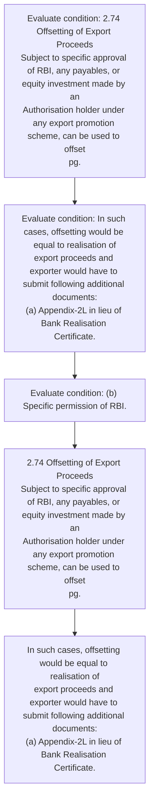
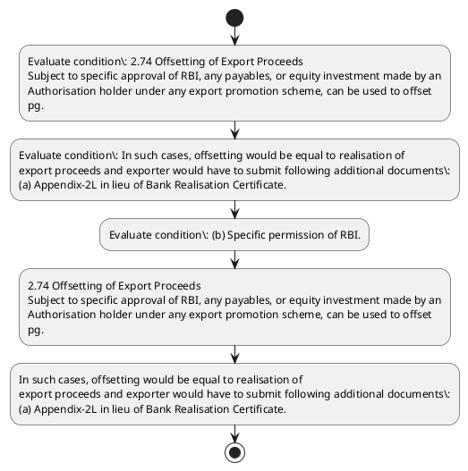

# Chapter 2 / Section 2.74: Offsetting of Export Proceeds

**Chapter Title:** General Provisions Regarding Imports and Exports

**Pages:** 30, 31

**Purpose:** 2.74 Offsetting of Export Proceeds
Subject to specific approval of RBI, any payables, or equity investment made by an
Authorisation holder under any export promotion scheme, can be used to offset
pg.

**Purpose Thanglish:** Indha Offsetting of Export Proceeds section-la, 2.74 Offsetting of export Proceeds
Subject to specific approval of RBI, any payables, or equity investment made by an
Authorisation holder under any export promotion scheme, can be used to offset
pg.

**Summary:** 2.74 Offsetting of Export Proceeds
Subject to specific approval of RBI, any payables, or equity investment made by an
Authorisation holder under any export promotion scheme, can be used to offset
pg. 39
be entitled to Duty Drawback or any other export incentive under any export
promotion scheme. 2.74 Offsetting of Export Proceeds
Subject to specific approval of RBI, any payables, or equity investment made by an
Authorisation holder under any export promotion scheme, can be used to offset
pg.

**Business Meaning:** Offsetting of Export Proceeds governs how DGFT business controls should be applied, validated, and enforced.

**Business Explanation:** Offsetting of Export Proceeds explains the operating rule set that DEKAI should enforce. Key control points include 2.74 Offsetting of Export Proceeds
Subject to specific approval of RBI, any payables, or equity investment made by an
Authorisation holder under any export promotion scheme, can be used to offset
pg. The section also drives actions such as 2.74 Offsetting of Export Proceeds
Subject to specific approval of RBI, any payables, or equity investment made by an
Authorisation holder under any export promotion scheme, can be used to offset
pg..

**Business Explanation Thanglish:** Indha Offsetting of Export Proceeds section-la, Offsetting of export Proceeds explains the operating rule set that DEKAI should enforce. Key control points include 2.74 Offsetting of export Proceeds
Subject to specific approval of RBI, any payables, or equity investment made by an
Authorisation holder under any export promotion scheme, can be used to offset
pg. The section also drives actions such as 2.74 Offsetting of export Proceeds
Subject to specific approval of RBI, any payables, or equity investment made by an
Authorisation holder under any export promotion scheme, can be used to offset
pg..

## Business Logic
- 2.74 Offsetting of Export Proceeds
Subject to specific approval of RBI, any payables, or equity investment made by an
Authorisation holder under any export promotion scheme, can be used to offset
pg.

## Business Rules
- rule_id=CH2-SEC2_74-R001, rule_description=2.74 Offsetting of Export Proceeds
Subject to specific approval of RBI, any payables, or equity investment made by an
Authorisation holder under any export promotion scheme, can be used to offset
pg., trigger=Offsetting of Export Proceeds, condition=2.74 Offsetting of Export Proceeds
Subject to specific approval of RBI, any payables, or equity investment made by an
Authorisation holder under any export promotion scheme, can be used to offset
pg., validation=Not explicitly covered in uploaded documents., action=2.74 Offsetting of Export Proceeds
Subject to specific approval of RBI, any payables, or equity investment made by an
Authorisation holder under any export promotion scheme, can be used to offset
pg., exception=No explicit exception found in uploaded documents., output=DEKAI should produce a compliance decision for 2.74 - Offsetting of Export Proceeds.

## Conditions
- 2.74 Offsetting of Export Proceeds
Subject to specific approval of RBI, any payables, or equity investment made by an
Authorisation holder under any export promotion scheme, can be used to offset
pg.
- In such cases, offsetting would be equal to realisation of
export proceeds and exporter would have to submit following additional documents:
(a) Appendix-2L in lieu of Bank Realisation Certificate.
- (b) Specific permission of RBI.
- PROVISIONS RELATED TO QUALITY CERTIFICATION:

## Condition Logic
- id=2.2.74.1, if=2.74 Offsetting of Export Proceeds
Subject to specific approval of RBI, any payables, or equity investment made by an
Authorisation holder under any export promotion scheme, can be used to offset
pg., then=2.74 Offsetting of Export Proceeds
Subject to specific approval of RBI, any payables, or equity investment made by an
Authorisation holder under any export promotion scheme, can be used to offset
pg., source=2.74 Offsetting of Export Proceeds
Subject to specific approval of RBI, any payables, or equity investment made by an
Authorisation holder under any export promotion scheme, can be used to offset
pg.
- id=2.2.74.2, if=In such cases, offsetting would be equal to realisation of
export proceeds and exporter would have to submit following additional documents:
(a) Appendix-2L in lieu of Bank Realisation Certificate., then=2.74 Offsetting of Export Proceeds
Subject to specific approval of RBI, any payables, or equity investment made by an
Authorisation holder under any export promotion scheme, can be used to offset
pg., source=In such cases, offsetting would be equal to realisation of
export proceeds and exporter would have to submit following additional documents:
(a) Appendix-2L in lieu of Bank Realisation Certificate.
- id=2.2.74.3, if=(b) Specific permission of RBI., then=2.74 Offsetting of Export Proceeds
Subject to specific approval of RBI, any payables, or equity investment made by an
Authorisation holder under any export promotion scheme, can be used to offset
pg., source=(b) Specific permission of RBI.
- id=2.2.74.4, if=PROVISIONS RELATED TO QUALITY CERTIFICATION:, then=2.74 Offsetting of Export Proceeds
Subject to specific approval of RBI, any payables, or equity investment made by an
Authorisation holder under any export promotion scheme, can be used to offset
pg., source=PROVISIONS RELATED TO QUALITY CERTIFICATION:

## Validations
- None identified

## Exceptions
- None identified

## Dependencies
- None identified

## Authorities
- None identified

## Required Documents
- Appendix-2L in lieu of Bank Realisation Certificate

## Timelines
- None identified

## Actions
- 2.74 Offsetting of Export Proceeds
Subject to specific approval of RBI, any payables, or equity investment made by an
Authorisation holder under any export promotion scheme, can be used to offset
pg.
- In such cases, offsetting would be equal to realisation of
export proceeds and exporter would have to submit following additional documents:
(a) Appendix-2L in lieu of Bank Realisation Certificate.

## Workflow
- Evaluate condition: 2.74 Offsetting of Export Proceeds
Subject to specific approval of RBI, any payables, or equity investment made by an
Authorisation holder under any export promotion scheme, can be used to offset
pg.
- Evaluate condition: In such cases, offsetting would be equal to realisation of
export proceeds and exporter would have to submit following additional documents:
(a) Appendix-2L in lieu of Bank Realisation Certificate.
- Evaluate condition: (b) Specific permission of RBI.
- 2.74 Offsetting of Export Proceeds
Subject to specific approval of RBI, any payables, or equity investment made by an
Authorisation holder under any export promotion scheme, can be used to offset
pg.
- In such cases, offsetting would be equal to realisation of
export proceeds and exporter would have to submit following additional documents:
(a) Appendix-2L in lieu of Bank Realisation Certificate.

## Workflow ASCII
```text
Offsetting of Export Proceeds
Evaluate condition: 2.74 Offsetting of Export Proceeds
Subject to specific approval of RBI, any payables, or equity investment made by an
Authorisation holder under any export promotion scheme, can be used to offset
pg.
   |
   v
Evaluate condition: In such cases, offsetting would be equal to realisation of
export proceeds and exporter would have to submit following additional documents:
(a) Appendix-2L in lieu of Bank Realisation Certificate.
   |
   v
Evaluate condition: (b) Specific permission of RBI.
   |
   v
2.74 Offsetting of Export Proceeds
Subject to specific approval of RBI, any payables, or equity investment made by an
Authorisation holder under any export promotion scheme, can be used to offset
pg.
   |
   v
In such cases, offsetting would be equal to realisation of
export proceeds and exporter would have to submit following additional documents:
(a) Appendix-2L in lieu of Bank Realisation Certificate.
```

## Decision Tree
- IF 2.74 Offsetting of Export Proceeds
Subject to specific approval of RBI, any payables, or equity investment made by an
Authorisation holder under any export promotion scheme, can be used to offset
pg. THEN 2.74 Offsetting of Export Proceeds
Subject to specific approval of RBI, any payables, or equity investment made by an
Authorisation holder under any export promotion scheme, can be used to offset
pg.
- IF In such cases, offsetting would be equal to realisation of
export proceeds and exporter would have to submit following additional documents:
(a) Appendix-2L in lieu of Bank Realisation Certificate. THEN 2.74 Offsetting of Export Proceeds
Subject to specific approval of RBI, any payables, or equity investment made by an
Authorisation holder under any export promotion scheme, can be used to offset
pg.
- IF (b) Specific permission of RBI. THEN 2.74 Offsetting of Export Proceeds
Subject to specific approval of RBI, any payables, or equity investment made by an
Authorisation holder under any export promotion scheme, can be used to offset
pg.
- IF PROVISIONS RELATED TO QUALITY CERTIFICATION: THEN 2.74 Offsetting of Export Proceeds
Subject to specific approval of RBI, any payables, or equity investment made by an
Authorisation holder under any export promotion scheme, can be used to offset
pg.

## Decision Tree ASCII
```text
Offsetting of Export Proceeds Decision
IF 2.74 Offsetting of Export Proceeds
Subject to specific approval of RBI, any payables, or equity investment made by an
Authorisation holder under any export promotion scheme, can be used to offset
pg. THEN 2.74 Offsetting of Export Proceeds
Subject to specific approval of RBI, any payables, or equity investment made by an
Authorisation holder under any export promotion scheme, can be used to offset
pg.
   |
   v
IF In such cases, offsetting would be equal to realisation of
export proceeds and exporter would have to submit following additional documents:
(a) Appendix-2L in lieu of Bank Realisation Certificate. THEN 2.74 Offsetting of Export Proceeds
Subject to specific approval of RBI, any payables, or equity investment made by an
Authorisation holder under any export promotion scheme, can be used to offset
pg.
   |
   v
IF (b) Specific permission of RBI. THEN 2.74 Offsetting of Export Proceeds
Subject to specific approval of RBI, any payables, or equity investment made by an
Authorisation holder under any export promotion scheme, can be used to offset
pg.
   |
   v
IF PROVISIONS RELATED TO QUALITY CERTIFICATION: THEN 2.74 Offsetting of Export Proceeds
Subject to specific approval of RBI, any payables, or equity investment made by an
Authorisation holder under any export promotion scheme, can be used to offset
pg.
```

## Examples
- User asks to process Offsetting of Export Proceeds; the platform checks conditions, validations, and documents before action.

**Real-world Example:** Example: an importer or exporter invokes Offsetting of Export Proceeds, submits Appendix-2L in lieu of Bank Realisation Certificate, and DEKAI uses the extracted rules to 2.74 offsetting of export proceeds
subject to specific approval of rbi, any payables, or equity investment made by an
authorisation holder under any export promotion scheme, can be used to offset
pg..

**Real-world Example Thanglish:** Indha Offsetting of Export Proceeds section-la, Example: an importer or exporter invokes Offsetting of export Proceeds, submits Appendix-2L in lieu of Bank Realisation Certificate, and DEKAI uses the extracted rules to 2.74 offsetting of export proceeds
subject to specific approval of rbi, any payables, or equity investment made by an
authorisation holder under any export promotion scheme, can be used to offset
pg..

## AI Rules
- IF detected context matches section rule THEN enforce: 2.74 Offsetting of Export Proceeds
Subject to specific approval of RBI, any payables, or equity investment made by an
Authorisation holder under any export promotion scheme, can be used to offset
pg.
- IF validations pass THEN recommend action: 2.74 Offsetting of Export Proceeds
Subject to specific approval of RBI, any payables, or equity investment made by an
Authorisation holder under any export promotion scheme, can be used to offset
pg.

## Database Fields
- name=section_code, type=string, required=True, source=parsed_section_heading
- name=section_title, type=string, required=True, source=parsed_section_heading
- name=rbi_flag, type=boolean, required=False, source=keyword:RBI
- name=any_flag, type=boolean, required=False, source=keyword:any
- name=can_flag, type=boolean, required=False, source=keyword:can
- name=his_flag, type=boolean, required=False, source=keyword:his
- name=and_flag, type=boolean, required=False, source=keyword:and
- name=made_flag, type=boolean, required=False, source=keyword:made
- name=used_flag, type=boolean, required=False, source=keyword:used
- name=duty_flag, type=boolean, required=False, source=keyword:Duty
- name=document_1_submitted, type=boolean, required=True, source=Appendix-2L in lieu of Bank Realisation Certificate

## API Requirements
- method=GET, path=/api/dgft/sections/2.74, purpose=Retrieve knowledge payload for section 2.74, query_params=['include=workflow,decision_tree,validations'], response_fields=['section', 'title', 'summary', 'conditions', 'validations', 'exceptions', 'workflow', 'decision_tree']
- method=POST, path=/api/dgft/Offsetting-of-Export-Proceeds/validate, purpose=Validate inputs and documents for Offsetting of Export Proceeds, request_fields=['section_code', 'section_title', 'document_1_submitted'], response_fields=['status', 'errors', 'warnings', 'next_actions']
- method=POST, path=/api/dgft/Offsetting-of-Export-Proceeds/execute, purpose=Trigger business action for 2.74 Offsetting of Export Proceeds
Subject to specific approval of RBI, any payables, or equity investment made by an
Authorisation holder under any export promotion scheme, can be used to offset
pg., request_fields=['section_code', 'section_title', 'document_1_submitted'], response_fields=['reference_id', 'status', 'authority', 'timeline']

## UI Screens
- screen_id=Offsetting_of_Export_Proceeds_overview, name=Offsetting of Export Proceeds Overview, purpose=Show section summary, authority, timeline, and eligibility cues., widgets=['summary_card', 'conditions_table', 'authority_badges', 'timeline_panel']
- screen_id=Offsetting_of_Export_Proceeds_submission, name=Offsetting of Export Proceeds Submission, purpose=Capture applicant data and supporting documents., widgets=['dynamic_form', 'document_uploader', 'validation_panel', 'next_action_footer'], fields=['section_code', 'section_title', 'rbi_flag', 'any_flag', 'can_flag', 'his_flag', 'and_flag', 'made_flag']

## Error Messages
- Validation failed because the section requirements were not fully met.

## FAQ
- question_en=What is the purpose of section 2.74?, answer_en=Offsetting of Export Proceeds explains the operating rule set that DEKAI should enforce. Key control points include 2.74 Offsetting of Export Proceeds
Subject to specific approval of RBI, any payables, or equity investment made by an
Authorisation holder under any export promotion scheme, can be used to offset
pg. The section also drives actions such as 2.74 Offsetting of Export Proceeds
Subject to specific approval of RBI, any payables, or equity investment made by an
Authorisation holder under any export promotion scheme, can be used to offset
pg.., question_thanglish=Indha Offsetting of Export Proceeds section-la, What is the purpose of section 2.74?, answer_thanglish=Indha Offsetting of Export Proceeds section-la, Offsetting of export Proceeds explains the operating rule set that DEKAI should enforce. Key control points include 2.74 Offsetting of export Proceeds
Subject to specific approval of RBI, any payables, or equity investment made by an
Authorisation holder under any export promotion scheme, can be used to offset
pg. The section also drives actions such as 2.74 Offsetting of export Proceeds
Subject to specific approval of RBI, any payables, or equity investment made by an
Authorisation holder under any export promotion scheme, can be used to offset
pg..
- question_en=What documents are required under Offsetting of Export Proceeds?, answer_en=Appendix-2L in lieu of Bank Realisation Certificate, question_thanglish=Indha Offsetting of Export Proceeds section-la, What documents are required under Offsetting of export Proceeds?, answer_thanglish=Indha Offsetting of Export Proceeds section-la, Appendix-2L in lieu of Bank Realisation Certificate
- question_en=Which authority handles Offsetting of Export Proceeds?, answer_en=Not explicitly covered in uploaded documents., question_thanglish=Indha Offsetting of Export Proceeds section-la, Which authority handles Offsetting of export Proceeds?, answer_thanglish=Indha Offsetting of Export Proceeds section-la, Not explicitly covered in uploaded documents.

## Questions Users May Ask
- What does Offsetting of Export Proceeds require?
- Which documents are needed for Offsetting of Export Proceeds?
- How does DEKAI validate Offsetting of Export Proceeds requests?
- What action should be taken for Offsetting of Export Proceeds?

## Expected AI Answers
- Offsetting of Export Proceeds requires the platform to interpret the section text, apply the extracted business rules, and present the correct next action.
- Required documents are inferred from the section text: Appendix-2L in lieu of Bank Realisation Certificate
- DEKAI validates Offsetting of Export Proceeds by checking conditions, required documents, authority references, and exception clauses before recommending an outcome.
- The primary extracted action is: 2.74 Offsetting of Export Proceeds
Subject to specific approval of RBI, any payables, or equity investment made by an
Authorisation holder under any export promotion scheme, can be used to offset
pg.

## AI Q&A Examples
- question_en=User asks: How do I comply with Offsetting of Export Proceeds?, answer_en=AI answers: DEKAI should evaluate section 2.74, apply the extracted rules, and guide the user through Evaluate condition: 2.74 Offsetting of Export Proceeds
Subject to specific approval of RBI, any payables, or equity investment made by an
Authorisation holder under any export promotion scheme, can be used to offset
pg.., question_thanglish=Indha Offsetting of Export Proceeds section-la, User asks: How do I comply with Offsetting of export Proceeds?, answer_thanglish=Indha Offsetting of Export Proceeds section-la, AI answers: DEKAI should evaluate section 2.74, apply the extracted rules, and guide the user through Evaluate condition: 2.74 Offsetting of export Proceeds
Subject to specific approval of RBI, any payables, or equity investment made by an
Authorisation holder under any export promotion scheme, can be used to offset
pg..
- question_en=User asks: Which validations apply to Offsetting of Export Proceeds?, answer_en=AI answers: Applicable validations are not explicitly covered in the uploaded documents., question_thanglish=Indha Offsetting of Export Proceeds section-la, User asks: Which validations apply to Offsetting of export Proceeds?, answer_thanglish=Indha Offsetting of Export Proceeds section-la, AI answers: Applicable validations are not explicitly covered in the uploaded documents.

## DEKAI AI Implementation Notes
- Capture chapter 2, section 2.74, title, and page references as immutable knowledge metadata.
- Bind validations for Offsetting of Export Proceeds into a rule engine keyed by the rule IDs extracted for this section.
- Expose document upload controls for: Appendix-2L in lieu of Bank Realisation Certificate.

## DEKAI AI Implementation Notes Thanglish
- Indha Offsetting of Export Proceeds section-la, Capture chapter 2, section 2.74, title, and page references as immutable knowledge metadata.
- Indha Offsetting of Export Proceeds section-la, Bind validations for Offsetting of export Proceeds into a rule engine keyed by the rule IDs extracted for this section.
- Indha Offsetting of Export Proceeds section-la, Expose document upload controls for: Appendix-2L in lieu of Bank Realisation Certificate.

## AI Metadata
- Keywords: RBI, any, can, his, and, made, used, Duty, such, have, lieu, Bank, under, other, cases, would, equal, Export, equity, holder
- Search Keywords: RBI, any, can, his, and, made, used, Duty, such, have, lieu, Bank, under, other, cases, would, equal, Export, equity, holder
- Intent: Support Offsetting of Export Proceeds processing and compliance validation.
- Tags: 2.74, Offsetting of Export Proceeds, business-rule, document-driven, dgft
- Related Sections: 
- Related Chapters: 
- Related Rules: 2.74 Offsetting of Export Proceeds
Subject to specific approval of RBI, any payables, or equity investment made by an
Authorisation holder under any export promotion scheme, can be used to offset
pg.

## Mermaid


## PlantUML

