# Chapter 2 / Section 2.75: Quality Certification

**Chapter Title:** General Provisions Regarding Imports and Exports

**Pages:** 31

**Purpose:** 2.75 Quality Certification
It has been a constant endeavour to promote quality standards in export product /
units manufacturing export product.

**Purpose Thanglish:** Indha Quality Certification section-la, 2.75 Quality Certification
It has been a constant endeavour to promote quality standards in export product /
units manufacturing export product.

**Summary:** 2.75 Quality Certification
It has been a constant endeavour to promote quality standards in export product /
units manufacturing export product. Agencies authorised to grant Quality Certification:
(a) List of such agencies authorised to grant quality certification is given in
Appendix-2I
(b) For ISO 9000 (Series) and for ISO 14000 (Series), the Agencies accredited with
National Accreditation Board for Certification Bodies (NABCB) under Quality
Council of India shall be deemed to be authorised under this Policy. List of such
accredited agencies is available on the web site www.qcin.org and also
provided under Appendix 2I
(c) The agencies for ISO (9000) Series & ISO 14000 Series have been accredited on
further classification of:
(i) Quality Management System (QMS)- http://www.qcin.org for Quality
Management Systems
(ii) Environmental Management System (EMS) - http://www.qcin.org for
Environmental Management system.

**Business Meaning:** Quality Certification governs how DGFT business controls should be applied, validated, and enforced.

**Business Explanation:** Quality Certification explains the operating rule set that DEKAI should enforce. Key control points include Agencies authorised to grant Quality Certification:
(a) List of such agencies authorised to grant quality certification is given in
Appendix-2I
(b) For ISO 9000 (Series) and for ISO 14000 (Series), the Agencies accredited with
National Accreditation Board for Certification Bodies (NABCB) under Quality
Council of India shall be deemed to be authorised under this Policy. The section also drives actions such as (d) Any agency desirous of enlistment in Appendix 2I may submit their application
as per Annexure I to Appendix 2I to the DGFT..

**Business Explanation Thanglish:** Indha Quality Certification section-la, Quality Certification explains the operating rule set that DEKAI should enforce. Key control points include Agencies authorised to grant Quality Certification:
(a) List of such agencies authorised to grant quality certification is given in
Appendix-2I
(b) For ISO 9000 (Series) and for ISO 14000 (Series), the Agencies accredited with
National Accreditation Board for Certification Bodies (NABCB) under Quality
Council of India kandippa be deemed to be authorised under this Policy. The section also drives actions such as (d) Any agency desirous of enlistment in Appendix 2I may submit their application
as per Annexure I to Appendix 2I to the DGFT..

## Business Logic
- Agencies authorised to grant Quality Certification:
(a) List of such agencies authorised to grant quality certification is given in
Appendix-2I
(b) For ISO 9000 (Series) and for ISO 14000 (Series), the Agencies accredited with
National Accreditation Board for Certification Bodies (NABCB) under Quality
Council of India shall be deemed to be authorised under this Policy.
- Agencies authorised to grant Quality Certification:
(a)
List of such agencies authorised to grant quality certification is given in
Appendix-2I
(b)
For ISO 9000 (Series) and for ISO 14000 (Series), the Agencies accredited with
National Accreditation Board for Certification Bodies (NABCB) under Quality
Council of India shall be deemed to be authorised under this Policy.

## Business Rules
- rule_id=CH2-SEC2_75-R001, rule_description=Agencies authorised to grant Quality Certification:
(a) List of such agencies authorised to grant quality certification is given in
Appendix-2I
(b) For ISO 9000 (Series) and for ISO 14000 (Series), the Agencies accredited with
National Accreditation Board for Certification Bodies (NABCB) under Quality
Council of India shall be deemed to be authorised under this Policy., trigger=Quality Certification, condition=2.75 Quality Certification
It has been a constant endeavour to promote quality standards in export product /
units manufacturing export product., validation=Agencies authorised to grant Quality Certification:
(a) List of such agencies authorised to grant quality certification is given in
Appendix-2I
(b) For ISO 9000 (Series) and for ISO 14000 (Series), the Agencies accredited with
National Accreditation Board for Certification Bodies (NABCB) under Quality
Council of India shall be deemed to be authorised under this Policy., action=(d) Any agency desirous of enlistment in Appendix 2I may submit their application
as per Annexure I to Appendix 2I to the DGFT., exception=No explicit exception found in uploaded documents., output=DEKAI should produce a compliance decision for 2.75 - Quality Certification.
- rule_id=CH2-SEC2_75-R002, rule_description=Agencies authorised to grant Quality Certification:
(a)
List of such agencies authorised to grant quality certification is given in
Appendix-2I
(b)
For ISO 9000 (Series) and for ISO 14000 (Series), the Agencies accredited with
National Accreditation Board for Certification Bodies (NABCB) under Quality
Council of India shall be deemed to be authorised under this Policy., trigger=Quality Certification, condition=Agencies authorised to grant Quality Certification:
(a) List of such agencies authorised to grant quality certification is given in
Appendix-2I
(b) For ISO 9000 (Series) and for ISO 14000 (Series), the Agencies accredited with
National Accreditation Board for Certification Bodies (NABCB) under Quality
Council of India shall be deemed to be authorised under this Policy., validation=Agencies authorised to grant Quality Certification:
(a)
List of such agencies authorised to grant quality certification is given in
Appendix-2I
(b)
For ISO 9000 (Series) and for ISO 14000 (Series), the Agencies accredited with
National Accreditation Board for Certification Bodies (NABCB) under Quality
Council of India shall be deemed to be authorised under this Policy., action=(d)
Any agency desirous of enlistment in Appendix 2I may submit their application
as per Annexure I to Appendix 2I to the DGFT., exception=No explicit exception found in uploaded documents., output=DEKAI should produce a compliance decision for 2.75 - Quality Certification.

## Conditions
- 2.75 Quality Certification
It has been a constant endeavour to promote quality standards in export product /
units manufacturing export product.
- Agencies authorised to grant Quality Certification:
(a) List of such agencies authorised to grant quality certification is given in
Appendix-2I
(b) For ISO 9000 (Series) and for ISO 14000 (Series), the Agencies accredited with
National Accreditation Board for Certification Bodies (NABCB) under Quality
Council of India shall be deemed to be authorised under this Policy.
- List of such
accredited agencies is available on the web site www.qcin.org and also
provided under Appendix 2I
(c) The agencies for ISO (9000) Series & ISO 14000 Series have been accredited on
further classification of:
(i) Quality Management System (QMS)- http://www.qcin.org for Quality
Management Systems
(ii) Environmental Management System (EMS) - http://www.qcin.org for
Environmental Management system.
- Agencies authorised to grant Quality Certification:
(a)
List of such agencies authorised to grant quality certification is given in
Appendix-2I
(b)
For ISO 9000 (Series) and for ISO 14000 (Series), the Agencies accredited with
National Accreditation Board for Certification Bodies (NABCB) under Quality
Council of India shall be deemed to be authorised under this Policy.
- List of such
accredited agencies is available on the web site www.qcin.org and also
provided under Appendix 2I
(c)
The agencies for ISO (9000) Series & ISO 14000 Series have been accredited on
further classification of:
(i)
Quality Management System (QMS)- http://www.qcin.org for Quality
Management Systems
(ii)
Environmental Management System (EMS) - http://www.qcin.org for
Environmental Management system.

## Condition Logic
- id=2.2.75.1, if=2.75 Quality Certification
It has been a constant endeavour to promote quality standards in export product /
units manufacturing export product., then=(d) Any agency desirous of enlistment in Appendix 2I may submit their application
as per Annexure I to Appendix 2I to the DGFT., source=2.75 Quality Certification
It has been a constant endeavour to promote quality standards in export product /
units manufacturing export product.
- id=2.2.75.2, if=Agencies authorised to grant Quality Certification:
(a) List of such agencies authorised to grant quality certification is given in
Appendix-2I
(b) For ISO 9000 (Series) and for ISO 14000 (Series), the Agencies accredited with
National Accreditation Board for Certification Bodies (NABCB) under Quality
Council of India shall be deemed to be authorised under this Policy., then=(d) Any agency desirous of enlistment in Appendix 2I may submit their application
as per Annexure I to Appendix 2I to the DGFT., source=Agencies authorised to grant Quality Certification:
(a) List of such agencies authorised to grant quality certification is given in
Appendix-2I
(b) For ISO 9000 (Series) and for ISO 14000 (Series), the Agencies accredited with
National Accreditation Board for Certification Bodies (NABCB) under Quality
Council of India shall be deemed to be authorised under this Policy.
- id=2.2.75.3, if=List of such
accredited agencies is available on the web site www.qcin.org and also
provided under Appendix 2I
(c) The agencies for ISO (9000) Series & ISO 14000 Series have been accredited on
further classification of:
(i) Quality Management System (QMS)- http://www.qcin.org for Quality
Management Systems
(ii) Environmental Management System (EMS) - http://www.qcin.org for
Environmental Management system., then=(d) Any agency desirous of enlistment in Appendix 2I may submit their application
as per Annexure I to Appendix 2I to the DGFT., source=List of such
accredited agencies is available on the web site www.qcin.org and also
provided under Appendix 2I
(c) The agencies for ISO (9000) Series & ISO 14000 Series have been accredited on
further classification of:
(i) Quality Management System (QMS)- http://www.qcin.org for Quality
Management Systems
(ii) Environmental Management System (EMS) - http://www.qcin.org for
Environmental Management system.
- id=2.2.75.4, if=Agencies authorised to grant Quality Certification:
(a)
List of such agencies authorised to grant quality certification is given in
Appendix-2I
(b)
For ISO 9000 (Series) and for ISO 14000 (Series), the Agencies accredited with
National Accreditation Board for Certification Bodies (NABCB) under Quality
Council of India shall be deemed to be authorised under this Policy., then=(d) Any agency desirous of enlistment in Appendix 2I may submit their application
as per Annexure I to Appendix 2I to the DGFT., source=Agencies authorised to grant Quality Certification:
(a)
List of such agencies authorised to grant quality certification is given in
Appendix-2I
(b)
For ISO 9000 (Series) and for ISO 14000 (Series), the Agencies accredited with
National Accreditation Board for Certification Bodies (NABCB) under Quality
Council of India shall be deemed to be authorised under this Policy.
- id=2.2.75.5, if=List of such
accredited agencies is available on the web site www.qcin.org and also
provided under Appendix 2I
(c)
The agencies for ISO (9000) Series & ISO 14000 Series have been accredited on
further classification of:
(i)
Quality Management System (QMS)- http://www.qcin.org for Quality
Management Systems
(ii)
Environmental Management System (EMS) - http://www.qcin.org for
Environmental Management system., then=(d) Any agency desirous of enlistment in Appendix 2I may submit their application
as per Annexure I to Appendix 2I to the DGFT., source=List of such
accredited agencies is available on the web site www.qcin.org and also
provided under Appendix 2I
(c)
The agencies for ISO (9000) Series & ISO 14000 Series have been accredited on
further classification of:
(i)
Quality Management System (QMS)- http://www.qcin.org for Quality
Management Systems
(ii)
Environmental Management System (EMS) - http://www.qcin.org for
Environmental Management system.

## Validations
- Agencies authorised to grant Quality Certification:
(a) List of such agencies authorised to grant quality certification is given in
Appendix-2I
(b) For ISO 9000 (Series) and for ISO 14000 (Series), the Agencies accredited with
National Accreditation Board for Certification Bodies (NABCB) under Quality
Council of India shall be deemed to be authorised under this Policy.
- Agencies authorised to grant Quality Certification:
(a)
List of such agencies authorised to grant quality certification is given in
Appendix-2I
(b)
For ISO 9000 (Series) and for ISO 14000 (Series), the Agencies accredited with
National Accreditation Board for Certification Bodies (NABCB) under Quality
Council of India shall be deemed to be authorised under this Policy.

## Exceptions
- None identified

## Dependencies
- 1

## Authorities
- DGFT

## Required Documents
- (d) Any agency desirous of enlistment in Appendix 2I may submit their application
as per Annexure I to Appendix 2I to the DGFT.
- (d)
Any agency desirous of enlistment in Appendix 2I may submit their application
as per Annexure I to Appendix 2I to the DGFT.

## Timelines
- None identified

## Actions
- (d) Any agency desirous of enlistment in Appendix 2I may submit their application
as per Annexure I to Appendix 2I to the DGFT.
- (d)
Any agency desirous of enlistment in Appendix 2I may submit their application
as per Annexure I to Appendix 2I to the DGFT.

## Workflow
- Evaluate condition: 2.75 Quality Certification
It has been a constant endeavour to promote quality standards in export product /
units manufacturing export product.
- Evaluate condition: Agencies authorised to grant Quality Certification:
(a) List of such agencies authorised to grant quality certification is given in
Appendix-2I
(b) For ISO 9000 (Series) and for ISO 14000 (Series), the Agencies accredited with
National Accreditation Board for Certification Bodies (NABCB) under Quality
Council of India shall be deemed to be authorised under this Policy.
- Evaluate condition: List of such
accredited agencies is available on the web site www.qcin.org and also
provided under Appendix 2I
(c) The agencies for ISO (9000) Series & ISO 14000 Series have been accredited on
further classification of:
(i) Quality Management System (QMS)- http://www.qcin.org for Quality
Management Systems
(ii) Environmental Management System (EMS) - http://www.qcin.org for
Environmental Management system.
- (d) Any agency desirous of enlistment in Appendix 2I may submit their application
as per Annexure I to Appendix 2I to the DGFT.
- (d)
Any agency desirous of enlistment in Appendix 2I may submit their application
as per Annexure I to Appendix 2I to the DGFT.
- Run validation: Agencies authorised to grant Quality Certification:
(a) List of such agencies authorised to grant quality certification is given in
Appendix-2I
(b) For ISO 9000 (Series) and for ISO 14000 (Series), the Agencies accredited with
National Accreditation Board for Certification Bodies (NABCB) under Quality
Council of India shall be deemed to be authorised under this Policy.
- Run validation: Agencies authorised to grant Quality Certification:
(a)
List of such agencies authorised to grant quality certification is given in
Appendix-2I
(b)
For ISO 9000 (Series) and for ISO 14000 (Series), the Agencies accredited with
National Accreditation Board for Certification Bodies (NABCB) under Quality
Council of India shall be deemed to be authorised under this Policy.

## Workflow ASCII
```text
Quality Certification
Evaluate condition: 2.75 Quality Certification
It has been a constant endeavour to promote quality standards in export product /
units manufacturing export product.
   |
   v
Evaluate condition: Agencies authorised to grant Quality Certification:
(a) List of such agencies authorised to grant quality certification is given in
Appendix-2I
(b) For ISO 9000 (Series) and for ISO 14000 (Series), the Agencies accredited with
National Accreditation Board for Certification Bodies (NABCB) under Quality
Council of India shall be deemed to be authorised under this Policy.
   |
   v
Evaluate condition: List of such
accredited agencies is available on the web site www.qcin.org and also
provided under Appendix 2I
(c) The agencies for ISO (9000) Series & ISO 14000 Series have been accredited on
further classification of:
(i) Quality Management System (QMS)- http://www.qcin.org for Quality
Management Systems
(ii) Environmental Management System (EMS) - http://www.qcin.org for
Environmental Management system.
   |
   v
(d) Any agency desirous of enlistment in Appendix 2I may submit their application
as per Annexure I to Appendix 2I to the DGFT.
   |
   v
(d)
Any agency desirous of enlistment in Appendix 2I may submit their application
as per Annexure I to Appendix 2I to the DGFT.
   |
   v
Run validation: Agencies authorised to grant Quality Certification:
(a) List of such agencies authorised to grant quality certification is given in
Appendix-2I
(b) For ISO 9000 (Series) and for ISO 14000 (Series), the Agencies accredited with
National Accreditation Board for Certification Bodies (NABCB) under Quality
Council of India shall be deemed to be authorised under this Policy.
   |
   v
Run validation: Agencies authorised to grant Quality Certification:
(a)
List of such agencies authorised to grant quality certification is given in
Appendix-2I
(b)
For ISO 9000 (Series) and for ISO 14000 (Series), the Agencies accredited with
National Accreditation Board for Certification Bodies (NABCB) under Quality
Council of India shall be deemed to be authorised under this Policy.
```

## Decision Tree
- IF 2.75 Quality Certification
It has been a constant endeavour to promote quality standards in export product /
units manufacturing export product. THEN (d) Any agency desirous of enlistment in Appendix 2I may submit their application
as per Annexure I to Appendix 2I to the DGFT.
- IF Agencies authorised to grant Quality Certification:
(a) List of such agencies authorised to grant quality certification is given in
Appendix-2I
(b) For ISO 9000 (Series) and for ISO 14000 (Series), the Agencies accredited with
National Accreditation Board for Certification Bodies (NABCB) under Quality
Council of India shall be deemed to be authorised under this Policy. THEN (d) Any agency desirous of enlistment in Appendix 2I may submit their application
as per Annexure I to Appendix 2I to the DGFT.
- IF List of such
accredited agencies is available on the web site www.qcin.org and also
provided under Appendix 2I
(c) The agencies for ISO (9000) Series & ISO 14000 Series have been accredited on
further classification of:
(i) Quality Management System (QMS)- http://www.qcin.org for Quality
Management Systems
(ii) Environmental Management System (EMS) - http://www.qcin.org for
Environmental Management system. THEN (d) Any agency desirous of enlistment in Appendix 2I may submit their application
as per Annexure I to Appendix 2I to the DGFT.
- IF Agencies authorised to grant Quality Certification:
(a)
List of such agencies authorised to grant quality certification is given in
Appendix-2I
(b)
For ISO 9000 (Series) and for ISO 14000 (Series), the Agencies accredited with
National Accreditation Board for Certification Bodies (NABCB) under Quality
Council of India shall be deemed to be authorised under this Policy. THEN (d) Any agency desirous of enlistment in Appendix 2I may submit their application
as per Annexure I to Appendix 2I to the DGFT.
- IF List of such
accredited agencies is available on the web site www.qcin.org and also
provided under Appendix 2I
(c)
The agencies for ISO (9000) Series & ISO 14000 Series have been accredited on
further classification of:
(i)
Quality Management System (QMS)- http://www.qcin.org for Quality
Management Systems
(ii)
Environmental Management System (EMS) - http://www.qcin.org for
Environmental Management system. THEN (d) Any agency desirous of enlistment in Appendix 2I may submit their application
as per Annexure I to Appendix 2I to the DGFT.

## Decision Tree ASCII
```text
Quality Certification Decision
IF 2.75 Quality Certification
It has been a constant endeavour to promote quality standards in export product /
units manufacturing export product. THEN (d) Any agency desirous of enlistment in Appendix 2I may submit their application
as per Annexure I to Appendix 2I to the DGFT.
   |
   v
IF Agencies authorised to grant Quality Certification:
(a) List of such agencies authorised to grant quality certification is given in
Appendix-2I
(b) For ISO 9000 (Series) and for ISO 14000 (Series), the Agencies accredited with
National Accreditation Board for Certification Bodies (NABCB) under Quality
Council of India shall be deemed to be authorised under this Policy. THEN (d) Any agency desirous of enlistment in Appendix 2I may submit their application
as per Annexure I to Appendix 2I to the DGFT.
   |
   v
IF List of such
accredited agencies is available on the web site www.qcin.org and also
provided under Appendix 2I
(c) The agencies for ISO (9000) Series & ISO 14000 Series have been accredited on
further classification of:
(i) Quality Management System (QMS)- http://www.qcin.org for Quality
Management Systems
(ii) Environmental Management System (EMS) - http://www.qcin.org for
Environmental Management system. THEN (d) Any agency desirous of enlistment in Appendix 2I may submit their application
as per Annexure I to Appendix 2I to the DGFT.
   |
   v
IF Agencies authorised to grant Quality Certification:
(a)
List of such agencies authorised to grant quality certification is given in
Appendix-2I
(b)
For ISO 9000 (Series) and for ISO 14000 (Series), the Agencies accredited with
National Accreditation Board for Certification Bodies (NABCB) under Quality
Council of India shall be deemed to be authorised under this Policy. THEN (d) Any agency desirous of enlistment in Appendix 2I may submit their application
as per Annexure I to Appendix 2I to the DGFT.
   |
   v
IF List of such
accredited agencies is available on the web site www.qcin.org and also
provided under Appendix 2I
(c)
The agencies for ISO (9000) Series & ISO 14000 Series have been accredited on
further classification of:
(i)
Quality Management System (QMS)- http://www.qcin.org for Quality
Management Systems
(ii)
Environmental Management System (EMS) - http://www.qcin.org for
Environmental Management system. THEN (d) Any agency desirous of enlistment in Appendix 2I may submit their application
as per Annexure I to Appendix 2I to the DGFT.
```

## Examples
- User asks to process Quality Certification; the platform checks conditions, validations, and documents before action.

**Real-world Example:** Example: an importer or exporter invokes Quality Certification, submits (d) Any agency desirous of enlistment in Appendix 2I may submit their application
as per Annexure I to Appendix 2I to the DGFT., (d)
Any agency desirous of enlistment in Appendix 2I may submit their application
as per Annexure I to Appendix 2I to the DGFT., and DEKAI uses the extracted rules to (d) any agency desirous of enlistment in appendix 2i may submit their application
as per annexure i to appendix 2i to the dgft..

**Real-world Example Thanglish:** Indha Quality Certification section-la, Example: an importer or exporter invokes Quality Certification, submits (d) Any agency desirous of enlistment in Appendix 2I may submit their application
as per Annexure I to Appendix 2I to the DGFT., (d)
Any agency desirous of enlistment in Appendix 2I may submit their application
as per Annexure I to Appendix 2I to the DGFT., and DEKAI uses the extracted rules to (d) any agency desirous of enlistment in appendix 2i may submit their application
as per annexure i to appendix 2i to the dgft..

## AI Rules
- IF detected context matches section rule THEN enforce: Agencies authorised to grant Quality Certification:
(a) List of such agencies authorised to grant quality certification is given in
Appendix-2I
(b) For ISO 9000 (Series) and for ISO 14000 (Series), the Agencies accredited with
National Accreditation Board for Certification Bodies (NABCB) under Quality
Council of India shall be deemed to be authorised under this Policy.
- IF detected context matches section rule THEN enforce: Agencies authorised to grant Quality Certification:
(a)
List of such agencies authorised to grant quality certification is given in
Appendix-2I
(b)
For ISO 9000 (Series) and for ISO 14000 (Series), the Agencies accredited with
National Accreditation Board for Certification Bodies (NABCB) under Quality
Council of India shall be deemed to be authorised under this Policy.
- IF validations pass THEN recommend action: (d) Any agency desirous of enlistment in Appendix 2I may submit their application
as per Annexure I to Appendix 2I to the DGFT.

## Database Fields
- name=section_code, type=string, required=True, source=parsed_section_heading
- name=section_title, type=string, required=True, source=parsed_section_heading
- name=has_flag, type=boolean, required=False, source=keyword:has
- name=for_flag, type=boolean, required=False, source=keyword:For
- name=iso_flag, type=boolean, required=False, source=keyword:ISO
- name=and_flag, type=boolean, required=False, source=keyword:and
- name=the_flag, type=boolean, required=False, source=keyword:the
- name=web_flag, type=boolean, required=False, source=keyword:web
- name=www_flag, type=boolean, required=False, source=keyword:www
- name=org_flag, type=boolean, required=False, source=keyword:org
- name=document_1_submitted, type=boolean, required=True, source=(d) Any agency desirous of enlistment in Appendix 2I may submit their application
as per Annexure I to Appendix 2I to the DGFT.
- name=document_2_submitted, type=boolean, required=True, source=(d)
Any agency desirous of enlistment in Appendix 2I may submit their application
as per Annexure I to Appendix 2I to the DGFT.

## API Requirements
- method=GET, path=/api/dgft/sections/2.75, purpose=Retrieve knowledge payload for section 2.75, query_params=['include=workflow,decision_tree,validations'], response_fields=['section', 'title', 'summary', 'conditions', 'validations', 'exceptions', 'workflow', 'decision_tree']
- method=POST, path=/api/dgft/Quality-Certification/validate, purpose=Validate inputs and documents for Quality Certification, request_fields=['section_code', 'section_title', 'document_1_submitted', 'document_2_submitted'], response_fields=['status', 'errors', 'warnings', 'next_actions']
- method=POST, path=/api/dgft/Quality-Certification/execute, purpose=Trigger business action for (d) Any agency desirous of enlistment in Appendix 2I may submit their application
as per Annexure I to Appendix 2I to the DGFT., request_fields=['section_code', 'section_title', 'document_1_submitted', 'document_2_submitted'], response_fields=['reference_id', 'status', 'authority', 'timeline']

## UI Screens
- screen_id=Quality_Certification_overview, name=Quality Certification Overview, purpose=Show section summary, authority, timeline, and eligibility cues., widgets=['summary_card', 'conditions_table', 'authority_badges', 'timeline_panel']
- screen_id=Quality_Certification_submission, name=Quality Certification Submission, purpose=Capture applicant data and supporting documents., widgets=['dynamic_form', 'document_uploader', 'validation_panel', 'next_action_footer'], fields=['section_code', 'section_title', 'has_flag', 'for_flag', 'iso_flag', 'and_flag', 'the_flag', 'web_flag']

## Error Messages
- Validation failed because the section requirements were not fully met.

## FAQ
- question_en=What is the purpose of section 2.75?, answer_en=Quality Certification explains the operating rule set that DEKAI should enforce. Key control points include Agencies authorised to grant Quality Certification:
(a) List of such agencies authorised to grant quality certification is given in
Appendix-2I
(b) For ISO 9000 (Series) and for ISO 14000 (Series), the Agencies accredited with
National Accreditation Board for Certification Bodies (NABCB) under Quality
Council of India shall be deemed to be authorised under this Policy. The section also drives actions such as (d) Any agency desirous of enlistment in Appendix 2I may submit their application
as per Annexure I to Appendix 2I to the DGFT.., question_thanglish=Indha Quality Certification section-la, What is the purpose of section 2.75?, answer_thanglish=Indha Quality Certification section-la, Quality Certification explains the operating rule set that DEKAI should enforce. Key control points include Agencies authorised to grant Quality Certification:
(a) List of such agencies authorised to grant quality certification is given in
Appendix-2I
(b) For ISO 9000 (Series) and for ISO 14000 (Series), the Agencies accredited with
National Accreditation Board for Certification Bodies (NABCB) under Quality
Council of India kandippa be deemed to be authorised under this Policy. The section also drives actions such as (d) Any agency desirous of enlistment in Appendix 2I may submit their application
as per Annexure I to Appendix 2I to the DGFT..
- question_en=What documents are required under Quality Certification?, answer_en=(d) Any agency desirous of enlistment in Appendix 2I may submit their application
as per Annexure I to Appendix 2I to the DGFT., (d)
Any agency desirous of enlistment in Appendix 2I may submit their application
as per Annexure I to Appendix 2I to the DGFT., question_thanglish=Indha Quality Certification section-la, What documents are required under Quality Certification?, answer_thanglish=Indha Quality Certification section-la, (d) Any agency desirous of enlistment in Appendix 2I may submit their application
as per Annexure I to Appendix 2I to the DGFT., (d)
Any agency desirous of enlistment in Appendix 2I may submit their application
as per Annexure I to Appendix 2I to the DGFT.
- question_en=Which authority handles Quality Certification?, answer_en=DGFT, question_thanglish=Indha Quality Certification section-la, Which authority handles Quality Certification?, answer_thanglish=Indha Quality Certification section-la, DGFT

## Questions Users May Ask
- What does Quality Certification require?
- Which documents are needed for Quality Certification?
- How does DEKAI validate Quality Certification requests?
- What action should be taken for Quality Certification?

## Expected AI Answers
- Quality Certification requires the platform to interpret the section text, apply the extracted business rules, and present the correct next action.
- Required documents are inferred from the section text: (d) Any agency desirous of enlistment in Appendix 2I may submit their application
as per Annexure I to Appendix 2I to the DGFT., (d)
Any agency desirous of enlistment in Appendix 2I may submit their application
as per Annexure I to Appendix 2I to the DGFT.
- DEKAI validates Quality Certification by checking conditions, required documents, authority references, and exception clauses before recommending an outcome.
- The primary extracted action is: (d) Any agency desirous of enlistment in Appendix 2I may submit their application
as per Annexure I to Appendix 2I to the DGFT.

## AI Q&A Examples
- question_en=User asks: How do I comply with Quality Certification?, answer_en=AI answers: DEKAI should evaluate section 2.75, apply the extracted rules, and guide the user through Evaluate condition: 2.75 Quality Certification
It has been a constant endeavour to promote quality standards in export product /
units manufacturing export product.., question_thanglish=Indha Quality Certification section-la, User asks: How do I comply with Quality Certification?, answer_thanglish=Indha Quality Certification section-la, AI answers: DEKAI should evaluate section 2.75, apply the extracted rules, and guide the user through Evaluate condition: 2.75 Quality Certification
It has been a constant endeavour to promote quality standards in export product /
units manufacturing export product..
- question_en=User asks: Which validations apply to Quality Certification?, answer_en=AI answers: Applicable validations are Agencies authorised to grant Quality Certification:
(a) List of such agencies authorised to grant quality certification is given in
Appendix-2I
(b) For ISO 9000 (Series) and for ISO 14000 (Series), the Agencies accredited with
National Accreditation Board for Certification Bodies (NABCB) under Quality
Council of India shall be deemed to be authorised under this Policy., Agencies authorised to grant Quality Certification:
(a)
List of such agencies authorised to grant quality certification is given in
Appendix-2I
(b)
For ISO 9000 (Series) and for ISO 14000 (Series), the Agencies accredited with
National Accreditation Board for Certification Bodies (NABCB) under Quality
Council of India shall be deemed to be authorised under this Policy., question_thanglish=Indha Quality Certification section-la, User asks: Which validations apply to Quality Certification?, answer_thanglish=Indha Quality Certification section-la, AI answers: Applicable validations are Agencies authorised to grant Quality Certification:
(a) List of such agencies authorised to grant quality certification is given in
Appendix-2I
(b) For ISO 9000 (Series) and for ISO 14000 (Series), the Agencies accredited with
National Accreditation Board for Certification Bodies (NABCB) under Quality
Council of India kandippa be deemed to be authorised under this Policy., Agencies authorised to grant Quality Certification:
(a)
List of such agencies authorised to grant quality certification is given in
Appendix-2I
(b)
For ISO 9000 (Series) and for ISO 14000 (Series), the Agencies accredited with
National Accreditation Board for Certification Bodies (NABCB) under Quality
Council of India kandippa be deemed to be authorised under this Policy.

## DEKAI AI Implementation Notes
- Capture chapter 2, section 2.75, title, and page references as immutable knowledge metadata.
- Bind validations for Quality Certification into a rule engine keyed by the rule IDs extracted for this section.
- Expose document upload controls for: (d) Any agency desirous of enlistment in Appendix 2I may submit their application
as per Annexure I to Appendix 2I to the DGFT., (d)
Any agency desirous of enlistment in Appendix 2I may submit their application
as per Annexure I to Appendix 2I to the DGFT..
- Route escalations or approvals to: DGFT.
- Show contextual links to related sections: 1.

## DEKAI AI Implementation Notes Thanglish
- Indha Quality Certification section-la, Capture chapter 2, section 2.75, title, and page references as immutable knowledge metadata.
- Indha Quality Certification section-la, Bind validations for Quality Certification into a rule engine keyed by the rule IDs extracted for this section.
- Indha Quality Certification section-la, Expose document upload controls for: (d) Any agency desirous of enlistment in Appendix 2I may submit their application
as per Annexure I to Appendix 2I to the DGFT., (d)
Any agency desirous of enlistment in Appendix 2I may submit their application
as per Annexure I to Appendix 2I to the DGFT..
- Indha Quality Certification section-la, Route escalations or approvals to: DGFT.
- Indha Quality Certification section-la, Show contextual links to related sections: 1.

## AI Metadata
- Keywords: has, For, ISO, and, the, web, www, org, QMS, EMS, are, Any, may, per, been, List, such, with, this, site
- Search Keywords: has, For, ISO, and, the, web, www, org, QMS, EMS, are, Any, may, per, been, List, such, with, this, site
- Intent: Support Quality Certification processing and compliance validation.
- Tags: 2.75, Quality Certification, business-rule, document-driven, dgft
- Related Sections: 1
- Related Chapters: 
- Related Rules: Agencies authorised to grant Quality Certification:
(a) List of such agencies authorised to grant quality certification is given in
Appendix-2I
(b) For ISO 9000 (Series) and for ISO 14000 (Series), the Agencies accredited with
National Accreditation Board for Certification Bodies (NABCB) under Quality
Council of India shall be deemed to be authorised under this Policy., Agencies authorised to grant Quality Certification:
(a)
List of such agencies authorised to grant quality certification is given in
Appendix-2I
(b)
For ISO 9000 (Series) and for ISO 14000 (Series), the Agencies accredited with
National Accreditation Board for Certification Bodies (NABCB) under Quality
Council of India shall be deemed to be authorised under this Policy.

## Mermaid

```mermaid
flowchart TD
    S1["Evaluate condition: 2.75 Quality Certification
It has been a constant endeavour to promote quality standards in export product /
units manufacturing export product."]
    S2["Evaluate condition: Agencies authorised to grant Quality Certification:
(a) List of such agencies authorised to grant quality certification is given in
Appendix-2I
(b) For ISO 9000 (Series) and for ISO 14000 (Series), the Agencies accredited with
National Accreditation Board for Certification Bodies (NABCB) under Quality
Council of India shall be deemed to be authorised under this Policy."]
    S1 --> S2
    S3["Evaluate condition: List of such
accredited agencies is available on the web site www.qcin.org and also
provided under Appendix 2I
(c) The agencies for ISO (9000) Series & ISO 14000 Series have been accredited on
further classification of:
(i) Quality Management System (QMS)- http://www.qcin.org for Quality
Management Systems
(ii) Environmental Management System (EMS) - http://www.qcin.org for
Environmental Management system."]
    S2 --> S3
    S4["(d) Any agency desirous of enlistment in Appendix 2I may submit their application
as per Annexure I to Appendix 2I to the DGFT."]
    S3 --> S4
    S5["(d)
Any agency desirous of enlistment in Appendix 2I may submit their application
as per Annexure I to Appendix 2I to the DGFT."]
    S4 --> S5
    S6["Run validation: Agencies authorised to grant Quality Certification:
(a) List of such agencies authorised to grant quality certification is given in
Appendix-2I
(b) For ISO 9000 (Series) and for ISO 14000 (Series), the Agencies accredited with
National Accreditation Board for Certification Bodies (NABCB) under Quality
Council of India shall be deemed to be authorised under this Policy."]
    S5 --> S6
    S7["Run validation: Agencies authorised to grant Quality Certification:
(a)
List of such agencies authorised to grant quality certification is given in
Appendix-2I
(b)
For ISO 9000 (Series) and for ISO 14000 (Series), the Agencies accredited with
National Accreditation Board for Certification Bodies (NABCB) under Quality
Council of India shall be deemed to be authorised under this Policy."]
    S6 --> S7
```


## PlantUML
```plantuml
@startuml
start
:Evaluate condition\: 2.75 Quality Certification
It has been a constant endeavour to promote quality standards in export product /
units manufacturing export product.;
:Evaluate condition\: Agencies authorised to grant Quality Certification\:
(a) List of such agencies authorised to grant quality certification is given in
Appendix-2I
(b) For ISO 9000 (Series) and for ISO 14000 (Series), the Agencies accredited with
National Accreditation Board for Certification Bodies (NABCB) under Quality
Council of India shall be deemed to be authorised under this Policy.;
:Evaluate condition\: List of such
accredited agencies is available on the web site www.qcin.org and also
provided under Appendix 2I
(c) The agencies for ISO (9000) Series & ISO 14000 Series have been accredited on
further classification of\:
(i) Quality Management System (QMS)- http\://www.qcin.org for Quality
Management Systems
(ii) Environmental Management System (EMS) - http\://www.qcin.org for
Environmental Management system.;
:(d) Any agency desirous of enlistment in Appendix 2I may submit their application
as per Annexure I to Appendix 2I to the DGFT.;
:(d)
Any agency desirous of enlistment in Appendix 2I may submit their application
as per Annexure I to Appendix 2I to the DGFT.;
:Run validation\: Agencies authorised to grant Quality Certification\:
(a) List of such agencies authorised to grant quality certification is given in
Appendix-2I
(b) For ISO 9000 (Series) and for ISO 14000 (Series), the Agencies accredited with
National Accreditation Board for Certification Bodies (NABCB) under Quality
Council of India shall be deemed to be authorised under this Policy.;
:Run validation\: Agencies authorised to grant Quality Certification\:
(a)
List of such agencies authorised to grant quality certification is given in
Appendix-2I
(b)
For ISO 9000 (Series) and for ISO 14000 (Series), the Agencies accredited with
National Accreditation Board for Certification Bodies (NABCB) under Quality
Council of India shall be deemed to be authorised under this Policy.;
stop
@enduml
```
