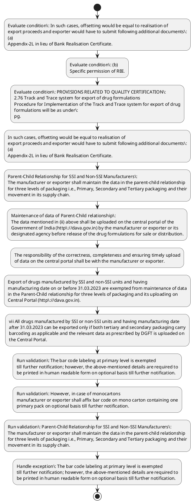

# Chapter 2 / Section 2.76: Track and Trace system for export of drug formulations

**Chapter Title:** General Provisions Regarding Imports and Exports

**Pages:** 31, 32, 33, 34

**Purpose:** 2.76 Track and Trace system for export of drug formulations
Procedure for Implementation of the Track and Trace system for export of drug
formulations will be as under:
pg.

**Purpose Thanglish:** Indha Track and Trace system for export of drug formulations section-la, 2.76 Track and Trace system for export of drug formulations
Procedure for Implementation of the Track and Trace system for export of drug
formulations will be as under:
pg.

**Summary:** 2.76 Track and Trace system for export of drug formulations
Procedure for Implementation of the Track and Trace system for export of drug
formulations will be as under:
pg. 40
receipts of his export proceeds. In such cases, offsetting would be equal to realisation of
export proceeds and exporter would have to submit following additional documents:
(a)
Appendix-2L in lieu of Bank Realisation Certificate.

**Business Meaning:** Track and Trace system for export of drug formulations governs how DGFT business controls should be applied, validated, and enforced.

**Business Explanation:** Track and Trace system for export of drug formulations explains the operating rule set that DEKAI should enforce. Key control points include The bar code labeling at primary level is exempted
till further notification; however, the above-mentioned details are required to
be printed in human readable form on optional basis till further notification. The section also drives actions such as In such cases, offsetting would be equal to realisation of
export proceeds and exporter would have to submit following additional documents:
(a)
Appendix-2L in lieu of Bank Realisation Certificate..

**Business Explanation Thanglish:** Indha Track and Trace system for export of drug formulations section-la, Track and Trace system for export of drug formulations explains the operating rule set that DEKAI should enforce. Key control points include The bar code labeling at primary level is exempted
till further notification; however, the above-mentioned details are required to
be printed in human readable form on optional basis till further notification. The section also drives actions such as In such cases, offsetting would be equal to realisation of
export proceeds and exporter would have to submit following additional documents:
(a)
Appendix-2L in lieu of Bank Realisation Certificate..

## Business Logic
- The bar code labeling at primary level is exempted
till further notification; however, the above-mentioned details are required to
be printed in human readable form on optional basis till further notification.
- However, in case of monocartons
manufacturer or exporter shall affix bar code on mono carton containing one
primary pack on optional basis till further notification.
- Parent–Child Relationship for SSI and Non-SSI Manufacturers:
The manufacturer or exporter shall maintain the data in the parent-child relationship
for three levels of packaging i.e., Primary, Secondary and Tertiary packaging and their
movement in its supply chain.
- Maintenance of data of Parent-Child relationship:
The data mentioned in (ii) above shall be uploaded on the central portal of the
Government of India (http://dava.gov.in) by the manufacturer or exporter or its
designated agency before release of the drug formulations for sale or distribution.
- The responsibility of the correctness, completeness and ensuring timely upload
of data on the central portal shall be with the manufacturer or exporter.
- Pharmexcil shall dispose of such applications on case-to-
case basis with prior approval of Government.

## Business Rules
- rule_id=CH2-SEC2_76-R001, rule_description=The bar code labeling at primary level is exempted
till further notification; however, the above-mentioned details are required to
be printed in human readable form on optional basis till further notification., trigger=Track and Trace system for export of drug formulations, condition=In such cases, offsetting would be equal to realisation of
export proceeds and exporter would have to submit following additional documents:
(a)
Appendix-2L in lieu of Bank Realisation Certificate., validation=The bar code labeling at primary level is exempted
till further notification; however, the above-mentioned details are required to
be printed in human readable form on optional basis till further notification., action=In such cases, offsetting would be equal to realisation of
export proceeds and exporter would have to submit following additional documents:
(a)
Appendix-2L in lieu of Bank Realisation Certificate., exception=The bar code labeling at primary level is exempted
till further notification; however, the above-mentioned details are required to
be printed in human readable form on optional basis till further notification., output=DEKAI should produce a compliance decision for 2.76 - Track and Trace system for export of drug formulations.
- rule_id=CH2-SEC2_76-R002, rule_description=However, in case of monocartons
manufacturer or exporter shall affix bar code on mono carton containing one
primary pack on optional basis till further notification., trigger=Track and Trace system for export of drug formulations, condition=(b)
Specific permission of RBI., validation=However, in case of monocartons
manufacturer or exporter shall affix bar code on mono carton containing one
primary pack on optional basis till further notification., action=Parent–Child Relationship for SSI and Non-SSI Manufacturers:
The manufacturer or exporter shall maintain the data in the parent-child relationship
for three levels of packaging i.e., Primary, Secondary and Tertiary packaging and their
movement in its supply chain., exception=However, in case of monocartons
manufacturer or exporter shall affix bar code on mono carton containing one
primary pack on optional basis till further notification., output=DEKAI should produce a compliance decision for 2.76 - Track and Trace system for export of drug formulations.
- rule_id=CH2-SEC2_76-R003, rule_description=Parent–Child Relationship for SSI and Non-SSI Manufacturers:
The manufacturer or exporter shall maintain the data in the parent-child relationship
for three levels of packaging i.e., Primary, Secondary and Tertiary packaging and their
movement in its supply chain., trigger=Track and Trace system for export of drug formulations, condition=PROVISIONS RELATED TO QUALITY CERTIFICATION:
2.76 Track and Trace system for export of drug formulations
Procedure for Implementation of the Track and Trace system for export of drug
formulations will be as under:
pg., validation=Parent–Child Relationship for SSI and Non-SSI Manufacturers:
The manufacturer or exporter shall maintain the data in the parent-child relationship
for three levels of packaging i.e., Primary, Secondary and Tertiary packaging and their
movement in its supply chain., action=Maintenance of data of Parent-Child relationship:
The data mentioned in (ii) above shall be uploaded on the central portal of the
Government of India (http://dava.gov.in) by the manufacturer or exporter or its
designated agency before release of the drug formulations for sale or distribution., exception=Maintenance of data of Parent-Child relationship:
The data mentioned in (ii) above shall be uploaded on the central portal of the
Government of India (http://dava.gov.in) by the manufacturer or exporter or its
designated agency before release of the drug formulations for sale or distribution., output=DEKAI should produce a compliance decision for 2.76 - Track and Trace system for export of drug formulations.
- rule_id=CH2-SEC2_76-R004, rule_description=Maintenance of data of Parent-Child relationship:
The data mentioned in (ii) above shall be uploaded on the central portal of the
Government of India (http://dava.gov.in) by the manufacturer or exporter or its
designated agency before release of the drug formulations for sale or distribution., trigger=Track and Trace system for export of drug formulations, condition=The manufacturer or the exporter of drug formulations will print the barcode as
per GS1 Global Standard at different packaging levels to facilitate tracking and tracing
of their products., validation=Maintenance of data of Parent-Child relationship:
The data mentioned in (ii) above shall be uploaded on the central portal of the
Government of India (http://dava.gov.in) by the manufacturer or exporter or its
designated agency before release of the drug formulations for sale or distribution., action=The responsibility of the correctness, completeness and ensuring timely upload
of data on the central portal shall be with the manufacturer or exporter., exception=In case, the Government of the importing country has mandated a specific
requirement, the exporter has the option of adhering to the same and in such a case, it
would not be necessary to comply with the stipulation under sub para (i) to (iv) above
and if an exporter is seeking to avail such exemption from bar coding prescribed by
the Government of India as above, the exporter is given the option to move an
application to the Pharmaceutical Export Promotion Council of India (Pharmexcil) for
this purpose, clearly specifying the nature of such an exemption in the interest of the
exports from the country., output=DEKAI should produce a compliance decision for 2.76 - Track and Trace system for export of drug formulations.
- rule_id=CH2-SEC2_76-R005, rule_description=The responsibility of the correctness, completeness and ensuring timely upload
of data on the central portal shall be with the manufacturer or exporter., trigger=Track and Trace system for export of drug formulations, condition=The details are as follows:
a) Primary Level:
Incorporation of two-dimensional (2D) barcode encoding unique and universal
global product identification code in the format of 14 digits Global Trade Item
Number (GTIN) along with batch number, expiry date and a unique serial
number of the primary pack., validation=The responsibility of the correctness, completeness and ensuring timely upload
of data on the central portal shall be with the manufacturer or exporter., action=Export of drugs manufactured by SSI and non-SSI units and having
manufacturing date on or before 31.03.2023 are exempted from maintenance of data
in the Parent-Child relationship for three levels of packaging and its uploading on
Central Portal (http://dava.gov.in)., exception=However, the tertiary level of
packaging will have additional printing of barcode as per Para 2 (i) (c) in addition to
importing country’s requirement, if any., output=DEKAI should produce a compliance decision for 2.76 - Track and Trace system for export of drug formulations.
- rule_id=CH2-SEC2_76-R006, rule_description=Pharmexcil shall dispose of such applications on case-to-
case basis with prior approval of Government., trigger=Track and Trace system for export of drug formulations, condition=The bar code labeling at primary level is exempted
till further notification; however, the above-mentioned details are required to
be printed in human readable form on optional basis till further notification., validation=Pharmexcil shall dispose of such applications on case-to-
case basis with prior approval of Government., action=vii All drugs manufactured by SSI or non-SSI units and having manufacturing date
after 31.03.2023 can be exported only if both tertiary and secondary packaging carry
barcoding as applicable and the relevant data as prescribed by DGFT is uploaded on
the Central Portal., exception=Export of drugs manufactured by SSI and non-SSI units and having
manufacturing date on or before 31.03.2023 are exempted from maintenance of data
in the Parent-Child relationship for three levels of packaging and its uploading on
Central Portal (http://dava.gov.in)., output=DEKAI should produce a compliance decision for 2.76 - Track and Trace system for export of drug formulations.

## Conditions
- In such cases, offsetting would be equal to realisation of
export proceeds and exporter would have to submit following additional documents:
(a)
Appendix-2L in lieu of Bank Realisation Certificate.
- (b)
Specific permission of RBI.
- PROVISIONS RELATED TO QUALITY CERTIFICATION:
2.76 Track and Trace system for export of drug formulations
Procedure for Implementation of the Track and Trace system for export of drug
formulations will be as under:
pg.
- The manufacturer or the exporter of drug formulations will print the barcode as
per GS1 Global Standard at different packaging levels to facilitate tracking and tracing
of their products.
- The details are as follows:
a) Primary Level:
Incorporation of two-dimensional (2D) barcode encoding unique and universal
global product identification code in the format of 14 digits Global Trade Item
Number (GTIN) along with batch number, expiry date and a unique serial
number of the primary pack.
- The bar code labeling at primary level is exempted
till further notification; however, the above-mentioned details are required to
be printed in human readable form on optional basis till further notification.
- b) Secondary level:
Incorporation of one or two dimensional (1D or 2D) barcode encoding unique
and universal global product identification code in the format of 14 digits
Global Trade Item Number (GTIN) along with batch number, expiry date and a
unique serial number of the secondary pack.
- However, in case of monocartons
manufacturer or exporter shall affix bar code on mono carton containing one
primary pack on optional basis till further notification.
- c) Tertiary Level:
Incorporation of one dimensional (1D) barcode encoding unique and universal
global product identification code in the format of 14 digits Global Trade Item
Number (GTIN) along with batch number, expiry date and a unique serial
number of the tertiary pack i.e., Serial Shipping Container Code (SSCC).
- Maintenance of data of Parent-Child relationship:
The data mentioned in (ii) above shall be uploaded on the central portal of the
Government of India (http://dava.gov.in) by the manufacturer or exporter or its
designated agency before release of the drug formulations for sale or distribution.
- In case, the Government of the importing country has mandated a specific
requirement, the exporter has the option of adhering to the same and in such a case, it
would not be necessary to comply with the stipulation under sub para (i) to (iv) above
and if an exporter is seeking to avail such exemption from bar coding prescribed by
the Government of India as above, the exporter is given the option to move an
application to the Pharmaceutical Export Promotion Council of India (Pharmexcil) for
this purpose, clearly specifying the nature of such an exemption in the interest of the
exports from the country.
- However, the tertiary level of
packaging will have additional printing of barcode as per Para 2 (i) (c) in addition to
importing country’s requirement, if any.
- Export of drugs manufactured by SSI and non-SSI units and having
manufacturing date on or before 31.03.2023 are exempted from maintenance of data
in the Parent-Child relationship for three levels of packaging and its uploading on
Central Portal (http://dava.gov.in).
- vii All drugs manufactured by SSI or non-SSI units and having manufacturing date
after 31.03.2023 can be exported only if both tertiary and secondary packaging carry
barcoding as applicable and the relevant data as prescribed by DGFT is uploaded on
the Central Portal.
- vii
All drugs manufactured by SSI or non-SSI units and having manufacturing date
after 31.03.2023 can be exported only if both tertiary and secondary packaging carry
barcoding as applicable and the relevant data as prescribed by DGFT is uploaded on
the Central Portal.
- 42
(b) All relevant guidelines regarding grant of specific exemption(s) if any,
procedure of data requirement / maintenance / upload on central portal
and clarifications issued under this notification etc.
- http://dava.gov.in
(c) It will be the responsibility of the drug manufactures/exporters as the
case may be, to satisfy the customs authorities that the export
consignment satisfies the conditions of the Notification.

## Condition Logic
- id=2.2.76.1, if=In such cases, offsetting would be equal to realisation of
export proceeds and exporter would have to submit following additional documents:
(a)
Appendix-2L in lieu of Bank Realisation Certificate., then=In such cases, offsetting would be equal to realisation of
export proceeds and exporter would have to submit following additional documents:
(a)
Appendix-2L in lieu of Bank Realisation Certificate., source=In such cases, offsetting would be equal to realisation of
export proceeds and exporter would have to submit following additional documents:
(a)
Appendix-2L in lieu of Bank Realisation Certificate.
- id=2.2.76.2, if=(b)
Specific permission of RBI., then=In such cases, offsetting would be equal to realisation of
export proceeds and exporter would have to submit following additional documents:
(a)
Appendix-2L in lieu of Bank Realisation Certificate., source=(b)
Specific permission of RBI.
- id=2.2.76.3, if=PROVISIONS RELATED TO QUALITY CERTIFICATION:
2.76 Track and Trace system for export of drug formulations
Procedure for Implementation of the Track and Trace system for export of drug
formulations will be as under:
pg., then=In such cases, offsetting would be equal to realisation of
export proceeds and exporter would have to submit following additional documents:
(a)
Appendix-2L in lieu of Bank Realisation Certificate., source=PROVISIONS RELATED TO QUALITY CERTIFICATION:
2.76 Track and Trace system for export of drug formulations
Procedure for Implementation of the Track and Trace system for export of drug
formulations will be as under:
pg.
- id=2.2.76.4, if=The manufacturer or the exporter of drug formulations will print the barcode as
per GS1 Global Standard at different packaging levels to facilitate tracking and tracing
of their products., then=In such cases, offsetting would be equal to realisation of
export proceeds and exporter would have to submit following additional documents:
(a)
Appendix-2L in lieu of Bank Realisation Certificate., source=The manufacturer or the exporter of drug formulations will print the barcode as
per GS1 Global Standard at different packaging levels to facilitate tracking and tracing
of their products.
- id=2.2.76.5, if=The details are as follows:
a) Primary Level:
Incorporation of two-dimensional (2D) barcode encoding unique and universal
global product identification code in the format of 14 digits Global Trade Item
Number (GTIN) along with batch number, expiry date and a unique serial
number of the primary pack., then=In such cases, offsetting would be equal to realisation of
export proceeds and exporter would have to submit following additional documents:
(a)
Appendix-2L in lieu of Bank Realisation Certificate., source=The details are as follows:
a) Primary Level:
Incorporation of two-dimensional (2D) barcode encoding unique and universal
global product identification code in the format of 14 digits Global Trade Item
Number (GTIN) along with batch number, expiry date and a unique serial
number of the primary pack.
- id=2.2.76.6, if=The bar code labeling at primary level is exempted
till further notification; however, the above-mentioned details are required to
be printed in human readable form on optional basis till further notification., then=In such cases, offsetting would be equal to realisation of
export proceeds and exporter would have to submit following additional documents:
(a)
Appendix-2L in lieu of Bank Realisation Certificate., source=The bar code labeling at primary level is exempted
till further notification; however, the above-mentioned details are required to
be printed in human readable form on optional basis till further notification.
- id=2.2.76.7, if=b) Secondary level:
Incorporation of one or two dimensional (1D or 2D) barcode encoding unique
and universal global product identification code in the format of 14 digits
Global Trade Item Number (GTIN) along with batch number, expiry date and a
unique serial number of the secondary pack., then=In such cases, offsetting would be equal to realisation of
export proceeds and exporter would have to submit following additional documents:
(a)
Appendix-2L in lieu of Bank Realisation Certificate., source=b) Secondary level:
Incorporation of one or two dimensional (1D or 2D) barcode encoding unique
and universal global product identification code in the format of 14 digits
Global Trade Item Number (GTIN) along with batch number, expiry date and a
unique serial number of the secondary pack.
- id=2.2.76.8, if=However, in case of monocartons
manufacturer or exporter shall affix bar code on mono carton containing one
primary pack on optional basis till further notification., then=In such cases, offsetting would be equal to realisation of
export proceeds and exporter would have to submit following additional documents:
(a)
Appendix-2L in lieu of Bank Realisation Certificate., source=However, in case of monocartons
manufacturer or exporter shall affix bar code on mono carton containing one
primary pack on optional basis till further notification.
- id=2.2.76.9, if=c) Tertiary Level:
Incorporation of one dimensional (1D) barcode encoding unique and universal
global product identification code in the format of 14 digits Global Trade Item
Number (GTIN) along with batch number, expiry date and a unique serial
number of the tertiary pack i.e., Serial Shipping Container Code (SSCC)., then=In such cases, offsetting would be equal to realisation of
export proceeds and exporter would have to submit following additional documents:
(a)
Appendix-2L in lieu of Bank Realisation Certificate., source=c) Tertiary Level:
Incorporation of one dimensional (1D) barcode encoding unique and universal
global product identification code in the format of 14 digits Global Trade Item
Number (GTIN) along with batch number, expiry date and a unique serial
number of the tertiary pack i.e., Serial Shipping Container Code (SSCC).
- id=2.2.76.10, if=Maintenance of data of Parent-Child relationship:
The data mentioned in (ii) above shall be uploaded on the central portal of the
Government of India (http://dava.gov.in) by the manufacturer or exporter or its
designated agency before release of the drug formulations for sale or distribution., then=In such cases, offsetting would be equal to realisation of
export proceeds and exporter would have to submit following additional documents:
(a)
Appendix-2L in lieu of Bank Realisation Certificate., source=Maintenance of data of Parent-Child relationship:
The data mentioned in (ii) above shall be uploaded on the central portal of the
Government of India (http://dava.gov.in) by the manufacturer or exporter or its
designated agency before release of the drug formulations for sale or distribution.
- id=2.2.76.11, if=In case, the Government of the importing country has mandated a specific
requirement, the exporter has the option of adhering to the same and in such a case, it
would not be necessary to comply with the stipulation under sub para (i) to (iv) above
and if an exporter is seeking to avail such exemption from bar coding prescribed by
the Government of India as above, the exporter is given the option to move an
application to the Pharmaceutical Export Promotion Council of India (Pharmexcil) for
this purpose, clearly specifying the nature of such an exemption in the interest of the
exports from the country., then=In such cases, offsetting would be equal to realisation of
export proceeds and exporter would have to submit following additional documents:
(a)
Appendix-2L in lieu of Bank Realisation Certificate., source=In case, the Government of the importing country has mandated a specific
requirement, the exporter has the option of adhering to the same and in such a case, it
would not be necessary to comply with the stipulation under sub para (i) to (iv) above
and if an exporter is seeking to avail such exemption from bar coding prescribed by
the Government of India as above, the exporter is given the option to move an
application to the Pharmaceutical Export Promotion Council of India (Pharmexcil) for
this purpose, clearly specifying the nature of such an exemption in the interest of the
exports from the country.
- id=2.2.76.12, if=However, the tertiary level of
packaging will have additional printing of barcode as per Para 2 (i) (c) in addition to
importing country’s requirement, if any., then=In such cases, offsetting would be equal to realisation of
export proceeds and exporter would have to submit following additional documents:
(a)
Appendix-2L in lieu of Bank Realisation Certificate., source=However, the tertiary level of
packaging will have additional printing of barcode as per Para 2 (i) (c) in addition to
importing country’s requirement, if any.
- id=2.2.76.13, if=Export of drugs manufactured by SSI and non-SSI units and having
manufacturing date on or before 31.03.2023 are exempted from maintenance of data
in the Parent-Child relationship for three levels of packaging and its uploading on
Central Portal (http://dava.gov.in)., then=In such cases, offsetting would be equal to realisation of
export proceeds and exporter would have to submit following additional documents:
(a)
Appendix-2L in lieu of Bank Realisation Certificate., source=Export of drugs manufactured by SSI and non-SSI units and having
manufacturing date on or before 31.03.2023 are exempted from maintenance of data
in the Parent-Child relationship for three levels of packaging and its uploading on
Central Portal (http://dava.gov.in).
- id=2.2.76.14, if=vii All drugs manufactured by SSI or non-SSI units and having manufacturing date
after 31.03.2023 can be exported only if both tertiary and secondary packaging carry
barcoding as applicable and the relevant data as prescribed by DGFT is uploaded on
the Central Portal., then=In such cases, offsetting would be equal to realisation of
export proceeds and exporter would have to submit following additional documents:
(a)
Appendix-2L in lieu of Bank Realisation Certificate., source=vii All drugs manufactured by SSI or non-SSI units and having manufacturing date
after 31.03.2023 can be exported only if both tertiary and secondary packaging carry
barcoding as applicable and the relevant data as prescribed by DGFT is uploaded on
the Central Portal.
- id=2.2.76.15, if=vii
All drugs manufactured by SSI or non-SSI units and having manufacturing date
after 31.03.2023 can be exported only if both tertiary and secondary packaging carry
barcoding as applicable and the relevant data as prescribed by DGFT is uploaded on
the Central Portal., then=In such cases, offsetting would be equal to realisation of
export proceeds and exporter would have to submit following additional documents:
(a)
Appendix-2L in lieu of Bank Realisation Certificate., source=vii
All drugs manufactured by SSI or non-SSI units and having manufacturing date
after 31.03.2023 can be exported only if both tertiary and secondary packaging carry
barcoding as applicable and the relevant data as prescribed by DGFT is uploaded on
the Central Portal.
- id=2.2.76.16, if=any, then=In such cases, offsetting would be equal to realisation of
export proceeds and exporter would have to submit following additional documents:
(a)
Appendix-2L in lieu of Bank Realisation Certificate., source=42
(b) All relevant guidelines regarding grant of specific exemption(s) if any,
procedure of data requirement / maintenance / upload on central portal
and clarifications issued under this notification etc.
- id=2.2.76.17, if=http://dava.gov.in
(c) It will be the responsibility of the drug manufactures/exporters as the
case may be, to satisfy the customs authorities that the export
consignment satisfies the conditions of the Notification., then=In such cases, offsetting would be equal to realisation of
export proceeds and exporter would have to submit following additional documents:
(a)
Appendix-2L in lieu of Bank Realisation Certificate., source=http://dava.gov.in
(c) It will be the responsibility of the drug manufactures/exporters as the
case may be, to satisfy the customs authorities that the export
consignment satisfies the conditions of the Notification.

## Validations
- The bar code labeling at primary level is exempted
till further notification; however, the above-mentioned details are required to
be printed in human readable form on optional basis till further notification.
- However, in case of monocartons
manufacturer or exporter shall affix bar code on mono carton containing one
primary pack on optional basis till further notification.
- Parent–Child Relationship for SSI and Non-SSI Manufacturers:
The manufacturer or exporter shall maintain the data in the parent-child relationship
for three levels of packaging i.e., Primary, Secondary and Tertiary packaging and their
movement in its supply chain.
- Maintenance of data of Parent-Child relationship:
The data mentioned in (ii) above shall be uploaded on the central portal of the
Government of India (http://dava.gov.in) by the manufacturer or exporter or its
designated agency before release of the drug formulations for sale or distribution.
- The responsibility of the correctness, completeness and ensuring timely upload
of data on the central portal shall be with the manufacturer or exporter.
- Pharmexcil shall dispose of such applications on case-to-
case basis with prior approval of Government.

## Exceptions
- The bar code labeling at primary level is exempted
till further notification; however, the above-mentioned details are required to
be printed in human readable form on optional basis till further notification.
- However, in case of monocartons
manufacturer or exporter shall affix bar code on mono carton containing one
primary pack on optional basis till further notification.
- Maintenance of data of Parent-Child relationship:
The data mentioned in (ii) above shall be uploaded on the central portal of the
Government of India (http://dava.gov.in) by the manufacturer or exporter or its
designated agency before release of the drug formulations for sale or distribution.
- In case, the Government of the importing country has mandated a specific
requirement, the exporter has the option of adhering to the same and in such a case, it
would not be necessary to comply with the stipulation under sub para (i) to (iv) above
and if an exporter is seeking to avail such exemption from bar coding prescribed by
the Government of India as above, the exporter is given the option to move an
application to the Pharmaceutical Export Promotion Council of India (Pharmexcil) for
this purpose, clearly specifying the nature of such an exemption in the interest of the
exports from the country.
- However, the tertiary level of
packaging will have additional printing of barcode as per Para 2 (i) (c) in addition to
importing country’s requirement, if any.
- Export of drugs manufactured by SSI and non-SSI units and having
manufacturing date on or before 31.03.2023 are exempted from maintenance of data
in the Parent-Child relationship for three levels of packaging and its uploading on
Central Portal (http://dava.gov.in).
- 42
(b) All relevant guidelines regarding grant of specific exemption(s) if any,
procedure of data requirement / maintenance / upload on central portal
and clarifications issued under this notification etc.

## Dependencies
- 2
- 1

## Authorities
- DGFT
- Drug Control Authority
- customs

## Required Documents
- Appendix-2L in lieu of Bank Realisation Certificate
- In case, the Government of the importing country has mandated a specific
requirement, the exporter has the option of adhering to the same and in such a case, it
would not be necessary to comply with the stipulation under sub para (i) to (iv) above
and if an exporter is seeking to avail such exemption from bar coding prescribed by
the Government of India as above, the exporter is given the option to move an
application to the Pharmaceutical Export Promotion Council of India (Pharmexcil) for
this purpose, clearly specifying the nature of such an exemption in the interest of the
exports from the country.
- Pharmexcil shall dispose of such applications on case-to-
case basis with prior approval of Government.
- Explanation:
(a) For the purpose of this rule,
(i) Drug formulation means a formulation manufactured with a
license from Drug Control Authority under the provisions of Drugs
& Cosmetics Act and Rules made there under and registered as
“Drug” with the FDA of importing country.
- Explanation:
(a)
For the purpose of this rule,
(i)
Drug formulation means a formulation manufactured with a
license from Drug Control Authority under the provisions of Drugs
& Cosmetics Act and Rules made there under and registered as
“Drug” with the FDA of importing country.

## Timelines
- Maintenance of data of Parent-Child relationship:
The data mentioned in (ii) above shall be uploaded on the central portal of the
Government of India (http://dava.gov.in) by the manufacturer or exporter or its
designated agency before release of the drug formulations for sale or distribution.
- Export of drugs manufactured by SSI and non-SSI units and having
manufacturing date on or before 31.03.2023 are exempted from maintenance of data
in the Parent-Child relationship for three levels of packaging and its uploading on
Central Portal (http://dava.gov.in).
- vii All drugs manufactured by SSI or non-SSI units and having manufacturing date
after 31.03.2023 can be exported only if both tertiary and secondary packaging carry
barcoding as applicable and the relevant data as prescribed by DGFT is uploaded on
the Central Portal.
- vii
All drugs manufactured by SSI or non-SSI units and having manufacturing date
after 31.03.2023 can be exported only if both tertiary and secondary packaging carry
barcoding as applicable and the relevant data as prescribed by DGFT is uploaded on
the Central Portal.

## Actions
- In such cases, offsetting would be equal to realisation of
export proceeds and exporter would have to submit following additional documents:
(a)
Appendix-2L in lieu of Bank Realisation Certificate.
- Parent–Child Relationship for SSI and Non-SSI Manufacturers:
The manufacturer or exporter shall maintain the data in the parent-child relationship
for three levels of packaging i.e., Primary, Secondary and Tertiary packaging and their
movement in its supply chain.
- Maintenance of data of Parent-Child relationship:
The data mentioned in (ii) above shall be uploaded on the central portal of the
Government of India (http://dava.gov.in) by the manufacturer or exporter or its
designated agency before release of the drug formulations for sale or distribution.
- The responsibility of the correctness, completeness and ensuring timely upload
of data on the central portal shall be with the manufacturer or exporter.
- Export of drugs manufactured by SSI and non-SSI units and having
manufacturing date on or before 31.03.2023 are exempted from maintenance of data
in the Parent-Child relationship for three levels of packaging and its uploading on
Central Portal (http://dava.gov.in).
- vii All drugs manufactured by SSI or non-SSI units and having manufacturing date
after 31.03.2023 can be exported only if both tertiary and secondary packaging carry
barcoding as applicable and the relevant data as prescribed by DGFT is uploaded on
the Central Portal.
- Explanation:
(a) For the purpose of this rule,
(i) Drug formulation means a formulation manufactured with a
license from Drug Control Authority under the provisions of Drugs
& Cosmetics Act and Rules made there under and registered as
“Drug” with the FDA of importing country.
- vii
All drugs manufactured by SSI or non-SSI units and having manufacturing date
after 31.03.2023 can be exported only if both tertiary and secondary packaging carry
barcoding as applicable and the relevant data as prescribed by DGFT is uploaded on
the Central Portal.
- Explanation:
(a)
For the purpose of this rule,
(i)
Drug formulation means a formulation manufactured with a
license from Drug Control Authority under the provisions of Drugs
& Cosmetics Act and Rules made there under and registered as
“Drug” with the FDA of importing country.
- 42
(b) All relevant guidelines regarding grant of specific exemption(s) if any,
procedure of data requirement / maintenance / upload on central portal
and clarifications issued under this notification etc.

## Workflow
- Evaluate condition: In such cases, offsetting would be equal to realisation of
export proceeds and exporter would have to submit following additional documents:
(a)
Appendix-2L in lieu of Bank Realisation Certificate.
- Evaluate condition: (b)
Specific permission of RBI.
- Evaluate condition: PROVISIONS RELATED TO QUALITY CERTIFICATION:
2.76 Track and Trace system for export of drug formulations
Procedure for Implementation of the Track and Trace system for export of drug
formulations will be as under:
pg.
- In such cases, offsetting would be equal to realisation of
export proceeds and exporter would have to submit following additional documents:
(a)
Appendix-2L in lieu of Bank Realisation Certificate.
- Parent–Child Relationship for SSI and Non-SSI Manufacturers:
The manufacturer or exporter shall maintain the data in the parent-child relationship
for three levels of packaging i.e., Primary, Secondary and Tertiary packaging and their
movement in its supply chain.
- Maintenance of data of Parent-Child relationship:
The data mentioned in (ii) above shall be uploaded on the central portal of the
Government of India (http://dava.gov.in) by the manufacturer or exporter or its
designated agency before release of the drug formulations for sale or distribution.
- The responsibility of the correctness, completeness and ensuring timely upload
of data on the central portal shall be with the manufacturer or exporter.
- Export of drugs manufactured by SSI and non-SSI units and having
manufacturing date on or before 31.03.2023 are exempted from maintenance of data
in the Parent-Child relationship for three levels of packaging and its uploading on
Central Portal (http://dava.gov.in).
- vii All drugs manufactured by SSI or non-SSI units and having manufacturing date
after 31.03.2023 can be exported only if both tertiary and secondary packaging carry
barcoding as applicable and the relevant data as prescribed by DGFT is uploaded on
the Central Portal.
- Run validation: The bar code labeling at primary level is exempted
till further notification; however, the above-mentioned details are required to
be printed in human readable form on optional basis till further notification.
- Run validation: However, in case of monocartons
manufacturer or exporter shall affix bar code on mono carton containing one
primary pack on optional basis till further notification.
- Run validation: Parent–Child Relationship for SSI and Non-SSI Manufacturers:
The manufacturer or exporter shall maintain the data in the parent-child relationship
for three levels of packaging i.e., Primary, Secondary and Tertiary packaging and their
movement in its supply chain.
- Handle exception: The bar code labeling at primary level is exempted
till further notification; however, the above-mentioned details are required to
be printed in human readable form on optional basis till further notification.

## Workflow ASCII
```text
Track and Trace system for export of drug formulations
Evaluate condition: In such cases, offsetting would be equal to realisation of
export proceeds and exporter would have to submit following additional documents:
(a)
Appendix-2L in lieu of Bank Realisation Certificate.
   |
   v
Evaluate condition: (b)
Specific permission of RBI.
   |
   v
Evaluate condition: PROVISIONS RELATED TO QUALITY CERTIFICATION:
2.76 Track and Trace system for export of drug formulations
Procedure for Implementation of the Track and Trace system for export of drug
formulations will be as under:
pg.
   |
   v
In such cases, offsetting would be equal to realisation of
export proceeds and exporter would have to submit following additional documents:
(a)
Appendix-2L in lieu of Bank Realisation Certificate.
   |
   v
Parent–Child Relationship for SSI and Non-SSI Manufacturers:
The manufacturer or exporter shall maintain the data in the parent-child relationship
for three levels of packaging i.e., Primary, Secondary and Tertiary packaging and their
movement in its supply chain.
   |
   v
Maintenance of data of Parent-Child relationship:
The data mentioned in (ii) above shall be uploaded on the central portal of the
Government of India (http://dava.gov.in) by the manufacturer or exporter or its
designated agency before release of the drug formulations for sale or distribution.
   |
   v
The responsibility of the correctness, completeness and ensuring timely upload
of data on the central portal shall be with the manufacturer or exporter.
   |
   v
Export of drugs manufactured by SSI and non-SSI units and having
manufacturing date on or before 31.03.2023 are exempted from maintenance of data
in the Parent-Child relationship for three levels of packaging and its uploading on
Central Portal (http://dava.gov.in).
   |
   v
vii All drugs manufactured by SSI or non-SSI units and having manufacturing date
after 31.03.2023 can be exported only if both tertiary and secondary packaging carry
barcoding as applicable and the relevant data as prescribed by DGFT is uploaded on
the Central Portal.
   |
   v
Run validation: The bar code labeling at primary level is exempted
till further notification; however, the above-mentioned details are required to
be printed in human readable form on optional basis till further notification.
   |
   v
Run validation: However, in case of monocartons
manufacturer or exporter shall affix bar code on mono carton containing one
primary pack on optional basis till further notification.
   |
   v
Run validation: Parent–Child Relationship for SSI and Non-SSI Manufacturers:
The manufacturer or exporter shall maintain the data in the parent-child relationship
for three levels of packaging i.e., Primary, Secondary and Tertiary packaging and their
movement in its supply chain.
   |
   v
Handle exception: The bar code labeling at primary level is exempted
till further notification; however, the above-mentioned details are required to
be printed in human readable form on optional basis till further notification.
```

## Decision Tree
- IF In such cases, offsetting would be equal to realisation of
export proceeds and exporter would have to submit following additional documents:
(a)
Appendix-2L in lieu of Bank Realisation Certificate. THEN In such cases, offsetting would be equal to realisation of
export proceeds and exporter would have to submit following additional documents:
(a)
Appendix-2L in lieu of Bank Realisation Certificate.
- IF (b)
Specific permission of RBI. THEN In such cases, offsetting would be equal to realisation of
export proceeds and exporter would have to submit following additional documents:
(a)
Appendix-2L in lieu of Bank Realisation Certificate.
- IF PROVISIONS RELATED TO QUALITY CERTIFICATION:
2.76 Track and Trace system for export of drug formulations
Procedure for Implementation of the Track and Trace system for export of drug
formulations will be as under:
pg. THEN In such cases, offsetting would be equal to realisation of
export proceeds and exporter would have to submit following additional documents:
(a)
Appendix-2L in lieu of Bank Realisation Certificate.
- IF The manufacturer or the exporter of drug formulations will print the barcode as
per GS1 Global Standard at different packaging levels to facilitate tracking and tracing
of their products. THEN In such cases, offsetting would be equal to realisation of
export proceeds and exporter would have to submit following additional documents:
(a)
Appendix-2L in lieu of Bank Realisation Certificate.
- IF The details are as follows:
a) Primary Level:
Incorporation of two-dimensional (2D) barcode encoding unique and universal
global product identification code in the format of 14 digits Global Trade Item
Number (GTIN) along with batch number, expiry date and a unique serial
number of the primary pack. THEN In such cases, offsetting would be equal to realisation of
export proceeds and exporter would have to submit following additional documents:
(a)
Appendix-2L in lieu of Bank Realisation Certificate.
- IF exception applies (The bar code labeling at primary level is exempted
till further notification; however, the above-mentioned details are required to
be printed in human readable form on optional basis till further notification.) THEN route to manual review
- IF exception applies (However, in case of monocartons
manufacturer or exporter shall affix bar code on mono carton containing one
primary pack on optional basis till further notification.) THEN route to manual review
- IF exception applies (Maintenance of data of Parent-Child relationship:
The data mentioned in (ii) above shall be uploaded on the central portal of the
Government of India (http://dava.gov.in) by the manufacturer or exporter or its
designated agency before release of the drug formulations for sale or distribution.) THEN route to manual review

## Decision Tree ASCII
```text
Track and Trace system for export of drug formulations Decision
IF In such cases, offsetting would be equal to realisation of
export proceeds and exporter would have to submit following additional documents:
(a)
Appendix-2L in lieu of Bank Realisation Certificate. THEN In such cases, offsetting would be equal to realisation of
export proceeds and exporter would have to submit following additional documents:
(a)
Appendix-2L in lieu of Bank Realisation Certificate.
   |
   v
IF (b)
Specific permission of RBI. THEN In such cases, offsetting would be equal to realisation of
export proceeds and exporter would have to submit following additional documents:
(a)
Appendix-2L in lieu of Bank Realisation Certificate.
   |
   v
IF PROVISIONS RELATED TO QUALITY CERTIFICATION:
2.76 Track and Trace system for export of drug formulations
Procedure for Implementation of the Track and Trace system for export of drug
formulations will be as under:
pg. THEN In such cases, offsetting would be equal to realisation of
export proceeds and exporter would have to submit following additional documents:
(a)
Appendix-2L in lieu of Bank Realisation Certificate.
   |
   v
IF The manufacturer or the exporter of drug formulations will print the barcode as
per GS1 Global Standard at different packaging levels to facilitate tracking and tracing
of their products. THEN In such cases, offsetting would be equal to realisation of
export proceeds and exporter would have to submit following additional documents:
(a)
Appendix-2L in lieu of Bank Realisation Certificate.
   |
   v
IF The details are as follows:
a) Primary Level:
Incorporation of two-dimensional (2D) barcode encoding unique and universal
global product identification code in the format of 14 digits Global Trade Item
Number (GTIN) along with batch number, expiry date and a unique serial
number of the primary pack. THEN In such cases, offsetting would be equal to realisation of
export proceeds and exporter would have to submit following additional documents:
(a)
Appendix-2L in lieu of Bank Realisation Certificate.
   |
   v
IF exception applies (The bar code labeling at primary level is exempted
till further notification; however, the above-mentioned details are required to
be printed in human readable form on optional basis till further notification.) THEN route to manual review
   |
   v
IF exception applies (However, in case of monocartons
manufacturer or exporter shall affix bar code on mono carton containing one
primary pack on optional basis till further notification.) THEN route to manual review
   |
   v
IF exception applies (Maintenance of data of Parent-Child relationship:
The data mentioned in (ii) above shall be uploaded on the central portal of the
Government of India (http://dava.gov.in) by the manufacturer or exporter or its
designated agency before release of the drug formulations for sale or distribution.) THEN route to manual review
```

## Examples
- User asks to process Track and Trace system for export of drug formulations; the platform checks conditions, validations, and documents before action.

**Real-world Example:** Example: an importer or exporter invokes Track and Trace system for export of drug formulations, submits Appendix-2L in lieu of Bank Realisation Certificate, In case, the Government of the importing country has mandated a specific
requirement, the exporter has the option of adhering to the same and in such a case, it
would not be necessary to comply with the stipulation under sub para (i) to (iv) above
and if an exporter is seeking to avail such exemption from bar coding prescribed by
the Government of India as above, the exporter is given the option to move an
application to the Pharmaceutical Export Promotion Council of India (Pharmexcil) for
this purpose, clearly specifying the nature of such an exemption in the interest of the
exports from the country., Pharmexcil shall dispose of such applications on case-to-
case basis with prior approval of Government., and DEKAI uses the extracted rules to in such cases, offsetting would be equal to realisation of
export proceeds and exporter would have to submit following additional documents:
(a)
appendix-2l in lieu of bank realisation certificate..

**Real-world Example Thanglish:** Indha Track and Trace system for export of drug formulations section-la, Example: an importer or exporter invokes Track and Trace system for export of drug formulations, submits Appendix-2L in lieu of Bank Realisation Certificate, In case, the Government of the importing country has mandated a specific
requirement, the exporter has the option of adhering to the same and in such a case, it
would not be necessary to comply with the stipulation under sub para (i) to (iv) above
and if an exporter is seeking to avail such exemption from bar coding prescribed by
the Government of India as above, the exporter is given the option to move an
application to the Pharmaceutical export Promotion Council of India (Pharmexcil) for
this purpose, clearly specifying the nature of such an exemption in the interest of the
exports from the country., Pharmexcil kandippa dispose of such applications on case-to-
case basis with prior approval of Government., and DEKAI uses the extracted rules to in such cases, offsetting would be equal to realisation of
export proceeds and exporter would have to submit following additional documents:
(a)
appendix-2l in lieu of bank realisation certificate..

## AI Rules
- IF detected context matches section rule THEN enforce: The bar code labeling at primary level is exempted
till further notification; however, the above-mentioned details are required to
be printed in human readable form on optional basis till further notification.
- IF detected context matches section rule THEN enforce: However, in case of monocartons
manufacturer or exporter shall affix bar code on mono carton containing one
primary pack on optional basis till further notification.
- IF detected context matches section rule THEN enforce: Parent–Child Relationship for SSI and Non-SSI Manufacturers:
The manufacturer or exporter shall maintain the data in the parent-child relationship
for three levels of packaging i.e., Primary, Secondary and Tertiary packaging and their
movement in its supply chain.
- IF detected context matches section rule THEN enforce: Maintenance of data of Parent-Child relationship:
The data mentioned in (ii) above shall be uploaded on the central portal of the
Government of India (http://dava.gov.in) by the manufacturer or exporter or its
designated agency before release of the drug formulations for sale or distribution.
- IF detected context matches section rule THEN enforce: The responsibility of the correctness, completeness and ensuring timely upload
of data on the central portal shall be with the manufacturer or exporter.
- IF detected context matches section rule THEN enforce: Pharmexcil shall dispose of such applications on case-to-
case basis with prior approval of Government.
- IF validations pass THEN recommend action: In such cases, offsetting would be equal to realisation of
export proceeds and exporter would have to submit following additional documents:
(a)
Appendix-2L in lieu of Bank Realisation Certificate.

## Database Fields
- name=section_code, type=string, required=True, source=parsed_section_heading
- name=section_title, type=string, required=True, source=parsed_section_heading
- name=and_flag, type=boolean, required=False, source=keyword:and
- name=for_flag, type=boolean, required=False, source=keyword:for
- name=the_flag, type=boolean, required=False, source=keyword:the
- name=his_flag, type=boolean, required=False, source=keyword:his
- name=rbi_flag, type=boolean, required=False, source=keyword:RBI
- name=per_flag, type=boolean, required=False, source=keyword:per
- name=are_flag, type=boolean, required=False, source=keyword:are
- name=bar_flag, type=boolean, required=False, source=keyword:bar
- name=document_1_submitted, type=boolean, required=True, source=Appendix-2L in lieu of Bank Realisation Certificate
- name=document_2_submitted, type=boolean, required=True, source=In case, the Government of the importing country has mandated a specific
requirement, the exporter has the option of adhering to the same and in such a case, it
would not be necessary to comply with the stipulation under sub para (i) to (iv) above
and if an exporter is seeking to avail such exemption from bar coding prescribed by
the Government of India as above, the exporter is given the option to move an
application to the Pharmaceutical Export Promotion Council of India (Pharmexcil) for
this purpose, clearly specifying the nature of such an exemption in the interest of the
exports from the country.
- name=document_3_submitted, type=boolean, required=True, source=Pharmexcil shall dispose of such applications on case-to-
case basis with prior approval of Government.
- name=document_4_submitted, type=boolean, required=True, source=Explanation:
(a) For the purpose of this rule,
(i) Drug formulation means a formulation manufactured with a
license from Drug Control Authority under the provisions of Drugs
& Cosmetics Act and Rules made there under and registered as
“Drug” with the FDA of importing country.
- name=document_5_submitted, type=boolean, required=True, source=Explanation:
(a)
For the purpose of this rule,
(i)
Drug formulation means a formulation manufactured with a
license from Drug Control Authority under the provisions of Drugs
& Cosmetics Act and Rules made there under and registered as
“Drug” with the FDA of importing country.

## API Requirements
- method=GET, path=/api/dgft/sections/2.76, purpose=Retrieve knowledge payload for section 2.76, query_params=['include=workflow,decision_tree,validations'], response_fields=['section', 'title', 'summary', 'conditions', 'validations', 'exceptions', 'workflow', 'decision_tree']
- method=POST, path=/api/dgft/Track-and-Trace-system-for-export-of-drug-formulations/validate, purpose=Validate inputs and documents for Track and Trace system for export of drug formulations, request_fields=['section_code', 'section_title', 'document_1_submitted', 'document_2_submitted', 'document_3_submitted', 'document_4_submitted', 'document_5_submitted'], response_fields=['status', 'errors', 'warnings', 'next_actions']
- method=POST, path=/api/dgft/Track-and-Trace-system-for-export-of-drug-formulations/execute, purpose=Trigger business action for In such cases, offsetting would be equal to realisation of
export proceeds and exporter would have to submit following additional documents:
(a)
Appendix-2L in lieu of Bank Realisation Certificate., request_fields=['section_code', 'section_title', 'document_1_submitted', 'document_2_submitted', 'document_3_submitted', 'document_4_submitted', 'document_5_submitted'], response_fields=['reference_id', 'status', 'authority', 'timeline']

## UI Screens
- screen_id=Track_and_Trace_system_for_export_of_drug_formulations_overview, name=Track and Trace system for export of drug formulations Overview, purpose=Show section summary, authority, timeline, and eligibility cues., widgets=['summary_card', 'conditions_table', 'authority_badges', 'timeline_panel']
- screen_id=Track_and_Trace_system_for_export_of_drug_formulations_submission, name=Track and Trace system for export of drug formulations Submission, purpose=Capture applicant data and supporting documents., widgets=['dynamic_form', 'document_uploader', 'validation_panel', 'next_action_footer'], fields=['section_code', 'section_title', 'and_flag', 'for_flag', 'the_flag', 'his_flag', 'rbi_flag', 'per_flag']
- screen_id=Track_and_Trace_system_for_export_of_drug_formulations_exceptions, name=Track and Trace system for export of drug formulations Exception Review, purpose=Explain exception handling and manual review triggers., widgets=['exception_banner', 'decision_tree', 'case_notes']

## Error Messages
- Validation failed because the section requirements were not fully met.

## FAQ
- question_en=What is the purpose of section 2.76?, answer_en=Track and Trace system for export of drug formulations explains the operating rule set that DEKAI should enforce. Key control points include The bar code labeling at primary level is exempted
till further notification; however, the above-mentioned details are required to
be printed in human readable form on optional basis till further notification. The section also drives actions such as In such cases, offsetting would be equal to realisation of
export proceeds and exporter would have to submit following additional documents:
(a)
Appendix-2L in lieu of Bank Realisation Certificate.., question_thanglish=Indha Track and Trace system for export of drug formulations section-la, What is the purpose of section 2.76?, answer_thanglish=Indha Track and Trace system for export of drug formulations section-la, Track and Trace system for export of drug formulations explains the operating rule set that DEKAI should enforce. Key control points include The bar code labeling at primary level is exempted
till further notification; however, the above-mentioned details are required to
be printed in human readable form on optional basis till further notification. The section also drives actions such as In such cases, offsetting would be equal to realisation of
export proceeds and exporter would have to submit following additional documents:
(a)
Appendix-2L in lieu of Bank Realisation Certificate..
- question_en=What documents are required under Track and Trace system for export of drug formulations?, answer_en=Appendix-2L in lieu of Bank Realisation Certificate, In case, the Government of the importing country has mandated a specific
requirement, the exporter has the option of adhering to the same and in such a case, it
would not be necessary to comply with the stipulation under sub para (i) to (iv) above
and if an exporter is seeking to avail such exemption from bar coding prescribed by
the Government of India as above, the exporter is given the option to move an
application to the Pharmaceutical Export Promotion Council of India (Pharmexcil) for
this purpose, clearly specifying the nature of such an exemption in the interest of the
exports from the country., Pharmexcil shall dispose of such applications on case-to-
case basis with prior approval of Government., Explanation:
(a) For the purpose of this rule,
(i) Drug formulation means a formulation manufactured with a
license from Drug Control Authority under the provisions of Drugs
& Cosmetics Act and Rules made there under and registered as
“Drug” with the FDA of importing country., Explanation:
(a)
For the purpose of this rule,
(i)
Drug formulation means a formulation manufactured with a
license from Drug Control Authority under the provisions of Drugs
& Cosmetics Act and Rules made there under and registered as
“Drug” with the FDA of importing country., question_thanglish=Indha Track and Trace system for export of drug formulations section-la, What documents are required under Track and Trace system for export of drug formulations?, answer_thanglish=Indha Track and Trace system for export of drug formulations section-la, Appendix-2L in lieu of Bank Realisation Certificate, In case, the Government of the importing country has mandated a specific
requirement, the exporter has the option of adhering to the same and in such a case, it
would not be necessary to comply with the stipulation under sub para (i) to (iv) above
and if an exporter is seeking to avail such exemption from bar coding prescribed by
the Government of India as above, the exporter is given the option to move an
application to the Pharmaceutical export Promotion Council of India (Pharmexcil) for
this purpose, clearly specifying the nature of such an exemption in the interest of the
exports from the country., Pharmexcil kandippa dispose of such applications on case-to-
case basis with prior approval of Government., Explanation:
(a) For the purpose of this rule,
(i) Drug formulation means a formulation manufactured with a
license from Drug Control authority under the provisions of Drugs
& Cosmetics Act and Rules made there under and registered as
“Drug” with the FDA of importing country., Explanation:
(a)
For the purpose of this rule,
(i)
Drug formulation means a formulation manufactured with a
license from Drug Control authority under the provisions of Drugs
& Cosmetics Act and Rules made there under and registered as
“Drug” with the FDA of importing country.
- question_en=Which authority handles Track and Trace system for export of drug formulations?, answer_en=DGFT, Drug Control Authority, customs, question_thanglish=Indha Track and Trace system for export of drug formulations section-la, Which authority handles Track and Trace system for export of drug formulations?, answer_thanglish=Indha Track and Trace system for export of drug formulations section-la, DGFT, Drug Control authority, customs

## Questions Users May Ask
- What does Track and Trace system for export of drug formulations require?
- Which documents are needed for Track and Trace system for export of drug formulations?
- How does DEKAI validate Track and Trace system for export of drug formulations requests?
- What action should be taken for Track and Trace system for export of drug formulations?

## Expected AI Answers
- Track and Trace system for export of drug formulations requires the platform to interpret the section text, apply the extracted business rules, and present the correct next action.
- Required documents are inferred from the section text: Appendix-2L in lieu of Bank Realisation Certificate, In case, the Government of the importing country has mandated a specific
requirement, the exporter has the option of adhering to the same and in such a case, it
would not be necessary to comply with the stipulation under sub para (i) to (iv) above
and if an exporter is seeking to avail such exemption from bar coding prescribed by
the Government of India as above, the exporter is given the option to move an
application to the Pharmaceutical Export Promotion Council of India (Pharmexcil) for
this purpose, clearly specifying the nature of such an exemption in the interest of the
exports from the country., Pharmexcil shall dispose of such applications on case-to-
case basis with prior approval of Government., Explanation:
(a) For the purpose of this rule,
(i) Drug formulation means a formulation manufactured with a
license from Drug Control Authority under the provisions of Drugs
& Cosmetics Act and Rules made there under and registered as
“Drug” with the FDA of importing country., Explanation:
(a)
For the purpose of this rule,
(i)
Drug formulation means a formulation manufactured with a
license from Drug Control Authority under the provisions of Drugs
& Cosmetics Act and Rules made there under and registered as
“Drug” with the FDA of importing country.
- DEKAI validates Track and Trace system for export of drug formulations by checking conditions, required documents, authority references, and exception clauses before recommending an outcome.
- The primary extracted action is: In such cases, offsetting would be equal to realisation of
export proceeds and exporter would have to submit following additional documents:
(a)
Appendix-2L in lieu of Bank Realisation Certificate.

## AI Q&A Examples
- question_en=User asks: How do I comply with Track and Trace system for export of drug formulations?, answer_en=AI answers: DEKAI should evaluate section 2.76, apply the extracted rules, and guide the user through Evaluate condition: In such cases, offsetting would be equal to realisation of
export proceeds and exporter would have to submit following additional documents:
(a)
Appendix-2L in lieu of Bank Realisation Certificate.., question_thanglish=Indha Track and Trace system for export of drug formulations section-la, User asks: How do I comply with Track and Trace system for export of drug formulations?, answer_thanglish=Indha Track and Trace system for export of drug formulations section-la, AI answers: DEKAI should evaluate section 2.76, apply the extracted rules, and guide the user through Evaluate condition: In such cases, offsetting would be equal to realisation of
export proceeds and exporter would have to submit following additional documents:
(a)
Appendix-2L in lieu of Bank Realisation Certificate..
- question_en=User asks: Which validations apply to Track and Trace system for export of drug formulations?, answer_en=AI answers: Applicable validations are The bar code labeling at primary level is exempted
till further notification; however, the above-mentioned details are required to
be printed in human readable form on optional basis till further notification., However, in case of monocartons
manufacturer or exporter shall affix bar code on mono carton containing one
primary pack on optional basis till further notification., Parent–Child Relationship for SSI and Non-SSI Manufacturers:
The manufacturer or exporter shall maintain the data in the parent-child relationship
for three levels of packaging i.e., Primary, Secondary and Tertiary packaging and their
movement in its supply chain., question_thanglish=Indha Track and Trace system for export of drug formulations section-la, User asks: Which validations apply to Track and Trace system for export of drug formulations?, answer_thanglish=Indha Track and Trace system for export of drug formulations section-la, AI answers: Applicable validations are The bar code labeling at primary level is exempted
till further notification; however, the above-mentioned details are required to
be printed in human readable form on optional basis till further notification., However, in case of monocartons
manufacturer or exporter kandippa affix bar code on mono carton containing one
primary pack on optional basis till further notification., Parent–Child Relationship for SSI and Non-SSI Manufacturers:
The manufacturer or exporter kandippa maintain the data in the parent-child relationship
for three levels of packaging i.e., Primary, Secondary and Tertiary packaging and their
movement in its supply chain.

## DEKAI AI Implementation Notes
- Capture chapter 2, section 2.76, title, and page references as immutable knowledge metadata.
- Bind validations for Track and Trace system for export of drug formulations into a rule engine keyed by the rule IDs extracted for this section.
- Expose document upload controls for: Appendix-2L in lieu of Bank Realisation Certificate, In case, the Government of the importing country has mandated a specific
requirement, the exporter has the option of adhering to the same and in such a case, it
would not be necessary to comply with the stipulation under sub para (i) to (iv) above
and if an exporter is seeking to avail such exemption from bar coding prescribed by
the Government of India as above, the exporter is given the option to move an
application to the Pharmaceutical Export Promotion Council of India (Pharmexcil) for
this purpose, clearly specifying the nature of such an exemption in the interest of the
exports from the country., Pharmexcil shall dispose of such applications on case-to-
case basis with prior approval of Government., Explanation:
(a) For the purpose of this rule,
(i) Drug formulation means a formulation manufactured with a
license from Drug Control Authority under the provisions of Drugs
& Cosmetics Act and Rules made there under and registered as
“Drug” with the FDA of importing country., Explanation:
(a)
For the purpose of this rule,
(i)
Drug formulation means a formulation manufactured with a
license from Drug Control Authority under the provisions of Drugs
& Cosmetics Act and Rules made there under and registered as
“Drug” with the FDA of importing country..
- Route escalations or approvals to: DGFT, Drug Control Authority, customs.
- Trigger manual review when exception clauses are detected.
- Show contextual links to related sections: 1.

## DEKAI AI Implementation Notes Thanglish
- Indha Track and Trace system for export of drug formulations section-la, Capture chapter 2, section 2.76, title, and page references as immutable knowledge metadata.
- Indha Track and Trace system for export of drug formulations section-la, Bind validations for Track and Trace system for export of drug formulations into a rule engine keyed by the rule IDs extracted for this section.
- Indha Track and Trace system for export of drug formulations section-la, Expose document upload controls for: Appendix-2L in lieu of Bank Realisation Certificate, In case, the Government of the importing country has mandated a specific
requirement, the exporter has the option of adhering to the same and in such a case, it
would not be necessary to comply with the stipulation under sub para (i) to (iv) above
and if an exporter is seeking to avail such exemption from bar coding prescribed by
the Government of India as above, the exporter is given the option to move an
application to the Pharmaceutical export Promotion Council of India (Pharmexcil) for
this purpose, clearly specifying the nature of such an exemption in the interest of the
exports from the country., Pharmexcil kandippa dispose of such applications on case-to-
case basis with prior approval of Government., Explanation:
(a) For the purpose of this rule,
(i) Drug formulation means a formulation manufactured with a
license from Drug Control authority under the provisions of Drugs
& Cosmetics Act and Rules made there under and registered as
“Drug” with the FDA of importing country., Explanation:
(a)
For the purpose of this rule,
(i)
Drug formulation means a formulation manufactured with a
license from Drug Control authority under the provisions of Drugs
& Cosmetics Act and Rules made there under and registered as
“Drug” with the FDA of importing country..
- Indha Track and Trace system for export of drug formulations section-la, Route escalations or approvals to: DGFT, Drug Control authority, customs.
- Indha Track and Trace system for export of drug formulations section-la, Trigger manual review when exception clauses are detected.
- Indha Track and Trace system for export of drug formulations section-la, Show contextual links to related sections: 1.

## AI Metadata
- Keywords: and, for, the, his, RBI, per, are, bar, one, two, SSI, its, iii, gov, has, not, sub, any, vii, All
- Search Keywords: and, for, the, his, RBI, per, are, bar, one, two, SSI, its, iii, gov, has, not, sub, any, vii, All
- Intent: Support Track and Trace system for export of drug formulations processing and compliance validation.
- Tags: 2.76, Track and Trace system for export of drug formulations, business-rule, document-driven, dgft
- Related Sections: 1
- Related Chapters: 
- Related Rules: The bar code labeling at primary level is exempted
till further notification; however, the above-mentioned details are required to
be printed in human readable form on optional basis till further notification., However, in case of monocartons
manufacturer or exporter shall affix bar code on mono carton containing one
primary pack on optional basis till further notification., Parent–Child Relationship for SSI and Non-SSI Manufacturers:
The manufacturer or exporter shall maintain the data in the parent-child relationship
for three levels of packaging i.e., Primary, Secondary and Tertiary packaging and their
movement in its supply chain., Maintenance of data of Parent-Child relationship:
The data mentioned in (ii) above shall be uploaded on the central portal of the
Government of India (http://dava.gov.in) by the manufacturer or exporter or its
designated agency before release of the drug formulations for sale or distribution., The responsibility of the correctness, completeness and ensuring timely upload
of data on the central portal shall be with the manufacturer or exporter.

## Mermaid

```mermaid
flowchart TD
    S1["Evaluate condition: In such cases, offsetting would be equal to realisation of
export proceeds and exporter would have to submit following additional documents:
(a)
Appendix-2L in lieu of Bank Realisation Certificate."]
    S2["Evaluate condition: (b)
Specific permission of RBI."]
    S1 --> S2
    S3["Evaluate condition: PROVISIONS RELATED TO QUALITY CERTIFICATION:
2.76 Track and Trace system for export of drug formulations
Procedure for Implementation of the Track and Trace system for export of drug
formulations will be as under:
pg."]
    S2 --> S3
    S4["In such cases, offsetting would be equal to realisation of
export proceeds and exporter would have to submit following additional documents:
(a)
Appendix-2L in lieu of Bank Realisation Certificate."]
    S3 --> S4
    S5["Parent–Child Relationship for SSI and Non-SSI Manufacturers:
The manufacturer or exporter shall maintain the data in the parent-child relationship
for three levels of packaging i.e., Primary, Secondary and Tertiary packaging and their
movement in its supply chain."]
    S4 --> S5
    S6["Maintenance of data of Parent-Child relationship:
The data mentioned in (ii) above shall be uploaded on the central portal of the
Government of India (http://dava.gov.in) by the manufacturer or exporter or its
designated agency before release of the drug formulations for sale or distribution."]
    S5 --> S6
    S7["The responsibility of the correctness, completeness and ensuring timely upload
of data on the central portal shall be with the manufacturer or exporter."]
    S6 --> S7
    S8["Export of drugs manufactured by SSI and non-SSI units and having
manufacturing date on or before 31.03.2023 are exempted from maintenance of data
in the Parent-Child relationship for three levels of packaging and its uploading on
Central Portal (http://dava.gov.in)."]
    S7 --> S8
    S9["vii All drugs manufactured by SSI or non-SSI units and having manufacturing date
after 31.03.2023 can be exported only if both tertiary and secondary packaging carry
barcoding as applicable and the relevant data as prescribed by DGFT is uploaded on
the Central Portal."]
    S8 --> S9
    S10["Run validation: The bar code labeling at primary level is exempted
till further notification; however, the above-mentioned details are required to
be printed in human readable form on optional basis till further notification."]
    S9 --> S10
    S11["Run validation: However, in case of monocartons
manufacturer or exporter shall affix bar code on mono carton containing one
primary pack on optional basis till further notification."]
    S10 --> S11
    S12["Run validation: Parent–Child Relationship for SSI and Non-SSI Manufacturers:
The manufacturer or exporter shall maintain the data in the parent-child relationship
for three levels of packaging i.e., Primary, Secondary and Tertiary packaging and their
movement in its supply chain."]
    S11 --> S12
    S13["Handle exception: The bar code labeling at primary level is exempted
till further notification; however, the above-mentioned details are required to
be printed in human readable form on optional basis till further notification."]
    S12 --> S13
```


## PlantUML

