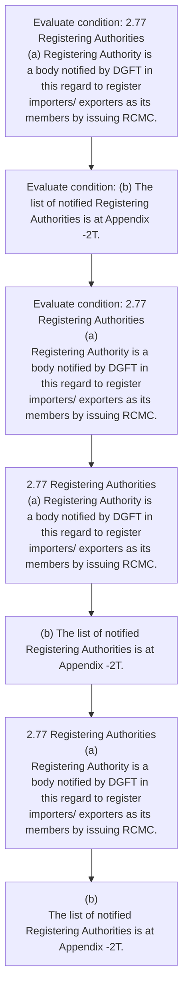
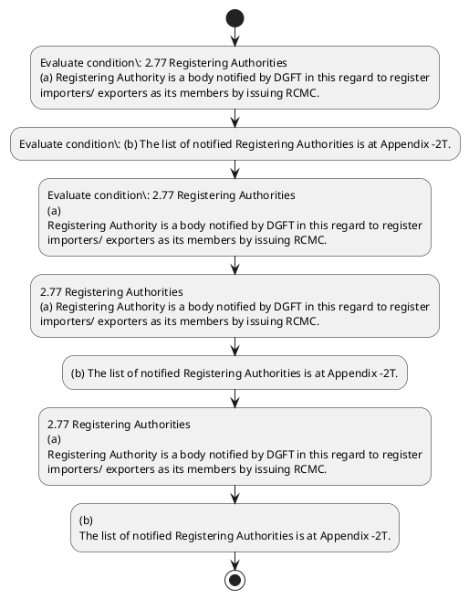

# Chapter 2 / Section 2.77: Registering Authorities

**Chapter Title:** General Provisions Regarding Imports and Exports

**Pages:** 34

**Purpose:** 2.77 Registering Authorities
(a) Registering Authority is a body notified by DGFT in this regard to register
importers/ exporters as its members by issuing RCMC.

**Purpose Thanglish:** Indha Registering Authorities section-la, 2.77 Registering Authorities
(a) Registering authority is a body notified by DGFT in this regard to register
importers/ exporters as its members by issuing RCMC.

**Summary:** 2.77 Registering Authorities
(a) Registering Authority is a body notified by DGFT in this regard to register
importers/ exporters as its members by issuing RCMC. (b) The list of notified Registering Authorities is at Appendix -2T. 2.77 Registering Authorities
(a)
Registering Authority is a body notified by DGFT in this regard to register
importers/ exporters as its members by issuing RCMC.

**Business Meaning:** 2.77 Registering Authorities
(a) Registering Authority is a body notified by DGFT in this regard to register
importers/ exporters as its members by issuing RCMC.

**Business Explanation:** 2.77 Registering Authorities
(a) Registering Authority is a body notified by DGFT in this regard to register
importers/ exporters as its members by issuing RCMC. (b) The list of notified Registering Authorities is at Appendix -2T. 2.77 Registering Authorities
(a)
Registering Authority is a body notified by DGFT in this regard to register
importers/ exporters as its members by issuing RCMC.

**Business Explanation Thanglish:** Indha Registering Authorities section-la, 2.77 Registering Authorities
(a) Registering authority is a body notified by DGFT in this regard to register
importers/ exporters as its members by issuing RCMC. (b) The list of notified Registering Authorities is at Appendix -2T. 2.77 Registering Authorities
(a)
Registering authority is a body notified by DGFT in this regard to register
importers/ exporters as its members by issuing RCMC.

## Business Logic
- None identified

## Business Rules
- rule_id=CH2-SEC2_77-R001, rule_description=IF validations pass THEN recommend action: 2.77 Registering Authorities
(a) Registering Authority is a body notified by DGFT in this regard to register
importers/ exporters as its members by issuing RCMC., trigger=Registering Authorities, condition=2.77 Registering Authorities
(a) Registering Authority is a body notified by DGFT in this regard to register
importers/ exporters as its members by issuing RCMC., validation=Not explicitly covered in uploaded documents., action=2.77 Registering Authorities
(a) Registering Authority is a body notified by DGFT in this regard to register
importers/ exporters as its members by issuing RCMC., exception=No explicit exception found in uploaded documents., output=DEKAI should produce a compliance decision for 2.77 - Registering Authorities.

## Conditions
- 2.77 Registering Authorities
(a) Registering Authority is a body notified by DGFT in this regard to register
importers/ exporters as its members by issuing RCMC.
- (b) The list of notified Registering Authorities is at Appendix -2T.
- 2.77 Registering Authorities
(a)
Registering Authority is a body notified by DGFT in this regard to register
importers/ exporters as its members by issuing RCMC.
- (b)
The list of notified Registering Authorities is at Appendix -2T.

## Condition Logic
- id=2.2.77.1, if=2.77 Registering Authorities
(a) Registering Authority is a body notified by DGFT in this regard to register
importers/ exporters as its members by issuing RCMC., then=2.77 Registering Authorities
(a) Registering Authority is a body notified by DGFT in this regard to register
importers/ exporters as its members by issuing RCMC., source=2.77 Registering Authorities
(a) Registering Authority is a body notified by DGFT in this regard to register
importers/ exporters as its members by issuing RCMC.
- id=2.2.77.2, if=(b) The list of notified Registering Authorities is at Appendix -2T., then=2.77 Registering Authorities
(a) Registering Authority is a body notified by DGFT in this regard to register
importers/ exporters as its members by issuing RCMC., source=(b) The list of notified Registering Authorities is at Appendix -2T.
- id=2.2.77.3, if=2.77 Registering Authorities
(a)
Registering Authority is a body notified by DGFT in this regard to register
importers/ exporters as its members by issuing RCMC., then=2.77 Registering Authorities
(a) Registering Authority is a body notified by DGFT in this regard to register
importers/ exporters as its members by issuing RCMC., source=2.77 Registering Authorities
(a)
Registering Authority is a body notified by DGFT in this regard to register
importers/ exporters as its members by issuing RCMC.
- id=2.2.77.4, if=(b)
The list of notified Registering Authorities is at Appendix -2T., then=2.77 Registering Authorities
(a) Registering Authority is a body notified by DGFT in this regard to register
importers/ exporters as its members by issuing RCMC., source=(b)
The list of notified Registering Authorities is at Appendix -2T.

## Validations
- None identified

## Exceptions
- None identified

## Dependencies
- None identified

## Authorities
- DGFT
- Registering Authorities
- Registering Authority is a body notified by DGFT
- The list of notified Registering Authorities

## Required Documents
- None identified

## Timelines
- None identified

## Actions
- 2.77 Registering Authorities
(a) Registering Authority is a body notified by DGFT in this regard to register
importers/ exporters as its members by issuing RCMC.
- (b) The list of notified Registering Authorities is at Appendix -2T.
- 2.77 Registering Authorities
(a)
Registering Authority is a body notified by DGFT in this regard to register
importers/ exporters as its members by issuing RCMC.
- (b)
The list of notified Registering Authorities is at Appendix -2T.

## Workflow
- Evaluate condition: 2.77 Registering Authorities
(a) Registering Authority is a body notified by DGFT in this regard to register
importers/ exporters as its members by issuing RCMC.
- Evaluate condition: (b) The list of notified Registering Authorities is at Appendix -2T.
- Evaluate condition: 2.77 Registering Authorities
(a)
Registering Authority is a body notified by DGFT in this regard to register
importers/ exporters as its members by issuing RCMC.
- 2.77 Registering Authorities
(a) Registering Authority is a body notified by DGFT in this regard to register
importers/ exporters as its members by issuing RCMC.
- (b) The list of notified Registering Authorities is at Appendix -2T.
- 2.77 Registering Authorities
(a)
Registering Authority is a body notified by DGFT in this regard to register
importers/ exporters as its members by issuing RCMC.
- (b)
The list of notified Registering Authorities is at Appendix -2T.

## Workflow ASCII
```text
Registering Authorities
Evaluate condition: 2.77 Registering Authorities
(a) Registering Authority is a body notified by DGFT in this regard to register
importers/ exporters as its members by issuing RCMC.
   |
   v
Evaluate condition: (b) The list of notified Registering Authorities is at Appendix -2T.
   |
   v
Evaluate condition: 2.77 Registering Authorities
(a)
Registering Authority is a body notified by DGFT in this regard to register
importers/ exporters as its members by issuing RCMC.
   |
   v
2.77 Registering Authorities
(a) Registering Authority is a body notified by DGFT in this regard to register
importers/ exporters as its members by issuing RCMC.
   |
   v
(b) The list of notified Registering Authorities is at Appendix -2T.
   |
   v
2.77 Registering Authorities
(a)
Registering Authority is a body notified by DGFT in this regard to register
importers/ exporters as its members by issuing RCMC.
   |
   v
(b)
The list of notified Registering Authorities is at Appendix -2T.
```

## Decision Tree
- IF 2.77 Registering Authorities
(a) Registering Authority is a body notified by DGFT in this regard to register
importers/ exporters as its members by issuing RCMC. THEN 2.77 Registering Authorities
(a) Registering Authority is a body notified by DGFT in this regard to register
importers/ exporters as its members by issuing RCMC.
- IF (b) The list of notified Registering Authorities is at Appendix -2T. THEN 2.77 Registering Authorities
(a) Registering Authority is a body notified by DGFT in this regard to register
importers/ exporters as its members by issuing RCMC.
- IF 2.77 Registering Authorities
(a)
Registering Authority is a body notified by DGFT in this regard to register
importers/ exporters as its members by issuing RCMC. THEN 2.77 Registering Authorities
(a) Registering Authority is a body notified by DGFT in this regard to register
importers/ exporters as its members by issuing RCMC.
- IF (b)
The list of notified Registering Authorities is at Appendix -2T. THEN 2.77 Registering Authorities
(a) Registering Authority is a body notified by DGFT in this regard to register
importers/ exporters as its members by issuing RCMC.

## Decision Tree ASCII
```text
Registering Authorities Decision
IF 2.77 Registering Authorities
(a) Registering Authority is a body notified by DGFT in this regard to register
importers/ exporters as its members by issuing RCMC. THEN 2.77 Registering Authorities
(a) Registering Authority is a body notified by DGFT in this regard to register
importers/ exporters as its members by issuing RCMC.
   |
   v
IF (b) The list of notified Registering Authorities is at Appendix -2T. THEN 2.77 Registering Authorities
(a) Registering Authority is a body notified by DGFT in this regard to register
importers/ exporters as its members by issuing RCMC.
   |
   v
IF 2.77 Registering Authorities
(a)
Registering Authority is a body notified by DGFT in this regard to register
importers/ exporters as its members by issuing RCMC. THEN 2.77 Registering Authorities
(a) Registering Authority is a body notified by DGFT in this regard to register
importers/ exporters as its members by issuing RCMC.
   |
   v
IF (b)
The list of notified Registering Authorities is at Appendix -2T. THEN 2.77 Registering Authorities
(a) Registering Authority is a body notified by DGFT in this regard to register
importers/ exporters as its members by issuing RCMC.
```

## Examples
- User asks to process Registering Authorities; the platform checks conditions, validations, and documents before action.

**Real-world Example:** Example: an importer or exporter invokes Registering Authorities, submits the prescribed DGFT records, and DEKAI uses the extracted rules to 2.77 registering authorities
(a) registering authority is a body notified by dgft in this regard to register
importers/ exporters as its members by issuing rcmc..

**Real-world Example Thanglish:** Indha Registering Authorities section-la, Example: an importer or exporter invokes Registering Authorities, submits the prescribed DGFT records, and DEKAI uses the extracted rules to 2.77 registering authorities
(a) registering authority is a body notified by dgft in this regard to register
importers/ exporters as its members by issuing rcmc..

## AI Rules
- IF validations pass THEN recommend action: 2.77 Registering Authorities
(a) Registering Authority is a body notified by DGFT in this regard to register
importers/ exporters as its members by issuing RCMC.

## Database Fields
- name=section_code, type=string, required=True, source=parsed_section_heading
- name=section_title, type=string, required=True, source=parsed_section_heading
- name=its_flag, type=boolean, required=False, source=keyword:its
- name=the_flag, type=boolean, required=False, source=keyword:The
- name=body_flag, type=boolean, required=False, source=keyword:body
- name=dgft_flag, type=boolean, required=False, source=keyword:DGFT
- name=this_flag, type=boolean, required=False, source=keyword:this
- name=rcmc_flag, type=boolean, required=False, source=keyword:RCMC
- name=list_flag, type=boolean, required=False, source=keyword:list
- name=regard_flag, type=boolean, required=False, source=keyword:regard

## API Requirements
- method=GET, path=/api/dgft/sections/2.77, purpose=Retrieve knowledge payload for section 2.77, query_params=['include=workflow,decision_tree,validations'], response_fields=['section', 'title', 'summary', 'conditions', 'validations', 'exceptions', 'workflow', 'decision_tree']
- method=POST, path=/api/dgft/Registering-Authorities/validate, purpose=Validate inputs and documents for Registering Authorities, request_fields=['section_code', 'section_title'], response_fields=['status', 'errors', 'warnings', 'next_actions']
- method=POST, path=/api/dgft/Registering-Authorities/execute, purpose=Trigger business action for 2.77 Registering Authorities
(a) Registering Authority is a body notified by DGFT in this regard to register
importers/ exporters as its members by issuing RCMC., request_fields=['section_code', 'section_title'], response_fields=['reference_id', 'status', 'authority', 'timeline']

## UI Screens
- screen_id=Registering_Authorities_overview, name=Registering Authorities Overview, purpose=Show section summary, authority, timeline, and eligibility cues., widgets=['summary_card', 'conditions_table', 'authority_badges', 'timeline_panel']
- screen_id=Registering_Authorities_submission, name=Registering Authorities Submission, purpose=Capture applicant data and supporting documents., widgets=['dynamic_form', 'document_uploader', 'validation_panel', 'next_action_footer'], fields=['section_code', 'section_title', 'its_flag', 'the_flag', 'body_flag', 'dgft_flag', 'this_flag', 'rcmc_flag']

## Error Messages
- Validation failed because the section requirements were not fully met.

## FAQ
- question_en=What is the purpose of section 2.77?, answer_en=2.77 Registering Authorities
(a) Registering Authority is a body notified by DGFT in this regard to register
importers/ exporters as its members by issuing RCMC. (b) The list of notified Registering Authorities is at Appendix -2T. 2.77 Registering Authorities
(a)
Registering Authority is a body notified by DGFT in this regard to register
importers/ exporters as its members by issuing RCMC., question_thanglish=Indha Registering Authorities section-la, What is the purpose of section 2.77?, answer_thanglish=Indha Registering Authorities section-la, 2.77 Registering Authorities
(a) Registering authority is a body notified by DGFT in this regard to register
importers/ exporters as its members by issuing RCMC. (b) The list of notified Registering Authorities is at Appendix -2T. 2.77 Registering Authorities
(a)
Registering authority is a body notified by DGFT in this regard to register
importers/ exporters as its members by issuing RCMC.
- question_en=What documents are required under Registering Authorities?, answer_en=Not explicitly covered in uploaded documents., question_thanglish=Indha Registering Authorities section-la, What documents are required under Registering Authorities?, answer_thanglish=Indha Registering Authorities section-la, Not explicitly covered in uploaded documents.
- question_en=Which authority handles Registering Authorities?, answer_en=DGFT, Registering Authorities, Registering Authority is a body notified by DGFT, The list of notified Registering Authorities, question_thanglish=Indha Registering Authorities section-la, Which authority handles Registering Authorities?, answer_thanglish=Indha Registering Authorities section-la, DGFT, Registering Authorities, Registering authority is a body notified by DGFT, The list of notified Registering Authorities

## Questions Users May Ask
- What does Registering Authorities require?
- Which documents are needed for Registering Authorities?
- How does DEKAI validate Registering Authorities requests?
- What action should be taken for Registering Authorities?

## Expected AI Answers
- Registering Authorities requires the platform to interpret the section text, apply the extracted business rules, and present the correct next action.
- Required documents are inferred from the section text: no explicit documents were detected.
- DEKAI validates Registering Authorities by checking conditions, required documents, authority references, and exception clauses before recommending an outcome.
- The primary extracted action is: 2.77 Registering Authorities
(a) Registering Authority is a body notified by DGFT in this regard to register
importers/ exporters as its members by issuing RCMC.

## AI Q&A Examples
- question_en=User asks: How do I comply with Registering Authorities?, answer_en=AI answers: DEKAI should evaluate section 2.77, apply the extracted rules, and guide the user through Evaluate condition: 2.77 Registering Authorities
(a) Registering Authority is a body notified by DGFT in this regard to register
importers/ exporters as its members by issuing RCMC.., question_thanglish=Indha Registering Authorities section-la, User asks: How do I comply with Registering Authorities?, answer_thanglish=Indha Registering Authorities section-la, AI answers: DEKAI should evaluate section 2.77, apply the extracted rules, and guide the user through Evaluate condition: 2.77 Registering Authorities
(a) Registering authority is a body notified by DGFT in this regard to register
importers/ exporters as its members by issuing RCMC..
- question_en=User asks: Which validations apply to Registering Authorities?, answer_en=AI answers: Applicable validations are not explicitly covered in the uploaded documents., question_thanglish=Indha Registering Authorities section-la, User asks: Which validations apply to Registering Authorities?, answer_thanglish=Indha Registering Authorities section-la, AI answers: Applicable validations are not explicitly covered in the uploaded documents.

## DEKAI AI Implementation Notes
- Capture chapter 2, section 2.77, title, and page references as immutable knowledge metadata.
- Bind validations for Registering Authorities into a rule engine keyed by the rule IDs extracted for this section.
- Route escalations or approvals to: DGFT, Registering Authorities, Registering Authority is a body notified by DGFT, The list of notified Registering Authorities.

## DEKAI AI Implementation Notes Thanglish
- Indha Registering Authorities section-la, Capture chapter 2, section 2.77, title, and page references as immutable knowledge metadata.
- Indha Registering Authorities section-la, Bind validations for Registering Authorities into a rule engine keyed by the rule IDs extracted for this section.
- Indha Registering Authorities section-la, Route escalations or approvals to: DGFT, Registering Authorities, Registering authority is a body notified by DGFT, The list of notified Registering Authorities.

## AI Metadata
- Keywords: its, The, body, DGFT, this, RCMC, list, regard, members, issuing, notified, register, Appendix, Authority, importers, exporters, Registering, Authorities
- Search Keywords: its, The, body, DGFT, this, RCMC, list, regard, members, issuing, notified, register, Appendix, Authority, importers, exporters, Registering, Authorities
- Intent: Support Registering Authorities processing and compliance validation.
- Tags: 2.77, Registering Authorities, dgft
- Related Sections: 
- Related Chapters: 
- Related Rules: 

## Mermaid


## PlantUML

