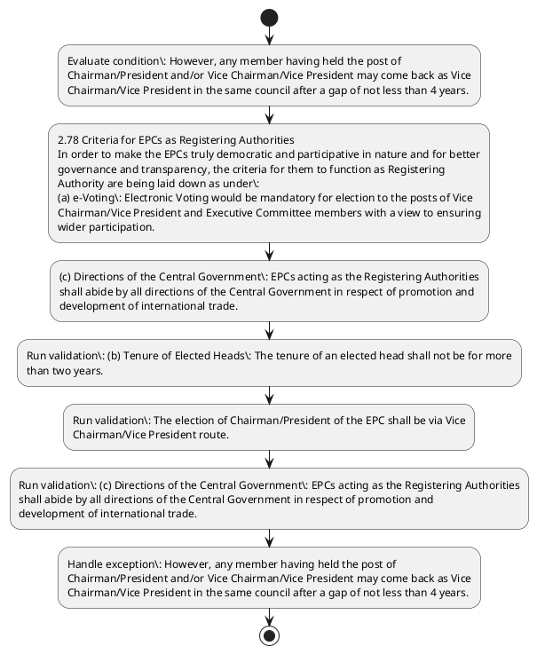

# Chapter 2 / Section 2.78: Criteria for EPCs as Registering Authorities

**Chapter Title:** General Provisions Regarding Imports and Exports

**Pages:** 34

**Purpose:** 2.78 Criteria for EPCs as Registering Authorities
In order to make the EPCs truly democratic and participative in nature and for better
governance and transparency, the criteria for them to function as Registering
Authority are being laid down as under:
(a) e-Voting: Electronic Voting would be mandatory for election to the posts of Vice
Chairman/Vice President and Executive Committee members with a view to ensuring
wider participation.

**Purpose Thanglish:** Indha Criteria for EPCs as Registering Authorities section-la, 2.78 Criteria for EPCs as Registering Authorities
In order to make the EPCs truly democratic and participative in nature and for better
governance and transparency, the criteria for them to function as Registering
authority are being laid down as under:
(a) e-Voting: Electronic Voting would be mandatory for election to the posts of Vice
Chairman/Vice President and Executive Committee members with a view to ensuring
wider participation.

**Summary:** 2.78 Criteria for EPCs as Registering Authorities
In order to make the EPCs truly democratic and participative in nature and for better
governance and transparency, the criteria for them to function as Registering
Authority are being laid down as under:
(a) e-Voting: Electronic Voting would be mandatory for election to the posts of Vice
Chairman/Vice President and Executive Committee members with a view to ensuring
wider participation. (b) Tenure of Elected Heads: The tenure of an elected head shall not be for more
than two years. The election of Chairman/President of the EPC shall be via Vice
Chairman/Vice President route.

**Business Meaning:** Criteria for EPCs as Registering Authorities governs how DGFT business controls should be applied, validated, and enforced.

**Business Explanation:** Criteria for EPCs as Registering Authorities explains the operating rule set that DEKAI should enforce. Key control points include (b) Tenure of Elected Heads: The tenure of an elected head shall not be for more
than two years. The section also drives actions such as 2.78 Criteria for EPCs as Registering Authorities
In order to make the EPCs truly democratic and participative in nature and for better
governance and transparency, the criteria for them to function as Registering
Authority are being laid down as under:
(a) e-Voting: Electronic Voting would be mandatory for election to the posts of Vice
Chairman/Vice President and Executive Committee members with a view to ensuring
wider participation..

**Business Explanation Thanglish:** Indha Criteria for EPCs as Registering Authorities section-la, Criteria for EPCs as Registering Authorities explains the operating rule set that DEKAI should enforce. Key control points include (b) Tenure of Elected Heads: The tenure of an elected head kandippa not be for more
than two years. The section also drives actions such as 2.78 Criteria for EPCs as Registering Authorities
In order to make the EPCs truly democratic and participative in nature and for better
governance and transparency, the criteria for them to function as Registering
authority are being laid down as under:
(a) e-Voting: Electronic Voting would be mandatory for election to the posts of Vice
Chairman/Vice President and Executive Committee members with a view to ensuring
wider participation..

## Business Logic
- (b) Tenure of Elected Heads: The tenure of an elected head shall not be for more
than two years.
- The election of Chairman/President of the EPC shall be via Vice
Chairman/Vice President route.
- (c) Directions of the Central Government: EPCs acting as the Registering Authorities
shall abide by all directions of the Central Government in respect of promotion and
development of international trade.
- (b)
Tenure of Elected Heads: The tenure of an elected head shall not be for more
than two years.

## Business Rules
- rule_id=CH2-SEC2_78-R001, rule_description=(b) Tenure of Elected Heads: The tenure of an elected head shall not be for more
than two years., trigger=Criteria for EPCs as Registering Authorities, condition=However, any member having held the post of
Chairman/President and/or Vice Chairman/Vice President may come back as Vice
Chairman/Vice President in the same council after a gap of not less than 4 years., validation=(b) Tenure of Elected Heads: The tenure of an elected head shall not be for more
than two years., action=2.78 Criteria for EPCs as Registering Authorities
In order to make the EPCs truly democratic and participative in nature and for better
governance and transparency, the criteria for them to function as Registering
Authority are being laid down as under:
(a) e-Voting: Electronic Voting would be mandatory for election to the posts of Vice
Chairman/Vice President and Executive Committee members with a view to ensuring
wider participation., exception=However, any member having held the post of
Chairman/President and/or Vice Chairman/Vice President may come back as Vice
Chairman/Vice President in the same council after a gap of not less than 4 years., output=DEKAI should produce a compliance decision for 2.78 - Criteria for EPCs as Registering Authorities.
- rule_id=CH2-SEC2_78-R002, rule_description=The election of Chairman/President of the EPC shall be via Vice
Chairman/Vice President route., trigger=Criteria for EPCs as Registering Authorities, condition=However, any member having held the post of
Chairman/President and/or Vice Chairman/Vice President may come back as Vice
Chairman/Vice President in the same council after a gap of not less than 4 years., validation=The election of Chairman/President of the EPC shall be via Vice
Chairman/Vice President route., action=(c) Directions of the Central Government: EPCs acting as the Registering Authorities
shall abide by all directions of the Central Government in respect of promotion and
development of international trade., exception=However, any member having held the post of
Chairman/President and/or Vice Chairman/Vice President may come back as Vice
Chairman/Vice President in the same council after a gap of not less than 4 years., output=DEKAI should produce a compliance decision for 2.78 - Criteria for EPCs as Registering Authorities.
- rule_id=CH2-SEC2_78-R003, rule_description=(c) Directions of the Central Government: EPCs acting as the Registering Authorities
shall abide by all directions of the Central Government in respect of promotion and
development of international trade., trigger=Criteria for EPCs as Registering Authorities, condition=However, any member having held the post of
Chairman/President and/or Vice Chairman/Vice President may come back as Vice
Chairman/Vice President in the same council after a gap of not less than 4 years., validation=(c) Directions of the Central Government: EPCs acting as the Registering Authorities
shall abide by all directions of the Central Government in respect of promotion and
development of international trade., action=(c) Directions of the Central Government: EPCs acting as the Registering Authorities
shall abide by all directions of the Central Government in respect of promotion and
development of international trade., exception=However, any member having held the post of
Chairman/President and/or Vice Chairman/Vice President may come back as Vice
Chairman/Vice President in the same council after a gap of not less than 4 years., output=DEKAI should produce a compliance decision for 2.78 - Criteria for EPCs as Registering Authorities.
- rule_id=CH2-SEC2_78-R004, rule_description=(b)
Tenure of Elected Heads: The tenure of an elected head shall not be for more
than two years., trigger=Criteria for EPCs as Registering Authorities, condition=However, any member having held the post of
Chairman/President and/or Vice Chairman/Vice President may come back as Vice
Chairman/Vice President in the same council after a gap of not less than 4 years., validation=(b)
Tenure of Elected Heads: The tenure of an elected head shall not be for more
than two years., action=(c) Directions of the Central Government: EPCs acting as the Registering Authorities
shall abide by all directions of the Central Government in respect of promotion and
development of international trade., exception=However, any member having held the post of
Chairman/President and/or Vice Chairman/Vice President may come back as Vice
Chairman/Vice President in the same council after a gap of not less than 4 years., output=DEKAI should produce a compliance decision for 2.78 - Criteria for EPCs as Registering Authorities.

## Conditions
- However, any member having held the post of
Chairman/President and/or Vice Chairman/Vice President may come back as Vice
Chairman/Vice President in the same council after a gap of not less than 4 years.

## Condition Logic
- id=2.2.78.1, if=However, any member having held the post of
Chairman/President and/or Vice Chairman/Vice President may come back as Vice
Chairman/Vice President in the same council after a gap of not less than 4 years., then=2.78 Criteria for EPCs as Registering Authorities
In order to make the EPCs truly democratic and participative in nature and for better
governance and transparency, the criteria for them to function as Registering
Authority are being laid down as under:
(a) e-Voting: Electronic Voting would be mandatory for election to the posts of Vice
Chairman/Vice President and Executive Committee members with a view to ensuring
wider participation., source=However, any member having held the post of
Chairman/President and/or Vice Chairman/Vice President may come back as Vice
Chairman/Vice President in the same council after a gap of not less than 4 years.

## Validations
- (b) Tenure of Elected Heads: The tenure of an elected head shall not be for more
than two years.
- The election of Chairman/President of the EPC shall be via Vice
Chairman/Vice President route.
- (c) Directions of the Central Government: EPCs acting as the Registering Authorities
shall abide by all directions of the Central Government in respect of promotion and
development of international trade.
- (b)
Tenure of Elected Heads: The tenure of an elected head shall not be for more
than two years.

## Exceptions
- However, any member having held the post of
Chairman/President and/or Vice Chairman/Vice President may come back as Vice
Chairman/Vice President in the same council after a gap of not less than 4 years.

## Dependencies
- None identified

## Authorities
- Criteria for EPCs as Registering Authorities
- Chairman/Vice President and Executive Committee
- Central Government
- Directions of the Central Government
- EPCs acting as the Registering Authorities

## Required Documents
- None identified

## Timelines
- (b) Tenure of Elected Heads: The tenure of an elected head shall not be for more
than two years.
- However, any member having held the post of
Chairman/President and/or Vice Chairman/Vice President may come back as Vice
Chairman/Vice President in the same council after a gap of not less than 4 years.
- (b)
Tenure of Elected Heads: The tenure of an elected head shall not be for more
than two years.

## Actions
- 2.78 Criteria for EPCs as Registering Authorities
In order to make the EPCs truly democratic and participative in nature and for better
governance and transparency, the criteria for them to function as Registering
Authority are being laid down as under:
(a) e-Voting: Electronic Voting would be mandatory for election to the posts of Vice
Chairman/Vice President and Executive Committee members with a view to ensuring
wider participation.
- (c) Directions of the Central Government: EPCs acting as the Registering Authorities
shall abide by all directions of the Central Government in respect of promotion and
development of international trade.

## Workflow
- Evaluate condition: However, any member having held the post of
Chairman/President and/or Vice Chairman/Vice President may come back as Vice
Chairman/Vice President in the same council after a gap of not less than 4 years.
- 2.78 Criteria for EPCs as Registering Authorities
In order to make the EPCs truly democratic and participative in nature and for better
governance and transparency, the criteria for them to function as Registering
Authority are being laid down as under:
(a) e-Voting: Electronic Voting would be mandatory for election to the posts of Vice
Chairman/Vice President and Executive Committee members with a view to ensuring
wider participation.
- (c) Directions of the Central Government: EPCs acting as the Registering Authorities
shall abide by all directions of the Central Government in respect of promotion and
development of international trade.
- Run validation: (b) Tenure of Elected Heads: The tenure of an elected head shall not be for more
than two years.
- Run validation: The election of Chairman/President of the EPC shall be via Vice
Chairman/Vice President route.
- Run validation: (c) Directions of the Central Government: EPCs acting as the Registering Authorities
shall abide by all directions of the Central Government in respect of promotion and
development of international trade.
- Handle exception: However, any member having held the post of
Chairman/President and/or Vice Chairman/Vice President may come back as Vice
Chairman/Vice President in the same council after a gap of not less than 4 years.

## Workflow ASCII
```text
Criteria for EPCs as Registering Authorities
Evaluate condition: However, any member having held the post of
Chairman/President and/or Vice Chairman/Vice President may come back as Vice
Chairman/Vice President in the same council after a gap of not less than 4 years.
   |
   v
2.78 Criteria for EPCs as Registering Authorities
In order to make the EPCs truly democratic and participative in nature and for better
governance and transparency, the criteria for them to function as Registering
Authority are being laid down as under:
(a) e-Voting: Electronic Voting would be mandatory for election to the posts of Vice
Chairman/Vice President and Executive Committee members with a view to ensuring
wider participation.
   |
   v
(c) Directions of the Central Government: EPCs acting as the Registering Authorities
shall abide by all directions of the Central Government in respect of promotion and
development of international trade.
   |
   v
Run validation: (b) Tenure of Elected Heads: The tenure of an elected head shall not be for more
than two years.
   |
   v
Run validation: The election of Chairman/President of the EPC shall be via Vice
Chairman/Vice President route.
   |
   v
Run validation: (c) Directions of the Central Government: EPCs acting as the Registering Authorities
shall abide by all directions of the Central Government in respect of promotion and
development of international trade.
   |
   v
Handle exception: However, any member having held the post of
Chairman/President and/or Vice Chairman/Vice President may come back as Vice
Chairman/Vice President in the same council after a gap of not less than 4 years.
```

## Decision Tree
- IF However, any member having held the post of
Chairman/President and/or Vice Chairman/Vice President may come back as Vice
Chairman/Vice President in the same council after a gap of not less than 4 years. THEN 2.78 Criteria for EPCs as Registering Authorities
In order to make the EPCs truly democratic and participative in nature and for better
governance and transparency, the criteria for them to function as Registering
Authority are being laid down as under:
(a) e-Voting: Electronic Voting would be mandatory for election to the posts of Vice
Chairman/Vice President and Executive Committee members with a view to ensuring
wider participation.
- IF exception applies (However, any member having held the post of
Chairman/President and/or Vice Chairman/Vice President may come back as Vice
Chairman/Vice President in the same council after a gap of not less than 4 years.) THEN route to manual review

## Decision Tree ASCII
```text
Criteria for EPCs as Registering Authorities Decision
IF However, any member having held the post of
Chairman/President and/or Vice Chairman/Vice President may come back as Vice
Chairman/Vice President in the same council after a gap of not less than 4 years. THEN 2.78 Criteria for EPCs as Registering Authorities
In order to make the EPCs truly democratic and participative in nature and for better
governance and transparency, the criteria for them to function as Registering
Authority are being laid down as under:
(a) e-Voting: Electronic Voting would be mandatory for election to the posts of Vice
Chairman/Vice President and Executive Committee members with a view to ensuring
wider participation.
   |
   v
IF exception applies (However, any member having held the post of
Chairman/President and/or Vice Chairman/Vice President may come back as Vice
Chairman/Vice President in the same council after a gap of not less than 4 years.) THEN route to manual review
```

## Examples
- User asks to process Criteria for EPCs as Registering Authorities; the platform checks conditions, validations, and documents before action.

**Real-world Example:** Example: an importer or exporter invokes Criteria for EPCs as Registering Authorities, submits the prescribed DGFT records, and DEKAI uses the extracted rules to 2.78 criteria for epcs as registering authorities
in order to make the epcs truly democratic and participative in nature and for better
governance and transparency, the criteria for them to function as registering
authority are being laid down as under:
(a) e-voting: electronic voting would be mandatory for election to the posts of vice
chairman/vice president and executive committee members with a view to ensuring
wider participation..

**Real-world Example Thanglish:** Indha Criteria for EPCs as Registering Authorities section-la, Example: an importer or exporter invokes Criteria for EPCs as Registering Authorities, submits the prescribed DGFT records, and DEKAI uses the extracted rules to 2.78 criteria for epcs as registering authorities
in order to make the epcs truly democratic and participative in nature and for better
governance and transparency, the criteria for them to function as registering
authority are being laid down as under:
(a) e-voting: electronic voting would be mandatory for election to the posts of vice
chairman/vice president and executive committee members with a view to ensuring
wider participation..

## AI Rules
- IF detected context matches section rule THEN enforce: (b) Tenure of Elected Heads: The tenure of an elected head shall not be for more
than two years.
- IF detected context matches section rule THEN enforce: The election of Chairman/President of the EPC shall be via Vice
Chairman/Vice President route.
- IF detected context matches section rule THEN enforce: (c) Directions of the Central Government: EPCs acting as the Registering Authorities
shall abide by all directions of the Central Government in respect of promotion and
development of international trade.
- IF detected context matches section rule THEN enforce: (b)
Tenure of Elected Heads: The tenure of an elected head shall not be for more
than two years.
- IF validations pass THEN recommend action: 2.78 Criteria for EPCs as Registering Authorities
In order to make the EPCs truly democratic and participative in nature and for better
governance and transparency, the criteria for them to function as Registering
Authority are being laid down as under:
(a) e-Voting: Electronic Voting would be mandatory for election to the posts of Vice
Chairman/Vice President and Executive Committee members with a view to ensuring
wider participation.

## Database Fields
- name=section_code, type=string, required=True, source=parsed_section_heading
- name=section_title, type=string, required=True, source=parsed_section_heading
- name=for_flag, type=boolean, required=False, source=keyword:for
- name=the_flag, type=boolean, required=False, source=keyword:the
- name=and_flag, type=boolean, required=False, source=keyword:and
- name=are_flag, type=boolean, required=False, source=keyword:are
- name=not_flag, type=boolean, required=False, source=keyword:not
- name=two_flag, type=boolean, required=False, source=keyword:two
- name=epc_flag, type=boolean, required=False, source=keyword:EPC
- name=via_flag, type=boolean, required=False, source=keyword:via

## API Requirements
- method=GET, path=/api/dgft/sections/2.78, purpose=Retrieve knowledge payload for section 2.78, query_params=['include=workflow,decision_tree,validations'], response_fields=['section', 'title', 'summary', 'conditions', 'validations', 'exceptions', 'workflow', 'decision_tree']
- method=POST, path=/api/dgft/Criteria-for-EPCs-as-Registering-Authorities/validate, purpose=Validate inputs and documents for Criteria for EPCs as Registering Authorities, request_fields=['section_code', 'section_title'], response_fields=['status', 'errors', 'warnings', 'next_actions']
- method=POST, path=/api/dgft/Criteria-for-EPCs-as-Registering-Authorities/execute, purpose=Trigger business action for 2.78 Criteria for EPCs as Registering Authorities
In order to make the EPCs truly democratic and participative in nature and for better
governance and transparency, the criteria for them to function as Registering
Authority are being laid down as under:
(a) e-Voting: Electronic Voting would be mandatory for election to the posts of Vice
Chairman/Vice President and Executive Committee members with a view to ensuring
wider participation., request_fields=['section_code', 'section_title'], response_fields=['reference_id', 'status', 'authority', 'timeline']

## UI Screens
- screen_id=Criteria_for_EPCs_as_Registering_Authorities_overview, name=Criteria for EPCs as Registering Authorities Overview, purpose=Show section summary, authority, timeline, and eligibility cues., widgets=['summary_card', 'conditions_table', 'authority_badges', 'timeline_panel']
- screen_id=Criteria_for_EPCs_as_Registering_Authorities_submission, name=Criteria for EPCs as Registering Authorities Submission, purpose=Capture applicant data and supporting documents., widgets=['dynamic_form', 'document_uploader', 'validation_panel', 'next_action_footer'], fields=['section_code', 'section_title', 'for_flag', 'the_flag', 'and_flag', 'are_flag', 'not_flag', 'two_flag']
- screen_id=Criteria_for_EPCs_as_Registering_Authorities_exceptions, name=Criteria for EPCs as Registering Authorities Exception Review, purpose=Explain exception handling and manual review triggers., widgets=['exception_banner', 'decision_tree', 'case_notes']

## Error Messages
- Validation failed because the section requirements were not fully met.

## FAQ
- question_en=What is the purpose of section 2.78?, answer_en=Criteria for EPCs as Registering Authorities explains the operating rule set that DEKAI should enforce. Key control points include (b) Tenure of Elected Heads: The tenure of an elected head shall not be for more
than two years. The section also drives actions such as 2.78 Criteria for EPCs as Registering Authorities
In order to make the EPCs truly democratic and participative in nature and for better
governance and transparency, the criteria for them to function as Registering
Authority are being laid down as under:
(a) e-Voting: Electronic Voting would be mandatory for election to the posts of Vice
Chairman/Vice President and Executive Committee members with a view to ensuring
wider participation.., question_thanglish=Indha Criteria for EPCs as Registering Authorities section-la, What is the purpose of section 2.78?, answer_thanglish=Indha Criteria for EPCs as Registering Authorities section-la, Criteria for EPCs as Registering Authorities explains the operating rule set that DEKAI should enforce. Key control points include (b) Tenure of Elected Heads: The tenure of an elected head kandippa not be for more
than two years. The section also drives actions such as 2.78 Criteria for EPCs as Registering Authorities
In order to make the EPCs truly democratic and participative in nature and for better
governance and transparency, the criteria for them to function as Registering
authority are being laid down as under:
(a) e-Voting: Electronic Voting would be mandatory for election to the posts of Vice
Chairman/Vice President and Executive Committee members with a view to ensuring
wider participation..
- question_en=What documents are required under Criteria for EPCs as Registering Authorities?, answer_en=Not explicitly covered in uploaded documents., question_thanglish=Indha Criteria for EPCs as Registering Authorities section-la, What documents are required under Criteria for EPCs as Registering Authorities?, answer_thanglish=Indha Criteria for EPCs as Registering Authorities section-la, Not explicitly covered in uploaded documents.
- question_en=Which authority handles Criteria for EPCs as Registering Authorities?, answer_en=Criteria for EPCs as Registering Authorities, Chairman/Vice President and Executive Committee, Central Government, Directions of the Central Government, EPCs acting as the Registering Authorities, question_thanglish=Indha Criteria for EPCs as Registering Authorities section-la, Which authority handles Criteria for EPCs as Registering Authorities?, answer_thanglish=Indha Criteria for EPCs as Registering Authorities section-la, Criteria for EPCs as Registering Authorities, Chairman/Vice President and Executive Committee, Central Government, Directions of the Central Government, EPCs acting as the Registering Authorities

## Questions Users May Ask
- What does Criteria for EPCs as Registering Authorities require?
- Which documents are needed for Criteria for EPCs as Registering Authorities?
- How does DEKAI validate Criteria for EPCs as Registering Authorities requests?
- What action should be taken for Criteria for EPCs as Registering Authorities?

## Expected AI Answers
- Criteria for EPCs as Registering Authorities requires the platform to interpret the section text, apply the extracted business rules, and present the correct next action.
- Required documents are inferred from the section text: no explicit documents were detected.
- DEKAI validates Criteria for EPCs as Registering Authorities by checking conditions, required documents, authority references, and exception clauses before recommending an outcome.
- The primary extracted action is: 2.78 Criteria for EPCs as Registering Authorities
In order to make the EPCs truly democratic and participative in nature and for better
governance and transparency, the criteria for them to function as Registering
Authority are being laid down as under:
(a) e-Voting: Electronic Voting would be mandatory for election to the posts of Vice
Chairman/Vice President and Executive Committee members with a view to ensuring
wider participation.

## AI Q&A Examples
- question_en=User asks: How do I comply with Criteria for EPCs as Registering Authorities?, answer_en=AI answers: DEKAI should evaluate section 2.78, apply the extracted rules, and guide the user through Evaluate condition: However, any member having held the post of
Chairman/President and/or Vice Chairman/Vice President may come back as Vice
Chairman/Vice President in the same council after a gap of not less than 4 years.., question_thanglish=Indha Criteria for EPCs as Registering Authorities section-la, User asks: How do I comply with Criteria for EPCs as Registering Authorities?, answer_thanglish=Indha Criteria for EPCs as Registering Authorities section-la, AI answers: DEKAI should evaluate section 2.78, apply the extracted rules, and guide the user through Evaluate condition: However, any member having held the post of
Chairman/President and/or Vice Chairman/Vice President may come back as Vice
Chairman/Vice President in the same council after a gap of not less than 4 years..
- question_en=User asks: Which validations apply to Criteria for EPCs as Registering Authorities?, answer_en=AI answers: Applicable validations are (b) Tenure of Elected Heads: The tenure of an elected head shall not be for more
than two years., The election of Chairman/President of the EPC shall be via Vice
Chairman/Vice President route., (c) Directions of the Central Government: EPCs acting as the Registering Authorities
shall abide by all directions of the Central Government in respect of promotion and
development of international trade., question_thanglish=Indha Criteria for EPCs as Registering Authorities section-la, User asks: Which validations apply to Criteria for EPCs as Registering Authorities?, answer_thanglish=Indha Criteria for EPCs as Registering Authorities section-la, AI answers: Applicable validations are (b) Tenure of Elected Heads: The tenure of an elected head kandippa not be for more
than two years., The election of Chairman/President of the EPC kandippa be via Vice
Chairman/Vice President route., (c) Directions of the Central Government: EPCs acting as the Registering Authorities
kandippa abide by all directions of the Central Government in respect of promotion and
development of international trade.

## DEKAI AI Implementation Notes
- Capture chapter 2, section 2.78, title, and page references as immutable knowledge metadata.
- Bind validations for Criteria for EPCs as Registering Authorities into a rule engine keyed by the rule IDs extracted for this section.
- Route escalations or approvals to: Criteria for EPCs as Registering Authorities, Chairman/Vice President and Executive Committee, Central Government, Directions of the Central Government.
- Trigger manual review when exception clauses are detected.

## DEKAI AI Implementation Notes Thanglish
- Indha Criteria for EPCs as Registering Authorities section-la, Capture chapter 2, section 2.78, title, and page references as immutable knowledge metadata.
- Indha Criteria for EPCs as Registering Authorities section-la, Bind validations for Criteria for EPCs as Registering Authorities into a rule engine keyed by the rule IDs extracted for this section.
- Indha Criteria for EPCs as Registering Authorities section-la, Route escalations or approvals to: Criteria for EPCs as Registering Authorities, Chairman/Vice President and Executive Committee, Central Government, Directions of the Central Government.
- Indha Criteria for EPCs as Registering Authorities section-la, Trigger manual review when exception clauses are detected.

## AI Metadata
- Keywords: for, the, and, are, not, two, EPC, via, any, may, gap, all, EPCs, make, them, laid, down, Vice, with, view
- Search Keywords: for, the, and, are, not, two, EPC, via, any, may, gap, all, EPCs, make, them, laid, down, Vice, with, view
- Intent: Support Criteria for EPCs as Registering Authorities processing and compliance validation.
- Tags: 2.78, Criteria for EPCs as Registering Authorities, business-rule, dgft
- Related Sections: 
- Related Chapters: 
- Related Rules: (b) Tenure of Elected Heads: The tenure of an elected head shall not be for more
than two years., The election of Chairman/President of the EPC shall be via Vice
Chairman/Vice President route., (c) Directions of the Central Government: EPCs acting as the Registering Authorities
shall abide by all directions of the Central Government in respect of promotion and
development of international trade., (b)
Tenure of Elected Heads: The tenure of an elected head shall not be for more
than two years.

## Mermaid

```mermaid
flowchart TD
    S1["Evaluate condition: However, any member having held the post of
Chairman/President and/or Vice Chairman/Vice President may come back as Vice
Chairman/Vice President in the same council after a gap of not less than 4 years."]
    S2["2.78 Criteria for EPCs as Registering Authorities
In order to make the EPCs truly democratic and participative in nature and for better
governance and transparency, the criteria for them to function as Registering
Authority are being laid down as under:
(a) e-Voting: Electronic Voting would be mandatory for election to the posts of Vice
Chairman/Vice President and Executive Committee members with a view to ensuring
wider participation."]
    S1 --> S2
    S3["(c) Directions of the Central Government: EPCs acting as the Registering Authorities
shall abide by all directions of the Central Government in respect of promotion and
development of international trade."]
    S2 --> S3
    S4["Run validation: (b) Tenure of Elected Heads: The tenure of an elected head shall not be for more
than two years."]
    S3 --> S4
    S5["Run validation: The election of Chairman/President of the EPC shall be via Vice
Chairman/Vice President route."]
    S4 --> S5
    S6["Run validation: (c) Directions of the Central Government: EPCs acting as the Registering Authorities
shall abide by all directions of the Central Government in respect of promotion and
development of international trade."]
    S5 --> S6
    S7["Handle exception: However, any member having held the post of
Chairman/President and/or Vice Chairman/Vice President may come back as Vice
Chairman/Vice President in the same council after a gap of not less than 4 years."]
    S6 --> S7
```


## PlantUML

