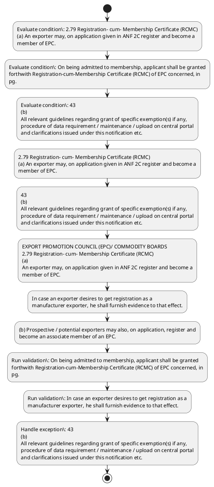

# Chapter 2 / Section 2.79: Registration- cum- Membership Certificate (RCMC)

**Chapter Title:** General Provisions Regarding Imports and Exports

**Pages:** 34, 35

**Purpose:** On being admitted to membership, applicant shall be granted
forthwith Registration-cum-Membership Certificate (RCMC) of EPC concerned, in
pg.

**Purpose Thanglish:** Indha Registration- cum- Membership Certificate (RCMC) section-la, On being admitted to membership, applicant kandippa be granted
forthwith Registration-cum-Membership Certificate (RCMC) of EPC concerned, in
pg.

**Summary:** 2.79 Registration- cum- Membership Certificate (RCMC)
(a) An exporter may, on application given in ANF 2C register and become a
member of EPC. On being admitted to membership, applicant shall be granted
forthwith Registration-cum-Membership Certificate (RCMC) of EPC concerned, in
pg. 43
(b)
All relevant guidelines regarding grant of specific exemption(s) if any,
procedure of data requirement / maintenance / upload on central portal
and clarifications issued under this notification etc.

**Business Meaning:** Registration- cum- Membership Certificate (RCMC) governs how DGFT business controls should be applied, validated, and enforced.

**Business Explanation:** Registration- cum- Membership Certificate (RCMC) explains the operating rule set that DEKAI should enforce. Key control points include On being admitted to membership, applicant shall be granted
forthwith Registration-cum-Membership Certificate (RCMC) of EPC concerned, in
pg. The section also drives actions such as 2.79 Registration- cum- Membership Certificate (RCMC)
(a) An exporter may, on application given in ANF 2C register and become a
member of EPC..

**Business Explanation Thanglish:** Indha Registration- cum- Membership Certificate (RCMC) section-la, Registration- cum- Membership Certificate (RCMC) explains the operating rule set that DEKAI should enforce. Key control points include On being admitted to membership, applicant kandippa be granted
forthwith Registration-cum-Membership Certificate (RCMC) of EPC concerned, in
pg. The section also drives actions such as 2.79 Registration- cum- Membership Certificate (RCMC)
(a) An exporter may, on application given in ANF 2C register and become a
member of EPC..

## Business Logic
- On being admitted to membership, applicant shall be granted
forthwith Registration-cum-Membership Certificate (RCMC) of EPC concerned, in
pg.
- In case an exporter desires to get registration as a
manufacturer exporter, he shall furnish evidence to that effect.

## Business Rules
- rule_id=CH2-SEC2_79-R001, rule_description=On being admitted to membership, applicant shall be granted
forthwith Registration-cum-Membership Certificate (RCMC) of EPC concerned, in
pg., trigger=Registration- cum- Membership Certificate (RCMC), condition=2.79 Registration- cum- Membership Certificate (RCMC)
(a) An exporter may, on application given in ANF 2C register and become a
member of EPC., validation=On being admitted to membership, applicant shall be granted
forthwith Registration-cum-Membership Certificate (RCMC) of EPC concerned, in
pg., action=2.79 Registration- cum- Membership Certificate (RCMC)
(a) An exporter may, on application given in ANF 2C register and become a
member of EPC., exception=43
(b)
All relevant guidelines regarding grant of specific exemption(s) if any,
procedure of data requirement / maintenance / upload on central portal
and clarifications issued under this notification etc., output=DEKAI should produce a compliance decision for 2.79 - Registration- cum- Membership Certificate (RCMC).
- rule_id=CH2-SEC2_79-R002, rule_description=In case an exporter desires to get registration as a
manufacturer exporter, he shall furnish evidence to that effect., trigger=Registration- cum- Membership Certificate (RCMC), condition=On being admitted to membership, applicant shall be granted
forthwith Registration-cum-Membership Certificate (RCMC) of EPC concerned, in
pg., validation=In case an exporter desires to get registration as a
manufacturer exporter, he shall furnish evidence to that effect., action=43
(b)
All relevant guidelines regarding grant of specific exemption(s) if any,
procedure of data requirement / maintenance / upload on central portal
and clarifications issued under this notification etc., exception=43
(b)
All relevant guidelines regarding grant of specific exemption(s) if any,
procedure of data requirement / maintenance / upload on central portal
and clarifications issued under this notification etc., output=DEKAI should produce a compliance decision for 2.79 - Registration- cum- Membership Certificate (RCMC).

## Conditions
- 2.79 Registration- cum- Membership Certificate (RCMC)
(a) An exporter may, on application given in ANF 2C register and become a
member of EPC.
- On being admitted to membership, applicant shall be granted
forthwith Registration-cum-Membership Certificate (RCMC) of EPC concerned, in
pg.
- 43
(b)
All relevant guidelines regarding grant of specific exemption(s) if any,
procedure of data requirement / maintenance / upload on central portal
and clarifications issued under this notification etc.
- http://dava.gov.in
(c)
It will be the responsibility of the drug manufactures/exporters as the
case may be, to satisfy the customs authorities that the export
consignment satisfies the conditions of the Notification.
- EXPORT PROMOTION COUNCIL (EPC)/ COMMODITY BOARDS
2.79 Registration- cum- Membership Certificate (RCMC)
(a)
An exporter may, on application given in ANF 2C register and become a
member of EPC.
- In case an exporter desires to get registration as a
manufacturer exporter, he shall furnish evidence to that effect.

## Condition Logic
- id=2.2.79.1, if=2.79 Registration- cum- Membership Certificate (RCMC)
(a) An exporter may, on application given in ANF 2C register and become a
member of EPC., then=2.79 Registration- cum- Membership Certificate (RCMC)
(a) An exporter may, on application given in ANF 2C register and become a
member of EPC., source=2.79 Registration- cum- Membership Certificate (RCMC)
(a) An exporter may, on application given in ANF 2C register and become a
member of EPC.
- id=2.2.79.2, if=On being admitted to membership, applicant shall be granted
forthwith Registration-cum-Membership Certificate (RCMC) of EPC concerned, in
pg., then=2.79 Registration- cum- Membership Certificate (RCMC)
(a) An exporter may, on application given in ANF 2C register and become a
member of EPC., source=On being admitted to membership, applicant shall be granted
forthwith Registration-cum-Membership Certificate (RCMC) of EPC concerned, in
pg.
- id=2.2.79.3, if=any, then=2.79 Registration- cum- Membership Certificate (RCMC)
(a) An exporter may, on application given in ANF 2C register and become a
member of EPC., source=43
(b)
All relevant guidelines regarding grant of specific exemption(s) if any,
procedure of data requirement / maintenance / upload on central portal
and clarifications issued under this notification etc.
- id=2.2.79.4, if=http://dava.gov.in
(c)
It will be the responsibility of the drug manufactures/exporters as the
case may be, to satisfy the customs authorities that the export
consignment satisfies the conditions of the Notification., then=2.79 Registration- cum- Membership Certificate (RCMC)
(a) An exporter may, on application given in ANF 2C register and become a
member of EPC., source=http://dava.gov.in
(c)
It will be the responsibility of the drug manufactures/exporters as the
case may be, to satisfy the customs authorities that the export
consignment satisfies the conditions of the Notification.
- id=2.2.79.5, if=EXPORT PROMOTION COUNCIL (EPC)/ COMMODITY BOARDS
2.79 Registration- cum- Membership Certificate (RCMC)
(a)
An exporter may, on application given in ANF 2C register and become a
member of EPC., then=2.79 Registration- cum- Membership Certificate (RCMC)
(a) An exporter may, on application given in ANF 2C register and become a
member of EPC., source=EXPORT PROMOTION COUNCIL (EPC)/ COMMODITY BOARDS
2.79 Registration- cum- Membership Certificate (RCMC)
(a)
An exporter may, on application given in ANF 2C register and become a
member of EPC.
- id=2.2.79.6, if=In case an exporter desires to get registration as a
manufacturer exporter, he shall furnish evidence to that effect., then=2.79 Registration- cum- Membership Certificate (RCMC)
(a) An exporter may, on application given in ANF 2C register and become a
member of EPC., source=In case an exporter desires to get registration as a
manufacturer exporter, he shall furnish evidence to that effect.

## Validations
- On being admitted to membership, applicant shall be granted
forthwith Registration-cum-Membership Certificate (RCMC) of EPC concerned, in
pg.
- In case an exporter desires to get registration as a
manufacturer exporter, he shall furnish evidence to that effect.

## Exceptions
- 43
(b)
All relevant guidelines regarding grant of specific exemption(s) if any,
procedure of data requirement / maintenance / upload on central portal
and clarifications issued under this notification etc.

## Dependencies
- None identified

## Authorities
- customs

## Required Documents
- Registration- cum- Membership Certificate
- Registration-cum-Membership Certificate
- (b) Prospective / potential exporters may also, on application, register and
become an associate member of an EPC.

## Timelines
- None identified

## Actions
- 2.79 Registration- cum- Membership Certificate (RCMC)
(a) An exporter may, on application given in ANF 2C register and become a
member of EPC.
- 43
(b)
All relevant guidelines regarding grant of specific exemption(s) if any,
procedure of data requirement / maintenance / upload on central portal
and clarifications issued under this notification etc.
- EXPORT PROMOTION COUNCIL (EPC)/ COMMODITY BOARDS
2.79 Registration- cum- Membership Certificate (RCMC)
(a)
An exporter may, on application given in ANF 2C register and become a
member of EPC.
- In case an exporter desires to get registration as a
manufacturer exporter, he shall furnish evidence to that effect.
- (b) Prospective / potential exporters may also, on application, register and
become an associate member of an EPC.

## Workflow
- Evaluate condition: 2.79 Registration- cum- Membership Certificate (RCMC)
(a) An exporter may, on application given in ANF 2C register and become a
member of EPC.
- Evaluate condition: On being admitted to membership, applicant shall be granted
forthwith Registration-cum-Membership Certificate (RCMC) of EPC concerned, in
pg.
- Evaluate condition: 43
(b)
All relevant guidelines regarding grant of specific exemption(s) if any,
procedure of data requirement / maintenance / upload on central portal
and clarifications issued under this notification etc.
- 2.79 Registration- cum- Membership Certificate (RCMC)
(a) An exporter may, on application given in ANF 2C register and become a
member of EPC.
- 43
(b)
All relevant guidelines regarding grant of specific exemption(s) if any,
procedure of data requirement / maintenance / upload on central portal
and clarifications issued under this notification etc.
- EXPORT PROMOTION COUNCIL (EPC)/ COMMODITY BOARDS
2.79 Registration- cum- Membership Certificate (RCMC)
(a)
An exporter may, on application given in ANF 2C register and become a
member of EPC.
- In case an exporter desires to get registration as a
manufacturer exporter, he shall furnish evidence to that effect.
- (b) Prospective / potential exporters may also, on application, register and
become an associate member of an EPC.
- Run validation: On being admitted to membership, applicant shall be granted
forthwith Registration-cum-Membership Certificate (RCMC) of EPC concerned, in
pg.
- Run validation: In case an exporter desires to get registration as a
manufacturer exporter, he shall furnish evidence to that effect.
- Handle exception: 43
(b)
All relevant guidelines regarding grant of specific exemption(s) if any,
procedure of data requirement / maintenance / upload on central portal
and clarifications issued under this notification etc.

## Workflow ASCII
```text
Registration- cum- Membership Certificate (RCMC)
Evaluate condition: 2.79 Registration- cum- Membership Certificate (RCMC)
(a) An exporter may, on application given in ANF 2C register and become a
member of EPC.
   |
   v
Evaluate condition: On being admitted to membership, applicant shall be granted
forthwith Registration-cum-Membership Certificate (RCMC) of EPC concerned, in
pg.
   |
   v
Evaluate condition: 43
(b)
All relevant guidelines regarding grant of specific exemption(s) if any,
procedure of data requirement / maintenance / upload on central portal
and clarifications issued under this notification etc.
   |
   v
2.79 Registration- cum- Membership Certificate (RCMC)
(a) An exporter may, on application given in ANF 2C register and become a
member of EPC.
   |
   v
43
(b)
All relevant guidelines regarding grant of specific exemption(s) if any,
procedure of data requirement / maintenance / upload on central portal
and clarifications issued under this notification etc.
   |
   v
EXPORT PROMOTION COUNCIL (EPC)/ COMMODITY BOARDS
2.79 Registration- cum- Membership Certificate (RCMC)
(a)
An exporter may, on application given in ANF 2C register and become a
member of EPC.
   |
   v
In case an exporter desires to get registration as a
manufacturer exporter, he shall furnish evidence to that effect.
   |
   v
(b) Prospective / potential exporters may also, on application, register and
become an associate member of an EPC.
   |
   v
Run validation: On being admitted to membership, applicant shall be granted
forthwith Registration-cum-Membership Certificate (RCMC) of EPC concerned, in
pg.
   |
   v
Run validation: In case an exporter desires to get registration as a
manufacturer exporter, he shall furnish evidence to that effect.
   |
   v
Handle exception: 43
(b)
All relevant guidelines regarding grant of specific exemption(s) if any,
procedure of data requirement / maintenance / upload on central portal
and clarifications issued under this notification etc.
```

## Decision Tree
- IF 2.79 Registration- cum- Membership Certificate (RCMC)
(a) An exporter may, on application given in ANF 2C register and become a
member of EPC. THEN 2.79 Registration- cum- Membership Certificate (RCMC)
(a) An exporter may, on application given in ANF 2C register and become a
member of EPC.
- IF On being admitted to membership, applicant shall be granted
forthwith Registration-cum-Membership Certificate (RCMC) of EPC concerned, in
pg. THEN 2.79 Registration- cum- Membership Certificate (RCMC)
(a) An exporter may, on application given in ANF 2C register and become a
member of EPC.
- IF 43
(b)
All relevant guidelines regarding grant of specific exemption(s) if any,
procedure of data requirement / maintenance / upload on central portal
and clarifications issued under this notification etc. THEN 2.79 Registration- cum- Membership Certificate (RCMC)
(a) An exporter may, on application given in ANF 2C register and become a
member of EPC.
- IF http://dava.gov.in
(c)
It will be the responsibility of the drug manufactures/exporters as the
case may be, to satisfy the customs authorities that the export
consignment satisfies the conditions of the Notification. THEN 2.79 Registration- cum- Membership Certificate (RCMC)
(a) An exporter may, on application given in ANF 2C register and become a
member of EPC.
- IF EXPORT PROMOTION COUNCIL (EPC)/ COMMODITY BOARDS
2.79 Registration- cum- Membership Certificate (RCMC)
(a)
An exporter may, on application given in ANF 2C register and become a
member of EPC. THEN 2.79 Registration- cum- Membership Certificate (RCMC)
(a) An exporter may, on application given in ANF 2C register and become a
member of EPC.
- IF exception applies (43
(b)
All relevant guidelines regarding grant of specific exemption(s) if any,
procedure of data requirement / maintenance / upload on central portal
and clarifications issued under this notification etc.) THEN route to manual review

## Decision Tree ASCII
```text
Registration- cum- Membership Certificate (RCMC) Decision
IF 2.79 Registration- cum- Membership Certificate (RCMC)
(a) An exporter may, on application given in ANF 2C register and become a
member of EPC. THEN 2.79 Registration- cum- Membership Certificate (RCMC)
(a) An exporter may, on application given in ANF 2C register and become a
member of EPC.
   |
   v
IF On being admitted to membership, applicant shall be granted
forthwith Registration-cum-Membership Certificate (RCMC) of EPC concerned, in
pg. THEN 2.79 Registration- cum- Membership Certificate (RCMC)
(a) An exporter may, on application given in ANF 2C register and become a
member of EPC.
   |
   v
IF 43
(b)
All relevant guidelines regarding grant of specific exemption(s) if any,
procedure of data requirement / maintenance / upload on central portal
and clarifications issued under this notification etc. THEN 2.79 Registration- cum- Membership Certificate (RCMC)
(a) An exporter may, on application given in ANF 2C register and become a
member of EPC.
   |
   v
IF http://dava.gov.in
(c)
It will be the responsibility of the drug manufactures/exporters as the
case may be, to satisfy the customs authorities that the export
consignment satisfies the conditions of the Notification. THEN 2.79 Registration- cum- Membership Certificate (RCMC)
(a) An exporter may, on application given in ANF 2C register and become a
member of EPC.
   |
   v
IF EXPORT PROMOTION COUNCIL (EPC)/ COMMODITY BOARDS
2.79 Registration- cum- Membership Certificate (RCMC)
(a)
An exporter may, on application given in ANF 2C register and become a
member of EPC. THEN 2.79 Registration- cum- Membership Certificate (RCMC)
(a) An exporter may, on application given in ANF 2C register and become a
member of EPC.
   |
   v
IF exception applies (43
(b)
All relevant guidelines regarding grant of specific exemption(s) if any,
procedure of data requirement / maintenance / upload on central portal
and clarifications issued under this notification etc.) THEN route to manual review
```

## Examples
- User asks to process Registration- cum- Membership Certificate (RCMC); the platform checks conditions, validations, and documents before action.

**Real-world Example:** Example: an importer or exporter invokes Registration- cum- Membership Certificate (RCMC), submits Registration- cum- Membership Certificate, Registration-cum-Membership Certificate, (b) Prospective / potential exporters may also, on application, register and
become an associate member of an EPC., and DEKAI uses the extracted rules to 2.79 registration- cum- membership certificate (rcmc)
(a) an exporter may, on application given in anf 2c register and become a
member of epc..

**Real-world Example Thanglish:** Indha Registration- cum- Membership Certificate (RCMC) section-la, Example: an importer or exporter invokes Registration- cum- Membership Certificate (RCMC), submits Registration- cum- Membership Certificate, Registration-cum-Membership Certificate, (b) Prospective / potential exporters may also, on application, register and
become an associate member of an EPC., and DEKAI uses the extracted rules to 2.79 registration- cum- membership certificate (rcmc)
(a) an exporter may, on application given in anf 2c register and become a
member of epc..

## AI Rules
- IF detected context matches section rule THEN enforce: On being admitted to membership, applicant shall be granted
forthwith Registration-cum-Membership Certificate (RCMC) of EPC concerned, in
pg.
- IF detected context matches section rule THEN enforce: In case an exporter desires to get registration as a
manufacturer exporter, he shall furnish evidence to that effect.
- IF validations pass THEN recommend action: 2.79 Registration- cum- Membership Certificate (RCMC)
(a) An exporter may, on application given in ANF 2C register and become a
member of EPC.

## Database Fields
- name=section_code, type=string, required=True, source=parsed_section_heading
- name=section_title, type=string, required=True, source=parsed_section_heading
- name=cum_flag, type=boolean, required=False, source=keyword:cum
- name=may_flag, type=boolean, required=False, source=keyword:may
- name=anf_flag, type=boolean, required=False, source=keyword:ANF
- name=and_flag, type=boolean, required=False, source=keyword:and
- name=epc_flag, type=boolean, required=False, source=keyword:EPC
- name=all_flag, type=boolean, required=False, source=keyword:All
- name=any_flag, type=boolean, required=False, source=keyword:any
- name=etc_flag, type=boolean, required=False, source=keyword:etc
- name=document_1_submitted, type=boolean, required=True, source=Registration- cum- Membership Certificate
- name=document_2_submitted, type=boolean, required=True, source=Registration-cum-Membership Certificate
- name=document_3_submitted, type=boolean, required=True, source=(b) Prospective / potential exporters may also, on application, register and
become an associate member of an EPC.

## API Requirements
- method=GET, path=/api/dgft/sections/2.79, purpose=Retrieve knowledge payload for section 2.79, query_params=['include=workflow,decision_tree,validations'], response_fields=['section', 'title', 'summary', 'conditions', 'validations', 'exceptions', 'workflow', 'decision_tree']
- method=POST, path=/api/dgft/Registration-cum-Membership-Certificate-RCMC/validate, purpose=Validate inputs and documents for Registration- cum- Membership Certificate (RCMC), request_fields=['section_code', 'section_title', 'document_1_submitted', 'document_2_submitted', 'document_3_submitted'], response_fields=['status', 'errors', 'warnings', 'next_actions']
- method=POST, path=/api/dgft/Registration-cum-Membership-Certificate-RCMC/execute, purpose=Trigger business action for 2.79 Registration- cum- Membership Certificate (RCMC)
(a) An exporter may, on application given in ANF 2C register and become a
member of EPC., request_fields=['section_code', 'section_title', 'document_1_submitted', 'document_2_submitted', 'document_3_submitted'], response_fields=['reference_id', 'status', 'authority', 'timeline']

## UI Screens
- screen_id=Registration_cum_Membership_Certificate_RCMC_overview, name=Registration- cum- Membership Certificate (RCMC) Overview, purpose=Show section summary, authority, timeline, and eligibility cues., widgets=['summary_card', 'conditions_table', 'authority_badges', 'timeline_panel']
- screen_id=Registration_cum_Membership_Certificate_RCMC_submission, name=Registration- cum- Membership Certificate (RCMC) Submission, purpose=Capture applicant data and supporting documents., widgets=['dynamic_form', 'document_uploader', 'validation_panel', 'next_action_footer'], fields=['section_code', 'section_title', 'cum_flag', 'may_flag', 'anf_flag', 'and_flag', 'epc_flag', 'all_flag']
- screen_id=Registration_cum_Membership_Certificate_RCMC_exceptions, name=Registration- cum- Membership Certificate (RCMC) Exception Review, purpose=Explain exception handling and manual review triggers., widgets=['exception_banner', 'decision_tree', 'case_notes']

## Error Messages
- Validation failed because the section requirements were not fully met.

## FAQ
- question_en=What is the purpose of section 2.79?, answer_en=Registration- cum- Membership Certificate (RCMC) explains the operating rule set that DEKAI should enforce. Key control points include On being admitted to membership, applicant shall be granted
forthwith Registration-cum-Membership Certificate (RCMC) of EPC concerned, in
pg. The section also drives actions such as 2.79 Registration- cum- Membership Certificate (RCMC)
(a) An exporter may, on application given in ANF 2C register and become a
member of EPC.., question_thanglish=Indha Registration- cum- Membership Certificate (RCMC) section-la, What is the purpose of section 2.79?, answer_thanglish=Indha Registration- cum- Membership Certificate (RCMC) section-la, Registration- cum- Membership Certificate (RCMC) explains the operating rule set that DEKAI should enforce. Key control points include On being admitted to membership, applicant kandippa be granted
forthwith Registration-cum-Membership Certificate (RCMC) of EPC concerned, in
pg. The section also drives actions such as 2.79 Registration- cum- Membership Certificate (RCMC)
(a) An exporter may, on application given in ANF 2C register and become a
member of EPC..
- question_en=What documents are required under Registration- cum- Membership Certificate (RCMC)?, answer_en=Registration- cum- Membership Certificate, Registration-cum-Membership Certificate, (b) Prospective / potential exporters may also, on application, register and
become an associate member of an EPC., question_thanglish=Indha Registration- cum- Membership Certificate (RCMC) section-la, What documents are required under Registration- cum- Membership Certificate (RCMC)?, answer_thanglish=Indha Registration- cum- Membership Certificate (RCMC) section-la, Registration- cum- Membership Certificate, Registration-cum-Membership Certificate, (b) Prospective / potential exporters may also, on application, register and
become an associate member of an EPC.
- question_en=Which authority handles Registration- cum- Membership Certificate (RCMC)?, answer_en=customs, question_thanglish=Indha Registration- cum- Membership Certificate (RCMC) section-la, Which authority handles Registration- cum- Membership Certificate (RCMC)?, answer_thanglish=Indha Registration- cum- Membership Certificate (RCMC) section-la, customs

## Questions Users May Ask
- What does Registration- cum- Membership Certificate (RCMC) require?
- Which documents are needed for Registration- cum- Membership Certificate (RCMC)?
- How does DEKAI validate Registration- cum- Membership Certificate (RCMC) requests?
- What action should be taken for Registration- cum- Membership Certificate (RCMC)?

## Expected AI Answers
- Registration- cum- Membership Certificate (RCMC) requires the platform to interpret the section text, apply the extracted business rules, and present the correct next action.
- Required documents are inferred from the section text: Registration- cum- Membership Certificate, Registration-cum-Membership Certificate, (b) Prospective / potential exporters may also, on application, register and
become an associate member of an EPC.
- DEKAI validates Registration- cum- Membership Certificate (RCMC) by checking conditions, required documents, authority references, and exception clauses before recommending an outcome.
- The primary extracted action is: 2.79 Registration- cum- Membership Certificate (RCMC)
(a) An exporter may, on application given in ANF 2C register and become a
member of EPC.

## AI Q&A Examples
- question_en=User asks: How do I comply with Registration- cum- Membership Certificate (RCMC)?, answer_en=AI answers: DEKAI should evaluate section 2.79, apply the extracted rules, and guide the user through Evaluate condition: 2.79 Registration- cum- Membership Certificate (RCMC)
(a) An exporter may, on application given in ANF 2C register and become a
member of EPC.., question_thanglish=Indha Registration- cum- Membership Certificate (RCMC) section-la, User asks: How do I comply with Registration- cum- Membership Certificate (RCMC)?, answer_thanglish=Indha Registration- cum- Membership Certificate (RCMC) section-la, AI answers: DEKAI should evaluate section 2.79, apply the extracted rules, and guide the user through Evaluate condition: 2.79 Registration- cum- Membership Certificate (RCMC)
(a) An exporter may, on application given in ANF 2C register and become a
member of EPC..
- question_en=User asks: Which validations apply to Registration- cum- Membership Certificate (RCMC)?, answer_en=AI answers: Applicable validations are On being admitted to membership, applicant shall be granted
forthwith Registration-cum-Membership Certificate (RCMC) of EPC concerned, in
pg., In case an exporter desires to get registration as a
manufacturer exporter, he shall furnish evidence to that effect., question_thanglish=Indha Registration- cum- Membership Certificate (RCMC) section-la, User asks: Which validations apply to Registration- cum- Membership Certificate (RCMC)?, answer_thanglish=Indha Registration- cum- Membership Certificate (RCMC) section-la, AI answers: Applicable validations are On being admitted to membership, applicant kandippa be granted
forthwith Registration-cum-Membership Certificate (RCMC) of EPC concerned, in
pg., In case an exporter desires to get registration as a
manufacturer exporter, he kandippa furnish evidence to that effect.

## DEKAI AI Implementation Notes
- Capture chapter 2, section 2.79, title, and page references as immutable knowledge metadata.
- Bind validations for Registration- cum- Membership Certificate (RCMC) into a rule engine keyed by the rule IDs extracted for this section.
- Expose document upload controls for: Registration- cum- Membership Certificate, Registration-cum-Membership Certificate, (b) Prospective / potential exporters may also, on application, register and
become an associate member of an EPC..
- Route escalations or approvals to: customs.
- Trigger manual review when exception clauses are detected.

## DEKAI AI Implementation Notes Thanglish
- Indha Registration- cum- Membership Certificate (RCMC) section-la, Capture chapter 2, section 2.79, title, and page references as immutable knowledge metadata.
- Indha Registration- cum- Membership Certificate (RCMC) section-la, Bind validations for Registration- cum- Membership Certificate (RCMC) into a rule engine keyed by the rule IDs extracted for this section.
- Indha Registration- cum- Membership Certificate (RCMC) section-la, Expose document upload controls for: Registration- cum- Membership Certificate, Registration-cum-Membership Certificate, (b) Prospective / potential exporters may also, on application, register and
become an associate member of an EPC..
- Indha Registration- cum- Membership Certificate (RCMC) section-la, Route escalations or approvals to: customs.
- Indha Registration- cum- Membership Certificate (RCMC) section-la, Trigger manual review when exception clauses are detected.

## AI Metadata
- Keywords: cum, may, ANF, and, EPC, All, any, etc, the, gov, get, RCMC, data, this, will, http, dava, drug, case, that
- Search Keywords: cum, may, ANF, and, EPC, All, any, etc, the, gov, get, RCMC, data, this, will, http, dava, drug, case, that
- Intent: Support Registration- cum- Membership Certificate (RCMC) processing and compliance validation.
- Tags: 2.79, Registration- cum- Membership Certificate (RCMC), business-rule, document-driven, dgft
- Related Sections: 
- Related Chapters: 
- Related Rules: On being admitted to membership, applicant shall be granted
forthwith Registration-cum-Membership Certificate (RCMC) of EPC concerned, in
pg., In case an exporter desires to get registration as a
manufacturer exporter, he shall furnish evidence to that effect.

## Mermaid

```mermaid
flowchart TD
    S1["Evaluate condition: 2.79 Registration- cum- Membership Certificate (RCMC)
(a) An exporter may, on application given in ANF 2C register and become a
member of EPC."]
    S2["Evaluate condition: On being admitted to membership, applicant shall be granted
forthwith Registration-cum-Membership Certificate (RCMC) of EPC concerned, in
pg."]
    S1 --> S2
    S3["Evaluate condition: 43
(b)
All relevant guidelines regarding grant of specific exemption(s) if any,
procedure of data requirement / maintenance / upload on central portal
and clarifications issued under this notification etc."]
    S2 --> S3
    S4["2.79 Registration- cum- Membership Certificate (RCMC)
(a) An exporter may, on application given in ANF 2C register and become a
member of EPC."]
    S3 --> S4
    S5["43
(b)
All relevant guidelines regarding grant of specific exemption(s) if any,
procedure of data requirement / maintenance / upload on central portal
and clarifications issued under this notification etc."]
    S4 --> S5
    S6["EXPORT PROMOTION COUNCIL (EPC)/ COMMODITY BOARDS
2.79 Registration- cum- Membership Certificate (RCMC)
(a)
An exporter may, on application given in ANF 2C register and become a
member of EPC."]
    S5 --> S6
    S7["In case an exporter desires to get registration as a
manufacturer exporter, he shall furnish evidence to that effect."]
    S6 --> S7
    S8["(b) Prospective / potential exporters may also, on application, register and
become an associate member of an EPC."]
    S7 --> S8
    S9["Run validation: On being admitted to membership, applicant shall be granted
forthwith Registration-cum-Membership Certificate (RCMC) of EPC concerned, in
pg."]
    S8 --> S9
    S10["Run validation: In case an exporter desires to get registration as a
manufacturer exporter, he shall furnish evidence to that effect."]
    S9 --> S10
    S11["Handle exception: 43
(b)
All relevant guidelines regarding grant of specific exemption(s) if any,
procedure of data requirement / maintenance / upload on central portal
and clarifications issued under this notification etc."]
    S10 --> S11
```


## PlantUML

