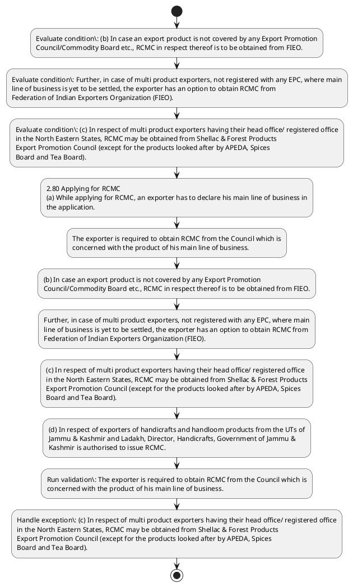

# Chapter 2 / Section 2.80: Applying for RCMC

**Chapter Title:** General Provisions Regarding Imports and Exports

**Pages:** 35

**Purpose:** 2.80 Applying for RCMC
(a) While applying for RCMC, an exporter has to declare his main line of business in
the application.

**Purpose Thanglish:** Indha Applying for RCMC section-la, 2.80 Applying for RCMC
(a) While applying for RCMC, an exporter has to declare his main line of business in
the application.

**Summary:** 2.80 Applying for RCMC
(a) While applying for RCMC, an exporter has to declare his main line of business in
the application. The exporter is required to obtain RCMC from the Council which is
concerned with the product of his main line of business. (b) In case an export product is not covered by any Export Promotion
Council/Commodity Board etc., RCMC in respect thereof is to be obtained from FIEO.

**Business Meaning:** Applying for RCMC governs how DGFT business controls should be applied, validated, and enforced.

**Business Explanation:** Applying for RCMC explains the operating rule set that DEKAI should enforce. Key control points include The exporter is required to obtain RCMC from the Council which is
concerned with the product of his main line of business. The section also drives actions such as 2.80 Applying for RCMC
(a) While applying for RCMC, an exporter has to declare his main line of business in
the application..

**Business Explanation Thanglish:** Indha Applying for RCMC section-la, Applying for RCMC explains the operating rule set that DEKAI should enforce. Key control points include The exporter is required to obtain RCMC from the Council which is
concerned with the product of his main line of business. The section also drives actions such as 2.80 Applying for RCMC
(a) While applying for RCMC, an exporter has to declare his main line of business in
the application..

## Business Logic
- The exporter is required to obtain RCMC from the Council which is
concerned with the product of his main line of business.

## Business Rules
- rule_id=CH2-SEC2_80-R001, rule_description=The exporter is required to obtain RCMC from the Council which is
concerned with the product of his main line of business., trigger=Applying for RCMC, condition=(b) In case an export product is not covered by any Export Promotion
Council/Commodity Board etc., RCMC in respect thereof is to be obtained from FIEO., validation=The exporter is required to obtain RCMC from the Council which is
concerned with the product of his main line of business., action=2.80 Applying for RCMC
(a) While applying for RCMC, an exporter has to declare his main line of business in
the application., exception=(c) In respect of multi product exporters having their head office/ registered office
in the North Eastern States, RCMC may be obtained from Shellac & Forest Products
Export Promotion Council (except for the products looked after by APEDA, Spices
Board and Tea Board)., output=DEKAI should produce a compliance decision for 2.80 - Applying for RCMC.

## Conditions
- (b) In case an export product is not covered by any Export Promotion
Council/Commodity Board etc., RCMC in respect thereof is to be obtained from FIEO.
- Further, in case of multi product exporters, not registered with any EPC, where main
line of business is yet to be settled, the exporter has an option to obtain RCMC from
Federation of Indian Exporters Organization (FIEO).
- (c) In respect of multi product exporters having their head office/ registered office
in the North Eastern States, RCMC may be obtained from Shellac & Forest Products
Export Promotion Council (except for the products looked after by APEDA, Spices
Board and Tea Board).
- (b)
In case an export product is not covered by any Export Promotion
Council/Commodity Board etc., RCMC in respect thereof is to be obtained from FIEO.
- (c)
In respect of multi product exporters having their head office/ registered office
in the North Eastern States, RCMC may be obtained from Shellac & Forest Products
Export Promotion Council (except for the products looked after by APEDA, Spices
Board and Tea Board).

## Condition Logic
- id=2.2.80.1, if=(b) In case an export product is not covered by any Export Promotion
Council/Commodity Board etc., RCMC in respect thereof is to be obtained from FIEO., then=2.80 Applying for RCMC
(a) While applying for RCMC, an exporter has to declare his main line of business in
the application., source=(b) In case an export product is not covered by any Export Promotion
Council/Commodity Board etc., RCMC in respect thereof is to be obtained from FIEO.
- id=2.2.80.2, if=Further, in case of multi product exporters, not registered with any EPC, where main
line of business is yet to be settled, the exporter has an option to obtain RCMC from
Federation of Indian Exporters Organization (FIEO)., then=2.80 Applying for RCMC
(a) While applying for RCMC, an exporter has to declare his main line of business in
the application., source=Further, in case of multi product exporters, not registered with any EPC, where main
line of business is yet to be settled, the exporter has an option to obtain RCMC from
Federation of Indian Exporters Organization (FIEO).
- id=2.2.80.3, if=(c) In respect of multi product exporters having their head office/ registered office
in the North Eastern States, RCMC may be obtained from Shellac & Forest Products
Export Promotion Council (except for the products looked after by APEDA, Spices
Board and Tea Board)., then=2.80 Applying for RCMC
(a) While applying for RCMC, an exporter has to declare his main line of business in
the application., source=(c) In respect of multi product exporters having their head office/ registered office
in the North Eastern States, RCMC may be obtained from Shellac & Forest Products
Export Promotion Council (except for the products looked after by APEDA, Spices
Board and Tea Board).
- id=2.2.80.4, if=(b)
In case an export product is not covered by any Export Promotion
Council/Commodity Board etc., RCMC in respect thereof is to be obtained from FIEO., then=2.80 Applying for RCMC
(a) While applying for RCMC, an exporter has to declare his main line of business in
the application., source=(b)
In case an export product is not covered by any Export Promotion
Council/Commodity Board etc., RCMC in respect thereof is to be obtained from FIEO.
- id=2.2.80.5, if=(c)
In respect of multi product exporters having their head office/ registered office
in the North Eastern States, RCMC may be obtained from Shellac & Forest Products
Export Promotion Council (except for the products looked after by APEDA, Spices
Board and Tea Board)., then=2.80 Applying for RCMC
(a) While applying for RCMC, an exporter has to declare his main line of business in
the application., source=(c)
In respect of multi product exporters having their head office/ registered office
in the North Eastern States, RCMC may be obtained from Shellac & Forest Products
Export Promotion Council (except for the products looked after by APEDA, Spices
Board and Tea Board).

## Validations
- The exporter is required to obtain RCMC from the Council which is
concerned with the product of his main line of business.

## Exceptions
- (c) In respect of multi product exporters having their head office/ registered office
in the North Eastern States, RCMC may be obtained from Shellac & Forest Products
Export Promotion Council (except for the products looked after by APEDA, Spices
Board and Tea Board).
- (c)
In respect of multi product exporters having their head office/ registered office
in the North Eastern States, RCMC may be obtained from Shellac & Forest Products
Export Promotion Council (except for the products looked after by APEDA, Spices
Board and Tea Board).

## Dependencies
- None identified

## Authorities
- None identified

## Required Documents
- 2.80 Applying for RCMC
(a) While applying for RCMC, an exporter has to declare his main line of business in
the application.
- 2.80 Applying for RCMC
(a)
While applying for RCMC, an exporter has to declare his main line of business in
the application.

## Timelines
- (c) In respect of multi product exporters having their head office/ registered office
in the North Eastern States, RCMC may be obtained from Shellac & Forest Products
Export Promotion Council (except for the products looked after by APEDA, Spices
Board and Tea Board).
- (c)
In respect of multi product exporters having their head office/ registered office
in the North Eastern States, RCMC may be obtained from Shellac & Forest Products
Export Promotion Council (except for the products looked after by APEDA, Spices
Board and Tea Board).

## Actions
- 2.80 Applying for RCMC
(a) While applying for RCMC, an exporter has to declare his main line of business in
the application.
- The exporter is required to obtain RCMC from the Council which is
concerned with the product of his main line of business.
- (b) In case an export product is not covered by any Export Promotion
Council/Commodity Board etc., RCMC in respect thereof is to be obtained from FIEO.
- Further, in case of multi product exporters, not registered with any EPC, where main
line of business is yet to be settled, the exporter has an option to obtain RCMC from
Federation of Indian Exporters Organization (FIEO).
- (c) In respect of multi product exporters having their head office/ registered office
in the North Eastern States, RCMC may be obtained from Shellac & Forest Products
Export Promotion Council (except for the products looked after by APEDA, Spices
Board and Tea Board).
- (d) In respect of exporters of handicrafts and handloom products from the UTs of
Jammu & Kashmir and Ladakh, Director, Handicrafts, Government of Jammu &
Kashmir is authorised to issue RCMC.
- 2.80 Applying for RCMC
(a)
While applying for RCMC, an exporter has to declare his main line of business in
the application.
- (b)
In case an export product is not covered by any Export Promotion
Council/Commodity Board etc., RCMC in respect thereof is to be obtained from FIEO.
- (c)
In respect of multi product exporters having their head office/ registered office
in the North Eastern States, RCMC may be obtained from Shellac & Forest Products
Export Promotion Council (except for the products looked after by APEDA, Spices
Board and Tea Board).
- (d)
In respect of exporters of handicrafts and handloom products from the UTs of
Jammu & Kashmir and Ladakh, Director, Handicrafts, Government of Jammu &
Kashmir is authorised to issue RCMC.

## Workflow
- Evaluate condition: (b) In case an export product is not covered by any Export Promotion
Council/Commodity Board etc., RCMC in respect thereof is to be obtained from FIEO.
- Evaluate condition: Further, in case of multi product exporters, not registered with any EPC, where main
line of business is yet to be settled, the exporter has an option to obtain RCMC from
Federation of Indian Exporters Organization (FIEO).
- Evaluate condition: (c) In respect of multi product exporters having their head office/ registered office
in the North Eastern States, RCMC may be obtained from Shellac & Forest Products
Export Promotion Council (except for the products looked after by APEDA, Spices
Board and Tea Board).
- 2.80 Applying for RCMC
(a) While applying for RCMC, an exporter has to declare his main line of business in
the application.
- The exporter is required to obtain RCMC from the Council which is
concerned with the product of his main line of business.
- (b) In case an export product is not covered by any Export Promotion
Council/Commodity Board etc., RCMC in respect thereof is to be obtained from FIEO.
- Further, in case of multi product exporters, not registered with any EPC, where main
line of business is yet to be settled, the exporter has an option to obtain RCMC from
Federation of Indian Exporters Organization (FIEO).
- (c) In respect of multi product exporters having their head office/ registered office
in the North Eastern States, RCMC may be obtained from Shellac & Forest Products
Export Promotion Council (except for the products looked after by APEDA, Spices
Board and Tea Board).
- (d) In respect of exporters of handicrafts and handloom products from the UTs of
Jammu & Kashmir and Ladakh, Director, Handicrafts, Government of Jammu &
Kashmir is authorised to issue RCMC.
- Run validation: The exporter is required to obtain RCMC from the Council which is
concerned with the product of his main line of business.
- Handle exception: (c) In respect of multi product exporters having their head office/ registered office
in the North Eastern States, RCMC may be obtained from Shellac & Forest Products
Export Promotion Council (except for the products looked after by APEDA, Spices
Board and Tea Board).

## Workflow ASCII
```text
Applying for RCMC
Evaluate condition: (b) In case an export product is not covered by any Export Promotion
Council/Commodity Board etc., RCMC in respect thereof is to be obtained from FIEO.
   |
   v
Evaluate condition: Further, in case of multi product exporters, not registered with any EPC, where main
line of business is yet to be settled, the exporter has an option to obtain RCMC from
Federation of Indian Exporters Organization (FIEO).
   |
   v
Evaluate condition: (c) In respect of multi product exporters having their head office/ registered office
in the North Eastern States, RCMC may be obtained from Shellac & Forest Products
Export Promotion Council (except for the products looked after by APEDA, Spices
Board and Tea Board).
   |
   v
2.80 Applying for RCMC
(a) While applying for RCMC, an exporter has to declare his main line of business in
the application.
   |
   v
The exporter is required to obtain RCMC from the Council which is
concerned with the product of his main line of business.
   |
   v
(b) In case an export product is not covered by any Export Promotion
Council/Commodity Board etc., RCMC in respect thereof is to be obtained from FIEO.
   |
   v
Further, in case of multi product exporters, not registered with any EPC, where main
line of business is yet to be settled, the exporter has an option to obtain RCMC from
Federation of Indian Exporters Organization (FIEO).
   |
   v
(c) In respect of multi product exporters having their head office/ registered office
in the North Eastern States, RCMC may be obtained from Shellac & Forest Products
Export Promotion Council (except for the products looked after by APEDA, Spices
Board and Tea Board).
   |
   v
(d) In respect of exporters of handicrafts and handloom products from the UTs of
Jammu & Kashmir and Ladakh, Director, Handicrafts, Government of Jammu &
Kashmir is authorised to issue RCMC.
   |
   v
Run validation: The exporter is required to obtain RCMC from the Council which is
concerned with the product of his main line of business.
   |
   v
Handle exception: (c) In respect of multi product exporters having their head office/ registered office
in the North Eastern States, RCMC may be obtained from Shellac & Forest Products
Export Promotion Council (except for the products looked after by APEDA, Spices
Board and Tea Board).
```

## Decision Tree
- IF (b) In case an export product is not covered by any Export Promotion
Council/Commodity Board etc., RCMC in respect thereof is to be obtained from FIEO. THEN 2.80 Applying for RCMC
(a) While applying for RCMC, an exporter has to declare his main line of business in
the application.
- IF Further, in case of multi product exporters, not registered with any EPC, where main
line of business is yet to be settled, the exporter has an option to obtain RCMC from
Federation of Indian Exporters Organization (FIEO). THEN 2.80 Applying for RCMC
(a) While applying for RCMC, an exporter has to declare his main line of business in
the application.
- IF (c) In respect of multi product exporters having their head office/ registered office
in the North Eastern States, RCMC may be obtained from Shellac & Forest Products
Export Promotion Council (except for the products looked after by APEDA, Spices
Board and Tea Board). THEN 2.80 Applying for RCMC
(a) While applying for RCMC, an exporter has to declare his main line of business in
the application.
- IF (b)
In case an export product is not covered by any Export Promotion
Council/Commodity Board etc., RCMC in respect thereof is to be obtained from FIEO. THEN 2.80 Applying for RCMC
(a) While applying for RCMC, an exporter has to declare his main line of business in
the application.
- IF (c)
In respect of multi product exporters having their head office/ registered office
in the North Eastern States, RCMC may be obtained from Shellac & Forest Products
Export Promotion Council (except for the products looked after by APEDA, Spices
Board and Tea Board). THEN 2.80 Applying for RCMC
(a) While applying for RCMC, an exporter has to declare his main line of business in
the application.
- IF exception applies ((c) In respect of multi product exporters having their head office/ registered office
in the North Eastern States, RCMC may be obtained from Shellac & Forest Products
Export Promotion Council (except for the products looked after by APEDA, Spices
Board and Tea Board).) THEN route to manual review
- IF exception applies ((c)
In respect of multi product exporters having their head office/ registered office
in the North Eastern States, RCMC may be obtained from Shellac & Forest Products
Export Promotion Council (except for the products looked after by APEDA, Spices
Board and Tea Board).) THEN route to manual review

## Decision Tree ASCII
```text
Applying for RCMC Decision
IF (b) In case an export product is not covered by any Export Promotion
Council/Commodity Board etc., RCMC in respect thereof is to be obtained from FIEO. THEN 2.80 Applying for RCMC
(a) While applying for RCMC, an exporter has to declare his main line of business in
the application.
   |
   v
IF Further, in case of multi product exporters, not registered with any EPC, where main
line of business is yet to be settled, the exporter has an option to obtain RCMC from
Federation of Indian Exporters Organization (FIEO). THEN 2.80 Applying for RCMC
(a) While applying for RCMC, an exporter has to declare his main line of business in
the application.
   |
   v
IF (c) In respect of multi product exporters having their head office/ registered office
in the North Eastern States, RCMC may be obtained from Shellac & Forest Products
Export Promotion Council (except for the products looked after by APEDA, Spices
Board and Tea Board). THEN 2.80 Applying for RCMC
(a) While applying for RCMC, an exporter has to declare his main line of business in
the application.
   |
   v
IF (b)
In case an export product is not covered by any Export Promotion
Council/Commodity Board etc., RCMC in respect thereof is to be obtained from FIEO. THEN 2.80 Applying for RCMC
(a) While applying for RCMC, an exporter has to declare his main line of business in
the application.
   |
   v
IF (c)
In respect of multi product exporters having their head office/ registered office
in the North Eastern States, RCMC may be obtained from Shellac & Forest Products
Export Promotion Council (except for the products looked after by APEDA, Spices
Board and Tea Board). THEN 2.80 Applying for RCMC
(a) While applying for RCMC, an exporter has to declare his main line of business in
the application.
   |
   v
IF exception applies ((c) In respect of multi product exporters having their head office/ registered office
in the North Eastern States, RCMC may be obtained from Shellac & Forest Products
Export Promotion Council (except for the products looked after by APEDA, Spices
Board and Tea Board).) THEN route to manual review
   |
   v
IF exception applies ((c)
In respect of multi product exporters having their head office/ registered office
in the North Eastern States, RCMC may be obtained from Shellac & Forest Products
Export Promotion Council (except for the products looked after by APEDA, Spices
Board and Tea Board).) THEN route to manual review
```

## Examples
- User asks to process Applying for RCMC; the platform checks conditions, validations, and documents before action.

**Real-world Example:** Example: an importer or exporter invokes Applying for RCMC, submits 2.80 Applying for RCMC
(a) While applying for RCMC, an exporter has to declare his main line of business in
the application., 2.80 Applying for RCMC
(a)
While applying for RCMC, an exporter has to declare his main line of business in
the application., and DEKAI uses the extracted rules to 2.80 applying for rcmc
(a) while applying for rcmc, an exporter has to declare his main line of business in
the application..

**Real-world Example Thanglish:** Indha Applying for RCMC section-la, Example: an importer or exporter invokes Applying for RCMC, submits 2.80 Applying for RCMC
(a) While applying for RCMC, an exporter has to declare his main line of business in
the application., 2.80 Applying for RCMC
(a)
While applying for RCMC, an exporter has to declare his main line of business in
the application., and DEKAI uses the extracted rules to 2.80 applying for rcmc
(a) while applying for rcmc, an exporter has to declare his main line of business in
the application..

## AI Rules
- IF detected context matches section rule THEN enforce: The exporter is required to obtain RCMC from the Council which is
concerned with the product of his main line of business.
- IF validations pass THEN recommend action: 2.80 Applying for RCMC
(a) While applying for RCMC, an exporter has to declare his main line of business in
the application.

## Database Fields
- name=section_code, type=string, required=True, source=parsed_section_heading
- name=section_title, type=string, required=True, source=parsed_section_heading
- name=for_flag, type=boolean, required=False, source=keyword:for
- name=has_flag, type=boolean, required=False, source=keyword:has
- name=his_flag, type=boolean, required=False, source=keyword:his
- name=the_flag, type=boolean, required=False, source=keyword:the
- name=not_flag, type=boolean, required=False, source=keyword:not
- name=any_flag, type=boolean, required=False, source=keyword:any
- name=etc_flag, type=boolean, required=False, source=keyword:etc
- name=epc_flag, type=boolean, required=False, source=keyword:EPC
- name=document_1_submitted, type=boolean, required=True, source=2.80 Applying for RCMC
(a) While applying for RCMC, an exporter has to declare his main line of business in
the application.
- name=document_2_submitted, type=boolean, required=True, source=2.80 Applying for RCMC
(a)
While applying for RCMC, an exporter has to declare his main line of business in
the application.

## API Requirements
- method=GET, path=/api/dgft/sections/2.80, purpose=Retrieve knowledge payload for section 2.80, query_params=['include=workflow,decision_tree,validations'], response_fields=['section', 'title', 'summary', 'conditions', 'validations', 'exceptions', 'workflow', 'decision_tree']
- method=POST, path=/api/dgft/Applying-for-RCMC/validate, purpose=Validate inputs and documents for Applying for RCMC, request_fields=['section_code', 'section_title', 'document_1_submitted', 'document_2_submitted'], response_fields=['status', 'errors', 'warnings', 'next_actions']
- method=POST, path=/api/dgft/Applying-for-RCMC/execute, purpose=Trigger business action for 2.80 Applying for RCMC
(a) While applying for RCMC, an exporter has to declare his main line of business in
the application., request_fields=['section_code', 'section_title', 'document_1_submitted', 'document_2_submitted'], response_fields=['reference_id', 'status', 'authority', 'timeline']

## UI Screens
- screen_id=Applying_for_RCMC_overview, name=Applying for RCMC Overview, purpose=Show section summary, authority, timeline, and eligibility cues., widgets=['summary_card', 'conditions_table', 'authority_badges', 'timeline_panel']
- screen_id=Applying_for_RCMC_submission, name=Applying for RCMC Submission, purpose=Capture applicant data and supporting documents., widgets=['dynamic_form', 'document_uploader', 'validation_panel', 'next_action_footer'], fields=['section_code', 'section_title', 'for_flag', 'has_flag', 'his_flag', 'the_flag', 'not_flag', 'any_flag']
- screen_id=Applying_for_RCMC_exceptions, name=Applying for RCMC Exception Review, purpose=Explain exception handling and manual review triggers., widgets=['exception_banner', 'decision_tree', 'case_notes']

## Error Messages
- Validation failed because the section requirements were not fully met.

## FAQ
- question_en=What is the purpose of section 2.80?, answer_en=Applying for RCMC explains the operating rule set that DEKAI should enforce. Key control points include The exporter is required to obtain RCMC from the Council which is
concerned with the product of his main line of business. The section also drives actions such as 2.80 Applying for RCMC
(a) While applying for RCMC, an exporter has to declare his main line of business in
the application.., question_thanglish=Indha Applying for RCMC section-la, What is the purpose of section 2.80?, answer_thanglish=Indha Applying for RCMC section-la, Applying for RCMC explains the operating rule set that DEKAI should enforce. Key control points include The exporter is required to obtain RCMC from the Council which is
concerned with the product of his main line of business. The section also drives actions such as 2.80 Applying for RCMC
(a) While applying for RCMC, an exporter has to declare his main line of business in
the application..
- question_en=What documents are required under Applying for RCMC?, answer_en=2.80 Applying for RCMC
(a) While applying for RCMC, an exporter has to declare his main line of business in
the application., 2.80 Applying for RCMC
(a)
While applying for RCMC, an exporter has to declare his main line of business in
the application., question_thanglish=Indha Applying for RCMC section-la, What documents are required under Applying for RCMC?, answer_thanglish=Indha Applying for RCMC section-la, 2.80 Applying for RCMC
(a) While applying for RCMC, an exporter has to declare his main line of business in
the application., 2.80 Applying for RCMC
(a)
While applying for RCMC, an exporter has to declare his main line of business in
the application.
- question_en=Which authority handles Applying for RCMC?, answer_en=Not explicitly covered in uploaded documents., question_thanglish=Indha Applying for RCMC section-la, Which authority handles Applying for RCMC?, answer_thanglish=Indha Applying for RCMC section-la, Not explicitly covered in uploaded documents.

## Questions Users May Ask
- What does Applying for RCMC require?
- Which documents are needed for Applying for RCMC?
- How does DEKAI validate Applying for RCMC requests?
- What action should be taken for Applying for RCMC?

## Expected AI Answers
- Applying for RCMC requires the platform to interpret the section text, apply the extracted business rules, and present the correct next action.
- Required documents are inferred from the section text: 2.80 Applying for RCMC
(a) While applying for RCMC, an exporter has to declare his main line of business in
the application., 2.80 Applying for RCMC
(a)
While applying for RCMC, an exporter has to declare his main line of business in
the application.
- DEKAI validates Applying for RCMC by checking conditions, required documents, authority references, and exception clauses before recommending an outcome.
- The primary extracted action is: 2.80 Applying for RCMC
(a) While applying for RCMC, an exporter has to declare his main line of business in
the application.

## AI Q&A Examples
- question_en=User asks: How do I comply with Applying for RCMC?, answer_en=AI answers: DEKAI should evaluate section 2.80, apply the extracted rules, and guide the user through Evaluate condition: (b) In case an export product is not covered by any Export Promotion
Council/Commodity Board etc., RCMC in respect thereof is to be obtained from FIEO.., question_thanglish=Indha Applying for RCMC section-la, User asks: How do I comply with Applying for RCMC?, answer_thanglish=Indha Applying for RCMC section-la, AI answers: DEKAI should evaluate section 2.80, apply the extracted rules, and guide the user through Evaluate condition: (b) In case an export product is not covered by any export Promotion
Council/Commodity Board etc., RCMC in respect thereof is to be obtained from FIEO..
- question_en=User asks: Which validations apply to Applying for RCMC?, answer_en=AI answers: Applicable validations are The exporter is required to obtain RCMC from the Council which is
concerned with the product of his main line of business., question_thanglish=Indha Applying for RCMC section-la, User asks: Which validations apply to Applying for RCMC?, answer_thanglish=Indha Applying for RCMC section-la, AI answers: Applicable validations are The exporter is required to obtain RCMC from the Council which is
concerned with the product of his main line of business.

## DEKAI AI Implementation Notes
- Capture chapter 2, section 2.80, title, and page references as immutable knowledge metadata.
- Bind validations for Applying for RCMC into a rule engine keyed by the rule IDs extracted for this section.
- Expose document upload controls for: 2.80 Applying for RCMC
(a) While applying for RCMC, an exporter has to declare his main line of business in
the application., 2.80 Applying for RCMC
(a)
While applying for RCMC, an exporter has to declare his main line of business in
the application..
- Trigger manual review when exception clauses are detected.

## DEKAI AI Implementation Notes Thanglish
- Indha Applying for RCMC section-la, Capture chapter 2, section 2.80, title, and page references as immutable knowledge metadata.
- Indha Applying for RCMC section-la, Bind validations for Applying for RCMC into a rule engine keyed by the rule IDs extracted for this section.
- Indha Applying for RCMC section-la, Expose document upload controls for: 2.80 Applying for RCMC
(a) While applying for RCMC, an exporter has to declare his main line of business in
the application., 2.80 Applying for RCMC
(a)
While applying for RCMC, an exporter has to declare his main line of business in
the application..
- Indha Applying for RCMC section-la, Trigger manual review when exception clauses are detected.

## AI Metadata
- Keywords: for, has, his, the, not, any, etc, EPC, yet, may, and, Tea, UTs, RCMC, main, line, from, with, case, FIEO
- Search Keywords: for, has, his, the, not, any, etc, EPC, yet, may, and, Tea, UTs, RCMC, main, line, from, with, case, FIEO
- Intent: Support Applying for RCMC processing and compliance validation.
- Tags: 2.80, Applying for RCMC, business-rule, document-driven, dgft
- Related Sections: 
- Related Chapters: 
- Related Rules: The exporter is required to obtain RCMC from the Council which is
concerned with the product of his main line of business.

## Mermaid

```mermaid
flowchart TD
    S1["Evaluate condition: (b) In case an export product is not covered by any Export Promotion
Council/Commodity Board etc., RCMC in respect thereof is to be obtained from FIEO."]
    S2["Evaluate condition: Further, in case of multi product exporters, not registered with any EPC, where main
line of business is yet to be settled, the exporter has an option to obtain RCMC from
Federation of Indian Exporters Organization (FIEO)."]
    S1 --> S2
    S3["Evaluate condition: (c) In respect of multi product exporters having their head office/ registered office
in the North Eastern States, RCMC may be obtained from Shellac & Forest Products
Export Promotion Council (except for the products looked after by APEDA, Spices
Board and Tea Board)."]
    S2 --> S3
    S4["2.80 Applying for RCMC
(a) While applying for RCMC, an exporter has to declare his main line of business in
the application."]
    S3 --> S4
    S5["The exporter is required to obtain RCMC from the Council which is
concerned with the product of his main line of business."]
    S4 --> S5
    S6["(b) In case an export product is not covered by any Export Promotion
Council/Commodity Board etc., RCMC in respect thereof is to be obtained from FIEO."]
    S5 --> S6
    S7["Further, in case of multi product exporters, not registered with any EPC, where main
line of business is yet to be settled, the exporter has an option to obtain RCMC from
Federation of Indian Exporters Organization (FIEO)."]
    S6 --> S7
    S8["(c) In respect of multi product exporters having their head office/ registered office
in the North Eastern States, RCMC may be obtained from Shellac & Forest Products
Export Promotion Council (except for the products looked after by APEDA, Spices
Board and Tea Board)."]
    S7 --> S8
    S9["(d) In respect of exporters of handicrafts and handloom products from the UTs of
Jammu & Kashmir and Ladakh, Director, Handicrafts, Government of Jammu &
Kashmir is authorised to issue RCMC."]
    S8 --> S9
    S10["Run validation: The exporter is required to obtain RCMC from the Council which is
concerned with the product of his main line of business."]
    S9 --> S10
    S11["Handle exception: (c) In respect of multi product exporters having their head office/ registered office
in the North Eastern States, RCMC may be obtained from Shellac & Forest Products
Export Promotion Council (except for the products looked after by APEDA, Spices
Board and Tea Board)."]
    S10 --> S11
```


## PlantUML

