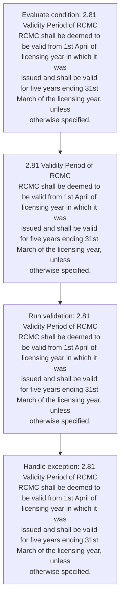
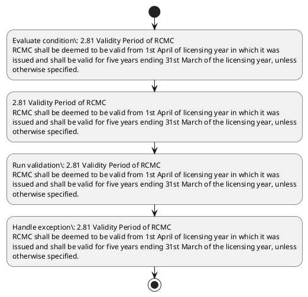

# Chapter 2 / Section 2.81: Validity Period of RCMC

**Chapter Title:** General Provisions Regarding Imports and Exports

**Pages:** 35

**Purpose:** 2.81 Validity Period of RCMC
RCMC shall be deemed to be valid from 1st April of licensing year in which it was
issued and shall be valid for five years ending 31st March of the licensing year, unless
otherwise specified.

**Purpose Thanglish:** Indha Validity Period of RCMC section-la, 2.81 Validity Period of RCMC
RCMC kandippa be deemed to be valid from 1st April of licensing year in which it was
issued and kandippa be valid for five years ending 31st March of the licensing year, unless
otherwise specified.

**Summary:** 2.81 Validity Period of RCMC
RCMC shall be deemed to be valid from 1st April of licensing year in which it was
issued and shall be valid for five years ending 31st March of the licensing year, unless
otherwise specified.

**Business Meaning:** Validity Period of RCMC governs how DGFT business controls should be applied, validated, and enforced.

**Business Explanation:** Validity Period of RCMC explains the operating rule set that DEKAI should enforce. Key control points include 2.81 Validity Period of RCMC
RCMC shall be deemed to be valid from 1st April of licensing year in which it was
issued and shall be valid for five years ending 31st March of the licensing year, unless
otherwise specified. The section also drives actions such as 2.81 Validity Period of RCMC
RCMC shall be deemed to be valid from 1st April of licensing year in which it was
issued and shall be valid for five years ending 31st March of the licensing year, unless
otherwise specified..

**Business Explanation Thanglish:** Indha Validity Period of RCMC section-la, Validity Period of RCMC explains the operating rule set that DEKAI should enforce. Key control points include 2.81 Validity Period of RCMC
RCMC kandippa be deemed to be valid from 1st April of licensing year in which it was
issued and kandippa be valid for five years ending 31st March of the licensing year, unless
otherwise specified. The section also drives actions such as 2.81 Validity Period of RCMC
RCMC kandippa be deemed to be valid from 1st April of licensing year in which it was
issued and kandippa be valid for five years ending 31st March of the licensing year, unless
otherwise specified..

## Business Logic
- 2.81 Validity Period of RCMC
RCMC shall be deemed to be valid from 1st April of licensing year in which it was
issued and shall be valid for five years ending 31st March of the licensing year, unless
otherwise specified.

## Business Rules
- rule_id=CH2-SEC2_81-R001, rule_description=2.81 Validity Period of RCMC
RCMC shall be deemed to be valid from 1st April of licensing year in which it was
issued and shall be valid for five years ending 31st March of the licensing year, unless
otherwise specified., trigger=Validity Period of RCMC, condition=2.81 Validity Period of RCMC
RCMC shall be deemed to be valid from 1st April of licensing year in which it was
issued and shall be valid for five years ending 31st March of the licensing year, unless
otherwise specified., validation=2.81 Validity Period of RCMC
RCMC shall be deemed to be valid from 1st April of licensing year in which it was
issued and shall be valid for five years ending 31st March of the licensing year, unless
otherwise specified., action=2.81 Validity Period of RCMC
RCMC shall be deemed to be valid from 1st April of licensing year in which it was
issued and shall be valid for five years ending 31st March of the licensing year, unless
otherwise specified., exception=2.81 Validity Period of RCMC
RCMC shall be deemed to be valid from 1st April of licensing year in which it was
issued and shall be valid for five years ending 31st March of the licensing year, unless
otherwise specified., output=DEKAI should produce a compliance decision for 2.81 - Validity Period of RCMC.

## Conditions
- 2.81 Validity Period of RCMC
RCMC shall be deemed to be valid from 1st April of licensing year in which it was
issued and shall be valid for five years ending 31st March of the licensing year, unless
otherwise specified.

## Condition Logic
- id=2.2.81.1, if=2.81 Validity Period of RCMC
RCMC shall be deemed to be valid from 1st April of licensing year in which it was
issued and shall be valid for five years ending 31st March of the licensing year, unless
otherwise specified., then=2.81 Validity Period of RCMC
RCMC shall be deemed to be valid from 1st April of licensing year in which it was
issued and shall be valid for five years ending 31st March of the licensing year, unless
otherwise specified., source=2.81 Validity Period of RCMC
RCMC shall be deemed to be valid from 1st April of licensing year in which it was
issued and shall be valid for five years ending 31st March of the licensing year, unless
otherwise specified.

## Validations
- 2.81 Validity Period of RCMC
RCMC shall be deemed to be valid from 1st April of licensing year in which it was
issued and shall be valid for five years ending 31st March of the licensing year, unless
otherwise specified.

## Exceptions
- 2.81 Validity Period of RCMC
RCMC shall be deemed to be valid from 1st April of licensing year in which it was
issued and shall be valid for five years ending 31st March of the licensing year, unless
otherwise specified.

## Dependencies
- None identified

## Authorities
- None identified

## Required Documents
- None identified

## Timelines
- 2.81 Validity Period of RCMC
RCMC shall be deemed to be valid from 1st April of licensing year in which it was
issued and shall be valid for five years ending 31st March of the licensing year, unless
otherwise specified.

## Actions
- 2.81 Validity Period of RCMC
RCMC shall be deemed to be valid from 1st April of licensing year in which it was
issued and shall be valid for five years ending 31st March of the licensing year, unless
otherwise specified.

## Workflow
- Evaluate condition: 2.81 Validity Period of RCMC
RCMC shall be deemed to be valid from 1st April of licensing year in which it was
issued and shall be valid for five years ending 31st March of the licensing year, unless
otherwise specified.
- 2.81 Validity Period of RCMC
RCMC shall be deemed to be valid from 1st April of licensing year in which it was
issued and shall be valid for five years ending 31st March of the licensing year, unless
otherwise specified.
- Run validation: 2.81 Validity Period of RCMC
RCMC shall be deemed to be valid from 1st April of licensing year in which it was
issued and shall be valid for five years ending 31st March of the licensing year, unless
otherwise specified.
- Handle exception: 2.81 Validity Period of RCMC
RCMC shall be deemed to be valid from 1st April of licensing year in which it was
issued and shall be valid for five years ending 31st March of the licensing year, unless
otherwise specified.

## Workflow ASCII
```text
Validity Period of RCMC
Evaluate condition: 2.81 Validity Period of RCMC
RCMC shall be deemed to be valid from 1st April of licensing year in which it was
issued and shall be valid for five years ending 31st March of the licensing year, unless
otherwise specified.
   |
   v
2.81 Validity Period of RCMC
RCMC shall be deemed to be valid from 1st April of licensing year in which it was
issued and shall be valid for five years ending 31st March of the licensing year, unless
otherwise specified.
   |
   v
Run validation: 2.81 Validity Period of RCMC
RCMC shall be deemed to be valid from 1st April of licensing year in which it was
issued and shall be valid for five years ending 31st March of the licensing year, unless
otherwise specified.
   |
   v
Handle exception: 2.81 Validity Period of RCMC
RCMC shall be deemed to be valid from 1st April of licensing year in which it was
issued and shall be valid for five years ending 31st March of the licensing year, unless
otherwise specified.
```

## Decision Tree
- IF 2.81 Validity Period of RCMC
RCMC shall be deemed to be valid from 1st April of licensing year in which it was
issued and shall be valid for five years ending 31st March of the licensing year, unless
otherwise specified. THEN 2.81 Validity Period of RCMC
RCMC shall be deemed to be valid from 1st April of licensing year in which it was
issued and shall be valid for five years ending 31st March of the licensing year, unless
otherwise specified.
- IF exception applies (2.81 Validity Period of RCMC
RCMC shall be deemed to be valid from 1st April of licensing year in which it was
issued and shall be valid for five years ending 31st March of the licensing year, unless
otherwise specified.) THEN route to manual review

## Decision Tree ASCII
```text
Validity Period of RCMC Decision
IF 2.81 Validity Period of RCMC
RCMC shall be deemed to be valid from 1st April of licensing year in which it was
issued and shall be valid for five years ending 31st March of the licensing year, unless
otherwise specified. THEN 2.81 Validity Period of RCMC
RCMC shall be deemed to be valid from 1st April of licensing year in which it was
issued and shall be valid for five years ending 31st March of the licensing year, unless
otherwise specified.
   |
   v
IF exception applies (2.81 Validity Period of RCMC
RCMC shall be deemed to be valid from 1st April of licensing year in which it was
issued and shall be valid for five years ending 31st March of the licensing year, unless
otherwise specified.) THEN route to manual review
```

## Examples
- User asks to process Validity Period of RCMC; the platform checks conditions, validations, and documents before action.

**Real-world Example:** Example: an importer or exporter invokes Validity Period of RCMC, submits the prescribed DGFT records, and DEKAI uses the extracted rules to 2.81 validity period of rcmc
rcmc shall be deemed to be valid from 1st april of licensing year in which it was
issued and shall be valid for five years ending 31st march of the licensing year, unless
otherwise specified..

**Real-world Example Thanglish:** Indha Validity Period of RCMC section-la, Example: an importer or exporter invokes Validity Period of RCMC, submits the prescribed DGFT records, and DEKAI uses the extracted rules to 2.81 validity period of rcmc
rcmc kandippa be deemed to be valid from 1st april of licensing year in which it was
issued and kandippa be valid for five years ending 31st march of the licensing year, unless
otherwise specified..

## AI Rules
- IF detected context matches section rule THEN enforce: 2.81 Validity Period of RCMC
RCMC shall be deemed to be valid from 1st April of licensing year in which it was
issued and shall be valid for five years ending 31st March of the licensing year, unless
otherwise specified.
- IF validations pass THEN recommend action: 2.81 Validity Period of RCMC
RCMC shall be deemed to be valid from 1st April of licensing year in which it was
issued and shall be valid for five years ending 31st March of the licensing year, unless
otherwise specified.

## Database Fields
- name=section_code, type=string, required=True, source=parsed_section_heading
- name=section_title, type=string, required=True, source=parsed_section_heading
- name=was_flag, type=boolean, required=False, source=keyword:was
- name=and_flag, type=boolean, required=False, source=keyword:and
- name=for_flag, type=boolean, required=False, source=keyword:for
- name=the_flag, type=boolean, required=False, source=keyword:the
- name=rcmc_flag, type=boolean, required=False, source=keyword:RCMC
- name=from_flag, type=boolean, required=False, source=keyword:from
- name=year_flag, type=boolean, required=False, source=keyword:year
- name=five_flag, type=boolean, required=False, source=keyword:five

## API Requirements
- method=GET, path=/api/dgft/sections/2.81, purpose=Retrieve knowledge payload for section 2.81, query_params=['include=workflow,decision_tree,validations'], response_fields=['section', 'title', 'summary', 'conditions', 'validations', 'exceptions', 'workflow', 'decision_tree']
- method=POST, path=/api/dgft/Validity-Period-of-RCMC/validate, purpose=Validate inputs and documents for Validity Period of RCMC, request_fields=['section_code', 'section_title'], response_fields=['status', 'errors', 'warnings', 'next_actions']
- method=POST, path=/api/dgft/Validity-Period-of-RCMC/execute, purpose=Trigger business action for 2.81 Validity Period of RCMC
RCMC shall be deemed to be valid from 1st April of licensing year in which it was
issued and shall be valid for five years ending 31st March of the licensing year, unless
otherwise specified., request_fields=['section_code', 'section_title'], response_fields=['reference_id', 'status', 'authority', 'timeline']

## UI Screens
- screen_id=Validity_Period_of_RCMC_overview, name=Validity Period of RCMC Overview, purpose=Show section summary, authority, timeline, and eligibility cues., widgets=['summary_card', 'conditions_table', 'authority_badges', 'timeline_panel']
- screen_id=Validity_Period_of_RCMC_submission, name=Validity Period of RCMC Submission, purpose=Capture applicant data and supporting documents., widgets=['dynamic_form', 'document_uploader', 'validation_panel', 'next_action_footer'], fields=['section_code', 'section_title', 'was_flag', 'and_flag', 'for_flag', 'the_flag', 'rcmc_flag', 'from_flag']
- screen_id=Validity_Period_of_RCMC_exceptions, name=Validity Period of RCMC Exception Review, purpose=Explain exception handling and manual review triggers., widgets=['exception_banner', 'decision_tree', 'case_notes']

## Error Messages
- Validation failed because the section requirements were not fully met.

## FAQ
- question_en=What is the purpose of section 2.81?, answer_en=Validity Period of RCMC explains the operating rule set that DEKAI should enforce. Key control points include 2.81 Validity Period of RCMC
RCMC shall be deemed to be valid from 1st April of licensing year in which it was
issued and shall be valid for five years ending 31st March of the licensing year, unless
otherwise specified. The section also drives actions such as 2.81 Validity Period of RCMC
RCMC shall be deemed to be valid from 1st April of licensing year in which it was
issued and shall be valid for five years ending 31st March of the licensing year, unless
otherwise specified.., question_thanglish=Indha Validity Period of RCMC section-la, What is the purpose of section 2.81?, answer_thanglish=Indha Validity Period of RCMC section-la, Validity Period of RCMC explains the operating rule set that DEKAI should enforce. Key control points include 2.81 Validity Period of RCMC
RCMC kandippa be deemed to be valid from 1st April of licensing year in which it was
issued and kandippa be valid for five years ending 31st March of the licensing year, unless
otherwise specified. The section also drives actions such as 2.81 Validity Period of RCMC
RCMC kandippa be deemed to be valid from 1st April of licensing year in which it was
issued and kandippa be valid for five years ending 31st March of the licensing year, unless
otherwise specified..
- question_en=What documents are required under Validity Period of RCMC?, answer_en=Not explicitly covered in uploaded documents., question_thanglish=Indha Validity Period of RCMC section-la, What documents are required under Validity Period of RCMC?, answer_thanglish=Indha Validity Period of RCMC section-la, Not explicitly covered in uploaded documents.
- question_en=Which authority handles Validity Period of RCMC?, answer_en=Not explicitly covered in uploaded documents., question_thanglish=Indha Validity Period of RCMC section-la, Which authority handles Validity Period of RCMC?, answer_thanglish=Indha Validity Period of RCMC section-la, Not explicitly covered in uploaded documents.

## Questions Users May Ask
- What does Validity Period of RCMC require?
- Which documents are needed for Validity Period of RCMC?
- How does DEKAI validate Validity Period of RCMC requests?
- What action should be taken for Validity Period of RCMC?

## Expected AI Answers
- Validity Period of RCMC requires the platform to interpret the section text, apply the extracted business rules, and present the correct next action.
- Required documents are inferred from the section text: no explicit documents were detected.
- DEKAI validates Validity Period of RCMC by checking conditions, required documents, authority references, and exception clauses before recommending an outcome.
- The primary extracted action is: 2.81 Validity Period of RCMC
RCMC shall be deemed to be valid from 1st April of licensing year in which it was
issued and shall be valid for five years ending 31st March of the licensing year, unless
otherwise specified.

## AI Q&A Examples
- question_en=User asks: How do I comply with Validity Period of RCMC?, answer_en=AI answers: DEKAI should evaluate section 2.81, apply the extracted rules, and guide the user through Evaluate condition: 2.81 Validity Period of RCMC
RCMC shall be deemed to be valid from 1st April of licensing year in which it was
issued and shall be valid for five years ending 31st March of the licensing year, unless
otherwise specified.., question_thanglish=Indha Validity Period of RCMC section-la, User asks: How do I comply with Validity Period of RCMC?, answer_thanglish=Indha Validity Period of RCMC section-la, AI answers: DEKAI should evaluate section 2.81, apply the extracted rules, and guide the user through Evaluate condition: 2.81 Validity Period of RCMC
RCMC kandippa be deemed to be valid from 1st April of licensing year in which it was
issued and kandippa be valid for five years ending 31st March of the licensing year, unless
otherwise specified..
- question_en=User asks: Which validations apply to Validity Period of RCMC?, answer_en=AI answers: Applicable validations are 2.81 Validity Period of RCMC
RCMC shall be deemed to be valid from 1st April of licensing year in which it was
issued and shall be valid for five years ending 31st March of the licensing year, unless
otherwise specified., question_thanglish=Indha Validity Period of RCMC section-la, User asks: Which validations apply to Validity Period of RCMC?, answer_thanglish=Indha Validity Period of RCMC section-la, AI answers: Applicable validations are 2.81 Validity Period of RCMC
RCMC kandippa be deemed to be valid from 1st April of licensing year in which it was
issued and kandippa be valid for five years ending 31st March of the licensing year, unless
otherwise specified.

## DEKAI AI Implementation Notes
- Capture chapter 2, section 2.81, title, and page references as immutable knowledge metadata.
- Bind validations for Validity Period of RCMC into a rule engine keyed by the rule IDs extracted for this section.
- Trigger manual review when exception clauses are detected.

## DEKAI AI Implementation Notes Thanglish
- Indha Validity Period of RCMC section-la, Capture chapter 2, section 2.81, title, and page references as immutable knowledge metadata.
- Indha Validity Period of RCMC section-la, Bind validations for Validity Period of RCMC into a rule engine keyed by the rule IDs extracted for this section.
- Indha Validity Period of RCMC section-la, Trigger manual review when exception clauses are detected.

## AI Metadata
- Keywords: was, and, for, the, RCMC, from, year, five, shall, valid, April, which, years, March, Period, deemed, issued, ending, unless, Validity
- Search Keywords: was, and, for, the, RCMC, from, year, five, shall, valid, April, which, years, March, Period, deemed, issued, ending, unless, Validity
- Intent: Support Validity Period of RCMC processing and compliance validation.
- Tags: 2.81, Validity Period of RCMC, business-rule, dgft
- Related Sections: 
- Related Chapters: 
- Related Rules: 2.81 Validity Period of RCMC
RCMC shall be deemed to be valid from 1st April of licensing year in which it was
issued and shall be valid for five years ending 31st March of the licensing year, unless
otherwise specified.

## Mermaid


## PlantUML

