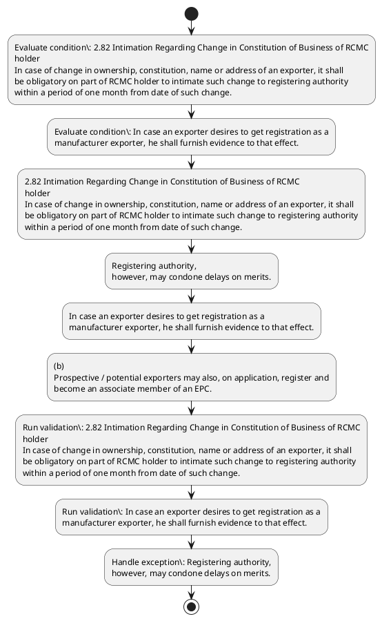

# Chapter 2 / Section 2.82: Intimation Regarding Change in Constitution of Business of RCMC

**Chapter Title:** General Provisions Regarding Imports and Exports

**Pages:** 35

**Purpose:** 2.82 Intimation Regarding Change in Constitution of Business of RCMC
holder
In case of change in ownership, constitution, name or address of an exporter, it shall
be obligatory on part of RCMC holder to intimate such change to registering authority
within a period of one month from date of such change.

**Purpose Thanglish:** Indha Intimation Regarding Change in Constitution of Business of RCMC section-la, 2.82 Intimation Regarding Change in Constitution of Business of RCMC
holder
In case of change in ownership, constitution, name or address of an exporter, it kandippa
be obligatory on part of RCMC holder to intimate such change to registering authority
within a period of one month from date of such change.

**Summary:** 2.82 Intimation Regarding Change in Constitution of Business of RCMC
holder
In case of change in ownership, constitution, name or address of an exporter, it shall
be obligatory on part of RCMC holder to intimate such change to registering authority
within a period of one month from date of such change. Registering authority,
however, may condone delays on merits. pg.

**Business Meaning:** Intimation Regarding Change in Constitution of Business of RCMC governs how DGFT business controls should be applied, validated, and enforced.

**Business Explanation:** Intimation Regarding Change in Constitution of Business of RCMC explains the operating rule set that DEKAI should enforce. Key control points include 2.82 Intimation Regarding Change in Constitution of Business of RCMC
holder
In case of change in ownership, constitution, name or address of an exporter, it shall
be obligatory on part of RCMC holder to intimate such change to registering authority
within a period of one month from date of such change. The section also drives actions such as 2.82 Intimation Regarding Change in Constitution of Business of RCMC
holder
In case of change in ownership, constitution, name or address of an exporter, it shall
be obligatory on part of RCMC holder to intimate such change to registering authority
within a period of one month from date of such change..

**Business Explanation Thanglish:** Indha Intimation Regarding Change in Constitution of Business of RCMC section-la, Intimation Regarding Change in Constitution of Business of RCMC explains the operating rule set that DEKAI should enforce. Key control points include 2.82 Intimation Regarding Change in Constitution of Business of RCMC
holder
In case of change in ownership, constitution, name or address of an exporter, it kandippa
be obligatory on part of RCMC holder to intimate such change to registering authority
within a period of one month from date of such change. The section also drives actions such as 2.82 Intimation Regarding Change in Constitution of Business of RCMC
holder
In case of change in ownership, constitution, name or address of an exporter, it kandippa
be obligatory on part of RCMC holder to intimate such change to registering authority
within a period of one month from date of such change..

## Business Logic
- 2.82 Intimation Regarding Change in Constitution of Business of RCMC
holder
In case of change in ownership, constitution, name or address of an exporter, it shall
be obligatory on part of RCMC holder to intimate such change to registering authority
within a period of one month from date of such change.
- In case an exporter desires to get registration as a
manufacturer exporter, he shall furnish evidence to that effect.

## Business Rules
- rule_id=CH2-SEC2_82-R001, rule_description=2.82 Intimation Regarding Change in Constitution of Business of RCMC
holder
In case of change in ownership, constitution, name or address of an exporter, it shall
be obligatory on part of RCMC holder to intimate such change to registering authority
within a period of one month from date of such change., trigger=Intimation Regarding Change in Constitution of Business of RCMC, condition=2.82 Intimation Regarding Change in Constitution of Business of RCMC
holder
In case of change in ownership, constitution, name or address of an exporter, it shall
be obligatory on part of RCMC holder to intimate such change to registering authority
within a period of one month from date of such change., validation=2.82 Intimation Regarding Change in Constitution of Business of RCMC
holder
In case of change in ownership, constitution, name or address of an exporter, it shall
be obligatory on part of RCMC holder to intimate such change to registering authority
within a period of one month from date of such change., action=2.82 Intimation Regarding Change in Constitution of Business of RCMC
holder
In case of change in ownership, constitution, name or address of an exporter, it shall
be obligatory on part of RCMC holder to intimate such change to registering authority
within a period of one month from date of such change., exception=Registering authority,
however, may condone delays on merits., output=DEKAI should produce a compliance decision for 2.82 - Intimation Regarding Change in Constitution of Business of RCMC.
- rule_id=CH2-SEC2_82-R002, rule_description=In case an exporter desires to get registration as a
manufacturer exporter, he shall furnish evidence to that effect., trigger=Intimation Regarding Change in Constitution of Business of RCMC, condition=In case an exporter desires to get registration as a
manufacturer exporter, he shall furnish evidence to that effect., validation=In case an exporter desires to get registration as a
manufacturer exporter, he shall furnish evidence to that effect., action=Registering authority,
however, may condone delays on merits., exception=Registering authority,
however, may condone delays on merits., output=DEKAI should produce a compliance decision for 2.82 - Intimation Regarding Change in Constitution of Business of RCMC.

## Conditions
- 2.82 Intimation Regarding Change in Constitution of Business of RCMC
holder
In case of change in ownership, constitution, name or address of an exporter, it shall
be obligatory on part of RCMC holder to intimate such change to registering authority
within a period of one month from date of such change.
- In case an exporter desires to get registration as a
manufacturer exporter, he shall furnish evidence to that effect.

## Condition Logic
- id=2.2.82.1, if=2.82 Intimation Regarding Change in Constitution of Business of RCMC
holder
In case of change in ownership, constitution, name or address of an exporter, it shall
be obligatory on part of RCMC holder to intimate such change to registering authority
within a period of one month from date of such change., then=2.82 Intimation Regarding Change in Constitution of Business of RCMC
holder
In case of change in ownership, constitution, name or address of an exporter, it shall
be obligatory on part of RCMC holder to intimate such change to registering authority
within a period of one month from date of such change., source=2.82 Intimation Regarding Change in Constitution of Business of RCMC
holder
In case of change in ownership, constitution, name or address of an exporter, it shall
be obligatory on part of RCMC holder to intimate such change to registering authority
within a period of one month from date of such change.
- id=2.2.82.2, if=In case an exporter desires to get registration as a
manufacturer exporter, he shall furnish evidence to that effect., then=2.82 Intimation Regarding Change in Constitution of Business of RCMC
holder
In case of change in ownership, constitution, name or address of an exporter, it shall
be obligatory on part of RCMC holder to intimate such change to registering authority
within a period of one month from date of such change., source=In case an exporter desires to get registration as a
manufacturer exporter, he shall furnish evidence to that effect.

## Validations
- 2.82 Intimation Regarding Change in Constitution of Business of RCMC
holder
In case of change in ownership, constitution, name or address of an exporter, it shall
be obligatory on part of RCMC holder to intimate such change to registering authority
within a period of one month from date of such change.
- In case an exporter desires to get registration as a
manufacturer exporter, he shall furnish evidence to that effect.

## Exceptions
- Registering authority,
however, may condone delays on merits.

## Dependencies
- None identified

## Authorities
- None identified

## Required Documents
- (b)
Prospective / potential exporters may also, on application, register and
become an associate member of an EPC.

## Timelines
- 2.82 Intimation Regarding Change in Constitution of Business of RCMC
holder
In case of change in ownership, constitution, name or address of an exporter, it shall
be obligatory on part of RCMC holder to intimate such change to registering authority
within a period of one month from date of such change.

## Actions
- 2.82 Intimation Regarding Change in Constitution of Business of RCMC
holder
In case of change in ownership, constitution, name or address of an exporter, it shall
be obligatory on part of RCMC holder to intimate such change to registering authority
within a period of one month from date of such change.
- Registering authority,
however, may condone delays on merits.
- In case an exporter desires to get registration as a
manufacturer exporter, he shall furnish evidence to that effect.
- (b)
Prospective / potential exporters may also, on application, register and
become an associate member of an EPC.

## Workflow
- Evaluate condition: 2.82 Intimation Regarding Change in Constitution of Business of RCMC
holder
In case of change in ownership, constitution, name or address of an exporter, it shall
be obligatory on part of RCMC holder to intimate such change to registering authority
within a period of one month from date of such change.
- Evaluate condition: In case an exporter desires to get registration as a
manufacturer exporter, he shall furnish evidence to that effect.
- 2.82 Intimation Regarding Change in Constitution of Business of RCMC
holder
In case of change in ownership, constitution, name or address of an exporter, it shall
be obligatory on part of RCMC holder to intimate such change to registering authority
within a period of one month from date of such change.
- Registering authority,
however, may condone delays on merits.
- In case an exporter desires to get registration as a
manufacturer exporter, he shall furnish evidence to that effect.
- (b)
Prospective / potential exporters may also, on application, register and
become an associate member of an EPC.
- Run validation: 2.82 Intimation Regarding Change in Constitution of Business of RCMC
holder
In case of change in ownership, constitution, name or address of an exporter, it shall
be obligatory on part of RCMC holder to intimate such change to registering authority
within a period of one month from date of such change.
- Run validation: In case an exporter desires to get registration as a
manufacturer exporter, he shall furnish evidence to that effect.
- Handle exception: Registering authority,
however, may condone delays on merits.

## Workflow ASCII
```text
Intimation Regarding Change in Constitution of Business of RCMC
Evaluate condition: 2.82 Intimation Regarding Change in Constitution of Business of RCMC
holder
In case of change in ownership, constitution, name or address of an exporter, it shall
be obligatory on part of RCMC holder to intimate such change to registering authority
within a period of one month from date of such change.
   |
   v
Evaluate condition: In case an exporter desires to get registration as a
manufacturer exporter, he shall furnish evidence to that effect.
   |
   v
2.82 Intimation Regarding Change in Constitution of Business of RCMC
holder
In case of change in ownership, constitution, name or address of an exporter, it shall
be obligatory on part of RCMC holder to intimate such change to registering authority
within a period of one month from date of such change.
   |
   v
Registering authority,
however, may condone delays on merits.
   |
   v
In case an exporter desires to get registration as a
manufacturer exporter, he shall furnish evidence to that effect.
   |
   v
(b)
Prospective / potential exporters may also, on application, register and
become an associate member of an EPC.
   |
   v
Run validation: 2.82 Intimation Regarding Change in Constitution of Business of RCMC
holder
In case of change in ownership, constitution, name or address of an exporter, it shall
be obligatory on part of RCMC holder to intimate such change to registering authority
within a period of one month from date of such change.
   |
   v
Run validation: In case an exporter desires to get registration as a
manufacturer exporter, he shall furnish evidence to that effect.
   |
   v
Handle exception: Registering authority,
however, may condone delays on merits.
```

## Decision Tree
- IF 2.82 Intimation Regarding Change in Constitution of Business of RCMC
holder
In case of change in ownership, constitution, name or address of an exporter, it shall
be obligatory on part of RCMC holder to intimate such change to registering authority
within a period of one month from date of such change. THEN 2.82 Intimation Regarding Change in Constitution of Business of RCMC
holder
In case of change in ownership, constitution, name or address of an exporter, it shall
be obligatory on part of RCMC holder to intimate such change to registering authority
within a period of one month from date of such change.
- IF In case an exporter desires to get registration as a
manufacturer exporter, he shall furnish evidence to that effect. THEN 2.82 Intimation Regarding Change in Constitution of Business of RCMC
holder
In case of change in ownership, constitution, name or address of an exporter, it shall
be obligatory on part of RCMC holder to intimate such change to registering authority
within a period of one month from date of such change.
- IF exception applies (Registering authority,
however, may condone delays on merits.) THEN route to manual review

## Decision Tree ASCII
```text
Intimation Regarding Change in Constitution of Business of RCMC Decision
IF 2.82 Intimation Regarding Change in Constitution of Business of RCMC
holder
In case of change in ownership, constitution, name or address of an exporter, it shall
be obligatory on part of RCMC holder to intimate such change to registering authority
within a period of one month from date of such change. THEN 2.82 Intimation Regarding Change in Constitution of Business of RCMC
holder
In case of change in ownership, constitution, name or address of an exporter, it shall
be obligatory on part of RCMC holder to intimate such change to registering authority
within a period of one month from date of such change.
   |
   v
IF In case an exporter desires to get registration as a
manufacturer exporter, he shall furnish evidence to that effect. THEN 2.82 Intimation Regarding Change in Constitution of Business of RCMC
holder
In case of change in ownership, constitution, name or address of an exporter, it shall
be obligatory on part of RCMC holder to intimate such change to registering authority
within a period of one month from date of such change.
   |
   v
IF exception applies (Registering authority,
however, may condone delays on merits.) THEN route to manual review
```

## Examples
- User asks to process Intimation Regarding Change in Constitution of Business of RCMC; the platform checks conditions, validations, and documents before action.

**Real-world Example:** Example: an importer or exporter invokes Intimation Regarding Change in Constitution of Business of RCMC, submits (b)
Prospective / potential exporters may also, on application, register and
become an associate member of an EPC., and DEKAI uses the extracted rules to 2.82 intimation regarding change in constitution of business of rcmc
holder
in case of change in ownership, constitution, name or address of an exporter, it shall
be obligatory on part of rcmc holder to intimate such change to registering authority
within a period of one month from date of such change..

**Real-world Example Thanglish:** Indha Intimation Regarding Change in Constitution of Business of RCMC section-la, Example: an importer or exporter invokes Intimation Regarding Change in Constitution of Business of RCMC, submits (b)
Prospective / potential exporters may also, on application, register and
become an associate member of an EPC., and DEKAI uses the extracted rules to 2.82 intimation regarding change in constitution of business of rcmc
holder
in case of change in ownership, constitution, name or address of an exporter, it kandippa
be obligatory on part of rcmc holder to intimate such change to registering authority
within a period of one month from date of such change..

## AI Rules
- IF detected context matches section rule THEN enforce: 2.82 Intimation Regarding Change in Constitution of Business of RCMC
holder
In case of change in ownership, constitution, name or address of an exporter, it shall
be obligatory on part of RCMC holder to intimate such change to registering authority
within a period of one month from date of such change.
- IF detected context matches section rule THEN enforce: In case an exporter desires to get registration as a
manufacturer exporter, he shall furnish evidence to that effect.
- IF validations pass THEN recommend action: 2.82 Intimation Regarding Change in Constitution of Business of RCMC
holder
In case of change in ownership, constitution, name or address of an exporter, it shall
be obligatory on part of RCMC holder to intimate such change to registering authority
within a period of one month from date of such change.

## Database Fields
- name=section_code, type=string, required=True, source=parsed_section_heading
- name=section_title, type=string, required=True, source=parsed_section_heading
- name=one_flag, type=boolean, required=False, source=keyword:one
- name=may_flag, type=boolean, required=False, source=keyword:may
- name=get_flag, type=boolean, required=False, source=keyword:get
- name=and_flag, type=boolean, required=False, source=keyword:and
- name=epc_flag, type=boolean, required=False, source=keyword:EPC
- name=rcmc_flag, type=boolean, required=False, source=keyword:RCMC
- name=case_flag, type=boolean, required=False, source=keyword:case
- name=name_flag, type=boolean, required=False, source=keyword:name
- name=document_1_submitted, type=boolean, required=True, source=(b)
Prospective / potential exporters may also, on application, register and
become an associate member of an EPC.

## API Requirements
- method=GET, path=/api/dgft/sections/2.82, purpose=Retrieve knowledge payload for section 2.82, query_params=['include=workflow,decision_tree,validations'], response_fields=['section', 'title', 'summary', 'conditions', 'validations', 'exceptions', 'workflow', 'decision_tree']
- method=POST, path=/api/dgft/Intimation-Regarding-Change-in-Constitution-of-Business-of-RCMC/validate, purpose=Validate inputs and documents for Intimation Regarding Change in Constitution of Business of RCMC, request_fields=['section_code', 'section_title', 'document_1_submitted'], response_fields=['status', 'errors', 'warnings', 'next_actions']
- method=POST, path=/api/dgft/Intimation-Regarding-Change-in-Constitution-of-Business-of-RCMC/execute, purpose=Trigger business action for 2.82 Intimation Regarding Change in Constitution of Business of RCMC
holder
In case of change in ownership, constitution, name or address of an exporter, it shall
be obligatory on part of RCMC holder to intimate such change to registering authority
within a period of one month from date of such change., request_fields=['section_code', 'section_title', 'document_1_submitted'], response_fields=['reference_id', 'status', 'authority', 'timeline']

## UI Screens
- screen_id=Intimation_Regarding_Change_in_Constitution_of_Business_of_RCMC_overview, name=Intimation Regarding Change in Constitution of Business of RCMC Overview, purpose=Show section summary, authority, timeline, and eligibility cues., widgets=['summary_card', 'conditions_table', 'authority_badges', 'timeline_panel']
- screen_id=Intimation_Regarding_Change_in_Constitution_of_Business_of_RCMC_submission, name=Intimation Regarding Change in Constitution of Business of RCMC Submission, purpose=Capture applicant data and supporting documents., widgets=['dynamic_form', 'document_uploader', 'validation_panel', 'next_action_footer'], fields=['section_code', 'section_title', 'one_flag', 'may_flag', 'get_flag', 'and_flag', 'epc_flag', 'rcmc_flag']
- screen_id=Intimation_Regarding_Change_in_Constitution_of_Business_of_RCMC_exceptions, name=Intimation Regarding Change in Constitution of Business of RCMC Exception Review, purpose=Explain exception handling and manual review triggers., widgets=['exception_banner', 'decision_tree', 'case_notes']

## Error Messages
- Validation failed because the section requirements were not fully met.

## FAQ
- question_en=What is the purpose of section 2.82?, answer_en=Intimation Regarding Change in Constitution of Business of RCMC explains the operating rule set that DEKAI should enforce. Key control points include 2.82 Intimation Regarding Change in Constitution of Business of RCMC
holder
In case of change in ownership, constitution, name or address of an exporter, it shall
be obligatory on part of RCMC holder to intimate such change to registering authority
within a period of one month from date of such change. The section also drives actions such as 2.82 Intimation Regarding Change in Constitution of Business of RCMC
holder
In case of change in ownership, constitution, name or address of an exporter, it shall
be obligatory on part of RCMC holder to intimate such change to registering authority
within a period of one month from date of such change.., question_thanglish=Indha Intimation Regarding Change in Constitution of Business of RCMC section-la, What is the purpose of section 2.82?, answer_thanglish=Indha Intimation Regarding Change in Constitution of Business of RCMC section-la, Intimation Regarding Change in Constitution of Business of RCMC explains the operating rule set that DEKAI should enforce. Key control points include 2.82 Intimation Regarding Change in Constitution of Business of RCMC
holder
In case of change in ownership, constitution, name or address of an exporter, it kandippa
be obligatory on part of RCMC holder to intimate such change to registering authority
within a period of one month from date of such change. The section also drives actions such as 2.82 Intimation Regarding Change in Constitution of Business of RCMC
holder
In case of change in ownership, constitution, name or address of an exporter, it kandippa
be obligatory on part of RCMC holder to intimate such change to registering authority
within a period of one month from date of such change..
- question_en=What documents are required under Intimation Regarding Change in Constitution of Business of RCMC?, answer_en=(b)
Prospective / potential exporters may also, on application, register and
become an associate member of an EPC., question_thanglish=Indha Intimation Regarding Change in Constitution of Business of RCMC section-la, What documents are required under Intimation Regarding Change in Constitution of Business of RCMC?, answer_thanglish=Indha Intimation Regarding Change in Constitution of Business of RCMC section-la, (b)
Prospective / potential exporters may also, on application, register and
become an associate member of an EPC.
- question_en=Which authority handles Intimation Regarding Change in Constitution of Business of RCMC?, answer_en=Not explicitly covered in uploaded documents., question_thanglish=Indha Intimation Regarding Change in Constitution of Business of RCMC section-la, Which authority handles Intimation Regarding Change in Constitution of Business of RCMC?, answer_thanglish=Indha Intimation Regarding Change in Constitution of Business of RCMC section-la, Not explicitly covered in uploaded documents.

## Questions Users May Ask
- What does Intimation Regarding Change in Constitution of Business of RCMC require?
- Which documents are needed for Intimation Regarding Change in Constitution of Business of RCMC?
- How does DEKAI validate Intimation Regarding Change in Constitution of Business of RCMC requests?
- What action should be taken for Intimation Regarding Change in Constitution of Business of RCMC?

## Expected AI Answers
- Intimation Regarding Change in Constitution of Business of RCMC requires the platform to interpret the section text, apply the extracted business rules, and present the correct next action.
- Required documents are inferred from the section text: (b)
Prospective / potential exporters may also, on application, register and
become an associate member of an EPC.
- DEKAI validates Intimation Regarding Change in Constitution of Business of RCMC by checking conditions, required documents, authority references, and exception clauses before recommending an outcome.
- The primary extracted action is: 2.82 Intimation Regarding Change in Constitution of Business of RCMC
holder
In case of change in ownership, constitution, name or address of an exporter, it shall
be obligatory on part of RCMC holder to intimate such change to registering authority
within a period of one month from date of such change.

## AI Q&A Examples
- question_en=User asks: How do I comply with Intimation Regarding Change in Constitution of Business of RCMC?, answer_en=AI answers: DEKAI should evaluate section 2.82, apply the extracted rules, and guide the user through Evaluate condition: 2.82 Intimation Regarding Change in Constitution of Business of RCMC
holder
In case of change in ownership, constitution, name or address of an exporter, it shall
be obligatory on part of RCMC holder to intimate such change to registering authority
within a period of one month from date of such change.., question_thanglish=Indha Intimation Regarding Change in Constitution of Business of RCMC section-la, User asks: How do I comply with Intimation Regarding Change in Constitution of Business of RCMC?, answer_thanglish=Indha Intimation Regarding Change in Constitution of Business of RCMC section-la, AI answers: DEKAI should evaluate section 2.82, apply the extracted rules, and guide the user through Evaluate condition: 2.82 Intimation Regarding Change in Constitution of Business of RCMC
holder
In case of change in ownership, constitution, name or address of an exporter, it kandippa
be obligatory on part of RCMC holder to intimate such change to registering authority
within a period of one month from date of such change..
- question_en=User asks: Which validations apply to Intimation Regarding Change in Constitution of Business of RCMC?, answer_en=AI answers: Applicable validations are 2.82 Intimation Regarding Change in Constitution of Business of RCMC
holder
In case of change in ownership, constitution, name or address of an exporter, it shall
be obligatory on part of RCMC holder to intimate such change to registering authority
within a period of one month from date of such change., In case an exporter desires to get registration as a
manufacturer exporter, he shall furnish evidence to that effect., question_thanglish=Indha Intimation Regarding Change in Constitution of Business of RCMC section-la, User asks: Which validations apply to Intimation Regarding Change in Constitution of Business of RCMC?, answer_thanglish=Indha Intimation Regarding Change in Constitution of Business of RCMC section-la, AI answers: Applicable validations are 2.82 Intimation Regarding Change in Constitution of Business of RCMC
holder
In case of change in ownership, constitution, name or address of an exporter, it kandippa
be obligatory on part of RCMC holder to intimate such change to registering authority
within a period of one month from date of such change., In case an exporter desires to get registration as a
manufacturer exporter, he kandippa furnish evidence to that effect.

## DEKAI AI Implementation Notes
- Capture chapter 2, section 2.82, title, and page references as immutable knowledge metadata.
- Bind validations for Intimation Regarding Change in Constitution of Business of RCMC into a rule engine keyed by the rule IDs extracted for this section.
- Expose document upload controls for: (b)
Prospective / potential exporters may also, on application, register and
become an associate member of an EPC..
- Trigger manual review when exception clauses are detected.

## DEKAI AI Implementation Notes Thanglish
- Indha Intimation Regarding Change in Constitution of Business of RCMC section-la, Capture chapter 2, section 2.82, title, and page references as immutable knowledge metadata.
- Indha Intimation Regarding Change in Constitution of Business of RCMC section-la, Bind validations for Intimation Regarding Change in Constitution of Business of RCMC into a rule engine keyed by the rule IDs extracted for this section.
- Indha Intimation Regarding Change in Constitution of Business of RCMC section-la, Expose document upload controls for: (b)
Prospective / potential exporters may also, on application, register and
become an associate member of an EPC..
- Indha Intimation Regarding Change in Constitution of Business of RCMC section-la, Trigger manual review when exception clauses are detected.

## AI Metadata
- Keywords: one, may, get, and, EPC, RCMC, case, name, part, such, from, date, that, also, shall, month, given, Change, holder, within
- Search Keywords: one, may, get, and, EPC, RCMC, case, name, part, such, from, date, that, also, shall, month, given, Change, holder, within
- Intent: Support Intimation Regarding Change in Constitution of Business of RCMC processing and compliance validation.
- Tags: 2.82, Intimation Regarding Change in Constitution of Business of RCMC, business-rule, document-driven, dgft
- Related Sections: 
- Related Chapters: 
- Related Rules: 2.82 Intimation Regarding Change in Constitution of Business of RCMC
holder
In case of change in ownership, constitution, name or address of an exporter, it shall
be obligatory on part of RCMC holder to intimate such change to registering authority
within a period of one month from date of such change., In case an exporter desires to get registration as a
manufacturer exporter, he shall furnish evidence to that effect.

## Mermaid

```mermaid
flowchart TD
    S1["Evaluate condition: 2.82 Intimation Regarding Change in Constitution of Business of RCMC
holder
In case of change in ownership, constitution, name or address of an exporter, it shall
be obligatory on part of RCMC holder to intimate such change to registering authority
within a period of one month from date of such change."]
    S2["Evaluate condition: In case an exporter desires to get registration as a
manufacturer exporter, he shall furnish evidence to that effect."]
    S1 --> S2
    S3["2.82 Intimation Regarding Change in Constitution of Business of RCMC
holder
In case of change in ownership, constitution, name or address of an exporter, it shall
be obligatory on part of RCMC holder to intimate such change to registering authority
within a period of one month from date of such change."]
    S2 --> S3
    S4["Registering authority,
however, may condone delays on merits."]
    S3 --> S4
    S5["In case an exporter desires to get registration as a
manufacturer exporter, he shall furnish evidence to that effect."]
    S4 --> S5
    S6["(b)
Prospective / potential exporters may also, on application, register and
become an associate member of an EPC."]
    S5 --> S6
    S7["Run validation: 2.82 Intimation Regarding Change in Constitution of Business of RCMC
holder
In case of change in ownership, constitution, name or address of an exporter, it shall
be obligatory on part of RCMC holder to intimate such change to registering authority
within a period of one month from date of such change."]
    S6 --> S7
    S8["Run validation: In case an exporter desires to get registration as a
manufacturer exporter, he shall furnish evidence to that effect."]
    S7 --> S8
    S9["Handle exception: Registering authority,
however, may condone delays on merits."]
    S8 --> S9
```


## PlantUML

