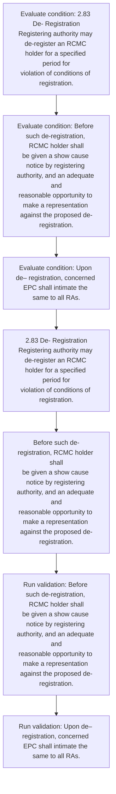
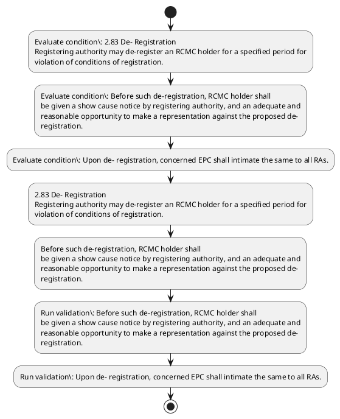

# Chapter 2 / Section 2.83: De- Registration

**Chapter Title:** General Provisions Regarding Imports and Exports

**Pages:** 36

**Purpose:** 2.83 De- Registration
Registering authority may de-register an RCMC holder for a specified period for
violation of conditions of registration.

**Purpose Thanglish:** Indha De- Registration section-la, 2.83 De- Registration
Registering authority may de-register an RCMC holder for a specified period for
violation of conditions of registration.

**Summary:** 2.83 De- Registration
Registering authority may de-register an RCMC holder for a specified period for
violation of conditions of registration. Before such de-registration, RCMC holder shall
be given a show cause notice by registering authority, and an adequate and
reasonable opportunity to make a representation against the proposed de-
registration. Upon de– registration, concerned EPC shall intimate the same to all RAs.

**Business Meaning:** De- Registration governs how DGFT business controls should be applied, validated, and enforced.

**Business Explanation:** De- Registration explains the operating rule set that DEKAI should enforce. Key control points include Before such de-registration, RCMC holder shall
be given a show cause notice by registering authority, and an adequate and
reasonable opportunity to make a representation against the proposed de-
registration. The section also drives actions such as 2.83 De- Registration
Registering authority may de-register an RCMC holder for a specified period for
violation of conditions of registration..

**Business Explanation Thanglish:** Indha De- Registration section-la, De- Registration explains the operating rule set that DEKAI should enforce. Key control points include Before such de-registration, RCMC holder kandippa
be given a show cause notice by registering authority, and an adequate and
reasonable opportunity to make a representation against the proposed de-
registration. The section also drives actions such as 2.83 De- Registration
Registering authority may de-register an RCMC holder for a specified period for
violation of conditions of registration..

## Business Logic
- Before such de-registration, RCMC holder shall
be given a show cause notice by registering authority, and an adequate and
reasonable opportunity to make a representation against the proposed de-
registration.
- Upon de– registration, concerned EPC shall intimate the same to all RAs.

## Business Rules
- rule_id=CH2-SEC2_83-R001, rule_description=Before such de-registration, RCMC holder shall
be given a show cause notice by registering authority, and an adequate and
reasonable opportunity to make a representation against the proposed de-
registration., trigger=De- Registration, condition=2.83 De- Registration
Registering authority may de-register an RCMC holder for a specified period for
violation of conditions of registration., validation=Before such de-registration, RCMC holder shall
be given a show cause notice by registering authority, and an adequate and
reasonable opportunity to make a representation against the proposed de-
registration., action=2.83 De- Registration
Registering authority may de-register an RCMC holder for a specified period for
violation of conditions of registration., exception=No explicit exception found in uploaded documents., output=DEKAI should produce a compliance decision for 2.83 - De- Registration.
- rule_id=CH2-SEC2_83-R002, rule_description=Upon de– registration, concerned EPC shall intimate the same to all RAs., trigger=De- Registration, condition=Before such de-registration, RCMC holder shall
be given a show cause notice by registering authority, and an adequate and
reasonable opportunity to make a representation against the proposed de-
registration., validation=Upon de– registration, concerned EPC shall intimate the same to all RAs., action=Before such de-registration, RCMC holder shall
be given a show cause notice by registering authority, and an adequate and
reasonable opportunity to make a representation against the proposed de-
registration., exception=No explicit exception found in uploaded documents., output=DEKAI should produce a compliance decision for 2.83 - De- Registration.

## Conditions
- 2.83 De- Registration
Registering authority may de-register an RCMC holder for a specified period for
violation of conditions of registration.
- Before such de-registration, RCMC holder shall
be given a show cause notice by registering authority, and an adequate and
reasonable opportunity to make a representation against the proposed de-
registration.
- Upon de– registration, concerned EPC shall intimate the same to all RAs.

## Condition Logic
- id=2.2.83.1, if=2.83 De- Registration
Registering authority may de-register an RCMC holder for a specified period for
violation of conditions of registration., then=2.83 De- Registration
Registering authority may de-register an RCMC holder for a specified period for
violation of conditions of registration., source=2.83 De- Registration
Registering authority may de-register an RCMC holder for a specified period for
violation of conditions of registration.
- id=2.2.83.2, if=Before such de-registration, RCMC holder shall
be given a show cause notice by registering authority, and an adequate and
reasonable opportunity to make a representation against the proposed de-
registration., then=2.83 De- Registration
Registering authority may de-register an RCMC holder for a specified period for
violation of conditions of registration., source=Before such de-registration, RCMC holder shall
be given a show cause notice by registering authority, and an adequate and
reasonable opportunity to make a representation against the proposed de-
registration.
- id=2.2.83.3, if=Upon de– registration, concerned EPC shall intimate the same to all RAs., then=2.83 De- Registration
Registering authority may de-register an RCMC holder for a specified period for
violation of conditions of registration., source=Upon de– registration, concerned EPC shall intimate the same to all RAs.

## Validations
- Before such de-registration, RCMC holder shall
be given a show cause notice by registering authority, and an adequate and
reasonable opportunity to make a representation against the proposed de-
registration.
- Upon de– registration, concerned EPC shall intimate the same to all RAs.

## Exceptions
- None identified

## Dependencies
- None identified

## Authorities
- None identified

## Required Documents
- None identified

## Timelines
- Before such de-registration, RCMC holder shall
be given a show cause notice by registering authority, and an adequate and
reasonable opportunity to make a representation against the proposed de-
registration.

## Actions
- 2.83 De- Registration
Registering authority may de-register an RCMC holder for a specified period for
violation of conditions of registration.
- Before such de-registration, RCMC holder shall
be given a show cause notice by registering authority, and an adequate and
reasonable opportunity to make a representation against the proposed de-
registration.

## Workflow
- Evaluate condition: 2.83 De- Registration
Registering authority may de-register an RCMC holder for a specified period for
violation of conditions of registration.
- Evaluate condition: Before such de-registration, RCMC holder shall
be given a show cause notice by registering authority, and an adequate and
reasonable opportunity to make a representation against the proposed de-
registration.
- Evaluate condition: Upon de– registration, concerned EPC shall intimate the same to all RAs.
- 2.83 De- Registration
Registering authority may de-register an RCMC holder for a specified period for
violation of conditions of registration.
- Before such de-registration, RCMC holder shall
be given a show cause notice by registering authority, and an adequate and
reasonable opportunity to make a representation against the proposed de-
registration.
- Run validation: Before such de-registration, RCMC holder shall
be given a show cause notice by registering authority, and an adequate and
reasonable opportunity to make a representation against the proposed de-
registration.
- Run validation: Upon de– registration, concerned EPC shall intimate the same to all RAs.

## Workflow ASCII
```text
De- Registration
Evaluate condition: 2.83 De- Registration
Registering authority may de-register an RCMC holder for a specified period for
violation of conditions of registration.
   |
   v
Evaluate condition: Before such de-registration, RCMC holder shall
be given a show cause notice by registering authority, and an adequate and
reasonable opportunity to make a representation against the proposed de-
registration.
   |
   v
Evaluate condition: Upon de– registration, concerned EPC shall intimate the same to all RAs.
   |
   v
2.83 De- Registration
Registering authority may de-register an RCMC holder for a specified period for
violation of conditions of registration.
   |
   v
Before such de-registration, RCMC holder shall
be given a show cause notice by registering authority, and an adequate and
reasonable opportunity to make a representation against the proposed de-
registration.
   |
   v
Run validation: Before such de-registration, RCMC holder shall
be given a show cause notice by registering authority, and an adequate and
reasonable opportunity to make a representation against the proposed de-
registration.
   |
   v
Run validation: Upon de– registration, concerned EPC shall intimate the same to all RAs.
```

## Decision Tree
- IF 2.83 De- Registration
Registering authority may de-register an RCMC holder for a specified period for
violation of conditions of registration. THEN 2.83 De- Registration
Registering authority may de-register an RCMC holder for a specified period for
violation of conditions of registration.
- IF Before such de-registration, RCMC holder shall
be given a show cause notice by registering authority, and an adequate and
reasonable opportunity to make a representation against the proposed de-
registration. THEN 2.83 De- Registration
Registering authority may de-register an RCMC holder for a specified period for
violation of conditions of registration.
- IF Upon de– registration, concerned EPC shall intimate the same to all RAs. THEN 2.83 De- Registration
Registering authority may de-register an RCMC holder for a specified period for
violation of conditions of registration.

## Decision Tree ASCII
```text
De- Registration Decision
IF 2.83 De- Registration
Registering authority may de-register an RCMC holder for a specified period for
violation of conditions of registration. THEN 2.83 De- Registration
Registering authority may de-register an RCMC holder for a specified period for
violation of conditions of registration.
   |
   v
IF Before such de-registration, RCMC holder shall
be given a show cause notice by registering authority, and an adequate and
reasonable opportunity to make a representation against the proposed de-
registration. THEN 2.83 De- Registration
Registering authority may de-register an RCMC holder for a specified period for
violation of conditions of registration.
   |
   v
IF Upon de– registration, concerned EPC shall intimate the same to all RAs. THEN 2.83 De- Registration
Registering authority may de-register an RCMC holder for a specified period for
violation of conditions of registration.
```

## Examples
- User asks to process De- Registration; the platform checks conditions, validations, and documents before action.

**Real-world Example:** Example: an importer or exporter invokes De- Registration, submits the prescribed DGFT records, and DEKAI uses the extracted rules to 2.83 de- registration
registering authority may de-register an rcmc holder for a specified period for
violation of conditions of registration..

**Real-world Example Thanglish:** Indha De- Registration section-la, Example: an importer or exporter invokes De- Registration, submits the prescribed DGFT records, and DEKAI uses the extracted rules to 2.83 de- registration
registering authority may de-register an rcmc holder for a specified period for
violation of conditions of registration..

## AI Rules
- IF detected context matches section rule THEN enforce: Before such de-registration, RCMC holder shall
be given a show cause notice by registering authority, and an adequate and
reasonable opportunity to make a representation against the proposed de-
registration.
- IF detected context matches section rule THEN enforce: Upon de– registration, concerned EPC shall intimate the same to all RAs.
- IF validations pass THEN recommend action: 2.83 De- Registration
Registering authority may de-register an RCMC holder for a specified period for
violation of conditions of registration.

## Database Fields
- name=section_code, type=string, required=True, source=parsed_section_heading
- name=section_title, type=string, required=True, source=parsed_section_heading
- name=may_flag, type=boolean, required=False, source=keyword:may
- name=for_flag, type=boolean, required=False, source=keyword:for
- name=and_flag, type=boolean, required=False, source=keyword:and
- name=the_flag, type=boolean, required=False, source=keyword:the
- name=epc_flag, type=boolean, required=False, source=keyword:EPC
- name=all_flag, type=boolean, required=False, source=keyword:all
- name=ras_flag, type=boolean, required=False, source=keyword:RAs
- name=rcmc_flag, type=boolean, required=False, source=keyword:RCMC

## API Requirements
- method=GET, path=/api/dgft/sections/2.83, purpose=Retrieve knowledge payload for section 2.83, query_params=['include=workflow,decision_tree,validations'], response_fields=['section', 'title', 'summary', 'conditions', 'validations', 'exceptions', 'workflow', 'decision_tree']
- method=POST, path=/api/dgft/De-Registration/validate, purpose=Validate inputs and documents for De- Registration, request_fields=['section_code', 'section_title'], response_fields=['status', 'errors', 'warnings', 'next_actions']
- method=POST, path=/api/dgft/De-Registration/execute, purpose=Trigger business action for 2.83 De- Registration
Registering authority may de-register an RCMC holder for a specified period for
violation of conditions of registration., request_fields=['section_code', 'section_title'], response_fields=['reference_id', 'status', 'authority', 'timeline']

## UI Screens
- screen_id=De_Registration_overview, name=De- Registration Overview, purpose=Show section summary, authority, timeline, and eligibility cues., widgets=['summary_card', 'conditions_table', 'authority_badges', 'timeline_panel']
- screen_id=De_Registration_submission, name=De- Registration Submission, purpose=Capture applicant data and supporting documents., widgets=['dynamic_form', 'document_uploader', 'validation_panel', 'next_action_footer'], fields=['section_code', 'section_title', 'may_flag', 'for_flag', 'and_flag', 'the_flag', 'epc_flag', 'all_flag']

## Error Messages
- Validation failed because the section requirements were not fully met.

## FAQ
- question_en=What is the purpose of section 2.83?, answer_en=De- Registration explains the operating rule set that DEKAI should enforce. Key control points include Before such de-registration, RCMC holder shall
be given a show cause notice by registering authority, and an adequate and
reasonable opportunity to make a representation against the proposed de-
registration. The section also drives actions such as 2.83 De- Registration
Registering authority may de-register an RCMC holder for a specified period for
violation of conditions of registration.., question_thanglish=Indha De- Registration section-la, What is the purpose of section 2.83?, answer_thanglish=Indha De- Registration section-la, De- Registration explains the operating rule set that DEKAI should enforce. Key control points include Before such de-registration, RCMC holder kandippa
be given a show cause notice by registering authority, and an adequate and
reasonable opportunity to make a representation against the proposed de-
registration. The section also drives actions such as 2.83 De- Registration
Registering authority may de-register an RCMC holder for a specified period for
violation of conditions of registration..
- question_en=What documents are required under De- Registration?, answer_en=Not explicitly covered in uploaded documents., question_thanglish=Indha De- Registration section-la, What documents are required under De- Registration?, answer_thanglish=Indha De- Registration section-la, Not explicitly covered in uploaded documents.
- question_en=Which authority handles De- Registration?, answer_en=Not explicitly covered in uploaded documents., question_thanglish=Indha De- Registration section-la, Which authority handles De- Registration?, answer_thanglish=Indha De- Registration section-la, Not explicitly covered in uploaded documents.

## Questions Users May Ask
- What does De- Registration require?
- Which documents are needed for De- Registration?
- How does DEKAI validate De- Registration requests?
- What action should be taken for De- Registration?

## Expected AI Answers
- De- Registration requires the platform to interpret the section text, apply the extracted business rules, and present the correct next action.
- Required documents are inferred from the section text: no explicit documents were detected.
- DEKAI validates De- Registration by checking conditions, required documents, authority references, and exception clauses before recommending an outcome.
- The primary extracted action is: 2.83 De- Registration
Registering authority may de-register an RCMC holder for a specified period for
violation of conditions of registration.

## AI Q&A Examples
- question_en=User asks: How do I comply with De- Registration?, answer_en=AI answers: DEKAI should evaluate section 2.83, apply the extracted rules, and guide the user through Evaluate condition: 2.83 De- Registration
Registering authority may de-register an RCMC holder for a specified period for
violation of conditions of registration.., question_thanglish=Indha De- Registration section-la, User asks: How do I comply with De- Registration?, answer_thanglish=Indha De- Registration section-la, AI answers: DEKAI should evaluate section 2.83, apply the extracted rules, and guide the user through Evaluate condition: 2.83 De- Registration
Registering authority may de-register an RCMC holder for a specified period for
violation of conditions of registration..
- question_en=User asks: Which validations apply to De- Registration?, answer_en=AI answers: Applicable validations are Before such de-registration, RCMC holder shall
be given a show cause notice by registering authority, and an adequate and
reasonable opportunity to make a representation against the proposed de-
registration., Upon de– registration, concerned EPC shall intimate the same to all RAs., question_thanglish=Indha De- Registration section-la, User asks: Which validations apply to De- Registration?, answer_thanglish=Indha De- Registration section-la, AI answers: Applicable validations are Before such de-registration, RCMC holder kandippa
be given a show cause notice by registering authority, and an adequate and
reasonable opportunity to make a representation against the proposed de-
registration., Upon de– registration, concerned EPC kandippa intimate the same to all RAs.

## DEKAI AI Implementation Notes
- Capture chapter 2, section 2.83, title, and page references as immutable knowledge metadata.
- Bind validations for De- Registration into a rule engine keyed by the rule IDs extracted for this section.

## DEKAI AI Implementation Notes Thanglish
- Indha De- Registration section-la, Capture chapter 2, section 2.83, title, and page references as immutable knowledge metadata.
- Indha De- Registration section-la, Bind validations for De- Registration into a rule engine keyed by the rule IDs extracted for this section.

## AI Metadata
- Keywords: may, for, and, the, EPC, all, RAs, RCMC, such, show, make, Upon, same, shall, given, cause, holder, period, Before, notice
- Search Keywords: may, for, and, the, EPC, all, RAs, RCMC, such, show, make, Upon, same, shall, given, cause, holder, period, Before, notice
- Intent: Support De- Registration processing and compliance validation.
- Tags: 2.83, De- Registration, business-rule, dgft
- Related Sections: 
- Related Chapters: 
- Related Rules: Before such de-registration, RCMC holder shall
be given a show cause notice by registering authority, and an adequate and
reasonable opportunity to make a representation against the proposed de-
registration., Upon de– registration, concerned EPC shall intimate the same to all RAs.

## Mermaid


## PlantUML

