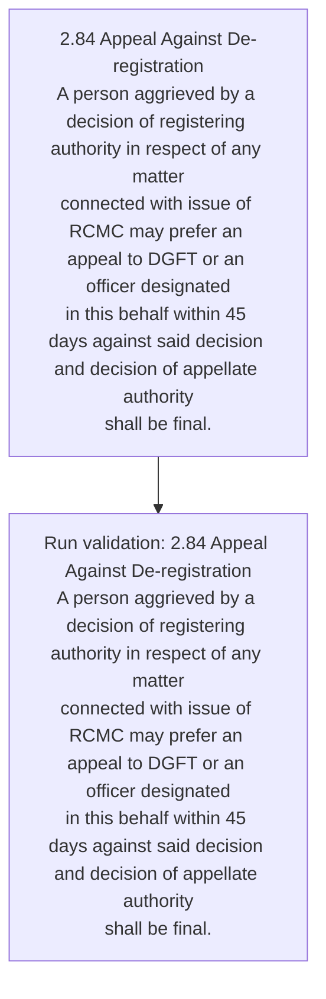
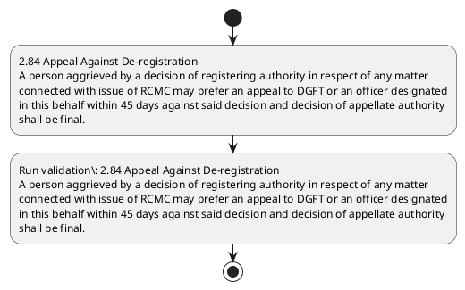

# Chapter 2 / Section 2.84: Appeal Against De-registration

**Chapter Title:** General Provisions Regarding Imports and Exports

**Pages:** 36

**Purpose:** 2.84 Appeal Against De-registration
A person aggrieved by a decision of registering authority in respect of any matter
connected with issue of RCMC may prefer an appeal to DGFT or an officer designated
in this behalf within 45 days against said decision and decision of appellate authority
shall be final.

**Purpose Thanglish:** Indha Appeal Against De-registration section-la, 2.84 Appeal Against De-registration
A person aggrieved by a decision of registering authority in respect of any matter
connected with issue of RCMC may prefer an appeal to DGFT or an officer designated
in this behalf within 45 days against said decision and decision of appellate authority
kandippa be final.

**Summary:** 2.84 Appeal Against De-registration
A person aggrieved by a decision of registering authority in respect of any matter
connected with issue of RCMC may prefer an appeal to DGFT or an officer designated
in this behalf within 45 days against said decision and decision of appellate authority
shall be final.

**Business Meaning:** Appeal Against De-registration governs how DGFT business controls should be applied, validated, and enforced.

**Business Explanation:** Appeal Against De-registration explains the operating rule set that DEKAI should enforce. Key control points include 2.84 Appeal Against De-registration
A person aggrieved by a decision of registering authority in respect of any matter
connected with issue of RCMC may prefer an appeal to DGFT or an officer designated
in this behalf within 45 days against said decision and decision of appellate authority
shall be final. The section also drives actions such as 2.84 Appeal Against De-registration
A person aggrieved by a decision of registering authority in respect of any matter
connected with issue of RCMC may prefer an appeal to DGFT or an officer designated
in this behalf within 45 days against said decision and decision of appellate authority
shall be final..

**Business Explanation Thanglish:** Indha Appeal Against De-registration section-la, Appeal Against De-registration explains the operating rule set that DEKAI should enforce. Key control points include 2.84 Appeal Against De-registration
A person aggrieved by a decision of registering authority in respect of any matter
connected with issue of RCMC may prefer an appeal to DGFT or an officer designated
in this behalf within 45 days against said decision and decision of appellate authority
kandippa be final. The section also drives actions such as 2.84 Appeal Against De-registration
A person aggrieved by a decision of registering authority in respect of any matter
connected with issue of RCMC may prefer an appeal to DGFT or an officer designated
in this behalf within 45 days against said decision and decision of appellate authority
kandippa be final..

## Business Logic
- 2.84 Appeal Against De-registration
A person aggrieved by a decision of registering authority in respect of any matter
connected with issue of RCMC may prefer an appeal to DGFT or an officer designated
in this behalf within 45 days against said decision and decision of appellate authority
shall be final.

## Business Rules
- rule_id=CH2-SEC2_84-R001, rule_description=2.84 Appeal Against De-registration
A person aggrieved by a decision of registering authority in respect of any matter
connected with issue of RCMC may prefer an appeal to DGFT or an officer designated
in this behalf within 45 days against said decision and decision of appellate authority
shall be final., trigger=Appeal Against De-registration, condition=Section 2.84 is applicable, validation=2.84 Appeal Against De-registration
A person aggrieved by a decision of registering authority in respect of any matter
connected with issue of RCMC may prefer an appeal to DGFT or an officer designated
in this behalf within 45 days against said decision and decision of appellate authority
shall be final., action=2.84 Appeal Against De-registration
A person aggrieved by a decision of registering authority in respect of any matter
connected with issue of RCMC may prefer an appeal to DGFT or an officer designated
in this behalf within 45 days against said decision and decision of appellate authority
shall be final., exception=No explicit exception found in uploaded documents., output=DEKAI should produce a compliance decision for 2.84 - Appeal Against De-registration.

## Conditions
- None identified

## Condition Logic
- id=2.2.84.1, if=Section 2.84 is applicable, then=2.84 Appeal Against De-registration
A person aggrieved by a decision of registering authority in respect of any matter
connected with issue of RCMC may prefer an appeal to DGFT or an officer designated
in this behalf within 45 days against said decision and decision of appellate authority
shall be final., source=Derived from uploaded documents

## Validations
- 2.84 Appeal Against De-registration
A person aggrieved by a decision of registering authority in respect of any matter
connected with issue of RCMC may prefer an appeal to DGFT or an officer designated
in this behalf within 45 days against said decision and decision of appellate authority
shall be final.

## Exceptions
- None identified

## Dependencies
- None identified

## Authorities
- DGFT
- RCMC may prefer an appeal to DGFT

## Required Documents
- None identified

## Timelines
- 2.84 Appeal Against De-registration
A person aggrieved by a decision of registering authority in respect of any matter
connected with issue of RCMC may prefer an appeal to DGFT or an officer designated
in this behalf within 45 days against said decision and decision of appellate authority
shall be final.

## Actions
- 2.84 Appeal Against De-registration
A person aggrieved by a decision of registering authority in respect of any matter
connected with issue of RCMC may prefer an appeal to DGFT or an officer designated
in this behalf within 45 days against said decision and decision of appellate authority
shall be final.

## Workflow
- 2.84 Appeal Against De-registration
A person aggrieved by a decision of registering authority in respect of any matter
connected with issue of RCMC may prefer an appeal to DGFT or an officer designated
in this behalf within 45 days against said decision and decision of appellate authority
shall be final.
- Run validation: 2.84 Appeal Against De-registration
A person aggrieved by a decision of registering authority in respect of any matter
connected with issue of RCMC may prefer an appeal to DGFT or an officer designated
in this behalf within 45 days against said decision and decision of appellate authority
shall be final.

## Workflow ASCII
```text
Appeal Against De-registration
2.84 Appeal Against De-registration
A person aggrieved by a decision of registering authority in respect of any matter
connected with issue of RCMC may prefer an appeal to DGFT or an officer designated
in this behalf within 45 days against said decision and decision of appellate authority
shall be final.
   |
   v
Run validation: 2.84 Appeal Against De-registration
A person aggrieved by a decision of registering authority in respect of any matter
connected with issue of RCMC may prefer an appeal to DGFT or an officer designated
in this behalf within 45 days against said decision and decision of appellate authority
shall be final.
```

## Decision Tree
- IF section 2.84 applies THEN 2.84 Appeal Against De-registration
A person aggrieved by a decision of registering authority in respect of any matter
connected with issue of RCMC may prefer an appeal to DGFT or an officer designated
in this behalf within 45 days against said decision and decision of appellate authority
shall be final.

## Decision Tree ASCII
```text
Appeal Against De-registration Decision
IF section 2.84 applies THEN 2.84 Appeal Against De-registration
A person aggrieved by a decision of registering authority in respect of any matter
connected with issue of RCMC may prefer an appeal to DGFT or an officer designated
in this behalf within 45 days against said decision and decision of appellate authority
shall be final.
```

## Examples
- User asks to process Appeal Against De-registration; the platform checks conditions, validations, and documents before action.

**Real-world Example:** Example: an importer or exporter invokes Appeal Against De-registration, submits the prescribed DGFT records, and DEKAI uses the extracted rules to 2.84 appeal against de-registration
a person aggrieved by a decision of registering authority in respect of any matter
connected with issue of rcmc may prefer an appeal to dgft or an officer designated
in this behalf within 45 days against said decision and decision of appellate authority
shall be final..

**Real-world Example Thanglish:** Indha Appeal Against De-registration section-la, Example: an importer or exporter invokes Appeal Against De-registration, submits the prescribed DGFT records, and DEKAI uses the extracted rules to 2.84 appeal against de-registration
a person aggrieved by a decision of registering authority in respect of any matter
connected with issue of rcmc may prefer an appeal to dgft or an officer designated
in this behalf within 45 days against said decision and decision of appellate authority
kandippa be final..

## AI Rules
- IF detected context matches section rule THEN enforce: 2.84 Appeal Against De-registration
A person aggrieved by a decision of registering authority in respect of any matter
connected with issue of RCMC may prefer an appeal to DGFT or an officer designated
in this behalf within 45 days against said decision and decision of appellate authority
shall be final.
- IF validations pass THEN recommend action: 2.84 Appeal Against De-registration
A person aggrieved by a decision of registering authority in respect of any matter
connected with issue of RCMC may prefer an appeal to DGFT or an officer designated
in this behalf within 45 days against said decision and decision of appellate authority
shall be final.

## Database Fields
- name=section_code, type=string, required=True, source=parsed_section_heading
- name=section_title, type=string, required=True, source=parsed_section_heading
- name=any_flag, type=boolean, required=False, source=keyword:any
- name=may_flag, type=boolean, required=False, source=keyword:may
- name=and_flag, type=boolean, required=False, source=keyword:and
- name=with_flag, type=boolean, required=False, source=keyword:with
- name=rcmc_flag, type=boolean, required=False, source=keyword:RCMC
- name=dgft_flag, type=boolean, required=False, source=keyword:DGFT
- name=this_flag, type=boolean, required=False, source=keyword:this
- name=days_flag, type=boolean, required=False, source=keyword:days

## API Requirements
- method=GET, path=/api/dgft/sections/2.84, purpose=Retrieve knowledge payload for section 2.84, query_params=['include=workflow,decision_tree,validations'], response_fields=['section', 'title', 'summary', 'conditions', 'validations', 'exceptions', 'workflow', 'decision_tree']
- method=POST, path=/api/dgft/Appeal-Against-De-registration/validate, purpose=Validate inputs and documents for Appeal Against De-registration, request_fields=['section_code', 'section_title'], response_fields=['status', 'errors', 'warnings', 'next_actions']
- method=POST, path=/api/dgft/Appeal-Against-De-registration/execute, purpose=Trigger business action for 2.84 Appeal Against De-registration
A person aggrieved by a decision of registering authority in respect of any matter
connected with issue of RCMC may prefer an appeal to DGFT or an officer designated
in this behalf within 45 days against said decision and decision of appellate authority
shall be final., request_fields=['section_code', 'section_title'], response_fields=['reference_id', 'status', 'authority', 'timeline']

## UI Screens
- screen_id=Appeal_Against_De_registration_overview, name=Appeal Against De-registration Overview, purpose=Show section summary, authority, timeline, and eligibility cues., widgets=['summary_card', 'conditions_table', 'authority_badges', 'timeline_panel']
- screen_id=Appeal_Against_De_registration_submission, name=Appeal Against De-registration Submission, purpose=Capture applicant data and supporting documents., widgets=['dynamic_form', 'document_uploader', 'validation_panel', 'next_action_footer'], fields=['section_code', 'section_title', 'any_flag', 'may_flag', 'and_flag', 'with_flag', 'rcmc_flag', 'dgft_flag']

## Error Messages
- Validation failed because the section requirements were not fully met.

## FAQ
- question_en=What is the purpose of section 2.84?, answer_en=Appeal Against De-registration explains the operating rule set that DEKAI should enforce. Key control points include 2.84 Appeal Against De-registration
A person aggrieved by a decision of registering authority in respect of any matter
connected with issue of RCMC may prefer an appeal to DGFT or an officer designated
in this behalf within 45 days against said decision and decision of appellate authority
shall be final. The section also drives actions such as 2.84 Appeal Against De-registration
A person aggrieved by a decision of registering authority in respect of any matter
connected with issue of RCMC may prefer an appeal to DGFT or an officer designated
in this behalf within 45 days against said decision and decision of appellate authority
shall be final.., question_thanglish=Indha Appeal Against De-registration section-la, What is the purpose of section 2.84?, answer_thanglish=Indha Appeal Against De-registration section-la, Appeal Against De-registration explains the operating rule set that DEKAI should enforce. Key control points include 2.84 Appeal Against De-registration
A person aggrieved by a decision of registering authority in respect of any matter
connected with issue of RCMC may prefer an appeal to DGFT or an officer designated
in this behalf within 45 days against said decision and decision of appellate authority
kandippa be final. The section also drives actions such as 2.84 Appeal Against De-registration
A person aggrieved by a decision of registering authority in respect of any matter
connected with issue of RCMC may prefer an appeal to DGFT or an officer designated
in this behalf within 45 days against said decision and decision of appellate authority
kandippa be final..
- question_en=What documents are required under Appeal Against De-registration?, answer_en=Not explicitly covered in uploaded documents., question_thanglish=Indha Appeal Against De-registration section-la, What documents are required under Appeal Against De-registration?, answer_thanglish=Indha Appeal Against De-registration section-la, Not explicitly covered in uploaded documents.
- question_en=Which authority handles Appeal Against De-registration?, answer_en=DGFT, RCMC may prefer an appeal to DGFT, question_thanglish=Indha Appeal Against De-registration section-la, Which authority handles Appeal Against De-registration?, answer_thanglish=Indha Appeal Against De-registration section-la, DGFT, RCMC may prefer an appeal to DGFT

## Questions Users May Ask
- What does Appeal Against De-registration require?
- Which documents are needed for Appeal Against De-registration?
- How does DEKAI validate Appeal Against De-registration requests?
- What action should be taken for Appeal Against De-registration?

## Expected AI Answers
- Appeal Against De-registration requires the platform to interpret the section text, apply the extracted business rules, and present the correct next action.
- Required documents are inferred from the section text: no explicit documents were detected.
- DEKAI validates Appeal Against De-registration by checking conditions, required documents, authority references, and exception clauses before recommending an outcome.
- The primary extracted action is: 2.84 Appeal Against De-registration
A person aggrieved by a decision of registering authority in respect of any matter
connected with issue of RCMC may prefer an appeal to DGFT or an officer designated
in this behalf within 45 days against said decision and decision of appellate authority
shall be final.

## AI Q&A Examples
- question_en=User asks: How do I comply with Appeal Against De-registration?, answer_en=AI answers: DEKAI should evaluate section 2.84, apply the extracted rules, and guide the user through 2.84 Appeal Against De-registration
A person aggrieved by a decision of registering authority in respect of any matter
connected with issue of RCMC may prefer an appeal to DGFT or an officer designated
in this behalf within 45 days against said decision and decision of appellate authority
shall be final.., question_thanglish=Indha Appeal Against De-registration section-la, User asks: How do I comply with Appeal Against De-registration?, answer_thanglish=Indha Appeal Against De-registration section-la, AI answers: DEKAI should evaluate section 2.84, apply the extracted rules, and guide the user through 2.84 Appeal Against De-registration
A person aggrieved by a decision of registering authority in respect of any matter
connected with issue of RCMC may prefer an appeal to DGFT or an officer designated
in this behalf within 45 days against said decision and decision of appellate authority
kandippa be final..
- question_en=User asks: Which validations apply to Appeal Against De-registration?, answer_en=AI answers: Applicable validations are 2.84 Appeal Against De-registration
A person aggrieved by a decision of registering authority in respect of any matter
connected with issue of RCMC may prefer an appeal to DGFT or an officer designated
in this behalf within 45 days against said decision and decision of appellate authority
shall be final., question_thanglish=Indha Appeal Against De-registration section-la, User asks: Which validations apply to Appeal Against De-registration?, answer_thanglish=Indha Appeal Against De-registration section-la, AI answers: Applicable validations are 2.84 Appeal Against De-registration
A person aggrieved by a decision of registering authority in respect of any matter
connected with issue of RCMC may prefer an appeal to DGFT or an officer designated
in this behalf within 45 days against said decision and decision of appellate authority
kandippa be final.

## DEKAI AI Implementation Notes
- Capture chapter 2, section 2.84, title, and page references as immutable knowledge metadata.
- Bind validations for Appeal Against De-registration into a rule engine keyed by the rule IDs extracted for this section.
- Route escalations or approvals to: DGFT, RCMC may prefer an appeal to DGFT.

## DEKAI AI Implementation Notes Thanglish
- Indha Appeal Against De-registration section-la, Capture chapter 2, section 2.84, title, and page references as immutable knowledge metadata.
- Indha Appeal Against De-registration section-la, Bind validations for Appeal Against De-registration into a rule engine keyed by the rule IDs extracted for this section.
- Indha Appeal Against De-registration section-la, Route escalations or approvals to: DGFT, RCMC may prefer an appeal to DGFT.

## AI Metadata
- Keywords: any, may, and, with, RCMC, DGFT, this, days, said, issue, shall, final, Appeal, person, matter, prefer, behalf, within, Against, respect
- Search Keywords: any, may, and, with, RCMC, DGFT, this, days, said, issue, shall, final, Appeal, person, matter, prefer, behalf, within, Against, respect
- Intent: Support Appeal Against De-registration processing and compliance validation.
- Tags: 2.84, Appeal Against De-registration, business-rule, dgft
- Related Sections: 
- Related Chapters: 
- Related Rules: 2.84 Appeal Against De-registration
A person aggrieved by a decision of registering authority in respect of any matter
connected with issue of RCMC may prefer an appeal to DGFT or an officer designated
in this behalf within 45 days against said decision and decision of appellate authority
shall be final.

## Mermaid


## PlantUML

