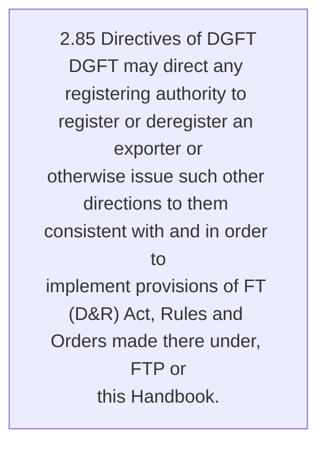
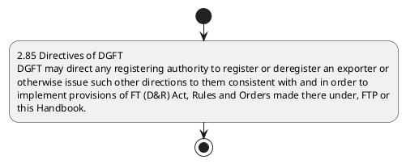

# Chapter 2 / Section 2.85: Directives of DGFT

**Chapter Title:** General Provisions Regarding Imports and Exports

**Pages:** 36

**Purpose:** 2.85 Directives of DGFT
DGFT may direct any registering authority to register or deregister an exporter or
otherwise issue such other directions to them consistent with and in order to
implement provisions of FT (D&R) Act, Rules and Orders made there under, FTP or
this Handbook.

**Purpose Thanglish:** Indha Directives of DGFT section-la, 2.85 Directives of DGFT
DGFT may direct any registering authority to register or deregister an exporter or
otherwise issue such other directions to them consistent with and in order to
implement provisions of FT (D&R) Act, Rules and Orders made there under, FTP or
this Handbook.

**Summary:** 2.85 Directives of DGFT
DGFT may direct any registering authority to register or deregister an exporter or
otherwise issue such other directions to them consistent with and in order to
implement provisions of FT (D&R) Act, Rules and Orders made there under, FTP or
this Handbook.

**Business Meaning:** 2.85 Directives of DGFT
DGFT may direct any registering authority to register or deregister an exporter or
otherwise issue such other directions to them consistent with and in order to
implement provisions of FT (D&R) Act, Rules and Orders made there under, FTP or
this Handbook.

**Business Explanation:** 2.85 Directives of DGFT
DGFT may direct any registering authority to register or deregister an exporter or
otherwise issue such other directions to them consistent with and in order to
implement provisions of FT (D&R) Act, Rules and Orders made there under, FTP or
this Handbook.

**Business Explanation Thanglish:** Indha Directives of DGFT section-la, 2.85 Directives of DGFT
DGFT may direct any registering authority to register or deregister an exporter or
otherwise issue such other directions to them consistent with and in order to
implement provisions of FT (D&R) Act, Rules and Orders made there under, FTP or
this Handbook.

## Business Logic
- None identified

## Business Rules
- rule_id=CH2-SEC2_85-R001, rule_description=IF validations pass THEN recommend action: 2.85 Directives of DGFT
DGFT may direct any registering authority to register or deregister an exporter or
otherwise issue such other directions to them consistent with and in order to
implement provisions of FT (D&R) Act, Rules and Orders made there under, FTP or
this Handbook., trigger=Directives of DGFT, condition=Section 2.85 is applicable, validation=Not explicitly covered in uploaded documents., action=2.85 Directives of DGFT
DGFT may direct any registering authority to register or deregister an exporter or
otherwise issue such other directions to them consistent with and in order to
implement provisions of FT (D&R) Act, Rules and Orders made there under, FTP or
this Handbook., exception=No explicit exception found in uploaded documents., output=DEKAI should produce a compliance decision for 2.85 - Directives of DGFT.

## Conditions
- None identified

## Condition Logic
- id=2.2.85.1, if=Section 2.85 is applicable, then=2.85 Directives of DGFT
DGFT may direct any registering authority to register or deregister an exporter or
otherwise issue such other directions to them consistent with and in order to
implement provisions of FT (D&R) Act, Rules and Orders made there under, FTP or
this Handbook., source=Derived from uploaded documents

## Validations
- None identified

## Exceptions
- None identified

## Dependencies
- None identified

## Authorities
- DGFT
- Directives of DGFT

## Required Documents
- None identified

## Timelines
- None identified

## Actions
- 2.85 Directives of DGFT
DGFT may direct any registering authority to register or deregister an exporter or
otherwise issue such other directions to them consistent with and in order to
implement provisions of FT (D&R) Act, Rules and Orders made there under, FTP or
this Handbook.

## Workflow
- 2.85 Directives of DGFT
DGFT may direct any registering authority to register or deregister an exporter or
otherwise issue such other directions to them consistent with and in order to
implement provisions of FT (D&R) Act, Rules and Orders made there under, FTP or
this Handbook.

## Workflow ASCII
```text
Directives of DGFT
2.85 Directives of DGFT
DGFT may direct any registering authority to register or deregister an exporter or
otherwise issue such other directions to them consistent with and in order to
implement provisions of FT (D&R) Act, Rules and Orders made there under, FTP or
this Handbook.
```

## Decision Tree
- IF section 2.85 applies THEN 2.85 Directives of DGFT
DGFT may direct any registering authority to register or deregister an exporter or
otherwise issue such other directions to them consistent with and in order to
implement provisions of FT (D&R) Act, Rules and Orders made there under, FTP or
this Handbook.

## Decision Tree ASCII
```text
Directives of DGFT Decision
IF section 2.85 applies THEN 2.85 Directives of DGFT
DGFT may direct any registering authority to register or deregister an exporter or
otherwise issue such other directions to them consistent with and in order to
implement provisions of FT (D&R) Act, Rules and Orders made there under, FTP or
this Handbook.
```

## Examples
- User asks to process Directives of DGFT; the platform checks conditions, validations, and documents before action.

**Real-world Example:** Example: an importer or exporter invokes Directives of DGFT, submits the prescribed DGFT records, and DEKAI uses the extracted rules to 2.85 directives of dgft
dgft may direct any registering authority to register or deregister an exporter or
otherwise issue such other directions to them consistent with and in order to
implement provisions of ft (d&r) act, rules and orders made there under, ftp or
this handbook..

**Real-world Example Thanglish:** Indha Directives of DGFT section-la, Example: an importer or exporter invokes Directives of DGFT, submits the prescribed DGFT records, and DEKAI uses the extracted rules to 2.85 directives of dgft
dgft may direct any registering authority to register or deregister an exporter or
otherwise issue such other directions to them consistent with and in order to
implement provisions of ft (d&r) act, rules and orders made there under, ftp or
this handbook..

## AI Rules
- IF validations pass THEN recommend action: 2.85 Directives of DGFT
DGFT may direct any registering authority to register or deregister an exporter or
otherwise issue such other directions to them consistent with and in order to
implement provisions of FT (D&R) Act, Rules and Orders made there under, FTP or
this Handbook.

## Database Fields
- name=section_code, type=string, required=True, source=parsed_section_heading
- name=section_title, type=string, required=True, source=parsed_section_heading
- name=may_flag, type=boolean, required=False, source=keyword:may
- name=any_flag, type=boolean, required=False, source=keyword:any
- name=and_flag, type=boolean, required=False, source=keyword:and
- name=d&r_flag, type=boolean, required=False, source=keyword:D&R
- name=act_flag, type=boolean, required=False, source=keyword:Act
- name=ftp_flag, type=boolean, required=False, source=keyword:FTP
- name=dgft_flag, type=boolean, required=False, source=keyword:DGFT
- name=such_flag, type=boolean, required=False, source=keyword:such

## API Requirements
- method=GET, path=/api/dgft/sections/2.85, purpose=Retrieve knowledge payload for section 2.85, query_params=['include=workflow,decision_tree,validations'], response_fields=['section', 'title', 'summary', 'conditions', 'validations', 'exceptions', 'workflow', 'decision_tree']
- method=POST, path=/api/dgft/Directives-of-DGFT/validate, purpose=Validate inputs and documents for Directives of DGFT, request_fields=['section_code', 'section_title'], response_fields=['status', 'errors', 'warnings', 'next_actions']
- method=POST, path=/api/dgft/Directives-of-DGFT/execute, purpose=Trigger business action for 2.85 Directives of DGFT
DGFT may direct any registering authority to register or deregister an exporter or
otherwise issue such other directions to them consistent with and in order to
implement provisions of FT (D&R) Act, Rules and Orders made there under, FTP or
this Handbook., request_fields=['section_code', 'section_title'], response_fields=['reference_id', 'status', 'authority', 'timeline']

## UI Screens
- screen_id=Directives_of_DGFT_overview, name=Directives of DGFT Overview, purpose=Show section summary, authority, timeline, and eligibility cues., widgets=['summary_card', 'conditions_table', 'authority_badges', 'timeline_panel']
- screen_id=Directives_of_DGFT_submission, name=Directives of DGFT Submission, purpose=Capture applicant data and supporting documents., widgets=['dynamic_form', 'document_uploader', 'validation_panel', 'next_action_footer'], fields=['section_code', 'section_title', 'may_flag', 'any_flag', 'and_flag', 'd&r_flag', 'act_flag', 'ftp_flag']

## Error Messages
- Validation failed because the section requirements were not fully met.

## FAQ
- question_en=What is the purpose of section 2.85?, answer_en=2.85 Directives of DGFT
DGFT may direct any registering authority to register or deregister an exporter or
otherwise issue such other directions to them consistent with and in order to
implement provisions of FT (D&R) Act, Rules and Orders made there under, FTP or
this Handbook., question_thanglish=Indha Directives of DGFT section-la, What is the purpose of section 2.85?, answer_thanglish=Indha Directives of DGFT section-la, 2.85 Directives of DGFT
DGFT may direct any registering authority to register or deregister an exporter or
otherwise issue such other directions to them consistent with and in order to
implement provisions of FT (D&R) Act, Rules and Orders made there under, FTP or
this Handbook.
- question_en=What documents are required under Directives of DGFT?, answer_en=Not explicitly covered in uploaded documents., question_thanglish=Indha Directives of DGFT section-la, What documents are required under Directives of DGFT?, answer_thanglish=Indha Directives of DGFT section-la, Not explicitly covered in uploaded documents.
- question_en=Which authority handles Directives of DGFT?, answer_en=DGFT, Directives of DGFT, question_thanglish=Indha Directives of DGFT section-la, Which authority handles Directives of DGFT?, answer_thanglish=Indha Directives of DGFT section-la, DGFT, Directives of DGFT

## Questions Users May Ask
- What does Directives of DGFT require?
- Which documents are needed for Directives of DGFT?
- How does DEKAI validate Directives of DGFT requests?
- What action should be taken for Directives of DGFT?

## Expected AI Answers
- Directives of DGFT requires the platform to interpret the section text, apply the extracted business rules, and present the correct next action.
- Required documents are inferred from the section text: no explicit documents were detected.
- DEKAI validates Directives of DGFT by checking conditions, required documents, authority references, and exception clauses before recommending an outcome.
- The primary extracted action is: 2.85 Directives of DGFT
DGFT may direct any registering authority to register or deregister an exporter or
otherwise issue such other directions to them consistent with and in order to
implement provisions of FT (D&R) Act, Rules and Orders made there under, FTP or
this Handbook.

## AI Q&A Examples
- question_en=User asks: How do I comply with Directives of DGFT?, answer_en=AI answers: DEKAI should evaluate section 2.85, apply the extracted rules, and guide the user through 2.85 Directives of DGFT
DGFT may direct any registering authority to register or deregister an exporter or
otherwise issue such other directions to them consistent with and in order to
implement provisions of FT (D&R) Act, Rules and Orders made there under, FTP or
this Handbook.., question_thanglish=Indha Directives of DGFT section-la, User asks: How do I comply with Directives of DGFT?, answer_thanglish=Indha Directives of DGFT section-la, AI answers: DEKAI should evaluate section 2.85, apply the extracted rules, and guide the user through 2.85 Directives of DGFT
DGFT may direct any registering authority to register or deregister an exporter or
otherwise issue such other directions to them consistent with and in order to
implement provisions of FT (D&R) Act, Rules and Orders made there under, FTP or
this Handbook..
- question_en=User asks: Which validations apply to Directives of DGFT?, answer_en=AI answers: Applicable validations are not explicitly covered in the uploaded documents., question_thanglish=Indha Directives of DGFT section-la, User asks: Which validations apply to Directives of DGFT?, answer_thanglish=Indha Directives of DGFT section-la, AI answers: Applicable validations are not explicitly covered in the uploaded documents.

## DEKAI AI Implementation Notes
- Capture chapter 2, section 2.85, title, and page references as immutable knowledge metadata.
- Bind validations for Directives of DGFT into a rule engine keyed by the rule IDs extracted for this section.
- Route escalations or approvals to: DGFT, Directives of DGFT.

## DEKAI AI Implementation Notes Thanglish
- Indha Directives of DGFT section-la, Capture chapter 2, section 2.85, title, and page references as immutable knowledge metadata.
- Indha Directives of DGFT section-la, Bind validations for Directives of DGFT into a rule engine keyed by the rule IDs extracted for this section.
- Indha Directives of DGFT section-la, Route escalations or approvals to: DGFT, Directives of DGFT.

## AI Metadata
- Keywords: may, any, and, D&R, Act, FTP, DGFT, such, them, with, made, this, issue, other, order, Rules, there, under, direct, Orders
- Search Keywords: may, any, and, D&R, Act, FTP, DGFT, such, them, with, made, this, issue, other, order, Rules, there, under, direct, Orders
- Intent: Support Directives of DGFT processing and compliance validation.
- Tags: 2.85, Directives of DGFT, dgft
- Related Sections: 
- Related Chapters: 
- Related Rules: 

## Mermaid


## PlantUML

