# Chapter 2 / Section 2.86: Identity Cards for Importers /Exporters

**Chapter Title:** General Provisions Regarding Imports and Exports

**Pages:** 36

**Purpose:** 2.86 Identity Cards for Importers /Exporters
(a) To facilitate collection of Authorisation and other documents from DGFT Hqrs and
RA, identity cards (valid for 3 years) may be issued to proprietor/ partners /
directors and authorised employees (not more than three), of importers and
exporters, upon online application
(b) In case of limited companies, more than three identity cards can be allotted per
company.

**Purpose Thanglish:** Indha Identity Cards for Importers /Exporters section-la, 2.86 Identity Cards for Importers /Exporters
(a) To facilitate collection of Authorisation and other documents from DGFT Hqrs and
RA, identity cards (valid for 3 years) may be issued to proprietor/ partners /
directors and authorised employees (not more than three), of importers and
exporters, upon online application
(b) In case of limited companies, more than three identity cards can be allotted per
company.

**Summary:** 2.86 Identity Cards for Importers /Exporters
(a) To facilitate collection of Authorisation and other documents from DGFT Hqrs and
RA, identity cards (valid for 3 years) may be issued to proprietor/ partners /
directors and authorised employees (not more than three), of importers and
exporters, upon online application
(b) In case of limited companies, more than three identity cards can be allotted per
company. In case of loss of an identity card, a duplicate card may be issued on the
basis of an self-declaration. (c) Identity card would be issued electronically with QR code and a Unique Document
Identification Number (UDIN) for electronic verification.

**Business Meaning:** 2.86 Identity Cards for Importers /Exporters
(a) To facilitate collection of Authorisation and other documents from DGFT Hqrs and
RA, identity cards (valid for 3 years) may be issued to proprietor/ partners /
directors and authorised employees (not more than three), of importers and
exporters, upon online application
(b) In case of limited companies, more than three identity cards can be allotted per
company.

**Business Explanation:** 2.86 Identity Cards for Importers /Exporters
(a) To facilitate collection of Authorisation and other documents from DGFT Hqrs and
RA, identity cards (valid for 3 years) may be issued to proprietor/ partners /
directors and authorised employees (not more than three), of importers and
exporters, upon online application
(b) In case of limited companies, more than three identity cards can be allotted per
company. In case of loss of an identity card, a duplicate card may be issued on the
basis of an self-declaration. (c) Identity card would be issued electronically with QR code and a Unique Document
Identification Number (UDIN) for electronic verification.

**Business Explanation Thanglish:** Indha Identity Cards for Importers /Exporters section-la, 2.86 Identity Cards for Importers /Exporters
(a) To facilitate collection of Authorisation and other documents from DGFT Hqrs and
RA, identity cards (valid for 3 years) may be issued to proprietor/ partners /
directors and authorised employees (not more than three), of importers and
exporters, upon online application
(b) In case of limited companies, more than three identity cards can be allotted per
company. In case of loss of an identity card, a duplicate card may be issued on the
basis of an self-declaration. (c) Identity card would be issued electronically with QR code and a Unique Document
Identification Number (UDIN) for electronic verification.

## Business Logic
- None identified

## Business Rules
- rule_id=CH2-SEC2_86-R001, rule_description=IF validations pass THEN recommend action: 2.86 Identity Cards for Importers /Exporters
(a) To facilitate collection of Authorisation and other documents from DGFT Hqrs and
RA, identity cards (valid for 3 years) may be issued to proprietor/ partners /
directors and authorised employees (not more than three), of importers and
exporters, upon online application
(b) In case of limited companies, more than three identity cards can be allotted per
company., trigger=Identity Cards for Importers /Exporters, condition=2.86 Identity Cards for Importers /Exporters
(a) To facilitate collection of Authorisation and other documents from DGFT Hqrs and
RA, identity cards (valid for 3 years) may be issued to proprietor/ partners /
directors and authorised employees (not more than three), of importers and
exporters, upon online application
(b) In case of limited companies, more than three identity cards can be allotted per
company., validation=Not explicitly covered in uploaded documents., action=2.86 Identity Cards for Importers /Exporters
(a) To facilitate collection of Authorisation and other documents from DGFT Hqrs and
RA, identity cards (valid for 3 years) may be issued to proprietor/ partners /
directors and authorised employees (not more than three), of importers and
exporters, upon online application
(b) In case of limited companies, more than three identity cards can be allotted per
company., exception=No explicit exception found in uploaded documents., output=DEKAI should produce a compliance decision for 2.86 - Identity Cards for Importers /Exporters.

## Conditions
- 2.86 Identity Cards for Importers /Exporters
(a) To facilitate collection of Authorisation and other documents from DGFT Hqrs and
RA, identity cards (valid for 3 years) may be issued to proprietor/ partners /
directors and authorised employees (not more than three), of importers and
exporters, upon online application
(b) In case of limited companies, more than three identity cards can be allotted per
company.
- In case of loss of an identity card, a duplicate card may be issued on the
basis of an self-declaration.
- (c) Identity card would be issued electronically with QR code and a Unique Document
Identification Number (UDIN) for electronic verification.

## Condition Logic
- id=2.2.86.1, if=2.86 Identity Cards for Importers /Exporters
(a) To facilitate collection of Authorisation and other documents from DGFT Hqrs and
RA, identity cards (valid for 3 years) may be issued to proprietor/ partners /
directors and authorised employees (not more than three), of importers and
exporters, upon online application
(b) In case of limited companies, more than three identity cards can be allotted per
company., then=2.86 Identity Cards for Importers /Exporters
(a) To facilitate collection of Authorisation and other documents from DGFT Hqrs and
RA, identity cards (valid for 3 years) may be issued to proprietor/ partners /
directors and authorised employees (not more than three), of importers and
exporters, upon online application
(b) In case of limited companies, more than three identity cards can be allotted per
company., source=2.86 Identity Cards for Importers /Exporters
(a) To facilitate collection of Authorisation and other documents from DGFT Hqrs and
RA, identity cards (valid for 3 years) may be issued to proprietor/ partners /
directors and authorised employees (not more than three), of importers and
exporters, upon online application
(b) In case of limited companies, more than three identity cards can be allotted per
company.
- id=2.2.86.2, if=In case of loss of an identity card, a duplicate card may be issued on the
basis of an self-declaration., then=2.86 Identity Cards for Importers /Exporters
(a) To facilitate collection of Authorisation and other documents from DGFT Hqrs and
RA, identity cards (valid for 3 years) may be issued to proprietor/ partners /
directors and authorised employees (not more than three), of importers and
exporters, upon online application
(b) In case of limited companies, more than three identity cards can be allotted per
company., source=In case of loss of an identity card, a duplicate card may be issued on the
basis of an self-declaration.
- id=2.2.86.3, if=(c) Identity card would be issued electronically with QR code and a Unique Document
Identification Number (UDIN) for electronic verification., then=2.86 Identity Cards for Importers /Exporters
(a) To facilitate collection of Authorisation and other documents from DGFT Hqrs and
RA, identity cards (valid for 3 years) may be issued to proprietor/ partners /
directors and authorised employees (not more than three), of importers and
exporters, upon online application
(b) In case of limited companies, more than three identity cards can be allotted per
company., source=(c) Identity card would be issued electronically with QR code and a Unique Document
Identification Number (UDIN) for electronic verification.

## Validations
- None identified

## Exceptions
- None identified

## Dependencies
- None identified

## Authorities
- DGFT
- RA
- To facilitate collection of Authorisation and other documents from DGFT

## Required Documents
- 2.86 Identity Cards for Importers /Exporters
(a) To facilitate collection of Authorisation and other documents from DGFT Hqrs and
RA, identity cards (valid for 3 years) may be issued to proprietor/ partners /
directors and authorised employees (not more than three), of importers and
exporters, upon online application
(b) In case of limited companies, more than three identity cards can be allotted per
company.
- In case of loss of an identity card, a duplicate card may be issued on the
basis of an self-declaration.
- QR code and a Unique Document

## Timelines
- 2.86 Identity Cards for Importers /Exporters
(a) To facilitate collection of Authorisation and other documents from DGFT Hqrs and
RA, identity cards (valid for 3 years) may be issued to proprietor/ partners /
directors and authorised employees (not more than three), of importers and
exporters, upon online application
(b) In case of limited companies, more than three identity cards can be allotted per
company.

## Actions
- 2.86 Identity Cards for Importers /Exporters
(a) To facilitate collection of Authorisation and other documents from DGFT Hqrs and
RA, identity cards (valid for 3 years) may be issued to proprietor/ partners /
directors and authorised employees (not more than three), of importers and
exporters, upon online application
(b) In case of limited companies, more than three identity cards can be allotted per
company.
- In case of loss of an identity card, a duplicate card may be issued on the
basis of an self-declaration.
- (c) Identity card would be issued electronically with QR code and a Unique Document
Identification Number (UDIN) for electronic verification.

## Workflow
- Evaluate condition: 2.86 Identity Cards for Importers /Exporters
(a) To facilitate collection of Authorisation and other documents from DGFT Hqrs and
RA, identity cards (valid for 3 years) may be issued to proprietor/ partners /
directors and authorised employees (not more than three), of importers and
exporters, upon online application
(b) In case of limited companies, more than three identity cards can be allotted per
company.
- Evaluate condition: In case of loss of an identity card, a duplicate card may be issued on the
basis of an self-declaration.
- Evaluate condition: (c) Identity card would be issued electronically with QR code and a Unique Document
Identification Number (UDIN) for electronic verification.
- 2.86 Identity Cards for Importers /Exporters
(a) To facilitate collection of Authorisation and other documents from DGFT Hqrs and
RA, identity cards (valid for 3 years) may be issued to proprietor/ partners /
directors and authorised employees (not more than three), of importers and
exporters, upon online application
(b) In case of limited companies, more than three identity cards can be allotted per
company.
- In case of loss of an identity card, a duplicate card may be issued on the
basis of an self-declaration.
- (c) Identity card would be issued electronically with QR code and a Unique Document
Identification Number (UDIN) for electronic verification.

## Workflow ASCII
```text
Identity Cards for Importers /Exporters
Evaluate condition: 2.86 Identity Cards for Importers /Exporters
(a) To facilitate collection of Authorisation and other documents from DGFT Hqrs and
RA, identity cards (valid for 3 years) may be issued to proprietor/ partners /
directors and authorised employees (not more than three), of importers and
exporters, upon online application
(b) In case of limited companies, more than three identity cards can be allotted per
company.
   |
   v
Evaluate condition: In case of loss of an identity card, a duplicate card may be issued on the
basis of an self-declaration.
   |
   v
Evaluate condition: (c) Identity card would be issued electronically with QR code and a Unique Document
Identification Number (UDIN) for electronic verification.
   |
   v
2.86 Identity Cards for Importers /Exporters
(a) To facilitate collection of Authorisation and other documents from DGFT Hqrs and
RA, identity cards (valid for 3 years) may be issued to proprietor/ partners /
directors and authorised employees (not more than three), of importers and
exporters, upon online application
(b) In case of limited companies, more than three identity cards can be allotted per
company.
   |
   v
In case of loss of an identity card, a duplicate card may be issued on the
basis of an self-declaration.
   |
   v
(c) Identity card would be issued electronically with QR code and a Unique Document
Identification Number (UDIN) for electronic verification.
```

## Decision Tree
- IF 2.86 Identity Cards for Importers /Exporters
(a) To facilitate collection of Authorisation and other documents from DGFT Hqrs and
RA, identity cards (valid for 3 years) may be issued to proprietor/ partners /
directors and authorised employees (not more than three), of importers and
exporters, upon online application
(b) In case of limited companies, more than three identity cards can be allotted per
company. THEN 2.86 Identity Cards for Importers /Exporters
(a) To facilitate collection of Authorisation and other documents from DGFT Hqrs and
RA, identity cards (valid for 3 years) may be issued to proprietor/ partners /
directors and authorised employees (not more than three), of importers and
exporters, upon online application
(b) In case of limited companies, more than three identity cards can be allotted per
company.
- IF In case of loss of an identity card, a duplicate card may be issued on the
basis of an self-declaration. THEN 2.86 Identity Cards for Importers /Exporters
(a) To facilitate collection of Authorisation and other documents from DGFT Hqrs and
RA, identity cards (valid for 3 years) may be issued to proprietor/ partners /
directors and authorised employees (not more than three), of importers and
exporters, upon online application
(b) In case of limited companies, more than three identity cards can be allotted per
company.
- IF (c) Identity card would be issued electronically with QR code and a Unique Document
Identification Number (UDIN) for electronic verification. THEN 2.86 Identity Cards for Importers /Exporters
(a) To facilitate collection of Authorisation and other documents from DGFT Hqrs and
RA, identity cards (valid for 3 years) may be issued to proprietor/ partners /
directors and authorised employees (not more than three), of importers and
exporters, upon online application
(b) In case of limited companies, more than three identity cards can be allotted per
company.

## Decision Tree ASCII
```text
Identity Cards for Importers /Exporters Decision
IF 2.86 Identity Cards for Importers /Exporters
(a) To facilitate collection of Authorisation and other documents from DGFT Hqrs and
RA, identity cards (valid for 3 years) may be issued to proprietor/ partners /
directors and authorised employees (not more than three), of importers and
exporters, upon online application
(b) In case of limited companies, more than three identity cards can be allotted per
company. THEN 2.86 Identity Cards for Importers /Exporters
(a) To facilitate collection of Authorisation and other documents from DGFT Hqrs and
RA, identity cards (valid for 3 years) may be issued to proprietor/ partners /
directors and authorised employees (not more than three), of importers and
exporters, upon online application
(b) In case of limited companies, more than three identity cards can be allotted per
company.
   |
   v
IF In case of loss of an identity card, a duplicate card may be issued on the
basis of an self-declaration. THEN 2.86 Identity Cards for Importers /Exporters
(a) To facilitate collection of Authorisation and other documents from DGFT Hqrs and
RA, identity cards (valid for 3 years) may be issued to proprietor/ partners /
directors and authorised employees (not more than three), of importers and
exporters, upon online application
(b) In case of limited companies, more than three identity cards can be allotted per
company.
   |
   v
IF (c) Identity card would be issued electronically with QR code and a Unique Document
Identification Number (UDIN) for electronic verification. THEN 2.86 Identity Cards for Importers /Exporters
(a) To facilitate collection of Authorisation and other documents from DGFT Hqrs and
RA, identity cards (valid for 3 years) may be issued to proprietor/ partners /
directors and authorised employees (not more than three), of importers and
exporters, upon online application
(b) In case of limited companies, more than three identity cards can be allotted per
company.
```

## Examples
- User asks to process Identity Cards for Importers /Exporters; the platform checks conditions, validations, and documents before action.

**Real-world Example:** Example: an importer or exporter invokes Identity Cards for Importers /Exporters, submits 2.86 Identity Cards for Importers /Exporters
(a) To facilitate collection of Authorisation and other documents from DGFT Hqrs and
RA, identity cards (valid for 3 years) may be issued to proprietor/ partners /
directors and authorised employees (not more than three), of importers and
exporters, upon online application
(b) In case of limited companies, more than three identity cards can be allotted per
company., In case of loss of an identity card, a duplicate card may be issued on the
basis of an self-declaration., QR code and a Unique Document, and DEKAI uses the extracted rules to 2.86 identity cards for importers /exporters
(a) to facilitate collection of authorisation and other documents from dgft hqrs and
ra, identity cards (valid for 3 years) may be issued to proprietor/ partners /
directors and authorised employees (not more than three), of importers and
exporters, upon online application
(b) in case of limited companies, more than three identity cards can be allotted per
company..

**Real-world Example Thanglish:** Indha Identity Cards for Importers /Exporters section-la, Example: an importer or exporter invokes Identity Cards for Importers /Exporters, submits 2.86 Identity Cards for Importers /Exporters
(a) To facilitate collection of Authorisation and other documents from DGFT Hqrs and
RA, identity cards (valid for 3 years) may be issued to proprietor/ partners /
directors and authorised employees (not more than three), of importers and
exporters, upon online application
(b) In case of limited companies, more than three identity cards can be allotted per
company., In case of loss of an identity card, a duplicate card may be issued on the
basis of an self-declaration., QR code and a Unique Document, and DEKAI uses the extracted rules to 2.86 identity cards for importers /exporters
(a) to facilitate collection of authorisation and other documents from dgft hqrs and
ra, identity cards (valid for 3 years) may be issued to proprietor/ partners /
directors and authorised employees (not more than three), of importers and
exporters, upon online application
(b) in case of limited companies, more than three identity cards can be allotted per
company..

## AI Rules
- IF validations pass THEN recommend action: 2.86 Identity Cards for Importers /Exporters
(a) To facilitate collection of Authorisation and other documents from DGFT Hqrs and
RA, identity cards (valid for 3 years) may be issued to proprietor/ partners /
directors and authorised employees (not more than three), of importers and
exporters, upon online application
(b) In case of limited companies, more than three identity cards can be allotted per
company.

## Database Fields
- name=section_code, type=string, required=True, source=parsed_section_heading
- name=section_title, type=string, required=True, source=parsed_section_heading
- name=for_flag, type=boolean, required=False, source=keyword:for
- name=and_flag, type=boolean, required=False, source=keyword:and
- name=may_flag, type=boolean, required=False, source=keyword:may
- name=not_flag, type=boolean, required=False, source=keyword:not
- name=can_flag, type=boolean, required=False, source=keyword:can
- name=per_flag, type=boolean, required=False, source=keyword:per
- name=the_flag, type=boolean, required=False, source=keyword:the
- name=from_flag, type=boolean, required=False, source=keyword:from
- name=document_1_submitted, type=boolean, required=True, source=2.86 Identity Cards for Importers /Exporters
(a) To facilitate collection of Authorisation and other documents from DGFT Hqrs and
RA, identity cards (valid for 3 years) may be issued to proprietor/ partners /
directors and authorised employees (not more than three), of importers and
exporters, upon online application
(b) In case of limited companies, more than three identity cards can be allotted per
company.
- name=document_2_submitted, type=boolean, required=True, source=In case of loss of an identity card, a duplicate card may be issued on the
basis of an self-declaration.
- name=document_3_submitted, type=boolean, required=True, source=QR code and a Unique Document

## API Requirements
- method=GET, path=/api/dgft/sections/2.86, purpose=Retrieve knowledge payload for section 2.86, query_params=['include=workflow,decision_tree,validations'], response_fields=['section', 'title', 'summary', 'conditions', 'validations', 'exceptions', 'workflow', 'decision_tree']
- method=POST, path=/api/dgft/Identity-Cards-for-Importers-Exporters/validate, purpose=Validate inputs and documents for Identity Cards for Importers /Exporters, request_fields=['section_code', 'section_title', 'document_1_submitted', 'document_2_submitted', 'document_3_submitted'], response_fields=['status', 'errors', 'warnings', 'next_actions']
- method=POST, path=/api/dgft/Identity-Cards-for-Importers-Exporters/execute, purpose=Trigger business action for 2.86 Identity Cards for Importers /Exporters
(a) To facilitate collection of Authorisation and other documents from DGFT Hqrs and
RA, identity cards (valid for 3 years) may be issued to proprietor/ partners /
directors and authorised employees (not more than three), of importers and
exporters, upon online application
(b) In case of limited companies, more than three identity cards can be allotted per
company., request_fields=['section_code', 'section_title', 'document_1_submitted', 'document_2_submitted', 'document_3_submitted'], response_fields=['reference_id', 'status', 'authority', 'timeline']

## UI Screens
- screen_id=Identity_Cards_for_Importers_Exporters_overview, name=Identity Cards for Importers /Exporters Overview, purpose=Show section summary, authority, timeline, and eligibility cues., widgets=['summary_card', 'conditions_table', 'authority_badges', 'timeline_panel']
- screen_id=Identity_Cards_for_Importers_Exporters_submission, name=Identity Cards for Importers /Exporters Submission, purpose=Capture applicant data and supporting documents., widgets=['dynamic_form', 'document_uploader', 'validation_panel', 'next_action_footer'], fields=['section_code', 'section_title', 'for_flag', 'and_flag', 'may_flag', 'not_flag', 'can_flag', 'per_flag']

## Error Messages
- Validation failed because the section requirements were not fully met.

## FAQ
- question_en=What is the purpose of section 2.86?, answer_en=2.86 Identity Cards for Importers /Exporters
(a) To facilitate collection of Authorisation and other documents from DGFT Hqrs and
RA, identity cards (valid for 3 years) may be issued to proprietor/ partners /
directors and authorised employees (not more than three), of importers and
exporters, upon online application
(b) In case of limited companies, more than three identity cards can be allotted per
company. In case of loss of an identity card, a duplicate card may be issued on the
basis of an self-declaration. (c) Identity card would be issued electronically with QR code and a Unique Document
Identification Number (UDIN) for electronic verification., question_thanglish=Indha Identity Cards for Importers /Exporters section-la, What is the purpose of section 2.86?, answer_thanglish=Indha Identity Cards for Importers /Exporters section-la, 2.86 Identity Cards for Importers /Exporters
(a) To facilitate collection of Authorisation and other documents from DGFT Hqrs and
RA, identity cards (valid for 3 years) may be issued to proprietor/ partners /
directors and authorised employees (not more than three), of importers and
exporters, upon online application
(b) In case of limited companies, more than three identity cards can be allotted per
company. In case of loss of an identity card, a duplicate card may be issued on the
basis of an self-declaration. (c) Identity card would be issued electronically with QR code and a Unique Document
Identification Number (UDIN) for electronic verification.
- question_en=What documents are required under Identity Cards for Importers /Exporters?, answer_en=2.86 Identity Cards for Importers /Exporters
(a) To facilitate collection of Authorisation and other documents from DGFT Hqrs and
RA, identity cards (valid for 3 years) may be issued to proprietor/ partners /
directors and authorised employees (not more than three), of importers and
exporters, upon online application
(b) In case of limited companies, more than three identity cards can be allotted per
company., In case of loss of an identity card, a duplicate card may be issued on the
basis of an self-declaration., QR code and a Unique Document, question_thanglish=Indha Identity Cards for Importers /Exporters section-la, What documents are required under Identity Cards for Importers /Exporters?, answer_thanglish=Indha Identity Cards for Importers /Exporters section-la, 2.86 Identity Cards for Importers /Exporters
(a) To facilitate collection of Authorisation and other documents from DGFT Hqrs and
RA, identity cards (valid for 3 years) may be issued to proprietor/ partners /
directors and authorised employees (not more than three), of importers and
exporters, upon online application
(b) In case of limited companies, more than three identity cards can be allotted per
company., In case of loss of an identity card, a duplicate card may be issued on the
basis of an self-declaration., QR code and a Unique Document
- question_en=Which authority handles Identity Cards for Importers /Exporters?, answer_en=DGFT, RA, To facilitate collection of Authorisation and other documents from DGFT, question_thanglish=Indha Identity Cards for Importers /Exporters section-la, Which authority handles Identity Cards for Importers /Exporters?, answer_thanglish=Indha Identity Cards for Importers /Exporters section-la, DGFT, RA, To facilitate collection of Authorisation and other documents from DGFT

## Questions Users May Ask
- What does Identity Cards for Importers /Exporters require?
- Which documents are needed for Identity Cards for Importers /Exporters?
- How does DEKAI validate Identity Cards for Importers /Exporters requests?
- What action should be taken for Identity Cards for Importers /Exporters?

## Expected AI Answers
- Identity Cards for Importers /Exporters requires the platform to interpret the section text, apply the extracted business rules, and present the correct next action.
- Required documents are inferred from the section text: 2.86 Identity Cards for Importers /Exporters
(a) To facilitate collection of Authorisation and other documents from DGFT Hqrs and
RA, identity cards (valid for 3 years) may be issued to proprietor/ partners /
directors and authorised employees (not more than three), of importers and
exporters, upon online application
(b) In case of limited companies, more than three identity cards can be allotted per
company., In case of loss of an identity card, a duplicate card may be issued on the
basis of an self-declaration., QR code and a Unique Document
- DEKAI validates Identity Cards for Importers /Exporters by checking conditions, required documents, authority references, and exception clauses before recommending an outcome.
- The primary extracted action is: 2.86 Identity Cards for Importers /Exporters
(a) To facilitate collection of Authorisation and other documents from DGFT Hqrs and
RA, identity cards (valid for 3 years) may be issued to proprietor/ partners /
directors and authorised employees (not more than three), of importers and
exporters, upon online application
(b) In case of limited companies, more than three identity cards can be allotted per
company.

## AI Q&A Examples
- question_en=User asks: How do I comply with Identity Cards for Importers /Exporters?, answer_en=AI answers: DEKAI should evaluate section 2.86, apply the extracted rules, and guide the user through Evaluate condition: 2.86 Identity Cards for Importers /Exporters
(a) To facilitate collection of Authorisation and other documents from DGFT Hqrs and
RA, identity cards (valid for 3 years) may be issued to proprietor/ partners /
directors and authorised employees (not more than three), of importers and
exporters, upon online application
(b) In case of limited companies, more than three identity cards can be allotted per
company.., question_thanglish=Indha Identity Cards for Importers /Exporters section-la, User asks: How do I comply with Identity Cards for Importers /Exporters?, answer_thanglish=Indha Identity Cards for Importers /Exporters section-la, AI answers: DEKAI should evaluate section 2.86, apply the extracted rules, and guide the user through Evaluate condition: 2.86 Identity Cards for Importers /Exporters
(a) To facilitate collection of Authorisation and other documents from DGFT Hqrs and
RA, identity cards (valid for 3 years) may be issued to proprietor/ partners /
directors and authorised employees (not more than three), of importers and
exporters, upon online application
(b) In case of limited companies, more than three identity cards can be allotted per
company..
- question_en=User asks: Which validations apply to Identity Cards for Importers /Exporters?, answer_en=AI answers: Applicable validations are not explicitly covered in the uploaded documents., question_thanglish=Indha Identity Cards for Importers /Exporters section-la, User asks: Which validations apply to Identity Cards for Importers /Exporters?, answer_thanglish=Indha Identity Cards for Importers /Exporters section-la, AI answers: Applicable validations are not explicitly covered in the uploaded documents.

## DEKAI AI Implementation Notes
- Capture chapter 2, section 2.86, title, and page references as immutable knowledge metadata.
- Bind validations for Identity Cards for Importers /Exporters into a rule engine keyed by the rule IDs extracted for this section.
- Expose document upload controls for: 2.86 Identity Cards for Importers /Exporters
(a) To facilitate collection of Authorisation and other documents from DGFT Hqrs and
RA, identity cards (valid for 3 years) may be issued to proprietor/ partners /
directors and authorised employees (not more than three), of importers and
exporters, upon online application
(b) In case of limited companies, more than three identity cards can be allotted per
company., In case of loss of an identity card, a duplicate card may be issued on the
basis of an self-declaration., QR code and a Unique Document.
- Route escalations or approvals to: DGFT, RA, To facilitate collection of Authorisation and other documents from DGFT.

## DEKAI AI Implementation Notes Thanglish
- Indha Identity Cards for Importers /Exporters section-la, Capture chapter 2, section 2.86, title, and page references as immutable knowledge metadata.
- Indha Identity Cards for Importers /Exporters section-la, Bind validations for Identity Cards for Importers /Exporters into a rule engine keyed by the rule IDs extracted for this section.
- Indha Identity Cards for Importers /Exporters section-la, Expose document upload controls for: 2.86 Identity Cards for Importers /Exporters
(a) To facilitate collection of Authorisation and other documents from DGFT Hqrs and
RA, identity cards (valid for 3 years) may be issued to proprietor/ partners /
directors and authorised employees (not more than three), of importers and
exporters, upon online application
(b) In case of limited companies, more than three identity cards can be allotted per
company., In case of loss of an identity card, a duplicate card may be issued on the
basis of an self-declaration., QR code and a Unique Document.
- Indha Identity Cards for Importers /Exporters section-la, Route escalations or approvals to: DGFT, RA, To facilitate collection of Authorisation and other documents from DGFT.

## AI Metadata
- Keywords: for, and, may, not, can, per, the, from, DGFT, Hqrs, more, than, upon, case, loss, card, with, code, UDIN, Cards
- Search Keywords: for, and, may, not, can, per, the, from, DGFT, Hqrs, more, than, upon, case, loss, card, with, code, UDIN, Cards
- Intent: Support Identity Cards for Importers /Exporters processing and compliance validation.
- Tags: 2.86, Identity Cards for Importers /Exporters, document-driven, dgft
- Related Sections: 
- Related Chapters: 
- Related Rules: 

## Mermaid

```mermaid
flowchart TD
    S1["Evaluate condition: 2.86 Identity Cards for Importers /Exporters
(a) To facilitate collection of Authorisation and other documents from DGFT Hqrs and
RA, identity cards (valid for 3 years) may be issued to proprietor/ partners /
directors and authorised employees (not more than three), of importers and
exporters, upon online application
(b) In case of limited companies, more than three identity cards can be allotted per
company."]
    S2["Evaluate condition: In case of loss of an identity card, a duplicate card may be issued on the
basis of an self-declaration."]
    S1 --> S2
    S3["Evaluate condition: (c) Identity card would be issued electronically with QR code and a Unique Document
Identification Number (UDIN) for electronic verification."]
    S2 --> S3
    S4["2.86 Identity Cards for Importers /Exporters
(a) To facilitate collection of Authorisation and other documents from DGFT Hqrs and
RA, identity cards (valid for 3 years) may be issued to proprietor/ partners /
directors and authorised employees (not more than three), of importers and
exporters, upon online application
(b) In case of limited companies, more than three identity cards can be allotted per
company."]
    S3 --> S4
    S5["In case of loss of an identity card, a duplicate card may be issued on the
basis of an self-declaration."]
    S4 --> S5
    S6["(c) Identity card would be issued electronically with QR code and a Unique Document
Identification Number (UDIN) for electronic verification."]
    S5 --> S6
```


## PlantUML
```plantuml
@startuml
start
:Evaluate condition\: 2.86 Identity Cards for Importers /Exporters
(a) To facilitate collection of Authorisation and other documents from DGFT Hqrs and
RA, identity cards (valid for 3 years) may be issued to proprietor/ partners /
directors and authorised employees (not more than three), of importers and
exporters, upon online application
(b) In case of limited companies, more than three identity cards can be allotted per
company.;
:Evaluate condition\: In case of loss of an identity card, a duplicate card may be issued on the
basis of an self-declaration.;
:Evaluate condition\: (c) Identity card would be issued electronically with QR code and a Unique Document
Identification Number (UDIN) for electronic verification.;
:2.86 Identity Cards for Importers /Exporters
(a) To facilitate collection of Authorisation and other documents from DGFT Hqrs and
RA, identity cards (valid for 3 years) may be issued to proprietor/ partners /
directors and authorised employees (not more than three), of importers and
exporters, upon online application
(b) In case of limited companies, more than three identity cards can be allotted per
company.;
:In case of loss of an identity card, a duplicate card may be issued on the
basis of an self-declaration.;
:(c) Identity card would be issued electronically with QR code and a Unique Document
Identification Number (UDIN) for electronic verification.;
stop
@enduml
```
