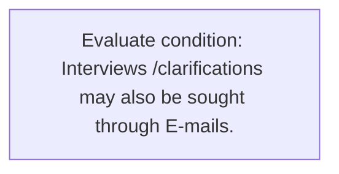
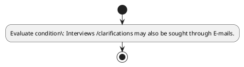

# Chapter 2 / Section 2.87: Interview with authorised Officers

**Chapter Title:** General Provisions Regarding Imports and Exports

**Pages:** 36, 37

**Purpose:** 2.87 Interview with authorised Officers
Officers may grant interview at their discretion to authorised representative of importer
/ exporter.

**Purpose Thanglish:** Indha Interview with authorised Officers section-la, 2.87 Interview with authorised Officers
Officers may grant interview at their discretion to authorised representative of importer
/ exporter.

**Summary:** 2.87 Interview with authorised Officers
Officers may grant interview at their discretion to authorised representative of importer
/ exporter. Interviews /clarifications may also be sought through E-mails. Interactions to
the extent possible should be through online medium/video conference.

**Business Meaning:** Interview with authorised Officers governs how DGFT business controls should be applied, validated, and enforced.

**Business Explanation:** Interview with authorised Officers explains the operating rule set that DEKAI should enforce. Key control points include Interactions to
the extent possible should be through online medium/video conference.

**Business Explanation Thanglish:** Indha Interview with authorised Officers section-la, Interview with authorised Officers explains the operating rule set that DEKAI should enforce. Key control points include Interactions to
the extent possible should be through online medium/video conference.

## Business Logic
- Interactions to
the extent possible should be through online medium/video conference.

## Business Rules
- rule_id=CH2-SEC2_87-R001, rule_description=Interactions to
the extent possible should be through online medium/video conference., trigger=Interview with authorised Officers, condition=Interviews /clarifications may also be sought through E-mails., validation=Not explicitly covered in uploaded documents., action=Manual review required., exception=No explicit exception found in uploaded documents., output=DEKAI should produce a compliance decision for 2.87 - Interview with authorised Officers.

## Conditions
- Interviews /clarifications may also be sought through E-mails.

## Condition Logic
- id=2.2.87.1, if=Interviews /clarifications may also be sought through E-mails., then=Route for review, source=Interviews /clarifications may also be sought through E-mails.

## Validations
- None identified

## Exceptions
- None identified

## Dependencies
- None identified

## Authorities
- None identified

## Required Documents
- None identified

## Timelines
- None identified

## Actions
- None identified

## Workflow
- Evaluate condition: Interviews /clarifications may also be sought through E-mails.

## Workflow ASCII
```text
Interview with authorised Officers
Evaluate condition: Interviews /clarifications may also be sought through E-mails.
```

## Decision Tree
- IF section 2.87 applies THEN proceed with standard DGFT workflow

## Decision Tree ASCII
```text
Interview with authorised Officers Decision
IF section 2.87 applies THEN proceed with standard DGFT workflow
```

## Examples
- User asks to process Interview with authorised Officers; the platform checks conditions, validations, and documents before action.

**Real-world Example:** Example: an importer or exporter invokes Interview with authorised Officers, submits the prescribed DGFT records, and DEKAI uses the extracted rules to follow the interview with authorised officers process.

**Real-world Example Thanglish:** Indha Interview with authorised Officers section-la, Example: an importer or exporter invokes Interview with authorised Officers, submits the prescribed DGFT records, and DEKAI uses the extracted rules to follow the interview with authorised officers process.

## AI Rules
- IF detected context matches section rule THEN enforce: Interactions to
the extent possible should be through online medium/video conference.

## Database Fields
- name=section_code, type=string, required=True, source=parsed_section_heading
- name=section_title, type=string, required=True, source=parsed_section_heading
- name=may_flag, type=boolean, required=False, source=keyword:may
- name=the_flag, type=boolean, required=False, source=keyword:the
- name=with_flag, type=boolean, required=False, source=keyword:with
- name=also_flag, type=boolean, required=False, source=keyword:also
- name=grant_flag, type=boolean, required=False, source=keyword:grant
- name=their_flag, type=boolean, required=False, source=keyword:their
- name=trade_flag, type=boolean, required=False, source=keyword:TRADE
- name=sought_flag, type=boolean, required=False, source=keyword:sought

## API Requirements
- method=GET, path=/api/dgft/sections/2.87, purpose=Retrieve knowledge payload for section 2.87, query_params=['include=workflow,decision_tree,validations'], response_fields=['section', 'title', 'summary', 'conditions', 'validations', 'exceptions', 'workflow', 'decision_tree']
- method=POST, path=/api/dgft/Interview-with-authorised-Officers/validate, purpose=Validate inputs and documents for Interview with authorised Officers, request_fields=['section_code', 'section_title'], response_fields=['status', 'errors', 'warnings', 'next_actions']

## UI Screens
- screen_id=Interview_with_authorised_Officers_overview, name=Interview with authorised Officers Overview, purpose=Show section summary, authority, timeline, and eligibility cues., widgets=['summary_card', 'conditions_table', 'authority_badges', 'timeline_panel']
- screen_id=Interview_with_authorised_Officers_submission, name=Interview with authorised Officers Submission, purpose=Capture applicant data and supporting documents., widgets=['dynamic_form', 'document_uploader', 'validation_panel', 'next_action_footer'], fields=['section_code', 'section_title', 'may_flag', 'the_flag', 'with_flag', 'also_flag', 'grant_flag', 'their_flag']

## Error Messages
- Validation failed because the section requirements were not fully met.

## FAQ
- question_en=What is the purpose of section 2.87?, answer_en=Interview with authorised Officers explains the operating rule set that DEKAI should enforce. Key control points include Interactions to
the extent possible should be through online medium/video conference., question_thanglish=Indha Interview with authorised Officers section-la, What is the purpose of section 2.87?, answer_thanglish=Indha Interview with authorised Officers section-la, Interview with authorised Officers explains the operating rule set that DEKAI should enforce. Key control points include Interactions to
the extent possible should be through online medium/video conference.
- question_en=What documents are required under Interview with authorised Officers?, answer_en=Not explicitly covered in uploaded documents., question_thanglish=Indha Interview with authorised Officers section-la, What documents are required under Interview with authorised Officers?, answer_thanglish=Indha Interview with authorised Officers section-la, Not explicitly covered in uploaded documents.
- question_en=Which authority handles Interview with authorised Officers?, answer_en=Not explicitly covered in uploaded documents., question_thanglish=Indha Interview with authorised Officers section-la, Which authority handles Interview with authorised Officers?, answer_thanglish=Indha Interview with authorised Officers section-la, Not explicitly covered in uploaded documents.

## Questions Users May Ask
- What does Interview with authorised Officers require?
- Which documents are needed for Interview with authorised Officers?
- How does DEKAI validate Interview with authorised Officers requests?

## Expected AI Answers
- Interview with authorised Officers requires the platform to interpret the section text, apply the extracted business rules, and present the correct next action.
- Required documents are inferred from the section text: no explicit documents were detected.
- DEKAI validates Interview with authorised Officers by checking conditions, required documents, authority references, and exception clauses before recommending an outcome.

## AI Q&A Examples
- question_en=User asks: How do I comply with Interview with authorised Officers?, answer_en=AI answers: DEKAI should evaluate section 2.87, apply the extracted rules, and guide the user through Evaluate condition: Interviews /clarifications may also be sought through E-mails.., question_thanglish=Indha Interview with authorised Officers section-la, User asks: How do I comply with Interview with authorised Officers?, answer_thanglish=Indha Interview with authorised Officers section-la, AI answers: DEKAI should evaluate section 2.87, apply the extracted rules, and guide the user through Evaluate condition: Interviews /clarifications may also be sought through E-mails..
- question_en=User asks: Which validations apply to Interview with authorised Officers?, answer_en=AI answers: Applicable validations are not explicitly covered in the uploaded documents., question_thanglish=Indha Interview with authorised Officers section-la, User asks: Which validations apply to Interview with authorised Officers?, answer_thanglish=Indha Interview with authorised Officers section-la, AI answers: Applicable validations are not explicitly covered in the uploaded documents.

## DEKAI AI Implementation Notes
- Capture chapter 2, section 2.87, title, and page references as immutable knowledge metadata.
- Bind validations for Interview with authorised Officers into a rule engine keyed by the rule IDs extracted for this section.

## DEKAI AI Implementation Notes Thanglish
- Indha Interview with authorised Officers section-la, Capture chapter 2, section 2.87, title, and page references as immutable knowledge metadata.
- Indha Interview with authorised Officers section-la, Bind validations for Interview with authorised Officers into a rule engine keyed by the rule IDs extracted for this section.

## AI Metadata
- Keywords: may, the, with, also, grant, their, TRADE, sought, extent, should, online, through, E-mails, Officers, importer, exporter, possible, Interview, authorised, discretion
- Search Keywords: may, the, with, also, grant, their, TRADE, sought, extent, should, online, through, E-mails, Officers, importer, exporter, possible, Interview, authorised, discretion
- Intent: Provide knowledge guidance for Interview with authorised Officers.
- Tags: 2.87, Interview with authorised Officers, business-rule, dgft
- Related Sections: 
- Related Chapters: 
- Related Rules: Interactions to
the extent possible should be through online medium/video conference.

## Mermaid


## PlantUML

