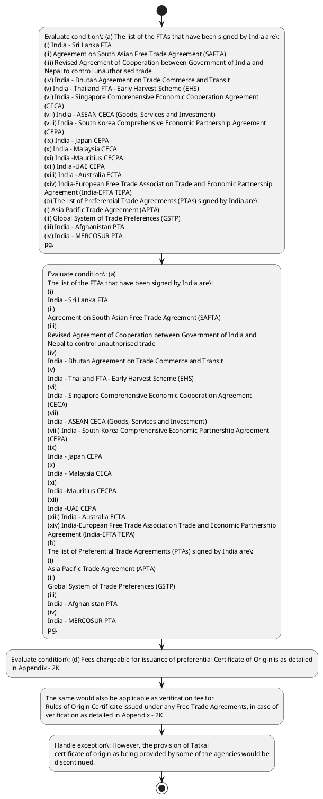

# Chapter 2 / Section 2.88: Free Trade Agreements (FTAs) / Preferential Trade Agreements

**Chapter Title:** General Provisions Regarding Imports and Exports

**Pages:** 37, 38

**Purpose:** 2.88 Free Trade Agreements (FTAs) / Preferential Trade Agreements
(PTAs)
India has always stood for a transparent, equitable, inclusive, predictable, non-
discriminatory and rules based international trading system.

**Purpose Thanglish:** Indha Free Trade Agreements (FTAs) / Preferential Trade Agreements section-la, 2.88 Free Trade Agreements (FTAs) / Preferential Trade Agreements
(PTAs)
India has always stood for a transparent, equitable, inclusive, predictable, non-
discriminatory and rules based international trading system.

**Summary:** 2.88 Free Trade Agreements (FTAs) / Preferential Trade Agreements
(PTAs)
India has always stood for a transparent, equitable, inclusive, predictable, non-
discriminatory and rules based international trading system. In this context, India’s
trade agreements may be seen as a measured and calibrated exposure of the Indian
economy to international competition. As of March, 2023; India has signed 13 FTAs
and 6 limited Preferential Trade Agreements (PTAs).

**Business Meaning:** 2.88 Free Trade Agreements (FTAs) / Preferential Trade Agreements
(PTAs)
India has always stood for a transparent, equitable, inclusive, predictable, non-
discriminatory and rules based international trading system.

**Business Explanation:** 2.88 Free Trade Agreements (FTAs) / Preferential Trade Agreements
(PTAs)
India has always stood for a transparent, equitable, inclusive, predictable, non-
discriminatory and rules based international trading system. In this context, India’s
trade agreements may be seen as a measured and calibrated exposure of the Indian
economy to international competition. As of March, 2023; India has signed 13 FTAs
and 6 limited Preferential Trade Agreements (PTAs).

**Business Explanation Thanglish:** Indha Free Trade Agreements (FTAs) / Preferential Trade Agreements section-la, 2.88 Free Trade Agreements (FTAs) / Preferential Trade Agreements
(PTAs)
India has always stood for a transparent, equitable, inclusive, predictable, non-
discriminatory and rules based international trading system. In this context, India’s
trade agreements may be seen as a measured and calibrated exposure of the Indian
economy to international competition. As of March, 2023; India has signed 13 FTAs
and 6 limited Preferential Trade Agreements (PTAs).

## Business Logic
- None identified

## Business Rules
- rule_id=CH2-SEC2_88-R001, rule_description=IF validations pass THEN recommend action: The same would also be applicable as verification fee for
Rules of Origin Certificate issued under any Free Trade Agreements, in case of
verification as detailed in Appendix – 2K., trigger=Free Trade Agreements (FTAs) / Preferential Trade Agreements, condition=(a) The list of the FTAs that have been signed by India are:
(i) India - Sri Lanka FTA
(ii) Agreement on South Asian Free Trade Agreement (SAFTA)
(iii) Revised Agreement of Cooperation between Government of India and
Nepal to control unauthorised trade
(iv) India - Bhutan Agreement on Trade Commerce and Transit
(v) India - Thailand FTA - Early Harvest Scheme (EHS)
(vi) India - Singapore Comprehensive Economic Cooperation Agreement
(CECA)
(vii) India – ASEAN CECA (Goods, Services and Investment)
(viii) India - South Korea Comprehensive Economic Partnership Agreement
(CEPA)
(ix) India - Japan CEPA
(x) India - Malaysia CECA
(xi) India –Mauritius CECPA
(xii) India –UAE CEPA
(xiii) India - Australia ECTA
(xiv) India-European Free Trade Association Trade and Economic Partnership
Agreement (India-EFTA TEPA)
(b) The list of Preferential Trade Agreements (PTAs) signed by India are:
(i) Asia Pacific Trade Agreement (APTA)
(ii) Global System of Trade Preferences (GSTP)
(iii) India - Afghanistan PTA
(iv) India - MERCOSUR PTA
pg., validation=Not explicitly covered in uploaded documents., action=The same would also be applicable as verification fee for
Rules of Origin Certificate issued under any Free Trade Agreements, in case of
verification as detailed in Appendix – 2K., exception=However, the provision of Tatkal
certificate of origin as being provided by some of the agencies would be
discontinued., output=DEKAI should produce a compliance decision for 2.88 - Free Trade Agreements (FTAs) / Preferential Trade Agreements.

## Conditions
- (a) The list of the FTAs that have been signed by India are:
(i) India - Sri Lanka FTA
(ii) Agreement on South Asian Free Trade Agreement (SAFTA)
(iii) Revised Agreement of Cooperation between Government of India and
Nepal to control unauthorised trade
(iv) India - Bhutan Agreement on Trade Commerce and Transit
(v) India - Thailand FTA - Early Harvest Scheme (EHS)
(vi) India - Singapore Comprehensive Economic Cooperation Agreement
(CECA)
(vii) India – ASEAN CECA (Goods, Services and Investment)
(viii) India - South Korea Comprehensive Economic Partnership Agreement
(CEPA)
(ix) India - Japan CEPA
(x) India - Malaysia CECA
(xi) India –Mauritius CECPA
(xii) India –UAE CEPA
(xiii) India - Australia ECTA
(xiv) India-European Free Trade Association Trade and Economic Partnership
Agreement (India-EFTA TEPA)
(b) The list of Preferential Trade Agreements (PTAs) signed by India are:
(i) Asia Pacific Trade Agreement (APTA)
(ii) Global System of Trade Preferences (GSTP)
(iii) India - Afghanistan PTA
(iv) India - MERCOSUR PTA
pg.
- (a)
The list of the FTAs that have been signed by India are:
(i)
India - Sri Lanka FTA
(ii)
Agreement on South Asian Free Trade Agreement (SAFTA)
(iii)
Revised Agreement of Cooperation between Government of India and
Nepal to control unauthorised trade
(iv)
India - Bhutan Agreement on Trade Commerce and Transit
(v)
India - Thailand FTA - Early Harvest Scheme (EHS)
(vi)
India - Singapore Comprehensive Economic Cooperation Agreement
(CECA)
(vii)
India – ASEAN CECA (Goods, Services and Investment)
(viii) India - South Korea Comprehensive Economic Partnership Agreement
(CEPA)
(ix)
India - Japan CEPA
(x)
India - Malaysia CECA
(xi)
India –Mauritius CECPA
(xii)
India –UAE CEPA
(xiii) India - Australia ECTA
(xiv) India-European Free Trade Association Trade and Economic Partnership
Agreement (India-EFTA TEPA)
(b)
The list of Preferential Trade Agreements (PTAs) signed by India are:
(i)
Asia Pacific Trade Agreement (APTA)
(ii)
Global System of Trade Preferences (GSTP)
(iii)
India - Afghanistan PTA
(iv)
India - MERCOSUR PTA
pg.
- (d) Fees chargeable for issuance of preferential Certificate of Origin is as detailed
in Appendix – 2K.
- The same would also be applicable as verification fee for
Rules of Origin Certificate issued under any Free Trade Agreements, in case of
verification as detailed in Appendix – 2K.
- However, the provision of Tatkal
certificate of origin as being provided by some of the agencies would be
discontinued.
- The Certificate of origin will be delivered within 24
hours/1(one) working day of the application made.

## Condition Logic
- id=2.2.88.1, if=(a) The list of the FTAs that have been signed by India are:
(i) India - Sri Lanka FTA
(ii) Agreement on South Asian Free Trade Agreement (SAFTA)
(iii) Revised Agreement of Cooperation between Government of India and
Nepal to control unauthorised trade
(iv) India - Bhutan Agreement on Trade Commerce and Transit
(v) India - Thailand FTA - Early Harvest Scheme (EHS)
(vi) India - Singapore Comprehensive Economic Cooperation Agreement
(CECA)
(vii) India – ASEAN CECA (Goods, Services and Investment)
(viii) India - South Korea Comprehensive Economic Partnership Agreement
(CEPA)
(ix) India - Japan CEPA
(x) India - Malaysia CECA
(xi) India –Mauritius CECPA
(xii) India –UAE CEPA
(xiii) India - Australia ECTA
(xiv) India-European Free Trade Association Trade and Economic Partnership
Agreement (India-EFTA TEPA)
(b) The list of Preferential Trade Agreements (PTAs) signed by India are:
(i) Asia Pacific Trade Agreement (APTA)
(ii) Global System of Trade Preferences (GSTP)
(iii) India - Afghanistan PTA
(iv) India - MERCOSUR PTA
pg., then=The same would also be applicable as verification fee for
Rules of Origin Certificate issued under any Free Trade Agreements, in case of
verification as detailed in Appendix – 2K., source=(a) The list of the FTAs that have been signed by India are:
(i) India - Sri Lanka FTA
(ii) Agreement on South Asian Free Trade Agreement (SAFTA)
(iii) Revised Agreement of Cooperation between Government of India and
Nepal to control unauthorised trade
(iv) India - Bhutan Agreement on Trade Commerce and Transit
(v) India - Thailand FTA - Early Harvest Scheme (EHS)
(vi) India - Singapore Comprehensive Economic Cooperation Agreement
(CECA)
(vii) India – ASEAN CECA (Goods, Services and Investment)
(viii) India - South Korea Comprehensive Economic Partnership Agreement
(CEPA)
(ix) India - Japan CEPA
(x) India - Malaysia CECA
(xi) India –Mauritius CECPA
(xii) India –UAE CEPA
(xiii) India - Australia ECTA
(xiv) India-European Free Trade Association Trade and Economic Partnership
Agreement (India-EFTA TEPA)
(b) The list of Preferential Trade Agreements (PTAs) signed by India are:
(i) Asia Pacific Trade Agreement (APTA)
(ii) Global System of Trade Preferences (GSTP)
(iii) India - Afghanistan PTA
(iv) India - MERCOSUR PTA
pg.
- id=2.2.88.2, if=(a)
The list of the FTAs that have been signed by India are:
(i)
India - Sri Lanka FTA
(ii)
Agreement on South Asian Free Trade Agreement (SAFTA)
(iii)
Revised Agreement of Cooperation between Government of India and
Nepal to control unauthorised trade
(iv)
India - Bhutan Agreement on Trade Commerce and Transit
(v)
India - Thailand FTA - Early Harvest Scheme (EHS)
(vi)
India - Singapore Comprehensive Economic Cooperation Agreement
(CECA)
(vii)
India – ASEAN CECA (Goods, Services and Investment)
(viii) India - South Korea Comprehensive Economic Partnership Agreement
(CEPA)
(ix)
India - Japan CEPA
(x)
India - Malaysia CECA
(xi)
India –Mauritius CECPA
(xii)
India –UAE CEPA
(xiii) India - Australia ECTA
(xiv) India-European Free Trade Association Trade and Economic Partnership
Agreement (India-EFTA TEPA)
(b)
The list of Preferential Trade Agreements (PTAs) signed by India are:
(i)
Asia Pacific Trade Agreement (APTA)
(ii)
Global System of Trade Preferences (GSTP)
(iii)
India - Afghanistan PTA
(iv)
India - MERCOSUR PTA
pg., then=The same would also be applicable as verification fee for
Rules of Origin Certificate issued under any Free Trade Agreements, in case of
verification as detailed in Appendix – 2K., source=(a)
The list of the FTAs that have been signed by India are:
(i)
India - Sri Lanka FTA
(ii)
Agreement on South Asian Free Trade Agreement (SAFTA)
(iii)
Revised Agreement of Cooperation between Government of India and
Nepal to control unauthorised trade
(iv)
India - Bhutan Agreement on Trade Commerce and Transit
(v)
India - Thailand FTA - Early Harvest Scheme (EHS)
(vi)
India - Singapore Comprehensive Economic Cooperation Agreement
(CECA)
(vii)
India – ASEAN CECA (Goods, Services and Investment)
(viii) India - South Korea Comprehensive Economic Partnership Agreement
(CEPA)
(ix)
India - Japan CEPA
(x)
India - Malaysia CECA
(xi)
India –Mauritius CECPA
(xii)
India –UAE CEPA
(xiii) India - Australia ECTA
(xiv) India-European Free Trade Association Trade and Economic Partnership
Agreement (India-EFTA TEPA)
(b)
The list of Preferential Trade Agreements (PTAs) signed by India are:
(i)
Asia Pacific Trade Agreement (APTA)
(ii)
Global System of Trade Preferences (GSTP)
(iii)
India - Afghanistan PTA
(iv)
India - MERCOSUR PTA
pg.
- id=2.2.88.3, if=(d) Fees chargeable for issuance of preferential Certificate of Origin is as detailed
in Appendix – 2K., then=The same would also be applicable as verification fee for
Rules of Origin Certificate issued under any Free Trade Agreements, in case of
verification as detailed in Appendix – 2K., source=(d) Fees chargeable for issuance of preferential Certificate of Origin is as detailed
in Appendix – 2K.
- id=2.2.88.4, if=The same would also be applicable as verification fee for
Rules of Origin Certificate issued under any Free Trade Agreements, in case of
verification as detailed in Appendix – 2K., then=The same would also be applicable as verification fee for
Rules of Origin Certificate issued under any Free Trade Agreements, in case of
verification as detailed in Appendix – 2K., source=The same would also be applicable as verification fee for
Rules of Origin Certificate issued under any Free Trade Agreements, in case of
verification as detailed in Appendix – 2K.
- id=2.2.88.5, if=However, the provision of Tatkal
certificate of origin as being provided by some of the agencies would be
discontinued., then=The same would also be applicable as verification fee for
Rules of Origin Certificate issued under any Free Trade Agreements, in case of
verification as detailed in Appendix – 2K., source=However, the provision of Tatkal
certificate of origin as being provided by some of the agencies would be
discontinued.
- id=2.2.88.6, if=The Certificate of origin will be delivered within 24
hours/1(one) working day of the application made., then=The same would also be applicable as verification fee for
Rules of Origin Certificate issued under any Free Trade Agreements, in case of
verification as detailed in Appendix – 2K., source=The Certificate of origin will be delivered within 24
hours/1(one) working day of the application made.

## Validations
- None identified

## Exceptions
- However, the provision of Tatkal
certificate of origin as being provided by some of the agencies would be
discontinued.

## Dependencies
- None identified

## Authorities
- Revised Agreement of Cooperation between Government

## Required Documents
- Fees chargeable for issuance of preferential Certificate
- Rules of Origin Certificate
- However, the provision of Tatkal
certificate of origin as being provided by some of the agencies would be
discontinued.
- The Certificate

## Timelines
- The Certificate of origin will be delivered within 24
hours/1(one) working day of the application made.

## Actions
- The same would also be applicable as verification fee for
Rules of Origin Certificate issued under any Free Trade Agreements, in case of
verification as detailed in Appendix – 2K.

## Workflow
- Evaluate condition: (a) The list of the FTAs that have been signed by India are:
(i) India - Sri Lanka FTA
(ii) Agreement on South Asian Free Trade Agreement (SAFTA)
(iii) Revised Agreement of Cooperation between Government of India and
Nepal to control unauthorised trade
(iv) India - Bhutan Agreement on Trade Commerce and Transit
(v) India - Thailand FTA - Early Harvest Scheme (EHS)
(vi) India - Singapore Comprehensive Economic Cooperation Agreement
(CECA)
(vii) India – ASEAN CECA (Goods, Services and Investment)
(viii) India - South Korea Comprehensive Economic Partnership Agreement
(CEPA)
(ix) India - Japan CEPA
(x) India - Malaysia CECA
(xi) India –Mauritius CECPA
(xii) India –UAE CEPA
(xiii) India - Australia ECTA
(xiv) India-European Free Trade Association Trade and Economic Partnership
Agreement (India-EFTA TEPA)
(b) The list of Preferential Trade Agreements (PTAs) signed by India are:
(i) Asia Pacific Trade Agreement (APTA)
(ii) Global System of Trade Preferences (GSTP)
(iii) India - Afghanistan PTA
(iv) India - MERCOSUR PTA
pg.
- Evaluate condition: (a)
The list of the FTAs that have been signed by India are:
(i)
India - Sri Lanka FTA
(ii)
Agreement on South Asian Free Trade Agreement (SAFTA)
(iii)
Revised Agreement of Cooperation between Government of India and
Nepal to control unauthorised trade
(iv)
India - Bhutan Agreement on Trade Commerce and Transit
(v)
India - Thailand FTA - Early Harvest Scheme (EHS)
(vi)
India - Singapore Comprehensive Economic Cooperation Agreement
(CECA)
(vii)
India – ASEAN CECA (Goods, Services and Investment)
(viii) India - South Korea Comprehensive Economic Partnership Agreement
(CEPA)
(ix)
India - Japan CEPA
(x)
India - Malaysia CECA
(xi)
India –Mauritius CECPA
(xii)
India –UAE CEPA
(xiii) India - Australia ECTA
(xiv) India-European Free Trade Association Trade and Economic Partnership
Agreement (India-EFTA TEPA)
(b)
The list of Preferential Trade Agreements (PTAs) signed by India are:
(i)
Asia Pacific Trade Agreement (APTA)
(ii)
Global System of Trade Preferences (GSTP)
(iii)
India - Afghanistan PTA
(iv)
India - MERCOSUR PTA
pg.
- Evaluate condition: (d) Fees chargeable for issuance of preferential Certificate of Origin is as detailed
in Appendix – 2K.
- The same would also be applicable as verification fee for
Rules of Origin Certificate issued under any Free Trade Agreements, in case of
verification as detailed in Appendix – 2K.
- Handle exception: However, the provision of Tatkal
certificate of origin as being provided by some of the agencies would be
discontinued.

## Workflow ASCII
```text
Free Trade Agreements (FTAs) / Preferential Trade Agreements
Evaluate condition: (a) The list of the FTAs that have been signed by India are:
(i) India - Sri Lanka FTA
(ii) Agreement on South Asian Free Trade Agreement (SAFTA)
(iii) Revised Agreement of Cooperation between Government of India and
Nepal to control unauthorised trade
(iv) India - Bhutan Agreement on Trade Commerce and Transit
(v) India - Thailand FTA - Early Harvest Scheme (EHS)
(vi) India - Singapore Comprehensive Economic Cooperation Agreement
(CECA)
(vii) India – ASEAN CECA (Goods, Services and Investment)
(viii) India - South Korea Comprehensive Economic Partnership Agreement
(CEPA)
(ix) India - Japan CEPA
(x) India - Malaysia CECA
(xi) India –Mauritius CECPA
(xii) India –UAE CEPA
(xiii) India - Australia ECTA
(xiv) India-European Free Trade Association Trade and Economic Partnership
Agreement (India-EFTA TEPA)
(b) The list of Preferential Trade Agreements (PTAs) signed by India are:
(i) Asia Pacific Trade Agreement (APTA)
(ii) Global System of Trade Preferences (GSTP)
(iii) India - Afghanistan PTA
(iv) India - MERCOSUR PTA
pg.
   |
   v
Evaluate condition: (a)
The list of the FTAs that have been signed by India are:
(i)
India - Sri Lanka FTA
(ii)
Agreement on South Asian Free Trade Agreement (SAFTA)
(iii)
Revised Agreement of Cooperation between Government of India and
Nepal to control unauthorised trade
(iv)
India - Bhutan Agreement on Trade Commerce and Transit
(v)
India - Thailand FTA - Early Harvest Scheme (EHS)
(vi)
India - Singapore Comprehensive Economic Cooperation Agreement
(CECA)
(vii)
India – ASEAN CECA (Goods, Services and Investment)
(viii) India - South Korea Comprehensive Economic Partnership Agreement
(CEPA)
(ix)
India - Japan CEPA
(x)
India - Malaysia CECA
(xi)
India –Mauritius CECPA
(xii)
India –UAE CEPA
(xiii) India - Australia ECTA
(xiv) India-European Free Trade Association Trade and Economic Partnership
Agreement (India-EFTA TEPA)
(b)
The list of Preferential Trade Agreements (PTAs) signed by India are:
(i)
Asia Pacific Trade Agreement (APTA)
(ii)
Global System of Trade Preferences (GSTP)
(iii)
India - Afghanistan PTA
(iv)
India - MERCOSUR PTA
pg.
   |
   v
Evaluate condition: (d) Fees chargeable for issuance of preferential Certificate of Origin is as detailed
in Appendix – 2K.
   |
   v
The same would also be applicable as verification fee for
Rules of Origin Certificate issued under any Free Trade Agreements, in case of
verification as detailed in Appendix – 2K.
   |
   v
Handle exception: However, the provision of Tatkal
certificate of origin as being provided by some of the agencies would be
discontinued.
```

## Decision Tree
- IF (a) The list of the FTAs that have been signed by India are:
(i) India - Sri Lanka FTA
(ii) Agreement on South Asian Free Trade Agreement (SAFTA)
(iii) Revised Agreement of Cooperation between Government of India and
Nepal to control unauthorised trade
(iv) India - Bhutan Agreement on Trade Commerce and Transit
(v) India - Thailand FTA - Early Harvest Scheme (EHS)
(vi) India - Singapore Comprehensive Economic Cooperation Agreement
(CECA)
(vii) India – ASEAN CECA (Goods, Services and Investment)
(viii) India - South Korea Comprehensive Economic Partnership Agreement
(CEPA)
(ix) India - Japan CEPA
(x) India - Malaysia CECA
(xi) India –Mauritius CECPA
(xii) India –UAE CEPA
(xiii) India - Australia ECTA
(xiv) India-European Free Trade Association Trade and Economic Partnership
Agreement (India-EFTA TEPA)
(b) The list of Preferential Trade Agreements (PTAs) signed by India are:
(i) Asia Pacific Trade Agreement (APTA)
(ii) Global System of Trade Preferences (GSTP)
(iii) India - Afghanistan PTA
(iv) India - MERCOSUR PTA
pg. THEN The same would also be applicable as verification fee for
Rules of Origin Certificate issued under any Free Trade Agreements, in case of
verification as detailed in Appendix – 2K.
- IF (a)
The list of the FTAs that have been signed by India are:
(i)
India - Sri Lanka FTA
(ii)
Agreement on South Asian Free Trade Agreement (SAFTA)
(iii)
Revised Agreement of Cooperation between Government of India and
Nepal to control unauthorised trade
(iv)
India - Bhutan Agreement on Trade Commerce and Transit
(v)
India - Thailand FTA - Early Harvest Scheme (EHS)
(vi)
India - Singapore Comprehensive Economic Cooperation Agreement
(CECA)
(vii)
India – ASEAN CECA (Goods, Services and Investment)
(viii) India - South Korea Comprehensive Economic Partnership Agreement
(CEPA)
(ix)
India - Japan CEPA
(x)
India - Malaysia CECA
(xi)
India –Mauritius CECPA
(xii)
India –UAE CEPA
(xiii) India - Australia ECTA
(xiv) India-European Free Trade Association Trade and Economic Partnership
Agreement (India-EFTA TEPA)
(b)
The list of Preferential Trade Agreements (PTAs) signed by India are:
(i)
Asia Pacific Trade Agreement (APTA)
(ii)
Global System of Trade Preferences (GSTP)
(iii)
India - Afghanistan PTA
(iv)
India - MERCOSUR PTA
pg. THEN The same would also be applicable as verification fee for
Rules of Origin Certificate issued under any Free Trade Agreements, in case of
verification as detailed in Appendix – 2K.
- IF (d) Fees chargeable for issuance of preferential Certificate of Origin is as detailed
in Appendix – 2K. THEN The same would also be applicable as verification fee for
Rules of Origin Certificate issued under any Free Trade Agreements, in case of
verification as detailed in Appendix – 2K.
- IF The same would also be applicable as verification fee for
Rules of Origin Certificate issued under any Free Trade Agreements, in case of
verification as detailed in Appendix – 2K. THEN The same would also be applicable as verification fee for
Rules of Origin Certificate issued under any Free Trade Agreements, in case of
verification as detailed in Appendix – 2K.
- IF However, the provision of Tatkal
certificate of origin as being provided by some of the agencies would be
discontinued. THEN The same would also be applicable as verification fee for
Rules of Origin Certificate issued under any Free Trade Agreements, in case of
verification as detailed in Appendix – 2K.
- IF exception applies (However, the provision of Tatkal
certificate of origin as being provided by some of the agencies would be
discontinued.) THEN route to manual review

## Decision Tree ASCII
```text
Free Trade Agreements (FTAs) / Preferential Trade Agreements Decision
IF (a) The list of the FTAs that have been signed by India are:
(i) India - Sri Lanka FTA
(ii) Agreement on South Asian Free Trade Agreement (SAFTA)
(iii) Revised Agreement of Cooperation between Government of India and
Nepal to control unauthorised trade
(iv) India - Bhutan Agreement on Trade Commerce and Transit
(v) India - Thailand FTA - Early Harvest Scheme (EHS)
(vi) India - Singapore Comprehensive Economic Cooperation Agreement
(CECA)
(vii) India – ASEAN CECA (Goods, Services and Investment)
(viii) India - South Korea Comprehensive Economic Partnership Agreement
(CEPA)
(ix) India - Japan CEPA
(x) India - Malaysia CECA
(xi) India –Mauritius CECPA
(xii) India –UAE CEPA
(xiii) India - Australia ECTA
(xiv) India-European Free Trade Association Trade and Economic Partnership
Agreement (India-EFTA TEPA)
(b) The list of Preferential Trade Agreements (PTAs) signed by India are:
(i) Asia Pacific Trade Agreement (APTA)
(ii) Global System of Trade Preferences (GSTP)
(iii) India - Afghanistan PTA
(iv) India - MERCOSUR PTA
pg. THEN The same would also be applicable as verification fee for
Rules of Origin Certificate issued under any Free Trade Agreements, in case of
verification as detailed in Appendix – 2K.
   |
   v
IF (a)
The list of the FTAs that have been signed by India are:
(i)
India - Sri Lanka FTA
(ii)
Agreement on South Asian Free Trade Agreement (SAFTA)
(iii)
Revised Agreement of Cooperation between Government of India and
Nepal to control unauthorised trade
(iv)
India - Bhutan Agreement on Trade Commerce and Transit
(v)
India - Thailand FTA - Early Harvest Scheme (EHS)
(vi)
India - Singapore Comprehensive Economic Cooperation Agreement
(CECA)
(vii)
India – ASEAN CECA (Goods, Services and Investment)
(viii) India - South Korea Comprehensive Economic Partnership Agreement
(CEPA)
(ix)
India - Japan CEPA
(x)
India - Malaysia CECA
(xi)
India –Mauritius CECPA
(xii)
India –UAE CEPA
(xiii) India - Australia ECTA
(xiv) India-European Free Trade Association Trade and Economic Partnership
Agreement (India-EFTA TEPA)
(b)
The list of Preferential Trade Agreements (PTAs) signed by India are:
(i)
Asia Pacific Trade Agreement (APTA)
(ii)
Global System of Trade Preferences (GSTP)
(iii)
India - Afghanistan PTA
(iv)
India - MERCOSUR PTA
pg. THEN The same would also be applicable as verification fee for
Rules of Origin Certificate issued under any Free Trade Agreements, in case of
verification as detailed in Appendix – 2K.
   |
   v
IF (d) Fees chargeable for issuance of preferential Certificate of Origin is as detailed
in Appendix – 2K. THEN The same would also be applicable as verification fee for
Rules of Origin Certificate issued under any Free Trade Agreements, in case of
verification as detailed in Appendix – 2K.
   |
   v
IF The same would also be applicable as verification fee for
Rules of Origin Certificate issued under any Free Trade Agreements, in case of
verification as detailed in Appendix – 2K. THEN The same would also be applicable as verification fee for
Rules of Origin Certificate issued under any Free Trade Agreements, in case of
verification as detailed in Appendix – 2K.
   |
   v
IF However, the provision of Tatkal
certificate of origin as being provided by some of the agencies would be
discontinued. THEN The same would also be applicable as verification fee for
Rules of Origin Certificate issued under any Free Trade Agreements, in case of
verification as detailed in Appendix – 2K.
   |
   v
IF exception applies (However, the provision of Tatkal
certificate of origin as being provided by some of the agencies would be
discontinued.) THEN route to manual review
```

## Examples
- User asks to process Free Trade Agreements (FTAs) / Preferential Trade Agreements; the platform checks conditions, validations, and documents before action.

**Real-world Example:** Example: an importer or exporter invokes Free Trade Agreements (FTAs) / Preferential Trade Agreements, submits Fees chargeable for issuance of preferential Certificate, Rules of Origin Certificate, However, the provision of Tatkal
certificate of origin as being provided by some of the agencies would be
discontinued., and DEKAI uses the extracted rules to the same would also be applicable as verification fee for
rules of origin certificate issued under any free trade agreements, in case of
verification as detailed in appendix – 2k..

**Real-world Example Thanglish:** Indha Free Trade Agreements (FTAs) / Preferential Trade Agreements section-la, Example: an importer or exporter invokes Free Trade Agreements (FTAs) / Preferential Trade Agreements, submits Fees chargeable for issuance of preferential Certificate, Rules of Origin Certificate, However, the provision of Tatkal
certificate of origin as being provided by some of the agencies would be
discontinued., and DEKAI uses the extracted rules to the same would also be applicable as verification fee for
rules of origin certificate issued under any free trade agreements, in case of
verification as detailed in appendix – 2k..

## AI Rules
- IF validations pass THEN recommend action: The same would also be applicable as verification fee for
Rules of Origin Certificate issued under any Free Trade Agreements, in case of
verification as detailed in Appendix – 2K.

## Database Fields
- name=section_code, type=string, required=True, source=parsed_section_heading
- name=section_title, type=string, required=True, source=parsed_section_heading
- name=has_flag, type=boolean, required=False, source=keyword:has
- name=for_flag, type=boolean, required=False, source=keyword:for
- name=non_flag, type=boolean, required=False, source=keyword:non
- name=and_flag, type=boolean, required=False, source=keyword:and
- name=may_flag, type=boolean, required=False, source=keyword:may
- name=the_flag, type=boolean, required=False, source=keyword:the
- name=fta_flag, type=boolean, required=False, source=keyword:FTA
- name=its_flag, type=boolean, required=False, source=keyword:its
- name=document_1_submitted, type=boolean, required=True, source=Fees chargeable for issuance of preferential Certificate
- name=document_2_submitted, type=boolean, required=True, source=Rules of Origin Certificate
- name=document_3_submitted, type=boolean, required=True, source=However, the provision of Tatkal
certificate of origin as being provided by some of the agencies would be
discontinued.
- name=document_4_submitted, type=boolean, required=True, source=The Certificate

## API Requirements
- method=GET, path=/api/dgft/sections/2.88, purpose=Retrieve knowledge payload for section 2.88, query_params=['include=workflow,decision_tree,validations'], response_fields=['section', 'title', 'summary', 'conditions', 'validations', 'exceptions', 'workflow', 'decision_tree']
- method=POST, path=/api/dgft/Free-Trade-Agreements-FTAs-Preferential-Trade-Agreements/validate, purpose=Validate inputs and documents for Free Trade Agreements (FTAs) / Preferential Trade Agreements, request_fields=['section_code', 'section_title', 'document_1_submitted', 'document_2_submitted', 'document_3_submitted', 'document_4_submitted'], response_fields=['status', 'errors', 'warnings', 'next_actions']
- method=POST, path=/api/dgft/Free-Trade-Agreements-FTAs-Preferential-Trade-Agreements/execute, purpose=Trigger business action for The same would also be applicable as verification fee for
Rules of Origin Certificate issued under any Free Trade Agreements, in case of
verification as detailed in Appendix – 2K., request_fields=['section_code', 'section_title', 'document_1_submitted', 'document_2_submitted', 'document_3_submitted', 'document_4_submitted'], response_fields=['reference_id', 'status', 'authority', 'timeline']

## UI Screens
- screen_id=Free_Trade_Agreements_FTAs_Preferential_Trade_Agreements_overview, name=Free Trade Agreements (FTAs) / Preferential Trade Agreements Overview, purpose=Show section summary, authority, timeline, and eligibility cues., widgets=['summary_card', 'conditions_table', 'authority_badges', 'timeline_panel']
- screen_id=Free_Trade_Agreements_FTAs_Preferential_Trade_Agreements_submission, name=Free Trade Agreements (FTAs) / Preferential Trade Agreements Submission, purpose=Capture applicant data and supporting documents., widgets=['dynamic_form', 'document_uploader', 'validation_panel', 'next_action_footer'], fields=['section_code', 'section_title', 'has_flag', 'for_flag', 'non_flag', 'and_flag', 'may_flag', 'the_flag']
- screen_id=Free_Trade_Agreements_FTAs_Preferential_Trade_Agreements_exceptions, name=Free Trade Agreements (FTAs) / Preferential Trade Agreements Exception Review, purpose=Explain exception handling and manual review triggers., widgets=['exception_banner', 'decision_tree', 'case_notes']

## Error Messages
- Validation failed because the section requirements were not fully met.

## FAQ
- question_en=What is the purpose of section 2.88?, answer_en=2.88 Free Trade Agreements (FTAs) / Preferential Trade Agreements
(PTAs)
India has always stood for a transparent, equitable, inclusive, predictable, non-
discriminatory and rules based international trading system. In this context, India’s
trade agreements may be seen as a measured and calibrated exposure of the Indian
economy to international competition. As of March, 2023; India has signed 13 FTAs
and 6 limited Preferential Trade Agreements (PTAs)., question_thanglish=Indha Free Trade Agreements (FTAs) / Preferential Trade Agreements section-la, What is the purpose of section 2.88?, answer_thanglish=Indha Free Trade Agreements (FTAs) / Preferential Trade Agreements section-la, 2.88 Free Trade Agreements (FTAs) / Preferential Trade Agreements
(PTAs)
India has always stood for a transparent, equitable, inclusive, predictable, non-
discriminatory and rules based international trading system. In this context, India’s
trade agreements may be seen as a measured and calibrated exposure of the Indian
economy to international competition. As of March, 2023; India has signed 13 FTAs
and 6 limited Preferential Trade Agreements (PTAs).
- question_en=What documents are required under Free Trade Agreements (FTAs) / Preferential Trade Agreements?, answer_en=Fees chargeable for issuance of preferential Certificate, Rules of Origin Certificate, However, the provision of Tatkal
certificate of origin as being provided by some of the agencies would be
discontinued., The Certificate, question_thanglish=Indha Free Trade Agreements (FTAs) / Preferential Trade Agreements section-la, What documents are required under Free Trade Agreements (FTAs) / Preferential Trade Agreements?, answer_thanglish=Indha Free Trade Agreements (FTAs) / Preferential Trade Agreements section-la, Fees chargeable for issuance of preferential Certificate, Rules of Origin Certificate, However, the provision of Tatkal
certificate of origin as being provided by some of the agencies would be
discontinued., The Certificate
- question_en=Which authority handles Free Trade Agreements (FTAs) / Preferential Trade Agreements?, answer_en=Revised Agreement of Cooperation between Government, question_thanglish=Indha Free Trade Agreements (FTAs) / Preferential Trade Agreements section-la, Which authority handles Free Trade Agreements (FTAs) / Preferential Trade Agreements?, answer_thanglish=Indha Free Trade Agreements (FTAs) / Preferential Trade Agreements section-la, Revised Agreement of Cooperation between Government

## Questions Users May Ask
- What does Free Trade Agreements (FTAs) / Preferential Trade Agreements require?
- Which documents are needed for Free Trade Agreements (FTAs) / Preferential Trade Agreements?
- How does DEKAI validate Free Trade Agreements (FTAs) / Preferential Trade Agreements requests?
- What action should be taken for Free Trade Agreements (FTAs) / Preferential Trade Agreements?

## Expected AI Answers
- Free Trade Agreements (FTAs) / Preferential Trade Agreements requires the platform to interpret the section text, apply the extracted business rules, and present the correct next action.
- Required documents are inferred from the section text: Fees chargeable for issuance of preferential Certificate, Rules of Origin Certificate, However, the provision of Tatkal
certificate of origin as being provided by some of the agencies would be
discontinued., The Certificate
- DEKAI validates Free Trade Agreements (FTAs) / Preferential Trade Agreements by checking conditions, required documents, authority references, and exception clauses before recommending an outcome.
- The primary extracted action is: The same would also be applicable as verification fee for
Rules of Origin Certificate issued under any Free Trade Agreements, in case of
verification as detailed in Appendix – 2K.

## AI Q&A Examples
- question_en=User asks: How do I comply with Free Trade Agreements (FTAs) / Preferential Trade Agreements?, answer_en=AI answers: DEKAI should evaluate section 2.88, apply the extracted rules, and guide the user through Evaluate condition: (a) The list of the FTAs that have been signed by India are:
(i) India - Sri Lanka FTA
(ii) Agreement on South Asian Free Trade Agreement (SAFTA)
(iii) Revised Agreement of Cooperation between Government of India and
Nepal to control unauthorised trade
(iv) India - Bhutan Agreement on Trade Commerce and Transit
(v) India - Thailand FTA - Early Harvest Scheme (EHS)
(vi) India - Singapore Comprehensive Economic Cooperation Agreement
(CECA)
(vii) India – ASEAN CECA (Goods, Services and Investment)
(viii) India - South Korea Comprehensive Economic Partnership Agreement
(CEPA)
(ix) India - Japan CEPA
(x) India - Malaysia CECA
(xi) India –Mauritius CECPA
(xii) India –UAE CEPA
(xiii) India - Australia ECTA
(xiv) India-European Free Trade Association Trade and Economic Partnership
Agreement (India-EFTA TEPA)
(b) The list of Preferential Trade Agreements (PTAs) signed by India are:
(i) Asia Pacific Trade Agreement (APTA)
(ii) Global System of Trade Preferences (GSTP)
(iii) India - Afghanistan PTA
(iv) India - MERCOSUR PTA
pg.., question_thanglish=Indha Free Trade Agreements (FTAs) / Preferential Trade Agreements section-la, User asks: How do I comply with Free Trade Agreements (FTAs) / Preferential Trade Agreements?, answer_thanglish=Indha Free Trade Agreements (FTAs) / Preferential Trade Agreements section-la, AI answers: DEKAI should evaluate section 2.88, apply the extracted rules, and guide the user through Evaluate condition: (a) The list of the FTAs that have been signed by India are:
(i) India - Sri Lanka FTA
(ii) Agreement on South Asian Free Trade Agreement (SAFTA)
(iii) Revised Agreement of Cooperation between Government of India and
Nepal to control unauthorised trade
(iv) India - Bhutan Agreement on Trade Commerce and Transit
(v) India - Thailand FTA - Early Harvest Scheme (EHS)
(vi) India - Singapore Comprehensive Economic Cooperation Agreement
(CECA)
(vii) India – ASEAN CECA (Goods, Services and Investment)
(viii) India - South Korea Comprehensive Economic Partnership Agreement
(CEPA)
(ix) India - Japan CEPA
(x) India - Malaysia CECA
(xi) India –Mauritius CECPA
(xii) India –UAE CEPA
(xiii) India - Australia ECTA
(xiv) India-European Free Trade Association Trade and Economic Partnership
Agreement (India-EFTA TEPA)
(b) The list of Preferential Trade Agreements (PTAs) signed by India are:
(i) Asia Pacific Trade Agreement (APTA)
(ii) Global System of Trade Preferences (GSTP)
(iii) India - Afghanistan PTA
(iv) India - MERCOSUR PTA
pg..
- question_en=User asks: Which validations apply to Free Trade Agreements (FTAs) / Preferential Trade Agreements?, answer_en=AI answers: Applicable validations are not explicitly covered in the uploaded documents., question_thanglish=Indha Free Trade Agreements (FTAs) / Preferential Trade Agreements section-la, User asks: Which validations apply to Free Trade Agreements (FTAs) / Preferential Trade Agreements?, answer_thanglish=Indha Free Trade Agreements (FTAs) / Preferential Trade Agreements section-la, AI answers: Applicable validations are not explicitly covered in the uploaded documents.

## DEKAI AI Implementation Notes
- Capture chapter 2, section 2.88, title, and page references as immutable knowledge metadata.
- Bind validations for Free Trade Agreements (FTAs) / Preferential Trade Agreements into a rule engine keyed by the rule IDs extracted for this section.
- Expose document upload controls for: Fees chargeable for issuance of preferential Certificate, Rules of Origin Certificate, However, the provision of Tatkal
certificate of origin as being provided by some of the agencies would be
discontinued., The Certificate.
- Route escalations or approvals to: Revised Agreement of Cooperation between Government.
- Trigger manual review when exception clauses are detected.

## DEKAI AI Implementation Notes Thanglish
- Indha Free Trade Agreements (FTAs) / Preferential Trade Agreements section-la, Capture chapter 2, section 2.88, title, and page references as immutable knowledge metadata.
- Indha Free Trade Agreements (FTAs) / Preferential Trade Agreements section-la, Bind validations for Free Trade Agreements (FTAs) / Preferential Trade Agreements into a rule engine keyed by the rule IDs extracted for this section.
- Indha Free Trade Agreements (FTAs) / Preferential Trade Agreements section-la, Expose document upload controls for: Fees chargeable for issuance of preferential Certificate, Rules of Origin Certificate, However, the provision of Tatkal
certificate of origin as being provided by some of the agencies would be
discontinued., The Certificate.
- Indha Free Trade Agreements (FTAs) / Preferential Trade Agreements section-la, Route escalations or approvals to: Revised Agreement of Cooperation between Government.
- Indha Free Trade Agreements (FTAs) / Preferential Trade Agreements section-la, Trigger manual review when exception clauses are detected.

## AI Metadata
- Keywords: has, for, non, and, may, the, FTA, its, are, Sri, iii, EHS, vii, xii, UAE, xiv, PTA, fee, any, one
- Search Keywords: has, for, non, and, may, the, FTA, its, are, Sri, iii, EHS, vii, xii, UAE, xiv, PTA, fee, any, one
- Intent: Support Free Trade Agreements (FTAs) / Preferential Trade Agreements processing and compliance validation.
- Tags: 2.88, Free Trade Agreements (FTAs) / Preferential Trade Agreements, document-driven, dgft
- Related Sections: 
- Related Chapters: 
- Related Rules: 

## Mermaid

```mermaid
flowchart TD
    S1["Evaluate condition: (a) The list of the FTAs that have been signed by India are:
(i) India - Sri Lanka FTA
(ii) Agreement on South Asian Free Trade Agreement (SAFTA)
(iii) Revised Agreement of Cooperation between Government of India and
Nepal to control unauthorised trade
(iv) India - Bhutan Agreement on Trade Commerce and Transit
(v) India - Thailand FTA - Early Harvest Scheme (EHS)
(vi) India - Singapore Comprehensive Economic Cooperation Agreement
(CECA)
(vii) India – ASEAN CECA (Goods, Services and Investment)
(viii) India - South Korea Comprehensive Economic Partnership Agreement
(CEPA)
(ix) India - Japan CEPA
(x) India - Malaysia CECA
(xi) India –Mauritius CECPA
(xii) India –UAE CEPA
(xiii) India - Australia ECTA
(xiv) India-European Free Trade Association Trade and Economic Partnership
Agreement (India-EFTA TEPA)
(b) The list of Preferential Trade Agreements (PTAs) signed by India are:
(i) Asia Pacific Trade Agreement (APTA)
(ii) Global System of Trade Preferences (GSTP)
(iii) India - Afghanistan PTA
(iv) India - MERCOSUR PTA
pg."]
    S2["Evaluate condition: (a)
The list of the FTAs that have been signed by India are:
(i)
India - Sri Lanka FTA
(ii)
Agreement on South Asian Free Trade Agreement (SAFTA)
(iii)
Revised Agreement of Cooperation between Government of India and
Nepal to control unauthorised trade
(iv)
India - Bhutan Agreement on Trade Commerce and Transit
(v)
India - Thailand FTA - Early Harvest Scheme (EHS)
(vi)
India - Singapore Comprehensive Economic Cooperation Agreement
(CECA)
(vii)
India – ASEAN CECA (Goods, Services and Investment)
(viii) India - South Korea Comprehensive Economic Partnership Agreement
(CEPA)
(ix)
India - Japan CEPA
(x)
India - Malaysia CECA
(xi)
India –Mauritius CECPA
(xii)
India –UAE CEPA
(xiii) India - Australia ECTA
(xiv) India-European Free Trade Association Trade and Economic Partnership
Agreement (India-EFTA TEPA)
(b)
The list of Preferential Trade Agreements (PTAs) signed by India are:
(i)
Asia Pacific Trade Agreement (APTA)
(ii)
Global System of Trade Preferences (GSTP)
(iii)
India - Afghanistan PTA
(iv)
India - MERCOSUR PTA
pg."]
    S1 --> S2
    S3["Evaluate condition: (d) Fees chargeable for issuance of preferential Certificate of Origin is as detailed
in Appendix – 2K."]
    S2 --> S3
    S4["The same would also be applicable as verification fee for
Rules of Origin Certificate issued under any Free Trade Agreements, in case of
verification as detailed in Appendix – 2K."]
    S3 --> S4
    S5["Handle exception: However, the provision of Tatkal
certificate of origin as being provided by some of the agencies would be
discontinued."]
    S4 --> S5
```


## PlantUML

