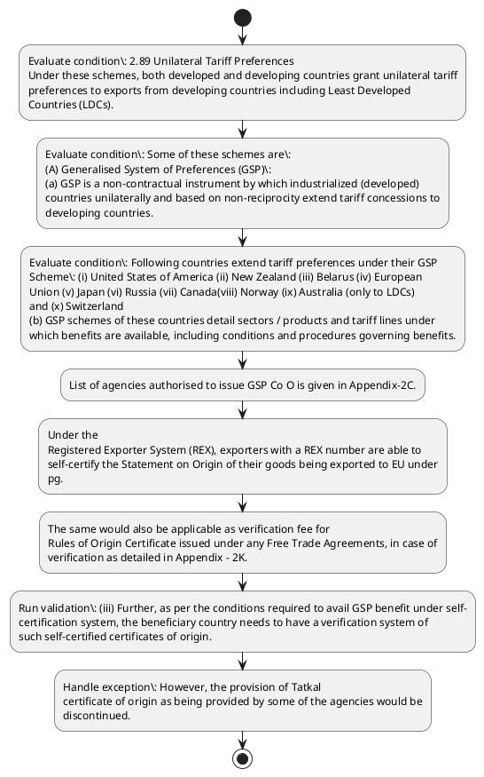

# Chapter 2 / Section 2.89: Unilateral Tariff Preferences

**Chapter Title:** General Provisions Regarding Imports and Exports

**Pages:** 38, 39

**Purpose:** 2.89 Unilateral Tariff Preferences
Under these schemes, both developed and developing countries grant unilateral tariff
preferences to exports from developing countries including Least Developed
Countries (LDCs).

**Purpose Thanglish:** Indha Unilateral Tariff Preferences section-la, 2.89 Unilateral Tariff Preferences
Under these schemes, both developed and developing countries grant unilateral tariff
preferences to exports from developing countries including Least Developed
Countries (LDCs).

**Summary:** 2.89 Unilateral Tariff Preferences
Under these schemes, both developed and developing countries grant unilateral tariff
preferences to exports from developing countries including Least Developed
Countries (LDCs). Some of these schemes are:
(A) Generalised System of Preferences (GSP):
(a) GSP is a non-contractual instrument by which industrialized (developed)
countries unilaterally and based on non-reciprocity extend tariff concessions to
developing countries. Following countries extend tariff preferences under their GSP
Scheme: (i) United States of America (ii) New Zealand (iii) Belarus (iv) European
Union (v) Japan (vi) Russia (vii) Canada(viii) Norway (ix) Australia (only to LDCs)
and (x) Switzerland
(b) GSP schemes of these countries detail sectors / products and tariff lines under
which benefits are available, including conditions and procedures governing benefits.

**Business Meaning:** Unilateral Tariff Preferences governs how DGFT business controls should be applied, validated, and enforced.

**Business Explanation:** Unilateral Tariff Preferences explains the operating rule set that DEKAI should enforce. Key control points include (iii) Further, as per the conditions required to avail GSP benefit under self-
certification system, the beneficiary country needs to have a verification system of
such self-certified certificates of origin. The section also drives actions such as List of agencies authorised to issue GSP Co O is given in Appendix-2C..

**Business Explanation Thanglish:** Indha Unilateral Tariff Preferences section-la, Unilateral Tariff Preferences explains the operating rule set that DEKAI should enforce. Key control points include (iii) Further, as per the conditions required to avail GSP benefit under self-
certification system, the beneficiary country needs to have a verification system of
such self-certified certificates of origin. The section also drives actions such as List of agencies authorised to issue GSP Co O is given in Appendix-2C..

## Business Logic
- (iii) Further, as per the conditions required to avail GSP benefit under self-
certification system, the beneficiary country needs to have a verification system of
such self-certified certificates of origin.

## Business Rules
- rule_id=CH2-SEC2_89-R001, rule_description=(iii) Further, as per the conditions required to avail GSP benefit under self-
certification system, the beneficiary country needs to have a verification system of
such self-certified certificates of origin., trigger=Unilateral Tariff Preferences, condition=2.89 Unilateral Tariff Preferences
Under these schemes, both developed and developing countries grant unilateral tariff
preferences to exports from developing countries including Least Developed
Countries (LDCs)., validation=(iii) Further, as per the conditions required to avail GSP benefit under self-
certification system, the beneficiary country needs to have a verification system of
such self-certified certificates of origin., action=List of agencies authorised to issue GSP Co O is given in Appendix-2C., exception=However, the provision of Tatkal
certificate of origin as being provided by some of the agencies would be
discontinued., output=DEKAI should produce a compliance decision for 2.89 - Unilateral Tariff Preferences.

## Conditions
- 2.89 Unilateral Tariff Preferences
Under these schemes, both developed and developing countries grant unilateral tariff
preferences to exports from developing countries including Least Developed
Countries (LDCs).
- Some of these schemes are:
(A) Generalised System of Preferences (GSP):
(a) GSP is a non-contractual instrument by which industrialized (developed)
countries unilaterally and based on non-reciprocity extend tariff concessions to
developing countries.
- Following countries extend tariff preferences under their GSP
Scheme: (i) United States of America (ii) New Zealand (iii) Belarus (iv) European
Union (v) Japan (vi) Russia (vii) Canada(viii) Norway (ix) Australia (only to LDCs)
and (x) Switzerland
(b) GSP schemes of these countries detail sectors / products and tariff lines under
which benefits are available, including conditions and procedures governing benefits.
- These schemes are renewed and modified from time to time.
- Normally Customs of
GSP offering countries require information in Form ‘A’ (prescribed for GSP Rules of
Origin) duly filled by exporters of beneficiary countries and certified by authorised
agencies.
- (c) (i) The European Union (EU) has introduced a self-certification scheme for
certifying the rules of origin under GSP from 1.1.2017 onwards.
- Under the
Registered Exporter System (REX), exporters with a REX number are able to
self-certify the Statement on Origin of their goods being exported to EU under
pg.
- (d)
Fees chargeable for issuance of preferential Certificate of Origin is as detailed
in Appendix – 2K.
- The same would also be applicable as verification fee for
Rules of Origin Certificate issued under any Free Trade Agreements, in case of
verification as detailed in Appendix – 2K.
- However, the provision of Tatkal
certificate of origin as being provided by some of the agencies would be
discontinued.
- The Certificate of origin will be delivered within 24
hours/1(one) working day of the application made.
- 2.89
Unilateral Tariff Preferences
Under these schemes, both developed and developing countries grant unilateral tariff
preferences to exports from developing countries including Least Developed
Countries (LDCs).
- Some of these schemes are:
(A)
Generalised System of Preferences (GSP):
(a)
GSP is a non-contractual instrument by which industrialized (developed)
countries unilaterally and based on non-reciprocity extend tariff concessions to
developing countries.
- Following countries extend tariff preferences under their GSP
Scheme: (i) United States of America (ii) New Zealand (iii) Belarus (iv) European
Union (v) Japan (vi) Russia (vii) Canada(viii) Norway (ix) Australia (only to LDCs)
and (x) Switzerland
(b)
GSP schemes of these countries detail sectors / products and tariff lines under
which benefits are available, including conditions and procedures governing benefits.
- (c)
(i) The European Union (EU) has introduced a self-certification scheme for
certifying the rules of origin under GSP from 1.1.2017 onwards.
- (ii) The competent Local Authorities would undertake post verification of self-
certified Certificate of Origin based on the request of the importers/customs
agencies of the importing country and the fee to be changed is detailed in
Appendix 2K.
- (iii) Further, as per the conditions required to avail GSP benefit under self-
certification system, the beneficiary country needs to have a verification system of
such self-certified certificates of origin.
- The standard operating procedure for
verification of the self-certified e-Co Os, to be followed by all Authorized
agencies/Local Administrators is detailed in Annexure-II to Appendix-2C.
- (B) Duty Free Tariff Preference (DFTP) Scheme for LDCs:
(a) The mandate for Duty Free Quota Free (DFQF) access to Least Developed
Countries (LDCs) came from Paragraph 47 of the Hong Kong Ministerial Declaration
of December 2005.
- India became the first developing country to extend this facility to
LDCs through its Duty Free Tariff Preference (DFTP) Scheme for LDCs which came
into effect in August, 2008 with tariff reductions spread over five years.
- The Scheme
provided preferential market access on tariff lines that comprise 92.5% of global
exports of all LDCs.
- (b) Subsequently in 2014, the Scheme was modified both with reference to
increase in coverage as well as its simplification.
- This was in response to requests
from several LDCs for additional product coverage on lines of of their export interest
and simplification of the Rules of Origin procedures.
- Under the new expanded DFTP
Scheme, India is granting duty free access on 96.4% of the total tariff lines, thereby
retaining only about 3.6% of lines in the Exclusion and Positive Lists.For details
Department of Commerce Website.
- and Customs’ Notification No.8/2014 dated 1
st
April, 2014 may also be referred to in this regard.

## Condition Logic
- id=2.2.89.1, if=2.89 Unilateral Tariff Preferences
Under these schemes, both developed and developing countries grant unilateral tariff
preferences to exports from developing countries including Least Developed
Countries (LDCs)., then=List of agencies authorised to issue GSP Co O is given in Appendix-2C., source=2.89 Unilateral Tariff Preferences
Under these schemes, both developed and developing countries grant unilateral tariff
preferences to exports from developing countries including Least Developed
Countries (LDCs).
- id=2.2.89.2, if=Some of these schemes are:
(A) Generalised System of Preferences (GSP):
(a) GSP is a non-contractual instrument by which industrialized (developed)
countries unilaterally and based on non-reciprocity extend tariff concessions to
developing countries., then=List of agencies authorised to issue GSP Co O is given in Appendix-2C., source=Some of these schemes are:
(A) Generalised System of Preferences (GSP):
(a) GSP is a non-contractual instrument by which industrialized (developed)
countries unilaterally and based on non-reciprocity extend tariff concessions to
developing countries.
- id=2.2.89.3, if=Following countries extend tariff preferences under their GSP
Scheme: (i) United States of America (ii) New Zealand (iii) Belarus (iv) European
Union (v) Japan (vi) Russia (vii) Canada(viii) Norway (ix) Australia (only to LDCs)
and (x) Switzerland
(b) GSP schemes of these countries detail sectors / products and tariff lines under
which benefits are available, including conditions and procedures governing benefits., then=List of agencies authorised to issue GSP Co O is given in Appendix-2C., source=Following countries extend tariff preferences under their GSP
Scheme: (i) United States of America (ii) New Zealand (iii) Belarus (iv) European
Union (v) Japan (vi) Russia (vii) Canada(viii) Norway (ix) Australia (only to LDCs)
and (x) Switzerland
(b) GSP schemes of these countries detail sectors / products and tariff lines under
which benefits are available, including conditions and procedures governing benefits.
- id=2.2.89.4, if=These schemes are renewed and modified from time to time., then=List of agencies authorised to issue GSP Co O is given in Appendix-2C., source=These schemes are renewed and modified from time to time.
- id=2.2.89.5, if=Normally Customs of
GSP offering countries require information in Form ‘A’ (prescribed for GSP Rules of
Origin) duly filled by exporters of beneficiary countries and certified by authorised
agencies., then=List of agencies authorised to issue GSP Co O is given in Appendix-2C., source=Normally Customs of
GSP offering countries require information in Form ‘A’ (prescribed for GSP Rules of
Origin) duly filled by exporters of beneficiary countries and certified by authorised
agencies.
- id=2.2.89.6, if=(c) (i) The European Union (EU) has introduced a self-certification scheme for
certifying the rules of origin under GSP from 1.1.2017 onwards., then=List of agencies authorised to issue GSP Co O is given in Appendix-2C., source=(c) (i) The European Union (EU) has introduced a self-certification scheme for
certifying the rules of origin under GSP from 1.1.2017 onwards.
- id=2.2.89.7, if=Under the
Registered Exporter System (REX), exporters with a REX number are able to
self-certify the Statement on Origin of their goods being exported to EU under
pg., then=List of agencies authorised to issue GSP Co O is given in Appendix-2C., source=Under the
Registered Exporter System (REX), exporters with a REX number are able to
self-certify the Statement on Origin of their goods being exported to EU under
pg.
- id=2.2.89.8, if=(d)
Fees chargeable for issuance of preferential Certificate of Origin is as detailed
in Appendix – 2K., then=List of agencies authorised to issue GSP Co O is given in Appendix-2C., source=(d)
Fees chargeable for issuance of preferential Certificate of Origin is as detailed
in Appendix – 2K.
- id=2.2.89.9, if=The same would also be applicable as verification fee for
Rules of Origin Certificate issued under any Free Trade Agreements, in case of
verification as detailed in Appendix – 2K., then=List of agencies authorised to issue GSP Co O is given in Appendix-2C., source=The same would also be applicable as verification fee for
Rules of Origin Certificate issued under any Free Trade Agreements, in case of
verification as detailed in Appendix – 2K.
- id=2.2.89.10, if=However, the provision of Tatkal
certificate of origin as being provided by some of the agencies would be
discontinued., then=List of agencies authorised to issue GSP Co O is given in Appendix-2C., source=However, the provision of Tatkal
certificate of origin as being provided by some of the agencies would be
discontinued.
- id=2.2.89.11, if=The Certificate of origin will be delivered within 24
hours/1(one) working day of the application made., then=List of agencies authorised to issue GSP Co O is given in Appendix-2C., source=The Certificate of origin will be delivered within 24
hours/1(one) working day of the application made.
- id=2.2.89.12, if=2.89
Unilateral Tariff Preferences
Under these schemes, both developed and developing countries grant unilateral tariff
preferences to exports from developing countries including Least Developed
Countries (LDCs)., then=List of agencies authorised to issue GSP Co O is given in Appendix-2C., source=2.89
Unilateral Tariff Preferences
Under these schemes, both developed and developing countries grant unilateral tariff
preferences to exports from developing countries including Least Developed
Countries (LDCs).
- id=2.2.89.13, if=Some of these schemes are:
(A)
Generalised System of Preferences (GSP):
(a)
GSP is a non-contractual instrument by which industrialized (developed)
countries unilaterally and based on non-reciprocity extend tariff concessions to
developing countries., then=List of agencies authorised to issue GSP Co O is given in Appendix-2C., source=Some of these schemes are:
(A)
Generalised System of Preferences (GSP):
(a)
GSP is a non-contractual instrument by which industrialized (developed)
countries unilaterally and based on non-reciprocity extend tariff concessions to
developing countries.
- id=2.2.89.14, if=Following countries extend tariff preferences under their GSP
Scheme: (i) United States of America (ii) New Zealand (iii) Belarus (iv) European
Union (v) Japan (vi) Russia (vii) Canada(viii) Norway (ix) Australia (only to LDCs)
and (x) Switzerland
(b)
GSP schemes of these countries detail sectors / products and tariff lines under
which benefits are available, including conditions and procedures governing benefits., then=List of agencies authorised to issue GSP Co O is given in Appendix-2C., source=Following countries extend tariff preferences under their GSP
Scheme: (i) United States of America (ii) New Zealand (iii) Belarus (iv) European
Union (v) Japan (vi) Russia (vii) Canada(viii) Norway (ix) Australia (only to LDCs)
and (x) Switzerland
(b)
GSP schemes of these countries detail sectors / products and tariff lines under
which benefits are available, including conditions and procedures governing benefits.
- id=2.2.89.15, if=(c)
(i) The European Union (EU) has introduced a self-certification scheme for
certifying the rules of origin under GSP from 1.1.2017 onwards., then=List of agencies authorised to issue GSP Co O is given in Appendix-2C., source=(c)
(i) The European Union (EU) has introduced a self-certification scheme for
certifying the rules of origin under GSP from 1.1.2017 onwards.
- id=2.2.89.16, if=(ii) The competent Local Authorities would undertake post verification of self-
certified Certificate of Origin based on the request of the importers/customs
agencies of the importing country and the fee to be changed is detailed in
Appendix 2K., then=List of agencies authorised to issue GSP Co O is given in Appendix-2C., source=(ii) The competent Local Authorities would undertake post verification of self-
certified Certificate of Origin based on the request of the importers/customs
agencies of the importing country and the fee to be changed is detailed in
Appendix 2K.
- id=2.2.89.17, if=(iii) Further, as per the conditions required to avail GSP benefit under self-
certification system, the beneficiary country needs to have a verification system of
such self-certified certificates of origin., then=List of agencies authorised to issue GSP Co O is given in Appendix-2C., source=(iii) Further, as per the conditions required to avail GSP benefit under self-
certification system, the beneficiary country needs to have a verification system of
such self-certified certificates of origin.
- id=2.2.89.18, if=The standard operating procedure for
verification of the self-certified e-Co Os, to be followed by all Authorized
agencies/Local Administrators is detailed in Annexure-II to Appendix-2C., then=List of agencies authorised to issue GSP Co O is given in Appendix-2C., source=The standard operating procedure for
verification of the self-certified e-Co Os, to be followed by all Authorized
agencies/Local Administrators is detailed in Annexure-II to Appendix-2C.
- id=2.2.89.19, if=(B) Duty Free Tariff Preference (DFTP) Scheme for LDCs:
(a) The mandate for Duty Free Quota Free (DFQF) access to Least Developed
Countries (LDCs) came from Paragraph 47 of the Hong Kong Ministerial Declaration
of December 2005., then=List of agencies authorised to issue GSP Co O is given in Appendix-2C., source=(B) Duty Free Tariff Preference (DFTP) Scheme for LDCs:
(a) The mandate for Duty Free Quota Free (DFQF) access to Least Developed
Countries (LDCs) came from Paragraph 47 of the Hong Kong Ministerial Declaration
of December 2005.
- id=2.2.89.20, if=India became the first developing country to extend this facility to
LDCs through its Duty Free Tariff Preference (DFTP) Scheme for LDCs which came
into effect in August, 2008 with tariff reductions spread over five years., then=List of agencies authorised to issue GSP Co O is given in Appendix-2C., source=India became the first developing country to extend this facility to
LDCs through its Duty Free Tariff Preference (DFTP) Scheme for LDCs which came
into effect in August, 2008 with tariff reductions spread over five years.
- id=2.2.89.21, if=The Scheme
provided preferential market access on tariff lines that comprise 92.5% of global
exports of all LDCs., then=List of agencies authorised to issue GSP Co O is given in Appendix-2C., source=The Scheme
provided preferential market access on tariff lines that comprise 92.5% of global
exports of all LDCs.
- id=2.2.89.22, if=(b) Subsequently in 2014, the Scheme was modified both with reference to
increase in coverage as well as its simplification., then=List of agencies authorised to issue GSP Co O is given in Appendix-2C., source=(b) Subsequently in 2014, the Scheme was modified both with reference to
increase in coverage as well as its simplification.
- id=2.2.89.23, if=This was in response to requests
from several LDCs for additional product coverage on lines of of their export interest
and simplification of the Rules of Origin procedures., then=List of agencies authorised to issue GSP Co O is given in Appendix-2C., source=This was in response to requests
from several LDCs for additional product coverage on lines of of their export interest
and simplification of the Rules of Origin procedures.
- id=2.2.89.24, if=Under the new expanded DFTP
Scheme, India is granting duty free access on 96.4% of the total tariff lines, thereby
retaining only about 3.6% of lines in the Exclusion and Positive Lists.For details
Department of Commerce Website., then=List of agencies authorised to issue GSP Co O is given in Appendix-2C., source=Under the new expanded DFTP
Scheme, India is granting duty free access on 96.4% of the total tariff lines, thereby
retaining only about 3.6% of lines in the Exclusion and Positive Lists.For details
Department of Commerce Website.
- id=2.2.89.25, if=and Customs’ Notification No.8/2014 dated 1
st
April, 2014 may also be referred to in this regard., then=List of agencies authorised to issue GSP Co O is given in Appendix-2C., source=and Customs’ Notification No.8/2014 dated 1
st
April, 2014 may also be referred to in this regard.

## Validations
- (iii) Further, as per the conditions required to avail GSP benefit under self-
certification system, the beneficiary country needs to have a verification system of
such self-certified certificates of origin.

## Exceptions
- However, the provision of Tatkal
certificate of origin as being provided by some of the agencies would be
discontinued.

## Dependencies
- 47
- 1

## Authorities
- Customs
- Normally Customs
- The competent Local Authorities

## Required Documents
- Under the
Registered Exporter System (REX), exporters with a REX number are able to
self-certify the Statement on Origin of their goods being exported to EU under
pg.
- Fees chargeable for issuance of preferential Certificate
- Rules of Origin Certificate
- However, the provision of Tatkal
certificate of origin as being provided by some of the agencies would be
discontinued.
- The Certificate
- The
details of the scheme are at Annexure-1 to Appendix-2C.
- (ii) The competent Local Authorities would undertake post verification of self-
certified Certificate of Origin based on the request of the importers/customs
agencies of the importing country and the fee to be changed is detailed in
Appendix 2K.
- (iii) Further, as per the conditions required to avail GSP benefit under self-
certification system, the beneficiary country needs to have a verification system of
such self-certified certificates of origin.
- Local Administrators is detailed in Annexure
- LDCs) came from Paragraph 47 of the Hong Kong Ministerial Declaration

## Timelines
- The Certificate of origin will be delivered within 24
hours/1(one) working day of the application made.
- India became the first developing country to extend this facility to
LDCs through its Duty Free Tariff Preference (DFTP) Scheme for LDCs which came
into effect in August, 2008 with tariff reductions spread over five years.

## Actions
- List of agencies authorised to issue GSP Co O is given in Appendix-2C.
- Under the
Registered Exporter System (REX), exporters with a REX number are able to
self-certify the Statement on Origin of their goods being exported to EU under
pg.
- The same would also be applicable as verification fee for
Rules of Origin Certificate issued under any Free Trade Agreements, in case of
verification as detailed in Appendix – 2K.

## Workflow
- Evaluate condition: 2.89 Unilateral Tariff Preferences
Under these schemes, both developed and developing countries grant unilateral tariff
preferences to exports from developing countries including Least Developed
Countries (LDCs).
- Evaluate condition: Some of these schemes are:
(A) Generalised System of Preferences (GSP):
(a) GSP is a non-contractual instrument by which industrialized (developed)
countries unilaterally and based on non-reciprocity extend tariff concessions to
developing countries.
- Evaluate condition: Following countries extend tariff preferences under their GSP
Scheme: (i) United States of America (ii) New Zealand (iii) Belarus (iv) European
Union (v) Japan (vi) Russia (vii) Canada(viii) Norway (ix) Australia (only to LDCs)
and (x) Switzerland
(b) GSP schemes of these countries detail sectors / products and tariff lines under
which benefits are available, including conditions and procedures governing benefits.
- List of agencies authorised to issue GSP Co O is given in Appendix-2C.
- Under the
Registered Exporter System (REX), exporters with a REX number are able to
self-certify the Statement on Origin of their goods being exported to EU under
pg.
- The same would also be applicable as verification fee for
Rules of Origin Certificate issued under any Free Trade Agreements, in case of
verification as detailed in Appendix – 2K.
- Run validation: (iii) Further, as per the conditions required to avail GSP benefit under self-
certification system, the beneficiary country needs to have a verification system of
such self-certified certificates of origin.
- Handle exception: However, the provision of Tatkal
certificate of origin as being provided by some of the agencies would be
discontinued.

## Workflow ASCII
```text
Unilateral Tariff Preferences
Evaluate condition: 2.89 Unilateral Tariff Preferences
Under these schemes, both developed and developing countries grant unilateral tariff
preferences to exports from developing countries including Least Developed
Countries (LDCs).
   |
   v
Evaluate condition: Some of these schemes are:
(A) Generalised System of Preferences (GSP):
(a) GSP is a non-contractual instrument by which industrialized (developed)
countries unilaterally and based on non-reciprocity extend tariff concessions to
developing countries.
   |
   v
Evaluate condition: Following countries extend tariff preferences under their GSP
Scheme: (i) United States of America (ii) New Zealand (iii) Belarus (iv) European
Union (v) Japan (vi) Russia (vii) Canada(viii) Norway (ix) Australia (only to LDCs)
and (x) Switzerland
(b) GSP schemes of these countries detail sectors / products and tariff lines under
which benefits are available, including conditions and procedures governing benefits.
   |
   v
List of agencies authorised to issue GSP Co O is given in Appendix-2C.
   |
   v
Under the
Registered Exporter System (REX), exporters with a REX number are able to
self-certify the Statement on Origin of their goods being exported to EU under
pg.
   |
   v
The same would also be applicable as verification fee for
Rules of Origin Certificate issued under any Free Trade Agreements, in case of
verification as detailed in Appendix – 2K.
   |
   v
Run validation: (iii) Further, as per the conditions required to avail GSP benefit under self-
certification system, the beneficiary country needs to have a verification system of
such self-certified certificates of origin.
   |
   v
Handle exception: However, the provision of Tatkal
certificate of origin as being provided by some of the agencies would be
discontinued.
```

## Decision Tree
- IF 2.89 Unilateral Tariff Preferences
Under these schemes, both developed and developing countries grant unilateral tariff
preferences to exports from developing countries including Least Developed
Countries (LDCs). THEN List of agencies authorised to issue GSP Co O is given in Appendix-2C.
- IF Some of these schemes are:
(A) Generalised System of Preferences (GSP):
(a) GSP is a non-contractual instrument by which industrialized (developed)
countries unilaterally and based on non-reciprocity extend tariff concessions to
developing countries. THEN List of agencies authorised to issue GSP Co O is given in Appendix-2C.
- IF Following countries extend tariff preferences under their GSP
Scheme: (i) United States of America (ii) New Zealand (iii) Belarus (iv) European
Union (v) Japan (vi) Russia (vii) Canada(viii) Norway (ix) Australia (only to LDCs)
and (x) Switzerland
(b) GSP schemes of these countries detail sectors / products and tariff lines under
which benefits are available, including conditions and procedures governing benefits. THEN List of agencies authorised to issue GSP Co O is given in Appendix-2C.
- IF These schemes are renewed and modified from time to time. THEN List of agencies authorised to issue GSP Co O is given in Appendix-2C.
- IF Normally Customs of
GSP offering countries require information in Form ‘A’ (prescribed for GSP Rules of
Origin) duly filled by exporters of beneficiary countries and certified by authorised
agencies. THEN List of agencies authorised to issue GSP Co O is given in Appendix-2C.
- IF exception applies (However, the provision of Tatkal
certificate of origin as being provided by some of the agencies would be
discontinued.) THEN route to manual review

## Decision Tree ASCII
```text
Unilateral Tariff Preferences Decision
IF 2.89 Unilateral Tariff Preferences
Under these schemes, both developed and developing countries grant unilateral tariff
preferences to exports from developing countries including Least Developed
Countries (LDCs). THEN List of agencies authorised to issue GSP Co O is given in Appendix-2C.
   |
   v
IF Some of these schemes are:
(A) Generalised System of Preferences (GSP):
(a) GSP is a non-contractual instrument by which industrialized (developed)
countries unilaterally and based on non-reciprocity extend tariff concessions to
developing countries. THEN List of agencies authorised to issue GSP Co O is given in Appendix-2C.
   |
   v
IF Following countries extend tariff preferences under their GSP
Scheme: (i) United States of America (ii) New Zealand (iii) Belarus (iv) European
Union (v) Japan (vi) Russia (vii) Canada(viii) Norway (ix) Australia (only to LDCs)
and (x) Switzerland
(b) GSP schemes of these countries detail sectors / products and tariff lines under
which benefits are available, including conditions and procedures governing benefits. THEN List of agencies authorised to issue GSP Co O is given in Appendix-2C.
   |
   v
IF These schemes are renewed and modified from time to time. THEN List of agencies authorised to issue GSP Co O is given in Appendix-2C.
   |
   v
IF Normally Customs of
GSP offering countries require information in Form ‘A’ (prescribed for GSP Rules of
Origin) duly filled by exporters of beneficiary countries and certified by authorised
agencies. THEN List of agencies authorised to issue GSP Co O is given in Appendix-2C.
   |
   v
IF exception applies (However, the provision of Tatkal
certificate of origin as being provided by some of the agencies would be
discontinued.) THEN route to manual review
```

## Examples
- User asks to process Unilateral Tariff Preferences; the platform checks conditions, validations, and documents before action.

**Real-world Example:** Example: an importer or exporter invokes Unilateral Tariff Preferences, submits Under the
Registered Exporter System (REX), exporters with a REX number are able to
self-certify the Statement on Origin of their goods being exported to EU under
pg., Fees chargeable for issuance of preferential Certificate, Rules of Origin Certificate, and DEKAI uses the extracted rules to list of agencies authorised to issue gsp co o is given in appendix-2c..

**Real-world Example Thanglish:** Indha Unilateral Tariff Preferences section-la, Example: an importer or exporter invokes Unilateral Tariff Preferences, submits Under the
Registered Exporter System (REX), exporters with a REX number are able to
self-certify the Statement on Origin of their goods being exported to EU under
pg., Fees chargeable for issuance of preferential Certificate, Rules of Origin Certificate, and DEKAI uses the extracted rules to list of agencies authorised to issue gsp co o is given in appendix-2c..

## AI Rules
- IF detected context matches section rule THEN enforce: (iii) Further, as per the conditions required to avail GSP benefit under self-
certification system, the beneficiary country needs to have a verification system of
such self-certified certificates of origin.
- IF validations pass THEN recommend action: List of agencies authorised to issue GSP Co O is given in Appendix-2C.

## Database Fields
- name=section_code, type=string, required=True, source=parsed_section_heading
- name=section_title, type=string, required=True, source=parsed_section_heading
- name=and_flag, type=boolean, required=False, source=keyword:and
- name=are_flag, type=boolean, required=False, source=keyword:are
- name=gsp_flag, type=boolean, required=False, source=keyword:GSP
- name=new_flag, type=boolean, required=False, source=keyword:New
- name=iii_flag, type=boolean, required=False, source=keyword:iii
- name=vii_flag, type=boolean, required=False, source=keyword:vii
- name=for_flag, type=boolean, required=False, source=keyword:for
- name=the_flag, type=boolean, required=False, source=keyword:The
- name=document_1_submitted, type=boolean, required=True, source=Under the
Registered Exporter System (REX), exporters with a REX number are able to
self-certify the Statement on Origin of their goods being exported to EU under
pg.
- name=document_2_submitted, type=boolean, required=True, source=Fees chargeable for issuance of preferential Certificate
- name=document_3_submitted, type=boolean, required=True, source=Rules of Origin Certificate
- name=document_4_submitted, type=boolean, required=True, source=However, the provision of Tatkal
certificate of origin as being provided by some of the agencies would be
discontinued.
- name=document_5_submitted, type=boolean, required=True, source=The Certificate
- name=document_6_submitted, type=boolean, required=True, source=The
details of the scheme are at Annexure-1 to Appendix-2C.

## API Requirements
- method=GET, path=/api/dgft/sections/2.89, purpose=Retrieve knowledge payload for section 2.89, query_params=['include=workflow,decision_tree,validations'], response_fields=['section', 'title', 'summary', 'conditions', 'validations', 'exceptions', 'workflow', 'decision_tree']
- method=POST, path=/api/dgft/Unilateral-Tariff-Preferences/validate, purpose=Validate inputs and documents for Unilateral Tariff Preferences, request_fields=['section_code', 'section_title', 'document_1_submitted', 'document_2_submitted', 'document_3_submitted', 'document_4_submitted', 'document_5_submitted', 'document_6_submitted'], response_fields=['status', 'errors', 'warnings', 'next_actions']
- method=POST, path=/api/dgft/Unilateral-Tariff-Preferences/execute, purpose=Trigger business action for List of agencies authorised to issue GSP Co O is given in Appendix-2C., request_fields=['section_code', 'section_title', 'document_1_submitted', 'document_2_submitted', 'document_3_submitted', 'document_4_submitted', 'document_5_submitted', 'document_6_submitted'], response_fields=['reference_id', 'status', 'authority', 'timeline']

## UI Screens
- screen_id=Unilateral_Tariff_Preferences_overview, name=Unilateral Tariff Preferences Overview, purpose=Show section summary, authority, timeline, and eligibility cues., widgets=['summary_card', 'conditions_table', 'authority_badges', 'timeline_panel']
- screen_id=Unilateral_Tariff_Preferences_submission, name=Unilateral Tariff Preferences Submission, purpose=Capture applicant data and supporting documents., widgets=['dynamic_form', 'document_uploader', 'validation_panel', 'next_action_footer'], fields=['section_code', 'section_title', 'and_flag', 'are_flag', 'gsp_flag', 'new_flag', 'iii_flag', 'vii_flag']
- screen_id=Unilateral_Tariff_Preferences_exceptions, name=Unilateral Tariff Preferences Exception Review, purpose=Explain exception handling and manual review triggers., widgets=['exception_banner', 'decision_tree', 'case_notes']

## Error Messages
- Validation failed because the section requirements were not fully met.

## FAQ
- question_en=What is the purpose of section 2.89?, answer_en=Unilateral Tariff Preferences explains the operating rule set that DEKAI should enforce. Key control points include (iii) Further, as per the conditions required to avail GSP benefit under self-
certification system, the beneficiary country needs to have a verification system of
such self-certified certificates of origin. The section also drives actions such as List of agencies authorised to issue GSP Co O is given in Appendix-2C.., question_thanglish=Indha Unilateral Tariff Preferences section-la, What is the purpose of section 2.89?, answer_thanglish=Indha Unilateral Tariff Preferences section-la, Unilateral Tariff Preferences explains the operating rule set that DEKAI should enforce. Key control points include (iii) Further, as per the conditions required to avail GSP benefit under self-
certification system, the beneficiary country needs to have a verification system of
such self-certified certificates of origin. The section also drives actions such as List of agencies authorised to issue GSP Co O is given in Appendix-2C..
- question_en=What documents are required under Unilateral Tariff Preferences?, answer_en=Under the
Registered Exporter System (REX), exporters with a REX number are able to
self-certify the Statement on Origin of their goods being exported to EU under
pg., Fees chargeable for issuance of preferential Certificate, Rules of Origin Certificate, However, the provision of Tatkal
certificate of origin as being provided by some of the agencies would be
discontinued., The Certificate, The
details of the scheme are at Annexure-1 to Appendix-2C., (ii) The competent Local Authorities would undertake post verification of self-
certified Certificate of Origin based on the request of the importers/customs
agencies of the importing country and the fee to be changed is detailed in
Appendix 2K., (iii) Further, as per the conditions required to avail GSP benefit under self-
certification system, the beneficiary country needs to have a verification system of
such self-certified certificates of origin., Local Administrators is detailed in Annexure, LDCs) came from Paragraph 47 of the Hong Kong Ministerial Declaration, question_thanglish=Indha Unilateral Tariff Preferences section-la, What documents are required under Unilateral Tariff Preferences?, answer_thanglish=Indha Unilateral Tariff Preferences section-la, Under the
Registered Exporter System (REX), exporters with a REX number are able to
self-certify the Statement on Origin of their goods being exported to EU under
pg., Fees chargeable for issuance of preferential Certificate, Rules of Origin Certificate, However, the provision of Tatkal
certificate of origin as being provided by some of the agencies would be
discontinued., The Certificate, The
details of the scheme are at Annexure-1 to Appendix-2C., (ii) The competent Local Authorities would undertake post verification of self-
certified Certificate of Origin based on the request of the importers/customs
agencies of the importing country and the fee to be changed is detailed in
Appendix 2K., (iii) Further, as per the conditions required to avail GSP benefit under self-
certification system, the beneficiary country needs to have a verification system of
such self-certified certificates of origin., Local Administrators is detailed in Annexure, LDCs) came from Paragraph 47 of the Hong Kong Ministerial Declaration
- question_en=Which authority handles Unilateral Tariff Preferences?, answer_en=Customs, Normally Customs, The competent Local Authorities, question_thanglish=Indha Unilateral Tariff Preferences section-la, Which authority handles Unilateral Tariff Preferences?, answer_thanglish=Indha Unilateral Tariff Preferences section-la, Customs, Normally Customs, The competent Local Authorities

## Questions Users May Ask
- What does Unilateral Tariff Preferences require?
- Which documents are needed for Unilateral Tariff Preferences?
- How does DEKAI validate Unilateral Tariff Preferences requests?
- What action should be taken for Unilateral Tariff Preferences?

## Expected AI Answers
- Unilateral Tariff Preferences requires the platform to interpret the section text, apply the extracted business rules, and present the correct next action.
- Required documents are inferred from the section text: Under the
Registered Exporter System (REX), exporters with a REX number are able to
self-certify the Statement on Origin of their goods being exported to EU under
pg., Fees chargeable for issuance of preferential Certificate, Rules of Origin Certificate, However, the provision of Tatkal
certificate of origin as being provided by some of the agencies would be
discontinued., The Certificate
- DEKAI validates Unilateral Tariff Preferences by checking conditions, required documents, authority references, and exception clauses before recommending an outcome.
- The primary extracted action is: List of agencies authorised to issue GSP Co O is given in Appendix-2C.

## AI Q&A Examples
- question_en=User asks: How do I comply with Unilateral Tariff Preferences?, answer_en=AI answers: DEKAI should evaluate section 2.89, apply the extracted rules, and guide the user through Evaluate condition: 2.89 Unilateral Tariff Preferences
Under these schemes, both developed and developing countries grant unilateral tariff
preferences to exports from developing countries including Least Developed
Countries (LDCs).., question_thanglish=Indha Unilateral Tariff Preferences section-la, User asks: How do I comply with Unilateral Tariff Preferences?, answer_thanglish=Indha Unilateral Tariff Preferences section-la, AI answers: DEKAI should evaluate section 2.89, apply the extracted rules, and guide the user through Evaluate condition: 2.89 Unilateral Tariff Preferences
Under these schemes, both developed and developing countries grant unilateral tariff
preferences to exports from developing countries including Least Developed
Countries (LDCs)..
- question_en=User asks: Which validations apply to Unilateral Tariff Preferences?, answer_en=AI answers: Applicable validations are (iii) Further, as per the conditions required to avail GSP benefit under self-
certification system, the beneficiary country needs to have a verification system of
such self-certified certificates of origin., question_thanglish=Indha Unilateral Tariff Preferences section-la, User asks: Which validations apply to Unilateral Tariff Preferences?, answer_thanglish=Indha Unilateral Tariff Preferences section-la, AI answers: Applicable validations are (iii) Further, as per the conditions required to avail GSP benefit under self-
certification system, the beneficiary country needs to have a verification system of
such self-certified certificates of origin.

## DEKAI AI Implementation Notes
- Capture chapter 2, section 2.89, title, and page references as immutable knowledge metadata.
- Bind validations for Unilateral Tariff Preferences into a rule engine keyed by the rule IDs extracted for this section.
- Expose document upload controls for: Under the
Registered Exporter System (REX), exporters with a REX number are able to
self-certify the Statement on Origin of their goods being exported to EU under
pg., Fees chargeable for issuance of preferential Certificate, Rules of Origin Certificate, However, the provision of Tatkal
certificate of origin as being provided by some of the agencies would be
discontinued., The Certificate, The
details of the scheme are at Annexure-1 to Appendix-2C..
- Route escalations or approvals to: Customs, Normally Customs, The competent Local Authorities.
- Trigger manual review when exception clauses are detected.
- Show contextual links to related sections: 1.

## DEKAI AI Implementation Notes Thanglish
- Indha Unilateral Tariff Preferences section-la, Capture chapter 2, section 2.89, title, and page references as immutable knowledge metadata.
- Indha Unilateral Tariff Preferences section-la, Bind validations for Unilateral Tariff Preferences into a rule engine keyed by the rule IDs extracted for this section.
- Indha Unilateral Tariff Preferences section-la, Expose document upload controls for: Under the
Registered Exporter System (REX), exporters with a REX number are able to
self-certify the Statement on Origin of their goods being exported to EU under
pg., Fees chargeable for issuance of preferential Certificate, Rules of Origin Certificate, However, the provision of Tatkal
certificate of origin as being provided by some of the agencies would be
discontinued., The Certificate, The
details of the scheme are at Annexure-1 to Appendix-2C..
- Indha Unilateral Tariff Preferences section-la, Route escalations or approvals to: Customs, Normally Customs, The competent Local Authorities.
- Indha Unilateral Tariff Preferences section-la, Trigger manual review when exception clauses are detected.
- Indha Unilateral Tariff Preferences section-la, Show contextual links to related sections: 1.

## AI Metadata
- Keywords: and, are, GSP, New, iii, vii, for, The, has, REX, PTA, fee, any, one, day, may, per, all, its, was
- Search Keywords: and, are, GSP, New, iii, vii, for, The, has, REX, PTA, fee, any, one, day, may, per, all, its, was
- Intent: Support Unilateral Tariff Preferences processing and compliance validation.
- Tags: 2.89, Unilateral Tariff Preferences, business-rule, document-driven, dgft
- Related Sections: 1
- Related Chapters: 
- Related Rules: (iii) Further, as per the conditions required to avail GSP benefit under self-
certification system, the beneficiary country needs to have a verification system of
such self-certified certificates of origin.

## Mermaid

```mermaid
flowchart TD
    S1["Evaluate condition: 2.89 Unilateral Tariff Preferences
Under these schemes, both developed and developing countries grant unilateral tariff
preferences to exports from developing countries including Least Developed
Countries (LDCs)."]
    S2["Evaluate condition: Some of these schemes are:
(A) Generalised System of Preferences (GSP):
(a) GSP is a non-contractual instrument by which industrialized (developed)
countries unilaterally and based on non-reciprocity extend tariff concessions to
developing countries."]
    S1 --> S2
    S3["Evaluate condition: Following countries extend tariff preferences under their GSP
Scheme: (i) United States of America (ii) New Zealand (iii) Belarus (iv) European
Union (v) Japan (vi) Russia (vii) Canada(viii) Norway (ix) Australia (only to LDCs)
and (x) Switzerland
(b) GSP schemes of these countries detail sectors / products and tariff lines under
which benefits are available, including conditions and procedures governing benefits."]
    S2 --> S3
    S4["List of agencies authorised to issue GSP Co O is given in Appendix-2C."]
    S3 --> S4
    S5["Under the
Registered Exporter System (REX), exporters with a REX number are able to
self-certify the Statement on Origin of their goods being exported to EU under
pg."]
    S4 --> S5
    S6["The same would also be applicable as verification fee for
Rules of Origin Certificate issued under any Free Trade Agreements, in case of
verification as detailed in Appendix – 2K."]
    S5 --> S6
    S7["Run validation: (iii) Further, as per the conditions required to avail GSP benefit under self-
certification system, the beneficiary country needs to have a verification system of
such self-certified certificates of origin."]
    S6 --> S7
    S8["Handle exception: However, the provision of Tatkal
certificate of origin as being provided by some of the agencies would be
discontinued."]
    S7 --> S8
```


## PlantUML

