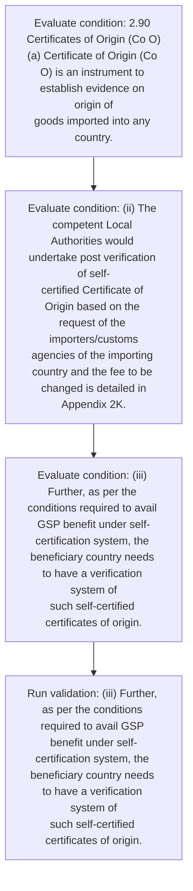
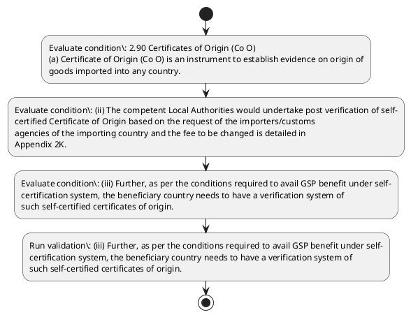

# Chapter 2 / Section 2.90: Certificates of Origin (Co O)

**Chapter Title:** General Provisions Regarding Imports and Exports

**Pages:** 39, 40

**Purpose:** 2.90 Certificates of Origin (Co O)
(a) Certificate of Origin (Co O) is an instrument to establish evidence on origin of
goods imported into any country.

**Purpose Thanglish:** Indha Certificates of Origin (Co O) section-la, 2.90 Certificates of Origin (Co O)
(a) Certificate of Origin (Co O) is an instrument to establish evidence on origin of
goods imported into any country.

**Summary:** 2.90 Certificates of Origin (Co O)
(a) Certificate of Origin (Co O) is an instrument to establish evidence on origin of
goods imported into any country. pg. 48
the GSP Scheme.

**Business Meaning:** Certificates of Origin (Co O) governs how DGFT business controls should be applied, validated, and enforced.

**Business Explanation:** Certificates of Origin (Co O) explains the operating rule set that DEKAI should enforce. Key control points include (iii) Further, as per the conditions required to avail GSP benefit under self-
certification system, the beneficiary country needs to have a verification system of
such self-certified certificates of origin.

**Business Explanation Thanglish:** Indha Certificates of Origin (Co O) section-la, Certificates of Origin (Co O) explains the operating rule set that DEKAI should enforce. Key control points include (iii) Further, as per the conditions required to avail GSP benefit under self-
certification system, the beneficiary country needs to have a verification system of
such self-certified certificates of origin.

## Business Logic
- (iii) Further, as per the conditions required to avail GSP benefit under self-
certification system, the beneficiary country needs to have a verification system of
such self-certified certificates of origin.

## Business Rules
- rule_id=CH2-SEC2_90-R001, rule_description=(iii) Further, as per the conditions required to avail GSP benefit under self-
certification system, the beneficiary country needs to have a verification system of
such self-certified certificates of origin., trigger=Certificates of Origin (Co O), condition=2.90 Certificates of Origin (Co O)
(a) Certificate of Origin (Co O) is an instrument to establish evidence on origin of
goods imported into any country., validation=(iii) Further, as per the conditions required to avail GSP benefit under self-
certification system, the beneficiary country needs to have a verification system of
such self-certified certificates of origin., action=Manual review required., exception=No explicit exception found in uploaded documents., output=DEKAI should produce a compliance decision for 2.90 - Certificates of Origin (Co O).

## Conditions
- 2.90 Certificates of Origin (Co O)
(a) Certificate of Origin (Co O) is an instrument to establish evidence on origin of
goods imported into any country.
- (ii) The competent Local Authorities would undertake post verification of self-
certified Certificate of Origin based on the request of the importers/customs
agencies of the importing country and the fee to be changed is detailed in
Appendix 2K.
- (iii) Further, as per the conditions required to avail GSP benefit under self-
certification system, the beneficiary country needs to have a verification system of
such self-certified certificates of origin.
- The standard operating procedure for
verification of the self-certified e-Co Os, to be followed by all Authorized
agencies/Local Administrators is detailed in Annexure-II to Appendix-2C.
- (B)
Duty Free Tariff Preference (DFTP) Scheme for LDCs:
(a)
The mandate for Duty Free Quota Free (DFQF) access to Least Developed
Countries (LDCs) came from Paragraph 47 of the Hong Kong Ministerial Declaration
of December 2005.
- India became the first developing country to extend this facility to
LDCs through its Duty Free Tariff Preference (DFTP) Scheme for LDCs which came
into effect in August, 2008 with tariff reductions spread over five years.
- The Scheme
provided preferential market access on tariff lines that comprise 92.5% of global
exports of all LDCs.
- (b)
Subsequently in 2014, the Scheme was modified both with reference to
increase in coverage as well as its simplification.
- This was in response to requests
from several LDCs for additional product coverage on lines of of their export interest
and simplification of the Rules of Origin procedures.
- Under the new expanded DFTP
Scheme, India is granting duty free access on 96.4% of the total tariff lines, thereby
retaining only about 3.6% of lines in the Exclusion and Positive Lists.For details
Department of Commerce Website.
- and Customs’ Notification No.8/2014 dated 1st
April, 2014 may also be referred to in this regard.
- 2.90
Certificates of Origin (Co O)
(a)
Certificate of Origin (Co O) is an instrument to establish evidence on origin of
goods imported into any country.

## Condition Logic
- id=2.2.90.1, if=2.90 Certificates of Origin (Co O)
(a) Certificate of Origin (Co O) is an instrument to establish evidence on origin of
goods imported into any country., then=Route for review, source=2.90 Certificates of Origin (Co O)
(a) Certificate of Origin (Co O) is an instrument to establish evidence on origin of
goods imported into any country.
- id=2.2.90.2, if=(ii) The competent Local Authorities would undertake post verification of self-
certified Certificate of Origin based on the request of the importers/customs
agencies of the importing country and the fee to be changed is detailed in
Appendix 2K., then=Route for review, source=(ii) The competent Local Authorities would undertake post verification of self-
certified Certificate of Origin based on the request of the importers/customs
agencies of the importing country and the fee to be changed is detailed in
Appendix 2K.
- id=2.2.90.3, if=(iii) Further, as per the conditions required to avail GSP benefit under self-
certification system, the beneficiary country needs to have a verification system of
such self-certified certificates of origin., then=Route for review, source=(iii) Further, as per the conditions required to avail GSP benefit under self-
certification system, the beneficiary country needs to have a verification system of
such self-certified certificates of origin.
- id=2.2.90.4, if=The standard operating procedure for
verification of the self-certified e-Co Os, to be followed by all Authorized
agencies/Local Administrators is detailed in Annexure-II to Appendix-2C., then=Route for review, source=The standard operating procedure for
verification of the self-certified e-Co Os, to be followed by all Authorized
agencies/Local Administrators is detailed in Annexure-II to Appendix-2C.
- id=2.2.90.5, if=(B)
Duty Free Tariff Preference (DFTP) Scheme for LDCs:
(a)
The mandate for Duty Free Quota Free (DFQF) access to Least Developed
Countries (LDCs) came from Paragraph 47 of the Hong Kong Ministerial Declaration
of December 2005., then=Route for review, source=(B)
Duty Free Tariff Preference (DFTP) Scheme for LDCs:
(a)
The mandate for Duty Free Quota Free (DFQF) access to Least Developed
Countries (LDCs) came from Paragraph 47 of the Hong Kong Ministerial Declaration
of December 2005.
- id=2.2.90.6, if=India became the first developing country to extend this facility to
LDCs through its Duty Free Tariff Preference (DFTP) Scheme for LDCs which came
into effect in August, 2008 with tariff reductions spread over five years., then=Route for review, source=India became the first developing country to extend this facility to
LDCs through its Duty Free Tariff Preference (DFTP) Scheme for LDCs which came
into effect in August, 2008 with tariff reductions spread over five years.
- id=2.2.90.7, if=The Scheme
provided preferential market access on tariff lines that comprise 92.5% of global
exports of all LDCs., then=Route for review, source=The Scheme
provided preferential market access on tariff lines that comprise 92.5% of global
exports of all LDCs.
- id=2.2.90.8, if=(b)
Subsequently in 2014, the Scheme was modified both with reference to
increase in coverage as well as its simplification., then=Route for review, source=(b)
Subsequently in 2014, the Scheme was modified both with reference to
increase in coverage as well as its simplification.
- id=2.2.90.9, if=This was in response to requests
from several LDCs for additional product coverage on lines of of their export interest
and simplification of the Rules of Origin procedures., then=Route for review, source=This was in response to requests
from several LDCs for additional product coverage on lines of of their export interest
and simplification of the Rules of Origin procedures.
- id=2.2.90.10, if=Under the new expanded DFTP
Scheme, India is granting duty free access on 96.4% of the total tariff lines, thereby
retaining only about 3.6% of lines in the Exclusion and Positive Lists.For details
Department of Commerce Website., then=Route for review, source=Under the new expanded DFTP
Scheme, India is granting duty free access on 96.4% of the total tariff lines, thereby
retaining only about 3.6% of lines in the Exclusion and Positive Lists.For details
Department of Commerce Website.
- id=2.2.90.11, if=and Customs’ Notification No.8/2014 dated 1st
April, 2014 may also be referred to in this regard., then=Route for review, source=and Customs’ Notification No.8/2014 dated 1st
April, 2014 may also be referred to in this regard.
- id=2.2.90.12, if=2.90
Certificates of Origin (Co O)
(a)
Certificate of Origin (Co O) is an instrument to establish evidence on origin of
goods imported into any country., then=Route for review, source=2.90
Certificates of Origin (Co O)
(a)
Certificate of Origin (Co O) is an instrument to establish evidence on origin of
goods imported into any country.

## Validations
- (iii) Further, as per the conditions required to avail GSP benefit under self-
certification system, the beneficiary country needs to have a verification system of
such self-certified certificates of origin.

## Exceptions
- None identified

## Dependencies
- 47

## Authorities
- customs
- The competent Local Authorities

## Required Documents
- 2.90 Certificates of Origin (Co O)
(a) Certificate of Origin (Co O) is an instrument to establish evidence on origin of
goods imported into any country.
- The
details of the scheme are at Annexure-1 to Appendix-2C.
- (ii) The competent Local Authorities would undertake post verification of self-
certified Certificate of Origin based on the request of the importers/customs
agencies of the importing country and the fee to be changed is detailed in
Appendix 2K.
- (iii) Further, as per the conditions required to avail GSP benefit under self-
certification system, the beneficiary country needs to have a verification system of
such self-certified certificates of origin.
- Local Administrators is detailed in Annexure
- LDCs) came from Paragraph 47 of the Hong Kong Ministerial Declaration
- 2.90
Certificates of Origin (Co O)
(a)
Certificate of Origin (Co O) is an instrument to establish evidence on origin of
goods imported into any country.

## Timelines
- India became the first developing country to extend this facility to
LDCs through its Duty Free Tariff Preference (DFTP) Scheme for LDCs which came
into effect in August, 2008 with tariff reductions spread over five years.

## Actions
- None identified

## Workflow
- Evaluate condition: 2.90 Certificates of Origin (Co O)
(a) Certificate of Origin (Co O) is an instrument to establish evidence on origin of
goods imported into any country.
- Evaluate condition: (ii) The competent Local Authorities would undertake post verification of self-
certified Certificate of Origin based on the request of the importers/customs
agencies of the importing country and the fee to be changed is detailed in
Appendix 2K.
- Evaluate condition: (iii) Further, as per the conditions required to avail GSP benefit under self-
certification system, the beneficiary country needs to have a verification system of
such self-certified certificates of origin.
- Run validation: (iii) Further, as per the conditions required to avail GSP benefit under self-
certification system, the beneficiary country needs to have a verification system of
such self-certified certificates of origin.

## Workflow ASCII
```text
Certificates of Origin (Co O)
Evaluate condition: 2.90 Certificates of Origin (Co O)
(a) Certificate of Origin (Co O) is an instrument to establish evidence on origin of
goods imported into any country.
   |
   v
Evaluate condition: (ii) The competent Local Authorities would undertake post verification of self-
certified Certificate of Origin based on the request of the importers/customs
agencies of the importing country and the fee to be changed is detailed in
Appendix 2K.
   |
   v
Evaluate condition: (iii) Further, as per the conditions required to avail GSP benefit under self-
certification system, the beneficiary country needs to have a verification system of
such self-certified certificates of origin.
   |
   v
Run validation: (iii) Further, as per the conditions required to avail GSP benefit under self-
certification system, the beneficiary country needs to have a verification system of
such self-certified certificates of origin.
```

## Decision Tree
- IF section 2.90 applies THEN proceed with standard DGFT workflow

## Decision Tree ASCII
```text
Certificates of Origin (Co O) Decision
IF section 2.90 applies THEN proceed with standard DGFT workflow
```

## Examples
- User asks to process Certificates of Origin (Co O); the platform checks conditions, validations, and documents before action.

**Real-world Example:** Example: an importer or exporter invokes Certificates of Origin (Co O), submits 2.90 Certificates of Origin (Co O)
(a) Certificate of Origin (Co O) is an instrument to establish evidence on origin of
goods imported into any country., The
details of the scheme are at Annexure-1 to Appendix-2C., (ii) The competent Local Authorities would undertake post verification of self-
certified Certificate of Origin based on the request of the importers/customs
agencies of the importing country and the fee to be changed is detailed in
Appendix 2K., and DEKAI uses the extracted rules to follow the certificates of origin (co o) process.

**Real-world Example Thanglish:** Indha Certificates of Origin (Co O) section-la, Example: an importer or exporter invokes Certificates of Origin (Co O), submits 2.90 Certificates of Origin (Co O)
(a) Certificate of Origin (Co O) is an instrument to establish evidence on origin of
goods imported into any country., The
details of the scheme are at Annexure-1 to Appendix-2C., (ii) The competent Local Authorities would undertake post verification of self-
certified Certificate of Origin based on the request of the importers/customs
agencies of the importing country and the fee to be changed is detailed in
Appendix 2K., and DEKAI uses the extracted rules to follow the certificates of origin (co o) process.

## AI Rules
- IF detected context matches section rule THEN enforce: (iii) Further, as per the conditions required to avail GSP benefit under self-
certification system, the beneficiary country needs to have a verification system of
such self-certified certificates of origin.

## Database Fields
- name=section_code, type=string, required=True, source=parsed_section_heading
- name=section_title, type=string, required=True, source=parsed_section_heading
- name=any_flag, type=boolean, required=False, source=keyword:any
- name=the_flag, type=boolean, required=False, source=keyword:the
- name=gsp_flag, type=boolean, required=False, source=keyword:GSP
- name=rex_flag, type=boolean, required=False, source=keyword:REX
- name=fee_flag, type=boolean, required=False, source=keyword:fee
- name=are_flag, type=boolean, required=False, source=keyword:are
- name=and_flag, type=boolean, required=False, source=keyword:and
- name=may_flag, type=boolean, required=False, source=keyword:may
- name=document_1_submitted, type=boolean, required=True, source=2.90 Certificates of Origin (Co O)
(a) Certificate of Origin (Co O) is an instrument to establish evidence on origin of
goods imported into any country.
- name=document_2_submitted, type=boolean, required=True, source=The
details of the scheme are at Annexure-1 to Appendix-2C.
- name=document_3_submitted, type=boolean, required=True, source=(ii) The competent Local Authorities would undertake post verification of self-
certified Certificate of Origin based on the request of the importers/customs
agencies of the importing country and the fee to be changed is detailed in
Appendix 2K.
- name=document_4_submitted, type=boolean, required=True, source=(iii) Further, as per the conditions required to avail GSP benefit under self-
certification system, the beneficiary country needs to have a verification system of
such self-certified certificates of origin.
- name=document_5_submitted, type=boolean, required=True, source=Local Administrators is detailed in Annexure
- name=document_6_submitted, type=boolean, required=True, source=LDCs) came from Paragraph 47 of the Hong Kong Ministerial Declaration

## API Requirements
- method=GET, path=/api/dgft/sections/2.90, purpose=Retrieve knowledge payload for section 2.90, query_params=['include=workflow,decision_tree,validations'], response_fields=['section', 'title', 'summary', 'conditions', 'validations', 'exceptions', 'workflow', 'decision_tree']
- method=POST, path=/api/dgft/Certificates-of-Origin-Co-O/validate, purpose=Validate inputs and documents for Certificates of Origin (Co O), request_fields=['section_code', 'section_title', 'document_1_submitted', 'document_2_submitted', 'document_3_submitted', 'document_4_submitted', 'document_5_submitted', 'document_6_submitted'], response_fields=['status', 'errors', 'warnings', 'next_actions']

## UI Screens
- screen_id=Certificates_of_Origin_Co_O_overview, name=Certificates of Origin (Co O) Overview, purpose=Show section summary, authority, timeline, and eligibility cues., widgets=['summary_card', 'conditions_table', 'authority_badges', 'timeline_panel']
- screen_id=Certificates_of_Origin_Co_O_submission, name=Certificates of Origin (Co O) Submission, purpose=Capture applicant data and supporting documents., widgets=['dynamic_form', 'document_uploader', 'validation_panel', 'next_action_footer'], fields=['section_code', 'section_title', 'any_flag', 'the_flag', 'gsp_flag', 'rex_flag', 'fee_flag', 'are_flag']

## Error Messages
- Validation failed because the section requirements were not fully met.

## FAQ
- question_en=What is the purpose of section 2.90?, answer_en=Certificates of Origin (Co O) explains the operating rule set that DEKAI should enforce. Key control points include (iii) Further, as per the conditions required to avail GSP benefit under self-
certification system, the beneficiary country needs to have a verification system of
such self-certified certificates of origin., question_thanglish=Indha Certificates of Origin (Co O) section-la, What is the purpose of section 2.90?, answer_thanglish=Indha Certificates of Origin (Co O) section-la, Certificates of Origin (Co O) explains the operating rule set that DEKAI should enforce. Key control points include (iii) Further, as per the conditions required to avail GSP benefit under self-
certification system, the beneficiary country needs to have a verification system of
such self-certified certificates of origin.
- question_en=What documents are required under Certificates of Origin (Co O)?, answer_en=2.90 Certificates of Origin (Co O)
(a) Certificate of Origin (Co O) is an instrument to establish evidence on origin of
goods imported into any country., The
details of the scheme are at Annexure-1 to Appendix-2C., (ii) The competent Local Authorities would undertake post verification of self-
certified Certificate of Origin based on the request of the importers/customs
agencies of the importing country and the fee to be changed is detailed in
Appendix 2K., (iii) Further, as per the conditions required to avail GSP benefit under self-
certification system, the beneficiary country needs to have a verification system of
such self-certified certificates of origin., Local Administrators is detailed in Annexure, LDCs) came from Paragraph 47 of the Hong Kong Ministerial Declaration, 2.90
Certificates of Origin (Co O)
(a)
Certificate of Origin (Co O) is an instrument to establish evidence on origin of
goods imported into any country., question_thanglish=Indha Certificates of Origin (Co O) section-la, What documents are required under Certificates of Origin (Co O)?, answer_thanglish=Indha Certificates of Origin (Co O) section-la, 2.90 Certificates of Origin (Co O)
(a) Certificate of Origin (Co O) is an instrument to establish evidence on origin of
goods imported into any country., The
details of the scheme are at Annexure-1 to Appendix-2C., (ii) The competent Local Authorities would undertake post verification of self-
certified Certificate of Origin based on the request of the importers/customs
agencies of the importing country and the fee to be changed is detailed in
Appendix 2K., (iii) Further, as per the conditions required to avail GSP benefit under self-
certification system, the beneficiary country needs to have a verification system of
such self-certified certificates of origin., Local Administrators is detailed in Annexure, LDCs) came from Paragraph 47 of the Hong Kong Ministerial Declaration, 2.90
Certificates of Origin (Co O)
(a)
Certificate of Origin (Co O) is an instrument to establish evidence on origin of
goods imported into any country.
- question_en=Which authority handles Certificates of Origin (Co O)?, answer_en=customs, The competent Local Authorities, question_thanglish=Indha Certificates of Origin (Co O) section-la, Which authority handles Certificates of Origin (Co O)?, answer_thanglish=Indha Certificates of Origin (Co O) section-la, customs, The competent Local Authorities

## Questions Users May Ask
- What does Certificates of Origin (Co O) require?
- Which documents are needed for Certificates of Origin (Co O)?
- How does DEKAI validate Certificates of Origin (Co O) requests?

## Expected AI Answers
- Certificates of Origin (Co O) requires the platform to interpret the section text, apply the extracted business rules, and present the correct next action.
- Required documents are inferred from the section text: 2.90 Certificates of Origin (Co O)
(a) Certificate of Origin (Co O) is an instrument to establish evidence on origin of
goods imported into any country., The
details of the scheme are at Annexure-1 to Appendix-2C., (ii) The competent Local Authorities would undertake post verification of self-
certified Certificate of Origin based on the request of the importers/customs
agencies of the importing country and the fee to be changed is detailed in
Appendix 2K., (iii) Further, as per the conditions required to avail GSP benefit under self-
certification system, the beneficiary country needs to have a verification system of
such self-certified certificates of origin., Local Administrators is detailed in Annexure
- DEKAI validates Certificates of Origin (Co O) by checking conditions, required documents, authority references, and exception clauses before recommending an outcome.

## AI Q&A Examples
- question_en=User asks: How do I comply with Certificates of Origin (Co O)?, answer_en=AI answers: DEKAI should evaluate section 2.90, apply the extracted rules, and guide the user through Evaluate condition: 2.90 Certificates of Origin (Co O)
(a) Certificate of Origin (Co O) is an instrument to establish evidence on origin of
goods imported into any country.., question_thanglish=Indha Certificates of Origin (Co O) section-la, User asks: How do I comply with Certificates of Origin (Co O)?, answer_thanglish=Indha Certificates of Origin (Co O) section-la, AI answers: DEKAI should evaluate section 2.90, apply the extracted rules, and guide the user through Evaluate condition: 2.90 Certificates of Origin (Co O)
(a) Certificate of Origin (Co O) is an instrument to establish evidence on origin of
goods imported into any country..
- question_en=User asks: Which validations apply to Certificates of Origin (Co O)?, answer_en=AI answers: Applicable validations are (iii) Further, as per the conditions required to avail GSP benefit under self-
certification system, the beneficiary country needs to have a verification system of
such self-certified certificates of origin., question_thanglish=Indha Certificates of Origin (Co O) section-la, User asks: Which validations apply to Certificates of Origin (Co O)?, answer_thanglish=Indha Certificates of Origin (Co O) section-la, AI answers: Applicable validations are (iii) Further, as per the conditions required to avail GSP benefit under self-
certification system, the beneficiary country needs to have a verification system of
such self-certified certificates of origin.

## DEKAI AI Implementation Notes
- Capture chapter 2, section 2.90, title, and page references as immutable knowledge metadata.
- Bind validations for Certificates of Origin (Co O) into a rule engine keyed by the rule IDs extracted for this section.
- Expose document upload controls for: 2.90 Certificates of Origin (Co O)
(a) Certificate of Origin (Co O) is an instrument to establish evidence on origin of
goods imported into any country., The
details of the scheme are at Annexure-1 to Appendix-2C., (ii) The competent Local Authorities would undertake post verification of self-
certified Certificate of Origin based on the request of the importers/customs
agencies of the importing country and the fee to be changed is detailed in
Appendix 2K., (iii) Further, as per the conditions required to avail GSP benefit under self-
certification system, the beneficiary country needs to have a verification system of
such self-certified certificates of origin., Local Administrators is detailed in Annexure, LDCs) came from Paragraph 47 of the Hong Kong Ministerial Declaration.
- Route escalations or approvals to: customs, The competent Local Authorities.

## DEKAI AI Implementation Notes Thanglish
- Indha Certificates of Origin (Co O) section-la, Capture chapter 2, section 2.90, title, and page references as immutable knowledge metadata.
- Indha Certificates of Origin (Co O) section-la, Bind validations for Certificates of Origin (Co O) into a rule engine keyed by the rule IDs extracted for this section.
- Indha Certificates of Origin (Co O) section-la, Expose document upload controls for: 2.90 Certificates of Origin (Co O)
(a) Certificate of Origin (Co O) is an instrument to establish evidence on origin of
goods imported into any country., The
details of the scheme are at Annexure-1 to Appendix-2C., (ii) The competent Local Authorities would undertake post verification of self-
certified Certificate of Origin based on the request of the importers/customs
agencies of the importing country and the fee to be changed is detailed in
Appendix 2K., (iii) Further, as per the conditions required to avail GSP benefit under self-
certification system, the beneficiary country needs to have a verification system of
such self-certified certificates of origin., Local Administrators is detailed in Annexure, LDCs) came from Paragraph 47 of the Hong Kong Ministerial Declaration.
- Indha Certificates of Origin (Co O) section-la, Route escalations or approvals to: customs, The competent Local Authorities.

## AI Metadata
- Keywords: any, the, GSP, REX, fee, are, and, may, per, iii, for, all, its, was, new, two, viz, Non, into, post
- Search Keywords: any, the, GSP, REX, fee, are, and, may, per, iii, for, all, its, was, new, two, viz, Non, into, post
- Intent: Provide knowledge guidance for Certificates of Origin (Co O).
- Tags: 2.90, Certificates of Origin (Co O), business-rule, document-driven, dgft
- Related Sections: 
- Related Chapters: 
- Related Rules: (iii) Further, as per the conditions required to avail GSP benefit under self-
certification system, the beneficiary country needs to have a verification system of
such self-certified certificates of origin.

## Mermaid


## PlantUML

