# Chapter 2 / Section 2.91: Rules of Origin (Preferential)

**Chapter Title:** General Provisions Regarding Imports and Exports

**Pages:** 40

**Purpose:** 2.91 Rules of Origin (Preferential)
(a) The rules of origin are the rules that determine the origin of a good for the
purpose of exports to a trading partner.

**Purpose Thanglish:** Indha Rules of Origin (Preferential) section-la, 2.91 Rules of Origin (Preferential)
(a) The rules of origin are the rules that determine the origin of a good for the
purpose of exports to a trading partner.

**Summary:** 2.91 Rules of Origin (Preferential)
(a) The rules of origin are the rules that determine the origin of a good for the
purpose of exports to a trading partner. Under an FTA, PTA or a unilateral
tariff concession, the tariff concessions are granted by an importing country
only when these prescribed rules of origin are adhered to. Rules of origin also
facilitate in computation of trade statistics and for determination and
imposition of trade remedial measures.

**Business Meaning:** Rules of Origin (Preferential) governs how DGFT business controls should be applied, validated, and enforced.

**Business Explanation:** Rules of Origin (Preferential) explains the operating rule set that DEKAI should enforce. Key control points include (b) Some of the key criteria used in the determination of the rules of origin are:
(i) Wholly obtained
(ii) Change in tariff classification
(iii) Value addition
(iv) Non minimal operations
(c) For exports under India’s FTAs, PTAs and GSP, specified agencies are
authorised to issue the certificates of origin, they shall also provide services
relating to issue of Co O, including details regarding rules of origin, list of items
covered by an agreement, extent of tariff preference, verification and
certification of eligibility. The section also drives actions such as (b) Some of the key criteria used in the determination of the rules of origin are:
(i) Wholly obtained
(ii) Change in tariff classification
(iii) Value addition
(iv) Non minimal operations
(c) For exports under India’s FTAs, PTAs and GSP, specified agencies are
authorised to issue the certificates of origin, they shall also provide services
relating to issue of Co O, including details regarding rules of origin, list of items
covered by an agreement, extent of tariff preference, verification and
certification of eligibility..

**Business Explanation Thanglish:** Indha Rules of Origin (Preferential) section-la, Rules of Origin (Preferential) explains the operating rule set that DEKAI should enforce. Key control points include (b) Some of the key criteria used in the determination of the rules of origin are:
(i) Wholly obtained
(ii) Change in tariff classification
(iii) Value addition
(iv) Non minimal operations
(c) For exports under India’s FTAs, PTAs and GSP, specified agencies are
authorised to issue the certificates of origin, they kandippa also provide services
relating to issue of Co O, including details regarding rules of origin, list of items
covered by an agreement, extent of tariff preference, verification and
certification of eligibility. The section also drives actions such as (b) Some of the key criteria used in the determination of the rules of origin are:
(i) Wholly obtained
(ii) Change in tariff classification
(iii) Value addition
(iv) Non minimal operations
(c) For exports under India’s FTAs, PTAs and GSP, specified agencies are
authorised to issue the certificates of origin, they kandippa also provide services
relating to issue of Co O, including details regarding rules of origin, list of items
covered by an agreement, extent of tariff preference, verification and
certification of eligibility..

## Business Logic
- (b) Some of the key criteria used in the determination of the rules of origin are:
(i) Wholly obtained
(ii) Change in tariff classification
(iii) Value addition
(iv) Non minimal operations
(c) For exports under India’s FTAs, PTAs and GSP, specified agencies are
authorised to issue the certificates of origin, they shall also provide services
relating to issue of Co O, including details regarding rules of origin, list of items
covered by an agreement, extent of tariff preference, verification and
certification of eligibility.
- (b)
Some of the key criteria used in the determination of the rules of origin are:
(i)
Wholly obtained
(ii)
Change in tariff classification
(iii)
Value addition
(iv)
Non minimal operations
(c)
For exports under India’s FTAs, PTAs and GSP, specified agencies are
authorised to issue the certificates of origin, they shall also provide services
relating to issue of Co O, including details regarding rules of origin, list of items
covered by an agreement, extent of tariff preference, verification and
certification of eligibility.

## Business Rules
- rule_id=CH2-SEC2_91-R001, rule_description=(b) Some of the key criteria used in the determination of the rules of origin are:
(i) Wholly obtained
(ii) Change in tariff classification
(iii) Value addition
(iv) Non minimal operations
(c) For exports under India’s FTAs, PTAs and GSP, specified agencies are
authorised to issue the certificates of origin, they shall also provide services
relating to issue of Co O, including details regarding rules of origin, list of items
covered by an agreement, extent of tariff preference, verification and
certification of eligibility., trigger=Rules of Origin (Preferential), condition=Under an FTA, PTA or a unilateral
tariff concession, the tariff concessions are granted by an importing country
only when these prescribed rules of origin are adhered to., validation=(b) Some of the key criteria used in the determination of the rules of origin are:
(i) Wholly obtained
(ii) Change in tariff classification
(iii) Value addition
(iv) Non minimal operations
(c) For exports under India’s FTAs, PTAs and GSP, specified agencies are
authorised to issue the certificates of origin, they shall also provide services
relating to issue of Co O, including details regarding rules of origin, list of items
covered by an agreement, extent of tariff preference, verification and
certification of eligibility., action=(b) Some of the key criteria used in the determination of the rules of origin are:
(i) Wholly obtained
(ii) Change in tariff classification
(iii) Value addition
(iv) Non minimal operations
(c) For exports under India’s FTAs, PTAs and GSP, specified agencies are
authorised to issue the certificates of origin, they shall also provide services
relating to issue of Co O, including details regarding rules of origin, list of items
covered by an agreement, extent of tariff preference, verification and
certification of eligibility., exception=No explicit exception found in uploaded documents., output=DEKAI should produce a compliance decision for 2.91 - Rules of Origin (Preferential).
- rule_id=CH2-SEC2_91-R002, rule_description=(b)
Some of the key criteria used in the determination of the rules of origin are:
(i)
Wholly obtained
(ii)
Change in tariff classification
(iii)
Value addition
(iv)
Non minimal operations
(c)
For exports under India’s FTAs, PTAs and GSP, specified agencies are
authorised to issue the certificates of origin, they shall also provide services
relating to issue of Co O, including details regarding rules of origin, list of items
covered by an agreement, extent of tariff preference, verification and
certification of eligibility., trigger=Rules of Origin (Preferential), condition=(b) Some of the key criteria used in the determination of the rules of origin are:
(i) Wholly obtained
(ii) Change in tariff classification
(iii) Value addition
(iv) Non minimal operations
(c) For exports under India’s FTAs, PTAs and GSP, specified agencies are
authorised to issue the certificates of origin, they shall also provide services
relating to issue of Co O, including details regarding rules of origin, list of items
covered by an agreement, extent of tariff preference, verification and
certification of eligibility., validation=(b)
Some of the key criteria used in the determination of the rules of origin are:
(i)
Wholly obtained
(ii)
Change in tariff classification
(iii)
Value addition
(iv)
Non minimal operations
(c)
For exports under India’s FTAs, PTAs and GSP, specified agencies are
authorised to issue the certificates of origin, they shall also provide services
relating to issue of Co O, including details regarding rules of origin, list of items
covered by an agreement, extent of tariff preference, verification and
certification of eligibility., action=The list of these agencies authorised under the
various FTAs/ PTAs is given in Appendix 2B
(d) <<deleted>>
(e) In case of India- EFTA TEPA, Certificates of Origin may also be obtained on the basis of
self-declaration by the exporter concerned, in addition to issuance of Certificate of
Origin by an authorised agency"., exception=No explicit exception found in uploaded documents., output=DEKAI should produce a compliance decision for 2.91 - Rules of Origin (Preferential).

## Conditions
- Under an FTA, PTA or a unilateral
tariff concession, the tariff concessions are granted by an importing country
only when these prescribed rules of origin are adhered to.
- (b) Some of the key criteria used in the determination of the rules of origin are:
(i) Wholly obtained
(ii) Change in tariff classification
(iii) Value addition
(iv) Non minimal operations
(c) For exports under India’s FTAs, PTAs and GSP, specified agencies are
authorised to issue the certificates of origin, they shall also provide services
relating to issue of Co O, including details regarding rules of origin, list of items
covered by an agreement, extent of tariff preference, verification and
certification of eligibility.
- The list of these agencies authorised under the
various FTAs/ PTAs is given in Appendix 2B
(d) <<deleted>>
(e) In case of India- EFTA TEPA, Certificates of Origin may also be obtained on the basis of
self-declaration by the exporter concerned, in addition to issuance of Certificate of
Origin by an authorised agency".
- (b)
Some of the key criteria used in the determination of the rules of origin are:
(i)
Wholly obtained
(ii)
Change in tariff classification
(iii)
Value addition
(iv)
Non minimal operations
(c)
For exports under India’s FTAs, PTAs and GSP, specified agencies are
authorised to issue the certificates of origin, they shall also provide services
relating to issue of Co O, including details regarding rules of origin, list of items
covered by an agreement, extent of tariff preference, verification and
certification of eligibility.
- The list of these agencies authorised under the
various FTAs/ PTAs is given in Appendix 2B
(d)
<<deleted>>
(e)
In case of India- EFTA TEPA, Certificates of Origin may also be obtained on the basis of
self-declaration by the exporter concerned, in addition to issuance of Certificate of
Origin by an authorised agency".

## Condition Logic
- id=2.2.91.1, if=Under an FTA, PTA or a unilateral
tariff concession, the tariff concessions are granted by an importing country
only when these prescribed rules of origin are adhered to., then=(b) Some of the key criteria used in the determination of the rules of origin are:
(i) Wholly obtained
(ii) Change in tariff classification
(iii) Value addition
(iv) Non minimal operations
(c) For exports under India’s FTAs, PTAs and GSP, specified agencies are
authorised to issue the certificates of origin, they shall also provide services
relating to issue of Co O, including details regarding rules of origin, list of items
covered by an agreement, extent of tariff preference, verification and
certification of eligibility., source=Under an FTA, PTA or a unilateral
tariff concession, the tariff concessions are granted by an importing country
only when these prescribed rules of origin are adhered to.
- id=2.2.91.2, if=(b) Some of the key criteria used in the determination of the rules of origin are:
(i) Wholly obtained
(ii) Change in tariff classification
(iii) Value addition
(iv) Non minimal operations
(c) For exports under India’s FTAs, PTAs and GSP, specified agencies are
authorised to issue the certificates of origin, they shall also provide services
relating to issue of Co O, including details regarding rules of origin, list of items
covered by an agreement, extent of tariff preference, verification and
certification of eligibility., then=(b) Some of the key criteria used in the determination of the rules of origin are:
(i) Wholly obtained
(ii) Change in tariff classification
(iii) Value addition
(iv) Non minimal operations
(c) For exports under India’s FTAs, PTAs and GSP, specified agencies are
authorised to issue the certificates of origin, they shall also provide services
relating to issue of Co O, including details regarding rules of origin, list of items
covered by an agreement, extent of tariff preference, verification and
certification of eligibility., source=(b) Some of the key criteria used in the determination of the rules of origin are:
(i) Wholly obtained
(ii) Change in tariff classification
(iii) Value addition
(iv) Non minimal operations
(c) For exports under India’s FTAs, PTAs and GSP, specified agencies are
authorised to issue the certificates of origin, they shall also provide services
relating to issue of Co O, including details regarding rules of origin, list of items
covered by an agreement, extent of tariff preference, verification and
certification of eligibility.
- id=2.2.91.3, if=The list of these agencies authorised under the
various FTAs/ PTAs is given in Appendix 2B
(d) <<deleted>>
(e) In case of India- EFTA TEPA, Certificates of Origin may also be obtained on the basis of
self-declaration by the exporter concerned, in addition to issuance of Certificate of
Origin by an authorised agency"., then=(b) Some of the key criteria used in the determination of the rules of origin are:
(i) Wholly obtained
(ii) Change in tariff classification
(iii) Value addition
(iv) Non minimal operations
(c) For exports under India’s FTAs, PTAs and GSP, specified agencies are
authorised to issue the certificates of origin, they shall also provide services
relating to issue of Co O, including details regarding rules of origin, list of items
covered by an agreement, extent of tariff preference, verification and
certification of eligibility., source=The list of these agencies authorised under the
various FTAs/ PTAs is given in Appendix 2B
(d) <<deleted>>
(e) In case of India- EFTA TEPA, Certificates of Origin may also be obtained on the basis of
self-declaration by the exporter concerned, in addition to issuance of Certificate of
Origin by an authorised agency".
- id=2.2.91.4, if=(b)
Some of the key criteria used in the determination of the rules of origin are:
(i)
Wholly obtained
(ii)
Change in tariff classification
(iii)
Value addition
(iv)
Non minimal operations
(c)
For exports under India’s FTAs, PTAs and GSP, specified agencies are
authorised to issue the certificates of origin, they shall also provide services
relating to issue of Co O, including details regarding rules of origin, list of items
covered by an agreement, extent of tariff preference, verification and
certification of eligibility., then=(b) Some of the key criteria used in the determination of the rules of origin are:
(i) Wholly obtained
(ii) Change in tariff classification
(iii) Value addition
(iv) Non minimal operations
(c) For exports under India’s FTAs, PTAs and GSP, specified agencies are
authorised to issue the certificates of origin, they shall also provide services
relating to issue of Co O, including details regarding rules of origin, list of items
covered by an agreement, extent of tariff preference, verification and
certification of eligibility., source=(b)
Some of the key criteria used in the determination of the rules of origin are:
(i)
Wholly obtained
(ii)
Change in tariff classification
(iii)
Value addition
(iv)
Non minimal operations
(c)
For exports under India’s FTAs, PTAs and GSP, specified agencies are
authorised to issue the certificates of origin, they shall also provide services
relating to issue of Co O, including details regarding rules of origin, list of items
covered by an agreement, extent of tariff preference, verification and
certification of eligibility.
- id=2.2.91.5, if=The list of these agencies authorised under the
various FTAs/ PTAs is given in Appendix 2B
(d)
<<deleted>>
(e)
In case of India- EFTA TEPA, Certificates of Origin may also be obtained on the basis of
self-declaration by the exporter concerned, in addition to issuance of Certificate of
Origin by an authorised agency"., then=(b) Some of the key criteria used in the determination of the rules of origin are:
(i) Wholly obtained
(ii) Change in tariff classification
(iii) Value addition
(iv) Non minimal operations
(c) For exports under India’s FTAs, PTAs and GSP, specified agencies are
authorised to issue the certificates of origin, they shall also provide services
relating to issue of Co O, including details regarding rules of origin, list of items
covered by an agreement, extent of tariff preference, verification and
certification of eligibility., source=The list of these agencies authorised under the
various FTAs/ PTAs is given in Appendix 2B
(d)
<<deleted>>
(e)
In case of India- EFTA TEPA, Certificates of Origin may also be obtained on the basis of
self-declaration by the exporter concerned, in addition to issuance of Certificate of
Origin by an authorised agency".

## Validations
- (b) Some of the key criteria used in the determination of the rules of origin are:
(i) Wholly obtained
(ii) Change in tariff classification
(iii) Value addition
(iv) Non minimal operations
(c) For exports under India’s FTAs, PTAs and GSP, specified agencies are
authorised to issue the certificates of origin, they shall also provide services
relating to issue of Co O, including details regarding rules of origin, list of items
covered by an agreement, extent of tariff preference, verification and
certification of eligibility.
- (b)
Some of the key criteria used in the determination of the rules of origin are:
(i)
Wholly obtained
(ii)
Change in tariff classification
(iii)
Value addition
(iv)
Non minimal operations
(c)
For exports under India’s FTAs, PTAs and GSP, specified agencies are
authorised to issue the certificates of origin, they shall also provide services
relating to issue of Co O, including details regarding rules of origin, list of items
covered by an agreement, extent of tariff preference, verification and
certification of eligibility.

## Exceptions
- None identified

## Dependencies
- None identified

## Authorities
- None identified

## Required Documents
- (b) Some of the key criteria used in the determination of the rules of origin are:
(i) Wholly obtained
(ii) Change in tariff classification
(iii) Value addition
(iv) Non minimal operations
(c) For exports under India’s FTAs, PTAs and GSP, specified agencies are
authorised to issue the certificates of origin, they shall also provide services
relating to issue of Co O, including details regarding rules of origin, list of items
covered by an agreement, extent of tariff preference, verification and
certification of eligibility.
- The list of these agencies authorised under the
various FTAs/ PTAs is given in Appendix 2B
(d) <<deleted>>
(e) In case of India- EFTA TEPA, Certificates of Origin may also be obtained on the basis of
self-declaration by the exporter concerned, in addition to issuance of Certificate of
Origin by an authorised agency".
- (b)
Some of the key criteria used in the determination of the rules of origin are:
(i)
Wholly obtained
(ii)
Change in tariff classification
(iii)
Value addition
(iv)
Non minimal operations
(c)
For exports under India’s FTAs, PTAs and GSP, specified agencies are
authorised to issue the certificates of origin, they shall also provide services
relating to issue of Co O, including details regarding rules of origin, list of items
covered by an agreement, extent of tariff preference, verification and
certification of eligibility.
- The list of these agencies authorised under the
various FTAs/ PTAs is given in Appendix 2B
(d)
<<deleted>>
(e)
In case of India- EFTA TEPA, Certificates of Origin may also be obtained on the basis of
self-declaration by the exporter concerned, in addition to issuance of Certificate of
Origin by an authorised agency".

## Timelines
- None identified

## Actions
- (b) Some of the key criteria used in the determination of the rules of origin are:
(i) Wholly obtained
(ii) Change in tariff classification
(iii) Value addition
(iv) Non minimal operations
(c) For exports under India’s FTAs, PTAs and GSP, specified agencies are
authorised to issue the certificates of origin, they shall also provide services
relating to issue of Co O, including details regarding rules of origin, list of items
covered by an agreement, extent of tariff preference, verification and
certification of eligibility.
- The list of these agencies authorised under the
various FTAs/ PTAs is given in Appendix 2B
(d) <<deleted>>
(e) In case of India- EFTA TEPA, Certificates of Origin may also be obtained on the basis of
self-declaration by the exporter concerned, in addition to issuance of Certificate of
Origin by an authorised agency".
- (b)
Some of the key criteria used in the determination of the rules of origin are:
(i)
Wholly obtained
(ii)
Change in tariff classification
(iii)
Value addition
(iv)
Non minimal operations
(c)
For exports under India’s FTAs, PTAs and GSP, specified agencies are
authorised to issue the certificates of origin, they shall also provide services
relating to issue of Co O, including details regarding rules of origin, list of items
covered by an agreement, extent of tariff preference, verification and
certification of eligibility.
- The list of these agencies authorised under the
various FTAs/ PTAs is given in Appendix 2B
(d)
<<deleted>>
(e)
In case of India- EFTA TEPA, Certificates of Origin may also be obtained on the basis of
self-declaration by the exporter concerned, in addition to issuance of Certificate of
Origin by an authorised agency".

## Workflow
- Evaluate condition: Under an FTA, PTA or a unilateral
tariff concession, the tariff concessions are granted by an importing country
only when these prescribed rules of origin are adhered to.
- Evaluate condition: (b) Some of the key criteria used in the determination of the rules of origin are:
(i) Wholly obtained
(ii) Change in tariff classification
(iii) Value addition
(iv) Non minimal operations
(c) For exports under India’s FTAs, PTAs and GSP, specified agencies are
authorised to issue the certificates of origin, they shall also provide services
relating to issue of Co O, including details regarding rules of origin, list of items
covered by an agreement, extent of tariff preference, verification and
certification of eligibility.
- Evaluate condition: The list of these agencies authorised under the
various FTAs/ PTAs is given in Appendix 2B
(d) <<deleted>>
(e) In case of India- EFTA TEPA, Certificates of Origin may also be obtained on the basis of
self-declaration by the exporter concerned, in addition to issuance of Certificate of
Origin by an authorised agency".
- (b) Some of the key criteria used in the determination of the rules of origin are:
(i) Wholly obtained
(ii) Change in tariff classification
(iii) Value addition
(iv) Non minimal operations
(c) For exports under India’s FTAs, PTAs and GSP, specified agencies are
authorised to issue the certificates of origin, they shall also provide services
relating to issue of Co O, including details regarding rules of origin, list of items
covered by an agreement, extent of tariff preference, verification and
certification of eligibility.
- The list of these agencies authorised under the
various FTAs/ PTAs is given in Appendix 2B
(d) <<deleted>>
(e) In case of India- EFTA TEPA, Certificates of Origin may also be obtained on the basis of
self-declaration by the exporter concerned, in addition to issuance of Certificate of
Origin by an authorised agency".
- (b)
Some of the key criteria used in the determination of the rules of origin are:
(i)
Wholly obtained
(ii)
Change in tariff classification
(iii)
Value addition
(iv)
Non minimal operations
(c)
For exports under India’s FTAs, PTAs and GSP, specified agencies are
authorised to issue the certificates of origin, they shall also provide services
relating to issue of Co O, including details regarding rules of origin, list of items
covered by an agreement, extent of tariff preference, verification and
certification of eligibility.
- The list of these agencies authorised under the
various FTAs/ PTAs is given in Appendix 2B
(d)
<<deleted>>
(e)
In case of India- EFTA TEPA, Certificates of Origin may also be obtained on the basis of
self-declaration by the exporter concerned, in addition to issuance of Certificate of
Origin by an authorised agency".
- Run validation: (b) Some of the key criteria used in the determination of the rules of origin are:
(i) Wholly obtained
(ii) Change in tariff classification
(iii) Value addition
(iv) Non minimal operations
(c) For exports under India’s FTAs, PTAs and GSP, specified agencies are
authorised to issue the certificates of origin, they shall also provide services
relating to issue of Co O, including details regarding rules of origin, list of items
covered by an agreement, extent of tariff preference, verification and
certification of eligibility.
- Run validation: (b)
Some of the key criteria used in the determination of the rules of origin are:
(i)
Wholly obtained
(ii)
Change in tariff classification
(iii)
Value addition
(iv)
Non minimal operations
(c)
For exports under India’s FTAs, PTAs and GSP, specified agencies are
authorised to issue the certificates of origin, they shall also provide services
relating to issue of Co O, including details regarding rules of origin, list of items
covered by an agreement, extent of tariff preference, verification and
certification of eligibility.

## Workflow ASCII
```text
Rules of Origin (Preferential)
Evaluate condition: Under an FTA, PTA or a unilateral
tariff concession, the tariff concessions are granted by an importing country
only when these prescribed rules of origin are adhered to.
   |
   v
Evaluate condition: (b) Some of the key criteria used in the determination of the rules of origin are:
(i) Wholly obtained
(ii) Change in tariff classification
(iii) Value addition
(iv) Non minimal operations
(c) For exports under India’s FTAs, PTAs and GSP, specified agencies are
authorised to issue the certificates of origin, they shall also provide services
relating to issue of Co O, including details regarding rules of origin, list of items
covered by an agreement, extent of tariff preference, verification and
certification of eligibility.
   |
   v
Evaluate condition: The list of these agencies authorised under the
various FTAs/ PTAs is given in Appendix 2B
(d) <<deleted>>
(e) In case of India- EFTA TEPA, Certificates of Origin may also be obtained on the basis of
self-declaration by the exporter concerned, in addition to issuance of Certificate of
Origin by an authorised agency".
   |
   v
(b) Some of the key criteria used in the determination of the rules of origin are:
(i) Wholly obtained
(ii) Change in tariff classification
(iii) Value addition
(iv) Non minimal operations
(c) For exports under India’s FTAs, PTAs and GSP, specified agencies are
authorised to issue the certificates of origin, they shall also provide services
relating to issue of Co O, including details regarding rules of origin, list of items
covered by an agreement, extent of tariff preference, verification and
certification of eligibility.
   |
   v
The list of these agencies authorised under the
various FTAs/ PTAs is given in Appendix 2B
(d) <<deleted>>
(e) In case of India- EFTA TEPA, Certificates of Origin may also be obtained on the basis of
self-declaration by the exporter concerned, in addition to issuance of Certificate of
Origin by an authorised agency".
   |
   v
(b)
Some of the key criteria used in the determination of the rules of origin are:
(i)
Wholly obtained
(ii)
Change in tariff classification
(iii)
Value addition
(iv)
Non minimal operations
(c)
For exports under India’s FTAs, PTAs and GSP, specified agencies are
authorised to issue the certificates of origin, they shall also provide services
relating to issue of Co O, including details regarding rules of origin, list of items
covered by an agreement, extent of tariff preference, verification and
certification of eligibility.
   |
   v
The list of these agencies authorised under the
various FTAs/ PTAs is given in Appendix 2B
(d)
<<deleted>>
(e)
In case of India- EFTA TEPA, Certificates of Origin may also be obtained on the basis of
self-declaration by the exporter concerned, in addition to issuance of Certificate of
Origin by an authorised agency".
   |
   v
Run validation: (b) Some of the key criteria used in the determination of the rules of origin are:
(i) Wholly obtained
(ii) Change in tariff classification
(iii) Value addition
(iv) Non minimal operations
(c) For exports under India’s FTAs, PTAs and GSP, specified agencies are
authorised to issue the certificates of origin, they shall also provide services
relating to issue of Co O, including details regarding rules of origin, list of items
covered by an agreement, extent of tariff preference, verification and
certification of eligibility.
   |
   v
Run validation: (b)
Some of the key criteria used in the determination of the rules of origin are:
(i)
Wholly obtained
(ii)
Change in tariff classification
(iii)
Value addition
(iv)
Non minimal operations
(c)
For exports under India’s FTAs, PTAs and GSP, specified agencies are
authorised to issue the certificates of origin, they shall also provide services
relating to issue of Co O, including details regarding rules of origin, list of items
covered by an agreement, extent of tariff preference, verification and
certification of eligibility.
```

## Decision Tree
- IF Under an FTA, PTA or a unilateral
tariff concession, the tariff concessions are granted by an importing country
only when these prescribed rules of origin are adhered to. THEN (b) Some of the key criteria used in the determination of the rules of origin are:
(i) Wholly obtained
(ii) Change in tariff classification
(iii) Value addition
(iv) Non minimal operations
(c) For exports under India’s FTAs, PTAs and GSP, specified agencies are
authorised to issue the certificates of origin, they shall also provide services
relating to issue of Co O, including details regarding rules of origin, list of items
covered by an agreement, extent of tariff preference, verification and
certification of eligibility.
- IF (b) Some of the key criteria used in the determination of the rules of origin are:
(i) Wholly obtained
(ii) Change in tariff classification
(iii) Value addition
(iv) Non minimal operations
(c) For exports under India’s FTAs, PTAs and GSP, specified agencies are
authorised to issue the certificates of origin, they shall also provide services
relating to issue of Co O, including details regarding rules of origin, list of items
covered by an agreement, extent of tariff preference, verification and
certification of eligibility. THEN (b) Some of the key criteria used in the determination of the rules of origin are:
(i) Wholly obtained
(ii) Change in tariff classification
(iii) Value addition
(iv) Non minimal operations
(c) For exports under India’s FTAs, PTAs and GSP, specified agencies are
authorised to issue the certificates of origin, they shall also provide services
relating to issue of Co O, including details regarding rules of origin, list of items
covered by an agreement, extent of tariff preference, verification and
certification of eligibility.
- IF The list of these agencies authorised under the
various FTAs/ PTAs is given in Appendix 2B
(d) <<deleted>>
(e) In case of India- EFTA TEPA, Certificates of Origin may also be obtained on the basis of
self-declaration by the exporter concerned, in addition to issuance of Certificate of
Origin by an authorised agency". THEN (b) Some of the key criteria used in the determination of the rules of origin are:
(i) Wholly obtained
(ii) Change in tariff classification
(iii) Value addition
(iv) Non minimal operations
(c) For exports under India’s FTAs, PTAs and GSP, specified agencies are
authorised to issue the certificates of origin, they shall also provide services
relating to issue of Co O, including details regarding rules of origin, list of items
covered by an agreement, extent of tariff preference, verification and
certification of eligibility.
- IF (b)
Some of the key criteria used in the determination of the rules of origin are:
(i)
Wholly obtained
(ii)
Change in tariff classification
(iii)
Value addition
(iv)
Non minimal operations
(c)
For exports under India’s FTAs, PTAs and GSP, specified agencies are
authorised to issue the certificates of origin, they shall also provide services
relating to issue of Co O, including details regarding rules of origin, list of items
covered by an agreement, extent of tariff preference, verification and
certification of eligibility. THEN (b) Some of the key criteria used in the determination of the rules of origin are:
(i) Wholly obtained
(ii) Change in tariff classification
(iii) Value addition
(iv) Non minimal operations
(c) For exports under India’s FTAs, PTAs and GSP, specified agencies are
authorised to issue the certificates of origin, they shall also provide services
relating to issue of Co O, including details regarding rules of origin, list of items
covered by an agreement, extent of tariff preference, verification and
certification of eligibility.
- IF The list of these agencies authorised under the
various FTAs/ PTAs is given in Appendix 2B
(d)
<<deleted>>
(e)
In case of India- EFTA TEPA, Certificates of Origin may also be obtained on the basis of
self-declaration by the exporter concerned, in addition to issuance of Certificate of
Origin by an authorised agency". THEN (b) Some of the key criteria used in the determination of the rules of origin are:
(i) Wholly obtained
(ii) Change in tariff classification
(iii) Value addition
(iv) Non minimal operations
(c) For exports under India’s FTAs, PTAs and GSP, specified agencies are
authorised to issue the certificates of origin, they shall also provide services
relating to issue of Co O, including details regarding rules of origin, list of items
covered by an agreement, extent of tariff preference, verification and
certification of eligibility.

## Decision Tree ASCII
```text
Rules of Origin (Preferential) Decision
IF Under an FTA, PTA or a unilateral
tariff concession, the tariff concessions are granted by an importing country
only when these prescribed rules of origin are adhered to. THEN (b) Some of the key criteria used in the determination of the rules of origin are:
(i) Wholly obtained
(ii) Change in tariff classification
(iii) Value addition
(iv) Non minimal operations
(c) For exports under India’s FTAs, PTAs and GSP, specified agencies are
authorised to issue the certificates of origin, they shall also provide services
relating to issue of Co O, including details regarding rules of origin, list of items
covered by an agreement, extent of tariff preference, verification and
certification of eligibility.
   |
   v
IF (b) Some of the key criteria used in the determination of the rules of origin are:
(i) Wholly obtained
(ii) Change in tariff classification
(iii) Value addition
(iv) Non minimal operations
(c) For exports under India’s FTAs, PTAs and GSP, specified agencies are
authorised to issue the certificates of origin, they shall also provide services
relating to issue of Co O, including details regarding rules of origin, list of items
covered by an agreement, extent of tariff preference, verification and
certification of eligibility. THEN (b) Some of the key criteria used in the determination of the rules of origin are:
(i) Wholly obtained
(ii) Change in tariff classification
(iii) Value addition
(iv) Non minimal operations
(c) For exports under India’s FTAs, PTAs and GSP, specified agencies are
authorised to issue the certificates of origin, they shall also provide services
relating to issue of Co O, including details regarding rules of origin, list of items
covered by an agreement, extent of tariff preference, verification and
certification of eligibility.
   |
   v
IF The list of these agencies authorised under the
various FTAs/ PTAs is given in Appendix 2B
(d) <<deleted>>
(e) In case of India- EFTA TEPA, Certificates of Origin may also be obtained on the basis of
self-declaration by the exporter concerned, in addition to issuance of Certificate of
Origin by an authorised agency". THEN (b) Some of the key criteria used in the determination of the rules of origin are:
(i) Wholly obtained
(ii) Change in tariff classification
(iii) Value addition
(iv) Non minimal operations
(c) For exports under India’s FTAs, PTAs and GSP, specified agencies are
authorised to issue the certificates of origin, they shall also provide services
relating to issue of Co O, including details regarding rules of origin, list of items
covered by an agreement, extent of tariff preference, verification and
certification of eligibility.
   |
   v
IF (b)
Some of the key criteria used in the determination of the rules of origin are:
(i)
Wholly obtained
(ii)
Change in tariff classification
(iii)
Value addition
(iv)
Non minimal operations
(c)
For exports under India’s FTAs, PTAs and GSP, specified agencies are
authorised to issue the certificates of origin, they shall also provide services
relating to issue of Co O, including details regarding rules of origin, list of items
covered by an agreement, extent of tariff preference, verification and
certification of eligibility. THEN (b) Some of the key criteria used in the determination of the rules of origin are:
(i) Wholly obtained
(ii) Change in tariff classification
(iii) Value addition
(iv) Non minimal operations
(c) For exports under India’s FTAs, PTAs and GSP, specified agencies are
authorised to issue the certificates of origin, they shall also provide services
relating to issue of Co O, including details regarding rules of origin, list of items
covered by an agreement, extent of tariff preference, verification and
certification of eligibility.
   |
   v
IF The list of these agencies authorised under the
various FTAs/ PTAs is given in Appendix 2B
(d)
<<deleted>>
(e)
In case of India- EFTA TEPA, Certificates of Origin may also be obtained on the basis of
self-declaration by the exporter concerned, in addition to issuance of Certificate of
Origin by an authorised agency". THEN (b) Some of the key criteria used in the determination of the rules of origin are:
(i) Wholly obtained
(ii) Change in tariff classification
(iii) Value addition
(iv) Non minimal operations
(c) For exports under India’s FTAs, PTAs and GSP, specified agencies are
authorised to issue the certificates of origin, they shall also provide services
relating to issue of Co O, including details regarding rules of origin, list of items
covered by an agreement, extent of tariff preference, verification and
certification of eligibility.
```

## Examples
- User asks to process Rules of Origin (Preferential); the platform checks conditions, validations, and documents before action.

**Real-world Example:** Example: an importer or exporter invokes Rules of Origin (Preferential), submits (b) Some of the key criteria used in the determination of the rules of origin are:
(i) Wholly obtained
(ii) Change in tariff classification
(iii) Value addition
(iv) Non minimal operations
(c) For exports under India’s FTAs, PTAs and GSP, specified agencies are
authorised to issue the certificates of origin, they shall also provide services
relating to issue of Co O, including details regarding rules of origin, list of items
covered by an agreement, extent of tariff preference, verification and
certification of eligibility., The list of these agencies authorised under the
various FTAs/ PTAs is given in Appendix 2B
(d) <<deleted>>
(e) In case of India- EFTA TEPA, Certificates of Origin may also be obtained on the basis of
self-declaration by the exporter concerned, in addition to issuance of Certificate of
Origin by an authorised agency"., (b)
Some of the key criteria used in the determination of the rules of origin are:
(i)
Wholly obtained
(ii)
Change in tariff classification
(iii)
Value addition
(iv)
Non minimal operations
(c)
For exports under India’s FTAs, PTAs and GSP, specified agencies are
authorised to issue the certificates of origin, they shall also provide services
relating to issue of Co O, including details regarding rules of origin, list of items
covered by an agreement, extent of tariff preference, verification and
certification of eligibility., and DEKAI uses the extracted rules to (b) some of the key criteria used in the determination of the rules of origin are:
(i) wholly obtained
(ii) change in tariff classification
(iii) value addition
(iv) non minimal operations
(c) for exports under india’s ftas, ptas and gsp, specified agencies are
authorised to issue the certificates of origin, they shall also provide services
relating to issue of co o, including details regarding rules of origin, list of items
covered by an agreement, extent of tariff preference, verification and
certification of eligibility..

**Real-world Example Thanglish:** Indha Rules of Origin (Preferential) section-la, Example: an importer or exporter invokes Rules of Origin (Preferential), submits (b) Some of the key criteria used in the determination of the rules of origin are:
(i) Wholly obtained
(ii) Change in tariff classification
(iii) Value addition
(iv) Non minimal operations
(c) For exports under India’s FTAs, PTAs and GSP, specified agencies are
authorised to issue the certificates of origin, they kandippa also provide services
relating to issue of Co O, including details regarding rules of origin, list of items
covered by an agreement, extent of tariff preference, verification and
certification of eligibility., The list of these agencies authorised under the
various FTAs/ PTAs is given in Appendix 2B
(d) <<deleted>>
(e) In case of India- EFTA TEPA, Certificates of Origin may also be obtained on the basis of
self-declaration by the exporter concerned, in addition to issuance of Certificate of
Origin by an authorised agency"., (b)
Some of the key criteria used in the determination of the rules of origin are:
(i)
Wholly obtained
(ii)
Change in tariff classification
(iii)
Value addition
(iv)
Non minimal operations
(c)
For exports under India’s FTAs, PTAs and GSP, specified agencies are
authorised to issue the certificates of origin, they kandippa also provide services
relating to issue of Co O, including details regarding rules of origin, list of items
covered by an agreement, extent of tariff preference, verification and
certification of eligibility., and DEKAI uses the extracted rules to (b) some of the key criteria used in the determination of the rules of origin are:
(i) wholly obtained
(ii) change in tariff classification
(iii) value addition
(iv) non minimal operations
(c) for exports under india’s ftas, ptas and gsp, specified agencies are
authorised to issue the certificates of origin, they kandippa also provide services
relating to issue of co o, including details regarding rules of origin, list of items
covered by an agreement, extent of tariff preference, verification and
certification of eligibility..

## AI Rules
- IF detected context matches section rule THEN enforce: (b) Some of the key criteria used in the determination of the rules of origin are:
(i) Wholly obtained
(ii) Change in tariff classification
(iii) Value addition
(iv) Non minimal operations
(c) For exports under India’s FTAs, PTAs and GSP, specified agencies are
authorised to issue the certificates of origin, they shall also provide services
relating to issue of Co O, including details regarding rules of origin, list of items
covered by an agreement, extent of tariff preference, verification and
certification of eligibility.
- IF detected context matches section rule THEN enforce: (b)
Some of the key criteria used in the determination of the rules of origin are:
(i)
Wholly obtained
(ii)
Change in tariff classification
(iii)
Value addition
(iv)
Non minimal operations
(c)
For exports under India’s FTAs, PTAs and GSP, specified agencies are
authorised to issue the certificates of origin, they shall also provide services
relating to issue of Co O, including details regarding rules of origin, list of items
covered by an agreement, extent of tariff preference, verification and
certification of eligibility.
- IF validations pass THEN recommend action: (b) Some of the key criteria used in the determination of the rules of origin are:
(i) Wholly obtained
(ii) Change in tariff classification
(iii) Value addition
(iv) Non minimal operations
(c) For exports under India’s FTAs, PTAs and GSP, specified agencies are
authorised to issue the certificates of origin, they shall also provide services
relating to issue of Co O, including details regarding rules of origin, list of items
covered by an agreement, extent of tariff preference, verification and
certification of eligibility.

## Database Fields
- name=section_code, type=string, required=True, source=parsed_section_heading
- name=section_title, type=string, required=True, source=parsed_section_heading
- name=the_flag, type=boolean, required=False, source=keyword:The
- name=are_flag, type=boolean, required=False, source=keyword:are
- name=for_flag, type=boolean, required=False, source=keyword:for
- name=fta_flag, type=boolean, required=False, source=keyword:FTA
- name=pta_flag, type=boolean, required=False, source=keyword:PTA
- name=and_flag, type=boolean, required=False, source=keyword:and
- name=key_flag, type=boolean, required=False, source=keyword:key
- name=iii_flag, type=boolean, required=False, source=keyword:iii
- name=document_1_submitted, type=boolean, required=True, source=(b) Some of the key criteria used in the determination of the rules of origin are:
(i) Wholly obtained
(ii) Change in tariff classification
(iii) Value addition
(iv) Non minimal operations
(c) For exports under India’s FTAs, PTAs and GSP, specified agencies are
authorised to issue the certificates of origin, they shall also provide services
relating to issue of Co O, including details regarding rules of origin, list of items
covered by an agreement, extent of tariff preference, verification and
certification of eligibility.
- name=document_2_submitted, type=boolean, required=True, source=The list of these agencies authorised under the
various FTAs/ PTAs is given in Appendix 2B
(d) <<deleted>>
(e) In case of India- EFTA TEPA, Certificates of Origin may also be obtained on the basis of
self-declaration by the exporter concerned, in addition to issuance of Certificate of
Origin by an authorised agency".
- name=document_3_submitted, type=boolean, required=True, source=(b)
Some of the key criteria used in the determination of the rules of origin are:
(i)
Wholly obtained
(ii)
Change in tariff classification
(iii)
Value addition
(iv)
Non minimal operations
(c)
For exports under India’s FTAs, PTAs and GSP, specified agencies are
authorised to issue the certificates of origin, they shall also provide services
relating to issue of Co O, including details regarding rules of origin, list of items
covered by an agreement, extent of tariff preference, verification and
certification of eligibility.
- name=document_4_submitted, type=boolean, required=True, source=The list of these agencies authorised under the
various FTAs/ PTAs is given in Appendix 2B
(d)
<<deleted>>
(e)
In case of India- EFTA TEPA, Certificates of Origin may also be obtained on the basis of
self-declaration by the exporter concerned, in addition to issuance of Certificate of
Origin by an authorised agency".

## API Requirements
- method=GET, path=/api/dgft/sections/2.91, purpose=Retrieve knowledge payload for section 2.91, query_params=['include=workflow,decision_tree,validations'], response_fields=['section', 'title', 'summary', 'conditions', 'validations', 'exceptions', 'workflow', 'decision_tree']
- method=POST, path=/api/dgft/Rules-of-Origin-Preferential/validate, purpose=Validate inputs and documents for Rules of Origin (Preferential), request_fields=['section_code', 'section_title', 'document_1_submitted', 'document_2_submitted', 'document_3_submitted', 'document_4_submitted'], response_fields=['status', 'errors', 'warnings', 'next_actions']
- method=POST, path=/api/dgft/Rules-of-Origin-Preferential/execute, purpose=Trigger business action for (b) Some of the key criteria used in the determination of the rules of origin are:
(i) Wholly obtained
(ii) Change in tariff classification
(iii) Value addition
(iv) Non minimal operations
(c) For exports under India’s FTAs, PTAs and GSP, specified agencies are
authorised to issue the certificates of origin, they shall also provide services
relating to issue of Co O, including details regarding rules of origin, list of items
covered by an agreement, extent of tariff preference, verification and
certification of eligibility., request_fields=['section_code', 'section_title', 'document_1_submitted', 'document_2_submitted', 'document_3_submitted', 'document_4_submitted'], response_fields=['reference_id', 'status', 'authority', 'timeline']

## UI Screens
- screen_id=Rules_of_Origin_Preferential_overview, name=Rules of Origin (Preferential) Overview, purpose=Show section summary, authority, timeline, and eligibility cues., widgets=['summary_card', 'conditions_table', 'authority_badges', 'timeline_panel']
- screen_id=Rules_of_Origin_Preferential_submission, name=Rules of Origin (Preferential) Submission, purpose=Capture applicant data and supporting documents., widgets=['dynamic_form', 'document_uploader', 'validation_panel', 'next_action_footer'], fields=['section_code', 'section_title', 'the_flag', 'are_flag', 'for_flag', 'fta_flag', 'pta_flag', 'and_flag']

## Error Messages
- Validation failed because the section requirements were not fully met.

## FAQ
- question_en=What is the purpose of section 2.91?, answer_en=Rules of Origin (Preferential) explains the operating rule set that DEKAI should enforce. Key control points include (b) Some of the key criteria used in the determination of the rules of origin are:
(i) Wholly obtained
(ii) Change in tariff classification
(iii) Value addition
(iv) Non minimal operations
(c) For exports under India’s FTAs, PTAs and GSP, specified agencies are
authorised to issue the certificates of origin, they shall also provide services
relating to issue of Co O, including details regarding rules of origin, list of items
covered by an agreement, extent of tariff preference, verification and
certification of eligibility. The section also drives actions such as (b) Some of the key criteria used in the determination of the rules of origin are:
(i) Wholly obtained
(ii) Change in tariff classification
(iii) Value addition
(iv) Non minimal operations
(c) For exports under India’s FTAs, PTAs and GSP, specified agencies are
authorised to issue the certificates of origin, they shall also provide services
relating to issue of Co O, including details regarding rules of origin, list of items
covered by an agreement, extent of tariff preference, verification and
certification of eligibility.., question_thanglish=Indha Rules of Origin (Preferential) section-la, What is the purpose of section 2.91?, answer_thanglish=Indha Rules of Origin (Preferential) section-la, Rules of Origin (Preferential) explains the operating rule set that DEKAI should enforce. Key control points include (b) Some of the key criteria used in the determination of the rules of origin are:
(i) Wholly obtained
(ii) Change in tariff classification
(iii) Value addition
(iv) Non minimal operations
(c) For exports under India’s FTAs, PTAs and GSP, specified agencies are
authorised to issue the certificates of origin, they kandippa also provide services
relating to issue of Co O, including details regarding rules of origin, list of items
covered by an agreement, extent of tariff preference, verification and
certification of eligibility. The section also drives actions such as (b) Some of the key criteria used in the determination of the rules of origin are:
(i) Wholly obtained
(ii) Change in tariff classification
(iii) Value addition
(iv) Non minimal operations
(c) For exports under India’s FTAs, PTAs and GSP, specified agencies are
authorised to issue the certificates of origin, they kandippa also provide services
relating to issue of Co O, including details regarding rules of origin, list of items
covered by an agreement, extent of tariff preference, verification and
certification of eligibility..
- question_en=What documents are required under Rules of Origin (Preferential)?, answer_en=(b) Some of the key criteria used in the determination of the rules of origin are:
(i) Wholly obtained
(ii) Change in tariff classification
(iii) Value addition
(iv) Non minimal operations
(c) For exports under India’s FTAs, PTAs and GSP, specified agencies are
authorised to issue the certificates of origin, they shall also provide services
relating to issue of Co O, including details regarding rules of origin, list of items
covered by an agreement, extent of tariff preference, verification and
certification of eligibility., The list of these agencies authorised under the
various FTAs/ PTAs is given in Appendix 2B
(d) <<deleted>>
(e) In case of India- EFTA TEPA, Certificates of Origin may also be obtained on the basis of
self-declaration by the exporter concerned, in addition to issuance of Certificate of
Origin by an authorised agency"., (b)
Some of the key criteria used in the determination of the rules of origin are:
(i)
Wholly obtained
(ii)
Change in tariff classification
(iii)
Value addition
(iv)
Non minimal operations
(c)
For exports under India’s FTAs, PTAs and GSP, specified agencies are
authorised to issue the certificates of origin, they shall also provide services
relating to issue of Co O, including details regarding rules of origin, list of items
covered by an agreement, extent of tariff preference, verification and
certification of eligibility., The list of these agencies authorised under the
various FTAs/ PTAs is given in Appendix 2B
(d)
<<deleted>>
(e)
In case of India- EFTA TEPA, Certificates of Origin may also be obtained on the basis of
self-declaration by the exporter concerned, in addition to issuance of Certificate of
Origin by an authorised agency"., question_thanglish=Indha Rules of Origin (Preferential) section-la, What documents are required under Rules of Origin (Preferential)?, answer_thanglish=Indha Rules of Origin (Preferential) section-la, (b) Some of the key criteria used in the determination of the rules of origin are:
(i) Wholly obtained
(ii) Change in tariff classification
(iii) Value addition
(iv) Non minimal operations
(c) For exports under India’s FTAs, PTAs and GSP, specified agencies are
authorised to issue the certificates of origin, they kandippa also provide services
relating to issue of Co O, including details regarding rules of origin, list of items
covered by an agreement, extent of tariff preference, verification and
certification of eligibility., The list of these agencies authorised under the
various FTAs/ PTAs is given in Appendix 2B
(d) <<deleted>>
(e) In case of India- EFTA TEPA, Certificates of Origin may also be obtained on the basis of
self-declaration by the exporter concerned, in addition to issuance of Certificate of
Origin by an authorised agency"., (b)
Some of the key criteria used in the determination of the rules of origin are:
(i)
Wholly obtained
(ii)
Change in tariff classification
(iii)
Value addition
(iv)
Non minimal operations
(c)
For exports under India’s FTAs, PTAs and GSP, specified agencies are
authorised to issue the certificates of origin, they kandippa also provide services
relating to issue of Co O, including details regarding rules of origin, list of items
covered by an agreement, extent of tariff preference, verification and
certification of eligibility., The list of these agencies authorised under the
various FTAs/ PTAs is given in Appendix 2B
(d)
<<deleted>>
(e)
In case of India- EFTA TEPA, Certificates of Origin may also be obtained on the basis of
self-declaration by the exporter concerned, in addition to issuance of Certificate of
Origin by an authorised agency".
- question_en=Which authority handles Rules of Origin (Preferential)?, answer_en=Not explicitly covered in uploaded documents., question_thanglish=Indha Rules of Origin (Preferential) section-la, Which authority handles Rules of Origin (Preferential)?, answer_thanglish=Indha Rules of Origin (Preferential) section-la, Not explicitly covered in uploaded documents.

## Questions Users May Ask
- What does Rules of Origin (Preferential) require?
- Which documents are needed for Rules of Origin (Preferential)?
- How does DEKAI validate Rules of Origin (Preferential) requests?
- What action should be taken for Rules of Origin (Preferential)?

## Expected AI Answers
- Rules of Origin (Preferential) requires the platform to interpret the section text, apply the extracted business rules, and present the correct next action.
- Required documents are inferred from the section text: (b) Some of the key criteria used in the determination of the rules of origin are:
(i) Wholly obtained
(ii) Change in tariff classification
(iii) Value addition
(iv) Non minimal operations
(c) For exports under India’s FTAs, PTAs and GSP, specified agencies are
authorised to issue the certificates of origin, they shall also provide services
relating to issue of Co O, including details regarding rules of origin, list of items
covered by an agreement, extent of tariff preference, verification and
certification of eligibility., The list of these agencies authorised under the
various FTAs/ PTAs is given in Appendix 2B
(d) <<deleted>>
(e) In case of India- EFTA TEPA, Certificates of Origin may also be obtained on the basis of
self-declaration by the exporter concerned, in addition to issuance of Certificate of
Origin by an authorised agency"., (b)
Some of the key criteria used in the determination of the rules of origin are:
(i)
Wholly obtained
(ii)
Change in tariff classification
(iii)
Value addition
(iv)
Non minimal operations
(c)
For exports under India’s FTAs, PTAs and GSP, specified agencies are
authorised to issue the certificates of origin, they shall also provide services
relating to issue of Co O, including details regarding rules of origin, list of items
covered by an agreement, extent of tariff preference, verification and
certification of eligibility., The list of these agencies authorised under the
various FTAs/ PTAs is given in Appendix 2B
(d)
<<deleted>>
(e)
In case of India- EFTA TEPA, Certificates of Origin may also be obtained on the basis of
self-declaration by the exporter concerned, in addition to issuance of Certificate of
Origin by an authorised agency".
- DEKAI validates Rules of Origin (Preferential) by checking conditions, required documents, authority references, and exception clauses before recommending an outcome.
- The primary extracted action is: (b) Some of the key criteria used in the determination of the rules of origin are:
(i) Wholly obtained
(ii) Change in tariff classification
(iii) Value addition
(iv) Non minimal operations
(c) For exports under India’s FTAs, PTAs and GSP, specified agencies are
authorised to issue the certificates of origin, they shall also provide services
relating to issue of Co O, including details regarding rules of origin, list of items
covered by an agreement, extent of tariff preference, verification and
certification of eligibility.

## AI Q&A Examples
- question_en=User asks: How do I comply with Rules of Origin (Preferential)?, answer_en=AI answers: DEKAI should evaluate section 2.91, apply the extracted rules, and guide the user through Evaluate condition: Under an FTA, PTA or a unilateral
tariff concession, the tariff concessions are granted by an importing country
only when these prescribed rules of origin are adhered to.., question_thanglish=Indha Rules of Origin (Preferential) section-la, User asks: How do I comply with Rules of Origin (Preferential)?, answer_thanglish=Indha Rules of Origin (Preferential) section-la, AI answers: DEKAI should evaluate section 2.91, apply the extracted rules, and guide the user through Evaluate condition: Under an FTA, PTA or a unilateral
tariff concession, the tariff concessions are granted by an importing country
only when these prescribed rules of origin are adhered to..
- question_en=User asks: Which validations apply to Rules of Origin (Preferential)?, answer_en=AI answers: Applicable validations are (b) Some of the key criteria used in the determination of the rules of origin are:
(i) Wholly obtained
(ii) Change in tariff classification
(iii) Value addition
(iv) Non minimal operations
(c) For exports under India’s FTAs, PTAs and GSP, specified agencies are
authorised to issue the certificates of origin, they shall also provide services
relating to issue of Co O, including details regarding rules of origin, list of items
covered by an agreement, extent of tariff preference, verification and
certification of eligibility., (b)
Some of the key criteria used in the determination of the rules of origin are:
(i)
Wholly obtained
(ii)
Change in tariff classification
(iii)
Value addition
(iv)
Non minimal operations
(c)
For exports under India’s FTAs, PTAs and GSP, specified agencies are
authorised to issue the certificates of origin, they shall also provide services
relating to issue of Co O, including details regarding rules of origin, list of items
covered by an agreement, extent of tariff preference, verification and
certification of eligibility., question_thanglish=Indha Rules of Origin (Preferential) section-la, User asks: Which validations apply to Rules of Origin (Preferential)?, answer_thanglish=Indha Rules of Origin (Preferential) section-la, AI answers: Applicable validations are (b) Some of the key criteria used in the determination of the rules of origin are:
(i) Wholly obtained
(ii) Change in tariff classification
(iii) Value addition
(iv) Non minimal operations
(c) For exports under India’s FTAs, PTAs and GSP, specified agencies are
authorised to issue the certificates of origin, they kandippa also provide services
relating to issue of Co O, including details regarding rules of origin, list of items
covered by an agreement, extent of tariff preference, verification and
certification of eligibility., (b)
Some of the key criteria used in the determination of the rules of origin are:
(i)
Wholly obtained
(ii)
Change in tariff classification
(iii)
Value addition
(iv)
Non minimal operations
(c)
For exports under India’s FTAs, PTAs and GSP, specified agencies are
authorised to issue the certificates of origin, they kandippa also provide services
relating to issue of Co O, including details regarding rules of origin, list of items
covered by an agreement, extent of tariff preference, verification and
certification of eligibility.

## DEKAI AI Implementation Notes
- Capture chapter 2, section 2.91, title, and page references as immutable knowledge metadata.
- Bind validations for Rules of Origin (Preferential) into a rule engine keyed by the rule IDs extracted for this section.
- Expose document upload controls for: (b) Some of the key criteria used in the determination of the rules of origin are:
(i) Wholly obtained
(ii) Change in tariff classification
(iii) Value addition
(iv) Non minimal operations
(c) For exports under India’s FTAs, PTAs and GSP, specified agencies are
authorised to issue the certificates of origin, they shall also provide services
relating to issue of Co O, including details regarding rules of origin, list of items
covered by an agreement, extent of tariff preference, verification and
certification of eligibility., The list of these agencies authorised under the
various FTAs/ PTAs is given in Appendix 2B
(d) <<deleted>>
(e) In case of India- EFTA TEPA, Certificates of Origin may also be obtained on the basis of
self-declaration by the exporter concerned, in addition to issuance of Certificate of
Origin by an authorised agency"., (b)
Some of the key criteria used in the determination of the rules of origin are:
(i)
Wholly obtained
(ii)
Change in tariff classification
(iii)
Value addition
(iv)
Non minimal operations
(c)
For exports under India’s FTAs, PTAs and GSP, specified agencies are
authorised to issue the certificates of origin, they shall also provide services
relating to issue of Co O, including details regarding rules of origin, list of items
covered by an agreement, extent of tariff preference, verification and
certification of eligibility., The list of these agencies authorised under the
various FTAs/ PTAs is given in Appendix 2B
(d)
<<deleted>>
(e)
In case of India- EFTA TEPA, Certificates of Origin may also be obtained on the basis of
self-declaration by the exporter concerned, in addition to issuance of Certificate of
Origin by an authorised agency"..

## DEKAI AI Implementation Notes Thanglish
- Indha Rules of Origin (Preferential) section-la, Capture chapter 2, section 2.91, title, and page references as immutable knowledge metadata.
- Indha Rules of Origin (Preferential) section-la, Bind validations for Rules of Origin (Preferential) into a rule engine keyed by the rule IDs extracted for this section.
- Indha Rules of Origin (Preferential) section-la, Expose document upload controls for: (b) Some of the key criteria used in the determination of the rules of origin are:
(i) Wholly obtained
(ii) Change in tariff classification
(iii) Value addition
(iv) Non minimal operations
(c) For exports under India’s FTAs, PTAs and GSP, specified agencies are
authorised to issue the certificates of origin, they kandippa also provide services
relating to issue of Co O, including details regarding rules of origin, list of items
covered by an agreement, extent of tariff preference, verification and
certification of eligibility., The list of these agencies authorised under the
various FTAs/ PTAs is given in Appendix 2B
(d) <<deleted>>
(e) In case of India- EFTA TEPA, Certificates of Origin may also be obtained on the basis of
self-declaration by the exporter concerned, in addition to issuance of Certificate of
Origin by an authorised agency"., (b)
Some of the key criteria used in the determination of the rules of origin are:
(i)
Wholly obtained
(ii)
Change in tariff classification
(iii)
Value addition
(iv)
Non minimal operations
(c)
For exports under India’s FTAs, PTAs and GSP, specified agencies are
authorised to issue the certificates of origin, they kandippa also provide services
relating to issue of Co O, including details regarding rules of origin, list of items
covered by an agreement, extent of tariff preference, verification and
certification of eligibility., The list of these agencies authorised under the
various FTAs/ PTAs is given in Appendix 2B
(d)
<<deleted>>
(e)
In case of India- EFTA TEPA, Certificates of Origin may also be obtained on the basis of
self-declaration by the exporter concerned, in addition to issuance of Certificate of
Origin by an authorised agency"..

## AI Metadata
- Keywords: The, are, for, FTA, PTA, and, key, iii, Non, GSP, may, that, good, only, when, also, Some, used, FTAs, PTAs
- Search Keywords: The, are, for, FTA, PTA, and, key, iii, Non, GSP, may, that, good, only, when, also, Some, used, FTAs, PTAs
- Intent: Support Rules of Origin (Preferential) processing and compliance validation.
- Tags: 2.91, Rules of Origin (Preferential), business-rule, document-driven, dgft
- Related Sections: 
- Related Chapters: 
- Related Rules: (b) Some of the key criteria used in the determination of the rules of origin are:
(i) Wholly obtained
(ii) Change in tariff classification
(iii) Value addition
(iv) Non minimal operations
(c) For exports under India’s FTAs, PTAs and GSP, specified agencies are
authorised to issue the certificates of origin, they shall also provide services
relating to issue of Co O, including details regarding rules of origin, list of items
covered by an agreement, extent of tariff preference, verification and
certification of eligibility., (b)
Some of the key criteria used in the determination of the rules of origin are:
(i)
Wholly obtained
(ii)
Change in tariff classification
(iii)
Value addition
(iv)
Non minimal operations
(c)
For exports under India’s FTAs, PTAs and GSP, specified agencies are
authorised to issue the certificates of origin, they shall also provide services
relating to issue of Co O, including details regarding rules of origin, list of items
covered by an agreement, extent of tariff preference, verification and
certification of eligibility.

## Mermaid

```mermaid
flowchart TD
    S1["Evaluate condition: Under an FTA, PTA or a unilateral
tariff concession, the tariff concessions are granted by an importing country
only when these prescribed rules of origin are adhered to."]
    S2["Evaluate condition: (b) Some of the key criteria used in the determination of the rules of origin are:
(i) Wholly obtained
(ii) Change in tariff classification
(iii) Value addition
(iv) Non minimal operations
(c) For exports under India’s FTAs, PTAs and GSP, specified agencies are
authorised to issue the certificates of origin, they shall also provide services
relating to issue of Co O, including details regarding rules of origin, list of items
covered by an agreement, extent of tariff preference, verification and
certification of eligibility."]
    S1 --> S2
    S3["Evaluate condition: The list of these agencies authorised under the
various FTAs/ PTAs is given in Appendix 2B
(d) <<deleted>>
(e) In case of India- EFTA TEPA, Certificates of Origin may also be obtained on the basis of
self-declaration by the exporter concerned, in addition to issuance of Certificate of
Origin by an authorised agency'."]
    S2 --> S3
    S4["(b) Some of the key criteria used in the determination of the rules of origin are:
(i) Wholly obtained
(ii) Change in tariff classification
(iii) Value addition
(iv) Non minimal operations
(c) For exports under India’s FTAs, PTAs and GSP, specified agencies are
authorised to issue the certificates of origin, they shall also provide services
relating to issue of Co O, including details regarding rules of origin, list of items
covered by an agreement, extent of tariff preference, verification and
certification of eligibility."]
    S3 --> S4
    S5["The list of these agencies authorised under the
various FTAs/ PTAs is given in Appendix 2B
(d) <<deleted>>
(e) In case of India- EFTA TEPA, Certificates of Origin may also be obtained on the basis of
self-declaration by the exporter concerned, in addition to issuance of Certificate of
Origin by an authorised agency'."]
    S4 --> S5
    S6["(b)
Some of the key criteria used in the determination of the rules of origin are:
(i)
Wholly obtained
(ii)
Change in tariff classification
(iii)
Value addition
(iv)
Non minimal operations
(c)
For exports under India’s FTAs, PTAs and GSP, specified agencies are
authorised to issue the certificates of origin, they shall also provide services
relating to issue of Co O, including details regarding rules of origin, list of items
covered by an agreement, extent of tariff preference, verification and
certification of eligibility."]
    S5 --> S6
    S7["The list of these agencies authorised under the
various FTAs/ PTAs is given in Appendix 2B
(d)
<<deleted>>
(e)
In case of India- EFTA TEPA, Certificates of Origin may also be obtained on the basis of
self-declaration by the exporter concerned, in addition to issuance of Certificate of
Origin by an authorised agency'."]
    S6 --> S7
    S8["Run validation: (b) Some of the key criteria used in the determination of the rules of origin are:
(i) Wholly obtained
(ii) Change in tariff classification
(iii) Value addition
(iv) Non minimal operations
(c) For exports under India’s FTAs, PTAs and GSP, specified agencies are
authorised to issue the certificates of origin, they shall also provide services
relating to issue of Co O, including details regarding rules of origin, list of items
covered by an agreement, extent of tariff preference, verification and
certification of eligibility."]
    S7 --> S8
    S9["Run validation: (b)
Some of the key criteria used in the determination of the rules of origin are:
(i)
Wholly obtained
(ii)
Change in tariff classification
(iii)
Value addition
(iv)
Non minimal operations
(c)
For exports under India’s FTAs, PTAs and GSP, specified agencies are
authorised to issue the certificates of origin, they shall also provide services
relating to issue of Co O, including details regarding rules of origin, list of items
covered by an agreement, extent of tariff preference, verification and
certification of eligibility."]
    S8 --> S9
```


## PlantUML

```plantuml
@startuml
start
:Evaluate condition\: Under an FTA, PTA or a unilateral
tariff concession, the tariff concessions are granted by an importing country
only when these prescribed rules of origin are adhered to.;
:Evaluate condition\: (b) Some of the key criteria used in the determination of the rules of origin are\:
(i) Wholly obtained
(ii) Change in tariff classification
(iii) Value addition
(iv) Non minimal operations
(c) For exports under India’s FTAs, PTAs and GSP, specified agencies are
authorised to issue the certificates of origin, they shall also provide services
relating to issue of Co O, including details regarding rules of origin, list of items
covered by an agreement, extent of tariff preference, verification and
certification of eligibility.;
:Evaluate condition\: The list of these agencies authorised under the
various FTAs/ PTAs is given in Appendix 2B
(d) <<deleted>>
(e) In case of India- EFTA TEPA, Certificates of Origin may also be obtained on the basis of
self-declaration by the exporter concerned, in addition to issuance of Certificate of
Origin by an authorised agency".;
:(b) Some of the key criteria used in the determination of the rules of origin are\:
(i) Wholly obtained
(ii) Change in tariff classification
(iii) Value addition
(iv) Non minimal operations
(c) For exports under India’s FTAs, PTAs and GSP, specified agencies are
authorised to issue the certificates of origin, they shall also provide services
relating to issue of Co O, including details regarding rules of origin, list of items
covered by an agreement, extent of tariff preference, verification and
certification of eligibility.;
:The list of these agencies authorised under the
various FTAs/ PTAs is given in Appendix 2B
(d) <<deleted>>
(e) In case of India- EFTA TEPA, Certificates of Origin may also be obtained on the basis of
self-declaration by the exporter concerned, in addition to issuance of Certificate of
Origin by an authorised agency".;
:(b)
Some of the key criteria used in the determination of the rules of origin are\:
(i)
Wholly obtained
(ii)
Change in tariff classification
(iii)
Value addition
(iv)
Non minimal operations
(c)
For exports under India’s FTAs, PTAs and GSP, specified agencies are
authorised to issue the certificates of origin, they shall also provide services
relating to issue of Co O, including details regarding rules of origin, list of items
covered by an agreement, extent of tariff preference, verification and
certification of eligibility.;
:The list of these agencies authorised under the
various FTAs/ PTAs is given in Appendix 2B
(d)
<<deleted>>
(e)
In case of India- EFTA TEPA, Certificates of Origin may also be obtained on the basis of
self-declaration by the exporter concerned, in addition to issuance of Certificate of
Origin by an authorised agency".;
:Run validation\: (b) Some of the key criteria used in the determination of the rules of origin are\:
(i) Wholly obtained
(ii) Change in tariff classification
(iii) Value addition
(iv) Non minimal operations
(c) For exports under India’s FTAs, PTAs and GSP, specified agencies are
authorised to issue the certificates of origin, they shall also provide services
relating to issue of Co O, including details regarding rules of origin, list of items
covered by an agreement, extent of tariff preference, verification and
certification of eligibility.;
:Run validation\: (b)
Some of the key criteria used in the determination of the rules of origin are\:
(i)
Wholly obtained
(ii)
Change in tariff classification
(iii)
Value addition
(iv)
Non minimal operations
(c)
For exports under India’s FTAs, PTAs and GSP, specified agencies are
authorised to issue the certificates of origin, they shall also provide services
relating to issue of Co O, including details regarding rules of origin, list of items
covered by an agreement, extent of tariff preference, verification and
certification of eligibility.;
stop
@enduml
```

