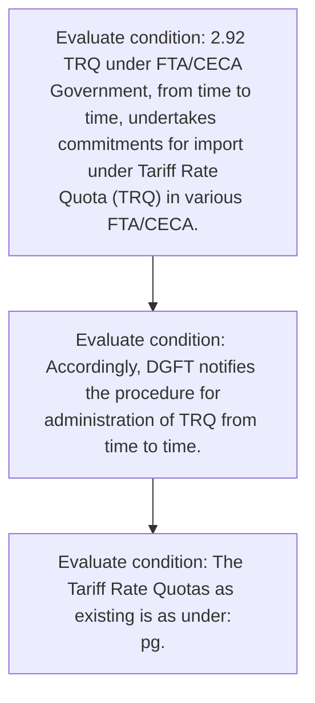
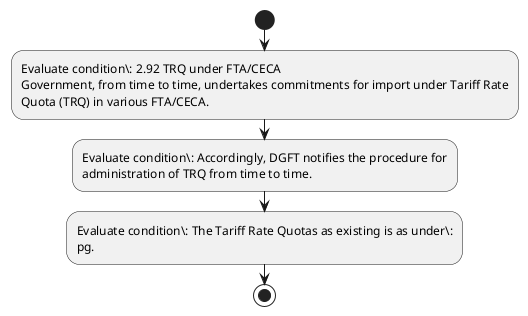

# Chapter 2 / Section 2.92: TRQ under FTA/CECA

**Chapter Title:** General Provisions Regarding Imports and Exports

**Pages:** 40, 41, 42, 43, 44, 45, 46, 47, 48, 49

**Purpose:** 2.92 TRQ under FTA/CECA
Government, from time to time, undertakes commitments for import under Tariff Rate
Quota (TRQ) in various FTA/CECA.

**Purpose Thanglish:** Indha TRQ under FTA/CECA section-la, 2.92 TRQ under FTA/CECA
Government, from time to time, undertakes commitments for import under Tariff Rate
Quota (TRQ) in various FTA/CECA.

**Summary:** 2.92 TRQ under FTA/CECA
Government, from time to time, undertakes commitments for import under Tariff Rate
Quota (TRQ) in various FTA/CECA. Accordingly, DGFT notifies the procedure for
administration of TRQ from time to time. The Tariff Rate Quotas as existing is as under:
pg.

**Business Meaning:** TRQ under FTA/CECA governs how DGFT business controls should be applied, validated, and enforced.

**Business Explanation:** TRQ under FTA/CECA explains the operating rule set that DEKAI should enforce. Key control points include 57
on < average MT) MT) MT) ng Avera ge of ge of g
6mm volume) Aver ge of Years Years Avera
age Years 4 to 6 5 to 7 ge of
of 3 to 5 in MT) in MT) Years
Years in MT) 6 to 8
Welding 2 to in
wire of 4 in MT)
74 copper, MT)
08 cross
19 sectional 5
20 dimensi
on <
6mm
Other
wire of
74 refined
08 copper,
19 cross 5
90 sectional
dimensi
on <
6mm
Imports of Items under the TRQ of the India- Aus ECTA
HS code Item Description In Quota rate TRQ Quantity TRQ Quantity
(%) for Calendar Calendar Year
year 2022 2023 onwards
07134000 Lentils 50% of the
applied 1,233 MTs 1,50,000 MTs
rate of duty
08021100 In shell almonds 50% of the
08021200 Shelled almonds applied 279 MTs 34,000 MTs
rate of duty
08051000 Oranges 50% of the
08052100 Mandarins (including tangerines applied 113 MTs 13,700 MTs
& satsumas) rate of duty
08083000 Pears 50% of the
applied 30 MTs 3,700 MTs
rate of duty
52010020 Extra Long Staple Cotton of 0% duty
419 MTs 51,000 MTs
minimum 28 mm staple length
# Imports will be permitted subject to the arrangements / Procedure as laid down in
Annexure-I, II & III, IV & V of Appendix-2A.

**Business Explanation Thanglish:** Indha TRQ under FTA/CECA section-la, TRQ under FTA/CECA explains the operating rule set that DEKAI should enforce. Key control points include 57
on < average MT) MT) MT) ng Avera ge of ge of g
6mm volume) Aver ge of Years Years Avera
age Years 4 to 6 5 to 7 ge of
of 3 to 5 in MT) in MT) Years
Years in MT) 6 to 8
Welding 2 to in
wire of 4 in MT)
74 copper, MT)
08 cross
19 sectional 5
20 dimensi
on <
6mm
Other
wire of
74 refined
08 copper,
19 cross 5
90 sectional
dimensi
on <
6mm
Imports of Items under the TRQ of the India- Aus ECTA
HS code Item Description In Quota rate TRQ Quantity TRQ Quantity
(%) for Calendar Calendar Year
year 2022 2023 onwards
07134000 Lentils 50% of the
applied 1,233 MTs 1,50,000 MTs
rate of duty
08021100 In shell almonds 50% of the
08021200 Shelled almonds applied 279 MTs 34,000 MTs
rate of duty
08051000 Oranges 50% of the
08052100 Mandarins (including tangerines applied 113 MTs 13,700 MTs
& satsumas) rate of duty
08083000 Pears 50% of the
applied 30 MTs 3,700 MTs
rate of duty
52010020 Extra Long Staple Cotton of 0% duty
419 MTs 51,000 MTs
minimum 28 mm staple length
# Imports will be permitted subject to the arrangements / Procedure as laid down in
Annexure-I, II & III, IV & V of Appendix-2A.

## Business Logic
- 57
on < average MT) MT) MT) ng Avera ge of ge of g
6mm volume) Aver ge of Years Years Avera
age Years 4 to 6 5 to 7 ge of
of 3 to 5 in MT) in MT) Years
Years in MT) 6 to 8
Welding 2 to in
wire of 4 in MT)
74 copper, MT)
08 cross
19 sectional 5
20 dimensi
on <
6mm
Other
wire of
74 refined
08 copper,
19 cross 5
90 sectional
dimensi
on <
6mm
Imports of Items under the TRQ of the India- Aus ECTA
HS code Item Description In Quota rate TRQ Quantity TRQ Quantity
(%) for Calendar Calendar Year
year 2022 2023 onwards
07134000 Lentils 50% of the
applied 1,233 MTs 1,50,000 MTs
rate of duty
08021100 In shell almonds 50% of the
08021200 Shelled almonds applied 279 MTs 34,000 MTs
rate of duty
08051000 Oranges 50% of the
08052100 Mandarins (including tangerines applied 113 MTs 13,700 MTs
& satsumas) rate of duty
08083000 Pears 50% of the
applied 30 MTs 3,700 MTs
rate of duty
52010020 Extra Long Staple Cotton of 0% duty
419 MTs 51,000 MTs
minimum 28 mm staple length
# Imports will be permitted subject to the arrangements / Procedure as laid down in
Annexure-I, II & III, IV & V of Appendix-2A.
- 58
74
08
19
20 | Welding
wire of
copper,
cross
sectional
dimensi
on <
6mm | | 5 | | |
74
08
19
90 | Other
wire of
refined
copper,
cross
sectional
dimensi
on <
6mm | | 5 | | |
Imports of Items under the TRQ of the India- Aus ECTA | | | | | |
HS code | | Item Description | | In Quota rate
(%) | TRQ Quantity
for Calendar
year 2022 | TRQ Quantity
Calendar Year
2023 onwards
07134000 | | Lentils | | 50% of the
applied
rate of duty | 1,233 MTs | 1,50,000 MTs
08021100 | | In shell almonds | | 50% of the
applied
rate of duty | 279 MTs | 34,000 MTs
08021200 | | Shelled almonds | | | |
08051000 | | Oranges | | 50% of the
applied
rate of duty | 113 MTs | 13,700 MTs
08052100 | | Mandarins (including tangerines
& satsumas) | | | |
08083000 | | Pears | | 50% of the
applied
rate of duty | 30 MTs | 3,700 MTs
52010020 | | Extra Long Staple Cotton of
minimum 28 mm staple length | | 0% duty | 419 MTs | 51,000 MTs
on <
average
6mm
volume)
Welding
74
wire of
copper,
08 cross
5
19 sectional
20 dimensi
on <
6mm
Other
wire of
74 refined
08 copper,
5
19 cross
90 sectional
dimensi
on <
6mm
MT)
MT)
MT)
ng
Avera
ge of ge of
g
Aver ge of
Years Years Avera
age Years 4 to 6 5 to 7 ge of
of 3 to 5 in MT) in MT) Years
Years in MT)
6 to 8
2 to
in
4 in
MT)
MT)
Imports of Items under the TRQ of the India- Aus ECTA
HS code
Item Description
In Quota rate TRQ Quantity TRQ Quantity
(%)
for Calendar
Calendar Year
year 2022
2023 onwards
07134000 Lentils
50% of the
applied
1,233 MTs
1,50,000 MTs
rate of duty
08021100 In shell almonds
50% of the
08021200 Shelled almonds
applied
279 MTs
34,000 MTs
rate of duty
08051000 Oranges
50% of the
08052100 Mandarins (including tangerines applied
113 MTs
13,700 MTs
& satsumas)
rate of duty
08083000 Pears
50% of the
applied
30 MTs
3,700 MTs
rate of duty
52010020 Extra Long Staple Cotton of
0% duty
419 MTs
51,000 MTs
minimum 28 mm staple length
# Imports will be permitted subject to the arrangements / Procedure as laid down in
Annexure-I, II & III, IV & V of Appendix-2A.

## Business Rules
- rule_id=CH2-SEC2_92-R001, rule_description=57
on < average MT) MT) MT) ng Avera ge of ge of g
6mm volume) Aver ge of Years Years Avera
age Years 4 to 6 5 to 7 ge of
of 3 to 5 in MT) in MT) Years
Years in MT) 6 to 8
Welding 2 to in
wire of 4 in MT)
74 copper, MT)
08 cross
19 sectional 5
20 dimensi
on <
6mm
Other
wire of
74 refined
08 copper,
19 cross 5
90 sectional
dimensi
on <
6mm
Imports of Items under the TRQ of the India- Aus ECTA
HS code Item Description In Quota rate TRQ Quantity TRQ Quantity
(%) for Calendar Calendar Year
year 2022 2023 onwards
07134000 Lentils 50% of the
applied 1,233 MTs 1,50,000 MTs
rate of duty
08021100 In shell almonds 50% of the
08021200 Shelled almonds applied 279 MTs 34,000 MTs
rate of duty
08051000 Oranges 50% of the
08052100 Mandarins (including tangerines applied 113 MTs 13,700 MTs
& satsumas) rate of duty
08083000 Pears 50% of the
applied 30 MTs 3,700 MTs
rate of duty
52010020 Extra Long Staple Cotton of 0% duty
419 MTs 51,000 MTs
minimum 28 mm staple length
# Imports will be permitted subject to the arrangements / Procedure as laid down in
Annexure-I, II & III, IV & V of Appendix-2A., trigger=TRQ under FTA/CECA, condition=2.92 TRQ under FTA/CECA
Government, from time to time, undertakes commitments for import under Tariff Rate
Quota (TRQ) in various FTA/CECA., validation=Not explicitly covered in uploaded documents., action=Manual review required., exception=No explicit exception found in uploaded documents., output=DEKAI should produce a compliance decision for 2.92 - TRQ under FTA/CECA.
- rule_id=CH2-SEC2_92-R002, rule_description=58
74
08
19
20 | Welding
wire of
copper,
cross
sectional
dimensi
on <
6mm | | 5 | | |
74
08
19
90 | Other
wire of
refined
copper,
cross
sectional
dimensi
on <
6mm | | 5 | | |
Imports of Items under the TRQ of the India- Aus ECTA | | | | | |
HS code | | Item Description | | In Quota rate
(%) | TRQ Quantity
for Calendar
year 2022 | TRQ Quantity
Calendar Year
2023 onwards
07134000 | | Lentils | | 50% of the
applied
rate of duty | 1,233 MTs | 1,50,000 MTs
08021100 | | In shell almonds | | 50% of the
applied
rate of duty | 279 MTs | 34,000 MTs
08021200 | | Shelled almonds | | | |
08051000 | | Oranges | | 50% of the
applied
rate of duty | 113 MTs | 13,700 MTs
08052100 | | Mandarins (including tangerines
& satsumas) | | | |
08083000 | | Pears | | 50% of the
applied
rate of duty | 30 MTs | 3,700 MTs
52010020 | | Extra Long Staple Cotton of
minimum 28 mm staple length | | 0% duty | 419 MTs | 51,000 MTs
on <
average
6mm
volume)
Welding
74
wire of
copper,
08 cross
5
19 sectional
20 dimensi
on <
6mm
Other
wire of
74 refined
08 copper,
5
19 cross
90 sectional
dimensi
on <
6mm
MT)
MT)
MT)
ng
Avera
ge of ge of
g
Aver ge of
Years Years Avera
age Years 4 to 6 5 to 7 ge of
of 3 to 5 in MT) in MT) Years
Years in MT)
6 to 8
2 to
in
4 in
MT)
MT)
Imports of Items under the TRQ of the India- Aus ECTA
HS code
Item Description
In Quota rate TRQ Quantity TRQ Quantity
(%)
for Calendar
Calendar Year
year 2022
2023 onwards
07134000 Lentils
50% of the
applied
1,233 MTs
1,50,000 MTs
rate of duty
08021100 In shell almonds
50% of the
08021200 Shelled almonds
applied
279 MTs
34,000 MTs
rate of duty
08051000 Oranges
50% of the
08052100 Mandarins (including tangerines applied
113 MTs
13,700 MTs
& satsumas)
rate of duty
08083000 Pears
50% of the
applied
30 MTs
3,700 MTs
rate of duty
52010020 Extra Long Staple Cotton of
0% duty
419 MTs
51,000 MTs
minimum 28 mm staple length
# Imports will be permitted subject to the arrangements / Procedure as laid down in
Annexure-I, II & III, IV & V of Appendix-2A., trigger=TRQ under FTA/CECA, condition=Accordingly, DGFT notifies the procedure for
administration of TRQ from time to time., validation=Not explicitly covered in uploaded documents., action=Manual review required., exception=No explicit exception found in uploaded documents., output=DEKAI should produce a compliance decision for 2.92 - TRQ under FTA/CECA.

## Conditions
- 2.92 TRQ under FTA/CECA
Government, from time to time, undertakes commitments for import under Tariff Rate
Quota (TRQ) in various FTA/CECA.
- Accordingly, DGFT notifies the procedure for
administration of TRQ from time to time.
- The Tariff Rate Quotas as existing is as under:
pg.
- (i)
Preferential and
(ii)
Non preferential
2.92 TRQ under FTA/CECA
Government, from time to time, undertakes commitments for import under Tariff Rate
Quota (TRQ) in various FTA/CECA.
- In/out In/out Notification TRQ
of of
quota quota
rate rate
(%) as (%)
per As per
WTO Indian
Tariff
Crude soya oil from 1507 10 00 - 10% 57/2009 dated 30,000 MT
Paraguay under 30/05/2009
India- Mercosur
Trade
Agreement
Vanaspati, bakery 1516, 1517 - - No.2/2007Customs *2,50,000
shortening and or 1518 dated 5 th January 2007 MT
margarine (other than
from Sri Lanka 15161000,
15171010,
15179030
and
15180040
which are
prohibited
for import)
Pepper from Sri 0904 - - No.2/2007Customs *2500 MT
Lanka dated 5 January 2007
th
Desiccated Coconut 08011100 - - No.2/2007Customs *500 MT
from Sri Lanka dated 5
th
January
2007
Articles of apparel 61, 62 - 5%/10 26/2000-Cus List 3 8 million
and clothing % pieces
accessories
imported from Sri
Lanka
Tea and preparagra 2101 - 15%/30 26/2000-Cus List 4 15 million
phtions thereof % kgs.
- | In/out
of
quota
rate
(%) as
per
WTO | In/out
of
quota
rate
(%)
As per
Indian
Tariff | Notification | TRQ
Crude soya oil from
Paraguay under
India- Mercosur
Trade
Agreement | 1507 10 00 | - | 10% | 57/2009 dated
30/05/2009 | 30,000 MT
Vanaspati, bakery
shortening and
margarine
from Sri Lanka | 1516, 1517
or 1518
(other than
15161000,
15171010,
15179030
and
15180040
which are
prohibited
for import) | - | - | No.2/2007Customs
dated 5 January 2007
th | *2,50,000
MT
Pepper from Sri
Lanka | 0904 | - | - | No.2/2007Customs
dated 5 January 2007
th | *2500 MT
Desiccated Coconut
from Sri Lanka | 08011100 | - | - | No.2/2007Customs
dated 5 January
th
2007 | *500 MT
Articles of apparel
and clothing
accessories
imported from Sri
Lanka | 61, 62 | - | 5%/10
% | 26/2000-Cus List 3 | 8 million
pieces
Tea and preparagra
phtions thereof
imported from Sri
Lanka | 2101 | - | 15%/30
% | 26/2000-Cus List 4 | 15 million
kgs.
- In/out
In/out
Notification
TRQ
of
of
quota
quota
rate
rate
(%) as
(%)
per
As per
WTO
Indian
Tariff
Crude soya oil from 1507 10 00
-
10%
57/2009 dated
30,000 MT
Paraguay under
30/05/2009
India- Mercosur
Trade
Agreement
Vanaspati, bakery
1516, 1517
-
-
No.2/2007Customs
*2,50,000
shortening and
or 1518
dated 5th January 2007
MT
margarine
(other than
from Sri Lanka
15161000,
15171010,
15179030
and
15180040
which are
prohibited
for import)
Pepper from Sri
0904
-
-
No.2/2007Customs
*2500 MT
Lanka
dated 5th January 2007
Desiccated Coconut 08011100
-
-
No.2/2007Customs
*500 MT
from Sri Lanka
dated 5th January
2007
Articles of apparel
61, 62
-
5%/10
26/2000-Cus List 3
8 million
and clothing
%
pieces
accessories
imported from Sri
Lanka
Tea and preparagra 2101
-
15%/30
26/2000-Cus List 4
15 million
phtions thereof
%
kgs.
- litres
Fruit Wine: Other 22060000 - 0% 5000 litres
fermented
beverages
(for example,
cider, perry, mead,
sake);mixtures of
fermented
beverages and
mixtures of
fermented
beverages and non-
alcoholic
beverages, not
elsewhere specified
or included.
- | 22030000 | - | 25% | | 2,000,000
litres
Fruit Wine: Other
fermented
beverages
(for example,
cider, perry, mead,
sake);mixtures of
fermented
beverages and
mixtures of
fermented
beverages and non-
alcoholic
beverages, not
elsewhere specified
or included.
- litres
Fruit Wine: Other
22060000
-
0%
5000 litres
fermented
beverages
(for example,
cider, perry, mead,
sake);mixtures
of
fermented
beverages
and
mixtures
of
fermented
beverages and non-
alcoholic
beverages,
not
elsewhere specified
or included.
- 6104; above
6105; Notification
6106;
6109;6110;
6111; 6112
6203;
6304;
The following items are permitted under the TRQ under India-UAE CEPA#
HS Effect Tariff
8 Descript ive
Modality Schedule of Tariff Rate Concessions (%)
Co ion Rate
de (%) Offered
Linear
low-
density
polyethy
lene
(LLDPE)
, in
which
39 ethylene
01 monome 7.5
10 r unit TR of 3.75
10 contribu 50% in 5 7.0 6.5 6.0 5.0 3.75 3.75 3.75 3.75 3.75
tes 95% years
or more with (TRQ (TRQ (TRQ (TRQ (TRQ (TRQ (TRQ - (TRQ - (TRQ - (TRQ
by specified - - - - - - 105,0 105,0 105,0 -
weight year- 45,00 50,50 56,00 61,50 67,50 86,30 00 00 00 105,0
of the wise 0 0 0 0 0 0 MT) MT) MT) 00
total TRQs MT) MT) MT) MT) MT) MT) MT)
polymer
content
39 Low
01 density
7.5
polyethy
10
lene
20
(LDPE)
39 Other
1 Polyethy 7.5
10 lene
pg.
- 52
22084092 | - | 0% |
6102;
6103;
6104;
6105;
6106;
6109;6110;
6111; 6112
6203;
6304; | - | - | Details of the HS Codes
as in Table 3 of the
above
Notification
Effect |
| Modality
Other ----- other
22084092
-
0%
1.50
million
litres
Articles of Apparel
6102;
-
-
Details of the HS Codes 7.5 million
and Clothing
6103;
as in Table 3 of the
pieces$
Accessories.
- 6104;
above
6105;
Notification
6106;
6109;6110;
6111; 6112
6203;
6304;
The following items are permitted under the TRQ under India-UAE CEPA#
HS
Descript
Effect Tariff
8
ive
Modality
Schedule of Tariff Rate Concessions (%)
Co
ion
Rate
de
Linear
(%)
Offered
low-
density
polyethy
lene
(LLDPE)
, in
which
39 ethylene
01 monome
7.5
10 r unit
TR of
7.0
6.5
6.0
5.0
3.75
3.75
3.75
10 contribu
50% in 5
3.75
3.75
3.75
tes 95%
years
(TRQ (TRQ (TRQ (TRQ (TRQ
(TRQ
or more
with
(TRQ (TRQ - (TRQ - (TRQ -
by
specified -
-
-
-
-
-
105,0 105,0 105,0
-
weight
year-
45,00 50,50 56,00 61,50 67,50 86,30
00
00
00 105,0
of the
wise
0
0
0
0
0
0
MT)
MT)
MT)
00
total
TRQs MT)
MT) MT) MT) MT) MT)
MT)
polymer
content
39 Low
01 density
7.5
polyethy
10 lene
20 (LDPE)
39 Other
1 Polyethy 7.5
10 lene
pg.
- 52
90 having a
specific
gravity
of less
than
0.94
TR of 3.75 3.75
Polyethy 50% in 5 7.0 6.5 6.0 5.0 3.75 3.75 3.75 3.75
39 lene years (
01 having a with (TRQ (TRQ (TRQ (TRQ (TRQ (TRQ (TRQ - (TRQ - TRQ - (TRQ
20 specific 7.5 specified - - - - - - 285,0 285,0 285,0 -
gravity 150,0 168,0 186,0 204,0 285,0
00 of 0.94 year- 00 00 00 00 222,0 252,0 00 00 00 00
wise 00 00 MT) MT) MT)
or more TRQs MT) MT) MT) MT) MT) MT) MT)
Linear
low-
density
polyethy
lene
(LLDPE)
, in
which
39 ethylene
01 monome 7.5
40 r unit
10 contribu
tes less TR of
than 95 50% in 5 7.0 6.5 6.0 5.0 3.75 3.75 3.75 3.75 3.75 3.75
% by years
weight with (TRQ (TRQ (TRQ (TRQ (TRQ (TRQ ( (TRQ - (TRQ - (TRQ
of the specified - - - - - - TRQ - 105,0 105,0 -
total year- 45,00 50,50 56,00 61,50 67,50 86,30 105,0 00 00 105,0
0 0 0 0 0 0 00 00
polymer wise MT) MT) MT) MT) MT) MT) MT) MT) MT) MT)
content TRQs
Other
Ethylene
-alpha-
olefin
39 copolym
01 ers,
40 having a 7.5
90 specific
gravity
of less
than
0.94
pg.
- 53
39
01
20
00 | Polyethy
lene
having a
specific
gravity
of 0.94
or more | 7.5 | TR of
50% in 5
years
with
specified
year-
wise
TRQs | 7.0
(TRQ
-
150,0
00
MT) | 6.5
(TRQ
-
168,0 1
00
MT) | 6.0
(TRQ (
-
86,0 2
00
MT) | 5.0
TRQ
-
04,0
00
MT) | 3.75
(TR
-
222,0
00
MT) | 3.75
Q (TRQ
-
252,0
00
MT) | 3.75
(TRQ
285,0
00
MT) | 3.75
- (TRQ
285,0
00
MT) | 3.75
(
- TRQ -
285,0
00
MT) | 3.75
(TRQ
-
285,0
00
MT)
39
01
40
10 | Linear
low-
density
polyethy
lene
(LLDPE)
, in
which
ethylene
monome
r unit
contribu
tes less
than 95
% by
weight
of the
total
polymer
content | 7.5 | TR of
50% in 5
years
with
specified
year-
wise
TRQs | 7.0
(TRQ
-
45,00
0
MT) | 6.5
(TRQ
-
50,50
0
MT) | 6.0
(TRQ (
-
56,00
0
MT) | 5.0
TRQ (
-
61,50
0
MT) | 3.75
TRQ (
-
67,50
0
MT) | 3.75
TRQ
-
86,30
0
MT) | 3.75
(
TRQ -
105,0
00
MT) | 3.75
(TRQ -
105,0
00
MT) | 3.75
(TRQ -
105,0
00
MT) | 3.75
(TRQ
-
105,0
00
MT)
39
01
40
90 | Other
Ethylene
-alpha-
olefin
copolym
ers,
having a
specific
gravity
of less
than
0.94 | 7.5 | | | | | | | | | | |
90 having a
specific
gravity
of less
than
0.94
Polyethy
TR of
7.0
6.5
6.0
5.0
3.75
3.75
3.75
3.75
50% in 5
3.75
3.75
39 lene
years
(TRQ (TRQ (TRQ (TRQ
(
(TRQ
01 having a
with
(TRQ (TRQ (TRQ - (TRQ - TRQ -
20 specific
7.5 specified
-
-
-
-
-
-
285,0 285,0 285,0
-
00
gravity
year-
150,0 168,0 186,0 204,0
222,0 252,0
00
00
00
285,0
of 0.94
00 00
00
00
00
or more
wise
MT) MT)
MT) MT)
00
00
MT)
MT)
MT)
MT)
TRQs
MT)
MT)
Linear
low-
density
polyethy
lene
(LLDPE)
, in
which
39 ethylene
01 monome
7.5
40 r unit
10 contribu
tes less
TR of
7.0
6.5
6.0
5.0
3.75 3.75 3.75
3.75
than 95
50% in 5
3.75
3.75
% by
years
(TRQ (TRQ (TRQ (TRQ (TRQ (TRQ
(
(TRQ
weight
with
(TRQ - (TRQ -
of the
specified
-
-
-
-
-
- TRQ - 105,0 105,0
-
total
year-
45,00 50,50 56,00 61,50 67,50 86,30 105,0
00
00 105,0
polymer
wise
0
0
0
0
0
0
00
MT)
MT)
00
MT) MT) MT)
MT) MT)
MT) MT)
MT)
content
TRQs
Other
Ethylene
-alpha-
olefin
39 copolym
01 ers,
7.5
40 having a
90 specific
gravity
of less
than
0.94
pg.
- 55
resin
Other
Polymer
s of vinyl 7 6.5 6 5 3.75 3.75 3.75 3.75 3.75 3.75
chloride
39 or of
04 other
7.5
90 halogen
90 ated
olefins,
in
primary
forms
71 Non-
08 monetar 10
11 y gold
00 powder 1% 1% 1% 1% 1% 1%
absol absol absol absol absol absol 1% 1% 1% 1%
TR ute ute ute ute ute ute absolu absolu absolu absol
Other (Tariff duty duty duty duty duty duty te te te ute
71 unwrou concessi reduc reduc reduc reduc reduc reduc duty duty duty duty
08 ght on/relief tion tion tion tion tion tion reduct reduct reduct reduc
12 forms of 10 of 1% in over over over over over over ion ion ion tion
00 non- absolute the the the the the the over over over over
monetar percenta appli appli appli appli appli appli the the the the
y gold ge terms, ed ed ed ed ed ed applie applie applie applie
TRQ of d d d d
rate rate rate rate rate rate
200 tons rate(T rate(T rate(T rate(T
Other phased (TRQ (TRQ (TRQ (TRQ (TRQ (TRQ RQ of RQ of RQ of RQ of
semi- of of of of of of
in 5 200 200 200 200
71 manufac years) 120 140 160 180 200 200 tonne tonne tonne tonne
08 tured 10 tonne tonn tonne tonne tonne tonne s) s) s) s)
13 forms of s) es) s) s) s) s)
00 non-
monetar
y gold
Articles
71 of
13 jeweller
y of 20
19 gold, 19 18 17 16 15 15 15 15 15 15
10 unstudd TR (TRQ (TRQ (TRQ (TRQ (TRQ (TRQ (TR (TRQ (TRQ (TRQ (TRQ
of 2.5 of of of of of Q of of of of of
ed
Tonnes) 2100 2200 2300 2400 2500 2500 2500 2500 2500 2500
71 Articles kg) kg) kg) kg) kg) kg) kg) kg) kg) kg)
13 of
19 jeweller 20
y of
20 gold, set
pg.
- 56
39
04
90
90 | Other
Polymer
s of vinyl
chloride
or of
other
halogen
ated
olefins,
in
primary
forms | 7.5 | | 7 | 6.5 | 6 | 5 | 3.75 | 3.75 | 3.75 | 3.75 | 3.75 | 3.75
71
08
11
00 | Non-
monetar
y gold
powder | 10 | TR
(Tariff
concessi
on/relief
of 1% in
absolute
percenta
ge terms,
TRQ of
200 tons
phased
in 5
years) | 1%
absol
ute
duty
reduc
tion
over
the
appli
ed
rate
(TRQ
of
120
tonne
s) | 1%
absol
ute
duty
reduc
tion
over
the
appli
ed
rate
(TRQ
of
140
tonn
es) | 1%
absol
ute
duty
reduc
tion
over
the
appli
ed
rate
(TRQ
of
160
tonne
s) | 1%
absol
ute
duty
reduc
tion
over
the
appli
ed
rate
(TRQ
of
180
tonne
s) | 1%
absol
ute
duty
reduc
tion
over
the
appli
ed
rate
(TRQ
of
200
tonne
s) | 1%
absol
ute
duty
reduc
tion
over
the
appli
ed
rate
(TRQ
of
200
tonne
s) | 1%
absolu
te
duty
reduct
ion
over
the
applie
d
rate(T
RQ of
200
tonne
s) | 1%
absolu
te
duty
reduct
ion
over
the
applie
d
rate(T
RQ of
200
tonne
s) | 1%
absolu
te
duty
reduct
ion
over
the
applie
d
rate(T
RQ of
200
tonne
s) | 1%
absol
ute
duty
reduc
tion
over
the
applie
d
rate(T
RQ of
200
tonne
s)
71
08
12
00 | Other
unwrou
ght
forms of
non-
monetar
y gold | 10 | | | | | | | | | | |
71
08
13
00 | Other
semi-
manufac
tured
forms of
non-
monetar
y gold | 10 | | | | | | | | | | |
71
13
19
10 | Articles
of
jeweller
y of
gold,
unstudd
ed | 20 | TR (TRQ
of 2.5
Tonnes) | 19
(TRQ
of
2100
kg) | 18
(TRQ
of
2200
kg) | 17
(TRQ
of
2300
kg) | 16
(TRQ
of
2400
kg) | 15
(TRQ
of
2500
kg) | 15
(TR
Q of
2500
kg) | 15
(TRQ
of
2500
kg) | 15
(TRQ
of
2500
kg) | 15
(TRQ
of
2500
kg) | 15
(TRQ
of
2500
kg)
71
13
19
20 | Articles
of
jeweller
y of
gold, set | 20 | | | | | | | | | | |
resin
Other
Polymer
s of vinyl
7
6.5
6
5
3.75
3.75
3.75
3.75
3.75
3.75
chloride
39or of
04other
7.5
90halogen
90ated
olefins,
in
primary
forms
71Non-
08monetar
10
11y gold
00powder
1%
1%
1%
1%
1%
1%
1%
1%
1%
1%
TR
absol absol absol absol absol absol
ute
ute
ute
ute
ute
ute absolu absolu absolu absol
Other
(Tariff
duty duty duty duty duty duty
te
te
te
ute
71unwrou
concessi reduc reduc reduc reduc reduc reduc duty
duty
duty
duty
08ght
on/relief tion tion tion tion
tion tion reduct reduct reduct reduc
12forms of
10 of 1% in over over over over over over
ion
ion
ion
tion
00non-
absolute the
the
the
the
the
the
over
over
over
over
monetar
percenta appli appli appli appli appli appli
the
the
the
the
y gold
ge terms,
ed
ed
ed
ed
ed
ed
applie applie applie applie
TRQ of
rate rate rate rate rate rate
d
d
d
d
200 tons
rate(T rate(T rate(T rate(T
Other
(TRQ (TRQ (TRQ (TRQ (TRQ (TRQ
phased
RQ of RQ of RQ of RQ of
semi-
in 5
of
of
of
of
of
of
200
200
200
200
71manufac
120 140 160
180
200 200
10
years)
tonne tonne tonne tonne
08tured
tonne tonn tonne tonne tonne tonne
s)
s)
s)
s)
13forms of
s)
es)
s)
s)
s)
s)
00non-
monetar
y gold
Articles
71of
13jeweller
19
y of
20
19
18
17
16
15
15
15
15
15
15
gold,
10unstudd
TR (TRQ (TRQ (TRQ (TRQ (TRQ (TRQ (TR (TRQ (TRQ (TRQ (TRQ
ed
of 2.5
of
of
of
of
of
Q of
of
of
of
of
Tonnes) 2100 2200 2300 2400 2500 2500 2500 2500 2500 2500
Articles
71
kg)
kg)
kg)
kg)
kg)
kg)
kg)
kg)
kg)
kg)
13of
20
19jeweller
20
y of
gold, set
pg.
- 57
on < average MT) MT) MT) ng Avera ge of ge of g
6mm volume) Aver ge of Years Years Avera
age Years 4 to 6 5 to 7 ge of
of 3 to 5 in MT) in MT) Years
Years in MT) 6 to 8
Welding 2 to in
wire of 4 in MT)
74 copper, MT)
08 cross
19 sectional 5
20 dimensi
on <
6mm
Other
wire of
74 refined
08 copper,
19 cross 5
90 sectional
dimensi
on <
6mm
Imports of Items under the TRQ of the India- Aus ECTA
HS code Item Description In Quota rate TRQ Quantity TRQ Quantity
(%) for Calendar Calendar Year
year 2022 2023 onwards
07134000 Lentils 50% of the
applied 1,233 MTs 1,50,000 MTs
rate of duty
08021100 In shell almonds 50% of the
08021200 Shelled almonds applied 279 MTs 34,000 MTs
rate of duty
08051000 Oranges 50% of the
08052100 Mandarins (including tangerines applied 113 MTs 13,700 MTs
& satsumas) rate of duty
08083000 Pears 50% of the
applied 30 MTs 3,700 MTs
rate of duty
52010020 Extra Long Staple Cotton of 0% duty
419 MTs 51,000 MTs
minimum 28 mm staple length
# Imports will be permitted subject to the arrangements / Procedure as laid down in
Annexure-I, II & III, IV & V of Appendix-2A.
- 58
74
08
19
20 | Welding
wire of
copper,
cross
sectional
dimensi
on <
6mm | | 5 | | |
74
08
19
90 | Other
wire of
refined
copper,
cross
sectional
dimensi
on <
6mm | | 5 | | |
Imports of Items under the TRQ of the India- Aus ECTA | | | | | |
HS code | | Item Description | | In Quota rate
(%) | TRQ Quantity
for Calendar
year 2022 | TRQ Quantity
Calendar Year
2023 onwards
07134000 | | Lentils | | 50% of the
applied
rate of duty | 1,233 MTs | 1,50,000 MTs
08021100 | | In shell almonds | | 50% of the
applied
rate of duty | 279 MTs | 34,000 MTs
08021200 | | Shelled almonds | | | |
08051000 | | Oranges | | 50% of the
applied
rate of duty | 113 MTs | 13,700 MTs
08052100 | | Mandarins (including tangerines
& satsumas) | | | |
08083000 | | Pears | | 50% of the
applied
rate of duty | 30 MTs | 3,700 MTs
52010020 | | Extra Long Staple Cotton of
minimum 28 mm staple length | | 0% duty | 419 MTs | 51,000 MTs
on <
average
6mm
volume)
Welding
74
wire of
copper,
08 cross
5
19 sectional
20 dimensi
on <
6mm
Other
wire of
74 refined
08 copper,
5
19 cross
90 sectional
dimensi
on <
6mm
MT)
MT)
MT)
ng
Avera
ge of ge of
g
Aver ge of
Years Years Avera
age Years 4 to 6 5 to 7 ge of
of 3 to 5 in MT) in MT) Years
Years in MT)
6 to 8
2 to
in
4 in
MT)
MT)
Imports of Items under the TRQ of the India- Aus ECTA
HS code
Item Description
In Quota rate TRQ Quantity TRQ Quantity
(%)
for Calendar
Calendar Year
year 2022
2023 onwards
07134000 Lentils
50% of the
applied
1,233 MTs
1,50,000 MTs
rate of duty
08021100 In shell almonds
50% of the
08021200 Shelled almonds
applied
279 MTs
34,000 MTs
rate of duty
08051000 Oranges
50% of the
08052100 Mandarins (including tangerines applied
113 MTs
13,700 MTs
& satsumas)
rate of duty
08083000 Pears
50% of the
applied
30 MTs
3,700 MTs
rate of duty
52010020 Extra Long Staple Cotton of
0% duty
419 MTs
51,000 MTs
minimum 28 mm staple length
# Imports will be permitted subject to the arrangements / Procedure as laid down in
Annexure-I, II & III, IV & V of Appendix-2A.

## Condition Logic
- id=2.2.92.1, if=2.92 TRQ under FTA/CECA
Government, from time to time, undertakes commitments for import under Tariff Rate
Quota (TRQ) in various FTA/CECA., then=Route for review, source=2.92 TRQ under FTA/CECA
Government, from time to time, undertakes commitments for import under Tariff Rate
Quota (TRQ) in various FTA/CECA.
- id=2.2.92.2, if=Accordingly, DGFT notifies the procedure for
administration of TRQ from time to time., then=Route for review, source=Accordingly, DGFT notifies the procedure for
administration of TRQ from time to time.
- id=2.2.92.3, if=The Tariff Rate Quotas as existing is as under:
pg., then=Route for review, source=The Tariff Rate Quotas as existing is as under:
pg.
- id=2.2.92.4, if=(i)
Preferential and
(ii)
Non preferential
2.92 TRQ under FTA/CECA
Government, from time to time, undertakes commitments for import under Tariff Rate
Quota (TRQ) in various FTA/CECA., then=Route for review, source=(i)
Preferential and
(ii)
Non preferential
2.92 TRQ under FTA/CECA
Government, from time to time, undertakes commitments for import under Tariff Rate
Quota (TRQ) in various FTA/CECA.
- id=2.2.92.5, if=In/out In/out Notification TRQ
of of
quota quota
rate rate
(%) as (%)
per As per
WTO Indian
Tariff
Crude soya oil from 1507 10 00 - 10% 57/2009 dated 30,000 MT
Paraguay under 30/05/2009
India- Mercosur
Trade
Agreement
Vanaspati, bakery 1516, 1517 - - No.2/2007Customs *2,50,000
shortening and or 1518 dated 5 th January 2007 MT
margarine (other than
from Sri Lanka 15161000,
15171010,
15179030
and
15180040
which are
prohibited
for import)
Pepper from Sri 0904 - - No.2/2007Customs *2500 MT
Lanka dated 5 January 2007
th
Desiccated Coconut 08011100 - - No.2/2007Customs *500 MT
from Sri Lanka dated 5
th
January
2007
Articles of apparel 61, 62 - 5%/10 26/2000-Cus List 3 8 million
and clothing % pieces
accessories
imported from Sri
Lanka
Tea and preparagra 2101 - 15%/30 26/2000-Cus List 4 15 million
phtions thereof % kgs., then=Route for review, source=In/out In/out Notification TRQ
of of
quota quota
rate rate
(%) as (%)
per As per
WTO Indian
Tariff
Crude soya oil from 1507 10 00 - 10% 57/2009 dated 30,000 MT
Paraguay under 30/05/2009
India- Mercosur
Trade
Agreement
Vanaspati, bakery 1516, 1517 - - No.2/2007Customs *2,50,000
shortening and or 1518 dated 5 th January 2007 MT
margarine (other than
from Sri Lanka 15161000,
15171010,
15179030
and
15180040
which are
prohibited
for import)
Pepper from Sri 0904 - - No.2/2007Customs *2500 MT
Lanka dated 5 January 2007
th
Desiccated Coconut 08011100 - - No.2/2007Customs *500 MT
from Sri Lanka dated 5
th
January
2007
Articles of apparel 61, 62 - 5%/10 26/2000-Cus List 3 8 million
and clothing % pieces
accessories
imported from Sri
Lanka
Tea and preparagra 2101 - 15%/30 26/2000-Cus List 4 15 million
phtions thereof % kgs.
- id=2.2.92.6, if=| In/out
of
quota
rate
(%) as
per
WTO | In/out
of
quota
rate
(%)
As per
Indian
Tariff | Notification | TRQ
Crude soya oil from
Paraguay under
India- Mercosur
Trade
Agreement | 1507 10 00 | - | 10% | 57/2009 dated
30/05/2009 | 30,000 MT
Vanaspati, bakery
shortening and
margarine
from Sri Lanka | 1516, 1517
or 1518
(other than
15161000,
15171010,
15179030
and
15180040
which are
prohibited
for import) | - | - | No.2/2007Customs
dated 5 January 2007
th | *2,50,000
MT
Pepper from Sri
Lanka | 0904 | - | - | No.2/2007Customs
dated 5 January 2007
th | *2500 MT
Desiccated Coconut
from Sri Lanka | 08011100 | - | - | No.2/2007Customs
dated 5 January
th
2007 | *500 MT
Articles of apparel
and clothing
accessories
imported from Sri
Lanka | 61, 62 | - | 5%/10
% | 26/2000-Cus List 3 | 8 million
pieces
Tea and preparagra
phtions thereof
imported from Sri
Lanka | 2101 | - | 15%/30
% | 26/2000-Cus List 4 | 15 million
kgs., then=Route for review, source=| In/out
of
quota
rate
(%) as
per
WTO | In/out
of
quota
rate
(%)
As per
Indian
Tariff | Notification | TRQ
Crude soya oil from
Paraguay under
India- Mercosur
Trade
Agreement | 1507 10 00 | - | 10% | 57/2009 dated
30/05/2009 | 30,000 MT
Vanaspati, bakery
shortening and
margarine
from Sri Lanka | 1516, 1517
or 1518
(other than
15161000,
15171010,
15179030
and
15180040
which are
prohibited
for import) | - | - | No.2/2007Customs
dated 5 January 2007
th | *2,50,000
MT
Pepper from Sri
Lanka | 0904 | - | - | No.2/2007Customs
dated 5 January 2007
th | *2500 MT
Desiccated Coconut
from Sri Lanka | 08011100 | - | - | No.2/2007Customs
dated 5 January
th
2007 | *500 MT
Articles of apparel
and clothing
accessories
imported from Sri
Lanka | 61, 62 | - | 5%/10
% | 26/2000-Cus List 3 | 8 million
pieces
Tea and preparagra
phtions thereof
imported from Sri
Lanka | 2101 | - | 15%/30
% | 26/2000-Cus List 4 | 15 million
kgs.
- id=2.2.92.7, if=In/out
In/out
Notification
TRQ
of
of
quota
quota
rate
rate
(%) as
(%)
per
As per
WTO
Indian
Tariff
Crude soya oil from 1507 10 00
-
10%
57/2009 dated
30,000 MT
Paraguay under
30/05/2009
India- Mercosur
Trade
Agreement
Vanaspati, bakery
1516, 1517
-
-
No.2/2007Customs
*2,50,000
shortening and
or 1518
dated 5th January 2007
MT
margarine
(other than
from Sri Lanka
15161000,
15171010,
15179030
and
15180040
which are
prohibited
for import)
Pepper from Sri
0904
-
-
No.2/2007Customs
*2500 MT
Lanka
dated 5th January 2007
Desiccated Coconut 08011100
-
-
No.2/2007Customs
*500 MT
from Sri Lanka
dated 5th January
2007
Articles of apparel
61, 62
-
5%/10
26/2000-Cus List 3
8 million
and clothing
%
pieces
accessories
imported from Sri
Lanka
Tea and preparagra 2101
-
15%/30
26/2000-Cus List 4
15 million
phtions thereof
%
kgs., then=Route for review, source=In/out
In/out
Notification
TRQ
of
of
quota
quota
rate
rate
(%) as
(%)
per
As per
WTO
Indian
Tariff
Crude soya oil from 1507 10 00
-
10%
57/2009 dated
30,000 MT
Paraguay under
30/05/2009
India- Mercosur
Trade
Agreement
Vanaspati, bakery
1516, 1517
-
-
No.2/2007Customs
*2,50,000
shortening and
or 1518
dated 5th January 2007
MT
margarine
(other than
from Sri Lanka
15161000,
15171010,
15179030
and
15180040
which are
prohibited
for import)
Pepper from Sri
0904
-
-
No.2/2007Customs
*2500 MT
Lanka
dated 5th January 2007
Desiccated Coconut 08011100
-
-
No.2/2007Customs
*500 MT
from Sri Lanka
dated 5th January
2007
Articles of apparel
61, 62
-
5%/10
26/2000-Cus List 3
8 million
and clothing
%
pieces
accessories
imported from Sri
Lanka
Tea and preparagra 2101
-
15%/30
26/2000-Cus List 4
15 million
phtions thereof
%
kgs.
- id=2.2.92.8, if=litres
Fruit Wine: Other 22060000 - 0% 5000 litres
fermented
beverages
(for example,
cider, perry, mead,
sake);mixtures of
fermented
beverages and
mixtures of
fermented
beverages and non-
alcoholic
beverages, not
elsewhere specified
or included., then=Route for review, source=litres
Fruit Wine: Other 22060000 - 0% 5000 litres
fermented
beverages
(for example,
cider, perry, mead,
sake);mixtures of
fermented
beverages and
mixtures of
fermented
beverages and non-
alcoholic
beverages, not
elsewhere specified
or included.
- id=2.2.92.9, if=| 22030000 | - | 25% | | 2,000,000
litres
Fruit Wine: Other
fermented
beverages
(for example,
cider, perry, mead,
sake);mixtures of
fermented
beverages and
mixtures of
fermented
beverages and non-
alcoholic
beverages, not
elsewhere specified
or included., then=Route for review, source=| 22030000 | - | 25% | | 2,000,000
litres
Fruit Wine: Other
fermented
beverages
(for example,
cider, perry, mead,
sake);mixtures of
fermented
beverages and
mixtures of
fermented
beverages and non-
alcoholic
beverages, not
elsewhere specified
or included.
- id=2.2.92.10, if=litres
Fruit Wine: Other
22060000
-
0%
5000 litres
fermented
beverages
(for example,
cider, perry, mead,
sake);mixtures
of
fermented
beverages
and
mixtures
of
fermented
beverages and non-
alcoholic
beverages,
not
elsewhere specified
or included., then=Route for review, source=litres
Fruit Wine: Other
22060000
-
0%
5000 litres
fermented
beverages
(for example,
cider, perry, mead,
sake);mixtures
of
fermented
beverages
and
mixtures
of
fermented
beverages and non-
alcoholic
beverages,
not
elsewhere specified
or included.
- id=2.2.92.11, if=6104; above
6105; Notification
6106;
6109;6110;
6111; 6112
6203;
6304;
The following items are permitted under the TRQ under India-UAE CEPA#
HS Effect Tariff
8 Descript ive
Modality Schedule of Tariff Rate Concessions (%)
Co ion Rate
de (%) Offered
Linear
low-
density
polyethy
lene
(LLDPE)
, in
which
39 ethylene
01 monome 7.5
10 r unit TR of 3.75
10 contribu 50% in 5 7.0 6.5 6.0 5.0 3.75 3.75 3.75 3.75 3.75
tes 95% years
or more with (TRQ (TRQ (TRQ (TRQ (TRQ (TRQ (TRQ - (TRQ - (TRQ - (TRQ
by specified - - - - - - 105,0 105,0 105,0 -
weight year- 45,00 50,50 56,00 61,50 67,50 86,30 00 00 00 105,0
of the wise 0 0 0 0 0 0 MT) MT) MT) 00
total TRQs MT) MT) MT) MT) MT) MT) MT)
polymer
content
39 Low
01 density
7.5
polyethy
10
lene
20
(LDPE)
39 Other
1 Polyethy 7.5
10 lene
pg., then=Route for review, source=6104; above
6105; Notification
6106;
6109;6110;
6111; 6112
6203;
6304;
The following items are permitted under the TRQ under India-UAE CEPA#
HS Effect Tariff
8 Descript ive
Modality Schedule of Tariff Rate Concessions (%)
Co ion Rate
de (%) Offered
Linear
low-
density
polyethy
lene
(LLDPE)
, in
which
39 ethylene
01 monome 7.5
10 r unit TR of 3.75
10 contribu 50% in 5 7.0 6.5 6.0 5.0 3.75 3.75 3.75 3.75 3.75
tes 95% years
or more with (TRQ (TRQ (TRQ (TRQ (TRQ (TRQ (TRQ - (TRQ - (TRQ - (TRQ
by specified - - - - - - 105,0 105,0 105,0 -
weight year- 45,00 50,50 56,00 61,50 67,50 86,30 00 00 00 105,0
of the wise 0 0 0 0 0 0 MT) MT) MT) 00
total TRQs MT) MT) MT) MT) MT) MT) MT)
polymer
content
39 Low
01 density
7.5
polyethy
10
lene
20
(LDPE)
39 Other
1 Polyethy 7.5
10 lene
pg.
- id=2.2.92.12, if=52
22084092 | - | 0% |
6102;
6103;
6104;
6105;
6106;
6109;6110;
6111; 6112
6203;
6304; | - | - | Details of the HS Codes
as in Table 3 of the
above
Notification
Effect |
| Modality
Other ----- other
22084092
-
0%
1.50
million
litres
Articles of Apparel
6102;
-
-
Details of the HS Codes 7.5 million
and Clothing
6103;
as in Table 3 of the
pieces$
Accessories., then=Route for review, source=52
22084092 | - | 0% |
6102;
6103;
6104;
6105;
6106;
6109;6110;
6111; 6112
6203;
6304; | - | - | Details of the HS Codes
as in Table 3 of the
above
Notification
Effect |
| Modality
Other ----- other
22084092
-
0%
1.50
million
litres
Articles of Apparel
6102;
-
-
Details of the HS Codes 7.5 million
and Clothing
6103;
as in Table 3 of the
pieces$
Accessories.
- id=2.2.92.13, if=6104;
above
6105;
Notification
6106;
6109;6110;
6111; 6112
6203;
6304;
The following items are permitted under the TRQ under India-UAE CEPA#
HS
Descript
Effect Tariff
8
ive
Modality
Schedule of Tariff Rate Concessions (%)
Co
ion
Rate
de
Linear
(%)
Offered
low-
density
polyethy
lene
(LLDPE)
, in
which
39 ethylene
01 monome
7.5
10 r unit
TR of
7.0
6.5
6.0
5.0
3.75
3.75
3.75
10 contribu
50% in 5
3.75
3.75
3.75
tes 95%
years
(TRQ (TRQ (TRQ (TRQ (TRQ
(TRQ
or more
with
(TRQ (TRQ - (TRQ - (TRQ -
by
specified -
-
-
-
-
-
105,0 105,0 105,0
-
weight
year-
45,00 50,50 56,00 61,50 67,50 86,30
00
00
00 105,0
of the
wise
0
0
0
0
0
0
MT)
MT)
MT)
00
total
TRQs MT)
MT) MT) MT) MT) MT)
MT)
polymer
content
39 Low
01 density
7.5
polyethy
10 lene
20 (LDPE)
39 Other
1 Polyethy 7.5
10 lene
pg., then=Route for review, source=6104;
above
6105;
Notification
6106;
6109;6110;
6111; 6112
6203;
6304;
The following items are permitted under the TRQ under India-UAE CEPA#
HS
Descript
Effect Tariff
8
ive
Modality
Schedule of Tariff Rate Concessions (%)
Co
ion
Rate
de
Linear
(%)
Offered
low-
density
polyethy
lene
(LLDPE)
, in
which
39 ethylene
01 monome
7.5
10 r unit
TR of
7.0
6.5
6.0
5.0
3.75
3.75
3.75
10 contribu
50% in 5
3.75
3.75
3.75
tes 95%
years
(TRQ (TRQ (TRQ (TRQ (TRQ
(TRQ
or more
with
(TRQ (TRQ - (TRQ - (TRQ -
by
specified -
-
-
-
-
-
105,0 105,0 105,0
-
weight
year-
45,00 50,50 56,00 61,50 67,50 86,30
00
00
00 105,0
of the
wise
0
0
0
0
0
0
MT)
MT)
MT)
00
total
TRQs MT)
MT) MT) MT) MT) MT)
MT)
polymer
content
39 Low
01 density
7.5
polyethy
10 lene
20 (LDPE)
39 Other
1 Polyethy 7.5
10 lene
pg.
- id=2.2.92.14, if=52
90 having a
specific
gravity
of less
than
0.94
TR of 3.75 3.75
Polyethy 50% in 5 7.0 6.5 6.0 5.0 3.75 3.75 3.75 3.75
39 lene years (
01 having a with (TRQ (TRQ (TRQ (TRQ (TRQ (TRQ (TRQ - (TRQ - TRQ - (TRQ
20 specific 7.5 specified - - - - - - 285,0 285,0 285,0 -
gravity 150,0 168,0 186,0 204,0 285,0
00 of 0.94 year- 00 00 00 00 222,0 252,0 00 00 00 00
wise 00 00 MT) MT) MT)
or more TRQs MT) MT) MT) MT) MT) MT) MT)
Linear
low-
density
polyethy
lene
(LLDPE)
, in
which
39 ethylene
01 monome 7.5
40 r unit
10 contribu
tes less TR of
than 95 50% in 5 7.0 6.5 6.0 5.0 3.75 3.75 3.75 3.75 3.75 3.75
% by years
weight with (TRQ (TRQ (TRQ (TRQ (TRQ (TRQ ( (TRQ - (TRQ - (TRQ
of the specified - - - - - - TRQ - 105,0 105,0 -
total year- 45,00 50,50 56,00 61,50 67,50 86,30 105,0 00 00 105,0
0 0 0 0 0 0 00 00
polymer wise MT) MT) MT) MT) MT) MT) MT) MT) MT) MT)
content TRQs
Other
Ethylene
-alpha-
olefin
39 copolym
01 ers,
40 having a 7.5
90 specific
gravity
of less
than
0.94
pg., then=Route for review, source=52
90 having a
specific
gravity
of less
than
0.94
TR of 3.75 3.75
Polyethy 50% in 5 7.0 6.5 6.0 5.0 3.75 3.75 3.75 3.75
39 lene years (
01 having a with (TRQ (TRQ (TRQ (TRQ (TRQ (TRQ (TRQ - (TRQ - TRQ - (TRQ
20 specific 7.5 specified - - - - - - 285,0 285,0 285,0 -
gravity 150,0 168,0 186,0 204,0 285,0
00 of 0.94 year- 00 00 00 00 222,0 252,0 00 00 00 00
wise 00 00 MT) MT) MT)
or more TRQs MT) MT) MT) MT) MT) MT) MT)
Linear
low-
density
polyethy
lene
(LLDPE)
, in
which
39 ethylene
01 monome 7.5
40 r unit
10 contribu
tes less TR of
than 95 50% in 5 7.0 6.5 6.0 5.0 3.75 3.75 3.75 3.75 3.75 3.75
% by years
weight with (TRQ (TRQ (TRQ (TRQ (TRQ (TRQ ( (TRQ - (TRQ - (TRQ
of the specified - - - - - - TRQ - 105,0 105,0 -
total year- 45,00 50,50 56,00 61,50 67,50 86,30 105,0 00 00 105,0
0 0 0 0 0 0 00 00
polymer wise MT) MT) MT) MT) MT) MT) MT) MT) MT) MT)
content TRQs
Other
Ethylene
-alpha-
olefin
39 copolym
01 ers,
40 having a 7.5
90 specific
gravity
of less
than
0.94
pg.
- id=2.2.92.15, if=53
39
01
20
00 | Polyethy
lene
having a
specific
gravity
of 0.94
or more | 7.5 | TR of
50% in 5
years
with
specified
year-
wise
TRQs | 7.0
(TRQ
-
150,0
00
MT) | 6.5
(TRQ
-
168,0 1
00
MT) | 6.0
(TRQ (
-
86,0 2
00
MT) | 5.0
TRQ
-
04,0
00
MT) | 3.75
(TR
-
222,0
00
MT) | 3.75
Q (TRQ
-
252,0
00
MT) | 3.75
(TRQ
285,0
00
MT) | 3.75
- (TRQ
285,0
00
MT) | 3.75
(
- TRQ -
285,0
00
MT) | 3.75
(TRQ
-
285,0
00
MT)
39
01
40
10 | Linear
low-
density
polyethy
lene
(LLDPE)
, in
which
ethylene
monome
r unit
contribu
tes less
than 95
% by
weight
of the
total
polymer
content | 7.5 | TR of
50% in 5
years
with
specified
year-
wise
TRQs | 7.0
(TRQ
-
45,00
0
MT) | 6.5
(TRQ
-
50,50
0
MT) | 6.0
(TRQ (
-
56,00
0
MT) | 5.0
TRQ (
-
61,50
0
MT) | 3.75
TRQ (
-
67,50
0
MT) | 3.75
TRQ
-
86,30
0
MT) | 3.75
(
TRQ -
105,0
00
MT) | 3.75
(TRQ -
105,0
00
MT) | 3.75
(TRQ -
105,0
00
MT) | 3.75
(TRQ
-
105,0
00
MT)
39
01
40
90 | Other
Ethylene
-alpha-
olefin
copolym
ers,
having a
specific
gravity
of less
than
0.94 | 7.5 | | | | | | | | | | |
90 having a
specific
gravity
of less
than
0.94
Polyethy
TR of
7.0
6.5
6.0
5.0
3.75
3.75
3.75
3.75
50% in 5
3.75
3.75
39 lene
years
(TRQ (TRQ (TRQ (TRQ
(
(TRQ
01 having a
with
(TRQ (TRQ (TRQ - (TRQ - TRQ -
20 specific
7.5 specified
-
-
-
-
-
-
285,0 285,0 285,0
-
00
gravity
year-
150,0 168,0 186,0 204,0
222,0 252,0
00
00
00
285,0
of 0.94
00 00
00
00
00
or more
wise
MT) MT)
MT) MT)
00
00
MT)
MT)
MT)
MT)
TRQs
MT)
MT)
Linear
low-
density
polyethy
lene
(LLDPE)
, in
which
39 ethylene
01 monome
7.5
40 r unit
10 contribu
tes less
TR of
7.0
6.5
6.0
5.0
3.75 3.75 3.75
3.75
than 95
50% in 5
3.75
3.75
% by
years
(TRQ (TRQ (TRQ (TRQ (TRQ (TRQ
(
(TRQ
weight
with
(TRQ - (TRQ -
of the
specified
-
-
-
-
-
- TRQ - 105,0 105,0
-
total
year-
45,00 50,50 56,00 61,50 67,50 86,30 105,0
00
00 105,0
polymer
wise
0
0
0
0
0
0
00
MT)
MT)
00
MT) MT) MT)
MT) MT)
MT) MT)
MT)
content
TRQs
Other
Ethylene
-alpha-
olefin
39 copolym
01 ers,
7.5
40 having a
90 specific
gravity
of less
than
0.94
pg., then=Route for review, source=53
39
01
20
00 | Polyethy
lene
having a
specific
gravity
of 0.94
or more | 7.5 | TR of
50% in 5
years
with
specified
year-
wise
TRQs | 7.0
(TRQ
-
150,0
00
MT) | 6.5
(TRQ
-
168,0 1
00
MT) | 6.0
(TRQ (
-
86,0 2
00
MT) | 5.0
TRQ
-
04,0
00
MT) | 3.75
(TR
-
222,0
00
MT) | 3.75
Q (TRQ
-
252,0
00
MT) | 3.75
(TRQ
285,0
00
MT) | 3.75
- (TRQ
285,0
00
MT) | 3.75
(
- TRQ -
285,0
00
MT) | 3.75
(TRQ
-
285,0
00
MT)
39
01
40
10 | Linear
low-
density
polyethy
lene
(LLDPE)
, in
which
ethylene
monome
r unit
contribu
tes less
than 95
% by
weight
of the
total
polymer
content | 7.5 | TR of
50% in 5
years
with
specified
year-
wise
TRQs | 7.0
(TRQ
-
45,00
0
MT) | 6.5
(TRQ
-
50,50
0
MT) | 6.0
(TRQ (
-
56,00
0
MT) | 5.0
TRQ (
-
61,50
0
MT) | 3.75
TRQ (
-
67,50
0
MT) | 3.75
TRQ
-
86,30
0
MT) | 3.75
(
TRQ -
105,0
00
MT) | 3.75
(TRQ -
105,0
00
MT) | 3.75
(TRQ -
105,0
00
MT) | 3.75
(TRQ
-
105,0
00
MT)
39
01
40
90 | Other
Ethylene
-alpha-
olefin
copolym
ers,
having a
specific
gravity
of less
than
0.94 | 7.5 | | | | | | | | | | |
90 having a
specific
gravity
of less
than
0.94
Polyethy
TR of
7.0
6.5
6.0
5.0
3.75
3.75
3.75
3.75
50% in 5
3.75
3.75
39 lene
years
(TRQ (TRQ (TRQ (TRQ
(
(TRQ
01 having a
with
(TRQ (TRQ (TRQ - (TRQ - TRQ -
20 specific
7.5 specified
-
-
-
-
-
-
285,0 285,0 285,0
-
00
gravity
year-
150,0 168,0 186,0 204,0
222,0 252,0
00
00
00
285,0
of 0.94
00 00
00
00
00
or more
wise
MT) MT)
MT) MT)
00
00
MT)
MT)
MT)
MT)
TRQs
MT)
MT)
Linear
low-
density
polyethy
lene
(LLDPE)
, in
which
39 ethylene
01 monome
7.5
40 r unit
10 contribu
tes less
TR of
7.0
6.5
6.0
5.0
3.75 3.75 3.75
3.75
than 95
50% in 5
3.75
3.75
% by
years
(TRQ (TRQ (TRQ (TRQ (TRQ (TRQ
(
(TRQ
weight
with
(TRQ - (TRQ -
of the
specified
-
-
-
-
-
- TRQ - 105,0 105,0
-
total
year-
45,00 50,50 56,00 61,50 67,50 86,30 105,0
00
00 105,0
polymer
wise
0
0
0
0
0
0
00
MT)
MT)
00
MT) MT) MT)
MT) MT)
MT) MT)
MT)
content
TRQs
Other
Ethylene
-alpha-
olefin
39 copolym
01 ers,
7.5
40 having a
90 specific
gravity
of less
than
0.94
pg.
- id=2.2.92.16, if=55
resin
Other
Polymer
s of vinyl 7 6.5 6 5 3.75 3.75 3.75 3.75 3.75 3.75
chloride
39 or of
04 other
7.5
90 halogen
90 ated
olefins,
in
primary
forms
71 Non-
08 monetar 10
11 y gold
00 powder 1% 1% 1% 1% 1% 1%
absol absol absol absol absol absol 1% 1% 1% 1%
TR ute ute ute ute ute ute absolu absolu absolu absol
Other (Tariff duty duty duty duty duty duty te te te ute
71 unwrou concessi reduc reduc reduc reduc reduc reduc duty duty duty duty
08 ght on/relief tion tion tion tion tion tion reduct reduct reduct reduc
12 forms of 10 of 1% in over over over over over over ion ion ion tion
00 non- absolute the the the the the the over over over over
monetar percenta appli appli appli appli appli appli the the the the
y gold ge terms, ed ed ed ed ed ed applie applie applie applie
TRQ of d d d d
rate rate rate rate rate rate
200 tons rate(T rate(T rate(T rate(T
Other phased (TRQ (TRQ (TRQ (TRQ (TRQ (TRQ RQ of RQ of RQ of RQ of
semi- of of of of of of
in 5 200 200 200 200
71 manufac years) 120 140 160 180 200 200 tonne tonne tonne tonne
08 tured 10 tonne tonn tonne tonne tonne tonne s) s) s) s)
13 forms of s) es) s) s) s) s)
00 non-
monetar
y gold
Articles
71 of
13 jeweller
y of 20
19 gold, 19 18 17 16 15 15 15 15 15 15
10 unstudd TR (TRQ (TRQ (TRQ (TRQ (TRQ (TRQ (TR (TRQ (TRQ (TRQ (TRQ
of 2.5 of of of of of Q of of of of of
ed
Tonnes) 2100 2200 2300 2400 2500 2500 2500 2500 2500 2500
71 Articles kg) kg) kg) kg) kg) kg) kg) kg) kg) kg)
13 of
19 jeweller 20
y of
20 gold, set
pg., then=Route for review, source=55
resin
Other
Polymer
s of vinyl 7 6.5 6 5 3.75 3.75 3.75 3.75 3.75 3.75
chloride
39 or of
04 other
7.5
90 halogen
90 ated
olefins,
in
primary
forms
71 Non-
08 monetar 10
11 y gold
00 powder 1% 1% 1% 1% 1% 1%
absol absol absol absol absol absol 1% 1% 1% 1%
TR ute ute ute ute ute ute absolu absolu absolu absol
Other (Tariff duty duty duty duty duty duty te te te ute
71 unwrou concessi reduc reduc reduc reduc reduc reduc duty duty duty duty
08 ght on/relief tion tion tion tion tion tion reduct reduct reduct reduc
12 forms of 10 of 1% in over over over over over over ion ion ion tion
00 non- absolute the the the the the the over over over over
monetar percenta appli appli appli appli appli appli the the the the
y gold ge terms, ed ed ed ed ed ed applie applie applie applie
TRQ of d d d d
rate rate rate rate rate rate
200 tons rate(T rate(T rate(T rate(T
Other phased (TRQ (TRQ (TRQ (TRQ (TRQ (TRQ RQ of RQ of RQ of RQ of
semi- of of of of of of
in 5 200 200 200 200
71 manufac years) 120 140 160 180 200 200 tonne tonne tonne tonne
08 tured 10 tonne tonn tonne tonne tonne tonne s) s) s) s)
13 forms of s) es) s) s) s) s)
00 non-
monetar
y gold
Articles
71 of
13 jeweller
y of 20
19 gold, 19 18 17 16 15 15 15 15 15 15
10 unstudd TR (TRQ (TRQ (TRQ (TRQ (TRQ (TRQ (TR (TRQ (TRQ (TRQ (TRQ
of 2.5 of of of of of Q of of of of of
ed
Tonnes) 2100 2200 2300 2400 2500 2500 2500 2500 2500 2500
71 Articles kg) kg) kg) kg) kg) kg) kg) kg) kg) kg)
13 of
19 jeweller 20
y of
20 gold, set
pg.
- id=2.2.92.17, if=56
39
04
90
90 | Other
Polymer
s of vinyl
chloride
or of
other
halogen
ated
olefins,
in
primary
forms | 7.5 | | 7 | 6.5 | 6 | 5 | 3.75 | 3.75 | 3.75 | 3.75 | 3.75 | 3.75
71
08
11
00 | Non-
monetar
y gold
powder | 10 | TR
(Tariff
concessi
on/relief
of 1% in
absolute
percenta
ge terms,
TRQ of
200 tons
phased
in 5
years) | 1%
absol
ute
duty
reduc
tion
over
the
appli
ed
rate
(TRQ
of
120
tonne
s) | 1%
absol
ute
duty
reduc
tion
over
the
appli
ed
rate
(TRQ
of
140
tonn
es) | 1%
absol
ute
duty
reduc
tion
over
the
appli
ed
rate
(TRQ
of
160
tonne
s) | 1%
absol
ute
duty
reduc
tion
over
the
appli
ed
rate
(TRQ
of
180
tonne
s) | 1%
absol
ute
duty
reduc
tion
over
the
appli
ed
rate
(TRQ
of
200
tonne
s) | 1%
absol
ute
duty
reduc
tion
over
the
appli
ed
rate
(TRQ
of
200
tonne
s) | 1%
absolu
te
duty
reduct
ion
over
the
applie
d
rate(T
RQ of
200
tonne
s) | 1%
absolu
te
duty
reduct
ion
over
the
applie
d
rate(T
RQ of
200
tonne
s) | 1%
absolu
te
duty
reduct
ion
over
the
applie
d
rate(T
RQ of
200
tonne
s) | 1%
absol
ute
duty
reduc
tion
over
the
applie
d
rate(T
RQ of
200
tonne
s)
71
08
12
00 | Other
unwrou
ght
forms of
non-
monetar
y gold | 10 | | | | | | | | | | |
71
08
13
00 | Other
semi-
manufac
tured
forms of
non-
monetar
y gold | 10 | | | | | | | | | | |
71
13
19
10 | Articles
of
jeweller
y of
gold,
unstudd
ed | 20 | TR (TRQ
of 2.5
Tonnes) | 19
(TRQ
of
2100
kg) | 18
(TRQ
of
2200
kg) | 17
(TRQ
of
2300
kg) | 16
(TRQ
of
2400
kg) | 15
(TRQ
of
2500
kg) | 15
(TR
Q of
2500
kg) | 15
(TRQ
of
2500
kg) | 15
(TRQ
of
2500
kg) | 15
(TRQ
of
2500
kg) | 15
(TRQ
of
2500
kg)
71
13
19
20 | Articles
of
jeweller
y of
gold, set | 20 | | | | | | | | | | |
resin
Other
Polymer
s of vinyl
7
6.5
6
5
3.75
3.75
3.75
3.75
3.75
3.75
chloride
39or of
04other
7.5
90halogen
90ated
olefins,
in
primary
forms
71Non-
08monetar
10
11y gold
00powder
1%
1%
1%
1%
1%
1%
1%
1%
1%
1%
TR
absol absol absol absol absol absol
ute
ute
ute
ute
ute
ute absolu absolu absolu absol
Other
(Tariff
duty duty duty duty duty duty
te
te
te
ute
71unwrou
concessi reduc reduc reduc reduc reduc reduc duty
duty
duty
duty
08ght
on/relief tion tion tion tion
tion tion reduct reduct reduct reduc
12forms of
10 of 1% in over over over over over over
ion
ion
ion
tion
00non-
absolute the
the
the
the
the
the
over
over
over
over
monetar
percenta appli appli appli appli appli appli
the
the
the
the
y gold
ge terms,
ed
ed
ed
ed
ed
ed
applie applie applie applie
TRQ of
rate rate rate rate rate rate
d
d
d
d
200 tons
rate(T rate(T rate(T rate(T
Other
(TRQ (TRQ (TRQ (TRQ (TRQ (TRQ
phased
RQ of RQ of RQ of RQ of
semi-
in 5
of
of
of
of
of
of
200
200
200
200
71manufac
120 140 160
180
200 200
10
years)
tonne tonne tonne tonne
08tured
tonne tonn tonne tonne tonne tonne
s)
s)
s)
s)
13forms of
s)
es)
s)
s)
s)
s)
00non-
monetar
y gold
Articles
71of
13jeweller
19
y of
20
19
18
17
16
15
15
15
15
15
15
gold,
10unstudd
TR (TRQ (TRQ (TRQ (TRQ (TRQ (TRQ (TR (TRQ (TRQ (TRQ (TRQ
ed
of 2.5
of
of
of
of
of
Q of
of
of
of
of
Tonnes) 2100 2200 2300 2400 2500 2500 2500 2500 2500 2500
Articles
71
kg)
kg)
kg)
kg)
kg)
kg)
kg)
kg)
kg)
kg)
13of
20
19jeweller
20
y of
gold, set
pg., then=Route for review, source=56
39
04
90
90 | Other
Polymer
s of vinyl
chloride
or of
other
halogen
ated
olefins,
in
primary
forms | 7.5 | | 7 | 6.5 | 6 | 5 | 3.75 | 3.75 | 3.75 | 3.75 | 3.75 | 3.75
71
08
11
00 | Non-
monetar
y gold
powder | 10 | TR
(Tariff
concessi
on/relief
of 1% in
absolute
percenta
ge terms,
TRQ of
200 tons
phased
in 5
years) | 1%
absol
ute
duty
reduc
tion
over
the
appli
ed
rate
(TRQ
of
120
tonne
s) | 1%
absol
ute
duty
reduc
tion
over
the
appli
ed
rate
(TRQ
of
140
tonn
es) | 1%
absol
ute
duty
reduc
tion
over
the
appli
ed
rate
(TRQ
of
160
tonne
s) | 1%
absol
ute
duty
reduc
tion
over
the
appli
ed
rate
(TRQ
of
180
tonne
s) | 1%
absol
ute
duty
reduc
tion
over
the
appli
ed
rate
(TRQ
of
200
tonne
s) | 1%
absol
ute
duty
reduc
tion
over
the
appli
ed
rate
(TRQ
of
200
tonne
s) | 1%
absolu
te
duty
reduct
ion
over
the
applie
d
rate(T
RQ of
200
tonne
s) | 1%
absolu
te
duty
reduct
ion
over
the
applie
d
rate(T
RQ of
200
tonne
s) | 1%
absolu
te
duty
reduct
ion
over
the
applie
d
rate(T
RQ of
200
tonne
s) | 1%
absol
ute
duty
reduc
tion
over
the
applie
d
rate(T
RQ of
200
tonne
s)
71
08
12
00 | Other
unwrou
ght
forms of
non-
monetar
y gold | 10 | | | | | | | | | | |
71
08
13
00 | Other
semi-
manufac
tured
forms of
non-
monetar
y gold | 10 | | | | | | | | | | |
71
13
19
10 | Articles
of
jeweller
y of
gold,
unstudd
ed | 20 | TR (TRQ
of 2.5
Tonnes) | 19
(TRQ
of
2100
kg) | 18
(TRQ
of
2200
kg) | 17
(TRQ
of
2300
kg) | 16
(TRQ
of
2400
kg) | 15
(TRQ
of
2500
kg) | 15
(TR
Q of
2500
kg) | 15
(TRQ
of
2500
kg) | 15
(TRQ
of
2500
kg) | 15
(TRQ
of
2500
kg) | 15
(TRQ
of
2500
kg)
71
13
19
20 | Articles
of
jeweller
y of
gold, set | 20 | | | | | | | | | | |
resin
Other
Polymer
s of vinyl
7
6.5
6
5
3.75
3.75
3.75
3.75
3.75
3.75
chloride
39or of
04other
7.5
90halogen
90ated
olefins,
in
primary
forms
71Non-
08monetar
10
11y gold
00powder
1%
1%
1%
1%
1%
1%
1%
1%
1%
1%
TR
absol absol absol absol absol absol
ute
ute
ute
ute
ute
ute absolu absolu absolu absol
Other
(Tariff
duty duty duty duty duty duty
te
te
te
ute
71unwrou
concessi reduc reduc reduc reduc reduc reduc duty
duty
duty
duty
08ght
on/relief tion tion tion tion
tion tion reduct reduct reduct reduc
12forms of
10 of 1% in over over over over over over
ion
ion
ion
tion
00non-
absolute the
the
the
the
the
the
over
over
over
over
monetar
percenta appli appli appli appli appli appli
the
the
the
the
y gold
ge terms,
ed
ed
ed
ed
ed
ed
applie applie applie applie
TRQ of
rate rate rate rate rate rate
d
d
d
d
200 tons
rate(T rate(T rate(T rate(T
Other
(TRQ (TRQ (TRQ (TRQ (TRQ (TRQ
phased
RQ of RQ of RQ of RQ of
semi-
in 5
of
of
of
of
of
of
200
200
200
200
71manufac
120 140 160
180
200 200
10
years)
tonne tonne tonne tonne
08tured
tonne tonn tonne tonne tonne tonne
s)
s)
s)
s)
13forms of
s)
es)
s)
s)
s)
s)
00non-
monetar
y gold
Articles
71of
13jeweller
19
y of
20
19
18
17
16
15
15
15
15
15
15
gold,
10unstudd
TR (TRQ (TRQ (TRQ (TRQ (TRQ (TRQ (TR (TRQ (TRQ (TRQ (TRQ
ed
of 2.5
of
of
of
of
of
Q of
of
of
of
of
Tonnes) 2100 2200 2300 2400 2500 2500 2500 2500 2500 2500
Articles
71
kg)
kg)
kg)
kg)
kg)
kg)
kg)
kg)
kg)
kg)
13of
20
19jeweller
20
y of
gold, set
pg.
- id=2.2.92.18, if=57
on < average MT) MT) MT) ng Avera ge of ge of g
6mm volume) Aver ge of Years Years Avera
age Years 4 to 6 5 to 7 ge of
of 3 to 5 in MT) in MT) Years
Years in MT) 6 to 8
Welding 2 to in
wire of 4 in MT)
74 copper, MT)
08 cross
19 sectional 5
20 dimensi
on <
6mm
Other
wire of
74 refined
08 copper,
19 cross 5
90 sectional
dimensi
on <
6mm
Imports of Items under the TRQ of the India- Aus ECTA
HS code Item Description In Quota rate TRQ Quantity TRQ Quantity
(%) for Calendar Calendar Year
year 2022 2023 onwards
07134000 Lentils 50% of the
applied 1,233 MTs 1,50,000 MTs
rate of duty
08021100 In shell almonds 50% of the
08021200 Shelled almonds applied 279 MTs 34,000 MTs
rate of duty
08051000 Oranges 50% of the
08052100 Mandarins (including tangerines applied 113 MTs 13,700 MTs
& satsumas) rate of duty
08083000 Pears 50% of the
applied 30 MTs 3,700 MTs
rate of duty
52010020 Extra Long Staple Cotton of 0% duty
419 MTs 51,000 MTs
minimum 28 mm staple length
# Imports will be permitted subject to the arrangements / Procedure as laid down in
Annexure-I, II & III, IV & V of Appendix-2A., then=Route for review, source=57
on < average MT) MT) MT) ng Avera ge of ge of g
6mm volume) Aver ge of Years Years Avera
age Years 4 to 6 5 to 7 ge of
of 3 to 5 in MT) in MT) Years
Years in MT) 6 to 8
Welding 2 to in
wire of 4 in MT)
74 copper, MT)
08 cross
19 sectional 5
20 dimensi
on <
6mm
Other
wire of
74 refined
08 copper,
19 cross 5
90 sectional
dimensi
on <
6mm
Imports of Items under the TRQ of the India- Aus ECTA
HS code Item Description In Quota rate TRQ Quantity TRQ Quantity
(%) for Calendar Calendar Year
year 2022 2023 onwards
07134000 Lentils 50% of the
applied 1,233 MTs 1,50,000 MTs
rate of duty
08021100 In shell almonds 50% of the
08021200 Shelled almonds applied 279 MTs 34,000 MTs
rate of duty
08051000 Oranges 50% of the
08052100 Mandarins (including tangerines applied 113 MTs 13,700 MTs
& satsumas) rate of duty
08083000 Pears 50% of the
applied 30 MTs 3,700 MTs
rate of duty
52010020 Extra Long Staple Cotton of 0% duty
419 MTs 51,000 MTs
minimum 28 mm staple length
# Imports will be permitted subject to the arrangements / Procedure as laid down in
Annexure-I, II & III, IV & V of Appendix-2A.
- id=2.2.92.19, if=58
74
08
19
20 | Welding
wire of
copper,
cross
sectional
dimensi
on <
6mm | | 5 | | |
74
08
19
90 | Other
wire of
refined
copper,
cross
sectional
dimensi
on <
6mm | | 5 | | |
Imports of Items under the TRQ of the India- Aus ECTA | | | | | |
HS code | | Item Description | | In Quota rate
(%) | TRQ Quantity
for Calendar
year 2022 | TRQ Quantity
Calendar Year
2023 onwards
07134000 | | Lentils | | 50% of the
applied
rate of duty | 1,233 MTs | 1,50,000 MTs
08021100 | | In shell almonds | | 50% of the
applied
rate of duty | 279 MTs | 34,000 MTs
08021200 | | Shelled almonds | | | |
08051000 | | Oranges | | 50% of the
applied
rate of duty | 113 MTs | 13,700 MTs
08052100 | | Mandarins (including tangerines
& satsumas) | | | |
08083000 | | Pears | | 50% of the
applied
rate of duty | 30 MTs | 3,700 MTs
52010020 | | Extra Long Staple Cotton of
minimum 28 mm staple length | | 0% duty | 419 MTs | 51,000 MTs
on <
average
6mm
volume)
Welding
74
wire of
copper,
08 cross
5
19 sectional
20 dimensi
on <
6mm
Other
wire of
74 refined
08 copper,
5
19 cross
90 sectional
dimensi
on <
6mm
MT)
MT)
MT)
ng
Avera
ge of ge of
g
Aver ge of
Years Years Avera
age Years 4 to 6 5 to 7 ge of
of 3 to 5 in MT) in MT) Years
Years in MT)
6 to 8
2 to
in
4 in
MT)
MT)
Imports of Items under the TRQ of the India- Aus ECTA
HS code
Item Description
In Quota rate TRQ Quantity TRQ Quantity
(%)
for Calendar
Calendar Year
year 2022
2023 onwards
07134000 Lentils
50% of the
applied
1,233 MTs
1,50,000 MTs
rate of duty
08021100 In shell almonds
50% of the
08021200 Shelled almonds
applied
279 MTs
34,000 MTs
rate of duty
08051000 Oranges
50% of the
08052100 Mandarins (including tangerines applied
113 MTs
13,700 MTs
& satsumas)
rate of duty
08083000 Pears
50% of the
applied
30 MTs
3,700 MTs
rate of duty
52010020 Extra Long Staple Cotton of
0% duty
419 MTs
51,000 MTs
minimum 28 mm staple length
# Imports will be permitted subject to the arrangements / Procedure as laid down in
Annexure-I, II & III, IV & V of Appendix-2A., then=Route for review, source=58
74
08
19
20 | Welding
wire of
copper,
cross
sectional
dimensi
on <
6mm | | 5 | | |
74
08
19
90 | Other
wire of
refined
copper,
cross
sectional
dimensi
on <
6mm | | 5 | | |
Imports of Items under the TRQ of the India- Aus ECTA | | | | | |
HS code | | Item Description | | In Quota rate
(%) | TRQ Quantity
for Calendar
year 2022 | TRQ Quantity
Calendar Year
2023 onwards
07134000 | | Lentils | | 50% of the
applied
rate of duty | 1,233 MTs | 1,50,000 MTs
08021100 | | In shell almonds | | 50% of the
applied
rate of duty | 279 MTs | 34,000 MTs
08021200 | | Shelled almonds | | | |
08051000 | | Oranges | | 50% of the
applied
rate of duty | 113 MTs | 13,700 MTs
08052100 | | Mandarins (including tangerines
& satsumas) | | | |
08083000 | | Pears | | 50% of the
applied
rate of duty | 30 MTs | 3,700 MTs
52010020 | | Extra Long Staple Cotton of
minimum 28 mm staple length | | 0% duty | 419 MTs | 51,000 MTs
on <
average
6mm
volume)
Welding
74
wire of
copper,
08 cross
5
19 sectional
20 dimensi
on <
6mm
Other
wire of
74 refined
08 copper,
5
19 cross
90 sectional
dimensi
on <
6mm
MT)
MT)
MT)
ng
Avera
ge of ge of
g
Aver ge of
Years Years Avera
age Years 4 to 6 5 to 7 ge of
of 3 to 5 in MT) in MT) Years
Years in MT)
6 to 8
2 to
in
4 in
MT)
MT)
Imports of Items under the TRQ of the India- Aus ECTA
HS code
Item Description
In Quota rate TRQ Quantity TRQ Quantity
(%)
for Calendar
Calendar Year
year 2022
2023 onwards
07134000 Lentils
50% of the
applied
1,233 MTs
1,50,000 MTs
rate of duty
08021100 In shell almonds
50% of the
08021200 Shelled almonds
applied
279 MTs
34,000 MTs
rate of duty
08051000 Oranges
50% of the
08052100 Mandarins (including tangerines applied
113 MTs
13,700 MTs
& satsumas)
rate of duty
08083000 Pears
50% of the
applied
30 MTs
3,700 MTs
rate of duty
52010020 Extra Long Staple Cotton of
0% duty
419 MTs
51,000 MTs
minimum 28 mm staple length
# Imports will be permitted subject to the arrangements / Procedure as laid down in
Annexure-I, II & III, IV & V of Appendix-2A.

## Validations
- None identified

## Exceptions
- None identified

## Dependencies
- 74
- 9
- 39
- 1

## Authorities
- DGFT
- Customs

## Required Documents
- 57
on < average MT) MT) MT) ng Avera ge of ge of g
6mm volume) Aver ge of Years Years Avera
age Years 4 to 6 5 to 7 ge of
of 3 to 5 in MT) in MT) Years
Years in MT) 6 to 8
Welding 2 to in
wire of 4 in MT)
74 copper, MT)
08 cross
19 sectional 5
20 dimensi
on <
6mm
Other
wire of
74 refined
08 copper,
19 cross 5
90 sectional
dimensi
on <
6mm
Imports of Items under the TRQ of the India- Aus ECTA
HS code Item Description In Quota rate TRQ Quantity TRQ Quantity
(%) for Calendar Calendar Year
year 2022 2023 onwards
07134000 Lentils 50% of the
applied 1,233 MTs 1,50,000 MTs
rate of duty
08021100 In shell almonds 50% of the
08021200 Shelled almonds applied 279 MTs 34,000 MTs
rate of duty
08051000 Oranges 50% of the
08052100 Mandarins (including tangerines applied 113 MTs 13,700 MTs
& satsumas) rate of duty
08083000 Pears 50% of the
applied 30 MTs 3,700 MTs
rate of duty
52010020 Extra Long Staple Cotton of 0% duty
419 MTs 51,000 MTs
minimum 28 mm staple length
# Imports will be permitted subject to the arrangements / Procedure as laid down in
Annexure-I, II & III, IV & V of Appendix-2A.
- 58
74
08
19
20 | Welding
wire of
copper,
cross
sectional
dimensi
on <
6mm | | 5 | | |
74
08
19
90 | Other
wire of
refined
copper,
cross
sectional
dimensi
on <
6mm | | 5 | | |
Imports of Items under the TRQ of the India- Aus ECTA | | | | | |
HS code | | Item Description | | In Quota rate
(%) | TRQ Quantity
for Calendar
year 2022 | TRQ Quantity
Calendar Year
2023 onwards
07134000 | | Lentils | | 50% of the
applied
rate of duty | 1,233 MTs | 1,50,000 MTs
08021100 | | In shell almonds | | 50% of the
applied
rate of duty | 279 MTs | 34,000 MTs
08021200 | | Shelled almonds | | | |
08051000 | | Oranges | | 50% of the
applied
rate of duty | 113 MTs | 13,700 MTs
08052100 | | Mandarins (including tangerines
& satsumas) | | | |
08083000 | | Pears | | 50% of the
applied
rate of duty | 30 MTs | 3,700 MTs
52010020 | | Extra Long Staple Cotton of
minimum 28 mm staple length | | 0% duty | 419 MTs | 51,000 MTs
on <
average
6mm
volume)
Welding
74
wire of
copper,
08 cross
5
19 sectional
20 dimensi
on <
6mm
Other
wire of
74 refined
08 copper,
5
19 cross
90 sectional
dimensi
on <
6mm
MT)
MT)
MT)
ng
Avera
ge of ge of
g
Aver ge of
Years Years Avera
age Years 4 to 6 5 to 7 ge of
of 3 to 5 in MT) in MT) Years
Years in MT)
6 to 8
2 to
in
4 in
MT)
MT)
Imports of Items under the TRQ of the India- Aus ECTA
HS code
Item Description
In Quota rate TRQ Quantity TRQ Quantity
(%)
for Calendar
Calendar Year
year 2022
2023 onwards
07134000 Lentils
50% of the
applied
1,233 MTs
1,50,000 MTs
rate of duty
08021100 In shell almonds
50% of the
08021200 Shelled almonds
applied
279 MTs
34,000 MTs
rate of duty
08051000 Oranges
50% of the
08052100 Mandarins (including tangerines applied
113 MTs
13,700 MTs
& satsumas)
rate of duty
08083000 Pears
50% of the
applied
30 MTs
3,700 MTs
rate of duty
52010020 Extra Long Staple Cotton of
0% duty
419 MTs
51,000 MTs
minimum 28 mm staple length
# Imports will be permitted subject to the arrangements / Procedure as laid down in
Annexure-I, II & III, IV & V of Appendix-2A.

## Timelines
- 6104; above
6105; Notification
6106;
6109;6110;
6111; 6112
6203;
6304;
The following items are permitted under the TRQ under India-UAE CEPA#
HS Effect Tariff
8 Descript ive
Modality Schedule of Tariff Rate Concessions (%)
Co ion Rate
de (%) Offered
Linear
low-
density
polyethy
lene
(LLDPE)
, in
which
39 ethylene
01 monome 7.5
10 r unit TR of 3.75
10 contribu 50% in 5 7.0 6.5 6.0 5.0 3.75 3.75 3.75 3.75 3.75
tes 95% years
or more with (TRQ (TRQ (TRQ (TRQ (TRQ (TRQ (TRQ - (TRQ - (TRQ - (TRQ
by specified - - - - - - 105,0 105,0 105,0 -
weight year- 45,00 50,50 56,00 61,50 67,50 86,30 00 00 00 105,0
of the wise 0 0 0 0 0 0 MT) MT) MT) 00
total TRQs MT) MT) MT) MT) MT) MT) MT)
polymer
content
39 Low
01 density
7.5
polyethy
10
lene
20
(LDPE)
39 Other
1 Polyethy 7.5
10 lene
pg.
- 6104;
above
6105;
Notification
6106;
6109;6110;
6111; 6112
6203;
6304;
The following items are permitted under the TRQ under India-UAE CEPA#
HS
Descript
Effect Tariff
8
ive
Modality
Schedule of Tariff Rate Concessions (%)
Co
ion
Rate
de
Linear
(%)
Offered
low-
density
polyethy
lene
(LLDPE)
, in
which
39 ethylene
01 monome
7.5
10 r unit
TR of
7.0
6.5
6.0
5.0
3.75
3.75
3.75
10 contribu
50% in 5
3.75
3.75
3.75
tes 95%
years
(TRQ (TRQ (TRQ (TRQ (TRQ
(TRQ
or more
with
(TRQ (TRQ - (TRQ - (TRQ -
by
specified -
-
-
-
-
-
105,0 105,0 105,0
-
weight
year-
45,00 50,50 56,00 61,50 67,50 86,30
00
00
00 105,0
of the
wise
0
0
0
0
0
0
MT)
MT)
MT)
00
total
TRQs MT)
MT) MT) MT) MT) MT)
MT)
polymer
content
39 Low
01 density
7.5
polyethy
10 lene
20 (LDPE)
39 Other
1 Polyethy 7.5
10 lene
pg.
- 52
90 having a
specific
gravity
of less
than
0.94
TR of 3.75 3.75
Polyethy 50% in 5 7.0 6.5 6.0 5.0 3.75 3.75 3.75 3.75
39 lene years (
01 having a with (TRQ (TRQ (TRQ (TRQ (TRQ (TRQ (TRQ - (TRQ - TRQ - (TRQ
20 specific 7.5 specified - - - - - - 285,0 285,0 285,0 -
gravity 150,0 168,0 186,0 204,0 285,0
00 of 0.94 year- 00 00 00 00 222,0 252,0 00 00 00 00
wise 00 00 MT) MT) MT)
or more TRQs MT) MT) MT) MT) MT) MT) MT)
Linear
low-
density
polyethy
lene
(LLDPE)
, in
which
39 ethylene
01 monome 7.5
40 r unit
10 contribu
tes less TR of
than 95 50% in 5 7.0 6.5 6.0 5.0 3.75 3.75 3.75 3.75 3.75 3.75
% by years
weight with (TRQ (TRQ (TRQ (TRQ (TRQ (TRQ ( (TRQ - (TRQ - (TRQ
of the specified - - - - - - TRQ - 105,0 105,0 -
total year- 45,00 50,50 56,00 61,50 67,50 86,30 105,0 00 00 105,0
0 0 0 0 0 0 00 00
polymer wise MT) MT) MT) MT) MT) MT) MT) MT) MT) MT)
content TRQs
Other
Ethylene
-alpha-
olefin
39 copolym
01 ers,
40 having a 7.5
90 specific
gravity
of less
than
0.94
pg.
- 53
39
01
20
00 | Polyethy
lene
having a
specific
gravity
of 0.94
or more | 7.5 | TR of
50% in 5
years
with
specified
year-
wise
TRQs | 7.0
(TRQ
-
150,0
00
MT) | 6.5
(TRQ
-
168,0 1
00
MT) | 6.0
(TRQ (
-
86,0 2
00
MT) | 5.0
TRQ
-
04,0
00
MT) | 3.75
(TR
-
222,0
00
MT) | 3.75
Q (TRQ
-
252,0
00
MT) | 3.75
(TRQ
285,0
00
MT) | 3.75
- (TRQ
285,0
00
MT) | 3.75
(
- TRQ -
285,0
00
MT) | 3.75
(TRQ
-
285,0
00
MT)
39
01
40
10 | Linear
low-
density
polyethy
lene
(LLDPE)
, in
which
ethylene
monome
r unit
contribu
tes less
than 95
% by
weight
of the
total
polymer
content | 7.5 | TR of
50% in 5
years
with
specified
year-
wise
TRQs | 7.0
(TRQ
-
45,00
0
MT) | 6.5
(TRQ
-
50,50
0
MT) | 6.0
(TRQ (
-
56,00
0
MT) | 5.0
TRQ (
-
61,50
0
MT) | 3.75
TRQ (
-
67,50
0
MT) | 3.75
TRQ
-
86,30
0
MT) | 3.75
(
TRQ -
105,0
00
MT) | 3.75
(TRQ -
105,0
00
MT) | 3.75
(TRQ -
105,0
00
MT) | 3.75
(TRQ
-
105,0
00
MT)
39
01
40
90 | Other
Ethylene
-alpha-
olefin
copolym
ers,
having a
specific
gravity
of less
than
0.94 | 7.5 | | | | | | | | | | |
90 having a
specific
gravity
of less
than
0.94
Polyethy
TR of
7.0
6.5
6.0
5.0
3.75
3.75
3.75
3.75
50% in 5
3.75
3.75
39 lene
years
(TRQ (TRQ (TRQ (TRQ
(
(TRQ
01 having a
with
(TRQ (TRQ (TRQ - (TRQ - TRQ -
20 specific
7.5 specified
-
-
-
-
-
-
285,0 285,0 285,0
-
00
gravity
year-
150,0 168,0 186,0 204,0
222,0 252,0
00
00
00
285,0
of 0.94
00 00
00
00
00
or more
wise
MT) MT)
MT) MT)
00
00
MT)
MT)
MT)
MT)
TRQs
MT)
MT)
Linear
low-
density
polyethy
lene
(LLDPE)
, in
which
39 ethylene
01 monome
7.5
40 r unit
10 contribu
tes less
TR of
7.0
6.5
6.0
5.0
3.75 3.75 3.75
3.75
than 95
50% in 5
3.75
3.75
% by
years
(TRQ (TRQ (TRQ (TRQ (TRQ (TRQ
(
(TRQ
weight
with
(TRQ - (TRQ -
of the
specified
-
-
-
-
-
- TRQ - 105,0 105,0
-
total
year-
45,00 50,50 56,00 61,50 67,50 86,30 105,0
00
00 105,0
polymer
wise
0
0
0
0
0
0
00
MT)
MT)
00
MT) MT) MT)
MT) MT)
MT) MT)
MT)
content
TRQs
Other
Ethylene
-alpha-
olefin
39 copolym
01 ers,
7.5
40 having a
90 specific
gravity
of less
than
0.94
pg.
- 55
resin
Other
Polymer
s of vinyl 7 6.5 6 5 3.75 3.75 3.75 3.75 3.75 3.75
chloride
39 or of
04 other
7.5
90 halogen
90 ated
olefins,
in
primary
forms
71 Non-
08 monetar 10
11 y gold
00 powder 1% 1% 1% 1% 1% 1%
absol absol absol absol absol absol 1% 1% 1% 1%
TR ute ute ute ute ute ute absolu absolu absolu absol
Other (Tariff duty duty duty duty duty duty te te te ute
71 unwrou concessi reduc reduc reduc reduc reduc reduc duty duty duty duty
08 ght on/relief tion tion tion tion tion tion reduct reduct reduct reduc
12 forms of 10 of 1% in over over over over over over ion ion ion tion
00 non- absolute the the the the the the over over over over
monetar percenta appli appli appli appli appli appli the the the the
y gold ge terms, ed ed ed ed ed ed applie applie applie applie
TRQ of d d d d
rate rate rate rate rate rate
200 tons rate(T rate(T rate(T rate(T
Other phased (TRQ (TRQ (TRQ (TRQ (TRQ (TRQ RQ of RQ of RQ of RQ of
semi- of of of of of of
in 5 200 200 200 200
71 manufac years) 120 140 160 180 200 200 tonne tonne tonne tonne
08 tured 10 tonne tonn tonne tonne tonne tonne s) s) s) s)
13 forms of s) es) s) s) s) s)
00 non-
monetar
y gold
Articles
71 of
13 jeweller
y of 20
19 gold, 19 18 17 16 15 15 15 15 15 15
10 unstudd TR (TRQ (TRQ (TRQ (TRQ (TRQ (TRQ (TR (TRQ (TRQ (TRQ (TRQ
of 2.5 of of of of of Q of of of of of
ed
Tonnes) 2100 2200 2300 2400 2500 2500 2500 2500 2500 2500
71 Articles kg) kg) kg) kg) kg) kg) kg) kg) kg) kg)
13 of
19 jeweller 20
y of
20 gold, set
pg.
- 56
39
04
90
90 | Other
Polymer
s of vinyl
chloride
or of
other
halogen
ated
olefins,
in
primary
forms | 7.5 | | 7 | 6.5 | 6 | 5 | 3.75 | 3.75 | 3.75 | 3.75 | 3.75 | 3.75
71
08
11
00 | Non-
monetar
y gold
powder | 10 | TR
(Tariff
concessi
on/relief
of 1% in
absolute
percenta
ge terms,
TRQ of
200 tons
phased
in 5
years) | 1%
absol
ute
duty
reduc
tion
over
the
appli
ed
rate
(TRQ
of
120
tonne
s) | 1%
absol
ute
duty
reduc
tion
over
the
appli
ed
rate
(TRQ
of
140
tonn
es) | 1%
absol
ute
duty
reduc
tion
over
the
appli
ed
rate
(TRQ
of
160
tonne
s) | 1%
absol
ute
duty
reduc
tion
over
the
appli
ed
rate
(TRQ
of
180
tonne
s) | 1%
absol
ute
duty
reduc
tion
over
the
appli
ed
rate
(TRQ
of
200
tonne
s) | 1%
absol
ute
duty
reduc
tion
over
the
appli
ed
rate
(TRQ
of
200
tonne
s) | 1%
absolu
te
duty
reduct
ion
over
the
applie
d
rate(T
RQ of
200
tonne
s) | 1%
absolu
te
duty
reduct
ion
over
the
applie
d
rate(T
RQ of
200
tonne
s) | 1%
absolu
te
duty
reduct
ion
over
the
applie
d
rate(T
RQ of
200
tonne
s) | 1%
absol
ute
duty
reduc
tion
over
the
applie
d
rate(T
RQ of
200
tonne
s)
71
08
12
00 | Other
unwrou
ght
forms of
non-
monetar
y gold | 10 | | | | | | | | | | |
71
08
13
00 | Other
semi-
manufac
tured
forms of
non-
monetar
y gold | 10 | | | | | | | | | | |
71
13
19
10 | Articles
of
jeweller
y of
gold,
unstudd
ed | 20 | TR (TRQ
of 2.5
Tonnes) | 19
(TRQ
of
2100
kg) | 18
(TRQ
of
2200
kg) | 17
(TRQ
of
2300
kg) | 16
(TRQ
of
2400
kg) | 15
(TRQ
of
2500
kg) | 15
(TR
Q of
2500
kg) | 15
(TRQ
of
2500
kg) | 15
(TRQ
of
2500
kg) | 15
(TRQ
of
2500
kg) | 15
(TRQ
of
2500
kg)
71
13
19
20 | Articles
of
jeweller
y of
gold, set | 20 | | | | | | | | | | |
resin
Other
Polymer
s of vinyl
7
6.5
6
5
3.75
3.75
3.75
3.75
3.75
3.75
chloride
39or of
04other
7.5
90halogen
90ated
olefins,
in
primary
forms
71Non-
08monetar
10
11y gold
00powder
1%
1%
1%
1%
1%
1%
1%
1%
1%
1%
TR
absol absol absol absol absol absol
ute
ute
ute
ute
ute
ute absolu absolu absolu absol
Other
(Tariff
duty duty duty duty duty duty
te
te
te
ute
71unwrou
concessi reduc reduc reduc reduc reduc reduc duty
duty
duty
duty
08ght
on/relief tion tion tion tion
tion tion reduct reduct reduct reduc
12forms of
10 of 1% in over over over over over over
ion
ion
ion
tion
00non-
absolute the
the
the
the
the
the
over
over
over
over
monetar
percenta appli appli appli appli appli appli
the
the
the
the
y gold
ge terms,
ed
ed
ed
ed
ed
ed
applie applie applie applie
TRQ of
rate rate rate rate rate rate
d
d
d
d
200 tons
rate(T rate(T rate(T rate(T
Other
(TRQ (TRQ (TRQ (TRQ (TRQ (TRQ
phased
RQ of RQ of RQ of RQ of
semi-
in 5
of
of
of
of
of
of
200
200
200
200
71manufac
120 140 160
180
200 200
10
years)
tonne tonne tonne tonne
08tured
tonne tonn tonne tonne tonne tonne
s)
s)
s)
s)
13forms of
s)
es)
s)
s)
s)
s)
00non-
monetar
y gold
Articles
71of
13jeweller
19
y of
20
19
18
17
16
15
15
15
15
15
15
gold,
10unstudd
TR (TRQ (TRQ (TRQ (TRQ (TRQ (TRQ (TR (TRQ (TRQ (TRQ (TRQ
ed
of 2.5
of
of
of
of
of
Q of
of
of
of
of
Tonnes) 2100 2200 2300 2400 2500 2500 2500 2500 2500 2500
Articles
71
kg)
kg)
kg)
kg)
kg)
kg)
kg)
kg)
kg)
kg)
13of
20
19jeweller
20
y of
gold, set
pg.
- 56
with
pearls
Articles
71 of
13 jeweller
19 y of gold 20
set with
30 diamond
s
Articles
of
jewllery
71 of gold,
13 set with
19 other 20
40 precious
and
semi-
precious
stones
Copper
weld
74 wire,
08 cross
11 sectional 5
10 dimensi 0.0 0.0
on >
6mm TEP over 4.0 1.0 0.0 0.0 0.0 0.0
5 years 3.0 2.0
Other (TRQ of (TRQ (TRQ (TRQ (TRQ - (TRQ - (TRQ
wire of 150% of (TRQ - (TRQ (TRQ - - Movin Movin -
refined 3 years - 95,00 - (TRQ - Movi Movin g g Movin
copper, moving 85,00 0 105,0 - 125,0 ng g Avera Avera g
74 which average 0 MT) 00 115,0 00 Aver Avera ge of ge of Avera
08 the volume) MT) MT) 00 MT) age ge of Years Years ge of
11 maximu 5 MT) of Years 4 to 6 5 to 7 Years
90 m cross- Years 3 to 5 in MT) in MT) 6 to 8
sectional 2 to in MT) in
dimensi 4 in MT)
on MT)
exceeds
6 mm
Copper TEP over 3.0 2.0 1.0 0.0 0.0 0.0 0.0 0.0 0.0
74 weld 5 years 4.0
08 wire, (TRQ of (TRQ (TRQ - (TRQ -
19 cross 5 150% of (TRQ (TRQ (TRQ (TRQ (TRQ - Movin Movin (TRQ
10 sectional 3 years - 270 - (TRQ - - 400 - Movin g g -
dimensi moving MT) 302.5 - 335 367.5 MT) Movi g Avera Avera Movin
pg.
- 57
71
13
19
30 | Articles
of
jeweller
y of gold
set with
diamond
s | 20 | | | | | | | | | | |
71
13
19
40 | Articles
of
jewllery
of gold,
set with
other
precious
and
semi-
precious
stones | 20 | | | | | | | | | | |
74
08
11
10 | Copper
weld
wire,
cross
sectional
dimensi
on >
6mm | 5 | TEP over
5 years
(TRQ of
150% of
3 years
moving
average
volume) | 4.0
(TRQ
-
85,00
0
MT) | 3.0
(TRQ
-
95,00
0
MT) | 2.0
(TRQ
-
105,0
00
MT) | 1.0
(TRQ
-
115,0
00
MT) | 0.0
(TRQ
-
125,0
00
MT) | 0.0
(TRQ
-
Movi
ng
Aver
age
of
Years
2 to
4 in
MT) | 0.0
(TRQ
-
Movin
g
Avera
ge of
Years
3 to 5
in MT) | 0.0
(TRQ -
Movin
g
Avera
ge of
Years
4 to 6
in MT) | 0.0
(TRQ -
Movin
g
Avera
ge of
Years
5 to 7
in MT) | 0.0
(TRQ
-
Movin
g
Avera
ge of
Years
6 to 8
in
MT)
74
08
11
90 | Other
wire of
refined
copper,
which
the
maximu
m cross-
sectional
dimensi
on
exceeds
6 mm | 5 | | | | | | | | | | |
74
08
19
10 | Copper
weld
wire,
cross
sectional
dimensi | 5 | TEP over
5 years
(TRQ of
150% of
3 years
moving | 4.0
(TRQ
- 270
MT) | 3.0
(TRQ
-
302.5 | 2.0
(TRQ
- 335 | 1.0
(TRQ
-
367.5 | 0.0
(TRQ
- 400
MT) | 0.0
(TRQ
-
Movi | 0.0
(TRQ
-
Movin
g | 0.0
(TRQ -
Movin
g
Avera | 0.0
(TRQ -
Movin
g
Avera | 0.0
(TRQ
-
Movin
with
pearls
Articles
71of
13jeweller
19y of gold 20
30
set with
diamond
s
Articles
of
jewllery
71of gold,
13set with
20
19other
40precious
and
semi-
precious
stones
Copper
74
weld
wire,
08cross
5
11sectional
10dimensi
0.0
0.0
on >
TEP over
1.0
0.0
0.0
0.0
6mm
4.0
0.0
5 years
3.0 2.0
(TRQ
(TRQ
Other
(TRQ (TRQ - (TRQ -
(TRQ of
(TRQ
(TRQ
(TRQ
wire of
150% of
- (TRQ
-
-
Movin Movin -
refined
3 years
-
95,00
-
(TRQ
-
Movi Movin
g
g
Movin
copper,
moving 85,00
0 105,0
-
125,0 ng
g
Avera Avera g
74which
average
0
MT)
00 115,0 00
Aver Avera ge of ge of Avera
08the
volume) MT)
MT)
00
MT) age
ge of Years Years ge of
11maximu
5
MT)
of
Years 4 to 6 5 to 7 Years
90m cross-
Years 3 to 5 in MT) in MT) 6 to 8
sectional
2 to in MT)
in
dimensi
4 in
MT)
on
MT)
exceeds
6 mm
Copper
TEP over
4.0
3.0
2.0
1.0
0.0
0.0
0.0
0.0
0.0
0.0
74weld
5 years
08wire,
5
(TRQ of
(TRQ
(TRQ (TRQ - (TRQ -
19cross
150% of
(TRQ
(TRQ (TRQ (TRQ
-
Movin Movin (TRQ
10sectional
3 years - 270
-
(TRQ
-
- 400
-
Movin
g
g
-
dimensi
moving MT) 302.5 - 335 367.5 MT) Movi
g
Avera Avera Movin
pg.
- 57
on < average MT) MT) MT) ng Avera ge of ge of g
6mm volume) Aver ge of Years Years Avera
age Years 4 to 6 5 to 7 ge of
of 3 to 5 in MT) in MT) Years
Years in MT) 6 to 8
Welding 2 to in
wire of 4 in MT)
74 copper, MT)
08 cross
19 sectional 5
20 dimensi
on <
6mm
Other
wire of
74 refined
08 copper,
19 cross 5
90 sectional
dimensi
on <
6mm
Imports of Items under the TRQ of the India- Aus ECTA
HS code Item Description In Quota rate TRQ Quantity TRQ Quantity
(%) for Calendar Calendar Year
year 2022 2023 onwards
07134000 Lentils 50% of the
applied 1,233 MTs 1,50,000 MTs
rate of duty
08021100 In shell almonds 50% of the
08021200 Shelled almonds applied 279 MTs 34,000 MTs
rate of duty
08051000 Oranges 50% of the
08052100 Mandarins (including tangerines applied 113 MTs 13,700 MTs
& satsumas) rate of duty
08083000 Pears 50% of the
applied 30 MTs 3,700 MTs
rate of duty
52010020 Extra Long Staple Cotton of 0% duty
419 MTs 51,000 MTs
minimum 28 mm staple length
# Imports will be permitted subject to the arrangements / Procedure as laid down in
Annexure-I, II & III, IV & V of Appendix-2A.
- 58
74
08
19
20 | Welding
wire of
copper,
cross
sectional
dimensi
on <
6mm | | 5 | | |
74
08
19
90 | Other
wire of
refined
copper,
cross
sectional
dimensi
on <
6mm | | 5 | | |
Imports of Items under the TRQ of the India- Aus ECTA | | | | | |
HS code | | Item Description | | In Quota rate
(%) | TRQ Quantity
for Calendar
year 2022 | TRQ Quantity
Calendar Year
2023 onwards
07134000 | | Lentils | | 50% of the
applied
rate of duty | 1,233 MTs | 1,50,000 MTs
08021100 | | In shell almonds | | 50% of the
applied
rate of duty | 279 MTs | 34,000 MTs
08021200 | | Shelled almonds | | | |
08051000 | | Oranges | | 50% of the
applied
rate of duty | 113 MTs | 13,700 MTs
08052100 | | Mandarins (including tangerines
& satsumas) | | | |
08083000 | | Pears | | 50% of the
applied
rate of duty | 30 MTs | 3,700 MTs
52010020 | | Extra Long Staple Cotton of
minimum 28 mm staple length | | 0% duty | 419 MTs | 51,000 MTs
on <
average
6mm
volume)
Welding
74
wire of
copper,
08 cross
5
19 sectional
20 dimensi
on <
6mm
Other
wire of
74 refined
08 copper,
5
19 cross
90 sectional
dimensi
on <
6mm
MT)
MT)
MT)
ng
Avera
ge of ge of
g
Aver ge of
Years Years Avera
age Years 4 to 6 5 to 7 ge of
of 3 to 5 in MT) in MT) Years
Years in MT)
6 to 8
2 to
in
4 in
MT)
MT)
Imports of Items under the TRQ of the India- Aus ECTA
HS code
Item Description
In Quota rate TRQ Quantity TRQ Quantity
(%)
for Calendar
Calendar Year
year 2022
2023 onwards
07134000 Lentils
50% of the
applied
1,233 MTs
1,50,000 MTs
rate of duty
08021100 In shell almonds
50% of the
08021200 Shelled almonds
applied
279 MTs
34,000 MTs
rate of duty
08051000 Oranges
50% of the
08052100 Mandarins (including tangerines applied
113 MTs
13,700 MTs
& satsumas)
rate of duty
08083000 Pears
50% of the
applied
30 MTs
3,700 MTs
rate of duty
52010020 Extra Long Staple Cotton of
0% duty
419 MTs
51,000 MTs
minimum 28 mm staple length
# Imports will be permitted subject to the arrangements / Procedure as laid down in
Annexure-I, II & III, IV & V of Appendix-2A.

## Actions
- None identified

## Workflow
- Evaluate condition: 2.92 TRQ under FTA/CECA
Government, from time to time, undertakes commitments for import under Tariff Rate
Quota (TRQ) in various FTA/CECA.
- Evaluate condition: Accordingly, DGFT notifies the procedure for
administration of TRQ from time to time.
- Evaluate condition: The Tariff Rate Quotas as existing is as under:
pg.

## Workflow ASCII
```text
TRQ under FTA/CECA
Evaluate condition: 2.92 TRQ under FTA/CECA
Government, from time to time, undertakes commitments for import under Tariff Rate
Quota (TRQ) in various FTA/CECA.
   |
   v
Evaluate condition: Accordingly, DGFT notifies the procedure for
administration of TRQ from time to time.
   |
   v
Evaluate condition: The Tariff Rate Quotas as existing is as under:
pg.
```

## Decision Tree
- IF section 2.92 applies THEN proceed with standard DGFT workflow

## Decision Tree ASCII
```text
TRQ under FTA/CECA Decision
IF section 2.92 applies THEN proceed with standard DGFT workflow
```

## Examples
- litres
Fruit Wine: Other 22060000 - 0% 5000 litres
fermented
beverages
(for example,
cider, perry, mead,
sake);mixtures of
fermented
beverages and
mixtures of
fermented
beverages and non-
alcoholic
beverages, not
elsewhere specified
or included.
- | 22030000 | - | 25% | | 2,000,000
litres
Fruit Wine: Other
fermented
beverages
(for example,
cider, perry, mead,
sake);mixtures of
fermented
beverages and
mixtures of
fermented
beverages and non-
alcoholic
beverages, not
elsewhere specified
or included.
- litres
Fruit Wine: Other
22060000
-
0%
5000 litres
fermented
beverages
(for example,
cider, perry, mead,
sake);mixtures
of
fermented
beverages
and
mixtures
of
fermented
beverages and non-
alcoholic
beverages,
not
elsewhere specified
or included.

**Real-world Example:** Example: an importer or exporter invokes TRQ under FTA/CECA, submits 57
on < average MT) MT) MT) ng Avera ge of ge of g
6mm volume) Aver ge of Years Years Avera
age Years 4 to 6 5 to 7 ge of
of 3 to 5 in MT) in MT) Years
Years in MT) 6 to 8
Welding 2 to in
wire of 4 in MT)
74 copper, MT)
08 cross
19 sectional 5
20 dimensi
on <
6mm
Other
wire of
74 refined
08 copper,
19 cross 5
90 sectional
dimensi
on <
6mm
Imports of Items under the TRQ of the India- Aus ECTA
HS code Item Description In Quota rate TRQ Quantity TRQ Quantity
(%) for Calendar Calendar Year
year 2022 2023 onwards
07134000 Lentils 50% of the
applied 1,233 MTs 1,50,000 MTs
rate of duty
08021100 In shell almonds 50% of the
08021200 Shelled almonds applied 279 MTs 34,000 MTs
rate of duty
08051000 Oranges 50% of the
08052100 Mandarins (including tangerines applied 113 MTs 13,700 MTs
& satsumas) rate of duty
08083000 Pears 50% of the
applied 30 MTs 3,700 MTs
rate of duty
52010020 Extra Long Staple Cotton of 0% duty
419 MTs 51,000 MTs
minimum 28 mm staple length
# Imports will be permitted subject to the arrangements / Procedure as laid down in
Annexure-I, II & III, IV & V of Appendix-2A., 58
74
08
19
20 | Welding
wire of
copper,
cross
sectional
dimensi
on <
6mm | | 5 | | |
74
08
19
90 | Other
wire of
refined
copper,
cross
sectional
dimensi
on <
6mm | | 5 | | |
Imports of Items under the TRQ of the India- Aus ECTA | | | | | |
HS code | | Item Description | | In Quota rate
(%) | TRQ Quantity
for Calendar
year 2022 | TRQ Quantity
Calendar Year
2023 onwards
07134000 | | Lentils | | 50% of the
applied
rate of duty | 1,233 MTs | 1,50,000 MTs
08021100 | | In shell almonds | | 50% of the
applied
rate of duty | 279 MTs | 34,000 MTs
08021200 | | Shelled almonds | | | |
08051000 | | Oranges | | 50% of the
applied
rate of duty | 113 MTs | 13,700 MTs
08052100 | | Mandarins (including tangerines
& satsumas) | | | |
08083000 | | Pears | | 50% of the
applied
rate of duty | 30 MTs | 3,700 MTs
52010020 | | Extra Long Staple Cotton of
minimum 28 mm staple length | | 0% duty | 419 MTs | 51,000 MTs
on <
average
6mm
volume)
Welding
74
wire of
copper,
08 cross
5
19 sectional
20 dimensi
on <
6mm
Other
wire of
74 refined
08 copper,
5
19 cross
90 sectional
dimensi
on <
6mm
MT)
MT)
MT)
ng
Avera
ge of ge of
g
Aver ge of
Years Years Avera
age Years 4 to 6 5 to 7 ge of
of 3 to 5 in MT) in MT) Years
Years in MT)
6 to 8
2 to
in
4 in
MT)
MT)
Imports of Items under the TRQ of the India- Aus ECTA
HS code
Item Description
In Quota rate TRQ Quantity TRQ Quantity
(%)
for Calendar
Calendar Year
year 2022
2023 onwards
07134000 Lentils
50% of the
applied
1,233 MTs
1,50,000 MTs
rate of duty
08021100 In shell almonds
50% of the
08021200 Shelled almonds
applied
279 MTs
34,000 MTs
rate of duty
08051000 Oranges
50% of the
08052100 Mandarins (including tangerines applied
113 MTs
13,700 MTs
& satsumas)
rate of duty
08083000 Pears
50% of the
applied
30 MTs
3,700 MTs
rate of duty
52010020 Extra Long Staple Cotton of
0% duty
419 MTs
51,000 MTs
minimum 28 mm staple length
# Imports will be permitted subject to the arrangements / Procedure as laid down in
Annexure-I, II & III, IV & V of Appendix-2A., and DEKAI uses the extracted rules to follow the trq under fta/ceca process.

**Real-world Example Thanglish:** Indha TRQ under FTA/CECA section-la, Example: an importer or exporter invokes TRQ under FTA/CECA, submits 57
on < average MT) MT) MT) ng Avera ge of ge of g
6mm volume) Aver ge of Years Years Avera
age Years 4 to 6 5 to 7 ge of
of 3 to 5 in MT) in MT) Years
Years in MT) 6 to 8
Welding 2 to in
wire of 4 in MT)
74 copper, MT)
08 cross
19 sectional 5
20 dimensi
on <
6mm
Other
wire of
74 refined
08 copper,
19 cross 5
90 sectional
dimensi
on <
6mm
Imports of Items under the TRQ of the India- Aus ECTA
HS code Item Description In Quota rate TRQ Quantity TRQ Quantity
(%) for Calendar Calendar Year
year 2022 2023 onwards
07134000 Lentils 50% of the
applied 1,233 MTs 1,50,000 MTs
rate of duty
08021100 In shell almonds 50% of the
08021200 Shelled almonds applied 279 MTs 34,000 MTs
rate of duty
08051000 Oranges 50% of the
08052100 Mandarins (including tangerines applied 113 MTs 13,700 MTs
& satsumas) rate of duty
08083000 Pears 50% of the
applied 30 MTs 3,700 MTs
rate of duty
52010020 Extra Long Staple Cotton of 0% duty
419 MTs 51,000 MTs
minimum 28 mm staple length
# Imports will be permitted subject to the arrangements / Procedure as laid down in
Annexure-I, II & III, IV & V of Appendix-2A., 58
74
08
19
20 | Welding
wire of
copper,
cross
sectional
dimensi
on <
6mm | | 5 | | |
74
08
19
90 | Other
wire of
refined
copper,
cross
sectional
dimensi
on <
6mm | | 5 | | |
Imports of Items under the TRQ of the India- Aus ECTA | | | | | |
HS code | | Item Description | | In Quota rate
(%) | TRQ Quantity
for Calendar
year 2022 | TRQ Quantity
Calendar Year
2023 onwards
07134000 | | Lentils | | 50% of the
applied
rate of duty | 1,233 MTs | 1,50,000 MTs
08021100 | | In shell almonds | | 50% of the
applied
rate of duty | 279 MTs | 34,000 MTs
08021200 | | Shelled almonds | | | |
08051000 | | Oranges | | 50% of the
applied
rate of duty | 113 MTs | 13,700 MTs
08052100 | | Mandarins (including tangerines
& satsumas) | | | |
08083000 | | Pears | | 50% of the
applied
rate of duty | 30 MTs | 3,700 MTs
52010020 | | Extra Long Staple Cotton of
minimum 28 mm staple length | | 0% duty | 419 MTs | 51,000 MTs
on <
average
6mm
volume)
Welding
74
wire of
copper,
08 cross
5
19 sectional
20 dimensi
on <
6mm
Other
wire of
74 refined
08 copper,
5
19 cross
90 sectional
dimensi
on <
6mm
MT)
MT)
MT)
ng
Avera
ge of ge of
g
Aver ge of
Years Years Avera
age Years 4 to 6 5 to 7 ge of
of 3 to 5 in MT) in MT) Years
Years in MT)
6 to 8
2 to
in
4 in
MT)
MT)
Imports of Items under the TRQ of the India- Aus ECTA
HS code
Item Description
In Quota rate TRQ Quantity TRQ Quantity
(%)
for Calendar
Calendar Year
year 2022
2023 onwards
07134000 Lentils
50% of the
applied
1,233 MTs
1,50,000 MTs
rate of duty
08021100 In shell almonds
50% of the
08021200 Shelled almonds
applied
279 MTs
34,000 MTs
rate of duty
08051000 Oranges
50% of the
08052100 Mandarins (including tangerines applied
113 MTs
13,700 MTs
& satsumas)
rate of duty
08083000 Pears
50% of the
applied
30 MTs
3,700 MTs
rate of duty
52010020 Extra Long Staple Cotton of
0% duty
419 MTs
51,000 MTs
minimum 28 mm staple length
# Imports will be permitted subject to the arrangements / Procedure as laid down in
Annexure-I, II & III, IV & V of Appendix-2A., and DEKAI uses the extracted rules to follow the trq under fta/ceca process.

## AI Rules
- IF detected context matches section rule THEN enforce: 57
on < average MT) MT) MT) ng Avera ge of ge of g
6mm volume) Aver ge of Years Years Avera
age Years 4 to 6 5 to 7 ge of
of 3 to 5 in MT) in MT) Years
Years in MT) 6 to 8
Welding 2 to in
wire of 4 in MT)
74 copper, MT)
08 cross
19 sectional 5
20 dimensi
on <
6mm
Other
wire of
74 refined
08 copper,
19 cross 5
90 sectional
dimensi
on <
6mm
Imports of Items under the TRQ of the India- Aus ECTA
HS code Item Description In Quota rate TRQ Quantity TRQ Quantity
(%) for Calendar Calendar Year
year 2022 2023 onwards
07134000 Lentils 50% of the
applied 1,233 MTs 1,50,000 MTs
rate of duty
08021100 In shell almonds 50% of the
08021200 Shelled almonds applied 279 MTs 34,000 MTs
rate of duty
08051000 Oranges 50% of the
08052100 Mandarins (including tangerines applied 113 MTs 13,700 MTs
& satsumas) rate of duty
08083000 Pears 50% of the
applied 30 MTs 3,700 MTs
rate of duty
52010020 Extra Long Staple Cotton of 0% duty
419 MTs 51,000 MTs
minimum 28 mm staple length
# Imports will be permitted subject to the arrangements / Procedure as laid down in
Annexure-I, II & III, IV & V of Appendix-2A.
- IF detected context matches section rule THEN enforce: 58
74
08
19
20 | Welding
wire of
copper,
cross
sectional
dimensi
on <
6mm | | 5 | | |
74
08
19
90 | Other
wire of
refined
copper,
cross
sectional
dimensi
on <
6mm | | 5 | | |
Imports of Items under the TRQ of the India- Aus ECTA | | | | | |
HS code | | Item Description | | In Quota rate
(%) | TRQ Quantity
for Calendar
year 2022 | TRQ Quantity
Calendar Year
2023 onwards
07134000 | | Lentils | | 50% of the
applied
rate of duty | 1,233 MTs | 1,50,000 MTs
08021100 | | In shell almonds | | 50% of the
applied
rate of duty | 279 MTs | 34,000 MTs
08021200 | | Shelled almonds | | | |
08051000 | | Oranges | | 50% of the
applied
rate of duty | 113 MTs | 13,700 MTs
08052100 | | Mandarins (including tangerines
& satsumas) | | | |
08083000 | | Pears | | 50% of the
applied
rate of duty | 30 MTs | 3,700 MTs
52010020 | | Extra Long Staple Cotton of
minimum 28 mm staple length | | 0% duty | 419 MTs | 51,000 MTs
on <
average
6mm
volume)
Welding
74
wire of
copper,
08 cross
5
19 sectional
20 dimensi
on <
6mm
Other
wire of
74 refined
08 copper,
5
19 cross
90 sectional
dimensi
on <
6mm
MT)
MT)
MT)
ng
Avera
ge of ge of
g
Aver ge of
Years Years Avera
age Years 4 to 6 5 to 7 ge of
of 3 to 5 in MT) in MT) Years
Years in MT)
6 to 8
2 to
in
4 in
MT)
MT)
Imports of Items under the TRQ of the India- Aus ECTA
HS code
Item Description
In Quota rate TRQ Quantity TRQ Quantity
(%)
for Calendar
Calendar Year
year 2022
2023 onwards
07134000 Lentils
50% of the
applied
1,233 MTs
1,50,000 MTs
rate of duty
08021100 In shell almonds
50% of the
08021200 Shelled almonds
applied
279 MTs
34,000 MTs
rate of duty
08051000 Oranges
50% of the
08052100 Mandarins (including tangerines applied
113 MTs
13,700 MTs
& satsumas)
rate of duty
08083000 Pears
50% of the
applied
30 MTs
3,700 MTs
rate of duty
52010020 Extra Long Staple Cotton of
0% duty
419 MTs
51,000 MTs
minimum 28 mm staple length
# Imports will be permitted subject to the arrangements / Procedure as laid down in
Annexure-I, II & III, IV & V of Appendix-2A.

## Database Fields
- name=section_code, type=string, required=True, source=parsed_section_heading
- name=section_title, type=string, required=True, source=parsed_section_heading
- name=trq_flag, type=boolean, required=False, source=keyword:TRQ
- name=for_flag, type=boolean, required=False, source=keyword:for
- name=the_flag, type=boolean, required=False, source=keyword:the
- name=are_flag, type=boolean, required=False, source=keyword:are
- name=two_flag, type=boolean, required=False, source=keyword:two
- name=viz_flag, type=boolean, required=False, source=keyword:viz
- name=and_flag, type=boolean, required=False, source=keyword:and
- name=non_flag, type=boolean, required=False, source=keyword:Non
- name=document_1_submitted, type=boolean, required=True, source=57
on < average MT) MT) MT) ng Avera ge of ge of g
6mm volume) Aver ge of Years Years Avera
age Years 4 to 6 5 to 7 ge of
of 3 to 5 in MT) in MT) Years
Years in MT) 6 to 8
Welding 2 to in
wire of 4 in MT)
74 copper, MT)
08 cross
19 sectional 5
20 dimensi
on <
6mm
Other
wire of
74 refined
08 copper,
19 cross 5
90 sectional
dimensi
on <
6mm
Imports of Items under the TRQ of the India- Aus ECTA
HS code Item Description In Quota rate TRQ Quantity TRQ Quantity
(%) for Calendar Calendar Year
year 2022 2023 onwards
07134000 Lentils 50% of the
applied 1,233 MTs 1,50,000 MTs
rate of duty
08021100 In shell almonds 50% of the
08021200 Shelled almonds applied 279 MTs 34,000 MTs
rate of duty
08051000 Oranges 50% of the
08052100 Mandarins (including tangerines applied 113 MTs 13,700 MTs
& satsumas) rate of duty
08083000 Pears 50% of the
applied 30 MTs 3,700 MTs
rate of duty
52010020 Extra Long Staple Cotton of 0% duty
419 MTs 51,000 MTs
minimum 28 mm staple length
# Imports will be permitted subject to the arrangements / Procedure as laid down in
Annexure-I, II & III, IV & V of Appendix-2A.
- name=document_2_submitted, type=boolean, required=True, source=58
74
08
19
20 | Welding
wire of
copper,
cross
sectional
dimensi
on <
6mm | | 5 | | |
74
08
19
90 | Other
wire of
refined
copper,
cross
sectional
dimensi
on <
6mm | | 5 | | |
Imports of Items under the TRQ of the India- Aus ECTA | | | | | |
HS code | | Item Description | | In Quota rate
(%) | TRQ Quantity
for Calendar
year 2022 | TRQ Quantity
Calendar Year
2023 onwards
07134000 | | Lentils | | 50% of the
applied
rate of duty | 1,233 MTs | 1,50,000 MTs
08021100 | | In shell almonds | | 50% of the
applied
rate of duty | 279 MTs | 34,000 MTs
08021200 | | Shelled almonds | | | |
08051000 | | Oranges | | 50% of the
applied
rate of duty | 113 MTs | 13,700 MTs
08052100 | | Mandarins (including tangerines
& satsumas) | | | |
08083000 | | Pears | | 50% of the
applied
rate of duty | 30 MTs | 3,700 MTs
52010020 | | Extra Long Staple Cotton of
minimum 28 mm staple length | | 0% duty | 419 MTs | 51,000 MTs
on <
average
6mm
volume)
Welding
74
wire of
copper,
08 cross
5
19 sectional
20 dimensi
on <
6mm
Other
wire of
74 refined
08 copper,
5
19 cross
90 sectional
dimensi
on <
6mm
MT)
MT)
MT)
ng
Avera
ge of ge of
g
Aver ge of
Years Years Avera
age Years 4 to 6 5 to 7 ge of
of 3 to 5 in MT) in MT) Years
Years in MT)
6 to 8
2 to
in
4 in
MT)
MT)
Imports of Items under the TRQ of the India- Aus ECTA
HS code
Item Description
In Quota rate TRQ Quantity TRQ Quantity
(%)
for Calendar
Calendar Year
year 2022
2023 onwards
07134000 Lentils
50% of the
applied
1,233 MTs
1,50,000 MTs
rate of duty
08021100 In shell almonds
50% of the
08021200 Shelled almonds
applied
279 MTs
34,000 MTs
rate of duty
08051000 Oranges
50% of the
08052100 Mandarins (including tangerines applied
113 MTs
13,700 MTs
& satsumas)
rate of duty
08083000 Pears
50% of the
applied
30 MTs
3,700 MTs
rate of duty
52010020 Extra Long Staple Cotton of
0% duty
419 MTs
51,000 MTs
minimum 28 mm staple length
# Imports will be permitted subject to the arrangements / Procedure as laid down in
Annexure-I, II & III, IV & V of Appendix-2A.

## API Requirements
- method=GET, path=/api/dgft/sections/2.92, purpose=Retrieve knowledge payload for section 2.92, query_params=['include=workflow,decision_tree,validations'], response_fields=['section', 'title', 'summary', 'conditions', 'validations', 'exceptions', 'workflow', 'decision_tree']
- method=POST, path=/api/dgft/TRQ-under-FTA-CECA/validate, purpose=Validate inputs and documents for TRQ under FTA/CECA, request_fields=['section_code', 'section_title', 'document_1_submitted', 'document_2_submitted'], response_fields=['status', 'errors', 'warnings', 'next_actions']

## UI Screens
- screen_id=TRQ_under_FTA_CECA_overview, name=TRQ under FTA/CECA Overview, purpose=Show section summary, authority, timeline, and eligibility cues., widgets=['summary_card', 'conditions_table', 'authority_badges', 'timeline_panel']
- screen_id=TRQ_under_FTA_CECA_submission, name=TRQ under FTA/CECA Submission, purpose=Capture applicant data and supporting documents., widgets=['dynamic_form', 'document_uploader', 'validation_panel', 'next_action_footer'], fields=['section_code', 'section_title', 'trq_flag', 'for_flag', 'the_flag', 'are_flag', 'two_flag', 'viz_flag']

## Error Messages
- Validation failed because the section requirements were not fully met.

## FAQ
- question_en=What is the purpose of section 2.92?, answer_en=TRQ under FTA/CECA explains the operating rule set that DEKAI should enforce. Key control points include 57
on < average MT) MT) MT) ng Avera ge of ge of g
6mm volume) Aver ge of Years Years Avera
age Years 4 to 6 5 to 7 ge of
of 3 to 5 in MT) in MT) Years
Years in MT) 6 to 8
Welding 2 to in
wire of 4 in MT)
74 copper, MT)
08 cross
19 sectional 5
20 dimensi
on <
6mm
Other
wire of
74 refined
08 copper,
19 cross 5
90 sectional
dimensi
on <
6mm
Imports of Items under the TRQ of the India- Aus ECTA
HS code Item Description In Quota rate TRQ Quantity TRQ Quantity
(%) for Calendar Calendar Year
year 2022 2023 onwards
07134000 Lentils 50% of the
applied 1,233 MTs 1,50,000 MTs
rate of duty
08021100 In shell almonds 50% of the
08021200 Shelled almonds applied 279 MTs 34,000 MTs
rate of duty
08051000 Oranges 50% of the
08052100 Mandarins (including tangerines applied 113 MTs 13,700 MTs
& satsumas) rate of duty
08083000 Pears 50% of the
applied 30 MTs 3,700 MTs
rate of duty
52010020 Extra Long Staple Cotton of 0% duty
419 MTs 51,000 MTs
minimum 28 mm staple length
# Imports will be permitted subject to the arrangements / Procedure as laid down in
Annexure-I, II & III, IV & V of Appendix-2A., question_thanglish=Indha TRQ under FTA/CECA section-la, What is the purpose of section 2.92?, answer_thanglish=Indha TRQ under FTA/CECA section-la, TRQ under FTA/CECA explains the operating rule set that DEKAI should enforce. Key control points include 57
on < average MT) MT) MT) ng Avera ge of ge of g
6mm volume) Aver ge of Years Years Avera
age Years 4 to 6 5 to 7 ge of
of 3 to 5 in MT) in MT) Years
Years in MT) 6 to 8
Welding 2 to in
wire of 4 in MT)
74 copper, MT)
08 cross
19 sectional 5
20 dimensi
on <
6mm
Other
wire of
74 refined
08 copper,
19 cross 5
90 sectional
dimensi
on <
6mm
Imports of Items under the TRQ of the India- Aus ECTA
HS code Item Description In Quota rate TRQ Quantity TRQ Quantity
(%) for Calendar Calendar Year
year 2022 2023 onwards
07134000 Lentils 50% of the
applied 1,233 MTs 1,50,000 MTs
rate of duty
08021100 In shell almonds 50% of the
08021200 Shelled almonds applied 279 MTs 34,000 MTs
rate of duty
08051000 Oranges 50% of the
08052100 Mandarins (including tangerines applied 113 MTs 13,700 MTs
& satsumas) rate of duty
08083000 Pears 50% of the
applied 30 MTs 3,700 MTs
rate of duty
52010020 Extra Long Staple Cotton of 0% duty
419 MTs 51,000 MTs
minimum 28 mm staple length
# Imports will be permitted subject to the arrangements / Procedure as laid down in
Annexure-I, II & III, IV & V of Appendix-2A.
- question_en=What documents are required under TRQ under FTA/CECA?, answer_en=57
on < average MT) MT) MT) ng Avera ge of ge of g
6mm volume) Aver ge of Years Years Avera
age Years 4 to 6 5 to 7 ge of
of 3 to 5 in MT) in MT) Years
Years in MT) 6 to 8
Welding 2 to in
wire of 4 in MT)
74 copper, MT)
08 cross
19 sectional 5
20 dimensi
on <
6mm
Other
wire of
74 refined
08 copper,
19 cross 5
90 sectional
dimensi
on <
6mm
Imports of Items under the TRQ of the India- Aus ECTA
HS code Item Description In Quota rate TRQ Quantity TRQ Quantity
(%) for Calendar Calendar Year
year 2022 2023 onwards
07134000 Lentils 50% of the
applied 1,233 MTs 1,50,000 MTs
rate of duty
08021100 In shell almonds 50% of the
08021200 Shelled almonds applied 279 MTs 34,000 MTs
rate of duty
08051000 Oranges 50% of the
08052100 Mandarins (including tangerines applied 113 MTs 13,700 MTs
& satsumas) rate of duty
08083000 Pears 50% of the
applied 30 MTs 3,700 MTs
rate of duty
52010020 Extra Long Staple Cotton of 0% duty
419 MTs 51,000 MTs
minimum 28 mm staple length
# Imports will be permitted subject to the arrangements / Procedure as laid down in
Annexure-I, II & III, IV & V of Appendix-2A., 58
74
08
19
20 | Welding
wire of
copper,
cross
sectional
dimensi
on <
6mm | | 5 | | |
74
08
19
90 | Other
wire of
refined
copper,
cross
sectional
dimensi
on <
6mm | | 5 | | |
Imports of Items under the TRQ of the India- Aus ECTA | | | | | |
HS code | | Item Description | | In Quota rate
(%) | TRQ Quantity
for Calendar
year 2022 | TRQ Quantity
Calendar Year
2023 onwards
07134000 | | Lentils | | 50% of the
applied
rate of duty | 1,233 MTs | 1,50,000 MTs
08021100 | | In shell almonds | | 50% of the
applied
rate of duty | 279 MTs | 34,000 MTs
08021200 | | Shelled almonds | | | |
08051000 | | Oranges | | 50% of the
applied
rate of duty | 113 MTs | 13,700 MTs
08052100 | | Mandarins (including tangerines
& satsumas) | | | |
08083000 | | Pears | | 50% of the
applied
rate of duty | 30 MTs | 3,700 MTs
52010020 | | Extra Long Staple Cotton of
minimum 28 mm staple length | | 0% duty | 419 MTs | 51,000 MTs
on <
average
6mm
volume)
Welding
74
wire of
copper,
08 cross
5
19 sectional
20 dimensi
on <
6mm
Other
wire of
74 refined
08 copper,
5
19 cross
90 sectional
dimensi
on <
6mm
MT)
MT)
MT)
ng
Avera
ge of ge of
g
Aver ge of
Years Years Avera
age Years 4 to 6 5 to 7 ge of
of 3 to 5 in MT) in MT) Years
Years in MT)
6 to 8
2 to
in
4 in
MT)
MT)
Imports of Items under the TRQ of the India- Aus ECTA
HS code
Item Description
In Quota rate TRQ Quantity TRQ Quantity
(%)
for Calendar
Calendar Year
year 2022
2023 onwards
07134000 Lentils
50% of the
applied
1,233 MTs
1,50,000 MTs
rate of duty
08021100 In shell almonds
50% of the
08021200 Shelled almonds
applied
279 MTs
34,000 MTs
rate of duty
08051000 Oranges
50% of the
08052100 Mandarins (including tangerines applied
113 MTs
13,700 MTs
& satsumas)
rate of duty
08083000 Pears
50% of the
applied
30 MTs
3,700 MTs
rate of duty
52010020 Extra Long Staple Cotton of
0% duty
419 MTs
51,000 MTs
minimum 28 mm staple length
# Imports will be permitted subject to the arrangements / Procedure as laid down in
Annexure-I, II & III, IV & V of Appendix-2A., question_thanglish=Indha TRQ under FTA/CECA section-la, What documents are required under TRQ under FTA/CECA?, answer_thanglish=Indha TRQ under FTA/CECA section-la, 57
on < average MT) MT) MT) ng Avera ge of ge of g
6mm volume) Aver ge of Years Years Avera
age Years 4 to 6 5 to 7 ge of
of 3 to 5 in MT) in MT) Years
Years in MT) 6 to 8
Welding 2 to in
wire of 4 in MT)
74 copper, MT)
08 cross
19 sectional 5
20 dimensi
on <
6mm
Other
wire of
74 refined
08 copper,
19 cross 5
90 sectional
dimensi
on <
6mm
Imports of Items under the TRQ of the India- Aus ECTA
HS code Item Description In Quota rate TRQ Quantity TRQ Quantity
(%) for Calendar Calendar Year
year 2022 2023 onwards
07134000 Lentils 50% of the
applied 1,233 MTs 1,50,000 MTs
rate of duty
08021100 In shell almonds 50% of the
08021200 Shelled almonds applied 279 MTs 34,000 MTs
rate of duty
08051000 Oranges 50% of the
08052100 Mandarins (including tangerines applied 113 MTs 13,700 MTs
& satsumas) rate of duty
08083000 Pears 50% of the
applied 30 MTs 3,700 MTs
rate of duty
52010020 Extra Long Staple Cotton of 0% duty
419 MTs 51,000 MTs
minimum 28 mm staple length
# Imports will be permitted subject to the arrangements / Procedure as laid down in
Annexure-I, II & III, IV & V of Appendix-2A., 58
74
08
19
20 | Welding
wire of
copper,
cross
sectional
dimensi
on <
6mm | | 5 | | |
74
08
19
90 | Other
wire of
refined
copper,
cross
sectional
dimensi
on <
6mm | | 5 | | |
Imports of Items under the TRQ of the India- Aus ECTA | | | | | |
HS code | | Item Description | | In Quota rate
(%) | TRQ Quantity
for Calendar
year 2022 | TRQ Quantity
Calendar Year
2023 onwards
07134000 | | Lentils | | 50% of the
applied
rate of duty | 1,233 MTs | 1,50,000 MTs
08021100 | | In shell almonds | | 50% of the
applied
rate of duty | 279 MTs | 34,000 MTs
08021200 | | Shelled almonds | | | |
08051000 | | Oranges | | 50% of the
applied
rate of duty | 113 MTs | 13,700 MTs
08052100 | | Mandarins (including tangerines
& satsumas) | | | |
08083000 | | Pears | | 50% of the
applied
rate of duty | 30 MTs | 3,700 MTs
52010020 | | Extra Long Staple Cotton of
minimum 28 mm staple length | | 0% duty | 419 MTs | 51,000 MTs
on <
average
6mm
volume)
Welding
74
wire of
copper,
08 cross
5
19 sectional
20 dimensi
on <
6mm
Other
wire of
74 refined
08 copper,
5
19 cross
90 sectional
dimensi
on <
6mm
MT)
MT)
MT)
ng
Avera
ge of ge of
g
Aver ge of
Years Years Avera
age Years 4 to 6 5 to 7 ge of
of 3 to 5 in MT) in MT) Years
Years in MT)
6 to 8
2 to
in
4 in
MT)
MT)
Imports of Items under the TRQ of the India- Aus ECTA
HS code
Item Description
In Quota rate TRQ Quantity TRQ Quantity
(%)
for Calendar
Calendar Year
year 2022
2023 onwards
07134000 Lentils
50% of the
applied
1,233 MTs
1,50,000 MTs
rate of duty
08021100 In shell almonds
50% of the
08021200 Shelled almonds
applied
279 MTs
34,000 MTs
rate of duty
08051000 Oranges
50% of the
08052100 Mandarins (including tangerines applied
113 MTs
13,700 MTs
& satsumas)
rate of duty
08083000 Pears
50% of the
applied
30 MTs
3,700 MTs
rate of duty
52010020 Extra Long Staple Cotton of
0% duty
419 MTs
51,000 MTs
minimum 28 mm staple length
# Imports will be permitted subject to the arrangements / Procedure as laid down in
Annexure-I, II & III, IV & V of Appendix-2A.
- question_en=Which authority handles TRQ under FTA/CECA?, answer_en=DGFT, Customs, question_thanglish=Indha TRQ under FTA/CECA section-la, Which authority handles TRQ under FTA/CECA?, answer_thanglish=Indha TRQ under FTA/CECA section-la, DGFT, Customs

## Questions Users May Ask
- What does TRQ under FTA/CECA require?
- Which documents are needed for TRQ under FTA/CECA?
- How does DEKAI validate TRQ under FTA/CECA requests?

## Expected AI Answers
- TRQ under FTA/CECA requires the platform to interpret the section text, apply the extracted business rules, and present the correct next action.
- Required documents are inferred from the section text: 57
on < average MT) MT) MT) ng Avera ge of ge of g
6mm volume) Aver ge of Years Years Avera
age Years 4 to 6 5 to 7 ge of
of 3 to 5 in MT) in MT) Years
Years in MT) 6 to 8
Welding 2 to in
wire of 4 in MT)
74 copper, MT)
08 cross
19 sectional 5
20 dimensi
on <
6mm
Other
wire of
74 refined
08 copper,
19 cross 5
90 sectional
dimensi
on <
6mm
Imports of Items under the TRQ of the India- Aus ECTA
HS code Item Description In Quota rate TRQ Quantity TRQ Quantity
(%) for Calendar Calendar Year
year 2022 2023 onwards
07134000 Lentils 50% of the
applied 1,233 MTs 1,50,000 MTs
rate of duty
08021100 In shell almonds 50% of the
08021200 Shelled almonds applied 279 MTs 34,000 MTs
rate of duty
08051000 Oranges 50% of the
08052100 Mandarins (including tangerines applied 113 MTs 13,700 MTs
& satsumas) rate of duty
08083000 Pears 50% of the
applied 30 MTs 3,700 MTs
rate of duty
52010020 Extra Long Staple Cotton of 0% duty
419 MTs 51,000 MTs
minimum 28 mm staple length
# Imports will be permitted subject to the arrangements / Procedure as laid down in
Annexure-I, II & III, IV & V of Appendix-2A., 58
74
08
19
20 | Welding
wire of
copper,
cross
sectional
dimensi
on <
6mm | | 5 | | |
74
08
19
90 | Other
wire of
refined
copper,
cross
sectional
dimensi
on <
6mm | | 5 | | |
Imports of Items under the TRQ of the India- Aus ECTA | | | | | |
HS code | | Item Description | | In Quota rate
(%) | TRQ Quantity
for Calendar
year 2022 | TRQ Quantity
Calendar Year
2023 onwards
07134000 | | Lentils | | 50% of the
applied
rate of duty | 1,233 MTs | 1,50,000 MTs
08021100 | | In shell almonds | | 50% of the
applied
rate of duty | 279 MTs | 34,000 MTs
08021200 | | Shelled almonds | | | |
08051000 | | Oranges | | 50% of the
applied
rate of duty | 113 MTs | 13,700 MTs
08052100 | | Mandarins (including tangerines
& satsumas) | | | |
08083000 | | Pears | | 50% of the
applied
rate of duty | 30 MTs | 3,700 MTs
52010020 | | Extra Long Staple Cotton of
minimum 28 mm staple length | | 0% duty | 419 MTs | 51,000 MTs
on <
average
6mm
volume)
Welding
74
wire of
copper,
08 cross
5
19 sectional
20 dimensi
on <
6mm
Other
wire of
74 refined
08 copper,
5
19 cross
90 sectional
dimensi
on <
6mm
MT)
MT)
MT)
ng
Avera
ge of ge of
g
Aver ge of
Years Years Avera
age Years 4 to 6 5 to 7 ge of
of 3 to 5 in MT) in MT) Years
Years in MT)
6 to 8
2 to
in
4 in
MT)
MT)
Imports of Items under the TRQ of the India- Aus ECTA
HS code
Item Description
In Quota rate TRQ Quantity TRQ Quantity
(%)
for Calendar
Calendar Year
year 2022
2023 onwards
07134000 Lentils
50% of the
applied
1,233 MTs
1,50,000 MTs
rate of duty
08021100 In shell almonds
50% of the
08021200 Shelled almonds
applied
279 MTs
34,000 MTs
rate of duty
08051000 Oranges
50% of the
08052100 Mandarins (including tangerines applied
113 MTs
13,700 MTs
& satsumas)
rate of duty
08083000 Pears
50% of the
applied
30 MTs
3,700 MTs
rate of duty
52010020 Extra Long Staple Cotton of
0% duty
419 MTs
51,000 MTs
minimum 28 mm staple length
# Imports will be permitted subject to the arrangements / Procedure as laid down in
Annexure-I, II & III, IV & V of Appendix-2A.
- DEKAI validates TRQ under FTA/CECA by checking conditions, required documents, authority references, and exception clauses before recommending an outcome.

## AI Q&A Examples
- question_en=User asks: How do I comply with TRQ under FTA/CECA?, answer_en=AI answers: DEKAI should evaluate section 2.92, apply the extracted rules, and guide the user through Evaluate condition: 2.92 TRQ under FTA/CECA
Government, from time to time, undertakes commitments for import under Tariff Rate
Quota (TRQ) in various FTA/CECA.., question_thanglish=Indha TRQ under FTA/CECA section-la, User asks: How do I comply with TRQ under FTA/CECA?, answer_thanglish=Indha TRQ under FTA/CECA section-la, AI answers: DEKAI should evaluate section 2.92, apply the extracted rules, and guide the user through Evaluate condition: 2.92 TRQ under FTA/CECA
Government, from time to time, undertakes commitments for import under Tariff Rate
Quota (TRQ) in various FTA/CECA..
- question_en=User asks: Which validations apply to TRQ under FTA/CECA?, answer_en=AI answers: Applicable validations are not explicitly covered in the uploaded documents., question_thanglish=Indha TRQ under FTA/CECA section-la, User asks: Which validations apply to TRQ under FTA/CECA?, answer_thanglish=Indha TRQ under FTA/CECA section-la, AI answers: Applicable validations are not explicitly covered in the uploaded documents.

## DEKAI AI Implementation Notes
- Capture chapter 2, section 2.92, title, and page references as immutable knowledge metadata.
- Bind validations for TRQ under FTA/CECA into a rule engine keyed by the rule IDs extracted for this section.
- Expose document upload controls for: 57
on < average MT) MT) MT) ng Avera ge of ge of g
6mm volume) Aver ge of Years Years Avera
age Years 4 to 6 5 to 7 ge of
of 3 to 5 in MT) in MT) Years
Years in MT) 6 to 8
Welding 2 to in
wire of 4 in MT)
74 copper, MT)
08 cross
19 sectional 5
20 dimensi
on <
6mm
Other
wire of
74 refined
08 copper,
19 cross 5
90 sectional
dimensi
on <
6mm
Imports of Items under the TRQ of the India- Aus ECTA
HS code Item Description In Quota rate TRQ Quantity TRQ Quantity
(%) for Calendar Calendar Year
year 2022 2023 onwards
07134000 Lentils 50% of the
applied 1,233 MTs 1,50,000 MTs
rate of duty
08021100 In shell almonds 50% of the
08021200 Shelled almonds applied 279 MTs 34,000 MTs
rate of duty
08051000 Oranges 50% of the
08052100 Mandarins (including tangerines applied 113 MTs 13,700 MTs
& satsumas) rate of duty
08083000 Pears 50% of the
applied 30 MTs 3,700 MTs
rate of duty
52010020 Extra Long Staple Cotton of 0% duty
419 MTs 51,000 MTs
minimum 28 mm staple length
# Imports will be permitted subject to the arrangements / Procedure as laid down in
Annexure-I, II & III, IV & V of Appendix-2A., 58
74
08
19
20 | Welding
wire of
copper,
cross
sectional
dimensi
on <
6mm | | 5 | | |
74
08
19
90 | Other
wire of
refined
copper,
cross
sectional
dimensi
on <
6mm | | 5 | | |
Imports of Items under the TRQ of the India- Aus ECTA | | | | | |
HS code | | Item Description | | In Quota rate
(%) | TRQ Quantity
for Calendar
year 2022 | TRQ Quantity
Calendar Year
2023 onwards
07134000 | | Lentils | | 50% of the
applied
rate of duty | 1,233 MTs | 1,50,000 MTs
08021100 | | In shell almonds | | 50% of the
applied
rate of duty | 279 MTs | 34,000 MTs
08021200 | | Shelled almonds | | | |
08051000 | | Oranges | | 50% of the
applied
rate of duty | 113 MTs | 13,700 MTs
08052100 | | Mandarins (including tangerines
& satsumas) | | | |
08083000 | | Pears | | 50% of the
applied
rate of duty | 30 MTs | 3,700 MTs
52010020 | | Extra Long Staple Cotton of
minimum 28 mm staple length | | 0% duty | 419 MTs | 51,000 MTs
on <
average
6mm
volume)
Welding
74
wire of
copper,
08 cross
5
19 sectional
20 dimensi
on <
6mm
Other
wire of
74 refined
08 copper,
5
19 cross
90 sectional
dimensi
on <
6mm
MT)
MT)
MT)
ng
Avera
ge of ge of
g
Aver ge of
Years Years Avera
age Years 4 to 6 5 to 7 ge of
of 3 to 5 in MT) in MT) Years
Years in MT)
6 to 8
2 to
in
4 in
MT)
MT)
Imports of Items under the TRQ of the India- Aus ECTA
HS code
Item Description
In Quota rate TRQ Quantity TRQ Quantity
(%)
for Calendar
Calendar Year
year 2022
2023 onwards
07134000 Lentils
50% of the
applied
1,233 MTs
1,50,000 MTs
rate of duty
08021100 In shell almonds
50% of the
08021200 Shelled almonds
applied
279 MTs
34,000 MTs
rate of duty
08051000 Oranges
50% of the
08052100 Mandarins (including tangerines applied
113 MTs
13,700 MTs
& satsumas)
rate of duty
08083000 Pears
50% of the
applied
30 MTs
3,700 MTs
rate of duty
52010020 Extra Long Staple Cotton of
0% duty
419 MTs
51,000 MTs
minimum 28 mm staple length
# Imports will be permitted subject to the arrangements / Procedure as laid down in
Annexure-I, II & III, IV & V of Appendix-2A..
- Route escalations or approvals to: DGFT, Customs.
- Show contextual links to related sections: 1.

## DEKAI AI Implementation Notes Thanglish
- Indha TRQ under FTA/CECA section-la, Capture chapter 2, section 2.92, title, and page references as immutable knowledge metadata.
- Indha TRQ under FTA/CECA section-la, Bind validations for TRQ under FTA/CECA into a rule engine keyed by the rule IDs extracted for this section.
- Indha TRQ under FTA/CECA section-la, Expose document upload controls for: 57
on < average MT) MT) MT) ng Avera ge of ge of g
6mm volume) Aver ge of Years Years Avera
age Years 4 to 6 5 to 7 ge of
of 3 to 5 in MT) in MT) Years
Years in MT) 6 to 8
Welding 2 to in
wire of 4 in MT)
74 copper, MT)
08 cross
19 sectional 5
20 dimensi
on <
6mm
Other
wire of
74 refined
08 copper,
19 cross 5
90 sectional
dimensi
on <
6mm
Imports of Items under the TRQ of the India- Aus ECTA
HS code Item Description In Quota rate TRQ Quantity TRQ Quantity
(%) for Calendar Calendar Year
year 2022 2023 onwards
07134000 Lentils 50% of the
applied 1,233 MTs 1,50,000 MTs
rate of duty
08021100 In shell almonds 50% of the
08021200 Shelled almonds applied 279 MTs 34,000 MTs
rate of duty
08051000 Oranges 50% of the
08052100 Mandarins (including tangerines applied 113 MTs 13,700 MTs
& satsumas) rate of duty
08083000 Pears 50% of the
applied 30 MTs 3,700 MTs
rate of duty
52010020 Extra Long Staple Cotton of 0% duty
419 MTs 51,000 MTs
minimum 28 mm staple length
# Imports will be permitted subject to the arrangements / Procedure as laid down in
Annexure-I, II & III, IV & V of Appendix-2A., 58
74
08
19
20 | Welding
wire of
copper,
cross
sectional
dimensi
on <
6mm | | 5 | | |
74
08
19
90 | Other
wire of
refined
copper,
cross
sectional
dimensi
on <
6mm | | 5 | | |
Imports of Items under the TRQ of the India- Aus ECTA | | | | | |
HS code | | Item Description | | In Quota rate
(%) | TRQ Quantity
for Calendar
year 2022 | TRQ Quantity
Calendar Year
2023 onwards
07134000 | | Lentils | | 50% of the
applied
rate of duty | 1,233 MTs | 1,50,000 MTs
08021100 | | In shell almonds | | 50% of the
applied
rate of duty | 279 MTs | 34,000 MTs
08021200 | | Shelled almonds | | | |
08051000 | | Oranges | | 50% of the
applied
rate of duty | 113 MTs | 13,700 MTs
08052100 | | Mandarins (including tangerines
& satsumas) | | | |
08083000 | | Pears | | 50% of the
applied
rate of duty | 30 MTs | 3,700 MTs
52010020 | | Extra Long Staple Cotton of
minimum 28 mm staple length | | 0% duty | 419 MTs | 51,000 MTs
on <
average
6mm
volume)
Welding
74
wire of
copper,
08 cross
5
19 sectional
20 dimensi
on <
6mm
Other
wire of
74 refined
08 copper,
5
19 cross
90 sectional
dimensi
on <
6mm
MT)
MT)
MT)
ng
Avera
ge of ge of
g
Aver ge of
Years Years Avera
age Years 4 to 6 5 to 7 ge of
of 3 to 5 in MT) in MT) Years
Years in MT)
6 to 8
2 to
in
4 in
MT)
MT)
Imports of Items under the TRQ of the India- Aus ECTA
HS code
Item Description
In Quota rate TRQ Quantity TRQ Quantity
(%)
for Calendar
Calendar Year
year 2022
2023 onwards
07134000 Lentils
50% of the
applied
1,233 MTs
1,50,000 MTs
rate of duty
08021100 In shell almonds
50% of the
08021200 Shelled almonds
applied
279 MTs
34,000 MTs
rate of duty
08051000 Oranges
50% of the
08052100 Mandarins (including tangerines applied
113 MTs
13,700 MTs
& satsumas)
rate of duty
08083000 Pears
50% of the
applied
30 MTs
3,700 MTs
rate of duty
52010020 Extra Long Staple Cotton of
0% duty
419 MTs
51,000 MTs
minimum 28 mm staple length
# Imports will be permitted subject to the arrangements / Procedure as laid down in
Annexure-I, II & III, IV & V of Appendix-2A..
- Indha TRQ under FTA/CECA section-la, Route escalations or approvals to: DGFT, Customs.
- Indha TRQ under FTA/CECA section-la, Show contextual links to related sections: 1.

## AI Metadata
- Keywords: TRQ, for, the, are, two, viz, and, Non, per, WTO, oil, Sri, Cus, Tea, kgs, ITC, nor, ton, not, Rum
- Search Keywords: TRQ, for, the, are, two, viz, and, Non, per, WTO, oil, Sri, Cus, Tea, kgs, ITC, nor, ton, not, Rum
- Intent: Provide knowledge guidance for TRQ under FTA/CECA.
- Tags: 2.92, TRQ under FTA/CECA, business-rule, document-driven, dgft
- Related Sections: 1
- Related Chapters: 
- Related Rules: 57
on < average MT) MT) MT) ng Avera ge of ge of g
6mm volume) Aver ge of Years Years Avera
age Years 4 to 6 5 to 7 ge of
of 3 to 5 in MT) in MT) Years
Years in MT) 6 to 8
Welding 2 to in
wire of 4 in MT)
74 copper, MT)
08 cross
19 sectional 5
20 dimensi
on <
6mm
Other
wire of
74 refined
08 copper,
19 cross 5
90 sectional
dimensi
on <
6mm
Imports of Items under the TRQ of the India- Aus ECTA
HS code Item Description In Quota rate TRQ Quantity TRQ Quantity
(%) for Calendar Calendar Year
year 2022 2023 onwards
07134000 Lentils 50% of the
applied 1,233 MTs 1,50,000 MTs
rate of duty
08021100 In shell almonds 50% of the
08021200 Shelled almonds applied 279 MTs 34,000 MTs
rate of duty
08051000 Oranges 50% of the
08052100 Mandarins (including tangerines applied 113 MTs 13,700 MTs
& satsumas) rate of duty
08083000 Pears 50% of the
applied 30 MTs 3,700 MTs
rate of duty
52010020 Extra Long Staple Cotton of 0% duty
419 MTs 51,000 MTs
minimum 28 mm staple length
# Imports will be permitted subject to the arrangements / Procedure as laid down in
Annexure-I, II & III, IV & V of Appendix-2A., 58
74
08
19
20 | Welding
wire of
copper,
cross
sectional
dimensi
on <
6mm | | 5 | | |
74
08
19
90 | Other
wire of
refined
copper,
cross
sectional
dimensi
on <
6mm | | 5 | | |
Imports of Items under the TRQ of the India- Aus ECTA | | | | | |
HS code | | Item Description | | In Quota rate
(%) | TRQ Quantity
for Calendar
year 2022 | TRQ Quantity
Calendar Year
2023 onwards
07134000 | | Lentils | | 50% of the
applied
rate of duty | 1,233 MTs | 1,50,000 MTs
08021100 | | In shell almonds | | 50% of the
applied
rate of duty | 279 MTs | 34,000 MTs
08021200 | | Shelled almonds | | | |
08051000 | | Oranges | | 50% of the
applied
rate of duty | 113 MTs | 13,700 MTs
08052100 | | Mandarins (including tangerines
& satsumas) | | | |
08083000 | | Pears | | 50% of the
applied
rate of duty | 30 MTs | 3,700 MTs
52010020 | | Extra Long Staple Cotton of
minimum 28 mm staple length | | 0% duty | 419 MTs | 51,000 MTs
on <
average
6mm
volume)
Welding
74
wire of
copper,
08 cross
5
19 sectional
20 dimensi
on <
6mm
Other
wire of
74 refined
08 copper,
5
19 cross
90 sectional
dimensi
on <
6mm
MT)
MT)
MT)
ng
Avera
ge of ge of
g
Aver ge of
Years Years Avera
age Years 4 to 6 5 to 7 ge of
of 3 to 5 in MT) in MT) Years
Years in MT)
6 to 8
2 to
in
4 in
MT)
MT)
Imports of Items under the TRQ of the India- Aus ECTA
HS code
Item Description
In Quota rate TRQ Quantity TRQ Quantity
(%)
for Calendar
Calendar Year
year 2022
2023 onwards
07134000 Lentils
50% of the
applied
1,233 MTs
1,50,000 MTs
rate of duty
08021100 In shell almonds
50% of the
08021200 Shelled almonds
applied
279 MTs
34,000 MTs
rate of duty
08051000 Oranges
50% of the
08052100 Mandarins (including tangerines applied
113 MTs
13,700 MTs
& satsumas)
rate of duty
08083000 Pears
50% of the
applied
30 MTs
3,700 MTs
rate of duty
52010020 Extra Long Staple Cotton of
0% duty
419 MTs
51,000 MTs
minimum 28 mm staple length
# Imports will be permitted subject to the arrangements / Procedure as laid down in
Annexure-I, II & III, IV & V of Appendix-2A.

## Mermaid


## PlantUML

