# Chapter 2 / Section 2.93: Rules of Origin (Non-Preferential)

**Chapter Title:** General Provisions Regarding Imports and Exports

**Pages:** 50, 51

**Purpose:** 2.93 Rules of Origin (Non-Preferential)
(a) Rules of Origin (Non-Preferential) criteria are as under:
(i) Goods are to be manufactured by the exporting entity as per the definition
of “Manufacture” in Paragraph 11.31 of FTP; and
(ii) If imported inputs (Duty Paid or Duty Free) have been used for the
production of export product, the export product can be considered to be
originating in India (Non-Preferential) only if the imported inputs undergo
the processing/ operations that exceed the following:
(i) simple operations consisting of removal of dust, sifting or
screening, sorting, classifying, matching (including the making-up of
sets of articles), washing, painting, cutting;
(ii) changes of packing and breaking up and assembly of
consignments;
(iii) simple cutting, slicing and repacking or placing in bottles, flasks,
bags, boxes, fixing on cards or boards, and all other simple packing
operations;
(iv) operations to ensure the preservation of products in good
condition during transport and storage (such as drying, freezing,
keeping in brine, ventilation, spreading out, chilling, placing in salt,
sulphur dioxide or other aqueous solutions, removal of damaged parts,
and like operations);
(v) affixing of marks, labels or other like distinguishing signs on
products or their packaging;
(vi) simple mixing of products;
(vii) simple assembly of parts of products to constitute a complete
product;
(viii) disassembly;
(ix) slaughter which means the mere killing of animals; and
pg.

**Purpose Thanglish:** Indha Rules of Origin (Non-Preferential) section-la, 2.93 Rules of Origin (Non-Preferential)
(a) Rules of Origin (Non-Preferential) criteria are as under:
(i) Goods are to be manufactured by the exporting entity as per the definition
of “Manufacture” in Paragraph 11.31 of FTP; and
(ii) If imported inputs (Duty Paid or Duty Free) have been used for the
production of export product, the export product can be considered to be
originating in India (Non-Preferential) only if the imported inputs undergo
the processing/ operations that exceed the following:
(i) simple operations consisting of removal of dust, sifting or
screening, sorting, classifying, matching (including the making-up of
sets of articles), washing, painting, cutting;
(ii) changes of packing and breaking up and assembly of
consignments;
(iii) simple cutting, slicing and repacking or placing in bottles, flasks,
bags, boxes, fixing on cards or boards, and all other simple packing
operations;
(iv) operations to ensure the preservation of products in good
condition during transport and storage (such as drying, freezing,
keeping in brine, ventilation, spreading out, chilling, placing in salt,
sulphur dioxide or other aqueous solutions, removal of damaged parts,
and like operations);
(v) affixing of marks, labels or other like distinguishing signs on
products or their packaging;
(vi) simple mixing of products;
(vii) simple assembly of parts of products to constitute a complete
product;
(viii) disassembly;
(ix) slaughter which means the mere killing of animals; and
pg.

**Summary:** 2.93 Rules of Origin (Non-Preferential)
(a) Rules of Origin (Non-Preferential) criteria are as under:
(i) Goods are to be manufactured by the exporting entity as per the definition
of “Manufacture” in Paragraph 11.31 of FTP; and
(ii) If imported inputs (Duty Paid or Duty Free) have been used for the
production of export product, the export product can be considered to be
originating in India (Non-Preferential) only if the imported inputs undergo
the processing/ operations that exceed the following:
(i) simple operations consisting of removal of dust, sifting or
screening, sorting, classifying, matching (including the making-up of
sets of articles), washing, painting, cutting;
(ii) changes of packing and breaking up and assembly of
consignments;
(iii) simple cutting, slicing and repacking or placing in bottles, flasks,
bags, boxes, fixing on cards or boards, and all other simple packing
operations;
(iv) operations to ensure the preservation of products in good
condition during transport and storage (such as drying, freezing,
keeping in brine, ventilation, spreading out, chilling, placing in salt,
sulphur dioxide or other aqueous solutions, removal of damaged parts,
and like operations);
(v) affixing of marks, labels or other like distinguishing signs on
products or their packaging;
(vi) simple mixing of products;
(vii) simple assembly of parts of products to constitute a complete
product;
(viii) disassembly;
(ix) slaughter which means the mere killing of animals; and
pg. 59
2.93 Rules of Origin (Non-Preferential)
(a)
Rules of Origin (Non-Preferential) criteria are as under:
(i) Goods are to be manufactured by the exporting entity as per the definition
of “Manufacture” in Paragraph 11.31 of FTP; and
(ii) If imported inputs (Duty Paid or Duty Free) have been used for the
production of export product, the export product can be considered to be
originating in India (Non-Preferential) only if the imported inputs undergo
the processing/ operations that exceed the following:
(i)
simple operations consisting of removal of dust, sifting or
screening, sorting, classifying, matching (including the making-up of
sets of articles), washing, painting, cutting;
(ii)
changes of packing and breaking up and assembly of
consignments;
(iii) simple cutting, slicing and repacking or placing in bottles, flasks,
bags, boxes, fixing on cards or boards, and all other simple packing
operations;
(iv) operations to ensure the preservation of products in good
condition during transport and storage (such as drying, freezing,
keeping in brine, ventilation, spreading out, chilling, placing in salt,
sulphur dioxide or other aqueous solutions, removal of damaged parts,
and like operations);
(v)
affixing of marks, labels or other like distinguishing signs on
products or their packaging;
(vi) simple mixing of products;
(vii) simple assembly of parts of products to constitute a complete
product;
(viii) disassembly;
(ix) slaughter which means the mere killing of animals; and
pg. 59
(x) mere dilution with water or another substance that does not
materially alter the characteristics of the products.

**Business Meaning:** Rules of Origin (Non-Preferential) governs how DGFT business controls should be applied, validated, and enforced.

**Business Explanation:** Rules of Origin (Non-Preferential) explains the operating rule set that DEKAI should enforce. Key control points include (c) Exporters required to obtain a Non-Preferential Certificate of Origin (Co O)
must submit their applications online via https://www.trade.gov.in to any of the
agencies listed in Appendix 2E. The section also drives actions such as (b) Government has also nominated certain agencies to issue Non-Preferential
Certificate of Origin (Co O)..

**Business Explanation Thanglish:** Indha Rules of Origin (Non-Preferential) section-la, Rules of Origin (Non-Preferential) explains the operating rule set that DEKAI should enforce. Key control points include (c) Exporters required to obtain a Non-Preferential Certificate of Origin (Co O)
must submit their applications online via https://www.trade.gov.in to any of the
agencies listed in Appendix 2E. The section also drives actions such as (b) Government has also nominated certain agencies to issue Non-Preferential
Certificate of Origin (Co O)..

## Business Logic
- (c) Exporters required to obtain a Non-Preferential Certificate of Origin (Co O)
must submit their applications online via https://www.trade.gov.in to any of the
agencies listed in Appendix 2E.
- (i) Copy of Invoice and packing list is required to be uploaded along with the
online application.
- Certificate shall be issued as per format specified at
Annexure-II of Appendix 2E.
- (e) Non-preferential - Self Certification: Manufacturer exporters who are also
Status Holders shall be eligible to self-certify their goods as originating from
India, if goods qualify the criteria, as laid down in (a) above, as per Annexure –
III to Appendix 2E.
- These certificates shall be issued based on
documentary evidence confirming the goods’ origin based on the foreign
country of origin.
- The details of the supporting documentary evidence
and the Country of Origin must be explicitly mentioned on the back-to-
back Co O (NP) issued.
- (c)
Exporters required to obtain a Non-Preferential Certificate of Origin (Co O)
must submit their applications online via https://www.trade.gov.in to any of the
agencies listed in Appendix 2E.
- (e)
Non-preferential - Self Certification: Manufacturer exporters who are also
Status Holders shall be eligible to self-certify their goods as originating from
India, if goods qualify the criteria, as laid down in (a) above, as per Annexure –
III to Appendix 2E.

## Business Rules
- rule_id=CH2-SEC2_93-R001, rule_description=(c) Exporters required to obtain a Non-Preferential Certificate of Origin (Co O)
must submit their applications online via https://www.trade.gov.in to any of the
agencies listed in Appendix 2E., trigger=Rules of Origin (Non-Preferential), condition=2.93 Rules of Origin (Non-Preferential)
(a) Rules of Origin (Non-Preferential) criteria are as under:
(i) Goods are to be manufactured by the exporting entity as per the definition
of “Manufacture” in Paragraph 11.31 of FTP; and
(ii) If imported inputs (Duty Paid or Duty Free) have been used for the
production of export product, the export product can be considered to be
originating in India (Non-Preferential) only if the imported inputs undergo
the processing/ operations that exceed the following:
(i) simple operations consisting of removal of dust, sifting or
screening, sorting, classifying, matching (including the making-up of
sets of articles), washing, painting, cutting;
(ii) changes of packing and breaking up and assembly of
consignments;
(iii) simple cutting, slicing and repacking or placing in bottles, flasks,
bags, boxes, fixing on cards or boards, and all other simple packing
operations;
(iv) operations to ensure the preservation of products in good
condition during transport and storage (such as drying, freezing,
keeping in brine, ventilation, spreading out, chilling, placing in salt,
sulphur dioxide or other aqueous solutions, removal of damaged parts,
and like operations);
(v) affixing of marks, labels or other like distinguishing signs on
products or their packaging;
(vi) simple mixing of products;
(vii) simple assembly of parts of products to constitute a complete
product;
(viii) disassembly;
(ix) slaughter which means the mere killing of animals; and
pg., validation=2.93 Rules of Origin (Non-Preferential)
(a) Rules of Origin (Non-Preferential) criteria are as under:
(i) Goods are to be manufactured by the exporting entity as per the definition
of “Manufacture” in Paragraph 11.31 of FTP; and
(ii) If imported inputs (Duty Paid or Duty Free) have been used for the
production of export product, the export product can be considered to be
originating in India (Non-Preferential) only if the imported inputs undergo
the processing/ operations that exceed the following:
(i) simple operations consisting of removal of dust, sifting or
screening, sorting, classifying, matching (including the making-up of
sets of articles), washing, painting, cutting;
(ii) changes of packing and breaking up and assembly of
consignments;
(iii) simple cutting, slicing and repacking or placing in bottles, flasks,
bags, boxes, fixing on cards or boards, and all other simple packing
operations;
(iv) operations to ensure the preservation of products in good
condition during transport and storage (such as drying, freezing,
keeping in brine, ventilation, spreading out, chilling, placing in salt,
sulphur dioxide or other aqueous solutions, removal of damaged parts,
and like operations);
(v) affixing of marks, labels or other like distinguishing signs on
products or their packaging;
(vi) simple mixing of products;
(vii) simple assembly of parts of products to constitute a complete
product;
(viii) disassembly;
(ix) slaughter which means the mere killing of animals; and
pg., action=(b) Government has also nominated certain agencies to issue Non-Preferential
Certificate of Origin (Co O)., exception=No explicit exception found in uploaded documents., output=DEKAI should produce a compliance decision for 2.93 - Rules of Origin (Non-Preferential).
- rule_id=CH2-SEC2_93-R002, rule_description=(i) Copy of Invoice and packing list is required to be uploaded along with the
online application., trigger=Rules of Origin (Non-Preferential), condition=59
2.93 Rules of Origin (Non-Preferential)
(a)
Rules of Origin (Non-Preferential) criteria are as under:
(i) Goods are to be manufactured by the exporting entity as per the definition
of “Manufacture” in Paragraph 11.31 of FTP; and
(ii) If imported inputs (Duty Paid or Duty Free) have been used for the
production of export product, the export product can be considered to be
originating in India (Non-Preferential) only if the imported inputs undergo
the processing/ operations that exceed the following:
(i)
simple operations consisting of removal of dust, sifting or
screening, sorting, classifying, matching (including the making-up of
sets of articles), washing, painting, cutting;
(ii)
changes of packing and breaking up and assembly of
consignments;
(iii) simple cutting, slicing and repacking or placing in bottles, flasks,
bags, boxes, fixing on cards or boards, and all other simple packing
operations;
(iv) operations to ensure the preservation of products in good
condition during transport and storage (such as drying, freezing,
keeping in brine, ventilation, spreading out, chilling, placing in salt,
sulphur dioxide or other aqueous solutions, removal of damaged parts,
and like operations);
(v)
affixing of marks, labels or other like distinguishing signs on
products or their packaging;
(vi) simple mixing of products;
(vii) simple assembly of parts of products to constitute a complete
product;
(viii) disassembly;
(ix) slaughter which means the mere killing of animals; and
pg., validation=59
2.93 Rules of Origin (Non-Preferential)
(a)
Rules of Origin (Non-Preferential) criteria are as under:
(i) Goods are to be manufactured by the exporting entity as per the definition
of “Manufacture” in Paragraph 11.31 of FTP; and
(ii) If imported inputs (Duty Paid or Duty Free) have been used for the
production of export product, the export product can be considered to be
originating in India (Non-Preferential) only if the imported inputs undergo
the processing/ operations that exceed the following:
(i)
simple operations consisting of removal of dust, sifting or
screening, sorting, classifying, matching (including the making-up of
sets of articles), washing, painting, cutting;
(ii)
changes of packing and breaking up and assembly of
consignments;
(iii) simple cutting, slicing and repacking or placing in bottles, flasks,
bags, boxes, fixing on cards or boards, and all other simple packing
operations;
(iv) operations to ensure the preservation of products in good
condition during transport and storage (such as drying, freezing,
keeping in brine, ventilation, spreading out, chilling, placing in salt,
sulphur dioxide or other aqueous solutions, removal of damaged parts,
and like operations);
(v)
affixing of marks, labels or other like distinguishing signs on
products or their packaging;
(vi) simple mixing of products;
(vii) simple assembly of parts of products to constitute a complete
product;
(viii) disassembly;
(ix) slaughter which means the mere killing of animals; and
pg., action=In addition, agencies authorised to issue Preferential Co O are also authorised to issue
Non-Preferential Co O., exception=No explicit exception found in uploaded documents., output=DEKAI should produce a compliance decision for 2.93 - Rules of Origin (Non-Preferential).
- rule_id=CH2-SEC2_93-R003, rule_description=Certificate shall be issued as per format specified at
Annexure-II of Appendix 2E., trigger=Rules of Origin (Non-Preferential), condition=(b) Government has also nominated certain agencies to issue Non-Preferential
Certificate of Origin (Co O)., validation=(c) Exporters required to obtain a Non-Preferential Certificate of Origin (Co O)
must submit their applications online via https://www.trade.gov.in to any of the
agencies listed in Appendix 2E., action=(c) Exporters required to obtain a Non-Preferential Certificate of Origin (Co O)
must submit their applications online via https://www.trade.gov.in to any of the
agencies listed in Appendix 2E., exception=No explicit exception found in uploaded documents., output=DEKAI should produce a compliance decision for 2.93 - Rules of Origin (Non-Preferential).
- rule_id=CH2-SEC2_93-R004, rule_description=(e) Non-preferential - Self Certification: Manufacturer exporters who are also
Status Holders shall be eligible to self-certify their goods as originating from
India, if goods qualify the criteria, as laid down in (a) above, as per Annexure –
III to Appendix 2E., trigger=Rules of Origin (Non-Preferential), condition=These Co Os evidence origin of goods and do not bestow
any right to preferential tariffs., validation=(i) Copy of Invoice and packing list is required to be uploaded along with the
online application., action=(i) Copy of Invoice and packing list is required to be uploaded along with the
online application., exception=No explicit exception found in uploaded documents., output=DEKAI should produce a compliance decision for 2.93 - Rules of Origin (Non-Preferential).
- rule_id=CH2-SEC2_93-R005, rule_description=These certificates shall be issued based on
documentary evidence confirming the goods’ origin based on the foreign
country of origin., trigger=Rules of Origin (Non-Preferential), condition=List of notified agencies is provided in Appendix–2E., validation=(d)
(i) The issuing agency would ensure that goods are of Indian origin as per
criteria defined at para (a) above before granting an e Co O (Non-
Preferential)., action=Certificate shall be issued as per format specified at
Annexure-II of Appendix 2E., exception=No explicit exception found in uploaded documents., output=DEKAI should produce a compliance decision for 2.93 - Rules of Origin (Non-Preferential).
- rule_id=CH2-SEC2_93-R006, rule_description=The details of the supporting documentary evidence
and the Country of Origin must be explicitly mentioned on the back-to-
back Co O (NP) issued., trigger=Rules of Origin (Non-Preferential), condition=(c) Exporters required to obtain a Non-Preferential Certificate of Origin (Co O)
must submit their applications online via https://www.trade.gov.in to any of the
agencies listed in Appendix 2E., validation=Certificate shall be issued as per format specified at
Annexure-II of Appendix 2E., action=(iii) Any agency desirous of enlistment under Appendix–2E may submit their
application as per Annexure-I to Appendix 2E to DGFT., exception=No explicit exception found in uploaded documents., output=DEKAI should produce a compliance decision for 2.93 - Rules of Origin (Non-Preferential).
- rule_id=CH2-SEC2_93-R007, rule_description=(c)
Exporters required to obtain a Non-Preferential Certificate of Origin (Co O)
must submit their applications online via https://www.trade.gov.in to any of the
agencies listed in Appendix 2E., trigger=Rules of Origin (Non-Preferential), condition=(ii) Fee of Rs.200/- is applicable for each Certificate of Origin including
attestation of any additional documents., validation=(ii) Any correction in an existing e Co O may be requested online as an in-
lieu Co O application to the issuing agency., action=(f) Agencies may issue Back-to-Back Certificates of Origin (Non-
Preferential) for goods not of Indian origin for re-export, trans-shipment,
merchanting trade purposes., exception=No explicit exception found in uploaded documents., output=DEKAI should produce a compliance decision for 2.93 - Rules of Origin (Non-Preferential).
- rule_id=CH2-SEC2_93-R008, rule_description=(e)
Non-preferential - Self Certification: Manufacturer exporters who are also
Status Holders shall be eligible to self-certify their goods as originating from
India, if goods qualify the criteria, as laid down in (a) above, as per Annexure –
III to Appendix 2E., trigger=Rules of Origin (Non-Preferential), condition=(d)
(i) The issuing agency would ensure that goods are of Indian origin as per
criteria defined at para (a) above before granting an e Co O (Non-
Preferential)., validation=(e) Non-preferential - Self Certification: Manufacturer exporters who are also
Status Holders shall be eligible to self-certify their goods as originating from
India, if goods qualify the criteria, as laid down in (a) above, as per Annexure –
III to Appendix 2E., action=These certificates shall be issued based on
documentary evidence confirming the goods’ origin based on the foreign
country of origin., exception=No explicit exception found in uploaded documents., output=DEKAI should produce a compliance decision for 2.93 - Rules of Origin (Non-Preferential).

## Conditions
- 2.93 Rules of Origin (Non-Preferential)
(a) Rules of Origin (Non-Preferential) criteria are as under:
(i) Goods are to be manufactured by the exporting entity as per the definition
of “Manufacture” in Paragraph 11.31 of FTP; and
(ii) If imported inputs (Duty Paid or Duty Free) have been used for the
production of export product, the export product can be considered to be
originating in India (Non-Preferential) only if the imported inputs undergo
the processing/ operations that exceed the following:
(i) simple operations consisting of removal of dust, sifting or
screening, sorting, classifying, matching (including the making-up of
sets of articles), washing, painting, cutting;
(ii) changes of packing and breaking up and assembly of
consignments;
(iii) simple cutting, slicing and repacking or placing in bottles, flasks,
bags, boxes, fixing on cards or boards, and all other simple packing
operations;
(iv) operations to ensure the preservation of products in good
condition during transport and storage (such as drying, freezing,
keeping in brine, ventilation, spreading out, chilling, placing in salt,
sulphur dioxide or other aqueous solutions, removal of damaged parts,
and like operations);
(v) affixing of marks, labels or other like distinguishing signs on
products or their packaging;
(vi) simple mixing of products;
(vii) simple assembly of parts of products to constitute a complete
product;
(viii) disassembly;
(ix) slaughter which means the mere killing of animals; and
pg.
- 59
2.93 Rules of Origin (Non-Preferential)
(a)
Rules of Origin (Non-Preferential) criteria are as under:
(i) Goods are to be manufactured by the exporting entity as per the definition
of “Manufacture” in Paragraph 11.31 of FTP; and
(ii) If imported inputs (Duty Paid or Duty Free) have been used for the
production of export product, the export product can be considered to be
originating in India (Non-Preferential) only if the imported inputs undergo
the processing/ operations that exceed the following:
(i)
simple operations consisting of removal of dust, sifting or
screening, sorting, classifying, matching (including the making-up of
sets of articles), washing, painting, cutting;
(ii)
changes of packing and breaking up and assembly of
consignments;
(iii) simple cutting, slicing and repacking or placing in bottles, flasks,
bags, boxes, fixing on cards or boards, and all other simple packing
operations;
(iv) operations to ensure the preservation of products in good
condition during transport and storage (such as drying, freezing,
keeping in brine, ventilation, spreading out, chilling, placing in salt,
sulphur dioxide or other aqueous solutions, removal of damaged parts,
and like operations);
(v)
affixing of marks, labels or other like distinguishing signs on
products or their packaging;
(vi) simple mixing of products;
(vii) simple assembly of parts of products to constitute a complete
product;
(viii) disassembly;
(ix) slaughter which means the mere killing of animals; and
pg.
- (b) Government has also nominated certain agencies to issue Non-Preferential
Certificate of Origin (Co O).
- These Co Os evidence origin of goods and do not bestow
any right to preferential tariffs.
- List of notified agencies is provided in Appendix–2E.
- (c) Exporters required to obtain a Non-Preferential Certificate of Origin (Co O)
must submit their applications online via https://www.trade.gov.in to any of the
agencies listed in Appendix 2E.
- (ii) Fee of Rs.200/- is applicable for each Certificate of Origin including
attestation of any additional documents.
- (d)
(i) The issuing agency would ensure that goods are of Indian origin as per
criteria defined at para (a) above before granting an e Co O (Non-
Preferential).
- Certificate shall be issued as per format specified at
Annexure-II of Appendix 2E.
- (e) Non-preferential - Self Certification: Manufacturer exporters who are also
Status Holders shall be eligible to self-certify their goods as originating from
India, if goods qualify the criteria, as laid down in (a) above, as per Annexure –
III to Appendix 2E.
- (f) Agencies may issue Back-to-Back Certificates of Origin (Non-
Preferential) for goods not of Indian origin for re-export, trans-shipment,
merchanting trade purposes.
- These certificates shall be issued based on
documentary evidence confirming the goods’ origin based on the foreign
country of origin.
- (b)
Government has also nominated certain agencies to issue Non-Preferential
Certificate of Origin (Co O).
- (c)
Exporters required to obtain a Non-Preferential Certificate of Origin (Co O)
must submit their applications online via https://www.trade.gov.in to any of the
agencies listed in Appendix 2E.
- (e)
Non-preferential - Self Certification: Manufacturer exporters who are also
Status Holders shall be eligible to self-certify their goods as originating from
India, if goods qualify the criteria, as laid down in (a) above, as per Annexure –
III to Appendix 2E.
- (f)
Agencies
may
issue
Back-to-Back
Certificates
of
Origin
(Non-
Preferential) for goods not of Indian origin for re-export, trans-shipment,
merchanting trade purposes.

## Condition Logic
- id=2.2.93.1, if=2.93 Rules of Origin (Non-Preferential)
(a) Rules of Origin (Non-Preferential) criteria are as under:
(i) Goods are to be manufactured by the exporting entity as per the definition
of “Manufacture” in Paragraph 11.31 of FTP; and
(ii) If imported inputs (Duty Paid or Duty Free) have been used for the
production of export product, the export product can be considered to be
originating in India (Non-Preferential) only if the imported inputs undergo
the processing/ operations that exceed the following:
(i) simple operations consisting of removal of dust, sifting or
screening, sorting, classifying, matching (including the making-up of
sets of articles), washing, painting, cutting;
(ii) changes of packing and breaking up and assembly of
consignments;
(iii) simple cutting, slicing and repacking or placing in bottles, flasks,
bags, boxes, fixing on cards or boards, and all other simple packing
operations;
(iv) operations to ensure the preservation of products in good
condition during transport and storage (such as drying, freezing,
keeping in brine, ventilation, spreading out, chilling, placing in salt,
sulphur dioxide or other aqueous solutions, removal of damaged parts,
and like operations);
(v) affixing of marks, labels or other like distinguishing signs on
products or their packaging;
(vi) simple mixing of products;
(vii) simple assembly of parts of products to constitute a complete
product;
(viii) disassembly;
(ix) slaughter which means the mere killing of animals; and
pg., then=(b) Government has also nominated certain agencies to issue Non-Preferential
Certificate of Origin (Co O)., source=2.93 Rules of Origin (Non-Preferential)
(a) Rules of Origin (Non-Preferential) criteria are as under:
(i) Goods are to be manufactured by the exporting entity as per the definition
of “Manufacture” in Paragraph 11.31 of FTP; and
(ii) If imported inputs (Duty Paid or Duty Free) have been used for the
production of export product, the export product can be considered to be
originating in India (Non-Preferential) only if the imported inputs undergo
the processing/ operations that exceed the following:
(i) simple operations consisting of removal of dust, sifting or
screening, sorting, classifying, matching (including the making-up of
sets of articles), washing, painting, cutting;
(ii) changes of packing and breaking up and assembly of
consignments;
(iii) simple cutting, slicing and repacking or placing in bottles, flasks,
bags, boxes, fixing on cards or boards, and all other simple packing
operations;
(iv) operations to ensure the preservation of products in good
condition during transport and storage (such as drying, freezing,
keeping in brine, ventilation, spreading out, chilling, placing in salt,
sulphur dioxide or other aqueous solutions, removal of damaged parts,
and like operations);
(v) affixing of marks, labels or other like distinguishing signs on
products or their packaging;
(vi) simple mixing of products;
(vii) simple assembly of parts of products to constitute a complete
product;
(viii) disassembly;
(ix) slaughter which means the mere killing of animals; and
pg.
- id=2.2.93.2, if=59
2.93 Rules of Origin (Non-Preferential)
(a)
Rules of Origin (Non-Preferential) criteria are as under:
(i) Goods are to be manufactured by the exporting entity as per the definition
of “Manufacture” in Paragraph 11.31 of FTP; and
(ii) If imported inputs (Duty Paid or Duty Free) have been used for the
production of export product, the export product can be considered to be
originating in India (Non-Preferential) only if the imported inputs undergo
the processing/ operations that exceed the following:
(i)
simple operations consisting of removal of dust, sifting or
screening, sorting, classifying, matching (including the making-up of
sets of articles), washing, painting, cutting;
(ii)
changes of packing and breaking up and assembly of
consignments;
(iii) simple cutting, slicing and repacking or placing in bottles, flasks,
bags, boxes, fixing on cards or boards, and all other simple packing
operations;
(iv) operations to ensure the preservation of products in good
condition during transport and storage (such as drying, freezing,
keeping in brine, ventilation, spreading out, chilling, placing in salt,
sulphur dioxide or other aqueous solutions, removal of damaged parts,
and like operations);
(v)
affixing of marks, labels or other like distinguishing signs on
products or their packaging;
(vi) simple mixing of products;
(vii) simple assembly of parts of products to constitute a complete
product;
(viii) disassembly;
(ix) slaughter which means the mere killing of animals; and
pg., then=(b) Government has also nominated certain agencies to issue Non-Preferential
Certificate of Origin (Co O)., source=59
2.93 Rules of Origin (Non-Preferential)
(a)
Rules of Origin (Non-Preferential) criteria are as under:
(i) Goods are to be manufactured by the exporting entity as per the definition
of “Manufacture” in Paragraph 11.31 of FTP; and
(ii) If imported inputs (Duty Paid or Duty Free) have been used for the
production of export product, the export product can be considered to be
originating in India (Non-Preferential) only if the imported inputs undergo
the processing/ operations that exceed the following:
(i)
simple operations consisting of removal of dust, sifting or
screening, sorting, classifying, matching (including the making-up of
sets of articles), washing, painting, cutting;
(ii)
changes of packing and breaking up and assembly of
consignments;
(iii) simple cutting, slicing and repacking or placing in bottles, flasks,
bags, boxes, fixing on cards or boards, and all other simple packing
operations;
(iv) operations to ensure the preservation of products in good
condition during transport and storage (such as drying, freezing,
keeping in brine, ventilation, spreading out, chilling, placing in salt,
sulphur dioxide or other aqueous solutions, removal of damaged parts,
and like operations);
(v)
affixing of marks, labels or other like distinguishing signs on
products or their packaging;
(vi) simple mixing of products;
(vii) simple assembly of parts of products to constitute a complete
product;
(viii) disassembly;
(ix) slaughter which means the mere killing of animals; and
pg.
- id=2.2.93.3, if=(b) Government has also nominated certain agencies to issue Non-Preferential
Certificate of Origin (Co O)., then=(b) Government has also nominated certain agencies to issue Non-Preferential
Certificate of Origin (Co O)., source=(b) Government has also nominated certain agencies to issue Non-Preferential
Certificate of Origin (Co O).
- id=2.2.93.4, if=These Co Os evidence origin of goods and do not bestow
any right to preferential tariffs., then=(b) Government has also nominated certain agencies to issue Non-Preferential
Certificate of Origin (Co O)., source=These Co Os evidence origin of goods and do not bestow
any right to preferential tariffs.
- id=2.2.93.5, if=List of notified agencies is provided in Appendix–2E., then=(b) Government has also nominated certain agencies to issue Non-Preferential
Certificate of Origin (Co O)., source=List of notified agencies is provided in Appendix–2E.
- id=2.2.93.6, if=(c) Exporters required to obtain a Non-Preferential Certificate of Origin (Co O)
must submit their applications online via https://www.trade.gov.in to any of the
agencies listed in Appendix 2E., then=(b) Government has also nominated certain agencies to issue Non-Preferential
Certificate of Origin (Co O)., source=(c) Exporters required to obtain a Non-Preferential Certificate of Origin (Co O)
must submit their applications online via https://www.trade.gov.in to any of the
agencies listed in Appendix 2E.
- id=2.2.93.7, if=(ii) Fee of Rs.200/- is applicable for each Certificate of Origin including
attestation of any additional documents., then=(b) Government has also nominated certain agencies to issue Non-Preferential
Certificate of Origin (Co O)., source=(ii) Fee of Rs.200/- is applicable for each Certificate of Origin including
attestation of any additional documents.
- id=2.2.93.8, if=(d)
(i) The issuing agency would ensure that goods are of Indian origin as per
criteria defined at para (a) above before granting an e Co O (Non-
Preferential)., then=(b) Government has also nominated certain agencies to issue Non-Preferential
Certificate of Origin (Co O)., source=(d)
(i) The issuing agency would ensure that goods are of Indian origin as per
criteria defined at para (a) above before granting an e Co O (Non-
Preferential).
- id=2.2.93.9, if=Certificate shall be issued as per format specified at
Annexure-II of Appendix 2E., then=(b) Government has also nominated certain agencies to issue Non-Preferential
Certificate of Origin (Co O)., source=Certificate shall be issued as per format specified at
Annexure-II of Appendix 2E.
- id=2.2.93.10, if=goods qualify the criteria, then=(b) Government has also nominated certain agencies to issue Non-Preferential
Certificate of Origin (Co O)., source=(e) Non-preferential - Self Certification: Manufacturer exporters who are also
Status Holders shall be eligible to self-certify their goods as originating from
India, if goods qualify the criteria, as laid down in (a) above, as per Annexure –
III to Appendix 2E.
- id=2.2.93.11, if=(f) Agencies may issue Back-to-Back Certificates of Origin (Non-
Preferential) for goods not of Indian origin for re-export, trans-shipment,
merchanting trade purposes., then=(b) Government has also nominated certain agencies to issue Non-Preferential
Certificate of Origin (Co O)., source=(f) Agencies may issue Back-to-Back Certificates of Origin (Non-
Preferential) for goods not of Indian origin for re-export, trans-shipment,
merchanting trade purposes.
- id=2.2.93.12, if=These certificates shall be issued based on
documentary evidence confirming the goods’ origin based on the foreign
country of origin., then=(b) Government has also nominated certain agencies to issue Non-Preferential
Certificate of Origin (Co O)., source=These certificates shall be issued based on
documentary evidence confirming the goods’ origin based on the foreign
country of origin.
- id=2.2.93.13, if=(b)
Government has also nominated certain agencies to issue Non-Preferential
Certificate of Origin (Co O)., then=(b) Government has also nominated certain agencies to issue Non-Preferential
Certificate of Origin (Co O)., source=(b)
Government has also nominated certain agencies to issue Non-Preferential
Certificate of Origin (Co O).
- id=2.2.93.14, if=(c)
Exporters required to obtain a Non-Preferential Certificate of Origin (Co O)
must submit their applications online via https://www.trade.gov.in to any of the
agencies listed in Appendix 2E., then=(b) Government has also nominated certain agencies to issue Non-Preferential
Certificate of Origin (Co O)., source=(c)
Exporters required to obtain a Non-Preferential Certificate of Origin (Co O)
must submit their applications online via https://www.trade.gov.in to any of the
agencies listed in Appendix 2E.
- id=2.2.93.15, if=goods qualify the criteria, then=(b) Government has also nominated certain agencies to issue Non-Preferential
Certificate of Origin (Co O)., source=(e)
Non-preferential - Self Certification: Manufacturer exporters who are also
Status Holders shall be eligible to self-certify their goods as originating from
India, if goods qualify the criteria, as laid down in (a) above, as per Annexure –
III to Appendix 2E.
- id=2.2.93.16, if=(f)
Agencies
may
issue
Back-to-Back
Certificates
of
Origin
(Non-
Preferential) for goods not of Indian origin for re-export, trans-shipment,
merchanting trade purposes., then=(b) Government has also nominated certain agencies to issue Non-Preferential
Certificate of Origin (Co O)., source=(f)
Agencies
may
issue
Back-to-Back
Certificates
of
Origin
(Non-
Preferential) for goods not of Indian origin for re-export, trans-shipment,
merchanting trade purposes.

## Validations
- 2.93 Rules of Origin (Non-Preferential)
(a) Rules of Origin (Non-Preferential) criteria are as under:
(i) Goods are to be manufactured by the exporting entity as per the definition
of “Manufacture” in Paragraph 11.31 of FTP; and
(ii) If imported inputs (Duty Paid or Duty Free) have been used for the
production of export product, the export product can be considered to be
originating in India (Non-Preferential) only if the imported inputs undergo
the processing/ operations that exceed the following:
(i) simple operations consisting of removal of dust, sifting or
screening, sorting, classifying, matching (including the making-up of
sets of articles), washing, painting, cutting;
(ii) changes of packing and breaking up and assembly of
consignments;
(iii) simple cutting, slicing and repacking or placing in bottles, flasks,
bags, boxes, fixing on cards or boards, and all other simple packing
operations;
(iv) operations to ensure the preservation of products in good
condition during transport and storage (such as drying, freezing,
keeping in brine, ventilation, spreading out, chilling, placing in salt,
sulphur dioxide or other aqueous solutions, removal of damaged parts,
and like operations);
(v) affixing of marks, labels or other like distinguishing signs on
products or their packaging;
(vi) simple mixing of products;
(vii) simple assembly of parts of products to constitute a complete
product;
(viii) disassembly;
(ix) slaughter which means the mere killing of animals; and
pg.
- 59
2.93 Rules of Origin (Non-Preferential)
(a)
Rules of Origin (Non-Preferential) criteria are as under:
(i) Goods are to be manufactured by the exporting entity as per the definition
of “Manufacture” in Paragraph 11.31 of FTP; and
(ii) If imported inputs (Duty Paid or Duty Free) have been used for the
production of export product, the export product can be considered to be
originating in India (Non-Preferential) only if the imported inputs undergo
the processing/ operations that exceed the following:
(i)
simple operations consisting of removal of dust, sifting or
screening, sorting, classifying, matching (including the making-up of
sets of articles), washing, painting, cutting;
(ii)
changes of packing and breaking up and assembly of
consignments;
(iii) simple cutting, slicing and repacking or placing in bottles, flasks,
bags, boxes, fixing on cards or boards, and all other simple packing
operations;
(iv) operations to ensure the preservation of products in good
condition during transport and storage (such as drying, freezing,
keeping in brine, ventilation, spreading out, chilling, placing in salt,
sulphur dioxide or other aqueous solutions, removal of damaged parts,
and like operations);
(v)
affixing of marks, labels or other like distinguishing signs on
products or their packaging;
(vi) simple mixing of products;
(vii) simple assembly of parts of products to constitute a complete
product;
(viii) disassembly;
(ix) slaughter which means the mere killing of animals; and
pg.
- (c) Exporters required to obtain a Non-Preferential Certificate of Origin (Co O)
must submit their applications online via https://www.trade.gov.in to any of the
agencies listed in Appendix 2E.
- (i) Copy of Invoice and packing list is required to be uploaded along with the
online application.
- (d)
(i) The issuing agency would ensure that goods are of Indian origin as per
criteria defined at para (a) above before granting an e Co O (Non-
Preferential).
- Certificate shall be issued as per format specified at
Annexure-II of Appendix 2E.
- (ii) Any correction in an existing e Co O may be requested online as an in-
lieu Co O application to the issuing agency.
- (e) Non-preferential - Self Certification: Manufacturer exporters who are also
Status Holders shall be eligible to self-certify their goods as originating from
India, if goods qualify the criteria, as laid down in (a) above, as per Annexure –
III to Appendix 2E.
- These certificates shall be issued based on
documentary evidence confirming the goods’ origin based on the foreign
country of origin.
- The details of the supporting documentary evidence
and the Country of Origin must be explicitly mentioned on the back-to-
back Co O (NP) issued.
- (c)
Exporters required to obtain a Non-Preferential Certificate of Origin (Co O)
must submit their applications online via https://www.trade.gov.in to any of the
agencies listed in Appendix 2E.
- (e)
Non-preferential - Self Certification: Manufacturer exporters who are also
Status Holders shall be eligible to self-certify their goods as originating from
India, if goods qualify the criteria, as laid down in (a) above, as per Annexure –
III to Appendix 2E.

## Exceptions
- None identified

## Dependencies
- 11.31

## Authorities
- DGFT

## Required Documents
- (b) Government has also nominated certain agencies to issue Non-Preferential
Certificate of Origin (Co O).
- Exporters required to obtain a Non-Preferential Certificate
- Copy of Invoice
- (ii) Fee of Rs.200/- is applicable for each Certificate of Origin including
attestation of any additional documents.
- Certificate shall be issued as per format specified at
Annexure-II of Appendix 2E.
- (ii) Any correction in an existing e Co O may be requested online as an in-
lieu Co O application to the issuing agency.
- (iii) Any agency desirous of enlistment under Appendix–2E may submit their
application as per Annexure-I to Appendix 2E to DGFT.
- (e) Non-preferential - Self Certification: Manufacturer exporters who are also
Status Holders shall be eligible to self-certify their goods as originating from
India, if goods qualify the criteria, as laid down in (a) above, as per Annexure –
III to Appendix 2E.
- (f) Agencies may issue Back-to-Back Certificates of Origin (Non-
Preferential) for goods not of Indian origin for re-export, trans-shipment,
merchanting trade purposes.
- These certificates shall be issued based on
documentary evidence confirming the goods’ origin based on the foreign
country of origin.
- The details of the supporting documentary evidence
and the Country of Origin must be explicitly mentioned on the back-to-
back Co O (NP) issued.
- (b)
Government has also nominated certain agencies to issue Non-Preferential
Certificate of Origin (Co O).
- (e)
Non-preferential - Self Certification: Manufacturer exporters who are also
Status Holders shall be eligible to self-certify their goods as originating from
India, if goods qualify the criteria, as laid down in (a) above, as per Annexure –
III to Appendix 2E.
- (f)
Agencies
may
issue
Back-to-Back
Certificates
of
Origin
(Non-
Preferential) for goods not of Indian origin for re-export, trans-shipment,
merchanting trade purposes.

## Timelines
- (d)
(i) The issuing agency would ensure that goods are of Indian origin as per
criteria defined at para (a) above before granting an e Co O (Non-
Preferential).

## Actions
- (b) Government has also nominated certain agencies to issue Non-Preferential
Certificate of Origin (Co O).
- In addition, agencies authorised to issue Preferential Co O are also authorised to issue
Non-Preferential Co O.
- (c) Exporters required to obtain a Non-Preferential Certificate of Origin (Co O)
must submit their applications online via https://www.trade.gov.in to any of the
agencies listed in Appendix 2E.
- (i) Copy of Invoice and packing list is required to be uploaded along with the
online application.
- Certificate shall be issued as per format specified at
Annexure-II of Appendix 2E.
- (iii) Any agency desirous of enlistment under Appendix–2E may submit their
application as per Annexure-I to Appendix 2E to DGFT.
- (f) Agencies may issue Back-to-Back Certificates of Origin (Non-
Preferential) for goods not of Indian origin for re-export, trans-shipment,
merchanting trade purposes.
- These certificates shall be issued based on
documentary evidence confirming the goods’ origin based on the foreign
country of origin.
- The details of the supporting documentary evidence
and the Country of Origin must be explicitly mentioned on the back-to-
back Co O (NP) issued.
- (b)
Government has also nominated certain agencies to issue Non-Preferential
Certificate of Origin (Co O).
- (c)
Exporters required to obtain a Non-Preferential Certificate of Origin (Co O)
must submit their applications online via https://www.trade.gov.in to any of the
agencies listed in Appendix 2E.
- (f)
Agencies
may
issue
Back-to-Back
Certificates
of
Origin
(Non-
Preferential) for goods not of Indian origin for re-export, trans-shipment,
merchanting trade purposes.

## Workflow
- Evaluate condition: 2.93 Rules of Origin (Non-Preferential)
(a) Rules of Origin (Non-Preferential) criteria are as under:
(i) Goods are to be manufactured by the exporting entity as per the definition
of “Manufacture” in Paragraph 11.31 of FTP; and
(ii) If imported inputs (Duty Paid or Duty Free) have been used for the
production of export product, the export product can be considered to be
originating in India (Non-Preferential) only if the imported inputs undergo
the processing/ operations that exceed the following:
(i) simple operations consisting of removal of dust, sifting or
screening, sorting, classifying, matching (including the making-up of
sets of articles), washing, painting, cutting;
(ii) changes of packing and breaking up and assembly of
consignments;
(iii) simple cutting, slicing and repacking or placing in bottles, flasks,
bags, boxes, fixing on cards or boards, and all other simple packing
operations;
(iv) operations to ensure the preservation of products in good
condition during transport and storage (such as drying, freezing,
keeping in brine, ventilation, spreading out, chilling, placing in salt,
sulphur dioxide or other aqueous solutions, removal of damaged parts,
and like operations);
(v) affixing of marks, labels or other like distinguishing signs on
products or their packaging;
(vi) simple mixing of products;
(vii) simple assembly of parts of products to constitute a complete
product;
(viii) disassembly;
(ix) slaughter which means the mere killing of animals; and
pg.
- Evaluate condition: 59
2.93 Rules of Origin (Non-Preferential)
(a)
Rules of Origin (Non-Preferential) criteria are as under:
(i) Goods are to be manufactured by the exporting entity as per the definition
of “Manufacture” in Paragraph 11.31 of FTP; and
(ii) If imported inputs (Duty Paid or Duty Free) have been used for the
production of export product, the export product can be considered to be
originating in India (Non-Preferential) only if the imported inputs undergo
the processing/ operations that exceed the following:
(i)
simple operations consisting of removal of dust, sifting or
screening, sorting, classifying, matching (including the making-up of
sets of articles), washing, painting, cutting;
(ii)
changes of packing and breaking up and assembly of
consignments;
(iii) simple cutting, slicing and repacking or placing in bottles, flasks,
bags, boxes, fixing on cards or boards, and all other simple packing
operations;
(iv) operations to ensure the preservation of products in good
condition during transport and storage (such as drying, freezing,
keeping in brine, ventilation, spreading out, chilling, placing in salt,
sulphur dioxide or other aqueous solutions, removal of damaged parts,
and like operations);
(v)
affixing of marks, labels or other like distinguishing signs on
products or their packaging;
(vi) simple mixing of products;
(vii) simple assembly of parts of products to constitute a complete
product;
(viii) disassembly;
(ix) slaughter which means the mere killing of animals; and
pg.
- Evaluate condition: (b) Government has also nominated certain agencies to issue Non-Preferential
Certificate of Origin (Co O).
- (b) Government has also nominated certain agencies to issue Non-Preferential
Certificate of Origin (Co O).
- In addition, agencies authorised to issue Preferential Co O are also authorised to issue
Non-Preferential Co O.
- (c) Exporters required to obtain a Non-Preferential Certificate of Origin (Co O)
must submit their applications online via https://www.trade.gov.in to any of the
agencies listed in Appendix 2E.
- (i) Copy of Invoice and packing list is required to be uploaded along with the
online application.
- Certificate shall be issued as per format specified at
Annexure-II of Appendix 2E.
- (iii) Any agency desirous of enlistment under Appendix–2E may submit their
application as per Annexure-I to Appendix 2E to DGFT.
- Run validation: 2.93 Rules of Origin (Non-Preferential)
(a) Rules of Origin (Non-Preferential) criteria are as under:
(i) Goods are to be manufactured by the exporting entity as per the definition
of “Manufacture” in Paragraph 11.31 of FTP; and
(ii) If imported inputs (Duty Paid or Duty Free) have been used for the
production of export product, the export product can be considered to be
originating in India (Non-Preferential) only if the imported inputs undergo
the processing/ operations that exceed the following:
(i) simple operations consisting of removal of dust, sifting or
screening, sorting, classifying, matching (including the making-up of
sets of articles), washing, painting, cutting;
(ii) changes of packing and breaking up and assembly of
consignments;
(iii) simple cutting, slicing and repacking or placing in bottles, flasks,
bags, boxes, fixing on cards or boards, and all other simple packing
operations;
(iv) operations to ensure the preservation of products in good
condition during transport and storage (such as drying, freezing,
keeping in brine, ventilation, spreading out, chilling, placing in salt,
sulphur dioxide or other aqueous solutions, removal of damaged parts,
and like operations);
(v) affixing of marks, labels or other like distinguishing signs on
products or their packaging;
(vi) simple mixing of products;
(vii) simple assembly of parts of products to constitute a complete
product;
(viii) disassembly;
(ix) slaughter which means the mere killing of animals; and
pg.
- Run validation: 59
2.93 Rules of Origin (Non-Preferential)
(a)
Rules of Origin (Non-Preferential) criteria are as under:
(i) Goods are to be manufactured by the exporting entity as per the definition
of “Manufacture” in Paragraph 11.31 of FTP; and
(ii) If imported inputs (Duty Paid or Duty Free) have been used for the
production of export product, the export product can be considered to be
originating in India (Non-Preferential) only if the imported inputs undergo
the processing/ operations that exceed the following:
(i)
simple operations consisting of removal of dust, sifting or
screening, sorting, classifying, matching (including the making-up of
sets of articles), washing, painting, cutting;
(ii)
changes of packing and breaking up and assembly of
consignments;
(iii) simple cutting, slicing and repacking or placing in bottles, flasks,
bags, boxes, fixing on cards or boards, and all other simple packing
operations;
(iv) operations to ensure the preservation of products in good
condition during transport and storage (such as drying, freezing,
keeping in brine, ventilation, spreading out, chilling, placing in salt,
sulphur dioxide or other aqueous solutions, removal of damaged parts,
and like operations);
(v)
affixing of marks, labels or other like distinguishing signs on
products or their packaging;
(vi) simple mixing of products;
(vii) simple assembly of parts of products to constitute a complete
product;
(viii) disassembly;
(ix) slaughter which means the mere killing of animals; and
pg.
- Run validation: (c) Exporters required to obtain a Non-Preferential Certificate of Origin (Co O)
must submit their applications online via https://www.trade.gov.in to any of the
agencies listed in Appendix 2E.

## Workflow ASCII
```text
Rules of Origin (Non-Preferential)
Evaluate condition: 2.93 Rules of Origin (Non-Preferential)
(a) Rules of Origin (Non-Preferential) criteria are as under:
(i) Goods are to be manufactured by the exporting entity as per the definition
of “Manufacture” in Paragraph 11.31 of FTP; and
(ii) If imported inputs (Duty Paid or Duty Free) have been used for the
production of export product, the export product can be considered to be
originating in India (Non-Preferential) only if the imported inputs undergo
the processing/ operations that exceed the following:
(i) simple operations consisting of removal of dust, sifting or
screening, sorting, classifying, matching (including the making-up of
sets of articles), washing, painting, cutting;
(ii) changes of packing and breaking up and assembly of
consignments;
(iii) simple cutting, slicing and repacking or placing in bottles, flasks,
bags, boxes, fixing on cards or boards, and all other simple packing
operations;
(iv) operations to ensure the preservation of products in good
condition during transport and storage (such as drying, freezing,
keeping in brine, ventilation, spreading out, chilling, placing in salt,
sulphur dioxide or other aqueous solutions, removal of damaged parts,
and like operations);
(v) affixing of marks, labels or other like distinguishing signs on
products or their packaging;
(vi) simple mixing of products;
(vii) simple assembly of parts of products to constitute a complete
product;
(viii) disassembly;
(ix) slaughter which means the mere killing of animals; and
pg.
   |
   v
Evaluate condition: 59
2.93 Rules of Origin (Non-Preferential)
(a)
Rules of Origin (Non-Preferential) criteria are as under:
(i) Goods are to be manufactured by the exporting entity as per the definition
of “Manufacture” in Paragraph 11.31 of FTP; and
(ii) If imported inputs (Duty Paid or Duty Free) have been used for the
production of export product, the export product can be considered to be
originating in India (Non-Preferential) only if the imported inputs undergo
the processing/ operations that exceed the following:
(i)
simple operations consisting of removal of dust, sifting or
screening, sorting, classifying, matching (including the making-up of
sets of articles), washing, painting, cutting;
(ii)
changes of packing and breaking up and assembly of
consignments;
(iii) simple cutting, slicing and repacking or placing in bottles, flasks,
bags, boxes, fixing on cards or boards, and all other simple packing
operations;
(iv) operations to ensure the preservation of products in good
condition during transport and storage (such as drying, freezing,
keeping in brine, ventilation, spreading out, chilling, placing in salt,
sulphur dioxide or other aqueous solutions, removal of damaged parts,
and like operations);
(v)
affixing of marks, labels or other like distinguishing signs on
products or their packaging;
(vi) simple mixing of products;
(vii) simple assembly of parts of products to constitute a complete
product;
(viii) disassembly;
(ix) slaughter which means the mere killing of animals; and
pg.
   |
   v
Evaluate condition: (b) Government has also nominated certain agencies to issue Non-Preferential
Certificate of Origin (Co O).
   |
   v
(b) Government has also nominated certain agencies to issue Non-Preferential
Certificate of Origin (Co O).
   |
   v
In addition, agencies authorised to issue Preferential Co O are also authorised to issue
Non-Preferential Co O.
   |
   v
(c) Exporters required to obtain a Non-Preferential Certificate of Origin (Co O)
must submit their applications online via https://www.trade.gov.in to any of the
agencies listed in Appendix 2E.
   |
   v
(i) Copy of Invoice and packing list is required to be uploaded along with the
online application.
   |
   v
Certificate shall be issued as per format specified at
Annexure-II of Appendix 2E.
   |
   v
(iii) Any agency desirous of enlistment under Appendix–2E may submit their
application as per Annexure-I to Appendix 2E to DGFT.
   |
   v
Run validation: 2.93 Rules of Origin (Non-Preferential)
(a) Rules of Origin (Non-Preferential) criteria are as under:
(i) Goods are to be manufactured by the exporting entity as per the definition
of “Manufacture” in Paragraph 11.31 of FTP; and
(ii) If imported inputs (Duty Paid or Duty Free) have been used for the
production of export product, the export product can be considered to be
originating in India (Non-Preferential) only if the imported inputs undergo
the processing/ operations that exceed the following:
(i) simple operations consisting of removal of dust, sifting or
screening, sorting, classifying, matching (including the making-up of
sets of articles), washing, painting, cutting;
(ii) changes of packing and breaking up and assembly of
consignments;
(iii) simple cutting, slicing and repacking or placing in bottles, flasks,
bags, boxes, fixing on cards or boards, and all other simple packing
operations;
(iv) operations to ensure the preservation of products in good
condition during transport and storage (such as drying, freezing,
keeping in brine, ventilation, spreading out, chilling, placing in salt,
sulphur dioxide or other aqueous solutions, removal of damaged parts,
and like operations);
(v) affixing of marks, labels or other like distinguishing signs on
products or their packaging;
(vi) simple mixing of products;
(vii) simple assembly of parts of products to constitute a complete
product;
(viii) disassembly;
(ix) slaughter which means the mere killing of animals; and
pg.
   |
   v
Run validation: 59
2.93 Rules of Origin (Non-Preferential)
(a)
Rules of Origin (Non-Preferential) criteria are as under:
(i) Goods are to be manufactured by the exporting entity as per the definition
of “Manufacture” in Paragraph 11.31 of FTP; and
(ii) If imported inputs (Duty Paid or Duty Free) have been used for the
production of export product, the export product can be considered to be
originating in India (Non-Preferential) only if the imported inputs undergo
the processing/ operations that exceed the following:
(i)
simple operations consisting of removal of dust, sifting or
screening, sorting, classifying, matching (including the making-up of
sets of articles), washing, painting, cutting;
(ii)
changes of packing and breaking up and assembly of
consignments;
(iii) simple cutting, slicing and repacking or placing in bottles, flasks,
bags, boxes, fixing on cards or boards, and all other simple packing
operations;
(iv) operations to ensure the preservation of products in good
condition during transport and storage (such as drying, freezing,
keeping in brine, ventilation, spreading out, chilling, placing in salt,
sulphur dioxide or other aqueous solutions, removal of damaged parts,
and like operations);
(v)
affixing of marks, labels or other like distinguishing signs on
products or their packaging;
(vi) simple mixing of products;
(vii) simple assembly of parts of products to constitute a complete
product;
(viii) disassembly;
(ix) slaughter which means the mere killing of animals; and
pg.
   |
   v
Run validation: (c) Exporters required to obtain a Non-Preferential Certificate of Origin (Co O)
must submit their applications online via https://www.trade.gov.in to any of the
agencies listed in Appendix 2E.
```

## Decision Tree
- IF 2.93 Rules of Origin (Non-Preferential)
(a) Rules of Origin (Non-Preferential) criteria are as under:
(i) Goods are to be manufactured by the exporting entity as per the definition
of “Manufacture” in Paragraph 11.31 of FTP; and
(ii) If imported inputs (Duty Paid or Duty Free) have been used for the
production of export product, the export product can be considered to be
originating in India (Non-Preferential) only if the imported inputs undergo
the processing/ operations that exceed the following:
(i) simple operations consisting of removal of dust, sifting or
screening, sorting, classifying, matching (including the making-up of
sets of articles), washing, painting, cutting;
(ii) changes of packing and breaking up and assembly of
consignments;
(iii) simple cutting, slicing and repacking or placing in bottles, flasks,
bags, boxes, fixing on cards or boards, and all other simple packing
operations;
(iv) operations to ensure the preservation of products in good
condition during transport and storage (such as drying, freezing,
keeping in brine, ventilation, spreading out, chilling, placing in salt,
sulphur dioxide or other aqueous solutions, removal of damaged parts,
and like operations);
(v) affixing of marks, labels or other like distinguishing signs on
products or their packaging;
(vi) simple mixing of products;
(vii) simple assembly of parts of products to constitute a complete
product;
(viii) disassembly;
(ix) slaughter which means the mere killing of animals; and
pg. THEN (b) Government has also nominated certain agencies to issue Non-Preferential
Certificate of Origin (Co O).
- IF 59
2.93 Rules of Origin (Non-Preferential)
(a)
Rules of Origin (Non-Preferential) criteria are as under:
(i) Goods are to be manufactured by the exporting entity as per the definition
of “Manufacture” in Paragraph 11.31 of FTP; and
(ii) If imported inputs (Duty Paid or Duty Free) have been used for the
production of export product, the export product can be considered to be
originating in India (Non-Preferential) only if the imported inputs undergo
the processing/ operations that exceed the following:
(i)
simple operations consisting of removal of dust, sifting or
screening, sorting, classifying, matching (including the making-up of
sets of articles), washing, painting, cutting;
(ii)
changes of packing and breaking up and assembly of
consignments;
(iii) simple cutting, slicing and repacking or placing in bottles, flasks,
bags, boxes, fixing on cards or boards, and all other simple packing
operations;
(iv) operations to ensure the preservation of products in good
condition during transport and storage (such as drying, freezing,
keeping in brine, ventilation, spreading out, chilling, placing in salt,
sulphur dioxide or other aqueous solutions, removal of damaged parts,
and like operations);
(v)
affixing of marks, labels or other like distinguishing signs on
products or their packaging;
(vi) simple mixing of products;
(vii) simple assembly of parts of products to constitute a complete
product;
(viii) disassembly;
(ix) slaughter which means the mere killing of animals; and
pg. THEN (b) Government has also nominated certain agencies to issue Non-Preferential
Certificate of Origin (Co O).
- IF (b) Government has also nominated certain agencies to issue Non-Preferential
Certificate of Origin (Co O). THEN (b) Government has also nominated certain agencies to issue Non-Preferential
Certificate of Origin (Co O).
- IF These Co Os evidence origin of goods and do not bestow
any right to preferential tariffs. THEN (b) Government has also nominated certain agencies to issue Non-Preferential
Certificate of Origin (Co O).
- IF List of notified agencies is provided in Appendix–2E. THEN (b) Government has also nominated certain agencies to issue Non-Preferential
Certificate of Origin (Co O).

## Decision Tree ASCII
```text
Rules of Origin (Non-Preferential) Decision
IF 2.93 Rules of Origin (Non-Preferential)
(a) Rules of Origin (Non-Preferential) criteria are as under:
(i) Goods are to be manufactured by the exporting entity as per the definition
of “Manufacture” in Paragraph 11.31 of FTP; and
(ii) If imported inputs (Duty Paid or Duty Free) have been used for the
production of export product, the export product can be considered to be
originating in India (Non-Preferential) only if the imported inputs undergo
the processing/ operations that exceed the following:
(i) simple operations consisting of removal of dust, sifting or
screening, sorting, classifying, matching (including the making-up of
sets of articles), washing, painting, cutting;
(ii) changes of packing and breaking up and assembly of
consignments;
(iii) simple cutting, slicing and repacking or placing in bottles, flasks,
bags, boxes, fixing on cards or boards, and all other simple packing
operations;
(iv) operations to ensure the preservation of products in good
condition during transport and storage (such as drying, freezing,
keeping in brine, ventilation, spreading out, chilling, placing in salt,
sulphur dioxide or other aqueous solutions, removal of damaged parts,
and like operations);
(v) affixing of marks, labels or other like distinguishing signs on
products or their packaging;
(vi) simple mixing of products;
(vii) simple assembly of parts of products to constitute a complete
product;
(viii) disassembly;
(ix) slaughter which means the mere killing of animals; and
pg. THEN (b) Government has also nominated certain agencies to issue Non-Preferential
Certificate of Origin (Co O).
   |
   v
IF 59
2.93 Rules of Origin (Non-Preferential)
(a)
Rules of Origin (Non-Preferential) criteria are as under:
(i) Goods are to be manufactured by the exporting entity as per the definition
of “Manufacture” in Paragraph 11.31 of FTP; and
(ii) If imported inputs (Duty Paid or Duty Free) have been used for the
production of export product, the export product can be considered to be
originating in India (Non-Preferential) only if the imported inputs undergo
the processing/ operations that exceed the following:
(i)
simple operations consisting of removal of dust, sifting or
screening, sorting, classifying, matching (including the making-up of
sets of articles), washing, painting, cutting;
(ii)
changes of packing and breaking up and assembly of
consignments;
(iii) simple cutting, slicing and repacking or placing in bottles, flasks,
bags, boxes, fixing on cards or boards, and all other simple packing
operations;
(iv) operations to ensure the preservation of products in good
condition during transport and storage (such as drying, freezing,
keeping in brine, ventilation, spreading out, chilling, placing in salt,
sulphur dioxide or other aqueous solutions, removal of damaged parts,
and like operations);
(v)
affixing of marks, labels or other like distinguishing signs on
products or their packaging;
(vi) simple mixing of products;
(vii) simple assembly of parts of products to constitute a complete
product;
(viii) disassembly;
(ix) slaughter which means the mere killing of animals; and
pg. THEN (b) Government has also nominated certain agencies to issue Non-Preferential
Certificate of Origin (Co O).
   |
   v
IF (b) Government has also nominated certain agencies to issue Non-Preferential
Certificate of Origin (Co O). THEN (b) Government has also nominated certain agencies to issue Non-Preferential
Certificate of Origin (Co O).
   |
   v
IF These Co Os evidence origin of goods and do not bestow
any right to preferential tariffs. THEN (b) Government has also nominated certain agencies to issue Non-Preferential
Certificate of Origin (Co O).
   |
   v
IF List of notified agencies is provided in Appendix–2E. THEN (b) Government has also nominated certain agencies to issue Non-Preferential
Certificate of Origin (Co O).
```

## Examples
- 2.93 Rules of Origin (Non-Preferential)
(a) Rules of Origin (Non-Preferential) criteria are as under:
(i) Goods are to be manufactured by the exporting entity as per the definition
of “Manufacture” in Paragraph 11.31 of FTP; and
(ii) If imported inputs (Duty Paid or Duty Free) have been used for the
production of export product, the export product can be considered to be
originating in India (Non-Preferential) only if the imported inputs undergo
the processing/ operations that exceed the following:
(i) simple operations consisting of removal of dust, sifting or
screening, sorting, classifying, matching (including the making-up of
sets of articles), washing, painting, cutting;
(ii) changes of packing and breaking up and assembly of
consignments;
(iii) simple cutting, slicing and repacking or placing in bottles, flasks,
bags, boxes, fixing on cards or boards, and all other simple packing
operations;
(iv) operations to ensure the preservation of products in good
condition during transport and storage (such as drying, freezing,
keeping in brine, ventilation, spreading out, chilling, placing in salt,
sulphur dioxide or other aqueous solutions, removal of damaged parts,
and like operations);
(v) affixing of marks, labels or other like distinguishing signs on
products or their packaging;
(vi) simple mixing of products;
(vii) simple assembly of parts of products to constitute a complete
product;
(viii) disassembly;
(ix) slaughter which means the mere killing of animals; and
pg.
- 59
2.93 Rules of Origin (Non-Preferential)
(a)
Rules of Origin (Non-Preferential) criteria are as under:
(i) Goods are to be manufactured by the exporting entity as per the definition
of “Manufacture” in Paragraph 11.31 of FTP; and
(ii) If imported inputs (Duty Paid or Duty Free) have been used for the
production of export product, the export product can be considered to be
originating in India (Non-Preferential) only if the imported inputs undergo
the processing/ operations that exceed the following:
(i)
simple operations consisting of removal of dust, sifting or
screening, sorting, classifying, matching (including the making-up of
sets of articles), washing, painting, cutting;
(ii)
changes of packing and breaking up and assembly of
consignments;
(iii) simple cutting, slicing and repacking or placing in bottles, flasks,
bags, boxes, fixing on cards or boards, and all other simple packing
operations;
(iv) operations to ensure the preservation of products in good
condition during transport and storage (such as drying, freezing,
keeping in brine, ventilation, spreading out, chilling, placing in salt,
sulphur dioxide or other aqueous solutions, removal of damaged parts,
and like operations);
(v)
affixing of marks, labels or other like distinguishing signs on
products or their packaging;
(vi) simple mixing of products;
(vii) simple assembly of parts of products to constitute a complete
product;
(viii) disassembly;
(ix) slaughter which means the mere killing of animals; and
pg.

**Real-world Example:** Example: an importer or exporter invokes Rules of Origin (Non-Preferential), submits (b) Government has also nominated certain agencies to issue Non-Preferential
Certificate of Origin (Co O)., Exporters required to obtain a Non-Preferential Certificate, Copy of Invoice, and DEKAI uses the extracted rules to (b) government has also nominated certain agencies to issue non-preferential
certificate of origin (co o)..

**Real-world Example Thanglish:** Indha Rules of Origin (Non-Preferential) section-la, Example: an importer or exporter invokes Rules of Origin (Non-Preferential), submits (b) Government has also nominated certain agencies to issue Non-Preferential
Certificate of Origin (Co O)., Exporters required to obtain a Non-Preferential Certificate, Copy of Invoice, and DEKAI uses the extracted rules to (b) government has also nominated certain agencies to issue non-preferential
certificate of origin (co o)..

## AI Rules
- IF detected context matches section rule THEN enforce: (c) Exporters required to obtain a Non-Preferential Certificate of Origin (Co O)
must submit their applications online via https://www.trade.gov.in to any of the
agencies listed in Appendix 2E.
- IF detected context matches section rule THEN enforce: (i) Copy of Invoice and packing list is required to be uploaded along with the
online application.
- IF detected context matches section rule THEN enforce: Certificate shall be issued as per format specified at
Annexure-II of Appendix 2E.
- IF detected context matches section rule THEN enforce: (e) Non-preferential - Self Certification: Manufacturer exporters who are also
Status Holders shall be eligible to self-certify their goods as originating from
India, if goods qualify the criteria, as laid down in (a) above, as per Annexure –
III to Appendix 2E.
- IF detected context matches section rule THEN enforce: These certificates shall be issued based on
documentary evidence confirming the goods’ origin based on the foreign
country of origin.
- IF detected context matches section rule THEN enforce: The details of the supporting documentary evidence
and the Country of Origin must be explicitly mentioned on the back-to-
back Co O (NP) issued.
- IF validations pass THEN recommend action: (b) Government has also nominated certain agencies to issue Non-Preferential
Certificate of Origin (Co O).

## Database Fields
- name=section_code, type=string, required=True, source=parsed_section_heading
- name=section_title, type=string, required=True, source=parsed_section_heading
- name=are_flag, type=boolean, required=False, source=keyword:are
- name=the_flag, type=boolean, required=False, source=keyword:the
- name=per_flag, type=boolean, required=False, source=keyword:per
- name=ftp_flag, type=boolean, required=False, source=keyword:FTP
- name=and_flag, type=boolean, required=False, source=keyword:and
- name=for_flag, type=boolean, required=False, source=keyword:for
- name=can_flag, type=boolean, required=False, source=keyword:can
- name=iii_flag, type=boolean, required=False, source=keyword:iii
- name=document_1_submitted, type=boolean, required=True, source=(b) Government has also nominated certain agencies to issue Non-Preferential
Certificate of Origin (Co O).
- name=document_2_submitted, type=boolean, required=True, source=Exporters required to obtain a Non-Preferential Certificate
- name=document_3_submitted, type=boolean, required=True, source=Copy of Invoice
- name=document_4_submitted, type=boolean, required=True, source=(ii) Fee of Rs.200/- is applicable for each Certificate of Origin including
attestation of any additional documents.
- name=document_5_submitted, type=boolean, required=True, source=Certificate shall be issued as per format specified at
Annexure-II of Appendix 2E.
- name=document_6_submitted, type=boolean, required=True, source=(ii) Any correction in an existing e Co O may be requested online as an in-
lieu Co O application to the issuing agency.

## API Requirements
- method=GET, path=/api/dgft/sections/2.93, purpose=Retrieve knowledge payload for section 2.93, query_params=['include=workflow,decision_tree,validations'], response_fields=['section', 'title', 'summary', 'conditions', 'validations', 'exceptions', 'workflow', 'decision_tree']
- method=POST, path=/api/dgft/Rules-of-Origin-Non-Preferential/validate, purpose=Validate inputs and documents for Rules of Origin (Non-Preferential), request_fields=['section_code', 'section_title', 'document_1_submitted', 'document_2_submitted', 'document_3_submitted', 'document_4_submitted', 'document_5_submitted', 'document_6_submitted'], response_fields=['status', 'errors', 'warnings', 'next_actions']
- method=POST, path=/api/dgft/Rules-of-Origin-Non-Preferential/execute, purpose=Trigger business action for (b) Government has also nominated certain agencies to issue Non-Preferential
Certificate of Origin (Co O)., request_fields=['section_code', 'section_title', 'document_1_submitted', 'document_2_submitted', 'document_3_submitted', 'document_4_submitted', 'document_5_submitted', 'document_6_submitted'], response_fields=['reference_id', 'status', 'authority', 'timeline']

## UI Screens
- screen_id=Rules_of_Origin_Non_Preferential_overview, name=Rules of Origin (Non-Preferential) Overview, purpose=Show section summary, authority, timeline, and eligibility cues., widgets=['summary_card', 'conditions_table', 'authority_badges', 'timeline_panel']
- screen_id=Rules_of_Origin_Non_Preferential_submission, name=Rules of Origin (Non-Preferential) Submission, purpose=Capture applicant data and supporting documents., widgets=['dynamic_form', 'document_uploader', 'validation_panel', 'next_action_footer'], fields=['section_code', 'section_title', 'are_flag', 'the_flag', 'per_flag', 'ftp_flag', 'and_flag', 'for_flag']

## Error Messages
- Validation failed because the section requirements were not fully met.

## FAQ
- question_en=What is the purpose of section 2.93?, answer_en=Rules of Origin (Non-Preferential) explains the operating rule set that DEKAI should enforce. Key control points include (c) Exporters required to obtain a Non-Preferential Certificate of Origin (Co O)
must submit their applications online via https://www.trade.gov.in to any of the
agencies listed in Appendix 2E. The section also drives actions such as (b) Government has also nominated certain agencies to issue Non-Preferential
Certificate of Origin (Co O).., question_thanglish=Indha Rules of Origin (Non-Preferential) section-la, What is the purpose of section 2.93?, answer_thanglish=Indha Rules of Origin (Non-Preferential) section-la, Rules of Origin (Non-Preferential) explains the operating rule set that DEKAI should enforce. Key control points include (c) Exporters required to obtain a Non-Preferential Certificate of Origin (Co O)
must submit their applications online via https://www.trade.gov.in to any of the
agencies listed in Appendix 2E. The section also drives actions such as (b) Government has also nominated certain agencies to issue Non-Preferential
Certificate of Origin (Co O)..
- question_en=What documents are required under Rules of Origin (Non-Preferential)?, answer_en=(b) Government has also nominated certain agencies to issue Non-Preferential
Certificate of Origin (Co O)., Exporters required to obtain a Non-Preferential Certificate, Copy of Invoice, (ii) Fee of Rs.200/- is applicable for each Certificate of Origin including
attestation of any additional documents., Certificate shall be issued as per format specified at
Annexure-II of Appendix 2E., (ii) Any correction in an existing e Co O may be requested online as an in-
lieu Co O application to the issuing agency., (iii) Any agency desirous of enlistment under Appendix–2E may submit their
application as per Annexure-I to Appendix 2E to DGFT., (e) Non-preferential - Self Certification: Manufacturer exporters who are also
Status Holders shall be eligible to self-certify their goods as originating from
India, if goods qualify the criteria, as laid down in (a) above, as per Annexure –
III to Appendix 2E., (f) Agencies may issue Back-to-Back Certificates of Origin (Non-
Preferential) for goods not of Indian origin for re-export, trans-shipment,
merchanting trade purposes., These certificates shall be issued based on
documentary evidence confirming the goods’ origin based on the foreign
country of origin., The details of the supporting documentary evidence
and the Country of Origin must be explicitly mentioned on the back-to-
back Co O (NP) issued., (b)
Government has also nominated certain agencies to issue Non-Preferential
Certificate of Origin (Co O)., (e)
Non-preferential - Self Certification: Manufacturer exporters who are also
Status Holders shall be eligible to self-certify their goods as originating from
India, if goods qualify the criteria, as laid down in (a) above, as per Annexure –
III to Appendix 2E., (f)
Agencies
may
issue
Back-to-Back
Certificates
of
Origin
(Non-
Preferential) for goods not of Indian origin for re-export, trans-shipment,
merchanting trade purposes., question_thanglish=Indha Rules of Origin (Non-Preferential) section-la, What documents are required under Rules of Origin (Non-Preferential)?, answer_thanglish=Indha Rules of Origin (Non-Preferential) section-la, (b) Government has also nominated certain agencies to issue Non-Preferential
Certificate of Origin (Co O)., Exporters required to obtain a Non-Preferential Certificate, Copy of Invoice, (ii) Fee of Rs.200/- is applicable for each Certificate of Origin including
attestation of any additional documents., Certificate kandippa be issued as per format specified at
Annexure-II of Appendix 2E., (ii) Any correction in an existing e Co O may be requested online as an in-
lieu Co O application to the issuing agency., (iii) Any agency desirous of enlistment under Appendix–2E may submit their
application as per Annexure-I to Appendix 2E to DGFT., (e) Non-preferential - Self Certification: Manufacturer exporters who are also
Status Holders kandippa be eligible to self-certify their goods as originating from
India, if goods qualify the criteria, as laid down in (a) above, as per Annexure –
III to Appendix 2E., (f) Agencies may issue Back-to-Back Certificates of Origin (Non-
Preferential) for goods not of Indian origin for re-export, trans-shipment,
merchanting trade purposes., These certificates kandippa be issued based on
documentary evidence confirming the goods’ origin based on the foreign
country of origin., The details of the supporting documentary evidence
and the Country of Origin must be explicitly mentioned on the back-to-
back Co O (NP) issued., (b)
Government has also nominated certain agencies to issue Non-Preferential
Certificate of Origin (Co O)., (e)
Non-preferential - Self Certification: Manufacturer exporters who are also
Status Holders kandippa be eligible to self-certify their goods as originating from
India, if goods qualify the criteria, as laid down in (a) above, as per Annexure –
III to Appendix 2E., (f)
Agencies
may
issue
Back-to-Back
Certificates
of
Origin
(Non-
Preferential) for goods not of Indian origin for re-export, trans-shipment,
merchanting trade purposes.
- question_en=Which authority handles Rules of Origin (Non-Preferential)?, answer_en=DGFT, question_thanglish=Indha Rules of Origin (Non-Preferential) section-la, Which authority handles Rules of Origin (Non-Preferential)?, answer_thanglish=Indha Rules of Origin (Non-Preferential) section-la, DGFT

## Questions Users May Ask
- What does Rules of Origin (Non-Preferential) require?
- Which documents are needed for Rules of Origin (Non-Preferential)?
- How does DEKAI validate Rules of Origin (Non-Preferential) requests?
- What action should be taken for Rules of Origin (Non-Preferential)?

## Expected AI Answers
- Rules of Origin (Non-Preferential) requires the platform to interpret the section text, apply the extracted business rules, and present the correct next action.
- Required documents are inferred from the section text: (b) Government has also nominated certain agencies to issue Non-Preferential
Certificate of Origin (Co O)., Exporters required to obtain a Non-Preferential Certificate, Copy of Invoice, (ii) Fee of Rs.200/- is applicable for each Certificate of Origin including
attestation of any additional documents., Certificate shall be issued as per format specified at
Annexure-II of Appendix 2E.
- DEKAI validates Rules of Origin (Non-Preferential) by checking conditions, required documents, authority references, and exception clauses before recommending an outcome.
- The primary extracted action is: (b) Government has also nominated certain agencies to issue Non-Preferential
Certificate of Origin (Co O).

## AI Q&A Examples
- question_en=User asks: How do I comply with Rules of Origin (Non-Preferential)?, answer_en=AI answers: DEKAI should evaluate section 2.93, apply the extracted rules, and guide the user through Evaluate condition: 2.93 Rules of Origin (Non-Preferential)
(a) Rules of Origin (Non-Preferential) criteria are as under:
(i) Goods are to be manufactured by the exporting entity as per the definition
of “Manufacture” in Paragraph 11.31 of FTP; and
(ii) If imported inputs (Duty Paid or Duty Free) have been used for the
production of export product, the export product can be considered to be
originating in India (Non-Preferential) only if the imported inputs undergo
the processing/ operations that exceed the following:
(i) simple operations consisting of removal of dust, sifting or
screening, sorting, classifying, matching (including the making-up of
sets of articles), washing, painting, cutting;
(ii) changes of packing and breaking up and assembly of
consignments;
(iii) simple cutting, slicing and repacking or placing in bottles, flasks,
bags, boxes, fixing on cards or boards, and all other simple packing
operations;
(iv) operations to ensure the preservation of products in good
condition during transport and storage (such as drying, freezing,
keeping in brine, ventilation, spreading out, chilling, placing in salt,
sulphur dioxide or other aqueous solutions, removal of damaged parts,
and like operations);
(v) affixing of marks, labels or other like distinguishing signs on
products or their packaging;
(vi) simple mixing of products;
(vii) simple assembly of parts of products to constitute a complete
product;
(viii) disassembly;
(ix) slaughter which means the mere killing of animals; and
pg.., question_thanglish=Indha Rules of Origin (Non-Preferential) section-la, User asks: How do I comply with Rules of Origin (Non-Preferential)?, answer_thanglish=Indha Rules of Origin (Non-Preferential) section-la, AI answers: DEKAI should evaluate section 2.93, apply the extracted rules, and guide the user through Evaluate condition: 2.93 Rules of Origin (Non-Preferential)
(a) Rules of Origin (Non-Preferential) criteria are as under:
(i) Goods are to be manufactured by the exporting entity as per the definition
of “Manufacture” in Paragraph 11.31 of FTP; and
(ii) If imported inputs (Duty Paid or Duty Free) have been used for the
production of export product, the export product can be considered to be
originating in India (Non-Preferential) only if the imported inputs undergo
the processing/ operations that exceed the following:
(i) simple operations consisting of removal of dust, sifting or
screening, sorting, classifying, matching (including the making-up of
sets of articles), washing, painting, cutting;
(ii) changes of packing and breaking up and assembly of
consignments;
(iii) simple cutting, slicing and repacking or placing in bottles, flasks,
bags, boxes, fixing on cards or boards, and all other simple packing
operations;
(iv) operations to ensure the preservation of products in good
condition during transport and storage (such as drying, freezing,
keeping in brine, ventilation, spreading out, chilling, placing in salt,
sulphur dioxide or other aqueous solutions, removal of damaged parts,
and like operations);
(v) affixing of marks, labels or other like distinguishing signs on
products or their packaging;
(vi) simple mixing of products;
(vii) simple assembly of parts of products to constitute a complete
product;
(viii) disassembly;
(ix) slaughter which means the mere killing of animals; and
pg..
- question_en=User asks: Which validations apply to Rules of Origin (Non-Preferential)?, answer_en=AI answers: Applicable validations are 2.93 Rules of Origin (Non-Preferential)
(a) Rules of Origin (Non-Preferential) criteria are as under:
(i) Goods are to be manufactured by the exporting entity as per the definition
of “Manufacture” in Paragraph 11.31 of FTP; and
(ii) If imported inputs (Duty Paid or Duty Free) have been used for the
production of export product, the export product can be considered to be
originating in India (Non-Preferential) only if the imported inputs undergo
the processing/ operations that exceed the following:
(i) simple operations consisting of removal of dust, sifting or
screening, sorting, classifying, matching (including the making-up of
sets of articles), washing, painting, cutting;
(ii) changes of packing and breaking up and assembly of
consignments;
(iii) simple cutting, slicing and repacking or placing in bottles, flasks,
bags, boxes, fixing on cards or boards, and all other simple packing
operations;
(iv) operations to ensure the preservation of products in good
condition during transport and storage (such as drying, freezing,
keeping in brine, ventilation, spreading out, chilling, placing in salt,
sulphur dioxide or other aqueous solutions, removal of damaged parts,
and like operations);
(v) affixing of marks, labels or other like distinguishing signs on
products or their packaging;
(vi) simple mixing of products;
(vii) simple assembly of parts of products to constitute a complete
product;
(viii) disassembly;
(ix) slaughter which means the mere killing of animals; and
pg., 59
2.93 Rules of Origin (Non-Preferential)
(a)
Rules of Origin (Non-Preferential) criteria are as under:
(i) Goods are to be manufactured by the exporting entity as per the definition
of “Manufacture” in Paragraph 11.31 of FTP; and
(ii) If imported inputs (Duty Paid or Duty Free) have been used for the
production of export product, the export product can be considered to be
originating in India (Non-Preferential) only if the imported inputs undergo
the processing/ operations that exceed the following:
(i)
simple operations consisting of removal of dust, sifting or
screening, sorting, classifying, matching (including the making-up of
sets of articles), washing, painting, cutting;
(ii)
changes of packing and breaking up and assembly of
consignments;
(iii) simple cutting, slicing and repacking or placing in bottles, flasks,
bags, boxes, fixing on cards or boards, and all other simple packing
operations;
(iv) operations to ensure the preservation of products in good
condition during transport and storage (such as drying, freezing,
keeping in brine, ventilation, spreading out, chilling, placing in salt,
sulphur dioxide or other aqueous solutions, removal of damaged parts,
and like operations);
(v)
affixing of marks, labels or other like distinguishing signs on
products or their packaging;
(vi) simple mixing of products;
(vii) simple assembly of parts of products to constitute a complete
product;
(viii) disassembly;
(ix) slaughter which means the mere killing of animals; and
pg., (c) Exporters required to obtain a Non-Preferential Certificate of Origin (Co O)
must submit their applications online via https://www.trade.gov.in to any of the
agencies listed in Appendix 2E., question_thanglish=Indha Rules of Origin (Non-Preferential) section-la, User asks: Which validations apply to Rules of Origin (Non-Preferential)?, answer_thanglish=Indha Rules of Origin (Non-Preferential) section-la, AI answers: Applicable validations are 2.93 Rules of Origin (Non-Preferential)
(a) Rules of Origin (Non-Preferential) criteria are as under:
(i) Goods are to be manufactured by the exporting entity as per the definition
of “Manufacture” in Paragraph 11.31 of FTP; and
(ii) If imported inputs (Duty Paid or Duty Free) have been used for the
production of export product, the export product can be considered to be
originating in India (Non-Preferential) only if the imported inputs undergo
the processing/ operations that exceed the following:
(i) simple operations consisting of removal of dust, sifting or
screening, sorting, classifying, matching (including the making-up of
sets of articles), washing, painting, cutting;
(ii) changes of packing and breaking up and assembly of
consignments;
(iii) simple cutting, slicing and repacking or placing in bottles, flasks,
bags, boxes, fixing on cards or boards, and all other simple packing
operations;
(iv) operations to ensure the preservation of products in good
condition during transport and storage (such as drying, freezing,
keeping in brine, ventilation, spreading out, chilling, placing in salt,
sulphur dioxide or other aqueous solutions, removal of damaged parts,
and like operations);
(v) affixing of marks, labels or other like distinguishing signs on
products or their packaging;
(vi) simple mixing of products;
(vii) simple assembly of parts of products to constitute a complete
product;
(viii) disassembly;
(ix) slaughter which means the mere killing of animals; and
pg., 59
2.93 Rules of Origin (Non-Preferential)
(a)
Rules of Origin (Non-Preferential) criteria are as under:
(i) Goods are to be manufactured by the exporting entity as per the definition
of “Manufacture” in Paragraph 11.31 of FTP; and
(ii) If imported inputs (Duty Paid or Duty Free) have been used for the
production of export product, the export product can be considered to be
originating in India (Non-Preferential) only if the imported inputs undergo
the processing/ operations that exceed the following:
(i)
simple operations consisting of removal of dust, sifting or
screening, sorting, classifying, matching (including the making-up of
sets of articles), washing, painting, cutting;
(ii)
changes of packing and breaking up and assembly of
consignments;
(iii) simple cutting, slicing and repacking or placing in bottles, flasks,
bags, boxes, fixing on cards or boards, and all other simple packing
operations;
(iv) operations to ensure the preservation of products in good
condition during transport and storage (such as drying, freezing,
keeping in brine, ventilation, spreading out, chilling, placing in salt,
sulphur dioxide or other aqueous solutions, removal of damaged parts,
and like operations);
(v)
affixing of marks, labels or other like distinguishing signs on
products or their packaging;
(vi) simple mixing of products;
(vii) simple assembly of parts of products to constitute a complete
product;
(viii) disassembly;
(ix) slaughter which means the mere killing of animals; and
pg., (c) Exporters required to obtain a Non-Preferential Certificate of Origin (Co O)
must submit their applications online via https://www.trade.gov.in to any of the
agencies listed in Appendix 2E.

## DEKAI AI Implementation Notes
- Capture chapter 2, section 2.93, title, and page references as immutable knowledge metadata.
- Bind validations for Rules of Origin (Non-Preferential) into a rule engine keyed by the rule IDs extracted for this section.
- Expose document upload controls for: (b) Government has also nominated certain agencies to issue Non-Preferential
Certificate of Origin (Co O)., Exporters required to obtain a Non-Preferential Certificate, Copy of Invoice, (ii) Fee of Rs.200/- is applicable for each Certificate of Origin including
attestation of any additional documents., Certificate shall be issued as per format specified at
Annexure-II of Appendix 2E., (ii) Any correction in an existing e Co O may be requested online as an in-
lieu Co O application to the issuing agency..
- Route escalations or approvals to: DGFT.

## DEKAI AI Implementation Notes Thanglish
- Indha Rules of Origin (Non-Preferential) section-la, Capture chapter 2, section 2.93, title, and page references as immutable knowledge metadata.
- Indha Rules of Origin (Non-Preferential) section-la, Bind validations for Rules of Origin (Non-Preferential) into a rule engine keyed by the rule IDs extracted for this section.
- Indha Rules of Origin (Non-Preferential) section-la, Expose document upload controls for: (b) Government has also nominated certain agencies to issue Non-Preferential
Certificate of Origin (Co O)., Exporters required to obtain a Non-Preferential Certificate, Copy of Invoice, (ii) Fee of Rs.200/- is applicable for each Certificate of Origin including
attestation of any additional documents., Certificate kandippa be issued as per format specified at
Annexure-II of Appendix 2E., (ii) Any correction in an existing e Co O may be requested online as an in-
lieu Co O application to the issuing agency..
- Indha Rules of Origin (Non-Preferential) section-la, Route escalations or approvals to: DGFT.

## AI Metadata
- Keywords: are, the, per, FTP, and, for, can, iii, all, out, vii, not, has, any, via, www, gov, Fee, Non, may
- Search Keywords: are, the, per, FTP, and, for, can, iii, all, out, vii, not, has, any, via, www, gov, Fee, Non, may
- Intent: Support Rules of Origin (Non-Preferential) processing and compliance validation.
- Tags: 2.93, Rules of Origin (Non-Preferential), business-rule, document-driven, dgft
- Related Sections: 
- Related Chapters: 
- Related Rules: (c) Exporters required to obtain a Non-Preferential Certificate of Origin (Co O)
must submit their applications online via https://www.trade.gov.in to any of the
agencies listed in Appendix 2E., (i) Copy of Invoice and packing list is required to be uploaded along with the
online application., Certificate shall be issued as per format specified at
Annexure-II of Appendix 2E., (e) Non-preferential - Self Certification: Manufacturer exporters who are also
Status Holders shall be eligible to self-certify their goods as originating from
India, if goods qualify the criteria, as laid down in (a) above, as per Annexure –
III to Appendix 2E., These certificates shall be issued based on
documentary evidence confirming the goods’ origin based on the foreign
country of origin.

## Mermaid

```mermaid
flowchart TD
    S1["Evaluate condition: 2.93 Rules of Origin (Non-Preferential)
(a) Rules of Origin (Non-Preferential) criteria are as under:
(i) Goods are to be manufactured by the exporting entity as per the definition
of “Manufacture” in Paragraph 11.31 of FTP; and
(ii) If imported inputs (Duty Paid or Duty Free) have been used for the
production of export product, the export product can be considered to be
originating in India (Non-Preferential) only if the imported inputs undergo
the processing/ operations that exceed the following:
(i) simple operations consisting of removal of dust, sifting or
screening, sorting, classifying, matching (including the making-up of
sets of articles), washing, painting, cutting;
(ii) changes of packing and breaking up and assembly of
consignments;
(iii) simple cutting, slicing and repacking or placing in bottles, flasks,
bags, boxes, fixing on cards or boards, and all other simple packing
operations;
(iv) operations to ensure the preservation of products in good
condition during transport and storage (such as drying, freezing,
keeping in brine, ventilation, spreading out, chilling, placing in salt,
sulphur dioxide or other aqueous solutions, removal of damaged parts,
and like operations);
(v) affixing of marks, labels or other like distinguishing signs on
products or their packaging;
(vi) simple mixing of products;
(vii) simple assembly of parts of products to constitute a complete
product;
(viii) disassembly;
(ix) slaughter which means the mere killing of animals; and
pg."]
    S2["Evaluate condition: 59
2.93 Rules of Origin (Non-Preferential)
(a)
Rules of Origin (Non-Preferential) criteria are as under:
(i) Goods are to be manufactured by the exporting entity as per the definition
of “Manufacture” in Paragraph 11.31 of FTP; and
(ii) If imported inputs (Duty Paid or Duty Free) have been used for the
production of export product, the export product can be considered to be
originating in India (Non-Preferential) only if the imported inputs undergo
the processing/ operations that exceed the following:
(i)
simple operations consisting of removal of dust, sifting or
screening, sorting, classifying, matching (including the making-up of
sets of articles), washing, painting, cutting;
(ii)
changes of packing and breaking up and assembly of
consignments;
(iii) simple cutting, slicing and repacking or placing in bottles, flasks,
bags, boxes, fixing on cards or boards, and all other simple packing
operations;
(iv) operations to ensure the preservation of products in good
condition during transport and storage (such as drying, freezing,
keeping in brine, ventilation, spreading out, chilling, placing in salt,
sulphur dioxide or other aqueous solutions, removal of damaged parts,
and like operations);
(v)
affixing of marks, labels or other like distinguishing signs on
products or their packaging;
(vi) simple mixing of products;
(vii) simple assembly of parts of products to constitute a complete
product;
(viii) disassembly;
(ix) slaughter which means the mere killing of animals; and
pg."]
    S1 --> S2
    S3["Evaluate condition: (b) Government has also nominated certain agencies to issue Non-Preferential
Certificate of Origin (Co O)."]
    S2 --> S3
    S4["(b) Government has also nominated certain agencies to issue Non-Preferential
Certificate of Origin (Co O)."]
    S3 --> S4
    S5["In addition, agencies authorised to issue Preferential Co O are also authorised to issue
Non-Preferential Co O."]
    S4 --> S5
    S6["(c) Exporters required to obtain a Non-Preferential Certificate of Origin (Co O)
must submit their applications online via https://www.trade.gov.in to any of the
agencies listed in Appendix 2E."]
    S5 --> S6
    S7["(i) Copy of Invoice and packing list is required to be uploaded along with the
online application."]
    S6 --> S7
    S8["Certificate shall be issued as per format specified at
Annexure-II of Appendix 2E."]
    S7 --> S8
    S9["(iii) Any agency desirous of enlistment under Appendix–2E may submit their
application as per Annexure-I to Appendix 2E to DGFT."]
    S8 --> S9
    S10["Run validation: 2.93 Rules of Origin (Non-Preferential)
(a) Rules of Origin (Non-Preferential) criteria are as under:
(i) Goods are to be manufactured by the exporting entity as per the definition
of “Manufacture” in Paragraph 11.31 of FTP; and
(ii) If imported inputs (Duty Paid or Duty Free) have been used for the
production of export product, the export product can be considered to be
originating in India (Non-Preferential) only if the imported inputs undergo
the processing/ operations that exceed the following:
(i) simple operations consisting of removal of dust, sifting or
screening, sorting, classifying, matching (including the making-up of
sets of articles), washing, painting, cutting;
(ii) changes of packing and breaking up and assembly of
consignments;
(iii) simple cutting, slicing and repacking or placing in bottles, flasks,
bags, boxes, fixing on cards or boards, and all other simple packing
operations;
(iv) operations to ensure the preservation of products in good
condition during transport and storage (such as drying, freezing,
keeping in brine, ventilation, spreading out, chilling, placing in salt,
sulphur dioxide or other aqueous solutions, removal of damaged parts,
and like operations);
(v) affixing of marks, labels or other like distinguishing signs on
products or their packaging;
(vi) simple mixing of products;
(vii) simple assembly of parts of products to constitute a complete
product;
(viii) disassembly;
(ix) slaughter which means the mere killing of animals; and
pg."]
    S9 --> S10
    S11["Run validation: 59
2.93 Rules of Origin (Non-Preferential)
(a)
Rules of Origin (Non-Preferential) criteria are as under:
(i) Goods are to be manufactured by the exporting entity as per the definition
of “Manufacture” in Paragraph 11.31 of FTP; and
(ii) If imported inputs (Duty Paid or Duty Free) have been used for the
production of export product, the export product can be considered to be
originating in India (Non-Preferential) only if the imported inputs undergo
the processing/ operations that exceed the following:
(i)
simple operations consisting of removal of dust, sifting or
screening, sorting, classifying, matching (including the making-up of
sets of articles), washing, painting, cutting;
(ii)
changes of packing and breaking up and assembly of
consignments;
(iii) simple cutting, slicing and repacking or placing in bottles, flasks,
bags, boxes, fixing on cards or boards, and all other simple packing
operations;
(iv) operations to ensure the preservation of products in good
condition during transport and storage (such as drying, freezing,
keeping in brine, ventilation, spreading out, chilling, placing in salt,
sulphur dioxide or other aqueous solutions, removal of damaged parts,
and like operations);
(v)
affixing of marks, labels or other like distinguishing signs on
products or their packaging;
(vi) simple mixing of products;
(vii) simple assembly of parts of products to constitute a complete
product;
(viii) disassembly;
(ix) slaughter which means the mere killing of animals; and
pg."]
    S10 --> S11
    S12["Run validation: (c) Exporters required to obtain a Non-Preferential Certificate of Origin (Co O)
must submit their applications online via https://www.trade.gov.in to any of the
agencies listed in Appendix 2E."]
    S11 --> S12
```


## PlantUML
```plantuml
@startuml
start
:Evaluate condition\: 2.93 Rules of Origin (Non-Preferential)
(a) Rules of Origin (Non-Preferential) criteria are as under\:
(i) Goods are to be manufactured by the exporting entity as per the definition
of “Manufacture” in Paragraph 11.31 of FTP; and
(ii) If imported inputs (Duty Paid or Duty Free) have been used for the
production of export product, the export product can be considered to be
originating in India (Non-Preferential) only if the imported inputs undergo
the processing/ operations that exceed the following\:
(i) simple operations consisting of removal of dust, sifting or
screening, sorting, classifying, matching (including the making-up of
sets of articles), washing, painting, cutting;
(ii) changes of packing and breaking up and assembly of
consignments;
(iii) simple cutting, slicing and repacking or placing in bottles, flasks,
bags, boxes, fixing on cards or boards, and all other simple packing
operations;
(iv) operations to ensure the preservation of products in good
condition during transport and storage (such as drying, freezing,
keeping in brine, ventilation, spreading out, chilling, placing in salt,
sulphur dioxide or other aqueous solutions, removal of damaged parts,
and like operations);
(v) affixing of marks, labels or other like distinguishing signs on
products or their packaging;
(vi) simple mixing of products;
(vii) simple assembly of parts of products to constitute a complete
product;
(viii) disassembly;
(ix) slaughter which means the mere killing of animals; and
pg.;
:Evaluate condition\: 59
2.93 Rules of Origin (Non-Preferential)
(a)
Rules of Origin (Non-Preferential) criteria are as under\:
(i) Goods are to be manufactured by the exporting entity as per the definition
of “Manufacture” in Paragraph 11.31 of FTP; and
(ii) If imported inputs (Duty Paid or Duty Free) have been used for the
production of export product, the export product can be considered to be
originating in India (Non-Preferential) only if the imported inputs undergo
the processing/ operations that exceed the following\:
(i)
simple operations consisting of removal of dust, sifting or
screening, sorting, classifying, matching (including the making-up of
sets of articles), washing, painting, cutting;
(ii)
changes of packing and breaking up and assembly of
consignments;
(iii) simple cutting, slicing and repacking or placing in bottles, flasks,
bags, boxes, fixing on cards or boards, and all other simple packing
operations;
(iv) operations to ensure the preservation of products in good
condition during transport and storage (such as drying, freezing,
keeping in brine, ventilation, spreading out, chilling, placing in salt,
sulphur dioxide or other aqueous solutions, removal of damaged parts,
and like operations);
(v)
affixing of marks, labels or other like distinguishing signs on
products or their packaging;
(vi) simple mixing of products;
(vii) simple assembly of parts of products to constitute a complete
product;
(viii) disassembly;
(ix) slaughter which means the mere killing of animals; and
pg.;
:Evaluate condition\: (b) Government has also nominated certain agencies to issue Non-Preferential
Certificate of Origin (Co O).;
:(b) Government has also nominated certain agencies to issue Non-Preferential
Certificate of Origin (Co O).;
:In addition, agencies authorised to issue Preferential Co O are also authorised to issue
Non-Preferential Co O.;
:(c) Exporters required to obtain a Non-Preferential Certificate of Origin (Co O)
must submit their applications online via https\://www.trade.gov.in to any of the
agencies listed in Appendix 2E.;
:(i) Copy of Invoice and packing list is required to be uploaded along with the
online application.;
:Certificate shall be issued as per format specified at
Annexure-II of Appendix 2E.;
:(iii) Any agency desirous of enlistment under Appendix–2E may submit their
application as per Annexure-I to Appendix 2E to DGFT.;
:Run validation\: 2.93 Rules of Origin (Non-Preferential)
(a) Rules of Origin (Non-Preferential) criteria are as under\:
(i) Goods are to be manufactured by the exporting entity as per the definition
of “Manufacture” in Paragraph 11.31 of FTP; and
(ii) If imported inputs (Duty Paid or Duty Free) have been used for the
production of export product, the export product can be considered to be
originating in India (Non-Preferential) only if the imported inputs undergo
the processing/ operations that exceed the following\:
(i) simple operations consisting of removal of dust, sifting or
screening, sorting, classifying, matching (including the making-up of
sets of articles), washing, painting, cutting;
(ii) changes of packing and breaking up and assembly of
consignments;
(iii) simple cutting, slicing and repacking or placing in bottles, flasks,
bags, boxes, fixing on cards or boards, and all other simple packing
operations;
(iv) operations to ensure the preservation of products in good
condition during transport and storage (such as drying, freezing,
keeping in brine, ventilation, spreading out, chilling, placing in salt,
sulphur dioxide or other aqueous solutions, removal of damaged parts,
and like operations);
(v) affixing of marks, labels or other like distinguishing signs on
products or their packaging;
(vi) simple mixing of products;
(vii) simple assembly of parts of products to constitute a complete
product;
(viii) disassembly;
(ix) slaughter which means the mere killing of animals; and
pg.;
:Run validation\: 59
2.93 Rules of Origin (Non-Preferential)
(a)
Rules of Origin (Non-Preferential) criteria are as under\:
(i) Goods are to be manufactured by the exporting entity as per the definition
of “Manufacture” in Paragraph 11.31 of FTP; and
(ii) If imported inputs (Duty Paid or Duty Free) have been used for the
production of export product, the export product can be considered to be
originating in India (Non-Preferential) only if the imported inputs undergo
the processing/ operations that exceed the following\:
(i)
simple operations consisting of removal of dust, sifting or
screening, sorting, classifying, matching (including the making-up of
sets of articles), washing, painting, cutting;
(ii)
changes of packing and breaking up and assembly of
consignments;
(iii) simple cutting, slicing and repacking or placing in bottles, flasks,
bags, boxes, fixing on cards or boards, and all other simple packing
operations;
(iv) operations to ensure the preservation of products in good
condition during transport and storage (such as drying, freezing,
keeping in brine, ventilation, spreading out, chilling, placing in salt,
sulphur dioxide or other aqueous solutions, removal of damaged parts,
and like operations);
(v)
affixing of marks, labels or other like distinguishing signs on
products or their packaging;
(vi) simple mixing of products;
(vii) simple assembly of parts of products to constitute a complete
product;
(viii) disassembly;
(ix) slaughter which means the mere killing of animals; and
pg.;
:Run validation\: (c) Exporters required to obtain a Non-Preferential Certificate of Origin (Co O)
must submit their applications online via https\://www.trade.gov.in to any of the
agencies listed in Appendix 2E.;
stop
@enduml
```
