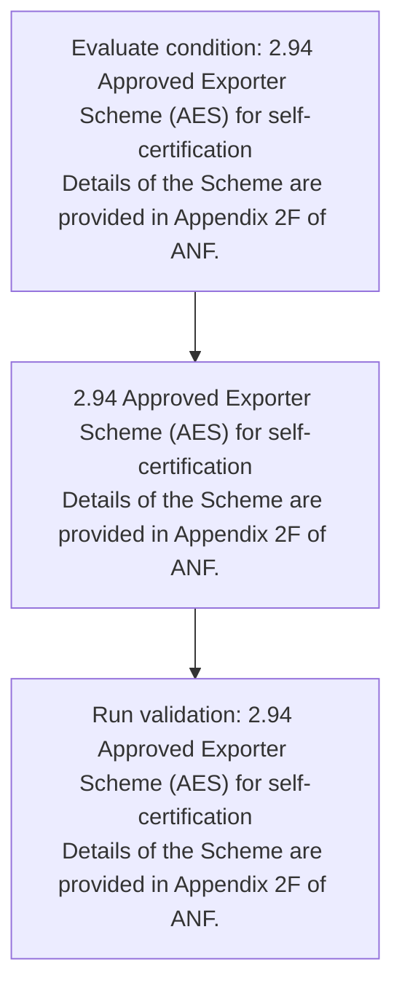
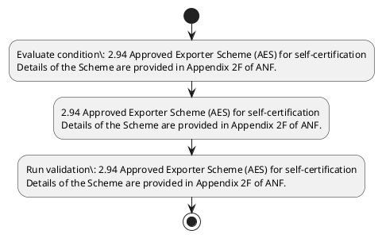

# Chapter 2 / Section 2.94: Approved Exporter Scheme (AES) for self-certification

**Chapter Title:** General Provisions Regarding Imports and Exports

**Pages:** 52

**Purpose:** 2.94 Approved Exporter Scheme (AES) for self-certification
Details of the Scheme are provided in Appendix 2F of ANF.

**Purpose Thanglish:** Indha Approved Exporter Scheme (AES) for self-certification section-la, 2.94 Approved Exporter Scheme (AES) for self-certification
Details of the Scheme are provided in Appendix 2F of ANF.

**Summary:** 2.94 Approved Exporter Scheme (AES) for self-certification
Details of the Scheme are provided in Appendix 2F of ANF. POLICY INTERPRETATION AND RELAXATIONS

**Business Meaning:** 2.94 Approved Exporter Scheme (AES) for self-certification
Details of the Scheme are provided in Appendix 2F of ANF.

**Business Explanation:** 2.94 Approved Exporter Scheme (AES) for self-certification
Details of the Scheme are provided in Appendix 2F of ANF. POLICY INTERPRETATION AND RELAXATIONS

**Business Explanation Thanglish:** Indha Approved Exporter Scheme (AES) for self-certification section-la, 2.94 Approved Exporter Scheme (AES) for self-certification
Details of the Scheme are provided in Appendix 2F of ANF. POLICY INTERPRETATION AND RELAXATIONS

## Business Logic
- None identified

## Business Rules
- rule_id=CH2-SEC2_94-R001, rule_description=IF validations pass THEN recommend action: 2.94 Approved Exporter Scheme (AES) for self-certification
Details of the Scheme are provided in Appendix 2F of ANF., trigger=Approved Exporter Scheme (AES) for self-certification, condition=2.94 Approved Exporter Scheme (AES) for self-certification
Details of the Scheme are provided in Appendix 2F of ANF., validation=2.94 Approved Exporter Scheme (AES) for self-certification
Details of the Scheme are provided in Appendix 2F of ANF., action=2.94 Approved Exporter Scheme (AES) for self-certification
Details of the Scheme are provided in Appendix 2F of ANF., exception=No explicit exception found in uploaded documents., output=DEKAI should produce a compliance decision for 2.94 - Approved Exporter Scheme (AES) for self-certification.

## Conditions
- 2.94 Approved Exporter Scheme (AES) for self-certification
Details of the Scheme are provided in Appendix 2F of ANF.

## Condition Logic
- id=2.2.94.1, if=2.94 Approved Exporter Scheme (AES) for self-certification
Details of the Scheme are provided in Appendix 2F of ANF., then=2.94 Approved Exporter Scheme (AES) for self-certification
Details of the Scheme are provided in Appendix 2F of ANF., source=2.94 Approved Exporter Scheme (AES) for self-certification
Details of the Scheme are provided in Appendix 2F of ANF.

## Validations
- 2.94 Approved Exporter Scheme (AES) for self-certification
Details of the Scheme are provided in Appendix 2F of ANF.

## Exceptions
- None identified

## Dependencies
- None identified

## Authorities
- None identified

## Required Documents
- None identified

## Timelines
- None identified

## Actions
- 2.94 Approved Exporter Scheme (AES) for self-certification
Details of the Scheme are provided in Appendix 2F of ANF.

## Workflow
- Evaluate condition: 2.94 Approved Exporter Scheme (AES) for self-certification
Details of the Scheme are provided in Appendix 2F of ANF.
- 2.94 Approved Exporter Scheme (AES) for self-certification
Details of the Scheme are provided in Appendix 2F of ANF.
- Run validation: 2.94 Approved Exporter Scheme (AES) for self-certification
Details of the Scheme are provided in Appendix 2F of ANF.

## Workflow ASCII
```text
Approved Exporter Scheme (AES) for self-certification
Evaluate condition: 2.94 Approved Exporter Scheme (AES) for self-certification
Details of the Scheme are provided in Appendix 2F of ANF.
   |
   v
2.94 Approved Exporter Scheme (AES) for self-certification
Details of the Scheme are provided in Appendix 2F of ANF.
   |
   v
Run validation: 2.94 Approved Exporter Scheme (AES) for self-certification
Details of the Scheme are provided in Appendix 2F of ANF.
```

## Decision Tree
- IF 2.94 Approved Exporter Scheme (AES) for self-certification
Details of the Scheme are provided in Appendix 2F of ANF. THEN 2.94 Approved Exporter Scheme (AES) for self-certification
Details of the Scheme are provided in Appendix 2F of ANF.

## Decision Tree ASCII
```text
Approved Exporter Scheme (AES) for self-certification Decision
IF 2.94 Approved Exporter Scheme (AES) for self-certification
Details of the Scheme are provided in Appendix 2F of ANF. THEN 2.94 Approved Exporter Scheme (AES) for self-certification
Details of the Scheme are provided in Appendix 2F of ANF.
```

## Examples
- User asks to process Approved Exporter Scheme (AES) for self-certification; the platform checks conditions, validations, and documents before action.

**Real-world Example:** Example: an importer or exporter invokes Approved Exporter Scheme (AES) for self-certification, submits the prescribed DGFT records, and DEKAI uses the extracted rules to 2.94 approved exporter scheme (aes) for self-certification
details of the scheme are provided in appendix 2f of anf..

**Real-world Example Thanglish:** Indha Approved Exporter Scheme (AES) for self-certification section-la, Example: an importer or exporter invokes Approved Exporter Scheme (AES) for self-certification, submits the prescribed DGFT records, and DEKAI uses the extracted rules to 2.94 approved exporter scheme (aes) for self-certification
details of the scheme are provided in appendix 2f of anf..

## AI Rules
- IF validations pass THEN recommend action: 2.94 Approved Exporter Scheme (AES) for self-certification
Details of the Scheme are provided in Appendix 2F of ANF.

## Database Fields
- name=section_code, type=string, required=True, source=parsed_section_heading
- name=section_title, type=string, required=True, source=parsed_section_heading
- name=aes_flag, type=boolean, required=False, source=keyword:AES
- name=for_flag, type=boolean, required=False, source=keyword:for
- name=the_flag, type=boolean, required=False, source=keyword:the
- name=are_flag, type=boolean, required=False, source=keyword:are
- name=anf_flag, type=boolean, required=False, source=keyword:ANF
- name=and_flag, type=boolean, required=False, source=keyword:AND
- name=scheme_flag, type=boolean, required=False, source=keyword:Scheme
- name=policy_flag, type=boolean, required=False, source=keyword:POLICY

## API Requirements
- method=GET, path=/api/dgft/sections/2.94, purpose=Retrieve knowledge payload for section 2.94, query_params=['include=workflow,decision_tree,validations'], response_fields=['section', 'title', 'summary', 'conditions', 'validations', 'exceptions', 'workflow', 'decision_tree']
- method=POST, path=/api/dgft/Approved-Exporter-Scheme-AES-for-self-certification/validate, purpose=Validate inputs and documents for Approved Exporter Scheme (AES) for self-certification, request_fields=['section_code', 'section_title'], response_fields=['status', 'errors', 'warnings', 'next_actions']
- method=POST, path=/api/dgft/Approved-Exporter-Scheme-AES-for-self-certification/execute, purpose=Trigger business action for 2.94 Approved Exporter Scheme (AES) for self-certification
Details of the Scheme are provided in Appendix 2F of ANF., request_fields=['section_code', 'section_title'], response_fields=['reference_id', 'status', 'authority', 'timeline']

## UI Screens
- screen_id=Approved_Exporter_Scheme_AES_for_self_certification_overview, name=Approved Exporter Scheme (AES) for self-certification Overview, purpose=Show section summary, authority, timeline, and eligibility cues., widgets=['summary_card', 'conditions_table', 'authority_badges', 'timeline_panel']
- screen_id=Approved_Exporter_Scheme_AES_for_self_certification_submission, name=Approved Exporter Scheme (AES) for self-certification Submission, purpose=Capture applicant data and supporting documents., widgets=['dynamic_form', 'document_uploader', 'validation_panel', 'next_action_footer'], fields=['section_code', 'section_title', 'aes_flag', 'for_flag', 'the_flag', 'are_flag', 'anf_flag', 'and_flag']

## Error Messages
- Validation failed because the section requirements were not fully met.

## FAQ
- question_en=What is the purpose of section 2.94?, answer_en=2.94 Approved Exporter Scheme (AES) for self-certification
Details of the Scheme are provided in Appendix 2F of ANF. POLICY INTERPRETATION AND RELAXATIONS, question_thanglish=Indha Approved Exporter Scheme (AES) for self-certification section-la, What is the purpose of section 2.94?, answer_thanglish=Indha Approved Exporter Scheme (AES) for self-certification section-la, 2.94 Approved Exporter Scheme (AES) for self-certification
Details of the Scheme are provided in Appendix 2F of ANF. POLICY INTERPRETATION AND RELAXATIONS
- question_en=What documents are required under Approved Exporter Scheme (AES) for self-certification?, answer_en=Not explicitly covered in uploaded documents., question_thanglish=Indha Approved Exporter Scheme (AES) for self-certification section-la, What documents are required under Approved Exporter Scheme (AES) for self-certification?, answer_thanglish=Indha Approved Exporter Scheme (AES) for self-certification section-la, Not explicitly covered in uploaded documents.
- question_en=Which authority handles Approved Exporter Scheme (AES) for self-certification?, answer_en=Not explicitly covered in uploaded documents., question_thanglish=Indha Approved Exporter Scheme (AES) for self-certification section-la, Which authority handles Approved Exporter Scheme (AES) for self-certification?, answer_thanglish=Indha Approved Exporter Scheme (AES) for self-certification section-la, Not explicitly covered in uploaded documents.

## Questions Users May Ask
- What does Approved Exporter Scheme (AES) for self-certification require?
- Which documents are needed for Approved Exporter Scheme (AES) for self-certification?
- How does DEKAI validate Approved Exporter Scheme (AES) for self-certification requests?
- What action should be taken for Approved Exporter Scheme (AES) for self-certification?

## Expected AI Answers
- Approved Exporter Scheme (AES) for self-certification requires the platform to interpret the section text, apply the extracted business rules, and present the correct next action.
- Required documents are inferred from the section text: no explicit documents were detected.
- DEKAI validates Approved Exporter Scheme (AES) for self-certification by checking conditions, required documents, authority references, and exception clauses before recommending an outcome.
- The primary extracted action is: 2.94 Approved Exporter Scheme (AES) for self-certification
Details of the Scheme are provided in Appendix 2F of ANF.

## AI Q&A Examples
- question_en=User asks: How do I comply with Approved Exporter Scheme (AES) for self-certification?, answer_en=AI answers: DEKAI should evaluate section 2.94, apply the extracted rules, and guide the user through Evaluate condition: 2.94 Approved Exporter Scheme (AES) for self-certification
Details of the Scheme are provided in Appendix 2F of ANF.., question_thanglish=Indha Approved Exporter Scheme (AES) for self-certification section-la, User asks: How do I comply with Approved Exporter Scheme (AES) for self-certification?, answer_thanglish=Indha Approved Exporter Scheme (AES) for self-certification section-la, AI answers: DEKAI should evaluate section 2.94, apply the extracted rules, and guide the user through Evaluate condition: 2.94 Approved Exporter Scheme (AES) for self-certification
Details of the Scheme are provided in Appendix 2F of ANF..
- question_en=User asks: Which validations apply to Approved Exporter Scheme (AES) for self-certification?, answer_en=AI answers: Applicable validations are 2.94 Approved Exporter Scheme (AES) for self-certification
Details of the Scheme are provided in Appendix 2F of ANF., question_thanglish=Indha Approved Exporter Scheme (AES) for self-certification section-la, User asks: Which validations apply to Approved Exporter Scheme (AES) for self-certification?, answer_thanglish=Indha Approved Exporter Scheme (AES) for self-certification section-la, AI answers: Applicable validations are 2.94 Approved Exporter Scheme (AES) for self-certification
Details of the Scheme are provided in Appendix 2F of ANF.

## DEKAI AI Implementation Notes
- Capture chapter 2, section 2.94, title, and page references as immutable knowledge metadata.
- Bind validations for Approved Exporter Scheme (AES) for self-certification into a rule engine keyed by the rule IDs extracted for this section.

## DEKAI AI Implementation Notes Thanglish
- Indha Approved Exporter Scheme (AES) for self-certification section-la, Capture chapter 2, section 2.94, title, and page references as immutable knowledge metadata.
- Indha Approved Exporter Scheme (AES) for self-certification section-la, Bind validations for Approved Exporter Scheme (AES) for self-certification into a rule engine keyed by the rule IDs extracted for this section.

## AI Metadata
- Keywords: AES, for, the, are, ANF, AND, Scheme, POLICY, Details, Approved, Exporter, provided, Appendix, RELAXATIONS, INTERPRETATION, self-certification
- Search Keywords: AES, for, the, are, ANF, AND, Scheme, POLICY, Details, Approved, Exporter, provided, Appendix, RELAXATIONS, INTERPRETATION, self-certification
- Intent: Support Approved Exporter Scheme (AES) for self-certification processing and compliance validation.
- Tags: 2.94, Approved Exporter Scheme (AES) for self-certification, dgft
- Related Sections: 
- Related Chapters: 
- Related Rules: 

## Mermaid


## PlantUML

