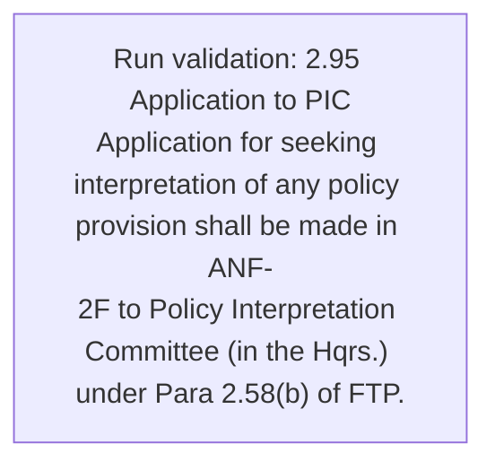
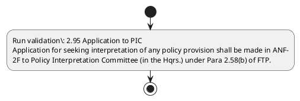

# Chapter 2 / Section 2.95: Application to PIC

**Chapter Title:** General Provisions Regarding Imports and Exports

**Pages:** 52

**Purpose:** 2.95 Application to PIC
Application for seeking interpretation of any policy provision shall be made in ANF-
2F to Policy Interpretation Committee (in the Hqrs.) under Para 2.58(b) of FTP.

**Purpose Thanglish:** Indha Application to PIC section-la, 2.95 application to PIC
application for seeking interpretation of any policy provision kandippa be made in ANF-
2F to Policy Interpretation Committee (in the Hqrs.) under Para 2.58(b) of FTP.

**Summary:** 2.95 Application to PIC
Application for seeking interpretation of any policy provision shall be made in ANF-
2F to Policy Interpretation Committee (in the Hqrs.) under Para 2.58(b) of FTP.

**Business Meaning:** Application to PIC governs how DGFT business controls should be applied, validated, and enforced.

**Business Explanation:** Application to PIC explains the operating rule set that DEKAI should enforce. Key control points include 2.95 Application to PIC
Application for seeking interpretation of any policy provision shall be made in ANF-
2F to Policy Interpretation Committee (in the Hqrs.) under Para 2.58(b) of FTP.

**Business Explanation Thanglish:** Indha Application to PIC section-la, application to PIC explains the operating rule set that DEKAI should enforce. Key control points include 2.95 application to PIC
application for seeking interpretation of any policy provision kandippa be made in ANF-
2F to Policy Interpretation Committee (in the Hqrs.) under Para 2.58(b) of FTP.

## Business Logic
- 2.95 Application to PIC
Application for seeking interpretation of any policy provision shall be made in ANF-
2F to Policy Interpretation Committee (in the Hqrs.) under Para 2.58(b) of FTP.

## Business Rules
- rule_id=CH2-SEC2_95-R001, rule_description=2.95 Application to PIC
Application for seeking interpretation of any policy provision shall be made in ANF-
2F to Policy Interpretation Committee (in the Hqrs.) under Para 2.58(b) of FTP., trigger=Application to PIC, condition=Not explicitly covered in uploaded documents., validation=2.95 Application to PIC
Application for seeking interpretation of any policy provision shall be made in ANF-
2F to Policy Interpretation Committee (in the Hqrs.) under Para 2.58(b) of FTP., action=Manual review required., exception=No explicit exception found in uploaded documents., output=DEKAI should produce a compliance decision for 2.95 - Application to PIC.

## Conditions
- None identified

## Condition Logic
- None identified

## Validations
- 2.95 Application to PIC
Application for seeking interpretation of any policy provision shall be made in ANF-
2F to Policy Interpretation Committee (in the Hqrs.) under Para 2.58(b) of FTP.

## Exceptions
- None identified

## Dependencies
- 2.58

## Authorities
- Policy Interpretation Committee

## Required Documents
- 2.95 Application to PIC
Application for seeking interpretation of any policy provision shall be made in ANF-
2F to Policy Interpretation Committee (in the Hqrs.) under Para 2.58(b) of FTP.

## Timelines
- None identified

## Actions
- None identified

## Workflow
- Run validation: 2.95 Application to PIC
Application for seeking interpretation of any policy provision shall be made in ANF-
2F to Policy Interpretation Committee (in the Hqrs.) under Para 2.58(b) of FTP.

## Workflow ASCII
```text
Application to PIC
Run validation: 2.95 Application to PIC
Application for seeking interpretation of any policy provision shall be made in ANF-
2F to Policy Interpretation Committee (in the Hqrs.) under Para 2.58(b) of FTP.
```

## Decision Tree
- IF section 2.95 applies THEN proceed with standard DGFT workflow

## Decision Tree ASCII
```text
Application to PIC Decision
IF section 2.95 applies THEN proceed with standard DGFT workflow
```

## Examples
- User asks to process Application to PIC; the platform checks conditions, validations, and documents before action.

**Real-world Example:** Example: an importer or exporter invokes Application to PIC, submits 2.95 Application to PIC
Application for seeking interpretation of any policy provision shall be made in ANF-
2F to Policy Interpretation Committee (in the Hqrs.) under Para 2.58(b) of FTP., and DEKAI uses the extracted rules to follow the application to pic process.

**Real-world Example Thanglish:** Indha Application to PIC section-la, Example: an importer or exporter invokes application to PIC, submits 2.95 application to PIC
application for seeking interpretation of any policy provision kandippa be made in ANF-
2F to Policy Interpretation Committee (in the Hqrs.) under Para 2.58(b) of FTP., and DEKAI uses the extracted rules to follow the application to pic process.

## AI Rules
- IF detected context matches section rule THEN enforce: 2.95 Application to PIC
Application for seeking interpretation of any policy provision shall be made in ANF-
2F to Policy Interpretation Committee (in the Hqrs.) under Para 2.58(b) of FTP.

## Database Fields
- name=section_code, type=string, required=True, source=parsed_section_heading
- name=section_title, type=string, required=True, source=parsed_section_heading
- name=pic_flag, type=boolean, required=False, source=keyword:PIC
- name=for_flag, type=boolean, required=False, source=keyword:for
- name=any_flag, type=boolean, required=False, source=keyword:any
- name=anf_flag, type=boolean, required=False, source=keyword:ANF
- name=the_flag, type=boolean, required=False, source=keyword:the
- name=ftp_flag, type=boolean, required=False, source=keyword:FTP
- name=made_flag, type=boolean, required=False, source=keyword:made
- name=hqrs_flag, type=boolean, required=False, source=keyword:Hqrs
- name=document_1_submitted, type=boolean, required=True, source=2.95 Application to PIC
Application for seeking interpretation of any policy provision shall be made in ANF-
2F to Policy Interpretation Committee (in the Hqrs.) under Para 2.58(b) of FTP.

## API Requirements
- method=GET, path=/api/dgft/sections/2.95, purpose=Retrieve knowledge payload for section 2.95, query_params=['include=workflow,decision_tree,validations'], response_fields=['section', 'title', 'summary', 'conditions', 'validations', 'exceptions', 'workflow', 'decision_tree']
- method=POST, path=/api/dgft/Application-to-PIC/validate, purpose=Validate inputs and documents for Application to PIC, request_fields=['section_code', 'section_title', 'document_1_submitted'], response_fields=['status', 'errors', 'warnings', 'next_actions']

## UI Screens
- screen_id=Application_to_PIC_overview, name=Application to PIC Overview, purpose=Show section summary, authority, timeline, and eligibility cues., widgets=['summary_card', 'conditions_table', 'authority_badges', 'timeline_panel']
- screen_id=Application_to_PIC_submission, name=Application to PIC Submission, purpose=Capture applicant data and supporting documents., widgets=['dynamic_form', 'document_uploader', 'validation_panel', 'next_action_footer'], fields=['section_code', 'section_title', 'pic_flag', 'for_flag', 'any_flag', 'anf_flag', 'the_flag', 'ftp_flag']

## Error Messages
- Validation failed because the section requirements were not fully met.

## FAQ
- question_en=What is the purpose of section 2.95?, answer_en=Application to PIC explains the operating rule set that DEKAI should enforce. Key control points include 2.95 Application to PIC
Application for seeking interpretation of any policy provision shall be made in ANF-
2F to Policy Interpretation Committee (in the Hqrs.) under Para 2.58(b) of FTP., question_thanglish=Indha Application to PIC section-la, What is the purpose of section 2.95?, answer_thanglish=Indha Application to PIC section-la, application to PIC explains the operating rule set that DEKAI should enforce. Key control points include 2.95 application to PIC
application for seeking interpretation of any policy provision kandippa be made in ANF-
2F to Policy Interpretation Committee (in the Hqrs.) under Para 2.58(b) of FTP.
- question_en=What documents are required under Application to PIC?, answer_en=2.95 Application to PIC
Application for seeking interpretation of any policy provision shall be made in ANF-
2F to Policy Interpretation Committee (in the Hqrs.) under Para 2.58(b) of FTP., question_thanglish=Indha Application to PIC section-la, What documents are required under application to PIC?, answer_thanglish=Indha Application to PIC section-la, 2.95 application to PIC
application for seeking interpretation of any policy provision kandippa be made in ANF-
2F to Policy Interpretation Committee (in the Hqrs.) under Para 2.58(b) of FTP.
- question_en=Which authority handles Application to PIC?, answer_en=Policy Interpretation Committee, question_thanglish=Indha Application to PIC section-la, Which authority handles application to PIC?, answer_thanglish=Indha Application to PIC section-la, Policy Interpretation Committee

## Questions Users May Ask
- What does Application to PIC require?
- Which documents are needed for Application to PIC?
- How does DEKAI validate Application to PIC requests?

## Expected AI Answers
- Application to PIC requires the platform to interpret the section text, apply the extracted business rules, and present the correct next action.
- Required documents are inferred from the section text: 2.95 Application to PIC
Application for seeking interpretation of any policy provision shall be made in ANF-
2F to Policy Interpretation Committee (in the Hqrs.) under Para 2.58(b) of FTP.
- DEKAI validates Application to PIC by checking conditions, required documents, authority references, and exception clauses before recommending an outcome.

## AI Q&A Examples
- question_en=User asks: How do I comply with Application to PIC?, answer_en=AI answers: DEKAI should evaluate section 2.95, apply the extracted rules, and guide the user through Run validation: 2.95 Application to PIC
Application for seeking interpretation of any policy provision shall be made in ANF-
2F to Policy Interpretation Committee (in the Hqrs.) under Para 2.58(b) of FTP.., question_thanglish=Indha Application to PIC section-la, User asks: How do I comply with application to PIC?, answer_thanglish=Indha Application to PIC section-la, AI answers: DEKAI should evaluate section 2.95, apply the extracted rules, and guide the user through Run validation: 2.95 application to PIC
application for seeking interpretation of any policy provision kandippa be made in ANF-
2F to Policy Interpretation Committee (in the Hqrs.) under Para 2.58(b) of FTP..
- question_en=User asks: Which validations apply to Application to PIC?, answer_en=AI answers: Applicable validations are 2.95 Application to PIC
Application for seeking interpretation of any policy provision shall be made in ANF-
2F to Policy Interpretation Committee (in the Hqrs.) under Para 2.58(b) of FTP., question_thanglish=Indha Application to PIC section-la, User asks: Which validations apply to application to PIC?, answer_thanglish=Indha Application to PIC section-la, AI answers: Applicable validations are 2.95 application to PIC
application for seeking interpretation of any policy provision kandippa be made in ANF-
2F to Policy Interpretation Committee (in the Hqrs.) under Para 2.58(b) of FTP.

## DEKAI AI Implementation Notes
- Capture chapter 2, section 2.95, title, and page references as immutable knowledge metadata.
- Bind validations for Application to PIC into a rule engine keyed by the rule IDs extracted for this section.
- Expose document upload controls for: 2.95 Application to PIC
Application for seeking interpretation of any policy provision shall be made in ANF-
2F to Policy Interpretation Committee (in the Hqrs.) under Para 2.58(b) of FTP..
- Route escalations or approvals to: Policy Interpretation Committee.
- Show contextual links to related sections: 2.58.

## DEKAI AI Implementation Notes Thanglish
- Indha Application to PIC section-la, Capture chapter 2, section 2.95, title, and page references as immutable knowledge metadata.
- Indha Application to PIC section-la, Bind validations for application to PIC into a rule engine keyed by the rule IDs extracted for this section.
- Indha Application to PIC section-la, Expose document upload controls for: 2.95 application to PIC
application for seeking interpretation of any policy provision kandippa be made in ANF-
2F to Policy Interpretation Committee (in the Hqrs.) under Para 2.58(b) of FTP..
- Indha Application to PIC section-la, Route escalations or approvals to: Policy Interpretation Committee.
- Indha Application to PIC section-la, Show contextual links to related sections: 2.58.

## AI Metadata
- Keywords: PIC, for, any, ANF, the, FTP, made, Hqrs, Para, shall, under, policy, seeking, provision, Committee, Application, interpretation
- Search Keywords: PIC, for, any, ANF, the, FTP, made, Hqrs, Para, shall, under, policy, seeking, provision, Committee, Application, interpretation
- Intent: Provide knowledge guidance for Application to PIC.
- Tags: 2.95, Application to PIC, business-rule, document-driven, dgft
- Related Sections: 2.58
- Related Chapters: 
- Related Rules: 2.95 Application to PIC
Application for seeking interpretation of any policy provision shall be made in ANF-
2F to Policy Interpretation Committee (in the Hqrs.) under Para 2.58(b) of FTP.

## Mermaid


## PlantUML

