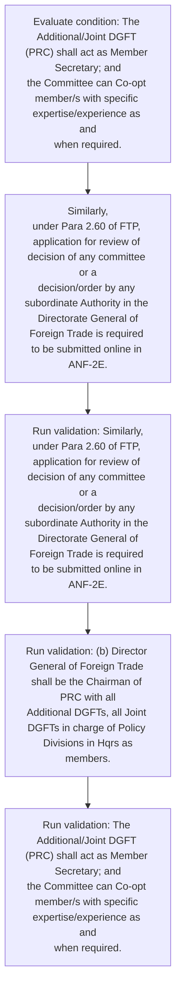
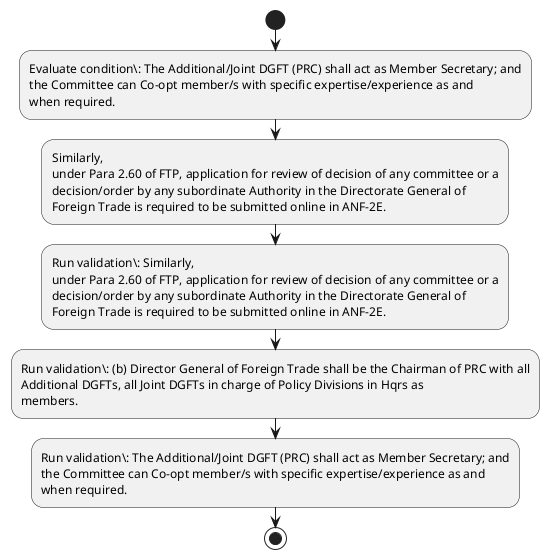

# Chapter 2 / Section 2.96: Application to PRC

**Chapter Title:** General Provisions Regarding Imports and Exports

**Pages:** 52

**Purpose:** 2.96 Application to PRC
(a) Application to the Policy Relaxation Committee (PRC) under Para 2.59 FTP is to
be made online in ANF-2D with the prescribed fee and documents.

**Purpose Thanglish:** Indha Application to PRC section-la, 2.96 application to PRC
(a) application to the Policy Relaxation Committee (PRC) under Para 2.59 FTP is to
be made online in ANF-2D with the prescribed fee and documents.

**Summary:** 2.96 Application to PRC
(a) Application to the Policy Relaxation Committee (PRC) under Para 2.59 FTP is to
be made online in ANF-2D with the prescribed fee and documents. Similarly,
under Para 2.60 of FTP, application for review of decision of any committee or a
decision/order by any subordinate Authority in the Directorate General of
Foreign Trade is required to be submitted online in ANF-2E. (b) Director General of Foreign Trade shall be the Chairman of PRC with all
Additional DGFTs, all Joint DGFTs in charge of Policy Divisions in Hqrs as
members.

**Business Meaning:** Application to PRC governs how DGFT business controls should be applied, validated, and enforced.

**Business Explanation:** Application to PRC explains the operating rule set that DEKAI should enforce. Key control points include Similarly,
under Para 2.60 of FTP, application for review of decision of any committee or a
decision/order by any subordinate Authority in the Directorate General of
Foreign Trade is required to be submitted online in ANF-2E. The section also drives actions such as Similarly,
under Para 2.60 of FTP, application for review of decision of any committee or a
decision/order by any subordinate Authority in the Directorate General of
Foreign Trade is required to be submitted online in ANF-2E..

**Business Explanation Thanglish:** Indha Application to PRC section-la, application to PRC explains the operating rule set that DEKAI should enforce. Key control points include Similarly,
under Para 2.60 of FTP, application for review of decision of any committee or a
decision/order by any subordinate authority in the Directorate General of
Foreign Trade is required to be submitted online in ANF-2E. The section also drives actions such as Similarly,
under Para 2.60 of FTP, application for review of decision of any committee or a
decision/order by any subordinate authority in the Directorate General of
Foreign Trade is required to be submitted online in ANF-2E..

## Business Logic
- Similarly,
under Para 2.60 of FTP, application for review of decision of any committee or a
decision/order by any subordinate Authority in the Directorate General of
Foreign Trade is required to be submitted online in ANF-2E.
- (b) Director General of Foreign Trade shall be the Chairman of PRC with all
Additional DGFTs, all Joint DGFTs in charge of Policy Divisions in Hqrs as
members.
- The Additional/Joint DGFT (PRC) shall act as Member Secretary; and
the Committee can Co-opt member/s with specific expertise/experience as and
when required.
- (b)
Director General of Foreign Trade shall be the Chairman of PRC with all
Additional DGFTs, all Joint DGFTs in charge of Policy Divisions in Hqrs as
members.

## Business Rules
- rule_id=CH2-SEC2_96-R001, rule_description=Similarly,
under Para 2.60 of FTP, application for review of decision of any committee or a
decision/order by any subordinate Authority in the Directorate General of
Foreign Trade is required to be submitted online in ANF-2E., trigger=Application to PRC, condition=The Additional/Joint DGFT (PRC) shall act as Member Secretary; and
the Committee can Co-opt member/s with specific expertise/experience as and
when required., validation=Similarly,
under Para 2.60 of FTP, application for review of decision of any committee or a
decision/order by any subordinate Authority in the Directorate General of
Foreign Trade is required to be submitted online in ANF-2E., action=Similarly,
under Para 2.60 of FTP, application for review of decision of any committee or a
decision/order by any subordinate Authority in the Directorate General of
Foreign Trade is required to be submitted online in ANF-2E., exception=No explicit exception found in uploaded documents., output=DEKAI should produce a compliance decision for 2.96 - Application to PRC.
- rule_id=CH2-SEC2_96-R002, rule_description=(b) Director General of Foreign Trade shall be the Chairman of PRC with all
Additional DGFTs, all Joint DGFTs in charge of Policy Divisions in Hqrs as
members., trigger=Application to PRC, condition=The Additional/Joint DGFT (PRC) shall act as Member Secretary; and
the Committee can Co-opt member/s with specific expertise/experience as and
when required., validation=(b) Director General of Foreign Trade shall be the Chairman of PRC with all
Additional DGFTs, all Joint DGFTs in charge of Policy Divisions in Hqrs as
members., action=Similarly,
under Para 2.60 of FTP, application for review of decision of any committee or a
decision/order by any subordinate Authority in the Directorate General of
Foreign Trade is required to be submitted online in ANF-2E., exception=No explicit exception found in uploaded documents., output=DEKAI should produce a compliance decision for 2.96 - Application to PRC.
- rule_id=CH2-SEC2_96-R003, rule_description=The Additional/Joint DGFT (PRC) shall act as Member Secretary; and
the Committee can Co-opt member/s with specific expertise/experience as and
when required., trigger=Application to PRC, condition=The Additional/Joint DGFT (PRC) shall act as Member Secretary; and
the Committee can Co-opt member/s with specific expertise/experience as and
when required., validation=The Additional/Joint DGFT (PRC) shall act as Member Secretary; and
the Committee can Co-opt member/s with specific expertise/experience as and
when required., action=Similarly,
under Para 2.60 of FTP, application for review of decision of any committee or a
decision/order by any subordinate Authority in the Directorate General of
Foreign Trade is required to be submitted online in ANF-2E., exception=No explicit exception found in uploaded documents., output=DEKAI should produce a compliance decision for 2.96 - Application to PRC.
- rule_id=CH2-SEC2_96-R004, rule_description=(b)
Director General of Foreign Trade shall be the Chairman of PRC with all
Additional DGFTs, all Joint DGFTs in charge of Policy Divisions in Hqrs as
members., trigger=Application to PRC, condition=The Additional/Joint DGFT (PRC) shall act as Member Secretary; and
the Committee can Co-opt member/s with specific expertise/experience as and
when required., validation=(b)
Director General of Foreign Trade shall be the Chairman of PRC with all
Additional DGFTs, all Joint DGFTs in charge of Policy Divisions in Hqrs as
members., action=Similarly,
under Para 2.60 of FTP, application for review of decision of any committee or a
decision/order by any subordinate Authority in the Directorate General of
Foreign Trade is required to be submitted online in ANF-2E., exception=No explicit exception found in uploaded documents., output=DEKAI should produce a compliance decision for 2.96 - Application to PRC.

## Conditions
- The Additional/Joint DGFT (PRC) shall act as Member Secretary; and
the Committee can Co-opt member/s with specific expertise/experience as and
when required.

## Condition Logic
- id=2.2.96.1, if=The Additional/Joint DGFT (PRC) shall act as Member Secretary; and
the Committee can Co-opt member/s with specific expertise/experience as and
when required., then=Similarly,
under Para 2.60 of FTP, application for review of decision of any committee or a
decision/order by any subordinate Authority in the Directorate General of
Foreign Trade is required to be submitted online in ANF-2E., source=The Additional/Joint DGFT (PRC) shall act as Member Secretary; and
the Committee can Co-opt member/s with specific expertise/experience as and
when required.

## Validations
- Similarly,
under Para 2.60 of FTP, application for review of decision of any committee or a
decision/order by any subordinate Authority in the Directorate General of
Foreign Trade is required to be submitted online in ANF-2E.
- (b) Director General of Foreign Trade shall be the Chairman of PRC with all
Additional DGFTs, all Joint DGFTs in charge of Policy Divisions in Hqrs as
members.
- The Additional/Joint DGFT (PRC) shall act as Member Secretary; and
the Committee can Co-opt member/s with specific expertise/experience as and
when required.
- (b)
Director General of Foreign Trade shall be the Chairman of PRC with all
Additional DGFTs, all Joint DGFTs in charge of Policy Divisions in Hqrs as
members.

## Exceptions
- None identified

## Dependencies
- 2.59
- 2.60

## Authorities
- Application to the Policy Relaxation Committee
- DGFT
- The Additional/Joint DGFT

## Required Documents
- 2.96 Application to PRC
(a) Application to the Policy Relaxation Committee (PRC) under Para 2.59 FTP is to
be made online in ANF-2D with the prescribed fee and documents.
- Similarly,
under Para 2.60 of FTP, application for review of decision of any committee or a
decision/order by any subordinate Authority in the Directorate General of
Foreign Trade is required to be submitted online in ANF-2E.
- 2.96 Application to PRC
(a)
Application to the Policy Relaxation Committee (PRC) under Para 2.59 FTP is to
be made online in ANF-2D with the prescribed fee and documents.

## Timelines
- None identified

## Actions
- Similarly,
under Para 2.60 of FTP, application for review of decision of any committee or a
decision/order by any subordinate Authority in the Directorate General of
Foreign Trade is required to be submitted online in ANF-2E.

## Workflow
- Evaluate condition: The Additional/Joint DGFT (PRC) shall act as Member Secretary; and
the Committee can Co-opt member/s with specific expertise/experience as and
when required.
- Similarly,
under Para 2.60 of FTP, application for review of decision of any committee or a
decision/order by any subordinate Authority in the Directorate General of
Foreign Trade is required to be submitted online in ANF-2E.
- Run validation: Similarly,
under Para 2.60 of FTP, application for review of decision of any committee or a
decision/order by any subordinate Authority in the Directorate General of
Foreign Trade is required to be submitted online in ANF-2E.
- Run validation: (b) Director General of Foreign Trade shall be the Chairman of PRC with all
Additional DGFTs, all Joint DGFTs in charge of Policy Divisions in Hqrs as
members.
- Run validation: The Additional/Joint DGFT (PRC) shall act as Member Secretary; and
the Committee can Co-opt member/s with specific expertise/experience as and
when required.

## Workflow ASCII
```text
Application to PRC
Evaluate condition: The Additional/Joint DGFT (PRC) shall act as Member Secretary; and
the Committee can Co-opt member/s with specific expertise/experience as and
when required.
   |
   v
Similarly,
under Para 2.60 of FTP, application for review of decision of any committee or a
decision/order by any subordinate Authority in the Directorate General of
Foreign Trade is required to be submitted online in ANF-2E.
   |
   v
Run validation: Similarly,
under Para 2.60 of FTP, application for review of decision of any committee or a
decision/order by any subordinate Authority in the Directorate General of
Foreign Trade is required to be submitted online in ANF-2E.
   |
   v
Run validation: (b) Director General of Foreign Trade shall be the Chairman of PRC with all
Additional DGFTs, all Joint DGFTs in charge of Policy Divisions in Hqrs as
members.
   |
   v
Run validation: The Additional/Joint DGFT (PRC) shall act as Member Secretary; and
the Committee can Co-opt member/s with specific expertise/experience as and
when required.
```

## Decision Tree
- IF The Additional/Joint DGFT (PRC) shall act as Member Secretary; and
the Committee can Co-opt member/s with specific expertise/experience as and
when required. THEN Similarly,
under Para 2.60 of FTP, application for review of decision of any committee or a
decision/order by any subordinate Authority in the Directorate General of
Foreign Trade is required to be submitted online in ANF-2E.

## Decision Tree ASCII
```text
Application to PRC Decision
IF The Additional/Joint DGFT (PRC) shall act as Member Secretary; and
the Committee can Co-opt member/s with specific expertise/experience as and
when required. THEN Similarly,
under Para 2.60 of FTP, application for review of decision of any committee or a
decision/order by any subordinate Authority in the Directorate General of
Foreign Trade is required to be submitted online in ANF-2E.
```

## Examples
- User asks to process Application to PRC; the platform checks conditions, validations, and documents before action.

**Real-world Example:** Example: an importer or exporter invokes Application to PRC, submits 2.96 Application to PRC
(a) Application to the Policy Relaxation Committee (PRC) under Para 2.59 FTP is to
be made online in ANF-2D with the prescribed fee and documents., Similarly,
under Para 2.60 of FTP, application for review of decision of any committee or a
decision/order by any subordinate Authority in the Directorate General of
Foreign Trade is required to be submitted online in ANF-2E., 2.96 Application to PRC
(a)
Application to the Policy Relaxation Committee (PRC) under Para 2.59 FTP is to
be made online in ANF-2D with the prescribed fee and documents., and DEKAI uses the extracted rules to similarly,
under para 2.60 of ftp, application for review of decision of any committee or a
decision/order by any subordinate authority in the directorate general of
foreign trade is required to be submitted online in anf-2e..

**Real-world Example Thanglish:** Indha Application to PRC section-la, Example: an importer or exporter invokes application to PRC, submits 2.96 application to PRC
(a) application to the Policy Relaxation Committee (PRC) under Para 2.59 FTP is to
be made online in ANF-2D with the prescribed fee and documents., Similarly,
under Para 2.60 of FTP, application for review of decision of any committee or a
decision/order by any subordinate authority in the Directorate General of
Foreign Trade is required to be submitted online in ANF-2E., 2.96 application to PRC
(a)
application to the Policy Relaxation Committee (PRC) under Para 2.59 FTP is to
be made online in ANF-2D with the prescribed fee and documents., and DEKAI uses the extracted rules to similarly,
under para 2.60 of ftp, application for review of decision of any committee or a
decision/order by any subordinate authority in the directorate general of
foreign trade is required to be submitted online in anf-2e..

## AI Rules
- IF detected context matches section rule THEN enforce: Similarly,
under Para 2.60 of FTP, application for review of decision of any committee or a
decision/order by any subordinate Authority in the Directorate General of
Foreign Trade is required to be submitted online in ANF-2E.
- IF detected context matches section rule THEN enforce: (b) Director General of Foreign Trade shall be the Chairman of PRC with all
Additional DGFTs, all Joint DGFTs in charge of Policy Divisions in Hqrs as
members.
- IF detected context matches section rule THEN enforce: The Additional/Joint DGFT (PRC) shall act as Member Secretary; and
the Committee can Co-opt member/s with specific expertise/experience as and
when required.
- IF detected context matches section rule THEN enforce: (b)
Director General of Foreign Trade shall be the Chairman of PRC with all
Additional DGFTs, all Joint DGFTs in charge of Policy Divisions in Hqrs as
members.
- IF validations pass THEN recommend action: Similarly,
under Para 2.60 of FTP, application for review of decision of any committee or a
decision/order by any subordinate Authority in the Directorate General of
Foreign Trade is required to be submitted online in ANF-2E.

## Database Fields
- name=section_code, type=string, required=True, source=parsed_section_heading
- name=section_title, type=string, required=True, source=parsed_section_heading
- name=prc_flag, type=boolean, required=False, source=keyword:PRC
- name=the_flag, type=boolean, required=False, source=keyword:the
- name=ftp_flag, type=boolean, required=False, source=keyword:FTP
- name=fee_flag, type=boolean, required=False, source=keyword:fee
- name=and_flag, type=boolean, required=False, source=keyword:and
- name=for_flag, type=boolean, required=False, source=keyword:for
- name=any_flag, type=boolean, required=False, source=keyword:any
- name=all_flag, type=boolean, required=False, source=keyword:all
- name=document_1_submitted, type=boolean, required=True, source=2.96 Application to PRC
(a) Application to the Policy Relaxation Committee (PRC) under Para 2.59 FTP is to
be made online in ANF-2D with the prescribed fee and documents.
- name=document_2_submitted, type=boolean, required=True, source=Similarly,
under Para 2.60 of FTP, application for review of decision of any committee or a
decision/order by any subordinate Authority in the Directorate General of
Foreign Trade is required to be submitted online in ANF-2E.
- name=document_3_submitted, type=boolean, required=True, source=2.96 Application to PRC
(a)
Application to the Policy Relaxation Committee (PRC) under Para 2.59 FTP is to
be made online in ANF-2D with the prescribed fee and documents.

## API Requirements
- method=GET, path=/api/dgft/sections/2.96, purpose=Retrieve knowledge payload for section 2.96, query_params=['include=workflow,decision_tree,validations'], response_fields=['section', 'title', 'summary', 'conditions', 'validations', 'exceptions', 'workflow', 'decision_tree']
- method=POST, path=/api/dgft/Application-to-PRC/validate, purpose=Validate inputs and documents for Application to PRC, request_fields=['section_code', 'section_title', 'document_1_submitted', 'document_2_submitted', 'document_3_submitted'], response_fields=['status', 'errors', 'warnings', 'next_actions']
- method=POST, path=/api/dgft/Application-to-PRC/execute, purpose=Trigger business action for Similarly,
under Para 2.60 of FTP, application for review of decision of any committee or a
decision/order by any subordinate Authority in the Directorate General of
Foreign Trade is required to be submitted online in ANF-2E., request_fields=['section_code', 'section_title', 'document_1_submitted', 'document_2_submitted', 'document_3_submitted'], response_fields=['reference_id', 'status', 'authority', 'timeline']

## UI Screens
- screen_id=Application_to_PRC_overview, name=Application to PRC Overview, purpose=Show section summary, authority, timeline, and eligibility cues., widgets=['summary_card', 'conditions_table', 'authority_badges', 'timeline_panel']
- screen_id=Application_to_PRC_submission, name=Application to PRC Submission, purpose=Capture applicant data and supporting documents., widgets=['dynamic_form', 'document_uploader', 'validation_panel', 'next_action_footer'], fields=['section_code', 'section_title', 'prc_flag', 'the_flag', 'ftp_flag', 'fee_flag', 'and_flag', 'for_flag']

## Error Messages
- Validation failed because the section requirements were not fully met.

## FAQ
- question_en=What is the purpose of section 2.96?, answer_en=Application to PRC explains the operating rule set that DEKAI should enforce. Key control points include Similarly,
under Para 2.60 of FTP, application for review of decision of any committee or a
decision/order by any subordinate Authority in the Directorate General of
Foreign Trade is required to be submitted online in ANF-2E. The section also drives actions such as Similarly,
under Para 2.60 of FTP, application for review of decision of any committee or a
decision/order by any subordinate Authority in the Directorate General of
Foreign Trade is required to be submitted online in ANF-2E.., question_thanglish=Indha Application to PRC section-la, What is the purpose of section 2.96?, answer_thanglish=Indha Application to PRC section-la, application to PRC explains the operating rule set that DEKAI should enforce. Key control points include Similarly,
under Para 2.60 of FTP, application for review of decision of any committee or a
decision/order by any subordinate authority in the Directorate General of
Foreign Trade is required to be submitted online in ANF-2E. The section also drives actions such as Similarly,
under Para 2.60 of FTP, application for review of decision of any committee or a
decision/order by any subordinate authority in the Directorate General of
Foreign Trade is required to be submitted online in ANF-2E..
- question_en=What documents are required under Application to PRC?, answer_en=2.96 Application to PRC
(a) Application to the Policy Relaxation Committee (PRC) under Para 2.59 FTP is to
be made online in ANF-2D with the prescribed fee and documents., Similarly,
under Para 2.60 of FTP, application for review of decision of any committee or a
decision/order by any subordinate Authority in the Directorate General of
Foreign Trade is required to be submitted online in ANF-2E., 2.96 Application to PRC
(a)
Application to the Policy Relaxation Committee (PRC) under Para 2.59 FTP is to
be made online in ANF-2D with the prescribed fee and documents., question_thanglish=Indha Application to PRC section-la, What documents are required under application to PRC?, answer_thanglish=Indha Application to PRC section-la, 2.96 application to PRC
(a) application to the Policy Relaxation Committee (PRC) under Para 2.59 FTP is to
be made online in ANF-2D with the prescribed fee and documents., Similarly,
under Para 2.60 of FTP, application for review of decision of any committee or a
decision/order by any subordinate authority in the Directorate General of
Foreign Trade is required to be submitted online in ANF-2E., 2.96 application to PRC
(a)
application to the Policy Relaxation Committee (PRC) under Para 2.59 FTP is to
be made online in ANF-2D with the prescribed fee and documents.
- question_en=Which authority handles Application to PRC?, answer_en=Application to the Policy Relaxation Committee, DGFT, The Additional/Joint DGFT, question_thanglish=Indha Application to PRC section-la, Which authority handles application to PRC?, answer_thanglish=Indha Application to PRC section-la, application to the Policy Relaxation Committee, DGFT, The Additional/Joint DGFT

## Questions Users May Ask
- What does Application to PRC require?
- Which documents are needed for Application to PRC?
- How does DEKAI validate Application to PRC requests?
- What action should be taken for Application to PRC?

## Expected AI Answers
- Application to PRC requires the platform to interpret the section text, apply the extracted business rules, and present the correct next action.
- Required documents are inferred from the section text: 2.96 Application to PRC
(a) Application to the Policy Relaxation Committee (PRC) under Para 2.59 FTP is to
be made online in ANF-2D with the prescribed fee and documents., Similarly,
under Para 2.60 of FTP, application for review of decision of any committee or a
decision/order by any subordinate Authority in the Directorate General of
Foreign Trade is required to be submitted online in ANF-2E., 2.96 Application to PRC
(a)
Application to the Policy Relaxation Committee (PRC) under Para 2.59 FTP is to
be made online in ANF-2D with the prescribed fee and documents.
- DEKAI validates Application to PRC by checking conditions, required documents, authority references, and exception clauses before recommending an outcome.
- The primary extracted action is: Similarly,
under Para 2.60 of FTP, application for review of decision of any committee or a
decision/order by any subordinate Authority in the Directorate General of
Foreign Trade is required to be submitted online in ANF-2E.

## AI Q&A Examples
- question_en=User asks: How do I comply with Application to PRC?, answer_en=AI answers: DEKAI should evaluate section 2.96, apply the extracted rules, and guide the user through Evaluate condition: The Additional/Joint DGFT (PRC) shall act as Member Secretary; and
the Committee can Co-opt member/s with specific expertise/experience as and
when required.., question_thanglish=Indha Application to PRC section-la, User asks: How do I comply with application to PRC?, answer_thanglish=Indha Application to PRC section-la, AI answers: DEKAI should evaluate section 2.96, apply the extracted rules, and guide the user through Evaluate condition: The Additional/Joint DGFT (PRC) kandippa act as Member Secretary; and
the Committee can Co-opt member/s with specific expertise/experience as and
when required..
- question_en=User asks: Which validations apply to Application to PRC?, answer_en=AI answers: Applicable validations are Similarly,
under Para 2.60 of FTP, application for review of decision of any committee or a
decision/order by any subordinate Authority in the Directorate General of
Foreign Trade is required to be submitted online in ANF-2E., (b) Director General of Foreign Trade shall be the Chairman of PRC with all
Additional DGFTs, all Joint DGFTs in charge of Policy Divisions in Hqrs as
members., The Additional/Joint DGFT (PRC) shall act as Member Secretary; and
the Committee can Co-opt member/s with specific expertise/experience as and
when required., question_thanglish=Indha Application to PRC section-la, User asks: Which validations apply to application to PRC?, answer_thanglish=Indha Application to PRC section-la, AI answers: Applicable validations are Similarly,
under Para 2.60 of FTP, application for review of decision of any committee or a
decision/order by any subordinate authority in the Directorate General of
Foreign Trade is required to be submitted online in ANF-2E., (b) Director General of Foreign Trade kandippa be the Chairman of PRC with all
Additional DGFTs, all Joint DGFTs in charge of Policy Divisions in Hqrs as
members., The Additional/Joint DGFT (PRC) kandippa act as Member Secretary; and
the Committee can Co-opt member/s with specific expertise/experience as and
when required.

## DEKAI AI Implementation Notes
- Capture chapter 2, section 2.96, title, and page references as immutable knowledge metadata.
- Bind validations for Application to PRC into a rule engine keyed by the rule IDs extracted for this section.
- Expose document upload controls for: 2.96 Application to PRC
(a) Application to the Policy Relaxation Committee (PRC) under Para 2.59 FTP is to
be made online in ANF-2D with the prescribed fee and documents., Similarly,
under Para 2.60 of FTP, application for review of decision of any committee or a
decision/order by any subordinate Authority in the Directorate General of
Foreign Trade is required to be submitted online in ANF-2E., 2.96 Application to PRC
(a)
Application to the Policy Relaxation Committee (PRC) under Para 2.59 FTP is to
be made online in ANF-2D with the prescribed fee and documents..
- Route escalations or approvals to: Application to the Policy Relaxation Committee, DGFT, The Additional/Joint DGFT.
- Show contextual links to related sections: 2.59, 2.60.

## DEKAI AI Implementation Notes Thanglish
- Indha Application to PRC section-la, Capture chapter 2, section 2.96, title, and page references as immutable knowledge metadata.
- Indha Application to PRC section-la, Bind validations for application to PRC into a rule engine keyed by the rule IDs extracted for this section.
- Indha Application to PRC section-la, Expose document upload controls for: 2.96 application to PRC
(a) application to the Policy Relaxation Committee (PRC) under Para 2.59 FTP is to
be made online in ANF-2D with the prescribed fee and documents., Similarly,
under Para 2.60 of FTP, application for review of decision of any committee or a
decision/order by any subordinate authority in the Directorate General of
Foreign Trade is required to be submitted online in ANF-2E., 2.96 application to PRC
(a)
application to the Policy Relaxation Committee (PRC) under Para 2.59 FTP is to
be made online in ANF-2D with the prescribed fee and documents..
- Indha Application to PRC section-la, Route escalations or approvals to: application to the Policy Relaxation Committee, DGFT, The Additional/Joint DGFT.
- Indha Application to PRC section-la, Show contextual links to related sections: 2.59, 2.60.

## AI Metadata
- Keywords: PRC, the, FTP, fee, and, for, any, all, act, can, Para, made, ANF-, with, Hqrs, DGFT, when, under, Trade, shall
- Search Keywords: PRC, the, FTP, fee, and, for, any, all, act, can, Para, made, ANF-, with, Hqrs, DGFT, when, under, Trade, shall
- Intent: Support Application to PRC processing and compliance validation.
- Tags: 2.96, Application to PRC, business-rule, document-driven, dgft
- Related Sections: 2.59, 2.60
- Related Chapters: 
- Related Rules: Similarly,
under Para 2.60 of FTP, application for review of decision of any committee or a
decision/order by any subordinate Authority in the Directorate General of
Foreign Trade is required to be submitted online in ANF-2E., (b) Director General of Foreign Trade shall be the Chairman of PRC with all
Additional DGFTs, all Joint DGFTs in charge of Policy Divisions in Hqrs as
members., The Additional/Joint DGFT (PRC) shall act as Member Secretary; and
the Committee can Co-opt member/s with specific expertise/experience as and
when required., (b)
Director General of Foreign Trade shall be the Chairman of PRC with all
Additional DGFTs, all Joint DGFTs in charge of Policy Divisions in Hqrs as
members.

## Mermaid


## PlantUML

