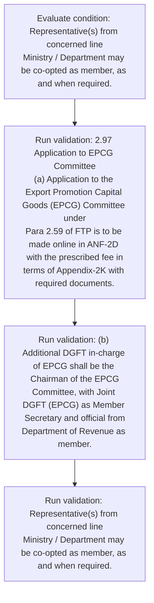
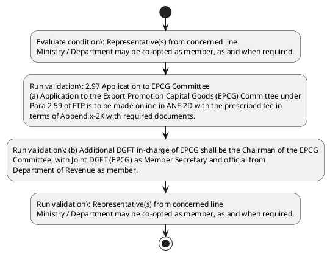

# Chapter 2 / Section 2.97: Application to EPCG Committee

**Chapter Title:** General Provisions Regarding Imports and Exports

**Pages:** 52

**Purpose:** 2.97 Application to EPCG Committee
(a) Application to the Export Promotion Capital Goods (EPCG) Committee under
Para 2.59 of FTP is to be made online in ANF-2D with the prescribed fee in
terms of Appendix-2K with required documents.

**Purpose Thanglish:** Indha Application to EPCG Committee section-la, 2.97 application to EPCG Committee
(a) application to the export Promotion Capital Goods (EPCG) Committee under
Para 2.59 of FTP is to be made online in ANF-2D with the prescribed fee in
terms of Appendix-2K with required documents.

**Summary:** 2.97 Application to EPCG Committee
(a) Application to the Export Promotion Capital Goods (EPCG) Committee under
Para 2.59 of FTP is to be made online in ANF-2D with the prescribed fee in
terms of Appendix-2K with required documents. (b) Additional DGFT in-charge of EPCG shall be the Chairman of the EPCG
Committee, with Joint DGFT (EPCG) as Member Secretary and official from
Department of Revenue as member. Representative(s) from concerned line
Ministry / Department may be co-opted as member, as and when required.

**Business Meaning:** Application to EPCG Committee governs how DGFT business controls should be applied, validated, and enforced.

**Business Explanation:** Application to EPCG Committee explains the operating rule set that DEKAI should enforce. Key control points include (b) Additional DGFT in-charge of EPCG shall be the Chairman of the EPCG
Committee, with Joint DGFT (EPCG) as Member Secretary and official from
Department of Revenue as member.

**Business Explanation Thanglish:** Indha Application to EPCG Committee section-la, application to EPCG Committee explains the operating rule set that DEKAI should enforce. Key control points include (b) Additional DGFT in-charge of EPCG kandippa be the Chairman of the EPCG
Committee, with Joint DGFT (EPCG) as Member Secretary and official from
Department of Revenue as member.

## Business Logic
- (b) Additional DGFT in-charge of EPCG shall be the Chairman of the EPCG
Committee, with Joint DGFT (EPCG) as Member Secretary and official from
Department of Revenue as member.

## Business Rules
- rule_id=CH2-SEC2_97-R001, rule_description=(b) Additional DGFT in-charge of EPCG shall be the Chairman of the EPCG
Committee, with Joint DGFT (EPCG) as Member Secretary and official from
Department of Revenue as member., trigger=Application to EPCG Committee, condition=Representative(s) from concerned line
Ministry / Department may be co-opted as member, as and when required., validation=2.97 Application to EPCG Committee
(a) Application to the Export Promotion Capital Goods (EPCG) Committee under
Para 2.59 of FTP is to be made online in ANF-2D with the prescribed fee in
terms of Appendix-2K with required documents., action=Manual review required., exception=No explicit exception found in uploaded documents., output=DEKAI should produce a compliance decision for 2.97 - Application to EPCG Committee.

## Conditions
- Representative(s) from concerned line
Ministry / Department may be co-opted as member, as and when required.

## Condition Logic
- id=2.2.97.1, if=Representative(s) from concerned line
Ministry / Department may be co-opted as member, as and when required., then=Route for review, source=Representative(s) from concerned line
Ministry / Department may be co-opted as member, as and when required.

## Validations
- 2.97 Application to EPCG Committee
(a) Application to the Export Promotion Capital Goods (EPCG) Committee under
Para 2.59 of FTP is to be made online in ANF-2D with the prescribed fee in
terms of Appendix-2K with required documents.
- (b) Additional DGFT in-charge of EPCG shall be the Chairman of the EPCG
Committee, with Joint DGFT (EPCG) as Member Secretary and official from
Department of Revenue as member.
- Representative(s) from concerned line
Ministry / Department may be co-opted as member, as and when required.
- 61
2.97 Application to EPCG Committee
(a)
Application to the Export Promotion Capital Goods (EPCG) Committee under
Para 2.59 of FTP is to be made online in ANF-2D with the prescribed fee in
terms of Appendix-2K with required documents.

## Exceptions
- None identified

## Dependencies
- 2.59

## Authorities
- Application to EPCG Committee
- Application to the Export Promotion Capital Goods (EPCG) Committee
- DGFT
- Additional DGFT
- Joint DGFT

## Required Documents
- 2.97 Application to EPCG Committee
(a) Application to the Export Promotion Capital Goods (EPCG) Committee under
Para 2.59 of FTP is to be made online in ANF-2D with the prescribed fee in
terms of Appendix-2K with required documents.
- 61
2.97 Application to EPCG Committee
(a)
Application to the Export Promotion Capital Goods (EPCG) Committee under
Para 2.59 of FTP is to be made online in ANF-2D with the prescribed fee in
terms of Appendix-2K with required documents.

## Timelines
- None identified

## Actions
- None identified

## Workflow
- Evaluate condition: Representative(s) from concerned line
Ministry / Department may be co-opted as member, as and when required.
- Run validation: 2.97 Application to EPCG Committee
(a) Application to the Export Promotion Capital Goods (EPCG) Committee under
Para 2.59 of FTP is to be made online in ANF-2D with the prescribed fee in
terms of Appendix-2K with required documents.
- Run validation: (b) Additional DGFT in-charge of EPCG shall be the Chairman of the EPCG
Committee, with Joint DGFT (EPCG) as Member Secretary and official from
Department of Revenue as member.
- Run validation: Representative(s) from concerned line
Ministry / Department may be co-opted as member, as and when required.

## Workflow ASCII
```text
Application to EPCG Committee
Evaluate condition: Representative(s) from concerned line
Ministry / Department may be co-opted as member, as and when required.
   |
   v
Run validation: 2.97 Application to EPCG Committee
(a) Application to the Export Promotion Capital Goods (EPCG) Committee under
Para 2.59 of FTP is to be made online in ANF-2D with the prescribed fee in
terms of Appendix-2K with required documents.
   |
   v
Run validation: (b) Additional DGFT in-charge of EPCG shall be the Chairman of the EPCG
Committee, with Joint DGFT (EPCG) as Member Secretary and official from
Department of Revenue as member.
   |
   v
Run validation: Representative(s) from concerned line
Ministry / Department may be co-opted as member, as and when required.
```

## Decision Tree
- IF section 2.97 applies THEN proceed with standard DGFT workflow

## Decision Tree ASCII
```text
Application to EPCG Committee Decision
IF section 2.97 applies THEN proceed with standard DGFT workflow
```

## Examples
- User asks to process Application to EPCG Committee; the platform checks conditions, validations, and documents before action.

**Real-world Example:** Example: an importer or exporter invokes Application to EPCG Committee, submits 2.97 Application to EPCG Committee
(a) Application to the Export Promotion Capital Goods (EPCG) Committee under
Para 2.59 of FTP is to be made online in ANF-2D with the prescribed fee in
terms of Appendix-2K with required documents., 61
2.97 Application to EPCG Committee
(a)
Application to the Export Promotion Capital Goods (EPCG) Committee under
Para 2.59 of FTP is to be made online in ANF-2D with the prescribed fee in
terms of Appendix-2K with required documents., and DEKAI uses the extracted rules to follow the application to epcg committee process.

**Real-world Example Thanglish:** Indha Application to EPCG Committee section-la, Example: an importer or exporter invokes application to EPCG Committee, submits 2.97 application to EPCG Committee
(a) application to the export Promotion Capital Goods (EPCG) Committee under
Para 2.59 of FTP is to be made online in ANF-2D with the prescribed fee in
terms of Appendix-2K with required documents., 61
2.97 application to EPCG Committee
(a)
application to the export Promotion Capital Goods (EPCG) Committee under
Para 2.59 of FTP is to be made online in ANF-2D with the prescribed fee in
terms of Appendix-2K with required documents., and DEKAI uses the extracted rules to follow the application to epcg committee process.

## AI Rules
- IF detected context matches section rule THEN enforce: (b) Additional DGFT in-charge of EPCG shall be the Chairman of the EPCG
Committee, with Joint DGFT (EPCG) as Member Secretary and official from
Department of Revenue as member.

## Database Fields
- name=section_code, type=string, required=True, source=parsed_section_heading
- name=section_title, type=string, required=True, source=parsed_section_heading
- name=the_flag, type=boolean, required=False, source=keyword:the
- name=ftp_flag, type=boolean, required=False, source=keyword:FTP
- name=fee_flag, type=boolean, required=False, source=keyword:fee
- name=and_flag, type=boolean, required=False, source=keyword:and
- name=may_flag, type=boolean, required=False, source=keyword:may
- name=epcg_flag, type=boolean, required=False, source=keyword:EPCG
- name=para_flag, type=boolean, required=False, source=keyword:Para
- name=made_flag, type=boolean, required=False, source=keyword:made
- name=document_1_submitted, type=boolean, required=True, source=2.97 Application to EPCG Committee
(a) Application to the Export Promotion Capital Goods (EPCG) Committee under
Para 2.59 of FTP is to be made online in ANF-2D with the prescribed fee in
terms of Appendix-2K with required documents.
- name=document_2_submitted, type=boolean, required=True, source=61
2.97 Application to EPCG Committee
(a)
Application to the Export Promotion Capital Goods (EPCG) Committee under
Para 2.59 of FTP is to be made online in ANF-2D with the prescribed fee in
terms of Appendix-2K with required documents.

## API Requirements
- method=GET, path=/api/dgft/sections/2.97, purpose=Retrieve knowledge payload for section 2.97, query_params=['include=workflow,decision_tree,validations'], response_fields=['section', 'title', 'summary', 'conditions', 'validations', 'exceptions', 'workflow', 'decision_tree']
- method=POST, path=/api/dgft/Application-to-EPCG-Committee/validate, purpose=Validate inputs and documents for Application to EPCG Committee, request_fields=['section_code', 'section_title', 'document_1_submitted', 'document_2_submitted'], response_fields=['status', 'errors', 'warnings', 'next_actions']

## UI Screens
- screen_id=Application_to_EPCG_Committee_overview, name=Application to EPCG Committee Overview, purpose=Show section summary, authority, timeline, and eligibility cues., widgets=['summary_card', 'conditions_table', 'authority_badges', 'timeline_panel']
- screen_id=Application_to_EPCG_Committee_submission, name=Application to EPCG Committee Submission, purpose=Capture applicant data and supporting documents., widgets=['dynamic_form', 'document_uploader', 'validation_panel', 'next_action_footer'], fields=['section_code', 'section_title', 'the_flag', 'ftp_flag', 'fee_flag', 'and_flag', 'may_flag', 'epcg_flag']

## Error Messages
- Validation failed because the section requirements were not fully met.

## FAQ
- question_en=What is the purpose of section 2.97?, answer_en=Application to EPCG Committee explains the operating rule set that DEKAI should enforce. Key control points include (b) Additional DGFT in-charge of EPCG shall be the Chairman of the EPCG
Committee, with Joint DGFT (EPCG) as Member Secretary and official from
Department of Revenue as member., question_thanglish=Indha Application to EPCG Committee section-la, What is the purpose of section 2.97?, answer_thanglish=Indha Application to EPCG Committee section-la, application to EPCG Committee explains the operating rule set that DEKAI should enforce. Key control points include (b) Additional DGFT in-charge of EPCG kandippa be the Chairman of the EPCG
Committee, with Joint DGFT (EPCG) as Member Secretary and official from
Department of Revenue as member.
- question_en=What documents are required under Application to EPCG Committee?, answer_en=2.97 Application to EPCG Committee
(a) Application to the Export Promotion Capital Goods (EPCG) Committee under
Para 2.59 of FTP is to be made online in ANF-2D with the prescribed fee in
terms of Appendix-2K with required documents., 61
2.97 Application to EPCG Committee
(a)
Application to the Export Promotion Capital Goods (EPCG) Committee under
Para 2.59 of FTP is to be made online in ANF-2D with the prescribed fee in
terms of Appendix-2K with required documents., question_thanglish=Indha Application to EPCG Committee section-la, What documents are required under application to EPCG Committee?, answer_thanglish=Indha Application to EPCG Committee section-la, 2.97 application to EPCG Committee
(a) application to the export Promotion Capital Goods (EPCG) Committee under
Para 2.59 of FTP is to be made online in ANF-2D with the prescribed fee in
terms of Appendix-2K with required documents., 61
2.97 application to EPCG Committee
(a)
application to the export Promotion Capital Goods (EPCG) Committee under
Para 2.59 of FTP is to be made online in ANF-2D with the prescribed fee in
terms of Appendix-2K with required documents.
- question_en=Which authority handles Application to EPCG Committee?, answer_en=Application to EPCG Committee, Application to the Export Promotion Capital Goods (EPCG) Committee, DGFT, Additional DGFT, Joint DGFT, question_thanglish=Indha Application to EPCG Committee section-la, Which authority handles application to EPCG Committee?, answer_thanglish=Indha Application to EPCG Committee section-la, application to EPCG Committee, application to the export Promotion Capital Goods (EPCG) Committee, DGFT, Additional DGFT, Joint DGFT

## Questions Users May Ask
- What does Application to EPCG Committee require?
- Which documents are needed for Application to EPCG Committee?
- How does DEKAI validate Application to EPCG Committee requests?

## Expected AI Answers
- Application to EPCG Committee requires the platform to interpret the section text, apply the extracted business rules, and present the correct next action.
- Required documents are inferred from the section text: 2.97 Application to EPCG Committee
(a) Application to the Export Promotion Capital Goods (EPCG) Committee under
Para 2.59 of FTP is to be made online in ANF-2D with the prescribed fee in
terms of Appendix-2K with required documents., 61
2.97 Application to EPCG Committee
(a)
Application to the Export Promotion Capital Goods (EPCG) Committee under
Para 2.59 of FTP is to be made online in ANF-2D with the prescribed fee in
terms of Appendix-2K with required documents.
- DEKAI validates Application to EPCG Committee by checking conditions, required documents, authority references, and exception clauses before recommending an outcome.

## AI Q&A Examples
- question_en=User asks: How do I comply with Application to EPCG Committee?, answer_en=AI answers: DEKAI should evaluate section 2.97, apply the extracted rules, and guide the user through Evaluate condition: Representative(s) from concerned line
Ministry / Department may be co-opted as member, as and when required.., question_thanglish=Indha Application to EPCG Committee section-la, User asks: How do I comply with application to EPCG Committee?, answer_thanglish=Indha Application to EPCG Committee section-la, AI answers: DEKAI should evaluate section 2.97, apply the extracted rules, and guide the user through Evaluate condition: Representative(s) from concerned line
Ministry / Department may be co-opted as member, as and when required..
- question_en=User asks: Which validations apply to Application to EPCG Committee?, answer_en=AI answers: Applicable validations are 2.97 Application to EPCG Committee
(a) Application to the Export Promotion Capital Goods (EPCG) Committee under
Para 2.59 of FTP is to be made online in ANF-2D with the prescribed fee in
terms of Appendix-2K with required documents., (b) Additional DGFT in-charge of EPCG shall be the Chairman of the EPCG
Committee, with Joint DGFT (EPCG) as Member Secretary and official from
Department of Revenue as member., Representative(s) from concerned line
Ministry / Department may be co-opted as member, as and when required., question_thanglish=Indha Application to EPCG Committee section-la, User asks: Which validations apply to application to EPCG Committee?, answer_thanglish=Indha Application to EPCG Committee section-la, AI answers: Applicable validations are 2.97 application to EPCG Committee
(a) application to the export Promotion Capital Goods (EPCG) Committee under
Para 2.59 of FTP is to be made online in ANF-2D with the prescribed fee in
terms of Appendix-2K with required documents., (b) Additional DGFT in-charge of EPCG kandippa be the Chairman of the EPCG
Committee, with Joint DGFT (EPCG) as Member Secretary and official from
Department of Revenue as member., Representative(s) from concerned line
Ministry / Department may be co-opted as member, as and when required.

## DEKAI AI Implementation Notes
- Capture chapter 2, section 2.97, title, and page references as immutable knowledge metadata.
- Bind validations for Application to EPCG Committee into a rule engine keyed by the rule IDs extracted for this section.
- Expose document upload controls for: 2.97 Application to EPCG Committee
(a) Application to the Export Promotion Capital Goods (EPCG) Committee under
Para 2.59 of FTP is to be made online in ANF-2D with the prescribed fee in
terms of Appendix-2K with required documents., 61
2.97 Application to EPCG Committee
(a)
Application to the Export Promotion Capital Goods (EPCG) Committee under
Para 2.59 of FTP is to be made online in ANF-2D with the prescribed fee in
terms of Appendix-2K with required documents..
- Route escalations or approvals to: Application to EPCG Committee, Application to the Export Promotion Capital Goods (EPCG) Committee, DGFT, Additional DGFT.
- Show contextual links to related sections: 2.59.

## DEKAI AI Implementation Notes Thanglish
- Indha Application to EPCG Committee section-la, Capture chapter 2, section 2.97, title, and page references as immutable knowledge metadata.
- Indha Application to EPCG Committee section-la, Bind validations for application to EPCG Committee into a rule engine keyed by the rule IDs extracted for this section.
- Indha Application to EPCG Committee section-la, Expose document upload controls for: 2.97 application to EPCG Committee
(a) application to the export Promotion Capital Goods (EPCG) Committee under
Para 2.59 of FTP is to be made online in ANF-2D with the prescribed fee in
terms of Appendix-2K with required documents., 61
2.97 application to EPCG Committee
(a)
application to the export Promotion Capital Goods (EPCG) Committee under
Para 2.59 of FTP is to be made online in ANF-2D with the prescribed fee in
terms of Appendix-2K with required documents..
- Indha Application to EPCG Committee section-la, Route escalations or approvals to: application to EPCG Committee, application to the export Promotion Capital Goods (EPCG) Committee, DGFT, Additional DGFT.
- Indha Application to EPCG Committee section-la, Show contextual links to related sections: 2.59.

## AI Metadata
- Keywords: the, FTP, fee, and, may, EPCG, Para, made, ANF-, with, DGFT, from, line, when, Goods, under, terms, shall, Joint, Export
- Search Keywords: the, FTP, fee, and, may, EPCG, Para, made, ANF-, with, DGFT, from, line, when, Goods, under, terms, shall, Joint, Export
- Intent: Provide knowledge guidance for Application to EPCG Committee.
- Tags: 2.97, Application to EPCG Committee, business-rule, document-driven, dgft
- Related Sections: 2.59
- Related Chapters: 
- Related Rules: (b) Additional DGFT in-charge of EPCG shall be the Chairman of the EPCG
Committee, with Joint DGFT (EPCG) as Member Secretary and official from
Department of Revenue as member.

## Mermaid


## PlantUML

