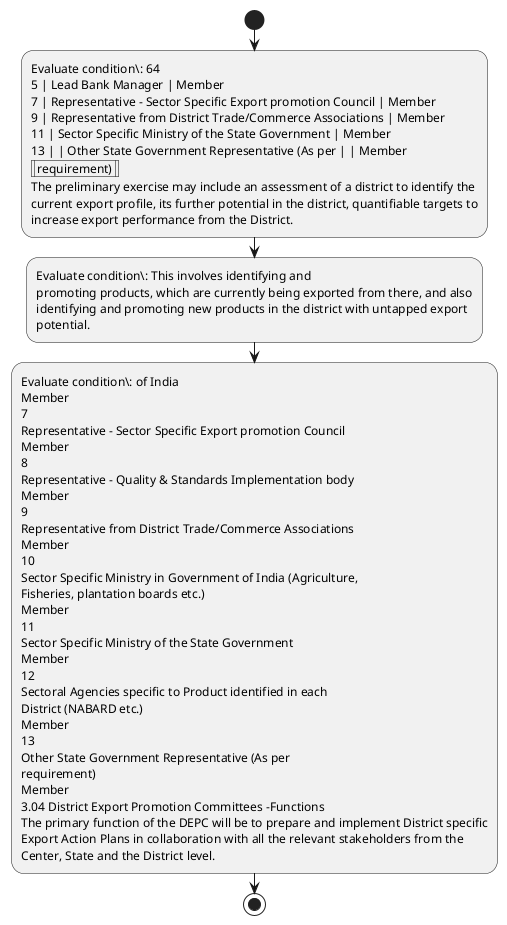

# Chapter 3 / Section 2: Benchmarking baseline export performance of the district, including

**Chapter Title:** Developing Districts as Export Hubs

**Pages:** 3, 4

**Purpose:** 64
5 | Lead Bank Manager | Member
7 | Representative – Sector Specific Export promotion Council | Member
9 | Representative from District Trade/Commerce Associations | Member
11 | Sector Specific Ministry of the State Government | Member
13 | | Other State Government Representative (As per | | Member
| | requirement) | |
The preliminary exercise may include an assessment of a district to identify the
current export profile, its further potential in the district, quantifiable targets to
increase export performance from the District.

**Purpose Thanglish:** Indha Benchmarking baseline export performance of the district, including section-la, 64
5 | Lead Bank Manager | Member
7 | Representative – Sector Specific export promotion Council | Member
9 | Representative from District Trade/Commerce Associations | Member
11 | Sector Specific Ministry of the State Government | Member
13 | | Other State Government Representative (As per | | Member
| | requirement) | |
The preliminary exercise may include an assessment of a district to identify the
current export profile, its further potential in the district, quantifiable targets to
increase export performance from the District.

**Summary:** 2. Benchmarking baseline export performance of the district, including
pg. 64
5 | Lead Bank Manager | Member
7 | Representative – Sector Specific Export promotion Council | Member
9 | Representative from District Trade/Commerce Associations | Member
11 | Sector Specific Ministry of the State Government | Member
13 | | Other State Government Representative (As per | | Member
| | requirement) | |
The preliminary exercise may include an assessment of a district to identify the
current export profile, its further potential in the district, quantifiable targets to
increase export performance from the District.

**Business Meaning:** 2.

**Business Explanation:** 2. Benchmarking baseline export performance of the district, including
pg. 64
5 | Lead Bank Manager | Member
7 | Representative – Sector Specific Export promotion Council | Member
9 | Representative from District Trade/Commerce Associations | Member
11 | Sector Specific Ministry of the State Government | Member
13 | | Other State Government Representative (As per | | Member
| | requirement) | |
The preliminary exercise may include an assessment of a district to identify the
current export profile, its further potential in the district, quantifiable targets to
increase export performance from the District.

**Business Explanation Thanglish:** Indha Benchmarking baseline export performance of the district, including section-la, 2. Benchmarking baseline export performance of the district, including
pg. 64
5 | Lead Bank Manager | Member
7 | Representative – Sector Specific export promotion Council | Member
9 | Representative from District Trade/Commerce Associations | Member
11 | Sector Specific Ministry of the State Government | Member
13 | | Other State Government Representative (As per | | Member
| | requirement) | |
The preliminary exercise may include an assessment of a district to identify the
current export profile, its further potential in the district, quantifiable targets to
increase export performance from the District.

## Business Logic
- None identified

## Business Rules
- rule_id=CH3-SEC2-R001, rule_description=2. Benchmarking baseline export performance of the district, including
pg. 64
5 | Lead Bank Manager | Member
7 | Representative – Sector Specific Export promotion Council | Member
9 | Representative from District Trade/Commerce Associations | Member
11 | Sector Specific Ministry of the State Government | Member
13 | | Other State Government Representative (As per | | Member
| | requirement) | |
The preliminary exercise may include an assessment of a district to identify the
current export profile, its further potential in the district, quantifiable targets to
increase export performance from the District., trigger=Benchmarking baseline export performance of the district, including, condition=64
5 | Lead Bank Manager | Member
7 | Representative – Sector Specific Export promotion Council | Member
9 | Representative from District Trade/Commerce Associations | Member
11 | Sector Specific Ministry of the State Government | Member
13 | | Other State Government Representative (As per | | Member
| | requirement) | |
The preliminary exercise may include an assessment of a district to identify the
current export profile, its further potential in the district, quantifiable targets to
increase export performance from the District., validation=Not explicitly covered in uploaded documents., action=Manual review required., exception=No explicit exception found in uploaded documents., output=DEKAI should produce a compliance decision for 2 - Benchmarking baseline export performance of the district, including.

## Conditions
- 64
5 | Lead Bank Manager | Member
7 | Representative – Sector Specific Export promotion Council | Member
9 | Representative from District Trade/Commerce Associations | Member
11 | Sector Specific Ministry of the State Government | Member
13 | | Other State Government Representative (As per | | Member
| | requirement) | |
The preliminary exercise may include an assessment of a district to identify the
current export profile, its further potential in the district, quantifiable targets to
increase export performance from the District.
- This involves identifying and
promoting products, which are currently being exported from there, and also
identifying and promoting new products in the district with untapped export
potential.
- of India
Member
7
Representative – Sector Specific Export promotion Council
Member
8
Representative – Quality & Standards Implementation body
Member
9
Representative from District Trade/Commerce Associations
Member
10
Sector Specific Ministry in Government of India (Agriculture,
Fisheries, plantation boards etc.)
Member
11
Sector Specific Ministry of the State Government
Member
12
Sectoral Agencies specific to Product identified in each
District (NABARD etc.)
Member
13
Other State Government Representative (As per
requirement)
Member
3.04 District Export Promotion Committees –Functions
The primary function of the DEPC will be to prepare and implement District specific
Export Action Plans in collaboration with all the relevant stakeholders from the
Center, State and the District level.
- The preliminary exercise may include an assessment of a district to identify the
current export profile, its further potential in the district, quantifiable targets to
increase export performance from the District.
- Benchmarking baseline export performance of the district, including
identification of products and services currently exported with export
volumes, destinations etc.

## Condition Logic
- id=3.2.1, if=64
5 | Lead Bank Manager | Member
7 | Representative – Sector Specific Export promotion Council | Member
9 | Representative from District Trade/Commerce Associations | Member
11 | Sector Specific Ministry of the State Government | Member
13 | | Other State Government Representative (As per | | Member
| | requirement) | |
The preliminary exercise may include an assessment of a district to identify the
current export profile, its further potential in the district, quantifiable targets to
increase export performance from the District., then=Route for review, source=64
5 | Lead Bank Manager | Member
7 | Representative – Sector Specific Export promotion Council | Member
9 | Representative from District Trade/Commerce Associations | Member
11 | Sector Specific Ministry of the State Government | Member
13 | | Other State Government Representative (As per | | Member
| | requirement) | |
The preliminary exercise may include an assessment of a district to identify the
current export profile, its further potential in the district, quantifiable targets to
increase export performance from the District.
- id=3.2.2, if=This involves identifying and
promoting products, which are currently being exported from there, and also
identifying and promoting new products in the district with untapped export
potential., then=Route for review, source=This involves identifying and
promoting products, which are currently being exported from there, and also
identifying and promoting new products in the district with untapped export
potential.
- id=3.2.3, if=of India
Member
7
Representative – Sector Specific Export promotion Council
Member
8
Representative – Quality & Standards Implementation body
Member
9
Representative from District Trade/Commerce Associations
Member
10
Sector Specific Ministry in Government of India (Agriculture,
Fisheries, plantation boards etc.)
Member
11
Sector Specific Ministry of the State Government
Member
12
Sectoral Agencies specific to Product identified in each
District (NABARD etc.)
Member
13
Other State Government Representative (As per
requirement)
Member
3.04 District Export Promotion Committees –Functions
The primary function of the DEPC will be to prepare and implement District specific
Export Action Plans in collaboration with all the relevant stakeholders from the
Center, State and the District level., then=Route for review, source=of India
Member
7
Representative – Sector Specific Export promotion Council
Member
8
Representative – Quality & Standards Implementation body
Member
9
Representative from District Trade/Commerce Associations
Member
10
Sector Specific Ministry in Government of India (Agriculture,
Fisheries, plantation boards etc.)
Member
11
Sector Specific Ministry of the State Government
Member
12
Sectoral Agencies specific to Product identified in each
District (NABARD etc.)
Member
13
Other State Government Representative (As per
requirement)
Member
3.04 District Export Promotion Committees –Functions
The primary function of the DEPC will be to prepare and implement District specific
Export Action Plans in collaboration with all the relevant stakeholders from the
Center, State and the District level.
- id=3.2.4, if=The preliminary exercise may include an assessment of a district to identify the
current export profile, its further potential in the district, quantifiable targets to
increase export performance from the District., then=Route for review, source=The preliminary exercise may include an assessment of a district to identify the
current export profile, its further potential in the district, quantifiable targets to
increase export performance from the District.
- id=3.2.5, if=Benchmarking baseline export performance of the district, including
identification of products and services currently exported with export
volumes, destinations etc., then=Route for review, source=Benchmarking baseline export performance of the district, including
identification of products and services currently exported with export
volumes, destinations etc.

## Validations
- None identified

## Exceptions
- None identified

## Dependencies
- 1
- 3
- 4
- 5
- 6
- 7
- 8
- 9
- 10
- 11
- 12
- 13

## Authorities
- State Government
- Sector Specific Ministry of the State Government
- Other State Government
- Nominated member from the State Government
- District Export Promotion Committees
- Sector Specific Ministry in Government
- District Export Promotion Committee
- Export Promotion Committee
- The suggestive functions of the District Export Promotion Committee

## Required Documents
- None identified

## Timelines
- None identified

## Actions
- None identified

## Workflow
- Evaluate condition: 64
5 | Lead Bank Manager | Member
7 | Representative – Sector Specific Export promotion Council | Member
9 | Representative from District Trade/Commerce Associations | Member
11 | Sector Specific Ministry of the State Government | Member
13 | | Other State Government Representative (As per | | Member
| | requirement) | |
The preliminary exercise may include an assessment of a district to identify the
current export profile, its further potential in the district, quantifiable targets to
increase export performance from the District.
- Evaluate condition: This involves identifying and
promoting products, which are currently being exported from there, and also
identifying and promoting new products in the district with untapped export
potential.
- Evaluate condition: of India
Member
7
Representative – Sector Specific Export promotion Council
Member
8
Representative – Quality & Standards Implementation body
Member
9
Representative from District Trade/Commerce Associations
Member
10
Sector Specific Ministry in Government of India (Agriculture,
Fisheries, plantation boards etc.)
Member
11
Sector Specific Ministry of the State Government
Member
12
Sectoral Agencies specific to Product identified in each
District (NABARD etc.)
Member
13
Other State Government Representative (As per
requirement)
Member
3.04 District Export Promotion Committees –Functions
The primary function of the DEPC will be to prepare and implement District specific
Export Action Plans in collaboration with all the relevant stakeholders from the
Center, State and the District level.

## Workflow ASCII
```text
Benchmarking baseline export performance of the district, including
Evaluate condition: 64
5 | Lead Bank Manager | Member
7 | Representative – Sector Specific Export promotion Council | Member
9 | Representative from District Trade/Commerce Associations | Member
11 | Sector Specific Ministry of the State Government | Member
13 | | Other State Government Representative (As per | | Member
| | requirement) | |
The preliminary exercise may include an assessment of a district to identify the
current export profile, its further potential in the district, quantifiable targets to
increase export performance from the District.
   |
   v
Evaluate condition: This involves identifying and
promoting products, which are currently being exported from there, and also
identifying and promoting new products in the district with untapped export
potential.
   |
   v
Evaluate condition: of India
Member
7
Representative – Sector Specific Export promotion Council
Member
8
Representative – Quality & Standards Implementation body
Member
9
Representative from District Trade/Commerce Associations
Member
10
Sector Specific Ministry in Government of India (Agriculture,
Fisheries, plantation boards etc.)
Member
11
Sector Specific Ministry of the State Government
Member
12
Sectoral Agencies specific to Product identified in each
District (NABARD etc.)
Member
13
Other State Government Representative (As per
requirement)
Member
3.04 District Export Promotion Committees –Functions
The primary function of the DEPC will be to prepare and implement District specific
Export Action Plans in collaboration with all the relevant stakeholders from the
Center, State and the District level.
```

## Decision Tree
- IF section 2 applies THEN proceed with standard DGFT workflow

## Decision Tree ASCII
```text
Benchmarking baseline export performance of the district, including Decision
IF section 2 applies THEN proceed with standard DGFT workflow
```

## Examples
- User asks to process Benchmarking baseline export performance of the district, including; the platform checks conditions, validations, and documents before action.

**Real-world Example:** Example: an importer or exporter invokes Benchmarking baseline export performance of the district, including, submits the prescribed DGFT records, and DEKAI uses the extracted rules to follow the benchmarking baseline export performance of the district, including process.

**Real-world Example Thanglish:** Indha Benchmarking baseline export performance of the district, including section-la, Example: an importer or exporter invokes Benchmarking baseline export performance of the district, including, submits the prescribed DGFT records, and DEKAI uses the extracted rules to follow the benchmarking baseline export performance of the district, including process.

## AI Rules
- None identified

## Database Fields
- name=section_code, type=string, required=True, source=parsed_section_heading
- name=section_title, type=string, required=True, source=parsed_section_heading
- name=the_flag, type=boolean, required=False, source=keyword:the
- name=per_flag, type=boolean, required=False, source=keyword:per
- name=may_flag, type=boolean, required=False, source=keyword:may
- name=its_flag, type=boolean, required=False, source=keyword:its
- name=and_flag, type=boolean, required=False, source=keyword:and
- name=are_flag, type=boolean, required=False, source=keyword:are
- name=new_flag, type=boolean, required=False, source=keyword:new
- name=map_flag, type=boolean, required=False, source=keyword:map

## API Requirements
- method=GET, path=/api/dgft/sections/2, purpose=Retrieve knowledge payload for section 2, query_params=['include=workflow,decision_tree,validations'], response_fields=['section', 'title', 'summary', 'conditions', 'validations', 'exceptions', 'workflow', 'decision_tree']
- method=POST, path=/api/dgft/Benchmarking-baseline-export-performance-of-the-district-including/validate, purpose=Validate inputs and documents for Benchmarking baseline export performance of the district, including, request_fields=['section_code', 'section_title'], response_fields=['status', 'errors', 'warnings', 'next_actions']

## UI Screens
- screen_id=Benchmarking_baseline_export_performance_of_the_district_including_overview, name=Benchmarking baseline export performance of the district, including Overview, purpose=Show section summary, authority, timeline, and eligibility cues., widgets=['summary_card', 'conditions_table', 'authority_badges', 'timeline_panel']
- screen_id=Benchmarking_baseline_export_performance_of_the_district_including_submission, name=Benchmarking baseline export performance of the district, including Submission, purpose=Capture applicant data and supporting documents., widgets=['dynamic_form', 'document_uploader', 'validation_panel', 'next_action_footer'], fields=['section_code', 'section_title', 'the_flag', 'per_flag', 'may_flag', 'its_flag', 'and_flag', 'are_flag']

## Error Messages
- Validation failed because the section requirements were not fully met.

## FAQ
- question_en=What is the purpose of section 2?, answer_en=2. Benchmarking baseline export performance of the district, including
pg. 64
5 | Lead Bank Manager | Member
7 | Representative – Sector Specific Export promotion Council | Member
9 | Representative from District Trade/Commerce Associations | Member
11 | Sector Specific Ministry of the State Government | Member
13 | | Other State Government Representative (As per | | Member
| | requirement) | |
The preliminary exercise may include an assessment of a district to identify the
current export profile, its further potential in the district, quantifiable targets to
increase export performance from the District., question_thanglish=Indha Benchmarking baseline export performance of the district, including section-la, What is the purpose of section 2?, answer_thanglish=Indha Benchmarking baseline export performance of the district, including section-la, 2. Benchmarking baseline export performance of the district, including
pg. 64
5 | Lead Bank Manager | Member
7 | Representative – Sector Specific export promotion Council | Member
9 | Representative from District Trade/Commerce Associations | Member
11 | Sector Specific Ministry of the State Government | Member
13 | | Other State Government Representative (As per | | Member
| | requirement) | |
The preliminary exercise may include an assessment of a district to identify the
current export profile, its further potential in the district, quantifiable targets to
increase export performance from the District.
- question_en=What documents are required under Benchmarking baseline export performance of the district, including?, answer_en=Not explicitly covered in uploaded documents., question_thanglish=Indha Benchmarking baseline export performance of the district, including section-la, What documents are required under Benchmarking baseline export performance of the district, including?, answer_thanglish=Indha Benchmarking baseline export performance of the district, including section-la, Not explicitly covered in uploaded documents.
- question_en=Which authority handles Benchmarking baseline export performance of the district, including?, answer_en=State Government, Sector Specific Ministry of the State Government, Other State Government, Nominated member from the State Government, District Export Promotion Committees, Sector Specific Ministry in Government, District Export Promotion Committee, Export Promotion Committee, The suggestive functions of the District Export Promotion Committee, question_thanglish=Indha Benchmarking baseline export performance of the district, including section-la, Which authority handles Benchmarking baseline export performance of the district, including?, answer_thanglish=Indha Benchmarking baseline export performance of the district, including section-la, State Government, Sector Specific Ministry of the State Government, Other State Government, Nominated member from the State Government, District export Promotion Committees, Sector Specific Ministry in Government, District export Promotion Committee, export Promotion Committee, The suggestive functions of the District export Promotion Committee

## Questions Users May Ask
- What does Benchmarking baseline export performance of the district, including require?
- Which documents are needed for Benchmarking baseline export performance of the district, including?
- How does DEKAI validate Benchmarking baseline export performance of the district, including requests?

## Expected AI Answers
- Benchmarking baseline export performance of the district, including requires the platform to interpret the section text, apply the extracted business rules, and present the correct next action.
- Required documents are inferred from the section text: no explicit documents were detected.
- DEKAI validates Benchmarking baseline export performance of the district, including by checking conditions, required documents, authority references, and exception clauses before recommending an outcome.

## AI Q&A Examples
- question_en=User asks: How do I comply with Benchmarking baseline export performance of the district, including?, answer_en=AI answers: DEKAI should evaluate section 2, apply the extracted rules, and guide the user through Evaluate condition: 64
5 | Lead Bank Manager | Member
7 | Representative – Sector Specific Export promotion Council | Member
9 | Representative from District Trade/Commerce Associations | Member
11 | Sector Specific Ministry of the State Government | Member
13 | | Other State Government Representative (As per | | Member
| | requirement) | |
The preliminary exercise may include an assessment of a district to identify the
current export profile, its further potential in the district, quantifiable targets to
increase export performance from the District.., question_thanglish=Indha Benchmarking baseline export performance of the district, including section-la, User asks: How do I comply with Benchmarking baseline export performance of the district, including?, answer_thanglish=Indha Benchmarking baseline export performance of the district, including section-la, AI answers: DEKAI should evaluate section 2, apply the extracted rules, and guide the user through Evaluate condition: 64
5 | Lead Bank Manager | Member
7 | Representative – Sector Specific export promotion Council | Member
9 | Representative from District Trade/Commerce Associations | Member
11 | Sector Specific Ministry of the State Government | Member
13 | | Other State Government Representative (As per | | Member
| | requirement) | |
The preliminary exercise may include an assessment of a district to identify the
current export profile, its further potential in the district, quantifiable targets to
increase export performance from the District..
- question_en=User asks: Which validations apply to Benchmarking baseline export performance of the district, including?, answer_en=AI answers: Applicable validations are not explicitly covered in the uploaded documents., question_thanglish=Indha Benchmarking baseline export performance of the district, including section-la, User asks: Which validations apply to Benchmarking baseline export performance of the district, including?, answer_thanglish=Indha Benchmarking baseline export performance of the district, including section-la, AI answers: Applicable validations are not explicitly covered in the uploaded documents.

## DEKAI AI Implementation Notes
- Capture chapter 3, section 2, title, and page references as immutable knowledge metadata.
- Bind validations for Benchmarking baseline export performance of the district, including into a rule engine keyed by the rule IDs extracted for this section.
- Route escalations or approvals to: State Government, Sector Specific Ministry of the State Government, Other State Government, Nominated member from the State Government.
- Show contextual links to related sections: 1, 3, 4, 5, 6, 7, 8, 9, 10, 11, 12, 13.

## DEKAI AI Implementation Notes Thanglish
- Indha Benchmarking baseline export performance of the district, including section-la, Capture chapter 3, section 2, title, and page references as immutable knowledge metadata.
- Indha Benchmarking baseline export performance of the district, including section-la, Bind validations for Benchmarking baseline export performance of the district, including into a rule engine keyed by the rule IDs extracted for this section.
- Indha Benchmarking baseline export performance of the district, including section-la, Route escalations or approvals to: State Government, Sector Specific Ministry of the State Government, Other State Government, Nominated member from the State Government.
- Indha Benchmarking baseline export performance of the district, including section-la, Show contextual links to related sections: 1, 3, 4, 5, 6, 7, 8, 9, 10, 11, 12, 13.

## AI Metadata
- Keywords: the, per, may, its, and, are, new, map, for, hub, etc, all, Lead, Bank, from, This, also, with, that, need
- Search Keywords: the, per, may, its, and, are, new, map, for, hub, etc, all, Lead, Bank, from, This, also, with, that, need
- Intent: Provide knowledge guidance for Benchmarking baseline export performance of the district, including.
- Tags: 2, Benchmarking baseline export performance of the district, including, dgft
- Related Sections: 1, 3, 4, 5, 6, 7, 8, 9, 10, 11, 12, 13
- Related Chapters: 
- Related Rules: 

## Mermaid

```mermaid
flowchart TD
    S1["Evaluate condition: 64
5 | Lead Bank Manager | Member
7 | Representative – Sector Specific Export promotion Council | Member
9 | Representative from District Trade/Commerce Associations | Member
11 | Sector Specific Ministry of the State Government | Member
13 | | Other State Government Representative (As per | | Member
| | requirement) | |
The preliminary exercise may include an assessment of a district to identify the
current export profile, its further potential in the district, quantifiable targets to
increase export performance from the District."]
    S2["Evaluate condition: This involves identifying and
promoting products, which are currently being exported from there, and also
identifying and promoting new products in the district with untapped export
potential."]
    S1 --> S2
    S3["Evaluate condition: of India
Member
7
Representative – Sector Specific Export promotion Council
Member
8
Representative – Quality & Standards Implementation body
Member
9
Representative from District Trade/Commerce Associations
Member
10
Sector Specific Ministry in Government of India (Agriculture,
Fisheries, plantation boards etc.)
Member
11
Sector Specific Ministry of the State Government
Member
12
Sectoral Agencies specific to Product identified in each
District (NABARD etc.)
Member
13
Other State Government Representative (As per
requirement)
Member
3.04 District Export Promotion Committees –Functions
The primary function of the DEPC will be to prepare and implement District specific
Export Action Plans in collaboration with all the relevant stakeholders from the
Center, State and the District level."]
    S2 --> S3
```


## PlantUML

