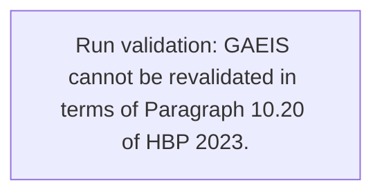
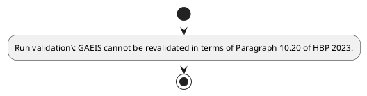

# Chapter 10 / Section 2: GAEIS cannot be revalidated in terms of Paragraph 10.20 of HBP 2023.

**Chapter Title:** SCOMET: Special Chemicals, Organisms, Materials, Equipment and Technologies

**Pages:** 35

**Purpose:** Defines the operational requirements for GAEIS cannot be revalidated in terms of Paragraph 10.20 of HBP 2023..

**Purpose Thanglish:** Indha GAEIS cannot be revalidated in terms of Paragraph 10.20 of HBP 2023. section-la, Defines the operational requirements for GAEIS cannot be revalidated in terms of Paragraph 10.20 of HBP 2023..

**Summary:** 2. GAEIS cannot be revalidated in terms of Paragraph 10.20 of HBP 2023.

**Business Meaning:** 2.

**Business Explanation:** 2. GAEIS cannot be revalidated in terms of Paragraph 10.20 of HBP 2023.

**Business Explanation Thanglish:** Indha GAEIS cannot be revalidated in terms of Paragraph 10.20 of HBP 2023. section-la, 2. GAEIS cannot be revalidated in terms of Paragraph 10.20 of HBP 2023.

## Business Logic
- None identified

## Business Rules
- rule_id=CH10-SEC2-R001, rule_description=2. GAEIS cannot be revalidated in terms of Paragraph 10.20 of HBP 2023., trigger=GAEIS cannot be revalidated in terms of Paragraph 10.20 of HBP 2023., condition=Not explicitly covered in uploaded documents., validation=GAEIS cannot be revalidated in terms of Paragraph 10.20 of HBP 2023., action=Manual review required., exception=No explicit exception found in uploaded documents., output=DEKAI should produce a compliance decision for 2 - GAEIS cannot be revalidated in terms of Paragraph 10.20 of HBP 2023..

## Conditions
- None identified

## Condition Logic
- None identified

## Validations
- GAEIS cannot be revalidated in terms of Paragraph 10.20 of HBP 2023.

## Exceptions
- None identified

## Dependencies
- 10.20
- 1
- 3

## Authorities
- None identified

## Required Documents
- None identified

## Timelines
- None identified

## Actions
- None identified

## Workflow
- Run validation: GAEIS cannot be revalidated in terms of Paragraph 10.20 of HBP 2023.

## Workflow ASCII
```text
GAEIS cannot be revalidated in terms of Paragraph 10.20 of HBP 2023.
Run validation: GAEIS cannot be revalidated in terms of Paragraph 10.20 of HBP 2023.
```

## Decision Tree
- IF section 2 applies THEN proceed with standard DGFT workflow

## Decision Tree ASCII
```text
GAEIS cannot be revalidated in terms of Paragraph 10.20 of HBP 2023. Decision
IF section 2 applies THEN proceed with standard DGFT workflow
```

## Examples
- User asks to process GAEIS cannot be revalidated in terms of Paragraph 10.20 of HBP 2023.; the platform checks conditions, validations, and documents before action.

**Real-world Example:** Example: an importer or exporter invokes GAEIS cannot be revalidated in terms of Paragraph 10.20 of HBP 2023., submits the prescribed DGFT records, and DEKAI uses the extracted rules to follow the gaeis cannot be revalidated in terms of paragraph 10.20 of hbp 2023. process.

**Real-world Example Thanglish:** Indha GAEIS cannot be revalidated in terms of Paragraph 10.20 of HBP 2023. section-la, Example: an importer or exporter invokes GAEIS cannot be revalidated in terms of Paragraph 10.20 of HBP 2023., submits the prescribed DGFT records, and DEKAI uses the extracted rules to follow the gaeis cannot be revalidated in terms of paragraph 10.20 of hbp 2023. process.

## AI Rules
- None identified

## Database Fields
- name=section_code, type=string, required=True, source=parsed_section_heading
- name=section_title, type=string, required=True, source=parsed_section_heading
- name=hbp_flag, type=boolean, required=False, source=keyword:HBP
- name=gaeis_flag, type=boolean, required=False, source=keyword:GAEIS
- name=terms_flag, type=boolean, required=False, source=keyword:terms
- name=cannot_flag, type=boolean, required=False, source=keyword:cannot
- name=paragraph_flag, type=boolean, required=False, source=keyword:Paragraph
- name=revalidated_flag, type=boolean, required=False, source=keyword:revalidated

## API Requirements
- method=GET, path=/api/dgft/sections/2, purpose=Retrieve knowledge payload for section 2, query_params=['include=workflow,decision_tree,validations'], response_fields=['section', 'title', 'summary', 'conditions', 'validations', 'exceptions', 'workflow', 'decision_tree']
- method=POST, path=/api/dgft/GAEIS-cannot-be-revalidated-in-terms-of-Paragraph-10-20-of-HBP-2023/validate, purpose=Validate inputs and documents for GAEIS cannot be revalidated in terms of Paragraph 10.20 of HBP 2023., request_fields=['section_code', 'section_title'], response_fields=['status', 'errors', 'warnings', 'next_actions']

## UI Screens
- screen_id=GAEIS_cannot_be_revalidated_in_terms_of_Paragraph_10_20_of_HBP_2023_overview, name=GAEIS cannot be revalidated in terms of Paragraph 10.20 of HBP 2023. Overview, purpose=Show section summary, authority, timeline, and eligibility cues., widgets=['summary_card', 'conditions_table', 'authority_badges', 'timeline_panel']
- screen_id=GAEIS_cannot_be_revalidated_in_terms_of_Paragraph_10_20_of_HBP_2023_submission, name=GAEIS cannot be revalidated in terms of Paragraph 10.20 of HBP 2023. Submission, purpose=Capture applicant data and supporting documents., widgets=['dynamic_form', 'document_uploader', 'validation_panel', 'next_action_footer'], fields=['section_code', 'section_title', 'hbp_flag', 'gaeis_flag', 'terms_flag', 'cannot_flag', 'paragraph_flag', 'revalidated_flag']

## Error Messages
- Validation failed because the section requirements were not fully met.

## FAQ
- question_en=What is the purpose of section 2?, answer_en=2. GAEIS cannot be revalidated in terms of Paragraph 10.20 of HBP 2023., question_thanglish=Indha GAEIS cannot be revalidated in terms of Paragraph 10.20 of HBP 2023. section-la, What is the purpose of section 2?, answer_thanglish=Indha GAEIS cannot be revalidated in terms of Paragraph 10.20 of HBP 2023. section-la, 2. GAEIS cannot be revalidated in terms of Paragraph 10.20 of HBP 2023.
- question_en=What documents are required under GAEIS cannot be revalidated in terms of Paragraph 10.20 of HBP 2023.?, answer_en=Not explicitly covered in uploaded documents., question_thanglish=Indha GAEIS cannot be revalidated in terms of Paragraph 10.20 of HBP 2023. section-la, What documents are required under GAEIS cannot be revalidated in terms of Paragraph 10.20 of HBP 2023.?, answer_thanglish=Indha GAEIS cannot be revalidated in terms of Paragraph 10.20 of HBP 2023. section-la, Not explicitly covered in uploaded documents.
- question_en=Which authority handles GAEIS cannot be revalidated in terms of Paragraph 10.20 of HBP 2023.?, answer_en=Not explicitly covered in uploaded documents., question_thanglish=Indha GAEIS cannot be revalidated in terms of Paragraph 10.20 of HBP 2023. section-la, Which authority handles GAEIS cannot be revalidated in terms of Paragraph 10.20 of HBP 2023.?, answer_thanglish=Indha GAEIS cannot be revalidated in terms of Paragraph 10.20 of HBP 2023. section-la, Not explicitly covered in uploaded documents.

## Questions Users May Ask
- What does GAEIS cannot be revalidated in terms of Paragraph 10.20 of HBP 2023. require?
- Which documents are needed for GAEIS cannot be revalidated in terms of Paragraph 10.20 of HBP 2023.?
- How does DEKAI validate GAEIS cannot be revalidated in terms of Paragraph 10.20 of HBP 2023. requests?

## Expected AI Answers
- GAEIS cannot be revalidated in terms of Paragraph 10.20 of HBP 2023. requires the platform to interpret the section text, apply the extracted business rules, and present the correct next action.
- Required documents are inferred from the section text: no explicit documents were detected.
- DEKAI validates GAEIS cannot be revalidated in terms of Paragraph 10.20 of HBP 2023. by checking conditions, required documents, authority references, and exception clauses before recommending an outcome.

## AI Q&A Examples
- question_en=User asks: How do I comply with GAEIS cannot be revalidated in terms of Paragraph 10.20 of HBP 2023.?, answer_en=AI answers: DEKAI should evaluate section 2, apply the extracted rules, and guide the user through Run validation: GAEIS cannot be revalidated in terms of Paragraph 10.20 of HBP 2023.., question_thanglish=Indha GAEIS cannot be revalidated in terms of Paragraph 10.20 of HBP 2023. section-la, User asks: How do I comply with GAEIS cannot be revalidated in terms of Paragraph 10.20 of HBP 2023.?, answer_thanglish=Indha GAEIS cannot be revalidated in terms of Paragraph 10.20 of HBP 2023. section-la, AI answers: DEKAI should evaluate section 2, apply the extracted rules, and guide the user through Run validation: GAEIS cannot be revalidated in terms of Paragraph 10.20 of HBP 2023..
- question_en=User asks: Which validations apply to GAEIS cannot be revalidated in terms of Paragraph 10.20 of HBP 2023.?, answer_en=AI answers: Applicable validations are GAEIS cannot be revalidated in terms of Paragraph 10.20 of HBP 2023., question_thanglish=Indha GAEIS cannot be revalidated in terms of Paragraph 10.20 of HBP 2023. section-la, User asks: Which validations apply to GAEIS cannot be revalidated in terms of Paragraph 10.20 of HBP 2023.?, answer_thanglish=Indha GAEIS cannot be revalidated in terms of Paragraph 10.20 of HBP 2023. section-la, AI answers: Applicable validations are GAEIS cannot be revalidated in terms of Paragraph 10.20 of HBP 2023.

## DEKAI AI Implementation Notes
- Capture chapter 10, section 2, title, and page references as immutable knowledge metadata.
- Bind validations for GAEIS cannot be revalidated in terms of Paragraph 10.20 of HBP 2023. into a rule engine keyed by the rule IDs extracted for this section.
- Show contextual links to related sections: 1, 3, 10.20.

## DEKAI AI Implementation Notes Thanglish
- Indha GAEIS cannot be revalidated in terms of Paragraph 10.20 of HBP 2023. section-la, Capture chapter 10, section 2, title, and page references as immutable knowledge metadata.
- Indha GAEIS cannot be revalidated in terms of Paragraph 10.20 of HBP 2023. section-la, Bind validations for GAEIS cannot be revalidated in terms of Paragraph 10.20 of HBP 2023. into a rule engine keyed by the rule IDs extracted for this section.
- Indha GAEIS cannot be revalidated in terms of Paragraph 10.20 of HBP 2023. section-la, Show contextual links to related sections: 1, 3, 10.20.

## AI Metadata
- Keywords: HBP, GAEIS, terms, cannot, Paragraph, revalidated
- Search Keywords: HBP, GAEIS, terms, cannot, Paragraph, revalidated
- Intent: Provide knowledge guidance for GAEIS cannot be revalidated in terms of Paragraph 10.20 of HBP 2023..
- Tags: 2, GAEIS cannot be revalidated in terms of Paragraph 10.20 of HBP 2023., dgft
- Related Sections: 1, 3, 10.20
- Related Chapters: 
- Related Rules: 

## Mermaid


## PlantUML

