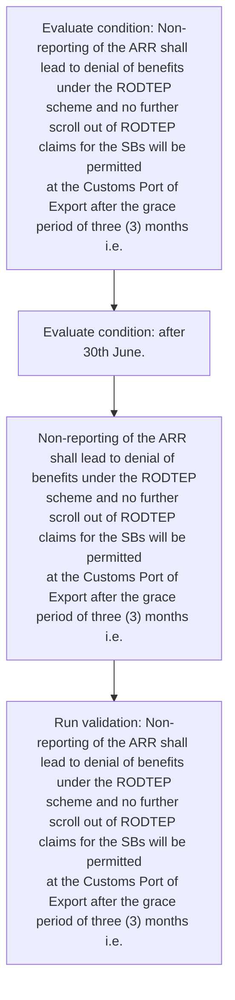
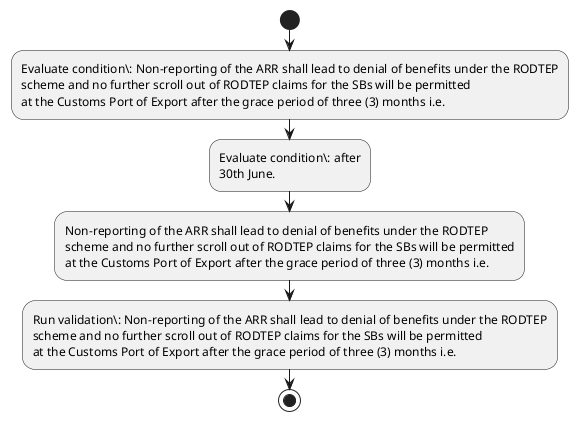

# Chapter 4 / Section 2: Non-reporting of the ARR shall lead to denial of benefits under the RODTEP

**Chapter Title:** Duty Exemption / Remission Schemes

**Pages:** 55

**Purpose:** Non-reporting of the ARR shall lead to denial of benefits under the RODTEP
scheme and no further scroll out of RODTEP claims for the SBs will be permitted
at the Customs Port of Export after the grace period of three (3) months i.e.

**Purpose Thanglish:** Indha Non-reporting of the ARR shall lead to denial of benefits under the RODTEP section-la, Non-reporting of the ARR kandippa lead to denial of benefits under the RODTEP
scheme and no further scroll out of RODTEP claims for the SBs will be permitted
at the Customs Port of export after the grace period of three (3) months i.e.

**Summary:** 2. Non-reporting of the ARR shall lead to denial of benefits under the RODTEP
scheme and no further scroll out of RODTEP claims for the SBs will be permitted
at the Customs Port of Export after the grace period of three (3) months i.e. after
30th June.

**Business Meaning:** Non-reporting of the ARR shall lead to denial of benefits under the RODTEP governs how DGFT business controls should be applied, validated, and enforced.

**Business Explanation:** Non-reporting of the ARR shall lead to denial of benefits under the RODTEP explains the operating rule set that DEKAI should enforce. Key control points include Non-reporting of the ARR shall lead to denial of benefits under the RODTEP
scheme and no further scroll out of RODTEP claims for the SBs will be permitted
at the Customs Port of Export after the grace period of three (3) months i.e. The section also drives actions such as Non-reporting of the ARR shall lead to denial of benefits under the RODTEP
scheme and no further scroll out of RODTEP claims for the SBs will be permitted
at the Customs Port of Export after the grace period of three (3) months i.e..

**Business Explanation Thanglish:** Indha Non-reporting of the ARR shall lead to denial of benefits under the RODTEP section-la, Non-reporting of the ARR kandippa lead to denial of benefits under the RODTEP explains the operating rule set that DEKAI should enforce. Key control points include Non-reporting of the ARR kandippa lead to denial of benefits under the RODTEP
scheme and no further scroll out of RODTEP claims for the SBs will be permitted
at the Customs Port of export after the grace period of three (3) months i.e. The section also drives actions such as Non-reporting of the ARR kandippa lead to denial of benefits under the RODTEP
scheme and no further scroll out of RODTEP claims for the SBs will be permitted
at the Customs Port of export after the grace period of three (3) months i.e..

## Business Logic
- Non-reporting of the ARR shall lead to denial of benefits under the RODTEP
scheme and no further scroll out of RODTEP claims for the SBs will be permitted
at the Customs Port of Export after the grace period of three (3) months i.e.

## Business Rules
- rule_id=CH4-SEC2-R001, rule_description=Non-reporting of the ARR shall lead to denial of benefits under the RODTEP
scheme and no further scroll out of RODTEP claims for the SBs will be permitted
at the Customs Port of Export after the grace period of three (3) months i.e., trigger=Non-reporting of the ARR shall lead to denial of benefits under the RODTEP, condition=Non-reporting of the ARR shall lead to denial of benefits under the RODTEP
scheme and no further scroll out of RODTEP claims for the SBs will be permitted
at the Customs Port of Export after the grace period of three (3) months i.e., validation=Non-reporting of the ARR shall lead to denial of benefits under the RODTEP
scheme and no further scroll out of RODTEP claims for the SBs will be permitted
at the Customs Port of Export after the grace period of three (3) months i.e., action=Non-reporting of the ARR shall lead to denial of benefits under the RODTEP
scheme and no further scroll out of RODTEP claims for the SBs will be permitted
at the Customs Port of Export after the grace period of three (3) months i.e., exception=No explicit exception found in uploaded documents., output=DEKAI should produce a compliance decision for 2 - Non-reporting of the ARR shall lead to denial of benefits under the RODTEP.

## Conditions
- Non-reporting of the ARR shall lead to denial of benefits under the RODTEP
scheme and no further scroll out of RODTEP claims for the SBs will be permitted
at the Customs Port of Export after the grace period of three (3) months i.e.
- after
30th June.

## Condition Logic
- id=4.2.1, if=Non-reporting of the ARR shall lead to denial of benefits under the RODTEP
scheme and no further scroll out of RODTEP claims for the SBs will be permitted
at the Customs Port of Export after the grace period of three (3) months i.e., then=Non-reporting of the ARR shall lead to denial of benefits under the RODTEP
scheme and no further scroll out of RODTEP claims for the SBs will be permitted
at the Customs Port of Export after the grace period of three (3) months i.e., source=Non-reporting of the ARR shall lead to denial of benefits under the RODTEP
scheme and no further scroll out of RODTEP claims for the SBs will be permitted
at the Customs Port of Export after the grace period of three (3) months i.e.
- id=4.2.2, if=after
30th June., then=Non-reporting of the ARR shall lead to denial of benefits under the RODTEP
scheme and no further scroll out of RODTEP claims for the SBs will be permitted
at the Customs Port of Export after the grace period of three (3) months i.e., source=after
30th June.

## Validations
- Non-reporting of the ARR shall lead to denial of benefits under the RODTEP
scheme and no further scroll out of RODTEP claims for the SBs will be permitted
at the Customs Port of Export after the grace period of three (3) months i.e.

## Exceptions
- None identified

## Dependencies
- 3

## Authorities
- Customs

## Required Documents
- None identified

## Timelines
- Non-reporting of the ARR shall lead to denial of benefits under the RODTEP
scheme and no further scroll out of RODTEP claims for the SBs will be permitted
at the Customs Port of Export after the grace period of three (3) months i.e.
- after
30th June.

## Actions
- Non-reporting of the ARR shall lead to denial of benefits under the RODTEP
scheme and no further scroll out of RODTEP claims for the SBs will be permitted
at the Customs Port of Export after the grace period of three (3) months i.e.

## Workflow
- Evaluate condition: Non-reporting of the ARR shall lead to denial of benefits under the RODTEP
scheme and no further scroll out of RODTEP claims for the SBs will be permitted
at the Customs Port of Export after the grace period of three (3) months i.e.
- Evaluate condition: after
30th June.
- Non-reporting of the ARR shall lead to denial of benefits under the RODTEP
scheme and no further scroll out of RODTEP claims for the SBs will be permitted
at the Customs Port of Export after the grace period of three (3) months i.e.
- Run validation: Non-reporting of the ARR shall lead to denial of benefits under the RODTEP
scheme and no further scroll out of RODTEP claims for the SBs will be permitted
at the Customs Port of Export after the grace period of three (3) months i.e.

## Workflow ASCII
```text
Non-reporting of the ARR shall lead to denial of benefits under the RODTEP
Evaluate condition: Non-reporting of the ARR shall lead to denial of benefits under the RODTEP
scheme and no further scroll out of RODTEP claims for the SBs will be permitted
at the Customs Port of Export after the grace period of three (3) months i.e.
   |
   v
Evaluate condition: after
30th June.
   |
   v
Non-reporting of the ARR shall lead to denial of benefits under the RODTEP
scheme and no further scroll out of RODTEP claims for the SBs will be permitted
at the Customs Port of Export after the grace period of three (3) months i.e.
   |
   v
Run validation: Non-reporting of the ARR shall lead to denial of benefits under the RODTEP
scheme and no further scroll out of RODTEP claims for the SBs will be permitted
at the Customs Port of Export after the grace period of three (3) months i.e.
```

## Decision Tree
- IF Non-reporting of the ARR shall lead to denial of benefits under the RODTEP
scheme and no further scroll out of RODTEP claims for the SBs will be permitted
at the Customs Port of Export after the grace period of three (3) months i.e. THEN Non-reporting of the ARR shall lead to denial of benefits under the RODTEP
scheme and no further scroll out of RODTEP claims for the SBs will be permitted
at the Customs Port of Export after the grace period of three (3) months i.e.
- IF after
30th June. THEN Non-reporting of the ARR shall lead to denial of benefits under the RODTEP
scheme and no further scroll out of RODTEP claims for the SBs will be permitted
at the Customs Port of Export after the grace period of three (3) months i.e.

## Decision Tree ASCII
```text
Non-reporting of the ARR shall lead to denial of benefits under the RODTEP Decision
IF Non-reporting of the ARR shall lead to denial of benefits under the RODTEP
scheme and no further scroll out of RODTEP claims for the SBs will be permitted
at the Customs Port of Export after the grace period of three (3) months i.e. THEN Non-reporting of the ARR shall lead to denial of benefits under the RODTEP
scheme and no further scroll out of RODTEP claims for the SBs will be permitted
at the Customs Port of Export after the grace period of three (3) months i.e.
   |
   v
IF after
30th June. THEN Non-reporting of the ARR shall lead to denial of benefits under the RODTEP
scheme and no further scroll out of RODTEP claims for the SBs will be permitted
at the Customs Port of Export after the grace period of three (3) months i.e.
```

## Examples
- User asks to process Non-reporting of the ARR shall lead to denial of benefits under the RODTEP; the platform checks conditions, validations, and documents before action.

**Real-world Example:** Example: an importer or exporter invokes Non-reporting of the ARR shall lead to denial of benefits under the RODTEP, submits the prescribed DGFT records, and DEKAI uses the extracted rules to non-reporting of the arr shall lead to denial of benefits under the rodtep
scheme and no further scroll out of rodtep claims for the sbs will be permitted
at the customs port of export after the grace period of three (3) months i.e..

**Real-world Example Thanglish:** Indha Non-reporting of the ARR shall lead to denial of benefits under the RODTEP section-la, Example: an importer or exporter invokes Non-reporting of the ARR kandippa lead to denial of benefits under the RODTEP, submits the prescribed DGFT records, and DEKAI uses the extracted rules to non-reporting of the arr kandippa lead to denial of benefits under the rodtep
scheme and no further scroll out of rodtep claims for the sbs will be permitted
at the customs port of export after the grace period of three (3) months i.e..

## AI Rules
- IF detected context matches section rule THEN enforce: Non-reporting of the ARR shall lead to denial of benefits under the RODTEP
scheme and no further scroll out of RODTEP claims for the SBs will be permitted
at the Customs Port of Export after the grace period of three (3) months i.e.
- IF validations pass THEN recommend action: Non-reporting of the ARR shall lead to denial of benefits under the RODTEP
scheme and no further scroll out of RODTEP claims for the SBs will be permitted
at the Customs Port of Export after the grace period of three (3) months i.e.

## Database Fields
- name=section_code, type=string, required=True, source=parsed_section_heading
- name=section_title, type=string, required=True, source=parsed_section_heading
- name=the_flag, type=boolean, required=False, source=keyword:the
- name=arr_flag, type=boolean, required=False, source=keyword:ARR
- name=and_flag, type=boolean, required=False, source=keyword:and
- name=out_flag, type=boolean, required=False, source=keyword:out
- name=for_flag, type=boolean, required=False, source=keyword:for
- name=sbs_flag, type=boolean, required=False, source=keyword:SBs
- name=lead_flag, type=boolean, required=False, source=keyword:lead
- name=will_flag, type=boolean, required=False, source=keyword:will

## API Requirements
- method=GET, path=/api/dgft/sections/2, purpose=Retrieve knowledge payload for section 2, query_params=['include=workflow,decision_tree,validations'], response_fields=['section', 'title', 'summary', 'conditions', 'validations', 'exceptions', 'workflow', 'decision_tree']
- method=POST, path=/api/dgft/Non-reporting-of-the-ARR-shall-lead-to-denial-of-benefits-under-the-RODTEP/validate, purpose=Validate inputs and documents for Non-reporting of the ARR shall lead to denial of benefits under the RODTEP, request_fields=['section_code', 'section_title'], response_fields=['status', 'errors', 'warnings', 'next_actions']
- method=POST, path=/api/dgft/Non-reporting-of-the-ARR-shall-lead-to-denial-of-benefits-under-the-RODTEP/execute, purpose=Trigger business action for Non-reporting of the ARR shall lead to denial of benefits under the RODTEP
scheme and no further scroll out of RODTEP claims for the SBs will be permitted
at the Customs Port of Export after the grace period of three (3) months i.e., request_fields=['section_code', 'section_title'], response_fields=['reference_id', 'status', 'authority', 'timeline']

## UI Screens
- screen_id=Non_reporting_of_the_ARR_shall_lead_to_denial_of_benefits_under_the_RODTEP_overview, name=Non-reporting of the ARR shall lead to denial of benefits under the RODTEP Overview, purpose=Show section summary, authority, timeline, and eligibility cues., widgets=['summary_card', 'conditions_table', 'authority_badges', 'timeline_panel']
- screen_id=Non_reporting_of_the_ARR_shall_lead_to_denial_of_benefits_under_the_RODTEP_submission, name=Non-reporting of the ARR shall lead to denial of benefits under the RODTEP Submission, purpose=Capture applicant data and supporting documents., widgets=['dynamic_form', 'document_uploader', 'validation_panel', 'next_action_footer'], fields=['section_code', 'section_title', 'the_flag', 'arr_flag', 'and_flag', 'out_flag', 'for_flag', 'sbs_flag']

## Error Messages
- Validation failed because the section requirements were not fully met.

## FAQ
- question_en=What is the purpose of section 2?, answer_en=Non-reporting of the ARR shall lead to denial of benefits under the RODTEP explains the operating rule set that DEKAI should enforce. Key control points include Non-reporting of the ARR shall lead to denial of benefits under the RODTEP
scheme and no further scroll out of RODTEP claims for the SBs will be permitted
at the Customs Port of Export after the grace period of three (3) months i.e. The section also drives actions such as Non-reporting of the ARR shall lead to denial of benefits under the RODTEP
scheme and no further scroll out of RODTEP claims for the SBs will be permitted
at the Customs Port of Export after the grace period of three (3) months i.e.., question_thanglish=Indha Non-reporting of the ARR shall lead to denial of benefits under the RODTEP section-la, What is the purpose of section 2?, answer_thanglish=Indha Non-reporting of the ARR shall lead to denial of benefits under the RODTEP section-la, Non-reporting of the ARR kandippa lead to denial of benefits under the RODTEP explains the operating rule set that DEKAI should enforce. Key control points include Non-reporting of the ARR kandippa lead to denial of benefits under the RODTEP
scheme and no further scroll out of RODTEP claims for the SBs will be permitted
at the Customs Port of export after the grace period of three (3) months i.e. The section also drives actions such as Non-reporting of the ARR kandippa lead to denial of benefits under the RODTEP
scheme and no further scroll out of RODTEP claims for the SBs will be permitted
at the Customs Port of export after the grace period of three (3) months i.e..
- question_en=What documents are required under Non-reporting of the ARR shall lead to denial of benefits under the RODTEP?, answer_en=Not explicitly covered in uploaded documents., question_thanglish=Indha Non-reporting of the ARR shall lead to denial of benefits under the RODTEP section-la, What documents are required under Non-reporting of the ARR kandippa lead to denial of benefits under the RODTEP?, answer_thanglish=Indha Non-reporting of the ARR shall lead to denial of benefits under the RODTEP section-la, Not explicitly covered in uploaded documents.
- question_en=Which authority handles Non-reporting of the ARR shall lead to denial of benefits under the RODTEP?, answer_en=Customs, question_thanglish=Indha Non-reporting of the ARR shall lead to denial of benefits under the RODTEP section-la, Which authority handles Non-reporting of the ARR kandippa lead to denial of benefits under the RODTEP?, answer_thanglish=Indha Non-reporting of the ARR shall lead to denial of benefits under the RODTEP section-la, Customs

## Questions Users May Ask
- What does Non-reporting of the ARR shall lead to denial of benefits under the RODTEP require?
- Which documents are needed for Non-reporting of the ARR shall lead to denial of benefits under the RODTEP?
- How does DEKAI validate Non-reporting of the ARR shall lead to denial of benefits under the RODTEP requests?
- What action should be taken for Non-reporting of the ARR shall lead to denial of benefits under the RODTEP?

## Expected AI Answers
- Non-reporting of the ARR shall lead to denial of benefits under the RODTEP requires the platform to interpret the section text, apply the extracted business rules, and present the correct next action.
- Required documents are inferred from the section text: no explicit documents were detected.
- DEKAI validates Non-reporting of the ARR shall lead to denial of benefits under the RODTEP by checking conditions, required documents, authority references, and exception clauses before recommending an outcome.
- The primary extracted action is: Non-reporting of the ARR shall lead to denial of benefits under the RODTEP
scheme and no further scroll out of RODTEP claims for the SBs will be permitted
at the Customs Port of Export after the grace period of three (3) months i.e.

## AI Q&A Examples
- question_en=User asks: How do I comply with Non-reporting of the ARR shall lead to denial of benefits under the RODTEP?, answer_en=AI answers: DEKAI should evaluate section 2, apply the extracted rules, and guide the user through Evaluate condition: Non-reporting of the ARR shall lead to denial of benefits under the RODTEP
scheme and no further scroll out of RODTEP claims for the SBs will be permitted
at the Customs Port of Export after the grace period of three (3) months i.e.., question_thanglish=Indha Non-reporting of the ARR shall lead to denial of benefits under the RODTEP section-la, User asks: How do I comply with Non-reporting of the ARR kandippa lead to denial of benefits under the RODTEP?, answer_thanglish=Indha Non-reporting of the ARR shall lead to denial of benefits under the RODTEP section-la, AI answers: DEKAI should evaluate section 2, apply the extracted rules, and guide the user through Evaluate condition: Non-reporting of the ARR kandippa lead to denial of benefits under the RODTEP
scheme and no further scroll out of RODTEP claims for the SBs will be permitted
at the Customs Port of export after the grace period of three (3) months i.e..
- question_en=User asks: Which validations apply to Non-reporting of the ARR shall lead to denial of benefits under the RODTEP?, answer_en=AI answers: Applicable validations are Non-reporting of the ARR shall lead to denial of benefits under the RODTEP
scheme and no further scroll out of RODTEP claims for the SBs will be permitted
at the Customs Port of Export after the grace period of three (3) months i.e., question_thanglish=Indha Non-reporting of the ARR shall lead to denial of benefits under the RODTEP section-la, User asks: Which validations apply to Non-reporting of the ARR kandippa lead to denial of benefits under the RODTEP?, answer_thanglish=Indha Non-reporting of the ARR shall lead to denial of benefits under the RODTEP section-la, AI answers: Applicable validations are Non-reporting of the ARR kandippa lead to denial of benefits under the RODTEP
scheme and no further scroll out of RODTEP claims for the SBs will be permitted
at the Customs Port of export after the grace period of three (3) months i.e.

## DEKAI AI Implementation Notes
- Capture chapter 4, section 2, title, and page references as immutable knowledge metadata.
- Bind validations for Non-reporting of the ARR shall lead to denial of benefits under the RODTEP into a rule engine keyed by the rule IDs extracted for this section.
- Route escalations or approvals to: Customs.
- Show contextual links to related sections: 3.

## DEKAI AI Implementation Notes Thanglish
- Indha Non-reporting of the ARR shall lead to denial of benefits under the RODTEP section-la, Capture chapter 4, section 2, title, and page references as immutable knowledge metadata.
- Indha Non-reporting of the ARR shall lead to denial of benefits under the RODTEP section-la, Bind validations for Non-reporting of the ARR kandippa lead to denial of benefits under the RODTEP into a rule engine keyed by the rule IDs extracted for this section.
- Indha Non-reporting of the ARR shall lead to denial of benefits under the RODTEP section-la, Route escalations or approvals to: Customs.
- Indha Non-reporting of the ARR shall lead to denial of benefits under the RODTEP section-la, Show contextual links to related sections: 3.

## AI Metadata
- Keywords: the, ARR, and, out, for, SBs, lead, will, Port, June, shall, under, after, grace, three, denial, RODTEP, scheme, scroll, claims
- Search Keywords: the, ARR, and, out, for, SBs, lead, will, Port, June, shall, under, after, grace, three, denial, RODTEP, scheme, scroll, claims
- Intent: Support Non-reporting of the ARR shall lead to denial of benefits under the RODTEP processing and compliance validation.
- Tags: 2, Non-reporting of the ARR shall lead to denial of benefits under the RODTEP, business-rule, dgft
- Related Sections: 3
- Related Chapters: 
- Related Rules: Non-reporting of the ARR shall lead to denial of benefits under the RODTEP
scheme and no further scroll out of RODTEP claims for the SBs will be permitted
at the Customs Port of Export after the grace period of three (3) months i.e.

## Mermaid


## PlantUML

